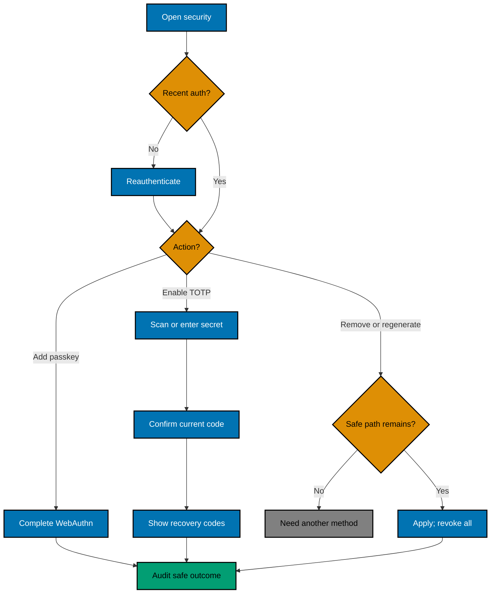
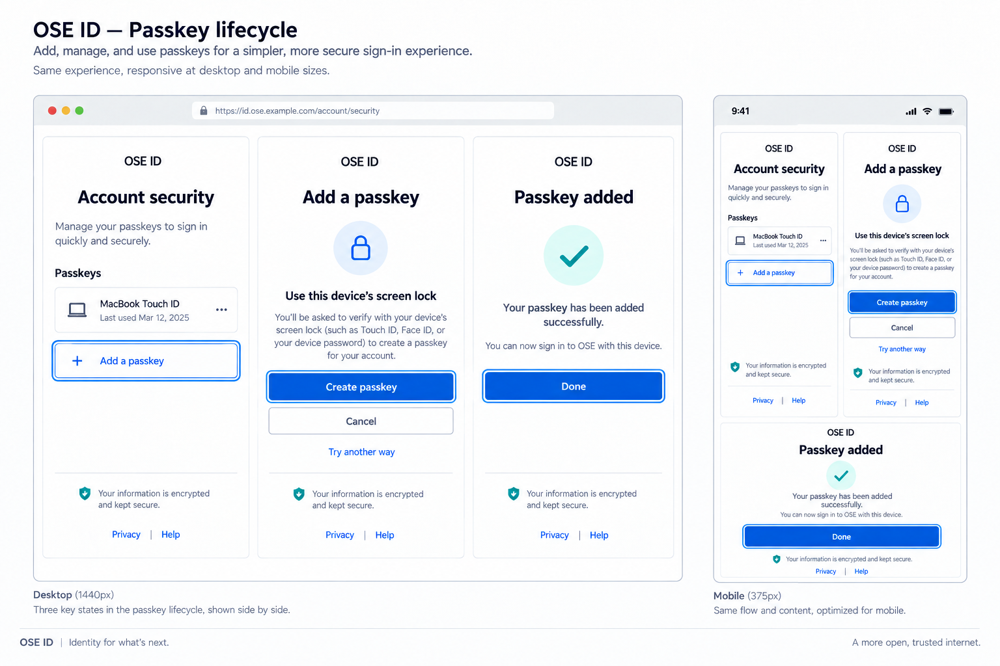
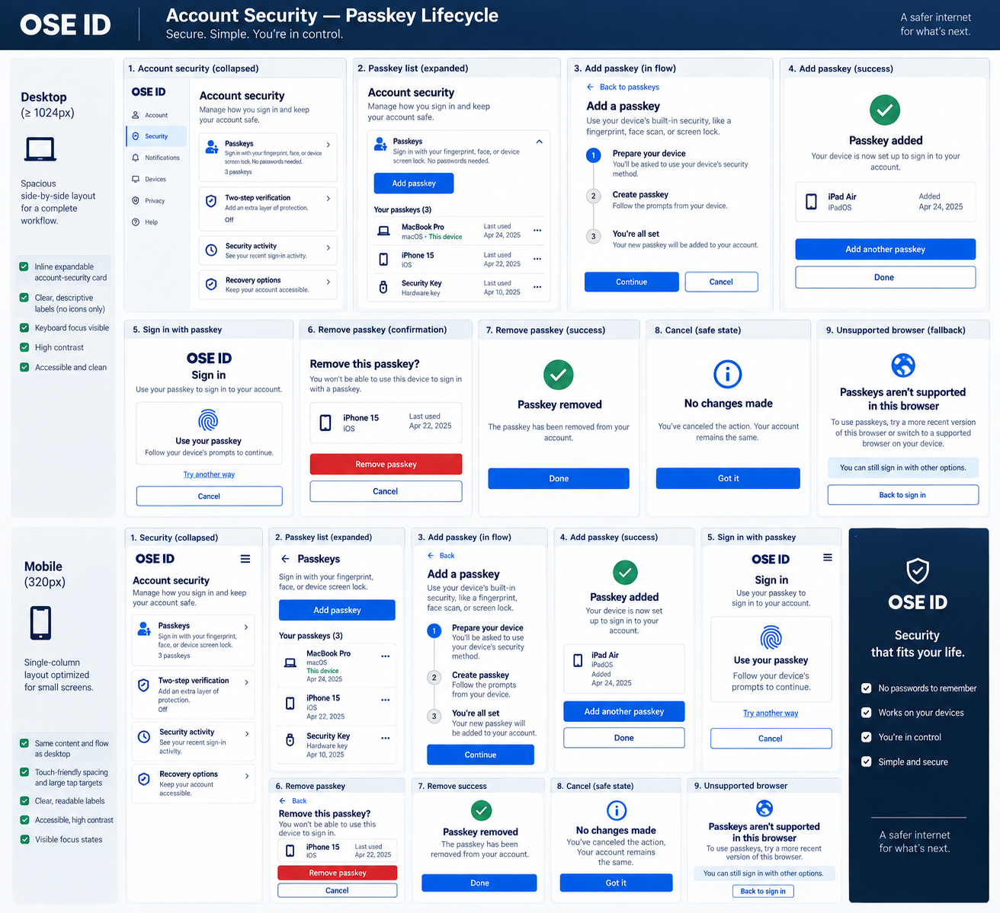
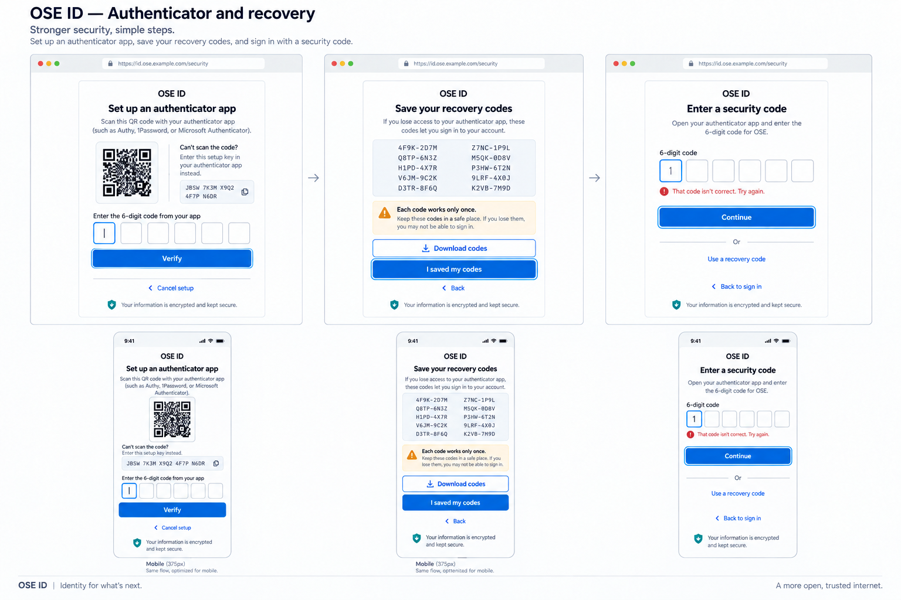

# Product Requirements — OSE ID Init 06

## Product Overview

This milestone extends OSE ID's first-party account security with passkeys, TOTP, and one-time recovery
codes. A passkey is a public-key credential: the user's device/password manager keeps the private key and
signs a server challenge. TOTP is a rotating authenticator-app code used as an optional second factor.
Recovery codes are high-entropy one-time backups, not ordinary passwords.

## Personas and Stories

- As a user, I can add and name more than one passkey after recent authentication.
- As a user, I can sign in with a passkey while retaining a clear accessible email fallback.
- As a user, I can enable TOTP only after proving my authenticator is configured correctly.
- As a user, I can store recovery codes and regenerate them when I suspect exposure.
- As a user, I cannot accidentally remove my final safe access path.
- As an OIDC client, I receive truthful method/freshness claims without credential identifiers.

## Security-Method Flow



## Product Contract

### Passkeys

- OSE ID is the stable relying party. Local/test config pins an RP ID, allowed origins, user-verification
  policy, challenge lifetime, accepted algorithms, and attestation policy.
- Registration requires an authenticated, recently verified session. Store credential ID, public key,
  ownership, counter where meaningful, transports/hints needed for UX, timestamps, and user label—never
  the private key.
- Assertion validates challenge, RP ID hash, exact allowed origin, client-data type, user presence and
  verification policy, signature, credential ownership, and replay/counter behavior.
- Support multiple credentials. Removal requires recent auth and the last-access-path check.
- Conditional UI/autofill is optional and may ship only if current browser evidence and accessible
  fallback pass; a standard “Use a passkey” action is required regardless.

### TOTP and recovery codes

- Setup generates a secret after recent authentication, presents QR and a copyable text/manual key, and
  activates only after one valid current code. Restarting setup invalidates the abandoned secret.
- Validation uses bounded clock skew, rate limiting, constant-time verification where applicable, and
  replay protection. Logs and evidence never contain secret or code.
- Recovery codes are high entropy, shown/downloaded once, stored as nonreversible verifiers, and consumed
  atomically once. Regeneration invalidates every prior unused code.
- Using a recovery code satisfies the defined fallback challenge, triggers visible/audited follow-up,
  and never reveals how many valid codes remain to an unauthenticated caller.
- SMS, security questions, and email-delivered OTP are unsupported.

### Policy and session consequences

- Enroll, remove, disable, regenerate, or change sensitive methods only after a server-enforced recent
  authentication window; the UI cannot set freshness.
- Prevent the final usable sign-in/recovery path from removal. Account-state policy defines what counts
  as usable for password-only, passkey-only, and TOTP-enabled accounts.
- Rotate the current session after security changes and revoke other affected sessions/grants according
  to policy. OIDC claims describe completed authentication (`amr`, `auth_time`, and configured `acr`
  where justified), never the method the client requested.
- Personal and company authorization contexts do not change credential ownership; credentials belong to
  the global person.

### UI and accessibility

- Extend the selected identifier-first pages with a visible passkey alternative and account-security
  cards for passkeys, TOTP, recovery codes, and sessions. Do not add Google or Facebook.
- Explain device/password-manager prompts before invoking them. Cancellation returns focus and preserves
  an alternative path.
- TOTP accepts paste/autofill where supported, labels code grouping semantically, and does not force the
  user to memorize/transcribe without QR/manual/copy assistance.
- Recovery codes can be copied and downloaded accessibly, appear once with a confirmation step, and are
  never re-rendered after navigation.
- Verify 320/768/1280 px, 200% zoom, keyboard, focus, announcements, screen reader, and reduced motion.

## UI Design Funnel

### Grounding and prior art

This plan extends Init 05's selected identifier-first shell and reuses its `IdentityShell`, form,
status, dialog, and account-security patterns. Phase 0 must re-inventory current `libs/web-ui`, OSE
tokens, Storybook, built Init 05 pages, browser WebAuthn affordances, and supported locales before
implementation. Comparable passkey/account-security patterns support a clear standard passkey action,
named credential list, stepwise TOTP setup, and recovery codes shown once; browser-native prompts never
replace an accessible explanation and fallback.

Repository inspection on 2026-09-15 found reusable `Button`, `Input`, `Label`, `Card`, `Alert`,
`Dialog`, `Sheet`, `Badge`, and `TabBar` components under `libs/web-ui/src/components/`, plus OSE tokens
at `libs/web-ui-token/src/ose.css`. It found no shared credential-card, segmented OTP, QR, recovery-code,
or passkey-ceremony component. Reuse the Init 05 feature shell/status/error patterns; keep authenticator
components feature-local unless Phase 0 proves a broader consumer. The current OSE app shell has no
authenticator-management precedent.

External prior art checked on 2026-09-15 includes GOV.UK One Login's “Manage your sign in details” home
and explicit “Sign in another way” fallback, W3C WebAuthn's RP-scoped public-key model, and W3C
accessible-authentication paste/password-manager guidance. Exact official links, short excerpts, and
confidence labels are in `tech-docs/004-decisions-sources-and-file-impact.md`.

### Diverge — low-fidelity alternatives

#### Option A — Security method cards

```text
Mobile: stacked cards / desktop: bounded list
┌────────────────────────────────┐
│ Account security               │
│ Passkeys                       │
│ Laptop passkey    Last used... │
│ [ Add passkey ]  [ Manage ]    │
│                                │
│ Authenticator app              │
│ Not enabled       [ Set up ]   │
│ Recovery codes    [ View state]│
└────────────────────────────────┘
```

Cards keep state and next action together and reflow naturally, but need careful heading semantics so
they do not become a wall of containers.

#### Option B — Guided security checklist

```text
Mobile and desktop vertical steps
┌────────────────────────────────┐
│ Strengthen your account        │
│ 1  Add a passkey      [ Start ]│
│ 2  Set up TOTP        [ Start ]│
│ 3  Save recovery codes         │
│ Existing methods [ Manage ]    │
└────────────────────────────────┘
```

A checklist teaches recommended order, but implies every optional method is required and becomes
awkward after setup is complete.

#### Option C — Dense methods table

```text
Desktop table / mobile labelled rows
┌────────────────────────────────┐
│ Method    Status   Last used   │
│ Passkey   Active   Today       │
│ TOTP      Off      —           │
│ Recovery  8 left   —           │
└────────────────────────────────┘
```

A table scans quickly for many credentials, but hides primary actions, degrades on mobile, and exposes
recovery-code counts more prominently than needed.

#### Passkey add, use, success, cancel, unsupported, and remove states

**Option P-A — Focused ceremony page**

```text
┌──────────────────────────────┐
│ Add a passkey                │
│ Use this device screen lock  │
│ [ Create passkey ]           │
│ [ Cancel ] Try another way   │
└──────────────────────────────┘
```

**Option P-B — Inline method-card ceremony**

```text
┌──────────────────────────────┐
│ Passkeys                     │
│ Laptop passkey      [ ... ]  │
│ Add flow expands inside card │
│ [ Create ] [ Cancel ]        │
└──────────────────────────────┘
```

P-A is selected for add/use/success/cancel/unsupported prompts because the platform transition and
fallback are explicit. P-B keeps context but crowds platform guidance. Removal uses a focused Dialog in
P-A; P-B's inline destructive action is rejected. All faults return to a stable action with email fallback.

#### TOTP setup and challenge states

**Option T-A — Step pages with QR plus manual key**

```text
┌──────────────────────────────┐
│ Set up authenticator app     │
│ [ QR ]  Manual key [ Copy ]  │
│ Code [ _ _ _ _ _ _ ]        │
│ [ Verify ] [ Cancel setup ]  │
└──────────────────────────────┘
```

**Option T-B — Single expandable setup card**

```text
┌──────────────────────────────┐
│ Authenticator app [ Set up ] │
│ QR, key and code expand here │
│ [ Save and verify ]          │
└──────────────────────────────┘
```

T-A is selected for setup, invalid code, expiry, retry, and ordinary challenge because each state has a
stable heading and QR is not the sole path. T-B reduces page changes but combines secret display and
validation errors in a dense card.

#### Recovery display, confirmation, use, regenerate, and refusal states

**Option R-A — Dedicated one-time display**

```text
┌──────────────────────────────┐
│ Save your recovery codes     │
│ [ semantic code list ]       │
│ [ Download ] [ Copy ]        │
│ [ I saved my codes ]         │
└──────────────────────────────┘
```

**Option R-B — Download-first confirmation**

```text
┌──────────────────────────────┐
│ Recovery file is ready       │
│ [ Download encrypted file ]  │
│ Confirm file was saved       │
└──────────────────────────────┘
```

R-A is selected because it supports copy, download, screen readers, and offline transcription without
requiring file handling. R-B reduces on-screen exposure but creates file/password accessibility and
support problems. Recovery challenge and last-path refusal use the same focused panel with one field,
safe error summary, alternate method, and stable back action.

#### Cross-screen loading and backend/platform failure treatment

**Option X-A — Stable page with live in-place status** is selected for pending prompts, validation,
cancel, and retry. **Option X-B — Blocking terminal status page** is reserved for expired challenge,
unavailable shared store, or configuration failure requiring restart. Neither option automatically
reopens a platform prompt.

#### Funnel coverage ledger

Every shipped screen/state below has two named low-fi alternatives and two high-fi finalists. Combined
rows use both the journey alternative and X-A/X-B failure treatment.

| Shipped screen or state                                       | Low-fi alternatives      | High-fi finalists                             |
| ------------------------------------------------------------- | ------------------------ | --------------------------------------------- |
| Account-security method home, enrolled/unenrolled status      | A / B                    | Passkey board A / Passkey board B             |
| Passkey sign-in, add explanation, native prompt               | P-A / P-B                | Passkey board A / Passkey board B             |
| Passkey success, cancel, unsupported, invalid, remove dialog  | P-A / P-B plus X-A / X-B | Passkey board A / Passkey board B             |
| TOTP QR/manual setup, confirmation, ordinary challenge        | T-A / T-B                | Authenticator board A / Authenticator board B |
| TOTP invalid, expired, replay, cancel setup                   | T-A / T-B plus X-A / X-B | Authenticator board A / Authenticator board B |
| Recovery one-time display, copy, download, saved confirmation | R-A / R-B                | Authenticator board A / Authenticator board B |
| Recovery use, invalid/use-again, regenerate, old-set denial   | R-A / R-B plus X-A / X-B | Authenticator board A / Authenticator board B |
| Recent-auth prompt, final-safe-path refusal, alternate method | R-A / R-B plus X-A / X-B | Authenticator board A / Authenticator board B |
| Step-up pending/completed factor and consent continuation     | T-A / T-B plus X-A / X-B | Authenticator board A / Authenticator board B |
| Backend/platform unavailable, expired challenge, retry        | X-A / X-B                | Relevant board A / relevant board B           |

### Narrow — high-fidelity finalists

#### Passkey Finalist A — focused ceremony pages



#### Passkey Finalist B — inline expandable card



Passkey Finalist A wins because a focused platform transition and fallback are clearer and less
crowded. Finalist B remains executable design evidence for every matching state, but its expanded
create/remove region increases simultaneous context and focus-management complexity.

#### Authenticator Finalist A — separate step pages



#### Authenticator Finalist B — expandable single-route card


Authenticator Finalist A wins because separated one-purpose pages reduce simultaneous
secret/error/focus states. Finalist B proves the same coverage in a denser single-route composition but
loses because route history, live-region announcements, and secret-display focus are harder to isolate.

Option C is cut because its density and responsive compromise do not fit a small personal credential
set or the calm Init 05 shell.

### Select — Option A, security method cards

Option A is selected for the persistent account-security home and passkey management. Option B's guided
step structure is retained only inside bounded TOTP/recovery ceremonies, as shown in its high-fidelity
board; it is not the permanent information architecture. Cards preserve a stable management home after
enrollment, keep destructive actions near the named method, and can show recent-auth requirements
without implying every method is mandatory.

### Justify and responsive strategy

| Criterion              | Option A                                    | Option B                           | Decision   |
| ---------------------- | ------------------------------------------- | ---------------------------------- | ---------- |
| Optional methods       | Neutral status/action                       | Implies completion sequence        | A          |
| Ongoing management     | Stable named-method home                    | Setup-first; weak after enrollment | A          |
| Recovery-code exposure | Action without public count                 | Sequence encourages setup          | A          |
| Mobile                 | One labelled card per row                   | Vertical steps fit                 | A narrowly |
| Tablet/desktop         | Bounded list, optional two-column summaries | Bounded checklist                  | A          |

At 320 px, cards and actions stack in one column with DOM order matching reading order. At 768 px,
method summaries may align labels/actions in rows. At 1024 px and above, retain a bounded reading width;
do not create a dense dashboard. Dialogs/wizards remain one-column and preserve focus order. Color and
icons supplement text rather than carrying status.

## Acceptance Criteria

### AC-06-01 — Register and use a passkey

```gherkin
Scenario: A recently authenticated user adds a passkey
  Given a user has a fresh OSE ID session and another usable recovery path
  When the user completes a valid passkey registration ceremony
  Then OSE ID stores only the public credential material for that user
  And account security lists the new passkey by its user-provided label
```

```gherkin
Scenario: A user signs in with a passkey
  Given the user owns an active passkey
  When the authenticator returns a valid assertion for the current OSE ID challenge
  Then OSE ID creates an authenticated session with truthful passkey method evidence
  And the user can continue the existing context and consent journey
```

### AC-06-02 — Reject invalid passkey ceremonies

```gherkin
Scenario Outline: A passkey assertion fails closed
  Given a valid user and registered passkey
  When the assertion has <fault>
  Then OSE ID denies authentication without revealing credential ownership
  And no authenticated session is created

  Examples:
    | fault |
    | an expired or reused challenge |
    | an unapproved origin |
    | the wrong relying-party identifier |
    | a credential owned by another user |
    | an invalid signature or client-data type |
```

### AC-06-03 — Enable and verify TOTP

```gherkin
Scenario: TOTP activates after confirmation
  Given a recently authenticated user started TOTP setup
  When the user submits a valid current code for the presented secret
  Then TOTP becomes active
  And OSE ID presents a new recovery-code set exactly once
```

```gherkin
Scenario: An unconfirmed TOTP secret cannot authenticate
  Given a user abandoned TOTP setup before confirmation
  When a code from that setup is submitted later
  Then OSE ID denies the challenge
  And the abandoned secret is not an active factor
```

### AC-06-04 — Consume and regenerate recovery codes

```gherkin
Scenario: A recovery code works once
  Given a TOTP-enabled user has an unused recovery code
  When the code completes the fallback challenge
  Then OSE ID consumes the code atomically and authenticates the user
  And the same code cannot be used again on another instance
```

```gherkin
Scenario: Regeneration invalidates the old set
  Given a recently authenticated user regenerates recovery codes
  When any unused code from the prior set is submitted
  Then OSE ID denies it
  And only the newly generated set remains usable
```

### AC-06-05 — Prevent account lockout by method removal

```gherkin
Scenario: A user cannot remove the final safe access path
  Given removing one method would leave no usable sign-in and recovery path
  When the user confirms removal after recent authentication
  Then OSE ID refuses the removal with actionable guidance
  And the existing method remains active
```

### AC-06-06 — Require step-up truthfully

```gherkin
Scenario: A TOTP policy requires a second factor
  Given a TOTP-enabled user signed in with password for a step-up client request
  When the user has not completed a current second factor
  Then OSE ID requires TOTP or a recovery code before consent
  And issued authentication claims describe only factors actually completed
```

### AC-06-07 — Continue across instances

```gherkin
Scenario: Another instance completes an authenticator ceremony
  Given instance A created a passkey or TOTP challenge in shared state
  When instance A stops and instance B receives the valid response
  Then instance B completes the ceremony without sticky routing
  And a replay at either instance is denied
```

### AC-06-08 — Preserve accessibility and local-only scope

```gherkin
Scenario Outline: Account hardening has an accessible fallback
  Given the account-security page is shown at <width> CSS pixels
  When the user manages a passkey TOTP and recovery codes with keyboard and assistive technology
  Then every prompt status error and fallback remains understandable and operable
  And no control is clipped or dependent on color alone

  Examples:
    | width |
    | 320 |
    | 768 |
    | 1280 |
```

### AC-06-09 — Retired authenticators remain auditable

```gherkin
Scenario: Retire a superseded authenticator challenge without erasing it
  Given a terminal authenticator challenge has complete audit metadata
  When the authenticator cleanup worker retires it as an identified system actor
  Then ordinary challenge lookup no longer returns it
  And the retained row records matching deletion and update actor and time fields
  And its verifier and protected payload cannot authenticate or resume a ceremony
  And the serving role cannot physically delete it
```

```gherkin
Scenario: Only delivered and eligible sign-in methods are shown
  Given OSE ID is running locally and the signed-out person has an enrolled passkey
  When the person opens the sign-in page
  Then email and passkey sign-in actions are available
  And Google Facebook and ineligible factor actions are absent
```

```gherkin
Scenario: Production mode rejects local authenticator configuration
  Given OSE ID is configured for production with localhost RP origins or test authenticators
  When the backend and web start
  Then they fail before listening on network ports
  And no Google or Facebook provider is registered
```

## Product Risks

- WebAuthn behavior varies by browser/authenticator; Phase 0 pins the supported local matrix and retains
  email fallback rather than promising universal conditional UI.
- Recovery codes improve recoverability but become bearer secrets in user custody; UI copy and storage
  evidence must explain and protect them.
- `amr`/`acr` semantics can be overstated. Tests derive them from actual completed factors and avoid an
  assurance-level claim this local milestone cannot prove.
