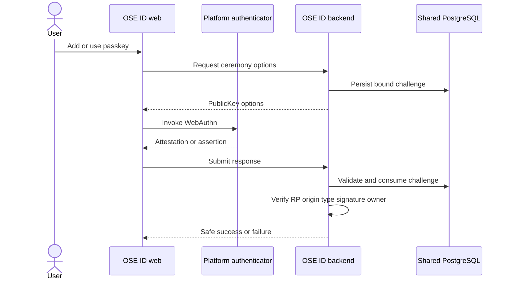

# Authenticator Architecture and Domain

## Domain Objects

### Passkey credential

Persist an opaque credential ID, owning Person ID, public key and algorithm metadata, user-provided
label, transports/hints needed for UX, signature counter where meaningful, creation/last-used timestamps,
and lifecycle status. Never persist the private key, biometric template, authenticator PIN, or a copy of
browser-internal user verification data.

### Authenticator challenge

Persist a high-entropy challenge digest/value according to library needs, purpose (registration or
assertion), Person/session binding when known, RP/origin policy version, expiry, and consumed outcome.
Creation and consumption are shared/atomic. A challenge is not reusable across purpose, person, session,
origin, or instance.

### TOTP enrollment and factor

An enrollment is pending until one current code verifies. Store protected secret material only as long
as authentication requires; isolate protection keys from source control and rotate through explicit
policy. A restarted setup invalidates the abandoned pending enrollment. An active factor records status,
created/changed time, and safe audit metadata—not codes.

### Recovery-code set

Treat each displayed code as a random bearer secret. Persist salted/nonreversible verifiers and a set
generation ID. Atomic consumption marks one verifier used. Regeneration creates a new generation and
invalidates the old generation in one transaction. The UI receives plaintext codes exactly once.

## Application and Adapter Placement

Registration/assertion ceremonies, recent-authentication checks, last-path policy, TOTP enrollment,
recovery consumption, replay handling, and session/grant consequences are application use cases over the
authenticator domain. ASP.NET REST handlers map browser/BFF ceremony payloads but never perform partial
policy in the transport layer. WebAuthn/TOTP libraries, key protection, SqlKata/Npgsql queries, clocks,
and random generation are outbound adapters behind narrow ports; their builder/driver/SDK row types do
not enter application results. Authenticator reads/writes use explicit columns, parameter binding,
transaction/cancellation/timeout boundaries, and generated-SQL/query-plan tests; they do not use EF
change tracking or navigation loading.

Future GraphQL or Model Context Protocol adapters must reuse the same use cases and redacted results.
They do not receive authenticator secrets, recovery plaintext, WebAuthn challenge internals, or a generic
“execute factor action” escape hatch. Consequential MCP mutations would additionally require an explicit
confirmation/threat-model plan. This plan delivers only the specified REST/BFF ceremonies and follows the
Init 01 [transport rules](../../../in-progress/ose-id-init-01-foundation/tech-docs/001-system-boundaries-and-project-topology.md#future-graphql-and-model-context-protocol-adapters).

## Physical PostgreSQL Contract

All new tables live in predecessor-owned schema `ose_id`, use server-generated `uuid` primary keys, UTC
`timestamptz`, and the established Person foreign key. Security rows are global to a Person and have no
company column. Phase 0 may reconcile names with an equivalent predecessor convention; it may not widen
or weaken the following types, constraints, or lifecycle without amending the plan.

Every new table appends the predecessor's six audit columns: `created_at timestamptz NOT NULL DEFAULT
CURRENT_TIMESTAMP`, `created_by varchar(255) NOT NULL DEFAULT 'system'`, `updated_at timestamptz NOT
NULL DEFAULT CURRENT_TIMESTAMP`, `updated_by varchar(255) NOT NULL DEFAULT 'system'`, `deleted_at
timestamptz NULL`, and `deleted_by varchar(255) NULL`. Check
`(deleted_at IS NULL) = (deleted_by IS NULL)`. “Six audit columns” below means this exact contract.

Every table also inherits the OSE ID
[audit/soft-delete profile](../../../in-progress/ose-id-init-01-foundation/tech-docs/007-database-audit-and-soft-delete-contract.md):
named update/delete time checks, `BEFORE DELETE` guard, only `ON DELETE RESTRICT`, no runtime `DELETE`/
`TRUNCATE`/DDL privilege, explicit actor stamping, and `deleted_at IS NULL` on all active queries and
active-row indexes. Globally unique credential/challenge/generation/verifier values remain unique across
tombstones to prevent security-identifier reuse.

### `ose_id.passkey_credentials`

| Column                                        | PostgreSQL type             | Null                        | Contract                                               |
| --------------------------------------------- | --------------------------- | --------------------------- | ------------------------------------------------------ |
| `id`                                          | `uuid`                      | no                          | primary key                                            |
| `person_id`                                   | `uuid`                      | no                          | FK to `ose_id.people(person_id)`, `ON DELETE RESTRICT` |
| `credential_id`                               | `bytea`                     | no                          | authenticator-issued opaque ID; globally unique        |
| `public_key`                                  | `bytea`                     | no                          | verifier material only                                 |
| `public_key_algorithm`                        | `integer`                   | no                          | allowlisted COSE algorithm ID                          |
| `signature_counter`                           | `bigint`                    | no                          | default `0`; check nonnegative                         |
| `transports`                                  | `text[]`                    | no                          | default empty array; allowlisted values on write       |
| `user_verification_initialized`               | `boolean`                   | no                          | default false                                          |
| `backup_eligible` / `backup_state`            | `boolean`                   | no                          | observed WebAuthn flags; default false                 |
| `display_name`                                | `varchar(80)`               | no                          | sanitized user label                                   |
| `status`                                      | `varchar(16)`               | no                          | check: `active`, `disabled`, `removed`                 |
| `last_used_at` / `disabled_at` / `removed_at` | `timestamptz`               | yes                         | lifecycle timestamps consistent with status            |
| `version`                                     | `bigint`                    | no                          | starts at 1; optimistic concurrency                    |
| six audit columns                             | exact common contract above | exact common contract above | lifecycle/audit ownership                              |

Indexes: unique `ux_passkey_credentials_credential_id`; partial
`ix_passkey_credentials_person_active (person_id, created_at)` where `status='active'`; and
`(person_id, status)`. Check constraints require the matching terminal timestamp for disabled/removed
states and forbid both terminal timestamps at once.

### `ose_id.authenticator_challenges`

| Column            | PostgreSQL type             | Null                        | Contract                                                                              |
| ----------------- | --------------------------- | --------------------------- | ------------------------------------------------------------------------------------- |
| `id`              | `uuid`                      | no                          | opaque public challenge transaction ID                                                |
| `person_id`       | `uuid`                      | yes                         | FK to `ose_id.people(person_id)`, `ON DELETE RESTRICT`; required for registration     |
| `session_id`      | `uuid`                      | yes                         | FK to `ose_id.account_sessions(session_id)`, `ON DELETE RESTRICT`; initiating session |
| `purpose`         | `varchar(24)`               | no                          | check: `passkey_register`, `passkey_assert`, `totp_confirm`, `reauth`                 |
| `challenge_hash`  | `bytea`                     | no                          | unique digest of the public challenge                                                 |
| `policy_version`  | `varchar(40)`               | no                          | RP/origin/algorithm policy version                                                    |
| `expires_at`      | `timestamptz`               | no                          | after creation; hard deadline                                                         |
| `consumed_at`     | `timestamptz`               | yes                         | set atomically once                                                                   |
| `outcome`         | `varchar(24)`               | yes                         | allowlisted terminal safe outcome                                                     |
| `attempt_count`   | `integer`                   | no                          | default 0; bounded and nonnegative                                                    |
| `version`         | `bigint`                    | no                          | compare-and-swap guard                                                                |
| six audit columns | exact common contract above | exact common contract above | `created_at` is also challenge creation time                                          |

Indexes: unique `challenge_hash`, `(session_id, expires_at)`, `(person_id, purpose, expires_at)`, and
partial cleanup index `(expires_at) WHERE consumed_at IS NULL`. A terminal outcome requires
`consumed_at`; consumed challenges cannot return to active.

### `ose_id.totp_factors`

| Column                         | PostgreSQL type             | Null                        | Contract                                                    |
| ------------------------------ | --------------------------- | --------------------------- | ----------------------------------------------------------- |
| `id`                           | `uuid`                      | no                          | primary key                                                 |
| `person_id`                    | `uuid`                      | no                          | FK to `ose_id.people(person_id)`, `ON DELETE RESTRICT`      |
| `protected_secret`             | `bytea`                     | no                          | envelope-protected TOTP seed; never plaintext logs/evidence |
| `protection_key_id`            | `varchar(100)`              | no                          | shared protector key reference                              |
| `status`                       | `varchar(16)`               | no                          | check: `pending`, `active`, `disabled`                      |
| `setup_generation`             | `uuid`                      | no                          | changes whenever setup restarts                             |
| `confirmed_at` / `disabled_at` | `timestamptz`               | yes                         | status-consistent timestamps                                |
| `last_accepted_step`           | `bigint`                    | yes                         | replay boundary for a successfully used time step           |
| `failed_attempt_count`         | `integer`                   | no                          | default 0; nonnegative and bounded by policy                |
| `version`                      | `bigint`                    | no                          | optimistic concurrency                                      |
| six audit columns              | exact common contract above | exact common contract above | lifecycle/audit ownership                                   |

Indexes: unique partial `ux_totp_factors_person_live (person_id)` where status is pending or active;
`(person_id, status)`. Active requires `confirmed_at`; pending forbids it; disabled requires
`disabled_at`. Restart replaces/protects a new generation and makes the previous pending seed unusable.

### `ose_id.recovery_code_sets`

| Column                                        | PostgreSQL type             | Null                        | Contract                                               |
| --------------------------------------------- | --------------------------- | --------------------------- | ------------------------------------------------------ |
| `id`                                          | `uuid`                      | no                          | primary key                                            |
| `person_id`                                   | `uuid`                      | no                          | FK to `ose_id.people(person_id)`, `ON DELETE RESTRICT` |
| `generation`                                  | `uuid`                      | no                          | unique set generation                                  |
| `status`                                      | `varchar(16)`               | no                          | check: `active`, `replaced`, `exhausted`, `revoked`    |
| `replaced_at` / `exhausted_at` / `revoked_at` | `timestamptz`               | yes                         | exactly matches terminal state                         |
| `version`                                     | `bigint`                    | no                          | optimistic concurrency                                 |
| six audit columns                             | exact common contract above | exact common contract above | `created_at` orders generations                        |

Indexes: unique `generation`; unique partial `(person_id) WHERE status='active'`; and
`(person_id, created_at)`. Regeneration locks the Person's active set, inserts the new generation, and
marks the prior set replaced in one transaction.

### `ose_id.recovery_code_verifiers`

| Column            | PostgreSQL type             | Null                        | Contract                                                |
| ----------------- | --------------------------- | --------------------------- | ------------------------------------------------------- |
| `id`              | `uuid`                      | no                          | primary key                                             |
| `set_id`          | `uuid`                      | no                          | FK to recovery set, `ON DELETE RESTRICT`                |
| `ordinal`         | `smallint`                  | no                          | positive display ordering within a set                  |
| `verifier`        | `bytea`                     | no                          | salted memory-hard verifier; never reversible plaintext |
| `consumed_at`     | `timestamptz`               | yes                         | atomically set once                                     |
| `version`         | `bigint`                    | no                          | compare-and-swap guard                                  |
| six audit columns | exact common contract above | exact common contract above | lifecycle/audit ownership                               |

Indexes: unique `(set_id, ordinal)` and unique `verifier`; partial `(set_id, ordinal) WHERE
consumed_at IS NULL`. No plaintext code, suffix, or prefix is stored for lookup; verification uses the
bounded active set.

## Named Constraint and Index Manifest

Migration snapshots and database assertions use these exact names; Phase 0 may substitute only an
already-delivered equivalent and must record the equivalence.

| Table                      | Primary/foreign/check constraints                                                                                                                                                                                                                                        | Indexes                                                                                                                                                                             |
| -------------------------- | ------------------------------------------------------------------------------------------------------------------------------------------------------------------------------------------------------------------------------------------------------------------------ | ----------------------------------------------------------------------------------------------------------------------------------------------------------------------------------- |
| `passkey_credentials`      | `pk_passkey_credentials`; `fk_passkey_credentials_people`; `ck_passkey_credentials_algorithm`; `ck_passkey_credentials_counter`; `ck_passkey_credentials_status_lifecycle`                                                                                               | `ux_passkey_credentials_credential_id`; `ix_passkey_credentials_person_active`; `ix_passkey_credentials_person_status`                                                              |
| `authenticator_challenges` | `pk_authenticator_challenges`; `fk_authenticator_challenges_people`; `fk_authenticator_challenges_sessions`; `ck_authenticator_challenges_purpose`; `ck_authenticator_challenges_expiry`; `ck_authenticator_challenges_terminal`; `ck_authenticator_challenges_attempts` | `ux_authenticator_challenges_hash`; `ix_authenticator_challenges_session_expiry`; `ix_authenticator_challenges_person_purpose_expiry`; `ix_authenticator_challenges_pending_expiry` |
| `totp_factors`             | `pk_totp_factors`; `fk_totp_factors_people`; `ck_totp_factors_status`; `ck_totp_factors_status_lifecycle`; `ck_totp_factors_attempts`                                                                                                                                    | `ux_totp_factors_person_live`; `ix_totp_factors_person_status`                                                                                                                      |
| `recovery_code_sets`       | `pk_recovery_code_sets`; `fk_recovery_code_sets_people`; `ck_recovery_code_sets_status`; `ck_recovery_code_sets_status_lifecycle`                                                                                                                                        | `ux_recovery_code_sets_generation`; `ux_recovery_code_sets_person_active`; `ix_recovery_code_sets_person_created`                                                                   |
| `recovery_code_verifiers`  | `pk_recovery_code_verifiers`; `fk_recovery_code_verifiers_sets`; `ck_recovery_code_verifiers_ordinal`                                                                                                                                                                    | `ux_recovery_code_verifiers_set_ordinal`; `ux_recovery_code_verifiers_verifier`; `ix_recovery_code_verifiers_unused`                                                                |

Every table also has `ck_<table>_soft_delete_pair`, `ck_<table>_update_time`,
`ck_<table>_delete_time`, and `trg_<table>_reject_hard_delete`. Migration tests compare this manifest
with `pg_constraint`, `pg_indexes`, `pg_trigger`, and role grants; any missing, renamed, or weaker item
fails the gate. Integration also attempts one real physical delete per table using the serving role.

## Migration, Field Lifecycle, and Rollback

Create the five tables, FKs, checks, and indexes additively in a transaction. Init 05 code ignores them
and therefore stays compatible with the expanded schema. New code treats missing factor rows as “method
not enrolled”; it never backfills a fake credential or recovery set.

Field evolution follows expand→backfill→verify→constrain. Add a future required field nullable or with a
safe default, dual-read/write only when compatibility requires it, backfill in bounded batches, prove
zero invalid rows, then add `NOT NULL`/check/index in a later forward migration. Removal is
disable/tombstone first; a retention/privacy contract may redact non-audit payloads but cannot physically
delete the row while the repository no-hard-delete rule remains in force.

No-loss verification captures pre/post counts and non-secret stable digests for every preexisting table,
FK/check violations, migration history, and lifecycle-state counts. Test empty, seeded, upgraded,
interrupted, and concurrent paths. Rollback deploys Init 05 code against the retained additive schema and
disables the local feature gate; never down-migrate, delete credential/factor rows, regenerate recovery
sets, or discard audit history. Correct schema defects with a forward migration.

## Recent Authentication and Last-Path Policy

Sensitive actions require the current session to contain recent, server-verified authentication within
a configured window. The UI cannot supply `auth_time`. If stale, return a reauthentication transaction
that preserves the intended action only as an opaque reference.

Before removing/disabling a password, passkey, TOTP, or recovery set, evaluate the remaining login and
recovery graph. The exact rule must cover:

- password plus verified recovery email;
- one or more active passkeys;
- TOTP requiring at least one viable first factor plus unused recovery capability;
- suspended/deleted/unverified credentials;
- concurrent removals and session changes.

Use a transaction/concurrency guard so two simultaneous removals cannot each observe the other method
as remaining. The server returns actionable guidance naming the category of alternative, not secret
credential details.

## Passkey Ceremonies

For registration, require authenticated recent session, bind `user.id` to the stable opaque person
handle, exclude existing credential IDs, and choose attestation policy explicitly. Initial local release
prefers no attestation inventory unless a concrete threat requires it.

For assertion, validate challenge, RP ID hash, exact origin, client-data type, flags, signature,
credential owner, and user-verification policy. Counter behavior varies by authenticator; follow current
library/platform guidance and detect credible clone/replay signals without rejecting legitimate
multi-device passkeys through a naive monotonic assumption.

## TOTP Verification

Use the framework's vetted TOTP primitives behind a narrow factor service. Define digits, period,
algorithm, allowed skew, issuer/account label, attempt budget, and replay behavior in policy/config rather
than UI literals. Confirmation must prove one current code before activation. Each challenge records a
safe outcome and rate-limit event without code/secret.

## OIDC Authentication Evidence

Map actual completed methods to an allowlisted `amr` representation and set `auth_time` from the server
session. Do not claim phishing resistance when the session used password plus TOTP. Do not expose
credential ID, passkey label, authenticator model, TOTP state, recovery-code count, or factor enrollment
time to clients. Define `acr` only if the project has a documented assurance policy; otherwise omit it.

Changing methods rotates the current session and revokes other sessions/grants according to the threat
model. A short-lived access token may remain valid offline until expiry; UI copy must not promise instant
revocation everywhere.
