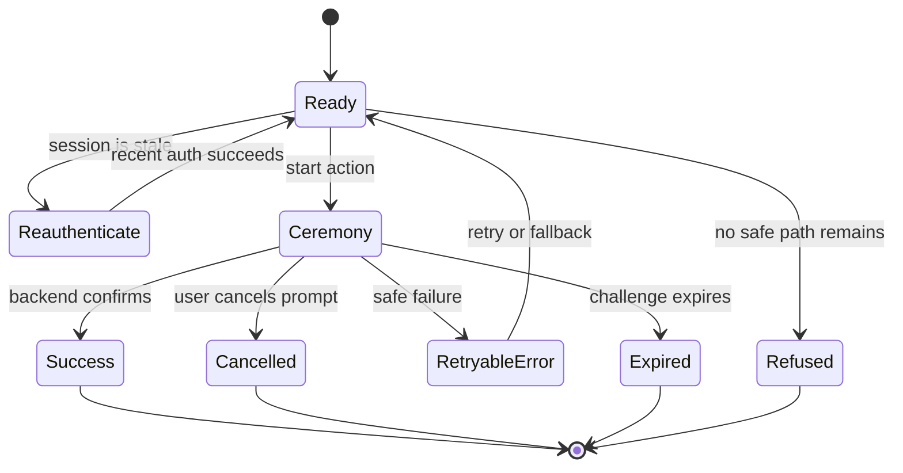

# Web Experience and Accessibility

## Selected Information Architecture

Use PRD Option A: account-security method cards inside Init 05's bounded identity shell. Each card has a
heading, plain-text status, named method(s), primary next action, and a carefully separated destructive
action. The page does not rank users by a fake “security score” or imply every optional method is
mandatory.

The sign-in page adds one visible “Use a passkey” alternative near email. Do not invoke conditional
WebAuthn automatically unless Phase 0 support/accessibility evidence proves it; retain a standard button
and email/password fallback.

## Ceremony State Model

Cancellation is ordinary, not an alarming error. Return focus to the action that invoked the ceremony
and keep another sign-in/recovery path visible. Do not automatically repeat a platform prompt.

## Passkey UI

- Explain that the device/password manager keeps the passkey and may ask for screen lock/biometric;
  never claim OSE stores biometric data.
- Let the user label a new passkey after successful registration; provide a sensible non-identifying
  default and allow duplicate-label clarification without exposing credential IDs.
- List method label, safe created/last-used information where useful, and Remove. Removal confirmation
  names the method and consequence, requires recent auth, and handles last-path refusal.
- Provide an explicit email/password fallback on sign-in and safe browser-not-supported guidance.

## TOTP and Recovery UI

The setup wizard explains purpose, presents QR plus a copyable/manual text key, asks for one current
code, and only then confirms activation. QR cannot be the only path. Input uses appropriate mode and
autocomplete, accepts paste, and labels the whole code semantically rather than six unrelated fields
unless the component fully supports assistive interaction.

Recovery codes appear exactly once after activation/regeneration. Present a semantic list and accessible
Copy/Download actions, explain safe storage, and require explicit confirmation that the user saved them.
Do not put codes in URL, analytics, console, screenshots, traces, server logs, or later page renders.

## Accessibility and Responsive Contract

- Keyboard operation and visible focus for cards, dialogs, platform-prompt initiation, copy/download,
  confirmation, cancellation, and fallback.
- Dialog title/description, initial focus, escape/cancel, focus trap, and return focus.
- Live status announces start/wait/success/failure without repeating secrets or stealing focus.
- Errors identify the action and recovery step in text; color/icon is supplementary.
- Respect reduced motion and platform settings. Do not add countdown animation as the only expiry cue.
- At 320 px, cards/actions stack. At 768 px, rows may align. At 1280 px, keep bounded width. Verify 200%
  zoom and text spacing without clipping/horizontal scroll.
- For every supported locale, prevent QR labels, secret strings, recovery codes, and method names from
  overflowing or being truncated without an accessible full value.

## Privacy and Content

Company administrators and product clients do not receive credential inventory. The user's account
security page is personal even when the current authorization context is a company. Copy avoids “more
secure” absolutes, names the fallback, and distinguishes a passkey from the device's biometric unlock.
Google and Facebook are absent.
