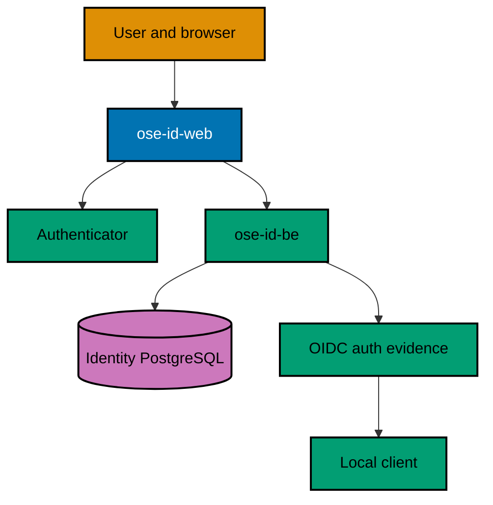

# Technical Design — OSE ID Init 06

## Document Map

1. [Authenticator architecture and domain](001-authenticator-architecture-and-domain.md) — passkey,
   TOTP, recovery, recent-auth, last-path, session, and OIDC evidence contracts.
2. [Web experience and accessibility](002-web-experience-and-accessibility.md) — selected UI,
   ceremony states, browser/platform failures, responsive behavior, and accessible fallbacks.
3. [Local verification and security](003-local-verification-and-security.md) — deterministic test
   matrix, shared challenges, multi-instance proof, leak controls, startup guard, and recovery.
4. [Decisions, sources, and file impact](004-decisions-sources-and-file-impact.md) — tradeoffs,
   licensing, deployment dependency, revisit triggers, and exact affected files.
5. [BDD spec delta and adapter map](005-bdd-spec-delta-and-adapter-map.md) — copy-ready authenticator
   behavior, exact spec targets, and Unit/Integration/E2E obligations.
6. [API and protocol contract delta](006-api-contract-delta.md) — per-operation
   authenticator/BFF/OIDC request-response-error packets, compatibility, code generation, and proof.

## Architecture

## Invariants

The backend remains ASP.NET Core 10 / C# 14 with ASP.NET Core Identity primitives,
query-builder-first SqlKata/Npgsql persistence, custom OpenIddict stores, and PostgreSQL. The
first-party BFF/UI remains Next.js App Router on the repository-pinned
TypeScript/React stack. Authenticator policy is backend-owned; browser code only drives ceremonies and
renders safe state.

- Passkey private keys and biometric data never reach OSE ID.
- Credential ownership is global to the person, independent of personal/company authorization context.
- Every challenge and recovery-code consumption is short-lived, shared, atomic, and replay-resistant.
- Enrollment/removal/regeneration uses recent server-proven authentication and preserves a safe access path.
- OIDC `amr`/freshness reflect completed methods, not requested or configured methods.
- No Google/Facebook provider enters this milestone.
- Local/test mode is explicit; production fails closed until a future deploy plan, blocked at minimum on
  `ose-private/plans/backlog/start-infra-04-deploy-tencent-lighthouse-k3s-cluster` and its then-current
  platform handoff gates.
- OSE-authored source/docs inherit root MIT; dependencies retain their own licenses.
- At least 99% Unit line coverage is required for authored C# and TypeScript production code, with only
  canonical repository exclusions. Every Gherkin scenario
  maps to Unit and applicable Integration/E2E adapters; each higher-layer exemption is explicit per
  scenario/adapter, boundary-justified, indexed in behavior coverage, and statically validated.
