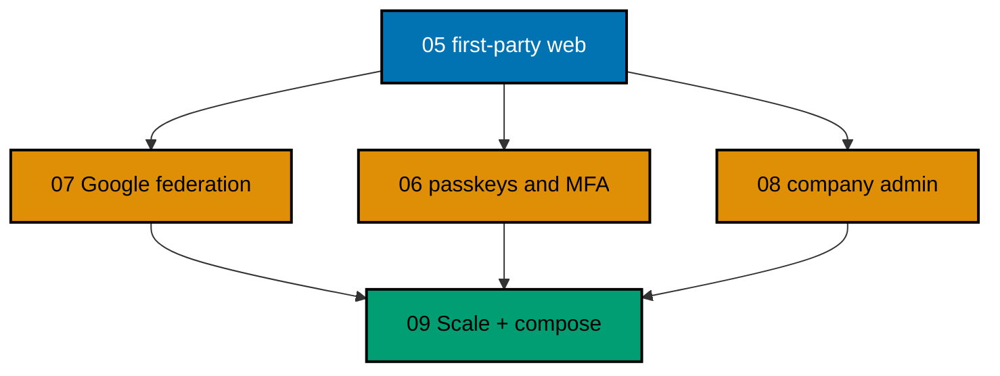

# OSE ID Init 07 — Google Federation

> **Status:** Backlog — not started. Execute only after
> [`ose-id-init-05-first-party-web`](../ose-id-init-05-first-party-web/README.md) has merged and this
> plan has moved to `plans/in-progress/` in a separate lifecycle-only change.

Add Google as OSE ID's first external sign-in provider without making Google, a matching email
address, or a test double a new identity authority. This slice extends the existing C# OSE ID backend
through one provider-neutral federation port, adds a Google action to the existing Next.js sign-in and
account-security journeys, and supplies a deterministic fake upstream provider for local and automated
verification.

## Delivery Position

Arrows express dependency, not calendar order. Plans 06, 07, and 08 may execute independently after
plan 05 because each owns a separate behavior seam.

## Scope

- A provider-neutral external-login contract in ASP.NET Core 10 / C# 14.
- One Google OpenID Connect adapter using OpenIddict-compatible OSE ID session/account flows.
- Provider link storage keyed by provider issuer and provider subject, never email.
- Explicit link and unlink ceremonies protected by recent OSE ID authentication.
- Existing Next.js sign-in and account-security UI extended with Google only.
- A deterministic local fake upstream provider with success and security-failure modes.
- Backend, web, and E2E tests for personal and company-capable people.
- Local/test enablement only; production mode rejects the fake provider and remains fail-closed.

## Non-Goals

- Facebook or any other provider implementation, configuration key, UI, test fixture, environment
  variable, placeholder button, or dormant adapter.
- Production Google credentials, consent-screen registration, DNS, deployment, Kubernetes, or secret
  management.
- Silent account linking by email, automatic account merge, enterprise home-realm discovery, SAML, or
  SCIM.
- Changing OIDC client semantics, company tenancy rules, passkeys/MFA, or company administration.
- Product deployment. A future deploy plan remains blocked at minimum on the private-repository
  `plans/backlog/start-infra-04-deploy-tencent-lighthouse-k3s-cluster` plan and then-current platform
  handoff gates.

## Invariants

- Authored production code maintains at least 99% Unit line coverage. Every Gherkin
  scenario maps to Unit, Integration, and E2E adapters unless an exact boundary-based exemption is
  indexed and statically validated.

- OSE ID remains the issuer; Google proves control of one external identity but never issues OSE product
  tokens directly.
- `(provider_issuer, provider_subject)` identifies the external account. Email stays mutable profile
  data.
- A person can use Google in either personal or company authorization contexts; provider choice does
  not create or select a company.
- `ose-id-web` and `ose-id-be` remain stateless process instances. Correlation, nonce, link intent, and
  OSE ID sessions use shared persistence or protected client state defined by prior slices.
- OSE ID source and repository-authored documentation inherit the repository root MIT license.
  Third-party components retain their own licenses and must pass the repository license audit.

## Reader Map

- [Business requirements](brd.md)
- [Product requirements, flows, UI funnel, and Gherkin](prd.md)
- [Technical design map](tech-docs/README.md)
- [Execution-grade delivery checklist](delivery.md)
- [Execution learnings](learnings.md)
