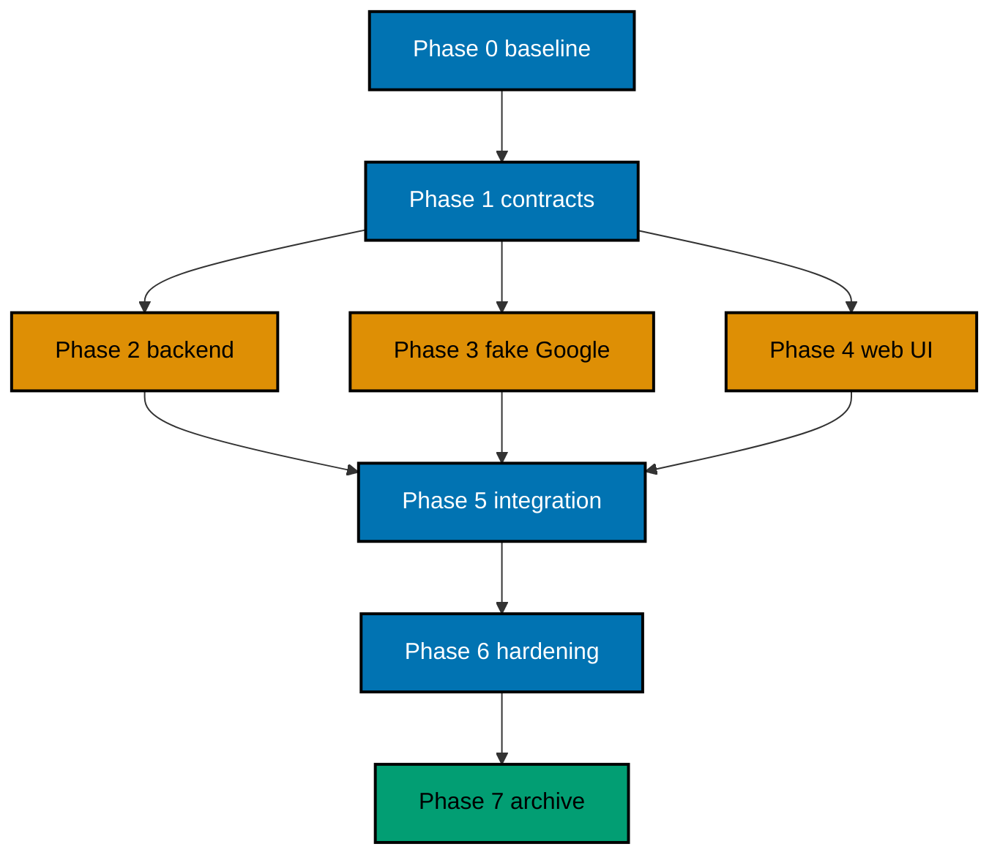

# Delivery — OSE ID Init 07 Google Federation

> **Legend** — `[AI]`: an agent performs the step (default). `[HUMAN]`: only a human can perform an
> out-of-band action or provide a real secret. `[AI+HUMAN]`: an agent prepares and a human completes
> the privileged part.

## Lifecycle Prerequisite

This plan starts in backlog. Do not implement from this location. First land the plan-only backlog
artifact, wait until `ose-id-init-05-first-party-web` is complete on `origin/main`, then land a separate
pure move to `plans/in-progress/ose-id-init-07-google-federation/` with the backlog/in-progress index
updates. The move does not authorize implementation or Git delivery.

Plans 06, 07, and 08 are independent siblings after plan 05. Do not add a dependency between them.
Plan 09 and the LMS user plan remain blocked until this plan and the other required siblings complete.

## Worktree

Worktree path: `worktrees/ose-id-init-07-google-federation/`

Provisioning status: **pending**. This plan was authored inside the user-required `worktrees/ose-id/`
planning worktree while its prerequisite split plans were unlanded. Phase 0 must provision or enter the
matching execution worktree from current `origin/main`, then record its identity and branch inventory.
No implementation may begin while this status remains pending. Per the authoring exception, this draft
omits both Provisioned Worktree Identity and Delivery Branch Inventory. Phase 0 adds both sections only
after it observes the real execution worktree; it must never invent an absolute path or provenance.

From the repository root, provision exactly once with
`rtk git worktree add -b ose-id-init-07-google-federation-base worktrees/ose-id-init-07-google-federation origin/main`.
If that branch already exists, use
`rtk git worktree add worktrees/ose-id-init-07-google-federation ose-id-init-07-google-federation-base`.
If interrupted, run
`rtk git worktree list --porcelain`, reuse the declared route if present, then verify
`rtk git status --short` and `rtk git merge-base --is-ancestor origin/main HEAD`. On mismatch or partial
provisioning, stop and follow `repo-governance/development/workflow/worktree-setup.md`; never force-delete
the worktree or invent its identity.

## Delivery Mode: worktree-to-pr

`ose-public` requires a short-lived worktree branch and PR to `main`. `[AI]` may merge only after the
exact current head/base `pr-quality-gate.yml`, one clean current-head `pr-leak-review`, the applicable
UI/API gates, and the explicit user authorization for Git delivery. Security-critical federation code
also receives semantic security/logic review at the delivery boundary.

## Delivery Unit

| Unit                    | Phases | Natural seam                                                                                                         | Safe resulting state                                                                                                   |
| ----------------------- | ------ | -------------------------------------------------------------------------------------------------------------------- | ---------------------------------------------------------------------------------------------------------------------- |
| DU1 — Google federation | 0–7    | Google adapter, linking policy, fake upstream, UI, specs, tests, docs, and archival form one coherent provider slice | Google works only in local/test configuration; production remains fail-closed; all older sign-in methods remain usable |

No numeric task count creates another delivery unit. Do not ship a button without backend behavior, or
an adapter without safe UI/recovery. The temporary local-only Google feature setting defaults disabled,
has enabled/disabled tests, and remains until a later deployment plan explicitly replaces/removes it.

## Parallelization Model

### Delivery Boundaries

| Unit | Change phases | Worktree and branch                                                                                                               | Delivery opportunity                                                                                   | Cohesive seam                                                                                                           | Resulting `main`, rollback, and flag evidence                                                                                                                                                                                                                                                                                                                                                                                    |
| ---- | ------------- | --------------------------------------------------------------------------------------------------------------------------------- | ------------------------------------------------------------------------------------------------------ | ----------------------------------------------------------------------------------------------------------------------- | -------------------------------------------------------------------------------------------------------------------------------------------------------------------------------------------------------------------------------------------------------------------------------------------------------------------------------------------------------------------------------------------------------------------------------- |
| DU1  | 0–7           | `worktrees/ose-id-init-07-google-federation/`; observed Phase-0 execution branch based on `ose-id-init-07-google-federation-base` | One PR after Phase 7 only; adapter, fake upstream, callback, linking, and UI cannot ship independently | Backend Google adapter/link policy, fake upstream, callback/recovery, web presentation, specs, live tests, and evidence | `main` supports Google only in owned local/test mode; local email and other delivered methods remain usable; production stays fail-closed. Rollback disables Google starts, lets pending transactions expire, preserves explicit account links/audit, and changes no downstream OIDC contract. Evidence proves disabled/enabled flags, fake-upstream isolation, safe recovery, no Facebook UI/route, and final flag disposition. |

Agent lanes are implementation partitions, never independently shippable units.

### Agent Topology

Use at most **N=3 implementation agents plus one root integrator** in the single worktree.



Assign distinct ownership: backend account/provider files, fake-provider/E2E files, and web/UI files.
All agents must inspect `git status`, preserve others' edits, and let the root integrate shared generated
contracts or migrations. Never run concurrent writers against the same migration, lockfile, or generated
file.

## Execution Packet Defaults

Every checkbox inherits the phase-local packet below unless it states a stricter owner, path, command,
or evidence destination. A checkbox is incomplete until its evidence records the exact command, exit
code, observed result, and changed paths. A path discovered during Phase 0 must be written to
`plans/in-progress/ose-id-init-07-google-federation/evidence/phase-0-path-inventory.md` before later work uses it. On any mismatch, preserve sanitized
output, stop the phase gate, fix the root cause without weakening tests or contracts, rerun the same
command, and append the disposition to that phase's evidence.

| Phase | Owner                                          | Authorized path or bounded pattern                                                                                                                                  | Copyable verification command                                                                                                                                                                                                      | Observable result and evidence                                                                                                                                             |
| ----- | ---------------------------------------------- | ------------------------------------------------------------------------------------------------------------------------------------------------------------------- | ---------------------------------------------------------------------------------------------------------------------------------------------------------------------------------------------------------------------------------- | -------------------------------------------------------------------------------------------------------------------------------------------------------------------------- |
| 0     | Root coordinator                               | repository inventory, predecessor artifacts, and execution worktree only                                                                                            | Run the Phase 0 predecessor-green baseline commands from this section.                                                                                                                                                             | Exit `0`; baseline and resolved paths in `plans/in-progress/ose-id-init-07-google-federation/evidence/phase-0-baseline.md`                                                 |
| 1     | Root coordinator                               | `specs/apps/ose/id-be/**`, `specs/apps/ose/id-web/**`, all four OSE ID `behaviour-coverage.json` files, this plan's numbered tech docs, and federation UI contracts | Green predecessor baseline, then `rtk ./hippo run --class transactional --resource-tier standard --disk-path . -- npm exec nx -- run-many -t test:coverage:behaviour --projects=ose-id-be,ose-id-be-e2e,ose-id-web,ose-id-web-e2e` | Only recorded missing Plan 07 bindings may be RED; all other mapping checks exit `0` in `plans/in-progress/ose-id-init-07-google-federation/evidence/phase-1-contracts.md` |
| 2     | Backend owner                                  | `apps/ose-id-be/**`, backend E2E fixtures, and resolved migration paths                                                                                             | `rtk ./hippo run --class transactional --resource-tier standard --disk-path . -- npm exec nx -- run-many -t test:unit,test:integration -p ose-id-be`                                                                               | Exit `0`; ordered RED/GREEN/REFACTOR trace in `plans/in-progress/ose-id-init-07-google-federation/evidence/phase-2-backend.md`                                             |
| 3     | Fake-provider owner                            | bounded fake-provider and federation E2E paths discovered in Phase 0                                                                                                | `rtk ./hippo run --class transactional --resource-tier standard --disk-path . -- npm exec nx -- run ose-id-be-e2e:test:integration`                                                                                                | Exit `0`; deterministic provider/fault proof in `plans/in-progress/ose-id-init-07-google-federation/evidence/phase-3-fake-provider.md`                                     |
| 4     | Web/UI owner                                   | `apps/ose-id-web/**`, `apps/ose-id-web-e2e/**`, and approved shared UI paths                                                                                        | `rtk ./hippo run --class transactional --resource-tier standard --disk-path . -- npm exec nx -- run-many -t test:unit,test:integration -p ose-id-web`                                                                              | Exit `0`; UI/BFF RED/GREEN/REFACTOR trace in `plans/in-progress/ose-id-init-07-google-federation/evidence/phase-4-web.md`                                                  |
| 5     | Root coordinator after lane convergence        | backend, web, E2E, and canonical spec paths in the frozen ledger                                                                                                    | `rtk ./hippo run --class transactional --resource-tier standard --disk-path . -- npm exec nx -- run ose-id-web-e2e:test:e2e`                                                                                                       | Exit `0`; API/browser/replay evidence in `plans/in-progress/ose-id-init-07-google-federation/evidence/phase-5-federation.md`                                               |
| 6     | Root coordinator and named quality-gate agents | frozen delivery ledger only                                                                                                                                         | `rtk npm run check:pre-push`                                                                                                                                                                                                       | Exit `0`; API, UI, accessibility, usability, and security reports in `plans/in-progress/ose-id-init-07-google-federation/evidence/phase-6-quality-gates.md`                |
| 7     | Root coordinator and review agents             | this plan, current-head diff, and annotated plan indexes                                                                                                            | `rtk npm run check:pre-push`                                                                                                                                                                                                       | Exit `0`; archive, current-head review, and cleanup disposition in `plans/in-progress/ose-id-init-07-google-federation/evidence/phase-7-closure.md`                        |

### PostgreSQL Persistence Contract

Every provider-link, correlation, audit, account-association, and session row written by this plan
uses Npgsql connections/transactions through SqlKata's PostgreSQL compiler and
`SqlKata.Execution`. Repositories require explicit projections, bound parameters, cancellation,
bounded command timeouts, and explicit transactions for link/replay and every multi-write invariant;
production runtime paths forbid EF change tracking, LINQ-to-database, and `SELECT *`. EF Core otherwise
stays migration tooling; inherited custom OpenIddict stores remain the only runtime protocol persistence
path. ASP.NET Core Identity is limited to supported hashing/validation primitives,
not Identity EF stores or `UserManager` persistence. Phase 2 and Phase 5 gates run backend
Unit/Integration and built-process E2E through HIPPO and store compiled-SQL snapshots/contracts,
redacted parameter shapes, catalog/unique-index rows, safe synthetic `EXPLAIN` plans, query counts,
and bounded row counts under `plans/in-progress/ose-id-init-07-google-federation/evidence/phase-{2,5}-persistence/`; `EXPLAIN ANALYZE` is permitted only
for isolated safe synthetic fixtures. Any interpolation, missing timeout/cancellation/transaction,
table-wide projection, unbounded/N+1 plan, Identity persistence, or EF runtime query outside that
custom OpenIddict store contract reopens its owning TDD packet.

### Mandatory Nx Quality Matrix

The full green matrix below is mandatory as the completion gate of the first implementation phase
(Phase 2) and for every later implementation, final local-quality, and exact-head delivery/PR gate.
It is not a Phase 0 or Phase 1 success criterion. Before creating any Plan 07 scenario, binding, or
test, Phase 0 and Phase 1 each run this exact predecessor-green baseline:

```bash
rtk ./hippo run --class transactional --resource-tier standard --disk-path . -- npm exec nx -- run-many -t build --projects=ose-id-be,ose-id-web
rtk ./hippo run --class transactional --resource-tier standard --disk-path . -- npm exec nx -- run-many -t typecheck,lint,test:quick --projects=ose-id-be,ose-id-be-e2e,ose-id-web,ose-id-web-e2e
```

Then run the static predecessor behavior baseline:

```bash
rtk ./hippo run --class transactional --resource-tier standard --disk-path . -- npm exec nx -- run-many -t test:coverage:behaviour --projects=ose-id-be,ose-id-be-e2e,ose-id-web,ose-id-web-e2e
```

Phase 0 proves every named target is real, not echo, no-op, a success sentinel, or a duplicate alias.
The C# backend requires `<Nullable>enable</Nullable>`; its Nx `typecheck` runs the .NET compiler with
`/p:TreatWarningsAsErrors=true`, while Nx `lint` runs Roslyn analyzer verification plus
`dotnet format --verify-no-changes`.
The Next.js owner uses strict TypeScript, `tsc --noEmit`, and ESLint. Both TypeScript E2E projects
use no-emit typechecks and their real repository-standard lint targets, but omit `build` because
they produce no deployable artifacts. Each Phase 2-and-later matrix gate writes both command
transcripts and the inspected target/configuration proof to its phase evidence file under the key
`nx-quality`; any failure reopens that gate and blocks progression. Phase 1 records the green
predecessor baseline first, then runs only its explicitly named static-coverage and RED commands. A
nonzero result is nonblocking only when its recorded RED ledger names the missing Plan 07 behavior; any
baseline, target/configuration, or unrelated failure blocks Phase 2.

## Phase 0: Lifecycle, Environment, and Baseline

**Input:** plan 05 completion proof on `origin/main`, pure plan promotion, and a repository checkout.

**Outcome:** a reconciled execution worktree, verified existing targets/paths/licenses, and green baseline.

**Proof:** sanitized commands and outputs under this plan's `plans/in-progress/ose-id-init-07-google-federation/evidence/phase-0-*` files.

- [ ] [AI] Verify `origin/main` contains completed plans 01–05 and this folder exists only under
      `plans/in-progress/`. Inspect full intervening diffs; stop if plan 05's actual contract conflicts
      with this plan.
- [ ] [AI] From repository root, provision/enter `worktrees/ose-id-init-07-google-federation/`, sync it
      non-destructively with current `origin/main`, and record route/branch/HEAD/reflog evidence plus a
      branch-inventory row.
- [ ] [AI] Run
      `rtk ./hippo run --class transactional --resource-tier standard --disk-path . -- npm install` and
      `rtk npm run doctor` (read-only; only if it reports drift, run
      `rtk ./hippo run --class transactional --resource-tier standard --disk-path . -- ./rhino toolchain provision --apply`
      and repeat Doctor); acceptance: the
      install and the final Doctor exit 0 and no secret or unrelated mutation appears.
- [ ] [AI] Read `apps/ose-id-be/project.json`, `apps/ose-id-be-e2e/project.json`,
      `apps/ose-id-web/project.json`, and `apps/ose-id-web-e2e/project.json`; record actual source roots,
      target names, runtime guards, migration ownership, and test commands. Update planned paths/commands
      before code if prior slices differ.
- [ ] [AI] Verify root `LICENSE`, `LICENSING-NOTICE.md`, current package manifests, and exact resolved
      licenses for any proposed Google/OIDC library. Acceptance: OSE source/docs remain root MIT and
      third-party licenses are compatible and documented.
- [ ] [AI] Run the Phase 0 predecessor-green baseline so `build` executes only for backend/web owners while
      all four projects run real `typecheck`, `lint`, and `test:quick`, then run
      `rtk ./hippo run --class transactional --resource-tier standard --disk-path . -- ./rhino gate run --surface=pre-push`; inventory the registry with
      `rtk ./rhino gate list --output text`; preserve clean baseline transcripts. Diagnose every failure
      at root cause; never skip, retry, sleep, quarantine, widen, or weaken a gate.
- [ ] [AI] Search current OSE ID files for provider abstractions and Google/Facebook references. Reuse a
      proven seam, remove no unrelated user work, and record whether any repository rule/enforcement
      surface must change.

### Phase 0 Gate

> All checks below must pass before Phase 1.

- [ ] [AI] Run
      `rtk ./hippo run --class transactional --resource-tier standard --disk-path . -- npm exec nx -- affected -t build,typecheck,lint,test:quick,test:coverage:behaviour --base=origin/main --head=HEAD`
      and the canonical pre-push command above; acceptance: both exit 0 and dependency, worktree,
      path/target, license, baseline, and rule-impact evidence are current at one HEAD.

> **Pause Safety:** no Google behavior/migration exists and the baseline is reproducible. Safe to stop.
> To resume: `rtk ./hippo run --class transactional --resource-tier standard --disk-path . -- npm exec nx -- affected -t build,typecheck,lint,test:quick --base=origin/main --head=HEAD`.

---

## Phase 1: Specs, Threat Cases, and Provider Contract

**Input:** PRD AC-GOOGLE-01..08 and Phase 0's actual project layout.

**Outcome:** canonical specs and deliberately failing tests define every provider and linking behavior.

**Proof:** static behavior coverage maps every scenario to owned automated layers with initial RED output.

- [ ] [AI] Copy the backend and web packets from
      `tech-docs/005-bdd-spec-delta-and-adapter-map.md` without paraphrase into
      `specs/apps/ose/id-be/behaviours/federation/google-federation.feature` and
      `specs/apps/ose/id-web/behaviours/federation/google-federation.feature`, then add named U/I/E
      entries to all four OSE ID `behaviour-coverage.json` files. Run
      `rtk ./hippo run --class ephemeral --resource-tier standard --disk-path . -- npm exec nx -- run-many -t test:coverage:behaviour --projects=ose-id-be,ose-id-be-e2e,ose-id-web,ose-id-web-e2e`;
      acceptance is zero duplicate/undefined/unowned scenarios and missing implementations only RED.
      Save exact paths, mappings, exit code, and RED symbols to `plans/in-progress/ose-id-init-07-google-federation/evidence/phase-1-gherkin-red.md`; any
      wording/path drift or exemption request blocks Phase 1.
- [ ] [AI] Add upstream-impersonation, login-CSRF, mix-up, callback/code-replay, linking-takeover,
      subject-collision, outage, token-leakage, fake-runtime-escape, and instance-handoff rows to
      `docs/explanation/security/ose-id-threat-model.md`, each with owner, U/I/E or manual proof, and
      residual risk. Run
      `rtk ./hippo run --class ephemeral --resource-tier standard --disk-path . -- npm exec markdownlint-cli2 -- docs/explanation/security/ose-id-threat-model.md`;
      acceptance is exit `0` and no unowned threat. Save row IDs to `plans/in-progress/ose-id-init-07-google-federation/evidence/phase-1-threat-map.md`;
      unresolved ownership blocks Phase 1.

### Per-operation RED → GREEN → REFACTOR → publication schedule

Execute each row independently and in the displayed order; never batch GREEN across rows before its
own RED is captured. Backend rows use
`rtk ./hippo run --class ephemeral --resource-tier standard --disk-path . -- npm exec nx -- run-many -t test:unit,test:integration -p ose-id-be`
for RED/GREEN,
`rtk ./hippo run --class transactional --resource-tier standard --disk-path . -- npm exec nx -- run-many -t lint,typecheck,test:unit,test:integration -p ose-id-be`
for REFACTOR, then
`rtk ./hippo run --class transactional --resource-tier standard --disk-path . -- npm exec nx -- run-many -t openapi:validate,client:generate -p ose-id-be`
for publication. Web rows use the same commands with `ose-id-web`. Every stage writes command, exit,
named tests, changed paths, and observed result to
`plans/in-progress/ose-id-init-07-google-federation/evidence/phase-{2-backend|4-web}-<operation>-{red|green|refactor|publish}.txt`. RED must fail only for
the named absent behavior; GREEN and later stages must exit `0`; publication must produce a clean
generated-client diff on a second run. On any other result, preserve sanitized output, stop that row,
fix the root cause without weakening its contract/test, and rerun the failed stage before continuing.

| Ordered operation packet                                 | RED test path or bounded pattern                                            | GREEN source path or bounded pattern                                                                            | Publication contract and operation ID                                                              |
| -------------------------------------------------------- | --------------------------------------------------------------------------- | --------------------------------------------------------------------------------------------------------------- | -------------------------------------------------------------------------------------------------- |
| `POST /api/v1/federation/google/challenges`              | `apps/ose-id-be/tests/{unit,integration}/Federation/Google/*Challenge*`     | `apps/ose-id-be/src/OseId.{Application,Api}/Federation/Google/**`                                               | `specs/apps/ose/id-be/contracts/google-federation.openapi.yaml`; `createGoogleFederationChallenge` |
| `POST /api/v1/federation/google/callbacks`               | `apps/ose-id-be/tests/{unit,integration}/Federation/Google/*Callback*`      | `apps/ose-id-be/src/OseId.{Application,Infrastructure,Api}/Federation/Google/**`                                | backend contract; `consumeGoogleFederationCallback`                                                |
| `GET /api/v1/account/provider-links`                     | `apps/ose-id-be/tests/{unit,integration}/Federation/Google/*ProviderLinks*` | `apps/ose-id-be/src/OseId.{Application,Api}/Federation/Google/**`                                               | backend contract; `listCurrentProviderLinks`                                                       |
| `DELETE /api/v1/account/provider-links/{providerLinkId}` | `apps/ose-id-be/tests/{unit,integration}/Federation/Google/*Unlink*`        | `apps/ose-id-be/src/OseId.{Application,Infrastructure,Api}/Federation/Google/**`                                | backend contract; `unlinkCurrentProvider`                                                          |
| `POST /api/bff/federation/google/start`                  | `apps/ose-id-web/**/{*.test.*,*.spec.*}` filtered to `google-start`         | `apps/ose-id-web/src/app/api/bff/federation/google/start/**`                                                    | `specs/apps/ose/id-web/contracts/google-federation.openapi.yaml`; `startGoogleFederation`          |
| `GET /auth/google/callback`                              | web tests filtered to `google-callback`                                     | `apps/ose-id-web/src/app/auth/google/callback/**`                                                               | web contract; `completeGoogleFederationCallback`                                                   |
| `POST /api/bff/account/federation/google/link`           | web tests filtered to `google-link`                                         | `apps/ose-id-web/src/app/api/bff/account/federation/google/link/**`                                             | web contract; `startGoogleAccountLink`                                                             |
| `DELETE /api/bff/account/federation/google`              | web tests filtered to `google-unlink`                                       | `apps/ose-id-web/src/app/api/bff/account/federation/google/**`                                                  | web contract; `unlinkGoogleAccount`                                                                |
| `GET /sign-in`                                           | web tests filtered to `google-sign-in-presentation`                         | Phase-0-resolved `apps/ose-id-web/src/app/**/sign-in/page.tsx` and `src/features/google-federation/**`          | web contract; `renderGoogleSignIn`                                                                 |
| `GET /account/security`                                  | web tests filtered to `google-account-security-presentation`                | Phase-0-resolved `apps/ose-id-web/src/app/**/account/security/page.tsx` and `src/features/google-federation/**` | web contract; `renderGoogleAccountSecurity`                                                        |

- [ ] [AI] Freeze the ten schedule rows before implementation by resolving every bounded test/source
      pattern against the Phase 0 inventory and recording forty future evidence destinations in
      `plans/in-progress/ose-id-init-07-google-federation/evidence/phase-1-operation-schedule.md`. Run
      `rtk ./hippo run --class ephemeral --resource-tier standard --disk-path . -- npm exec markdownlint-cli2 -- plans/in-progress/ose-id-init-07-google-federation/delivery.md`;
      acceptance is exit `0`, exact paths for every row, and RED as the only executed stage. A missing
      operation/stage/path or any premature GREEN blocks Phase 2.
- [ ] [AI] **RED:** create provider-port and account-policy Unit cases under the Phase 0-discovered
      `ose-id-be` test source for AC-GOOGLE-01..06; run
      `rtk ./hippo run --class ephemeral --resource-tier standard --disk-path . -- npm exec nx -- run ose-id-be:test:unit`;
      acceptance: the new cases fail because the provider contract and policies do not exist, while old
      tests remain green. Save sanitized output to `plans/in-progress/ose-id-init-07-google-federation/evidence/phase-1-backend-red.txt`.
- [ ] [AI] **RED:** create web component/server-boundary cases under the discovered `ose-id-web` test
      source for Google action/loading/denial/linking states; run the `ose-id-web:test:unit` target;
      acceptance: new assertions fail for missing presentation only. Save output.
- [ ] [AI] **REFACTOR:** review names and fixture vocabulary so specs, tests, and product terms use
      provider issuer/subject consistently and never encode email as identity. Rerun static coverage;
      acceptance: mappings remain complete.

### Phase 1 Gate

- [ ] [AI] Verify `plans/in-progress/ose-id-init-07-google-federation/evidence/phase-1-*` contains the immediately preceding green predecessor baseline and
      its command/target records before the first Plan 07 scenario, binding, or test. Inspect the isolated
      RED ledger: only named absent Plan 07 behavior may be nonzero; a baseline, target/configuration, or
      unrelated failure blocks Phase 2. Do not require the full green matrix until Phase 2 completes.
- [ ] [AI] Run
      `rtk ./hippo run --class ephemeral --resource-tier standard --disk-path . -- npm exec nx -- run-many -t test:coverage:behaviour --projects=ose-id-be,ose-id-be-e2e,ose-id-web,ose-id-web-e2e`;
      acceptance: all scenarios have U/I/E ownership, threat owners, and named RED evidence while no
      implementation or speculative provider artifact has landed.

> **Pause Safety:** contracts are reviewable and only new focused tests are red. Safe to stop. To resume:
> `rtk ./hippo run --class ephemeral --resource-tier standard --disk-path . -- npm exec nx -- run-many -t test:coverage:behaviour --projects=ose-id-be,ose-id-be-e2e,ose-id-web,ose-id-web-e2e`.

---

## Phase 2: Provider Boundary and Google Adapter

**Input:** frozen provider result/error contract and backend RED tests.

**Outcome:** the C# backend validates Google responses and resolves OSE accounts without email linking.

**Proof:** Unit/Integration tests pass for AC-GOOGLE-01..08 and migrations validate forward/rollback rules.

- [ ] [AI] Execute schedule rows 1–4 independently in their recorded order, completing RED, GREEN,
      REFACTOR, then backend OpenAPI validation and first-party-client generation for one operation
      before starting the next. Use the exact commands, resolved paths, evidence filename pattern, and
      failure route in the Phase 1 schedule. Acceptance is sixteen present evidence files, GREEN and
      later exits `0`, operation IDs `createGoogleFederationChallenge`,
      `consumeGoogleFederationCallback`, `listCurrentProviderLinks`, and `unlinkCurrentProvider` in
      `specs/apps/ose/id-be/contracts/google-federation.openapi.yaml`, plus a no-diff second generation.
      Record the ordered timestamp/index check in `plans/in-progress/ose-id-init-07-google-federation/evidence/phase-2-backend-operation-sequence.md`;
      missing/reordered evidence blocks the Phase 2 gate.

- [ ] [AI] **Cross-operation backend reconciliation after rows 1–4.** Rerun the complete provider-port,
      callback/account-policy, persistence, OpenAPI, runtime-guard, and compiled-SQL/explicit-projection/
      bound-parameter/timeout/cancellation/query-bound suite with
      `rtk ./hippo run --class ephemeral --resource-tier standard --disk-path . -- npm exec nx -- run-many -t test:unit,test:integration -p ose-id-be`.
      Inspect the combined implementation for one provider port, one normalized error vocabulary, one
      account-link policy, explicit Npgsql transactions, and no provider/SDK/framework type in Domain or
      Application. Acceptance: every operation-specific GREEN/REFACTOR artifact already exists, this
      reconciliation is green on its first run, concurrent duplicate links yield one owner/one Person,
      disabled/real-local/fake-test/forbidden-production modes fail or start exactly as documented, and
      safe synthetic `EXPLAIN` plus catalog evidence confirms bounded indexed lookups. Save
      `plans/in-progress/ose-id-init-07-google-federation/evidence/phase-2-cross-operation-reconciliation.txt`; a failure reopens the earliest owning
      operation row instead of starting another aggregate TDD cycle.
- [ ] [AI] **AC-GOOGLE-08 audit gate:** Unit snapshots prove actor/time stamping, explicit tombstone
      predicates, soft-delete unlink, and terminal secret scrubbing; Integration inventories both new
      tables' six columns, time/pair constraints, guards, `ON DELETE RESTRICT`, grants, and executes a
      rejected real `DELETE`; built E2E unlinks a non-final provider, proves it unusable/absent from
      ordinary reads, and observes retained sanitized attribution. No layer exemption is permitted.
- [ ] [AI] **Backend slice quality closure.** Rerun backend build/typecheck/lint/Unit/Integration and
      migration validation with
      `rtk ./hippo run --class transactional --resource-tier standard --disk-path . -- npm exec nx -- run-many -t build,typecheck,lint,test:unit,test:integration -p ose-id-be`.
      Acceptance: no raw provider token escapes the adapter and no aggregate cleanup changed an already
      accepted operation contract; save `plans/in-progress/ose-id-init-07-google-federation/evidence/phase-2-google-backend-quality.txt`.

### Phase 2 Gate

- [ ] [AI] Run the Phase 2 run-many command and
      `rtk ./hippo run --class transactional --resource-tier standard --disk-path . -- npm exec nx -- run ose-id-be-e2e:test:e2e`;
      acceptance: backend criteria, migration/no-loss, stateless correlation, runtime guards, and at least
      99% authored production-code Unit line coverage pass; `plans/in-progress/ose-id-init-07-google-federation/evidence/phase-2-persistence/` proves
      compiled SQL, unique-index/catalog and safe synthetic plans, bounded queries/rows, and no
      EF/Identity persistence path.

> **Pause Safety:** Google remains disabled by default and schema is forward-safe. Safe to stop. To
> resume: `rtk ./hippo run --class transactional --resource-tier standard --disk-path . -- npm exec nx -- run ose-id-be:test:quick`.

---

## Phase 3: Deterministic Fake Upstream Provider

**Input:** Google adapter-facing contract and technical doc 003.

**Outcome:** backend E2E can exercise real HTTP/provider validation without Google or the internet.

**Proof:** fake scenario matrix and ownership-aware cleanup pass on success, failure, crash, and interrupt.

- [ ] [AI] **RED:** add backend E2E cases under `apps/ose-id-be-e2e/` for every matrix row in technical
      doc 003; run
      `rtk ./hippo run --class ephemeral --resource-tier standard --disk-path . -- npm exec nx -- run ose-id-be-e2e:test:e2e`;
      acceptance: tests fail because the fake lifecycle/control
      surface is absent. Save `plans/in-progress/ose-id-init-07-google-federation/evidence/phase-3-fake-red.txt`.
- [ ] [AI] **GREEN:** add the minimal discovery, authorization, token, JWKS, and optional UserInfo fake
      endpoints plus loopback-only per-test scenario control. Use synthetic `.test` identities and unique
      stack IDs; run the Phase 3 backend E2E command. Acceptance: success and all trust-failure cases
      reach the Google adapter. Save `plans/in-progress/ose-id-init-07-google-federation/evidence/phase-3-fake-protocol-green.txt`.
  - _Suggested executor: `swe-code-maker` with `programming-csharp`._
- [ ] [AI] **GREEN:** implement readiness, child-failure propagation, bounded event-driven waiting, and
      unconditional cleanup in the E2E lifecycle. Deliberately fail a test and crash the provider;
      run the Phase 3 backend E2E command; acceptance: primary status is preserved and no owned port/
      process/temp key remains. Save `plans/in-progress/ose-id-init-07-google-federation/evidence/phase-3-fake-cleanup-green.txt`.
- [ ] [AI] **REFACTOR:** reduce the fake to adapter-required behavior, remove Google UI/branding mimicry,
      and prove its registration is compile/runtime unreachable in forbidden modes. Rerun backend E2E
      twice from clean state using the exact E2E command; both runs pass without leaked resources. Save
      `plans/in-progress/ose-id-init-07-google-federation/evidence/phase-3-fake-refactor.txt`.

### Phase 3 Gate

- [ ] [AI] Run the exact Phase 3 E2E command followed by
      `rtk ./hippo run --class transactional --resource-tier standard --disk-path . -- npm exec nx -- run ose-id-web-e2e:local-stack-cleanup`;
      acceptance: the complete fake matrix passes with no real credential/network call, secret evidence,
      sleep/retry, or leftover resource.

> **Pause Safety:** backend and fake form a complete local seam; ordinary startup stays disabled. Safe to
> stop. To resume: `rtk ./hippo run --class ephemeral --resource-tier standard --disk-path . -- npm exec nx -- run ose-id-be-e2e:test:e2e`.

---

## Phase 4: Google UI and Account-Security Journey

**Input:** backend problem codes/contracts and the selected PRD UI funnel.

**Outcome:** the existing Next.js shell supports Google start, result, link, and unlink accessibly.

**Proof:** component and browser tests pass at mobile/tablet/desktop with no browser token exposure.

- [ ] [AI] Execute schedule rows 5–10 independently in their recorded order, completing RED, GREEN,
      REFACTOR, then web OpenAPI validation/client generation for one operation before starting the
      next. Use the exact commands, resolved paths, evidence filename pattern, and failure route in the
      Phase 1 schedule. Acceptance is twenty-four present evidence files, GREEN and later exits `0`, all
      six operation IDs in `specs/apps/ose/id-web/contracts/google-federation.openapi.yaml`, and a
      no-diff second generation. Record the ordered timestamp/index check in
      `plans/in-progress/ose-id-init-07-google-federation/evidence/phase-4-web-operation-sequence.md`; missing/reordered evidence blocks the Phase 4 gate.

- [ ] [AI] **Cross-operation web reconciliation after rows 5–10.** Inspect the completed operation rows
      as one journey: Google entry, loading/cancel/unavailable result, matching-email non-link, explicit
      recent-auth link, safe unlink/last-method denial, and protected return. Consolidate only repeated
      presentation behind current OSE UI primitives; do not create another TDD cycle or a provider
      catalog. Rerun
      `rtk ./hippo run --class transactional --resource-tier standard --disk-path . -- npm exec nx -- run-many -t lint,typecheck,test:unit -p ose-id-web`
      and `rtk ./hippo run --class transactional --resource-tier standard --disk-path . -- npm exec nx -- run ose-id-web-e2e:test:e2e`.
      Acceptance: all operation-specific GREEN/REFACTOR evidence predates this check; Google remains the
      only provider UI; no provider detail reaches client components; focus, keyboard, live-status, and
      semantic order stay stable at 320, 375, 768, 1024, 1280, and 1440 CSS px for every supported
      locale; and DOM/storage/history/console contain no token or code. Save
      `plans/in-progress/ose-id-init-07-google-federation/evidence/phase-4-cross-operation-reconciliation.txt`; a failure reopens its owning schedule row.

### Phase 4 Gate

- [ ] [AI] Run the exact Phase 4 Unit/E2E commands; acceptance: AC-GOOGLE-01..08 pass for all supported
      locales and widths, 99% authored-line Unit coverage holds, and no token/code/assertion appears in
      DOM, storage, URL history, console, trace, or screenshot evidence.

> **Pause Safety:** the Google slice works locally behind its disabled guard. Safe to stop. To resume:
> `rtk ./hippo run --class transactional --resource-tier standard --disk-path . -- npm exec nx -- run ose-id-web-e2e:test:e2e`.

---

## Phase 5: Integrated Local and Manual Verification

**Input:** passing backend, fake-provider, and web slices.

**Outcome:** one local Google journey is behaviorally verified, documented, and cleanly recoverable.

**Proof:** API outputs, screenshots, storage inspection, and cleanup inventory in `plans/in-progress/ose-id-init-07-google-federation/evidence/`.

Copy-paste start and readiness recipe (Phase 0 verifies the target and fixed family ports are unclaimed;
on collision it stops and amends the plan rather than selecting arbitrary ports):

```bash
rtk ./hippo run --class service --resource-tier standard --disk-path . -- npm exec nx -- run ose-id-web-e2e:local-stack
rtk curl -fsS http://127.0.0.1:8501/health/live
rtk curl -fsS http://127.0.0.1:8501/health/ready
rtk curl -fsS http://127.0.0.1:8502/.well-known/openid-configuration
```

- [ ] [AI] Seed isolated fake-Google and OSE state with
      `rtk ./hippo run --class transactional --resource-tier standard --disk-path . -- npm exec nx -- run ose-id-web-e2e:seed-manual -- --profile=google-federation --output=local-tmp/ose-id-init-07/seed.env --requests=local-tmp/ose-id-init-07/requests`.
      The committed fixture must create distinct sign-in/link/unlink success and error sessions,
      provider subjects, one-use state/code pairs, provider-link versions, CSRF values, and synthetic
      callback/request files. It writes mode-`0600` local-only values and emits only fixture labels and
      row counts to `plans/in-progress/ose-id-init-07-google-federation/evidence/phase-5-api-seed.md`. Load it with
      `set -a; source local-tmp/ose-id-init-07/seed.env; set +a`, then create
      `plans/in-progress/ose-id-init-07-google-federation/evidence/phase-5-api/`. Missing values, real Google data, or overlapping success/error state fail
      the phase and invoke cleanup.

### Copyable federation operation recipes

Run every added or updated operation pair below without `--location`; redirects must be inspected
before following them. Provider code/state, OSE cookies, and link IDs remain under
`local-tmp/ose-id-init-07/`; the sanitizer writes only status, required header names, stable error
codes, redirect-origin verdicts, and schema fields to `plans/in-progress/ose-id-init-07-google-federation/evidence/phase-5-api-contract.md`.

```bash
rtk curl -sS -D local-tmp/ose-id-init-07/be-challenge-ok.headers -o local-tmp/ose-id-init-07/be-challenge-ok.json -X POST -H "Authorization: Bearer ${OSE_ID_BFF_CAPABILITY}" -H "Idempotency-Key: ${OSE_ID_GOOGLE_IDEMPOTENCY_KEY}" -H 'Content-Type: application/json' --data-binary @local-tmp/ose-id-init-07/requests/backend-challenge.json http://127.0.0.1:8501/api/v1/federation/google/challenges
rtk curl -sS -D plans/in-progress/ose-id-init-07-google-federation/evidence/phase-5-api/be-challenge-error.headers -o plans/in-progress/ose-id-init-07-google-federation/evidence/phase-5-api/be-challenge-error.json -X POST -H "Authorization: Bearer ${OSE_ID_BFF_CAPABILITY}" -H 'Idempotency-Key: synthetic-invalid-request' -H 'Content-Type: application/json' --data '{"purpose":"unsupported","callbackUri":"https://attacker.invalid/callback","returnPath":"https://attacker.invalid"}' http://127.0.0.1:8501/api/v1/federation/google/challenges
rtk curl -sS -D local-tmp/ose-id-init-07/be-callback-ok.headers -o plans/in-progress/ose-id-init-07-google-federation/evidence/phase-5-api/be-callback-ok.json -X POST -H "Authorization: Bearer ${OSE_ID_BFF_CAPABILITY}" -H 'Content-Type: application/json' --data-binary @local-tmp/ose-id-init-07/requests/backend-callback.json http://127.0.0.1:8501/api/v1/federation/google/callbacks
rtk curl -sS -D plans/in-progress/ose-id-init-07-google-federation/evidence/phase-5-api/be-callback-replay.headers -o plans/in-progress/ose-id-init-07-google-federation/evidence/phase-5-api/be-callback-replay.json -X POST -H "Authorization: Bearer ${OSE_ID_BFF_CAPABILITY}" -H 'Content-Type: application/json' --data-binary @local-tmp/ose-id-init-07/requests/backend-callback.json http://127.0.0.1:8501/api/v1/federation/google/callbacks
rtk curl -sS -D local-tmp/ose-id-init-07/provider-links-ok.headers -o local-tmp/ose-id-init-07/provider-links-ok.json -H "Authorization: Bearer ${OSE_ID_BFF_CAPABILITY}" -b "ose_id_session=${OSE_ID_PROVIDER_LINKS_COOKIE}" http://127.0.0.1:8501/api/v1/account/provider-links
rtk curl -sS -D plans/in-progress/ose-id-init-07-google-federation/evidence/phase-5-api/provider-links-error.headers -o plans/in-progress/ose-id-init-07-google-federation/evidence/phase-5-api/provider-links-error.json http://127.0.0.1:8501/api/v1/account/provider-links
rtk curl -sS -D local-tmp/ose-id-init-07/be-unlink-ok.headers -o /dev/null -X DELETE -H "Authorization: Bearer ${OSE_ID_BFF_CAPABILITY}" -H "If-Match: \"${OSE_ID_PROVIDER_LINK_VERSION}\"" -b "ose_id_session=${OSE_ID_BE_UNLINK_COOKIE}" "http://127.0.0.1:8501/api/v1/account/provider-links/${OSE_ID_PROVIDER_LINK_ID}"
rtk curl -sS -D plans/in-progress/ose-id-init-07-google-federation/evidence/phase-5-api/be-unlink-error.headers -o plans/in-progress/ose-id-init-07-google-federation/evidence/phase-5-api/be-unlink-error.json -X DELETE -H "Authorization: Bearer ${OSE_ID_BFF_CAPABILITY}" -H 'If-Match: "1"' -b "ose_id_session=${OSE_ID_BE_UNLINK_ERROR_COOKIE}" http://127.0.0.1:8501/api/v1/account/provider-links/provider_link_synthetic_missing
rtk curl -sS -D local-tmp/ose-id-init-07/bff-start-ok.headers -o /dev/null -X POST -b "ose_id_session=${OSE_ID_BFF_START_COOKIE}" -H 'Origin: http://127.0.0.1:3500' -H "X-CSRF-Token: ${OSE_ID_BFF_START_CSRF}" -H 'Content-Type: application/json' --data '{"returnPath":"/authorize/context"}' http://127.0.0.1:3500/api/bff/federation/google/start
rtk curl -sS -D plans/in-progress/ose-id-init-07-google-federation/evidence/phase-5-api/bff-start-error.headers -o plans/in-progress/ose-id-init-07-google-federation/evidence/phase-5-api/bff-start-error.body -X POST -b "ose_id_session=${OSE_ID_BFF_START_ERROR_COOKIE}" -H 'Origin: http://127.0.0.1:3500' -H 'Content-Type: application/json' --data '{"returnPath":"/authorize/context"}' http://127.0.0.1:3500/api/bff/federation/google/start
rtk curl -sS -D local-tmp/ose-id-init-07/browser-callback-ok.headers -o /dev/null -G --data-urlencode state="${OSE_ID_BROWSER_CALLBACK_STATE}" --data-urlencode code="${OSE_ID_BROWSER_CALLBACK_CODE}" http://127.0.0.1:3500/auth/google/callback
rtk curl -sS -D plans/in-progress/ose-id-init-07-google-federation/evidence/phase-5-api/browser-callback-error.headers -o plans/in-progress/ose-id-init-07-google-federation/evidence/phase-5-api/browser-callback-error.body -G --data-urlencode state=malformed-synthetic-state --data-urlencode code=malformed-synthetic-code http://127.0.0.1:3500/auth/google/callback
rtk curl -sS -D local-tmp/ose-id-init-07/bff-link-ok.headers -o /dev/null -X POST -b "ose_id_session=${OSE_ID_BFF_LINK_COOKIE}" -H 'Origin: http://127.0.0.1:3500' -H "X-CSRF-Token: ${OSE_ID_BFF_LINK_CSRF}" -H 'Content-Type: application/json' --data '{}' http://127.0.0.1:3500/api/bff/account/federation/google/link
rtk curl -sS -D plans/in-progress/ose-id-init-07-google-federation/evidence/phase-5-api/bff-link-error.headers -o plans/in-progress/ose-id-init-07-google-federation/evidence/phase-5-api/bff-link-error.body -X POST -H 'Origin: http://127.0.0.1:3500' -H 'X-CSRF-Token: synthetic-no-session' -H 'Content-Type: application/json' --data '{}' http://127.0.0.1:3500/api/bff/account/federation/google/link
rtk curl -sS -D local-tmp/ose-id-init-07/bff-unlink-ok.headers -o /dev/null -X DELETE -b "ose_id_session=${OSE_ID_BFF_UNLINK_COOKIE}" -H 'Origin: http://127.0.0.1:3500' -H "X-CSRF-Token: ${OSE_ID_BFF_UNLINK_CSRF}" -H "If-Match: \"${OSE_ID_BFF_UNLINK_VERSION}\"" http://127.0.0.1:3500/api/bff/account/federation/google
rtk curl -sS -D plans/in-progress/ose-id-init-07-google-federation/evidence/phase-5-api/bff-unlink-error.headers -o plans/in-progress/ose-id-init-07-google-federation/evidence/phase-5-api/bff-unlink-error.json -X DELETE -b "ose_id_session=${OSE_ID_LAST_METHOD_COOKIE}" -H 'Origin: http://127.0.0.1:3500' -H "X-CSRF-Token: ${OSE_ID_LAST_METHOD_CSRF}" -H "If-Match: \"${OSE_ID_LAST_METHOD_VERSION}\"" http://127.0.0.1:3500/api/bff/account/federation/google
rtk curl -sS -D plans/in-progress/ose-id-init-07-google-federation/evidence/phase-5-api/sign-in-update-ok.headers -o plans/in-progress/ose-id-init-07-google-federation/evidence/phase-5-api/sign-in-update-ok.html http://127.0.0.1:3500/sign-in
rtk curl -sS -D plans/in-progress/ose-id-init-07-google-federation/evidence/phase-5-api/sign-in-update-error.headers -o plans/in-progress/ose-id-init-07-google-federation/evidence/phase-5-api/sign-in-update-error.body -X DELETE http://127.0.0.1:3500/sign-in
rtk curl -sS -D plans/in-progress/ose-id-init-07-google-federation/evidence/phase-5-api/security-update-ok.headers -o plans/in-progress/ose-id-init-07-google-federation/evidence/phase-5-api/security-update-ok.html -b "ose_id_session=${OSE_ID_SECURITY_PAGE_COOKIE}" http://127.0.0.1:3500/account/security
rtk curl -sS -D plans/in-progress/ose-id-init-07-google-federation/evidence/phase-5-api/security-update-error.headers -o plans/in-progress/ose-id-init-07-google-federation/evidence/phase-5-api/security-update-error.body http://127.0.0.1:3500/account/security
rtk ./hippo run --class transactional --resource-tier standard --disk-path . -- npm exec nx -- run ose-id-web-e2e:sanitize-manual-api -- --input=local-tmp/ose-id-init-07 --output=plans/in-progress/ose-id-init-07-google-federation/evidence/phase-5-api-contract.md
```

Required outcomes in operation order are: backend challenge `201` with `Location` versus `400
invalid_request`; callback `200` signed-in outcome versus replay `409 federation_replayed`;
provider links `200`/`no-store` versus `401 session_required`; backend unlink `204` versus `404
provider_link_not_found`; BFF start `303` with fake-provider `Location`, `no-store`, and
`Referrer-Policy: no-referrer` versus `403 csrf_invalid`; browser callback `303` to the allowlisted
OSE path with protected cookie/no-store/no-referrer versus `400 invalid_request`; BFF link `303`
versus `401 session_required`; BFF unlink `204` with cookie rotation/no-store versus `409
last_sign_in_method`; sign-in `200 text/html`/no-store versus unsupported method `405`; account
security `200 text/html`/no-store versus the documented `401` or safe sign-in redirect. Any
attacker-controlled `Location`, raw upstream response, secret-bearing evidence, unexpected
mutation, or status/header/body mismatch blocks Phase 5 and invokes cleanup.

- [ ] [AI] Record the sanitized outcome for every operation pair above in
      `plans/in-progress/ose-id-init-07-google-federation/evidence/phase-5-api-contract.md`; the root coordinator owns disposition and invokes cleanup on
      the first mismatch.

Use web `http://127.0.0.1:3500`, API `http://127.0.0.1:8501`, PostgreSQL host port 5438,
Mailpit SMTP 1026/UI `http://127.0.0.1:8026`, and fake Google 8502 via
`OSE_ID_FAKE_GOOGLE_PORT`. In the browser, `browser_navigate` to the web URL, `browser_snapshot`,
`browser_click` Continue with Google, and drive fake subjects `google-subject-new-001` /
`google.new.user@example.test` and `google-subject-existing-001` /
`already-linked@example.test`. Use `browser_fill_form` for the fake-provider choice, then inspect
`browser_console_messages`, `browser_network_requests`, and storage through `browser_evaluate`; expected
return is the allowlisted OSE URL with 2xx/3xx flow status, only an opaque HttpOnly OSE cookie, and no
provider/OSE token, code, nonce, subject, or assertion in URL/localStorage/sessionStorage. Capture
`browser_take_screenshot` evidence at `plans/in-progress/ose-id-init-07-google-federation/evidence/phase-5-google-sign-in-en-375px.png`,
`plans/in-progress/ose-id-init-07-google-federation/evidence/phase-5-google-link-en-1280px.png`, and
`plans/in-progress/ose-id-init-07-google-federation/evidence/phase-5-google-cancel-en-375px.png` plus sanitized network/console text. Any different URL,
unsafe storage, raw error, console error, or unreachable dependency fails the phase.

- [ ] [AI] Start the plan-05 local OSE ID stack with the plan-07 fake-provider extension using its
      documented HIPPO/Nx service command. Wait on readiness, never arbitrary sleep; record sanitized
      discovery/status only.
- [ ] [AI] Manually run new-person, repeat sign-in, denial, invalid response, matching-email non-link,
      explicit link, unlink, last-method refusal, personal continuation, and company-context continuation.
      Capture screenshots at 375/768/1280 CSS px with synthetic data and descriptive filenames.
- [ ] [AI] Inspect cookies, storage, network, redirects, console, logs, and PostgreSQL outcome. Acceptance:
      only the opaque OSE cookie reaches the browser; one provider link exists; no secret enters evidence.
- [ ] [AI] Run curl/API assertions for exact callback, replay, wrong issuer/audience/signature, disabled
      configuration, and production-mode startup rejection. Store responses over 20 lines in evidence.
- [ ] [AI] Stop the stack through the owned cleanup path and verify every provider process, port, temp
      key, log capability, and synthetic fixture is absent or intentionally retained by documented DB
      policy.
- [ ] [HUMAN] Optional only: place real Google development credentials in an uncommitted local env file
      through the repository secret-safe path and perform one loopback smoke test. Absence does not block
      completion, and no secret/raw response may enter evidence.

Cleanup after success, failure, or interruption: press Ctrl-C in the service terminal, then run
`rtk ./hippo run --class transactional --resource-tier standard --disk-path . -- npm exec nx -- run ose-id-web-e2e:local-stack-cleanup`.
`curl -sS http://127.0.0.1:8501/health/ready` must fail; verify ports 3500, 8501, 8502, 5438, 1026, and
8026 and owned process/container/network/volume/temp-secret inventories are empty.

### Phase 5 Gate

- [ ] [AI] Run
      `rtk ./hippo run --class transactional --resource-tier standard --disk-path . -- npm exec nx -- run ose-id-web-e2e:test:e2e`
      followed by the documented cleanup command; acceptance: every branch passes, evidence is sanitized,
      `plans/in-progress/ose-id-init-07-google-federation/evidence/phase-5-persistence/` proves link/correlation/session query-count and transaction bounds,
      and the final readiness request fails because all owned resources stopped.

> **Pause Safety:** provider behavior is locally proven and disabled by default. Safe to stop. To resume:
> `rtk ./hippo run --class transactional --resource-tier standard --disk-path . -- npm exec nx -- run ose-id-web-e2e:test:e2e`.

---

## Phase 6: Quality, Tester, Rule, and Security Gates

**Input:** complete DU1 candidate diff and manual evidence.

**Outcome:** all repository and identity-specific checks pass with no unresolved defect.

**Proof:** exact-head local transcripts and tester/audit records.

> **Important:** Fix ALL failures found during quality gates, including preexisting failures encountered
> in scope. Fix root causes; never bypass, retry, sleep, widen, loosen, skip, or quarantine.

- [ ] [AI] Run the Mandatory Nx Quality Matrix, then run behavior coverage, backend Integration/E2E,
      web E2E, format, Markdown, Mermaid, dependency/license, and
      `rtk ./hippo run --class transactional --resource-tier standard --disk-path . -- ./rhino gate run --surface=pre-push`.
      Save exact commands/exits at `plans/in-progress/ose-id-init-07-google-federation/evidence/phase-6-quality-gates.md`; acceptance: every command exits
      0, otherwise reopen the owning implementation packet.
- [ ] [AI] Enforce at least **99% Unit line coverage for authored production code**.
      Map every Gherkin scenario to Unit, Integration, and E2E adapters; every inapplicable adapter has an
      explicit boundary reason indexed in behavior-coverage configuration and statically validated.
      Blanket/implicit exemptions and ad hoc coverage ignores fail the gate.
- [ ] [AI] Search the changed OSE ID source/config/UI/tests/env/contracts case-insensitively for
      `facebook`, provider secrets, raw tokens/codes, wildcard redirects/origins, browser token storage,
      absolute machine paths, test skips/retries/sleeps, broad exclusions, and production fake settings.
      Resolve every active hit; explicit plan-history non-goals may remain.
- [ ] [AI] Run the bounded
      `repo-governance/workflows/api/api-quality-gate.md` twice in `mode: strict`, using
      `.agents/agents/api-exploratory-tester.md` with `output-mode: delivery` and this exact plan
      path. Backend discovery targets `http://127.0.0.1:8501` with
      `specs/apps/ose/id-be/contracts/google-federation.openapi.yaml`, the backend federation Gherkin, and signed-out,
      recent/stale Person, conflicting-Person, replay, and disabled-provider synthetic contexts. BFF
      discovery targets `http://127.0.0.1:3500` with
      `specs/apps/ose/id-web/contracts/google-federation.openapi.yaml`, the web federation Gherkin, and the
      same browser-session contexts. Confirm both services are ready and contracts resolve before
      discovery. Exclude successful unlink from the non-destructive tester and point to its Integration/
      E2E fixture; do not silently skip any other operation, auth boundary, payload edge, status, shape,
      idempotency, replay, rate limit, or privacy rule.
- [ ] [AI] For each API run, perform exactly one full discovery, triage the original `AET-###` findings
      at the strict threshold, and append each finding as a new unchecked delivery task. If findings are
      in threshold, use `swe-code-maker` with `programming-csharp` for backend fixes and with `programming-typescript` for BFF fixes, each
      with a reproducing regression test; rebuild/restart once, then run one scoped tester verification
      of original IDs and affected operations. Record contract/base URL, synthetic context, AET IDs,
      affected operations, commands, sanitized evidence path, `final-status`, and `lifecycle-status`.
      `partial`, `fail`, pending lifecycle evidence, or an unchecked finding blocks this phase; a genuine
      `SG-###` is accepted into canonical specs or rejected with an explicit reason, never deferred by
      relabeling a defect.
- [ ] [AI] Run the bounded `repo-governance/workflows/ui/ui-quality-gate.md` in `mode: strict` over the
      changed Google route, BFF presentation, account-security, and shared-component source paths. Invoke
      `.agents/agents/swe-ui-checker.md` once for all seven static dimensions; if it reports
      in-threshold findings, invoke `.agents/agents/swe-ui-fixer.md` once, preserve false-positive and
      below-threshold dispositions, then invoke the checker once in scoped verification mode. Record the
      audit/fix report paths, original finding IDs, affected components, lifecycle evidence, and final
      status. `partial`, `fail`, pending lifecycle evidence, or unresolved original finding blocks the
      phase.
- [ ] [AI] After visual sign-off, execute the Rule-15 in-place delivery variant described by
      `repo-governance/workflows/web/web-ux-test-fixing-planning.md` sequentially against the running
      `/sign-in`, `/auth/google/callback` result states, and `/account/security` journeys. Invoke
      `.agents/agents/web-exploratory-tester.md` first with canonical specs, then
      `.agents/agents/web-usability-tester.md` spec-blind, then
      `.agents/agents/web-design-tester.md` with this plan's selected mockups/tokens. Each invocation
      uses `output-mode: delivery`, this plan path, all supported locales, breakpoints 320, 375, 768,
      1024, 1280, and 1440 CSS px, the recurrence-class list, and changed-surface list.
- [ ] [AI] Reconcile the three live-tester coverage maps into one control × route × locale × breakpoint ×
      edge-state matrix. Every cell, declared invariant, recurrence class, and changed surface is tested
      or recorded as not covered with a concrete reason. Append every `EWT-###`, `UWT-###`, and `DWT-###`
      as a new unchecked task, fix it with a reproducing automated test where behavioral, retest the
      affected live journey, and tick it only with sanitized browser evidence. Accept/reject `SG-###` and
      `USS-###` proposals explicitly. A missing tester, sampled matrix, unresolved finding, console error,
      accessibility regression, or unexplained coverage gap blocks archival.
- [ ] [AI] Run independent semantic security, logic, type-soundness, and test-integrity review for the
      provider/correlation/linking diff. Resolve each validated finding and rerun all affected gates.
- [ ] [AI] Reconcile Automatic Rule-Impact Coverage. If execution changed any durable rule or
      enforcement surface, stop and complete repository-local rules-propagation inventory, conflict/
      precedence, canonical/enforcement edits, binding generation, rules-quality-gate, manifest, final
      status, and sibling obligation before continuing. If none changed, record evidence-backed `none`.
- [ ] [AI] Run `plan-execution-checker` against every BRD outcome, PRD criterion, file-impact row,
      TDD/manual proof, feature-guard lifecycle, rollback, license, deployment exclusion, and learning.
      Reopen the earliest responsible phase for each validated gap.

### Phase 6 Gate

- [ ] [AI] Rerun the canonical pre-push command at the reviewed HEAD and verify every AET/EWT/UWT/DWT,
      UI-checker, semantic-review, and plan-execution record has `final-status: pass` with terminal
      lifecycle evidence; acceptance: no unchecked finding or unexplained coverage cell remains.

> **Pause Safety:** DU1 is complete and reviewable but not delivered. Safe to stop. To resume:
> `rtk ./hippo run --class transactional --resource-tier standard --disk-path . -- ./rhino gate run --surface=pre-push`.

---

## Phase 7: Knowledge Capture and Plan Archival

**Input:** Phase 6 PASS and complete delivery evidence.

**Outcome:** learnings reach terminal homes and the plan archives with authorized delivery.

**Proof:** terminal `learnings.md`, archive diff, branch inventory, PR checks, merge SHA, and terminal audit.

### Knowledge Capture

- [ ] [AI] Apply the durability litmus, secret/sensitivity gate, and public-repository relevance gate to
      every `learnings.md` entry. Route each surviving non-code entry to exactly one durable home; code
      ideas require separate literal plan authorization. Record routed/reported/discarded terminal state
      or `No generalizable learnings — <reason>`.
- [ ] [AI] Verify no entry remains pending and no private infrastructure detail entered `ose-public`.

### Commit Guidelines

- [ ] [AI] Do not stage, commit, push, open a PR, or merge until the user explicitly authorizes the named
      change set.
- [ ] [AI] Once authorized, use the fewest build-valid, independently reviewable and revertible
      Conventional Commits, keeping specs/tests/docs/migration and generated files with the behavior they
      complete. Do not extend the authorized scope.

### Plan Archival

- [ ] [AI] Perform the preliminary end-to-end completeness audit across scope, every AC, artifacts,
      automated/manual proof, feature guard, rollback, rule disposition, cleanup, and Knowledge Capture.
      Checked boxes alone are not proof.
- [ ] [AI] Confirm all checkboxes and local/CI/UI/API/security gates pass; all EWT/UWT/DWT/AET defects
      are fixed; every branch inventory row has delivered/unused/retained-escalated proof.
- [ ] [AI] Register the workflow-owned terminal audit task; its final result waits for delivered-head
      proof and cannot be marked complete pre-merge.
- [ ] [AI] Run `rtk date +%F` only now and record `<completion-date>`. Move
      `plans/in-progress/ose-id-init-07-google-federation/` to
      `plans/done/<completion-date>__ose-id-init-07-google-federation/`; update all relevant plan indexes
      and links, then rerun plan/Markdown/Mermaid validation.
- [ ] [AI] After explicit authorization, push the PR branch. Verify exact-head/base Quality gate,
      current-head leak review, applicable surface gates, and requested semantic review; fix and repush
      every failure before merge.
- [ ] [AI] Merge only after hardened preconditions hold; record PR URL, reviewed head, merge SHA, and
      `origin/main` containment. Run the registered terminal audit against the delivered head; reopen on
      failure.
- [ ] [AI] Following mandatory pre-removal checks, remove
      `worktrees/ose-id-init-07-google-federation/` non-force, complete branch cleanup, and run
      `rtk git worktree prune`. Never remove ambiguous or retained work.

### Phase 7 Gate

- [ ] [AI] Delivered head contains the complete locally scoped Google slice, archived plan, terminal
      audit PASS, and clean worktree/branch disposition; plan 09 may now count this prerequisite complete.

> **Pause Safety:** after merge/audit the repository is complete and production remains fail-closed.
> Before merge, retain the worktree. Safe to stop. To resume: `rtk git status --short` and reconcile the
> branch inventory.
