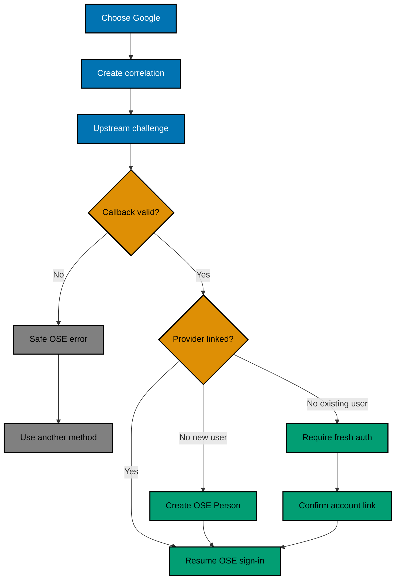
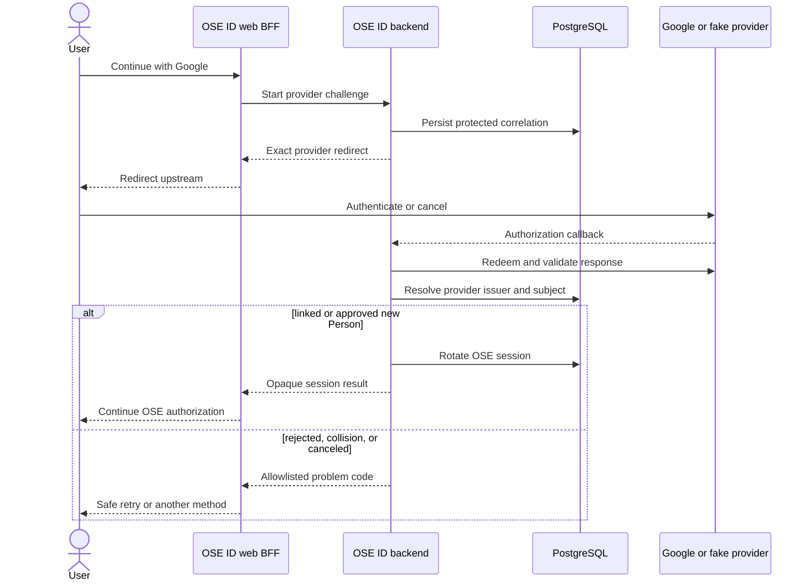
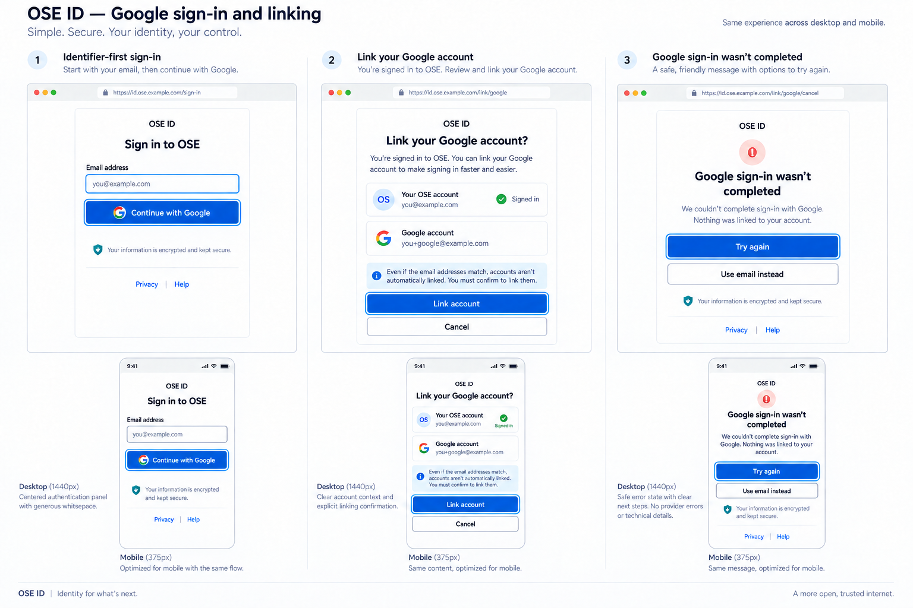
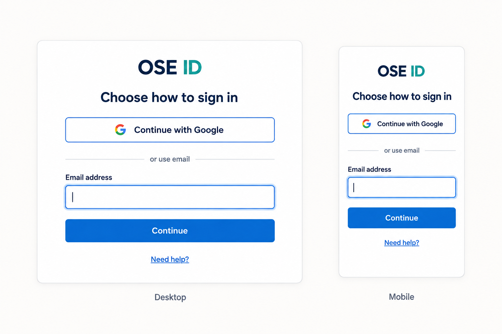

# Product Requirements — OSE ID Init 07 Google Federation

## Product Overview

The existing OSE ID sign-in page gains one external method, **Continue with Google**. The OSE BFF
starts the authorization request, the C# backend validates the upstream response through a Google
adapter, and OSE ID resumes its own account/session/authorization flow. A Google identity never bypasses
OSE email verification policy, company membership, product entitlement, consent, or token issuance.

## Terms

| Term              | Meaning here                                                                                  |
| ----------------- | --------------------------------------------------------------------------------------------- |
| External provider | A service that authenticates a person for OSE ID; Google is the only one in this slice.       |
| Federation port   | Provider-neutral interface that starts a challenge and normalizes a validated callback.       |
| Provider issuer   | Stable authority identifier from the validated upstream response.                             |
| Provider subject  | Opaque person identifier within that provider issuer.                                         |
| Correlation       | One-time state binding the browser's start request to the callback.                           |
| Link ceremony     | Recent-authenticated operation that attaches a proven provider subject to an existing Person. |

## Personas and User Stories

- As a new user, I can continue with Google and receive one OSE identity after a valid response.
- As a returning user, I can sign in through my already-linked Google identity.
- As an existing local-account user, I can deliberately link Google after recent authentication.
- As a user, I can cancel Google and choose another OSE sign-in method without losing a safe return path.
- As a maintainer, I can reproduce success and every rejection locally without real Google credentials.

## User Flow



## Interaction Sequence



## Functional Contract

### Initiation and callback

- Accept only a registered provider ID with an exact callback and allowlisted return path.
- Generate one-time state, nonce, correlation identifier, and bounded expiry using cryptographic runtime
  randomness.
- Validate transport success, issuer, audience/client, signature and key, nonce, correlation, time,
  authorization-code single use, required subject, and configured claim policy before account lookup.
- Consume correlation atomically. A duplicate callback fails without creating another session or link.
- Map upstream details to stable OSE problem codes; never expose raw provider errors or tokens.

### Account resolution and linking

- Resolve an existing link by `(provider_issuer, provider_subject)`.
- A first-time provider subject may create a new OSE Person only through the explicit new-account branch.
- A provider email—even marked verified—may prefill display/contact data but cannot locate or attach an
  existing Person.
- Linking to an existing Person requires a current OSE session, recent reauthentication, a new provider
  proof, explicit confirmation, uniqueness, and an audit event.
- Unlinking requires recent reauthentication and refuses to remove the last usable login method.
- Provider choice never selects a company. Personal/company context selection continues after OSE sign-in.

### Browser and privacy

- The browser receives only the existing opaque, secure, HTTP-only OSE session cookie.
- Google tokens, provider assertions, authorization codes, correlation secrets, and OSE tokens never
  enter browser storage, serialized props, analytics, screenshots, or committed evidence.
- Errors do not disclose whether a matching OSE email or provider subject exists.

## UI Design Funnel

### Grounding and Prior Art

- **[Repo-grounded]** Current inventory includes `libs/web-ui/src/components/button`, `input`, `alert`,
  `dialog`, `sheet`, and `card`, plus `libs/web-ui-token/src/ose.css`. Plan 05 will create
  `apps/ose-id-web`; Phase 0 must inventory its delivered sign-in shell, stories, focus/error patterns,
  and responsive tokens before editing.
- **[Web-cited, official, accessed 2026-09-15]** Google's
  [branding guidelines](https://developers.google.com/identity/branding-guidelines) require compliant
  button display for app verification and recommend “Continue with Google” as permitted action text.
  Current assets/SDK output, logo aspect ratio, prominence, localized text, and color mode are rechecked
  at execution.
- **[Web-cited, official, accessed 2026-09-15]** W3C's
  [modal-dialog pattern](https://www.w3.org/WAI/ARIA/apg/patterns/dialog-modal/) says focus moves inside
  an opened dialog and returns to its invoker when closed; explicit linking follows this contract.
- **[Judgment call]** Keep Plan 05's identifier-first hierarchy because it preserves an OSE-owned fallback
  and limits change; tester evidence may select the documented runner-up without changing security scope.

### Diverge — Low-Fidelity Alternatives

Every shipped screen/state has at least two named alternatives:

| Shipped state                                       | Alternative A — in-context (selected)                                         | Alternative B — method-first/dedicated                               | Responsive behavior                                                                      |
| --------------------------------------------------- | ----------------------------------------------------------------------------- | -------------------------------------------------------------------- | ---------------------------------------------------------------------------------------- |
| Sign-in/default/loading/unavailable                 | Google action below identifier form; inline spinner/status/fallback           | Google action first; email block remains visible beneath it          | Single full-width action column at 320–375 px; no hidden desktop-only method             |
| Explicit link confirmation                          | Comparison card/dialog names signed-in OSE account and Google display address | Dedicated confirmation page after recent authentication              | Dialog becomes full-width sheet; least-destructive action focused; Cancel always visible |
| Cancel/denied/callback failure/provider unavailable | Inline safe alert with retry and email fallback                               | Return to sign-in with persistent status banner and focus on summary | Same heading/status/recovery order at all widths; raw upstream error never rendered      |
| Unlink/last-method conflict                         | Account-method card with inline confirmation/conflict                         | Dedicated manage-methods step with confirmation                      | Controls stack; last-method explanation precedes disabled/recovery action                |

#### Option A — Identifier first with visible Google action

```text
+--------------------------------+
| OSE ID                         |
| Sign in to continue            |
| Email [____________________]   |
| [ Continue ]                   |
| ------------ or ------------  |
| [ Continue with Google ]       |
| Need help?                     |
+--------------------------------+
```

Keeps email as the primary path and makes Google discoverable without increasing navigation depth.

#### Option B — Method first

```text
+--------------------------------+
| Choose how to sign in          |
| [ Continue with Google ]       |
| -------- use email ----------  |
| Email [____________________]   |
+--------------------------------+
```

Speeds recognition for provider-first users but increases first-screen choice density.

#### Option C — Automatic provider redirect

```text
+--------------------------------+
| Continue to OSE                |
| Redirecting to Google...       |
| [ Use another sign-in method ] |
+--------------------------------+
```

Reduces clicks but hides OSE-owned methods and makes provider outage recovery worse; drop it.

### Narrow — High-Fidelity Finalists

- **Option A finalist and selected journey board:**

  

- **Option B finalist:**

  

**Precise finalist A specification:** a 400–448 px centered panel at desktop and a padded full-width
panel at 320–375 px retains Plan 05's identifier field and primary action, followed by a labeled divider
and a branding-compliant Google action. Linking uses a modal on desktop and full-width sheet on mobile,
names both accounts, initially focuses Cancel, traps focus, and restores it. Cancel/failure/unavailable
states replace the provider action region with a focused safe alert, Retry, and email fallback; loading
does not remove fallback or change layout. No passkey or Facebook control appears.

**Precise finalist B specification:** the same responsive panel places Google first and email beneath a
labeled divider. Its link-confirmation state is a dedicated page using the same comparison/cancel copy;
failure returns to method selection with a persistent focused banner. All controls remain full-width at
mobile and equal-weight at desktop; it exposes exactly Google and email, never Facebook/passkey.

Option C does not proceed because automatic redirect makes the external provider a de facto mandatory
gateway and weakens recovery.

### Select and Justify

**Selected: Option A — identifier first with visible Google action.** It preserves plan 05's hierarchy,
keeps OSE-owned login paths obvious, and needs the smallest behavior/UI change.

The selected board is the implementation direction for sign-in, explicit linking, and failure recovery.
It deliberately contains no passkey/MFA control, so plan 07 remains independently deliverable before
sibling plan 06. Display addresses are synthetic; exact copy and current Google branding are revalidated
during execution.

| Candidate | Decision reason                                                                                |
| --------- | ---------------------------------------------------------------------------------------------- |
| Option A  | Selected: consistent with the delivered shell and supports accessible fallback.                |
| Option B  | Retained evidence: clear methods, but busier and not worth changing the established hierarchy. |
| Option C  | Rejected: creates outage and recovery coupling to Google.                                      |

### Responsive Strategy

The action remains full-width and in the same focus order on mobile below `sm`, tablet at `md`, and
desktop at `lg`. The panel changes width only; no provider choice moves to a desktop-only region. Loading,
denial, and unavailable states include text and do not rely on a logo or color.

## Acceptance Criteria

### AC-GOOGLE-01 — Create a new OSE identity through Google

```gherkin
Scenario: A new provider subject completes first sign-in
  Given Google federation is enabled in a local test runtime and no OSE link exists for the validated provider issuer and subject
  When the user completes the Google authorization response and confirms the new OSE account path
  Then OSE ID creates exactly one Person and exactly one provider link
  And OSE ID continues with its own personal or company authorization-context rules
```

### AC-GOOGLE-02 — Reuse an existing provider link

```gherkin
Scenario: A linked Google identity signs in again
  Given one Person owns the validated Google issuer and subject link
  When that provider subject completes a fresh valid callback
  Then OSE ID rotates the server-side session for that Person
  And the browser receives no provider or OSE token
```

### AC-GOOGLE-03 — Never link by matching email

```gherkin
Scenario: Google returns an email already used by another OSE Person
  Given the provider issuer and subject are not linked and the asserted email matches an existing OSE account
  When the callback passes provider protocol validation
  Then OSE ID neither links nor merges the accounts
  And the response reveals no existing-account fact
```

### AC-GOOGLE-04 — Link explicitly from a recent OSE session

```gherkin
Scenario: An existing user deliberately links Google
  Given the user has a recent reauthenticated OSE session and the provider subject is unclaimed
  When the user completes a fresh Google proof and confirms linking
  Then OSE ID attaches the unique provider link to that Person
  And OSE ID records a sanitized security audit event
```

### AC-GOOGLE-05 — Reject unsafe callbacks

```gherkin
Scenario Outline: An invalid upstream response cannot authenticate
  Given a pending Google correlation exists
  When the callback has <fault>
  Then OSE ID creates no Person, link, grant, or authenticated session
  And the user receives an allowlisted retry or another-method response

  Examples:
    | fault |
    | missing or mismatched state |
    | missing or mismatched nonce |
    | wrong issuer or audience |
    | invalid signature or key |
    | expired response |
    | replayed authorization code |
    | missing provider subject |
```

### AC-GOOGLE-06 — Preserve safe cancel and unlink behavior

```gherkin
Scenario: A user cancels Google
  Given the user started Google sign-in from an allowlisted OSE return path
  When the upstream provider returns a denial response
  Then OSE ID preserves no authenticated provider result
  And the user can retry or choose another OSE sign-in method
```

```gherkin
Scenario: A user tries to unlink their last usable method
  Given Google is the Person's only usable login method
  When the recently reauthenticated user requests unlinking
  Then OSE ID refuses the unlink operation
  And the account remains usable through Google
```

### AC-GOOGLE-07 — Keep provider scope and runtime boundary narrow

```gherkin
Scenario: Non-local runtime receives fake-provider configuration
  Given OSE ID starts outside its explicit local or test runtime
  When fake-provider or local-only Google settings are present
  Then startup fails closed with a non-secret diagnostic
  And no identity endpoint becomes ready
```

### AC-GOOGLE-08 — Unlinked provider records remain auditable

```gherkin
Scenario: Unlink a non-final Google login method without erasing it
  Given a recently reauthenticated Person has email and Google as usable login methods
  When the Person confirms Google unlinking
  Then ordinary provider-link lookup no longer returns the Google link
  And the retained row records matching deletion and update actor and time fields
  And provider tokens and correlation material cannot sign in or resume a transaction
  And the serving role cannot physically delete the link
```

```gherkin
Scenario: Only configured external providers are offered
  Given external-provider sign-in is enabled with Google as the only configured provider
  When a user requests the available external-provider methods
  Then Google is offered
  And Facebook and every other unconfigured provider are not offered
```

## Product Exclusions

## BDD and Coverage Contract

Every Gherkin scenario maps to Unit, Integration, and E2E adapters under the repository BDD convention.
Any inapplicable adapter needs a per-scenario boundary reason indexed in behavior-coverage configuration
and statically validated; blanket/implicit exemptions are forbidden. Authored production lines added by
this plan maintain at least 99% Unit line coverage under the canonical metric, with only
repository-approved generated/test exclusions.

Real Google registration and production credentials remain manual future deployment inputs. This plan
does not promise provider availability, production email, Kubernetes, platform operations, or another
social provider.
