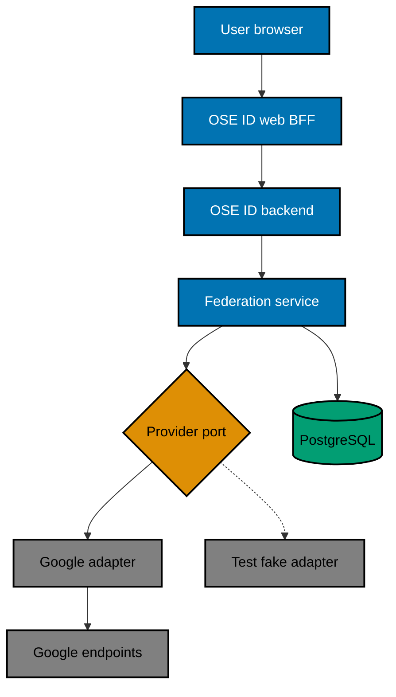

# Provider Boundary and Runtime Flow

## Starting State

Plan 05 has delivered OSE-owned sign-in, account security, the Next.js BFF, opaque browser sessions,
and backend account APIs. Plan 04 has delivered OIDC/OAuth issuance. This plan adds an upstream
authentication dependency to OSE ID; it does not change OSE ID's downstream issuer contract.

## Component Boundary

The dashed edge denotes test-only substitution, not a production runtime option.

## Provider-Neutral Port

The application layer needs two operations:

1. create a challenge descriptor for one registered provider and exact callback; and
2. validate/redeem a callback into either a normalized identity result or an allowlisted failure.

The normalized success result contains the provider ID, validated issuer, stable subject, optional
display/profile values, upstream authentication time when available, and only policy-approved metadata.
It never exposes raw ID/access/refresh tokens outside the adapter boundary.

The port must not contain Google claim names, branding, HTTP error bodies, or SDK types. A future provider
must implement the same security semantics through a separate plan; the existence of the port is not
permission to add dormant providers.

## Inbound Transport Independence

The provider-neutral port above is outbound: it isolates Google from the federation application use
case. Separately, REST/OIDC callback handling is an inbound adapter. It validates the provider protocol,
then supplies only a normalized verified identity result to application policy. Account linking,
collision handling, session rotation, tenant implications, audit, and redaction remain transport-neutral.

A future GraphQL resolver or Model Context Protocol tool cannot accept raw Google tokens/claims or link an
identity by calling the outbound provider port directly. It must invoke the same authorized federation use
case through the Init 01
[inbound-adapter boundary](../../../in-progress/ose-id-init-01-foundation/tech-docs/001-system-boundaries-and-project-topology.md#one-use-case-multiple-inbound-adapters).
This plan adds Google plus current REST/OIDC callbacks only; no GraphQL/MCP package or endpoint is added.

## Correlation State

Correlation is correctness-critical shared state. Store a hashed or protected handle, provider ID,
exact callback, allowlisted post-login return path, nonce/state binding, created/expiry times, and
single-use status in the shared state mechanism chosen by prior plans. Do not keep it in a singleton,
memory cache, local file, or one instance's data-protection key ring.

Atomic consumption ensures one callback succeeds at most once even when two backend instances receive
the same response. Failure must not consume unrelated correlations.

## Runtime Registration

`GoogleFederation.Enabled` defaults false. Local manual use may enable the real adapter only with
uncommitted credentials and exact loopback callbacks. Automated tests select the fake adapter through a
test-only composition root. Production runtime rejects:

- fake provider registration;
- loopback provider issuer/endpoints;
- local callback hosts;
- placeholder or missing client credentials when Google is enabled; and
- mutable/insecure issuer metadata overrides.

This flag is temporary until the future production deployment plan supplies a reviewed provider
registration and secrets. That later plan must test disabled/enabled modes and remove or redefine the
local-only guard explicitly.

## Failure Semantics

Provider protocol failures map to stable codes such as `provider_denied`, `provider_response_invalid`,
`provider_link_conflict`, and `provider_temporarily_unavailable`. User copy stays generic and offers a
safe alternative. Logs record a correlation ID, normalized failure category, and synthetic/provider
identifier only when policy permits; they never record tokens, codes, nonce/state values, or raw claims.

## Statelessness Proof

Backend instance A may create correlation and backend instance B may validate the callback. Both observe
the same persisted state and key material. Plan 07 tests this at repository/service level where
practical; plan 09 owns the full two-instance no-affinity browser proof.
