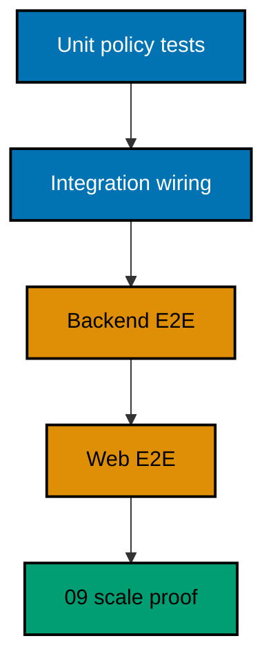

# Fake Provider and Verification

## Purpose and Boundary

Automated tests need deterministic upstream behavior without real credentials, network, consent screens,
or provider rate limits. The fake provider lives only in the backend E2E/test boundary. It is not a
second supported provider and must not share a production composition root.

## Required Surface

The fake supplies only the endpoints and claims exercised by the Google adapter contract:

- discovery metadata;
- authorization with deterministic scenario selection;
- token redemption;
- JWKS/signature verification material; and
- optional UserInfo only if the selected adapter truly needs it.

Use a unique loopback port assigned by the test lifecycle. Scenario control uses per-test signed/opaque
fixtures or a loopback-only authenticated control endpoint. Never select faults through production query
parameters.

## Scenario Matrix

| Category    | Modes                                                                                |
| ----------- | ------------------------------------------------------------------------------------ |
| Success     | new subject, linked subject, optional email/profile, personal/company-capable Person |
| User choice | denial/cancel                                                                        |
| Correlation | missing state, wrong state, missing nonce, wrong nonce, duplicate callback           |
| Trust       | wrong issuer, wrong audience, unknown key, invalid signature                         |
| Time        | expired and not-yet-valid assertion                                                  |
| Identity    | missing subject, changed email, matching email, subject linked elsewhere             |
| Lifecycle   | delayed readiness, clean crash, cleanup after test failure                           |

Each fixture uses synthetic `.test` data and stable deterministic IDs scoped to the current run. Tests
must not depend on wall-clock sleeps; inject a controllable clock where domain tests need expiry.

## Layered Verification

### Unit

Test result normalization, safe error mapping, email non-authority, link/unlink state transitions,
last-method protection, audit redaction, and concurrency decisions using fixed clock/random ports.

### Integration

Test ASP.NET route registration, antiforgery/origin protection, provider selection, configuration
validation, cookie/session rotation, and production fail-closed startup without external network.

### Backend E2E

Run the built backend, owned PostgreSQL, and fake provider. Prove real HTTP redirects/callbacks,
cryptographic validation, atomic persistence, replay denial, collisions, and cleanup.

### Web E2E

Drive the Google action, denial, generic collision, loading/unavailable state, account-security link and
unlink, focus restoration, keyboard behavior, mobile/desktop layout, and browser storage inspection.

## Cleanup Contract

The test runner owns a unique fake-provider process, temp key material, ports, database fixtures, logs,
and traces. A `finally` path stops the child, removes temp material, and verifies port/process absence
after success, assertion failure, provider crash, and interrupt. It preserves the primary failure code
and reports cleanup failure separately.

Plan 09 composes this provider into the full reusable OSE ID runner; plan 07 must expose a stable runner
input/output contract rather than requiring later scripts to copy implementation details.
