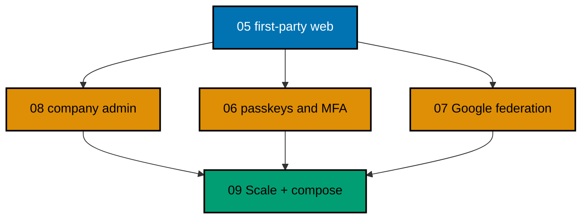

# OSE ID Init 08 — Company Administration

> **Status:** Backlog — not started. Execute only after
> [`ose-id-init-05-first-party-web`](../ose-id-init-05-first-party-web/README.md) has merged and this
> plan has moved to `plans/in-progress/` through a separate lifecycle-only change.

Add a tenant-scoped `/admin/company` presentation area inside `ose-id-web`. Plan 03 remains the sole
owner of the company, membership, invitation, entitlement, authorization, audit, persistence, migration,
and RLS contracts. This slice only adapts those already-delivered APIs into allowlisted BFF view models
and accessible company-admin screens; it creates neither a fifth deployable nor a platform console.

## Delivery Position

## Scope

- Protected routes inside `ose-id-web` for member, invitation, and entitlement views beneath
  `/admin/company`.
- An allowlisted BFF adapter over the unchanged Plan 03 APIs, with typed company-admin view models and
  safe problem/status mapping.
- Responsive, accessible roster, member detail, invitation, entitlement, confirmation, empty, denied,
  stale, and failure states.
- Browser/E2E proof that UI actions invoke Plan 03 commands and render their authoritative results,
  including last-admin conflicts, invitation state, entitlement state, and cross-company denial.
- Local Mailpit inspection of invitation messages produced by the already-delivered Plan 03 flow.
- Local/test only; production remains fail-closed and deployment stays deferred.

## Non-Goals

- Cross-company search, platform superadmin/operator controls, impersonation, account merge, key
  operations, incident tools, or global identity event access.
- A separate `ose-id-admin-web` deployable.
- Any new or changed C# domain aggregate, company API/command, database table, persistence mapping,
  migration, RLS policy, invitation capability/delivery mechanism, entitlement rule, or last-admin rule.
- Product-domain roles such as LMS instructor, assessor, or course editor. OSE ID manages entry
  entitlement only.
- Company creation/legal verification, billing, domain claiming, SCIM, SAML, bulk CSV, or directory sync.
- Deployment, Kubernetes, production mail, DNS, cloud secrets, or operator networking.
- Changing personal-context behavior: a person without a company remains valid but cannot enter a
  company-admin route without active company-admin authority.

## Invariants

- Authored production code maintains at least 99% Unit line coverage. Every Gherkin
  scenario maps to Unit, Integration, and E2E adapters unless an exact boundary-based exemption is
  indexed and statically validated.

- Plan 03's backend derives active company and enforces membership, mutation policy, persistence, and
  PostgreSQL RLS; Plan 08 neither duplicates nor weakens those rules.
- The BFF accepts only allowlisted fields, never treats a browser-supplied company ID as authority, and
  displays the current Plan 03 result rather than predicting domain outcomes.
- One Person may belong to many companies, but one admin request operates in exactly one company.
- Company admins manage memberships/invitations/entitlements only within that company.
- Process instances remain stateless; no admin correctness state lives in one web/backend process.
- OSE ID source/docs inherit root MIT; dependencies/assets retain their own licenses.
- Future deployment is blocked at minimum by the private plan
  `start-infra-04-deploy-tencent-lighthouse-k3s-cluster` and then-current platform handoff gates.

## Reader Map

- [Business requirements](brd.md)
- [Product requirements and UI design funnel](prd.md)
- [Technical design map](tech-docs/README.md)
- [Execution checklist](delivery.md)
- [Execution learnings](learnings.md)
