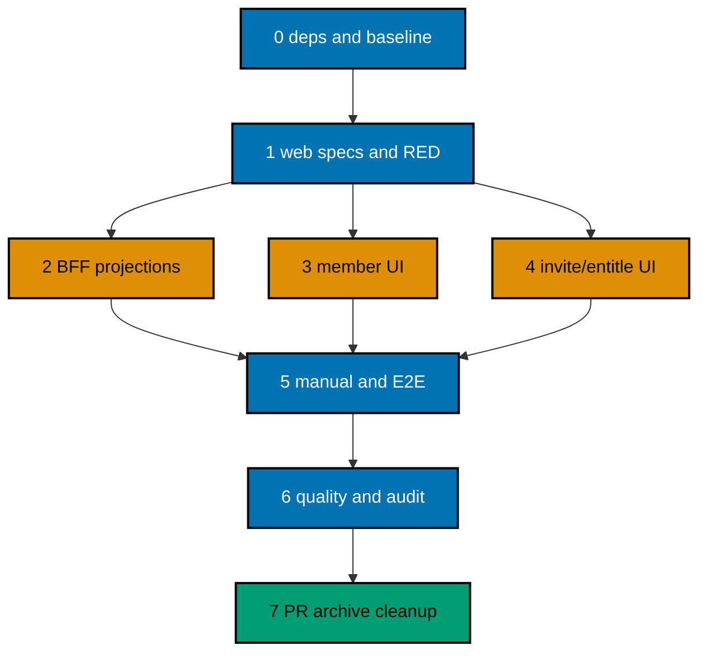

# Delivery — OSE ID Init 08 Company Administration

> `[AI]` is the default executor; `[HUMAN]` is reserved for privileged out-of-band input. Do not
> implement this backlog plan. Promote it to `plans/in-progress/` in a lifecycle-only change after its
> dependency is complete.

## Lifecycle and Dependency

`ose-id-init-05-first-party-web` must be complete on `origin/main`. Phase 0 resolves its archived path
from the done index and reads Plan 03's delivered company API contract. Plans 06, 07, and 08 are
independent siblings after Plan 05. Plan 09 and LMS wait for all three.

## Worktree

Worktree path: `worktrees/ose-id-init-08-company-admin/`

Provisioning is pending. This plan was authored under the approved authoring-worktree exception, so it
intentionally contains neither Provisioned Worktree Identity nor Delivery Branch Inventory. From the
repository root, Phase 0 provisions exactly one execution worktree:

```bash
rtk git worktree add -b ose-id-init-08-company-admin-base worktrees/ose-id-init-08-company-admin origin/main
```

If that branch already exists, use
`rtk git worktree add worktrees/ose-id-init-08-company-admin ose-id-init-08-company-admin-base`.

If provisioning is interrupted, run `rtk git worktree list --porcelain`; reuse the declared route if it
exists, then run `rtk git status --short` and
`rtk git merge-base --is-ancestor origin/main HEAD`. On a mismatch or partial worktree, stop and follow
`repo-governance/development/workflow/worktree-setup.md`; never force-delete it or fabricate identity.
Only Phase 0 records the observed identity and branch inventory.

## Delivery Mode: worktree-to-pr

Mode is `worktree-to-pr`: one short-lived branch, one PR to `main`, and no direct environment branch.
Current-head/base `pr-quality-gate.yml`, current-head `pr-leak-review`, applicable UI/API gates, and
identity/security semantic review are mandatory before `[AI]` merge.

## Delivery Unit

| Unit                                   | Phases | Natural seam                                                                                                                      | Safe resulting state                                                                                                             |
| -------------------------------------- | ------ | --------------------------------------------------------------------------------------------------------------------------------- | -------------------------------------------------------------------------------------------------------------------------------- |
| DU1 — company administration web slice | 0–7    | BFF contract, guarded `/admin/company` UI, tests, live proof, and archival form one consumer of the already-delivered company API | Company administrators can manage only their active company through a local/test-guarded UI; backend/schema/RLS remain unchanged |

`CompanyAdmin.Enabled` defaults false outside the owned local/test stack. No C# domain/API/persistence/
migration/RLS delta is allowed. Phase or task counts never create another delivery unit.

## Exact File-Impact Boundary

Phase 0 reconciles these proposed `[N]` paths with Plan 05's delivered layout before RED; any amendment
must stay inside the same web-only responsibility:

- `apps/ose-id-web/src/app/(company-admin)/admin/company/` `[N]`
- `apps/ose-id-web/src/features/company-admin/api/` `[N]`
- `apps/ose-id-web/src/features/company-admin/models/` `[N]`
- `apps/ose-id-web/src/features/company-admin/components/` `[N]`
- `apps/ose-id-web-e2e/src/company-admin/` `[N]`
- `specs/apps/ose/id-web/behaviours/company-admin/company-admin.feature` `[N]`
- `specs/apps/ose/id-web/contracts/company-admin.openapi.yaml` `[N]`
- `apps/ose-id-web/project.json` and `apps/ose-id-web-e2e/project.json` `[E]`

Plan 05 generated clients and `libs/web-ui` are read-only inputs. If the delivered client surface or
shared primitives cannot support this slice, stop and amend the plan with exact paths before RED.

Explicitly excluded: every file beneath `apps/ose-id-be`, `apps/ose-id-be-e2e`, and
`specs/apps/ose/id-be`; database schema/migrations/RLS; Plan 03 company aggregates, commands, queries,
API operations, audit, invitation delivery, and entitlement rules. A missing backend behavior stops this
plan for dependency correction.

## Parallelization Model

### Delivery Boundaries

| Unit | Change phases | Worktree and branch                                                                                                       | Delivery opportunity                                                                           | Cohesive seam                                                                                                           | Resulting `main`, rollback, and flag evidence                                                                                                                                                                                                                                                                                                                                                                                  |
| ---- | ------------- | ------------------------------------------------------------------------------------------------------------------------- | ---------------------------------------------------------------------------------------------- | ----------------------------------------------------------------------------------------------------------------------- | ------------------------------------------------------------------------------------------------------------------------------------------------------------------------------------------------------------------------------------------------------------------------------------------------------------------------------------------------------------------------------------------------------------------------------ |
| DU1  | 0–7           | `worktrees/ose-id-init-08-company-admin/`; observed Phase-0 execution branch based on `ose-id-init-08-company-admin-base` | One PR after Phase 7 only; BFF/member/invitation/entitlement lanes are not separate deliveries | Guarded `/admin/company`, same-origin BFF projections, member/invitation/entitlement tasks, specs, UI/API/live evidence | `main` provides one local/test company-admin view limited to the active company; backend, schema, and RLS remain unchanged; production remains disabled. Rollback turns off `CompanyAdmin.Enabled` and removes web/BFF artifacts without reversing company mutations already committed by Plan 03. Evidence proves enabled/disabled modes, personal/non-admin denial, Company-B non-disclosure, and backend semantic no-delta. |

BFF projection, members, invitations, and entitlements may execute in separate lanes only after
contracts freeze; none may add or change backend, schema, or RLS ownership.

### Phase-Local Execution Defaults

Every checkbox and gate inherits its phase row unless it declares a stricter owner, path, command,
observation, evidence destination, or failure route. Evidence paths are relative to
`plans/in-progress/ose-id-init-08-company-admin/`. No checkbox completes from review alone.

| Phase | Default owner                                       | Bounded paths                                                                                                                                                           | Literal verification command                                                                                                                                                                                                                                                        | Expected result and evidence                                                                                                                               | Failure route                                                                                                                     |
| ----- | --------------------------------------------------- | ----------------------------------------------------------------------------------------------------------------------------------------------------------------------- | ----------------------------------------------------------------------------------------------------------------------------------------------------------------------------------------------------------------------------------------------------------------------------------- | ---------------------------------------------------------------------------------------------------------------------------------------------------------- | --------------------------------------------------------------------------------------------------------------------------------- |
| 0     | Root integrator                                     | execution worktree, predecessor diffs, declared Plan 08 file boundary                                                                                                   | Run the Phase 0 predecessor-green baseline commands from this section, including `rtk ./hippo run --class transactional --resource-tier standard --disk-path . -- npm exec nx -- run-many -t test:coverage:behaviour --projects=ose-id-be,ose-id-be-e2e,ose-id-web,ose-id-web-e2e`. | Exit 0; dependency/worktree/port/license/baseline records under `evidence/phase-0-*`.                                                                      | Preserve sanitized output and stop in Phase 0; prerequisite drift routes to its owner and file-boundary drift requires amendment. |
| 1     | Spec/BFF/test owners named by each packet           | `specs/apps/ose/id-web/behaviours/company-admin/**`, `specs/apps/ose/id-web/contracts/company-admin.openapi.yaml`, Plan 08 test paths under `apps/ose-id-web{,-e2e}/**` | `rtk ./hippo run --class ephemeral --resource-tier standard --disk-path . -- npm exec nx -- run-many -t test:unit,test:integration,test:e2e,test:coverage:behaviour -p ose-id-web,ose-id-web-e2e`                                                                                   | Specs/coverage pass and only named absent company-admin behaviors are RED under `evidence/phase-1-*`.                                                      | Return to the exact spec or RED packet; any backend/spec-backend diff blocks Phase 2.                                             |
| 2     | BFF contract lane                                   | `apps/ose-id-web/src/features/company-admin/api/**`, `apps/ose-id-web/src/features/company-admin/models/**`                                                             | `rtk ./hippo run --class transactional --resource-tier standard --disk-path . -- npm exec nx -- run-many -t test:unit,test:integration -p ose-id-web`                                                                                                                               | BFF RED → GREEN → REFACTOR transcripts and empty backend diff under `evidence/phase-2-*`.                                                                  | Reopen the first failing TDD packet; generated-client/backend need stops for amendment.                                           |
| 3     | Member UI lane                                      | `apps/ose-id-web/src/app/(company-admin)/admin/company/**`, `apps/ose-id-web/src/features/company-admin/components/**`, `apps/ose-id-web-e2e/src/company-admin/**`      | `rtk ./hippo run --class transactional --resource-tier standard --disk-path . -- npm exec nx -- run-many -t test:unit,test:e2e -p ose-id-web,ose-id-web-e2e`                                                                                                                        | Member RED → GREEN → REFACTOR, accessibility, locale, and width evidence under `evidence/phase-3-*`.                                                       | Reopen the first failing member packet; tenant leak or backend change returns to Phase 2/file boundary.                           |
| 4     | Invitation/entitlement UI lane                      | the same bounded company-admin component/BFF/E2E paths                                                                                                                  | `rtk ./hippo run --class transactional --resource-tier standard --disk-path . -- npm exec nx -- run-many -t test:unit,test:integration,test:e2e -p ose-id-web,ose-id-web-e2e`                                                                                                       | Invitation/entitlement RED → GREEN → REFACTOR and Mailpit-safe evidence under `evidence/phase-4-*`.                                                        | Reopen the first failing operation/UI packet; capability disclosure blocks the phase.                                             |
| 5     | Root integrator and browser lane                    | running local stack and ignored `local-tmp/ose-id-init-08-*` only                                                                                                       | `rtk ./hippo run --class transactional --resource-tier standard --disk-path . -- npm exec nx -- run ose-id-web-e2e:test:e2e`                                                                                                                                                        | Twelve-operation curl matrix, browser matrix, and empty cleanup inventory under `evidence/phase-5-*`.                                                      | Wrong status/schema/header/tenant/browser state reopens its owning phase; cleanup residue reopens the runner dependency.          |
| 6     | Root integrator and named API/UI/live/review agents | complete Plan 08 candidate diff/evidence                                                                                                                                | `rtk ./hippo run --class transactional --resource-tier standard --disk-path . -- ./rhino gate run --surface=pre-push`                                                                                                                                                               | Exact-head gate/review/tester lifecycle PASS under `evidence/phase-6-*`.                                                                                   | Any fix changes HEAD and reruns Phase 6 from its first packet; unresolved finding blocks archival.                                |
| 7     | Root integrator                                     | learnings, archive/indexes, PR branch, declared worktree                                                                                                                | `rtk ./rhino plan validate` followed by `rtk ./rhino md links validate plans`                                                                                                                                                                                                       | Archive-containing reviewed merge, terminal audit PASS, containment, and non-force cleanup proof under `evidence/phase-7-*` and the external final report. | Reopen the first unsupported phase; retain branch/worktree on any ambiguity or audit failure.                                     |

### Agent Topology



The root integrator owns shared route wiring, generated client reconciliation, task ledger, and final
verification. Agents own disjoint exact paths, preserve concurrent edits, and reconcile `git status`.

### PostgreSQL Persistence Boundary

Plan 08 adds no backend, schema, migration, RLS, or direct PostgreSQL write. The Next.js BFF uses
only the delivered typed company-admin backend operations and must not import a PostgreSQL client.
The C# backend remains the sole OSE-owned persistence authority: Npgsql + SqlKata PostgreSQL
compiler/`SqlKata.Execution`, explicit projections and transactions, bound parameters,
cancellation/timeouts, no `SELECT *`, and no EF change tracking or LINQ-to-database runtime path.
ASP.NET Core Identity remains hashing/validation only—not Identity EF stores or `UserManager`
persistence. EF Core otherwise remains migration tooling; the inherited custom OpenIddict stores remain
the only runtime protocol persistence path. Phase 2–6 import-boundary, generated-client,
compiled-SQL snapshot/query-count, and `rtk git diff --exit-code -- apps/ose-id-be apps/ose-id-be-e2e specs/apps/ose/id-be`
proof must remain green under `evidence/phase-*-persistence-boundary/`. A new write/query need or
backend/schema diff stops execution and requires plan amendment rather than adding persistence here.

Every member/invitation/entitlement remove or revoke command invoked by this UI retains the predecessor
audit/soft-delete contract. Phase 4 reruns `AC-TEN-12` at backend Unit, Integration, and E2E, verifies
the UI/BFF actor reaches the backend audit context, confirms ordinary views omit tombstones, and proves
the serving role still rejects physical `DELETE`. Plan 08 adds no table, migration, direct database
probe route, or exemption; it consumes existing test adapters and sanitized evidence.

### Mandatory Nx Quality Matrix

The full green matrix below is mandatory as the completion gate of the first implementation phase
(Phase 2) and for every later implementation, final local-quality, and exact-head delivery/PR gate.
It is not a Phase 0 or Phase 1 success criterion. Before creating any Plan 08 scenario, binding, or
test, Phase 0 and Phase 1 each run this exact predecessor-green baseline:

```bash
rtk ./hippo run --class transactional --resource-tier standard --disk-path . -- npm exec nx -- run-many -t build --projects=ose-id-be,ose-id-web
rtk ./hippo run --class transactional --resource-tier standard --disk-path . -- npm exec nx -- run-many -t typecheck,lint,test:quick --projects=ose-id-be,ose-id-be-e2e,ose-id-web,ose-id-web-e2e
```

Then run the static predecessor behavior baseline:

```bash
rtk ./hippo run --class transactional --resource-tier standard --disk-path . -- npm exec nx -- run-many -t test:coverage:behaviour --projects=ose-id-be,ose-id-be-e2e,ose-id-web,ose-id-web-e2e
```

Phase 0 verifies the commands resolve to real targets in all four OSE ID `project.json` files, not
echo, no-op, success-sentinel, or duplicate aliases. The C# backend requires
`<Nullable>enable</Nullable>`; its Nx `typecheck` runs the .NET compiler with
`/p:TreatWarningsAsErrors=true`, while Nx `lint` runs Roslyn analyzer verification plus
`dotnet format --verify-no-changes`. The Next.js owner uses strict TypeScript;
`typecheck` runs `tsc --noEmit` and `lint` runs ESLint (it may
also run the repository's faster companion linter). The TypeScript E2E project also has a no-emit
typecheck and a real repository-standard lint target, but intentionally omits `build` because it
produces no deployable bundle. Each Phase 2-and-later matrix gate writes exit codes and inspected
target/configuration proof to its phase evidence destination as `nx-quality.txt`; any failure reopens
that gate and blocks progression. Phase 1 records the green predecessor baseline first, then runs only
its explicitly named static-coverage and RED commands. A nonzero result is nonblocking only when its
recorded RED ledger names the missing Plan 08 behavior; any baseline, target/configuration, or unrelated
failure blocks Phase 2.

## Phase 0: Dependency, Environment, and Baseline

**Input:** completed Plans 03 and 05 on `origin/main`, lifecycle-only promotion, and one repository checkout.

**Outcome:** the execution worktree, exact predecessor contracts/targets, ports, licenses, and green baseline are proven.

**Proof:** sanitized dependency, worktree, target inventory, and baseline transcripts under `evidence/phase-0-*`.

Fix every failure encountered, including preexisting failures in the affected baseline, at its root
cause. Never skip, loosen, retry, quarantine, or narrow a gate to make this delivery pass.

- [ ] [AI] **Owner: integrator; predecessors.** Run `rtk git fetch origin`,
      `rtk rg -n "ose-id-init-0(3|5)" plans/done/README.md`, and `rtk git show --stat --oneline` for each
      resolved merge; inspect their full delivered diffs and terminal audits. Save exact archive/merge/API/
      session/target/locale/UI facts at `evidence/phase-0-dependencies.md`. Missing, non-ancestor, stale, or
      conflicting proof stops before worktree creation and routes to the prerequisite owner.
- [ ] [AI] **Owner: integrator; worktree.** Verify the lifecycle-only promotion diff, run
      `rtk git worktree list --porcelain`, then provision/enter the exact worktree using the Worktree
      section command. Save path, branch, 40-character HEAD, creator/session, UTC time, and inventory at
      `evidence/phase-0-worktree.md`. Divergence from current `origin/main` or second worktree stops under
      the documented recovery procedure.
- [ ] [AI] Run `rtk ./hippo run --class transactional --resource-tier standard --disk-path . -- npm install` and
      `rtk npm run doctor` (read-only; only if it reports drift, run
      `rtk ./hippo run --class transactional --resource-tier standard --disk-path . -- ./rhino toolchain provision --apply`
      and repeat Doctor); inspect the diff
      and reject secrets or unrelated mutation.
- [ ] [AI] **Owner: web lane; route/component/port inventory.** Run
      `rtk rg -n "api/bff|Card|Table|Dialog|Alert|3500|8501|5438|1026|8026" apps/ose-id-web libs/web-ui libs/web-ui-token docs/reference/web-sites.md repo-config.yml`
      and `rtk lsof -nP -iTCP -sTCP:LISTEN`. Save exact reusable/net-new decisions and collision results at
      `evidence/phase-0-web-inventory.md`. Any occupied reserved port or unowned duplicate component stops
      for plan amendment; never select a port or shared primitive silently.
- [ ] [AI] **Owner: dependency reviewer; licenses.** Run
      `rtk git ls-files LICENSE LICENSING-NOTICE.md package-lock.json` and the delivered Plan 05 dependency
      audit target; record package/version/license/source/disposition at `evidence/phase-0-licenses.md`.
      Unknown/incompatible/missing-notice dependencies block the phase; OSE-authored source remains MIT.
- [ ] [AI] **Owner: integrator; baseline.** Run the Phase 0 predecessor-green baseline commands,
      `rtk ./hippo run --class transactional --resource-tier standard --disk-path . -- npm exec nx -- run-many -t test:coverage:behaviour --projects=ose-id-be,ose-id-be-e2e,ose-id-web,ose-id-web-e2e`,
      `rtk ./hippo run --class transactional --resource-tier standard --disk-path . -- npm exec nx -- run ose-id-web-e2e:test:e2e`,
      and the canonical pre-push registry command already shown. Store exits and cleanup inventory at
      `evidence/phase-0-baseline.md`. Every failure is fixed at root cause and the full baseline rerun;
      never narrow, retry, skip, quarantine, or continue red.

### Phase 0 Gate

- [ ] [AI] Rerun
      `rtk ./hippo run --class transactional --resource-tier standard --disk-path . -- npm exec nx -- affected -t build,typecheck,lint,test:quick,test:coverage:behaviour --base=origin/main --head=HEAD`
      and `rtk ./hippo run --class transactional --resource-tier standard --disk-path . -- ./rhino gate run --surface=pre-push`;
      acceptance: both exit 0 and dependency, exact API/view-model mapping, worktree, ports, license, and
      baseline evidence are current at the same HEAD.

> **Pause Safety:** no runtime/schema change exists. Safe to stop. To resume:
> `rtk ./hippo run --class transactional --resource-tier standard --disk-path . -- npm exec nx -- affected -t build,typecheck,lint,test:quick --base=origin/main --head=HEAD`.

## Phase 1: UI/BFF Specs and RED

**Input:** technical documents 005–007, unchanged Plan 03 OpenAPI, and Plan 05 web/BFF conventions.

**Outcome:** app-scoped Gherkin and deliberately failing BFF/UI tests define the entire web-only slice.

**Proof:** static adapter-map output and three sanitized RED transcripts under `evidence/phase-1-*`.

- [ ] [AI] **Owner: `specs-maker`; scenario map.** Map every AC-ADMIN scenario to Unit, Integration, and E2E adapters under
      `specs/apps/ose/id-web/behaviours/company-admin/company-admin.feature`; any per-scenario adapter exemption names its boundary
      reason, is indexed in behavior-coverage config, and passes static validation. Run
      `rtk ./hippo run --class ephemeral --resource-tier standard --disk-path . -- npm exec nx -- run-many -t test:coverage:behaviour --projects=<affected-projects>`
      and save `evidence/phase-1-specs.txt`. No blanket exemption; any parse/ownership/coverage failure
      returns to this packet.
- [ ] [AI] **Owner: BFF contract lane; closed projections.** Specify only `CompanyAdminContextView`, `CompanyMemberListItemView`,
      `CompanyMemberDetailView`, `CompanyInvitationListItemView`, `CompanyEntitlementView`, and the
      allowlisted problem mapper in `specs/apps/ose/id-web/contracts/company-admin.openapi.yaml` over
      unchanged Plan 03 operations. Run the repository OpenAPI lint/bundle target recorded in Phase 0 and
      save semantic operation/schema diff at `evidence/phase-1-openapi.txt`. Any extra field/operation or
      backend contract change blocks RED and routes to this owner.
- [ ] [AI] **RED — BFF contract:** add handler, runtime-schema, safe-projection, auth/context, status/
      problem-mapping, CSRF, pagination, idempotency, concurrency, and redaction Unit/Integration tests.
      Run `rtk ./hippo run --class ephemeral --resource-tier standard --disk-path . -- npm exec nx -- run ose-id-web:test:unit`
      and `rtk ./hippo run --class ephemeral --resource-tier standard --disk-path . -- npm exec nx -- run ose-id-web:test:integration`.
      Acceptance: the new BFF tests fail only because the company-admin handlers/projections are absent;
      save sanitized output in `evidence/phase-1-bff-red.txt`.
- [ ] [AI] **RED — member UI:** add component and Playwright tests for member list/detail, tenant-safe
      verified-email-prefix filtering with query-bound pagination, loading/empty/error/denied, stale/last-admin conflict, keyboard/focus, zoom, and
      all required widths/locales. Run the Unit command above and
      `rtk ./hippo run --class ephemeral --resource-tier standard --disk-path . -- npm exec nx -- run ose-id-web-e2e:test:e2e`.
      Acceptance: only missing member presentation fails; save `evidence/phase-1-members-red.txt`.
- [ ] [AI] **RED — invitation/entitlement UI:** add component/BFF/Playwright tests for list/create/
      resend/revoke, Mailpit-visible delivery, status, entitlement grant/revoke, recent-auth, and safe
      conflicts. Run the same three targets. Acceptance: failures point only to missing presentation/
      BFF behavior and no backend test changes; save `evidence/phase-1-invitations-entitlements-red.txt`.
- [ ] [AI] **Owner: test integrator; RED coverage matrix.** Inspect the three RED test inventories with
      `rtk rg -n "Company A|Company B|personal|non.admin|loading|empty|denied|stale|last.admin|recent.auth|invitation|entitlement|320|375|768|1280" apps/ose-id-web apps/ose-id-web-e2e`
      and save a scenario/state/viewport/locale matrix at `evidence/phase-1-red-coverage.md`. Acceptance:
      every named case has one test owner and expected RED observation; a missing or duplicate owner
      returns to the relevant RED packet before the Phase 1 gate.

### Phase 1 Gate

- [ ] [AI] Verify `evidence/phase-1-*` contains the immediately preceding green predecessor baseline and
      its command/target records before the first Plan 08 scenario, binding, or test. Inspect the isolated
      RED ledger: only named absent Plan 08 behavior may be nonzero; a baseline, target/configuration, or
      unrelated failure blocks Phase 2. Do not require the full green matrix until Phase 2 completes.
- [ ] [AI] Run
      `rtk ./hippo run --class ephemeral --resource-tier standard --disk-path . -- npm exec nx -- run-many -t test:coverage:behaviour --projects=ose-id-web,ose-id-web-e2e`;
      acceptance: static BDD coverage passes, every scenario maps to Unit/Integration/E2E, all intended
      tests have recorded expected RED output, and `rtk git diff --exit-code -- apps/ose-id-be apps/ose-id-be-e2e specs/apps/ose/id-be`
      exits 0.

> **Pause Safety:** only new web tests are red and production behavior is inert. Safe to stop. To resume:
> `rtk ./hippo run --class ephemeral --resource-tier standard --disk-path . -- npm exec nx -- run-many -t test:coverage:behaviour --projects=ose-id-web,ose-id-web-e2e`.

## Phase 2: Typed BFF Projections

**Input:** Phase 1 BFF RED tests and the unchanged Plan 03 generated client surface.

**Outcome:** server-only adapters expose exactly the allowlisted view/problem models.

**Proof:** RED, GREEN, and REFACTOR transcripts in `evidence/phase-2-bff-*.txt` plus an empty backend diff.

- [ ] [AI] **RED:** rerun the BFF handler/projection cases with
      `rtk ./hippo run --class ephemeral --resource-tier standard --disk-path . -- npm exec nx -- run ose-id-web:test:unit` and
      `rtk ./hippo run --class ephemeral --resource-tier standard --disk-path . -- npm exec nx -- run ose-id-web:test:integration`;
      acceptance: the named company-admin cases fail only because adapters/view models are absent while
      predecessor cases pass. Save `evidence/phase-2-bff-red.txt`.

- [ ] [AI] **GREEN:** implement the exact allowlisted view models and server-only adapters. Use the Plan 05
      session; never accept browser company identity as authority, cache authorization, or pass upstream
      bodies/errors through. Run
      `rtk ./hippo run --class ephemeral --resource-tier standard --disk-path . -- npm exec nx -- run ose-id-web:test:unit` and
      `rtk ./hippo run --class ephemeral --resource-tier standard --disk-path . -- npm exec nx -- run ose-id-web:test:integration`;
      acceptance: the Phase 1 BFF RED set is green and all predecessor tests remain green. Save
      `evidence/phase-2-bff-green.txt`.
- [ ] [AI] Map success, validation, denied/not-found, stale version, recent-auth, and last-admin responses.
      Use the delivered Plan 05 client surface without regeneration. Stop if a generated-client,
      shared-library, or backend change would be needed, then amend the exact file boundary before RED.
      Run the Phase 2 Unit/Integration commands; acceptance: every closed status maps safely and unknown
      status fails closed. Save `evidence/phase-2-problem-map-green.txt`.
- [ ] [AI] **REFACTOR:** remove duplicated state/policy language and prove no provider subject, credential,
      raw invitation capability, global audit, product role, or Company B field enters a view model.
      Rerun both commands plus OpenAPI validation for
      `specs/apps/ose/id-web/contracts/company-admin.openapi.yaml`; acceptance: output is green, the
      generated/client boundary has no hand edits, and the backend diff is empty. Save
      `evidence/phase-2-bff-refactor.txt`.

### Phase 2 Gate

- [ ] [AI] Run the Phase 2 Unit and Integration commands plus
      `rtk git diff --exit-code -- apps/ose-id-be apps/ose-id-be-e2e specs/apps/ose/id-be`;
      acceptance: both suites pass, authored production code reports at least 99% Unit line coverage,
      OpenAPI validation passes, and the backend/spec diff is empty.

> **Pause Safety:** routes remain guarded and presentation-independent. Safe to stop. To resume:
> `rtk ./hippo run --class ephemeral --resource-tier standard --disk-path . -- npm exec nx -- run ose-id-web:test:integration`.

## Phase 3: Member Roster and Detail UI

**Input:** selected roster/drawer design, Phase 2 BFF projections, and member scenarios from document 005.

**Outcome:** the member list/detail journey is responsive, accessible, tenant-safe, and API-authoritative.

**Proof:** RED/GREEN/REFACTOR transcripts plus locale/breakpoint evidence under `evidence/phase-3-*`.

- [ ] [AI] **RED:** run the new member component and browser cases with
      `rtk ./hippo run --class ephemeral --resource-tier standard --disk-path . -- npm exec nx -- run ose-id-web:test:unit` and
      `rtk ./hippo run --class ephemeral --resource-tier standard --disk-path . -- npm exec nx -- run ose-id-web-e2e:test:e2e`;
      acceptance: named member cases fail for absent roster/detail presentation while BFF and predecessor
      cases pass. Save `evidence/phase-3-members-red.txt`.

- [ ] [AI] **GREEN:** implement the selected semantic roster/detail drawer, labeled mobile cards, loading,
      empty, pagination/filter, denied, stale, and last-admin conflict states using shared primitives.
      Run `rtk ./hippo run --class ephemeral --resource-tier standard --disk-path . -- npm exec nx -- run ose-id-web:test:unit`
      and `rtk ./hippo run --class ephemeral --resource-tier standard --disk-path . -- npm exec nx -- run ose-id-web-e2e:test:e2e`;
      acceptance: the Phase 1 member RED set is green at every supported locale/width. Save
      `evidence/phase-3-members-green.txt`.
- [ ] [AI] Implement keyboard/focus/status behavior, 200% zoom, 320 px safety, and table headers/card labels.
      Run the Phase 3 Unit/E2E commands; acceptance: automated accessibility/keyboard cases pass and
      manual evidence has no clipped control. Save `evidence/phase-3-members-accessibility-green.txt`.
- [ ] [AI] **REFACTOR:** keep authorization server-derived and no action hover/color-only. Rerun the exact
      Unit and E2E commands above, whose configured suites include component accessibility and Playwright
      locale/breakpoint coverage. Save commands and
      sanitized output in `evidence/phase-3-members-refactor.txt`; acceptance: no duplicate projection,
      raw control, inaccessible name, focus loss, page-level horizontal scroll, or backend change.

### Phase 3 Gate

- [ ] [AI] Rerun the Phase 3 Unit/E2E commands; acceptance: the selected member flow passes at every
      supported locale and 320/375/768/1280 CSS px with zero leak, console error, inaccessible control,
      focus loss, or horizontal page scroll.

> **Pause Safety:** the local-guarded route renders authoritative API results only. Safe to stop. To resume:
> `rtk ./hippo run --class ephemeral --resource-tier standard --disk-path . -- npm exec nx -- run ose-id-web-e2e:test:e2e`.

## Phase 4: Invitation and Entitlement UI

**Input:** Phase 2 BFF projections and invitation/entitlement scenarios from document 005.

**Outcome:** the UI invokes Plan 03 operations and renders authoritative outcomes without domain duplication.

**Proof:** RED/GREEN/REFACTOR transcripts and sanitized Mailpit/browser evidence under `evidence/phase-4-*`.

- [ ] [AI] **RED:** run invitation/entitlement component, BFF, and browser cases with
      `rtk ./hippo run --class ephemeral --resource-tier standard --disk-path . -- npm exec nx -- run ose-id-web:test:unit`,
      `rtk ./hippo run --class ephemeral --resource-tier standard --disk-path . -- npm exec nx -- run ose-id-web:test:integration`, and
      `rtk ./hippo run --class ephemeral --resource-tier standard --disk-path . -- npm exec nx -- run ose-id-web-e2e:test:e2e`;
      acceptance: named cases fail only for absent UI/BFF presentation and the backend remains unchanged.
      Save `evidence/phase-4-invitations-entitlements-red.txt`.

- [ ] [AI] **GREEN:** implement invitation list/create/resend/revoke/status and entitlement grant/revoke
      screens by invoking existing Plan 03 commands. Render Mailpit-delivered flow; never create, store,
      parse, log, or expose a capability. Run
      `rtk ./hippo run --class ephemeral --resource-tier standard --disk-path . -- npm exec nx -- run ose-id-web:test:unit`,
      `rtk ./hippo run --class ephemeral --resource-tier standard --disk-path . -- npm exec nx -- run ose-id-web:test:integration`,
      and `rtk ./hippo run --class ephemeral --resource-tier standard --disk-path . -- npm exec nx -- run ose-id-web-e2e:test:e2e`;
      acceptance: the Phase 1 invitation/entitlement RED set is green and Mailpit assertions contain only
      synthetic data. Save `evidence/phase-4-invitations-entitlements-green.txt`.
- [ ] [AI] Rerun retained `AC-TEN-12` through backend Unit, Integration, and built E2E after the BFF
      revoke/remove journeys. Acceptance: actor attribution is preserved, ordinary reads omit the
      tombstone, a serving-role hard delete fails, and no backend/schema diff or test-only API is added.
- [ ] [AI] Implement destructive confirmation/recent-auth return, focus restoration, stale/error recovery,
      and a strict entry-entitlement vocabulary with no product-role input. Run the three Phase 4
      commands; acceptance: all confirmation/recovery cases pass and no product-role field is accepted.
      Save `evidence/phase-4-confirmation-green.txt`.
- [ ] [AI] **REFACTOR:** reuse the member status/confirmation presentation model. Rerun the exact three
      Phase 4 commands. Record duplication/accessibility review and sanitized output in
      `evidence/phase-4-invitations-entitlements-refactor.txt`; acceptance: behavior stays green, backend
      and shared-primitive diffs remain empty, and no capability/contact enters logs or browser storage.

### Phase 4 Gate

- [ ] [AI] Rerun the three Phase 4 commands and validate
      `specs/apps/ose/id-web/contracts/company-admin.openapi.yaml`; acceptance: all pass, authored
      production code remains at least 99% Unit line coverage, and screens project the delivered company
      contract exactly without backend/schema/RLS diff.

> **Pause Safety:** backend rules remain unchanged and every route is local/test guarded. Safe to stop.
> To resume: `rtk ./hippo run --class ephemeral --resource-tier standard --disk-path . -- npm exec nx -- run ose-id-web-e2e:test:e2e`.

## Phase 5: Copy-Paste Manual Browser/API Recipe

**Input:** green BFF/UI slices and the Plan 05 local stack with Plan 03 company fixtures.

**Outcome:** supported-locale browser and safe API journeys prove behavior, privacy, accessibility, and cleanup.

**Proof:** sanitized screenshots, network/console captures, curl responses, and cleanup inventory under `evidence/phase-5-*`.

Start the deterministic predecessor stack in one terminal:

```bash
rtk ./hippo run --class service --resource-tier standard --disk-path . -- npm exec nx -- run ose-id-web-e2e:local-stack
```

Phase 0 verifies this Plan 05 target name. Seed only supported setup APIs with Company A `Acme Test
Company`, Company B `Bina Test Company`, admin `admin.a@example.test`, member
`member.a@example.test`, invitee `invitee.a@example.test`, and product `ose-lms`. Verify:

```bash
rtk curl -fsS http://127.0.0.1:8501/health/live
rtk curl -fsS http://127.0.0.1:8501/health/ready
rtk curl -fsS http://127.0.0.1:8026/
```

- [ ] [AI] **Owner: API verification lane; 12-operation curl matrix.** Create ignored, mode-0700
      `local-tmp/ose-id-init-08-company-admin-curl/`, then run
      `rtk ./hippo run --class ephemeral --resource-tier standard --disk-path . -- npm exec nx -- run ose-id-web-e2e:prepare-manual-company-admin -- --output=local-tmp/ose-id-init-08-company-admin-curl`.
      Acceptance: the helper writes mode-0600 `admin-read.conf`, `admin-mutate.conf`, and
      `personal-read.conf`; closed synthetic JSON bodies; current/stale membership IDs; pending/terminal/
      revocable invitation IDs; and active/revoked product keys. Secrets stay in ignored files, never
      argv, stdout, or evidence. Run the literal matrix below. The assertion target validates the exact
      status, media type, `Cache-Control: private, no-store`, `Vary: Cookie`, correlation header, closed
      success/problem schema, empty `204` body, and `Location` where applicable against
      `company-admin.openapi.yaml`; it writes only the label, status, stable code, and schema result to
      `evidence/phase-5-curl-matrix.txt`. Any mismatch, redirect, foreign-company value, raw contact in a
      problem, or assertion-target failure stops the phase, routes to the named BFF operation owner, and
      requires fresh fixtures plus a complete rerun.

  ```bash
  set -euo pipefail
  RUN=local-tmp/ose-id-init-08-company-admin-curl
  CONTRACT=specs/apps/ose/id-web/contracts/company-admin.openapi.yaml
  EVIDENCE=plans/in-progress/ose-id-init-08-company-admin/evidence/phase-5-curl-matrix.txt
  . "$RUN/fixture.env"

  probe() {
    label="$1" method="$2" path_template="$3" url="$4" config="$5" status="$6" body="$7"
    media="$8" code="$9"
    shift 9
    rtk curl --silent --show-error --config "$config" --request "$method" \
      --dump-header "$RUN/$label.headers" --output "$RUN/$label.body" \
      --write-out '%{http_code}' "$@" "$url" >"$RUN/$label.status"
    rtk ./hippo run --class ephemeral --resource-tier standard --disk-path . -- npm exec nx -- run \
      ose-id-web-e2e:assert-http-capture -- \
      --contract="$CONTRACT" --method="$method" --path-template="$path_template" \
      --expected-status="$status" --expected-media="$media" --expected-code="$code" \
      --headers="$RUN/$label.headers" --body="$RUN/$label.body" \
      --status-file="$RUN/$label.status" --summary="$EVIDENCE"
  }

  # 1 page: 200 HTML; unexpected query is the representative 400 HTML error.
  probe page-ok GET /admin/company http://127.0.0.1:3500/admin/company \
    "$RUN/admin-read.conf" 200 none text/html none
  probe page-bad-query GET /admin/company 'http://127.0.0.1:3500/admin/company?unexpected=1' \
    "$RUN/admin-read.conf" 400 none text/html invalid_request

  # 2 context: current administrator succeeds; personal context is enumeration-safe.
  probe context-ok GET /api/bff/company-admin/context \
    http://127.0.0.1:3500/api/bff/company-admin/context "$RUN/admin-read.conf" \
    200 none application/json none
  probe context-denied GET /api/bff/company-admin/context \
    http://127.0.0.1:3500/api/bff/company-admin/context "$RUN/personal-read.conf" \
    403 none application/problem+json company_admin_required

  # 3 members: bounded read succeeds; limit zero is invalid.
  probe members-ok GET /api/bff/company-admin/members \
    'http://127.0.0.1:3500/api/bff/company-admin/members?query=member.a%40example.test&limit=50' \
    "$RUN/admin-read.conf" 200 none application/json none
  probe members-bad-limit GET /api/bff/company-admin/members \
    'http://127.0.0.1:3500/api/bff/company-admin/members?limit=0' \
    "$RUN/admin-read.conf" 400 none application/problem+json invalid_request

  # 4 member mutation: current compare-and-swap succeeds; stale version conflicts.
  probe member-patch-ok PATCH '/api/bff/company-admin/members/{membershipId}' \
    "http://127.0.0.1:3500/api/bff/company-admin/members/$MEMBER_CURRENT_ID" \
    "$RUN/admin-mutate.conf" 200 "$RUN/member-current.json" application/json none \
    --data-binary "@$RUN/member-current.json"
  probe member-patch-stale PATCH '/api/bff/company-admin/members/{membershipId}' \
    "http://127.0.0.1:3500/api/bff/company-admin/members/$MEMBER_STALE_ID" \
    "$RUN/admin-mutate.conf" 409 "$RUN/member-stale.json" application/problem+json version_conflict \
    --data-binary "@$RUN/member-stale.json"

  # 5 invitations list: bounded read succeeds; limit zero is invalid.
  probe invitations-ok GET /api/bff/company-admin/invitations \
    'http://127.0.0.1:3500/api/bff/company-admin/invitations?limit=50' \
    "$RUN/admin-read.conf" 200 none application/json none
  probe invitations-bad-limit GET /api/bff/company-admin/invitations \
    'http://127.0.0.1:3500/api/bff/company-admin/invitations?limit=0' \
    "$RUN/admin-read.conf" 400 none application/problem+json invalid_request

  # 6 invitation create: valid request is 201; invalid closed body is 400.
  probe invitation-create-ok POST /api/bff/company-admin/invitations \
    http://127.0.0.1:3500/api/bff/company-admin/invitations "$RUN/admin-mutate.conf" \
    201 "$RUN/invitation-create.json" application/json none \
    --header 'Idempotency-Key: manual-create-0001' --data-binary "@$RUN/invitation-create.json"
  probe invitation-create-invalid POST /api/bff/company-admin/invitations \
    http://127.0.0.1:3500/api/bff/company-admin/invitations "$RUN/admin-mutate.conf" \
    400 "$RUN/invalid.json" application/problem+json invalid_request \
    --header 'Idempotency-Key: manual-create-0002' --data-binary "@$RUN/invalid.json"

  # 7 resend: pending succeeds; terminal invitation conflicts.
  probe invitation-resend-ok POST '/api/bff/company-admin/invitations/{invitationId}/resends' \
    "http://127.0.0.1:3500/api/bff/company-admin/invitations/$INVITATION_PENDING_ID/resends" \
    "$RUN/admin-mutate.conf" 202 "$RUN/empty.json" application/json none \
    --header 'Idempotency-Key: manual-resend-0001' --data-binary "@$RUN/empty.json"
  probe invitation-resend-terminal POST '/api/bff/company-admin/invitations/{invitationId}/resends' \
    "http://127.0.0.1:3500/api/bff/company-admin/invitations/$INVITATION_TERMINAL_ID/resends" \
    "$RUN/admin-mutate.conf" 409 "$RUN/empty.json" application/problem+json invitation_terminal \
    --header 'Idempotency-Key: manual-resend-0002' --data-binary "@$RUN/empty.json"

  # 8 revoke invitation: owned pending succeeds; invalid UUID is rejected before lookup.
  probe invitation-revoke-ok DELETE '/api/bff/company-admin/invitations/{invitationId}' \
    "http://127.0.0.1:3500/api/bff/company-admin/invitations/$INVITATION_REVOCABLE_ID" \
    "$RUN/admin-mutate-no-body.conf" 204 none none none
  probe invitation-revoke-invalid DELETE '/api/bff/company-admin/invitations/{invitationId}' \
    http://127.0.0.1:3500/api/bff/company-admin/invitations/not-a-uuid \
    "$RUN/admin-mutate-no-body.conf" 400 none application/problem+json invalid_request

  # 9 entitlement list: bounded read succeeds; unexpected query is invalid.
  probe entitlements-ok GET /api/bff/company-admin/entitlements \
    http://127.0.0.1:3500/api/bff/company-admin/entitlements "$RUN/admin-read.conf" \
    200 none application/json none
  probe entitlements-bad-query GET /api/bff/company-admin/entitlements \
    'http://127.0.0.1:3500/api/bff/company-admin/entitlements?unexpected=1' \
    "$RUN/admin-read.conf" 400 none application/problem+json invalid_request

  # 10 grant entitlement: known revoked product succeeds; unknown product is hidden.
  probe entitlement-grant-ok PUT '/api/bff/company-admin/entitlements/{productKey}' \
    "http://127.0.0.1:3500/api/bff/company-admin/entitlements/$PRODUCT_REVOKED_KEY" \
    "$RUN/admin-mutate.conf" 204 "$RUN/empty.json" none none --data-binary "@$RUN/empty.json"
  probe entitlement-grant-missing PUT '/api/bff/company-admin/entitlements/{productKey}' \
    http://127.0.0.1:3500/api/bff/company-admin/entitlements/unknown-product \
    "$RUN/admin-mutate.conf" 404 "$RUN/empty.json" application/problem+json resource_not_found \
    --data-binary "@$RUN/empty.json"

  # 11 revoke entitlement: known active product succeeds; unknown product is hidden.
  probe entitlement-revoke-ok DELETE '/api/bff/company-admin/entitlements/{productKey}' \
    "http://127.0.0.1:3500/api/bff/company-admin/entitlements/$PRODUCT_ACTIVE_KEY" \
    "$RUN/admin-mutate-no-body.conf" 204 none none none
  probe entitlement-revoke-missing DELETE '/api/bff/company-admin/entitlements/{productKey}' \
    http://127.0.0.1:3500/api/bff/company-admin/entitlements/unknown-product \
    "$RUN/admin-mutate-no-body.conf" 404 none application/problem+json resource_not_found

  # 12 context exit: exact empty object succeeds; an extra field is invalid.
  probe context-exit-ok POST /api/bff/company-admin/context-exit \
    http://127.0.0.1:3500/api/bff/company-admin/context-exit "$RUN/admin-mutate.conf" \
    200 "$RUN/empty.json" application/json none --data-binary "@$RUN/empty.json"
  probe context-exit-invalid POST /api/bff/company-admin/context-exit \
    http://127.0.0.1:3500/api/bff/company-admin/context-exit "$RUN/admin-mutate.conf" \
    400 "$RUN/invalid.json" application/problem+json invalid_request \
    --data-binary "@$RUN/invalid.json"
  ```

  The fixture helper exports only the six synthetic identifiers above to this shell; it must not export
  cookie, CSRF, invitation capability, or provider values. After the matrix, run
  `rtk ./hippo run --class transactional --resource-tier standard --disk-path . -- npm exec nx -- run ose-id-web-e2e:cleanup-manual-company-admin -- --input=local-tmp/ose-id-init-08-company-admin-curl`.
  Acceptance: 24 assertion rows exist—one success and one representative stable error for each indexed
  operation—and the ignored directory is absent. A missing row or cleanup residue fails Phase 5.

- [ ] [AI] With the browser tool, `browser_navigate` to
      `http://127.0.0.1:3500/admin/company`, `browser_snapshot`, sign in as the synthetic Company A admin,
      then `browser_click` Members and `browser_fill_form` the tenant-local verified-email-prefix filter
      with `member.a@example.test`. Prove pagination retains the same query/order and that a Company B or
      changed-query cursor fails without disclosing a result.
- [ ] [AI] Open member detail, snapshot, submit an LMS entitlement change, then inspect
      `browser_console_messages`, `browser_network_requests`, and storage through `browser_evaluate` (or
      equivalent DevTools storage view). Expected URL remains `/admin/company`; BFF status is the mapped
      Plan 03 success/conflict; `localStorage`/`sessionStorage` contain no token, company dataset, provider
      subject, capability, or upstream body; only the opaque HttpOnly session cookie is permitted.
- [ ] [AI] Open Invitations, fill `invitee.a@example.test`, submit, inspect the message only at
      `http://127.0.0.1:8026`, and confirm the UI shows the current Plan 03 status without a raw link value
      in DOM/log/evidence. Exercise resend/revoke and one safe denial as Company B/personal user.
- [ ] [AI] At 375 and 1280 CSS px, run `browser_snapshot` and `browser_take_screenshot`; store sanitized
      captures at `evidence/phase-5-company-members-en-375px.png`,
      `evidence/phase-5-company-invite-en-1280px.png`, and safe network/console text at
      `evidence/phase-5-company-admin-network.txt`. Never save cookies/capabilities.

Any wrong URL/status, tenant leak, console error, browser-stored authority, unreachable dependency, or
missing focus state fails the phase; save sanitized failure evidence, stop, fix root cause, and rerun from
a fresh stack. Cleanup is mandatory:

```bash
# Press Ctrl-C in the service terminal, then run:
rtk ./hippo run --class transactional --resource-tier standard --disk-path . -- npm exec nx -- run ose-id-web-e2e:local-stack-cleanup
rtk curl -sS http://127.0.0.1:8501/health/ready
```

The final `curl` must fail to connect. Verify ports 3500, 8501, 5438, 1026, and 8026 plus owned
process/container/network/volume/temp-secret inventories are empty.

### Phase 5 Gate

- [ ] [AI] Run
      `rtk ./hippo run --class transactional --resource-tier standard --disk-path . -- npm exec nx -- run ose-id-web-e2e:test:e2e`
      followed by the cleanup command above; acceptance: every scenario passes, all locale/breakpoint
      evidence is sanitized, and the final readiness request fails because all owned resources stopped.

> **Pause Safety:** cleanup is complete. Safe to stop. To resume:
> `rtk ./hippo run --class service --resource-tier standard --disk-path . -- npm exec nx -- run ose-id-web-e2e:local-stack`.

## Phase 6: Quality, Review, and Execution Audit

**Input:** complete candidate, manual evidence, and an empty backend/schema diff.

**Outcome:** all code, API, UI, live-tester, semantic, license, and plan gates reach terminal PASS.

**Proof:** same-head command transcripts and tester/review lifecycle records under `evidence/phase-6-*`.

- [ ] [AI] Run the Mandatory Nx Quality Matrix, then run behavior coverage, web Integration/E2E, axe,
      format, Markdown/Mermaid, dependency/license checks, and
      `rtk ./hippo run --class transactional --resource-tier standard --disk-path . -- ./rhino gate run --surface=pre-push`. Fix root causes—never retry,
      sleep, widen, loosen, skip, or quarantine. Save exact commands/exits at
      `evidence/phase-6-nx-quality.txt`; any failure reopens its owning implementation packet.
- [ ] [AI] Enforce at least **99% Unit line coverage for authored production code**.
      Exclusions follow only canonical generated/test policy. Validate every Gherkin scenario's Unit,
      Integration, and E2E mapping and every explicit indexed boundary exemption.
- [ ] [AI] Run the bounded `repo-governance/workflows/api/api-quality-gate.md` in `mode: strict` against
      the ready BFF at `http://127.0.0.1:3500`, with
      `specs/apps/ose/id-web/contracts/company-admin.openapi.yaml`, the company-admin web Gherkin, and
      synthetic signed-out, personal, Company A admin/member, Company B admin, recent/stale-auth,
      current/stale-version, empty/error, and dependency-unavailable contexts. Invoke
      `.agents/agents/api-exploratory-tester.md` with `output-mode: delivery` and this exact plan
      path. Enumerate every safe operation, status, schema, auth/context/tenant boundary, pagination,
      idempotency, concurrency, rate-limit, and privacy rule. The tester does not perform successful
      destructive member/invitation/entitlement changes; isolated Integration/E2E owns those rows.
- [ ] [AI] Perform one API discovery, triage original `AET-###` findings at the strict threshold, and
      append each finding as a new unchecked delivery task. If needed, run `swe-typescript-dev` once for
      validated fixes with reproducing regression tests, rebuild/restart once, then run one scoped tester
      verification of original IDs and affected operations. Record base URL, contract/spec inputs,
      contexts, AET IDs, commands, sanitized evidence, `final-status`, and `lifecycle-status`.
      `partial`, `fail`, pending lifecycle evidence, contract drift, or an unchecked finding blocks the
      phase. Accept or reject each genuine `SG-###` explicitly; never defer a defect as a spec gap.
- [ ] [AI] Run the bounded `repo-governance/workflows/ui/ui-quality-gate.md` in `mode: strict` over every
      changed company-admin route, view model, component, style, story, and shared-primitive call site.
      Invoke `.agents/agents/swe-ui-checker.md` once for tokens, accessibility, contrast, component
      patterns, dark mode, responsiveness, and anti-patterns. When findings are in threshold, invoke
      `.agents/agents/swe-ui-fixer.md` once for revalidated high-confidence fixes, preserve false-
      positive/below-threshold dispositions, then invoke one scoped checker verification. Record report
      paths, original IDs, affected components, lifecycle evidence, and final status; `partial`, `fail`,
      pending lifecycle evidence, or unresolved original finding blocks the phase.
- [ ] [AI] After visual sign-off, run the Rule-15 in-place delivery variant described by
      `repo-governance/workflows/web/web-ux-test-fixing-planning.md` sequentially against
      `/admin/company` Members, Invitations, and Entitlements plus denied, stale, empty, error, loading,
      destructive-confirmation, and context-exit states. Invoke
      `.agents/agents/web-exploratory-tester.md` first with canonical specs,
      `.agents/agents/web-usability-tester.md` second and spec-blind, and
      `.agents/agents/web-design-tester.md` third with the selected plan mockups, runtime tokens, and
      shared primitives. Each uses `output-mode: delivery`, this plan path, all supported locales,
      breakpoints 320, 375, 768, 1024, 1280, and 1440 CSS px, the recurrence-class list, and changed-
      surface list.
- [ ] [AI] Reconcile the three live coverage maps into one control × tab/state × locale × breakpoint ×
      tenant-context matrix. Exercise or explicitly explain every cell, declared invariant, recurrence
      class, and changed surface. Append every `EWT-###`, `UWT-###`, and `DWT-###` as an unchecked task;
      fix with a reproducing test where behavioral, retest the affected live journey, and tick only with
      sanitized evidence. Accept/reject `SG-###` and `USS-###` proposals explicitly. A missing tester,
      sampled matrix, unresolved finding, tenant leak, console/accessibility/design regression, or
      unexplained gap blocks archival.
- [ ] [AI] Run independent security, logic, types, architecture, and test-integrity semantic review; this
      identity/security change requires semantic review. Search diff/evidence for secrets, tokens,
      capabilities, tenant data, provider fields, platform-superadmin scope, backend/schema/RLS changes,
      deployment/Kubernetes content, and license drift.
- [ ] [AI] Run `plan-execution-checker`, address all findings, and record preliminary exact-head evidence.

### Phase 6 Gate

- [ ] [AI] Rerun the canonical pre-push command at the reviewed HEAD and verify every AET/EWT/UWT/DWT,
      UI checker, semantic-review, and plan-execution audit record has `final-status: pass` and terminal
      lifecycle evidence; acceptance: no unchecked finding remains and the backend/schema diff is empty.

> **Pause Safety:** the candidate is complete and reviewable but not delivered. Safe to stop. To resume:
> `rtk ./hippo run --class transactional --resource-tier standard --disk-path . -- ./rhino gate run --surface=pre-push`.

## Phase 7: Knowledge Capture, Archive-in-PR, Delivery, and Cleanup

**Input:** Phase 6 PASS and explicit Git-delivery authorization.

**Outcome:** implementation, plan archive, terminal audit, branch, worktree, and owned resources reach terminal states.

**Proof:** learning disposition, PR/reviewed-head/merge SHA, archive path, terminal audit, and cleanup inventory.

- [ ] [AI] Apply the durability, sensitivity, and public-repository gates to every `learnings.md` entry;
      route each surviving entry to one durable home or record an explicit plan-only/discarded reason.
- [ ] [AI] Perform the preliminary end-to-end completeness audit across every AC, full Gherkin adapter
      map, UI/manual evidence, file boundary, local guard, rollback, rule/license disposition, and
      learning. Reopen the earliest unsupported phase; checked boxes alone are not proof.
- [ ] [AI] Reconcile the final file ledger and branch inventory. Run `rtk date +%F`, move
      `plans/in-progress/ose-id-init-08-company-admin/` to
      `plans/done/<completion-date>__ose-id-init-08-company-admin/`, update indexes/references, and rerun
      plan/Markdown/Mermaid gates before final push. The archive move belongs to the same delivering PR.
- [ ] [AI] Do not stage, commit, push, or open/merge the PR without explicit authorization for the named
      action. Once authorized, use the fewest build-valid Conventional Commits; the PR body states
      authored-code cost/benefit, with tests exempt.
- [ ] [AI] After the archive commit is on the PR branch, verify exact current-head/base Quality gate,
      current-head leak review, semantic/UI/API gates, and resolved conversations. Merge only that
      reviewed head after hardened preconditions hold.
- [ ] [AI] Verify merge containment and run the workflow-owned terminal audit against the delivered head;
      record proof outside the already-merged plan. Only after PASS, remove the execution worktree
      non-force through mandatory cleanup, classify/delete eligible branches, and run
      `rtk git worktree prune`.

### Phase 7 Gate

- [ ] [AI] One merged PR contains implementation, knowledge capture, and archived plan; the terminal
      audit passes and no worktree, branch, or owned resource remains.

> **Pause Safety:** after merge and terminal audit, the delivery is complete. Before merge, retain the
> worktree. Safe to stop. To resume: `rtk git status --short` and reconcile it with the branch inventory.
> Deployment is outside this plan and blocked at minimum on the private sibling
> `plans/backlog/start-infra-04-deploy-tencent-lighthouse-k3s-cluster` plus then-current handoff gates.
