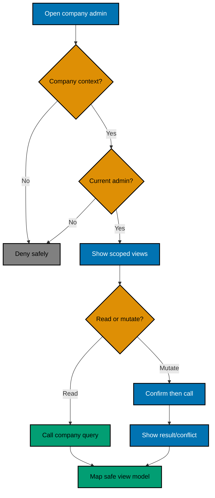
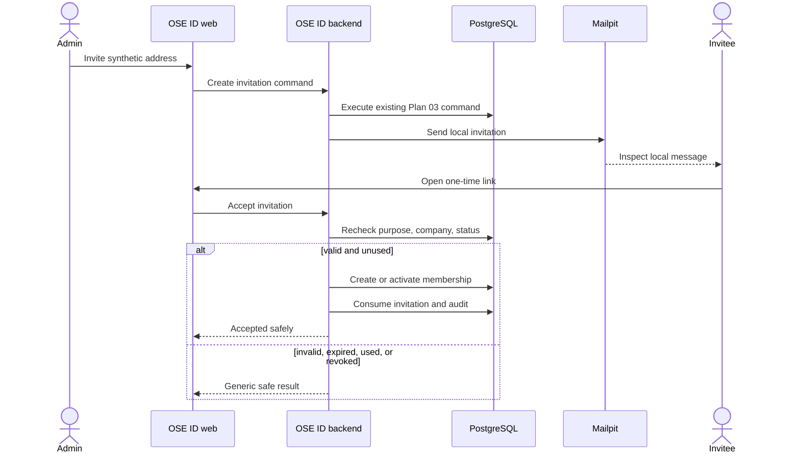
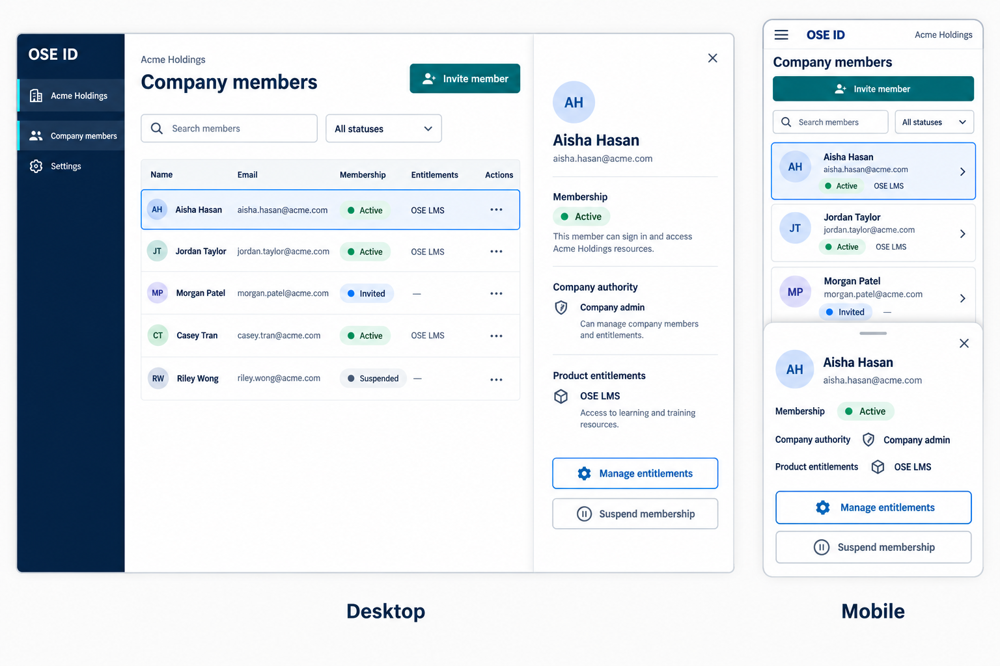
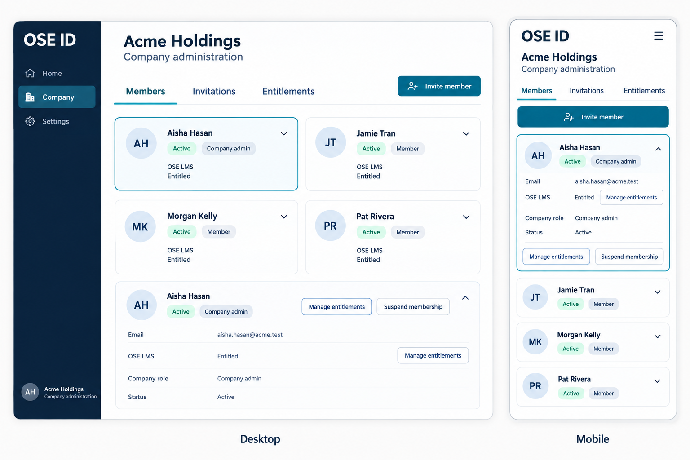
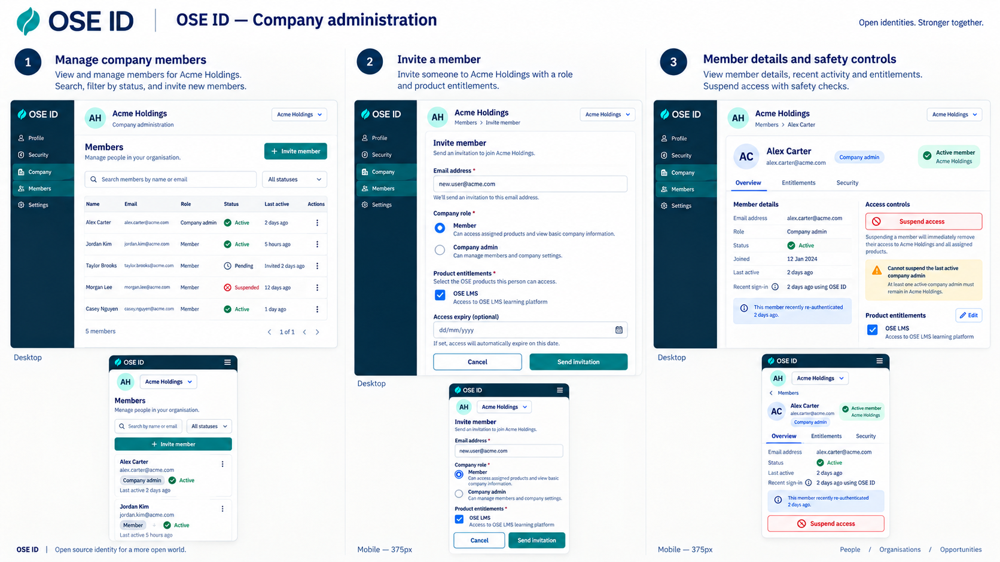

# Product Requirements — OSE ID Init 08 Company Administration

## Product Overview

`/admin/company` is a protected area in the existing OSE ID web application. It always operates on the
currently authorized company and lets a delegated company admin manage memberships, invitations, and
OSE product-entry entitlements. It never searches across companies or exposes platform-level identity
operations.

## Terms

| Term                  | Meaning here                                                                               |
| --------------------- | ------------------------------------------------------------------------------------------ |
| Company admin         | Active membership authority scoped to one company.                                         |
| Membership            | Relationship between one global Person and one Company with status and company authority.  |
| Invitation            | Single-use capability inviting an addressed person to one company.                         |
| Entitlement           | Fact that a person/company membership may enter an OSE product; not a product-domain role. |
| Active company        | Exactly one company in the current authorization/session context.                          |
| Recent authentication | Fresh proof through an existing method before a sensitive mutation.                        |

## Personas and User Stories

- As a company admin, I can review my active company's members and their membership status.
- As a company admin, I can invite a person, resend/revoke a pending invitation, and inspect its status.
- As a company admin, I can suspend/reactivate membership and grant/revoke supported product entitlement.
- As an invited person, I can accept a valid invitation without creating a duplicate Person.
- As a multi-company user, I must explicitly reauthorize before administering another company.
- As an ordinary or personal-context user, I cannot discover company administration data.

## General Flow



## Invitation Sequence



## Functional Requirements and Ownership

Plan 03 is the sole backend/domain/API owner. Plan 08 changes no C# aggregate, application command,
API route, OpenAPI operation, persistence mapping, migration, invitation delivery rule, entitlement
rule, audit writer, or RLS policy. If execution discovers a missing Plan 03 behavior, stop and amend the
dependency or create a separate corrective plan; do not absorb it here.

### BFF authorization projection

- Use only the server-side Plan 05 session when calling Plan 03; no client-derived company value grants
  authority or changes context.
- Map Plan 03 denial/not-found/validation/stale/recent-auth/last-admin results to an allowlisted BFF
  problem model without returning tenant identifiers or upstream internals.
- Never cache authorization decisions or reproduce membership/RLS rules in Next.js code.

### Members

- List only fields Plan 03 actually exposes: verified contact address needed for administration,
  membership status, company authority, row version, and OSE product entitlements. Do not invent a
  Person display-name field in this slice.
- Support deterministic pagination/filtering within the active company only.
- Submit suspend/reactivate actions to the existing Plan 03 commands with their required version and
  recent-auth fields; render the returned current result or conflict.
- Do not expose provider subjects, credential inventory, recovery state, IP/device data, or global audit.

### Invitations

- Submit create/resend/revoke operations only to the existing Plan 03 invitation commands.
- Project only normalized display address, status, inviter display label, creation/expiry times, and
  opaque action/version identifiers explicitly exposed by Plan 03; never project raw capabilities.
- Inspect local delivery in Mailpit and render acceptance outcomes, but do not implement delivery,
  capability validation, acceptance, or Person resolution.

### Entitlements

- Show only registered OSE products supported by the entitlement model delivered earlier.
- Submit grant/revoke only through Plan 03's existing entitlement commands and render their result.
- Never add, infer, display, edit, or send product-domain roles or permissions.

### Explicit Plan 08 view-model and adapter deltas

- `CompanyAdminContextView`
- `CompanyMemberListItemView` and `CompanyMemberDetailView`
- `CompanyInvitationListItemView`
- `CompanyEntitlementView`
- an allowlisted BFF problem/status mapper
- a typed client regenerated from the unchanged Plan 03 OpenAPI only if Plan 05 established codegen

No persistence migration is permitted.

## UI Design Funnel

### Grounding and Prior Art

- **[Repo-grounded]** Current inventory includes `libs/web-ui/src/components/button`, `input`, `alert`,
  `dialog`, `sheet`, `card`, `table`, `tabs`, `search-component`, `side-nav`, and `app-header`, plus
  `libs/web-ui-token/src/ose.css`. `apps/ose-id-web` does not exist at authoring time; Plan 05 creates it,
  so Phase 0 must repeat this inventory against the delivered shell and stories.
- **[Web-cited, official, accessed 2026-09-15]** W3C's
  [Tables Tutorial](https://www.w3.org/WAI/tutorials/tables/) says accessible tables need markup that
  identifies header/data cells and their relationships. That supports a semantic desktop roster rather
  than a visual grid posing as a table.
- **[Web-cited, official, accessed 2026-09-15]** W3C's
  [modal dialog pattern](https://www.w3.org/WAI/ARIA/apg/patterns/dialog-modal/) states that focus moves
  inside an opened dialog and returns to its invoker when closed. That binds every confirmation state.
- **[Web-cited, official, accessed 2026-09-15]** GitHub's
  [organization invitation documentation](https://docs.github.com/en/organizations/managing-membership-in-your-organization/inviting-users-to-join-your-organization)
  separates inviting people from managing current membership. This is prior-art evidence for distinct
  invitation status and member-detail states, not a source for OSE domain policy.
- **[Judgment call]** A roster/detail primary flow is selected because this is transactional company
  administration, not analytics; execution validates the judgment with the design/usability tester triad.

### Diverge — Low-Fidelity Alternatives

Every shipped state has at least two named alternatives:

| Shipped state                             | Alternative A — roster/drawer (selected)                | Alternative B — task tab/inline card                  | Responsive behavior                                                                         |
| ----------------------------------------- | ------------------------------------------------------- | ----------------------------------------------------- | ------------------------------------------------------------------------------------------- |
| Member list/loading/empty/error           | Skeleton/empty/error rows stay in the roster region     | Full-width state card replaces the tab panel          | Rows become labeled cards below `sm`; status text and retry stay first in reading order     |
| Member detail                             | Side drawer beside the roster                           | Inline accordion beneath the selected member          | Drawer becomes full-width sheet; invoker focus returns on close                             |
| Sensitive confirmation/recent auth        | Modal over preserved member context                     | Dedicated confirmation step within member card        | Single column at 320–375 px; least-destructive action receives initial focus                |
| Invitation list/create/status             | Invitation table plus create drawer                     | Invitation tab with create card above status cards    | Table becomes labeled cards; address, state, expiry, and actions remain visible             |
| Entitlement list/change/status            | Member detail section with checkboxes and result banner | Dedicated entitlement tab with expandable member card | Controls stack vertically; no horizontal scrolling or hover-only action                     |
| Denied/not-found/stale/last-admin failure | Inline alert in the affected panel with safe recovery   | Route-level status card with return action            | Heading, message, and recovery order remain identical at all widths; no tenant detail leaks |

#### Option A — Member roster plus details drawer

Desktop:

```text
+---------------------+----------------------+----------------+
| Active company      | Company members      | Aisha Hasan     |
| Members             | [Search] [Status]    | Active          |
| Invitations         | Recipient  State  Access  | Company admin   |
| Entitlements        | Aisha Active LMS [>] | LMS entitled    |
|                     | Jordan Active LMS [>] | [Manage]        |
+---------------------+----------------------+----------------+
```

Mobile:

```text
+--------------------------------+
| Acme · Company members          |
| [ Invite member ]               |
| [ Aisha · Active · LMS       >] |
| [ Jordan · Active · LMS      >] |
|                                |
| Aisha details sheet             |
| [Manage] [Suspend]              |
+--------------------------------+
```

Efficient for scanning and keeps one selected member's actions contextual; drawer becomes a bottom/full
sheet on mobile.

#### Option B — Task tabs plus inline cards

```text
+-----------------------------------------------+
| Acme Holdings                                 |
| [Members] [Invitations] [Entitlements]        |
| [ Aisha · Active · Admin · LMS        v ]     |
|   Email ... [Manage access] [Suspend]         |
| [ Jordan · Active · Member · LMS       > ]    |
+-----------------------------------------------+
```

Makes each task area explicit and adapts naturally to mobile, but repeated expanded content reduces
scan density for larger companies.

#### Option C — Dashboard cards first

```text
+--------------------------------+
| 42 members · 3 invites          |
| [Manage members]                |
| [Manage invitations]            |
| [Manage entitlements]           |
+--------------------------------+
```

Offers a simple overview but adds navigation and summary metrics without helping the primary member
management task. It is dropped.

### Narrow — High-Fidelity Finalists

- **Option A finalist:**

  

- **Option B finalist:**

  

**Precise finalist A specification:** at 1280 px, a 240 px OSE shell rail precedes a minmax roster and
360 px detail drawer; at 768 px the rail collapses and the detail overlays as a sheet; at 375/320 px the
page is one column of labeled member/invitation cards. Loading uses content-shaped skeletons, empty uses
a heading plus one invite action, and denial/failure uses an inline alert with no tenant identifiers.
Confirmation traps focus, initially focuses Cancel for destructive actions, and returns focus to the
invoker. Invitation and entitlement states use the same selected-row/detail grammar.

**Precise finalist B specification:** at desktop widths, Members, Invitations, and Entitlements are
keyboard-operable tabs above 720–960 px content cards; each selected record expands inline. At tablet
and mobile widths the tabs remain horizontally visible without clipping and content is one column.
Loading/empty/error/denied cards occupy the tab panel; mutation confirmation is a modal with the same
focus and recovery contract as finalist A. No count, action, or status disappears between finalists.

Option C is cut because it adds a summary/navigation layer and metrics that are not required.

### Select and Justify

**Selected: Option A — member roster plus details drawer/sheet.** It provides the best scan-to-action
flow for the primary job while retaining labeled mobile cards and one focused action context.

The selected end-to-end journey board expands that direction across member list, invitation, and member
safety/entitlement screens:



The board is directional rather than an authorization contract. Every company selector starts the
fresh authorization/context-switch flow, and only membership, invitation, company authority, and product
entitlement controls defined in this PRD may ship. It does not authorize global security inspection,
cross-company search, impersonation, key operations, or a platform superadmin.

| Candidate | Decision reason                                                                   |
| --------- | --------------------------------------------------------------------------------- |
| Option A  | Selected: strongest dense scan on desktop and explicit contextual actions.        |
| Option B  | Runner-up: simpler reflow, but repeated cards become verbose as membership grows. |
| Option C  | Rejected: extra navigation and unsupported metrics.                               |

### Responsive Strategy

- Below `sm`, the roster becomes one-column labeled cards and details open as a full-width sheet.
- At `md`, cards may remain one column or use a readable two-column arrangement only when focus/reading
  order remains stable.
- At `lg`, the semantic table/roster and details drawer may appear side by side.
- Every breakpoint preserves company name, error/status summary, primary action, keyboard order, and
  text labels. No action is hover-only and no state depends on color.

## Acceptance Criteria

### AC-ADMIN-01 — Project one active company

```gherkin
Scenario: A current company admin opens the admin area
  Given the signed-in Person has an active company context and current admin membership for Company A
  When they open the company administration route
  Then the BFF calls the company administration API using the server-side session context
  And the page shows only allowlisted Company A member, invitation, and entitlement fields
```

### AC-ADMIN-02 — Deny missing or wrong authority

```gherkin
Scenario Outline: An unauthorized context cannot inspect administration
  Given the request uses <context>
  When the browser requests the company administration route
  Then the BFF maps the authoritative result to a non-disclosing denial view
  And no Company A row, count, upstream body, or identifier is returned

  Examples:
    | context |
    | personal context |
    | ordinary Company A member |
    | suspended Company A admin |
    | Company B admin |
    | forged Company A identifier |
```

### AC-ADMIN-03 — Invoke and display invitation flow

```gherkin
Scenario: A company admin invites a new member locally
  Given a recent-authenticated Company A admin and a synthetic address that is not a Company A member
  When the admin submits an invitation and follows its Mailpit-delivered link once
  Then the BFF invokes only the company invitation operations
  And the UI displays the authoritative invitation and membership result without a raw capability
```

### AC-ADMIN-04 — Render invitation states safely

```gherkin
Scenario Outline: An unusable invitation grants no membership
  Given a Company A invitation is <state>
  When the corresponding company administration result is returned to the BFF
  Then the UI renders a safe status and recovery action
  And the BFF reveals no raw capability or additional account or company data

  Examples:
    | state |
    | expired |
    | revoked |
    | already used |
    | superseded by resend |
    | bound to another company |
```

### AC-ADMIN-05 — Render authoritative last-admin conflict

```gherkin
Scenario: Concurrent changes target the last active company admin
  Given Company A has exactly one active admin membership
  When the admin UI submits a mutation that would remove that authority
  Then the UI displays the authoritative last-admin conflict returned by the company administration API
  And no browser or BFF rule predicts or overrides the outcome
```

### AC-ADMIN-06 — Manage entry entitlement, not product roles

```gherkin
Scenario: A company admin grants OSE LMS entry
  Given a Company A member lacks the OSE LMS entitlement
  When a recent-authenticated Company A admin submits the grant through the BFF
  Then the BFF sends only the company entitlement command fields
  And the UI displays the current OSE LMS entry entitlement without any LMS role or permission field
```

### AC-ADMIN-07 — Preserve isolation during company switching

```gherkin
Scenario: A multi-company admin chooses another company
  Given the user is administering Company A and also administers Company B
  When they request a switch to Company B
  Then the UI starts the existing fresh authorization flow for Company B
  And the existing Company A admin page never renders Company B data in the same session context
```

### AC-ADMIN-08 — Meet responsive and accessible behavior

```gherkin
Scenario: A keyboard user manages a member on a narrow viewport
  Given the company member list is rendered at 375 CSS pixels
  When the user opens a member card and completes a confirmed entitlement change by keyboard
  Then focus, labels, status announcements, and error recovery remain programmatically clear
  And no action or information requires hover, color perception, or horizontal page scrolling
```

### AC-ADMIN-09 — Exclude platform administration

This is a plan-boundary assertion, not an application behavior scenario. Delivery evidence must show
that the diff changes no backend domain/API/persistence/RLS surface and adds no cross-company search,
impersonation, key operation, or platform-superadmin capability. It therefore stays outside canonical
Gherkin.

### AC-ADMIN-10 — Fail closed outside local runtime

```gherkin
Scenario: Company administration is started in an undeclared production configuration
  Given the runtime mode is neither Local nor Test
  When company administration is enabled
  Then startup or route enablement fails closed with a non-secret diagnostic
  And no company administration web route becomes ready
```

## Product Exclusions

## BDD and Coverage Contract

Every canonical scenario above maps under the repository BDD convention to a Unit adapter, an
Integration adapter, and an E2E adapter. Unit owns the BFF/view-model/component boundary; Integration
proves the BFF-to-company-API contract; E2E proves the browser journey. Any per-scenario adapter exemption
must name the exact boundary-based reason, be indexed in the behavior-coverage configuration, and pass
static validation—blanket or implicit exemptions are forbidden. Authored production lines added by this
plan must maintain at least 99% Unit line coverage under the repository's coverage metric;
generated code and tests are excluded according to the canonical policy, never by ad hoc ignore rules.

This plan delivers local company self-administration only. Deployment and platform administration each
require separate plans with their own trust, infrastructure, and operational gates.
