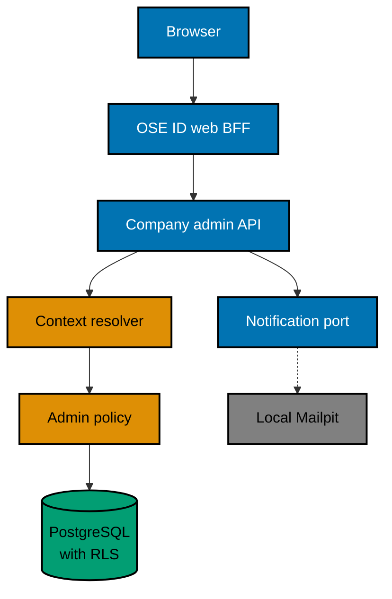

# Boundary, Routes, and Request Flow

## Deployable Boundary

Company administration is a presentation area inside `ose-id-web`. It reuses Plan 05's session/BFF and
the unchanged Plan 03 backend, PostgreSQL, notification, and authorization contracts. Plan 08 owns no
`ose-id-be` behavior and adds no deployable, issuer, OIDC client, database, or browser token.

Plan 03's backend remains a pragmatic hexagonal boundary: this UI calls its current REST adapter, while
tenant policy and use cases remain independent of the BFF. This plan must not add backend GraphQL/MCP
packages, expose a resolver/tool directly from UI code, or move company authorization into the BFF. A
future backend adapter follows the Init 01
[transport extension contract](../../../done/2026-09-17__ose-id-init-01-foundation/tech-docs/001-system-boundaries-and-project-topology.md#future-graphql-and-model-context-protocol-adapters)
through a separate plan.

## Route Model

The delivered route family is rooted at `/admin/company` and may use nested presentation routes for:

- member list and member detail;
- invitations and invitation status;
- entitlements; and
- a tenant-safe activity projection only if required by acceptance behavior.

Next.js route groups and file names must follow the actual plan-05 app structure discovered in Phase 0.
Middleware may improve navigation but cannot be the only authorization control. Every BFF request loads
the opaque OSE session and calls the backend; client components receive render-safe view models only.

## BFF Adapter Algorithm

1. Load the current opaque OSE session on the server.
2. Call only the existing Plan 03 active-company operation; never derive authority from a browser field.
3. Submit only the established operation fields and version/recent-auth evidence required by Plan 03.
4. Let Plan 03 resolve company, membership, policy, transaction, RLS, domain invariant, and audit.
5. Drop every response field outside the allowlisted view model.
6. Map success or problem into a safe status and recovery action; unknown status fails closed.
7. Refetch authoritative state after a mutation/conflict and render it without predicted policy.

## Trust Boundaries

The dashed Mailpit edge is local/test only. A browser never calls PostgreSQL or Mailpit directly for an
authorization decision.

## Response Shape and Privacy

Return opaque IDs and allowlisted fields required for the admin task. Pagination cursors must bind to
the active company and filter/order contract; a cursor from Company B fails safely in Company A.
Problem responses distinguish user-correctable state without revealing hidden company/member existence.

Never expose credential types, provider subject, recovery status, device/IP fingerprint, global sessions,
private audit payload, invitation capability, password hash, or raw token.

## Why Not a Separate App

A separate app would add a fifth Nx project, deployment, client registration, session handoff, local
runner, and E2E boundary without a distinct company-admin trust role. The selected logical area is
reversible: a future plan can extract it if operation, audience, or risk becomes materially different.

A platform operator console is already materially different. Cross-company search, impersonation,
account merge, key operations, and incidents require stronger authentication, immutable global audit,
network isolation, and separate authorization. None may be hidden inside this route family.
