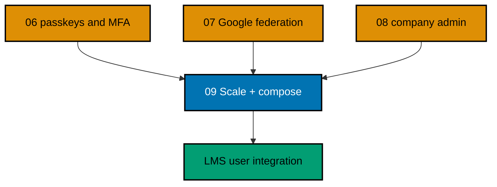

# OSE ID Init 09 — Local Scale and Composition

> **Status:** Backlog — not started. Execute only after
> [`ose-id-init-06-passkeys-and-mfa`](../ose-id-init-06-passkeys-and-mfa/README.md),
> [`ose-id-init-07-google-federation`](../ose-id-init-07-google-federation/README.md), and
> [`ose-id-init-08-company-admin`](../ose-id-init-08-company-admin/README.md) have merged, and after
> this plan moves to `plans/in-progress/` in a separate lifecycle-only change.

Complete OSE ID's localhost delivery by proving that its web and backend process instances carry no
correctness-critical local state, packaging every owned dependency into one deterministic runner, and
publishing a reusable composition contract for dependent applications. This is the gate before OSE LMS
may begin its user/OIDC integration plan.

## Delivery Position

## Scope

- Two built `ose-id-be` instances and two built `ose-id-web` instances behind a deterministic local
  no-affinity round-robin test proxy.
- Shared PostgreSQL-backed identity, authorization, session/correlation, key metadata/material provider,
  idempotency, rate-limit, and admin correctness state as required by earlier slices.
- Start on instance A, continue on B, stop A, and complete safely on B for representative flows.
- One owned local OSE ID stack: PostgreSQL, Mailpit, fake Google provider, backend pair, web pair, local
  proxy, migrations/seeding, readiness, diagnostics, and unconditional cleanup.
- A versioned reusable dependent-app runner contract so LMS and later apps compose rather than copy OSE
  ID lifecycle logic.
- Deterministic personal and multi-company fixtures plus email/password, passkeys/MFA, Google, OIDC,
  company-admin, revocation, and failure journeys.
- Local/test only with production fail-closed behavior.

## Non-Goals

- Kubernetes, containers for production, cloud deployment, load balancer configuration, autoscaling,
  HA database, cross-region replication, production capacity/load testing, DNS, TLS certificates, real
  secrets, production Google, or production email.
- Adding Redis, a distributed cache, queue, or new persistence engine without measured need.
- Implementing LMS code; this plan supplies and verifies the runner contract only.
- Replacing app-specific authorization or automatically enabling OSE ID for every app.
- Claiming production horizontal-scaling readiness from localhost proof alone.

## Invariants

- Authored production code maintains at least 99% Unit line coverage. Every Gherkin
  scenario maps to Unit, Integration, and E2E adapters unless an exact boundary-based exemption is
  indexed and statically validated.

- Identity system state is persistent, but each web/backend process is disposable and interchangeable.
- No sticky session, local disk, singleton/memory cache, or instance-specific key is required for correctness.
- All startup waits observe readiness with bounded deadlines and child-failure propagation; no arbitrary
  sleeps or test retries exist.
- Cleanup removes only resources in the current unique stack ownership manifest and preserves the primary
  failure status.
- A dependent app cannot silently fall back to local credentials/debug identity when OSE ID is unavailable.
- OSE ID source/docs inherit root MIT; every third-party component keeps its own license.
- Deployment remains blocked at minimum on private plan
  `start-infra-04-deploy-tencent-lighthouse-k3s-cluster` and then-current platform handoff gates.

## Reader Map

- [Business requirements](brd.md)
- [Product requirements, lifecycle flows, and Gherkin](prd.md)
- [Technical design map](tech-docs/README.md)
- [Execution checklist](delivery.md)
- [Execution learnings](learnings.md)
