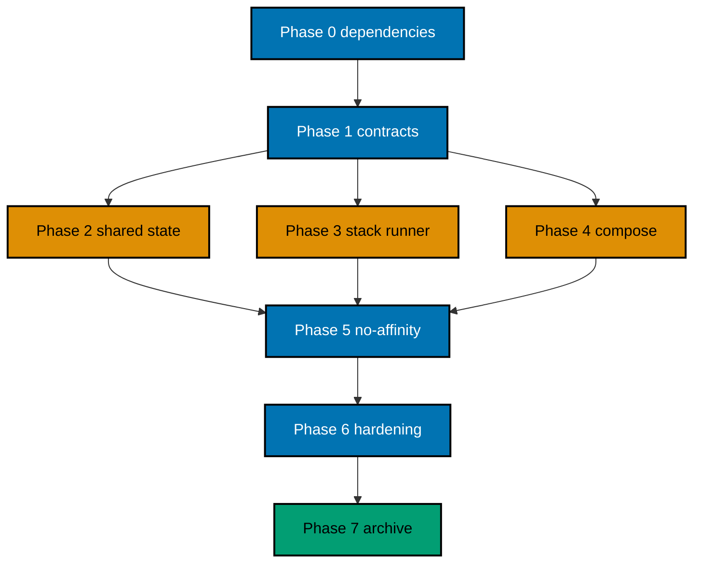

# Delivery — OSE ID Init 09 Local Scale and Composition

> **Legend** — `[AI]`: an agent performs the step (default). `[HUMAN]`: only a human can perform an
> out-of-band action. `[AI+HUMAN]`: an agent prepares and a human completes the privileged part.

## Lifecycle Prerequisite

Do not implement from backlog. Land this plan artifact, then wait for
`ose-id-init-06-passkeys-and-mfa`, `ose-id-init-07-google-federation`, and
`ose-id-init-08-company-admin` to complete on `origin/main`. Land a separate pure move to
`plans/in-progress/ose-id-init-09-local-scale-and-composition/` with only lifecycle index changes.
Phase 0 resolves the predecessors' archived completion-date paths through the done index.

The `lms-user` plan must not begin implementation until this plan merges and its delivered-head terminal
audit passes.

## Worktree

Worktree path: `worktrees/ose-id-init-09-local-scale-and-composition/`

Provisioning status: **pending**. This plan was authored inside the user-required `worktrees/ose-id/`
planning worktree while its prerequisites were unlanded. Provisioned Worktree Identity and Delivery
Branch Inventory are intentionally omitted under the authoring exception. Phase 0 adds them only from
observed execution evidence. No implementation begins while pending.

From the repository root, provision exactly once with
`rtk git worktree add -b ose-id-init-09-local-scale-and-composition-base worktrees/ose-id-init-09-local-scale-and-composition origin/main`.
If that branch already exists, use
`rtk git worktree add worktrees/ose-id-init-09-local-scale-and-composition ose-id-init-09-local-scale-and-composition-base`.
If interrupted, run
`rtk git worktree list --porcelain`, reuse the declared route if present, then verify
`rtk git status --short` and `rtk git merge-base --is-ancestor origin/main HEAD`. On mismatch or partial
provisioning, stop and follow `repo-governance/development/workflow/worktree-setup.md`; never force-delete
the worktree or invent its identity.

## Delivery Mode: worktree-to-pr

One short-lived `ose-public` worktree branch delivers one PR to `main`. `[AI]` merges only after explicit
Git-delivery authorization, exact current-head/base Quality gate, clean current-head leak review,
applicable API/UI/local-stack gates, and identity/security semantic review.

## Delivery Unit

| Unit                                 | Phases | Natural seam                                                                                                                | Safe resulting state                                                                                                               |
| ------------------------------------ | ------ | --------------------------------------------------------------------------------------------------------------------------- | ---------------------------------------------------------------------------------------------------------------------------------- |
| DU1 — Complete local OSE ID platform | 0–7    | Shared-state corrections, multi-instance proof, owned full-stack runner, downstream contract, tests/docs/archive must agree | OSE ID runs deterministically on localhost and is composable; production remains fail-closed; LMS may begin only after merge/audit |

No phase or task count creates a delivery unit. Do not ship a runner that hides cleanup gaps, a proxy
without no-affinity proof, or a dependent contract without synthetic-consumer validation.

## Parallelization Model

### Delivery Boundaries

| Unit | Change phases | Worktree and branch                                                                                                                                   | Delivery opportunity                                                                                                   | Cohesive seam                                                                                                                                              | Resulting `main`, rollback, and flag evidence                                                                                                                                                                                                                                                                                                                                                                                                                                                    |
| ---- | ------------- | ----------------------------------------------------------------------------------------------------------------------------------------------------- | ---------------------------------------------------------------------------------------------------------------------- | ---------------------------------------------------------------------------------------------------------------------------------------------------------- | ------------------------------------------------------------------------------------------------------------------------------------------------------------------------------------------------------------------------------------------------------------------------------------------------------------------------------------------------------------------------------------------------------------------------------------------------------------------------------------------------ |
| DU1  | 0–7           | `worktrees/ose-id-init-09-local-scale-and-composition/`; observed Phase-0 execution branch based on `ose-id-init-09-local-scale-and-composition-base` | One PR after Phase 7 and terminal audit only; state fixes, runner, proxy, and consumer contract cannot ship separately | Shared-state corrections, two-instance readiness, exact lifecycle/cleanup runner, dependent-app descriptor, no-affinity and public-contract equality proof | `main` provides a deterministic local composition entrypoint and unlocks LMS only after terminal audit; production stays fail-closed. Rollback restores the same public origins/issuer to one healthy direct instance, removes owned proxies/second instances/temp artifacts, and changes no identity data, keys, clients, or migrations. Evidence includes pre/post rollback semantic equality, residue-free cleanup, enabled local/disabled production modes, and no public debug flag/header. |

Agent lanes cannot ship separately.

### Phase-Local Execution Defaults

Every checkbox and gate inherits its phase row unless it declares a stricter owner, path, command,
observation, evidence destination, or failure route. Evidence paths are relative to
`plans/in-progress/ose-id-init-09-local-scale-and-composition/`. No checkbox completes from prose review.

| Phase | Default owner                                                     | Bounded paths                                                                          | Literal verification command                                                                                                                                                                                                                                                        | Expected result and evidence                                                                                                                                      | Failure route                                                                                                                             |
| ----- | ----------------------------------------------------------------- | -------------------------------------------------------------------------------------- | ----------------------------------------------------------------------------------------------------------------------------------------------------------------------------------------------------------------------------------------------------------------------------------- | ----------------------------------------------------------------------------------------------------------------------------------------------------------------- | ----------------------------------------------------------------------------------------------------------------------------------------- |
| 0     | Root integrator                                                   | execution worktree, predecessor diffs, delivered OSE ID app/spec/config paths          | Run the Phase 0 predecessor-green baseline commands from this section, including `rtk ./hippo run --class transactional --resource-tier standard --disk-path . -- npm exec nx -- run-many -t test:coverage:behaviour --projects=ose-id-be,ose-id-be-e2e,ose-id-web,ose-id-web-e2e`. | Exit 0; dependency/worktree/topology/resource/license/rule baselines under `evidence/phase-0-*`.                                                                  | Preserve sanitized output and stop; prerequisite drift routes to its owner and unplanned path/rule impact requires amendment/propagation. |
| 1     | Spec, state-ledger, security, and E2E owners named by each packet | two local-runtime feature files, four behavior maps, bounded OSE ID app/E2E test paths | `rtk ./hippo run --class transactional --resource-tier standard --disk-path . -- npm exec nx -- run-many -t test:unit,test:integration,test:e2e,test:coverage:behaviour -p ose-id-be,ose-id-be-e2e,ose-id-web,ose-id-web-e2e`                                                       | Specs/coverage pass; only named shared-state/runner/no-affinity behaviors remain RED under `evidence/phase-1-*`; HTTP semantic digest shows no delta.             | Reopen the exact contract/threat/RED packet; unexplained API drift or state owner blocks Phase 2.                                         |
| 2     | C#/web shared-state lanes                                         | bounded state/readiness/key/rate/idempotency/revocation symbols discovered in Phase 1  | `rtk ./hippo run --class transactional --resource-tier standard --disk-path . -- npm exec nx -- run-many -t test:unit,test:integration,test:quick -p ose-id-be,ose-id-web`                                                                                                          | Shared-state RED → GREEN → REFACTOR and divergent-config readiness evidence under `evidence/phase-2-*`.                                                           | Reopen the first failing TDD packet; do not add Redis, affinity, or local authority.                                                      |
| 3     | Runner/proxy lane                                                 | `apps/ose-id-web-e2e/**` runner, proxy, schemas, project target, and tests only        | `rtk ./hippo run --class transactional --resource-tier standard --disk-path . -- npm exec nx -- run ose-id-web-e2e:test:local-stack`                                                                                                                                                | Runner RED → GREEN → REFACTOR, admission/topology/failure/concurrency, and empty cleanup evidence under `evidence/phase-3-*`.                                     | Reopen the first runner packet; unsafe target/path or residue blocks all later phases.                                                    |
| 4     | Composition-contract lane                                         | local-stack JSON Schemas/docs plus synthetic consumer under `apps/ose-id-web-e2e/**`   | `rtk ./hippo run --class transactional --resource-tier standard --disk-path . -- npm exec nx -- run ose-id-web-e2e:test:composition-contract`                                                                                                                                       | Composition RED → GREEN → REFACTOR, version/fallback/nested-cleanup evidence under `evidence/phase-4-*`.                                                          | Reopen the first contract packet; private dependency or fallback is a security blocker.                                                   |
| 5     | E2E integrator and browser/security lanes                         | running owned stack, public descriptors, ignored runner artifacts                      | `rtk ./hippo run --class transactional --resource-tier standard --disk-path . -- npm exec nx -- run ose-id-web-e2e:test:no-affinity`                                                                                                                                                | A→B feature handoffs, dependent-app behavior, unchanged HTTP probes, leak scan, and empty cleanup under `evidence/phase-5-*`.                                     | Route a state failure to Phase 2, lifecycle/residue to Phase 3, composition fallback to Phase 4; rerun the full matrix.                   |
| 6     | Root integrator and named API/UI/live/review agents               | complete Plan 09 candidate diff/evidence                                               | `rtk ./hippo run --class transactional --resource-tier standard --disk-path . -- ./rhino gate run --surface=pre-push`                                                                                                                                                               | Exact-head quality/review/tester/rules/API-no-delta/runner-contract PASS under `evidence/phase-6-*`.                                                              | Any fix changes HEAD and reruns Phase 6 from its first packet; unresolved finding blocks archival.                                        |
| 7     | Root integrator                                                   | learnings, archive/indexes/LMS handoff, PR branch, declared worktree                   | a [`plan-checker`](../../../.agents/agents/plan-checker.md) structural review against the [Plans Convention](../../../repo-governance/conventions/structure/plans.md) followed by `rtk ./rhino md internal-link validate`                                                           | Archive-containing reviewed merge, terminal audit PASS, LMS handoff, containment, and non-force cleanup under `evidence/phase-7-*` and the external final report. | Reopen the first unsupported phase; retain branch/worktree on ambiguity or audit failure.                                                 |

### Agent Topology

Use **N=3 implementation agents plus one root integrator** in a single worktree.



Assign disjoint ownership to shared-state/readiness app changes, runner/proxy/Compose implementation,
and contract/synthetic-consumer tests. The root alone integrates shared scripts, `project.json`, lockfiles,
generated contracts, and manifests. Every agent inspects `git status` and never reverts another's edits.

### PostgreSQL Persistence Contract

Every OSE-owned shared-state correction in this plan uses Npgsql connections/transactions through
SqlKata's PostgreSQL compiler and `SqlKata.Execution`. Repositories require explicit projections,
bound parameters, cancellation, bounded command timeouts, and explicit transactions for every
multi-write/state-transition invariant; production runtime paths forbid EF change tracking,
LINQ-to-database, and `SELECT *`. EF Core otherwise stays migration tooling; inherited custom
OpenIddict stores remain the only runtime protocol persistence path. ASP.NET Core Identity remains
hashing/validation primitives only—not Identity EF stores or `UserManager` persistence. Phase 1
adds RED compiled-SQL/query-bound assertions; Phase 2 and Phase 5 gates run backend Unit/Integration
and built-process no-affinity E2E through HIPPO and store compiled-SQL snapshots/contracts, redacted
parameter shapes, catalog/index rows, safe synthetic `EXPLAIN` plans, query counts, and bounded rows
under `evidence/phase-{1,2,5}-persistence/`; `EXPLAIN ANALYZE` is allowed only for isolated safe
synthetic fixtures. Any interpolation, missing timeout/cancellation/transaction, table-wide
projection, unbounded/N+1 plan, Identity persistence, or EF runtime query outside that isolated
OpenIddict store reopens its owning packet.

### Mandatory Nx Quality Matrix

The full green matrix below is mandatory as the completion gate of the first implementation phase
(Phase 2) and for every later implementation, final local-quality, and exact-head delivery/PR gate.
It is not a Phase 0 or Phase 1 success criterion. Before creating any Plan 09 scenario, binding, or
test, Phase 0 and Phase 1 each run this exact predecessor-green baseline:

```bash
rtk ./hippo run --class transactional --resource-tier standard --disk-path . -- npm exec nx -- run-many -t build --projects=ose-id-be,ose-id-web
rtk ./hippo run --class transactional --resource-tier standard --disk-path . -- npm exec nx -- run-many -t typecheck,lint,test:quick --projects=ose-id-be,ose-id-be-e2e,ose-id-web,ose-id-web-e2e
```

Then run the static predecessor behavior baseline:

```bash
rtk ./hippo run --class transactional --resource-tier standard --disk-path . -- npm exec nx -- run-many -t test:coverage:behaviour --projects=ose-id-be,ose-id-be-e2e,ose-id-web,ose-id-web-e2e
```

Phase 0 proves every named target is real, not echo, no-op, a success sentinel, or a duplicate alias.
The C# backend requires `<Nullable>enable</Nullable>`; its Nx `typecheck` runs the .NET compiler with
`/p:TreatWarningsAsErrors=true`, while Nx `lint` runs Roslyn analyzer verification plus
`dotnet format --verify-no-changes`.
The Next.js owner uses strict TypeScript, `tsc --noEmit`, and ESLint. Both TypeScript E2E projects
use no-emit typechecks and their real repository-standard lint targets, but omit `build` because
they produce no deployable artifacts. Each Phase 2-and-later matrix gate writes both command transcripts
and the inspected target/configuration proof to its phase evidence destination as `nx-quality.txt`; any
failure reopens that gate and blocks progression. Phase 1 records the green predecessor baseline first,
then runs only its explicitly named static-coverage and RED commands. A nonzero result is nonblocking
only when its recorded RED ledger names the missing Plan 09 behavior; any baseline,
target/configuration, or unrelated failure blocks Phase 2.

## Phase 0: Dependency Completion, Environment, and Baseline

**Input:** all prerequisite merges/terminal audits, pure plan promotion, and repository checkout.

**Outcome:** actual delivered contracts/paths, one execution worktree, green baselines, and complete resource inventory.

**Proof:** archived-plan references and sanitized `evidence/phase-0-*` transcripts.

- [ ] [AI] **Owner: integrator; dependency proof.** Run `rtk git fetch origin`,
      `rtk rg -n "ose-id-init-0[6-8]" plans/done/README.md`, and for each resolved merge SHA run
      `rtk git show --stat --oneline <merge-sha>` followed by `rtk git diff <merge-sha>^ <merge-sha>`.
      Store archive paths, terminal-audit status, merge ancestry, and sanitized full-diff dispositions at
      `evidence/phase-0-dependencies.md`. Acceptance: all three merges are ancestors of current
      `origin/main` and no open finding conflicts with Plans 01–05. Missing/stale/conflicting proof stops
      execution before worktree provisioning and routes to the prerequisite plan owner.
- [ ] [AI] **Owner: integrator; worktree identity.** Run
      `rtk git worktree list --porcelain`, verify this folder exists only under `plans/in-progress/`, and
      provision/enter `worktrees/ose-id-init-09-local-scale-and-composition/` with the exact command in the
      Worktree section. Record path, branch, 40-character HEAD, creator/session, UTC time, and branch
      inventory at `evidence/phase-0-worktree.md`. Acceptance: one plan worktree starts at current
      `origin/main`; divergence/stale registration follows the documented one-retry recovery then stops.
- [ ] [AI] Run `rtk ./hippo run --class transactional --resource-tier standard --disk-path . -- npm install` and
      `rtk npm run doctor` (read-only; only if it reports drift, run
      `rtk ./hippo run --class transactional --resource-tier standard --disk-path . -- ./rhino toolchain provision --apply`
      and repeat Doctor); acceptance: the
      final Doctor exits 0 with no secret/unrelated mutation.
- [ ] [AI] **Owner: integrator; delivered topology inventory.** Run
      `rtk rg -n "local-stack|compose|port|runtime|session|correlation|rate.limit|signing|Mailpit|seed|cleanup" apps/ose-id-{be,be-e2e,web,web-e2e} specs/apps/ose/id-{be,web} docs/reference/web-sites.md repo-config.yml`
      and `rtk npm exec nx -- show projects --with-target test:coverage:behaviour`. Store the exact
      source/target/store/control/locale paths at `evidence/phase-0-topology-inventory.md`. Any mismatch
      with technical documents 001–006 stops code work and amends the path/command ledger first.
- [ ] [AI] **Owner: integrator; collision inventory.** Run `rtk lsof -nP -iTCP -sTCP:LISTEN` and
      `rtk docker ps -a --format '{{.ID}} {{.Names}} {{.Ports}}'`; compare processes, containers,
      networks, and volumes with ports 3500/8501/8502/5438/1026/8026 and the repository registry. Save
      sanitized results at `evidence/phase-0-resource-inventory.md`. A collision stops for plan amendment;
      never kill or remove a preexisting resource.
- [ ] [AI] **Owner: dependency reviewer; licenses.** Run `rtk git ls-files LICENSE LICENSING-NOTICE.md`,
      `rtk docker compose -f <resolved-compose-path> config --images`, and the recorded npm/NuGet license
      inventory commands from the delivered plans. Store exact version/digest/license/source/disposition
      rows at `evidence/phase-0-licenses.md`. Unknown, incompatible, unpinned, or missing-notice items block
      the phase and route to dependency review; OSE-authored source remains MIT.
- [ ] [AI] **Owner: integrator; green baseline.** Run the Phase 0 predecessor-green baseline commands,
      `rtk ./hippo run --class transactional --resource-tier standard --disk-path . -- npm exec nx -- run-many -t test:coverage:behaviour --projects=ose-id-be,ose-id-be-e2e,ose-id-web,ose-id-web-e2e`,
      the resolved migration/RLS/local-stack smoke and cleanup targets, and
      `rtk ./hippo run --class transactional --resource-tier standard --disk-path . -- ./rhino gate run --surface=pre-push`.
      Save command/exit/resource-cleanup evidence at `evidence/phase-0-baseline.md`. Every failure,
      including preexisting affected failure, is fixed at root cause and the full baseline rerun; never
      retry, narrow, skip, quarantine, or continue red.
- [ ] [AI] **Owner: rules integrator; impact classification.** Run
      `rtk rg -n "ose-id|3500|8501|local-stack|dependency" AGENTS.md repo-governance repo-config.yml .claude docs/reference`
      and record every target/port/dependency-graph rule surface with `no-change` or canonical-home action
      at `evidence/phase-0-rules-impact.md`. A required normative/enforcement change stops before editing
      and instantiates `repo-governance/workflows/rules/rules-propagation.md`; unresolved classification
      blocks the Phase 0 gate.

### Phase 0 Gate

- [ ] [AI] Run
      `rtk ./hippo run --class transactional --resource-tier standard --disk-path . -- npm exec nx -- affected -t build,typecheck,lint,test:quick,test:coverage:behaviour --base=origin/main --head=HEAD`
      and the canonical pre-push command above; acceptance: both exit 0 and dependencies, worktree,
      paths/targets/ports/state owners, cleanup, licenses, and rule classification are current at one HEAD.

> **Pause Safety:** no scale/runner change exists and the prior stack is green. Safe to stop. To resume:
> `rtk ./hippo run --class transactional --resource-tier standard --disk-path . -- npm exec nx -- affected -t build,typecheck,lint,test:quick --base=origin/main --head=HEAD`.

---

## Phase 1: Canonical Specs, State Inventory, and RED Proof

**Input:** AC-SCALE/STACK/COMPOSE/BOUNDARY criteria, RUNNER-READY-01..02,
RUNNER-VERSION-01..02, and actual prior implementation.

**Outcome:** every process-state risk, lifecycle transition, and composition behavior has an owned failing test.

**Proof:** Gherkin ownership, state matrix, threat map, and RED transcripts.

- [ ] [AI] **Owner: `specs-maker`; canonical scenarios.** Add/update exactly
      `specs/apps/ose/id-be/behaviours/local-runtime/local-scale-and-composition.feature` and
      `specs/apps/ose/id-web/behaviours/local-runtime/local-scale-and-composition.feature`, and add
      `specs/apps/ose/id-be/behaviours/persistence/complete-audit-contract.feature` with the copy-ready
      scenarios from technical document 005. Bind every new scenario in the applicable
      `ose-id-be`, `ose-id-be-e2e`, `ose-id-web`, and `ose-id-web-e2e` behavior-coverage maps before
      implementation. The packet includes A-to-B/kill-A, shared keys, each stateful feature,
      startup/exit paths, concurrent isolation, synthetic consumer, unavailable issuer, production
      guard, the exhaustive audit-catalog lifecycle, `Publish one schema-valid ready descriptor`,
      `Fail without publishing a partial public descriptor`,
      `Negotiate the highest mutually supported runner contract minor`, and
      `Reject an unsupported local runner contract before mutation`. Run
      `rtk ./hippo run --class ephemeral --resource-tier standard --disk-path . -- npm exec nx -- run-many -t test:coverage:behaviour --projects=<affected-projects>`
      and save `evidence/phase-1-specs.txt`. Parser, ownership, duplicate-title, plan-language, or layer-tag
      failure returns to this packet before tests are added.
- [ ] [AI] Run
      `rtk ./hippo run --class ephemeral --resource-tier standard --disk-path . -- npm exec nx -- run-many -t test:coverage:behaviour --projects=ose-id-be,ose-id-be-e2e,ose-id-web,ose-id-web-e2e`;
      acceptance: no undefined/duplicate/unused step and every scenario has the required Unit/Integration/E2E owner.
- [ ] [AI] **Owner: C#/web architecture lanes; state ledger.** Run
      `rtk rg -n "static |Singleton|MemoryCache|ConcurrentDictionary|temp|DataProtection|signing|session|correlation|revocation|idempot|rate" apps/ose-id-be apps/ose-id-web`
      and map every technical-document-001 state read/write to exact symbol, store, key provider, and test
      at `evidence/phase-1-state-ledger.md`. Each process-memory/local-disk correctness authority gets an
      owner, smallest repair, compatibility, rollback, and RED test. An unclassified match blocks Phase 1.
- [ ] [AI] **Owner: security reviewer; threat delta.** Update the Plan 09 threat-model section for affinity,
      split-brain keys, stale grants/revocation, replay, proxy/test-control trust, manifest/path/PID
      injection, cross-stack cleanup, stdout/argv secrets, startup races, and fallback. Run
      `rtk ./hippo run --class ephemeral --resource-tier standard --disk-path . -- npm exec prettier -- --check plans/in-progress/ose-id-init-09-local-scale-and-composition` and
      `rtk ./hippo run --class ephemeral --resource-tier standard --disk-path . -- npm exec markdownlint-cli2 -- 'plans/in-progress/ose-id-init-09-local-scale-and-composition/**/*.md'`
      and store review disposition at `evidence/phase-1-threat-model.md`. Missing mitigation/test/owner or
      unsafe disclosure blocks RED implementation and returns to security review.
- [ ] [AI] **RED:** add backend/web Unit/Integration tests for shared state/readiness/key divergence and
      forbidden local authority, including compiled-SQL snapshots, explicit projections/bound
      parameters/timeouts/cancellation, transaction boundaries, and bounded query counts/rows; run
      `rtk ./hippo run --class ephemeral --resource-tier standard --disk-path . -- npm exec nx -- run-many -t test:unit,test:integration -p ose-id-be,ose-id-web`.
      Acceptance: new assertions fail for missing enforcement while predecessor tests pass; save
      `evidence/phase-1-shared-state-red.txt`.
- [ ] [AI] **RED:** add lifecycle/contract tests under `ose-id-be-e2e` for validation, manifest, readiness,
      first failure, cleanup, concurrent isolation, descriptors, and synthetic consumer. Run
      `rtk ./hippo run --class ephemeral --resource-tier standard --disk-path . -- npm exec nx -- run ose-id-web-e2e:test:local-stack`;
      acceptance: named cases fail because the runner/control schemas are absent; save failure output to
      `evidence/phase-1-runner-red.txt`.
- [ ] [AI] **RED:** add no-affinity browser/backend scenarios under the E2E roots; prove current single-
      instance/local-state behavior cannot satisfy A-stop/B-complete expectations by running
      `rtk ./hippo run --class ephemeral --resource-tier standard --disk-path . -- npm exec nx -- run ose-id-web-e2e:test:no-affinity`;
      save `evidence/phase-1-no-affinity-red.txt`.
- [ ] [AI] **REFACTOR — owner: spec/integration lanes.** Reconcile only the two feature files, four
      project `behaviour-coverage.json` maps, and new focused test names for state, instance, stack
      ownership, and descriptors. Run
      `rtk ./hippo run --class transactional --resource-tier standard --disk-path . -- npm exec nx -- run-many -t test:coverage:behaviour,test:quick -p ose-id-be,ose-id-be-e2e,ose-id-web,ose-id-web-e2e`
      and save `evidence/phase-1-refactor.txt`. Acceptance: predecessor quick suites pass and only the
      declared new runtime assertions remain RED; any semantic drift or new unrelated failure reopens its
      earlier packet.

### Phase 1 Gate

- [ ] [AI] Verify `evidence/phase-1-*` contains the immediately preceding green predecessor baseline and
      its command/target records before the first Plan 09 scenario, binding, or test. Inspect the isolated
      RED ledger: only named absent Plan 09 behavior may be nonzero; a baseline, target/configuration, or
      unrelated failure blocks Phase 2. Do not require the full green matrix until Phase 2 completes.
- [ ] [AI] Rerun static behavior coverage and inspect all RED transcripts; acceptance: every criterion
      has U/I/E ownership and a threat owner, each RED fails for its named missing behavior, and
      `rtk ./hippo run --class ephemeral --resource-tier standard --disk-path . -- npm exec nx -- run-many -t test:quick -p ose-id-be,ose-id-web`
      exits 0 for predecessor behavior.

> **Pause Safety:** only new focused tests are red; no runtime change is active. Safe to stop. To resume:
> `rtk ./hippo run --class ephemeral --resource-tier standard --disk-path . -- npm exec nx -- run-many -t test:coverage:behaviour --projects=ose-id-be,ose-id-be-e2e,ose-id-web,ose-id-web-e2e`.

---

## Phase 2: Shared-State and Readiness Corrections

**Input:** concrete state inventory and shared-state RED tests.

**Outcome:** any healthy web/backend instance can load/validate all correctness state and consistent keys.

**Proof:** Unit/Integration and two-process component tests pass; divergent/local configuration fails readiness.

- [ ] [AI] **RED:** rerun shared-state/readiness/key-divergence cases with
      `rtk ./hippo run --class ephemeral --resource-tier standard --disk-path . -- npm exec nx -- run-many -t test:unit,test:integration -p ose-id-be,ose-id-web`;
      acceptance: named new cases fail only for process-local/missing readiness behavior while predecessor
      cases pass. Save `evidence/phase-2-shared-state-red.txt`.

- [ ] [AI] **GREEN:** replace each identified backend process-memory/local-disk authority with
      SqlKata/Npgsql PostgreSQL repositories and explicit atomic transactions defined by earlier plans.
      Identity/domain calls from web use the typed backend boundary; only the server-side Plan 05
      Kysely/`pg` adapter may access `ose_id_web.web_session`, and browser bundles must not import it. Keep caches
      non-authoritative or remove them; do not add Redis. After each slice run the Phase 2 run-many
      command; acceptance: its named RED cases turn green without a predecessor regression. Save
      `evidence/phase-2-state-store-green.txt`.
  - _Suggested executor: `swe-code-maker` with `programming-csharp` for backend and with `programming-typescript` for web._
- [ ] [AI] **GREEN:** make web session/data protection and backend signing/encryption/key metadata
      instance-independent. Add readiness checks that compare store access and current key generation;
      run the Phase 2 run-many command; acceptance: A/B interchange passes and divergent/unavailable key
      stores never become ready. Save `evidence/phase-2-shared-keys-green.txt`.
- [ ] [AI] **AC-AUDIT-01 capstone:** add Unit proof for the complete audit manifest and active-query
      contract; Integration discovers every `ose_id`/`ose_id_web` table from `pg_catalog`, verifies all
      six columns/defaults/nullability, pair/time constraints, guard triggers, restrictive FK actions,
      active-row index dispositions, and absence of `DELETE`/`TRUNCATE`/DDL grants, then attempts a real
      physical delete per table/serving role. Built E2E soft-deletes representative account, tenancy,
      protocol, web-session, authenticator, and federation records across instance replacement and proves
      each remains attributed but unusable. No layer exemption or hand-maintained table allowlist is valid.
- [ ] [AI] **GREEN:** make shared rate-limit/idempotency/revocation behavior atomic enough for consistent
      policy across instances. Run
      `rtk ./hippo run --class ephemeral --resource-tier standard --disk-path . -- npm exec nx -- run ose-id-be-e2e:test:e2e`;
      acceptance: simultaneous A/B requests cannot double-consume or exceed policy. Save
      `evidence/phase-2-atomic-policy-green.txt`.
- [ ] [AI] **GREEN:** add ordinary-production-runtime rejection for all test-only instance markers, proxy
      trust, fake controls, private descriptors, and loopback overrides. Run the Phase 2 run-many command;
      acceptance: each forbidden configuration fails before readiness with safe diagnostics. Save
      `evidence/phase-2-runtime-guard-green.txt`.
- [ ] [AI] **REFACTOR:** remove stale local-state and EF/Identity persistence code/config/docs, minimize
      shared-store round trips without changing authority, and rerun compiled-SQL/query-count/row-bound
      contracts plus
      `rtk ./hippo run --class transactional --resource-tier standard --disk-path . -- npm exec nx -- run-many -t test:unit,test:integration,test:quick -p ose-id-be,ose-id-web`;
      acceptance: all pass with no authority/cache regression. Save `evidence/phase-2-shared-state-refactor.txt`.

### Phase 2 Gate

- [ ] [AI] Run the Phase 2 run-many command and
      `rtk ./hippo run --class transactional --resource-tier standard --disk-path . -- npm exec nx -- run ose-id-be-e2e:test:e2e`;
      acceptance: no process-local authority remains, shared-state/key tests pass, forbidden configuration
      fails readiness, authored production code reports at least 99% Unit line coverage, and
      `evidence/phase-2-persistence/` proves compiled SQL/catalog/index/safe synthetic plans,
      bounded queries/rows, explicit transactions, and no EF/Identity persistence path.

> **Pause Safety:** single-instance behavior remains green and processes are disposable. Safe to stop.
> To resume: `rtk ./hippo run --class transactional --resource-tier standard --disk-path . -- npm exec nx -- run-many -t test:quick -p ose-id-be,ose-id-web`.

---

## Phase 3: Owned Full-Stack Runner and No-Affinity Proxies

**Input:** technical doc 002, verified port/image/tool inventory, and runner RED tests.

**Outcome:** one public target starts, observes, and cleans the entire two-instance local topology.

**Proof:** startup/failure/cleanup/concurrency contract tests and two consecutive clean runs pass.

- [ ] [AI] **RED:** run
      `rtk ./hippo run --class ephemeral --resource-tier standard --disk-path . -- npm exec nx -- run ose-id-web-e2e:test:local-stack`;
      acceptance: lifecycle/ownership/readiness cases fail because the owned runner is absent while
      predecessor E2E remains green. Save `evidence/phase-3-runner-red.txt`.

- [ ] [AI] **GREEN:** implement schema-validated inputs, unique stack ID, exact port/root/artifact/runtime
      validation, restrictive temp directory, and ownership manifest in the Phase 0-discovered OSE ID E2E
      tooling path. Run the exact Phase 3 local-stack test; acceptance: admitted input owns every resource
      and broad/unresolved cleanup targets fail before a child starts. Save `evidence/phase-3-admission-green.txt`.
- [ ] [AI] **GREEN:** compose pinned PostgreSQL and Mailpit, fake provider, migrations/seeding, backend A/B,
      web A/B, and deterministic no-affinity proxies in declared readiness order. Publish public descriptor
      atomically only after all dependencies are ready. Run the Phase 3 local-stack test; acceptance:
      every ready dependency and descriptor assertion passes. Save `evidence/phase-3-topology-green.txt`.
- [ ] [AI] **GREEN:** implement child-exit monitoring, bounded event-driven readiness, earliest-cause
      diagnostics, signal handling, reverse-order target-validated cleanup, idempotent repeat cleanup, and
      primary-status preservation. Run the Phase 3 local-stack test; acceptance: every AC-STACK-02/03
      fault preserves primary status and leaves no resource. Save `evidence/phase-3-failure-cleanup-green.txt`.
- [ ] [AI] **GREEN:** register one public Nx OSE ID local-stack/scale target and exact dependencies/cache
      settings following repository target conventions. Run
      `rtk ./hippo run --class ephemeral --resource-tier standard --disk-path . -- npm exec nx -- show project ose-id-web-e2e`;
      acceptance: the real targets and inputs/outputs/dependencies are present with no no-op stub. Save
      `evidence/phase-3-target-registration.txt`.
- [ ] [AI] **GREEN:** run two stacks concurrently with unique ports, clean one, and prove the other stays
      ready. Run the Phase 3 local-stack test; acceptance: concurrent isolation, duplicate rejection, and
      interrupted-manifest recovery pass. Save `evidence/phase-3-concurrency-green.txt`.
- [ ] [AI] **REFACTOR:** isolate public runner contract from private implementation, centralize redaction/
      ownership validation, and remove copied lifecycle code. Run the exact local-stack test twice from
      clean state; acceptance: both pass and cleanup inventory is empty. Save
      `evidence/phase-3-runner-refactor.txt`.

### Phase 3 Gate

- [ ] [AI] Run the exact Phase 3 local-stack test followed by
      `rtk ./hippo run --class transactional --resource-tier standard --disk-path . -- npm exec nx -- run ose-id-web-e2e:local-stack-cleanup`;
      acceptance: AC-STACK-01..04 and RUNNER-READY-01..02 pass for the exact scenario titles Start a
      deterministic complete stack, Fail at the first unready dependency, Clean every exit path,
      Isolate concurrent ownership manifests, Publish one schema-valid ready descriptor, and Fail
      without publishing a partial public descriptor, with no sleep, retry, broad deletion, secret
      output, or owned-resource leak.

> **Pause Safety:** the local topology starts and cleans through one guarded target. Safe to stop. To
> resume: `rtk ./hippo run --class ephemeral --resource-tier standard --disk-path . -- npm exec nx -- run ose-id-web-e2e:test:local-stack`.

---

## Phase 4: Versioned Dependent-App Composition Contract

**Input:** ready runner and technical doc 003.

**Outcome:** a synthetic consumer composes OSE ID through stable manifests without internal script knowledge.

**Proof:** schema/compatibility/security/nested-cleanup tests pass for AC-COMPOSE-01..02 and
RUNNER-VERSION-01..02.

- [ ] [AI] **RED:** add schema contract tests for supported/unsupported version, unknown sensitive field,
      client/resource/context/fixture validation, public/private descriptor separation, and exact cleanup
      handle. Run
      `rtk ./hippo run --class ephemeral --resource-tier standard --disk-path . -- npm exec nx -- run ose-id-web-e2e:test:composition-contract`;
      acceptance: named tests fail for the absent contract; save `evidence/phase-4-composition-red.txt`.
- [ ] [AI] **GREEN:** implement the versioned input manifest and public/private output descriptors in the
      owned runner path. Validate loopback callbacks, audiences/scopes, personal/company context, and
      synthetic fixtures; run the exact composition-contract test. Acceptance: valid/invalid schemas pass
      their expected result without private output. Save `evidence/phase-4-schema-green.txt`.
- [ ] [AI] **GREEN:** add a minimal synthetic consumer/outer-runner harness in OSE ID E2E. Start inner OSE
      ID, consume descriptor, complete personal and Company A OIDC/resource journeys, verify unavailable-
      issuer behavior, stop outer resources, then invoke exact inner cleanup. Run the composition-contract
      test; acceptance: both contexts and unavailable behavior pass with empty nested cleanup. Save
      `evidence/phase-4-consumer-green.txt`.
- [ ] [AI] **GREEN:** prove the consumer cannot copy/call private lifecycle implementation or accept local
      credential/debug-header/alternate-issuer fallback. Add contract documentation with a complete
      synthetic example containing no secret. Run the composition-contract test; acceptance: every
      forbidden fallback/private dependency fails. Save `evidence/phase-4-fallback-green.txt`.
- [ ] [AI] **REFACTOR:** minimize versioned schema to concrete consumer needs, centralize parser/redaction,
      and rerun the exact composition-contract test plus local-stack cleanup through HIPPO. Acceptance:
      older supported fixtures remain valid and no resource remains; save
      `evidence/phase-4-composition-refactor.txt`.

### Phase 4 Gate

- [ ] [AI] Run the exact composition-contract test and cleanup command; acceptance: AC-COMPOSE-01..02
      and RUNNER-VERSION-01..02 pass for the exact scenario titles Compose a dependent application,
      Reject fallback identity, Negotiate the highest mutually supported runner contract minor, and
      Reject an unsupported local runner contract before mutation; LMS has an executable, documented,
      secret-safe contract without LMS implementation here.

> **Pause Safety:** downstream composition is contract-tested and local only. Safe to stop. To resume:
> `rtk ./hippo run --class ephemeral --resource-tier standard --disk-path . -- npm exec nx -- run ose-id-web-e2e:test:composition-contract`.

---

## Phase 5: Full No-Affinity and Manual Verification

**Input:** shared-state implementation, full runner, proxies, and consumer contract.

**Outcome:** every representative identity/admin flow survives deterministic instance replacement.

**Proof:** instance-marked E2E, browser/API evidence, public descriptor, and empty cleanup inventory.

Copy-paste start/readiness recipe, using the family defaults: web proxy
`http://127.0.0.1:3500`, API proxy `http://127.0.0.1:8501`, PostgreSQL 5438, Mailpit SMTP 1026/UI
`http://127.0.0.1:8026`, and fake Google 8502. Phase 0 verifies every port is unclaimed; a collision stops
execution for plan amendment.

```bash
rtk ./hippo run --class service --resource-tier standard --disk-path . -- npm exec nx -- run ose-id-web-e2e:local-stack
rtk curl -fsS http://127.0.0.1:8501/health/live
rtk curl -fsS http://127.0.0.1:8501/health/ready
rtk curl -fsS http://127.0.0.1:8501/.well-known/openid-configuration
rtk curl -fsS http://127.0.0.1:8026/
```

The four HTTP calls above are retained-regression observations only. Plan 09 adds, updates, or deletes
no HTTP, OIDC/OAuth, BFF, or page operation; the evidenced no-delta comparison in technical document 006
must remain byte/semantically clean. Its changed public surface is the four-operation local-runner
contract, verified literally below.

- [ ] [AI] **Owner: runner-contract lane; start/descriptor/control/cleanup matrix.** Run the eight
      commands below from a clean worktree. The first command in each pair proves the success contract;
      the second proves its representative stable rejection. Store only sanitized JSON and exit codes in
      the named `evidence/phase-5-runner-contract/` files. Acceptance: start publishes nothing before
      readiness; inspect publishes only the public descriptor; invalid cleanup removes nothing; repeated
      valid cleanup is successful; unsupported major version returns exit `64` before mutation. A wrong
      exit/schema/ownership result or any secret/private descriptor blocks Phase 5, runs validated cleanup,
      and reopens the exact Phase 3 or 4 operation owner before the entire matrix is rerun.

  ```bash
  rtk ./hippo run --class transactional --resource-tier standard --disk-path . -- npm exec nx -- run ose-id-web-e2e:local-stack-contract -- --operation=start --manifest=apps/ose-id-web-e2e/fixtures/local-stack/valid-v1.1.json --evidence=evidence/phase-5-runner-contract/start-success.json
  rtk ./hippo run --class transactional --resource-tier standard --disk-path . -- npm exec nx -- run ose-id-web-e2e:local-stack-contract -- --operation=start --manifest=apps/ose-id-web-e2e/fixtures/local-stack/unsafe-path-v1.1.json --expect-exit=78 --evidence=evidence/phase-5-runner-contract/start-rejected.json
  rtk ./hippo run --class transactional --resource-tier standard --disk-path . -- npm exec nx -- run ose-id-web-e2e:local-stack-contract -- --operation=inspect --manifest=apps/ose-id-web-e2e/fixtures/local-stack/valid-v1.1.json --evidence=evidence/phase-5-runner-contract/inspect-success.json
  rtk ./hippo run --class transactional --resource-tier standard --disk-path . -- npm exec nx -- run ose-id-web-e2e:local-stack-contract -- --operation=inspect --manifest=apps/ose-id-web-e2e/fixtures/local-stack/not-ready-v1.1.json --expect-exit=69 --evidence=evidence/phase-5-runner-contract/inspect-not-ready.json
  rtk ./hippo run --class transactional --resource-tier standard --disk-path . -- npm exec nx -- run ose-id-web-e2e:local-stack-contract -- --operation=cleanup --manifest=apps/ose-id-web-e2e/fixtures/local-stack/owned-terminal-v1.1.json --evidence=evidence/phase-5-runner-contract/cleanup-success.json
  rtk ./hippo run --class transactional --resource-tier standard --disk-path . -- npm exec nx -- run ose-id-web-e2e:local-stack-contract -- --operation=cleanup --manifest=apps/ose-id-web-e2e/fixtures/local-stack/unowned-resource-v1.1.json --expect-exit=78 --evidence=evidence/phase-5-runner-contract/cleanup-rejected.json
  rtk ./hippo run --class transactional --resource-tier standard --disk-path . -- npm exec nx -- run ose-id-web-e2e:local-stack-contract -- --operation=negotiate --manifest=apps/ose-id-web-e2e/fixtures/local-stack/valid-v1.0.json --evidence=evidence/phase-5-runner-contract/version-success.json
  rtk ./hippo run --class transactional --resource-tier standard --disk-path . -- npm exec nx -- run ose-id-web-e2e:local-stack-contract -- --operation=negotiate --manifest=apps/ose-id-web-e2e/fixtures/local-stack/unsupported-v2.0.json --expect-exit=64 --evidence=evidence/phase-5-runner-contract/version-rejected.json
  ```

- [ ] [AI] **Owner: contract integrator; HTTP no-delta evidence.** Run
      `rtk ./hippo run --class transactional --resource-tier standard --disk-path . -- npm exec nx -- run ose-id-web-e2e:verify-no-http-contract-delta -- --baseline=evidence/phase-0-http-contract-baseline --current=evidence/phase-5-http-contract-current`.
      Acceptance: bundled backend/web OpenAPI, discovery, JWKS, route manifests, status/media/schema/
      security semantics, and normalized HTML contracts match the frozen baseline with zero unexplained
      add/update/delete; instance marker differences exist only in private test evidence. Store digests,
      canonicalization version, closed ignore list, and semantic diff at
      `evidence/phase-5-http-no-delta.md`. Any drift blocks delivery and either reverts the unrelated change
      or requires an explicit API-affecting plan amendment—never an ignore-list expansion.

Seed only the runner's supported contract with personal user `person@example.test`, Company A admin
`admin.a@example.test`, Company B member `member.b@example.test`, client `synthetic-dependent-app`, and
fake Google subject `google-subject-scale-001`. With the browser tool, `browser_navigate` to the web URL,
`browser_snapshot`, `browser_click` the synthetic client flow, and `browser_fill_form` the fake-provider
choice. Record instance marker A, stop the A backend/web through the runner's test control, complete via
B, then inspect `browser_console_messages`, `browser_network_requests`, and storage through
`browser_evaluate`. Expected URL is the allowlisted synthetic client callback, status is successful,
only the opaque HttpOnly OSE cookie exists, and no token/key/correlation/company dataset exists in
localStorage/sessionStorage. Stop OSE ID and confirm the dependent app displays its explicit unavailable
state with no fallback. Use `browser_take_screenshot` for
`evidence/phase-5-no-affinity-authorize-en-375px.png`,
`evidence/phase-5-company-handoff-en-1280px.png`, and
`evidence/phase-5-dependent-unavailable-en-375px.png`; save sanitized instance/network/API outputs beside
them. Wrong instance handoff, URL/status/storage, console error, fallback identity, or residue fails.

- [ ] [AI] **Owner: E2E integrator; topology start.** Run the service command above and save its public
      descriptor plus readiness matrix at `evidence/phase-5-topology.md`. Acceptance: exactly two backend
      and two web instances, shared issuer/JWKS, PostgreSQL, Mailpit, fake provider, and two no-affinity
      proxies are ready. Missing/extra/private descriptor data stops the stack, invokes cleanup, and
      returns to Phase 3 topology ownership.
- [ ] [AI] **Owner: E2E lane; authorization handoff.** Run
      `rtk ./hippo run --class transactional --resource-tier standard --disk-path . -- npm exec nx -- run ose-id-web-e2e:manual-no-affinity -- --case=authorization-a-stop-b-complete`.
      Acceptance: A starts correlation, both A instances stop through owned control, B completes callback/
      token/resource, and exactly one grant/session/result exists. Store sanitized instance/status/count
      evidence at `evidence/phase-5-authorization-handoff.md`; wrong count/instance or residue reopens the
      matching Phase 2 shared-state repair.
- [ ] [AI] **Owner: E2E lane; feature handoff matrix.** Run the same target once with
      `--case=all-stateful-features`. Acceptance: email verification, Google callback, passkey/MFA,
      consent, company-admin invitation/entitlement, and revocation each cross A-to-B while preserving
      personal/Company A and producing no Company B effect. Save the per-feature table at
      `evidence/phase-5-feature-handoffs.md`; the first failing feature routes to its exact state-store owner
      and the entire matrix reruns after the fix.
- [ ] [AI] **Owner: C# security lane; key convergence.** Run
      `rtk ./hippo run --class transactional --resource-tier standard --disk-path . -- npm exec nx -- run ose-id-be-e2e:test:no-affinity -- --case=key-overlap-and-divergence`.
      Acceptance: both instances publish/validate one current plus allowed overlap set and divergent
      configuration fails readiness. Save public key IDs/status only at `evidence/phase-5-key-convergence.md`;
      any private material or split result blocks delivery and reopens Phase 2.
- [ ] [AI] **Owner: composition lane; dependent app.** Run
      `rtk ./hippo run --class transactional --resource-tier standard --disk-path . -- npm exec nx -- run ose-id-web-e2e:test:composition-contract -- --case=personal-company-and-unavailable`.
      Acceptance: personal and Company A journeys pass, then stopping OSE ID yields explicit dependency
      unavailable with no password/header/debug/alternate-issuer fallback. Save safe statuses at
      `evidence/phase-5-dependent-app.md`; a fallback or wrong context is a security blocker routed to Phase 4.
- [ ] [AI] **Owner: security reviewer; leak inspection.** Run
      `rtk ./hippo run --class ephemeral --resource-tier standard --disk-path . -- npm exec nx -- run ose-id-web-e2e:inspect-local-stack-evidence -- --evidence=plans/in-progress/ose-id-init-09-local-scale-and-composition/evidence`.
      Acceptance: browser storage/cookies/network/console, logs, descriptors, temp files, and evidence
      contain only allowed opaque cookie/public metadata/sanitized instance markers. Save the allowlist
      report at `evidence/phase-5-leak-inspection.md`; any secret or hidden authority stops delivery,
      deletes the unsafe ignored artifact, and reopens its producer.
- [ ] [AI] **Owner: browser lane; responsive evidence.** Use `browser_snapshot`,
      `browser_console_messages`, `browser_network_requests`, and `browser_take_screenshot` for each
      user-visible handoff/unavailable state at 375, 768, and 1280 CSS pixels in every supported locale.
      Save named images and a viewport/locale/state manifest under `evidence/phase-5-browser/` plus curl
      headers/bodies for readiness/JWKS/revocation/negative cases. Any clipping, focus/status, console,
      network, or redaction failure routes to the owning UI/API phase and requires the full matrix rerun.
- [ ] [AI] **Owner: lifecycle lane; failure and cleanup.** Run
      `rtk ./hippo run --class transactional --resource-tier standard --disk-path . -- npm exec nx -- run ose-id-web-e2e:test:local-stack -- --cases=child-crash,test-failure,interrupt,repeated-cleanup,concurrent-isolation`
      twice from clean state, invoking the cleanup command after each. Store exit/cause/empty-inventory
      evidence at `evidence/phase-5-cleanup.md`. Any retry/sleep, changed primary cause, cross-stack effect,
      or residue reopens Phase 3 and blocks the gate.

Cleanup after every success/failure/interruption: press Ctrl-C in the service terminal, then run
`rtk ./hippo run --class transactional --resource-tier standard --disk-path . -- npm exec nx -- run ose-id-web-e2e:local-stack-cleanup`.
`curl -sS http://127.0.0.1:8501/health/ready` must fail; verify ports 3500, 8501, 8502, 5438, 1026, 8026
and every manifest-owned process/container/network/volume/temp secret are absent.

### Phase 5 Gate

- [ ] [AI] Run
      `rtk ./hippo run --class transactional --resource-tier standard --disk-path . -- npm exec nx -- run ose-id-web-e2e:test:no-affinity`
      followed by the cleanup command; acceptance: every PRD criterion passes without affinity, leaked
      state, fallback identity, nondeterminism, or residue; `evidence/phase-5-persistence/` proves
      cross-instance query-count/row bounds without N+1, and evidence contains no secret/real data.

> **Pause Safety:** local OSE ID is complete, composable, and production-disabled. Safe to stop. To
> resume: `rtk ./hippo run --class transactional --resource-tier standard --disk-path . -- npm exec nx -- run ose-id-web-e2e:test:no-affinity`.

---

## Phase 6: Quality, Tester, Security, and Rule Gates

**Input:** complete candidate and Phase 5 evidence.

**Outcome:** repository, lifecycle, security, API/UI, license, and plan checks all pass.

**Proof:** exact-head transcripts, tester findings, semantic review, and preliminary audit.

> **Important:** Fix ALL failures encountered, including preexisting failures in scope. Fix root causes;
> never bypass, retry, sleep, widen, loosen, skip, or quarantine.

- [ ] [AI] Run the Mandatory Nx Quality Matrix, then run static behavior coverage, all OSE ID
      Unit/Integration/E2E, migration/RLS, runner/cleanup/concurrency, synthetic consumer, format,
      Markdown/Mermaid, dependency/license, and `rtk ./hippo run --class transactional --resource-tier standard --disk-path . -- ./rhino gate run --surface=pre-push`. Every command exits 0.
      Save exact commands/exits at `evidence/phase-6-nx-quality.txt`; any failure reopens its owning
      implementation packet.
- [ ] [AI] Enforce at least **99% Unit line coverage for authored production code**.
      Map every Gherkin scenario to Unit, Integration, and E2E adapters; every inapplicable adapter has an
      explicit boundary reason indexed in behavior-coverage configuration and statically validated.
      Blanket/implicit exemptions and ad hoc coverage ignores fail the gate.
- [ ] [AI] Search diff/evidence for secrets, private descriptors, broad delete targets, unresolved paths/
      variables/globs, unsafe PID/container matching, raw tokens/cookies/codes, browser storage, local-state
      authority, affinity, sleeps/retries/skips, test-control exposure, Redis, LMS implementation,
      deployment/Kubernetes/production config, real data, and license drift. Resolve every hit.
- [ ] [AI] Validate the non-REST runner API independently of the live-HTTP gate: validate every example
      and fixture against the four JSON Schemas from technical document 006, run the version/admission/
      descriptor/control/cleanup Unit, Integration, and E2E matrices, and preserve exact exit/status plus
      zero-resource or empty-residue evidence. The REST/GraphQL-specific API gate must not be claimed as
      proof of the command/control-file contract.
- [ ] [AI] Run the bounded `repo-governance/workflows/api/api-quality-gate.md` in `mode: strict` against
      the unchanged live HTTP surfaces through the no-affinity proxies. Invoke
      `.agents/agents/api-exploratory-tester.md` with `output-mode: delivery` and this exact plan
      path: backend base `http://127.0.0.1:8501` plus
      `specs/apps/ose/id-be/contracts/openapi.yaml` and all referenced Gherkin; BFF base
      `http://127.0.0.1:3500` plus `specs/apps/ose/id-web/contracts/openapi.yaml` and all referenced
      Gherkin. Supply synthetic signed-out, personal, Company A admin/member, Company B, recent/stale
      authentication, fake-Google, MFA, and registered-client/resource contexts. Exercise every safe
      operation, auth/context boundary, payload/status/schema/error/privacy invariant, and alternating-
      instance handoff; identify destructive success cases as Integration/E2E-owned rather than issuing
      them during non-destructive discovery.
- [ ] [AI] For each API surface, run one discovery, triage original `AET-###` findings at the strict
      threshold, append each as an unchecked task, apply at most one language-matched fix pass with a
      reproducing regression test, rebuild/restart once, and run one scoped verification of original IDs
      plus affected operations. Record base URL, contract/spec inputs, instance sequence, finding IDs,
      commands, sanitized evidence, `final-status`, and `lifecycle-status`. `partial`, `fail`, pending
      lifecycle evidence, an unchecked finding, or contract drift blocks delivery. Accept or reject every
      genuine `SG-###` explicitly; never relabel a defect to defer it.
- [ ] [AI] Record the static `repo-governance/workflows/ui/ui-quality-gate.md` disposition. It is not
      applicable only while the reconciled diff changes no component, token, style, responsive layout,
      accessibility behavior, or UI primitive. Shared session/readiness/proxy code alone does not create
      a static UI surface. If execution touches any such UI source, the exemption ends: run
      `.agents/agents/swe-ui-checker.md` once in `mode: strict`,
      `.agents/agents/swe-ui-fixer.md` at most once for validated in-threshold findings, then one
      scoped checker verification; record report paths, IDs, lifecycle status, and require `pass`.
- [ ] [AI] Execute the Rule-15 in-place delivery variant described by
      `repo-governance/workflows/web/web-ux-test-fixing-planning.md` sequentially against the running OSE
      sign-in/authorization/account/company-admin handoffs and the synthetic dependent app's identity-
      unavailable state. Invoke `.agents/agents/web-exploratory-tester.md` first with canonical specs,
      `.agents/agents/web-usability-tester.md` second and spec-blind, and
      `.agents/agents/web-design-tester.md` third with delivered mockups/tokens. Every call uses
      `output-mode: delivery`, this plan path, all supported locales, breakpoints 320, 375, 768, 1024,
      1280, and 1440 CSS px, the recurrence-class list, and changed-surface list.
- [ ] [AI] Reconcile the three live coverage maps into a control × route × locale × breakpoint × edge-
      state × A/B-handoff matrix. Test or explicitly explain every cell, declared invariant, recurrence
      class, and changed surface. Append every `EWT-###`, `UWT-###`, and `DWT-###` as an unchecked task;
      fix with regression proof where behavioral, retest the affected live journey, and tick only with
      sanitized evidence. Explicitly accept/reject `SG-###`/`USS-###`. A missing tester, sampled matrix,
      fallback identity, unresolved finding, console/a11y/design regression, or unexplained gap blocks
      archival.
- [ ] [AI] Run independent semantic security, architecture, logic, type-soundness, performance, and test-
      integrity review because the plan changes identity state, destructive cleanup, and scale contracts.
      Resolve validated findings and rerun affected/full gates.
- [ ] [AI] Reconcile Automatic Rule-Impact Coverage. If public target/port/dependency behavior changed a
      durable rule/enforcement surface, complete full repository-local rules propagation: inventory,
      precedence/conflict, placement/eviction, canonical/enforcement edits, dispositions, generated
      bindings, verification, rules-quality-gate, manifest/final state, and sibling obligation. Otherwise
      record evidence-backed `none`.
- [ ] [AI] Run `plan-execution-checker` across BRD outcomes, every AC, file-impact row, TDD/manual proof,
      state matrix, lifecycle/destructive safety, contract, rollback, license/deployment boundary, and
      knowledge capture. Reopen the earliest responsible phase for every validated gap.

### Phase 6 Gate

- [ ] [AI] Candidate has no unresolved identity, state, lifecycle, destructive-action, security, API/UI,
      test-integrity, performance, rule, license, plan, secret, scope, or cleanup finding.

> **Pause Safety:** candidate is complete and reviewable but unpushed. Safe to stop. To resume:
> `rtk ./hippo run --class transactional --resource-tier standard --disk-path . -- ./rhino gate run --surface=pre-push`.

---

## Phase 7: Knowledge Capture and Plan Archival

**Input:** Phase 6 PASS and authorized complete diff.

**Outcome:** learnings, archive, PR, terminal audit, worktree, and branches reach terminal states.

**Proof:** learning ledger, archived/indexed plan, PR/check SHAs, merge containment, audit PASS, cleanup.

### Knowledge Capture

- [ ] [AI] Apply durability, sensitivity, and public-repository relevance gates to every learning. Route
      each surviving non-code entry to one durable home; code ideas require separate literal plan
      authorization. Record routed/reported/discarded status or explicit no-learning reason; leave none open.

### Commit Guidelines

- [ ] [AI] Do not stage, commit, push, open a PR, or merge until the user explicitly authorizes that
      named action. Once authorized, use the fewest build-valid, reviewable, revertible Conventional
      Commits; keep contracts/tests/docs/scripts/generated files with the behavior they complete.

### Plan Archival

- [ ] [AI] Perform the preliminary end-to-end completeness audit across scope, every AC, state/file-impact
      row, tests/manual evidence, runner/cleanup, contract, guard/rollback, rule disposition, and learnings.
      Checked boxes alone are not proof.
- [ ] [AI] Confirm all gates and every AET/EWT/UWT/DWT defect fix; classify every observed execution branch
      delivered/unused/retained-escalated with proof. Register the workflow-owned post-delivery audit.
- [ ] [AI] Run `rtk date +%F` only after preliminary gates pass. Move to
      `plans/done/<completion-date>__ose-id-init-09-local-scale-and-composition/`, update all relevant
      indexes/dependency links including the LMS blocker, and rerun plan/Markdown/Mermaid validation.
- [ ] [AI] After explicit authorization, push/update the PR; require exact-head/base Quality gate, clean
      current-head leak review, applicable API/UI/local-stack gates, and identity/security semantic review.
      Fix and repush every failure.
- [ ] [AI] Merge only after hardened preconditions hold. Record PR/reviewed-head/merge SHA and
      `origin/main` containment; run terminal audit against delivered head and reopen on failure.
- [ ] [AI] After mandatory pre-removal checks, remove the plan worktree non-force, complete branch
      cleanup, and run `rtk git worktree prune`; ambiguous or retained work blocks removal.

### Phase 7 Gate

- [ ] [AI] Delivered head has complete localhost OSE ID, archived plan, terminal audit PASS, clean branch/
      worktree disposition, and an explicit LMS-unblocked handoff pointing to the delivered contract.

> **Pause Safety:** after delivery, LMS may begin and OSE ID remains production-disabled. Before merge,
> retain the worktree. Safe to stop. To resume: `rtk git status --short` and reconcile the branch inventory.
