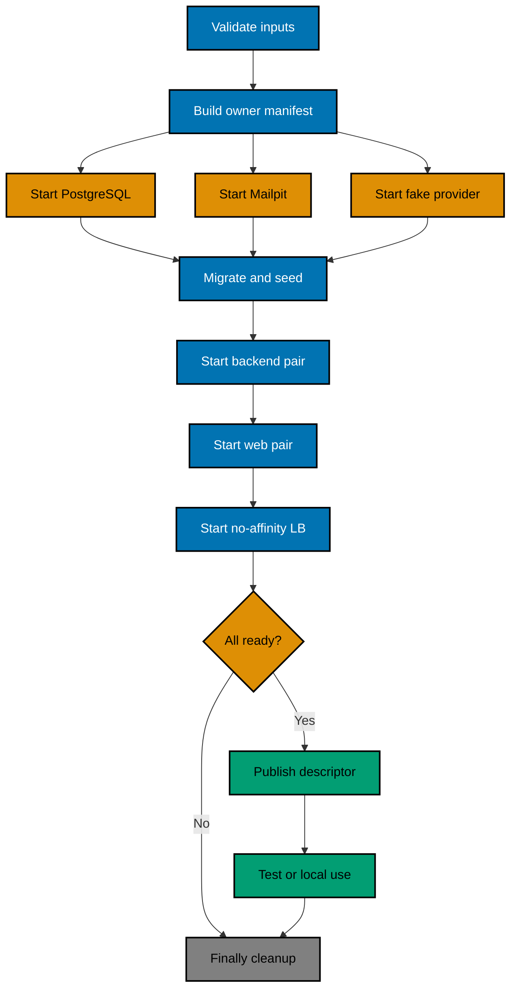
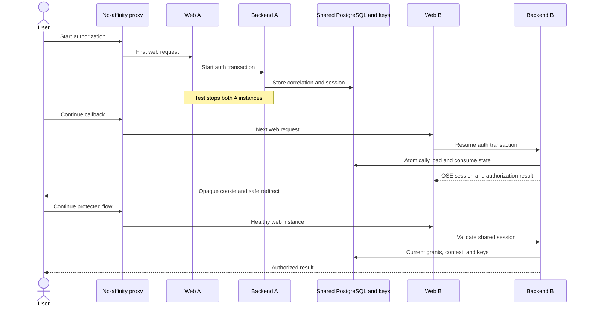

# Product Requirements — OSE ID Init 09 Local Scale and Composition

## Product Overview

This capstone does not add another end-user sign-in method. It turns the nine-slice local OSE ID system
into a repeatable product dependency: a complete stack runner, a two-instance no-affinity proof, and a
versioned composition interface for LMS and later applications.

## Terms

| Term               | Meaning here                                                                                                            |
| ------------------ | ----------------------------------------------------------------------------------------------------------------------- |
| Stateless process  | Disposable web/backend instance with no correctness-critical local memory or disk.                                      |
| Shared state       | PostgreSQL or an earlier approved shared provider for sessions, correlation, grants, keys, counters, and identity data. |
| No affinity        | Requests may reach any healthy instance; correctness never requires sticky routing.                                     |
| Stack ID           | Unique sanitized identifier naming only the current runner's owned resources.                                           |
| Ownership manifest | Machine-readable inventory of processes, containers, networks, volumes, ports, and temp paths created by one run.       |
| Public descriptor  | Allowlisted runner output containing issuer/endpoints/ports/readiness, never secrets.                                   |
| Outer runner       | Dependent app lifecycle that invokes the OSE ID inner runner and owns its own app resources.                            |

## User and Maintainer Stories

- As a user, I can begin login before one instance stops and still finish through another healthy instance.
- As a company admin, I can complete a confirmed mutation after instance replacement without duplicate or
  cross-company effects.
- As a maintainer, I can start the whole stack once and know which dependency failed and how it was cleaned.
- As an LMS developer, I can compose OSE ID through a documented contract without copying its scripts.
- As a test author, I can run isolated stacks concurrently with synthetic personal/company/provider/email data.

## Stack Lifecycle



## No-Affinity Sequence



## Functional Contract

### Complete owned stack

- Accept an explicit stack ID or generate a collision-resistant sanitized one.
- Validate repository root, runtime mode, required built artifacts, declared port overrides, path targets,
  and absence of conflicting owned resources before starting anything.
- Create a restrictive temporary directory and machine-readable ownership manifest before children.
- Generate synthetic keys/client credentials/fixtures outside Git; never print private values.
- Start owned PostgreSQL and Mailpit containers plus fake provider, backend pair, web pair, and local
  proxies in dependency order with explicit health/readiness checks.
- Migrate with the migration role, run backend with least-privilege role, and seed only through supported
  migrations/setup APIs.
- Publish a public descriptor only after every required surface is ready.
- Preserve primary child/test exit status and always run reverse-order cleanup.

### Shared state and no-affinity

The test must prove shared behavior for:

- OSE browser session and data-protection keys;
- OIDC authorization correlation, state, nonce, code, consent/grant, signing/encryption key view, and
  revocation;
- email verification/recovery/invitation capabilities;
- Google federation correlation/provider link;
- passkey challenge and MFA/recovery state;
- personal/company context and entitlement;
- company-admin recent-auth/idempotency/concurrency state; and
- shared rate-limit/abuse counters required for consistent policy.

No test-only affinity cookie/header may make the success path pass. A test-only instance marker may
appear in sanitized logs or response diagnostics solely to prove routing and must be unreachable in
ordinary/production runtime.

### Dependent-app composition

The inner OSE ID runner accepts a versioned input manifest containing stack ID, collision-checked port
map, synthetic client registration, exact callback/logout URIs, resource/audience/scopes, accepted
personal/company contexts, and fixture requests. It returns a public descriptor with issuer, discovery,
JWKS, web entry, API endpoints, readiness, stack ID, and opaque lifecycle handle.

Private client material remains in the restrictive temp directory and reaches the authorized outer
runner through an explicit protected file/descriptor path, never stdout or repository env. The outer
runner starts its app after OSE ID readiness and tears down app resources before invoking OSE ID cleanup.

### App-only failure

A focused dependent app may start without the full stack only when explicitly configured to use an OSE
ID issuer. If unavailable, authenticated routes show/return a clear dependency-unavailable result. The app
must not create local passwords, debug users, trusted headers, unsigned/shared-secret fallback tokens,
or silently substitute an issuer.

## Acceptance Criteria

### AC-SCALE-01 — Complete an authorization after instance replacement

```gherkin
Scenario: Authorization starts on A and completes on B
  Given two web and two backend instances share PostgreSQL state and key providers behind no-affinity proxies
  When a user starts authorization through instance A, both A instances stop, and the callback continues through B
  Then OSE ID completes the same valid authorization exactly once
  And the issuer, subject, context, audience, consent, and session remain correct
```

### AC-SCALE-02 — Share protection and signing keys

```gherkin
Scenario: One instance validates material produced by another
  Given web A protects a session and backend A publishes the current OSE issuer key set
  When web B reads the session and backend B serves and uses the same active key generation
  Then valid material succeeds across instances
  And an instance-local or divergent key configuration fails the readiness gate
```

### AC-SCALE-03 — Complete representative stateful journeys without affinity

```gherkin
Scenario Outline: A correctness-sensitive journey changes instances
  Given the local stack routes consecutive requests across healthy instances
  When the user performs <journey> with a required instance handoff
  Then the journey commits exactly once with its personal or Company A boundary intact
  And no sticky-session requirement or Company B effect appears

  Examples:
    | journey |
    | email verification and sign-in |
    | Google callback and account resolution |
    | passkey or MFA continuation |
    | consent and token issuance |
    | company-admin invitation or entitlement mutation |
    | session or grant revocation |
```

### AC-STACK-01 — Start a complete deterministic stack

```gherkin
Scenario: A clean developer run becomes ready
  Given the required artifacts are built and requested loopback ports are free
  When the OSE ID local runner starts with a unique stack ID
  Then PostgreSQL, Mailpit, fake provider, both backend instances, both web instances, and proxies become ready in dependency order
  And the runner publishes only its allowlisted public descriptor
```

### AC-STACK-02 — Fail at the first unready dependency

```gherkin
Scenario Outline: Startup cannot complete
  Given the stack owns an initialized manifest
  When <failure> occurs before readiness
  Then the runner reports the earliest failing stage without leaking secrets
  And unconditional cleanup removes only that stack's resources

  Examples:
    | failure |
    | requested port collision |
    | PostgreSQL health failure |
    | migration failure |
    | fake provider crash |
    | backend readiness failure |
    | web readiness failure |
```

### AC-STACK-03 — Clean every exit path

```gherkin
Scenario Outline: A running stack exits
  Given a complete stack owns resources listed in its manifest
  When it ends by <exit path>
  Then the primary status is preserved and cleanup is idempotent
  And no owned process, container, network, volume, port, temporary secret, or message remains

  Examples:
    | exit path |
    | success |
    | test assertion failure |
    | child process crash |
    | interrupt signal |
    | repeated cleanup invocation |
```

### AC-STACK-04 — Isolate concurrent stack ownership

```gherkin
Scenario: Two unique local stacks run concurrently
  Given each run uses a different valid stack ID and non-conflicting port map
  When one runner cleans up while the other remains active
  Then only the first ownership manifest's resources are removed
  And the second stack remains ready and usable
```

### AC-COMPOSE-01 — Compose a dependent application

```gherkin
Scenario: A synthetic downstream runner consumes OSE ID
  Given a versioned input requests one client, resource, personal entitlement, and Company A fixture
  When the outer runner starts OSE ID and then starts the synthetic dependent app
  Then the app receives the allowlisted issuer and client configuration through the protected contract
  And personal and Company A OIDC journeys succeed without copied OSE ID lifecycle code
```

### AC-COMPOSE-02 — Reject fallback identity

```gherkin
Scenario: A dependent app cannot reach OSE ID
  Given the app is configured for the OSE ID issuer and OSE ID is unavailable
  When a user opens an authenticated route
  Then the app returns a clear identity-dependency-unavailable result
  And no local credential, debug identity, trusted header, or alternate issuer is accepted
```

### AC-BOUNDARY-01 — Remain local-only

```gherkin
Scenario: OSE ID rejects a non-local runtime boundary
  Given the runtime mode is neither Local nor Test or the local bind address is not loopback
  When OSE ID starts
  Then startup fails closed before readiness
  And no public listener becomes ready or external endpoint is contacted
```

### AC-AUDIT-01 — Preserve auditability across the complete stack

```gherkin
Scenario: Verify every identity table rejects physical deletion
  Given the complete local OSE ID stack has representative active and terminal records
  When the audit verifier inventories every persisted table and probes each serving role
  Then every table has all six audit columns and lifecycle constraints
  And every foreign key uses restrictive delete behavior
  And every serving role is denied physical deletion
  And representative soft-deleted records remain attributed and unusable after instance replacement
```

## Product Exclusions

## BDD and Coverage Contract

Every Gherkin scenario maps to Unit, Integration, and E2E adapters under the repository BDD convention.
Any inapplicable adapter needs a per-scenario boundary reason indexed in behavior-coverage configuration
and statically validated; blanket/implicit exemptions are forbidden. Authored production lines added by
this plan maintain at least 99% Unit line coverage under the canonical metric, with only
repository-approved generated/test exclusions.

The result proves process disposability and composition contracts on localhost. It does not prove
production capacity, failover, database HA, rolling deployment, or Kubernetes operation. Those belong to
a future plan after the private cluster prerequisite and platform handoff gates.
