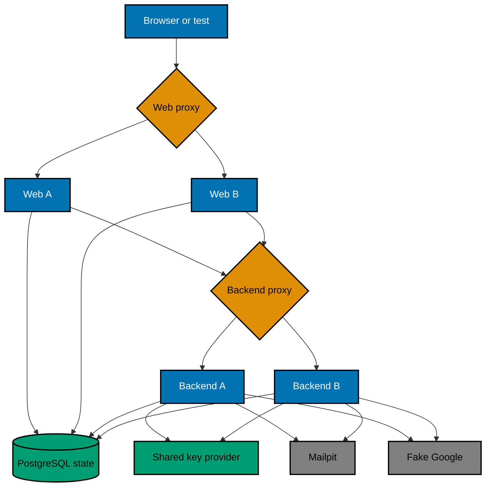

# Runtime Topology and State Ownership

## Stateless Means Process-Stateless

OSE ID as a system is intentionally stateful: identities, credentials, companies, entitlements,
sessions, grants, keys, audit, and abuse controls must persist. The horizontal-scaling claim applies to
each `ose-id-web` and `ose-id-be` process. Any healthy instance can serve the next request because no
correctness decision depends on one process's memory or local disk.

## Transport-Neutral Scaling

Horizontal safety applies to the application boundary, not only REST routes. Current REST/OIDC inbound
adapters and any future GraphQL or Model Context Protocol adapter must be process-stateless and invoke the
same application use cases, policy, transaction, idempotency, audit, RLS, and outbound ports. Adding a
transport may add protocol-local connection state, but no identity, tenant, authorization, replay, or
workflow correctness may depend on one adapter instance or sticky routing.

This plan proves only the delivered REST/OIDC/BFF surfaces across instances. It does not install or load
test-only GraphQL/MCP adapters. A later transport plan must extend the no-affinity matrix and readiness/
shutdown/resource-accounting proof for its real wire protocol, following the Init 01
[backend architecture](../../ose-id-init-01-foundation/tech-docs/001-system-boundaries-and-project-topology.md#backend-architecture-pragmatic-hexagonal-ddd).

The same rule applies to persistence across replicas. OSE-owned tables use SqlKata-compiled PostgreSQL
queries with Npgsql execution, explicit columns and transaction ownership, bounded cancellation/
timeouts, and no process-local identity map or EF change tracker. OpenIddict's version-pinned custom
stores remain limited to protocol records and use the same SqlKata/Npgsql boundary. Scale proof records sanitized query
fingerprints and synthetic query plans for representative identity, tenant, session, and cleanup paths;
adding replicas must not introduce per-instance query shape, N+1 behavior, or unbounded result sets.

## Local Scale Topology

The key provider may use PostgreSQL or the precise shared mechanism selected by earlier plans. It must
not introduce a new service solely for this proof.

## State Ownership Matrix

| State                                               | Required owner                                         | Forbidden owner                                |
| --------------------------------------------------- | ------------------------------------------------------ | ---------------------------------------------- |
| Person/login methods/company/membership/entitlement | PostgreSQL canonical records                           | Process memory or local files                  |
| Browser session and BFF server state                | Shared session store and shared protection keys        | One Next.js process                            |
| OIDC correlation/code/grant/consent/revocation      | OpenIddict/shared database state                       | Backend singleton/cache                        |
| Signing/encryption/data-protection keys             | Shared persisted provider with rotation metadata       | Per-instance generated key                     |
| Email/recovery/invitation capability                | Hashed shared record; message in owned Mailpit locally | Logs, browser storage, instance memory         |
| Google state/nonce/provider link                    | Shared atomic correlation/link records                 | Backend A only                                 |
| Passkey/MFA challenge/recovery use                  | Shared bounded record or protected shared state        | Instance-local challenge                       |
| Rate/abuse counters required for policy             | Existing shared persistence mechanism                  | Per-process counter for authoritative decision |
| UI-only drawer/open state                           | Browser/URL presentation state                         | Not an authorization source                    |

## No-Affinity Proxy

The test proxy is a local/E2E tool, not a production load balancer. It routes deterministically round
robin among healthy instances and can remove a named instance from rotation. It must not inspect or set a
sticky cookie, session key, person ID, or company ID. Test-only response/log instance markers provide
routing evidence and are unreachable in ordinary/production runtime.

## Handoff Assertions

For every representative journey:

1. record the initial instance marker;
2. persist the expected shared transaction/session state;
3. stop or remove A before the next critical request;
4. route the next request through B;
5. verify exactly-once result and security context;
6. verify A's local filesystem/memory cannot be required by restarting it empty; and
7. run the same invalid/replay request through another instance and confirm consistent denial.

## Shared Key Semantics

All instances must agree on current and still-valid previous public key generations. Rotation uses
atomic metadata and overlap policy defined earlier. A key view mismatch fails readiness rather than
letting an instance issue/validate inconsistent tokens or cookies. Private material never enters the
public descriptor, logs, or committed evidence.

## Why No Redis

The plan has no measured latency/capacity need and PostgreSQL already owns canonical state. Adding Redis
would create eviction, availability, consistency, secrets, lifecycle, licensing, and operations work.
A future measured optimization may add a shared cache that is never an unreviewed authority.
