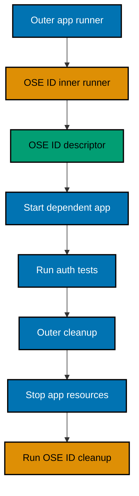

# Dependent-App Runner Contract

## Purpose

A dependent app needs OSE ID endpoints, client/resource registration, fixtures, readiness, and teardown.
Copying scripts would fork port policy, keys, provider settings, cleanup, and security. The shared contract
keeps OSE ID lifecycle inside OSE ID ownership while each app owns its outer lifecycle.

## Contract Versioning

Expose a schema-versioned input and output. Reject an unsupported major version with a clear diagnostic;
allow only documented backward-compatible additions. The runner and contract live with OSE ID E2E/local
tooling and have contract tests.

## Input Manifest

Required fields:

- contract version and unique stack ID;
- optional collision-checked scoped port map;
- one or more synthetic client registrations with exact loopback redirect/logout URIs;
- resource/audience and allowlisted scopes;
- accepted authorization context kinds: personal, company, or both;
- synthetic fixture requests: Persons, verified local methods, company/membership/admin status,
  entitlement, invitation, Google subject, passkey/MFA state;
- execution mode: run tests or hold for interactive local use; and
- outer-runner lifecycle callback/handle metadata without shell interpolation.

Reject unknown security-sensitive fields and real/prod hosts, emails, secrets, or provider settings.

## Output Descriptor

Public output includes:

- contract version and stack ID;
- issuer, discovery, JWKS, public web entry, public API, Mailpit inbox, and fake-provider public test URL
  only when the caller is an explicit test/local owner;
- readiness status and supported cleanup handle/command identifier;
- opaque synthetic fixture IDs safe for tests; and
- paths to sanitized diagnostics.

Private client credentials or test capabilities use a restrictive private descriptor whose path is
passed through the authorized parent-child process channel. They never appear in stdout, command-line
arguments, Git, screenshots, or the public descriptor.

## Nested Ownership

The outer runner may not kill OSE ID processes/containers directly. The inner runner may not delete app
resources. Each cleanup is idempotent, and the outer returns the earliest primary failure with separate
cleanup diagnostics.

## Synthetic Consumer Proof

Before LMS executes, this plan creates a minimal test consumer or contract harness in the OSE ID E2E
boundary. It requests personal and Company A contexts, validates OIDC discovery/callback/token/resource
metadata, observes unavailable-issuer behavior, and proves nested cleanup. It does not implement LMS
screens, roles, or data.

## LMS Handoff

The LMS user plan begins only after plan 09's merge and terminal audit. Its Phase 0 must locate this
archived plan through the done index, read the delivered contract version, and build an outer LMS runner
that composes the OSE ID target. LMS may extend fixtures through supported manifest fields but may not
copy internal Compose/scripts, read OSE ID tables, or introduce fallback credentials/issuer.

## App-Only Contract

Focused development points to an explicit issuer and fails clearly when unavailable. Unit/component tests
may inject typed domain ports inside test processes, but ordinary dev/production startup cannot enable a
debug identity, trusted-user header, unsigned/shared token, or alternate issuer.
