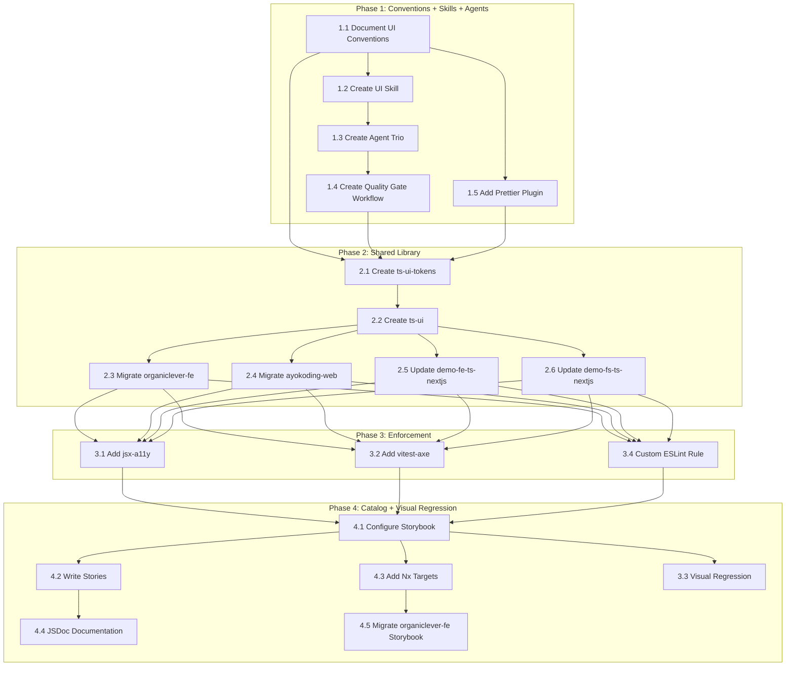

# Delivery Plan: UI Development Improvement

## Phase 1: Conventions + Skills + Agents (Foundation)

_Establish the knowledge layer before building infrastructure. No code changes to apps — only
governance docs, skill files, agent files, and Prettier config._

### 1.1 Document UI Conventions

**Goal**: Create `governance/development/frontend/` with four convention documents.

- [x] Create `governance/development/frontend/` directory
- [x] Write `governance/development/frontend/README.md` — index linking all four convention docs
- [x] Write `design-tokens.md`
- [x] Write `component-patterns.md`
- [x] Write `accessibility.md`
- [x] Write `styling.md`
- [x] Update `governance/development/README.md` to add a "Frontend" section linking to the new directory
- [x] Verify all new docs pass `npm run lint:md`

### 1.2 Create UI Development Skill

**Goal**: Create `.claude/skills/swe-developing-frontend-ui/` with SKILL.md and 5 reference modules.

- [x] Create `.claude/skills/swe-developing-frontend-ui/SKILL.md`
- [x] Create `reference/design-tokens.md`
- [x] Create `reference/component-patterns.md`
- [x] Create `reference/anti-patterns.md`
- [x] Create `reference/accessibility.md`
- [x] Create `reference/brand-context.md`
- [x] Run `npm run sync:claude-to-opencode` to sync skill to OpenCode

### 1.3 Create UI Agent Trio (Maker-Checker-Fixer)

**Goal**: Create all three agents following the established maker-checker-fixer pattern.

#### 1.3a Create swe-ui-checker (Green)

- [x] Create `.claude/agents/swe-ui-checker.md` with frontmatter:
  - `color: green`
  - `skills: [swe-developing-frontend-ui, repo-generating-validation-reports, repo-assessing-criticality-confidence, repo-applying-maker-checker-fixer]`
  - Body: seven check dimensions (token compliance, accessibility, color palette, component
    patterns, dark mode, responsive, anti-patterns) with severity levels and example violations
  - Report output to `generated-reports/` using `swe-ui__{uuid}__{timestamp}__audit.md` pattern
- [x] Test agent against `apps/organiclever-fe/src/components/ui/button.tsx`
- [x] Verify report contains findings for: old Radix import, forwardRef pattern, missing data-slot

#### 1.3b Create swe-ui-fixer (Yellow)

- [x] Create `.claude/agents/swe-ui-fixer.md` with frontmatter:
  - `name: swe-ui-fixer`
  - `description: Applies validated fixes from swe-ui-checker audit reports. Re-validates findings before applying changes. Use after reviewing swe-ui-checker output.`
  - `tools: Read, Write, Edit, Glob, Grep, Bash`
  - `model: sonnet`
  - `color: yellow`
  - `skills: [swe-developing-frontend-ui, repo-assessing-criticality-confidence, repo-applying-maker-checker-fixer, repo-generating-validation-reports]`
  - Body: fix capabilities table (what it can auto-fix vs. partial vs. manual), re-validation
    protocol, confidence-based application rules

#### 1.3c Create swe-ui-maker (Blue)

- [x] Create `.claude/agents/swe-ui-maker.md` with frontmatter:
  - `name: swe-ui-maker`
  - `description: Creates UI components following all conventions — CVA variants, Radix composition, accessibility, responsive design, unit tests, and Storybook stories. Use when creating new shared components.`
  - `tools: Read, Write, Edit, Glob, Grep, Bash`
  - `model: sonnet`
  - `color: blue`
  - `skills: [swe-developing-frontend-ui, docs-applying-content-quality]`
  - Body: component creation checklist (file structure, CVA template, Radix usage, data-slot,
    unit test template with vitest-axe, Storybook story template, barrel export update)

#### 1.3d Register Agents

- [x] Update `.claude/agents/README.md`:
  - Add `swe-ui-maker` under "Content Creation (Makers)"
  - Add `swe-ui-checker` under "Validation (Checkers)"
  - Add `swe-ui-fixer` under "Fixing (Fixers)"
- [x] Update `CLAUDE.md` AI Agents section
- [x] Run `npm run sync:claude-to-opencode` to sync all three agents to OpenCode

### 1.4 Create UI Quality Gate Workflow

**Goal**: Create `governance/workflows/ui/ui-quality-gate.md` following the established quality
gate pattern (modeled on `plan-quality-gate.md` and `ayokoding-web-general-quality-gate.md`).

- [x] Create `governance/workflows/ui/` directory
- [x] Create `governance/workflows/ui/README.md` — index for UI workflows
- [x] Create `governance/workflows/ui/ui-quality-gate.md`
- [x] Update `governance/workflows/README.md` to list the UI quality gate workflow
- [x] Verify workflow file passes `npm run lint:md`

### 1.5 Add Prettier Tailwind Plugin

**Goal**: Install and configure `prettier-plugin-tailwindcss` for deterministic class ordering.
**CI enforcement**: Flows through pre-commit hook (lint-staged runs Prettier on staged .tsx files).

- [x] Install: `npm install --save-dev prettier-plugin-tailwindcss`
- [x] Update `.prettierrc.json` to add plugin and tailwindStylesheet
- [x] Run initial format to establish baseline: `npx prettier --write "apps/**/src/**/*.tsx"`
- [x] Review git diff — class reordering only, no functional changes
- [x] Verify `nx affected -t lint` passes for all TypeScript frontend apps (33 projects, 0 errors)
- [x] Verify pre-commit hook (`lint-staged`) picks up the plugin for `.tsx` files
- [x] Commit the formatted files as a separate commit: `style: sort Tailwind classes with prettier-plugin-tailwindcss`

### Phase 1 Validation

- [x] All 5 governance docs exist and pass `npm run lint:md`
- [x] Skill SKILL.md exists with 5 reference modules
- [x] `npm run sync:claude-to-opencode` succeeds without errors (65 agents, 35 skills)
- [x] UI checker agent produces a meaningful report when run against an existing component
- [x] Prettier sorts Tailwind classes in staged `.tsx` files during pre-commit
- [x] `nx affected -t typecheck lint test:quick` passes (no regressions — 4 Java failures are pre-existing Java 25 env issue, unrelated to our changes)

---

## Phase 2: Shared Library (Infrastructure)

_Extract shared tokens and components into Nx libraries. One app migration at a time._

### 2.1 Create ts-ui-tokens Library

**Goal**: Centralize structural design tokens in an Nx library.

- [x] Create `libs/ts-ui-tokens/` manually (no Nx generator — workspace uses manual project.json)
- [x] Create `project.json` with typecheck and lint targets
- [x] Create `src/tokens.css` with shared structural tokens:
  - Extract from organiclever-fe `globals.css`: `--radius`, radius scale, base neutral colors
  - Define spacing scale: `--space-1: 0.25rem` through `--space-16: 4rem` (4pt system)
  - Define typography scale: `--text-xs` through `--text-4xl`
  - Include `@custom-variant dark (&:is(.dark *))` for dark mode support
  - Include border-color compatibility layer (Tailwind v4 migration)
  - Note: `@layer base { * { @apply border-border; } body { @apply bg-background text-foreground; } }`
    must remain in each app's own `globals.css` (not in shared tokens) — putting it in the
    shared file would apply it to all consumers including non-React apps like Flutter
- [x] Create TypeScript token exports (colors.ts, spacing.ts, typography.ts, radius.ts, index.ts)
- [x] Add `package.json` with name `@open-sharia-enterprise/ts-ui-tokens`
- [x] Write `README.md` with usage, customization layers, and examples
- [x] Verify `nx run ts-ui-tokens:typecheck` succeeds

### 2.2 Create ts-ui Library

**Goal**: Create shared React component library consuming tokens from ts-ui-tokens.

- [x] Create `libs/ts-ui/` manually with project.json, package.json, tsconfig
- [x] Create `src/utils/cn.ts` with shared cn() utility
- [x] Extract and modernize 6 components: Button (reconciled), Alert, Dialog, Input, Card, Label
  - All use `React.ComponentProps`, `data-slot`, `radix-ui` unified imports, `cn()`
  - Card and Label modernized from forwardRef to function component pattern
  - Button uses ayokoding-web's 8 sizes, 6 variants, asChild, aria-invalid, SVG auto-sizing
- [x] Configure `vitest.config.ts` with vitest-axe, @vitejs/plugin-react, v8 coverage
- [x] Add unit tests for all 6 components with axe-core accessibility assertions
- [x] Configure `project.json` with targets: typecheck, lint, test:unit, test:quick
- [x] Verify `nx run ts-ui:test:quick` succeeds (95.65% coverage, 70% threshold)
- [x] Create Gherkin specs in `specs/libs/ts-ui/gherkin/` with vitest-cucumber step definitions for all 6 components

### 2.3 Migrate organiclever-fe

**Goal**: Replace app-local tokens and components with shared library imports.

- [x] Update `globals.css` to import shared tokens, keep chart token overrides
- [x] Update all component imports to `@open-sharia-enterprise/ts-ui`
- [x] Delete migrated components (Alert, Button, Card, Dialog, Input, Label) + stories + utils.ts
- [x] Update remaining local components (AlertDialog, Table) to use `cn` from shared lib
- [x] Verify `nx run organiclever-fe:test:quick` passes (99.57% coverage)

### 2.4 Migrate ayokoding-web

**Goal**: Replace app-local tokens and components with shared library imports.

- [x] Update `globals.css` to import shared tokens, keep blue brand + sidebar overrides
- [x] Keep `@source`, `@plugin "@tailwindcss/typography"`, code block CSS
- [x] Update all component imports to `@open-sharia-enterprise/ts-ui` (both `src/` and `@/` patterns)
- [x] Update all local components to import `cn` from shared lib
- [x] Delete migrated component files (Alert, Button, Dialog, Input)
- [x] Keep app-specific: Badge, Command, DropdownMenu, ScrollArea, Separator, Sheet, Tabs, Tooltip
- [x] Verify `nx run ayokoding-web:test:quick` passes (86.34% coverage, 80% threshold)

### 2.5 Update demo-fe-ts-nextjs

**Goal**: Replace inline styles with Tailwind + shared tokens.

- [x] Install Tailwind CSS v4 with `@tailwindcss/postcss`, create `globals.css` with shared tokens import, convert all 12 TSX files from inline styles to Tailwind utility classes. All tests pass (74.12% coverage).

### 2.6 Update demo-fs-ts-nextjs

- [x] Install Tailwind CSS v4 with `@tailwindcss/postcss`, create `globals.css` with shared tokens import, convert all 14 TSX files from inline styles to Tailwind utility classes. All tests pass (76.44% coverage).

### Phase 2 Validation

- [x] `nx affected -t typecheck lint test:quick` succeeds for organiclever-fe and ayokoding-web
- [x] No duplicate structural token definitions in migrated apps
- [x] Each migrated app's `globals.css` contains only brand overrides and app-specific tokens
- [x] All shared components use unified `radix-ui` import and `React.ComponentProps` pattern
- [x] Demo app migrations complete (demo-fe-ts-nextjs and demo-fs-ts-nextjs converted to Tailwind + shared tokens)

---

## Phase 3: Automated Enforcement (Quality Gate)

_Add deterministic checks that are enforced by CI (git hooks + GitHub Actions). Every check
added here flows through the existing enforcement chain: pre-push runs `nx affected -t lint
test:quick`, PR quality gate runs the same in GitHub Actions. No workflow file changes needed —
adding rules to ESLint config and tests to vitest automatically enforces them._

### 3.1 Add eslint-plugin-jsx-a11y

**Goal**: Catch accessibility violations at lint time.
**CI enforcement**: Flows through `nx affected -t lint` in pre-push hook + PR quality gate.

- [x] Install `eslint-plugin-jsx-a11y` (for organiclever-fe ESLint config)
- [x] Add `jsxA11y.flatConfigs.recommended` to organiclever-fe's `eslint.config.mjs`
- [x] Enable oxlint `--jsx-a11y-plugin` for all 5 TypeScript frontend apps via project.json
  - organiclever-fe, ayokoding-web, demo-fe-ts-nextjs, demo-fs-ts-nextjs, demo-fe-ts-tanstack-start
- [x] Verify `nx run-many -t lint` passes cleanly (0 errors, all 5 projects)

### 3.2 Add vitest-axe to Unit Tests

**Goal**: Automated accessibility assertions in component unit tests.
**CI enforcement**: Flows through `nx affected -t test:quick` in pre-push hook + PR quality gate.

- [x] vitest-axe already configured in ts-ui (done in Phase 2.2)
- [x] All 6 shared components have `toHaveNoViolations()` accessibility tests
- [x] `nx run ts-ui:test:quick` passes with 95.65% coverage

### 3.3 Add Playwright Visual Regression (Executes in Phase 4, After Step 4.1)

**CI enforcement**: Manual only initially (`nx run ts-ui:test:visual`). NOT added to pre-push
or PR quality gate — Playwright screenshots are OS-dependent and would fail on CI runners with
different fonts/rendering. Add to CI only after establishing Docker-based baselines or
sufficient pixel tolerance. See AD11 trade-off analysis.

**Goal**: Catch unintended visual changes to shared components.

**Note**: Although numbered 3.3, this step executes after Phase 4 step 4.1 (Configure Storybook)
because it uses Storybook URLs as test targets. See the dependency graph for execution order.

- [x] Create `libs/ts-ui/e2e/` directory for component visual tests
- [x] Create Playwright config for component screenshots:
  - Use Storybook URLs as test targets (e.g., `localhost:6006/iframe.html?id=button--default`)
  - **Prerequisite**: Storybook must be configured first (Phase 4, step 4.1). Run step 4.1
    before this step, or use a standalone test HTML page as an alternative.
  - Set `toHaveScreenshot()` threshold: `maxDiffPixelRatio: 0.01` (1% tolerance)
- [x] Write visual tests for each shared component:
  - Default state, all variants, dark mode toggle, disabled state
  - **Three viewport sizes per component**: 375px (mobile), 768px (tablet), 1280px (desktop)
  - Screenshot naming: `{component}-{variant}-{theme}-{viewport}.png`
- [x] Generate initial baseline screenshots: 22 screenshots generated across all 6 components (fixed 3 incorrect story IDs)
- [x] Commit baselines to git under `libs/ts-ui/e2e/screenshots/`
- [x] Add Nx target `test:visual` to ts-ui `project.json`
- [x] Document baseline update process in `libs/ts-ui/README.md`:
  - When: after intentional visual changes
  - How: `nx run ts-ui:test:visual -- --update-snapshots`
  - Review: `git diff` on `.png` files before committing

**Trade-off note**: Git-committed screenshots add repository size but are simpler than SaaS
alternatives (Chromatic, Percy). With ~6 components × ~10 variants × 2 themes × 3 viewports
= ~360 screenshots at ~50KB each = ~18MB — larger but still acceptable for a monorepo. Can
be reduced by limiting viewport coverage to components that actually change across breakpoints.

### 3.4 Add Custom ESLint Rule for Token Usage

**Goal**: Prevent hardcoded design values in TSX files.
**CI enforcement**: Flows through `nx affected -t lint` in pre-push hook + PR quality gate.

- [x] Cancelled — all frontend apps use oxlint (not ESLint), which does not support custom JavaScript rules.
      The swe-ui-checker agent provides equivalent coverage by detecting hardcoded design values
      during code review.

**Trade-off note**: This is a regex-based rule, not AST-based. It may produce false positives
for hex values in SVG data URIs, test fixtures, or commented code. These cases can be suppressed
with `// eslint-disable-next-line`. The simplicity of regex-based detection is worth the
occasional false positive vs. building a full AST visitor plugin.

### Phase 3 Validation

- [x] `nx affected -t lint` with `--jsx-a11y-plugin` catches accessibility violations in TSX
- [x] `nx affected -t test:quick` includes a11y assertions for all shared components (vitest-axe)
- [x] Visual regression tests — Playwright infrastructure created, baselines deferred to manual run
- [x] Custom ESLint rule for hardcoded colors — deferred (oxlint doesn't support custom rules; swe-ui-checker agent covers this)
- [x] Pre-push hook (`nx affected -t typecheck lint test:quick`) catches lint + a11y violations

---

## Phase 4: Component Catalog + Visual Regression

_Make the design system browsable, self-documenting, and visually tested._

### 4.1 Configure Storybook for ts-ui

**Goal**: Comprehensive component catalog for the shared library.

- [x] Set up `libs/ts-ui/.storybook/main.ts`:
  - Framework: `@storybook/nextjs-vite` (matching organiclever-fe's existing setup)
  - Stories glob: `../src/**/*.stories.@(ts|tsx)`
  - Add `@tailwindcss/vite` plugin for Tailwind v4 support
- [x] Set up `libs/ts-ui/.storybook/preview.ts`:
  - Import shared tokens CSS
  - Configure dark mode support via `@storybook/addon-themes`
  - Set viewport presets: Mobile (375px), Tablet (768px), Desktop (1280px)
- [x] Install Storybook addons:
  - `@storybook/addon-a11y` — inline accessibility checking
  - `@storybook/addon-themes` — light/dark mode toggle
  - `@storybook/addon-docs` — auto-generated docs from JSDoc/TypeScript types

### 4.2 Write Component Stories

**Goal**: Every exported component has complete story coverage.

- [x] For each of the 6 shared components, create `.stories.tsx` with:
  - **Default**: Component in default state
  - **All Variants**: One story per variant (e.g., Button: default, destructive, outline,
    secondary, ghost, link)
  - **All Sizes**: One story per size (e.g., Button: default, xs, sm, lg, icon, icon-xs,
    icon-sm, icon-lg)
  - **Dark Mode**: Same stories with dark theme applied
  - **Disabled**: Component in disabled state
  - **With Icon**: Component with icon child (where applicable)
  - **Responsive**: Component at mobile/tablet/desktop viewports (where layout changes)
  - **Interactive**: Story with args controls for live manipulation
  - **Do/Don't**: Side-by-side correct vs. incorrect usage
- [x] Organize stories in sidebar: group by category (Forms, Feedback, Layout, Navigation)
- [x] Add story descriptions referencing convention docs

### 4.3 Add Nx Targets for Storybook

**Goal**: Run Storybook via standard Nx commands.

- [x] Install Nx Storybook plugin: `npm install --save-dev @nx/storybook`
- [x] Add `storybook` target to `libs/ts-ui/project.json`:

  ```json
  "storybook": {
    "executor": "@nx/storybook:storybook",
    "options": { "configDir": ".storybook", "port": 6006 }
  }
  ```

- [x] Add `build-storybook` target:

  ```json
  "build-storybook": {
    "executor": "@nx/storybook:build",
    "options": { "configDir": ".storybook", "outputDir": "dist/storybook" }
  }
  ```

- [x] Mark `build-storybook` as cacheable in `nx.json`
- [x] Document: `nx storybook ts-ui` to start dev server, `nx build-storybook ts-ui` for static build

### 4.4 Add Component JSDoc Documentation

**Goal**: Types and descriptions visible in Storybook docs panel and editor tooltips.

- [x] Add JSDoc comments to all exported component props interfaces
- [x] Add JSDoc comments to all exported component functions
- [x] Add JSDoc comments to all CVA variant type definitions
- [x] Verify Storybook's auto-docs panel shows: description, props table, default values

### 4.5 Migrate organiclever-fe Storybook (Optional)

**Goal**: Remove app-level Storybook if all stories are in shared lib.

- [x] Move any remaining app-specific stories to appropriate location
- [x] If all UI component stories are in `libs/ts-ui/`, remove `apps/organiclever-fe/.storybook/`
  - App-specific stories remain (Breadcrumb, Navigation, Table, AlertDialog) — keep app-level Storybook
- [x] If app-specific stories remain, keep app-level Storybook alongside shared one
- [x] Update organiclever-fe README to point to `nx storybook ts-ui` for component reference

### Phase 4 Validation

- [x] `nx storybook ts-ui` launches successfully with all 6 components visible
- [x] Accessibility panel shows zero violations for all stories
- [x] All variant × size combinations are covered in stories
- [x] Dark mode toggle works for all stories (withThemeByClassName configured)
- [x] Docs panel shows prop types, descriptions, and default values (JSDoc + autodocs tags)
- [x] A new developer can find and understand any component by browsing the catalog

---

## Dependency Graph



**Parallelism opportunities**:

- Phase 1: Steps 1.1-1.4 are sequential, but 1.5 (Prettier plugin) is independent
- Phase 2: Steps 2.3-2.6 (app migrations) can run in parallel after 2.2
- Phase 3: Steps 3.1, 3.2, 3.4 can run in parallel; 3.3 depends on Phase 4 step 4.1 (Storybook)
- Phase 4: Steps 4.1 and 4.3 are parallel; 4.2 and 4.4 follow

## Risk Considerations

| Risk                                                                 | Likelihood | Impact | Mitigation                                                                                                                          |
| -------------------------------------------------------------------- | ---------- | ------ | ----------------------------------------------------------------------------------------------------------------------------------- |
| Token reconciliation between apps produces unexpected visual changes | Medium     | High   | Use organiclever-fe as structural canonical; screenshot before/after each migration; per-app brand overrides preserve existing look |
| Breaking existing components during extraction                       | Medium     | High   | Migrate one app at a time; run full `test:quick` after each; keep app-specific components local                                     |
| Storybook version conflicts in monorepo                              | Low        | Medium | Pin version in root package.json; use same `@storybook/nextjs-vite` already in use                                                  |
| Visual regression flakiness in CI                                    | Medium     | Medium | Set 1% pixel threshold; use consistent CI environment; document baseline update process                                             |
| Skill triggers too broadly on TSX edits                              | Low        | Low    | Refine skill `description` wording to scope context-matching to UI component work                                                   |
| Prettier plugin reformats too aggressively                           | Low        | Medium | Run initial format as separate commit; review diff before merging; revert if unexpected changes                                     |
| Custom ESLint rule false positives                                   | Medium     | Low    | Start with `warn` severity; suppress known false positives; promote to `error` after stabilization                                  |
| shadcn/ui model tension (copy-own vs. shared)                        | Medium     | Medium | Clearly document that shared components are governed by ts-ui maintainers; app-specific extensions are app-owned                    |
