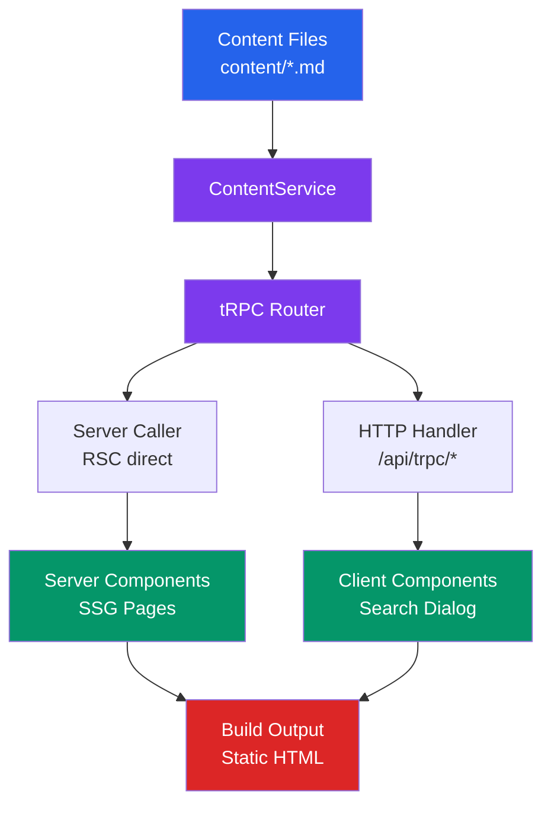

# Technical Documentation: OSE Platform Web - Next.js Rewrite

## Architecture Overview



The architecture mirrors ayokoding-web but is simplified:

- **No i18n layer** -- single locale, no locale routing, no middleware
- **No tree builder** -- flat content structure (landing, about, updates list)
- **No generate-indexes script** -- no `_index.md` management needed (simple structure)
- **SSG** -- all ~6 pages pre-built at build time (same pattern as ayokoding-web: `generateStaticParams` + `dynamicParams = false`)
- **Simpler navigation** -- header links instead of sidebar tree
- **Shared UI libs** -- uses `@open-sharia-enterprise/ts-ui` (Button, etc.) and `@open-sharia-enterprise/ts-ui-tokens` (design tokens), same as ayokoding-web and organiclever-web

## Project Structure

```
apps/oseplatform-web/
├── content/                          # Markdown content (migrated from Hugo)
│   ├── about.md                      # About page
│   └── updates/                      # Update posts
│       ├── _index.md                 # Updates section index
│       ├── 2025-12-14-phase-0-week-4-initial-commit.md
│       ├── 2026-01-11-phase-0-week-8-agent-system-and-content-improvement.md
│       ├── 2026-02-08-phase-0-end-of-phase-0.md
│       └── 2026-03-08-phase-1-week-4-organiclever-takes-shape.md
├── public/
│   ├── favicon.ico                   # Site favicon
│   └── favicon.png                   # Site favicon (PNG)
├── src/
│   ├── app/                          # Next.js App Router
│   │   ├── globals.css               # Tailwind + shared token imports + code styling
│   │   ├── layout.tsx                # Root layout (meta, globals.css)
│   │   ├── page.tsx                  # Landing page
│   │   ├── robots.ts                 # SEO robots.txt
│   │   ├── sitemap.ts                # SEO sitemap.xml
│   │   ├── feed.xml/
│   │   │   └── route.ts              # RSS feed endpoint (dynamic = "force-static")
│   │   ├── api/trpc/[trpc]/
│   │   │   └── route.ts              # tRPC HTTP handler (GET/POST)
│   │   ├── about/
│   │   │   └── page.tsx              # About page (SSG)
│   │   └── updates/
│   │       ├── page.tsx              # Updates listing (SSG)
│   │       └── [slug]/
│   │           └── page.tsx          # Update detail (SSG)
│   ├── server/                       # Server-side logic
│   │   ├── content/
│   │   │   ├── types.ts              # ContentMeta, ContentPage, Heading, etc.
│   │   │   ├── repository.ts         # ContentRepository interface
│   │   │   ├── repository-fs.ts      # FileSystem implementation
│   │   │   ├── repository-memory.ts  # In-memory (testing)
│   │   │   ├── reader.ts             # File I/O utilities
│   │   │   ├── parser.ts             # Markdown-to-HTML (unified pipeline)
│   │   │   └── service.ts            # ContentService orchestration
│   │   └── trpc/
│   │       ├── init.ts               # tRPC context + initialization
│   │       ├── router.ts             # Root router (content, search, meta)
│   │       └── procedures/
│   │           ├── content.ts        # getBySlug, listUpdates
│   │           ├── search.ts         # query
│   │           └── meta.ts           # health
│   ├── components/
│   │   ├── layout/
│   │   │   ├── header.tsx            # Navigation header (uses ts-ui Button)
│   │   │   ├── footer.tsx            # Footer with links
│   │   │   ├── breadcrumb.tsx        # Breadcrumb navigation
│   │   │   ├── toc.tsx               # Table of contents (client, IntersectionObserver)
│   │   │   ├── prev-next.tsx         # Update post navigation
│   │   │   ├── theme-toggle.tsx      # Dark/light mode (uses ts-ui Button)
│   │   │   └── mobile-nav.tsx        # Mobile menu (Sheet + tRPC client)
│   │   ├── content/
│   │   │   ├── markdown-renderer.tsx # HTML-to-React rendering (html-react-parser)
│   │   │   ├── mermaid.tsx           # Mermaid diagram component (dynamic import)
│   │   │   └── update-card.tsx       # Update post card for listing
│   │   ├── landing/
│   │   │   ├── hero.tsx              # Hero section (title, description, CTA)
│   │   │   └── social-icons.tsx      # GitHub, RSS icons
│   │   ├── search/
│   │   │   ├── search-provider.tsx   # Search context + SearchDialog wrapper
│   │   │   └── search-dialog.tsx     # Cmd+K dialog (cmdk + tRPC client)
│   │   └── ui/                       # shadcn/ui components (installed via CLI)
│   ├── lib/
│   │   ├── trpc/
│   │   │   ├── server.ts             # RSC server caller (import "server-only")
│   │   │   ├── client.ts             # Browser HTTP client (createTRPCClient)
│   │   │   └── provider.tsx          # TRPCProvider (QueryClientProvider wrapper)
│   │   ├── schemas/
│   │   │   ├── content.ts            # Frontmatter Zod schema
│   │   │   └── search.ts            # Search query/result schemas
│   │   ├── hooks/
│   │   │   └── use-search.ts         # Search dialog state (React Context)
│   │   └── utils.ts                  # cn() utility (clsx + tailwind-merge)
│   ├── test/
│   │   └── setup.ts                  # Frontend test setup (jsdom)
│   └── scripts/
│       └── generate-search-data.ts   # Build-time search index
├── test/
│   ├── unit/
│   │   ├── be-steps/                 # Backend Gherkin step implementations
│   │   │   └── helpers/              # Test helpers (mock-content, test-caller, test-service)
│   │   └── fe-steps/                 # Frontend Gherkin step implementations
│   │       └── helpers/              # Test helpers (test-setup)
│   └── integration/
│       └── be-steps/                 # Integration test step implementations
│           └── helpers/              # Test helpers (test-caller, test-service)
├── generated/
│   └── search-data.json              # Build-time search index (gitignored)
├── next.config.ts
├── next-env.d.ts                     # Next.js TypeScript declarations (auto-generated)
├── package.json
├── project.json                      # Nx targets
├── tsconfig.json
├── vitest.config.ts
├── vercel.json
├── Dockerfile
├── oxlint.json
├── components.json                   # shadcn/ui configuration
├── postcss.config.mjs                # PostCSS with Tailwind v4
└── README.md
```

## Content Layer

### Content Types

```typescript
// src/server/content/types.ts

export interface ContentMeta {
  title: string;
  slug: string; // e.g., "about" or "updates/2026-02-08-phase-0-end-of-phase-0"
  date?: Date;
  draft: boolean;
  description?: string;
  tags: string[];
  summary?: string; // Hugo-style summary field
  weight: number; // Sort order (0 = default)
  isSection: boolean; // true for _index.md files
  filePath: string; // Relative path from content/
  readingTime: number; // Minutes
  category?: string; // e.g., "updates"
}

export interface ContentPage extends ContentMeta {
  html: string;
  headings: Heading[];
  prev?: PageLink;
  next?: PageLink;
}

export interface Heading {
  id: string;
  text: string;
  level: number; // 2-4
}

export interface PageLink {
  title: string;
  slug: string;
}

export interface SearchResult {
  title: string;
  slug: string;
  excerpt: string;
}
```

### Frontmatter Schema

```typescript
// src/lib/schemas/content.ts
import { z } from "zod";

export const frontmatterSchema = z.object({
  title: z.string(),
  date: z.coerce.date().optional(),
  draft: z.boolean().default(false),
  weight: z.number().default(0),
  description: z.string().optional(),
  tags: z.array(z.string()).default([]),
  summary: z.string().optional(),
  categories: z.array(z.string()).default([]),
  showtoc: z.boolean().default(false),
  // url: Hugo URL override field (e.g. "/about/" on about.md). Stored for reference only.
  // Slug derivation always uses file path, not this field. Ignored for routing.
  url: z.string().optional(),
});
```

### Content Directory Mapping

Hugo content paths map to Next.js routes as follows:

| Hugo Path                         | URL                      | Next.js Route                 |
| --------------------------------- | ------------------------ | ----------------------------- |
| `content/about.md`                | `/about/`                | `app/about/page.tsx`          |
| `content/updates/_index.md`       | `/updates/`              | `app/updates/page.tsx`        |
| `content/updates/2025-12-14-*.md` | `/updates/2025-12-14-*/` | `app/updates/[slug]/page.tsx` |

**Key difference from ayokoding-web**: No locale prefix in URLs. The landing page (`/`) is a custom component, not a content page.

### Hugo Frontmatter Adaptation

The Hugo content uses these frontmatter fields that need mapping:

| Hugo Field   | Next.js Handling                                                            |
| ------------ | --------------------------------------------------------------------------- |
| `title`      | Direct mapping                                                              |
| `date`       | Direct mapping (ISO 8601 with timezone)                                     |
| `draft`      | Exclude from `generateStaticParams` when `true` (unless `SHOW_DRAFTS=true`) |
| `tags`       | Displayed as badges                                                         |
| `categories` | Used for content grouping (e.g., `[updates]`)                               |
| `summary`    | Used in updates listing and RSS feed                                        |
| `showtoc`    | Controls table of contents visibility                                       |
| `url`        | Used for URL override (about page uses `/about/`)                           |

### Markdown Pipeline

```typescript
// src/server/content/parser.ts
// Unified pipeline (same as ayokoding-web)

import { unified } from "unified";
import remarkParse from "remark-parse";
import remarkGfm from "remark-gfm";
import remarkRehype from "remark-rehype";
import rehypeRaw from "rehype-raw";
import rehypePrettyCode from "rehype-pretty-code";
import rehypeSlug from "rehype-slug";
import rehypeAutolinkHeadings from "rehype-autolink-headings";
import rehypeStringify from "rehype-stringify";

// No remark-math/rehype-katex needed (no math in oseplatform content)
// No shortcode transformation needed (only mermaid, handled natively)
```

**Mermaid handling**: The Hugo site uses fenced code blocks with `mermaid` language. The `markdown-renderer.tsx` component detects `<pre><code class="language-mermaid">` elements and replaces them with the `<MermaidDiagram>` React component, identical to ayokoding-web's approach.

### ContentService

```typescript
// src/server/content/service.ts
export class ContentService {
  constructor(
    private repository: ContentRepository,
    private searchDataPath?: string,
  ) {}

  // Get all content metadata (cached after first call)
  getIndex(): { contentMap: Map<string, ContentMeta>; updates: ContentMeta[] };

  // Get single page by slug
  getBySlug(slug: string): ContentPage | null;

  // List update posts sorted by date (newest first)
  listUpdates(): ContentMeta[];

  // Search across all content
  search(query: string, limit?: number): SearchResult[];
}
```

**Differences from ayokoding-web's ContentService**:

- No `locale` parameter on any method (single locale)
- No `getTree()` method (no sidebar navigation tree)
- No `listChildren()` method (flat structure)
- Added `listUpdates()` for date-sorted update listing
- Simpler index structure (no per-locale trees, no prevNext map for all content -- only for updates)

## tRPC API

### Router Structure

```typescript
// src/server/trpc/router.ts
export const appRouter = router({
  content: contentRouter,
  search: searchRouter,
  meta: metaRouter,
});
```

### Procedures

| Procedure             | Input                               | Output             | Description            |
| --------------------- | ----------------------------------- | ------------------ | ---------------------- |
| `content.getBySlug`   | `{ slug: string }`                  | `ContentPage`      | Single page by slug    |
| `content.listUpdates` | none                                | `ContentMeta[]`    | All updates, date desc |
| `search.query`        | `{ query: string, limit?: number }` | `SearchResult[]`   | Full-text search       |
| `meta.health`         | none                                | `{ status: "ok" }` | Health check           |

### Server Caller (RSC)

```typescript
// src/lib/trpc/server.ts
import "server-only";
import { createCallerFactory, createTRPCContext } from "@/server/trpc/init";
import { appRouter } from "@/server/trpc/router";

const createCaller = createCallerFactory(appRouter);
export const serverCaller = createCaller(createTRPCContext());
```

### HTTP Client (Browser)

```typescript
// src/lib/trpc/client.ts
"use client";
import { createTRPCClient, httpBatchLink } from "@trpc/client";
import superjson from "superjson";
import type { AppRouter } from "@/server/trpc/router";

function getBaseUrl() {
  if (typeof window !== "undefined") return "";
  return `http://localhost:${process.env.PORT ?? 3100}`;
}

export const trpcClient = createTRPCClient<AppRouter>({
  links: [httpBatchLink({ url: `${getBaseUrl()}/api/trpc`, transformer: superjson })],
});
```

### TRPCProvider

```typescript
// src/lib/trpc/provider.tsx — just a QueryClientProvider wrapper
// No tRPC-specific links; search dialog uses trpcClient (vanilla) directly
"use client";
import { QueryClient, QueryClientProvider } from "@tanstack/react-query";
import { useState, type ReactNode } from "react";

export function TRPCProvider({ children }: { children: ReactNode }) {
  const [queryClient] = useState(() => new QueryClient());
  return <QueryClientProvider client={queryClient}>{children}</QueryClientProvider>;
}
```

**Important**: The TRPCProvider is just a `QueryClientProvider` wrapper. The search dialog uses the vanilla `trpcClient` directly (not React Query hooks). This is the same pattern ayokoding-web uses.

## Page Components

### Landing Page (`app/page.tsx`)

Server component rendering the marketing landing page. **Not** a content page -- this is a custom React component replacing PaperMod's `homeInfoParams`.

```
┌────────────────────────────────────────┐
│  Header: [Updates] [About] [Docs] [GH] │
├────────────────────────────────────────┤
│                                        │
│     Open Sharia Enterprise Platform    │
│                                        │
│   Building enterprise-grade, Sharia-   │
│   compliant business systems in the    │
│   open.                                │
│                                        │
│   [Learn More →]  [GitHub →]           │
│                                        │
│   Why Open Source Matters:             │
│   • Transparency in compliance         │
│   • Accessibility for all              │
│   • Community-driven innovation        │
│                                        │
│   [GitHub] [RSS]                       │
│                                        │
├────────────────────────────────────────┤
│  Footer: MIT License | AyoKoding       │
└────────────────────────────────────────┘
```

### About Page (`app/about/page.tsx`)

Server component that calls `serverCaller.content.getBySlug("about")` and renders the markdown content with TOC and breadcrumbs.

### Updates Listing (`app/updates/page.tsx`)

Server component that calls `serverCaller.content.listUpdates()` and renders update cards with title, date, summary, and tags.

**`_index.md` handling**: The `content/updates/_index.md` file contains section introductory text ("Stay informed about the latest developments..."). This content is displayed above the update list on the `/updates/` page, maintaining parity with the Hugo site's section intro. The executor should call `serverCaller.content.getBySlug("updates/_index")` (or equivalent) to retrieve and render the `_index.md` intro content, or pass it directly as a static prop. If `_index.md` is absent or empty, the intro text is omitted gracefully. The `isSection: true` flag in `ContentMeta` identifies these files.

### Update Detail (`app/updates/[slug]/page.tsx`)

Server component with `generateStaticParams()` that pre-builds all update pages. Renders full markdown with TOC, reading time, tags, and prev/next navigation.

```typescript
// app/updates/[slug]/page.tsx
export async function generateStaticParams() {
  const caller = await createServerCaller();
  const updates = await caller.content.listUpdates();
  return updates.map((u) => ({
    slug: u.slug.replace("updates/", ""),
  }));
}

export const dynamicParams = false;
```

## UI Design

### Theme

- **Light mode default** (content-first marketing site)
- **Dark mode available** via toggle (next-themes)
- **Font**: Geist Sans (body) + Geist Mono (code, dates)
- **Colors**: Zinc/neutral tokens from shadcn/ui
- **Accent**: Blue (consistent with current landing page link color)

### shadcn/ui Components Needed

| Component     | Usage                      |
| ------------- | -------------------------- |
| `badge`       | Tags on update posts       |
| `button`      | CTAs, navigation           |
| `card`        | Update post cards          |
| `command`     | Search dialog              |
| `scroll-area` | TOC overflow               |
| `separator`   | Content dividers           |
| `sheet`       | Mobile navigation          |
| `tooltip`     | Social icons, theme toggle |

### Responsive Breakpoints

- **Mobile** (< 640px): Single column, hamburger nav, stacked cards
- **Tablet** (640-1024px): Two-column update cards
- **Desktop** (> 1024px): Full header nav, max-width content area

## Nx Configuration (`project.json`)

```json
{
  "$schema": "../../node_modules/nx/schemas/project-schema.json",
  "sourceRoot": "apps/oseplatform-web/src",
  "projectType": "application",
  "implicitDependencies": ["oseplatform-cli"],
  "targets": {
    "generate-search-data": {
      "command": "npx tsx src/scripts/generate-search-data.ts",
      "options": {
        "cwd": "apps/oseplatform-web"
      }
    },
    "dev": {
      "command": "next dev --port 3100",
      "options": {
        "cwd": "apps/oseplatform-web"
      },
      "dependsOn": []
    },
    "build": {
      "command": "next build",
      "options": {
        "cwd": "apps/oseplatform-web"
      },
      "dependsOn": ["generate-search-data"],
      "outputs": ["{projectRoot}/.next"],
      "inputs": [
        "{projectRoot}/src/**/*",
        "{projectRoot}/content/**/*",
        "{projectRoot}/next.config.ts",
        "{projectRoot}/tsconfig.json",
        "{projectRoot}/package.json"
      ],
      "cache": true
    },
    "start": {
      "command": "next start --port 3100",
      "options": {
        "cwd": "apps/oseplatform-web"
      }
    },
    "typecheck": {
      "command": "tsc --noEmit",
      "options": {
        "cwd": "apps/oseplatform-web"
      },
      "inputs": ["{projectRoot}/src/**/*", "{projectRoot}/tsconfig.json"],
      "cache": true
    },
    "lint": {
      "command": "npx oxlint@latest --jsx-a11y-plugin -c oxlint.json --tsconfig tsconfig.json src/",
      "options": {
        "cwd": "apps/oseplatform-web"
      },
      "inputs": ["{projectRoot}/src/**/*", "{projectRoot}/oxlint.json", "{projectRoot}/tsconfig.json"],
      "cache": true
    },
    "test:unit": {
      "command": "vitest run --project unit",
      "options": {
        "cwd": "apps/oseplatform-web"
      },
      "inputs": ["{projectRoot}/src/**/*", "{projectRoot}/test/unit/**/*", "{projectRoot}/vitest.config.ts"],
      "cache": true
    },
    "test:quick": {
      "executor": "nx:run-commands",
      "options": {
        "cwd": "apps/oseplatform-web",
        "commands": [
          "npx vitest run --project unit --project unit-fe --coverage && (cd ../../apps/rhino-cli && CGO_ENABLED=0 go run main.go test-coverage validate apps/oseplatform-web/coverage/lcov.info 80)",
          "../../apps/oseplatform-cli/dist/oseplatform-cli links check"
        ],
        "parallel": false
      },
      "inputs": [
        "{projectRoot}/src/**/*",
        "{projectRoot}/test/unit/**/*",
        "{projectRoot}/content/**/*.md",
        "{projectRoot}/vitest.config.ts"
      ],
      "cache": true
    },
    "test:integration": {
      "command": "vitest run --project integration",
      "options": {
        "cwd": "apps/oseplatform-web"
      },
      "cache": true
    },
    "links:check": {
      "command": "../../apps/oseplatform-cli/dist/oseplatform-cli links check",
      "options": {
        "cwd": "apps/oseplatform-web"
      }
    },
    "clean": {
      "command": "rm -rf .next"
    }
  },
  "tags": ["type:app", "platform:nextjs", "lang:ts", "domain:oseplatform"]
}
```

**Key differences from current Hugo project.json**:

- Platform tag: `platform:hugo` -> `platform:nextjs`
- Added `lang:ts` tag
- New targets: `typecheck`, `test:unit`, `test:integration`, `generate-search-data`
- `build` now runs `next build` instead of `build.sh`
- `dev` now runs `next dev --port 3100` instead of `hugo server --port 3000`
- `test:quick` includes coverage validation (80%)

## Dependencies (`package.json`)

Aligned with ayokoding-web's current `package.json` (post-shared-UI-libs migration).

```json
{
  "name": "oseplatform-web",
  "private": true,
  "scripts": {
    "dev": "next dev --port 3100",
    "build": "next build",
    "start": "next start --port 3100"
  },
  "dependencies": {
    "next": "16.1.6",
    "react": "^19.0.0",
    "react-dom": "^19.0.0",
    "@trpc/server": "^11.0.0",
    "@trpc/client": "^11.0.0",
    "@trpc/tanstack-react-query": "^11.0.0",
    "@tanstack/react-query": "^5.62.8",
    "zod": "^3.23.0",
    "superjson": "^2.2.1",
    "unified": "^11.0.0",
    "remark-parse": "^11.0.0",
    "remark-gfm": "^4.0.0",
    "remark-rehype": "^11.0.0",
    "rehype-raw": "^7.0.0",
    "rehype-pretty-code": "^0.14.0",
    "rehype-slug": "^6.0.0",
    "rehype-autolink-headings": "^7.0.0",
    "rehype-stringify": "^10.0.0",
    "shiki": "^1.0.0",
    "gray-matter": "^4.0.3",
    "html-react-parser": "^5.1.0",
    "flexsearch": "^0.7.43",
    "next-themes": "^0.4.0",
    "mermaid": "^11.0.0",
    "cmdk": "^1.1.1",
    "radix-ui": "^1.4.3",
    "@radix-ui/react-dialog": "^1.1.2",
    "@radix-ui/react-dropdown-menu": "^2.1.2",
    "@radix-ui/react-scroll-area": "^1.2.0",
    "@radix-ui/react-separator": "^1.1.0",
    "@radix-ui/react-slot": "^1.1.0",
    "@radix-ui/react-tabs": "^1.1.1",
    "@radix-ui/react-tooltip": "^1.1.3",
    "class-variance-authority": "^0.7.0",
    "clsx": "^2.1.1",
    "tailwind-merge": "^2.5.3",
    "lucide-react": "^0.447.0"
  },
  "devDependencies": {
    "typescript": "^5.6.0",
    "@types/node": "^22.0.0",
    "@types/react": "^19.0.0",
    "@types/react-dom": "^19.0.0",
    "vitest": "^4.0.0",
    "@vitest/coverage-v8": "^4.0.0",
    "@amiceli/vitest-cucumber": "^6.3.0",
    "@testing-library/jest-dom": "^6.0.0",
    "@testing-library/react": "^16.0.0",
    "@vitejs/plugin-react": "^4.0.0",
    "vite-tsconfig-paths": "^5.0.0",
    "jsdom": "^26.0.0",
    "tailwindcss": "^4.0.0",
    "@tailwindcss/postcss": "^4.0.0",
    "@tailwindcss/typography": "^0.5.0",
    "@playwright/test": "^1.50.0"
  }
}
```

**Note**: `@open-sharia-enterprise/ts-ui` and `@open-sharia-enterprise/ts-ui-tokens` are not listed in `package.json` -- they are monorepo workspace packages resolved via npm workspaces (declared in root `package.json`). The Dockerfile injects them into `node_modules` via direct COPY commands (matching the ayokoding-web pattern). Components like `Button` are imported from `@open-sharia-enterprise/ts-ui`.

**Omitted vs ayokoding-web** (not needed):

- `@next/third-parties` -- no Google Analytics (currently disabled in Hugo)
- `remark-math`, `rehype-katex` -- no math content in oseplatform-web
- `katex` CSS import -- not needed
- Locale/i18n modules -- single locale

````

## Next.js Configuration

```typescript
// next.config.ts
import type { NextConfig } from "next";
import path from "node:path";

const nextConfig: NextConfig = {
  output: "standalone",
  outputFileTracingRoot: path.join(__dirname, "../../"),
  outputFileTracingIncludes: {
    "/**": ["./content/**/*", "./generated/**/*"],
  },
  serverExternalPackages: ["flexsearch"],
};

export default nextConfig;
````

## Vercel Configuration

```json
{
  "version": 2,
  "installCommand": "npm install --prefix=../.. --ignore-scripts",
  "buildCommand": "npx tsx src/scripts/generate-search-data.ts && next build",
  "ignoreCommand": "[ \"$VERCEL_GIT_COMMIT_REF\" != \"prod-oseplatform-web\" ]",
  "headers": [
    {
      "source": "/_next/static/(.*)",
      "headers": [
        { "key": "Cache-Control", "value": "public, max-age=31536000, immutable" }
      ]
    },
    {
      "source": "/(.*)",
      "headers": [
        { "key": "X-Content-Type-Options", "value": "nosniff" },
        { "key": "X-Frame-Options", "value": "SAMEORIGIN" },
        { "key": "X-XSS-Protection", "value": "1; mode=block" },
        { "key": "Referrer-Policy", "value": "strict-origin-when-cross-origin" }
      ]
    }
  ]
}
```

**Note**: Security headers preserved from current Hugo vercel.json. Static asset cache-control header updated to use Next.js path pattern `/_next/static/(.*)` instead of Hugo's CSS/JS/fonts pattern.

## Additional Configuration Files

### `postcss.config.mjs`

```javascript
/** @type {import('postcss-load-config').Config} */
const config = {
  plugins: {
    "@tailwindcss/postcss": {},
  },
};

export default config;
```

### `globals.css`

```css
@import "tailwindcss";
@source "../../src/**/*.{ts,tsx}";
@plugin "@tailwindcss/typography";

@import "@open-sharia-enterprise/ts-ui-tokens/src/tokens.css";

@theme {
  /* oseplatform-web brand: primary blue */
  --color-primary: hsl(221.2 83.2% 53.3%);
  --color-primary-foreground: hsl(210 40% 98%);
  --color-ring: hsl(221.2 83.2% 53.3%);
}

/* Dark mode overrides, code block styling, etc. — follow ayokoding-web pattern */
```

**Key**: The `@import "@open-sharia-enterprise/ts-ui-tokens/src/tokens.css"` line imports shared design tokens (colors, radii, spacing) from the monorepo's `libs/ts-ui-tokens` package, ensuring visual consistency across all apps.

### `components.json` (shadcn/ui)

```json
{
  "$schema": "https://ui.shadcn.com/schema.json",
  "style": "new-york",
  "rsc": true,
  "tsx": true,
  "tailwind": {
    "config": "",
    "css": "src/app/globals.css",
    "baseColor": "neutral",
    "cssVariables": true,
    "prefix": ""
  },
  "aliases": {
    "components": "src/components",
    "utils": "src/lib/utils",
    "ui": "src/components/ui",
    "lib": "src/lib",
    "hooks": "src/lib/hooks"
  }
}
```

### `oxlint.json`

```json
{
  "$schema": "./node_modules/oxlint/configuration_schema.json",
  "plugins": ["typescript", "react", "nextjs", "import", "unicorn", "jsx-a11y", "vitest"],
  "categories": {
    "correctness": "error",
    "suspicious": "warn"
  },
  "rules": {
    "no-unused-vars": "error",
    "no-console": "error",
    "eqeqeq": "error"
  },
  "settings": {
    "next": { "rootDir": "." },
    "react": { "version": "detect" }
  },
  "env": {
    "browser": true,
    "node": true,
    "es2022": true
  },
  "ignorePatterns": [".next/", "coverage/", "node_modules/", "content/"]
}
```

## Vitest Configuration

```typescript
// vitest.config.ts — mirrors ayokoding-web pattern
import { defineConfig } from "vitest/config";
import react from "@vitejs/plugin-react";
import tsconfigPaths from "vite-tsconfig-paths";

const sharedPlugins = [react(), tsconfigPaths()];

export default defineConfig({
  plugins: sharedPlugins,
  test: {
    passWithNoTests: true,
    coverage: {
      provider: "v8",
      include: ["src/**/*.{ts,tsx}"],
      exclude: [
        "src/components/ui/**",
        "src/components/layout/**",
        "src/components/content/**",
        "src/components/search/**",
        "src/components/landing/**",
        "src/app/**",
        "src/lib/hooks/**",
        "src/lib/trpc/client.ts",
        "src/lib/trpc/provider.tsx",
        "src/lib/trpc/server.ts",
        "src/server/content/parser.ts",
        "src/server/content/reader.ts",
        "src/server/content/repository.ts",
        "src/server/content/repository-fs.ts",
        "src/server/content/types.ts",
        "src/scripts/**",
        "src/server/trpc/procedures/**",
        "src/test/**",
        "**/*.{test,spec}.{ts,tsx}",
      ],
      thresholds: {
        lines: 80,
        functions: 80,
        branches: 80,
        statements: 80,
      },
      reporter: ["text", "json-summary", "lcov"],
    },
    projects: [
      {
        plugins: sharedPlugins,
        test: {
          name: "unit",
          include: ["test/unit/be-steps/**/*.steps.ts", "**/*.unit.{test,spec}.{ts,tsx}"],
          exclude: ["node_modules"],
          environment: "node",
        },
      },
      {
        plugins: sharedPlugins,
        test: {
          name: "unit-fe",
          include: ["test/unit/fe-steps/**/*.steps.{ts,tsx}"],
          exclude: ["node_modules"],
          environment: "jsdom",
          setupFiles: ["./src/test/setup.ts"],
        },
      },
      {
        plugins: sharedPlugins,
        test: {
          name: "integration",
          include: ["test/integration/be-steps/**/*.steps.ts", "**/*.integration.{test,spec}.{ts,tsx}"],
          exclude: ["node_modules"],
          environment: "node",
        },
      },
    ],
  },
});
```

**Key patterns from ayokoding-web**:

- Three test projects: `unit` (node), `unit-fe` (jsdom), `integration` (node)
- Coverage excludes UI/layout/content components, app routes, hooks, tRPC client/server, parser, reader, repository interfaces, scripts, and procedures
- Coverage is measured on service logic, tree builders, schemas, utils, and shortcode transforms
- Frontend tests use `jsdom` environment with `src/test/setup.ts` (imports `@testing-library/jest-dom`)

## Docker Configuration

```dockerfile
# Dockerfile - Multi-stage build (mirrors ayokoding-web pattern with direct COPY for shared libs)
FROM node:24-alpine AS deps
WORKDIR /workspace
# Copy root package files for workspace resolution
COPY ../../package.json ../../package-lock.json ./
# Copy app + shared lib package.json files
COPY apps/oseplatform-web/package.json apps/oseplatform-web/
COPY libs/ts-ui/package.json libs/ts-ui/
COPY libs/ts-ui-tokens/package.json libs/ts-ui-tokens/
RUN npm ci --ignore-scripts

FROM node:24-alpine AS builder
WORKDIR /workspace
COPY --from=deps /workspace/node_modules ./node_modules
COPY apps/oseplatform-web/ apps/oseplatform-web/
COPY libs/ts-ui/ libs/ts-ui/
COPY libs/ts-ui-tokens/ libs/ts-ui-tokens/
# Inject shared libs into node_modules (direct copy pattern from ayokoding-web Dockerfile)
COPY libs/ts-ui/src/ ./node_modules/@open-sharia-enterprise/ts-ui/src/
COPY libs/ts-ui/package.json ./node_modules/@open-sharia-enterprise/ts-ui/
COPY libs/ts-ui-tokens/src/ ./node_modules/@open-sharia-enterprise/ts-ui-tokens/src/
COPY libs/ts-ui-tokens/package.json ./node_modules/@open-sharia-enterprise/ts-ui-tokens/
WORKDIR /workspace/apps/oseplatform-web
RUN npx tsx src/scripts/generate-search-data.ts
RUN npm run build

FROM node:24-alpine AS runner
WORKDIR /workspace
ENV NODE_ENV=production
ENV NEXT_TELEMETRY_DISABLED=1
ENV HOSTNAME=0.0.0.0
ENV PORT=3100
RUN addgroup --system --gid 1001 nodejs && \
    adduser --system --uid 1001 nextjs
COPY --from=builder --chown=nextjs:nodejs /workspace/apps/oseplatform-web/.next/standalone ./
COPY --from=builder --chown=nextjs:nodejs /workspace/apps/oseplatform-web/.next/static apps/oseplatform-web/.next/static
COPY --from=builder --chown=nextjs:nodejs /workspace/apps/oseplatform-web/public apps/oseplatform-web/public
COPY --from=builder --chown=nextjs:nodejs /workspace/apps/oseplatform-web/content apps/oseplatform-web/content
COPY --from=builder --chown=nextjs:nodejs /workspace/apps/oseplatform-web/generated apps/oseplatform-web/generated
USER nextjs
EXPOSE 3100
CMD ["node", "apps/oseplatform-web/server.js"]
```

**Critical**: The Dockerfile must inject shared libs (`ts-ui`, `ts-ui-tokens`) into `node_modules/@open-sharia-enterprise/` using direct COPY commands. This is the same pattern used by ayokoding-web's Dockerfile. Runner-stage COPY commands use `--chown=nextjs:nodejs` to ensure proper file ownership.

## Gherkin Specs

Specs follow the same directory pattern as ayokoding-web (`specs/apps/ayokoding-web/be/gherkin/`, `specs/apps/ayokoding-web/fe/gherkin/`):

### Backend Specs (`specs/apps/oseplatform-web/be/gherkin/`)

| Feature File                | Location             | Scenarios | Covers                                       |
| --------------------------- | -------------------- | --------- | -------------------------------------------- |
| `content-retrieval.feature` | `content-retrieval/` | 4         | getBySlug, listUpdates, draft filtering, 404 |
| `search.feature`            | `search/`            | 3         | Query matching, empty results, result limit  |
| `rss-feed.feature`          | `rss-feed/`          | 2         | Feed structure, entry content                |
| `health.feature`            | `health/`            | 1         | Health endpoint response                     |
| `seo.feature`               | `seo/`               | 2         | Sitemap generation, robots.txt               |

### Frontend Specs (`specs/apps/oseplatform-web/fe/gherkin/`)

| Feature File           | Scenarios | Covers                               |
| ---------------------- | --------- | ------------------------------------ |
| `landing-page.feature` | 2         | Hero rendering, social icons         |
| `navigation.feature`   | 3         | Header links, breadcrumbs, prev/next |
| `theme.feature`        | 2         | Default light, toggle persistence    |
| `responsive.feature`   | 2         | Mobile nav, desktop layout           |

**Total**: ~21 scenarios across 9 feature files (5 BE, 4 FE).

All three test levels (unit, integration, E2E-ready) will consume these same specs -- only step implementations change, consistent with the three-level testing standard.

## CI/CD Workflow

```yaml
# .github/workflows/test-and-deploy-oseplatform-web.yml
# Mirrors test-and-deploy-ayokoding-web.yml structure (5 jobs)
name: Test and Deploy - oseplatform-web
on:
  schedule:
    - cron: "0 23 * * *" # 06:00 WIB
    - cron: "0 11 * * *" # 18:00 WIB
  workflow_dispatch:
    inputs:
      force_deploy:
        description: "Force deploy even if no changes detected"
        required: false
        default: "false"
        type: choice
        options: ["true", "false"]

jobs:
  unit:
    runs-on: ubuntu-latest
    steps:
      - uses: actions/checkout@v4
      - name: Setup Node.js
        uses: actions/setup-node@v4
        with:
          node-version: "24"
          cache: "npm"
      - name: Install Go 1.24
        uses: actions/setup-go@v5
        with:
          go-version: "1.24"
      - run: npm ci --ignore-scripts
      - name: Build rhino-cli and oseplatform-cli
        run: |
          cd apps/rhino-cli && go build -o ../../node_modules/.bin/rhino-cli . && cd ../..
          cd apps/oseplatform-cli && go build -o ../../node_modules/.bin/oseplatform-cli . && cd ../..
      - run: npx nx run oseplatform-web:typecheck
      - run: npx nx run oseplatform-web:lint
      - run: npx nx run oseplatform-web:test:quick
      - name: Upload coverage to Codecov
        uses: codecov/codecov-action@v4
        with:
          file: apps/oseplatform-web/coverage/lcov.info
          flags: oseplatform-web
          fail_ci_if_error: false

  integration:
    runs-on: ubuntu-latest
    steps:
      - uses: actions/checkout@v4
      - name: Setup Node.js
        uses: actions/setup-node@v4
        with:
          node-version: "24"
          cache: "npm"
      - run: npm ci --ignore-scripts
      - run: npx nx run oseplatform-web:test:integration

  e2e:
    runs-on: ubuntu-latest
    steps:
      - uses: actions/checkout@v4
      - name: Setup Node.js
        uses: actions/setup-node@v4
        with:
          node-version: "24"
          cache: "npm"
      - run: npm ci --ignore-scripts
      - name: Build Next.js app
        run: npx nx run oseplatform-web:build
      - name: Install Playwright
        run: npx playwright install --with-deps chromium
      - name: Start server and run visual regression
        run: |
          npx nx run oseplatform-web:start &
          sleep 5
          npx playwright test --config=apps/oseplatform-web/playwright.config.ts
      - name: Upload Playwright report
        if: always()
        uses: actions/upload-artifact@v4
        with:
          name: playwright-report-oseplatform-web
          path: apps/oseplatform-web/playwright-report/

  detect-changes:
    runs-on: ubuntu-latest
    outputs:
      has_changes: ${{ steps.changes.outputs.deploy }}
    steps:
      - uses: actions/checkout@v4
        with:
          fetch-depth: 0
      - name: Check for changes vs prod branch
        id: changes
        run: |
          PROD_SHA=$(git rev-parse origin/prod-oseplatform-web 2>/dev/null || echo "")
          if [ -z "$PROD_SHA" ]; then
            echo "deploy=true" >> "$GITHUB_OUTPUT"
          else
            CHANGED=$(git diff --name-only "$PROD_SHA" HEAD -- apps/oseplatform-web/ libs/ts-ui/ libs/ts-ui-tokens/ | wc -l)
            echo "deploy=$( [ "$CHANGED" -gt 0 ] && echo true || echo false )" >> "$GITHUB_OUTPUT"
          fi

  deploy:
    needs: [unit, integration, e2e, detect-changes]
    if: |
      github.ref == 'refs/heads/main' &&
      (needs.detect-changes.outputs.has_changes == 'true' || github.event.inputs.force_deploy == 'true')
    runs-on: ubuntu-latest
    steps:
      - uses: actions/checkout@v4
        with:
          fetch-depth: 0
      - name: Deploy to prod-oseplatform-web
        run: git push origin HEAD:prod-oseplatform-web --force
```

**Key differences from current Hugo workflow**:

- **5 jobs** instead of 2 (matches ayokoding-web pattern)
- **Unit job**: Builds Go CLIs (rhino-cli, oseplatform-cli), runs typecheck + lint + test:quick, uploads Codecov
- **Integration job**: Runs integration tests with real filesystem
- **E2E job**: Builds Next.js, starts server, runs Playwright visual regression tests
- **detect-changes**: Checks `apps/oseplatform-web/`, `libs/ts-ui/`, `libs/ts-ui-tokens/` for changes
- **deploy**: Requires all 3 test jobs + changes detected (or force_deploy)

## Migration Strategy

### Phase 1: Build in Place

Unlike ayokoding-web (which was built as a separate `ayokoding-web-v2` app), this rewrite will be done **in-place** because:

1. The Hugo app is tiny (~6 files of content)
2. No risk of content divergence during parallel development
3. Simpler archival process

### Phase 2: Archive Hugo

1. Move Hugo-specific files to `archived/oseplatform-web-hugo/`:
   - `hugo.yaml`, `go.mod`, `go.sum`, `build.sh`
   - `archetypes/`, `layouts/`
   - Old `vercel.json` (replaced, not moved)
   - Old `project.json` (replaced, not moved)
2. Remove Hugo module references
3. Keep `content/` in place (shared between old and new)

### What Stays

- `content/` directory (markdown files are framework-agnostic)
- `README.md` (updated for Next.js)
- `oseplatform-cli` dependency (link validation works on markdown)

### What Changes

| File               | Action                                     |
| ------------------ | ------------------------------------------ |
| `hugo.yaml`        | Archived                                   |
| `go.mod`, `go.sum` | Archived                                   |
| `build.sh`         | Archived                                   |
| `archetypes/`      | Archived                                   |
| `layouts/`         | Archived                                   |
| `vercel.json`      | Replaced (Hugo config -> Next.js config)   |
| `project.json`     | Replaced (Hugo targets -> Next.js targets) |
| `.gitignore`       | Updated (add `.next/`, `generated/`)       |
| `README.md`        | Rewritten for Next.js                      |

### Reference Updates

After archival, update references across the monorepo:

- CLAUDE.md: `platform:hugo` -> `platform:nextjs` for oseplatform-web
- Agent files: `apps-oseplatform-web-content-maker.md`, `apps-oseplatform-web-content-checker.md`, `apps-oseplatform-web-deployer.md`
- Skill files: `apps-oseplatform-web-developing-content/SKILL.md`
- Governance docs referencing Hugo for oseplatform-web
- Check if `swe-hugo-developer` agent still needed (only if other Hugo sites exist)

## Vercel Deployment Configuration Transition

The Vercel dashboard must be manually updated after the first successful Next.js deploy. This is the same process used during the ayokoding-web Hugo-to-Next.js migration.

### Pre-Migration (Current Hugo Config)

| Setting              | Current Value   |
| -------------------- | --------------- |
| **Framework Preset** | Hugo            |
| **Build Command**    | `bash build.sh` |
| **Output Directory** | `public/`       |
| **Install Command**  | (default)       |
| **HUGO_VERSION**     | `0.156.0`       |

### Post-Migration (Next.js Config)

| Setting              | New Value                                                   |
| -------------------- | ----------------------------------------------------------- |
| **Framework Preset** | Next.js                                                     |
| **Build Command**    | `npx tsx src/scripts/generate-search-data.ts && next build` |
| **Output Directory** | `.next/` (auto-detected)                                    |
| **Install Command**  | `npm install --prefix=../.. --ignore-scripts`               |
| **Node.js Version**  | 24.x (auto via Volta)                                       |

### Migration Steps (Manual in Vercel Dashboard)

1. **Before first Next.js deploy**: Verify `vercel.json` is committed with correct Next.js config
2. **Deploy**: Push to `prod-oseplatform-web` (Vercel will auto-detect framework change from `vercel.json`)
3. **After deploy**: Open Vercel Dashboard → Project Settings → General
   - Verify Framework Preset shows "Next.js"
   - Remove `HUGO_VERSION` environment variable (no longer needed)
   - Verify Build & Development Settings match `vercel.json`
4. **Verify**: Check deployment logs show `next build` (not Hugo)
5. **DNS/Domain**: No changes needed -- `oseplatform.com` domain stays attached to the same project

**Note**: The `vercel.json` `ignoreCommand` ensures only pushes to `prod-oseplatform-web` trigger builds. The `installCommand` uses `--prefix=../..` for monorepo root-level `npm install`.

## Playwright Visual Regression

Playwright is used for two purposes:

### 1. Pre-Migration Reference Capture (Phase 0)

Before archiving Hugo files, capture reference screenshots of the current site:

```typescript
// scripts/capture-hugo-reference.ts (temporary, run once)
import { chromium } from "@playwright/test";

const VIEWPORTS = [
  { name: "mobile", width: 375, height: 812 },
  { name: "tablet", width: 768, height: 1024 },
  { name: "desktop", width: 1440, height: 900 },
];

const PAGES = [
  { name: "landing", url: "http://localhost:3000/" },
  { name: "about", url: "http://localhost:3000/about/" },
  { name: "updates", url: "http://localhost:3000/updates/" },
  { name: "update-detail", url: "http://localhost:3000/updates/2026-02-08-phase-0-end-of-phase-0/" },
];

// Capture screenshots at all viewport × page combinations
// Save to local-temp/oseplatform-web-hugo-reference/
```

### 2. Post-Migration Visual Comparison (Phase 14)

After building the Next.js version, compare against reference screenshots:

```typescript
// playwright.config.ts
import { defineConfig, devices } from "@playwright/test";

export default defineConfig({
  testDir: "./test/visual",
  outputDir: "./playwright-report",
  use: {
    baseURL: "http://localhost:3100",
  },
  projects: [
    { name: "mobile", use: { ...devices["iPhone 14"] } },
    { name: "tablet", use: { ...devices["iPad Mini"] } },
    { name: "desktop", use: { viewport: { width: 1440, height: 900 } } },
  ],
});
```

```typescript
// test/visual/pages.spec.ts
import { test, expect } from "@playwright/test";

const PAGES = [
  { name: "landing", url: "/" },
  { name: "about", url: "/about/" },
  { name: "updates", url: "/updates/" },
  { name: "update-detail", url: "/updates/2026-02-08-phase-0-end-of-phase-0/" },
];

for (const page of PAGES) {
  test(`${page.name} renders correctly`, async ({ page: p }) => {
    await p.goto(page.url);
    await expect(p).toHaveScreenshot(`${page.name}.png`, {
      fullPage: true,
      maxDiffPixelRatio: 0.1, // Allow 10% pixel difference (theme changes are expected)
    });
  });

  test(`${page.name} has no console errors`, async ({ page: p }) => {
    const errors: string[] = [];
    p.on("console", (msg) => {
      if (msg.type() === "error") errors.push(msg.text());
    });
    await p.goto(page.url);
    expect(errors).toEqual([]);
  });
}
```

### Responsive Viewports Tested

| Viewport | Width × Height | Device           |
| -------- | -------------- | ---------------- |
| Mobile   | 375 × 812      | iPhone 14        |
| Tablet   | 768 × 1024     | iPad Mini        |
| Desktop  | 1440 × 900     | Standard desktop |

All pages must render correctly at all three viewports:

- **Mobile**: Hamburger menu, stacked cards, single column
- **Tablet**: Two-column update cards, collapsed nav
- **Desktop**: Full header nav, max-width content area, TOC sidebar on content pages

## oseplatform-cli Compatibility

The `oseplatform-cli` tool performs link validation on markdown content files using the `hugo-commons/links` library. The CLI resolves internal links by checking for both `{slug}.md` and `{slug}/_index.md` file patterns.

### Impact Assessment

| Aspect                    | Impact                                                                                            | Action      |
| ------------------------- | ------------------------------------------------------------------------------------------------- | ----------- |
| **Content directory**     | No change -- `content/` stays in place                                                            | None        |
| **Markdown format**       | No change -- same frontmatter, same markdown                                                      | None        |
| **Internal link format**  | No change -- Hugo absolute paths like `/about/` are used in markdown, CLI strips trailing slashes | None        |
| **`_index.md` files**     | Still present in content/ for updates section                                                     | None        |
| **Link resolution logic** | `hugo-commons/links` checks `{slug}.md` and `{slug}/_index.md`                                    | Still valid |
| **CLI entry point**       | `oseplatform-cli links check --content apps/oseplatform-web/content`                              | No change   |

### Verification Steps

1. Run `nx run oseplatform-web:links:check` after migration -- must pass
2. If any failures, check if link resolution needs updating in `hugo-commons/links`
3. The CLI is **not framework-aware** -- it validates markdown-to-markdown links, not rendered routes

### Potential Issue: `hugo-commons` Library Name

After migration, `oseplatform-web` is no longer a Hugo site, but still depends on `hugo-commons` for link checking. Options:

- **Keep as-is**: The library name is a historical artifact; the link checker is framework-agnostic
- **Future refactor**: Rename `hugo-commons` to `markdown-commons` or `content-commons` (out of scope for this plan)

The `oseplatform-cli` project.json already lists `hugo-commons` as an implicit dependency. This dependency remains valid since the link-checking logic is unchanged.

## Agent and Skill Updates

### Agents to Update

| Agent                                  | Current Context                      | New Context                                     | Key Changes                                                                            |
| -------------------------------------- | ------------------------------------ | ----------------------------------------------- | -------------------------------------------------------------------------------------- |
| `apps-oseplatform-web-deployer`        | Hugo framework, `nx build` runs Hugo | Next.js framework, `nx build` runs `next build` | Update description, remove Hugo references, add test verification step                 |
| `apps-oseplatform-web-content-maker`   | PaperMod theme, Hugo frontmatter     | Next.js content layer, same markdown format     | Update framework reference, keep content format guidance (markdown unchanged)          |
| `apps-oseplatform-web-content-checker` | PaperMod theme compliance            | Next.js content quality                         | Update validation context, remove Hugo-specific checks, add tRPC integration awareness |
| `apps-oseplatform-web-content-fixer`   | PaperMod fixes                       | Next.js content fixes                           | Mirror content-checker changes                                                         |

### Skills to Update

| Skill                                              | Current Context                                           | Key Changes                                                                                                                                                 |
| -------------------------------------------------- | --------------------------------------------------------- | ----------------------------------------------------------------------------------------------------------------------------------------------------------- |
| `apps-oseplatform-web-developing-content/SKILL.md` | Hugo/PaperMod conventions, cover images, Hugo frontmatter | Update to Next.js content patterns, remove Hugo-specific fields (cover, bookCollapseSection), update comparison table, update deployment workflow reference |

### What Stays the Same in Content Agents/Skills

- Markdown content format (YAML frontmatter + markdown body)
- Date-prefixed filenames for updates
- English-only content
- Frontmatter fields: title, date, draft, tags, categories, summary, showtoc, description
- Internal link format (absolute paths without `.md`)
- Content validation checklist (most items are framework-agnostic)

### What Changes in Content Agents/Skills

- Framework reference: "PaperMod theme" → "Next.js 16 App Router"
- Build system: "Hugo build" → "Next.js build"
- Remove: cover image guidance (not used in Next.js version)
- Remove: Hugo-specific fields (bookCollapseSection, bookFlatSection, cascade)
- Update: deployment workflow name (`test-and-deploy-oseplatform-web.yml`)
- Add: tRPC content API context (content is now served via tRPC procedures)
