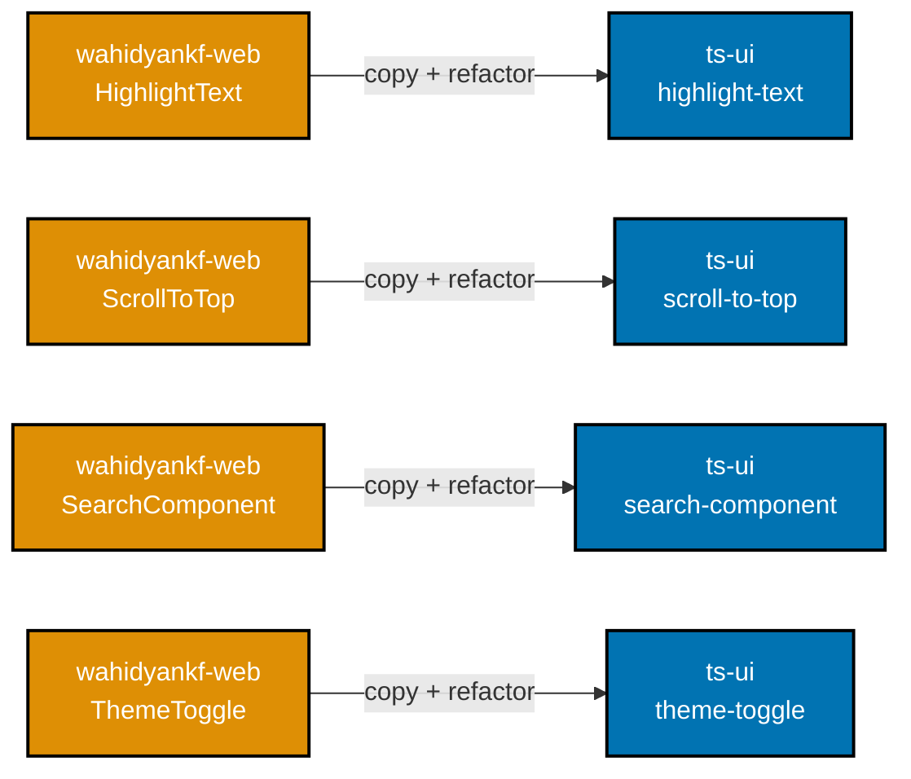
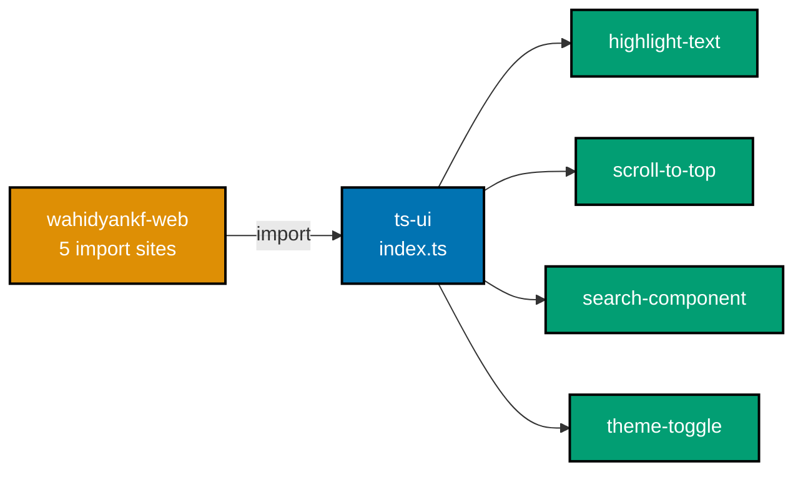

# Tech Docs — wahidyankf-web Component Migration to ts-ui

## Architecture Overview

The migration moves four components from `apps/wahidyankf-web/src/components/` into `libs/ts-ui`
and refactors each one to be a general-purpose, prop-configurable UI primitive. Currently all
four hardcode styling and behaviour values that belong to `wahidyankf-web`'s design language.
After migration each component exposes those values as optional props with the current
`wahidyankf-web` values as defaults, making them reusable by any OSE app without forking.

The structural work — file moves, export additions, one `package.json` dependency entry, and
import-path rewrites — runs alongside the generalisation refactoring inside each component phase.

```
Before:
  apps/wahidyankf-web/src/components/
    HighlightText.tsx          ← local only
    HighlightText.unit.test.tsx
    ScrollToTop.tsx            ← local only
    ScrollToTop.unit.test.tsx
    SearchComponent.tsx        ← local only
    SearchComponent.unit.test.tsx
    ThemeToggle.tsx            ← local only
    ThemeToggle.unit.test.tsx
    Navigation.tsx             ← stays (Next.js deps)
    Navigation.unit.test.tsx   ← stays

After:
  libs/ts-ui/src/components/
    highlight-text/
      highlight-text.tsx
      highlight-text.unit.test.tsx
    scroll-to-top/
      scroll-to-top.tsx
      scroll-to-top.unit.test.tsx
    search-component/
      search-component.tsx
      search-component.unit.test.tsx
    theme-toggle/
      theme-toggle.tsx
      theme-toggle.unit.test.tsx
    ... (existing components unchanged)

  apps/wahidyankf-web/src/components/
    Navigation.tsx             ← unchanged
    Navigation.unit.test.tsx   ← unchanged
```

`Navigation.tsx` is excluded — it imports `next/link` and `next/navigation`. The four
migrated components move with copy + refactor (not byte-for-byte copy):

<!-- Uses colors: Orange #DE8F05 (source), Blue #0173B2 (target) -->



## Design Decisions

### Flexible refactoring — same visual output, configurable props

Each migrated component is refactored to accept props for the values that are currently
hardcoded (className overrides, colour tokens, thresholds, etc.). Hardcoded values become
prop defaults so existing behaviour is preserved when no override is supplied. `wahidyankf-web`
passes the same values it currently renders as explicit props, producing identical visual
output. Future OSE apps consume the same components with different prop values without
forking or copy-pasting. The refactoring scope is limited to the prop surface — no new
abstractions, no behavioural logic changes beyond what props control.

### kebab-case subdirectory naming

`libs/ts-ui` already uses the pattern `<component-name>/<component-name>.tsx` with kebab-case
for all existing components (e.g., `app-header/app-header.tsx`, `hue-picker/hue-picker.tsx`).
The four new subdirectories follow the same convention:

- `highlight-text/highlight-text.tsx`
- `scroll-to-top/scroll-to-top.tsx`
- `search-component/search-component.tsx`
- `theme-toggle/theme-toggle.tsx`

### `"use client"` directives stay at the top of migrated files

`ScrollToTop.tsx` and `ThemeToggle.tsx` both begin with `"use client";`. These directives must
remain at the top of the refactored files. `ts-ui` is consumed by Next.js apps that use the
App Router, and Client Component boundaries must be declared in the file that contains the
interactive logic, not at the library boundary. No special handling is required.

### Named vs default export promotion

The original export styles are preserved in the refactored component files. The
`libs/ts-ui/src/index.ts` re-export lines adapt default exports to named exports so library
consumers always use named imports — consistent with the rest of ts-ui's public API:

| Export            | Source file export             | ts-ui index.ts re-export                  |
| ----------------- | ------------------------------ | ----------------------------------------- |
| `HighlightText`   | `export const HighlightText`   | `export { HighlightText, highlightText }` |
| `highlightText`   | `export const highlightText`   | (included in same line above)             |
| `ScrollToTop`     | `export default ScrollToTop`   | `export { default as ScrollToTop }`       |
| `SearchComponent` | `export const SearchComponent` | `export { SearchComponent }`              |
| `ThemeToggle`     | `export default ThemeToggle`   | `export { default as ThemeToggle }`       |

After migration, `wahidyankf-web` consumes all four components through `ts-ui/index.ts`:

<!-- Uses colors: Orange #DE8F05 (consumer), Blue #0173B2 (hub), Teal #029E73 (exports) -->



### Nx implicit dependency via npm dependency

Adding `"@open-sharia-enterprise/ts-ui": "*"` to `apps/wahidyankf-web/package.json`
`dependencies` is sufficient for Nx to infer the dependency edge between `wahidyankf-web` and
`ts-ui`. Nx reads `package.json` files in the workspace and maps npm package names to local
projects via the `name` field in each project's `package.json`. No explicit
`implicitDependencies` entry in `apps/wahidyankf-web/project.json` is needed. The `"*"`
wildcard is the standard workspace consumer pattern used by all other apps that consume ts-ui.

### tsconfig path mapping — no changes needed

`tsconfig.base.json` at the workspace root already contains:

```json
"@open-sharia-enterprise/ts-*": ["libs/ts-*/src/index.ts"]
```

`apps/wahidyankf-web/tsconfig.json` extends the base. TypeScript resolves
`@open-sharia-enterprise/ts-ui` to `libs/ts-ui/src/index.ts` automatically. No tsconfig edits
are required anywhere.

## File Move Table

| Source (wahidyankf-web)                                            | Target (ts-ui)                                                              |
| ------------------------------------------------------------------ | --------------------------------------------------------------------------- |
| `apps/wahidyankf-web/src/components/HighlightText.tsx`             | `libs/ts-ui/src/components/highlight-text/highlight-text.tsx`               |
| `apps/wahidyankf-web/src/components/HighlightText.unit.test.tsx`   | `libs/ts-ui/src/components/highlight-text/highlight-text.unit.test.tsx`     |
| `apps/wahidyankf-web/src/components/ScrollToTop.tsx`               | `libs/ts-ui/src/components/scroll-to-top/scroll-to-top.tsx`                 |
| `apps/wahidyankf-web/src/components/ScrollToTop.unit.test.tsx`     | `libs/ts-ui/src/components/scroll-to-top/scroll-to-top.unit.test.tsx`       |
| `apps/wahidyankf-web/src/components/SearchComponent.tsx`           | `libs/ts-ui/src/components/search-component/search-component.tsx`           |
| `apps/wahidyankf-web/src/components/SearchComponent.unit.test.tsx` | `libs/ts-ui/src/components/search-component/search-component.unit.test.tsx` |
| `apps/wahidyankf-web/src/components/ThemeToggle.tsx`               | `libs/ts-ui/src/components/theme-toggle/theme-toggle.tsx`                   |
| `apps/wahidyankf-web/src/components/ThemeToggle.unit.test.tsx`     | `libs/ts-ui/src/components/theme-toggle/theme-toggle.unit.test.tsx`         |

Files deleted from `apps/wahidyankf-web/src/components/` after copying: all eight rows above.
`Navigation.tsx` and `Navigation.unit.test.tsx` remain and are not touched.

## package.json Dependency Change

**File:** `apps/wahidyankf-web/package.json`

Before:

```json
"dependencies": {
  "@next/third-parties": "^16.0.0",
  "class-variance-authority": "^0.7.0",
  "clsx": "^2.1.1",
  "lucide-react": "^0.447.0",
  "next": "16.1.6",
  "react": "^19.0.0",
  "react-dom": "^19.0.0",
  "react-icons": "^5.3.0",
  "tailwind-merge": "^2.5.3"
}
```

After:

```json
"dependencies": {
  "@next/third-parties": "^16.0.0",
  "@open-sharia-enterprise/ts-ui": "*",
  "class-variance-authority": "^0.7.0",
  "clsx": "^2.1.1",
  "lucide-react": "^0.447.0",
  "next": "16.1.6",
  "react": "^19.0.0",
  "react-dom": "^19.0.0",
  "react-icons": "^5.3.0",
  "tailwind-merge": "^2.5.3"
}
```

The entry is inserted alphabetically. The `"*"` wildcard resolves to the local workspace copy
of `libs/ts-ui` at build time.

## ts-ui index.ts — Lines to Append

**File:** `libs/ts-ui/src/index.ts`

Append these four lines at the end of the file (after the existing last export):

```ts
export { HighlightText, highlightText } from "./components/highlight-text/highlight-text";
export { default as ScrollToTop } from "./components/scroll-to-top/scroll-to-top";
export { SearchComponent } from "./components/search-component/search-component";
export { default as ThemeToggle } from "./components/theme-toggle/theme-toggle";
```

No existing export lines are modified. Existing consumers of ts-ui are unaffected.

## Import Site Changes in wahidyankf-web

Each section below shows the exact before/after import lines for every affected file.

### `apps/wahidyankf-web/src/app/layout.tsx`

Before (lines 4–5):

```ts
import ScrollToTop from "@/components/ScrollToTop";
import ThemeToggle from "@/components/ThemeToggle";
```

After:

```ts
import { ScrollToTop, ThemeToggle } from "@open-sharia-enterprise/ts-ui";
```

Note: two separate default imports collapse into one named import from the library. The JSX
usage `<ScrollToTop />` and `<ThemeToggle />` is unchanged.

### `apps/wahidyankf-web/src/app/page.tsx`

Before (lines 16–17):

```ts
import { SearchComponent } from "@/components/SearchComponent";
import { HighlightText } from "@/components/HighlightText";
```

After:

```ts
import { SearchComponent, HighlightText } from "@open-sharia-enterprise/ts-ui";
```

Two separate local imports merge into one library import. All JSX usages
(`<SearchComponent … />`, `<HighlightText … />`) are unchanged.

### `apps/wahidyankf-web/src/app/cv/page.tsx`

Before (lines 35–36):

```ts
import { SearchComponent } from "@/components/SearchComponent";
import { HighlightText } from "@/components/HighlightText";
```

After:

```ts
import { SearchComponent, HighlightText } from "@open-sharia-enterprise/ts-ui";
```

### `apps/wahidyankf-web/src/app/personal-projects/page.tsx`

Before (lines 8–9):

```ts
import { SearchComponent } from "@/components/SearchComponent";
import { HighlightText } from "@/components/HighlightText";
```

After:

```ts
import { SearchComponent, HighlightText } from "@open-sharia-enterprise/ts-ui";
```

### `apps/wahidyankf-web/src/utils/markdown.tsx`

Before (line 2):

```ts
import { HighlightText } from "@/components/HighlightText";
```

After:

```ts
import { HighlightText } from "@open-sharia-enterprise/ts-ui";
```

## Test File Import Path Changes

Each unit test file contains a relative import pointing to the component by its original
PascalCase filename. After migration the file is renamed to kebab-case. The import inside the
test must be updated to match.

### `highlight-text.unit.test.tsx`

Before (line 4):

```ts
import { HighlightText, highlightText } from "./HighlightText";
```

After:

```ts
import { HighlightText, highlightText } from "./highlight-text";
```

### `scroll-to-top.unit.test.tsx`

Before (line 4):

```ts
import ScrollToTop from "./ScrollToTop";
```

After:

```ts
import ScrollToTop from "./scroll-to-top";
```

### `search-component.unit.test.tsx`

Before (line 4):

```ts
import { SearchComponent } from "./SearchComponent";
```

After:

```ts
import { SearchComponent } from "./search-component";
```

### `theme-toggle.unit.test.tsx`

Before (line 3):

```ts
import ThemeToggle from "./ThemeToggle";
```

After:

```ts
import ThemeToggle from "./theme-toggle";
```

## Dependencies

No new external packages are introduced. All migrated components use only:

- `react` — already a peer dependency of ts-ui and present in wahidyankf-web
- `lucide-react` — already a dependency of wahidyankf-web; ts-ui also depends on it

No peer dependency additions to `libs/ts-ui/package.json` are required.

## Testing Strategy

- **Unit tests migrate with their components.** The four test files move into the same
  kebab-case subdirectory as the component, matching the ts-ui colocation convention.
- **Import paths inside test files are updated** from `./PascalCase` to `./kebab-case` (see
  above). No test logic changes.
- **Coverage thresholds** for ts-ui remain at the existing level; the migrated tests contribute
  to ts-ui coverage.
- **wahidyankf-web coverage** is maintained because the tests continue to exercise the same
  component logic — they just live in a different directory.
- **Playwright MCP visual verification** confirms no regression in the running app after all
  phases complete.

## Rollback

If any phase introduces an unexpected failure:

1. Restore the deleted source files from git (`git checkout HEAD -- <path>`).
2. Revert the `package.json` change.
3. Revert the `libs/ts-ui/src/index.ts` appended lines.
4. Revert import site changes in the five wahidyankf-web files.

Because each phase is a separate commit, `git revert` or `git reset` on individual commits is
sufficient to undo a specific phase without disturbing earlier phases.
