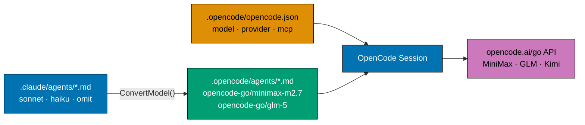

# Adopt OpenCode Go as the OpenCode Model Provider

## Overview

Migrate the OpenCode configuration in `ose-public` from Z.ai (`zai-coding-plan/*`)
to [OpenCode Go](https://opencode.ai/go) (`opencode-go/*`). This replaces the model
routing layer and upgrades web search from Z.ai-bundled MCPs to OpenCode's native
Exa integration (via `OPENCODE_ENABLE_EXA=true` env var), with Perplexity MCP
retained in `opencode.json` as a confirmed fallback.

OpenCode Go is a subscription service ("$5 first month, then $10/month" — opencode.ai/go, accessed 2026-05-02) offering
a curated set of open-source coding models across multiple labs — including Zhipu,
Moonshot, DeepSeek, Xiaomi, MiniMax, and Alibaba (as of April 2026). The top model
(`minimax-m2.7`) has a published SWE-Pro score of 56.22%; its predecessor M2.5 scored
80.2% on SWE-Bench Verified. The provider is currently in beta with servers in US,
EU, and Singapore.

The main impact is in `rhino-cli`'s `ConvertModel()` function, which hard-codes
Z.ai model IDs. Updating it + regenerating `.opencode/agents/` files is the bulk
of the mechanical work.

## Scope (ose-public single-repo)

| Area                                                            | Change                                                                                                                                                                                                                                                                                                                                                                     |
| --------------------------------------------------------------- | -------------------------------------------------------------------------------------------------------------------------------------------------------------------------------------------------------------------------------------------------------------------------------------------------------------------------------------------------------------------------- |
| `apps/rhino-cli/internal/agents/converter.go`                   | `ConvertModel()` outputs `opencode-go/*` IDs                                                                                                                                                                                                                                                                                                                               |
| `apps/rhino-cli/internal/agents/types.go`                       | Update `OpenCodeAgent` comment                                                                                                                                                                                                                                                                                                                                             |
| `apps/rhino-cli/cmd/agents_sync.go`                             | Update model-mapping comment                                                                                                                                                                                                                                                                                                                                               |
| `apps/rhino-cli/cmd/agents_validate_sync.go`                    | Update model-mapping comment                                                                                                                                                                                                                                                                                                                                               |
| `apps/rhino-cli/internal/agents/converter_test.go`              | Update `TestConvertModel` expectations                                                                                                                                                                                                                                                                                                                                     |
| `apps/rhino-cli/internal/agents/types_test.go`                  | Update `TestOpenCodeAgent` expectation                                                                                                                                                                                                                                                                                                                                     |
| `apps/rhino-cli/internal/agents/sync_validator_test.go`         | Update model-string assertions                                                                                                                                                                                                                                                                                                                                             |
| `apps/rhino-cli/cmd/steps_common_test.go`                       | Rename step constant + regex                                                                                                                                                                                                                                                                                                                                               |
| `apps/rhino-cli/cmd/agents_sync.integration_test.go`            | Update model assertions                                                                                                                                                                                                                                                                                                                                                    |
| `apps/rhino-cli/cmd/agents_validate_sync.integration_test.go`   | Update model assertions                                                                                                                                                                                                                                                                                                                                                    |
| `apps/rhino-cli/cmd/agents_validate_naming.integration_test.go` | Update model in fixture                                                                                                                                                                                                                                                                                                                                                    |
| `.opencode/opencode.json`                                       | Switch `model`/`small_model` + add provider block; remove Z.ai MCPs                                                                                                                                                                                                                                                                                                        |
| `governance/development/agents/model-selection.md`              | Update OpenCode/GLM Equivalents table                                                                                                                                                                                                                                                                                                                                      |
| `.opencode/agents/*.md` (all)                                   | Regenerated automatically via `npm run sync:claude-to-opencode`. Path is plural per [opencode.ai/docs/agents](https://opencode.ai/docs/agents/); the singular `.opencode/agent/` path is removed by the prerequisite [validate-claude-opencode-sync-correctness](../../done/2026-05-02__validate-claude-opencode-sync-correctness/README.md) plan before this plan starts. |

**Out of scope**:

- `.claude/agents/*.md` — Claude Code aliases (`sonnet`, `haiku`, omit) are not changing
- `opencode.json` at repo root (only has `nx-mcp`; no model fields)
- Any Z.ai subscription or credential cleanup — that is a personal/billing concern
- `ose-infra`, `ose-primer`, parent `ose-projects` — not affected

## Intended Model Mapping

| Claude Code tier | Current (Z.ai)                | Target (OpenCode Go)       |
| ---------------- | ----------------------------- | -------------------------- |
| opus (omit)      | `zai-coding-plan/glm-5.1`     | `opencode-go/minimax-m2.7` |
| sonnet           | `zai-coding-plan/glm-5.1`     | `opencode-go/minimax-m2.7` |
| haiku            | `zai-coding-plan/glm-5-turbo` | `opencode-go/glm-5`        |

The 3-to-2 tier collapse is preserved: opus-tier and sonnet-tier both use the single
best available OpenCode Go model; haiku-tier uses the fast/light model.

> **Note**: Exact model slugs (`minimax-m2.7`, `glm-5`) must be verified via
> `/models` in the OpenCode TUI after connecting. The delivery checklist includes
> this verification step before any code changes.

## Document Navigation

| Document                       | Purpose                                            |
| ------------------------------ | -------------------------------------------------- |
| [README.md](./README.md)       | This file — overview, scope, navigation            |
| [brd.md](./brd.md)             | Business rationale — why switch                    |
| [prd.md](./prd.md)             | Product requirements + Gherkin acceptance criteria |
| [tech-docs.md](./tech-docs.md) | Technical design — exact code changes              |
| [delivery.md](./delivery.md)   | Step-by-step delivery checklist                    |

## Relationship to Other Plans

**Blocked by**: [`2026-05-02__validate-claude-opencode-sync-correctness/`](../../done/2026-05-02__validate-claude-opencode-sync-correctness/README.md).
That plan audits the rhino-cli sync against current Claude Code and OpenCode
specs and discovered that today's sync writes agents to `.opencode/agent/`
(singular) while the canonical OpenCode path is `.opencode/agents/` (plural).
Shipping this opencode-go migration on top of the broken path would publish
`opencode-go/minimax-m2.7` IDs to a directory OpenCode does not load — the
migration would silently no-op in every developer's OpenCode session. The
sync-correctness plan must complete (filesystem moved, validators relaxed,
test matrix added) before Phase 1 of this plan begins.

This plan remains independent of the two organiclever in-progress plans
([`2026-04-25__organiclever-web-app/`](../../done/2026-04-25__organiclever-web-app/README.md)
and [`2026-04-28__organiclever-web-event-mechanism/`](../../done/2026-04-30__organiclever-web-event-mechanism/README.md)).
It modifies only tooling configuration and `rhino-cli` internals; it does not touch
app source code. No blocking dependency in either direction with those.

## Web Search Strategy

| Mechanism                                        | Type                        | Status                       | Notes                                                               |
| ------------------------------------------------ | --------------------------- | ---------------------------- | ------------------------------------------------------------------- |
| `OPENCODE_ENABLE_EXA=true`                       | Env var — built-in Exa tool | **Primary**                  | No API key needed; unconfirmed with OpenCode Go models specifically |
| Perplexity MCP (`perplexity` in `opencode.json`) | MCP server                  | **Configured fallback**      | Requires `PERPLEXITY_API_KEY`; provider-agnostic                    |
| Brave Search MCP                                 | MCP server                  | Alternative (not configured) | Best free-tier option if no Perplexity key                          |

Exa is the lightest path — one env var, no extra key — but its reliability with
OpenCode Go models is not officially confirmed. Perplexity MCP in `opencode.json`
provides a confirmed, provider-agnostic safety net if Exa fails.

## Success Criteria (Summary)

1. `ConvertModel("sonnet")` and `ConvertModel("")` return `opencode-go/minimax-m2.7`
2. `ConvertModel("haiku")` returns `opencode-go/glm-5`
3. `.opencode/opencode.json` contains `opencode-go/*` model IDs and no Z.ai MCP entries
4. `OPENCODE_ENABLE_EXA=true` is set in shell and documented for all developers
5. `npm run validate:config` passes (sync + validation green)
6. `nx run rhino-cli:test:unit` passes (≥90% coverage)
7. `nx run rhino-cli:test:integration` passes
8. `model-selection.md` table shows OpenCode Go equivalents
