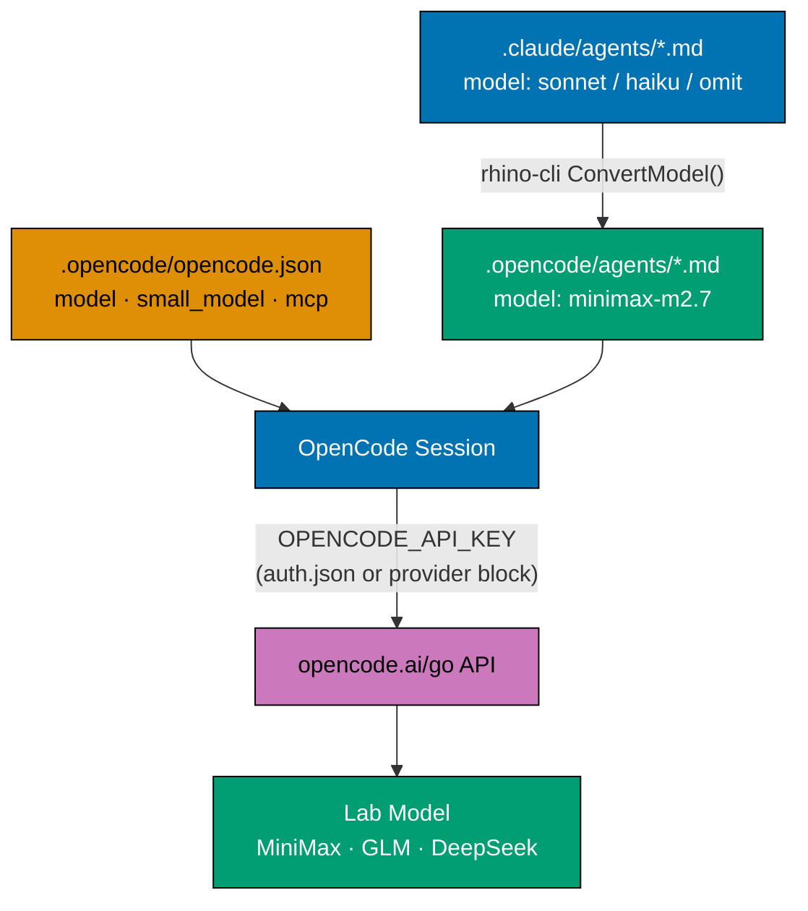
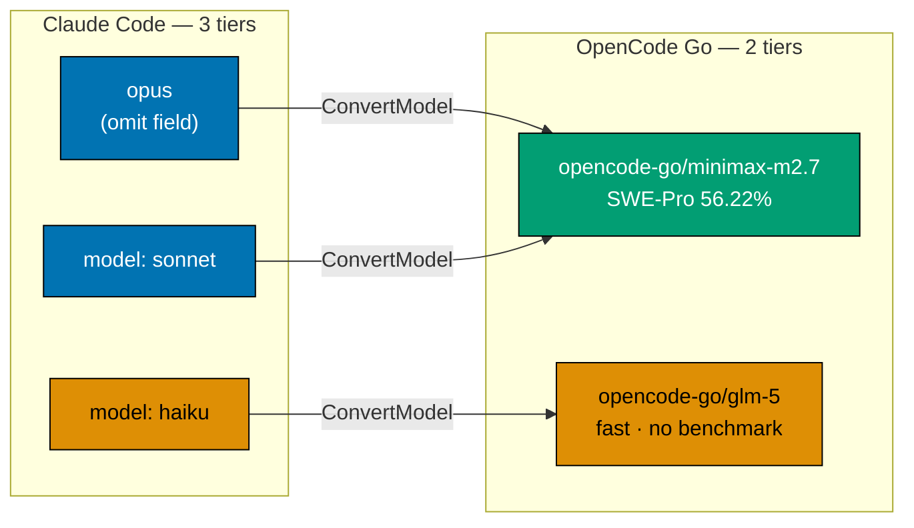
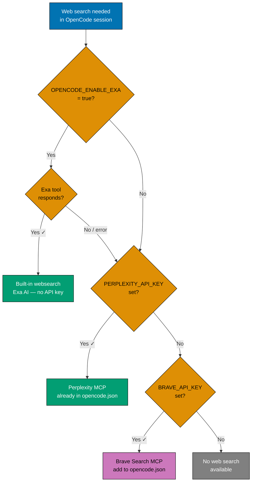

# Technical Design

## Architecture Overview

OpenCode Go is a **cloud model provider** accessed via an OpenAI-compatible API.
It is not a local binary, SDK, or MCP server — it is purely a model-routing
endpoint that maps `opencode-go/<model-slug>` IDs to the underlying lab APIs.
Authentication is via an API key obtained from the OpenCode Zen console.

The integration surface in this repository is entirely in two places:

1. **`rhino-cli` converter**: the Go function `ConvertModel()` translates Claude
   Code model aliases to the correct OpenCode model ID. This is the single source
   of truth for the model mapping. All `.opencode/agents/*.md` files are generated
   from it; they are never edited manually.
2. **`.opencode/opencode.json`**: configures the default model, small model,
   provider credentials, and MCP servers for OpenCode sessions.



## Model Selection Rationale

OpenCode Go offers a curated set of models from multiple labs (as of April 2026).
Model selection is driven by SWE-Bench score — the industry-standard benchmark for
agentic code generation on real GitHub issues.

### Benchmark Comparison

> **Methodology note**: SWE-Bench, SWE-Bench Pro, and SWE-Bench Verified are
> different evaluation suites with different difficulty distributions. Scores
> across suites are directionally comparable but not directly equivalent.

| Model             | Tier            | Provider    | Score   | Suite              | Source                                                                |
| ----------------- | --------------- | ----------- | ------- | ------------------ | --------------------------------------------------------------------- |
| `minimax-m2.7`    | Large (new)     | OpenCode Go | 56.22%¹ | SWE-Pro            | minimax.io/news/minimax-m27-en, 2026-04-30                            |
| `glm-5`           | Small (new)     | OpenCode Go | —       | —                  | No published score                                                    |
| `glm-5.1`         | Large (current) | Z.ai        | 58.4%²  | SWE-Bench Pro      | _Judgment call_ — widely cited, no canonical URL                      |
| `glm-5-turbo`     | Small (current) | Z.ai        | —       | —                  | No published score                                                    |
| Claude Opus 4.7   | —               | Claude Code | 87.6%³  | SWE-Bench Verified | https://www.anthropic.com/news/claude-opus-4, accessed 2026-04-30     |
| Claude Sonnet 4.6 | —               | Claude Code | 79.6%³  | SWE-Bench Verified | https://www.anthropic.com/news/claude-sonnet-4-6, accessed 2026-04-30 |
| Claude Haiku 4.5  | —               | Claude Code | 73.3%³  | SWE-Bench Verified | https://www.anthropic.com/news/claude-haiku-4-5, accessed 2026-04-30  |

¹ "MiniMax M2.7 achieved a 56.22% accuracy rate on SWE-Pro" —
https://www.minimax.io/news/minimax-m27-en, accessed 2026-04-30.
Predecessor M2.5 scored 80.2% on SWE-Bench Verified (a different, lower-difficulty
suite): https://www.minimax.io/news/minimax-m25, accessed 2026-04-30.

² GLM-5.1 score is widely referenced in community benchmarks but no single
canonical citation is available. _Judgment call_: used as directional baseline.

³ Claude model scores from Anthropic's published release notes: https://www.anthropic.com/news/claude-sonnet-4-6 (Sonnet 4.6), https://www.anthropic.com/news/claude-opus-4 (Opus 4.7), https://www.anthropic.com/news/claude-haiku-4-5 (Haiku 4.5) — all accessed 2026-04-30.

**Selection rationale**: M2.7 (SWE-Pro: 56.22%) vs GLM-5.1 (SWE-Bench Pro: 58.4%)
is inconclusive across different suites — direct comparison is not valid.
_Judgment call_: M2.7 is adopted as the large-model default based on lab trajectory
(MiniMax M2.5 led SWE-Bench Verified at 80.2%) and the recency of the model,
not on a like-for-like score improvement claim. M2.7 approaches Claude Sonnet 4.6
quality for coding work according to the MiniMax launch post.

`glm-5` has no published SWE-Bench score. It is selected for the haiku tier
because: (a) same GLM family as the current `glm-5-turbo`, so behavior is
familiar; (b) haiku-tier agents do deterministic mechanical work (file ops,
deployments, link checks) where benchmark score matters less than latency and cost.

### Model Tier Mapping



The 3-to-2 collapse is intentional: OpenCode Go has no mid-tier equivalent
between its best model and its fast model, mirroring the current Z.ai situation.

### Selection Criteria

1. **Highest available SWE-Bench score** among OpenCode Go models → `minimax-m2.7`
2. **3-to-2 collapse preserved** → single large model covers opus + sonnet
3. **Familiar small-model family** → `glm-5` from same Zhipu lab as current turbo

> **Slug verification**: `minimax-m2.7` and `glm-5` are the intended slugs but
> must be confirmed via `/models` in the OpenCode TUI. If slugs differ, use the
> verified values everywhere below.

## Files to Change

### 1. `apps/rhino-cli/internal/agents/converter.go`

**Function**: `ConvertModel()` (lines 111–125).

Current:

```go
func ConvertModel(claudeModel string) string {
    model := strings.TrimSpace(claudeModel)
    switch model {
    case "sonnet", "opus":
        return "zai-coding-plan/glm-5.1"
    case "haiku":
        return "zai-coding-plan/glm-5-turbo"
    default:
        return "zai-coding-plan/glm-5.1"
    }
}
```

Target:

```go
func ConvertModel(claudeModel string) string {
    model := strings.TrimSpace(claudeModel)
    switch model {
    case "haiku":
        return "opencode-go/glm-5"
    default:
        return "opencode-go/minimax-m2.7"
    }
}
```

The `default` branch covers `""`, `"sonnet"`, `"opus"`, and any unknown value —
all map to the large model. The `haiku` case is the only distinct branch.

### 2. `apps/rhino-cli/internal/agents/types.go`

**Struct comment**: `OpenCodeAgent.Model` field (line 29).

Current:

```go
Model string `yaml:"model"` // "zai-coding-plan/glm-5.1" | "zai-coding-plan/glm-5-turbo"
```

Target:

```go
Model string `yaml:"model"` // "opencode-go/minimax-m2.7" | "opencode-go/glm-5"
```

### 3. `apps/rhino-cli/cmd/agents_sync.go` (comment update — already done)

> **No change needed.** The governance vendor-independence initiative already
> cleaned this file before this plan was authored. `agents_sync.go` contains no
> `zai-coding-plan` strings. The `Long:` block comment uses an indirection
> ("model (via ConvertModel — owned by adopt-opencode-go plan)") rather than
> hardcoding model IDs. Delivery step 2.3 is marked complete with no action.

### 4. `apps/rhino-cli/cmd/agents_validate_sync.go` (comment update — already done)

> **No change needed.** The governance vendor-independence initiative already
> cleaned this file before this plan was authored. `agents_validate_sync.go`
> contains no `zai-coding-plan` strings. The `Long:` block at lines 13–37 uses
> an indirection ("Model is correctly converted (mapping owned by ConvertModel —
> see adopt-opencode-go plan for current target IDs)") rather than hardcoding
> model IDs. Delivery step 2.4 is marked complete with no action.

### 5. `apps/rhino-cli/internal/agents/converter_test.go`

**`TestConvertModel`** table test cases (lines ~173–178):

Current:

```go
{"sonnet",    "sonnet",         "zai-coding-plan/glm-5.1"},
{"opus",      "opus",           "zai-coding-plan/glm-5.1"},
{"haiku",     "haiku",          "zai-coding-plan/glm-5-turbo"},
{"empty",     "",               "zai-coding-plan/glm-5.1"},
{"whitespace","  ",             "zai-coding-plan/glm-5.1"},
{"unknown",   "unknown-model",  "zai-coding-plan/glm-5.1"},
```

Target:

```go
{"sonnet",    "sonnet",         "opencode-go/minimax-m2.7"},
{"opus",      "opus",           "opencode-go/minimax-m2.7"},
{"haiku",     "haiku",          "opencode-go/glm-5"},
{"empty",     "",               "opencode-go/minimax-m2.7"},
{"whitespace","  ",             "opencode-go/minimax-m2.7"},
{"unknown",   "unknown-model",  "opencode-go/minimax-m2.7"},
```

**`TestConvertAgent_*`** assertions referencing `"zai-coding-plan/glm-5.1"`
(lines 284–285 and 389–390): update to `"opencode-go/minimax-m2.7"`.

### 6. `apps/rhino-cli/internal/agents/types_test.go`

**`TestOpenCodeAgent`** (lines 34–41): the test constructs an `OpenCodeAgent`
with `Model: "zai-coding-plan/glm-5.1"` and asserts against it. Update to
`"opencode-go/minimax-m2.7"`:

```go
agent := OpenCodeAgent{
    Description: "Test agent description",
    Model:       "opencode-go/minimax-m2.7",
    Tools:       tools,
}
// ...
if agent.Model != "opencode-go/minimax-m2.7" {
```

### 7. `apps/rhino-cli/internal/agents/sync_validator_test.go`

Multiple OpenCode content strings contain `zai-coding-plan/glm-5.1` (lines 577,
617, 651, 678, 705, 740, 861, 889 — 8 occurrences total). Update all to
`opencode-go/minimax-m2.7`.

The comment at line 617 (`// Claude uses "sonnet" → should convert to "zai-coding-
plan/glm-5.1"`) must be updated to reference `"opencode-go/minimax-m2.7"`.

### 8. `apps/rhino-cli/cmd/steps_common_test.go`

**Constant rename + regex update** (line 85):

Current:

```go
stepCorrespondingOpenCodeAgentUsesZaiGlmModel = `^the corresponding \.opencode/ agent uses the "zai-coding-plan/glm-5\.1" model identifier$`
```

Target:

```go
stepCorrespondingOpenCodeAgentUsesOpenCodeGoModel = `^the corresponding \.opencode/ agent uses the "opencode-go/minimax-m2\.7" model identifier$`
```

All usages of `stepCorrespondingOpenCodeAgentUsesZaiGlmModel` in the codebase
must be updated to the new constant name.

### 9. `apps/rhino-cli/cmd/agents_sync.integration_test.go`

Lines 208–209 assert `"zai-coding-plan/glm-5.1"`. Update to
`"opencode-go/minimax-m2.7"`.

Line 232 references the old step constant. Update to
`stepCorrespondingOpenCodeAgentUsesOpenCodeGoModel`.

### 10. `apps/rhino-cli/cmd/agents_validate_sync.integration_test.go`

Lines 66, 117, 144 contain `"zai-coding-plan/glm-5.1"`. Update to
`"opencode-go/minimax-m2.7"`.

### 11. `apps/rhino-cli/cmd/agents_validate_naming.integration_test.go`

Line 56 contains a fixture string with `"zai-coding-plan/glm-5.1"`. Update to
`"opencode-go/minimax-m2.7"`.

### 12. `.opencode/opencode.json`

Full target content:

```json
{
  "$schema": "https://opencode.ai/config.json",
  "model": "opencode-go/minimax-m2.7",
  "small_model": "opencode-go/glm-5",
  "provider": {
    "opencode-go": {
      "options": {
        "apiKey": "{env:OPENCODE_GO_API_KEY}"
      }
    }
  },
  "permission": {
    "read": "allow",
    "edit": {
      "*": "ask",
      ".claude/**": "allow",
      ".opencode/**": "allow"
    },
    "bash": {
      "*": "ask",
      "npm run sync*": "allow",
      "git *": "allow",
      "nx *": "allow",
      "npx *": "ask",
      "go *": "allow",
      "gofmt *": "allow",
      "rm -rf *": "deny"
    },
    "glob": "allow",
    "grep": "allow",
    "list": "allow",
    "skill": "allow",
    "external_directory": {
      "/tmp/**": "allow"
    }
  },
  "mcp": {
    "perplexity": {
      "type": "local",
      "command": ["npx", "-y", "@perplexity-ai/mcp-server"]
    },
    "nx-mcp": {
      "type": "local",
      "command": ["npx", "-y", "nx-mcp"],
      "enabled": true
    },
    "playwright": {
      "type": "local",
      "command": ["npx", "-y", "@playwright/mcp@latest"]
    }
  }
}
```

Removed entries: `zai-mcp-server`, `web-search-prime`, `web-reader`, `zread`.
Added: `provider.opencode-go` block with env-var API key.

**Provider block auth — two verified paths**:

Research confirmed both `options.apiKey` nesting and `{env:VAR}` syntax are
correct per official OpenCode docs. However, `opencode-go` is a built-in
first-party provider; the documented setup path is `/connect` in the TUI which
writes credentials to `~/.local/share/opencode/auth.json` — no provider block
needed in the committed file.

| Auth path                | How                                            | Committed to repo               | Recommended             |
| ------------------------ | ---------------------------------------------- | ------------------------------- | ----------------------- |
| `/connect` → `auth.json` | Run `/connect` once per machine                | No — credentials stored locally | **Yes** (official docs) |
| Provider block + env var | `{env:OPENCODE_GO_API_KEY}` in `opencode.json` | Yes (placeholder only)          | Acceptable workaround   |

The plan commits the provider block as an explicit fallback for developers who
prefer env-var-driven setup. If `/connect` is used instead, the provider block
is silently redundant (not harmful). If the env var is unset and `/connect` was
not run, OpenCode gets an empty API key and returns 401 — the failure is
recoverable by running `/connect`.

**Env var naming**: `OPENCODE_GO_API_KEY` is our chosen shell variable name.
The `{env:OPENCODE_GO_API_KEY}` substitution reads whatever name is declared in
the block. The name `OPENCODE_API_KEY` appears in some community examples but is
not the official documented env var name — `{env:VAR}` substitution works with
any name as long as shell and config agree.

**MCP/tool capability coverage after removal**:

| Capability          | Before (Z.ai)         | After             | Mechanism                                    |
| ------------------- | --------------------- | ----------------- | -------------------------------------------- |
| Web search          | `web-search-prime`    | Exa built-in tool | `OPENCODE_ENABLE_EXA=true` env var (primary) |
| Web search fallback | —                     | `perplexity` MCP  | `PERPLEXITY_API_KEY` + existing MCP entry    |
| Web reading         | `web-reader`, `zread` | `playwright` MCP  | already wired                                |
| Nx workspace        | `nx-mcp`              | `nx-mcp`          | unchanged                                    |

**Web Search Strategy** (detail):

OpenCode's built-in `websearch` tool is powered by Exa AI and is normally
gated behind an OpenCode Zen subscription. Setting `OPENCODE_ENABLE_EXA=true`
in the shell bypasses this gate for any subscription tier. Two equivalent
alternatives exist:

```bash
# Any of these three activate Exa search tools:
export OPENCODE_ENABLE_EXA=true          # recommended — scoped to Exa only
export OPENCODE_EXPERIMENTAL_EXA=true   # same effect
export OPENCODE_EXPERIMENTAL=true       # Exa + all other experimental features
```

No Exa API key is required — Exa's hosted endpoint is free on the Exa side.
Token cost of search results flowing into context counts against OpenCode Go
usage limits.

> **Caveat**: Exa + OpenCode Go is not officially confirmed to work. The docs
> say the tool activates for "the OpenCode provider or when `OPENCODE_ENABLE_EXA`
> is set," leaving it ambiguous whether `opencode-go` counts as "the OpenCode
> provider." Perplexity MCP (already wired in `opencode.json`) is the safe,
> provider-agnostic fallback.

**Decision tree — which search tool fires**:



**Alternative — Brave Search MCP** (not configured by default):

For developers without a Perplexity subscription, Brave Search MCP is the best
free-tier alternative. It provides 10–20× better free quota than Google's MCP
and covers web, local, image, video, news, and AI summary search modes. To
add it, append to the `mcp` block in `.opencode/opencode.json`:

```json
"brave-search": {
  "type": "local",
  "command": ["npx", "-y", "@modelcontextprotocol/server-brave-search"],
  "env": { "BRAVE_API_KEY": "{env:BRAVE_API_KEY}" }
}
```

### 13. `governance/development/agents/model-selection.md`

**Section to update**: "OpenCode / GLM Equivalents".

Replace the entire section (from `## OpenCode / GLM Equivalents` to the end of
the "Why No Separate GLM Opus Tier" subsection) with:

````markdown
## OpenCode / OpenCode Go Equivalents

Agents in `.claude/agents/` are auto-synced to `.opencode/agents/` by rhino-cli
(`npm run sync:claude-to-opencode`). The sync translates Claude model aliases to
OpenCode Go model IDs.

### Model ID Mapping

| Claude Code              | OpenCode Go                | Capability notes                                                                                 |
| ------------------------ | -------------------------- | ------------------------------------------------------------------------------------------------ |
| omit (opus-tier inherit) | `opencode-go/minimax-m2.7` | MiniMax MoE; SWE-Pro 56.22% (M2.5 predecessor: 80.2% SWE-Bench Verified); highest in OpenCode Go |
| `model: sonnet`          | `opencode-go/minimax-m2.7` | Same model as opus-tier (no separate sonnet tier)                                                |
| `model: haiku`           | `opencode-go/glm-5`        | Zhipu GLM lighter variant; fast/cheap for mechanical work                                        |

### 3-to-2 Tier Collapse

Claude Code has three tiers (Opus 4.7 > Sonnet 4.6 > Haiku 4.5). OpenCode Go
offers a curated set of models across multiple labs, but the converter maintains
the same 3-to-2 collapse: a single large model (`minimax-m2.7`) covers opus and
sonnet tiers; a fast model (`glm-5`) covers the haiku tier.

This collapse is an acceptable platform-level constraint. Claude Code tier
assignments govern behavior in Claude sessions (the primary runtime). OpenCode
uses the highest-benchmark available model for all non-haiku work.

### Model Benchmark Table

| Model                                         | SWE-Bench Score | Suite              | Source                                                       |
| --------------------------------------------- | --------------- | ------------------ | ------------------------------------------------------------ |
| `opencode-go/minimax-m2.7` (new large)        | 56.22%¹         | SWE-Pro            | minimax.io/news/minimax-m27-en, 2026-04-30                   |
| `opencode-go/glm-5` (new haiku)               | —               | —                  | No published score; fast/cheap                               |
| `zai-coding-plan/glm-5.1` (current large)     | 58.4%²          | SWE-Bench Pro      | _Judgment call_ — widely cited                               |
| `zai-coding-plan/glm-5-turbo` (current haiku) | —               | —                  | No published score                                           |
| Claude Sonnet 4.6 (Claude Code reference)     | 79.6%³          | SWE-Bench Verified | https://www.anthropic.com/news/claude-sonnet-4-6, 2026-04-30 |
| Claude Opus 4.7 (Claude Code reference)       | 87.6%³          | SWE-Bench Verified | https://www.anthropic.com/news/claude-opus-4, 2026-04-30     |

¹ "MiniMax M2.7 achieved a 56.22% accuracy rate on SWE-Pro" —
https://www.minimax.io/news/minimax-m27-en, accessed 2026-04-30.
Predecessor M2.5 scored 80.2% on SWE-Bench Verified (different suite):
https://www.minimax.io/news/minimax-m25, accessed 2026-04-30.

² _Judgment call_: no canonical citation; widely referenced figure.

³ Claude model scores from Anthropic's published release notes: https://www.anthropic.com/news/claude-sonnet-4-6 (Sonnet 4.6), https://www.anthropic.com/news/claude-opus-4 (Opus 4.7), https://www.anthropic.com/news/claude-haiku-4-5 (Haiku 4.5) — all accessed 2026-04-30.

SWE-Bench variants (Pro, Verified) use different difficulty distributions; direct
score comparison across suites is not valid.

### Why MiniMax M2.7 as the Default

MiniMax M2.7 is the latest model from MiniMax, whose predecessor M2.5 led the
SWE-Bench Verified leaderboard at 80.2% — the highest open-source coding benchmark
score at that time. M2.7's own SWE-Pro score (56.22%) is on a harder suite and not
directly comparable to GLM-5.1 (58.4% SWE-Bench Pro). _Judgment call_: M2.7 is
adopted based on lab trajectory and model recency, not a like-for-like score gain.
Accessible via the flat-rate OpenCode Go subscription; no per-token billing.

If a stronger model joins the OpenCode Go roster, update only `ConvertModel()`
in `apps/rhino-cli/internal/agents/converter.go` and re-run
`npm run sync:claude-to-opencode`. No agent files need manual editing.

### Web Search in OpenCode Sessions

OpenCode's built-in `websearch` and `codesearch` tools (powered by Exa AI) are
the primary search mechanism. Enable them by setting `OPENCODE_ENABLE_EXA=true`
in the shell environment — no separate API key or MCP server required.

The Perplexity MCP in `.opencode/opencode.json` acts as the configured fallback
for research-quality, cited web answers when Exa is unavailable or insufficient.
Brave Search MCP is an alternative for developers without a Perplexity key.

To add web search, each developer sets in `~/.zshrc` or `~/.bashrc`:

```bash
export OPENCODE_ENABLE_EXA=true
export PERPLEXITY_API_KEY="<your-key>"   # optional, for Perplexity fallback
```
````

````

## Regeneration Step

After all Go code changes are made and `rhino-cli` is rebuilt, run:

```bash
npm run sync:claude-to-opencode
````

This rebuilds `rhino-cli`, then calls `rhino-cli agents sync` which reads every
`.claude/agents/*.md`, calls `ConvertModel()` for each agent's `model` field,
and writes the result to `.opencode/agents/*.md`. The resulting files will contain
`opencode-go/minimax-m2.7` or `opencode-go/glm-5` throughout.

## Environment Setup for Developers

To use OpenCode Go locally:

1. Subscribe at [opencode.ai/go](https://opencode.ai/go)
2. Copy the API key from the OpenCode console
3. Set the model provider env var:

   ```bash
   export OPENCODE_GO_API_KEY="<your-key>"
   ```

   Add to `~/.zshrc` or `~/.bashrc` for persistence. Do NOT add to `.env` in
   the repository — API keys are never committed.

4. Enable Exa web search (primary):

   ```bash
   export OPENCODE_ENABLE_EXA=true
   ```

   Add to `~/.zshrc` or `~/.bashrc` alongside the API key. No Exa API key needed.

5. Optionally enable Perplexity fallback search:

   ```bash
   export PERPLEXITY_API_KEY="<your-key>"
   ```

   The Perplexity MCP entry is already in `opencode.json`; it activates when
   this env var is set.

6. Open OpenCode: run `/connect` in the TUI, select "OpenCode Go", paste the key
   (this populates the key in the OpenCode session; alternatively the env var
   is sufficient if `opencode.json` uses `{env:OPENCODE_GO_API_KEY}`)
7. Run `/models` to verify available model slugs match the values in
   `opencode.json`

## Risk Assessment

| Risk                                       | Likelihood | Mitigation                                                                      |
| ------------------------------------------ | ---------- | ------------------------------------------------------------------------------- |
| Model slug differs from expected           | Medium     | Verify via `/models` before code changes                                        |
| OpenCode Go beta service outage            | Low        | OpenCode Go has US/EU/SG PoPs; fallback to Claude Code                          |
| MiniMax M2.7 slower than GLM-5.1           | Low        | Perplexity + Playwright are local/independent of model                          |
| Exa doesn't work with `opencode-go` models | Medium     | Perplexity MCP is configured fallback; test Exa in Phase 0 before relying on it |
| Perplexity MCP doesn't start               | Low        | Already configured; test with `PERPLEXITY_API_KEY` set before committing        |
| Test count changes with rename             | Medium     | Search all usages of old step constant before rename                            |
