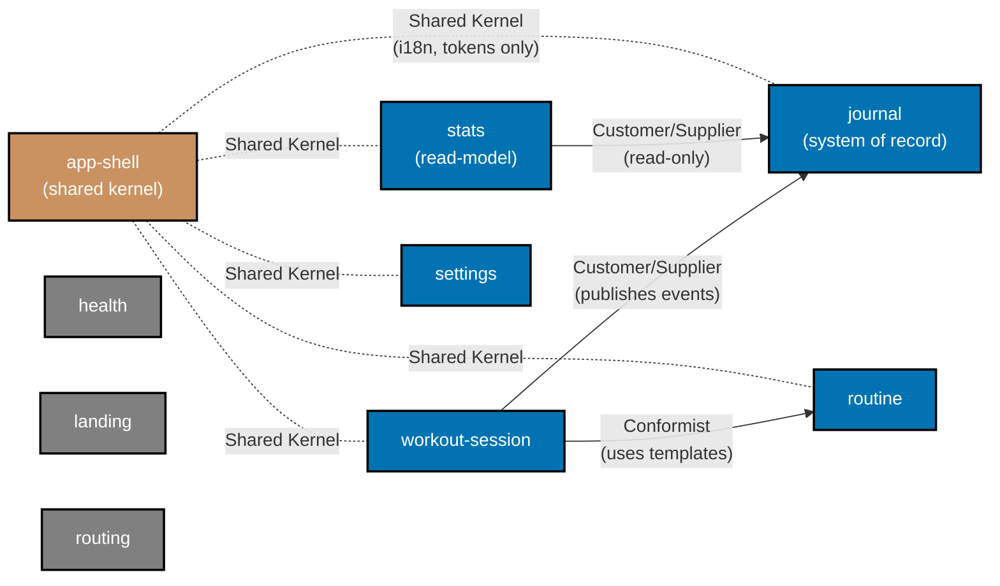

# Tech Docs — OrganicLever DDD Adoption

## Target architecture

### Bounded-context map (provisional — finalized in Phase 0)

| Context           | Persistence                                            | Owns                                                                                                   | Depends on                                         |
| ----------------- | ------------------------------------------------------ | ------------------------------------------------------------------------------------------------------ | -------------------------------------------------- |
| `journal`         | PGlite (Postgres-WASM over IndexedDB), append-only log | `JournalEvent`, typed payloads, bump operation, event invariants                                       | —                                                  |
| `routine`         | PGlite                                                 | `Routine` template aggregate, exercises, defaults                                                      | —                                                  |
| `workout-session` | xstate v5 FSM, persists outcome through `journal`      | `WorkoutSession` aggregate, transitions (idle/active/finished), invariants ("can only end if started") | `journal` (publishes events), `routine` (consumes) |
| `stats`           | Read-model derived from `journal`                      | Aggregations, projections, period rollups                                                              | `journal` (read-only)                              |
| `settings`        | PGlite                                                 | Theme, locale, units, preference invariants                                                            | —                                                  |
| `app-shell`       | None                                                   | i18n, layout, theming primitives, app loggers, navigation skeleton, error boundaries                   | All contexts (consumed by, but does not call into) |
| `health`          | None (calls BE)                                        | BE health-endpoint client, status interpretation                                                       | —                                                  |
| `landing`         | None                                                   | Marketing copy, hero, CTA components                                                                   | —                                                  |
| `routing`         | None                                                   | Disabled-route 404 guards (`/login`, `/profile`)                                                       | —                                                  |

Relationships (DDD strategic patterns):

- `workout-session` → `journal`: **Customer/Supplier**. Session asks journal to record outcomes.
- `stats` → `journal`: **Customer/Supplier** (read-only).
- `workout-session` → `routine`: **Conformist** (uses routine templates as-is).
- `app-shell` ↔ all: **Shared Kernel** for i18n keys and design tokens only — no domain types.
- `health`, `landing`, `routing`: independent.



### Code layout — target

```
apps/organiclever-web/src/
├── app/                              # Next.js App Router (presentation entry)
│   ├── layout.tsx
│   ├── page.tsx
│   └── app/                          # /app subtree
│       ├── home/
│       ├── history/
│       ├── progress/
│       ├── routines/
│       ├── settings/
│       └── workout/
├── contexts/
│   ├── app-shell/
│   │   └── presentation/             # i18n, layout, theme primitives
│   ├── health/
│   │   ├── domain/
│   │   ├── application/
│   │   ├── infrastructure/
│   │   └── presentation/
│   ├── journal/
│   │   ├── domain/
│   │   │   ├── journal-event.ts
│   │   │   ├── typed-payloads.ts
│   │   │   └── invariants.ts
│   │   ├── application/
│   │   │   ├── append.ts
│   │   │   ├── bump.ts
│   │   │   └── index.ts              # published API
│   │   ├── infrastructure/
│   │   │   ├── journal-store.ts
│   │   │   ├── runtime.ts
│   │   │   └── migrations/
│   │   └── presentation/
│   │       ├── use-journal.ts
│   │       └── components/
│   ├── routine/                      # similar
│   ├── workout-session/
│   ├── stats/
│   ├── settings/
│   ├── landing/
│   └── routing/
└── shared/                           # ONLY truly cross-cutting non-domain primitives (e.g. fmt utils)
    └── utils/
```

`src/components/`, `src/services/`, `src/layers/`, `src/lib/` are **dissolved** into the layout above. `src/test/` is unchanged. `src/generated-contracts/` is codegen output — gitignored, regenerated by `nx run organiclever-web:codegen`, not migrated. `src/lib/utils/fmt.ts` moves to `src/shared/utils/fmt.ts`. Note: today `src/lib/journal/` is overloaded — it physically contains `settings-store.ts`, `routine-store.ts`, `use-settings.ts`, `use-routines.ts`, `stats.ts`. The migration relocates each file to its rightful context, not its current folder.

### Layer rules

| Layer            | May import                                                                                                              | May not import                                                         |
| ---------------- | ----------------------------------------------------------------------------------------------------------------------- | ---------------------------------------------------------------------- |
| `domain`         | other files in same `domain/`, `shared/utils/**`                                                                        | anything in `application/`, `infrastructure/`, `presentation/`, `app/` |
| `application`    | own `domain/`, own `infrastructure/` interfaces (ports), other contexts' `application/index.ts` only, `shared/utils/**` | other contexts' `domain/`/`infrastructure/`/`presentation/`            |
| `infrastructure` | own `domain/`, own `application/` interfaces, `shared/utils/**`                                                         | other contexts' anything; `presentation/`; `app/`                      |
| `presentation`   | own `domain/` (read-only types), own `application/`, other contexts' `presentation/index.ts`, `shared/utils/**`         | own `infrastructure/`; other contexts' `domain/`/`infrastructure/`     |
| `src/app/**`     | any context's `presentation/index.ts`, `shared/utils/**`                                                                | any context's `domain/`/`application/`/`infrastructure/`               |

### ESLint boundaries

Use `eslint-plugin-boundaries` (or equivalent already-pinned tool — confirmed in Phase 1). Configuration sketch:

```ts
// apps/organiclever-web/eslint.config.mjs (excerpt)
import boundaries from "eslint-plugin-boundaries";

export default [
  // ...existing config
  {
    plugins: { boundaries },
    settings: {
      "boundaries/elements": [
        { type: "app", pattern: "src/app/**" },
        { type: "shared", pattern: "src/shared/**" },
        { type: "domain", pattern: "src/contexts/*/domain/**" },
        { type: "application", pattern: "src/contexts/*/application/**" },
        { type: "infrastructure", pattern: "src/contexts/*/infrastructure/**" },
        { type: "presentation", pattern: "src/contexts/*/presentation/**" },
      ],
    },
    rules: {
      "boundaries/element-types": [
        "error",
        {
          default: "disallow",
          rules: [
            { from: "app", allow: ["shared", "presentation"] },
            { from: "presentation", allow: ["shared", "domain", "application", "presentation"] },
            { from: "application", allow: ["shared", "domain", "application"] },
            { from: "infrastructure", allow: ["shared", "domain"] },
            { from: "domain", allow: ["shared", "domain"] },
            { from: "shared", allow: ["shared"] },
          ],
        },
      ],
    },
  },
];
```

Cross-context isolation (denying `presentation` of context A from importing `domain` of context B) is enforced via `boundaries/no-private` plus a per-context entry-point pattern: only `src/contexts/<bc>/<layer>/index.ts` is public; all other files inside that layer are treated as private by `eslint-plugin-boundaries`. Phase 1 verifies the exact rule set works against the pinned plugin version.

### Specs target layout

```
specs/apps/organiclever/
├── README.md                       # updated: tree + Spec Artifacts list
├── c4/                             # unchanged
├── be/                             # unchanged (BE not in scope)
├── contracts/                      # unchanged
├── fe/
│   ├── README.md                   # updated: link ubiquitous-language/
│   └── gherkin/
│       ├── README.md               # updated: per-context layout
│       ├── app-shell/
│       ├── health/
│       ├── journal/
│       ├── landing/
│       ├── routine/
│       ├── routing/
│       ├── settings/
│       ├── stats/
│       └── workout-session/
└── ubiquitous-language/            # NEW (sibling of be/, fe/, c4/, contracts/)
    ├── README.md                   # index + authoring rules
    ├── app-shell.md
    ├── health.md
    ├── journal.md
    ├── landing.md
    ├── routine.md
    ├── routing.md
    ├── settings.md
    ├── stats.md
    └── workout-session.md
```

The `ubiquitous-language/` folder is a **shared platform-agnostic glossary** at the same level as `be/` and `fe/`. FE consumes it now; BE will consume it when a future plan adopts DDD on `organiclever-be`.

### Ubiquitous-language file shape

`specs/apps/organiclever/ubiquitous-language/<context>.md`:

```markdown
# Ubiquitous Language — <Context>

**Bounded context**: `<context>`
**Maintainer**: <who>
**Last reviewed**: <YYYY-MM-DD>

## One-line summary

<Sentence describing what this context owns.>

## Terms

| Term | Definition | Code identifier(s) | Used in features                    |
| ---- | ---------- | ------------------ | ----------------------------------- |
| ...  | ...        | `Foo`, `barFoo()`  | `journal/journal-mechanism.feature` |

## Forbidden synonyms

- "<term>" — used by `<other-context>` to mean something different.
```

`specs/apps/organiclever/ubiquitous-language/README.md`:

- Authoring rules (one file per bounded context; new term => update glossary in same PR as the code/feature).
- Index linking each context glossary.
- Cross-link to `specs/apps/organiclever/c4/` and `specs/apps/organiclever/fe/gherkin/`.

### Spec reorganization

Current `specs/apps/organiclever/fe/gherkin/`:

```
landing/        layout/        loggers/      app-shell/
home/           history/       progress/     workout/
journal/        routine/       routing/      settings/
health/         system/
```

Target:

```
specs/apps/organiclever/fe/gherkin/
├── README.md                  # updated to describe per-context layout
├── app-shell/                 # accessibility, i18n, layout, loggers
├── health/                    # system-status diagnostic page (keeps name)
├── journal/                   # journal-mechanism + bump
├── landing/                   # marketing landing
├── routine/                   # routine CRUD
├── routing/                   # disabled-route guards
├── settings/                  # preferences
├── stats/                     # progress/history projections
└── workout-session/           # workout FSM scenarios
```

Decisions to lock in Phase 0:

- `home/` features split between `journal` (today's events) and `app-shell` (page chrome) per scenario, not per file.
- `history/` and `progress/` route features become `stats/` features.
- `system/` folder folds into `health/`.
- `loggers/` folder folds into `app-shell/`.

### Migration mechanics

For each context, the migration loop is:

1. **Red** — write a failing test (or re-locate an existing one) that targets the about-to-move code at its target path.
2. **Green** — physically move the source file to its target layer; update imports; verify the test passes.
3. **Refactor** — fold any incidental cleanup (rename, extract type, remove dead branch) only if covered by tests.

Mechanical helpers:

- Use `git mv` so blame is preserved.
- Run `nx affected -t typecheck lint test:quick` after every move; commit only when green.
- Defer ESLint boundary activation until Phase 8; until then, run a temporary "dry-run" lint pass that warns instead of errors.

### Test strategy

Per [Three-Level Testing Standard](../../../governance/development/quality/three-level-testing-standard.md) and [Test-Driven Development Convention](../../../governance/development/workflow/test-driven-development.md):

- Unit tests live next to the code they test (`*.unit.test.ts(x)`). Moving a file moves its tests.
- Integration tests (`*.int.test.ts`) for journal/routine/settings stores remain co-located with the infrastructure adapter.
- E2E (`organiclever-web-e2e`) is unchanged and serves as the final regression net per phase.
- spec-coverage continues to enforce 1:1 mapping between Gherkin scenarios and TS step implementations after the spec reorganization.

### xstate machine placement (DDD layer mapping)

`organiclever-web` uses xstate v5 (`^5.31.0`). State machines model aggregate lifecycle and process flow — explicitly DDD concepts. Layer placement per machine is determined by **whether the machine triggers IO**:

| Machine                 | Current path                         | Target path                                                   | Layer                      | Why                                                                                                                          |
| ----------------------- | ------------------------------------ | ------------------------------------------------------------- | -------------------------- | ---------------------------------------------------------------------------------------------------------------------------- |
| `journalMachine`        | `src/lib/journal/journal-machine.ts` | `src/contexts/journal/application/journal-machine.ts`         | **application**            | Invokes `fromPromise` actors (`loadEntries`, `performMutation`) that call infrastructure (PGlite store). Orchestration role. |
| `workoutSessionMachine` | `src/lib/workout/workout-machine.ts` | `src/contexts/workout-session/application/workout-machine.ts` | **application**            | Invokes `fromPromise saveWorkout` which writes to journal via `journal/application/index.ts`. Cross-context orchestrator.    |
| `appMachine`            | `src/lib/app/app-machine.ts`         | `src/contexts/app-shell/presentation/app-machine.ts`          | **app-shell/presentation** | Pure UI shell state (`darkMode`, `isDesktop`, logger selection). No IO, no domain invariant. Belongs with shell chrome.      |

**Rules**:

1. **Pure machines** (no `fromPromise`/`fromCallback`/no IO actors) modelling an aggregate's lifecycle live in `domain/` of that context. Guards encode domain invariants. None today, but keep the slot reserved.
2. **Orchestrating machines** (machines that invoke services or IO actors) live in `application/`. Their `fromPromise` actors call infrastructure ports defined in the same layer.
3. **UI shell machines** (no aggregate model, just view/interaction state) live in `presentation/` of `app-shell` or the relevant context.
4. **No machine is global** — each lives inside exactly one bounded context. Cross-context coordination flows through the consumer context's published `application/index.ts` (a use-case function) which internally sends events to its own machine; the calling machine never holds a foreign machine's actor handle directly. This keeps cross-context coupling at the use-case boundary, matching the layer rules table.
5. **Events use ubiquitous-language terms**: `WorkoutStarted`, `JournalEntryAppended`, not `BUTTON_CLICKED` / `STEP_2`. Event names listed in the corresponding `specs/apps/organiclever/ubiquitous-language/<context>.md` glossary.
6. **Guards encode invariants**. Same invariant ALSO checked at the aggregate boundary (defense in depth) — machines are not the sole enforcement point.
7. **Machines are tested in isolation** (`*.unit.test.ts` co-located with the machine). Actor mocks substitute `fromPromise` implementations; no PGlite spin-up at machine-unit level.
8. **React subscribes via `useSelector`** from `@xstate/react`. UI never owns transitions — only sends events.

**ESLint boundaries implication**: An `application/` machine MAY import its own `domain/` types and invariants; MAY import its own `infrastructure/` ports (interfaces only); MUST NOT import other contexts' internals. Cross-context calls (e.g. `workoutSessionMachine` → journal) go through `journal/application/index.ts`.

### Risk mitigations

- **Boundary plugin friction with App Router**: confirmed in Phase 1 with a smoke test on a single page (`/app/home`) before mass migration.
- **PGlite singleton**: `journal/infrastructure/runtime.ts`, `routine/infrastructure/runtime.ts`, `settings/infrastructure/runtime.ts` may share a common `Runtime` Layer composed in `app-shell/infrastructure/runtime.ts` — this is the only legitimate place infrastructure crosses contexts. The composed runtime is consumed by `presentation/` of each context via React provider; the contexts themselves do not import each other.
- **Effect.ts `ManagedRuntime`** stays the integration seam between Effect-world and React-world; no architectural change.

## Decisions

| #   | Decision                                                                                                                 | Rationale                                                                                                           |
| --- | ------------------------------------------------------------------------------------------------------------------------ | ------------------------------------------------------------------------------------------------------------------- |
| D1  | One Nx app, multiple bounded contexts inside it.                                                                         | Standards permit "multiple small bounded contexts → one Nx app" for early product. Avoids Nx churn.                 |
| D2  | Layer folders are physical (`domain/`, `application/`, ...) not just file naming conventions.                            | Cheap to enforce via path-based ESLint rules.                                                                       |
| D3  | Ubiquitous-language glossary lives in `specs/`, not in `apps/organiclever-web/`.                                         | Glossary is platform-agnostic and shared with future BE work; specs are already the contract layer.                 |
| D4  | Cross-context dependencies only via `application/index.ts`.                                                              | Standard hexagonal pattern, simple to lint, keeps domain layer private.                                             |
| D5  | App Router (`src/app/**`) is presentation-entry only — never imports domain/infrastructure directly.                     | Keeps Next.js routing concerns separate from domain logic.                                                          |
| D6  | Journal is the system of record for events; stats is read-only.                                                          | Already implicit; making it explicit prevents stats from acquiring a parallel write path.                           |
| D7  | xstate machines placed by IO-trigger rule: pure → `domain/`, orchestrating → `application/`, UI shell → `presentation/`. | Aligns FSM placement with DDD layers; events become ubiquitous-language carriers; guards co-locate with invariants. |

## Rollback

Each phase commits independently, so rollback is surgical — revert only the phase that went wrong.

### Per-phase rollback

```bash
# Identify the phase commit(s) to revert
git log --oneline | head -20

# Revert a single phase commit (creates a new revert commit — safe for shared history)
git revert <phase-commit-sha>

# For a sub-step commit cluster, revert each commit in reverse order
git revert <sha-latest> && git revert <sha-earlier>
```

After reverting, all gates must be green before attempting the phase again.

### ESLint boundary config rollback

If the boundary plugin breaks the build in an unexpected way (Phase 1 or Phase 8):

1. Remove (or comment out) the `boundaries` plugin block from `apps/organiclever-web/eslint.config.mjs`.
2. Run `nx run organiclever-web:lint` to confirm zero errors.
3. Commit: `revert(organiclever-web): remove ESLint boundary config — <reason>`.

### Full plan abort

If the migration must be abandoned entirely:

1. Identify the Phase 0 commit (first commit of this plan).
2. Revert all commits from the latest phase backward to Phase 0 in reverse chronological order.
3. Restore `src/lib/*` original structure via the revert chain; do not manually reconstruct.
4. Confirm baseline gates green before declaring abort complete.

### Reference

Iron Rule 8: "Roll back the phase, not the file" — if anything leaves the exit gates red and is not fixable in one pass, revert the entire phase commit rather than patching individual files.

## Open questions (Phase 0 must resolve)

- Q1: Should `app-shell` be called a "supporting subdomain" or a "shared kernel"? — defaults to **supporting** since it owns code other contexts consume but defines no domain entities.
- Q2: Does `home/` page need its own bounded context? — defaults to **no**; home is presentation aggregating journal + stats + app-shell.
- Q3: Do we keep `src/components/` for purely presentational primitives (Button, Input)? — defaults to **yes, under `app-shell/presentation/components/`**.
- Q4: Does `journalMachine` graduate from a hybrid loader+orchestrator into a pure aggregate-lifecycle machine in `domain/`, with a thinner orchestrator in `application/`? — defaults to **no, keep in `application/` as-is**; revisit only if a second consumer (e.g. BE) needs the lifecycle modelled separately.
