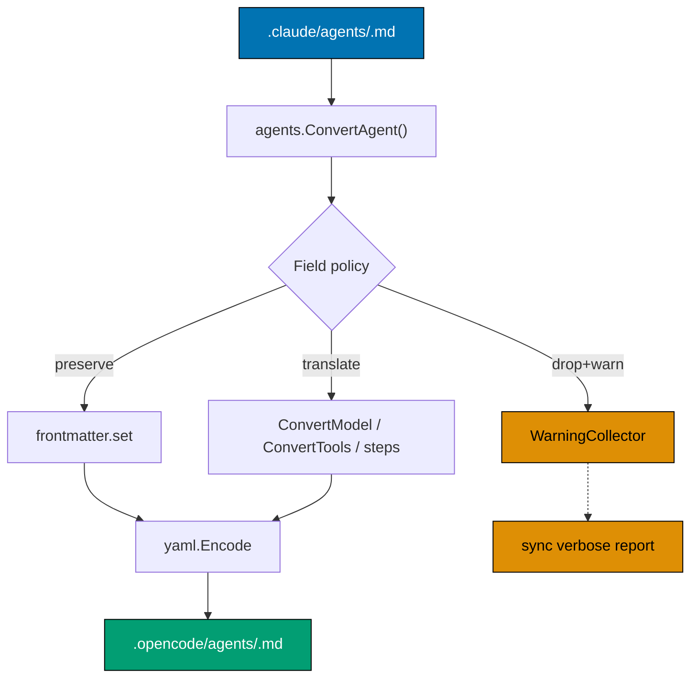

# Technical Design

## Architecture

`rhino-cli` is the single source of truth for sync logic. It exposes three
relevant commands consumed by `package.json` scripts:

| `npm` script              | `rhino-cli` invocation    | Purpose                                                                                                          |
| ------------------------- | ------------------------- | ---------------------------------------------------------------------------------------------------------------- |
| `validate:claude`         | `agents validate-claude`  | Validates `.claude/` source format                                                                               |
| `sync:claude-to-opencode` | `agents sync`             | Converts `.claude/` → `.opencode/`                                                                               |
| `validate:sync`           | `agents validate-sync`    | Validates equivalence between `.claude/` and the sync output                                                     |
| `validate:opencode`       | alias for `validate:sync` | Convenience alias; identical behavior to `validate:sync`                                                         |
| `validate:config`         | composite                 | Runs `validate:claude && sync:claude-to-opencode && validate:opencode` (alias chain resolves to `validate:sync`) |

This plan modifies the **output target** of `agents sync`, the **input target**
of `agents validate-sync`, and the **acceptance set** of `agents validate-claude`.
It does not change CLI surface; npm scripts remain stable.



## Files Modified

### 1. `apps/rhino-cli/internal/agents/converter.go`

Change output path constant and add field-policy machinery.

```go
// Before
opencodeAgentDir := filepath.Join(repoRoot, ".opencode", "agent")

// After
const OpenCodeAgentDir = ".opencode/agents" // plural per opencode.ai/docs/agents/
opencodeAgentDir := filepath.Join(repoRoot, OpenCodeAgentDir)
```

Introduce `ConversionWarning` and a per-field policy struct:

```go
type ConversionWarning struct {
    AgentName string
    Field     string
    Reason    string // "no-opencode-equivalent" | "renamed" | "deprecated"
}

type fieldPolicy struct {
    action  string // "preserve" | "translate" | "drop-warn"
    target  string // for "translate", the target field name
    reason  string // for "drop-warn"
}

var claudeAgentFieldPolicy = map[string]fieldPolicy{
    "name":            {action: "drop", reason: "filename carries name"},
    "description":     {action: "preserve"},
    "tools":           {action: "translate", target: "tools"},
    "model":           {action: "translate", target: "model"},
    "color":           {action: "preserve"},
    "skills":          {action: "preserve"},
    "disallowedTools": {action: "drop-warn", reason: "no opencode equivalent"},
    "permissionMode":  {action: "drop-warn", reason: "use opencode permission block"},
    "maxTurns":        {action: "translate", target: "steps"},
    "effort":          {action: "drop-warn", reason: "claude-only"},
    "memory":          {action: "drop-warn", reason: "claude-only"},
    "isolation":       {action: "drop-warn", reason: "claude-only"},
    "background":      {action: "drop-warn", reason: "claude-only"},
    "initialPrompt":   {action: "drop-warn", reason: "claude-only"},
    "mcpServers":      {action: "drop-warn", reason: "opencode declares mcp at config level"},
    "hooks":           {action: "drop-warn", reason: "no opencode equivalent"},
}
```

Update `ConvertAgent` to walk the parsed Claude YAML by key, look up the
policy, and either preserve / translate / drop-with-warning. `ConvertModel`
remains owned by the opencode-go plan; this plan does not modify it.

### 2. `apps/rhino-cli/internal/agents/copier.go`

Decision per FR-2: pick **Option A** (no skill copy). Two variants:

- **Option A**: delete `copier.go` (and `CopyAllSkills`, `CopySkill`).
  Update `sync.go` to skip skill phase. Delete `validateSkillIdentity` and
  `validateSkillCount` from `sync_validator.go`.
- **Option B fallback**: change `opencodeSkillDir` from `.opencode/skill` to
  `.opencode/skills`, fix README/help text. Keep byte-equality check.

Prefer Option A. The plan's delivery checklist gates a final A-vs-B decision
on Phase 1 verification (manual `/skills` list in OpenCode TUI confirming
`.claude/skills/` is read).

### 3. `apps/rhino-cli/internal/agents/sync_validator.go`

Two functions hard-code `.opencode/agent` (singular) and must both be updated:

- `validateAgentCount` (line 74): `opencodeDir := filepath.Join(repoRoot, ".opencode", "agent")` —
  update to use `OpenCodeAgentDir` constant from `converter.go`.
- `validateAgentEquivalence` (line 103): same hard-coded path — update to use
  the same constant.

The delivery step P2.1 covers both with "replace all `.opencode/agent`
references in code + tests", but both functions are named here explicitly so
an executor does not target only `converter.go` and miss `sync_validator.go`.

If Option A on skills, drop `validateSkillCount` and `validateSkillIdentity`
entirely and add a new `validateNoStaleSkillCopies` that verifies
`.opencode/skill/` and `.opencode/skills/` (rhino-cli-generated subset) do
not exist.

Add `validateNoStaleAgentDir` that asserts `.opencode/agent/` (singular) does
not exist on disk. This catches accidental resurrection.

### 4. `apps/rhino-cli/internal/agents/agent_validator.go`

Relax `ValidColors`, `ValidModels`, `ValidTools`. Replace `validateModel`'s
hard-fail logic with regex-aware acceptance:

```go
var validModelAlias = map[string]bool{"": true, "sonnet": true, "opus": true,
    "haiku": true, "inherit": true}
var validModelIDPattern = regexp.MustCompile(`^claude-[a-z0-9.-]+$`)

func validateModel(filename, model string) ValidationCheck {
    if validModelAlias[model] || validModelIDPattern.MatchString(model) {
        return passedCheck("Valid Model")
    }
    return failedCheck("Valid Model", "<empty>|sonnet|opus|haiku|inherit|claude-*", model)
}
```

Similarly relax `validateTools` to allow array-of-strings YAML shape, and
allow `Agent` and `Agent(<sub>)` syntax.

Replace `validateFieldOrder` strict-rejection with two-tier check:

1. Required fields (`name`, `description`) appear before any optional field.
2. Optional fields may appear in any order; unknown fields produce
   `WARNING` checks (status `warning`, new tri-state).

Tri-state requires `ValidationCheck.Status` to accept `"warning"` and
report formatters to render warnings distinctly.

### 5. `apps/rhino-cli/internal/agents/skill_validator.go`

Add an allow-list of recognized Claude Code skill fields and emit warnings
(not failures) for unrecognized keys. Required fields (`name`, `description`)
still hard-required.

```go
var validSkillFields = map[string]bool{
    "name": true, "description": true, "license": true, "compatibility": true,
    "metadata": true, "when_to_use": true, "argument-hint": true,
    "arguments": true, "disable-model-invocation": true, "user-invocable": true,
    "allowed-tools": true, "model": true, "effort": true, "context": true,
    "agent": true, "hooks": true, "paths": true, "shell": true,
}
```

### 6. `apps/rhino-cli/internal/agents/types.go`

Resolve `ClaudeAgent.Tools []string` vs `ClaudeAgentFull.Tools string`
inconsistency. Adopt `[]string` everywhere; refactor any consumer that
relied on the comma-separated `string` form.

Deprecate `RequiredFieldOrder` (used only by relaxed `validateFieldOrder`);
replace with `RequiredFields` slice (`["name", "description"]`).

### 7. `apps/rhino-cli/cmd/agents_sync.go`

Update `Long:` help text:

- Replace `.opencode/agent/` with `.opencode/agents/`.
- Remove "SKILL.md → {skill-name}.md conversion" claim (false today).
- Remove model-mapping description (owned by opencode-go plan;
  link to converter.go's policy map instead).
- Add field-policy summary referencing the new `claudeAgentFieldPolicy` map.

### 8. `apps/rhino-cli/cmd/agents_validate_sync.go`

Mirror help-text changes from #7. Add explicit mention that singular paths
trigger failures.

### 9. Top-level filesystem changes

- `git rm -r .opencode/agent/`
- `git rm -r .opencode/skill/`
- Verify `.opencode/agents/` is fully populated by sync and committed.
- Decide: `.opencode/skills/` from Nx generator — keep, replace with
  rhino-cli-generated, or remove. Default: remove rhino-cli-generated entries
  and let Nx generator own `.opencode/skills/` if it actually wires anything
  useful; otherwise remove the dir.

### 10. `CLAUDE.md` and `.claude/agents/README.md`

Update path references:

- "`.opencode/agent/*.md`" → "`.opencode/agents/*.md`"
- "`.opencode/skill/*/SKILL.md`" → either remove (Option A) or
  "`.opencode/skills/*/SKILL.md`" (Option B).

### 11. New test file `apps/rhino-cli/internal/agents/spec_fidelity_test.go`

Property-style tests:

- `TestEveryClaudeFieldIsPolicied` — for each documented Claude Code field,
  the policy map has an entry.
- `TestNoUnknownFieldInOpenCodeOutput` — sweeps `.opencode/agents/` after
  sync, asserts every key is in the OpenCode-recognized set.
- `TestRoundTripPreservesSemantics` — synthetic Claude agent with all
  preserve/translate fields → convert → re-parse → re-emit; assert output
  byte-equal.
- `TestSyncIsIdempotent` — sync twice, second sync produces zero diff.

### 12. `package.json` (no change to scripts; verify only)

`sync:*` and `validate:*` scripts already shell out to `rhino-cli`. After
binary rebuild, behavior changes transparently. No script edits needed.

## Migration Strategy

Atomic in two commits to avoid intermediate broken state:

1. **Commit A (functional change)**: rhino-cli code + tests + help text.
   On this commit, sync has new behavior but old `.opencode/agent/` still
   tracked.
2. **Commit B (filesystem move)**: `git rm -r .opencode/agent/` plus
   `npm run sync:claude-to-opencode` populating `.opencode/agents/`.
   `validate:sync` green.

If Option A on skills, also:

1. **Commit C (skill cleanup)**: `git rm -r .opencode/skill/` and any
   rhino-cli-generated entries under `.opencode/skills/`.

Each commit passes `nx affected -t typecheck lint test:quick spec-coverage`
independently so bisection stays useful.

## Test Matrix

| Layer       | Test File                                    | Scope                                                      |
| ----------- | -------------------------------------------- | ---------------------------------------------------------- |
| Unit        | `converter_test.go`                          | Per-field policy: preserve/translate/drop                  |
| Unit        | `agent_validator_test.go`                    | Spec-valid colors/models/tools accept; unknown fields warn |
| Unit        | `skill_validator_test.go`                    | Spec-valid skill fields accept; required fields enforced   |
| Unit        | `sync_validator_test.go`                     | Plural target dir; singular dir absence check              |
| Unit        | `spec_fidelity_test.go`                      | Round-trip; idempotence; OpenCode-known-fields-only        |
| Integration | `agents_sync.integration_test.go`            | E2E sync into tmpdir; verifies output dir is plural        |
| Integration | `agents_validate_sync.integration_test.go`   | Validates produced output equivalent to source             |
| Integration | `agents_validate_naming.integration_test.go` | Filename-name match in plural output                       |

Tests reference fixtures in `apps/rhino-cli/internal/agents/testdata/` —
add a `spec/` subfolder with one fixture per documented field.

## Risk Assessment

| Risk                                                                             | Likelihood | Mitigation                                                                                                                   |
| -------------------------------------------------------------------------------- | ---------- | ---------------------------------------------------------------------------------------------------------------------------- |
| OpenCode silently DOES read singular path (undocumented)                         | Low        | If true, plural is still canonical per docs; we lose nothing by switching. Plan unchanged.                                   |
| Removing skill copy breaks user with custom OpenCode setup                       | Low        | Option A pre-flight: confirm OpenCode TUI lists all skills via `/skills`. If fails, revert to Option B.                      |
| Validator relaxation hides real bugs                                             | Medium     | Warnings logged; report formatter shows count; pre-push hook fails on FAIL+WARNING combination if `--strict` flag set in CI. |
| Refactor regresses coverage below 90%                                            | Medium     | Tests added per-field; coverage gate enforces.                                                                               |
| Field-policy map missed a Claude Code field                                      | Medium     | `TestEveryClaudeFieldIsPolicied` cross-checks against a frozen list pulled from spec verification step in delivery.md.       |
| OpenCode adds new agent field after this plan ships                              | Medium     | Validator warns instead of fails on unknown OpenCode-output fields; informs maintainers without blocking work.               |
| `.opencode/skills/` (Nx-generated) conflicts with sync output if Option B chosen | Medium     | Inspect Nx generator config; if it owns `.opencode/skills/`, keep Option A.                                                  |

## Out-of-Scope (Documented Decisions)

- **`tools:` → `permission:` migration**: Decision: defer until OpenCode
  removes the deprecated boolean map. Documented in `claudeAgentFieldPolicy`
  comments.
- **MCP propagation**: Decision: never sync MCP from agent frontmatter to
  `.opencode/opencode.json`. MCP registration is config-level in OpenCode.
- **Hook propagation**: Decision: drop hook fields with warning. No OpenCode
  equivalent today.
- **Per-agent `opencode.json` `agent` block override**: Decision: not used
  by this repo; markdown frontmatter is the contract.
- **Singular-path resurrection guard in pre-commit hook**: Decision:
  enforced via `validate:sync`'s new `validateNoStaleAgentDir` check, which
  pre-push runs anyway. No new git hook needed.
- **`mode` field emission**: `mode` is an OpenCode-only field (`subagent`,
  `primary`, or `all`). Claude Code agent frontmatter has no `mode` field (not
  listed in the Claude Code sub-agents spec as of 2026-05-02). There is no
  source signal to map from. Decision: **do not emit `mode`**; accept
  OpenCode's built-in default of `all`. The sync validator does not check
  `mode` presence. A future plan that wishes to add per-agent mode intent must
  first define a Claude-side convention (e.g., a new Claude Code frontmatter
  field) before this plan's converter policy can map it. The "TBD per-agent
  convention" framing is retired — this is the explicit decision.
