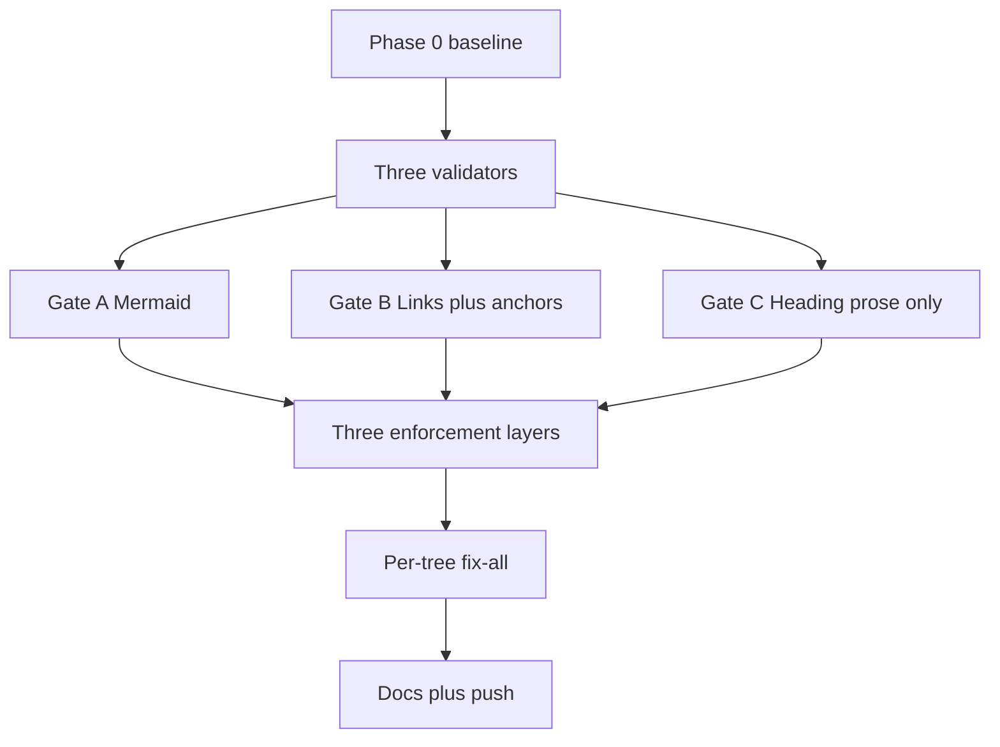

# Markdown Gate Coverage Expansion

> **Plan type**: Multi-file (five canonical documents). This README is the navigation hub.
> **Status**: Done (executed 2026-06-06; see Post-Completion Amendment below).
>
> **Post-Completion Amendment (2026-06-06, cross-repo alignment)**: After this plan
> completed, a three-repo alignment pass (ose-public / ose-infra / ose-primer) amended the
> implementation by direct change in this repo: (1) `github_slug` now KEEPS underscores
> per the verified `github-slugger` v2 reference (the algorithm shipped by this plan
> stripped them — wrong vs GitHub); (2) `docs validate-mermaid` gained the repeatable
> `--exclude` flag this plan's execution logged as a wart, its default scan went
> repo-wide minus the standardized noise-skip set, and the `validate:mermaid` Nx target
> now runs repo-wide with `--max-depth=4` + the three named exclusions; (3) the mermaid
> flowchart parser now handles pipe-labeled edges (`A -->|x| B`) and ranks cyclic
> diagrams via back-edge removal; (4) the heading-hierarchy prose allowlist expanded to
> add `specs/`, `apps/*/README.md`, `libs/*/README.md`, `apps/*/docs/**`, and
> `libs/*/docs/**`; (5) the links/mermaid walkers share a standardized cross-repo
> noise-skip set (added `worktrees`, `.terraform`, `generated-contracts`, `.nx`). The
> sibling repos adopt the same end state via their own in-progress
> `markdown-gate-coverage-expansion` plans.

## Context

The repository runs three structural markdown validators, all built into the Rust tool
`rhino-cli`. Today they are partially wired, inconsistently scoped, and one of them is entirely
orphaned. This plan unifies them into a single, coherent **markdown gate** with consistent
enforcement layers. [Repo-grounded]

- **Gate A — Mermaid** (`rhino-cli docs validate-mermaid`): the diagram quality gate. Already
  wired into the `validate:mermaid` Nx target and the `.husky/pre-push` hook. [Repo-grounded —
  `apps/rhino-cli/project.json:167`, `.husky/pre-push:24`] It checks `flowchart`/`graph` blocks
  for over-long labels, excess width, and multiple diagrams per fence, and emits two non-blocking
  warnings. The companion plan content (full-repo scan, inline exemptions, color-palette and
  structural/correctness flowchart-only checks, warnings-promoted-to-blocking) is preserved here;
  the only enforcement change is the move from **pre-push** to **pre-commit staged-only**.
- **Gate B — Relative-link checker** (`rhino-cli docs validate-links`): verifies every
  `[text](target)` link resolves to an existing file (clean-path handles `..`/`.`).
  [Repo-grounded — `apps/rhino-cli/src/internal/docs/links.rs`] Today it scans only three trees
  (`repo-governance/`, `docs/`, `.claude/`) plus root `*.md`, hard-skips `.claude/skills/`, has no
  `--exclude` CLI flag despite the plumbing existing, and **never validates `#fragment`
  anchors** — `resolve_link` strips the fragment before resolving. [Repo-grounded —
  `links.rs:169,264,374`] This plan widens its scope to the whole repo (minus exclusions), adds an
  `--exclude` flag, and adds internal-anchor validation.
- **Gate C — Heading-hierarchy** (`rhino-cli docs validate-heading-hierarchy`): fully implemented
  and unit-tested, with three finding kinds (`missing-h1`, `duplicate-h1`, `skipped-level`), but
  **completely orphaned** — registered in `cli.rs` yet wired into NO hook, NO Nx target, NO CI.
  [Repo-grounded — `apps/rhino-cli/src/commands/docs_validate_heading_hierarchy.rs`,
  `cli.rs:206`] This plan wires it in, scoped carefully (see the non-breaking constraint below).

### The non-breaking constraint for heading-hierarchy (CRITICAL)

`markdownlint` already disables **MD025** (multiple H1) and **MD001** (heading increment)
globally. [Repo-grounded — `.markdownlint-cli2.jsonc`] The reason is empirical: agent and skill
prompt artifacts legitimately use `#` as a section marker, not a document title, so they carry
zero or many H1s. The repo contains many such files — `.claude/agents/`, `.claude/skills/`
(`SKILL.md`), and `.opencode/agents/` are full of them. [Repo-grounded — verified by inspection]
Re-enabling heading rules repo-wide would break all of them.

This plan re-enables heading-hierarchy checking **only for generic prose** via rhino-cli, which
(unlike markdownlint) can path-scope a rule. Heading-hierarchy therefore uses a **prose-allowlist,
default-deny** scope: it runs ONLY on `docs/`, `repo-governance/`, `plans/` (minus `plans/done/`),
and root-level `*.md`. Everything else — `.claude/**`, `.opencode/**`, `.amazonq/**`, `apps/**`,
`libs/**`, `plans/done/`, and noise dirs — is hard-excluded. The allowlist is enforced inside the
validator's file selection, so even a pre-commit staged-only run that stages a `.claude/agents/*.md`
or `SKILL.md` file can NEVER trip a heading finding.

### Why unify enforcement now

Today Gate A fires at pre-push (narrow trigger), Gate B fires at pre-commit (staged-only) AND in a
PR-only CI workflow, and Gate C fires nowhere. The enforcement story is inconsistent and a direct
trunk push can slip Gate A. This plan standardizes all three gates onto **three layers**:
pre-commit staged-only (Layer 1, blocking, `--no-verify` is the WIP escape), PR CI (Layer 2,
full-scan, blocking), and push-to-`main` CI (Layer 3, full-scan, blocking), consolidated into a
single `.github/workflows/validate-markdown.yml` workflow.

## Scope

### In scope

- **Gate A — Mermaid** (amend enforcement only): keep all existing mermaid coverage; **move its
  local enforcement from pre-push to pre-commit staged-only**. Remove the mermaid trigger from
  `.husky/pre-push`. Mermaid checks are per-file (no cross-file dependency), so staged-only loses
  nothing.
- **Gate B — Relative-link checker** (new work):
  1. Add a repeatable `--exclude <path>` CLI flag to `docs validate-links`, wired through
     `ScanOptions.skip_paths`; repo call sites pass the three named exclusions explicitly.
  2. Expand full-scan scope from the three dirs to the **whole repo**, minus exclusions and minus a
     noise-skip set (`node_modules, dist, target, .next, coverage, generated-reports, local-temp,
archived, apps-labs`); keep the existing `.claude/skills/` hard-skip.
  3. Add **internal-anchor validation**: when a link has a `#fragment`, open the target file, parse
     its ATX headings, GitHub-slugify them, and emit a `broken-anchor` finding when the fragment is
     absent. Reuse the fence-aware heading parser from `heading_hierarchy.rs` (factor a shared
     helper — do not duplicate).
- **Gate C — Heading-hierarchy** (new work): wire the orphaned validator into pre-commit
  staged-only + CI full-scan (blocking), under the **prose-allowlist default-deny** scope above;
  add `--exclude` for parity; implement the allowlist filter inside the validator's file selection.
- **Enforcement layers** (all three gates): Layer 1 = `.husky/pre-commit` staged-only blocking;
  Layer 2 = PR CI full-scan blocking; Layer 3 = push-to-`main` CI full-scan blocking. Consolidate
  the three structural markdown gates into a single `.github/workflows/validate-markdown.yml`
  triggered on `push: [main]` + `pull_request: [main]`. Migrate the existing
  `pr-validate-links.yml` into it.
- **Per-tree fix-all** of any existing violations the newly-wired gates surface (mermaid findings,
  broken links, broken anchors, prose-doc heading violations), each phase gated.
- **BDD spec updates** (`specs/apps/rhino/`): keep the rhino-cli behavior specs in lockstep with the
  new validator behavior — add scenarios to `behavior/cli/gherkin/docs/docs-validate-links.feature`
  (`--exclude`, repo-wide scan, `broken-anchor`), `behavior/cli/gherkin/docs/docs-validate-heading-hierarchy.feature`
  (prose allowlist, `--exclude`), and `behavior/cli/gherkin/git/git-pre-commit.feature` (staged
  mermaid + heading steps); update `components/cli/component-cli.md` flags. Required, not optional:
  the `spec-coverage` Nx gate maps `.feature` scenarios to code, so new behavior without matching
  spec scenarios fails the gate.
- **Governance propagation**: update all related governance `.md` files (`diagrams.md`, `quality.md`,
  `linking.md`, check-inventory docs) and propagate the changes **via `repo-rules-maker`** (broad
  governance sweep, not hand-editing only the obvious files), re-sync secondary bindings
  (`npm run generate:bindings`), then validate consistency with the **`repo-rules-quality-gate`**
  (strict, double-zero).

### Out of scope (deferred)

- App READMEs (`apps/*/README.md`) are deliberately NOT in the heading-hierarchy MVP allowlist
  (defer; keep safe). [Judgment call]
- Mermaid **rendering** verification (static analysis only).
- Cross-file link-graph analysis beyond existence + anchor presence.
- External-URL liveness checking (only relative links are validated).
- The non-flowchart structural-mermaid and `erDiagram`/C4 color deferrals carried from the mermaid
  work remain deferred.

## Approach Summary

Gate A keeps its existing behavior and moves to pre-commit. Gate B gains `--exclude`, a repo-wide
scan minus exclusions, and `#fragment` anchor validation reusing the heading parser. Gate C is
un-orphaned and wired under a prose-allowlist default-deny scope so agent/skill artifacts can never
trip it. All three gates run at pre-commit (staged-only), PR CI, and push CI — the latter two
consolidated into one `validate-markdown.yml`. Existing violations are cleaned per tree (gated),
and governance docs are corrected last.

## Scope Matrix

| Gate                           | Scope                                                                   | Excludes                                            |
| ------------------------------ | ----------------------------------------------------------------------- | --------------------------------------------------- |
| Mermaid (flowchart-only)       | repo-wide                                                               | 3 named exclusions + noise dirs + inline exemptions |
| Link (+ anchors)               | repo-wide                                                               | 3 named exclusions + noise dirs + `.claude/skills/` |
| Heading-hierarchy (PROSE rule) | allowlist: `docs/`, `repo-governance/`, `plans/`(−`done/`), root `*.md` | everything else (default-deny)                      |

**The three named exclusions** (apply to link + mermaid; heading-hierarchy default-deny already
excludes them):

- `plans/done/` — frozen artifact.
- `apps/ayokoding-web/content/` — validated by `apps/ayokoding-cli` (Rust CLI).
- `apps/ose-web/content/` — validated by `apps/ose-cli` (Rust CLI).

## Document Map

| Document                       | Purpose                                                           |
| ------------------------------ | ----------------------------------------------------------------- |
| [brd.md](./brd.md)             | WHY — business rationale, impact, risks                           |
| [prd.md](./prd.md)             | WHAT — personas, user stories, Gherkin acceptance criteria, scope |
| [tech-docs.md](./tech-docs.md) | HOW — architecture, design decisions, scope matrix, file impact   |
| [delivery.md](./delivery.md)   | DO — phased, gated, executor-tagged checklist                     |

## Research Note

Web research **was skipped** for this plan: it is purely internal tooling and governance work. All
behavioral claims about the three validators are grounded by reading their Rust source in
`apps/rhino-cli/src/`. The GitHub heading-slug algorithm reproduced here (lowercase, strip
non-alphanumerics except hyphen, spaces→hyphens, dedupe collisions with `-1`/`-2`) is the
well-known GitHub Flavored Markdown convention and is implemented + unit-tested against fixtures in
this plan rather than cited. [Judgment call]

## Dogfooding Note

This plan lives under `plans/`, which all three expanded gates cover (Gate C via the
`plans/`-minus-`done/` allowlist). Every diagram in these five documents is authored to pass the
mermaid gate; every relative link and `#fragment` anchor is authored to resolve; every prose doc
here uses exactly one H1 with non-skipping heading nesting. The plan validates itself in Phase 7
(the `plans/` fix-all tree).

> Home prefix normalised: absolute home-directory paths in this plan's files were rewritten to a portable form (such as `~/`, `$HOME/`, or a `<placeholder>`), so captured output here is not byte-verbatim.
