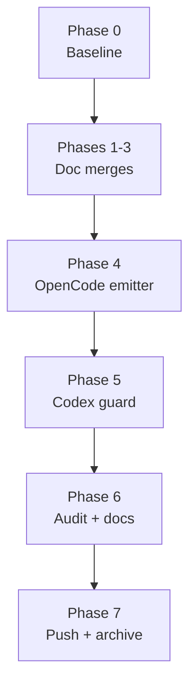

# Technical Documentation — Plan Domain Parity (ose-public)

## Architecture of the Change

Three independent change streams converge in this plan:

1. **Docs stream** — 3-way best-of merges of fourteen plan-domain markdown files plus the
   parity-workflow restructure. Pure-content work validated by the repo's markdown gates
   (Prettier, markdownlint, `validate:links`, `validate:heading-hierarchy`,
   `validate:mermaid`).
2. **Code stream** — two TDD changes inside `apps/rhino-cli/` `[Repo-grounded]`:
   - `src/internal/agents/converter.rs` — OpenCode frontmatter emission (`tools` boolean map
     → `permission` object). `agents sync` and `agents validate-sync` share this module, so
     emitter and validator move in lock-step.
   - `src/internal/agents/bindings.rs` — `validate_bindings` gains a `.codex/agents/`
     absence guard. (`emit_bindings` itself only writes the two Amazon Q bridge files
     `[Repo-grounded]`; see design decision D5.)
3. **Binding-surface stream** — regeneration of all `.opencode/agents/*.md` mirrors
   (70 files at authoring time `[Repo-grounded]`), the `.codex/config.toml` consolidation,
   and the harness-doc sweep.

## Design Decisions

### D1 — Upstream-first merge order

`ose-public` is the documented upstream source of truth; the merged canon lands here, and
the sibling plans adopt it. This plan therefore reads sibling files
(`~/ose-projects/ose-primer/...`, `~/ose-projects/ose-infra/...`) as
**merge inputs only** and never writes outside ose-public.

### D2 — Where the worktree default lands in plan-establishment-execution.md

The current file has sections `## Execution Mode`, `### 4. Plan Creation (Sequential)`, and
`### 7. Push and Verify (Sequential)` `[Repo-grounded]`. The new default (matrix row 3) is
written into all three:

- **Execution Mode**: default mode is worktree-to-main — author in
  `worktrees/<identifier>/`; provision if absent via
  `git worktree add -b <identifier> worktrees/<identifier> main` then `npm install` and
  `npm run doctor -- --fix` (per the
  [Worktree Toolchain Initialization](../../../repo-governance/development/workflow/worktree-setup.md)
  convention).
- **Step 4 (Plan Creation)**: plan files are created inside the worktree checkout.
- **Step 7 (Push and Verify)**: commit in the worktree; push `HEAD` to the confirmed push
  target (default `origin main`); remove the worktree after delivery
  (`git worktree remove`).

The `target-stage` input is retained (primer's copy lacks it; the merged canon keeps it).

### D3 — OpenCode `permission` mapping

Current emission `[Repo-grounded]` (`converter.rs`): `OpenCodeAgent.tools:
BTreeMap<String, bool>`, populated by `convert_tools` (lower-cases each Claude tool, value
`true`), emitted by `encode_opencode_agent` as a `tools:` YAML map. New design:

- Struct field becomes `permission: BTreeMap<String, String>`.
- New `convert_permission(claude_tools) -> BTreeMap<String, String>`: each non-empty,
  lower-cased Claude tool maps to the value `allow`.
- Tools **not** listed in the Claude frontmatter are **omitted** — OpenCode's own defaults
  apply. Rationale: emitting blanket `deny` entries would have to enumerate OpenCode's tool
  universe (a moving target); omission is the minimal faithful translation. _Judgment call_,
  recorded for the rationale doc.
- `encode_opencode_agent` emits a `permission:` block in the position `tools:` occupied
  (field order: description, model, permission, color, steps, skills); empty input emits
  `permission: {}` mirroring today's `tools: {}` behavior.
- `parse_claude_tools` (frontmatter side) is unchanged — the Claude format keeps tool
  arrays; only the OpenCode-side translation changes.
- `agents validate-sync` regenerates expected mirrors through the same converter, so byte
  parity holds automatically after `generate:bindings` reruns.

Citation (matrix row 18): boolean `tools` flags deprecated in favor of the `permission`
object (`allow`/`ask`/`deny` per tool) — <https://opencode.ai/docs/agents/>, accessed
2026-06-05 via web-researcher.

### D4 — Codex consolidation with execution-time verification

Current state `[Repo-grounded]`: `.codex/config.toml` already contains
`[agents.ci-monitor-subagent]` with `description` and
`config_file = "agents/ci-monitor-subagent.toml"`; the referenced file
`.codex/agents/ci-monitor-subagent.toml` holds a single `developer_instructions` multi-line
string. Matrix row 19 resolves: per-agent config moves into `config.toml` sub-tables and
`.codex/agents/` stops existing.

Whether `developer_instructions` may be inlined directly in the `[agents.<name>]` sub-table
is `[Unverified]` at authoring time (the cited config reference documents `config_file` and
`description` as sub-table keys). Execution therefore performs a **single WebFetch** against
the known authoritative URL <https://developers.openai.com/codex/config-reference> (the
in-context exception to web-research delegation) and then:

- **Preferred**: inline the agent's settings in the sub-table if the reference supports it.
- **Fallback**: keep `config_file` (an official key) but relocate the target outside
  `.codex/agents/` — to `.codex/ci-monitor-subagent.toml` — so the unofficial directory is
  still eliminated.

Either branch satisfies the row-19 acceptance criteria (sub-table carries the config;
`.codex/agents/` gone). The chosen branch is recorded in the delivery implementation notes
and the rationale doc.

### D5 — Guard, not emitter change, on the Codex side (ose-public nuance)

Verified `[Repo-grounded]`: ose-public's `rhino-cli` **never emitted** `.codex/agents/` —
`emit_bindings` writes exactly two Amazon Q files (`expected_bindings()` in `bindings.rs`),
and no other module references a Codex emission path. The invoker's "stop emitting
`.codex/agents/`" therefore translates in this repo to: (a) migrate the one hand-maintained
file (D4), and (b) add a **negative guard** to `validate_bindings` — a new check that fails
when `.codex/agents/` exists — implemented TDD-shaped next to the existing catalog-coverage
checks. Sibling repos handle their own emitter realities in their own plans. This nuance is
called out explicitly in the rationale doc so the cross-repo wording difference is
deliberate.

### D6 — Sibling cross-links as code spans

Sibling plan paths are rendered as plain code spans, not markdown links, because they
resolve in different repositories and would otherwise fail `validate:links`.

### D7 — Verbatim matrix embed with heading demotion

The matrix below is embedded verbatim from
`local-temp/plan-domain-parity-matrix.md` (2026-06-06), with one structural accommodation:
the matrix file's H1/H2 headings are demoted to fit this document's hierarchy (single-H1
rule and heading-hierarchy gate). Table rows, resolutions, and justifications are unchanged.

## File Impact

| File (relative to repo root)                                                                       | Change                                                                  | Stream  |
| -------------------------------------------------------------------------------------------------- | ----------------------------------------------------------------------- | ------- |
| `repo-governance/workflows/plan/plan-establishment-execution.md`                                   | 3-way merge + worktree default (rows 3)                                 | Docs    |
| `repo-governance/workflows/plan/plan-execution.md`                                                 | 3-way merge, public agent-selection lists preserved (row 4)             | Docs    |
| `repo-governance/workflows/plan/plan-multi-repo-parity-planning.md`                                | Step restructure to two-grill + research (row 2)                        | Docs    |
| `repo-governance/workflows/plan/README.md`                                                         | Index alignment post-merge (row 5)                                      | Docs    |
| `repo-governance/workflows/README.md`                                                              | Index wording refresh if step naming changed                            | Docs    |
| `repo-governance/workflows/meta/execution-modes.md`                                                | 3-way merge (row 6)                                                     | Docs    |
| `.claude/agents/plan-maker.md` / `plan-checker.md` / `plan-fixer.md` / `plan-execution-checker.md` | 3-way merges (rows 7–10)                                                | Docs    |
| `.claude/agents/repo-setup-manager.md`                                                             | Verify-only — pub↔infra drift 0 (row 11)                                | Docs    |
| `.claude/skills/plan-creating-project-plans/SKILL.md`                                              | 3-way merge incl. infra grilling gates (row 12)                         | Docs    |
| `.claude/skills/plan-writing-gherkin-criteria/SKILL.md`                                            | 3-way merge, trivial (row 13)                                           | Docs    |
| `.claude/skills/grill-me/SKILL.md`                                                                 | 3-way merge (row 14)                                                    | Docs    |
| `repo-governance/development/workflow/grilling-with-options.md`                                    | 3-way merge with infra `grilling.md` content; public name kept (row 15) | Docs    |
| `repo-governance/conventions/structure/plans.md`                                                   | 3-way merge (row 16)                                                    | Docs    |
| `apps/rhino-cli/src/internal/agents/converter.rs`                                                  | `tools` → `permission` emission + tests (row 18)                        | Code    |
| `apps/rhino-cli/src/internal/agents/bindings.rs`                                                   | `.codex/agents/` absence guard + tests (row 19)                         | Code    |
| `.opencode/agents/*.md` (70 files)                                                                 | Regenerated in `permission` format (rows 17–18)                         | Surface |
| `.codex/config.toml`                                                                               | Per-agent config consolidated (row 19)                                  | Surface |
| `.codex/agents/ci-monitor-subagent.toml`                                                           | Deleted (content migrated) (row 19)                                     | Surface |
| `CLAUDE.md`                                                                                        | OpenCode tools wording → deprecated-form framing                        | Docs    |
| `repo-governance/development/agents/ai-agents.md`                                                  | Same sweep (3 known hits `[Repo-grounded]`)                             | Docs    |
| `docs/reference/platform-bindings.md`                                                              | Codex rows (lines ~31, ~70) + OpenCode format wording                   | Docs    |
| `repo-governance/conventions/structure/multi-harness-binding.md`                                   | Sweep for stale format references                                       | Docs    |
| `docs/explanation/plan-domain-parity-decisions.md`                                                 | _New file_ — rationale doc (row 24)                                     | Docs    |
| `docs/explanation/README.md`                                                                       | Index the rationale doc                                                 | Docs    |
| `plans/in-progress/plan-domain-parity/` (this folder)                                              | _New files_ — the plan itself                                           | Plan    |

`package.json` `generate:bindings` is intentionally **not** touched (row 20): it already
invokes `cargo run --release --quiet --manifest-path apps/rhino-cli/Cargo.toml -- agents
sync && … agents emit-bindings` `[Repo-grounded]`.

## Dependencies

- Sibling clones present and readable at `~/ose-projects/ose-primer` and
  `~/ose-projects/ose-infra` `[Repo-grounded]` (verified 2026-06-06).
- Rust toolchain via `npm run doctor -- --fix`; rhino-cli targets `test:unit`,
  `test:quick`, `lint`, `fmt:check`, `typecheck`, `validate:cross-vendor-parity` exist in
  `apps/rhino-cli/project.json` `[Repo-grounded]`.
- npm scripts `generate:bindings`, `validate:sync`, `validate:harness-bindings`
  `[Repo-grounded]` (`package.json` lines 33–41 at authoring time).
- No new external crates anticipated; `tempfile` and `serde_json` already serve the
  existing test patterns in `bindings.rs` `[Repo-grounded]`.

## Testing Strategy (TDD Mapping)

| Acceptance criterion (prd.md)               | Test level                                     | Where                                                                         |
| ------------------------------------------- | ---------------------------------------------- | ----------------------------------------------------------------------------- |
| Converter emits `permission`, not `tools`   | Unit (RED first)                               | `converter.rs` inline `#[cfg(test)]` mod — _New tests_                        |
| Deprecated-format regression guard          | Unit                                           | Same converter tests double as the guard                                      |
| Mirrors regenerated + byte parity           | Integration-style command check                | `npm run generate:bindings` + `npm run validate:sync`                         |
| `.codex/agents/` absence guard              | Unit (RED first)                               | `bindings.rs` inline `#[cfg(test)]` mod — _New test_                          |
| Guard wired into the validation entry point | Command check                                  | `npm run validate:harness-bindings`                                           |
| Merged docs contain required strings        | Grep-based acceptance checks per delivery item | Phase 1–3 gates                                                               |
| Markdown integrity                          | Repo gates                                     | `lint:md`, `validate:links`, `validate:heading-hierarchy`, `validate:mermaid` |
| End-to-end delivery                         | CI                                             | Post-push GitHub Actions verification (strict double-zero)                    |

Manual UI/API verification sections are **not applicable**: this plan touches no web UI and
no API endpoints (docs + CLI tooling only).

## Rollback

- Docs stream: every phase is a thematic commit; `git revert` of the phase commit restores
  the prior text. No data migration involved.
- Code stream: reverting the rhino-cli commits and re-running `npm run generate:bindings`
  restores the previous mirror format deterministically (emitter and mirrors travel in the
  same revert set).
- Codex surface: the pre-migration `.codex/agents/ci-monitor-subagent.toml` content is
  preserved in git history; revert restores it.

## Resolved Deviation Matrix (Embedded Verbatim)

> Source: `local-temp/plan-domain-parity-matrix.md`, 2026-06-06. Headings demoted one level
> for embedding (D7); content otherwise verbatim.

### plan-domain-parity — Resolved Deviation Matrix (2026-06-06)

Objective: same/similar quality and behavior of `repo-governance/workflows/plan/` and its related agents and skills across ose-public, ose-primer, ose-infra. Mode: worktree-to-main. Gate: strict (double-zero). Slug: `plan-domain-parity`. Stage: `plans/in-progress/`.

Sibling repo roots (local clones): `~/ose-projects/ose-public`, `~/ose-projects/ose-primer`, `~/ose-projects/ose-infra` (bare + worktrees layout).

### Survey facts (empirical, 2026-06-06)

- `plan-quality-gate.md`: byte-identical in all 3 repos (no row).
- `plan-multi-repo-parity-planning.md`: exists only in ose-public.
- Pairwise drift (changed lines, diff): plan-establishment-execution 92–143; plan-execution 30–46; workflows/plan/README 7–31; meta/execution-modes 40–102; plan-maker 106–134; plan-checker 96–118; plan-fixer 125–170; plan-execution-checker 41–81; repo-setup-manager 0 (pub↔inf), 3 (primer); plan-creating-project-plans SKILL 169–243; plan-writing-gherkin-criteria SKILL 2–10; grill-me SKILL 25–52; conventions/structure/plans.md 107–125.
- primer `plan-establishment-execution.md` lacks the `target-stage` input (public+infra have it).
- Grilling convention: public `repo-governance/development/workflow/grilling-with-options.md`; infra `repo-governance/development/workflow/grilling.md` (different name, broader wording); primer none.
- Harness dirs already aligned in all 3: `.opencode/`, `.amazonq/{rules,cli-agents}`, `.codex/{agents,config.toml}`.
- `generate:bindings`: public `cargo run --manifest-path apps/rhino-cli/Cargo.toml -- agents sync && … emit-bindings`; primer `nx run rhino-cli-rust:build && ./apps/rhino-cli-rust/dist/rhino-cli …`; infra `nx run rhino-cli:build && ./apps/rhino-cli/dist/rhino-cli …`.
- primer has dual CLIs: `apps/rhino-cli-rust` (canonical for bindings) + `apps/rhino-cli-go` (no bindings emission).
- primer has in-progress plan `planning-system-overhaul` (adopting resolved ose-public planning gaps) — overlaps this objective.
- infra constraint: private repo, self-hosted CI runners `[self-hosted, linux, ose-infra-runner]`, no ubuntu-latest.

### Resolved decisions (all grilled with invoker, 2026-06-06; zero undecided rows)

| #   | Dimension                                                          | Resolution                                                                                                                                                                                                                                                                                                                                                                                                                             | Justification                                                                                                                               |
| --- | ------------------------------------------------------------------ | -------------------------------------------------------------------------------------------------------------------------------------------------------------------------------------------------------------------------------------------------------------------------------------------------------------------------------------------------------------------------------------------------------------------------------------- | ------------------------------------------------------------------------------------------------------------------------------------------- |
| 1   | parity workflow existence (public only)                            | Propagate `plan-multi-repo-parity-planning.md` to primer + infra                                                                                                                                                                                                                                                                                                                                                                       | Workflow must be invocable from any anchor repo                                                                                             |
| 2   | parity workflow grill structure                                    | Amend ALL copies: steps become Survey → Matrix → **First Grill (hard gate)** → **web-researcher (conditional)** → **Second Grill (post-research)** → Author → Gate → Deliver — mirroring plan-establishment-execution's two-grill+research pattern                                                                                                                                                                                     | Invoker requirement (2026-06-06)                                                                                                            |
| 3   | plan-establishment-execution drift; primer missing target-stage    | 3-way best-of merge; merged version keeps `target-stage`; **NEW default behavior in merged version (all repos)**: plan authored in designated worktree `worktrees/<identifier>/`, provisioned if absent via `git worktree add -b <identifier> worktrees/<identifier> main` + `npm install` + `npm run doctor -- --fix`; commit in worktree; push HEAD to confirmed push-target (default `origin main`); remove worktree after delivery | Invoker directives (2026-06-06): worktree default + branch-wt-push-main mechanics                                                           |
| 4   | plan-execution.md drift                                            | 3-way best-of merge; repo-specific agent-selection lists preserved                                                                                                                                                                                                                                                                                                                                                                     | Best content from all repos, no improvement lost                                                                                            |
| 5   | workflows/plan/README.md index                                     | Align post-propagation: 4 workflows indexed everywhere                                                                                                                                                                                                                                                                                                                                                                                 | Follows row 1                                                                                                                               |
| 6   | workflows/meta/execution-modes.md drift                            | 3-way best-of merge                                                                                                                                                                                                                                                                                                                                                                                                                    |                                                                                                                                             |
| 7   | plan-maker agent drift                                             | 3-way best-of merge; repo-specific refs preserved                                                                                                                                                                                                                                                                                                                                                                                      |                                                                                                                                             |
| 8   | plan-checker agent drift                                           | 3-way best-of merge                                                                                                                                                                                                                                                                                                                                                                                                                    |                                                                                                                                             |
| 9   | plan-fixer agent drift                                             | 3-way best-of merge                                                                                                                                                                                                                                                                                                                                                                                                                    |                                                                                                                                             |
| 10  | plan-execution-checker agent drift                                 | 3-way best-of merge                                                                                                                                                                                                                                                                                                                                                                                                                    |                                                                                                                                             |
| 11  | repo-setup-manager primer 3-line drift                             | Keep if repo-specific (rhino-cli-rust naming), else merge                                                                                                                                                                                                                                                                                                                                                                              | Likely intentional                                                                                                                          |
| 12  | plan-creating-project-plans skill drift; infra adds grilling gates | 3-way best-of merge **including infra's mandatory grilling gates**                                                                                                                                                                                                                                                                                                                                                                     | Sibling improvement adopted                                                                                                                 |
| 13  | plan-writing-gherkin-criteria skill drift                          | 3-way merge (trivial)                                                                                                                                                                                                                                                                                                                                                                                                                  |                                                                                                                                             |
| 14  | grill-me skill drift                                               | 3-way best-of merge                                                                                                                                                                                                                                                                                                                                                                                                                    |                                                                                                                                             |
| 15  | grilling convention naming                                         | Merged content lands as `grilling-with-options.md` in all 3; **infra renames `grilling.md` → `grilling-with-options.md` + full link sweep**; primer gains the file                                                                                                                                                                                                                                                                     | Public name already cited by all public workflows + AGENTS.md; sweep cost confined to infra                                                 |
| 16  | conventions/structure/plans.md drift                               | 3-way best-of merge                                                                                                                                                                                                                                                                                                                                                                                                                    |                                                                                                                                             |
| 17  | harness binding coverage                                           | **Full repo-wide binding audit** per repo: all agents × .opencode/.amazonq/.codex + `validate:harness-bindings` (or equivalent) passes                                                                                                                                                                                                                                                                                                 | Invoker chose maximal scope                                                                                                                 |
| 18  | OpenCode emitter format                                            | Modernize rhino-cli OpenCode emitter: deprecated boolean `tools` flags → `permission` object; regenerate mirrors                                                                                                                                                                                                                                                                                                                       | Research: opencode.ai/docs/agents (2026-06-05) deprecates boolean flags                                                                     |
| 19  | .codex/agents/ unofficial                                          | Migrate per-agent Codex config to `.codex/config.toml` `agents.<name>` sub-tables; **stop emitting `.codex/agents/`**                                                                                                                                                                                                                                                                                                                  | Research: official convention is config.toml sub-tables (developers.openai.com/codex/config-reference); .codex/agents/ not Codex-recognized |
| 20  | generate:bindings invocation                                       | Align all 3 to direct `cargo run --manifest-path <rhino-cli manifest>`; primer uses `apps/rhino-cli-rust/Cargo.toml`                                                                                                                                                                                                                                                                                                                   | Uniform invocation; accepted loss of nx build caching wrapper                                                                               |
| 21  | primer dual-CLI emitters                                           | Rust stays canonical in script; **port bindings emission (agents sync + emit-bindings) to rhino-cli-go** for capability parity, validated by the dual-CLI parity guard (NOT wired into generate:bindings script)                                                                                                                                                                                                                       | Invoker chose go-port scope; script stays rust-canonical (confirmed in second grill)                                                        |
| 22  | primer PR-only sync convention vs worktree-to-main                 | **Deviation accepted**: primer plan pushed direct to its `origin main` from worktree; recorded here + in rationale doc                                                                                                                                                                                                                                                                                                                 | Invoker-approved; plan files low-risk; Safety Invariant 6 deviation documented                                                              |
| 23  | primer planning-system-overhaul overlap                            | **Supersede + absorb**: primer parity plan absorbs remaining overhaul items; old plan closed/archived with pointer to the parity plan                                                                                                                                                                                                                                                                                                  | Single source of truth for primer planning-system work                                                                                      |
| 24  | rationale doc location                                             | `docs/explanation/plan-domain-parity-decisions.md` in all 3                                                                                                                                                                                                                                                                                                                                                                            | Uniform; infra docs/explanation tree exists                                                                                                 |
| 25  | slug / stage / gate                                                | `plan-domain-parity`; `plans/in-progress/`; plan-quality-gate strict double-zero                                                                                                                                                                                                                                                                                                                                                       |                                                                                                                                             |
| 26  | drift guard                                                        | **Drop** — upstream-first editing left implicit; no automated cross-repo drift checker added                                                                                                                                                                                                                                                                                                                                           | Invoker decision; recorded so the drop is deliberate, not silent                                                                            |

### Research findings (web-researcher, 2026-06-06, cited)

- OpenCode (official docs 2026-06-05): agents at `.opencode/agents/` (plural); `tools` boolean flags **deprecated** → `permission` object (`allow`/`ask`/`deny` per tool); reads `.claude/skills/<name>/SKILL.md` natively (no skill mirroring needed — current repo pattern vindicated). <https://opencode.ai/docs/agents/>, <https://opencode.ai/docs/skills/>
- Amazon Q Developer CLI: `.amazonq/rules/` (IDE context rules) + `.amazonq/cli-agents/*.json` (CLI custom agents) — separation correct; does NOT read AGENTS.md natively → generated bridge `.amazonq/rules/00-agents-md.md` is the right mechanism. <https://docs.aws.amazon.com/amazonq/latest/qdeveloper-ug/command-line-custom-agents.html>
- OpenAI Codex CLI: reads AGENTS.md natively (directory-walk, `AGENTS.override.md`, `project_doc_fallback_filenames`, 32 KiB default cap); `.codex/agents/` per-agent dirs are NOT an official convention — official path is `config.toml` `agents.<name>` sub-tables (`config_file`, `description`). <https://developers.openai.com/codex/guides/agents-md>, <https://developers.openai.com/codex/config-reference>
- Multi-repo sync prior art: no OSS tool does 3-way semantic merge of hand-edited governance docs (repo-file-sync-action = overwrite; cruft = .rej-masked partials; copier = scaffold-only; symlinks fail for cloud agents). Manual semantic 3-way merge per file is the justified approach.

### Cross-plan facts

- Sibling plan paths (cross-link in every plan README):
  - ose-public: `plans/in-progress/plan-domain-parity/README.md`
  - ose-primer: `plans/in-progress/plan-domain-parity/README.md`
  - ose-infra: `plans/in-progress/plan-domain-parity/README.md`
- Recommended execution order: ose-public plan first (merged canon lands upstream), then primer and infra adopt; each plan remains self-contained with its own merge steps referencing sibling clone paths.
- Each plan's delivery checklist MUST include: (a) full deviation matrix verbatim in tech-docs.md, (b) sibling cross-links, (c) rationale doc `docs/explanation/plan-domain-parity-decisions.md`, (d) updates to governance/convention docs touched (AGENTS.md catalog text, workflow indexes, multi-harness binding docs affected by rows 18–20), (e) own-repo `generate:bindings` regeneration + binding audit, (f) Phase 0 (repo-setup-manager) first.
