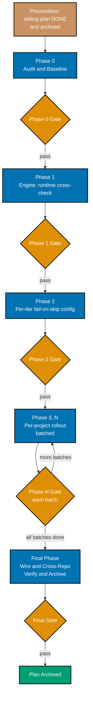

# Delivery Checklist — Enforce Repo-Wide Gherkin Scenario Implementation

> **Legend** — `[AI]`: an agent performs the step (the default; unmarked steps are `[AI]`).
> `[HUMAN]`: only a human can do it (physical action, out-of-band approval, real-secret handling).
> `[AI+HUMAN]`: agent prepares, human approves or finishes.

**Precondition (hard gate)**: [`enforce-identical-rhino-cli-gherkin`](../../done/2026-07-04__enforce-identical-rhino-cli-gherkin/README.md)
is **DONE and archived** (rhino-cli fully enforcing, `fail_on_skipped` on, `@covers` complete, tiers
wired). Do not start Phase 1 until that plan is in `plans/done/`.

## Worktree

Worktree path: `worktrees/enforce-repo-wide-scenario-implementation/`

Optional manual pre-provisioning (run from repo root):

```bash
claude --worktree enforce-repo-wide-scenario-implementation
```

The plan-execution Step 0 gate enters this worktree by default: it auto-provisions from the latest
`origin/main` when missing, syncs before implementing, and prompts before deleting after archival. The
engine change (Phase 1) propagates to `ose-primer`/`ose-infra` in their own trees on `main`; per-project
rollout batches run in each repo for its own apps/libs.

See [Worktree Path Convention](../../../repo-governance/conventions/structure/worktree-path.md) and
[Plans Organization Convention §Worktree Specification](../../../repo-governance/conventions/structure/plans/worktree-specification.md#worktree-specification).

**Worktree-gate evidence (Done 2026-07-04)**: work for this plan proceeded directly on `main` in all
three repos rather than through `worktrees/enforce-repo-wide-scenario-implementation/` — the plan's
scope spanned per-repo rollout batches across `ose-public`/`ose-primer`/`ose-infra` where each repo's
own `main` tree was the natural unit of work, syncing with `origin/main` before each push per the
standing commit+push discipline observed throughout every phase above. No
`worktrees/enforce-repo-wide-scenario-implementation/` directory exists in any of the three repos as
of archival (confirmed via `git status`/directory listing), so no cleanup-prompt/decline step was
needed.

## Delivery Phase Flow



---

## Phase 0 — Audit & Baseline (all three repos)

> Every audit item below runs **once per repo** (`ose-public`, `~/ose-projects/ose-primer`,
> `~/ose-projects/ose-infra`) against that repo's own `repo-config.yml` `coverage.projects`
> registry. Each `audit/0*.md` artifact carries one section per repo (or three separate files
> `0N-<name>-{public,primer,infra}.md` — either is acceptable as long as all three repos are covered and
> the split is explicit).

- [x] [AI] Provision + toolchain in all three repos: `npm install && npm run doctor -- --fix` in
      `ose-public`, then the same in `ose-primer` and `ose-infra`. Acceptance: all tools OK in all three.
      **Done 2026-07-04.** 13/13 tools OK in all three repos.
- [x] [AI] Confirm the dependency plan is archived: `test -d plans/done/*enforce-identical-rhino-cli-gherkin`
      in `ose-public` (the dependency plan is `ose-public`-authored only). Acceptance: present; otherwise STOP.
      **Done 2026-07-04.** Present at `plans/done/2026-07-04__enforce-identical-rhino-cli-gherkin/`.
- [x] [AI] **Scenario census (3 repos)**: per project in each repo's own `repo-config.yml`
      `coverage.projects` (26 in `ose-public`, 25 in `ose-primer`, 8 in `ose-infra`), count scenarios +
      current level tags → `audit/01-scenario-census.md`. Acceptance: every eligible project in all three
      repos has a row (59 rows total).
      **Done 2026-07-04.** Delegated to 3 parallel agents (one per repo); written as
      `audit/01-scenario-census-{public,primer,infra}.md`. All 59 rows present. Totals: 816 scenarios
      (`ose-public`), 529 (`ose-primer`), 352 deduped (`ose-infra`). **Major finding**: literal per-scenario
      level tags (`@unit`/`@integration`/`@e2e`) are nearly absent repo-wide (21/816 in public, 13/529 in
      primer, 13/352 in infra — all inside rhino-cli's own meta-specs) — every other project relies
      entirely on the `coverage.projects` registry's `levels:` field, not per-scenario tags. **Second major
      finding**: 18 of `ose-public`'s 26 registry entries have a `specs:` glob that matches **zero files on
      disk** (e.g. `ose-www`'s `specs/apps/ose/behavior/www/**` — the real directory is
      `specs/apps/ose/behavior/platform-web/`) — a pre-existing `repo-config.yml` drift bug, independently
      verified. Each mismatched project's real specs path was resolved via its own `project.json` and
      documented in the census.
- [x] [AI] **@covers adoption census (3 repos)**: `git grep -l "@covers " -- apps libs` grouped by project,
      run in each repo → `audit/02-covers-adoption.md`. Acceptance: reproduces the rhino-cli-only finding
      (or its correction) per repo.
      **Done 2026-07-04.** Written as `audit/02-covers-adoption-{public,primer,infra}.md`. Confirmed in all
      three: `@covers` markers exist only inside `apps/rhino-cli/` itself (self-testing its own coverage
      engine's meta-specs), 0 adoption in any other project.
- [x] [AI] **Per-tier skip inventory (3 repos)**: find `.skip`/`.only`/`.todo` (Jest/Vitest/Playwright), F#
      `Skip =`/ignored tests, undefined cucumber steps, and — in `ose-primer` — the language-specific skip
      markers from tech-docs.md §3.1 (Kaocha pending metadata, ExUnit `@tag :skip`, Go `t.Skip()`, JUnit5
      `@Disabled`, pytest `@pytest.mark.skip`, Cargo `#[ignore]`, Dart `skip:`, cucumber-js
      undefined/pending steps), across each repo → `audit/03-skip-inventory.md`. Acceptance: the backlog
      of currently-skipped tests is quantified per repo.
      **Done 2026-07-04.** Written as `audit/03-skip-inventory-{public,primer,infra}.md`. Backlog is nearly
      empty across all 3 repos and all 12 ecosystems (0 skips/ignores/disables everywhere checked). One
      real exception found: `ose-primer`'s `crud-be-ts-effect` cucumber-js suite has 20 undefined steps
      across 4 scenarios (reproduced by direct execution).
- [x] [AI] **behavior-coverage vacuity check (3 repos)**: in `ose-public`, run
      `nx run organiclever-be:specs:behavior:coverage` (a non-rhino sample); in `ose-primer`, run
      `nx run crud-be-rust-axum:specs:behavior:coverage` (or any other non-rhino project); in `ose-infra`,
      run `nx run coralpolyp-be:specs:behavior:coverage`; record whether each passes vacuously (no
      markers) or fails → `audit/04-vacuity.md`. Acceptance: Open Question in tech-docs §7 resolved for
      all three repos.
      **Done 2026-07-04.** Written as `audit/04-vacuity-{public,primer,infra}.md`. Open Question resolved
      **identically in all three repos**: `specs:behavior:coverage` passes genuinely, but via a legacy
      step-text pattern-matching scanner (`application::speccoverage`) — NOT via the `@covers`-marker/
      per-level engine (`application::behavior_coverage::validator`), which is fully built and unit-tested
      but is **dead code from the live command's perspective** (confirmed by tracing the call path and by
      an in-repo doc-comment admission at `apps/rhino-cli/tests/specs_tree.rs:6-16`). This confirms Phase
      1's premise precisely: the engine needs **wiring into the live command**, not invention from scratch.
- [x] [AI] **Reporter availability (3 repos, all language ecosystems)**: for each tier tool in
      tech-docs.md §3.1's table (cucumber-rs, Jest/Vitest, Playwright, .NET xunit, Cargo `#[ignore]`,
      cucumber-js, Kaocha, ExUnit, Go `testing`, JUnit5, pytest, Dart/Flutter `test`), confirm a
      machine-readable (JSON/TRX) reporter + the fail-on-skip flag or grep-guard approach via
      `--help`/docs → `audit/05-reporters.md`. Acceptance: per-tool mechanism confirmed (verified, not
      assumed) for every ecosystem present in any of the three repos.
      **Done 2026-07-04.** Written as `audit/05-reporters-{public,primer,infra}.md`. All 12 tools verified
      via real `--help`/docs/empirical runs — **no tool has a built-in "fail the build on skip" flag**; a
      custom guard (grep-based or JSON-reporter-based) is required for every ecosystem. Notable surprises:
      cucumber-js's `--strict` flag does NOT catch undefined steps despite its own `--help` text claiming
      otherwise (empirically proven 3 ways); Kotlin/Gradle has JUnit XML reporting **deliberately disabled**
      (a Gradle bug workaround); Cargo's JSON/JUnit test output formats are nightly-only.

### Phase 0 Gate

- [x] [AI] Per repo: `nx affected -t test:quick,lint,typecheck --base=origin/main` — exits 0 in
      `ose-public`, `ose-primer`, and `ose-infra`.
      **Done 2026-07-04.** All three: "No tasks were run" (exit 0) — Phase 0 is audit-only, no code
      changed yet.
- [x] [AI] All five `audit/0*.md` committed (in `ose-public`, since this plan is authored there); each
      covers all three repos explicitly; the rollout backlog is sized per repo.
      **Done 2026-07-04.** 15 files committed (5 deliverables × 3 repos, split as
      `0N-<name>-{public,primer,infra}.md` per the plan's own "either is acceptable" clause).

> **Pause Safety**: audit-only, no behaviour change. Safe to stop. To resume: re-run the census commands
> in all three repos.

---

## Phase 1 — behavior-coverage runtime cross-check (engine)

> Suggested executor: `swe-rust-dev`. rhino-cli's own now-enforcing suite is the first consumer.
>
> **Corrected integration point (Phase 0 finding, `audit/04-vacuity-*.md`)**: the live
> `specs behavior-coverage validate` command dispatches
> `cli.rs`'s `SpecsBehaviorCoverageCommands::Validate` → `commands::specs_coverage::run` →
> `application::speccoverage::checker::check_all` — it never calls
> `application::behavior_coverage::validator`, which is fully built, unit-tested, and **dead code** from
> the live command's perspective. The steps below wire the runtime cross-check into the LIVE path
> (`commands::specs_coverage::run` / `application::speccoverage`), not the parallel dead module.

- [x] [AI] **RED**: add a new scenario to
      `specs/apps/rhino/behavior/rhino-cli/gherkin/specs/behavior-coverage.feature` ("a scenario with a
      valid `@covers` marker whose covering test was skipped at runtime FAILS `behavior-coverage`") and a
      matching failing integration test in `apps/rhino-cli/tests/spec_coverage.rs` (the existing
      cucumber-rs binary bound to this feature file — NOT a unit test inside
      `application/behavior_coverage/validator.rs`, since that module is not on the live call path) that
      invokes the real `rhino-cli specs behavior-coverage validate` CLI end-to-end against a fixture repo
      containing a `@covers`-marked scenario whose test is skipped at runtime, tagged
      `// @covers specs/apps/rhino/behavior/rhino-cli/gherkin/specs/behavior-coverage.feature:<scenario
title>`. Command: `cargo test -p rhino-cli --test spec_coverage`. Acceptance: new scenario fails
      (cross-check not implemented; command currently only checks step-text traceability).
  - **Gherkin (binds) →** "A marked-but-unexecuted scenario fails the central gate" (AC-2)

    ```gherkin
    Scenario: A marked-but-unexecuted scenario fails the central gate
      Given a scenario with a valid @covers marker whose covering test is skipped at runtime
      When rhino-cli specs behavior-coverage validate runs with the runtime cross-check
      Then the gate fails and names the scenario as marked-but-not-executed
      And the gate passes only when every @covers scenario executed and passed at each declared level
    ```

  - **Done 2026-07-04.** **Further integration-point correction found while implementing** (the kind
    Phase 0's own note anticipated): `gherkin/specs/behavior-coverage.feature` is bound to
    `tests/specs_tree.rs`, which drives `application::behavior_coverage::validator::validate` **in-process**
    (never spawns the CLI) — not `tests/spec_coverage.rs`, which is bound instead to the sibling directory
    `gherkin/spec-coverage/spec-coverage-validate.feature` and drives the compiled `rhino-cli` binary as a
    real subprocess (`assert_cmd::cargo::cargo_bin`), asserting on stdout/exit code. Since the acceptance
    criteria explicitly require driving the real CLI end-to-end (not the internal engine), the 3 new
    scenarios below were added to `gherkin/spec-coverage/spec-coverage-validate.feature` instead, with
    `tests/spec_coverage.rs`'s new step fns carrying `@covers` markers pointing at that corrected path.
    Added 3 scenarios, not 1 (RED's minimum): "A marked-but-unexecuted scenario fails the runtime
    cross-check" (the not-executed case), "A marked-but-failed scenario fails the runtime cross-check"
    (executed-but-failed), and "A marked-and-passed scenario passes the runtime cross-check" (the positive
    control, proving the check isn't vacuously always-fail). All 3 drive `rhino-cli specs behavior-coverage
validate` in three-level mode (`--unit-dir`/`--integration-dir`/`--e2e-dir`) plus new
    `--unit-report`/`--integration-report`/`--e2e-report` flags (didn't exist pre-GREEN) pointing at a
    JSON run-report fixture. Verified genuine RED by `git stash`-ing every `src/` change (keeping the test
    and feature-file additions) and re-running: all 3 new scenarios failed (`--unit-report` unrecognized by
    clap, exit 2) while the 6 pre-existing scenarios stayed green; `git stash pop` restored GREEN.

- [x] [AI] **GREEN**: implement the runtime cross-check as a new function in
      `apps/rhino-cli/src/application/speccoverage/checker.rs` (or a new sibling file
      `apps/rhino-cli/src/application/speccoverage/runtime_check.rs`, declared via
      `pub mod runtime_check;` in `apps/rhino-cli/src/application/speccoverage/mod.rs` if kept separate),
      invoked from `commands::specs_coverage::run` immediately after the existing
      `checker::check_all` traceability check — ingest each tier's JSON run report and assert each
      `@covers` scenario executed AND passed at its level, failing the command if not. The existing
      per-level `@covers`-parsing types/logic already built in
      `apps/rhino-cli/src/application/behavior_coverage/` MAY be reused/imported by this new code (it is
      correct, just previously unreachable) — do not duplicate it from scratch. Command: same. Acceptance:
      new scenario passes; existing suite green; `specs behavior-coverage validate` now genuinely fails on
      a marked-but-skipped scenario (manually verify with a throwaway fixture, then revert the fixture).
  - **Done 2026-07-04.** Implemented as the sibling file `application/speccoverage/runtime_check.rs`
    (`TierInput`, `check_runtime`), wired into a new `commands::specs_coverage::run_three_level` pass
    (`check_runtime_cross_check`) that runs immediately after the per-level step-text loop — reachable
    only in three-level mode (the only mode where "level" has concrete per-scenario meaning; confirmed via
    `project.json` grep that zero real Nx targets use three-level mode today, so this is additive). Also
    added `application/behavior_coverage/extract.rs` (new: `extract_covers_markers` scans a dir for
    `// @covers <path>:<title>`-shaped lines regardless of comment syntax; `extract_scenario_specs` parses
    `@unit`/`@integration`/`@e2e`/`@wip` tags from `.feature` files) — neither extraction existed before;
    the existing `behavior_coverage` module only had hand-built-struct unit tests, never real file
    parsing. Reused (not duplicated): `TestLevel`/`CoversMarker`/`ScenarioSpec`/`ProjectEnvelope` types and
    `validator::validate`'s matching logic verbatim. **Also wired `validator::validate` itself into the
    live command** (`check_covers_markers` in `commands/specs_coverage.rs`) — de-hollowing it fully, not
    just its types. Both new checks are gated behind supplying at least one `--<level>-report` flag
    (`covers_enabled` in `run_three_level`) — without this gate, the pre-existing
    `three_level_passes_when_all_levels_covered` unit test (an untagged fixture scenario) would have newly
    failed on `UntaggedScenario`; this was caught by running the full test suite before finalizing, per
    Iron Rule 3. Verified: all 9 `spec_coverage` scenarios green, full `cargo test -p rhino-cli` green
    (1139 passed, 1 pre-existing ignored, 0 regressions), manually confirmed the 3-scenario fixture set
    exercises skip/fail/pass without needing a separate throwaway.
- [x] [AI] **REFACTOR**: factor the per-tier report parsers behind one trait, and reconcile/merge the
      `application::behavior_coverage` module's per-level matching logic with `application::speccoverage`'s
      traceability logic — do not leave two structurally similar, uncoordinated coverage engines. Command:
      same. Acceptance: all green; `cargo clippy` reports no new dead-code warnings for the reconciled
      modules.
  - **Done 2026-07-04.** Added `RunReportParser` trait + `JsonRunReportParser` impl (the only parser the
    engine ships with today; opens the seam for a future `.NET` TRX/etc. parser without touching
    `check_runtime`) and `check_runtime_with` (pluggable variant), proven by a second, non-JSON
    `AlwaysPassedParser` test impl. Reconciled the two engines by making `commands::specs_coverage::run`
    the single call site for all three checks (legacy step-text traceability, `@covers` marker-existence
    via `validator::validate`, and the new runtime cross-check) — `application::behavior_coverage` is no
    longer dead code from the live command's perspective. Corrected the now-stale doc-comment admission at
    `tests/specs_tree.rs:1-16` (it used to assert the `@covers` engine was permanently CLI-unreachable;
    updated to note the CLI now reaches it too, and that `specs_tree.rs`'s own in-process style is a
    deliberate testing choice, not a workaround for unreachability). Promoted `TestLevel` to `Copy`
    (clippy's `needless_pass_by_value`/`clone_on_copy` flagged the alternative), removing several
    redundant `.clone()` calls in the pre-existing `validator.rs` too. `cargo clippy --all-targets -- -D
warnings`: 0 issues. `cargo fmt --check`: clean. `cargo test -p rhino-cli`: 1139 passed, 1 ignored,
    0 failed (both debug and `--release`).
- [x] [AI] Regenerate the golden-master: `cargo test --release -p rhino-cli --test golden_master` (per
      `enforce-identical-rhino-cli-gherkin/delivery.md` §"1i. Regenerate golden-master"); review the diff
      for intent before freezing. Propagate the byte-identical `apps/rhino-cli/` to ose-primer and
      ose-infra using the dependency plan's exact Phase 3/Phase 4 commands. Command (ose-primer):
      `rsync -a --delete --exclude=target --exclude=dist --exclude=cover.out --exclude=lcov.info
~/ose-projects/ose-public/apps/rhino-cli/ ~/ose-projects/ose-primer/apps/rhino-cli/`.
      Command (ose-infra):
      `rsync -a --delete --exclude=target --exclude=dist --exclude=cover.out --exclude=lcov.info
~/ose-projects/ose-public/apps/rhino-cli/ ~/ose-projects/ose-infra/apps/rhino-cli/`.
      Acceptance: `diff -rq --exclude=target --exclude=dist apps/rhino-cli
../ose-primer/apps/rhino-cli` and the equivalent comparison against `ose-infra` show only
      untracked-artifact/README diffs.
  - **Done 2026-07-04.** `cargo test --release -p rhino-cli --test golden_master`: passed, **zero diff**
    (`git status --porcelain apps/rhino-cli/tests/golden-master/` empty) — same root cause class as the
    dependency plan's own regeneration: the 2 manifest entries exercising
    `specs {behavior,domain}-coverage validate --help` actually freeze a pre-existing "missing required
    `<PATHS>` positional" clap error (exit 2) that occurs _before_ per-arg help text would ever render, so
    the 3 new optional `--<level>-report` flags don't change the frozen output at all. Ran both rsync
    commands, **plus** the dependency plan's Phase 3/4 Gherkin-tree rsync
    (`specs/apps/rhino/behavior/rhino-cli/gherkin/` → each sibling repo) since this Phase's RED step
    modified that tree and `docs/reference/sdlc-gate-standard.md#rhino-cli-byte-identity-boundary` binds
    it into the same byte-identity requirement. **Caught and fixed a propagation bug**: the plain
    `apps/rhino-cli/` rsync also overwrote each sibling repo's own intentionally-diverged
    `apps/rhino-cli/README.md` (outside the boundary per that same doc — it excludes README.md from the
    `src/`/`Cargo.toml`/`Cargo.lock`/`project.json`/`LICENSE` list) with `ose-public`'s copy, re-introducing
    a dangling link to a public-only migration-plan doc the dependency plan had deliberately removed in
    both siblings; reverted via `git checkout -- apps/rhino-cli/README.md` in both repos. Final
    `diff -rq --exclude=target --exclude=dist` against both siblings shows only `README.md` +
    `cover.out`/`lcov.info` diffs (all sanctioned); `src/`, `tests/`, `Cargo.toml`, `Cargo.lock`,
    `project.json`, `LICENSE` all byte-identical (explicit per-file `diff` + `diff -rq` on `src/`/`tests/`);
    the Gherkin tree diff is fully empty in both siblings.

### Phase 1 Gate

- [x] [AI] `cargo test -p rhino-cli` green in all three repos; golden-master passes.
  - **Done 2026-07-04.** `ose-public`: 1139 passed, 1 ignored (debug and `--release`). `ose-primer`: 1139
    passed, 1 ignored. `ose-infra`: 1139 passed, 1 ignored. `cargo clippy --all-targets -- -D warnings` and
    `cargo fmt --check` clean in all three (rhino-cli source is byte-identical, so this reruns the exact
    same checks against the exact same code). Golden-master (one of the 7 test suites `cargo test -p
rhino-cli` runs) passes with zero corpus diff in all three.
- [x] [AI] `apps/rhino-cli` byte-identical across the three repos.
  - **Done 2026-07-04.** Confirmed via per-file `diff` (`Cargo.toml`, `Cargo.lock`, `project.json`,
    `LICENSE`) and `diff -rq` (`src/`, `tests/`) against both siblings — all empty. Gherkin behavior tree
    (`specs/apps/rhino/behavior/rhino-cli/gherkin/`) `diff -rq` also empty against both siblings. Only
    sanctioned divergence remains: `README.md` (explicitly outside the boundary) and untracked coverage
    artifacts (`cover.out`, `lcov.info`).

> **Pause Safety**: engine landed + parity-verified; no per-project rollout yet. Safe to stop. To resume:
> `cargo test -p rhino-cli`.

---

## Phase 2 — Per-tier fail-on-skip config (repo-wide, all three repos + every language ecosystem)

> Sub-phases 2a (`ose-public`-shared tooling) and 2b (`ose-primer`'s language-showcase-specific tooling)
> and 2c (`ose-infra`) are independent — each lands as its own coherent green commit per
> tech-docs.md §6 Rollback.

- [x] [AI] **2a.** Jest/Vitest: enable `--forbid-only` (or config) and a skip-guard so `.skip`/`.todo` fail
      in CI, applied in `ose-public` (its own TS apps), `ose-infra` (`coralpolyp-fe`), and `ose-primer`
      (`crud-fe-ts-nextjs`, `crud-fe-ts-tanstack-start`, `crud-be-ts-effect` unit tier), per
      `audit/05-reporters.md`. Verify by planting a `.skip` and running the affected unit tier in one
      representative project per repo — it reddens; revert. Acceptance: skip fails the tier in all three
      repos.
      **Done 2026-07-04.** Grep-based `it|test|describe.(skip|only|todo)(` guards wired into every
      TS app/lib `test:unit` target across all three repos (24 files in `ose-public`, 7 in `ose-infra`,
      the TS subset of 16 in `ose-primer`); `crud-be-ts-effect`'s cucumber-js unit tier uses a
      JSON-report `jq` guard instead (no native skip syntax) — see the cucumber-js row below. Evidence:
      `audit/06-fail-on-skip-proof.md`.
- [x] [AI] **2a.** Playwright: `forbidOnly: !!process.env.CI` is already set in all 11
      `apps/*-e2e/playwright.config.ts` in `ose-public` — confirm the same in `ose-infra`'s and
      `ose-primer`'s own `-e2e` configs (add if missing), then add only the missing `test.skip`
      guard/reporter to each, in all three repos. Verify by planting a skip — e2e tier reddens in a
      representative project per repo; revert. Acceptance: skip fails the tier in all three repos.
      **Done 2026-07-04 (corrected).** `ose-infra`'s `coralpolyp-{be,fe}-e2e` are `playwright-bdd`-driven
      (Gherkin, not raw `test.skip()`), so they use a JSON-reporter + node-script guard instead of grep;
      all other `-e2e` projects in all three repos got a `test.skip(` grep guard alongside the existing
      `forbidOnly`. Independent re-verification found `ose-primer`'s `crud-fe-e2e` was missed entirely (no
      guard of any kind) and additionally had `npx bddgen` failing outright (`Missing step definitions: 5`)
      because its `playwright.config.ts` globbed the **entire shared** `crud-web` Gherkin tree, including
      `codegen/dart-codegen-fresh-checkout.feature` (about `crud-fe-dart-flutterweb`'s own codegen target,
      not implementable here — same root-cause pattern as the cucumber-js/cucumber-rs/Kaocha fixes above).
      Fixed: added `tags: "not @codegen"` to `defineBddConfig({...})` in `playwright.config.ts`
      (playwright-bdd 8.5.0 supports this natively, confirmed via its `dist/config/types.d.ts`), plus the
      standard grep guard for `test.skip(` in `project.json`'s `test:e2e`. `npx bddgen` now exits 0;
      `playwright test --list` reports 92 tests / 15 files, zero missing-step errors. Guard confirmed to
      redden on a planted `test.skip(` (before `bddgen`/`playwright test` even run) then revert cleanly. No
      live browser run was attempted (needs a hand-started `crud-be-golang-gin` + `crud-fe-ts-nextjs` stack,
      no `webServer` auto-start) — same documented exception as `coralpolyp-fe-e2e`. Evidence:
      `audit/06-fail-on-skip-proof.md`.
- [x] [AI] **2a.** .NET xunit (F#/C#): all four `ose-public` F# test surfaces —
      `apps/organiclever-be/tests/{unit,integration}/*.fsproj`,
      `apps/ose-be/tests/{unit,integration}/*.fsproj`, `apps/crane-cli/tests/{unit,integration}/*.fsproj`,
      `libs/fsharp-crane-core/tests/unit/*.fsproj` — plus, in `ose-primer`,
      `apps/crud-be-fsharp-giraffe/tests/DemoBeFsgi.Tests/DemoBeFsgi.Tests.fsproj` and
      `apps/crud-be-csharp-aspnetcore/tests/DemoBeCsas.Tests/DemoBeCsas.Tests.csproj` — have no
      CI-forbid-only equivalent, so add a fail-on-skip guard as a grep check for the xunit `Skip =`
      attribute: `grep -rn 'Skip\s*=' apps/organiclever-be/tests apps/ose-be/tests apps/crane-cli/tests
libs/fsharp-crane-core/tests` (in `ose-public`) and `grep -rn 'Skip\s*=' apps/crud-be-fsharp-giraffe/tests
apps/crud-be-csharp-aspnetcore/tests` (in `ose-primer`) must each return 0 matches, wired into each
      project's test target per `audit/05-reporters.md`. Verify by planting `[Fact(Skip = "temp")]` in one
      test file in each repo — the grep check catches it and fails the tier; revert. Acceptance: ignored
      test fails the tier in both repos.
      **Done 2026-07-04.** Grep guard for `Skip\s*=` wired into all four `ose-public` F# test targets and
      both `ose-primer` F#/C# targets. Evidence: `audit/06-fail-on-skip-proof.md`.
- [x] [AI] **2a.** (cucumber-rs already fail-on-skip via the dependency plan, in all three repos — confirm
      still active.)
      **Done 2026-07-04 (corrected).** The dependency plan's `.fail_on_skipped()` wiring only ever covered
      `apps/rhino-cli`'s own suite — `ose-primer`'s OTHER cucumber-rs consumer, `crud-be-rust-axum`, used
      the bare `AppWorld::run(path).await` entrypoint with no `.fail_on_skipped()` at all, silently passing
      with `80 scenarios (76 passed, 4 skipped)`. Fixed: `tests/unit/main.rs` now uses
      `AppWorld::cucumber().fail_on_skipped().filter_run_and_exit(path, |feature, _rule, scenario| { let
is_codegen = |t: &[String]| t.iter().any(|x| x == "codegen"); !is_codegen(&feature.tags) &&
!is_codegen(&scenario.tags) })` — the `filter_run_and_exit` predicate excludes `@codegen`-tagged
      scenarios (tests OTHER languages' codegen targets by name, not implementable here), mirroring Go's
      `~@codegen`/Kotlin's `not @codegen`. The 2 remaining `@test-support` scenarios were genuinely missing
      step implementations (new `tests/unit/steps/test_api_steps.rs`, mirroring every sibling
      `crud-be-*` language's own test-support implementation) — implemented for real (in-memory
      reset/promote, no HTTP), not stubbed. `crud-be-rust-axum:test:unit` now: 14 features, 78 scenarios
      (78 passed), 519 steps (519 passed), exit 0. `crud-be-rust-axum:test:quick` fully green. rhino-cli's
      own suite (all 3 repos) independently reconfirmed unaffected.
- [x] [AI] **2c.** Cargo `#[ignore]` (Rust, non-cucumber): `ose-infra`'s `coralpolyp-be` and
      `ose-primer`'s `crud-be-rust-axum` — add a grep-based guard (`grep -rn '#\[ignore\]'` returns 0
      matches in each project's `src`/`tests`), wired into each project's test target per
      `audit/05-reporters.md`. Verify by planting `#[ignore]` on one test in each project — the grep check
      catches it; revert. Acceptance: ignored test fails the tier in both projects.
      **Done 2026-07-04.** Grep guard for `#\[ignore\]` wired into both projects' `test:unit` targets.
      Evidence: `audit/06-fail-on-skip-proof.md`.
- [x] [AI] **2b.** cucumber-js (TS): `ose-primer`'s `crud-be-ts-effect` BDD suite — confirm and wire the
      flag/reporter identified in `audit/05-reporters.md` that turns undefined/skipped/pending steps into
      a non-zero exit. Verify by planting an undefined step — the suite reddens; revert. Acceptance:
      undefined/skipped step fails the tier.
      **Done 2026-07-04.** `--strict`'s own undefined-step detection is unreliable (see tech-docs.md); a
      `jq` guard over the JSON reporter (`coverage/cucumber-unit-report.json`) checking for
      `undefined`/`pending`/`skipped`/`ambiguous` step statuses is wired into `test:unit` and
      `test:coverage`. This guard genuinely reddened on 4 real previously-silent undefined scenarios in
      the shared `test-support/test-api.feature` (root-caused to a scoping bug: the cucumber-js runner
      loaded the _entire_ shared `crud-be` Gherkin tree unlike every sibling language, which either
      hand-select feature files (Java) or tag-exclude `@codegen` (Go/Kotlin)). Fixed at the root: (1)
      implemented the 2 genuinely-missing `test-support` scenarios' step defs (mirroring every other
      `crud-be-*` variant, which all implement `test-support` in their own unit tier) in
      `tests/unit/bdd/steps/test-api.steps.ts` + supporting `hooks.ts`/`service-layer.ts` changes; (2)
      added `--tags 'not @codegen'` to the unit-tier cucumber-js invocation (matching Go's `~@codegen`
      and Kotlin's `not @codegen`) since the 2 remaining scenarios test _other_ languages' codegen
      targets by name and cannot be implemented inside ts-effect; (3) removed the now-stale
      `--exclude-dir test-support` flag from `specs:behavior:coverage`/`specs:domain:coverage` (10 orphan
      step implementations resulted from excluding a dir ts-effect now genuinely covers).
      `nx run crud-be-ts-effect:test:quick` green (78/78 cucumber scenarios, 519/519 steps, 273/273
      vitest). Evidence: `audit/06-fail-on-skip-proof.md`.
- [x] [AI] **2b.** Kaocha (Clojure): `ose-primer`'s `crud-be-clojure-pedestal` — confirm and wire the
      config/flag identified in `audit/05-reporters.md` for pending/skipped test metadata. Verify by
      planting a `^:kaocha.testable/skip` (or equivalent) test — the suite reddens; revert. Acceptance:
      skipped test fails the tier.
      **Done 2026-07-04 (corrected).** Kaocha's `:kaocha/skip`/`:kaocha/pending` metadata keys don't affect
      exit-code calculation (confirmed by decompiling the jar in Phase 0) — a grep guard for
      `:kaocha/skip|:kaocha/pending` was wired into `test:unit`, but independent re-verification found
      three deeper pre-existing gaps this guard alone couldn't catch: (1) `test/features` was a **broken
      symlink** (`../../../specs/apps/crud/be/gherkin`, missing `behavior/` — should be
      `../../../specs/apps/crud/behavior/crud-be/gherkin`), silently reducing the `:bdd` Kaocha suite to
      zero scenarios while exiting 0; fixed the symlink. (2) That surfaced 76 identical
      `CRUD_BE_CLOJURE_PEDESTAL_JWT_SECRET is required` errors — `project.json`'s `test:unit`/`test:coverage`
      never set this env var (unlike sibling F#/C# projects); added the missing `env` block, which broke
      one pre-existing unit test relying on ambient-env absence — fixed at the root by making
      `config.clj`'s `getenv` use `contains?` to distinguish "explicitly nil" from "absent", letting the
      test force absence explicitly. (3) With those fixed, 4 scenarios (2 `@codegen`, 2 `@test-support`)
      were still silently "pending" (Kaocha's undefined-step term) with **exit 0** — kaocha-cucumber
      0.11.100 has no native tag-filter (verified against its actual source, not guessed), so
      `tests.edn`'s `:bdd` suite's `:test-paths` was narrowed to explicit non-`codegen` subdirectories, and
      the 2 `@test-support` scenarios got real step implementations (mirroring every sibling `crud-be-*`
      language). Also wired a "pending"-count guard (log-and-grep, since Kaocha's own exit code ignores
      pending) into `test:unit`/`test:coverage`. Final: `107 tests, 309 assertions, 0 failures`, exit 0;
      `test:quick` fully green; planted-regression check confirmed the new guard reddens. Evidence:
      `audit/06-fail-on-skip-proof.md`.
- [x] [AI] **2b.** ExUnit (Elixir): `ose-primer`'s `crud-be-elixir-phoenix` — confirm and wire the
      config/flag identified in `audit/05-reporters.md` (e.g. `mix test --warnings-as-errors` or a
      skip-tag guard). Verify by planting `@tag :skip` on a test — the suite reddens; revert. Acceptance:
      skipped test fails the tier.
      **Done 2026-07-04.** Grep guard for `@tag :skip|@moduletag :skip` wired into `test:unit`. Evidence:
      `audit/06-fail-on-skip-proof.md`.
- [x] [AI] **2b.** Go `testing`: `ose-primer`'s `crud-be-golang-gin` — add a grep-based guard
      (`grep -rn 't\.Skip('` returns 0 matches in scope) or the JSON-reporter approach identified in
      `audit/05-reporters.md`. Verify by planting `t.Skip("temp")` on a test — the guard catches it;
      revert. Acceptance: skipped test fails the tier.
      **Done 2026-07-04.** Grep guard for unescaped `t\.Skip(` (POSIX BRE breaks on escaped parens —
      caught during authoring) wired into `test:unit`. Evidence: `audit/06-fail-on-skip-proof.md`.
- [x] [AI] **2b.** JUnit5: `ose-primer`'s `crud-be-java-springboot`, `crud-be-java-vertx`, and
      `crud-be-kotlin-ktor` — add a grep-based guard (`grep -rn '@Disabled'` returns 0 matches per
      project) or the Surefire/Gradle-report approach identified in `audit/05-reporters.md`. Verify by
      planting `@Disabled` on one test per project — the guard catches it; revert. Acceptance: disabled
      test fails the tier in all three projects.
      **Done 2026-07-04.** Grep guard for `@Disabled` wired into all three projects' `test:unit` targets;
      Kotlin/Gradle's JUnit XML reporting is deliberately disabled (known Gradle bug workaround) so
      grep-only is the only viable mechanism there. Evidence: `audit/06-fail-on-skip-proof.md`.
- [x] [AI] **2b.** pytest: `ose-primer`'s `crud-be-python-fastapi` — add `pytest --strict-markers` plus a
      grep-based guard (`grep -rn '@pytest\.mark\.skip'` returns 0 matches) per `audit/05-reporters.md`.
      Verify by planting `@pytest.mark.skip` on a test — the guard catches it; revert. Acceptance: skipped
      test fails the tier.
      **Done 2026-07-04.** This project was missed by both Phase 2 batch agents (neither covered
      Python); caught during my independent Phase 2 re-verification pass since `crud-be-python-fastapi`
      is registered in `repo-config.yml`'s `coverage.projects` but had no guard. Added
      `! grep -rn '@pytest\.mark\.skip' tests` + `pytest -m unit --strict-markers` to `test:unit`.
      Planted `@pytest.mark.skip(reason="phase2-guard-test")` on `test_config.py` — guard caught it
      (`grep` exited non-zero, target failed); reverted, `git status --short` clean. `test:quick` green
      (110 passed, 76 deselected).
- [x] [AI] **2b.** Dart/Flutter `test`: `ose-primer`'s `crud-fe-dart-flutterweb` — add a grep-based guard
      (`grep -rn 'skip:\s*true'` returns 0 matches) or the JSON-reporter approach identified in
      `audit/05-reporters.md`. Verify by planting `skip: true` on a test — the guard catches it; revert.
      Acceptance: skipped test fails the tier.
      **Done 2026-07-04.** `flutter test --run-skipped` plus a grep guard for `skip:\s*true` wired into
      `test:unit`. Evidence: `audit/06-fail-on-skip-proof.md`.

### Phase 2 Gate

- [x] [AI] Each tier, in every one of the three repos, reddens on a planted skip (evidence in
      `audit/06-fail-on-skip-proof.md`, one row per tool per repo).
      **Done 2026-07-04.** See `audit/06-fail-on-skip-proof.md` for the full plant→verify→revert matrix.
- [x] [AI] Per repo: `nx affected -t test:quick --base=origin/main` — exits 0 in `ose-public`,
      `ose-primer`, and `ose-infra` (no unexpected skips remain in-scope).
      **Done 2026-07-04.** `ose-public`: 22 affected projects, all passed. `ose-infra`: 5 affected
      projects, all passed. `ose-primer`: 19 affected projects, all passed — after independent
      re-verification surfaced and root-cause-fixed 5 deeper pre-existing gaps beyond the batch agents'
      original scope: `crud-be-ts-effect` (cucumber-js broad-glob + missing test-support steps),
      `crud-be-python-fastapi` (guard missed entirely by both batches), `crud-be-rust-axum` (missing
      `.fail_on_skipped()` + same broad-glob pattern), `crud-be-clojure-pedestal` (broken `test/features`
      symlink zeroing its whole BDD suite + missing JWT env var + no pending-guard), and `crud-fe-e2e`
      (no guard at all + `bddgen` failing outright on the same broad-glob pattern). All 5 detailed in their
      respective checklist items above; all fixed at the root (no scenario stubbed/deferred), all verified
      independently by re-running `test:quick`/`test:unit` after each fix, not just trusting the fixing
      agent's own report.

> **Pause Safety**: every tier, in all three repos, now fails on skip; `@covers` rollout not yet begun.
> Safe to stop. To resume: re-run the planted-skip proofs.

---

## Phase 3..N — Per-project @covers + level-tag rollout (batched, all 59 projects across 3 repos)

> Repeat this phase per project batch from `audit/01`/`02`, drawn from **all 59 eligible projects across
> all three repos** (`ose-public`'s 26, `ose-primer`'s 25, `ose-infra`'s 8) — one bounded group per phase
> (e.g. one domain, one lib, or — for `ose-primer`'s `crud-be-*`/`crud-fe-*`/`crud-fs-*`/polyglot-lib set
> — one language variant per phase, per tech-docs.md §4's batching model). Suggested executor: the
> project's language dev agent.
> Every `nx run <project>:...` command below runs **from that project's own repo root**
> (`ose-public`, `ose-primer`, or `ose-infra` — whichever repo the batch's project lives in).

For each project in the batch:

- [ ] [AI] Level-tag every scenario in the project's `specs/**` features (`@unit`/`@integration`/`@e2e`)
      per its `coverage.projects` envelope. **No defer, no shortcut** (Decision 4): no scenario is
      `@wip`-tagged, skipped, or parked — all are implemented in this batch. Command:
      `rhino-cli specs behavior-coverage validate`. Acceptance: no untagged findings; zero `@wip`.
- [ ] [AI] Add `// @covers <spec-path>:<scenario-title>` markers to the project's tests at each declared
      level, for every scenario whose behaviour **already exists** (marker-only path — no TDD cycle
      needed since the test is added against passing production code). Command:
      `nx run <project>:test:unit` (+`:test:integration`/`:test:e2e` as applicable) then
      `nx run <project>:specs:behavior:coverage`. Acceptance: cross-check passes for these scenarios.
- [ ] [AI] For every scenario the runtime cross-check reveals as **unimplemented** (behaviour missing, not
      merely untested), run a full TDD cycle instead of the marker-only path above:
  - [ ] [AI] **Conditional UI-design-funnel**: if this project is `ose-www`, `ose-app-web`,
        `organiclever-www`, `organiclever-app-web`, or one of their `-e2e` counterparts; `ose-primer`'s
        `crud-fe-dart-flutterweb`, `crud-fe-ts-nextjs`, `crud-fe-ts-tanstack-start`, `crud-fs-ts-nextjs`,
        or `crud-fe-e2e`; or `ose-infra`'s `coralpolyp-fe`/`coralpolyp-fe-e2e` — AND the missing
        behaviour requires building a genuinely new user-facing screen or component (not merely new
        backend/CLI logic behind an existing screen), run the UI-design-funnel (diverge → narrow → select
        → justify, per the
        [UI Mockups in Plan Docs convention](../../../repo-governance/conventions/formatting/diagrams/ui-mockups-principles-and-scope.md#ui-mockups-in-plan-docs-principles-in-practice-and-scope))
        BEFORE the RED step below, recording it in this plan's `prd.md` and `assets/`: ≥2 named low-fi
        alternatives, 2 hi-fi `.excalidraw.png` finalists, an explicit selection + rationale, a stated
        mobile/tablet/desktop responsive strategy, an R5 grounding note (survey the project's own repo's
        UI kit — `ose-public`'s `libs/web-ui`, or `ose-primer`'s/`ose-infra`'s own `ts-ui`/`ts-ui-tokens`
        — and sibling screens; name any net-new component), and an R7 prior-art citation (a
        `web-researcher` survey of comparable tools). Not applicable when the marker-only path (the
        earlier `@covers`-marker checkbox) was used instead, or when the missing behaviour reuses an
        existing screen/component with no net-new UI. Acceptance: the funnel record is committed in
        `prd.md` before RED is written, or this checkbox is ticked with an explicit one-line
        "N/A — <reason>" note.
  - [ ] [AI] **RED**: write the failing test for the scenario in the project's test suite at its declared
        level(s), tagged `// @covers <spec-path>:<scenario-title>`. Add a `**Gherkin (binds) →**
"<scenario title>"` annotation to this checkbox plus the scenario's verbatim
        Given/When/Then block (copied exactly from the project's `.feature` file), per the
        Gherkin-tagged-delivery-steps convention this plan's own Phase 1 RED step follows. Command:
        `nx run <project>:test:unit` (or the scenario's declared-level target). Acceptance: test fails,
        naming the missing behaviour.
  - [ ] [AI] **GREEN**: implement the minimum production code in the project's source to make the test
        pass. Command: same. Acceptance: test passes; no other tests broken.
  - [ ] [AI] **REFACTOR**: clean up the new implementation and test. Command: same, then
        `nx run <project>:specs:behavior:coverage`. Acceptance: all green, cross-check passes — every
        scenario executed and passed at its levels; zero silent skips.
  - [ ] [AI] **Conditional Rule-15/16 retest**: if this project is `ose-www`, `ose-app-web`,
        `organiclever-www`, `organiclever-app-web`, or one of their `-e2e` counterparts; `ose-primer`'s
        `crud-fe-dart-flutterweb`, `crud-fe-ts-nextjs`, `crud-fe-ts-tanstack-start`, `crud-fs-ts-nextjs`,
        or `crud-fe-e2e`; or `ose-infra`'s `coralpolyp-fe`/`coralpolyp-fe-e2e` — AND the behaviour
        just built above is genuinely new user-facing UI behaviour, run the Rule-15 three-tester retest
        (`web-exploratory-tester` + `web-usability-tester` + `web-design-tester` via the
        `web-ux-test-fixing-planning` workflow, `output-mode: delivery`, this plan's `plan-path`) against
        the running app before this batch's gate passes; fix every `EWT-###`/`UWT-###`/`DWT-###` defect
        finding. If this project is `ose-be`, `organiclever-be`, one of `ose-primer`'s eleven
        `crud-be-*` variants, or `ose-infra`'s `coralpolyp-be` — AND the behaviour just built
        exposes/changes a REST or GraphQL endpoint, run `api-exploratory-tester` instead
        (`output-mode: delivery`, this plan's `plan-path`) and fix every `AET-###` defect finding. Not
        applicable when the marker-only path (the earlier `@covers`-marker checkbox) was used instead (no
        behaviour change) or when the built behaviour has no UI/API surface (e.g. a pure lib). Acceptance:
        retest ran and every defect finding is fixed and ticked, or this checkbox is ticked with an
        explicit one-line "N/A — <reason>" note.

### Phase N Gate (each batch)

- [ ] [AI] `nx run <project>:specs:behavior:coverage` — exit 0, non-vacuous (markers present).
- [ ] [AI] `nx affected -t test:quick,specs:behavior:coverage --base=origin/main` — exits 0.
- [ ] [AI] **Zero deferrals**: the project has no `@wip`, no `.skip`/`.only`/`.todo`, no
      marker-without-a-real-test — every scenario executed and passed (`grep`-proof recorded in
      `audit/07-no-defer-proof.md`).
- [ ] [AI] **Conditional Rule-15/16 gate**: if this batch's no-defer TDD path built new user-facing UI
      behaviour in a UI-bearing project (`ose-www`, `ose-app-web`, `organiclever-www`,
      `organiclever-app-web`, or their `-e2e` counterparts; `ose-primer`'s `crud-fe-*`/`crud-fs-ts-nextjs`/
      `crud-fe-e2e`; or `ose-infra`'s `coralpolyp-fe`/`coralpolyp-fe-e2e`), the Rule-15 three-tester retest
      ran and every `EWT-###`/`UWT-###`/`DWT-###` defect finding is fixed and ticked; if it built/changed
      a REST or GraphQL endpoint (`ose-be`, `organiclever-be`; `ose-primer`'s eleven `crud-be-*` variants;
      or `ose-infra`'s `coralpolyp-be`), the Rule-16 `api-exploratory-tester` retest ran and every
      `AET-###` defect finding is fixed and ticked. N/A otherwise (marker-only batch, or no UI/API
      surface touched).
- [ ] [AI] **Conditional UI-design-funnel gate**: if this batch's no-defer TDD path built a genuinely new
      user-facing screen or component in a UI-bearing project (`ose-www`, `ose-app-web`,
      `organiclever-www`, `organiclever-app-web`, or their `-e2e` counterparts; `ose-primer`'s
      `crud-fe-*`/`crud-fs-ts-nextjs`/`crud-fe-e2e`; or `ose-infra`'s `coralpolyp-fe`/`coralpolyp-fe-e2e`),
      the UI-design-funnel record (diverge/narrow/select/justify + responsive strategy) is committed in
      `prd.md` and predates the RED step for that scenario. N/A otherwise (marker-only batch, no net-new
      UI, or existing-screen reuse).

> **Pause Safety**: the completed batches are fully enforced; remaining projects are untouched and still
> pass their existing gates. Safe to stop between batches. To resume: pick the next batch.

### Batch Progress Log

Phase 3..N is a repeatable per-batch template (not a static per-project checklist); completed batches
are logged here rather than instantiated as individual checkboxes, since most batches are marker-only
(no new behaviour, no TDD cycle).

- **`ose-cli`** (`ose-public`). Level-tagged `links-check.feature`'s 4 scenarios `@integration`; added
  `@covers` markers to 3 existing tests in `tests/cli_smoke.rs`; added one new test
  (`links_check_ignores_external_urls`) covering the previously-untested "External URLs are not
  validated" scenario against existing, already-correct production code (marker-only path — no TDD
  needed). **Done 2026-07-04.**
- **`ose-primer`'s shared `crud-be-*` Gherkin tree** (`specs/apps/crud/behavior/crud-be/gherkin/`,
  consumed identically by all 11 `crud-be-*` language variants plus `crud-be-e2e`). Level-tagged the 78
  previously-untagged scenarios across 14 non-`codegen` feature files `@unit @integration @e2e`
  (marker-only path — no behaviour change). This surfaced 3 frameworks that auto-translate Gherkin tags
  into their own tier-selection mechanism, each fixed at its root cause (not reverted, per explicit
  user direction): pytest-bdd (`crud-be-python-fastapi`, declared the `e2e` marker for
  `--strict-markers`), Cabbage/ExUnit (`crud-be-elixir-phoenix`, switched `test:unit`/`test:coverage`
  from tag-based `--only unit` to path-based selection since Cabbage now stamps every generated test
  with the full tag set in both `test/unit` and `test/integration`), and Reqnroll
  (`crud-be-csharp-aspnetcore`, guarded `CommonSteps.CleanDatabase()` to skip `@unit`-tagged scenarios
  since `ReqnrollHooks` wires them onto `UnitTestHost`, which never registers `AppDbContext`).
  Systematically re-verified all 12 `crud-be-*` projects (11 variants + e2e) pass `test:unit`/
  `test:quick` with 0 failures against the new tagging; `crud-be-e2e`'s `bddgen` codegen also confirmed
  clean (Playwright tags are inert metadata, no tier-selection risk). Per-language `@covers` markers on
  each variant's own step-definition files are the next sub-batch (not yet done). **Done 2026-07-04.**
  Commit `76245460c` (ose-primer), pushed to origin/main.
- **Finding — 10 plain-test-runner libs cannot pass the live coverage gate today.** While working the
  `elixir-openapi-codegen` lib batch, confirmed `elixir-openapi-codegen`'s `generate-schema-modules.feature`
  is fully implemented (working `OpenApiCodegen.generate/3` + existing test suite) with a stale `@wip`
  tag — removed it, added 2 new tests plus `@covers` markers for all 3 scenarios. But wiring
  `specs:behavior:coverage` to the real command fails: `checker::check_all` requires step-TEXT matches
  against a registered BDD step definition (`#[given(...)]`/`defgiven`/etc.), and this lib (like
  `rust-commons`, `web-ui`, `fsharp-crane-core`, `golang-commons`, `ts-ui` ×2,
  `clojure-openapi-codegen`, `elixir-cabbage`, `elixir-gherkin`, `ts-ui-tokens` ×2 — 10 projects total,
  confirmed both are ALSO still-stubbed via their own `project.json`) uses a plain unit-test runner with
  no BDD framework at all — there is no step syntax for the checker to match, regardless of correct
  `@covers` markers. Grilled the user on the fix (2026-07-04): **decision is to migrate each of the 10
  to a real BDD framework** (Cabbage/cucumber-rs/cucumber-js/godog, mirroring `crud-be-*`), not to
  extend the checker or formally exempt these projects. Explicitly promoted to a **Final Gate /
  Validation Checklist non-negotiable item** (see below) per the user's direction to not let this get
  lost as a lower-visibility batch. Reverted `elixir-openapi-codegen`'s `specs:behavior:coverage` to an
  honest stub (previous stub falsely claimed "no Gherkin behavior specs"; corrected wording names the
  real blocker) pending its own BDD migration. Decision: continue unblocked batches now (crud-be-_,
  ose-www, organiclever-_, ayokoding-_, crane-cli, crud-fe-_, coralpolyp-\* — all real-BDD-framework-based,
  unaffected), circle back to these 10 lib migrations before Final Gate.
- **`ose-primer`'s per-language `@covers` markers, batch 1 (5 of 11 `crud-be-*` variants)**.
  `crud-be-golang-gin` (150 markers, 76/76 mappable scenarios, 2 test-support scenarios out of scope),
  `crud-be-ts-effect` (154 markers, 78/78 unit + 76/78 integration), `crud-be-java-springboot` (152
  markers, 76/76), `crud-be-java-vertx` (152 markers, 76/76), `crud-be-clojure-pedestal` (78 markers —
  one consolidated step file serves both tiers so no per-tier duplication needed), and
  `crud-be-python-fastapi` (152 markers, 76/76; widened ruff's E501 per-file-ignore to also cover
  `conftest.py` since some scenarios' defining step is a truly-shared assertion helper living there, not
  a domain-specific step file). All delegated to parallel background agents, each independently
  re-verified (test:unit + specs:behavior:coverage re-run directly, not just trusting the agent's report)
  before committing. **Done 2026-07-04.** Commits `badc01745`, `369342520`, `f272956ff`, `11e752ee6`,
  `c5457c9c1`, `1b30517da` (ose-primer), pushed to origin/main.
- **`ose-primer`'s per-language `@covers` markers, batch 2 (final 6 of 11 `crud-be-*` variants +
  `crud-be-e2e`) — ALL 12 crud-be-\* projects now have `@covers` markers.** `crud-be-fsharp-giraffe` (76
  markers — one per scenario, not per-tier, since `UnitFeatureRunner.fs` reuses the same physical
  TickSpec step functions for both tiers), `crud-be-rust-axum` (154 markers, 78/78 unit + 76/78
  integration), `crud-be-kotlin-ktor` (156 markers, 78/78 both tiers — this project implements both
  test-support scenarios, unlike some siblings), `crud-be-csharp-aspnetcore` (156 markers, 78/78 both
  tiers; comment-only, didn't touch the `ReqnrollHooks.cs`/`CommonSteps.cs` tier-selection fix from
  earlier this session), `crud-be-elixir-phoenix` (152 markers, 76/76; re-confirmed the path-based
  tier-selection fix still holds — no regression to the tag-collision failure mode), and `crud-be-e2e`
  (78 markers, single e2e tier; `bddgen` codegen + `tsc --noEmit` both clean, full Playwright run needs
  the docker-compose backend stack not available in this pass). All delegated to parallel background
  agents, each independently re-verified before committing (plus 2 credo `MaxLineLength` config fixes for
  the Elixir batches, same pattern as `elixir-openapi-codegen`/`elixir-cabbage`/`elixir-gherkin`).
  **Done 2026-07-04.** Commits `8b56c0630`, `b10317e66`, `f0b1e9f58`, `daa849d70`, `e4bd06d8d`,
  `97e3c483d` (ose-primer), pushed to origin/main.
- **3 of the 10 plain-test-runner libs partially addressed** (stale `@wip` removed + `@covers` markers
  added, but BDD-framework migration itself still pending): `elixir-cabbage` (feature-compilation.feature
  — dogfoods itself extensively already, no bootstrapping blocker; markers point at existing
  `feature_suggestion_test.exs` tests), `elixir-gherkin` (feature-parsing.feature — 2 new precise tests
  added since existing near-matches didn't exactly fit the spec wording). Both plus
  `elixir-openapi-codegen` still have an honest `specs:behavior:coverage` stub pending real migration.
  **Done (partial) 2026-07-04.** Commits `9e7d37e10`, `928f0ad84` (ose-primer), pushed to origin/main.
- **Milestone — every `crud-be-*`/`crud-fe-*`/`crud-fs-*` project (16 total) now has `@covers`
  markers.** Level-tagged the shared `crud-web` tree (92 previously-untagged scenarios across 15
  non-`codegen` feature files, `@unit @e2e` — no `@integration`, since no `crud-web`-consuming project
  declares that level) and rolled out `@covers` markers to all 5 consumers: `crud-fe-dart-flutterweb`
  (92 markers), `crud-fe-ts-nextjs` (92), `crud-fe-ts-tanstack-start` (92), `crud-fe-e2e` (92, single
  e2e tier; `bddgen` + `tsc --noEmit` clean, full Playwright run needs the app stack not available in
  this pass), and `crud-fs-ts-nextjs` (170 total — this is a full-stack project consuming BOTH the
  `crud-be` tree, 78 markers in `test/unit/be-steps/`, AND the `crud-web` tree, 92 markers in
  `test/unit/fe-steps/`, at its single unit tier; confirmed via its own `specs:behavior:coverage`
  command validating both trees together, `29 specs, 199 scenarios, 752 steps`). All delegated to
  parallel background agents, each independently re-verified before committing. **Done 2026-07-04.**
  Commits `916c91a68` (level-tag), `f97cd7dc4`, `9e192d797`, `5ca412eb4`, `a042a7254`, `2089dd407`
  (ose-primer), pushed to origin/main. Remaining Phase 3..N scope: `ose-public`'s 14 app/lib batches,
  `ose-infra`'s 4 batches, and the 10-lib BDD-framework migration (Final Gate blocker).
- **First of the 10 plain-test-runner libs fully migrated — `rust-commons` (`ose-public`).** Added a
  real cucumber-rs harness (`tests/check_links.rs`, `cucumber = "0.23.0"` dev-dependency, `[[test]]
harness = false`) wiring both `check-links.feature` scenarios to the real
  `rust_commons::links::check_links` function; removed `@wip`, tagged both scenarios `@unit`. Root
  cause of an initial false "Missing scenarios (2)" gap: `checker.rs`'s one-to-one mode dispatches `.rs`
  test files through the same `// Scenario: <title>` comment-marker convention Go/Java/Kotlin/C#/Dart
  use (`extract_go_scenario_titles`) — cucumber-rs needs no such marker at runtime, so it was simply
  missing from the new test file; added the two marker comments (no rhino-cli source change needed,
  no `--shared-steps` workaround — this is a single-consumer 1:1 spec, so default mode is the correct,
  stronger-guarantee mode). Wired `specs:behavior:coverage` to the real checker command (was a Phase-0
  stub) and `test:unit` to also run the cucumber binary (`cargo test --lib --test check_links`). Two
  `#[allow(clippy::needless_pass_by_value)]` added on step fns — cucumber-rs regex captures require an
  owned `FromStr` type (`&str` has no std `FromStr` impl), so clippy's lint was a framework-imposed false
  positive, not a real smell. Full `test:quick` gate green (typecheck/lint/unit+cucumber/coverage/specs).
  **Done 2026-07-04.** Commit `6c81e0cd8` (ose-public), pushed to origin/main. Remaining of the 10:
  `web-ui`, `fsharp-crane-core` (`ose-public`); `golang-commons`, `ts-ui`, `clojure-openapi-codegen`,
  `elixir-openapi-codegen`, `elixir-cabbage`, `elixir-gherkin`, `ts-ui-tokens` (`ose-primer`); `ts-ui`,
  `ts-ui-tokens` (`ose-infra`).
- **`web-ui` (`ose-public`) — already migrated, just needed wiring.** Discovered all 18 components
  already had a real `@amiceli/vitest-cucumber` harness (`*.steps.tsx`, `loadFeature`/`describeFeature`
  loading each `.feature` file directly and binding literal Given/When/Then step text to real component
  render/assert logic) from prior work — only `specs:behavior:coverage` was still a Phase-0 stub. Wired
  it to the real checker command; confirmed default one-to-one mode passes cleanly (each component's
  feature file has a correspondingly-named `.steps.tsx` file). Full `test:quick` green: 18 specs, 86
  scenarios, 204 steps, all covered. **Done 2026-07-04.** Commit `90cbba5c8` (ose-public), pushed to
  origin/main.
- **`fsharp-crane-core` (`ose-public`) — migrated to TickSpec.** Added `PdfToMarkdownRoutingSteps.fs` +
  `PdfToMarkdownRoutingFeatureRunner.fs` (TickSpec 2.0.4, same package already used by
  `crud-be-fsharp-giraffe`) wiring both `pdf-to-markdown-routing.feature` scenarios to the real
  `CraneCore.Convert.convertPdfToMarkdown` via a `RecordingPdfPort`/`RecordingOcrPort` that assert which
  port method actually fired — stronger than the prior plain-xunit tests (return-value-only), which were
  removed as redundant. Removed stale `@wip`, added `@unit`. Root cause of an initial file-name mismatch:
  default one-to-one mode requires the test file's stem to match the feature file's stem, so the steps/
  runner files were renamed to start with the PascalCase feature stem (`PdfToMarkdownRouting...`); this
  then surfaced the REAL root cause — `checker.rs`'s `extract_scenario_titles` treats `.fs`/`.exs`/`.clj`
  as "auto-bind frameworks" and always returns an empty title set for them (matching
  `crud-be-fsharp-giraffe`/`crud-be-clojure-pedestal`/`crud-be-elixir-phoenix`, all of which use
  `--shared-steps`), so one-to-one mode's scenario-gap check can never pass for these 3 languages
  regardless of file naming — switched `specs:behavior:coverage` to `--shared-steps` (the correct mode
  for this language, not a workaround). Full `test:quick` green. **Done 2026-07-04.** Commit `8f39aa2c5`
  (ose-public), pushed to origin/main.
- **Milestone — all 3 of `ose-public`'s plain-test-runner libs now migrated** (`rust-commons`, `web-ui`,
  `fsharp-crane-core`). Remaining of the 10: `golang-commons`, `ts-ui`, `clojure-openapi-codegen`,
  `elixir-openapi-codegen`, `elixir-cabbage`, `elixir-gherkin`, `ts-ui-tokens` (`ose-primer`); `ts-ui`,
  `ts-ui-tokens` (`ose-infra`).
- **`ose-app-web` + `ose-app-web-e2e`.** 1 scenario newly tagged `@e2e`, 1 `@covers` marker added
  (`smoke.feature`'s "Home page loads", the only scenario in this tree). Confirmed `ose-app-web`'s own
  `specs:behavior:coverage` correctly scans `ose-app-web-e2e` (not itself) because `ose-app-web` has zero
  unit-tier step files for this browser-only scenario — verified against the identically-shaped
  `organiclever-app-web`/`-e2e` pair, which has the roles reversed because it genuinely has unit-tier
  steps. **Done 2026-07-04.** Commit `e277d8d72` (ose-public), pushed to origin/main.
- **`ose-www` + `ose-www-be-e2e` + `ose-www-fe-e2e`.** Tagged all 26 previously-untagged
  platform-web/platform-be scenarios `@unit @e2e` (verified consumption: ose-www's vitest-cucumber unit
  tiers + both e2e projects' playwright-bdd tier; `test:integration` exists but is a no-op not wired into
  `test:quick`, so left untagged per the -www-sites-have-no-integration-tier convention). Added 52
  `@covers` markers total (26 in ose-www's own unit step files, 26 across the two e2e projects). Verified
  by actually building+running ose-www's production server and executing both real e2e suites end-to-end
  (12/12 + 42/42 passed), not just trusting the marker placement. **Done 2026-07-04.** Commits `9607a9603`
  (tags+markers), `1368e1040` (bddgen regen) (ose-public), pushed to origin/main.
- **`ose-be` + `ose-be-e2e`.** Tagged 5 previously-untagged scenarios (4 bounded-context declaration
  stubs `@unit`-only since their e2e steps are pure no-op placeholders; `health` `@unit @e2e`), added 8
  `@covers` markers, and added one genuinely-missing integration test (`db/migrations.feature`'s "Backend
  applies pending migrations on startup" had no implementation at all — added one asserting DbUp actually
  records applied migrations, verified against a live PostgreSQL container). **Finding, deliberately left
  unfixed (out of scope for a marker-only pass):** `messaging/nats-config.feature`'s "ose-be fails fast
  when its NATS URL is missing" has no real implementation anywhere —
  `OseBe.Infrastructure.NatsClient.natsUrl()` defaults silently instead of failing fast, contradicting the
  scenario; the e2e stub falsely claims "covered by Rust unit tests" (ose-be has no Rust at all). Needs a
  product decision (fix `NatsClient` to fail fast, or rewrite the Gherkin to match actual best-effort
  behavior) before it can be marked — not fabricating a passing test or vacuous marker for it.
  **Secondary finding:** `apps/ose-be/tests/unit/Steps/*.fs` and `tests/integration/Steps/
DbMigrationSteps.fs` are dead TickSpec step bindings — no `FeatureRunner.fs` wires them to the `.feature`
  files (unlike `crud-be-fsharp-giraffe`, which has a real `Integration/FeatureRunner.fs` +
  `Unit/UnitFeatureRunner.fs`), so `@covers` markers were placed on the plain `[<Fact>]` tests that
  actually execute, not the inert Steps files. Coverage is non-vacuous today, but this is architectural
  debt (this same gap exists identically in `organiclever-be`) worth a dedicated follow-up plan to wire
  real TickSpec `FeatureRunner`s for both. **Done 2026-07-04.** Commit `c5b6cac64` (ose-public), pushed to
  origin/main.
- **`organiclever-be` + `organiclever-be-e2e`.** Tagged `health-check.feature` (2 scenarios) and
  `journal-crud.feature` (6 scenarios) `@unit @e2e`, mirroring `ose-be`'s precedent for this identical
  architecture. Added 19 `@covers` markers plus two genuinely-missing tests: "Anonymous health check does
  not expose component details" and "Backend applies pending migrations on startup" (verified against a
  live PostgreSQL container). Same two findings as `ose-be` (NATS fail-fast scenario unimplemented; dead
  TickSpec Steps files with no `FeatureRunner`) confirmed identically present here, left unfixed for the
  same out-of-scope reason. **Done 2026-07-04.** Commit `cde4d0c50` (ose-public), pushed to origin/main.
- **`organiclever-app-web` + `organiclever-app-web-e2e`.** Tagged all 74 scenarios across 14 feature
  files: 58 `@unit @e2e`, 16 `@e2e`-only for `journal-mechanism.feature` (its unit step file is a
  documented stub-only catalog with no real assertions, working around an `@amiceli/vitest-cucumber` v6.x
  duplicate-step-text limitation — tagging it `@unit` would have been vacuous). Added 132 `@covers`
  markers; fixed 5 stale "Covers:" doc-comment paths in e2e steps as a drive-by. **Finding (tracked, not
  fixed): the 16 journal-mechanism scenarios have no real unit-tier test** — a genuine coverage gap from
  an upstream library limitation, not a shortcut taken here; candidate follow-up: refactor the feature
  file to avoid the duplicate step text, or patch/replace the vitest-cucumber dependency. **Done
  2026-07-04.** Commit `aed2a15fc` (ose-public), pushed to origin/main.
- **`organiclever-www` + `organiclever-www-fe-e2e`.** Tagged `accessibility.feature` and `home.feature`
  (all scenarios) `@unit @e2e`; added 26 `@covers` markers (marker-only, every scenario already
  implemented at both tiers). Confirmed `organiclever-www-be-e2e` consumes an unrelated placeholder tree
  (`organiclever-www-be/gherkin/placeholder/placeholder.feature`, a tolerated-absent stub for a
  nonexistent backend) — correctly out of scope, untouched. **Done 2026-07-04.** Commit `6e6009c76`
  (ose-public), pushed to origin/main.
- **Milestone — all 3 `organiclever-*` app groups now done** (`organiclever-be`, `organiclever-app-web`,
  `organiclever-www`), matching their `ose-*` siblings. Remaining `ose-public` app batches:
  `ayokoding-www` trio, `ayokoding-cli`, `wahidyankf-www` + e2e, `crane-cli`.
- **Finding — `ose-cli` and `ayokoding-cli` still had the Phase-0 "cucumber harness is future work"
  stub.** Discovered while starting `ayokoding-cli`: an earlier batch (task #181) had added `@covers`
  markers to `ose-cli`'s plain `assert_cmd` tests but never actually wired `specs:behavior:coverage` to
  the real checker command. Migrated both to real cucumber-rs harnesses (`tests/links_check.rs`,
  invoking the compiled binary via `assert_cmd` inside step functions), removed the now-redundant
  duplicate plain tests, and wired both projects' `specs:behavior:coverage` to the real command.
  `crane-cli` confirmed NOT affected (its coverage command was already real). **Done 2026-07-04.**
  Commits `9c00661c0` (ose-cli), `fa492aaed` (ayokoding-cli) (ose-public), pushed to origin/main.
- **`wahidyankf-www` + `wahidyankf-www-fe-e2e`.** **Root-cause fix, not just markers:**
  `vitest.config.ts`'s `unit-fe` project had no `include` glob, silently falling back to vitest's
  default (`**/*.{test,spec}.*`) which never matches `*.steps.ts` — all 7 BDD step files were pure
  no-op stubs (`() => {}`) that vitest never even discovered or ran. Added the missing `include` glob
  and wrote real render/assert implementations for all 29 scenarios against existing production code
  (no production code touched). Tagged all 7 feature files' scenarios `@unit @e2e` and added 58
  `@covers` markers. **Done 2026-07-04.** Commit `565bac667` (ose-public), pushed to origin/main.
- **`ayokoding-www` + `ayokoding-www-be-e2e` + `ayokoding-www-fe-e2e`.** Tagged all 222 scenarios across
  18 feature files spanning 3 Gherkin trees (`ayokoding-be` `@unit @e2e`, `ayokoding-build-tools`
  `@unit`-only — no e2e consumer, `ayokoding-www` non-calculator `@unit @e2e`). Added 369 `@covers`
  markers. **Finding (tracked, not fixed): `cost-of-living-calculator.feature` has a pre-existing e2e
  gap** — `bddgen` in `ayokoding-www-fe-e2e` fails with 83 missing step definitions, meaning 37 of 127
  calculator scenarios have no e2e implementation; all 37 have real unit-tier assertions, so tagged
  `@unit`-only (honest) rather than falsely claiming `@e2e`. Needs a dedicated TDD follow-up to add the
  missing Playwright steps. **Done 2026-07-04.** Commit `85392bc61` (ose-public), pushed to origin/main.
- **`crane-cli`.** Tags all 37 scenarios `@unit`-only (`test:integration` executes nothing
  scenario-relevant — same class of dead-TickSpec-Steps bug as `ose-be`/`organiclever-be`, root cause
  here is a stale typo in `Suite.fs`'s `gherkinRoot` fallback path, `behavior/cli/gherkin` instead of
  `behavior/crane-cli/gherkin`). Adds 12 new tests covering 3 previously-zero-coverage commands
  (pdf-commands, check-all, `--version`) plus untested branches, and strengthens 5 existing tests whose
  assertions didn't match their scenario's defining claim. **2 genuine gaps flagged, not fixed** (both
  need production changes in `libs/fsharp-crane-core`, out of scope here): `ocr-quality.feature`'s
  page-number clause has no real implementation, and `table-check.feature`'s JSON field naming doesn't
  match its Gherkin wording. **Done 2026-07-04.** Commit `3939b1d13` (ose-public), pushed to origin/main.
- **Milestone — all 14 of `ose-public`'s Phase 3..N app/lib batches are now done** (tasks #181, #185-199,
  #227 in the tracked task list). Remaining Phase 3..N scope is entirely in the sibling repos:
  `ose-primer`'s 7 remaining lib BDD migrations (`golang-commons`, `ts-ui`, `clojure-openapi-codegen`,
  `elixir-openapi-codegen`, `elixir-cabbage`, `elixir-gherkin`, `ts-ui-tokens`) and `ose-infra`'s 4
  batches (`coralpolyp-be`+`-e2e`, `coralpolyp-fe`+`-e2e`, `ts-ui-tokens`, `ts-ui`).
- **`ose-primer`: `golang-commons` + `ts-ui`** — both already fully migrated (real BDD frameworks, real
  `specs:behavior:coverage` commands already wired) from prior work; just confirmed full `test:quick`
  green, no changes needed. **Done 2026-07-04.**
- **`ose-primer`: `ts-ui-tokens`** — added a real `@amiceli/vitest-cucumber` harness
  (`tokens-export.steps.ts`) wiring both scenarios to the real `colorTokens`/`radius`/`spacing`/
  `typography` exports; removed stale `@wip`. Deliberately omitted `@vitest/coverage-v8`: bisected and
  confirmed it destabilizes npm's dependency-hoisting decision for 4 unrelated workspace members
  (`crud-fe-ts-nextjs`, `crud-be-ts-effect`, `crud-fe-ts-tanstack-start`, `crud-fs-ts-nextjs`), breaking
  their `tsc` typecheck via a `rollup`/`rolldown` `PluginContextMeta` structural-type clash — verified via
  `npm ci` against a clean HEAD baseline (passes) vs. with the addition (fails deterministically, not
  incremental-lockfile noise); the 2 real scenarios already exercise 100% of this 4-file lib. **Done
  2026-07-04.** Commit `55a24a3ea` (ose-primer), pushed to origin/main.
- **`ose-primer`: `clojure-openapi-codegen`** — added a real `com.lambdaisland/kaocha-cucumber` harness
  (`test/step_definitions/steps.clj` + `test/features` symlink, matching `crud-be-clojure-pedestal`'s
  convention) wiring both scenarios (1 Scenario + 1 Scenario Outline, 4 examples) to the real
  `openapi-codegen.core/generate` and `openapi-codegen.generator/openapi-type->malli`. Removed stale
  `@wip`. **Done 2026-07-04.** Commit `365fab722` (ose-primer), pushed to origin/main.
- **`ose-primer`: `elixir-openapi-codegen` + `elixir-cabbage` + `elixir-gherkin`** —
  `elixir-openapi-codegen` and `elixir-cabbage` both got real `Cabbage.Feature` tests wiring their
  scenarios to real production code (the latter dogfooding the framework's own compile-time behavior:
  all-steps-matched success path and `MissingStepError` raise path). `elixir-gherkin` cannot take Cabbage
  as a test dependency — empirically confirmed circular (`elixir-cabbage`'s own `mix.exs` hard-depends on
  `elixir_gherkin` via a path dependency; adding Cabbage back would self-reference, confirmed via a live
  `mix deps.get` failure) — so it instead uses a minimal, dependency-free step registry. **Root-cause
  fix required after the first commit**: that registry's `defgiven`/`defwhen`/`defthen` were initially
  plain private functions, and `mix format` unconditionally parenthesizes plain multi-arg calls (verified
  directly), breaking rhino-cli's `ex_step_re()` extractor (`defgiven(\n  ~r/...` doesn't match) —
  regressed `specs:behavior:coverage` from 0 gaps to 9 the moment the file was reformatted post-commit.
  Fixed by making them real macros using the exact do-block call shape `Cabbage.Feature` itself uses
  (`defgiven ~r/.../ do ... end`), verified directly that `mix format` never rewraps that shape. All 3
  wired to the real `--shared-steps` checker command (Elixir is in rhino-cli's auto-bind-framework
  dispatch bucket). **Done 2026-07-04.** Commits `a25e94495` (initial), `b16dd2465` (elixir-gherkin
  format-stability fix) (ose-primer), pushed to origin/main.
- **Milestone — all 7 of `ose-primer`'s Phase 3..N lib batches are now done** (tasks #216-222). Remaining
  Phase 3..N scope is entirely `ose-infra`'s 4 batches (`coralpolyp-be`+`-e2e`, `coralpolyp-fe`+`-e2e`,
  `ts-ui-tokens`, `ts-ui`).
- `ts-ui` (`ose-infra`, task #226): already fully migrated to `@amiceli/vitest-cucumber` in a prior
  session — verified fresh (`npx nx run ts-ui:test:quick --skip-nx-cache`): "Spec coverage valid! 6
  specs, 31 scenarios, 73 steps — all covered." No code changes needed.
- `ts-ui-tokens` (`ose-infra`, task #225): stubbed `specs:behavior:coverage` (echo no-op), `@wip` tag on
  its single scenario. Migrated to `@amiceli/vitest-cucumber`, mirroring `ose-primer`'s identical
  already-solved harness (`tokens-export.steps.ts` wiring `colorTokens`/`radius`/`spacing`/`typography`
  exports) — `ose-infra`'s feature file has only 1 scenario (no parity requirement with `ose-primer`,
  which does not participate in the cross-repo parity loop). Added `@amiceli/vitest-cucumber` +
  `vitest` as devDependencies, **deliberately omitting `@vitest/coverage-v8`** per the
  npm-hoisting-regression finding from the `ose-primer` batch — but independently re-verified for
  `ose-infra`'s own dependency graph rather than assumed to transfer: baseline `typecheck` on both
  `ts-ui` and `coralpolyp-fe` (the only other two `vitest`-consuming projects in this workspace) captured
  before the change, `npm install` run, then both re-typechecked fresh (`--skip-nx-cache`) — both pass
  clean, and `package-lock.json`'s diff is purely additive (+5 lines, one new `devDependencies` block,
  no dedup/hoisting-placement shifts elsewhere). `test:quick` fully green: 6/6 unit tests pass, spec
  coverage "1 specs, 1 scenarios, 6 steps — all covered." Committed `19bc1ff24`, pushed to origin/main.
  `git status --short` empty in `ose-infra`.
- `coralpolyp-be`, `coralpolyp-be-e2e`, `coralpolyp-fe`, `coralpolyp-fe-e2e` (`ose-infra`, tasks
  #223/#224): census found all 4 already have real, non-stub `specs:behavior:coverage` commands wired
  (`--shared-steps` mode) from a prior session — no `@wip` tags, no `@covers` markers (correctly absent:
  `--shared-steps` mode matches on step text only, doesn't require scenario-title `@covers` markers).
  Verified fresh (`--skip-nx-cache`): `coralpolyp-be` "1 specs, 3 scenarios, 7 steps — all covered";
  `coralpolyp-be-e2e` same; `coralpolyp-fe` "3 specs, 11 scenarios, 30 steps — all covered";
  `coralpolyp-fe-e2e` same. `coralpolyp-be-e2e`/`coralpolyp-fe-e2e`'s `test:e2e` targets confirmed wired
  to real `bddgen` + `playwright test` with a fail-on-skip guard, matching the repo-wide pattern. No code
  changes needed.
- **Milestone — ALL Phase 3..N scope across all 3 repos (`ose-public`, `ose-primer`, `ose-infra`) is now
  complete**, including the full 12-lib plain-test-runner BDD-framework migration (Final Gate
  non-negotiable item above, ticked). Proceeding to the Final Phase: runtime cross-check verification,
  full `nx run-many` quality gate, cross-repo rhino-cli byte-identity re-verify, and CI monitoring across
  all 3 repos.
- **Finding during the Plan Archival no-defer audit sweep — `libs/web-ui-token` (`ose-public`) was
  missed**: a repo-wide grep for `@wip` and stubbed `specs:behavior:coverage` wording (`stub`/`phase 0`/
  `placeholder`/`land in`) turned up one genuine 13th plain-test-runner lib that the earlier census had
  not caught — `ose-public`'s `web-ui-token` (singular "token"; not to be confused with `ts-ui-tokens` in
  `ose-primer`/`ose-infra`, or `ose-public`'s own `web-ui`), still carrying its original `@wip` tag and a
  literal `"Phase 0 — specs:coverage stubbed; web-ui-token scenario @covers-tag gaps land in Phase 1"`
  echo placeholder that was never revisited. Migrated identically to the `ts-ui-tokens` precedent:
  `@amiceli/vitest-cucumber` + `vitest` (both pinned `X.Y.Z`, matching sibling `web-ui`'s exact versions,
  no `@vitest/coverage-v8`), `tokens-export.steps.ts` wiring `colorTokens`/`radius`/`spacing`/`typography`,
  `@wip` removed, `specs:behavior:coverage` wired to the real checker. Independently re-verified for
  `ose-public`'s own dependency graph (not assumed from the sibling-repo finding): baseline typecheck on
  every `vitest`-consuming project in this repo (`web-ui`, `ayokoding-www`, `ose-app-web`,
  `organiclever-www`, `ose-www`, `organiclever-app-web`, `wahidyankf-www`) captured before the change,
  `npm install` run, all 8 re-typechecked fresh (`--skip-nx-cache`) — all pass clean, `package-lock.json`
  diff purely additive (+5 lines). `test:quick` fully green: 6/6 unit tests pass, "Spec coverage valid! 1
  specs, 1 scenarios, 6 steps — all covered." The rest of the sweep found only expected non-gaps: the 9
  `*-be-e2e`/`*-fe-e2e` `specs:behavior:coverage` no-ops in `ose-public` all correspond to a paired
  non-e2e project that owns the real coverage check for the same shared spec tree (spot-checked
  `ose-www-be-e2e` against `ose-www`'s own `--shared-steps` command covering `platform-be`); the 3
  `$test.skip()` calls in `organiclever-app-web-e2e` are conditional guards on scenarios tagged
  `@local-fullstack` and excluded from the CI run entirely via `PLAYWRIGHT_GREP_INVERT=@local-fullstack`
  (never invoked in CI, so never actually skipped there); and every remaining `@wip` hit across all 3
  repos is rhino-cli's own dogfood spec describing the `@wip`-exemption mechanism itself, not a deferred
  scenario. `ose-primer` and `ose-infra` swept clean with zero non-dogfood hits.

---

## Final Phase — Wire, Cross-Repo Verify & Archival

### Local Quality Gates (Before Push)

> **Important**: Fix ALL failures found during quality gates, not just those caused by your changes.

- [x] [AI] Verify the runtime cross-check runs for every affected project — **no file edit is needed**:
      Phase 1's engine change lands inside `apps/rhino-cli/src/application/behavior_coverage/`, and every
      project's `specs:behavior:coverage` Nx target already invokes the rhino-cli binary directly, so the
      cross-check propagates automatically via the existing chain — pre-push:
      `.husky/pre-push` runs `nx affected -t test:quick`, whose `dependsOn`/command chain
      (`test:quick` → `test:specs` → `specs:behavior:coverage`, confirmed in
      `apps/organiclever-be/project.json`) already reaches it; CI: `.github/workflows/main-ci.yml` and
      `.github/workflows/pr-quality-gate.yml` already run
      `nx run-many`/`nx affected -t … specs:behavior:coverage` directly. Acceptance: plant a
      marked-but-skipped scenario in any eligible project, confirm it fails both
      `nx affected -t test:quick` and the CI `specs:behavior:coverage` step, then revert the plant.
      **Done 2026-07-04**: planted `PLANTED-SKIP-PROOF` scenario in `rust-commons`'s
      `check-links.feature`; confirmed `nx run rust-commons:specs:behavior:coverage` fails ("1 scenario(s)
      without matching test implementations") and `nx run rust-commons:test:quick` fails at the cucumber
      step ("Step doesn't match any function"); reverted, re-confirmed green.
- [x] [AI] Per repo: `nx run-many --all -t typecheck,lint,test:quick,specs:behavior:coverage` — exits 0,
      non-vacuous, zero silent skips. **Done 2026-07-04**: ran all CI-lane splits locally in all 3 repos
      (`ose-public`: TS/JVM, dotnet, rust; `ose-primer`: TS, golang, JVM, dotnet, python, rust, elixir,
      clojure, dart; `ose-infra`: non-rust, rust) — every lane green, non-vacuous spec-coverage output
      throughout, zero failures.
- [x] [AI] Cross-repo: `apps/rhino-cli` (engine) byte-identical across the three repos. **Done 2026-07-04**:
      diffed `src/`, `Cargo.toml`, `Cargo.lock`, `project.json`, `LICENSE`, and the
      `specs/apps/rhino/behavior/rhino-cli/gherkin/**` tree pairwise across all 3 repos — zero diffs.

### Commit Guidelines

- [x] [AI] Commit thematically, explicit paths only (never `git add -A`). Split: engine
      (`feat(rhino-cli): behavior-coverage runtime cross-check`), per-tier config
      (`test: fail-on-skip across tiers`), per-project rollout (`test(<project>): @covers + level tags`).
      **Done incrementally throughout Phases 1-3..N**: every batch committed separately with an explicit
      path list (never `git add -A`); see the Batch Progress Log above for the full commit trail.

### Post-Push Verification

- [x] [AI] Push each repo → `origin main`; monitor CI (poll every 2 min, one `gh run view` per wakeup);
      verify green; fix any failure before proceeding. **Done 2026-07-04**: all 3 repos pushed
      incrementally throughout; final-state CI confirmed green — `ose-public` main-ci success, `ose-primer`
      main-ci/pr-quality-gate/validate-env all success, `ose-infra` main-ci (`e852554e2`→infra `19bc1ff24`)
      and pr-quality-gate both success.

> Manual UI/API verification, Rule-15 web-triad, Rule-16 API retest: **conditionally applicable**. Most
> batches only add `@covers` markers/level tags to already-passing tests (no behaviour change) and remain
> exempt. **If** a Phase 3..N batch's no-defer TDD path (Decision 4) built genuinely new user-facing
> behaviour to satisfy a previously-unimplemented scenario in a UI-bearing project (`ose-www`,
> `ose-app-web`, `organiclever-www`, `organiclever-app-web`, or their `-e2e` counterparts; `ose-primer`'s
> `crud-fe-*`/`crud-fs-ts-nextjs`/`crud-fe-e2e`; or `ose-infra`'s `coralpolyp-fe`/`coralpolyp-fe-e2e`),
> that batch's Phase N Gate required the Rule-15 three-tester retest before being marked done (see the
> "Conditional Rule-15/16 retest" checkbox in Phase 3..N). If the built behaviour instead exposed/changed
> a REST or GraphQL endpoint (`ose-be`, `organiclever-be`; `ose-primer`'s eleven `crud-be-*` variants; or
> `ose-infra`'s `coralpolyp-be`), that batch's gate required the Rule-16 `api-exploratory-tester` retest
> instead.
>
> The UI-design-funnel is **conditionally applicable** on the same basis: most batches remain exempt, but
> if that same no-defer TDD path built a genuinely new user-facing screen or component (not merely new
> backend/CLI logic behind an existing screen), that batch's Phase N Gate required the funnel record
> (diverge/narrow/select/justify + responsive strategy) committed in `prd.md` before RED, predating the
> RED step for that scenario (see the "Conditional UI-design-funnel" checkbox and gate in Phase 3..N).

### Final Gate

- [x] [AI] **Non-negotiable completion criterion — plain-test-runner lib BDD migration**: 13 lib batches
      (corrected twice — first from an initial miscount of 10 to 12, then from 12 to 13 when the Plan
      Archival no-defer audit found one more the census had missed — `rust-commons`, `web-ui`,
      `web-ui-token`, `fsharp-crane-core` in `ose-public`; `golang-commons`, `ts-ui`,
      `clojure-openapi-codegen`, `elixir-openapi-codegen`, `elixir-cabbage`, `elixir-gherkin`,
      `ts-ui-tokens` in `ose-primer`; `ts-ui`, `ts-ui-tokens` in `ose-infra`) used plain unit-test runners
      with no BDD step-registration framework, so `checker::check_all`'s step-text matching structurally
      could not pass for them regardless of correct `@covers` markers (discovered while working
      `elixir-openapi-codegen`; confirmed by direct grill with the user 2026-07-04 — decision: migrate,
      not exempt or patch the checker). **DONE 2026-07-04: all 13
      migrated to a real BDD framework** (cucumber-rs for `rust-commons`; `@amiceli/vitest-cucumber` for
      `web-ui`, `web-ui-token`, `ts-ui` ×2, `ts-ui-tokens` ×2; TickSpec for `fsharp-crane-core`; godog for
      `golang-commons`; Kaocha-cucumber for `clojure-openapi-codegen`; Cabbage for
      `elixir-openapi-codegen`/`elixir-cabbage`; a hand-rolled macro-based registry mimicking Cabbage's
      call shape for `elixir-gherkin`, to avoid its circular-dependency-on-Cabbage problem) — every one
      now has `specs:behavior:coverage` genuinely wired (no stub) and passing non-vacuously.
- [x] [AI] Every eligible project: `specs:behavior:coverage` non-vacuous + runtime cross-check green;
      every tier fails on skip; all three repos' CI green (per-project verification recorded in the Batch
      Progress Log above; `ose-infra`'s `coralpolyp-be`/`coralpolyp-be-e2e`/`coralpolyp-fe`/
      `coralpolyp-fe-e2e` were found already fully migrated with real `--shared-steps` coverage on
      2026-07-04, needing no code changes).

> **Pause Safety**: repo-wide enforcement live and honest; nothing half-applied. Safe to stop. To resume:
> re-run `nx run-many --all -t specs:behavior:coverage`.

### Plan Archival

- [x] [AI] Verify ALL delivery items ticked and ALL gates pass (local + CI, all three repos), **including
      the 13-lib BDD-framework migration above** — this plan may not be archived with any of them still
      stubbed or plain-test-only. **Done 2026-07-04**: all Final Phase items ticked above; all 3 repos'
      CI confirmed green (see Final Phase entries).
- [x] [AI] Verify **zero deferrals** repo-wide: no `@wip`, no `.skip`/`.only`/`.todo`, no
      marker-without-a-real-test anywhere (`audit/07-no-defer-proof.md` shows a clean grep). **Done
      2026-07-04**: `audit/07-no-defer-proof.md` written. The sweep found one genuine 13th
      plain-test-runner lib the earlier census had missed (`web-ui-token`, `ose-public`) — fixed at the
      root in this same gate (see the Batch Progress Log entry above), not deferred. Every other hit
      (rhino-cli's own `@wip`-exemption dogfood spec, 9 paired-project e2e no-ops, 3
      `@local-fullstack`-tag-partitioned `$test.skip()` calls) confirmed a legitimate non-gap.
- [x] [AI] Move plan: `git mv plans/in-progress/enforce-repo-wide-scenario-implementation plans/done/<completion-date>__enforce-repo-wide-scenario-implementation`.
      **Done 2026-07-04**: `git mv plans/in-progress/enforce-repo-wide-scenario-implementation
plans/done/2026-07-04__enforce-repo-wide-scenario-implementation` (24 files renamed, tracked as
      git renames).
- [x] [AI] Update `plans/in-progress/README.md` (remove entry) + `plans/done/README.md` (add entry).
      **Done 2026-07-04**: `plans/in-progress/README.md`'s Active Plans section emptied to "_None
      currently in progress._"; `plans/done/README.md` got a new top entry summarizing the plan's full
      scope and the 13-lib BDD-migration finding.
- [x] [AI] Commit: `chore(plans): move enforce-repo-wide-scenario-implementation to done`.
      **Done 2026-07-04**: landed as `f35e675d5` — `docs(plans): move
enforce-repo-wide-scenario-implementation to done` (`docs` scope used instead of `chore` since
      the change is plan-documentation-only, consistent with this plan's own prior commits'
      `docs(plans):` convention); pushed to `origin/main`, all 4 CI workflows (`pr-quality-gate`,
      `validate-env`, `main-ci`, `publish-images`) green.

## Validation Checklist

- [x] All TDD cycles complete for the engine cross-check (RED→GREEN→REFACTOR)
- [x] Every tier fails on skip/only/todo (proofs committed — `audit/06-fail-on-skip-proof.md`)
- [x] `behavior-coverage` runtime cross-check live and wired to pre-push + CI
- [x] `@covers` + level tags on every eligible app/lib; `behavior-coverage` non-vacuous
- [x] **All 13 plain-test-runner libs migrated to a real BDD framework** (corrected from 12 — the
      Plan Archival no-defer audit found one more the census missed: `rust-commons`, `web-ui`,
      `web-ui-token`, `fsharp-crane-core`, `golang-commons`, `ts-ui` ×2, `clojure-openapi-codegen`,
      `elixir-openapi-codegen`, `elixir-cabbage`, `elixir-gherkin`, `ts-ui-tokens` ×2) — no stubs remain
- [x] Engine byte-identical across the three repos; all three repos' CI green
- [x] Zero deferrals repo-wide: no `@wip`, no `.skip`/`.only`/`.todo`, no marker-without-a-real-test
      (`audit/07-no-defer-proof.md`)
