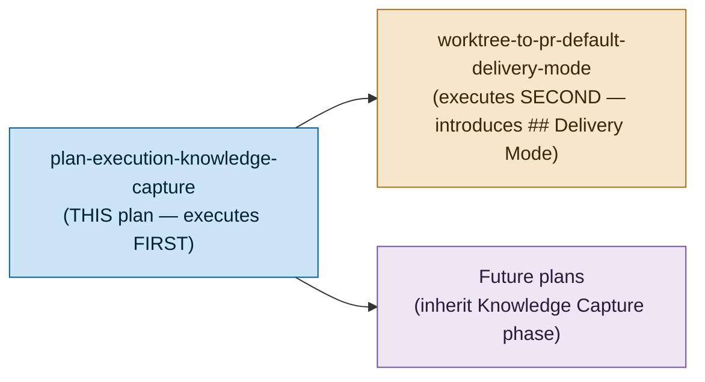
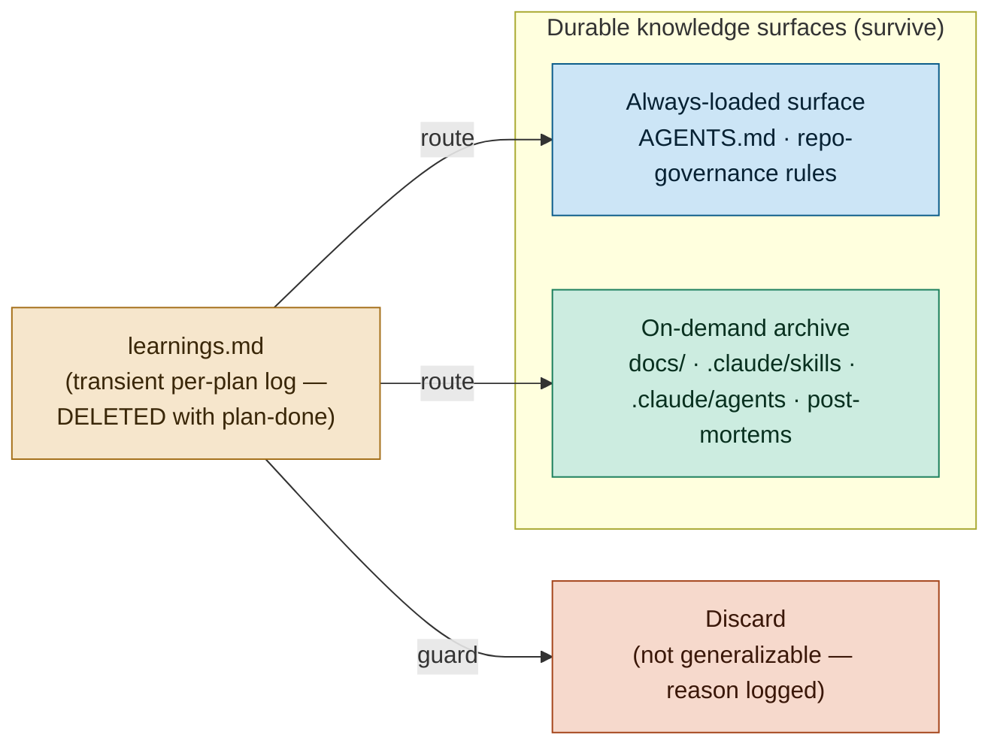

# Plan-Execution Knowledge Capture

> Make every `plan-*` workflow systematically **capture** generalizable learnings from executing a
> plan and **route** them into the codebase's durable knowledge surfaces (`docs/`,
> `repo-governance/`, `.claude/skills/`, `.claude/agents/`), so the codebase continuously evolves
> instead of relearning the same lessons.

## Context

Executing a plan generates knowledge — a sharper way to phrase a convention, a repeated papercut
worth a lint rule, a workflow step everyone forgets, a fact worth documenting. Today that knowledge
mostly evaporates. There is no systematic harvest step, so the same lessons get rediscovered plan
after plan. This is the classic **knowledge black-hole** anti-pattern: retrospective artifacts that
no one ever reads again.

This plan installs a lightweight, mandatory **harvest-and-route** practice across all five `plan-*`
workflows. It is deliberately **NOT** an incident post-mortem system — blameless post-mortems
already exist at
[`repo-governance/conventions/structure/post-mortems.md`](../../../repo-governance/conventions/structure/post-mortems.md)
and cover the _failure_ case. This plan harvests knowledge from **ordinary, successful** plan work
(and cross-references post-mortems for the failure branch of the triage matrix rather than
duplicating them).

The mechanism: learnings accrue during execution into a **transient** per-plan `learnings.md`; a
final **Knowledge Capture** phase (the last substantive phase before archival) triages each entry
and routes it to exactly one durable home — or discards it with a one-line reason. `learnings.md`
is scaffolding only; everything worth keeping must land in a durable surface **before** archival.

## Scope

**In scope** (identical governance change applied to all three repos):

- A NEW source-of-truth convention: `repo-governance/development/quality/knowledge-capture.md`.
- The capture machinery emitted into every authored plan by the plan-creating skill and `plan-maker`.
- References to the convention from all five `plan-*` workflows.
- Enforcement by the `plan-checker` and `plan-execution-checker` agents (prose instructions).
- Scaffolding of a missing Knowledge Capture phase by `plan-fixer`.
- Structural documentation in `plans.md`, a cross-reference in `post-mortems.md`, a pointer in
  `AGENTS.md`, and re-synced platform bindings (`.opencode/`, `.amazonq/`).

**Out of scope**:

- New `rhino-cli` validators or any code enforcement — enforcement is via **agent checkers**
  (prose), not new Rust code. (A structural validator is flagged as an Open Question in
  `tech-docs.md`, not assumed.)
- Incident post-mortems themselves (already covered; only cross-referenced here).
- Any app (`apps/`) or library (`libs/`) source, or any UI. This is a pure docs/governance change.

**Repos affected**: `ose-public` (authoring repo), `ose-primer` (public, parity-linked),
`ose-infra` (private, outside the parity loop, own copies of the governance files). See
[tech-docs.md](./tech-docs.md) for per-file impact per repo.

## Document Map

| File                           | Question it answers | Contents                                                                 |
| ------------------------------ | ------------------- | ------------------------------------------------------------------------ |
| [README.md](./README.md)       | Orientation         | Context, scope, dependency position, navigation                          |
| [brd.md](./brd.md)             | WHY                 | Compounding evolution, black-hole anti-pattern, impact, roles, risks     |
| [prd.md](./prd.md)             | WHAT                | Open-ended triage rubric, two safety gates, mandatory+escape rule        |
| [tech-docs.md](./tech-docs.md) | HOW                 | Convention design, per-file impact ×3 repos, routing algorithm, rollback |
| [delivery.md](./delivery.md)   | DO                  | Phased per-repo checklist ending in the Knowledge Capture phase          |

## Dependency Position

This plan executes **first**, ahead of the sibling plan **`worktree-to-pr-default-delivery-mode`**
(which introduces the `## Delivery Mode` plan-doc concept). Because the Delivery Mode convention does
not yet exist when this plan runs, this plan does **not** reference it and carries **no**
`## Delivery Mode` section. This plan is delivered under the current default: worktree → push to
`origin main` (no PR). This is a `[Judgment call]` sequencing constraint stated by the plan author.

## Two-Surface Knowledge Model (the shape this plan installs)

Every mature knowledge practice splits into a small always-loaded instruction surface and a larger
searchable on-demand archive. `learnings.md` belongs to **neither** — it is a transient staging
buffer whose only job is to route entries **out** into one of the durable surfaces.

## Delivery Summary

- Delivered under the current default mode — worktree → push to `origin main` (no PR) — in
  `ose-public`; the identical governance change is replicated into `ose-primer` (via the parity loop)
  and `ose-infra` (private, own copies). Three repos = three worktrees, each pushed to its own
  `origin main` by `[AI]`.
- Eight phases: Phase 0 (environment + baseline) → convention authoring → workflow wiring → agents +
  skill + binding sync → `ose-primer` propagation → `ose-infra` propagation → Knowledge Capture
  (dogfooding triage) → archival. See [delivery.md](./delivery.md).

> Home prefix normalised: absolute home-directory paths in this plan's files were rewritten to a portable form (such as `~/`, `$HOME/`, or a `<placeholder>`), so captured output here is not byte-verbatim.
