# Technical Documentation — Plan-Execution Knowledge Capture

## Architecture Overview

The change is a **governance encoding**, not code. It installs one source-of-truth convention and
wires it into the four surfaces that already govern the plan lifecycle: the plan-creating skill, the
`plan-*` agents, the `plan-*` workflows, and two structural convention docs. Enforcement is by
**agent checkers reading prose**, not by new `rhino-cli` validators.

```mermaid
%% Component map: how the new convention binds into the existing plan machinery
flowchart TD
  KC["repo-governance/development/quality/<br/>knowledge-capture.md<br/>(NEW — source of truth)"]:::src
  IDX["quality/README.md<br/>(index entry)"]:::doc
  AG["AGENTS.md<br/>(pointer)"]:::doc
  PLANS["conventions/structure/plans.md<br/>(learnings.md + phase in plan structure)"]:::doc
  PM["conventions/structure/post-mortems.md<br/>(cross-ref: failures route here)"]:::doc

  SKILL[".claude/skills/plan-creating-project-plans/SKILL.md<br/>(emit phase + scaffold)"]:::agent
  MAKER[".claude/agents/plan-maker.md<br/>(author phase + scaffold)"]:::agent
  CHK[".claude/agents/plan-checker.md<br/>(MEDIUM on silent absence)"]:::agent
  ECHK[".claude/agents/plan-execution-checker.md<br/>(routing + gates before archival)"]:::agent
  FIX[".claude/agents/plan-fixer.md<br/>(scaffold missing phase)"]:::agent

  W1["workflows/plan/plan-planning.md"]:::wf
  W2["workflows/plan/plan-execution.md"]:::wf
  W3["workflows/plan/plan-quality-gate.md"]:::wf
  W4["workflows/plan/plan-multi-repo-parity-planning.md"]:::wf
  W5["workflows/plan/plan-multi-repo-parity-planning-and-execution.md"]:::wf

  KC --> IDX & AG & PLANS & PM
  KC --> SKILL & MAKER & CHK & ECHK & FIX
  KC --> W1 & W2 & W3 & W4 & W5

  classDef src fill:#cce5f6,stroke:#0b5c8a,color:#062133;
  classDef doc fill:#ccece0,stroke:#1b7f5c,color:#08301f;
  classDef agent fill:#efe6f5,stroke:#7a4f97,color:#2c1a3a;
  classDef wf fill:#f6e6cc,stroke:#a5701b,color:#3a2708;
```

## Design Decisions

| Decision                                                     | Rationale                                                                                                                          |
| ------------------------------------------------------------ | ---------------------------------------------------------------------------------------------------------------------------------- |
| One new convention as single source of truth                 | Avoids scattering the rubric across agents/workflows; every surface links to one canonical doc.                                    |
| Running log + final triage phase (not continuous routing)    | Cheap in-the-moment capture; a single forcing-function pass drains the log before archival.                                        |
| `learnings.md` is transient scaffolding, never a home        | `plans/done/*` may be pruned; nothing valuable may depend on it. Routing-out is mandatory pre-archival.                            |
| Open-ended, principle-based routing matrix incl. discard     | Route to the home that owns the knowledge (docs/rules/agents/skills/code/tests/post-mortems/…); discard is the over-capture guard. |
| Two safety gates as explicit triage steps AND checker checks | Belt-and-suspenders: prose gates for the executor, verification gates for the completion checker.                                  |
| Enforcement via agent checkers (prose), not `rhino-cli` code | Matches the judgment-heavy nature of triage; a deterministic validator cannot judge generalizability.                              |
| All three repos in one coordinated sweep                     | Keeps governance byte-parity where required; avoids drift between public repos and the private one.                                |

## The Routing Algorithm (incl. safety gates)

The convention defines this procedure for the Knowledge Capture phase. For each entry in
`learnings.md`:

1. **Litmus test.** Ask: "once routed, would the system catch this automatically next time?" If no →
   **discard** with a one-line reason. Stop.
2. **Sanitize.** Rewrite the entry to remove any secret/credential/private identifier, substituting
   `<placeholder>` tokens and stating where the real value lives.
3. **Repo-relevance gate.** Determine which repo(s) the learning pertains to.
   - Infra-private (Terraform/k3s/Proxmox/`coralpolyp`/on-prem/real hosts) → route **only** in
     `ose-infra`. NEVER `ose-public`/`ose-primer`.
   - Public governance → may route in `ose-public` and propagate to `ose-primer` via parity.
4. **Secret/sensitivity gate.** If the entry cannot be sanitized without losing its meaning →
   **discard** with reason. Otherwise keep the placeholder-sanitized form.
5. **Pick exactly one durable home** — the surface that owns that kind of knowledge. The set is
   **open-ended, including but not limited to** `repo-governance/` (rules), `docs/` (Diátaxis),
   `.claude/agents/`, `.claude/skills/`, `apps/`/`libs/` source code, tests, and
   `docs/explanation/post-mortems/` (failures).
6. **Choose timing (destination-aware).**
   - Non-code home → small edit routes **inline** in this plan/PR; large new work → `plans/backlog/`
     follow-up plan.
   - Code home (`apps/`/`libs/`/tests) → **ALWAYS** a separate `plans/backlog/` follow-up plan, **never
     inline**. Code follow-ups carry the specs/Gherkin two-path, regression-test, and TDD gates.
   - **Carve-out:** a blocker required to finish the CURRENT plan is normal inline execution (Iron Rule
     3), not a deferred learning; this timing rule governs only future-improvement learnings.
7. **Mark terminal.** Each entry ends as routed-inline (non-code only), filed-as-backlog-plan (any
   home; mandatory for code), or discarded-with-reason. Archival is blocked until all entries are
   terminal.

## Per-File Impact (identical across all three repos)

The paths below are `ose-public` paths verified in the current commit. `ose-primer` and `ose-infra`
carry their own copies of every `repo-governance/`, `.claude/`, `docs/`, and `AGENTS.md` file and
receive the identical treatment (see per-repo phases in [delivery.md](./delivery.md)).

| Path                                                                              | Change                                                                                                                                                                                                              | Verify                   |
| --------------------------------------------------------------------------------- | ------------------------------------------------------------------------------------------------------------------------------------------------------------------------------------------------------------------- | ------------------------ |
| `repo-governance/development/quality/knowledge-capture.md`                        | **NEW** — the source-of-truth convention (all elements listed below).                                                                                                                                               | `_New file_`             |
| `repo-governance/development/quality/README.md`                                   | Add an index entry linking the new convention.                                                                                                                                                                      | `[Repo-grounded]` exists |
| `repo-governance/workflows/plan/plan-execution.md`                                | Add running-log capture in the Step 2 execution loop; add the Knowledge Capture phase in Step 8 (§8 Finalization and Archival) before archival; block archival until routed/backlogged/discarded + both gates pass. | `[Repo-grounded]` exists |
| `repo-governance/workflows/plan/plan-planning.md`                                 | Note that `plan-maker` emits the Knowledge Capture phase + `learnings.md` scaffold (Step 4 Plan Creation).                                                                                                          | `[Repo-grounded]` exists |
| `repo-governance/workflows/plan/plan-quality-gate.md`                             | Reference knowledge-capture as an attention point.                                                                                                                                                                  | `[Repo-grounded]` exists |
| `repo-governance/workflows/plan/plan-multi-repo-parity-planning.md`               | Reference knowledge-capture as an attention point.                                                                                                                                                                  | `[Repo-grounded]` exists |
| `repo-governance/workflows/plan/plan-multi-repo-parity-planning-and-execution.md` | Reference knowledge-capture as an attention point.                                                                                                                                                                  | `[Repo-grounded]` exists |
| `repo-governance/conventions/structure/plans.md`                                  | Document the transient `learnings.md` file + the final Knowledge Capture phase as part of plan structure; cross-ref the new convention.                                                                             | `[Repo-grounded]` exists |
| `repo-governance/conventions/structure/post-mortems.md`                           | Add a cross-reference: failure learnings route to a post-mortem via the triage matrix.                                                                                                                              | `[Repo-grounded]` exists |
| `.claude/skills/plan-creating-project-plans/SKILL.md`                             | Emit the final Knowledge Capture phase in `delivery.md` + the `learnings.md` scaffold.                                                                                                                              | `[Repo-grounded]` exists |
| `.claude/agents/plan-maker.md`                                                    | Author the phase + `learnings.md`; describe the rubric and both safety gates.                                                                                                                                       | `[Repo-grounded]` exists |
| `.claude/agents/plan-checker.md`                                                  | Validate phase presence; MEDIUM on silent absence; explicit `none` passes.                                                                                                                                          | `[Repo-grounded]` exists |
| `.claude/agents/plan-execution-checker.md`                                        | Validate routing happened before archival (each entry routed/backlogged/discarded; both gates satisfied).                                                                                                           | `[Repo-grounded]` exists |
| `.claude/agents/plan-fixer.md`                                                    | Scaffold a missing Knowledge Capture phase.                                                                                                                                                                         | `[Repo-grounded]` exists |
| `AGENTS.md`                                                                       | Add a short pointer to the new convention in the Development Practices / Quality area.                                                                                                                              | `[Repo-grounded]` exists |
| `.opencode/**`, `.amazonq/**`                                                     | Regenerated via `npm run generate:bindings` after any `.claude/**` edit.                                                                                                                                            | Sync gate                |

### Required elements of `knowledge-capture.md`

The convention MUST define all of:

- the transient `learnings.md` running log (append during execution; committed; world-readable in
  public repos);
- the **open-ended, principle-based triage matrix** — route to the home that owns the knowledge,
  including but not limited to `repo-governance/`, `docs/`, `.claude/agents/`, `.claude/skills/`,
  `apps/`/`libs/` code, tests, and `post-mortems/`; plus the explicit **discard** noise-guard;
- the **code-routing downstream rule** — code-routed learnings attach the specs/Gherkin two-path,
  regression-test mandate, and TDD gates, and are **always** filed as a separate `plans/backlog/`
  plan (never inline), with the Iron Rule 3 carve-out for current-plan blockers;
- the **two SAFETY gates** — repo-relevance + secret/sensitivity;
- **routing timing (destination-aware)** — inline (non-code, small) + backlog (large, or any code);
- the **mandatory + explicit "none"-escape** rule;
- **exemptions** — pure-docs / trivial (mirrors specs/Gherkin exemption);
- the **anti-theater guardrails** — single named owner, lives in a tool already opened, fixed-cadence
  review; guard against both under- and over-capture;
- the **litmus** — "would the system catch this next time?";
- the **transient-log caveat** — `plans/done/*/learnings.md` may be deleted; never the system of
  record; nothing may depend on querying it later.

## Binding-Sync Requirement

`.claude/agents/*.md` and `.claude/skills/*/SKILL.md` are the source of truth; `.opencode/` and
`.amazonq/` are generated. After ANY `.claude/**` edit in a repo, run
`npm run generate:bindings` `[Repo-grounded]` (verified in `package.json`) and treat a non-clean
`git status` under `.opencode/`/`.amazonq/` as a gate failure until re-synced.

## Transient-Log Caveat (design-critical)

`plans/done/*/learnings.md` may be DELETED at any future date — `plans/done/` is not a permanent
archive. Therefore:

- `learnings.md` is **transient scaffolding only**; it must never be the system of record for
  anything valuable.
- Everything worth keeping MUST be routed to a durable home (docs / rules / skills / agents /
  post-mortems) **before** archival.
- No process introduced by this plan may rely on reading `plans/done/*/learnings.md` later. The
  convention states this explicitly and forbids any such dependency.

## Rollback

Pure additive governance change; rollback is `git revert` of the plan's commits in each repo. No data
migration, no runtime state, no build artifacts. Because enforcement is checker prose, reverting the
agent files disables enforcement immediately with no residue. `learnings.md` files created under
plans are transient and safe to delete on rollback.

## Multi-Repo Delivery Model

`ose-public` is authored in a worktree and delivered under the current default mode — commit and push
directly to `origin main` (no PR). `ose-primer` receives the identical public-governance change
through the parity loop. `ose-infra` (private, outside the parity loop) receives the identical change
directly in its own checkout, with the repo-relevance and secret/sensitivity gates emphasized because
it is where private content lives. Each repo commits and pushes independently to its own `origin main`
(they are separate git repositories at
`~/ose-projects/{ose-public,ose-primer,ose-infra}` `[Repo-grounded]`). All git-mechanical
steps (worktree add/remove, commit, push) are `[AI]` per the repo's standing rule; there is no PR and
no `[HUMAN]` merge gate in this plan.

## Dependencies

- **No dependency on `worktree-to-pr-default-delivery-mode`.** This plan executes **first**; the
  sibling plan executes afterwards. This plan carries no `## Delivery Mode` section and is delivered
  under the current default (worktree → push to `origin main`, no PR). `[Judgment call]` sequencing
  stated by the author.
- `npm run generate:bindings` — existing script `[Repo-grounded]` (`package.json`).
- The parity loop workflows — existing `[Repo-grounded]`.

## Open Questions (flagged, not assumed)

1. **Should a `rhino-cli` structural validator back the agent-checker enforcement?** The locked
   decision is enforcement via agent checkers (prose) only. A deterministic validator could cheaply
   assert _structural_ facts (e.g., "a substantive plan's `delivery.md` contains a Knowledge Capture
   phase heading OR an explicit `none` record"), but it cannot judge _generalizability_ or triage
   correctness. **Recommendation:** defer; revisit only if silent-absence findings recur often enough
   to justify a structural check. Flagged here rather than assumed. `[Unverified]` — no validator is
   authored by this plan.
2. **Should `learnings.md` be `.gitignore`d instead of committed?** Locked decision commits it (so the
   safety gates must cover a world-readable file). An alternative is to keep it untracked. Committing
   is retained for auditability of the triage trail; noted as a reversible choice. `[Judgment call]`.
