# Upgrade OpenCode Go Model Mapping to a 3-Tier Thinking/Execution/Fast Design

**Status**: Done
**Created**: 2026-07-05
**Completed**: 2026-07-05
**Authored in**: `ose-public` (this repo)
**Type**: Multi-file plan (5 documents)
**Depends on**: None

## Context

The repo's secondary platform binding (OpenCode) routes every agent's `model:` field through the
`opencode-go/` provider — OpenCode's flat-rate subscription reselling models from six Chinese AI
labs. The mapping is produced by `apps/rhino-cli/src/application/agents/converter.rs`'s
`convert_model()` function and is byte-identical across `ose-public`, `ose-primer`, and `ose-infra`
per the rhino-cli byte-identity boundary. Today it maps:

- Claude `opus`/`sonnet`/omitted (inherit) → `opencode-go/minimax-m2.7`
- Claude `haiku` → `opencode-go/glm-5`

Both IDs are now stale. Web research (2026-07-05), corroborated by a live `opencode models` CLI
check against the installed OpenCode 1.14.49 client, found:

1. **`opencode-go/glm-5` (the base, unsuffixed model) no longer exists in the live roster.** It has
   been superseded by `glm-5.1` and `glm-5.2`. The repo's current `haiku` mapping and
   `.opencode/opencode.json`'s `small_model` field both point at a retired model ID.
2. **`opencode-go/minimax-m2.7` still resolves, but is no longer close to Claude-Sonnet-tier
   capability.** Benchmarked against the current Claude reference point (Sonnet 5, released
   2026-06-30), `minimax-m2.7` trails by ~7 percentage points on SWE-bench Pro (56.22% vs 63.2%) and
   by 23 points on Terminal-Bench 2.1 (57.0% vs 80.4%).
3. **Exactly one model in the current 13-model `opencode-go` roster clears Claude Sonnet 5's tier**:
   `opencode-go/glm-5.2` (SWE-bench Pro 62.1% vs Sonnet 5's 63.2% — within self-reported measurement
   noise; Terminal-Bench 2.1 81.0% vs Sonnet 5's 80.4% — at parity or slightly above).
   `opencode-go/minimax-m3` (SWE-bench Pro 59.0%, −4.2pp vs Sonnet 5) is the closest model to
   Sonnet-5 tier **without exceeding it** — the fast-tier target (user directive, 2026-07-05).
4. **This plan uses a 3-tier design — thinking / execution / fast — not 2** (user directive,
   2026-07-05, superseding an earlier 2-tier draft): thinking (Claude `opus`) targets a model
   clearing Claude **Opus 4.8**'s tier or the closest available; execution (Claude `sonnet`/omitted)
   targets a model clearing Claude Sonnet 5's tier or the closest available; fast (Claude `haiku`)
   targets the closest model to Sonnet 5 without exceeding it. **No `opencode-go` roster model
   clears Opus 4.8's SWE-bench Pro bar (69.2%)** — `glm-5.2` (62.1%) is closest but ~7.1pp below, so
   the thinking tier collapses onto the execution tier's target, per explicit user permission
   (2026-07-05: "it is okay to use same model on multiple tiers if no other options exist").
5. **"Opus 5" — the user's initial framing for the thinking-tier bar — does not exist.**
   `web-researcher` (2026-07-05) confirmed Claude Opus 4.8 (shipped 2026-05-28) remains the current
   Opus generation; Anthropic's newest tier above Opus is **Claude Fable 5** (GA, 2026-06-09,
   SWE-bench Pro ~80.3%), which is a distinct model family, not what Claude Code's `opus` alias
   resolves to, and is out of scope per this plan's Non-Goals (no Anthropic-side model bump). This
   plan uses **Opus 4.8** as the actual thinking-tier comparison bar throughout, and documents the
   correction explicitly (`tech-docs.md`'s "Correcting 'Opus 5'" section) rather than silently
   adjusting the figure.
6. **`ose-infra`'s `.opencode/opencode.json` has already diverged** onto a different provider
   entirely — `zai-coding-plan/glm-5.1` / `zai-coding-plan/glm-5-turbo` — rather than `opencode-go/*`.
   This plan's Phase 0 investigates why before deciding whether to reconcile it.
7. **`docs/reference/ai-model-benchmarks.md` (last updated 2026-05-07) is stale on multiple fronts**:
   its OpenCode Go roster table predates `glm-5.2`/`minimax-m3`/`kimi-k2.7-code`, and its Claude
   reference point (Sonnet 4.6/Opus 4.7) is two generations behind the current Sonnet 5
   (2026-06-30)/Opus 4.8 (2026-05-28). This plan also adds pricing and a frontier/big-brand
   reference table it did not previously have (items 9-10 below).
8. **`Pi` (`pi.dev`), a genuinely provider-agnostic terminal coding-agent CLI already cataloged in
   `docs/reference/platform-bindings.md` (Status: Reserved — not yet adopted in this repo), ships a
   built-in `opencode-go` provider by that exact name** (user directive, 2026-07-05: "pi.dev will use
   the same model as our opencode go... or any 'non-ai provider specific' harness should use the same
   model as opencode too"). Web research confirmed (2026-07-05, via `web-researcher`) Pi supports a
   project-committable `.pi/settings.json` with `defaultProvider`/`defaultModel` string fields (plus
   an `enabledModels` array for manual model-cycling), and that its own model catalog lists the
   `opencode-go` marketplace models under IDs rendered as `glm-5-2` (hyphenated) rather than this
   repo's `glm-5.2` (dotted) convention. This exact string is `[Needs Verification]` — `pi` is not
   installed on this machine and no single doc example paired the provider+model literally; per
   explicit user directive (2026-07-05: "trust research, flag as Needs Verification") this plan
   ships the researched value as-is rather than gating on a local `pi` install. Of the repo's other
   cataloged Reserved/Partial harnesses (OpenAI Codex CLI, GitHub Copilot, Cursor, Windsurf,
   JetBrains Junie, Aider), research found a mix of BYOM and vendor-locked mechanisms, but **this
   plan scopes the change to Pi only** (user directive, 2026-07-05) — see Decision 4 in
   `tech-docs.md` for the full per-harness verdict and why the others are excluded.
9. **BYOM harnesses (OpenCode, Pi) must not be routed to Anthropic, OpenAI, Google, or any other
   frontier/big-brand-provider model** (user directive, 2026-07-05, extending an initial
   Anthropic-only guardrail: "for BYOM harnesses, they should also use non 'frontier' or models from
   big brands like anthropic or openai"). See `tech-docs.md` Decision 0.
10. **A separate "frontier/big-brand model reference" table was added** (user directive, 2026-07-05)
    showing current Anthropic/OpenAI/Google flagship pricing and benchmarks, purely for
    cost/capability contrast — explicitly not a candidate shortlist, since none of these models are
    available via `opencode-go` and none would be selected regardless per item 9.

Full research trail, sources, and per-model benchmark table live in `tech-docs.md`.

## Scope

**In scope:**

- Restructure `convert_model()` in `apps/rhino-cli/src/application/agents/converter.rs` (and its
  `sync_validator.rs`/`tests/agents.rs` test fixtures, and the Gherkin scenarios in
  `specs/apps/rhino/behavior/rhino-cli/gherkin/harness/agents-sync.feature`) from a 2-branch to an
  explicit **3-branch** structure: Claude `opus` (thinking tier) → `opencode-go/glm-5.2`; Claude
  `sonnet`/omitted (execution tier) → `opencode-go/glm-5.2`; Claude `haiku` (fast tier) →
  `opencode-go/minimax-m3`. The thinking and execution branches return an identical literal today —
  intentional and documented (Decision 1, `tech-docs.md`), not a bug.
- Propagate the byte-identical engine change to `ose-primer` and `ose-infra` (all three repos'
  `apps/rhino-cli/` must remain byte-identical).
- Bump `.opencode/opencode.json`'s `model` field to `opencode-go/glm-5.2` (covers both thinking and
  execution defaults) and `small_model` field to `opencode-go/minimax-m3` in all three repos,
  including investigating and (pending Phase 0 findings) reconciling `ose-infra`'s divergent
  `zai-coding-plan/*` provider onto the same targets.
- Regenerate `.opencode/agents/*.md` in all three repos via `npm run generate:bindings` (auto-derived
  output; not hand-edited).
- Refresh every doc citing the old model IDs — **in all 3 repos** (user directive, 2026-07-05;
  confirmed via direct `diff`/`grep` on 2026-07-05 that `ose-primer` and `ose-infra` each carry their
  own non-byte-identical copies of all 7 files below; `ose-primer` cites the stale
  `opencode-go/minimax-m2.7`/`opencode-go/glm-5` IDs literally in **6 of the 7**
  (`docs/reference/ai-model-benchmarks.md` has zero literal-ID hits but still needs refreshing for a
  different reason — an outdated "Last updated" date and superseded Sonnet 4.6/Opus 4.7 references,
  not literal citation of the stale model IDs), while `ose-infra` cites them in only **2 of the 7**
  (`model-selection.md`, `platform-bindings.md`) — see `tech-docs.md`'s File
  Impact tables for the exact per-file breakdown): `CLAUDE.md`, `AGENTS.md`,
  `repo-governance/development/agents/model-selection.md`,
  `repo-governance/development/agents/ai-agents.md`,
  `repo-governance/conventions/structure/governance-vendor-independence.md`,
  `docs/reference/platform-bindings.md`, and a full refresh pass of
  `docs/reference/ai-model-benchmarks.md` (current roster + current Claude Sonnet 5/Opus 4.8
  reference points + a standard-API-pricing table + a frontier/big-brand reference table) — each
  repo's own copy, not a byte-identical mirror (these are prose governance docs, not the rhino-cli
  byte-identity boundary). Exact per-repo stale-reference line numbers are recorded in
  `tech-docs.md`'s File Impact tables.
- Create `.pi/settings.json` in `ose-public` (net-new file; `.pi/` does not currently exist in any of
  the 3 repos) pinning Pi's built-in `opencode-go` provider as `defaultProvider`, the thinking/
  execution model as `defaultModel`, and both tier targets in `enabledModels` for manual cycling
  (user directive, 2026-07-05; see Decision 5 in `tech-docs.md`) — narrow scope: pin the model only,
  do not otherwise onboard or activate Pi as a harness (Confirmed Decision 6 below).

**Out of scope:**

- Changing any Claude Code (`.claude/agents/*.md`) `model:` field — this plan only changes the
  Claude→OpenCode translation target, not Claude-side tier assignments.
- Historical/dated content (e.g. `apps/ose-www/content/updates/2026-05-10-*.md`) — dated changelog
  entries document what was true at the time and are never retroactively rewritten.
- Revisiting `minimax-m3` again if a future model in the roster is found to score closer to Sonnet 5
  without exceeding it (tracked as a follow-up idea if Phase 0's re-check of
  `qwen3.7-max`/`qwen3.7-plus` benchmarks turns one up — both were checked and rejected during this
  plan's own research, see `tech-docs.md`) — this plan accepts `minimax-m3` as the fast-tier target
  even though it sits ~4pp below Sonnet-5 tier, per the explicit user tradeoff.
- Promoting `qwen3.7-max`/`qwen3.7-plus` to a thinking-tier candidate — checked during this plan's
  research and rejected: no verified benchmark evidence either clears `glm-5.2`'s score despite
  costing more (`tech-docs.md`, "Qwen3.7-Max/Plus re-checked" section).
- Any Anthropic-side Claude model bump (Opus/Sonnet/Haiku version pins) — out of scope; this plan
  only refreshes the _reference_ benchmark figures used to justify the OpenCode-side choice.
- **Routing OpenCode/Pi to an actual Anthropic, OpenAI, Google, or other frontier/big-brand-provider
  model ID (e.g. `anthropic/claude-sonnet-5`) is explicitly rejected as a solution** (user directive,
  2026-07-05) — "at least Sonnet/Opus tier" is a capability bar the target model must clear on its
  own, not an instruction to spend frontier-priced tokens. See `tech-docs.md` Decision 0.
- **Any harness other than Pi** (OpenAI Codex CLI, GitHub Copilot, Cursor, Windsurf, JetBrains Junie,
  Aider) — explicitly scoped out of this plan (user directive, 2026-07-05: "Pi only"), even though
  research found several of them are also genuinely BYOM. See `tech-docs.md` Decision 4 for the
  per-harness verdict and why each is excluded (unconfirmed wire-API compatibility, no
  repo-committable config file, agent-mode exclusion, or vendor-lock, depending on the harness).
- **Flipping Pi's `docs/reference/platform-bindings.md` catalog Status from `Reserved` to `Active`**,
  or any broader Pi onboarding (verifying it reads `AGENTS.md` correctly in this repo, testing its
  TUI, etc.) — explicitly out of scope (user directive, 2026-07-05: "narrow... leave Status:
  Reserved"). This plan only pre-seeds `.pi/settings.json`'s model pin for if/when Pi is later
  adopted; it does not itself constitute adoption.

## Approach Summary

1. **Phase 0** — Baseline: confirm live `opencode-go` roster via `opencode models`, confirm clean git
   state in all 3 repos, investigate `ose-infra`'s `zai-coding-plan` divergence (git log/blame),
   re-confirm no roster model clears Opus 4.8's bar, and re-verify the benchmark figures below are
   still current (re-run web research if plan execution starts more than ~7 days after 2026-07-05).
2. **Phase 1** — TDD the engine change in `ose-public`: RED (update the Gherkin scenarios + Rust test
   expectations to the 3-tier mapping, including a new `opus`/thinking-tier scenario and test),
   GREEN (restructure `convert_model()` to 3 explicit branches), REFACTOR.
3. **Phase 2** — Config bump + regenerate bindings in `ose-public`; verify `sync_validator` passes;
   create `.pi/settings.json` pinning Pi's `opencode-go` provider/model with `enabledModels` for
   the fast tier.
4. **Phase 3** — Docs refresh in `ose-public` (7 governance/reference docs + the benchmarks
   reference, now including a pricing table and a frontier/big-brand reference table).
5. **Phase 4** — Propagate the byte-identical engine change to `ose-primer`/`ose-infra`; bump their
   `.opencode/opencode.json`; reconcile (or explicitly leave, per Phase 0 findings) `ose-infra`'s
   provider divergence; refresh each repo's own (non-byte-identical) copies of the same 7
   governance/reference docs.
6. **Final Phase** — Cross-repo byte-identity re-verify, full quality gates, push all 3, monitor CI,
   archive.

```mermaid
%% Color Palette: Blue #0173B2 ose-public phase work, Orange #DE8F05 gate checkpoints,
%% Teal #029E73 cross-repo propagation, Gray #808080 final verification/archival
%% flowchart LR: left-to-right phase progression, since phases run in strict sequence with gates
flowchart LR
    P0["Phase 0 - Baseline, ose-public"]:::blue
    G0{"Phase 0 Gate"}:::orange
    P1["Phase 1 - TDD engine change, ose-public"]:::blue
    G1{"Phase 1 Gate"}:::orange
    P2["Phase 2 - Config, bindings, Pi model pin, ose-public"]:::blue
    G2{"Phase 2 Gate"}:::orange
    P3["Phase 3 - Docs refresh, ose-public"]:::blue
    G3{"Phase 3 Gate"}:::orange
    P4["Phase 4 - Propagate to ose-primer and ose-infra"]:::teal
    G4{"Phase 4 Gate"}:::orange
    FP["Final Phase - Verify, commit, push, monitor CI, archive - all 3 repos"]:::gray

    P0 --> G0 --> P1 --> G1 --> P2 --> G2 --> P3 --> G3 --> P4 --> G4 --> FP

    classDef blue fill:#0173B2,stroke:#000000,color:#FFFFFF,stroke-width:2px
    classDef orange fill:#DE8F05,stroke:#000000,color:#FFFFFF,stroke-width:2px
    classDef teal fill:#029E73,stroke:#000000,color:#FFFFFF,stroke-width:2px
    classDef gray fill:#808080,stroke:#000000,color:#FFFFFF,stroke-width:2px
```

## Confirmed Decisions (items 1, 3, 4 defaulted 2026-07-05 — grill questions received no user response within timeout, recommended options applied per Auto Mode guidance, open to revision on review; items 2, 5-12 explicitly set by user directive)

1. **Scope = all 3 repos** (`ose-public`, `ose-primer`, `ose-infra`), matching the existing
   rhino-cli byte-identity rule and each repo's own `.opencode/opencode.json`.
2. **3-tier mapping** (user directive, 2026-07-05, superseding an earlier 2-tier draft, which itself
   superseded an even earlier single-model-collapse draft): thinking (`opus`) → `opencode-go/glm-5.2`
   (closest available to Opus-4.8 tier; does not clear it); execution (`sonnet`/omitted) →
   `opencode-go/glm-5.2` (at/above Sonnet-5 tier); fast (`haiku`) → `opencode-go/minimax-m3` (closest
   to Sonnet-5 tier without exceeding it, ~4pp below). Explicitly permitted to collapse tiers onto
   the same model when no distinct option exists (user directive, 2026-07-05).
3. **Reconcile `ose-infra`'s divergent `zai-coding-plan/*` provider to `opencode-go/glm-5.2`** to
   match the other two repos — Phase 0 investigates the divergence's origin first so nothing is
   silently overwritten if it turns out to be a deliberate, still-valid choice.
4. **Refresh `docs/reference/ai-model-benchmarks.md` in this same plan** rather than deferring to a
   separate plan, since the model-choice justification already requires the same current-benchmark
   research this doc needs.
5. **Harness scope = Pi only** (user directive, 2026-07-05) — not Codex CLI, Copilot, Cursor,
   Windsurf, Junie, or Aider, even though research (Decision 4, `tech-docs.md`) found several of
   those are also genuinely BYOM. Confirmed via `AskUserQuestion` against 4 options; user selected
   "Pi only (Recommended)" over extending to Codex CLI or logging Junie/Aider as follow-ups.
6. **Pi scope = narrow model-pin only** (user directive, 2026-07-05) — add `.pi/settings.json`,
   leave `docs/reference/platform-bindings.md`'s Pi row at `Status: Reserved`. Confirmed via
   `AskUserQuestion`; user selected the narrow option over a full onboarding pass.
7. **Pi's `opencode-go` model-ID string is trusted from `web-researcher`'s finding, not locally
   verified** (user directive, 2026-07-05: "trust research, flag as Needs Verification") — no local
   `pi` install in this plan's Phase 0. Confirmed via `AskUserQuestion`; user selected this over
   installing `pi` locally to inspect live `/model` output.
8. **Docs refresh scope = all 3 repos, unconditionally** (user directive, 2026-07-05) —
   supersedes the Phase 0 "investigate whether ose-primer/ose-infra carry local copies" framing:
   confirmed directly (`diff`/`grep`, 2026-07-05) that both carry their own non-byte-identical copies
   of all 7 files, but `ose-primer` cites the stale model IDs literally in only 6 of the 7
   (`docs/reference/ai-model-benchmarks.md` has zero literal-ID hits — it is stale for a different
   reason, an outdated "Last updated" date and superseded Sonnet 4.6/Opus 4.7 references, not literal
   citation) — `ose-infra` cites them in just 2 of the 7 (`model-selection.md`,
   `platform-bindings.md`); see `tech-docs.md`'s File Impact
   tables for the exact per-file breakdown. Phase 0's investigation step is kept as a re-confirmation
   gate at execution time (the roster or these files could drift further between plan-authoring and
   execution), not as an open question.
9. **Benchmark comparison table includes standard (non-`opencode-go`-subscription) per-token API
   pricing** (user directive, 2026-07-05) — added alongside the existing SWE-bench Pro/Terminal-Bench
   2.1 columns in `tech-docs.md`, sourced via `web-researcher` from each model provider's own official
   pricing page, every figure carrying its retrieval/publish date (user directive, 2026-07-05).
10. **A separate frontier/big-brand model reference table** (current Anthropic/OpenAI/Google
    flagships) was added to `tech-docs.md` (user directive, 2026-07-05) — informational contrast
    only, explicitly not a candidate shortlist for this plan's target.
11. **BYOM harnesses must not route to Anthropic, OpenAI, Google, or other frontier/big-brand
    providers** (user directive, 2026-07-05) — extends the original Anthropic-only guardrail
    (Decision 0, `tech-docs.md`) to explicitly also exclude OpenAI and Google, per the user's own
    wording.
12. **"Opus 5" corrected to Opus 4.8** (user directive interpreted per `web-researcher` findings,
    2026-07-05) — no "Opus 5" model exists; Opus 4.8 is the real thinking-tier comparison bar; Claude
    Fable 5 exists as a higher tier but is out of scope and not what Claude Code's `opus` alias
    resolves to. Documented explicitly rather than silently substituted.

## Navigation

- [brd.md](./brd.md) — why this matters
- [prd.md](./prd.md) — personas, user stories, Gherkin acceptance criteria
- [tech-docs.md](./tech-docs.md) — full research trail, current-state benchmark tables, design decisions, file impact
- [delivery.md](./delivery.md) — phased execution checklist

## Related

- [Prior: adopt-opencode-go](../../done/2026-05-03__adopt-opencode-go/README.md) — the plan that
  originally introduced the `opencode-go/minimax-m2.7` + `opencode-go/glm-5` mapping this plan
  supersedes.
- `docs/reference/ai-model-benchmarks.md` — the canonical benchmark reference this plan refreshes.
- [AI Agent Model Selection Convention](../../../repo-governance/development/agents/model-selection.md)
- [Governance Vendor-Independence Convention](../../../repo-governance/conventions/structure/governance-vendor-independence.md)

> Home prefix normalised: absolute home-directory paths in this plan's files were rewritten to a portable form (such as `~/`, `$HOME/`, or a `<placeholder>`), so captured output here is not byte-verbatim.
