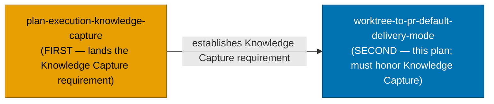
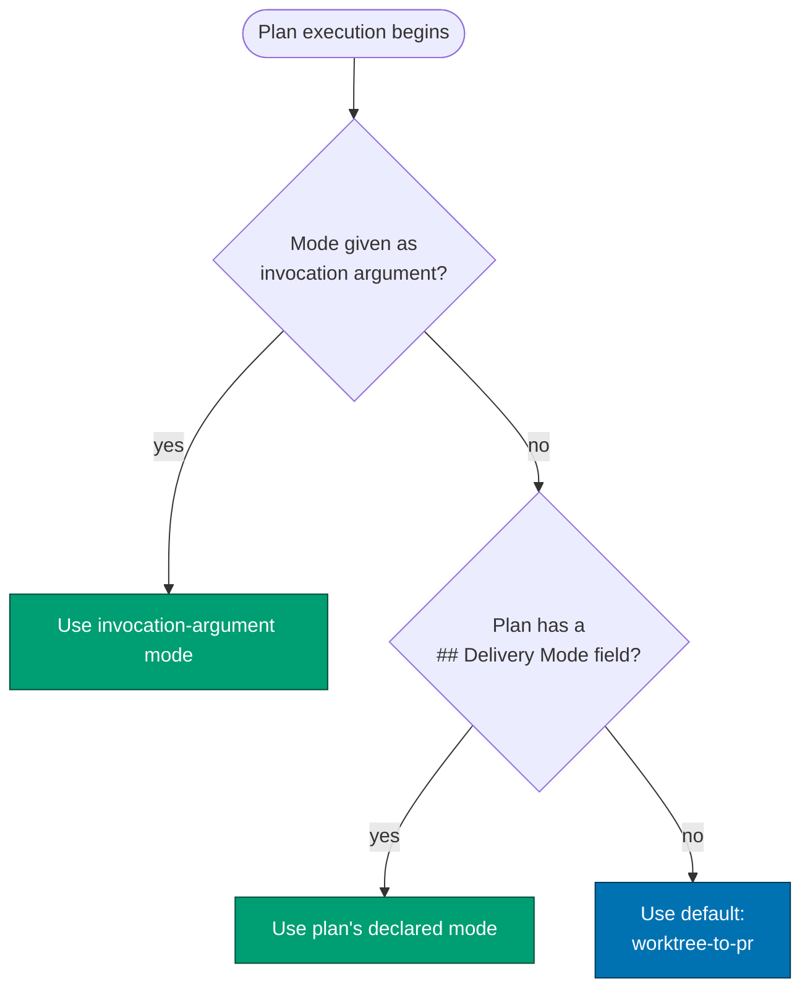

# Worktree-to-PR Default Delivery Mode

Change the DEFAULT plan-delivery mode across all three sibling repos
(`ose-public`, `ose-primer`, `ose-infra`) from the current "worktree → push to `main`" to
"worktree → Pull Request", and introduce a small named vocabulary of delivery modes with a clear
override precedence.

## Status

- **Stage**: In Progress
- **Delivery Mode**: `worktree-to-pr` (this plan dogfoods the new default)
- **Repos**: `ose-public` (canonical), `ose-primer` (parity), `ose-infra` (private, outside parity loop)

## Context

Today the repositories document a single implicit delivery posture: work happens in a git worktree
(or the `main` checkout) and commits push **directly to `origin main`** with no pull request unless
one is explicitly requested. This is captured across
[`trunk-based-development.md`](../../../repo-governance/development/workflow/trunk-based-development.md)
[Repo-grounded], [`git-push-default.md`](../../../repo-governance/development/workflow/git-push-default.md)
[Repo-grounded], and the [plan-execution workflow](../../../repo-governance/workflows/plan/plan-execution.md)
Step 0 [Repo-grounded].

This plan makes **worktree → PR** the default while keeping direct-push available as an explicitly
selectable mode. It also names four delivery modes as a closed vocabulary and defines the precedence
by which a mode is selected — mirroring the existing work-branch precedence already documented in
plan-execution Step 0 (user-at-invocation > plan docs > default).

## Scope

**In scope** — governance/docs edits (no application or library source code, no UI) across three repos:

- The delivery-mode vocabulary and precedence, added to conventions, workflows, agent definitions,
  the plan-authoring skill, and the root instruction files (`AGENTS.md`, `CLAUDE.md`).
- Reconciling Trunk-Based-Development language so worktree → PR via short-lived plan branches is
  framed as a valid TBD flavor (short-lived branches, frequent integration), not an abandonment of TBD.
- Re-sync of `.opencode/` and `.amazonq/` bindings after any `.claude/**` edit.

This plan also introduces a **PR-review maker→fixer cycle** for every `*-to-pr` mode: two new agents
(`pr-review-maker` posts strict inline review comments; `pr-review-fixer` applies/answers them) run a
sequential N-cycle loop (default 3) that drives each PR to a fully-reviewed, green, archival-included
state before the human merges. A new workflow doc
`repo-governance/workflows/pr/pr-review-quality-gate.md` defines the loop.

**Out of scope** — see [`prd.md`](./prd.md#product-scope). Notably: no new `rhino-cli` structural
validator (enforcement is via agent-checker prose), no changes to environment/deploy branches, no
retroactive rewrite of already-archived plans.

## Approach Summary

1. Author all `ose-public` content first (the canonical scaffolding source), grouped by governance
   layer: conventions → workflows (incl. the new pr-review-cycle doc + loop wiring) → agents (incl. the
   two new review agents + checker enforcement) / skill / root-instructions / bindings.
2. Replicate the identical change to `ose-primer` (parity) then `ose-infra` (private), each in its own
   worktree with its own PR; finalize each PR through the review loop, reaching the done-definition,
   then hand off to a `[HUMAN]` merge that sits **outside** the AI done-boundary.
3. Run Knowledge Capture across all repos, then **finalize the `ose-public` PR last** — it must carry
   the Knowledge-Capture edits and the archival-in-PR move — through the review loop to done, then hand
   off to the `[HUMAN]` merge. Three worktrees, three PRs total.

### Done-definition for `*-to-pr` (this plan's terminal state)

A `*-to-pr` delivery is **DONE** (for the AI) when: N review cycles complete AND every inline comment
is answered (fix or reasoned-reject) AND all PR gates are GREEN AND the plan-to-done archival is
committed **inside** the delivering PR (ose-public PR only; the plan folder lives only there). The
`[HUMAN]` merge happens **after** done, whenever the human chooses — "done" ≠ "merged".

## Documents

- [`brd.md`](./brd.md) — WHY: business/process motivation (reviewability, safer trunk, PR-based CI gating)
- [`prd.md`](./prd.md) — WHAT: the four-mode vocabulary, precedence, acceptance criteria, scope, exemptions
- [`tech-docs.md`](./tech-docs.md) — HOW: per-file impact across all three repos, precedence algorithm, rollback, open questions
- [`delivery.md`](./delivery.md) — DO: phased, per-repo checklist with gates

## Dependency Position

This plan executes **SECOND**. The sibling plan `plan-execution-knowledge-capture` executes **FIRST**;
because that plan lands the Knowledge Capture requirement (an open-ended triage rubric plus the
repo-relevance and secret/sensitivity safety gates) into the repo before this plan runs, this plan
both **depends on** it and must itself honor it — see the final Knowledge Capture phase in
[`delivery.md`](./delivery.md). This plan is still delivered via the worktree → PR mode it establishes
(dogfooding).

## Delivery-Mode Selection (at a glance)

> Home prefix normalised: absolute home-directory paths in this plan's files were rewritten to a portable form (such as `~/`, `$HOME/`, or a `<placeholder>`), so captured output here is not byte-verbatim.
