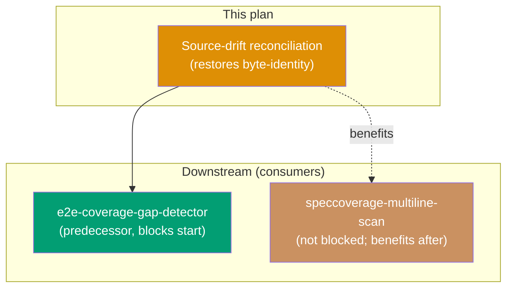

# rhino-cli Source-Drift Reconciliation (tri-repo)

## Summary

`apps/rhino-cli` is held to a **zero-carve-out byte-identity standard** across the three sibling
repos (`ose-public`, `ose-primer`, `ose-infra`) — its `src/`, `Cargo.toml`, `Cargo.lock`,
`project.json`, and `LICENSE`, plus the Gherkin behavior tree at
`specs/apps/rhino/behavior/rhino-cli/gherkin/**`, must be byte-identical, with the canonical source
carrying the **union command surface** (repo-inapplicable verbs dormant, not absent) per the
[rhino-cli Byte-Identity Boundary](../../../docs/reference/sdlc-gate-standard.md#rhino-cli-byte-identity-boundary)
`[Repo-grounded]`.

A tri-repo `diff` performed on 2026-07-17 found that this invariant is currently **violated**: four
`src/` files under the boundary have drifted between repos `[Repo-grounded: diff -rq
apps/rhino-cli/src, 2026-07-17]`. This plan reconciles them back to a single canonical (union) form
across all three repos and re-establishes byte-identity, so later rhino-cli work (notably the new
`specs e2e-coverage` subcommand) builds on a clean, identical base.

## Origin

Surfaced 2026-07-17 during the tri-repo research pass for
[`e2e-scenario-coverage-gap-detector`](../2026-07-18__e2e-scenario-coverage-gap-detector/README.md)
and [`rhino-speccoverage-multiline-scenario-scan`](../2026-07-18__rhino-speccoverage-multiline-scenario-scan/README.md).
Verifying that those plans' rhino-cli touch-points were identical across repos revealed unrelated
pre-existing drift in other `src/` files. `speccoverage/checker.rs` (the file those two plans edit)
is itself identical across all three; this plan addresses the **separate** drift they exposed
`[Repo-grounded]`.

## Drifted files (verified 2026-07-17, boundary-scoped)

| File (`apps/rhino-cli/`)                              | public↔primer | public↔infra |
| ----------------------------------------------------- | ------------- | ------------ |
| `src/application/docs/naming.rs`                      | differs       | differs      |
| `src/application/doctor/checker.rs`                   | differs       | differs      |
| `src/application/doctor/tools.rs`                     | differs       | differs      |
| `src/application/repo_governance/instruction_size.rs` | differs       | identical    |
| `tests/doctor.rs` (outside strict boundary)           | differs       | differs      |

`[Repo-grounded: diff -rq apps/rhino-cli/src, verified 2026-07-17]`

`Cargo.toml`, `Cargo.lock`, `project.json`, `LICENSE`, and the entire
`specs/apps/rhino/behavior/rhino-cli/gherkin/**` tree are **already identical** across all three
repos and are out of scope except as verification targets `[Repo-grounded]`.

## Scope note — executes before the e2e detector

This plan is a **predecessor** of
[`e2e-scenario-coverage-gap-detector`](../2026-07-18__e2e-scenario-coverage-gap-detector/README.md):
that plan adds a new rhino-cli subcommand which must be introduced byte-identically across all three
repos, so it assumes a clean, already-reconciled rhino-cli source base. Sequence: **this plan → e2e
detector**. The [`rhino-speccoverage-multiline-scenario-scan`](../2026-07-18__rhino-speccoverage-multiline-scenario-scan/README.md)
plan touches only `speccoverage/checker.rs` (already identical) and is not blocked by this plan, but
benefits from landing after it `[Repo-grounded: sibling plan READMEs explicitly name this plan as
predecessor/benefits-from]`.

## Status

Backlog — filed at execution-ready depth. Delivery Mode: `worktree-to-pr` (per repo). Operates on
all three repos via the
[Plan Multi-Repo Parity Planning workflow](../../../repo-governance/workflows/plan/plan-multi-repo-parity-planning.md).

## Document Navigation

- [brd.md](./brd.md) — business rationale: why this exists, impact, affected roles, success metrics, risks.
- [prd.md](./prd.md) — product requirements: personas, user stories, Gherkin acceptance criteria, product scope.
- [tech-docs.md](./tech-docs.md) — architecture, reconciliation approach, file impact, rollback.
- [delivery.md](./delivery.md) — phased delivery checklist, worktree, delivery mode, quality gates.
- [learnings.md](./learnings.md) — Knowledge Capture running log (populated during execution).

## Related

- [rhino-cli Byte-Identity Boundary](../../../docs/reference/sdlc-gate-standard.md#rhino-cli-byte-identity-boundary)
- [Plan Multi-Repo Parity Planning workflow](../../../repo-governance/workflows/plan/plan-multi-repo-parity-planning.md)
- [Related Repositories reference](../../../docs/reference/related-repositories.md)

> Home prefix normalised: absolute home-directory paths in this plan's files were rewritten to a portable form (such as `~/`, `$HOME/`, or a `<placeholder>`), so captured output here is not byte-verbatim.
