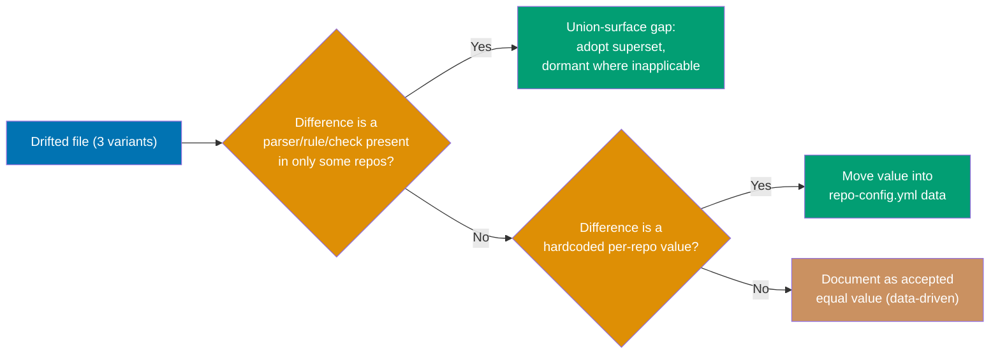
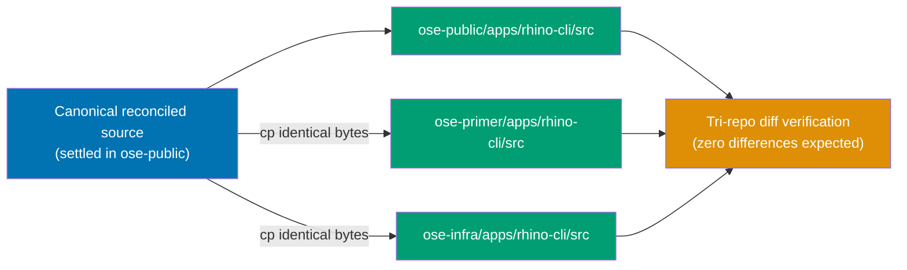

# Technical Documentation — rhino-cli Source-Drift Reconciliation

## Byte-identity boundary (authority)

Per the
[rhino-cli Byte-Identity Boundary](../../../docs/reference/sdlc-gate-standard.md#rhino-cli-byte-identity-boundary)
`[Repo-grounded]`, these are byte-identical across all three repos with **zero carve-outs**:

- `apps/rhino-cli/src/**`
- `apps/rhino-cli/{Cargo.toml, Cargo.lock, project.json, LICENSE}`
- `specs/apps/rhino/behavior/rhino-cli/gherkin/**` (every `.feature` and `README.md`)

The canonical source carries the **union command surface**: every repo's binary exposes the full
superset; a command/parser with no applicable projects in a repo is **dormant, not absent**. The only
sanctioned in-boundary divergence is the _data_ in each repo's `repo-config.yml` (different app/language
sets) — never the source itself. A `repo-config.yml` schema-parity gate already enforces an identical
key set. Files **outside** the boundary (the rhino-cli `README.md`, `dist/`, `lcov.info`, `cover.out`,
and non-gherkin `specs/apps/rhino/**` prose) may differ and are not in scope.

## Verified drift inventory (2026-07-17)

Boundary-scoped `diff -rq` over `apps/rhino-cli/src` `[Repo-grounded: diff -rq, run 2026-07-17]`:

| File                                                  | public↔primer | public↔infra | Likely nature                                                                                                               |
| ----------------------------------------------------- | ------------- | ------------ | --------------------------------------------------------------------------------------------------------------------------- |
| `src/application/docs/naming.rs`                      | differs       | differs      | naming-rule surface (investigate union vs. value) `[Judgment call]`                                                         |
| `src/application/doctor/checker.rs`                   | differs       | differs      | doctor check surface `[Judgment call]`                                                                                      |
| `src/application/doctor/tools.rs`                     | differs       | differs      | **union-surface gap** — public has extra tool parsers (`parse_clang_format_version`, OpenTofu extraction) `[Repo-grounded]` |
| `src/application/repo_governance/instruction_size.rs` | differs       | identical    | primer-only drift (investigate value vs. source) `[Judgment call]`                                                          |
| `tests/doctor.rs` (outside strict boundary)           | differs       | differs      | follows doctor source drift; reconcile or justify `[Judgment call]`                                                         |

Already **identical** across all three (verification targets only, not edit targets):
`Cargo.toml`, `Cargo.lock`, `project.json`, `LICENSE`, `speccoverage/checker.rs`, and the full
`specs/apps/rhino/behavior/rhino-cli/gherkin/**` tree `[Repo-grounded]`.

## Reconciliation approach

1. **Canonical = union.** For each drifted file, read all three variants side-by-side and construct
   the superset: every parser / naming rule / check present in any repo appears in the canonical form.
   Repo-inapplicable branches stay compiled-in but dormant (selected by `repo-config.yml` data at
   runtime), matching the existing "dormant not absent" pattern already used for cross-repo verbs.
2. **Value vs. source.** If a difference is a hardcoded per-repo value (e.g. an instruction-size
   budget), move it into `repo-config.yml` (respecting the schema-parity gate's identical-key-set
   rule) so the `.rs` source becomes identical. Confirm no new `repo-config.yml` key is unknown/omitted.
3. **Apply to all three repos.** Write the canonical form into each repo's working tree (the
   `worktree-to-pr` leg per repo), then run the tri-repo `diff` verification.
4. **Verify identity + behavior.** Boundary `diff` returns zero; rhino-cli test suites green per repo.

### Per-file classification decision branches

Each of the five drifted files is routed through the same decision tree in Phase 1; the concrete
result for each file is recorded immediately below, not pre-decided here.



### Per-file canonical decisions (concrete results, Phase 1)

> Decision-rationale content lives here per the
> [Knowledge Capture Convention](../../../repo-governance/development/quality/knowledge-capture.md)
> ("`learnings.md` is not a decision log... that is `tech-docs.md`'s job") — relocated from
> `learnings.md` during PR review after `pr-review-maker` correctly flagged the original placement
> as a convention mismatch.

- `docs/naming.rs`: **Union-surface gap.** `ose-public` (2026-07-13) adds a `_index.md` naming
  exemption for Hugo content-section pages (used by `apps/*-www` sites) plus its regression test;
  `ose-primer`/`ose-infra` (byte-identical to each other, 2026-07-03) both lack it. Canonical =
  `ose-public`'s current content — the exemption is a harmless no-op in repos without Hugo
  `_index.md` trees (dormant, not absent), matching the existing union-command-surface pattern.
- `doctor/checker.rs`: **Union-surface gap**, correlated with `doctor/tools.rs` below.
  `ose-public` (2026-07-13) adds `parse_clang_format_version` (+2 tests), a parser feeding the
  `clang-format` `ToolDef` in `tools.rs`; `ose-primer`/`ose-infra` (identical to each other,
  2026-06-15) both lack it. Canonical = `ose-public`'s current content.
- `doctor/tools.rs`: **Union-surface gap.** `ose-public` (2026-07-13) defines 3 extra formatter
  tools — `shfmt`, `tofu` (OpenTofu), `clang-format` — with install steps, `parse_tofu_version`,
  and the `tool_defs_formatters()` grouping fn wired into `build_tool_defs()` (16 tools vs. 13 in
  the siblings, identical to each other, 2026-06-15). Canonical = `ose-public`'s current content —
  repo-inapplicable tool checks stay dormant (the binaries are still checked, but absence only
  fails `doctor --fix`, and all three are already present as global machine-level tools in this
  dev environment per Phase 0 baseline).
- `repo_governance/instruction_size.rs`: **Not a union gap or a per-repo value — pure stylistic
  difference.** `ose-primer` (2026-07-04) has one test using `assert!(findings[0].path ==
"AGENTS.md")` where `ose-public` (2026-07-13) and `ose-infra` (identical to `ose-public` here)
  use `assert_eq!(findings[0].path, "AGENTS.md")` — functionally identical, `assert_eq!` gives
  better failure diagnostics. Canonical = `assert_eq!` form (majority + more idiomatic).
- `tests/doctor.rs`: **Union-surface gap, directly follows `doctor/tools.rs`.** `ose-public`
  (2026-07-13) includes fixture entries and the `tools.len() == 16` expectation for `shfmt`,
  `tofu`, `clang-format`; `ose-primer`/`ose-infra` (identical to each other, 2026-07-04) expect
  `13`. Canonical = `ose-public`'s current content, propagated in lockstep with `tools.rs` (Cycle
  3 and Cycle 5 in Phase 2 apply the same underlying feature).

Zero of the 5 decisions required moving a value into `repo-config.yml` — every difference was
either a union-surface gap (adopt `ose-public`'s superset) or a pure stylistic swap.

## Tri-repo verification command (canonical)

```bash
# From the parent dir containing all three repos (e.g. ~/ose-projects)
for pair in ose-primer ose-infra; do
  diff -rq ose-public/apps/rhino-cli/src "$pair/apps/rhino-cli/src"
  for f in Cargo.toml Cargo.lock project.json LICENSE; do
    diff -q "ose-public/apps/rhino-cli/$f" "$pair/apps/rhino-cli/$f"
  done
  diff -rq ose-public/specs/apps/rhino/behavior/rhino-cli/gherkin \
           "$pair/specs/apps/rhino/behavior/rhino-cli/gherkin"
done
# Expected: no output (zero differences) → byte-identity restored
```

## Multi-repo execution

This plan operates on all three repos with **one `worktree-to-pr` delivery leg per repo**
(`ose-public`, `ose-primer`, `ose-infra`). Because rhino-cli source is byte-identical, the canonical
reconciled files are applied identically in each repo; only the `repo-config.yml` data (and any moved
values) is repo-specific. Concrete propagation is a direct byte-for-byte application — after the
canonical form is settled in `ose-public`, each sibling receives the exact same file bytes (e.g.
`cp ose-public/apps/rhino-cli/src/application/<file> <sibling>/apps/rhino-cli/src/application/<file>`),
then a per-repo draft PR (`gh pr create --draft`) carries it — followed by the tri-repo `diff`
verification. See the concrete per-repo commands in [delivery.md Phase 2](./delivery.md).

### Component interaction: canonical source → three repos



> **Note on the parity _planning_ workflow**: the
> [Plan Multi-Repo Parity Planning workflow](../../../repo-governance/workflows/plan/plan-multi-repo-parity-planning.md)
> is a **planning-only** coordination pattern (it produces per-repo plan documents via a grilled
> deviation matrix); it is **not** the execution mechanism for propagation. This plan's actual
> propagation is the concrete byte-application + per-repo PR described above `[Repo-grounded]`.

See [Related Repositories](../../../docs/reference/related-repositories.md) — `ose-infra` is private
and not part of the public parity loop's content sync, but it **is** part of the rhino-cli
byte-identity boundary and must receive this reconciliation `[Repo-grounded]`.

## Rollback

The change is a source reconciliation with no data migration, so rollback is a clean revert:

- **Pre-merge**: close each repo's draft PR without merging; delete the per-repo worktree and branch
  (`git worktree remove …` + `git branch -D rhino-cli-source-drift-reconciliation`). No `main` is
  touched.
- **Post-merge**: revert the reconciliation commit in the affected repo(s)
  (`git revert <commit>`), which restores each repo's prior (drifted) `src/` bytes. Because the repos
  were byte-identical only _after_ this plan, a partial revert (one repo but not the others) would
  re-introduce drift — so a rollback must be applied to **all three** repos together to preserve the
  invariant, or to none. Any `repo-config.yml` keys added by this plan are reverted in the same commit.
- **Verification after rollback**: re-run the tri-repo `diff`; either it is zero (all reverted) or the
  reconciliation stays in place (none reverted). A mixed state is not a valid resting point.

## Relevant prior art

- `plans/done/2026-07-03__unify-rhino-cli-sdlc-parity/tech-docs.md` §4 "rhino-cli Source-Identity
  Standard" — the original synthesis approach and acceptance criteria for the union-surface standard
  `[Repo-grounded]`.
- The `repo-config.yml` schema-parity gate (`rhino-cli repo-config validate`, invoked as
  `cargo run --manifest-path apps/rhino-cli/Cargo.toml -- repo-config validate` — there is no global
  `rhino-cli` binary/alias in this repo `[Repo-grounded: package.json]`) — the existing mechanism
  that keeps identical source safe against per-repo data.

## Dependency ordering

Predecessor of [e2e-scenario-coverage-gap-detector](../2026-07-18__e2e-scenario-coverage-gap-detector/README.md):
that plan adds a new rhino-cli subcommand and assumes an already-identical source base. This plan
must land (all three repos identical, verified) **before** the e2e detector begins its rhino-cli work
`[Repo-grounded: sibling plan's README §Prerequisite]`.
