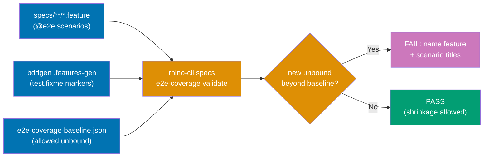
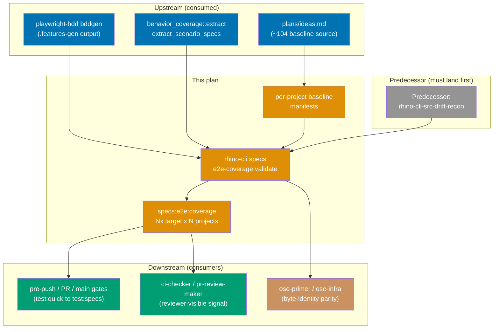

# E2E Scenario Coverage Gap Detector

## Context

`playwright-bdd`'s `missingSteps: "skip-scenario"` setting silently converts any Gherkin scenario
lacking an e2e step definition into `test.fixme`, with no `bddgen` failure and no CI failure. Nothing
in the pipeline currently compares "scenarios declared in a `.feature` file" against "scenarios
actually bound at the e2e test level" — the gap is only caught by a human or agent manually running
`bddgen` and hand-counting. This plan adds a **mechanical, baseline-aware validator** that catches
new gaps automatically.

`apps/ayokoding-www-fe-e2e/playwright.config.ts` is the only suite that sets `missingSteps` today
`[Repo-grounded]` — it uses `"skip-scenario"` project-wide to paper over ~104 pre-existing unbound
scenarios `[Repo-grounded: plans/ideas.md]`. The other ten playwright-bdd suites inherit the default
`"fail-on-gen"` `[Repo-grounded]`. The validator scopes to every project that has a playwright-bdd
suite (detected via `defineBddConfig` in its `playwright.config.ts`) so a future switch to
`"skip-scenario"` on any suite cannot reintroduce the silent gap.

## Origin

Surfaced during `plans/done/2026-07-16__ayokoding-resizable-docs-sidebar`'s PR-Review Maker→Fixer
cycle 3 (`ayokoding-www-fe-e2e`): only 3 of `resizable-panel.feature`'s 10 scenarios had e2e step
defs bound; the other 7 silently became `test.fixme`. This was the **second** occurrence of the same
root cause in the same PR — cycle 1 had already "resolved" an equivalent gap with an in-comment
justification. A documented justification did not prevent recurrence; a mechanical gate would have.
Filed per the [Knowledge Capture Convention](../../../repo-governance/development/quality/knowledge-capture.md)
code-routing rule (code-homed learnings become a backlog plan, never landed inline in the originating
plan's PR).

## Scope

**In scope:**

- A new `rhino-cli specs e2e-coverage validate` subcommand (Rust) that diffs the current per-project
  set of unbound `@e2e` scenarios against a checked-in per-project baseline manifest.
- A per-e2e-project baseline manifest file listing the currently-allowed unbound scenario titles.
- A dedicated `specs:e2e:coverage` Nx target per playwright-bdd e2e project, wired into `test:specs`
  (and therefore into pre-push, PR, and main gates via `test:quick`).
- Companion Gherkin specs for the new subcommand under `specs/apps/rhino/behavior/rhino-cli/gherkin/specs/`.
- Multi-repo parity propagation of the byte-identical `rhino-cli` source + specs to `ose-primer`
  and `ose-infra`.

**Out of scope:**

- Switching any suite from `"skip-scenario"` to `"fail-on-gen"` (that would immediately break CI on
  the ~104 pre-existing gaps and needs its own migration plan).
- Auto-generating missing step definitions.
- Burning down the existing ~104-scenario backlog (tracked separately in `plans/ideas.md`).

## Prerequisite (execution ordering)

This plan adds a **new `rhino-cli` subcommand + specs**, which must land byte-identically across
`ose-public`, `ose-primer`, and `ose-infra` per the
[rhino-cli Byte-Identity Boundary](../../../docs/reference/sdlc-gate-standard.md#rhino-cli-byte-identity-boundary).
That guarantee assumes an already-identical `rhino-cli` source base. A tri-repo `diff` on 2026-07-17
found pre-existing drift in four in-boundary `src/` files, so this plan is sequenced **after**
[`rhino-cli-source-drift-reconciliation`](../../done/2026-07-17__rhino-cli-source-drift-reconciliation/README.md)
(completed 2026-07-17, `plans/done/`), which restores byte-identity first. Do not begin this plan's
`rhino-cli` work until that predecessor's PR has merged to `main` in all three repos and its
post-merge tri-repo `diff` verification is green `[Judgment call: sequencing decided during planning]`.

## Approach Summary

The validator does not re-implement playwright-bdd's step matching. Instead it uses playwright-bdd's
own output as ground truth: the `specs:e2e:coverage` target runs `npx bddgen`, then invokes the Rust
subcommand which (1) parses the project's consumed `.feature` files for `@e2e`-tagged scenarios
(declared set), (2) scans the generated `.features-gen/**/*.spec.js` for `test.fixme(` titles
(unbound set), (3) computes the unbound-gap set, and (4) diffs it against the checked-in baseline.
A gap count that **increases** beyond baseline fails; shrinkage always passes.

## Dependency Position

## Document Navigation

- [brd.md](./brd.md) — business rationale: why this exists, impact, success metrics, risks.
- [prd.md](./prd.md) — product requirements: personas, user stories, Gherkin acceptance criteria.
- [tech-docs.md](./tech-docs.md) — architecture, design decisions, file impact, testing strategy.
- [delivery.md](./delivery.md) — phased delivery checklist, worktree, delivery mode, quality gates.
- [learnings.md](./learnings.md) — Knowledge Capture running log (populated during execution).

## Related

- [Knowledge Capture Convention](../../../repo-governance/development/quality/knowledge-capture.md)
- [BDD Spec-to-Test Mapping](../../../repo-governance/development/infra/bdd-spec-test-mapping.md)
- [Nx Target Standards](../../../repo-governance/development/infra/nx-targets.md)
- [SDLC Gate Standard — rhino-cli Byte-Identity Boundary](../../../docs/reference/sdlc-gate-standard.md#rhino-cli-byte-identity-boundary)
- [rhino-cli-source-drift-reconciliation](../../done/2026-07-17__rhino-cli-source-drift-reconciliation/README.md) — **predecessor**; restores tri-repo byte-identity before this plan's new subcommand lands. Completed 2026-07-17.
- [Related Repositories](../../../docs/reference/related-repositories.md)

> Home prefix normalised: absolute home-directory paths in this plan's files were rewritten to a portable form (such as `~/`, `$HOME/`, or a `<placeholder>`), so captured output here is not byte-verbatim.
