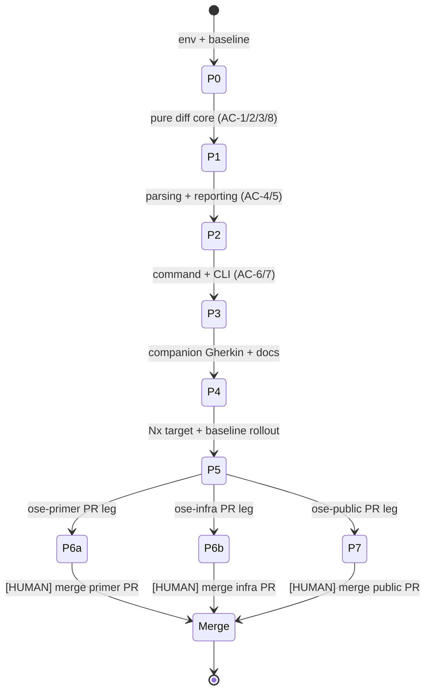

# Delivery Checklist: E2E Scenario Coverage Gap Detector

> **Legend** — `[AI]`: an agent performs the step (the default; unmarked steps are `[AI]`).
> `[HUMAN]`: only a human can do it (physical action, out-of-band approval, real-secret or
> privileged-credential handling). `[AI+HUMAN]`: agent prepares, human approves or finishes.
>
> **Phase Gate** — every phase ends with a `### Phase N Gate` (must-pass verification) plus a
> `> **Pause Safety**:` note (the safe-to-stop state and the single command to resume). A phase
> is not complete until its gate is green; do not start phase N+1 while any gate check fails.

## Worktree

Worktree path: `worktrees/e2e-scenario-coverage-gap-detector/`

Optional manual pre-provisioning (run from repo root):

```bash
claude --worktree e2e-scenario-coverage-gap-detector
```

The plan-execution Step 0 gate enters this worktree by default: it auto-provisions from the latest
`origin/main` when missing, syncs with `origin/main` before implementing, and prompts before deleting
the worktree after the plan is archived and pushed.

See [Worktree Path Convention](../../../repo-governance/conventions/structure/worktree-path.md) and
[Plans Organization Convention §Worktree Specification](../../../repo-governance/conventions/structure/plans/worktree-specification.md#worktree-specification).

## Delivery Mode: worktree-to-pr

Work happens in `worktrees/e2e-scenario-coverage-gap-detector/`; integration target is a draft PR
against `main`; the final PR merge is `[HUMAN]`. Per this mode, the finalization phase runs the
**PR-Review Maker→Fixer Cycle** (default 3 sequential CI-gated cycles) before the `[HUMAN]` merge.
Pushing to the PR branch is `[AI]`; only the merge to `main` is `[HUMAN]`.

See [Plans Organization Convention §Delivery Mode](../../../repo-governance/conventions/structure/plans/delivery-mode-the-four-modes.md#delivery-mode)
and [PR Review Quality Gate workflow](../../../repo-governance/workflows/pr/pr-review-quality-gate.md).

## Multi-Repo rhino-cli Delivery

This plan changes `rhino-cli` (a new subcommand) and adds companion Gherkin specs — both inside the
[rhino-cli byte-identity boundary](../../../docs/reference/sdlc-gate-standard.md#rhino-cli-byte-identity-boundary).
Per that boundary, the change lands **byte-identically in all three sibling repos** — `ose-public`,
`ose-primer`, `ose-infra` — and **each repo goes through its own complete delivery**: its own
worktree, its own draft PR, its own 3-cycle `pr-review-maker` → `pr-review-fixer` review, its own
local + CI quality gates green, and its own `[HUMAN]` merge. This is **three peer PRs**, each
independently reviewed and gated — not "one `ose-public` PR plus side-propagation to the siblings."
No sibling repo's change is considered delivered until that repo's own PR has cleared its own review
cycle and gates.

- **Phase 6** (`6a`/`6b`) covers the `ose-primer` and `ose-infra` legs.
- **Phase 7** covers the `ose-public` leg, which additionally carries Knowledge Capture and the
  plan-folder archival (the plan folder lives only in `ose-public`).

Each leg mirrors the per-repo plan-execution model of the
[Plan Multi-Repo Parity Planning and Execution workflow](../../../repo-governance/workflows/plan/plan-multi-repo-parity-planning-and-execution.md)
— every repo independently resolving `worktree-to-pr` → 3-cycle review + gates + `[HUMAN]` merge —
applied directly in this plan's own delivery checklist rather than as a separate composite
invocation, since the propagation here is a single verbatim diff with no cross-repo design deviation
to grill.

## Delivery Flow



> Each of `P6a`/`P6b`/`P7` independently runs apply/verify, its own draft PR, its own 3-cycle
> `pr-review-maker` → `pr-review-fixer` review, and its own local + CI quality gates before that
> repo's `[HUMAN]` merge — see [Multi-Repo rhino-cli Delivery](#multi-repo-rhino-cli-delivery) above.

---

## Phase 0: Environment Setup and Baseline

> _Executor: repo-setup-manager_

- [x] [AI] **Predecessor gate** — confirm [`rhino-cli-source-drift-reconciliation`](../../done/2026-07-17__rhino-cli-source-drift-reconciliation/README.md)
      has landed (rhino-cli byte-identity restored) before starting any rhino-cli work: from the
      parent dir of the three repos, run
      `for p in ose-primer ose-infra; do diff -rq ose-public/apps/rhino-cli/src "$p/apps/rhino-cli/src"; done`
      — acceptance: **zero output** (rhino-cli `src/` byte-identical across all three repos); if drift
      remains, stop and complete the predecessor plan first
- [x] [AI] Confirm the worktree is entered: `git -C worktrees/e2e-scenario-coverage-gap-detector rev-parse --show-toplevel`
      — acceptance: prints the worktree path
- [x] [AI] Install dependencies in the root worktree: `npm install`
      — acceptance: exits 0, `node_modules/` synchronized
- [x] [AI] Converge the polyglot toolchain in the root worktree: `npm run doctor -- --fix`
      — acceptance: exits 0 with no unresolved drift (Rust toolchain present for `rhino-cli`)
- [x] [AI] Establish the `rhino-cli` baseline: `npx nx run rhino-cli:test:quick`
      — acceptance: pass/fail count recorded; all preexisting failures documented
- [x] [AI] Establish the affected-e2e baseline: `npx nx run ayokoding-www-fe-e2e:specs:behavior:coverage`
      — acceptance: current result recorded (the target this plan's new gate sits beside)
- [x] [AI] Resolve all preexisting failures before proceeding
      — acceptance: no preexisting failures remain unresolved
- [x] [AI] Confirm `learnings.md` exists in the plan folder (sibling to this file)
      — acceptance: `test -f plans/in-progress/e2e-scenario-coverage-gap-detector/learnings.md` exits 0

### Phase 0 Gate

> All checks below must pass before starting Phase 1.

- [x] [AI] `npm install` exited 0 and `npm run doctor -- --fix` reports no unresolved drift
- [x] [AI] `npx nx run rhino-cli:test:quick` baseline recorded and every preexisting failure resolved

> **Pause Safety**: only the local toolchain was verified and the baseline recorded — no feature
> work exists yet. Safe to stop indefinitely. To resume: re-run `npx nx run rhino-cli:test:quick`
> and confirm it is still clean.

---

## Phase 1: Pure Diff Core (`application/e2e_coverage`)

> Builds the functional core with in-memory inputs (declared set, `test.fixme` set, baseline set).
> Each cycle binds exactly one `prd.md` acceptance scenario.
> _Suggested executor: `swe-rust-dev`_

- [x] [AI] Create the module scaffold `apps/rhino-cli/src/application/e2e_coverage/{mod.rs,types.rs,diff.rs}`
      and register it in `apps/rhino-cli/src/application/mod.rs` (model after the sibling
      `application/behavior_coverage/mod.rs`)
      — command: `npx nx run rhino-cli:typecheck`
      — acceptance: `cargo check` compiles with an empty `diff` fn and `BaselineEntry {feature, scenario}` /
      `GapReport` types defined

### AC-1 — Baseline-aware first run does not fail (cycle)

- [x] [AI] **RED**: add `#[cfg(test)]` test `baseline_match_passes` in
      `apps/rhino-cli/src/application/e2e_coverage/diff.rs` asserting a declared∩fixme set equal to the
      baseline yields an empty new-gap set / pass
      — command: `cargo test --manifest-path apps/rhino-cli/Cargo.toml --lib e2e_coverage::diff::tests::baseline_match_passes`
      — acceptance: test fails to compile / fails (no `diff` logic yet) - **Gherkin (binds) →** "A project's current unbound gaps exactly match its checked-in baseline"

  ```gherkin
  Scenario: A project's current unbound gaps exactly match its checked-in baseline
    Given a playwright-bdd project whose generated output marks scenarios "A" and "B" as test.fixme
    And a baseline manifest that lists exactly scenarios "A" and "B" as allowed unbound
    When rhino-cli specs e2e-coverage validate runs for that project
    Then it passes with exit code 0
    And it reports 2 declared-but-unbound scenarios all covered by the baseline
  ```

- [x] [AI] **GREEN**: implement `diff(declared, fixme, baseline) -> GapReport` in `diff.rs` computing
      `new_gaps = (declared ∩ fixme) \ baseline`
      — command: `cargo test --manifest-path apps/rhino-cli/Cargo.toml --lib e2e_coverage::diff`
      — acceptance: `baseline_match_passes` passes; no other tests broken
- [x] [AI] **REFACTOR**: extract set operations into named helpers; keep `GapReport` fields explicit
      — command: `cargo test --manifest-path apps/rhino-cli/Cargo.toml --lib e2e_coverage::diff`
      — acceptance: all `e2e_coverage` tests still pass

### AC-2 — A new unbound scenario beyond baseline fails (cycle)

- [x] [AI] **RED**: add test `new_gap_fails_and_named` asserting a fixme scenario absent from the
      baseline appears in `new_gaps` while a baselined one does not
      — command: `cargo test --manifest-path apps/rhino-cli/Cargo.toml --lib e2e_coverage::diff::tests::new_gap_fails_and_named`
      — acceptance: test fails (new-gap detection not yet distinguishing baselined entries) - **Gherkin (binds) →** "A newly added @e2e scenario ships without a step definition"

  ```gherkin
  Scenario: A newly added @e2e scenario ships without a step definition
    Given a baseline manifest that lists exactly scenario "A" as allowed unbound
    And generated output that marks scenarios "A" and "C" as test.fixme
    When rhino-cli specs e2e-coverage validate runs for that project
    Then it fails with a non-zero exit code
    And it names scenario "C" and its containing .feature file as a new unbound gap
    And it does not report scenario "A" as a new gap
  ```

- [x] [AI] **GREEN**: ensure `diff` records `{feature, scenario}` for each new gap and a boolean
      `failed` when `new_gaps` is non-empty
      — command: `cargo test --manifest-path apps/rhino-cli/Cargo.toml --lib e2e_coverage::diff`
      — acceptance: `new_gap_fails_and_named` passes
- [x] [AI] **REFACTOR**: deduplicate the AC-1/AC-2 test fixtures into a shared `fn fixture(...)` helper
      — command: `cargo test --manifest-path apps/rhino-cli/Cargo.toml --lib e2e_coverage::diff`
      — acceptance: all `e2e_coverage` tests still pass

### AC-3 — Baseline shrinkage always passes (cycle)

- [x] [AI] **RED**: add test `shrinkage_passes_and_reports_newly_bound` asserting a baselined scenario
      no longer in the fixme set is reported as newly-bound and never fails the run
      — command: `cargo test --manifest-path apps/rhino-cli/Cargo.toml --lib e2e_coverage::diff::tests::shrinkage_passes_and_reports_newly_bound`
      — acceptance: test fails (newly-bound reporting not implemented) - **Gherkin (binds) →** "A previously-unbound scenario is now bound"

  ```gherkin
  Scenario: A previously-unbound scenario is now bound
    Given a baseline manifest that lists scenarios "A" and "B" as allowed unbound
    And generated output that marks only scenario "A" as test.fixme
    When rhino-cli specs e2e-coverage validate runs for that project
    Then it passes with exit code 0
    And it reports scenario "B" as newly bound relative to the baseline
  ```

- [x] [AI] **GREEN**: add `newly_bound = baseline \ fixme` to `GapReport`; never let it affect `failed`
      — command: `cargo test --manifest-path apps/rhino-cli/Cargo.toml --lib e2e_coverage::diff`
      — acceptance: `shrinkage_passes_and_reports_newly_bound` passes
- [x] [AI] **REFACTOR**: document each `GapReport` field with a doc comment
      — command: `cargo test --manifest-path apps/rhino-cli/Cargo.toml --lib e2e_coverage::diff`
      — acceptance: all `e2e_coverage` tests still pass

### AC-8 — Stale baseline entry is reported for pruning (cycle)

- [x] [AI] **RED**: add test `stale_baseline_entry_reported` asserting a baselined-but-no-longer-fixme
      scenario surfaces in a `stale` list while the run still passes
      — command: `cargo test --manifest-path apps/rhino-cli/Cargo.toml --lib e2e_coverage::diff::tests::stale_baseline_entry_reported`
      — acceptance: test fails (stale classification not implemented; may reuse `newly_bound` naming — assert the `stale` field) - **Gherkin (binds) →** "The baseline lists a scenario that is no longer unbound"

  ```gherkin
  Scenario: The baseline lists a scenario that is no longer unbound
    Given a baseline manifest that lists scenarios "A" and "B" as allowed unbound
    And generated output that marks only scenario "A" as test.fixme
    When rhino-cli specs e2e-coverage validate runs for that project
    Then it passes with exit code 0
    And it reports scenario "B" as a stale baseline entry that can be pruned
  ```

- [x] [AI] **GREEN**: expose the stale set (baseline entries not currently unbound) on `GapReport`
      — command: `cargo test --manifest-path apps/rhino-cli/Cargo.toml --lib e2e_coverage::diff`
      — acceptance: `stale_baseline_entry_reported` passes
- [x] [AI] **REFACTOR**: consolidate `newly_bound`/`stale` if identical in meaning; keep one named field
      — command: `cargo test --manifest-path apps/rhino-cli/Cargo.toml --lib e2e_coverage::diff`
      — acceptance: all `e2e_coverage` tests still pass

### Phase 1 Gate

> All checks below must pass before starting Phase 2.

- [x] [AI] `cargo test --manifest-path apps/rhino-cli/Cargo.toml --lib e2e_coverage::diff` — all diff-core tests pass
- [x] [AI] `npx nx run rhino-cli:typecheck` — exits 0
- [x] [AI] `npx nx run rhino-cli:lint` — exits 0

> **Pause Safety**: the pure diff core compiles and its unit tests pass; nothing is wired into the CLI
> yet, so the binary behaves exactly as before. Safe to stop. To resume:
> `cargo test --manifest-path apps/rhino-cli/Cargo.toml --lib e2e_coverage`.

---

## Phase 2: Declared Extraction, Generated-Output Scan, Reporting

> _Suggested executor: `swe-rust-dev`_

### AC-5 — Only @e2e-tagged scenarios count as declared (cycle)

- [x] [AI] **RED**: add `apps/rhino-cli/src/application/e2e_coverage/parser.rs` with test
      `declared_set_is_e2e_only` that feeds a temp `.feature` (one `@unit`-only, one `@e2e`) through the
      declared-extraction fn and asserts only the `@e2e` scenario is returned
      — command: `cargo test --manifest-path apps/rhino-cli/Cargo.toml --lib e2e_coverage::parser::tests::declared_set_is_e2e_only`
      — acceptance: test fails (parser fn not implemented) - **Gherkin (binds) →** "A test.fixme scenario that is not @e2e-tagged is ignored"

  ```gherkin
  Scenario: A test.fixme scenario that is not @e2e-tagged is ignored
    Given a scenario tagged @unit only that appears as test.fixme in the generated output
    And a baseline manifest that lists no allowed unbound scenarios
    When rhino-cli specs e2e-coverage validate runs for that project
    Then it passes with exit code 0
    And it does not report the @unit-only scenario as an unbound gap
  ```

- [x] [AI] **GREEN**: implement declared extraction by delegating to
      `crate::application::behavior_coverage::extract::extract_scenario_specs` and filtering to
      `TestLevel::E2e`
      — command: `cargo test --manifest-path apps/rhino-cli/Cargo.toml --lib e2e_coverage::parser`
      — acceptance: `declared_set_is_e2e_only` passes
- [x] [AI] **REFACTOR**: remove any duplicated tag-parsing now that extraction is reused
      — command: `cargo test --manifest-path apps/rhino-cli/Cargo.toml --lib e2e_coverage`
      — acceptance: all `e2e_coverage` tests still pass

- [x] [AI] **RED**: add test `scan_finds_test_fixme_titles` in `parser.rs` feeding a fixture
      `.spec.js` string containing `test.fixme("Title A", ...)` and `test("Title B", ...)` and asserting
      only `Title A` is returned as unbound
      — command: `cargo test --manifest-path apps/rhino-cli/Cargo.toml --lib e2e_coverage::parser::tests::scan_finds_test_fixme_titles`
      — acceptance: test fails (scan fn not implemented) - **Gherkin (underpins) →** supporting the AC-2 detection path (`test.fixme` = unbound ground truth)
- [x] [AI] **GREEN**: implement `scan_fixme_titles(spec_js: &str) -> Vec<String>` via a `regex` matching
      `test.fixme(` call titles (reuse the crate's existing `regex` dependency)
      — command: `cargo test --manifest-path apps/rhino-cli/Cargo.toml --lib e2e_coverage::parser`
      — acceptance: `scan_finds_test_fixme_titles` passes
- [x] [AI] **REFACTOR**: compile the regex once via `OnceLock`, matching the pattern in
      `behavior_coverage/extract.rs`
      — command: `cargo test --manifest-path apps/rhino-cli/Cargo.toml --lib e2e_coverage`
      — acceptance: all `e2e_coverage` tests still pass

### AC-4 — Reporting names the specific feature file and scenario title (cycle)

- [x] [AI] **RED**: add `apps/rhino-cli/src/application/e2e_coverage/reporter.rs` with test
      `text_report_names_feature_and_scenario` asserting the text report for a `GapReport` with one new
      gap contains the scenario title, the `.feature` path suffix, and an "increase of 1" delta line
      — command: `cargo test --manifest-path apps/rhino-cli/Cargo.toml --lib e2e_coverage::reporter::tests::text_report_names_feature_and_scenario`
      — acceptance: test fails (reporter not implemented) - **Gherkin (binds) →** "Output identifies each new gap by feature path and scenario title"

  ```gherkin
  Scenario: Output identifies each new gap by feature path and scenario title
    Given a new unbound scenario "Resize the sidebar by keyboard" in "resizable-panel.feature"
    When rhino-cli specs e2e-coverage validate runs and detects it as a new gap
    Then the failure output contains the scenario title "Resize the sidebar by keyboard"
    And the failure output contains the feature file path ending in "resizable-panel.feature"
    And the failure output states the delta is an increase of 1 over baseline
  ```

- [x] [AI] **GREEN**: implement `format_text`, `format_json`, `format_markdown` for `GapReport`
      (model after `commands/specs_gherkin_cardinality.rs` formatters — `status`, `schema`, `result[]`)
      — command: `cargo test --manifest-path apps/rhino-cli/Cargo.toml --lib e2e_coverage::reporter`
      — acceptance: `text_report_names_feature_and_scenario` passes
- [x] [AI] **REFACTOR**: share a `SCHEMA` const and a header helper across the three formatters
      — command: `cargo test --manifest-path apps/rhino-cli/Cargo.toml --lib e2e_coverage`
      — acceptance: all `e2e_coverage` tests still pass

### Phase 2 Gate

> All checks below must pass before starting Phase 3.

- [x] [AI] `cargo test --manifest-path apps/rhino-cli/Cargo.toml --lib e2e_coverage` — all core+parser+reporter tests pass
- [x] [AI] `npx nx run rhino-cli:typecheck` and `npx nx run rhino-cli:lint` — both exit 0

> **Pause Safety**: the full pure pipeline (extract → scan → diff → report) is tested in isolation; the
> CLI still exposes no new command, so the shipped binary is unchanged. Safe to stop. To resume:
> `cargo test --manifest-path apps/rhino-cli/Cargo.toml --lib e2e_coverage`.

---

## Phase 3: Command Wrapper + CLI Wiring

> _Suggested executor: `swe-rust-dev`_

- [x] [AI] Create `apps/rhino-cli/src/commands/specs_e2e_coverage.rs` with a Clap `ValidateArgs`
      (positional project-dir + `--features <glob>` repeatable, `--features-gen <dir>`,
      `--baseline <path>`, `--project <name>`, `--update-baseline`) and a `run(args, output_format)`
      that calls the pure core; register it in `apps/rhino-cli/src/commands/mod.rs`
      — command: `npx nx run rhino-cli:typecheck`
      — acceptance: `cargo check` compiles; module is referenced from `mod.rs`
- [x] [AI] Wire the CLI grammar in `apps/rhino-cli/src/cli.rs`: add `SpecsCommands::E2eCoverage`
      (`#[command(name = "e2e-coverage", subcommand)]`) + a `SpecsE2eCoverageCommands::Validate` leaf +
      the `dispatch_specs` arm, mirroring `BehaviorCoverage`
      — command: `cargo run --manifest-path apps/rhino-cli/Cargo.toml -- specs e2e-coverage validate --help`
      — acceptance: help text lists the new subcommand and its flags; exit code 0

### AC-6 — `--update-baseline` snapshot mode (cycle)

- [x] [AI] **RED**: add test `update_baseline_writes_current_fixme_set` in `specs_e2e_coverage.rs`
      driving `run` with `--update-baseline` against a temp fixture and asserting the written
      `e2e-coverage-baseline.json` lists the current fixme scenarios and a follow-up validate passes
      — command: `cargo test --manifest-path apps/rhino-cli/Cargo.toml --lib specs_e2e_coverage::tests::update_baseline_writes_current_fixme_set`
      — acceptance: test fails (update-baseline path not implemented) - **Gherkin (binds) →** "First-time baseline generation snapshots current unbound scenarios"

  ```gherkin
  Scenario: First-time baseline generation snapshots current unbound scenarios
    Given a project with no baseline manifest yet
    And generated output that marks scenarios "A" and "B" as test.fixme
    When rhino-cli specs e2e-coverage validate runs with the --update-baseline flag
    Then it writes a baseline manifest listing scenarios "A" and "B" as allowed unbound
    And a subsequent validate run for that project passes with exit code 0
  ```

- [x] [AI] **GREEN**: implement `--update-baseline` to serialize the current unbound set to the
      `--baseline` path via `serde_json::to_string_pretty`
      — command: `cargo test --manifest-path apps/rhino-cli/Cargo.toml --lib specs_e2e_coverage`
      — acceptance: `update_baseline_writes_current_fixme_set` passes
- [x] [AI] **REFACTOR**: extract baseline load/save into `application/e2e_coverage/types.rs` helpers
      — command: `cargo test --manifest-path apps/rhino-cli/Cargo.toml --lib e2e_coverage specs_e2e_coverage`
      — acceptance: all related tests still pass

### AC-7 — Missing generated output is a clear error (cycle)

- [x] [AI] **RED**: add test `missing_features_gen_errors` asserting `run` against an absent
      `--features-gen` dir returns a non-zero result naming the missing directory and instructing to run
      `bddgen` first
      — command: `cargo test --manifest-path apps/rhino-cli/Cargo.toml --lib specs_e2e_coverage::tests::missing_features_gen_errors`
      — acceptance: test fails (error path not implemented) - **Gherkin (binds) →** "The generated output directory is absent"

  ```gherkin
  Scenario: The generated output directory is absent
    Given a project whose .features-gen directory does not exist
    When rhino-cli specs e2e-coverage validate runs for that project
    Then it fails with a non-zero exit code
    And it reports that bddgen output was not found and must be generated first
  ```

- [x] [AI] **GREEN**: guard the scan with an explicit `.features-gen` existence check returning an
      `anyhow` error with the remediation message
      — command: `cargo test --manifest-path apps/rhino-cli/Cargo.toml --lib specs_e2e_coverage`
      — acceptance: `missing_features_gen_errors` passes
- [x] [AI] **REFACTOR**: ensure the error message is emitted on stderr via the standard `dispatch`
      `eprintln!("Error: {e}")` path (no duplicate printing)
      — command: `cargo test --manifest-path apps/rhino-cli/Cargo.toml --lib specs_e2e_coverage`
      — acceptance: all `specs_e2e_coverage` tests still pass

### Phase 3 Gate

> All checks below must pass before starting Phase 4.

- [x] [AI] `npx nx run rhino-cli:test:quick` — exits 0 (typecheck + lint + unit + coverage ≥ 90% + specs)
- [x] [AI] `cargo run --manifest-path apps/rhino-cli/Cargo.toml -- specs e2e-coverage validate --help` — lists the command

> **Pause Safety**: the new subcommand is fully wired, tested, and passes the full `rhino-cli`
> quality gate, but no Nx target or baseline manifest consumes it yet — no other project's gate has
> changed. Safe to stop. To resume: `npx nx run rhino-cli:test:quick`.

---

## Phase 4: Companion Gherkin + Documentation

> _Suggested executor: `specs-maker` for the feature file; `swe-rust-dev` for README._

### Specs & Gherkin Delivery

- [x] [AI] **RED**: add `specs/apps/rhino/behavior/rhino-cli/gherkin/specs/e2e-coverage.feature`
      (tagged `@specs-e2e-coverage`, one `@unit` scenario per prd.md AC, one primary Given/When/Then
      each) describing the new subcommand's behavior
      — command: `npx nx run rhino-cli:specs:behavior:coverage`
      — acceptance: the feature file exists; the coverage gate now sees new scenarios (fails if step
      coverage/`@covers` mapping is incomplete)
- [x] [AI] **GREEN**: ensure each new `e2e-coverage.feature` scenario is covered by a corresponding
      `#[cfg(test)]` unit test / `@covers` marker (model after how `specs/**` scenarios map to the
      Phase 1–3 tests), then re-run the gate
      — command: `npx nx run rhino-cli:specs:behavior:coverage`
      — acceptance: exits 0 (every scenario covered at the declared level)
- [x] [AI] Update `specs/apps/rhino/behavior/rhino-cli/gherkin/README.md` — add `e2e-coverage.feature`
      to the `specs` domain table with its command (`specs e2e-coverage validate`) and scenario count
      — command: `npx nx run rhino-cli:specs:structure-validation`
      — acceptance: exits 0
- [x] [AI] Run the Gherkin cardinality gate over the new feature file:
      `cargo run --manifest-path apps/rhino-cli/Cargo.toml -- specs gherkin-cardinality validate`
      — acceptance: exits 0 (one primary Given/When/Then per scenario)
- [x] [AI] Update `apps/rhino-cli/README.md` — document `specs e2e-coverage validate` (flags, exit
      codes, `--update-baseline`) alongside the other `specs` subcommands
      — command: `npm run lint:md:fix`
      — acceptance: markdown lints clean; the new subcommand is documented

### Phase 4 Gate

> All checks below must pass before starting Phase 5.

- [x] [AI] `npx nx run rhino-cli:test:quick` — exits 0 (includes `test:specs` → structure + behavior coverage)
- [x] [AI] `cargo run --manifest-path apps/rhino-cli/Cargo.toml -- specs gherkin-cardinality validate` — exits 0

> **Pause Safety**: `rhino-cli` now ships the command plus its companion specs and docs, all gates
> green, still with no consuming project wired. Safe to stop. To resume: `npx nx run rhino-cli:test:quick`.

---

## Phase 5: Nx Target + Baseline Manifest Rollout

> Roll out `specs:e2e:coverage` + a baseline manifest to every playwright-bdd e2e project. The 11
> projects are: `ayokoding-www-be-e2e`, `ayokoding-www-fe-e2e`, `organiclever-app-web-e2e`,
> `organiclever-be-e2e`, `organiclever-www-be-e2e`, `organiclever-www-fe-e2e`, `ose-app-web-e2e`,
> `ose-be-e2e`, `ose-www-be-e2e`, `ose-www-fe-e2e`, `wahidyankf-www-fe-e2e` `[Repo-grounded: grep
defineBddConfig]`.
> _Suggested executor: `swe-e2e-dev` (Playwright/e2e project config)._

- [x] [AI] For `ayokoding-www-fe-e2e` (the `skip-scenario` project): generate its baseline by running
      `npx nx run ayokoding-www-fe-e2e:install` then, in `apps/ayokoding-www-fe-e2e/`,
      `npx bddgen && cargo run --manifest-path ../../apps/rhino-cli/Cargo.toml -- specs e2e-coverage validate --project ayokoding-www-fe-e2e --features "../../specs/apps/ayokoding/behavior/ayokoding-www/gherkin/**/*.feature" --features "../../specs/libs/web-ui/behavior/gherkin/resizable-panel/resizable-panel.feature" --features-gen .features-gen --baseline e2e-coverage-baseline.json --update-baseline`
      — acceptance: `apps/ayokoding-www-fe-e2e/e2e-coverage-baseline.json` is written and lists the
      current unbound scenarios (~104 expected; record the exact count in `learnings.md`)
- [x] [AI] Add the `specs:e2e:coverage` target to `apps/ayokoding-www-fe-e2e/project.json` with
      `cache: true`, `inputs` = consumed `.feature` globs + `{projectRoot}/src/steps/**` +
      `{projectRoot}/e2e-coverage-baseline.json`, and a command that runs
      `npx bddgen && cargo run … -- specs e2e-coverage validate … --baseline e2e-coverage-baseline.json`;
      add `specs:e2e:coverage` to that project's `test:specs` `commands` array (after
      `specs:behavior:coverage`)
      — command: `npx nx run ayokoding-www-fe-e2e:specs:e2e:coverage`
      — acceptance: exits 0 (current gaps all equal the just-written baseline)
- [x] [AI] Verify the gate fires on a synthetic new gap: temporarily add an `@e2e` scenario with no
      step def to a scratch copy under `apps/ayokoding-www-fe-e2e/`, re-run
      `npx nx run ayokoding-www-fe-e2e:specs:e2e:coverage`, confirm it FAILS naming the scratch
      scenario, then revert the scratch change
      — acceptance: gate exits non-zero on the injected gap and exits 0 after revert (record evidence
      in `learnings.md`)
- [x] [AI] For each of the remaining 10 playwright-bdd projects: repeat the baseline-generation +
      target-wiring steps (each `fail-on-gen` project is expected to produce an empty
      `allowedUnbound: []` baseline and a trivially-passing gate)
      — command: `npx nx run <project>:specs:e2e:coverage` for each
      — acceptance: each exits 0; each `apps/<project>/e2e-coverage-baseline.json` exists
- [x] [AI] Confirm workspace-wide wiring: `npx nx run-many -t specs:e2e:coverage`
      — acceptance: every playwright-bdd project's gate exits 0

### Local Quality Gates (Before Push)

- [x] [AI] `npx nx affected -t typecheck` — exits 0
- [x] [AI] `npx nx affected -t lint` — exits 0
- [x] [AI] `npx nx affected -t test:quick` — exits 0
- [x] [AI] `npx nx affected -t specs:behavior:coverage` — exits 0
- [x] [AI] Fix ALL failures found — including preexisting issues not caused by these changes
      (Root Cause Orientation)
- [x] [AI] Re-run any failing checks to confirm resolution; verify zero failures before pushing

> **Important**: Fix ALL failures found during quality gates, not just those caused by these changes.
> This follows Root Cause Orientation — proactively fix preexisting errors encountered during work.
> Commit preexisting fixes separately with appropriate conventional commit messages.

### Manual CLI Verification

- [x] [AI] Run the command end-to-end and inline the output in `learnings.md`:
      `npx nx run ayokoding-www-fe-e2e:specs:e2e:coverage` (pass case) and the reverted synthetic-gap
      failure output
      — acceptance: pass case shows exit 0 + "all covered by baseline"; fail case names the feature +
      scenario and states the increase delta (this is a CLI tool — no Playwright/curl assertion applies)

### Commit Guidelines

- [x] [AI] Commit thematically, Conventional Commits (`feat(rhino-cli): add specs e2e-coverage validate`,
      `feat(e2e): wire specs:e2e:coverage gate + baselines`, `docs(rhino-cli): document e2e-coverage`)
- [x] [AI] Split rhino-cli source, e2e wiring, and docs into separate commits; preexisting fixes get
      their own commits

### Post-Push CI Verification

- [x] [AI] Commit and push to origin `e2e-scenario-coverage-gap-detector` (the PR branch)
- [x] [AI] Open a draft PR against `main` (worktree-to-pr mode)
- [x] [AI] Monitor ALL GitHub Actions workflows triggered by the push (poll every 2 min per
      [ci-monitoring](../../../repo-governance/development/workflow/ci-monitoring.md))
- [x] [AI] Verify ALL CI checks pass; if any fails, fix at root cause and push a follow-up commit;
      repeat until green — do NOT proceed while CI is red

### Phase 5 Gate

> All checks below must pass before starting Phase 6.

- [x] [AI] `npx nx run-many -t specs:e2e:coverage` — every playwright-bdd project exits 0
- [x] [AI] Every `apps/<project>-e2e/e2e-coverage-baseline.json` (11 files) exists and is committed
- [x] [AI] CI is green on the pushed PR branch

> **Pause Safety**: the gate is live across all playwright-bdd projects with committed baselines and
> green CI; the repository is coherent and merge-ready pending review. Safe to stop. To resume:
> `npx nx run-many -t specs:e2e:coverage` and check PR CI status.

---

## Phase 6: Multi-Repo rhino-cli Parity Delivery (ose-primer + ose-infra — each own full PR)

> Byte-identical propagation set (per `tech-docs.md`'s Cross-Repo File Impact and the
> [rhino-cli byte-identity boundary](../../../docs/reference/sdlc-gate-standard.md#rhino-cli-byte-identity-boundary)):
> `apps/rhino-cli/src/application/e2e_coverage/{mod,types,parser,diff,reporter}.rs` (new),
> `apps/rhino-cli/src/application/mod.rs` (edit), `apps/rhino-cli/src/commands/specs_e2e_coverage.rs`
> (new), `apps/rhino-cli/src/commands/mod.rs` (edit), `apps/rhino-cli/src/cli.rs` (edit),
> `specs/apps/rhino/behavior/rhino-cli/gherkin/specs/e2e-coverage.feature` (new), and
> `specs/apps/rhino/behavior/rhino-cli/gherkin/README.md` (edit). `Cargo.toml`/`Cargo.lock` propagate
> too if Phases 1–4 added a dependency (none anticipated per `tech-docs.md`). Per-project
> `e2e-coverage-baseline.json` manifests and each repo's `project.json` `specs:e2e:coverage` wiring
> are **repo-specific** — authored per repo, NOT part of the byte-identical set.
>
> Each of `6a`/`6b` runs the **full** apply → verify byte-identity → draft PR → 3-cycle
> `pr-review-maker`/`pr-review-fixer` review → quality gates (local + CI) sequence independently, per
> the [Multi-Repo rhino-cli Delivery](#multi-repo-rhino-cli-delivery) rule above. The `[HUMAN]` merge
> steps are collected in the **Final Merge** subsection after the Phase 6 Gate (mirroring Phase 7's
> own Final Merge placement) — see that subsection's note on why the AI done-boundary does not wait
> for the merge itself.

### 6a. ose-primer — apply, verify, draft PR, 3-cycle review, gates

- [x] [AI] Provision the ose-primer worktree:
      `git -C ~/ose-projects/ose-primer worktree add worktrees/e2e-scenario-coverage-gap-detector -b e2e-scenario-coverage-gap-detector origin/main`
      then `(cd ~/ose-projects/ose-primer/worktrees/e2e-scenario-coverage-gap-detector && npm install && npm run doctor -- --fix)`
      — acceptance: worktree dir exists and both commands exit 0
- [x] [AI] Apply the byte-identical rhino-cli source + specs files into the ose-primer worktree:

  ```bash
  OSE_PRIMER_WT=$HOME/ose-projects/ose-primer/worktrees/e2e-scenario-coverage-gap-detector
  mkdir -p "$OSE_PRIMER_WT/apps/rhino-cli/src/application/e2e_coverage" \
           "$OSE_PRIMER_WT/specs/apps/rhino/behavior/rhino-cli/gherkin/specs"
  cp apps/rhino-cli/src/application/e2e_coverage/mod.rs \
     apps/rhino-cli/src/application/e2e_coverage/types.rs \
     apps/rhino-cli/src/application/e2e_coverage/parser.rs \
     apps/rhino-cli/src/application/e2e_coverage/diff.rs \
     apps/rhino-cli/src/application/e2e_coverage/reporter.rs \
     "$OSE_PRIMER_WT/apps/rhino-cli/src/application/e2e_coverage/"
  cp apps/rhino-cli/src/application/mod.rs "$OSE_PRIMER_WT/apps/rhino-cli/src/application/mod.rs"
  cp apps/rhino-cli/src/commands/specs_e2e_coverage.rs "$OSE_PRIMER_WT/apps/rhino-cli/src/commands/specs_e2e_coverage.rs"
  cp apps/rhino-cli/src/commands/mod.rs "$OSE_PRIMER_WT/apps/rhino-cli/src/commands/mod.rs"
  cp apps/rhino-cli/src/cli.rs "$OSE_PRIMER_WT/apps/rhino-cli/src/cli.rs"
  cp specs/apps/rhino/behavior/rhino-cli/gherkin/specs/e2e-coverage.feature \
     "$OSE_PRIMER_WT/specs/apps/rhino/behavior/rhino-cli/gherkin/specs/e2e-coverage.feature"
  cp specs/apps/rhino/behavior/rhino-cli/gherkin/README.md \
     "$OSE_PRIMER_WT/specs/apps/rhino/behavior/rhino-cli/gherkin/README.md"
  ```

  — acceptance: all 9 files exist under `$OSE_PRIMER_WT`

- [x] [AI] Run the ported crate's tests in the ose-primer worktree:
      `cd "$OSE_PRIMER_WT" && cargo test --manifest-path apps/rhino-cli/Cargo.toml --lib e2e_coverage && cargo test --manifest-path apps/rhino-cli/Cargo.toml --lib specs_e2e_coverage`
      — acceptance: both exit 0
- [x] [AI] Verify byte-identity of every propagated file against `ose-public`:

  ```bash
  OSE_PRIMER_WT=$HOME/ose-projects/ose-primer/worktrees/e2e-scenario-coverage-gap-detector
  diff -rq apps/rhino-cli/src/application/e2e_coverage "$OSE_PRIMER_WT/apps/rhino-cli/src/application/e2e_coverage"
  diff apps/rhino-cli/src/application/mod.rs "$OSE_PRIMER_WT/apps/rhino-cli/src/application/mod.rs"
  diff apps/rhino-cli/src/commands/specs_e2e_coverage.rs "$OSE_PRIMER_WT/apps/rhino-cli/src/commands/specs_e2e_coverage.rs"
  diff apps/rhino-cli/src/commands/mod.rs "$OSE_PRIMER_WT/apps/rhino-cli/src/commands/mod.rs"
  diff apps/rhino-cli/src/cli.rs "$OSE_PRIMER_WT/apps/rhino-cli/src/cli.rs"
  diff specs/apps/rhino/behavior/rhino-cli/gherkin/specs/e2e-coverage.feature "$OSE_PRIMER_WT/specs/apps/rhino/behavior/rhino-cli/gherkin/specs/e2e-coverage.feature"
  diff specs/apps/rhino/behavior/rhino-cli/gherkin/README.md "$OSE_PRIMER_WT/specs/apps/rhino/behavior/rhino-cli/gherkin/README.md"
  ```

  — acceptance: zero output from every `diff` invocation (byte-identical)

- [x] [AI] Wire `ose-primer`'s own `specs:e2e:coverage` target + baseline manifests for its
      playwright-bdd e2e projects (discover via
      `grep -l defineBddConfig "$OSE_PRIMER_WT"/apps/*/playwright.config.ts`), repeating the Phase 5
      baseline-generation + target-wiring pattern per project inside `$OSE_PRIMER_WT`
      — acceptance: `cd "$OSE_PRIMER_WT" && npx nx run-many -t specs:e2e:coverage` exits 0 (or is a
      no-op if `ose-primer` has no playwright-bdd projects)
- [x] [AI] Run ose-primer's local quality gates:
      `cd "$OSE_PRIMER_WT" && npx nx affected -t typecheck lint test:quick specs:behavior:coverage specs:e2e:coverage`
      — acceptance: exits 0; fix ALL failures found, including preexisting ones (Root Cause
      Orientation)
- [x] [AI] Commit, push, and open the ose-primer draft PR:

  ```bash
  cd ~/ose-projects/ose-primer/worktrees/e2e-scenario-coverage-gap-detector
  git add apps/rhino-cli/src/application/e2e_coverage apps/rhino-cli/src/application/mod.rs \
          apps/rhino-cli/src/commands/specs_e2e_coverage.rs apps/rhino-cli/src/commands/mod.rs \
          apps/rhino-cli/src/cli.rs \
          specs/apps/rhino/behavior/rhino-cli/gherkin/specs/e2e-coverage.feature \
          specs/apps/rhino/behavior/rhino-cli/gherkin/README.md
  git commit -m "feat(rhino-cli): add specs e2e-coverage validate (parity port)"
  git add apps/*-e2e/e2e-coverage-baseline.json apps/*-e2e/project.json
  git commit -m "feat(e2e): wire specs:e2e:coverage gate + baselines"
  git push -u origin e2e-scenario-coverage-gap-detector
  gh pr create --draft --title "feat(rhino-cli): add specs e2e-coverage validate" \
    --body "Byte-identical parity port from the ose-public e2e-scenario-coverage-gap-detector plan; wires this repo's own specs:e2e:coverage baselines." \
    --base main --head e2e-scenario-coverage-gap-detector
  ```

  — acceptance: `gh pr view --json state` (run from that worktree) shows OPEN

- [x] [AI] Cycle 1 — `pr-review-maker` reviews the ose-primer PR via the GitHub Reviews API;
      `pr-review-fixer` resolves every finding and pushes to the PR branch; wait for CI green
      — acceptance: all cycle-1 findings resolved; CI green
- [x] [AI] Cycle 2 — repeat `pr-review-maker` → `pr-review-fixer` on the ose-primer PR; wait for CI
      green — acceptance: all cycle-2 findings resolved; CI green
- [x] [AI] Cycle 3 — repeat `pr-review-maker` → `pr-review-fixer` on the ose-primer PR; wait for CI
      green — acceptance: cycle-3 review returns no blocking findings; CI green
- [x] [AI] Confirm ALL quality gates green on the ose-primer PR — local:
      `cd "$OSE_PRIMER_WT" && npx nx affected -t typecheck lint test:quick specs:behavior:coverage specs:e2e:coverage`;
      CI: `gh pr checks e2e-scenario-coverage-gap-detector` (run from that worktree)
      — acceptance: local exits 0; all CI checks report passing

### 6b. ose-infra — apply, verify, draft PR, 3-cycle review, gates

- [x] [AI] Provision the ose-infra worktree:
      `git -C ~/ose-projects/ose-infra worktree add worktrees/e2e-scenario-coverage-gap-detector -b e2e-scenario-coverage-gap-detector origin/main`
      then `(cd ~/ose-projects/ose-infra/worktrees/e2e-scenario-coverage-gap-detector && npm install && npm run doctor -- --fix)`
      — acceptance: worktree dir exists and both commands exit 0
- [x] [AI] Apply the byte-identical rhino-cli source + specs files into the ose-infra worktree:

  ```bash
  OSE_INFRA_WT=$HOME/ose-projects/ose-infra/worktrees/e2e-scenario-coverage-gap-detector
  mkdir -p "$OSE_INFRA_WT/apps/rhino-cli/src/application/e2e_coverage" \
           "$OSE_INFRA_WT/specs/apps/rhino/behavior/rhino-cli/gherkin/specs"
  cp apps/rhino-cli/src/application/e2e_coverage/mod.rs \
     apps/rhino-cli/src/application/e2e_coverage/types.rs \
     apps/rhino-cli/src/application/e2e_coverage/parser.rs \
     apps/rhino-cli/src/application/e2e_coverage/diff.rs \
     apps/rhino-cli/src/application/e2e_coverage/reporter.rs \
     "$OSE_INFRA_WT/apps/rhino-cli/src/application/e2e_coverage/"
  cp apps/rhino-cli/src/application/mod.rs "$OSE_INFRA_WT/apps/rhino-cli/src/application/mod.rs"
  cp apps/rhino-cli/src/commands/specs_e2e_coverage.rs "$OSE_INFRA_WT/apps/rhino-cli/src/commands/specs_e2e_coverage.rs"
  cp apps/rhino-cli/src/commands/mod.rs "$OSE_INFRA_WT/apps/rhino-cli/src/commands/mod.rs"
  cp apps/rhino-cli/src/cli.rs "$OSE_INFRA_WT/apps/rhino-cli/src/cli.rs"
  cp specs/apps/rhino/behavior/rhino-cli/gherkin/specs/e2e-coverage.feature \
     "$OSE_INFRA_WT/specs/apps/rhino/behavior/rhino-cli/gherkin/specs/e2e-coverage.feature"
  cp specs/apps/rhino/behavior/rhino-cli/gherkin/README.md \
     "$OSE_INFRA_WT/specs/apps/rhino/behavior/rhino-cli/gherkin/README.md"
  ```

  — acceptance: all 9 files exist under `$OSE_INFRA_WT`

- [x] [AI] Run the ported crate's tests in the ose-infra worktree:
      `cd "$OSE_INFRA_WT" && cargo test --manifest-path apps/rhino-cli/Cargo.toml --lib e2e_coverage && cargo test --manifest-path apps/rhino-cli/Cargo.toml --lib specs_e2e_coverage`
      — acceptance: both exit 0
- [x] [AI] Verify byte-identity of every propagated file against `ose-public`:

  ```bash
  OSE_INFRA_WT=$HOME/ose-projects/ose-infra/worktrees/e2e-scenario-coverage-gap-detector
  diff -rq apps/rhino-cli/src/application/e2e_coverage "$OSE_INFRA_WT/apps/rhino-cli/src/application/e2e_coverage"
  diff apps/rhino-cli/src/application/mod.rs "$OSE_INFRA_WT/apps/rhino-cli/src/application/mod.rs"
  diff apps/rhino-cli/src/commands/specs_e2e_coverage.rs "$OSE_INFRA_WT/apps/rhino-cli/src/commands/specs_e2e_coverage.rs"
  diff apps/rhino-cli/src/commands/mod.rs "$OSE_INFRA_WT/apps/rhino-cli/src/commands/mod.rs"
  diff apps/rhino-cli/src/cli.rs "$OSE_INFRA_WT/apps/rhino-cli/src/cli.rs"
  diff specs/apps/rhino/behavior/rhino-cli/gherkin/specs/e2e-coverage.feature "$OSE_INFRA_WT/specs/apps/rhino/behavior/rhino-cli/gherkin/specs/e2e-coverage.feature"
  diff specs/apps/rhino/behavior/rhino-cli/gherkin/README.md "$OSE_INFRA_WT/specs/apps/rhino/behavior/rhino-cli/gherkin/README.md"
  ```

  — acceptance: zero output from every `diff` invocation (byte-identical)

- [x] [AI] Wire `ose-infra`'s own `specs:e2e:coverage` target + baseline manifests for its
      playwright-bdd e2e projects (discover via
      `grep -l defineBddConfig "$OSE_INFRA_WT"/apps/*/playwright.config.ts`), repeating the Phase 5
      baseline-generation + target-wiring pattern per project inside `$OSE_INFRA_WT`
      — acceptance: `cd "$OSE_INFRA_WT" && npx nx run-many -t specs:e2e:coverage` exits 0 (or is a
      no-op if `ose-infra` has no playwright-bdd projects)
- [x] [AI] Run ose-infra's local quality gates:
      `cd "$OSE_INFRA_WT" && npx nx affected -t typecheck lint test:quick specs:behavior:coverage specs:e2e:coverage`
      — acceptance: exits 0; fix ALL failures found, including preexisting ones (Root Cause
      Orientation)
- [x] [AI] Commit, push, and open the ose-infra draft PR:

  ```bash
  cd ~/ose-projects/ose-infra/worktrees/e2e-scenario-coverage-gap-detector
  git add apps/rhino-cli/src/application/e2e_coverage apps/rhino-cli/src/application/mod.rs \
          apps/rhino-cli/src/commands/specs_e2e_coverage.rs apps/rhino-cli/src/commands/mod.rs \
          apps/rhino-cli/src/cli.rs \
          specs/apps/rhino/behavior/rhino-cli/gherkin/specs/e2e-coverage.feature \
          specs/apps/rhino/behavior/rhino-cli/gherkin/README.md
  git commit -m "feat(rhino-cli): add specs e2e-coverage validate (parity port)"
  git add apps/*-e2e/e2e-coverage-baseline.json apps/*-e2e/project.json
  git commit -m "feat(e2e): wire specs:e2e:coverage gate + baselines"
  git push -u origin e2e-scenario-coverage-gap-detector
  gh pr create --draft --title "feat(rhino-cli): add specs e2e-coverage validate" \
    --body "Byte-identical parity port from the ose-public e2e-scenario-coverage-gap-detector plan; wires this repo's own specs:e2e:coverage baselines." \
    --base main --head e2e-scenario-coverage-gap-detector
  ```

  — acceptance: `gh pr view --json state` (run from that worktree) shows OPEN

- [x] [AI] Cycle 1 — `pr-review-maker` reviews the ose-infra PR via the GitHub Reviews API;
      `pr-review-fixer` resolves every finding and pushes to the PR branch; wait for CI green
      — acceptance: all cycle-1 findings resolved; CI green
- [x] [AI] Cycle 2 — repeat `pr-review-maker` → `pr-review-fixer` on the ose-infra PR; wait for CI
      green — acceptance: all cycle-2 findings resolved; CI green
- [x] [AI] Cycle 3 — repeat `pr-review-maker` → `pr-review-fixer` on the ose-infra PR; wait for CI
      green — acceptance: cycle-3 review returns no blocking findings; CI green
- [x] [AI] Confirm ALL quality gates green on the ose-infra PR — local:
      `cd "$OSE_INFRA_WT" && npx nx affected -t typecheck lint test:quick specs:behavior:coverage specs:e2e:coverage`;
      CI: `gh pr checks e2e-scenario-coverage-gap-detector` (run from that worktree)
      — acceptance: local exits 0; all CI checks report passing

### Phase 6 Gate

> All checks below must pass before starting Phase 7.

- [x] [AI] Byte-identity holds on both open PR branches:
      `diff -rq apps/rhino-cli/src/application/e2e_coverage ~/ose-projects/ose-primer/worktrees/e2e-scenario-coverage-gap-detector/apps/rhino-cli/src/application/e2e_coverage`
      and the equivalent path swapped for `ose-infra` — acceptance: zero output for both
- [x] [AI] Both sibling PRs completed 3 review cycles with CI green and no unresolved blocking
      findings: `gh pr view e2e-scenario-coverage-gap-detector --json statusCheckRollup` (run from
      each sibling's worktree) — acceptance: all checks green in both

> **Pause Safety**: both sibling repos' rhino-cli parity PRs are fully reviewed (3 cycles each),
> gates are green, and byte-identity is confirmed on both open PR branches. "Done" (a green,
> fully-reviewed PR handed off) is distinct from "merged" (on the maintainer's own schedule, see
> Final Merge below) — this gate does not depend on either merge having happened, and Phase 7 (the
> `ose-public` leg) proceeds independently of when the siblings are actually merged. Safe to stop. To
> resume: re-run the byte-identity `diff` commands above and re-check
> `gh pr view --json state,statusCheckRollup` from each sibling's worktree.

### Final Merge — ose-primer + ose-infra

- [x] [AI per session override] Merge the ose-primer PR to `main` — only after its 3-cycle review is
      complete and all its quality gates (local + CI) pass
      — resume signal: from `~/ose-projects/ose-primer`,
      `gh pr view e2e-scenario-coverage-gap-detector --json state --jq .state` prints `MERGED`
- [x] [AI per session override] Merge the ose-infra PR to `main` — only after its 3-cycle review is
      complete and all its quality gates (local + CI) pass
      — resume signal: from `~/ose-projects/ose-infra`,
      `gh pr view e2e-scenario-coverage-gap-detector --json state --jq .state` prints `MERGED`

---

## Phase 7: PR-Review Cycle, Knowledge Capture & Archival-in-PR (ose-public leg)

> Covers the `ose-public` leg only — Phase 6 above covers the independent `ose-primer`/`ose-infra`
> legs, which run their own 3-cycle review + gates + merge without Knowledge Capture/archival, since
> the plan folder lives only in `ose-public`. Required for `worktree-to-pr` mode before the
> `[HUMAN]` merge. Default 3 sequential CI-gated review cycles, followed by Knowledge Capture and
> Archival-in-PR — both committed and pushed to the PR branch **before** the merge, per
> [PR Review Quality Gate workflow §Done-Definition item 4](../../../repo-governance/workflows/pr/pr-review-quality-gate.md#done-definition-for--to-pr-modes)
> ("the plan-to-done archival move... is committed inside the delivering PR itself"). The `[HUMAN]`
> merge is the final step of this phase, occurring only after archival is already on the PR branch.

### PR-Review Maker→Fixer Cycle

> Ran 7 cycles total, not the default 3 — cycles 3 through 6 each surfaced a genuine new CRITICAL in
> the same failure family (a playwright-bdd/Gherkin parsing edge case producing a false PASS). The
> user explicitly flagged the overrun mid-cycle-6 and set the cap via `AskUserQuestion`: let cycle 6
> finish, one more fixer pass if needed, then hard-stop at cycle 7 and merge regardless of cycle 7's
> outcome. Cycle 7 found 2 non-blocking MEDIUM findings, both deferred per that decision — see
> `learnings.md` and the two backlog plans it routes to. See
> [PR Review Quality Gate workflow — cycle-overrun guidance](../../../repo-governance/workflows/pr/pr-review-quality-gate.md#notes)
> (added by this plan's Knowledge Capture) for the now-documented process this established.

- [x] [AI] Cycle 1 — `pr-review-maker` reviews the PR via the GitHub Reviews API; `pr-review-fixer`
      resolves every finding and pushes to the PR branch; wait for CI green
      — acceptance: all cycle-1 findings resolved; CI green
- [x] [AI] Cycle 2 — repeat `pr-review-maker` → `pr-review-fixer`; wait for CI green
      — acceptance: all cycle-2 findings resolved; CI green
- [x] [AI] Cycle 3 — repeat `pr-review-maker` → `pr-review-fixer`; wait for CI green
      — acceptance: cycle-3 review returns no blocking findings; CI green
- [x] [AI] Cycle 4 — new CRITICAL (zero-Examples Outline blindness); fixed, CI green
- [x] [AI] Cycle 5 — new CRITICAL (tag-exclusion, Scenario Template/Scenarios aliases, skip/fixme/only
      tags); fixed, CI green
- [x] [AI] Cycle 6 — new CRITICAL (comment line breaks `@e2e` tag association); fixed, CI green
- [x] [AI] Cycle 7 (final, hard-capped per user decision) — 2 non-blocking MEDIUM findings, both
      replied-to and deferred to backlog plans; no cycle 8; CI green

### Knowledge Capture

> Triage every surviving `learnings.md` entry before archival. See the
> [Knowledge Capture Convention](../../../repo-governance/development/quality/knowledge-capture.md).

- [x] [AI] Apply the litmus test to every `learnings.md` entry — keep only if a durable surface would
      catch it automatically next time; discard the rest with a one-line reason
      — acceptance: every entry has either a route or a discard reason
- [x] [AI] Apply the **secret/sensitivity gate** to every surviving entry — sanitize any secret,
      credential, token, or private hostname to a `<placeholder>` token, or discard if unsanitizable
      — acceptance: `learnings.md` contains no raw secret
- [x] [AI] Apply the **repo-relevance gate** to every surviving entry — infra-private content stays in
      `ose-infra` only and is NEVER cross-routed into `ose-public`/`ose-primer`; public-governance
      content may propagate via the existing parity loop
      — acceptance: no infra-private content appears in this repo's routed output
- [x] [AI] Route each surviving learning to exactly one durable home per the open-ended routing matrix
      — non-code homes land inline (small edit) or as a `plans/backlog/` follow-up (large); code homes
      (`apps/`, `libs/`, tests) are ALWAYS filed as a separate `plans/backlog/<slug>/` plan, NEVER inline
      — acceptance: every `learnings.md` entry records its terminal routing state
- [x] [AI] If no generalizable learning surfaced, record the explicit escape in `learnings.md`:
      `No generalizable learnings — <one-line reason>`
      — acceptance: `learnings.md` is never silently empty (N/A this phase — 4 real learnings
      surfaced and were routed; see the Triage log in `learnings.md`)

### Archival-in-PR

- [ ] [AI] Verify ALL delivery checklist items in Phases 0–7 (up to this point) are ticked
- [ ] [AI] Verify the Knowledge Capture steps above are complete — every `learnings.md` entry
      terminal or the explicit `No generalizable learnings — <reason>` escape present; both safety
      gates applied
- [ ] [AI] Verify ALL quality gates pass (local + CI): `npx nx affected -t typecheck lint test:quick`
      and `npx nx run-many -t specs:e2e:coverage`
- [ ] [AI] Verify the manual CLI verification evidence (pass + synthetic-gap fail output) is recorded
      in `learnings.md`
- [ ] [AI] Move the plan folder to done with today's completion date:
      `git mv plans/in-progress/e2e-scenario-coverage-gap-detector plans/done/YYYY-MM-DD__e2e-scenario-coverage-gap-detector`
      (use the actual completion date, NOT the 2026-07-16 creation date)
- [ ] [AI] Update `plans/backlog/README.md` — remove the plan entry
- [ ] [AI] Update `plans/done/README.md` — add the plan entry with completion date
- [ ] [AI] Update any other READMEs that reference this plan (e.g. `plans/README.md`)
- [ ] [AI] Commit the archival: `chore(plans): move e2e-scenario-coverage-gap-detector to done`
- [ ] [AI] Push the archival commit to origin `e2e-scenario-coverage-gap-detector` (the PR branch)
      — acceptance: the archival commit is on the PR's head
- [ ] [AI] Wait for CI green on the PR after the archival push — do NOT proceed to the merge step
      while CI is red

### Phase 7 Gate

> All checks below must pass — this gate is the plan's AI done-boundary and does NOT depend on the
> `[HUMAN]` merge below having happened yet.

- [ ] [AI] Three PR-review cycles completed, each ending CI-green, with no unresolved blocking findings
- [ ] [AI] Knowledge Capture is complete — every `learnings.md` entry terminal or the explicit "none"
      escape recorded; both safety gates applied
- [ ] [AI] Archival-in-PR is committed — the `git mv` to `plans/done/` plus README updates are pushed
      to the PR branch, and CI is green on that commit
- [ ] [AI] All PR quality gates are GREEN (local + CI) as of the PR's current head commit

> **Pause Safety**: the PR is a green, fully-reviewed, archival-committed, merge-ready artifact.
> "Done" (green reviewed PR with archival already committed, handed off) is distinct from "merged"
> (on the human's own schedule) — the four Phase 7 Gate checks above do not depend on the merge
> having happened. Safe to stop at any point once the gate is green. To resume: check PR review,
> archival-commit presence, and CI status; if all four gate checks are green, the only remaining
> action is the `[HUMAN]` merge below.

### Final Merge

- [ ] [HUMAN] Merge the PR to `main` — only a human performs the final merge in `worktree-to-pr` mode,
      on their own schedule, once the Phase 7 Gate above is green; by this point archival is already
      committed on the PR branch, so merging completes the move to `plans/done/` on `main` as well
      — resume signal: PR shows "Merged" and `main` CI is green
