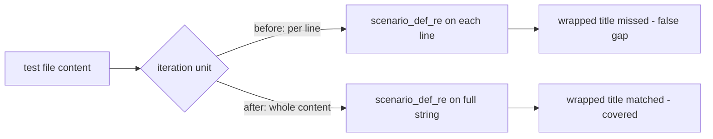

# Rhino speccoverage: multi-line `Scenario(...)` title scan

> **Plan type**: bug fix (behavior-preserving scanner correction) + hack removal.
> **Delivery Mode**: `worktree-to-pr`.
> **Stage**: backlog (`2026-07-16__` creation-date prefix retained).

## Context

`rhino`'s `speccoverage` engine extracts vitest-cucumber scenario titles **per physical line**.
`extract_ts_scenario_titles` in `apps/rhino-cli/src/application/speccoverage/checker.rs` loops
`for line in content.lines()` and applies `scenario_def_re()` to each line in isolation
[Repo-grounded — `checker.rs:613-625`]. A `Scenario(` call whose title string lands on a **different
line** than the `Scenario(` token never matches, so the scenario is falsely reported as an uncovered
gap even though its binding exists.

The defect surfaced in `plans/done/2026-07-16__web-ui-code-block-copy-button`: Prettier
(`printWidth: 120`) wrapped a long `Scenario("…long title…", (cb) => {` onto two lines, the per-line
scanner missed the title, and `specs:behavior:coverage` failed with a spurious gap. The workaround
was a fragile `// prettier-ignore` above a hand-collapsed single-line `Scenario("title",` call, still
present at two sites [Repo-grounded — `code-block.steps.tsx:155,190`, `copy-button.steps.tsx:45`].

## Scope

**In scope**

- Make `extract_ts_scenario_titles` multi-line-aware by scanning the **whole file content**
  (`captures_iter(&content)`) instead of iterating `content.lines()`.
- Add regression fixtures (unit) asserting a `Scenario(` whose title sits on the **next physical
  line** is still extracted — both **double-quoted** and **single-quoted**.
- Add a companion Gherkin scenario in the rhino-cli behavior tree
  (`specs/apps/rhino/behavior/rhino-cli/gherkin/spec-coverage/spec-coverage-validate.feature`) and
  its cucumber-rs binder in `apps/rhino-cli/tests/spec_coverage.rs`.
- Remove the two `// prettier-ignore` single-line hacks in `libs/web-ui` code-block step files and
  let Prettier re-wrap naturally, verifying coverage stays green (ose-public only).
- Propagate the byte-identical `apps/rhino-cli` change to `ose-primer` and `ose-infra`.

**Out of scope**

- Any change to the `scenario_def_re()` regex pattern text (the regex already tolerates newlines via
  `\s`; only the per-line iteration is the bug) [Repo-grounded — `checker.rs:31`].
- The whitespace-normalization alternative (explicitly rejected — see `tech-docs.md §3`).
- Any change to non-TS extractors (`extract_go_scenario_titles`, `extract_python_scenario_titles`).
- Any runtime/user-facing change to `libs/web-ui` components (only test-file formatting reverts).

## Approach summary

Mirror the sibling `step_def_re()`, which already scans across newlines, by running
`scenario_def_re().captures_iter(&content)` over the entire file string once. The `scenario_def_re()`
pattern needs no change; a `(?s)` flag may be added defensively for symmetry with `step_def_re()`
but is **functionally inert** here because the pattern contains no `.` metacharacter
[Repo-grounded — `checker.rs:31,40`].

## Document map

| Document                         | Purpose                                                           |
| -------------------------------- | ----------------------------------------------------------------- |
| [`brd.md`](./brd.md)             | WHY — business rationale, impact, risks                           |
| [`prd.md`](./prd.md)             | WHAT — user stories, Gherkin acceptance criteria, product scope   |
| [`tech-docs.md`](./tech-docs.md) | HOW — architecture, the fix, byte-identity constraint, exemptions |
| [`delivery.md`](./delivery.md)   | DO — phased execution checklist with gates                        |
| [`learnings.md`](./learnings.md) | Knowledge Capture running log (triaged before archival)           |

## Key constraint: rhino-cli byte-identity

`apps/rhino-cli` MUST remain byte-identical (zero carve-outs) across `ose-public`, `ose-primer`, and
`ose-infra`, including its Gherkin behavior tree at `specs/apps/rhino/behavior/rhino-cli/gherkin/**`
[Repo-grounded — `docs/reference/sdlc-gate-standard.md#rhino-cli-byte-identity-boundary`]. Because
this plan edits rhino-cli source, tests, and the behavior tree, a dedicated propagation phase applies
the **byte-identical files directly** into the two sibling repos (a `cp`-based port, then per-repo
verification and a draft PR — see [delivery.md Phase 3](./delivery.md)), followed by each of the
**three** repos independently running its own `pr-review-maker` → `pr-review-fixer` 3-cycle review,
confirming ALL quality gates green, and then its own `[HUMAN]` merge (see
[delivery.md's Multi-Repo rhino-cli Delivery note and Phase 4](./delivery.md)) — three peer PRs,
each independently reviewed, gated, and merged, never a single PR with side-propagation. This is not
the [multi-repo parity-planning workflow](../../../repo-governance/workflows/plan/plan-multi-repo-parity-planning.md),
which is **planning-only** (it produces per-repo plan documents, it does not execute propagation),
nor the heavier
[plan-multi-repo-parity-planning-and-execution workflow](../../../repo-governance/workflows/plan/plan-multi-repo-parity-planning-and-execution.md),
which composes planning AND execution behind its own three-grill contract for objectives that need
per-repo design-deviation grilling — unnecessary here since the change is a single verbatim diff with
no cross-repo deviation. The `libs/web-ui` hack removal is **ose-public-only** — `libs/web-ui` is
outside the byte-identity boundary.

See [Related Repositories reference](../../../docs/reference/related-repositories.md).

> Home prefix normalised: absolute home-directory paths in this plan's files were rewritten to a portable form (such as `~/`, `$HOME/`, or a `<placeholder>`), so captured output here is not byte-verbatim.
