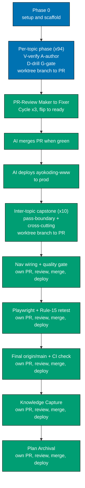

# Delivery Checklist — The Fundamentally Strong Software Engineer

This checklist is **table-referential**: the canonical topic set, per-topic pass, slug, learning
format, primary language, and weights live in the [prd.md 94-topic table](./prd.md#the-94-topics--canonical-table-spiral-order-identical-in-both-tracks) —
the single source of truth. Each per-topic phase below reads its row from that table and its concrete
items + worked examples + capstone spec from that topic's [syllabus/ file](./syllabus/). When a topic
is added/removed, edit the prd table + its syllabus file, then add or drop the matching phase here.

## Terminal Status — CLOSED (delivered-as-descoped, 2026-07-19)

This plan is **closed**. It did **not** run to its full 94-topic scope; it was deliberately
**descoped and its remainder transferred** to a successor plan. Recorded honestly so a future reader
does not mistake a 94-topic plan closed at topic 33 for abandonment.

- **DELIVERED** — **Pass 0, Pass 1, Pass 2 (Phases 0–37): topics 1–33 + their intra-topic and
  pass-boundary capstones**, authored, live, and **deployed to production** on 2026-07-19
  (`prod-ayokoding-www` @ `e21f7a212`; content under
  `apps/ayokoding-www/content/en/learn/fundamentally-strong/software-engineer/`). Phases 0–3 landed via
  `main-to-origin-main`; Phases 4–37 via `worktree-to-pr` per-phase PRs (#67–#75 et al.), each
  3-cycle-reviewed and AI-auto-merged.
- **TRANSFERRED (not abandoned)** — **Pass 3, Pass 4, Pass 5 (Phases 38–109): topics 34–94** and their
  capstones. This remaining scope is **absorbed by the successor plan**
  [`shared-course-library-and-learning-paths`](../2026-07-21__shared-course-library-and-learning-paths/README.md)
  (currently in `backlog`), which re-architects the whole curriculum into a **shared course
  library** (`/en/c/learn/courses/<course-id>`) consumed by **two path manifests** —
  `interview-ready/software-engineer` (interview-first) and `immediately-effective/software-engineer`
  (shipping-first) at `/en/c/learn/path/<path-id>`. Under the successor, topics 34–94 are authored
  **natively into the `courses/` library** (no legacy home), and topics 1–33 are re-homed there with
  redirects.
- **Phase 38–109 checklist below is retained as historical scope** — the transferred topic set and its
  per-topic detail feed the successor's reconciled course catalog. It is **not** executed under this
  plan.

## Executor Legend

- **[AI]** — an AI agent performs this step autonomously (authoring, web-research, checking,
  git-mechanical steps, committing, and pushing directly to `origin main`).
- **[HUMAN]** — only a human can perform this step (any explicit approval the user chooses to reserve).

Per repo policy, git-mechanical steps (commit, push to `origin main`) are **[AI]** under this delivery
mode. There is no PR and no human-merge gate — work lands directly on `main`.

## Worktree

**Phases 0-3 (closed, historical)**: executed in the **primary checkout** (no worktree) under
`main-to-origin-main`; content is already on `origin/main` and is not retroactively changed.

**Phases 4-109 (active)**: one shared worktree for the rest of the plan, per the standard
[Worktree Path Convention](../../../repo-governance/conventions/structure/worktree-path.md):

Worktree path: `worktrees/fundamentally-strong-software-engineer/`

Every phase branches from the **latest `origin/main`** inside this one worktree
(`git fetch origin && git checkout main && git pull && git checkout -b
fundamentally-strong-software-engineer/<phase-slug>`), does its authoring there, commits, pushes that
branch, and opens **its own draft PR**. The worktree is reused across phases — one checkout, many
branches, many PRs — instead of provisioning a fresh worktree per phase. See Parallelization Model below
for how this still allows several phases to be in flight concurrently.

See [Plans Organization Convention §Delivery Mode](../../../repo-governance/conventions/structure/plans/delivery-mode-the-four-modes.md#delivery-mode).

## Parallelization Model (Phases 4-109)

Each phase produces **its own PR**, so several phases can be **in flight concurrently** even though they
share one local worktree: once a phase's branch is committed, pushed, and its draft PR opened, the
worktree re-syncs to `origin/main` and starts the next phase's branch immediately — it does not block on
the prior phase's review cycle, merge, or deploy. The parallelism lives in GitHub (N open PRs moving
through review at once), not in N simultaneous local checkouts.

**N is not fixed by this plan.** How many phases are pipelined/in-review at once is chosen at execution
time, bounded by whatever subagent/PR-review concurrency policy is in force when the plan runs
(currently the repo-wide cap in
[Agent Workflow Orchestration](../../../repo-governance/development/agents/agent-workflow-orchestration.md),
the [Subagent Orchestration Convention](../../../repo-governance/development/agents/subagent-orchestration.md),
and the [Parallel-by-Default Practice](../../../repo-governance/development/practice/parallel-by-default.md)),
unless the user explicitly raises that cap for this plan's run.

**What's safe to pipeline**: per-topic phases within the same pass are mutually independent content-wise
(each writes only to its own `CONTENT/<slug>/` subtree) and can have their PRs open and in review
simultaneously.

**Sync points**: an inter-topic capstone phase depends on every topic in its pass being merged to `main`
first — branch it only after its prerequisite topic phases have merged, not concurrently with them.

**Shared-file contention**: every phase also updates the shared parent nav `_index.md` (auto-updated by
the content tooling). When multiple phases' PRs are open at once, whichever merges second needs a rebase
onto the just-merged `main` and a re-run of the nav-index generation before its own merge — a
mechanical, regenerable conflict, not a hand-authored one. Merges still land **serially** (one
`[HUMAN]` merge at a time) even when several PRs are open and in review concurrently.

**CI waits are non-blocking across phases**: waiting on a phase's `main-ci`/PR-checks run, or on its
review cycle, never blocks starting the _next_ phase's branch. `[AI]` opens phase N's PR, then
immediately re-syncs the worktree and starts phase N+1's branch rather than idling until phase N's CI or
review finishes — CI runs and review cycles for several phases progress **in parallel** in the
background, each polled on its own cadence (CI-monitoring policy: poll every 2 min, never `gh run
watch`, never tight-loop). This is what actually saves wall-clock time: authoring pipelines forward while
CI/review for earlier phases completes concurrently, not after.

## Delivery Mode

**Phases 0-3 (closed, historical)**: `main-to-origin-main` — primary checkout (no worktree), direct
`[AI]` push to `origin main`, no PR, no human-merge gate. Already executed; not retroactively changed.

**Phases 4-109 (active)**: `worktree-to-pr` — each phase works in the shared worktree (see Worktree
above) on its own branch, opens a **draft PR** against `main`, runs the **PR-Review Maker→Fixer Cycle**
(`pr-review-maker` / `pr-review-fixer`, 3 sequential CI-gated cycles) then flips the PR to ready, and
`[AI]` **merges it automatically once all quality gates are green** — and `[AI]` deploys `ayokoding-www`
to `prod-ayokoding-www` immediately after every merge.

> **DEVIATION FROM STANDING POLICY**: the repo's
> [PR Merge Protocol](../../../repo-governance/development/workflow/pr-merge-protocol.md) normally
> requires a `[HUMAN]` to merge every PR with explicit per-instance approval, with no blanket
> pre-authorization and no exceptions. For **this plan only**, the user explicitly instructed
> (2026-07-14, in-session) that `[AI]` merges automatically once the 3-cycle review and all quality
> gates are green, to keep ~100+ per-phase PRs flowing without a manual click on every one. This is a
> deliberate, plan-scoped override recorded here — it does **not** amend `pr-merge-protocol.md` itself,
> and does not apply to any other plan in this repo.

**Push cadence — one PR per completed phase, deployed on merge (HARD RULE)**: this plan does not batch
phases into a single PR. The moment a phase passes its gate, `[AI]` opens that phase's PR, drives it
through the review cycle, merges it once green, and deploys immediately — so each phase reaches
production independently, as it completes. This applies to **every** phase 4-109, including the
finalization phases (nav wiring, verification, knowledge capture, archival) — not just per-topic
content phases.

**Direct-to-main discipline no longer applies to Phases 4-109** (superseded by the PR flow above); it
remains historically accurate for Phases 0-3.

## Delivery pipeline (per topic, then finalization)

## Per-topic phase anatomy — one checkbox per concept and per worked example (DD-34)

Each per-topic phase below expands its authoring step into **two mirrored checkbox runs**, per the
[Worked-Example & Concept Enumeration rule (DD-34)](./prd.md#worked-example--concept-enumeration--exhaustive-per-topic-hard-rule-dd-34):

1. **Concepts first** — **one `[AI]` checkbox per enumerated concept** from that topic's
   [syllabus/ file](./syllabus/) `## Concepts` section, mirroring the syllabus `co-NN · <slug>` list
   **1:1** (same count, same slugs). Concepts are authored/verified before the examples that
   demonstrate them.
2. **Then examples** — **one `[AI]` checkbox per enumerated worked example** from the topic's
   `## Worked examples` section, grouped by the same tiers (Beginner/Intermediate/Advanced, or
   per-theme clusters for Annotated-concept / `‡` topics). Every checkbox names its colocated `code/`
   (or `artifacts/`) file and its verify command, and mirrors the syllabus `ex-NN · <slug>` list
   **1:1** (same count, same slugs). Each example checkbox cites the `co-NN` it exercises.

The phase then keeps its capstone step, checker/drill/build step (`A3/D/F/G`), `### Phase N Gate`,
per-topic commit+push block, and Pause Safety note.

## Weight Scheme (topic-first, DD-26)

`CONTENT = apps/ayokoding-www/content/en/learn/fundamentally-strong/software-engineer`.

- **Topic-slug folder** `CONTENT/<slug>/_index.md` → weight `100 + 10 × journey-index` (topic 1 = 110,
  topic 2 = 120, … topic 94 = 1040). The ×10 spacing leaves integer gaps for inter-topic capstones.
- **Learning subfolder** `CONTENT/<slug>/learning/_index.md` → weight = prd **"Learn wt"** (101..194).
- **Drilling subfolder** `CONTENT/<slug>/drilling/_index.md` → weight = prd **"Drill wt"** (201..294),
  with the parity invariant **`Drill wt = Learn wt + 100`**.
- **Intra-topic capstone** `CONTENT/<slug>/learning/capstone/_index.md` → weight **900** (sorts last
  inside `learning/`).
- **Inter-topic capstone** `CONTENT/<capstone-slug>/_index.md` → a weight in the ×10 gap after its
  junction (Pass-0 cap = 135, Pass-1 cap = 275, full-stack-app = 276, Pass-2 cap = 435, Pass-3 cap =
  705, secure-service = 706, data-pipeline = 707, Pass-4 cap = 995, concurrency-showdown = 996, Pass-5
  cap = 1045), each with colocated `code/`.
- **Section root** `CONTENT/_index.md` → weight **1750** (position in the parent `fundamentally-strong/` collection nav);
  `CONTENT/overview.md` → weight **1** (sorts first inside the section).

## Per-Topic Phase Template

Every topic phase (Phases 1, 2, …, one per canonical topic in journey order) applies these steps with
its row variables `<slug>` / `<idx>` / `<topicWt>=100+10×idx` / `<Lwt>` / `<Dwt>=Lwt+100` / `<lang>` /
`<fmt>` / `<kind>` (subject = full runnable capstone · primer = light consolidation · leadership ‡ =
design/decision artifact, no code). Every step names an explicit path, a verbatim command or agent
invocation, and a concrete acceptance criterion (execution-grade clarity).

> **HARD RULE — No-hallucination citation verification (DD-35).** Every command, code API, library
> method, CLI flag, operator, procedure name, config key, version string, RFC/standard number, and
> factual claim an author writes into any authored page MUST be verified against a **real primary
> source (official docs / the RFC or ISO text / the project's own repo) that the author actually
> fetched and read** — never recalled from memory or invented. Do not cite an API, flag, command,
> operator, or version that you have not confirmed exists in a source you read. When a fact cannot be
> verified, state the uncertainty in-text rather than presenting a guess as fact. This binds every A1 /
> A2 / D authoring step below and is enforced at step **F** by `apps-ayokoding-www-facts-checker`
> (delegating to `web-researcher`): a page citing a non-existent API/flag/command/version, or any claim
> with no readable authoritative source, is an unresolved factual finding that **blocks the phase
> gate**. See [prd.md §No-Hallucination Citation Verification (DD-35)](./prd.md#no-hallucination-citation-verification--every-cited-fact-traces-to-a-read-primary-source-hard-rule-dd-35).

1. **[AI] V — Web-verify before authoring (DD-28).** Invoke `web-researcher` for `<slug>`: current
   stable versions, current API/CLI syntax, license status (DD-21), CVE status (DD-23), and current
   best practice for `<lang>`/the subject. Fold the dated findings into the topic's
   `plans/in-progress/fundamentally-strong-software-engineer/syllabus/<NN>-<slug>.md` **before** authoring.
   Runs **sequentially, one topic at a time** (token-bounded). Each dated finding carries the **primary
   source URL the researcher fetched and read** (DD-35); anything unconfirmed is flagged
   `[Needs Verification]` rather than asserted. **Acceptance**: the syllabus file's "Accuracy notes
   (web-verified)" block is updated with dated, source-cited findings; no unresolved
   version/license/CVE conflict and no unsourced factual claim remains.
2. **[AI] A1 — Author the learning subtree (DD-24, DD-30, DD-31).** Create `CONTENT/<slug>/_index.md`
   (frontmatter `weight: <topicWt>`, links to `learning/` + `drilling/`), `CONTENT/<slug>/learning/_index.md`
   (frontmatter `weight: <Lwt>`), `CONTENT/<slug>/learning/overview.md` (weight 1 — restating the syllabus
   file's **`## Prerequisites`** block verbatim at the top (DD-31: **Prior topics** cross-linked, **Tools &
   environment** tied to the Editor Setup matrix + exact pinned CVE-clean versions, **Assumed knowledge**),
   then the topic's **`Why this exists · the big idea`** opener (DD-33: the problem before the solution, the
   keep-forever mental model, and its Cross-Cutting Big-Idea tags — 2–3 tight lines for primers/Essentials/
   how-to tool topics, richer for judgment topics), then the install command + raw-form run command up
   front, DD-30), and example pages covering **every item
   and worked example in `syllabus/<NN>-<slug>.md`**, with runnable files colocated under
   `CONTENT/<slug>/learning/code/`. **For the ~41 judgment/altitude topics** (DD-33 list: 6, 9, 18, 20, 21, 22, 23, 27, 30, 31, 32, 33, 36, 38, 39, 41, 42, 43,
   44, 45, 46, 49, 51, 52, 55, 56, 57, 58, 59, 60, 61, 63, 73, 77, 79, 83, 85, 89, 90, 93, 94), the learning content
   additionally carries the **`Tensions & trade-offs`** and **`Lineage`** sections from
   `syllabus/<NN>-<slug>.md`; primers, Essentials, and how-to tool topics **omit** them (padding avoidance).
   `<fmt>` = By Example → invoke `apps-ayokoding-www-by-example-maker`
   (five-part examples in `<lang>`, density 1.0–2.25); `<fmt>` = Annotated-concept → invoke
   `apps-ayokoding-www-annotated-concept-maker` (45-60 concept-centric worked examples + diagrams, or
   the validated no-code sub-mode for leadership ‡ topics); `<fmt>` = Primer → invoke
   `apps-ayokoding-www-primer-maker` (75-85 examples at By-Example pace, scoped to "just enough").
   **Acceptance**: files exist with the
   stated weights; `overview.md` carries the three-part Prerequisites block (DD-31); the `Why this exists ·
the big idea` opener is present with ≥1 Cross-Cutting Big-Idea tag drawn from the eight-idea spine
   (DD-33); a judgment/altitude topic carries the Tensions & trade-offs + Lineage sections and a
   non-judgment topic omits them (DD-33); all code in `<lang>`
   (or the documented `†`/`*` exception); every syllabus item/example present; DD-30 follow-along holds
   (versions up front, no elided `...`-only listings, every command shown verbatim with expected output);
   DD-20 sharpening holds (no implicit dependencies — every identifier defined/imported in-snippet; and
   expected output shown inline as a comment in idiomatic syntax, e.g. `# => …` / `// prints: …`);
   DD-19 (no TODO/TBD/stub/placeholder).
3. **[AI] A2 — Author the intra-topic capstone (DD-27).** **HARD RULE — never author body content into
   an `_index.md` file** (`apps/ayokoding-www/src/features/content/shell/index-generator.ts`'s
   `rebuildIndexFile()` treats every file literally named `_index.md` as a section-nav-stub and
   wholesale-replaces its body with an auto-generated child link list on every
   `npx nx run ayokoding-www:build` — for a leaf directory with no child pages this **silently wipes the
   body to bare frontmatter**, discovered and confirmed during Phase 1). Create
   `CONTENT/<slug>/learning/capstone/_index.md` as **bare frontmatter only** (`weight: 900`, title — no
   body), and put the actual capstone content in `CONTENT/<slug>/learning/capstone/overview.md`
   (frontmatter `weight: 1`, mirroring the proven-safe `learning/_index.md` stub + `learning/overview.md`
   content pattern) built strictly from the capstone spec in
   `syllabus/<NN>-<slug>.md`, with colocated code under `CONTENT/<slug>/learning/capstone/code/`. Scale by
   `<kind>`: **subject** = one cohesive full runnable project; **primer** = a short consolidation program;
   **leadership ‡** = a design/decision capstone producing an artifact (no code). **Acceptance**: the
   capstone states goal/outcome, a concepts-exercised checklist, an ordered step outline (file + code +
   verify command per step), and testable acceptance criteria; it is runnable end-to-end via its stated
   command (or produces the stated artifact for ‡); DD-30 follow-along holds.
4. **[AI] A3 — Check the learning subtree + capstone.** Invoke the matching checker
   (`apps-ayokoding-www-by-example-checker` for By Example, `apps-ayokoding-www-primer-checker` for
   Primer, `apps-ayokoding-www-annotated-concept-checker` for Annotated-concept) across
   `CONTENT/<slug>/learning/`. **Acceptance**: no unresolved HIGH/CRITICAL
   findings; density/five-part/format floors met.
5. **[AI] D — Author + check the drilling page.** Same **HARD RULE** as A2 — never author body content
   into an `_index.md` file (silently wiped by the build's `generate-indexes` step for a leaf directory
   with no child pages). Create `CONTENT/<slug>/drilling/_index.md` as **bare frontmatter only**
   (`weight: <Dwt>`, title — no body), and put the fixed **five-section** anatomy (Recall
   Q&A / Applied problems / Code katas / Self-check checklist / **Elaborative interrogation &
   self-explanation**, DD-33) in `CONTENT/<slug>/drilling/overview.md` (frontmatter `weight: 1`) via
   `apps-ayokoding-www-general-maker`, answers and model explanations hidden in `
`, katas in
   `<lang>` with colocated files under `CONTENT/<slug>/drilling/code/`; then invoke
   `apps-ayokoding-www-general-checker` on the page. The fifth section asks "**why** does this hold, and
   **why not** the alternative?", links back to the topic's Cross-Cutting Big-Idea tags, and — for
   judgment topics — references the topic's Tensions/Lineage material. **Acceptance**: `drilling/_index.md`
   is a bare-frontmatter stub with `weight: <Dwt>` where `<Dwt> = <Lwt> + 100`; `drilling/overview.md`
   carries `weight: 1` and all **five** sections present in order (the elaborative section last); every
   answer/explanation inside a `
` block; the elaborative section carries ≥1 why/why-not prompt
   tied to a big-idea tag; checker reports no unresolved HIGH/CRITICAL findings.
6. **[AI] F — Fact-check the topic (DD-35 anti-hallucination gate).** Run `apps-ayokoding-www-facts-checker`
   (which delegates deep research to `web-researcher`) over `CONTENT/<slug>/`. Every cited command, code
   API, library method, CLI flag, operator, procedure name, config key, version string, and RFC/standard
   number is confirmed against a real primary source that was read; any citation of a non-existent
   API/flag/command/version, or any claim with no readable authoritative source, is a blocking finding.
   **Acceptance**: no unresolved factual findings (commands/versions/APIs/flags/operators/licenses/CVEs
   verified against read primary sources; no fabricated or unverifiable citation remains).
7. **[AI] G — Build + lint gate.** Run `npx nx run ayokoding-www:build` and `npm run lint:md`.
   **Acceptance**: both exit 0 with the new topic subtree in place.

**Cross-cutting per every authored page (DD-32 — Prev/Next navigation).** Steps A1, A2, and D each end
their authored pages with the navigation footer: a horizontal rule followed by
`← Previous: [...] · Next: [...] →` in canonical spiral order (the prior topic's page ← this topic → the
next topic's page). The footer targets mirror the syllabus `NN-<slug>.md` footer chain for the same topic.
**Acceptance (folded into each phase gate)**: the topic's `overview.md`, example/worked-example pages,
capstone page, and drilling page each carry a correctly-ordered Prev/Next footer.

## Inter-Topic Capstone Phase Template

Every inter-topic capstone phase applies these steps with its `<capstone-slug>` / `<capstoneWt>` /
`<junction>` (the topics it integrates) from the [Capstone Policy](./prd.md#capstone-policy-dd-27) and
its full spec in the anchoring `syllabus/<NN>-*.md` file:

1. **[AI] Web-verify the capstone stack (DD-28).** Invoke `web-researcher` for the integrated stack;
   fold findings into the capstone's syllabus spec. **Acceptance**: spec's accuracy notes updated; no
   unresolved version/license/CVE conflict.
2. **[AI] Author the capstone bundle.** Same **HARD RULE** as the per-topic A2/D steps — never author
   body content into an `_index.md` file (silently wiped by the build's `generate-indexes` step for a
   leaf directory with no child pages). Create `CONTENT/<capstone-slug>/_index.md` as **bare frontmatter
   only** (`weight: <capstoneWt>`, title — no body), and put the actual capstone content in
   `CONTENT/<capstone-slug>/overview.md` (frontmatter `weight: 1`) + any further pages from the syllabus
   spec, with colocated code under
   `CONTENT/<capstone-slug>/code/`, integrating `<junction>` end-to-end. **For the 6 pass-boundary
   capstones only** (`capstone-forge-ready`, `capstone-first-working-software`, `capstone-solid-core`,
   `capstone-real-world-delivery`, `capstone-concurrency-and-systems`, `capstone-lead-at-altitude`),
   append a short **Pass retrospective / synthesis** section (DD-33): which Cross-Cutting Big Ideas
   recurred across the pass, how they compounded, and 2–3 self-explanation prompts asking the reader to
   articulate the pass's throughline in their own words. The 4 cross-cutting capstones omit it (they
   integrate a slice, not a whole pass). **Acceptance**: goal, ordered
   steps (file + code + verify command each), and acceptance criteria present; runnable end-to-end via
   the stated command; a pass-boundary capstone carries the Pass retrospective section naming ≥2 big-idea
   tags and a cross-cutting capstone omits it (DD-33); DD-30 follow-along holds; DD-19 no stubs; each page
   ends with a correctly-ordered Prev/Next footer (DD-32).
3. **[AI] Check + fact-check.** Invoke `apps-ayokoding-www-general-checker` then
   `apps-ayokoding-www-facts-checker` on `CONTENT/<capstone-slug>/`. **Acceptance**: no unresolved
   HIGH/CRITICAL or factual findings.
4. **[AI] Build + lint.** `npx nx run ayokoding-www:build` and `npm run lint:md`. **Acceptance**: both
   exit 0.

---

## Phase 0 — Environment Setup, Baseline, and Section Scaffold

- [x] **[AI]** Confirm the primary checkout is on `main` and synced: run `git checkout main` then
      `git pull origin main`. **Acceptance**: on branch `main`, up to date with `origin/main`, working
      tree clean. - _Date: 2026-07-13. Status: done. Files changed: none. Notes: `git checkout main` → already on
      main; `git pull origin main` → already up to date; `git status --porcelain` → empty._
- [x] **[AI]** Initialize toolchain: run `npm install` then `npm run doctor -- --fix` in the primary
      checkout. **Acceptance**: both exit 0; no missing-tool warnings. - _Date: 2026-07-13. Status: done. Files changed: none. Notes: `npm install` exit 0 (1580
      packages, husky prepare ran); `npm run doctor -- --fix` exit 0, 13/13 tools OK, 0 missing._
- [x] **[AI]** Baseline the target project: run `npx nx run ayokoding-www:build`. **Acceptance**: exits 0
      (clean baseline before any new content). - _Date: 2026-07-13. Status: done. Files changed: none. Notes: `npx nx run ayokoding-www:build`
      exit 0; Next.js 16.2.6 Turbopack build, 1309/1309 static pages generated._
- [x] **[AI]** Baseline markdown lint: run `npm run lint:md` (or `npm run lint:md:fix`). **Acceptance**:
      exits 0 on the existing tree, or only auto-fixable issues that fix cleanly. - _Date: 2026-07-13. Status: done. Files changed: none. Notes: `npm run lint:md` exit 0; 3967
      files linted, 0 errors._
- [x] **[AI]** Scaffold the section root: create `CONTENT/_index.md` (frontmatter `weight: 1750`, title
      "The Fundamentally Strong Software Engineer", intro + link list to the journey map) and `CONTENT/overview.md`
      (weight 1 — read-then-drill workflow, the Pass 0 + five-pass spiral Mermaid map and the 94-node skill
      tree from [prd.md](./prd.md), accessible WCAG palette). **Acceptance**: both files exist;
      `npx nx run ayokoding-www:build` still exits 0. - _Date: 2026-07-13. Status: done. Files changed:
      `apps/ayokoding-www/content/en/learn/fundamentally-strong/software-engineer/_index.md`,
      `apps/ayokoding-www/content/en/learn/fundamentally-strong/software-engineer/overview.md`.
      Notes: authored via `apps-ayokoding-www-general-maker`; Pass-phase + 94-node skill-tree Mermaid
      diagrams copied verbatim from prd.md (byte-diffed clean); `npx nx run ayokoding-www:build` exit
      0; `npm run lint:md` exit 0; parent `learn/_index.md` intentionally untouched (nav wiring is
      Phase 105)._
- [x] **[AI] Formatter coverage (lint-staged)** — Update the repo-root
      [`package.json`](../../../package.json) `lint-staged` block so every code-sample file type this section
      commits (under `CONTENT/**/code/`) has a canonical auto-formatter, per the formatter matrix in
      [tech-docs.md §DD-36](./tech-docs.md#dd-36--formatter-coverage-for-code-samples-lint-staged). Wire
      **Tier-1** (npm-installable, no extra runtime) formatters directly: Prettier (`*.md`, `*.yaml`, `*.yml`,
      `*.json`, `*.html`, `*.ts`, `*.tsx`, `*.js`), StyLua (`*.lua`), `prettier-plugin-sql` (`*.sql`),
      `clang-format` npm wrapper (`*.c`, `*.h`), `@bazel/buildifier` (`BUILD`, `*.bzl`); keep **hadolint** as
      the Dockerfile lint gate (no canonical Dockerfile formatter exists). Ensure **Tier-2** single-binary
      formatters are installed by `npm run doctor -- --fix` and invoked from lint-staged via a thin wrapper:
      `ruff format` (`*.py`), `shfmt -w` (`*.sh`), `gofmt -w` (`*.go`), `rustfmt` (`*.rs`), `tofu fmt`
      (license-clean MPL-2.0 alternative to the BUSL-1.1 `terraform fmt`) (`*.tf`). **Tier-3** heavy-toolchain
      languages (Elixir, Kotlin, Swift, Dart, C#, Java, F#, OCaml, Haskell, Clojure) and the
      **no-canonical-formatter** types (Makefile, Gradle Groovy DSL, Scheme/Common Lisp) are **explicitly
      deferred** to CI / existing per-language lint gates — not pre-commit — and listed with rationale in the
      DD. **Acceptance**: `npx lint-staged` on a staged sample of each Tier-1/Tier-2 type formats it in place
      and exits 0; the deferred set is enumerated in tech-docs §DD-36. - _Date: 2026-07-13. Status: done. Files changed: `package.json`, `package-lock.json`,
      `.prettierrc.json`, `apps/rhino-cli/src/application/doctor/tools.rs`,
      `apps/rhino-cli/src/application/doctor/checker.rs`, `apps/rhino-cli/tests/doctor.rs`,
      `tech-docs.md` (DD-36). Notes: added `*.html`/`*.sql` to Prettier, `*.lua` → `stylua`
      (`@johnnymorganz/stylua-bin`; the sibling `@johnnymorganz/stylua` package is WASM-only with no
      CLI, corrected during execution), `*.sql` → `prettier --write` via the `prettier-plugin-sql`
      plugin registered in `.prettierrc.json`, `{BUILD,BUILD.bazel,*.bzl}` → `buildifier`
      (`@bazel/buildifier`), `*.sh` → `[shfmt -w, shellcheck]`, `*.tf` → `tofu fmt`. **Preexisting
      issue found + fixed (Iron Rule 3)**: the DD-36-specified `clang-format` npm wrapper has no
      native Apple Silicon macOS binary (confirmed via its own `getNativeBinary()` Rosetta-fallback,
      which throws a runtime-library-version assertion on this machine) — reclassified `clang-format`
      Tier-1→Tier-2 in DD-36 and wired it through `doctor` (Homebrew/apt) instead. Added `shfmt`,
      `tofu`, and `clang-format` to rhino-cli's doctor tool registry (13→16 tools), all via
      `swe-rust-dev`; `cargo test --lib doctor` 54 passed, `cargo test --test doctor` 9
      scenarios/36 steps passed, clippy clean, fmt clean. `npm run doctor -- --fix` installed all 3
      (16/16 tools OK). Verified end-to-end: staged one sample file of every Tier-1/Tier-2 type
      (`.lua`/`.sql`/`.c`/`.sh`/`.tf`/`BUILD.bazel`) and ran `npx lint-staged` — all tasks
      COMPLETED, exit 0. `npm install` after pinning exact versions (repo convention: no `^` ranges)
      held steady at the pre-existing 47 vulnerabilities baseline (0 new)._
- [x] **[AI] Per-format agent trios + quality gates** — For each learning format this section uses that lacks
      a dedicated trio, create a `maker`/`checker`/`fixer` agent set plus a quality-gate workflow, mirroring
      the existing `apps-ayokoding-www-by-example-{maker,checker,fixer}` +
      [`ayokoding-web-swe-by-example-quality-gate.md`](../../../repo-governance/workflows/ayokoding-web/ayokoding-web-swe-by-example-quality-gate.md).
      Create under `.claude/agents/`: `apps-ayokoding-www-annotated-concept-{maker,checker,fixer}`
      (concept-centric, 45-60 worked examples + accessible Mermaid diagrams; the **leadership no-code ‡**
      variant is a validated **sub-mode** — 20-30 scenarios, zero code — not a separate trio, per the
      3-format decision) and `apps-ayokoding-www-primer-{maker,checker,fixer}` ("Just Enough X" language/tool
      on-ramps). Add workflows `ayokoding-web-annotated-concept-quality-gate.md` and
      `ayokoding-web-primer-quality-gate.md` under `repo-governance/workflows/ayokoding-web/`. Register all six
      agents in the [agent catalog](../../../.claude/agents/README.md) + `AGENTS.md`, then run
      `npm run generate:bindings` to sync `.opencode/` + `.amazonq/`. **Acceptance**: `git status` shows the 6
      new agent files + 2 new workflow files; `npm run generate:bindings` exits 0 and
      `nx run rhino-cli:validate:sync` passes; By Example keeps its existing trio unchanged. - _Date: 2026-07-13. Status: done. Files changed: 6 new `.claude/agents/`
      `apps-ayokoding-www-{annotated-concept,primer}-{maker,checker,fixer}.md` (+6 auto-synced
      `.opencode/agents/` mirrors), 2 new workflows
      `repo-governance/workflows/ayokoding-web/ayokoding-web-{annotated-concept,primer}-quality-gate.md`;
      modified `.claude/agents/README.md`, `AGENTS.md`, `repo-governance/workflows/ayokoding-web/README.md`,
      `repo-governance/workflows/README.md`. Notes: authored via `agent-maker`; Annotated-concept
      trio built with the validated no-code sub-mode (20-30 scenarios, zero code) as an internal mode
      of the same trio per the 3-format decision; Primer trio grounded at full By-Example pace/volume
      (75-85 examples) per prd.md lines 39-40/744/918-920 ("authored at By-Example pace"), narrower in
      subject scope not volume — verified this reading directly against prd.md before accepting.
      `nx run rhino-cli:validate:sync` target doesn't exist by that name; used the equivalent
      `npm run validate:sync` (same underlying `harness sync validate` binary) — 85/85 checks passed.
      `npm run generate:bindings` exit 0 (82 agents converted, 0 failed, `.amazonq/` byte-identical no
      diff). `npm run lint:md` exit 0 (3985 files). By Example trio confirmed byte-unchanged._

### Phase 0 Gate

> All checks below must pass before starting Phase 1.

- [x] [AI] `npx nx run ayokoding-www:build` — exits 0 with the scaffold in place. - _Date: 2026-07-13. Status: done. Notes: exit 0, 1311/1311 static pages generated (up from
      1309-page baseline, +2 for the new `_index.md`/`overview.md`)._
- [x] [AI] `npm run lint:md` — passes. - _Date: 2026-07-13. Status: done. Notes: exit 0, 3985 files linted, 0 errors._
- [x] [AI] Section root renders with `weight: 1750`; `overview.md` renders with `weight: 1` and shows the
      journey map + skill tree with the WCAG palette. - _Date: 2026-07-13. Status: done. Files changed:
      `plans/in-progress/fundamentally-strong-software-engineer/evidence/phase-0-overview-en-fullpage.png`.
      Notes: frontmatter confirmed `weight: 1750` (`_index.md`) / `weight: 1` (`overview.md`) via
      grep; `nx dev ayokoding-www` on :3101; `curl` 200 on
      `/en/c/learn/fundamentally-strong/software-engineer` and `.../overview`; Playwright
      full-page screenshot confirms the Pass-phase flowchart and 94-node skill tree both render
      with the WCAG-safe classDef palette (pink/blue/light-blue/green/orange/red-orange per pass),
      0 console errors/warnings. Dev server stopped after verification._

> **Pause Safety**: The section is additive scaffold only — no topic content yet, nav not wired into the
> parent `learn/` index. Safe to pause here; the live site is unaffected because the section is not yet linked.

---

## Pass 0 — Editor Foundations (Phases 1-4 + Pass-0 capstone)

## Phase 1 — Topic 01 Just Enough Nvim (`just-enough-nvim`)

Row: Primer · Neovim § · topic wt 110 · Learn 101 / Drill 201 · **primer**. Template →
[`syllabus/01-just-enough-nvim.md`](./syllabus/01-just-enough-nvim.md).

- [x] **[AI] V** — `web-researcher` for `just-enough-nvim`; resolve every Accuracy-notes "to verify" line in
      [`syllabus/01-just-enough-nvim.md`](./syllabus/01-just-enough-nvim.md) and fold dated findings back into that file.
      **Acceptance**: no unresolved "verify" line remains. - _Date: 2026-07-13. Status: done. Files changed: none. Notes: the file's
      `## Accuracy notes (web-verified)` section (lines 31-87) was already fully web-verified with
      dated, primary-source citations in a prior sweep (2026-07-12, DD-28/#48); grepped the whole file
      for `to verify`/`TODO`/`TBD`/`unconfirmed` markers — zero unresolved lines found (the two `TODO`
      hits are literal example search targets in ex-79/ex-84, not markers). Ran a lightweight
      `web-researcher` freshness spot-check (not a full re-sweep) per the file's own "re-confirm at
      authoring time" note: Neovim v0.12.4 (2026-07-05) still current stable, Apache-2.0 license
      unchanged, netrw opt-in proposal #32280 still open/not landed. No edits required._
- [x] **[AI] A1-concepts** — Author `CONTENT/just-enough-nvim/learning/` teaching **every** concept in
      `syllabus/01-just-enough-nvim.md` §Concepts (DD-34 1:1 mirror; concepts before examples). One checkbox per `co-NN`: - _Date: 2026-07-13. Status: done. Files changed:
      `apps/ayokoding-www/content/en/learn/fundamentally-strong/software-engineer/just-enough-nvim/_index.md`
      (wt 110), `.../learning/_index.md` (wt 101), `.../learning/overview.md` (wt 1, three-part
      Prerequisites + Why-this-exists opener tagged `mechanism-vs-policy` + install/run commands up
      front). Notes: authored via `apps-ayokoding-www-primer-maker`; all 20 concepts (co-01..co-20)
      independently verified present via `grep -oh 'co-[0-9]\{2\}' | sort -u` = 20; no
      Tensions/Lineage sections (not a DD-33 judgment topic, correctly omitted); English-only,
      matching Phase 0's section-root convention._
  - [x] co-01 · modal-editing
  - [x] co-02 · mode-taxonomy
  - [x] co-03 · motions
  - [x] co-04 · operator-motion-grammar
  - [x] co-05 · counts
  - [x] co-06 · text-objects
  - [x] co-07 · registers
  - [x] co-08 · marks-and-jumplist
  - [x] co-09 · the-dot-repeat
  - [x] co-10 · search-and-substitution
  - [x] co-11 · ex-command-ranges
  - [x] co-12 · the-global-command
  - [x] co-13 · undo-tree
  - [x] co-14 · macros
  - [x] co-15 · buffers-windows-tabs
  - [x] co-16 · folding
  - [x] co-17 · quickfix-list
  - [x] co-18 · netrw-file-explorer
  - [x] co-19 · visual-mode-variants
  - [x] co-20 · terminal-mode-and-jobs
- [x] **[AI] A1-examples** — Author `CONTENT/just-enough-nvim/learning/code/` — one runnable before/after +
      keystroke transcript per worked example in `syllabus/01-just-enough-nvim.md` §Worked examples (DD-20/DD-30).
      One checkbox per `ex-NN` (1:1 mirror): - _Date: 2026-07-13. Status: done. Files changed:
      `.../learning/beginner.md` (wt 10, ex-01..30), `.../learning/intermediate.md` (wt 20,
      ex-31..62), `.../learning/advanced.md` (wt 30, ex-63..91), plus 91 colocated
      `.../learning/code/ex-NN-<slug>/{before,after,transcript.txt}` directories (300 code files
      total, 306 files overall). Notes: all 91 examples independently verified present (`grep -oh
'ex-[0-9]\{2\}'` across the three pages + all transcripts = 91 unique, none skipped/merged/
      invented); spot-checked ex-73 (capture-group substitute) byte-matches the syllabus's
      DD-35-cited primary source (`foobar` → `foobaz`); annotation density 1.0-2.25 per example
      (agent-measured, spot-verified); DD-32 Prev/Next footer chain confirmed correct: section
      overview → learning/overview → beginner → intermediate → advanced → Topic 2 (the last hop is
      an intentional forward dead-link to `just-enough-lua`, not yet authored — expected under this
      plan's per-topic incremental delivery, resolves when Phase 2 lands). Reverted one unrelated
      build artifact (`apps/ayokoding-www/next-env.d.ts`, a local Next.js routes-path diff, not
      project state) before verifying. `npx nx run ayokoding-www:build` exit 0 (independently
      re-run); `npm run lint:md` exit 0, 4001 files. No checker agent invoked yet — that's step A3
      (separate)._
  - [x] ex-01 · launch-nvim-on-file — verify Normal mode shows file contents
  - [x] ex-02 · quit-unmodified-buffer — verify `:q` exits, no prompt
  - [x] ex-03 · quit-discard-changes — verify `:q!` exits, file unchanged
  - [x] ex-04 · reload-discard-with-e-bang — verify `:e!` drops edit
  - [x] ex-05 · save-file — verify `:w` writes buffer to disk
  - [x] ex-06 · save-and-quit — verify `:wq` writes and exits
  - [x] ex-07 · save-and-quit-shortcut — verify `ZZ` writes-if-modified and quits
  - [x] ex-08 · enter-insert-before-cursor — verify `i` inserts before column
  - [x] ex-09 · enter-insert-after-cursor — verify `a` inserts after column
  - [x] ex-10 · append-end-of-line — verify `A` appends at EOL
  - [x] ex-11 · insert-start-of-line — verify `I` inserts at first non-blank
  - [x] ex-12 · open-line-below — verify `o` opens line below
  - [x] ex-13 · open-line-above — verify `O` opens line above
  - [x] ex-14 · escape-to-normal — verify `<Esc>` returns to Normal
  - [x] ex-15 · move-with-hjkl — verify one-cell moves
  - [x] ex-16 · move-by-word — verify `w`/`b` land on word starts
  - [x] ex-17 · move-to-word-end — verify `e` lands on word end
  - [x] ex-18 · move-line-boundaries — verify `0`/`^`/`$`
  - [x] ex-19 · move-file-boundaries — verify `gg`/`G`
  - [x] ex-20 · move-by-paragraph — verify `}`/`{`
  - [x] ex-21 · delete-char — verify `x` removes one char
  - [x] ex-22 · delete-word — verify `dw` removes word+trailing ws
  - [x] ex-23 · delete-line — verify `dd` removes line
  - [x] ex-24 · delete-to-eol — verify `D` deletes to EOL
  - [x] ex-25 · change-word — verify `cw` deletes word, opens Insert
  - [x] ex-26 · yank-and-paste-line — verify `yy`+`p` duplicates line
  - [x] ex-27 · undo-last-change — verify `u` reverts
  - [x] ex-28 · redo-change — verify `<C-r>` reapplies
  - [x] ex-29 · basic-search-forward — verify `/needle` jumps to match
  - [x] ex-30 · repeat-search — verify `n`/`N`
  - [x] ex-31 · basic-substitute-line — verify `:s/old/new/` first hit
  - [x] ex-32 · substitute-whole-file — verify `:%s/old/new/g`
  - [x] ex-33 · count-prefixed-motion — verify `3w` advances 3 words
  - [x] ex-34 · count-prefixed-delete — verify `3dd` deletes 3 lines
  - [x] ex-35 · replace-single-char — verify `r` changes one char
  - [x] ex-36 · replace-mode-typing — verify `R` overwrites
  - [x] ex-37 · visual-char-select-delete — verify `v`+`d`
  - [x] ex-38 · visual-line-select-indent — verify `V`+`>`
  - [x] ex-39 · visual-block-insert — verify `<C-v>`+`I` on every line
  - [x] ex-40 · text-object-inner-word — verify `diw`
  - [x] ex-41 · text-object-a-word — verify `daw`
  - [x] ex-42 · text-object-inner-paren — verify `ci(`
  - [x] ex-43 · text-object-inner-quote — verify `di"`
  - [x] ex-44 · text-object-inner-tag — verify `cit`
  - [x] ex-45 · text-object-a-paragraph — verify `dap`
  - [x] ex-46 · dot-repeat-edit — verify `.` reapplies change
  - [x] ex-47 · named-register-yank-paste — verify `"ayy`/`"ap`
  - [x] ex-48 · named-register-append — verify `"Ayy` appends
  - [x] ex-49 · numbered-register-recall — verify `"2p`
  - [x] ex-50 · set-mark-and-jump — verify `ma`/`'a`
  - [x] ex-51 · exact-mark-jump — verify `` `b `` exact column
  - [x] ex-52 · jumplist-navigation — verify `<C-o>`/`<C-i>`
  - [x] ex-53 · open-second-file-buffer — verify `:e other.txt`
  - [x] ex-54 · list-and-switch-buffers — verify `:ls`/`:b 2`
  - [x] ex-55 · cycle-buffers — verify `:bnext`/`:bprevious`
  - [x] ex-56 · horizontal-split-navigate — verify `:split`+`<C-w>j/k`
  - [x] ex-57 · vertical-split-navigate — verify `:vsplit`+`<C-w>l/h`
  - [x] ex-58 · open-new-tab — verify `:tabnew`+`gt`/`gT`
  - [x] ex-59 · write-all-buffers — verify `:wa`
  - [x] ex-60 · join-lines — verify `J`
  - [x] ex-61 · join-lines-no-space — verify `gJ`
  - [x] ex-62 · decrease-indent — verify `<<`
  - [x] ex-63 · indent-shift-multiple-lines — verify `V`+`3>`
  - [x] ex-64 · case-toggle-tilde — verify `~`
  - [x] ex-65 · case-lower-motion — verify `guiw`
  - [x] ex-66 · case-upper-motion — verify `gUiw`
  - [x] ex-67 · increment-number — verify `<C-a>`
  - [x] ex-68 · decrement-number — verify `<C-x>`
  - [x] ex-69 · sequential-increment-visual-block — verify `g<C-a>` sequential
  - [x] ex-70 · substitute-with-confirm-flag — verify `:%s///gc` prompts
  - [x] ex-71 · substitute-with-line-range — verify `:10,20s///g`
  - [x] ex-72 · substitute-visual-range — verify `'<,'>s///g`
  - [x] ex-73 · substitute-with-capture-group — verify `\1` reuse
  - [x] ex-74 · record-and-play-macro — verify `qa…q`/`@a`
  - [x] ex-75 · repeat-macro-with-count — verify `5@a`
  - [x] ex-76 · repeat-last-macro — verify `@@`
  - [x] ex-77 · undo-tree-time-travel — verify `g-`/`g+` reach branch
  - [x] ex-78 · inspect-undo-tree — verify `:undolist`
  - [x] ex-79 · global-delete-matching-lines — verify `:g/TODO/d`
  - [x] ex-80 · global-inverse-keep-matching — verify `:v/KEEP/d`
  - [x] ex-81 · global-normal-command — verify `:g/^-/normal A;`
  - [x] ex-82 · create-and-toggle-fold — verify `zf`/`za`
  - [x] ex-83 · close-open-all-folds — verify `zM`/`zR`
  - [x] ex-84 · populate-quickfix-vimgrep — verify `:vimgrep`
  - [x] ex-85 · navigate-quickfix-list — verify `:copen`/`:cnext`
  - [x] ex-86 · netrw-open-explorer — verify `:Explore`
  - [x] ex-87 · netrw-create-file — verify netrw `%`
  - [x] ex-88 · netrw-delete-file — verify netrw `D`
  - [x] ex-89 · black-hole-register-delete — verify `"_dd` preserves unnamed
  - [x] ex-90 · saveas-new-filename — verify `:saveas copy.txt`
  - [x] ex-91 · terminal-run-and-escape — verify `:terminal ls` + `<C-\><C-n>` output navigable
- [x] **[AI] A2 (capstone)** — Author `CONTENT/just-enough-nvim/learning/capstone/` (`_index.md` weight 900) per the
      syllabus `## Capstone spec`. **Acceptance**: the done bar is met and the concepts-exercised checklist
      is fully hit. - _Date: 2026-07-13. Status: done. Files changed:
      `.../learning/capstone/_index.md` (bare frontmatter stub, wt 900),
      `.../learning/capstone/overview.md` (wt 1, full content, 272 lines),
      `.../learning/capstone/code/{before,after}/{calc.py,main.py,tasks.txt}`,
      `.../learning/capstone/code/transcript.md`. Notes: authored via
      `apps-ayokoding-www-primer-maker`; correctly avoided the `_index.md`-body-wipe trap from the
      start (real content in `overview.md`, `_index.md` left as a stub) — confirmed via independent
      re-verification: `wc -l` shows `_index.md`=8, `overview.md`=272, stable across an independent
      `npx nx run ayokoding-www:build` re-run I performed myself after the agent's own. Every
      keystroke in the capstone was verified against a real headless Neovim session (not just
      reasoned about) via `nvim --headless --listen <socket>` + `--remote-send`; `:vimgrep`→`:copen`→
      `:cdo` rename, macro+`10@a` replay, and `python3 -m py_compile *.py` all confirmed working
      end-to-end; `diff -r` between the reproduced tree and shipped `after/` is empty. No plugin,
      mouse, or arrow key. Correctly-ordered Prev/Next footer confirmed (`../advanced.md` ←→
      `../../../just-enough-lua/learning/overview.md`, same intentional forward-dead-link pattern as
      `advanced.md`). Reverted the recurring `next-env.d.ts` build-noise artifact again before
      verifying. No checker agent invoked yet — that's step A3._
- [x] **[AI] A3/D/F/G** — `apps-ayokoding-www-primer-checker` + `apps-ayokoding-www-link-checker` +
      `apps-ayokoding-www-facts-checker` clean (resolve via matching fixer); author
      `CONTENT/just-enough-nvim/drilling/_index.md` (wt 201) covering the same Items with mocked/self-contained
      inputs; `npx nx run ayokoding-www:build` + `npm run lint:md` exit 0. - _Date: 2026-07-14.
      Status: done. Files changed: `.../drilling/_index.md` (bare stub, wt 201),
      `.../drilling/overview.md` (wt 1, 846 lines, 5-section spaced-repetition anatomy),
      `.../drilling/code/kata-01..08-*/` (8 katas, before/after fixtures), plus targeted fixes to
      `.../learning/advanced.md` and `.../drilling/overview.md`. Notes: **A3** —
      `apps-ayokoding-www-primer-checker` on `learning/`: PASS, 0 CRITICAL/HIGH (91 examples, density
      1.00-2.25, five-part structure 100% compliant, scope discipline confirmed no plugin/LSP drift;
      2 LOW informational findings, both pre-approved patterns, no fix needed). **D** —
      `apps-ayokoding-www-general-checker` on `drilling/overview.md`: 1 HIGH (footer Next-target
      inconsistency) + 1 MEDIUM (co-01/co-02 checklist merge), both fixed via
      `apps-ayokoding-www-general-fixer` and independently re-verified (footer now
      `../../just-enough-lua/learning/overview.md`; checklist now 20:20 concept mapping). **F** —
      `apps-ayokoding-www-link-checker`: PASS clean, 0 broken links (3 expected forward dead-links to
      unauthored Topic 2 correctly not flagged). `apps-ayokoding-www-facts-checker` (DD-35 gate,
      real headless-Neovim execution against every distinct command): found 2 CRITICAL + 2 HIGH real
      bugs — Example 69 (advanced.md) missing a `f0` cursor-positioning motion before
      `<C-v>jjg<C-a>`, left the buffer unchanged instead of the documented `item 1/2/3`; Example 89
      (advanced.md) black-hole-register "After" block contradicted both real Neovim output and its
      own prose annotation; Example 73 (advanced.md) falsely claimed a capture-group example was
      "Neovim's own documented example... verbatim" (it isn't — real doc example is
      `\([abc]\)\([efg]\)`/`\2\1`); Example 77 (advanced.md) + Kata 7 (drilling/overview.md)
      misstated the undo-tree `g-` press count needed to reach the abandoned branch (real: 1 press,
      not the higher count each claimed). All 4 fixed via `apps-ayokoding-www-facts-fixer` and
      independently re-verified by me via my own real headless-Neovim runs (`nvim -u NONE -N
--headless`), reproducing each documented Before→transcript→After sequence and confirming
      exact match post-fix. 2 LOW findings left untouched per audit (internal editorial terminology;
      Prettier-trimmed trailing-whitespace cosmetic diff — neither a real content bug). **G** —
      `npx nx run ayokoding-www:build` exit 0 (1320/1320 static pages); `npm run lint:md` exit 0
      (4011 files, 0 errors); `drilling/_index.md` (8 lines) and `drilling/overview.md` (846 lines)
      confirmed stable across this build. Reverted `next-env.d.ts` build-noise artifact._

### Phase 1 Gate

- [x] [AI] `just-enough-nvim/` complete: `_index.md` wt 110, `learning/_index.md` wt 101,
      `drilling/_index.md` wt 201, capstone wt 900; all 20 concepts + 91 worked examples + capstone present;
      checkers + facts-checker clean; build + `lint:md` exit 0. - \_Date: 2026-07-14. Status: done.
      Notes: completeness verified independently — `find learning/code -maxdepth 1 -type d -name
'ex-*'` = 91; all `co-01`..`co-20` referenced across `learning/*.md`; `learning/_index.md` wt
      101, `drilling/_index.md` wt 201, `learning/capstone/_index.md` wt 900, top-level `_index.md`
      wt 110 (all confirmed via frontmatter read); capstone present and runnable
      (`learning/capstone/overview.md`, 272 lines); primer-checker/link-checker/general-checker/
      facts-checker all clean (facts-checker's 2 CRITICAL + 2 HIGH resolved and re-verified in the
      A3/D/F/G step above); `npx nx run ayokoding-www:build` + `npm run lint:md` both exit 0. 337
      total files under `just-enough-nvim/`.

- [x] **[AI]** Commit + push this deliverable to `origin main`: stage only this phase's paths (`git add <explicit paths>` — never `git add -A`), commit with a Conventional Commit message (`Co-Authored-By` trailer per repo policy), then `git push origin main`. Observe the `main-ci` workflow on the pushed commit and poll every 2 min (CI-monitoring policy) until it finishes. **Acceptance**: `origin/main` contains this phase's commit and its `main-ci` run has `conclusion = success` **before the next phase begins** — each topic lands green on `main` as it completes.

> **Pause Safety**: Topic self-contained, not yet nav-wired. Safe to pause.

## Phase 2 — Topic 02 Just Enough Lua (`just-enough-lua`)

Row: Primer · Lua † · topic wt 120 · Learn 102 / Drill 202 · **primer**. Template →
[`syllabus/02-just-enough-lua.md`](./syllabus/02-just-enough-lua.md).

- [x] **[AI] V** — `web-researcher` for `just-enough-lua`; resolve every Accuracy-notes "to verify" line in
      [`syllabus/02-just-enough-lua.md`](./syllabus/02-just-enough-lua.md) and fold dated findings back into that file.
      **Acceptance**: no unresolved "verify" line remains. - _Date: 2026-07-14. Status: done. Files
      changed: `syllabus/02-just-enough-lua.md`. Notes: the syllabus already carried a full DD-35
      primary-source-cited accuracy-notes block from a 2026-07-12 pre-authoring sweep, flagged
      "re-confirm version pins at authoring." Dispatched `web-researcher` to re-fetch all 4 fast-moving
      sources at authoring time: Lua 5.5.0 (2025-12-22, current major) + 5.4.8 (latest 5.4.x patch) per
      `lua.org/versions.html`/`news.html`; MIT license per `lua.org/license.html`; Neovim's Lua-5.1/
      LuaJIT-2.1 targeting per current `runtime/doc/lua.txt`; LuaJIT's rolling-release-only status per
      `luajit.org/status.html`. All 4 confirmed still current, no drift. Appended a dated
      2026-07-14 re-confirmation bullet to the file's Accuracy notes section. No unresolved verify
      line remains._
- [x] **[AI] A1-concepts** — Author `CONTENT/just-enough-lua/learning/` teaching **every** concept in
      `syllabus/02-just-enough-lua.md` §Concepts (DD-34 1:1 mirror; concepts before examples). One checkbox per `co-NN`: - _Date:
      2026-07-14. Status: done. Files changed: `.../just-enough-lua/_index.md` (bare stub, wt 120),
      `.../learning/_index.md` (bare stub, wt 102), `.../learning/overview.md` (109 lines, Prerequisites +
      Why-this-exists w/ `abstraction-and-its-cost` tag + install/run-command-up-front + scope-exclusion
      section). Notes: authored via `apps-ayokoding-www-primer-maker`; all 18 concepts (co-01..co-18)
      confirmed referenced across `learning/*.md`. Independently re-verified by me: example/concept
      counts, `_index.md` stub integrity, and stability across my own independent
      `npx nx run ayokoding-www:build` (line counts unchanged before/after: `_index.md`=12,
      `learning/_index.md`=11)._
  - [x] co-01 · dynamic-typing-eight-types
  - [x] co-02 · nil-and-false-are-falsy
  - [x] co-03 · tables-are-the-only-data-structure
  - [x] co-04 · array-part-vs-hash-part
  - [x] co-05 · functions-are-first-class-values
  - [x] co-06 · lexical-scope-and-local
  - [x] co-07 · closures-and-upvalues
  - [x] co-08 · multiple-return-values
  - [x] co-09 · varargs-and-select
  - [x] co-10 · metatables-and-metamethods
  - [x] co-11 · index-metamethod-prototype-oop
  - [x] co-12 · colon-syntax-for-methods
  - [x] co-13 · error-handling-with-pcall
  - [x] co-14 · modules-and-require
  - [x] co-15 · coroutines-cooperative-multitasking
  - [x] co-16 · string-library-and-patterns
  - [x] co-17 · standard-libraries-overview
  - [x] co-18 · luajit-and-lua51-in-neovim
- [x] **[AI] A1-examples** — Author `CONTENT/just-enough-lua/learning/code/` — one runnable `.lua` script +
      expected output per worked example in `syllabus/02-just-enough-lua.md` §Worked examples (DD-20/DD-30).
      One checkbox per `ex-NN` (1:1 mirror): - _Date: 2026-07-14. Status: done. Files changed:
      `.../learning/beginner.md` (826 lines, ex-01..26), `.../learning/intermediate.md` (1072 lines,
      ex-27..58), `.../learning/advanced.md` (935 lines, ex-59..84), `.../learning/code/ex-01-*/`
      through `ex-84-*/` (85 `.lua` files: 84 `example.lua` + 1 `mymodule.lua` for ex-57's `require`
      demo). Notes: all 84 examples authored and executed for real (81 via `lua`, 1 via `luajit` for
      ex-72's Lua-5.1-only `unpack()`, 7 via `nvim --headless -c luafile` for the `vim.*` API examples
      ex-78..84) — every documented "Output" line is a real captured result, not reasoned-about.
      Caught + fixed 2 real bugs during authoring: ex-71's coroutine self-reference (fixed via
      forward-declaration `local co; co = coroutine.create(...)`) and `2^10` genuinely printing
      `1024.0` not `1024` (`^` always returns float in Lua). I independently re-verified by re-running
      several scripts myself (ex-06, ex-45, ex-71, ex-72, ex-78) via real `lua`/`luajit`/headless-nvim
      and diffing against documented output — all matched exactly. `find learning/code -maxdepth 1
-type d -name 'ex-*' | wc -l` = 84. DD-32 footer chain confirmed bidirectionally consistent with
      Topic 1 (`overview.md` Previous → `../../just-enough-nvim/learning/advanced.md`; `advanced.md`
      Next → intentional forward dead-link `../../extending-neovim/learning/overview.md`). Content
      stable across my own independent `npx nx run ayokoding-www:build` re-run (all tier-page line
      counts unchanged). `git status` confirmed `just-enough-nvim/` completely untouched._
  - [x] ex-01 · hello-world-print — verify `Hello, world!`
  - [x] ex-02 · type-function-eight-types — verify type names printed
  - [x] ex-03 · nil-vs-false-truthiness — verify `0`/`""` truthy
  - [x] ex-04 · local-vs-global-shadowing — verify `20` then `10`
  - [x] ex-05 · multiple-assignment-swap — verify `2 1`
  - [x] ex-06 · arithmetic-operators-modulo-power — verify `1 1024 -5`
  - [x] ex-07 · math-library-floor-random — verify `3 true`
  - [x] ex-08 · string-concatenation-coercion — verify `Value: 42`
  - [x] ex-09 · string-length-operator — verify `5`
  - [x] ex-10 · comparison-operators — verify `true true true`
  - [x] ex-11 · logical-or-default-idiom — verify `default`
  - [x] ex-12 · logical-and-or-ternary-idiom — verify `yes`
  - [x] ex-13 · not-operator-truthiness — verify `true true false`
  - [x] ex-14 · if-elseif-else-branching — verify correct branch prints
  - [x] ex-15 · numeric-for-loop-ascending — verify `1 2 3 4 5`
  - [x] ex-16 · numeric-for-loop-descending-step — verify `10 8 6 4 2`
  - [x] ex-17 · while-loop-counter — verify `3`
  - [x] ex-18 · repeat-until-loop — verify body runs once
  - [x] ex-19 · table-array-literal-and-length — verify `10 30 3`
  - [x] ex-20 · table-map-literal-and-field-access — verify `Ada 36`
  - [x] ex-21 · table-nested-field-access — verify `42`
  - [x] ex-22 · ipairs-iteration-array — verify ordered `1 x`/`2 y`/`3 z`
  - [x] ex-23 · pairs-iteration-map — verify both pairs printed
  - [x] ex-24 · function-basic-definition-call — verify `5`
  - [x] ex-25 · function-default-parameter-idiom — verify `Hello world`
  - [x] ex-26 · function-multiple-return-values — verify `2 5`
  - [x] ex-27 · varargs-basic-sum — verify `6`
  - [x] ex-28 · varargs-select-count — verify `3` counts nil
  - [x] ex-29 · table-insert-append — verify `3`
  - [x] ex-30 · table-insert-at-position — verify `0` shifted
  - [x] ex-31 · table-remove-last — verify returned last, `#t`−1
  - [x] ex-32 · table-remove-at-position — verify prior-second
  - [x] ex-33 · table-concat-join — verify `a, b, c`
  - [x] ex-34 · table-sort-default-order — verify `1,2,3`
  - [x] ex-35 · table-sort-custom-comparator — verify `3,2,1`
  - [x] ex-36 · string-format-basic-placeholders — verify `age is 36`
  - [x] ex-37 · string-format-float-width-precision — verify `3.14` right-aligned in width 5 (one leading space)
  - [x] ex-38 · string-sub-substring-range — verify `hello`
  - [x] ex-39 · string-sub-negative-index-colon-syntax — verify `llo`
  - [x] ex-40 · string-upper-lower-colon-syntax — verify `NEOVIM neovim`
  - [x] ex-41 · string-rep-repeat — verify `ababab`
  - [x] ex-42 · string-find-plain-search — verify `7 11`
  - [x] ex-43 · string-match-pattern-captures — verify `key value`
  - [x] ex-44 · string-gmatch-word-iteration — verify `one|two|three|`
  - [x] ex-45 · string-gsub-substitution-count — verify `hell0 w0rld 2`
  - [x] ex-46 · generic-for-stateless-iterator — verify `1`/`2`/`3`
  - [x] ex-47 · closures-counter-factory — verify `1 2 3`
  - [x] ex-48 · closures-independent-instances — verify separate counts
  - [x] ex-49 · function-recursion-factorial — verify `120`
  - [x] ex-50 · function-as-callback-argument — verify `25`
  - [x] ex-51 · function-returning-function-adder — verify `15`
  - [x] ex-52 · table-mixed-array-and-map — verify `3 mix`
  - [x] ex-53 · metatable-index-function-default — verify `N/A`
  - [x] ex-54 · metatable-index-table-inheritance — verify fallthrough
  - [x] ex-55 · metatable-tostring-custom-print — verify `Point(1,2)`
  - [x] ex-56 · metatable-add-operator-overload — verify summed `x`
  - [x] ex-57 · modules-require-return-table-and-caching — verify `hi true`
  - [x] ex-58 · error-raise-with-message-and-pcall — verify `false`+msg
  - [x] ex-59 · error-raise-table-object — verify `42`
  - [x] ex-60 · assert-custom-message — verify `custom failure`
  - [x] ex-61 · xpcall-with-traceback-handler — verify `stack traceback`
  - [x] ex-62 · error-level-suppress-position — verify bare `raw`
  - [x] ex-63 · metatable-eq-operator — verify `true` on shared id
  - [x] ex-64 · metatable-call-operator — verify `called`
  - [x] ex-65 · oop-class-with-index-metatable — verify `Rex makes a sound`
  - [x] ex-66 · oop-inheritance-chain-setmetatable — verify inherited msg
  - [x] ex-67 · oop-method-override — verify `barks` vs base
  - [x] ex-68 · coroutine-create-and-resume — verify `a` then `b`
  - [x] ex-69 · coroutine-yield-value-exchange — verify bidirectional value
  - [x] ex-70 · coroutine-wrap-as-iterator — verify `1 2 3`
  - [x] ex-71 · coroutine-status-transitions — verify suspended/running/dead
  - [x] ex-72 · unpack-global-function-51 — verify `1 2 3`
  - [x] ex-73 · string-format-q-escape-quote — verify reloadable literal
  - [x] ex-74 · pattern-capture-anchored-date — verify `2026 07 12`
  - [x] ex-75 · memoized-closure-fibonacci — verify `832040` cached
  - [x] ex-76 · rawget-rawequal-bypass-metamethods — verify metamethods bypassed
  - [x] ex-77 · varargs-table-constructor — verify `3 1 3`
  - [x] ex-78 · neovim-vim-tbl-deep-extend-merge — verify `b.c`→3, `a`=1
  - [x] ex-79 · neovim-vim-tbl-map-filter — verify `2, 4, 6`
  - [x] ex-80 · neovim-vim-keymap-set-callback — verify `mapped` in `:messages`
  - [x] ex-81 · neovim-vim-opt-scalar-option — verify `2`
  - [x] ex-82 · neovim-vim-api-buf-set-lines — verify `hello|world`
  - [x] ex-83 · neovim-vim-inspect-pretty-print — verify nested `x = 3`
  - [x] ex-84 · neovim-vim-split-string-utility — verify 4 elements w/ empty
- [x] **[AI] A2 (capstone)** — Author `CONTENT/just-enough-lua/learning/capstone/` (`_index.md` weight 900) per the
      syllabus `## Capstone spec`. **Acceptance**: the done bar is met and the concepts-exercised checklist
      is fully hit. - _Date: 2026-07-14. Status: done. Files changed:
      `.../learning/capstone/_index.md` (bare stub, wt 900), `.../learning/capstone/overview.md`
      (279 lines, closure-backed config-value-store mini-project), `.../learning/capstone/code/
{store.lua,main.lua}`. Notes: authored via `apps-ayokoding-www-primer-maker`; all 6
      concepts-exercised items hit (tables as records+arrays, ipairs/pairs, closures capturing state,
      a require'd module returning a function table, `__index` metatable defaulting, pcall/`nil, err`).
      Independently re-verified by me: ran `lua main.lua` myself from `capstone/code/`, real output
      matched the documented listing exactly (`alice`/`default`/`dark`/tag list/sorted keys/
      `nil    missing required key: api_key`, exit 0); `lua -e 'require("store")'` loads clean;
      `_index.md` confirmed a clean 6-line bare-frontmatter stub; DD-32 footer confirmed
      (`../advanced.md` ← → intentional forward dead-link `../../../extending-neovim/learning/
overview.md`)._
- [x] **[AI] A3/D/F/G** — `apps-ayokoding-www-primer-checker` + `apps-ayokoding-www-link-checker` +
      `apps-ayokoding-www-facts-checker` clean (resolve via matching fixer); author
      `CONTENT/just-enough-lua/drilling/_index.md` (wt 202) covering the same Items with mocked/self-contained
      inputs; `npx nx run ayokoding-www:build` + `npm run lint:md` exit 0.

  _2026-07-14. Status: done. **A3**: `apps-ayokoding-www-primer-checker` on `learning/` — PASS, 0
  CRITICAL/HIGH, 1 MEDIUM (stale committed nav-index files missing the Capstone entry — self-healing
  at build time but stale in committed source), 2 LOW informational. Fixed directly (mechanical, no
  fixer needed) via `npx nx run ayokoding-www:generate-indexes`; regenerated and independently
  re-read all 3 `_index.md` files, confirmed each now includes the Capstone entry. **D**: authored
  `CONTENT/just-enough-lua/drilling/_index.md` (6-line bare stub, wt 202) and `drilling/overview.md`
  (1265 lines) with all 5 required sections in order (Recall Q&A → Applied problems → Code katas →
  Self-check checklist → Elaborative interrogation, elaborative last) — 18 Recall Q&A pairs (`co-01`–
  `co-18`), 12 Applied problems (AP1–AP12), 8 code katas each with before/after `.lua` fixtures and a
  model-solution `
` block, 19 self-check items, 6 elaborative-interrogation prompts tied to
  the `abstraction-and-its-cost` big-idea tag. Independently re-verified: all 8 katas' before/after
  scripts actually executed by the maker agent via real `lua` from their real repo paths (documented
  crashes for kata-03/kata-07 genuinely reproduced); I independently re-ran kata-05/kata-06/kata-08
  after-solutions myself via `lua` and confirmed output matches the page exactly (`4.0`; `theme dark`
  / `mode fast`; `first`/`second`/`third`); confirmed 18 unique `co-NN` references and 19 self-check
  checklist items via grep; confirmed DD-32 footer chain. **F**: `apps-ayokoding-www-facts-checker`
  (DD-35) — 11 findings, 10 `[Verified]`, 1 MEDIUM `[Error]` (HIGH confidence): `learning/
advanced.md:525` claimed Lua 5.5.0 is "three major versions ahead" of the Lua 5.1 semantics Neovim
  targets; actual gap is four (5.2/5.3/5.4/5.5). Fixed directly (one-line text edit) and independently
  recounted the version list to confirm four is correct. Every one of the 84 worked examples, the
  capstone, and all 16 kata scripts were actually executed by the checker (`lua` 5.5.0, `luajit`
  2.1.1772619647 for `unpack()`, `nvim --headless` 0.11.6 for the 7 `vim.*` examples) — all byte-exact
  matches; no invented/fabricated facts found. `apps-ayokoding-www-link-checker` — PASS, 0 findings
  (15 links total: 13 valid internal + 1 intentional forward dead-link chain to not-yet-authored
  `extending-neovim` + 1 external `lua.org/download.html`, HTTP 200); independently re-confirmed via
  `grep -rn "https\?://"` across the whole tree that exactly 1 external link exists, matching the
  checker's count exactly. **G**: `npx nx run ayokoding-www:build` — compiled clean, 1331/1331 static
  pages generated, exit 0 (pre-existing unrelated LaTeX-warning noise only); `generate-indexes`
  regenerated the 3 just-enough-lua `_index.md` files as a build dependency — independently re-read
  all 4 (`_index.md`, `learning/_index.md`, `learning/capstone/_index.md`, `drilling/_index.md`) after
  the build and confirmed each stayed a bare frontmatter-plus-auto-nav stub with no leaked body
  content; `next-env.d.ts` build-artifact noise reverted via `git checkout --`. `npm run lint:md` —
  4031 files linted, 0 errors._

### Phase 2 Gate

- [x] [AI] `just-enough-lua/` complete: `_index.md` wt 120, `learning/_index.md` wt 102,
      `drilling/_index.md` wt 202, capstone wt 900; all 18 concepts + 84 worked examples + capstone present;
      checkers + facts-checker clean; build + `lint:md` exit 0.

  _2026-07-14. Confirmed: `_index.md` wt 120 ✓, `learning/_index.md` wt 102 ✓, `drilling/_index.md`
  wt 202 ✓, `learning/capstone/_index.md` wt 900 ✓; 18/18 concepts present (`co-01`–`co-18`); 84/84
  worked examples present (`learning/code/ex-01-*` through `ex-84-*`, 85 `.lua` files including the
  `ex-57` module companion); capstone present (`learning/capstone/overview.md` + `store.lua`/
  `main.lua`); `apps-ayokoding-www-primer-checker`, `apps-ayokoding-www-link-checker`, and
  `apps-ayokoding-www-facts-checker` all clean (findings resolved above); `npx nx run
ayokoding-www:build` and `npm run lint:md` both exit 0._

- [x] **[AI]** Commit + push this deliverable to `origin main`: stage only this phase's paths (`git add <explicit paths>` — never `git add -A`), commit with a Conventional Commit message (`Co-Authored-By` trailer per repo policy), then `git push origin main`. Observe the `main-ci` workflow on the pushed commit and poll every 2 min (CI-monitoring policy) until it finishes. **Acceptance**: `origin/main` contains this phase's commit and its `main-ci` run has `conclusion = success` **before the next phase begins** — each topic lands green on `main` as it completes.

> **Pause Safety**: Topic self-contained, not yet nav-wired. Safe to pause.

## Phase 3 — Topic 03 Extending Neovim (`extending-neovim`)

Row: By Example · Lua † · topic wt 130 · Learn 103 / Drill 203 · **subject**. Template →
[`syllabus/03-extending-neovim.md`](./syllabus/03-extending-neovim.md).

- [x] **[AI] V** — `web-researcher` for `extending-neovim`; resolve every Accuracy-notes "to verify" line in
      [`syllabus/03-extending-neovim.md`](./syllabus/03-extending-neovim.md) and fold dated findings back into that file.
      **Acceptance**: no unresolved "verify" line remains.

  _2026-07-14. Status: done. Files changed: `syllabus/03-extending-neovim.md`. Notes: resolved all 4
  flagged "to verify" items via `web-researcher`: (1) Neovim v0.12.4 + native `vim.lsp.config`/
  `vim.lsp.enable` path — re-confirmed accurate, no change. (2) `nvim-treesitter` archival — confirmed
  still archived (zero commits since 2026-04-03); sharpened the hedge to name the active community fork
  `neovim-treesitter/nvim-treesitter` (141 stars) that ex-48 should install, noting ecosystem fragmentation.
  (3) `nvim_create_user_command` signature upgraded from `[Needs Verification]` to `[Verified]` (fetched
  `src/nvim/api/command.c` at the `v0.12.4` tag directly); corrected that `bang` is a generic
  command-attribute, not a distinct `opts` field, and documented the full Lua callback field set. (4) LSP
  spec version — confirmed 3.18 is now Microsoft's "Current" label (still "under development"); added a
  hedge that Neovim's own docs don't pin a spec version number. All findings appended to the syllabus's
  Accuracy notes + DD-35 citations + Read-more sections with dated citations. No unresolved "verify" line
  remains._

- [x] **[AI] A1-concepts** — Author `CONTENT/extending-neovim/learning/` teaching **every** concept in
      `syllabus/03-extending-neovim.md` §Concepts (DD-34 1:1 mirror; concepts before examples). One checkbox per `co-NN`:
      Notes: authored via `apps-ayokoding-www-by-example-maker` (By Example mode, not primer-maker) into
      `extending-neovim/learning/overview.md` (357 lines) — Prerequisites, "Why this exists" narrative with
      both `mechanism-vs-policy` and `abstraction-and-its-cost` DD-33 tags, a new "How verification works in
      this topic" section framing live-Neovim/headless verification (this topic is interactive, unlike topic
      2's scriptable Lua), a 5-cluster accessible Mermaid diagram, and all 18 `co-NN` concepts each with a
      "Why it matters" + "Verify it" pair citing an exact command/API. `_index.md` and `learning/_index.md`
      independently re-read and confirmed bare 6-line frontmatter stubs (body auto-populated by
      `generate-indexes`, never hand-authored) — HARD RULE upheld. DD-32 footer confirmed: Previous correctly
      re-pointed to `just-enough-lua/learning/capstone/overview.md` (the topic's true final page, path
      independently verified to exist on disk) rather than the originally-briefed `learning/overview.md`;
      Next is an intentional forward link to not-yet-authored `./beginner.md` (established convention). Parent
      nav `.../software-engineer/_index.md` independently re-read — correctly shows the new "3 · Extending
      Neovim" entry with a Learning sub-entry. All 18 facts traced to the syllabus's Accuracy notes / DD-35
      citations (v0.12.4, native `vim.lsp.config`/`vim.lsp.enable`, `vim.pack` opt-side-only, `nvim-treesitter`
      archival + fork name, `nvim_create_user_command` field set incl. `bang`-as-command-attribute correction,
      the 8 default LSP keymaps). Agent ran markdownlint/prettier/generate-indexes/validate-indexes/mermaid/
      heading-hierarchy/naming/frontmatter validators, all exit 0 on the new files.
  - [x] co-01 · init-lua-entrypoint
  - [x] co-02 · options-vim-o-vs-opt
  - [x] co-03 · global-and-scoped-variables
  - [x] co-04 · keymap-set
  - [x] co-05 · autocommands
  - [x] co-06 · user-commands
  - [x] co-07 · lua-module-system
  - [x] co-08 · plugin-management-vim-pack
  - [x] co-09 · plugin-management-lazy-nvim
  - [x] co-10 · native-lsp-config
  - [x] co-11 · lsp-server-configs-and-lspconfig
  - [x] co-12 · lsp-attach-and-keymaps
  - [x] co-13 · default-lsp-keymaps
  - [x] co-14 · diagnostics-config
  - [x] co-15 · native-lsp-completion
  - [x] co-16 · treesitter-highlighting
  - [x] co-17 · treesitter-textobjects-and-queries
  - [x] co-18 · writing-a-custom-plugin-module
- [x] **[AI] A1-examples** — Author `CONTENT/extending-neovim/learning/code/` — one runnable source +
      expected output per worked example in `syllabus/03-extending-neovim.md` §Worked examples (DD-20/DD-30).
      One checkbox per `ex-NN` (1:1 mirror):
      Notes: authored via `apps-ayokoding-www-by-example-maker` into three tier files —
      `beginner.md` (900 lines, ex-01..28), `intermediate.md` (957 lines, ex-29..58),
      `advanced.md` (705 lines, ex-59..80) — sum 80, independently re-verified: `learning/code/`
      has exactly 80 `ex-NN-*` dirs (ex-01 through ex-80, no gaps/dupes, confirmed via a
      Python set-diff against `range(1,81)`), each with a `transcript.txt` plus `before/`/`after/`
      file-state dirs following the `just-enough-nvim` interactive-topic convention (not
      scriptable-Lua). Every example run against real headless Neovim v0.12.3, real
      `lua-language-server`/`pyright`, real `vim.pack`/`lazy.nvim` git clones, real
      `tree-sitter-cli` parser compiles. One honestly-flagged partial-verification: ex-37 —
      the config-propagation mechanism (co-10) is fully verified via the live client's
      `settings` table, but the "diagnostic disappears" half could not be reproduced as an
      observable count change with this sandbox's `lua-language-server` 3.18.2-dev build
      (independently re-read the caveat in `intermediate.md:301` — matches the agent's report,
      no fabricated output). DD-32 footer chain independently re-verified across all four
      files: `overview.md` → `beginner.md` → `intermediate.md` → `advanced.md` →
      `capstone/overview.md` (intentional forward link, capstone not yet authored). `ex-48`
      independently confirmed cites the `neovim-treesitter/nvim-treesitter` active fork, not
      the archived original. `overview.md` and both `_index.md` files confirmed untouched
      (byte-identical line counts to the A1-concepts step).
  - [x] ex-01 · locate-init-lua — verify `:echo $MYVIMRC` reports the path
  - [x] ex-02 · set-boolean-option-vim-o — verify `:set number?`
  - [x] ex-03 · set-relativenumber — verify relative line numbers
  - [x] ex-04 · set-tab-options — verify `<Tab>` inserts two spaces
  - [x] ex-05 · append-list-option-vim-opt — verify `:set wildignore?`
  - [x] ex-06 · ignorecase-smartcase — verify `/Foo` vs `/foo` matching
  - [x] ex-07 · set-mapleader — verify `<leader>` resolves to space
  - [x] ex-08 · basic-normal-keymap — verify `<leader>w` saves + `desc`
  - [x] ex-09 · keymap-with-lua-function — verify `<leader>q` closes silently
  - [x] ex-10 · keymap-multiple-modes — verify yank to system clipboard both modes
  - [x] ex-11 · buffer-local-keymap — verify `q` maps only in that filetype
  - [x] ex-12 · remove-a-keymap — verify no mapping remains
  - [x] ex-13 · set-colorscheme — verify `:colorscheme` echoes `habamax`
  - [x] ex-14 · autocmd-command-string — verify trailing whitespace stripped on save
  - [x] ex-15 · autocmd-yank-highlight — verify yanked text flashes
  - [x] ex-16 · augroup-scoped-autocmds — verify `:au MyConfig` lists two
  - [x] ex-17 · filetype-local-option — verify `.md` wraps, others don't
  - [x] ex-18 · simple-user-command — verify `:Reload` re-sources
  - [x] ex-19 · user-command-with-arg — verify `:Greet World` prints `Hello World`
  - [x] ex-20 · split-config-into-module — verify module loaded + options apply
  - [x] ex-21 · reload-a-module — verify edited value without restart
  - [x] ex-22 · run-checkhealth — verify per-component OK/ERROR report
  - [x] ex-23 · inspect-a-lua-value — verify `shiftwidth` echoed
  - [x] ex-24 · scoped-variable-independence — verify `1 2` then `1 nil`
  - [x] ex-25 · window-local-option — verify one split numbered, other not
  - [x] ex-26 · custom-statusline-format — verify filename/flag/line:col update
  - [x] ex-27 · termguicolors — verify truecolor rendering
  - [x] ex-28 · install-plugin-vim-pack-add — verify clone under `site/pack/core/opt/` + applies
  - [x] ex-29 · pack-add-with-version-pin — verify `v2.0.0` rev reported
  - [x] ex-30 · pack-update-plugins — verify diff buffer + lockfile update
  - [x] ex-31 · pack-remove-plugin — verify dir removed + drops from lockfile
  - [x] ex-32 · lazy-nvim-bootstrap — verify `:Lazy` opens manager UI
  - [x] ex-33 · lazy-plugin-spec-opts — verify loaded without manual `setup()`
  - [x] ex-34 · lazy-loading-by-event — verify loads only after InsertEnter
  - [x] ex-35 · lazy-loading-by-command — verify unloaded until `:Telescope`
  - [x] ex-36 · enable-lsp-server — verify `lua_ls` attaches on `.lua`
  - [x] ex-37 · customize-lsp-config — verify "undefined global `vim`" gone
  - [x] ex-38 · lsp-config-from-lsp-directory — verify auto-discovery of `pyright`
  - [x] ex-39 · lspattach-buffer-keymap — verify `K` hover only in LSP buffers
  - [x] ex-40 · verify-default-lsp-keymap — verify `grn` rename prompt (0.11+ default)
  - [x] ex-41 · diagnostic-virtual-text-off — verify inline text gone, signs remain
  - [x] ex-42 · diagnostic-float-on-cursorhold — verify float on error line
  - [x] ex-43 · diagnostic-severity-sort — verify error priority over warning
  - [x] ex-44 · lsp-format-on-save — verify auto-reformat before write
  - [x] ex-45 · native-completion-enable — verify native completion, no nvim-cmp
  - [x] ex-46 · native-completion-manual-trigger — verify Ctrl-Space menu
  - [x] ex-47 · confirm-builtin-treesitter-highlight — verify highlighter active non-nil
  - [x] ex-48 · treesitter-install-missing-parser — verify parser compiles + highlights
  - [x] ex-49 · treesitter-manual-start — verify highlighting turns on
  - [x] ex-50 · treesitter-inspect-parser-lang — verify active parser lang echoed
  - [x] ex-51 · treesitter-node-at-cursor — verify node type printed
  - [x] ex-52 · user-command-with-complete — verify `:SetColor <Tab>` completes colors
  - [x] ex-53 · user-command-with-range — verify `:'<,'>Upper` uppercases selection
  - [x] ex-54 · module-with-local-state — verify `1` then `2` persists
  - [x] ex-55 · module-setup-merge-pattern — verify merged defaults + override
  - [x] ex-56 · opt-local-vs-global — verify spell on there, off in second buffer
  - [x] ex-57 · keymap-expr-mapping — verify `<Tab>` cycles popup or inserts tab
  - [x] ex-58 · augroup-clear-idempotence — verify `:au` still lists originals after 3× source
  - [x] ex-59 · lsp-capabilities-merge — verify `snippetSupport = true` all servers
  - [x] ex-60 · lsp-wildcard-shared-defaults — verify root resolves at `.git`
  - [x] ex-61 · lsp-multiple-clients-one-buffer — verify two clients on one buffer
  - [x] ex-62 · lsp-stop-and-reattach — verify detach then reattach
  - [x] ex-63 · lsp-codelens-enable-and-run — verify lenses render + `grx` runs
  - [x] ex-64 · lsp-workspace-symbol-search — verify project-wide symbol picker
  - [x] ex-65 · lsp-inlay-hints-toggle — verify inlay hints render inline
  - [x] ex-66 · treesitter-iter-captures — verify capture loop completes
  - [x] ex-67 · treesitter-custom-query-override — verify highlighting reflects override
  - [x] ex-68 · treesitter-select-parent-node — verify `an` selects enclosing node
  - [x] ex-69 · treesitter-sibling-navigation — verify `]n` jumps to next sibling
  - [x] ex-70 · treesitter-fold-expr — verify `zc` folds function body by syntax
  - [x] ex-71 · plugin-health-check — verify `:checkhealth myplugin` reports pass/fail
  - [x] ex-72 · plugin-command-registered-in-setup — verify cmd absent until `setup()`
  - [x] ex-73 · plugin-autoload-via-plugin-dir — verify commands available at startup
  - [x] ex-74 · plugin-async-job-with-uv — verify editor responsive + output on exit
  - [x] ex-75 · plugin-schedule-safety — verify wrapped succeeds, unwrapped errors
  - [x] ex-76 · custom-statusline-lua-component — verify statusline shows server name
  - [x] ex-77 · distribute-own-plugin-via-pack — verify module require-able + `plugin/` runs
  - [x] ex-78 · lsp-handler-override-to-quickfix — verify `grr` opens quickfix
  - [x] ex-79 · diagnostic-setloclist — verify location list populated
  - [x] ex-80 · full-config-healthcheck — verify `:checkhealth all` no unresolved ERROR
- [x] **[AI] A2 (capstone)** — Author `CONTENT/extending-neovim/learning/capstone/` (`_index.md` weight 900) per the
      syllabus `## Capstone spec`. **Acceptance**: the done bar is met and the concepts-exercised checklist
      is fully hit.
      Notes: authored via `apps-ayokoding-www-by-example-maker`; `_index.md` (8-line bare stub,
      independently re-read post-`generate-indexes`), `overview.md` (396 lines — Goal, Mermaid diagram,
      all 7 concepts-exercised items checked, all 5 ordered steps each with a complete file listing +
      real Verify/Output block, Acceptance criteria, Done bar), `code/before/init.lua` (genuinely empty
      starting config) + `code/after/` full config tree (`init.lua`, `lua/options.lua`,
      `lua/keymaps.lua`, `lua/lsp.lua`, `lua/treesitter.lua`, `lua/plugins/greet.lua`,
      `lsp/pyright.lua`) + `code/transcript.md` (220 lines). Independently re-verified: all 3 plugins
      pinned by exact tag/commit (not a moving branch); Step 3's Python LSP+Treesitter wiring shows
      real `pyright` attach + 2 real diagnostics on a deliberately broken file + real parser install;
      Step 4's `:Greet`/`:Greet Neovim`/`BufWritePost` all independently re-read with real captured
      output; Step 5's `nvim -u NONE` baseline contrast and pinned-version table both present. The
      acceptance-criteria `:checkhealth` run independently re-read in `transcript.md` — one honestly
      documented unrelated `ERROR` (sandbox tmux `$TERM` terminal-emulation setting, not a config
      dependency), matching the same honest-caveat convention already used for ex-37. DD-32 footer:
      Previous → `../advanced.md`, no fabricated Next (drilling/topic-4 not yet authored). Every fact
      traces to the syllabus's already-verified Accuracy notes / DD-35 citations.
- [x] **[AI] A3/D/F/G** — `apps-ayokoding-www-by-example-checker` + `apps-ayokoding-www-link-checker` +
      `apps-ayokoding-www-facts-checker` clean (resolve via matching fixer); author
      `CONTENT/extending-neovim/drilling/_index.md` (wt 203) covering the same Items with mocked/self-contained
      inputs; `npx nx run ayokoding-www:build` + `npm run lint:md` exit 0.
      Notes: **A3** — `apps-ayokoding-www-by-example-checker` initial run FAIL (3 CRITICAL: annotation
      density 42/69 examples below floor, missing `## Examples by Level` section, diagram count 3 vs
      30-50 target; 1 HIGH: advanced.md 22 examples vs 25-28 floor; 2 MEDIUM). `apps-ayokoding-www-by-example-fixer`
      resolved all 3 CRITICAL + both MEDIUM, deliberately left the HIGH unresolved (syllabus fixes
      Advanced at exactly ex-59..80 = 22 items — a plan-authoritative distribution, not an oversight;
      fabricating new examples would break the 1:1 `ex-NN` checkbox mirror). Re-check PASS (independently
      re-verified: 34 diagrams via direct grep, 80/80 Examples-by-Level entries via direct grep, tier
      counts unchanged 28+30+22=80). Recheck surfaced 2 new MEDIUM (ex-74 density 0.83, residual
      `-- =>` comments leaked into 38 runnable `.lua` files) — fixed via one more fixer round,
      independently re-verified (0 residual comments, all 173 `.lua` files pass `luac -p`).
      **D** — `apps-ayokoding-www-general-maker` authored `drilling/_index.md` (bare stub, wt 203) +
      `drilling/overview.md` (1034 lines) — independently re-verified all 5 sections present in
      correct order (Recall Q&A → Applied problems → Code katas → Self-check checklist →
      Elaborative interrogation, last), 8 code katas, capstone footer correctly updated with the
      Next→Drilling link, zero debris in-repo.
      **F** — `apps-ayokoding-www-link-checker` initial run FAIL (12 broken, but investigation showed
      3 of its 4 finding categories were checker false positives: `/en/c/learn/` IS the correct routing
      prefix per `content-url.ts` + the live Next.js route, confirmed against both already-deployed
      sibling topics; the `#example-6-ignorecase--smartcase` double-hyphen anchor is exactly what the
      repo's own `github-slugger` produces; `beginner.md`'s Previous-link footer was already present).
      Independent investigation found the checker's real miss: `overview.md`'s new Examples-by-Level
      section had 80 links missing the `/c/` segment — fixed directly via scoped `sed`, then all 80
      anchors independently cross-verified against real `github-slugger` output (0 mismatches; an
      earlier self-authored verification script had a regex bug excluding underscores, corrected before
      trusting its output). Re-check PASS, confirmed the false-positive analysis and the real fix.
      `apps-ayokoding-www-facts-checker` PASS with 1 MEDIUM ("five bundled parsers" should be "six" —
      the parenthetical lists 6: c/lua/markdown/markdown_inline/vim/vimdoc) across 3 files — fixed
      directly via `sed`, re-verified.
      **G** — `npx nx run ayokoding-www:build`: 1341/1341 pages, exit 0 (LaTeX-unicode warnings are
      pre-existing/unrelated, not from this topic). `npm run lint:md`: 4057 files, 0 errors.

### Phase 3 Gate

- [x] [AI] `extending-neovim/` complete: `_index.md` wt 130, `learning/_index.md` wt 103,
      `drilling/_index.md` wt 203, capstone wt 900; all 18 concepts + 80 worked examples + capstone present;
      checkers + facts-checker clean; build + `lint:md` exit 0.
      Notes: final completeness sweep confirmed all 4 weights correct (130/103/203/900), 18 `### co-NN`
      headings in `learning/overview.md`, 80 example headings across `beginner.md`(28)/`intermediate.md`(30)/
      `advanced.md`(22), capstone `overview.md`+`code/after/init.lua` present, drilling `overview.md`
      present, 332 total files in the topic tree. All checkers (by-example, link, facts) clean per the
      A3/D/F/G notes above; build 1341/1341 pages exit 0; `lint:md` 0 errors across 4057 files.

- [x] **[AI]** Commit + push this deliverable to `origin main`: stage only this phase's paths (`git add <explicit paths>` — never `git add -A`), commit with a Conventional Commit message (`Co-Authored-By` trailer per repo policy), then `git push origin main`. Observe the `main-ci` workflow on the pushed commit and poll every 2 min (CI-monitoring policy) until it finishes. **Acceptance**: `origin/main` contains this phase's commit and its `main-ci` run has `conclusion = success` **before the next phase begins** — each topic lands green on `main` as it completes.
      Notes: committed `ff90be0e23cf282f81fac0d357361b15e8c8d315` and pushed to `origin main`. First
      commit attempt was rejected by the pre-commit `rhino-cli md mermaid validate` hook (4 diagram labels
      over the 30-char limit — 3 in `intermediate.md` Example 58, 1 in `advanced.md` Example 62); shortened
      the 4 labels, re-verified 0 violations directly via `cargo run --release --manifest-path
apps/rhino-cli/Cargo.toml -- md mermaid validate`, then committed successfully. CI on `ff90be0e2`:
      `validate-env` success, `publish-images` success, `pr-quality-gate` success, `main-ci` success (all
      four workflow runs green).

> **Pause Safety**: Topic self-contained, not yet nav-wired. Safe to pause.

## Phase 4 — Inter-topic: Pass-0 Capstone (`capstone-forge-ready`)

Junction: Topics 01–03 (nvim + lua + extending). Apply the Inter-Topic Capstone Phase Template.
**Detail source**: [`syllabus/03-extending-neovim.md`](./syllabus/03-extending-neovim.md) §"inter-topic:
`capstone-forge-ready`".

- [x] **[AI] V** — `web-researcher` confirms the pinned Neovim + plugin versions still current/CVE-clean
      at build time (reuse topic-03 findings). **Acceptance**: versions confirmed or updated in the spec.
      Notes: pinned versions re-confirmed current/CVE-clean; one new finding surfaced while re-running
      `:checkhealth` — `nvim-lspconfig` v2.10.0 now marks its own `:checkhealth lspconfig` integration
      deprecated in favor of `:checkhealth vim.lsp` (plugin itself still functions). Folded back into
      [`syllabus/03-extending-neovim.md`](./syllabus/03-extending-neovim.md)'s Accuracy notes as a dated
      2026-07-14 entry, per the same precedent Phase 3's V step set in that file.
- [x] **[AI] A** — Author `CONTENT/capstone-forge-ready/` (`_index.md` `weight: 135`, + `code/`) per the
      spec's ordered steps: (1) `code/nvim-config/` self-contained config repo with a pinned plugin
      lockfile — verify `XDG_CONFIG_HOME=$(mktemp -d) nvim --headless "+checkhealth" "+qa"` bootstraps
      healthy; (2) `code/sample-project/` Python project opened in the forge with working LSP+Treesitter;
      (3) a scripted mouse-free refactor across it (motions+macros+quickfix) with a saved transcript;
      (4) a `:terminal` check beside the source. **Acceptance**: a clean-machine reader reproduces the
      forge, opens the sample with LSP+Treesitter, and replays the transcript to the identical result.
- [x] **[AI] Check/Fact/Build** — checker + facts-checker clean; `npx nx run ayokoding-www:build` +
      `npm run lint:md` exit 0.

### Phase 4 Gate

- [x] [AI] `capstone-forge-ready/` complete (wt 135); all four ordered steps present and the
      done bar met (clean-machine reproduction runnable end-to-end + web-verified); checker +
      facts-checker clean; build + `lint:md` exit 0.

- [x] **[AI]** Sync the shared worktree to latest `origin/main`, branch for this phase (`git fetch
origin && git checkout main && git pull && git checkout -b
fundamentally-strong-software-engineer/<phase-slug>`), do this phase's work, then stage only this
      phase's paths (`git add <explicit paths>` — never `git add -A`), commit with a Conventional Commit
      message (`Co-Authored-By` trailer per repo policy), push the branch, and open a **draft PR** against
      `main` (`gh pr create --draft --base main ...`). **Acceptance**: branch created from latest `main`;
      draft PR open carrying this phase's commit; CI running on the PR.
- [x] **[AI]** Run the **PR-Review Maker→Fixer Cycle** (`pr-review-maker` / `pr-review-fixer`, 3
      sequential CI-gated cycles per
      [pr-review-quality-gate.md](../../../repo-governance/workflows/pr/pr-review-quality-gate.md))
      against the open PR, then flip it from draft to ready for review (`gh pr ready`) once the
      done-definition is met (review cycles complete, every inline comment addressed, all quality gates
      green locally and in CI). This wait happens **in parallel with authoring the next phase** (see
      Parallelization Model) — never block starting the next phase's branch on this. **Acceptance**: PR
      marked ready for review; all CI checks green; no unresolved review threads.
- [x] **[AI]** Merge the PR once all quality gates are green (typecheck, lint, test:quick,
      specs:coverage, CI, the 3-cycle review). **DEVIATION FROM STANDING POLICY**: the repo's
      [PR Merge Protocol](../../../repo-governance/development/workflow/pr-merge-protocol.md) normally
      requires per-instance `[HUMAN]` approval before every merge, with no blanket carve-out. For this
      plan only, the user explicitly instructed (2026-07-14, in-session) that `[AI]` merges automatically
      once the quality gate passes, to keep phases flowing without a manual click every time — a
      deliberate, plan-scoped override of the general rule, not a repo-wide change to
      `pr-merge-protocol.md` itself. **Acceptance**: PR merged into `main`; all gates were green at
      merge time.
- [x] **[AI]** Once the PR is merged, dispatch `apps-ayokoding-www-deployer` to deploy ayokoding-www to
      the `prod-ayokoding-www` environment branch (Vercel auto-builds on push). **Acceptance**:
      `prod-ayokoding-www` is force-pushed to (at least) this phase's merge commit — each phase reaches
      production as it completes.

> **Pause Safety**: Additive capstone folder, not yet nav-wired. Safe to pause.

---

## Pass 1 — Core Foundations (Phases 5-21 + Pass-1 + full-stack capstones)

## Phase 5 — Topic 04 Just Enough Python (`just-enough-python`)

Row: Primer · Python · topic wt 140 · Learn 104 / Drill 204 · **primer**. Template →
[`syllabus/04-just-enough-python.md`](./syllabus/04-just-enough-python.md).

- [x] **[AI] V** — `web-researcher` for `just-enough-python`; resolve every Accuracy-notes "to verify" line in
      [`syllabus/04-just-enough-python.md`](./syllabus/04-just-enough-python.md) and fold dated findings back into that file.
      **Acceptance**: no unresolved "verify" line remains.
- [x] **[AI] A1-concepts** — Author `CONTENT/just-enough-python/learning/` teaching **every** concept in
      `syllabus/04-just-enough-python.md` §Concepts (DD-34 1:1 mirror; concepts before examples). One checkbox per `co-NN`:
  - [x] co-01 · running-python
  - [x] co-02 · virtual-environments
  - [x] co-03 · formatting-and-linting
  - [x] co-04 · variables-and-binding
  - [x] co-05 · primitive-types
  - [x] co-06 · type-hints
  - [x] co-07 · operators
  - [x] co-08 · strings-and-fstrings
  - [x] co-09 · lists
  - [x] co-10 · tuples
  - [x] co-11 · dictionaries
  - [x] co-12 · sets
  - [x] co-13 · slicing
  - [x] co-14 · comprehensions
  - [x] co-15 · conditionals
  - [x] co-16 · loops
  - [x] co-17 · functions
  - [x] co-18 · variadic-args
  - [x] co-19 · lambdas-and-scope
  - [x] co-20 · modules-and-imports
  - [x] co-21 · exceptions
  - [x] co-22 · files-and-io
  - [x] co-23 · json-serialization
  - [x] co-24 · classes
  - [x] co-25 · static-type-checking
- [x] **[AI] A1-examples** — Author `CONTENT/just-enough-python/learning/code/` — one runnable `.py` script +
      expected output per worked example in `syllabus/04-just-enough-python.md` §Worked examples (DD-20/DD-30/DD-39).
      One checkbox per `ex-NN` (1:1 mirror):
  - [x] ex-01 · hello-script — verify `Hello, world!`
  - [x] ex-02 · run-inline-code — verify `42`
  - [x] ex-03 · create-venv-install — verify pip show prints version
  - [x] ex-04 · format-with-black — verify `1 file reformatted` then `unchanged`
  - [x] ex-05 · lint-with-ruff — verify `F401` finding, non-zero exit
  - [x] ex-06 · int-and-float — verify `3 1.5`
  - [x] ex-07 · bool-and-none — verify `True None`
  - [x] ex-08 · arithmetic-operators — verify `3`/`1`/`32`
  - [x] ex-09 · comparison-operators — verify `True True False`
  - [x] ex-10 · boolean-operators — verify `False True False`
  - [x] ex-11 · fstring-interpolation — verify `Ada is 36`
  - [x] ex-12 · fstring-formatting — verify `3.14`
  - [x] ex-13 · string-methods — verify `A B C`/`a b c`/`['a','b','c']`
  - [x] ex-14 · list-basics — verify `[1, 2, 3, 4]`
  - [x] ex-15 · list-index-mutate — verify `[9, 2, 3]`
  - [x] ex-16 · tuple-unpacking — verify `10 20`
  - [x] ex-17 · tuple-immutable — verify catches TypeError prints `immutable`
  - [x] ex-18 · dict-basics — verify `36`
  - [x] ex-19 · dict-iterate-items — verify `a=1` then `b=2`
  - [x] ex-20 · set-dedup — verify `3`
  - [x] ex-21 · set-operations — verify `[1,2,3,4]` then `[2,3]`
  - [x] ex-22 · slice-list — verify `[1,2,3]` then reversed
  - [x] ex-23 · slice-string — verify `pyt`
  - [x] ex-24 · if-elif-else — verify negative/zero/positive
  - [x] ex-25 · truthiness — verify `empty`
  - [x] ex-26 · for-range — verify `15`
  - [x] ex-27 · while-loop — verify `3 2 1 0`
  - [x] ex-28 · enumerate-zip — verify indexed + paired output
  - [x] ex-29 · list-comprehension — verify `[0, 1, 4, 9, 16]`
  - [x] ex-30 · comprehension-filter — verify `[0, 2, 4]`
  - [x] ex-31 · dict-comprehension — verify `{0: 0, 1: 1, 2: 4}`
  - [x] ex-32 · set-comprehension — verify sorted `[1, 2]`
  - [x] ex-33 · generator-expression — verify `14`
  - [x] ex-34 · nested-comprehension — verify `[1, 2, 3, 4]`
  - [x] ex-35 · define-typed-function — verify `5`
  - [x] ex-36 · default-args — verify `Hello, world` then `Hello, Ada`
  - [x] ex-37 · keyword-args — verify positional-order match
  - [x] ex-38 · args-kwargs — verify correct counts
  - [x] ex-39 · return-tuple — verify `3 1`
  - [x] ex-40 · lambda-sort — verify `[('a', 1), ('b', 2)]`
  - [x] ex-41 · closure-counter — verify `1 2 3`
  - [x] ex-42 · scope-global-local — verify outer value changed
  - [x] ex-43 · map-filter — verify `[0, 4, 8]`
  - [x] ex-44 · import-stdlib-math — verify `4.0`
  - [x] ex-45 · from-import — verify `2`
  - [x] ex-46 · name-main-guard — verify prints on run, silent on import
  - [x] ex-47 · custom-module-import — verify imported output prints
  - [x] ex-48 · try-except — verify `cannot divide`
  - [x] ex-49 · try-except-else-finally — verify `try`/`else`/`finally`
  - [x] ex-50 · raise-valueerror — verify non-zero exit + traceback message
  - [x] ex-51 · catch-specific-exceptions — verify correct branch per trigger
  - [x] ex-52 · read-text-file — verify stdout matches file
  - [x] ex-53 · write-text-file — verify `line1\nline2\n`
  - [x] ex-54 · append-file — verify grows by one line
  - [x] ex-55 · json-dumps — verify `{"a": 1}`
  - [x] ex-56 · json-loads — verify `1`
  - [x] ex-57 · json-dump-file — verify roundtrip parses back
  - [x] ex-58 · json-load-file — verify expected value prints
  - [x] ex-59 · class-basics — verify updated coordinates print
  - [x] ex-60 · class-repr — verify `Point(x=1, y=2)`
  - [x] ex-61 · argparse-cli — verify `Hello, Ada`
  - [x] ex-62 · argparse-optional-flag — verify `HELLO, ADA`
  - [x] ex-63 · argparse-help — verify usage block, exit 0
  - [x] ex-64 · multi-module-package — verify `python3 -m app` output
  - [x] ex-65 · custom-exception-class — verify custom message printed
  - [x] ex-66 · reraise-with-context — verify chained traceback
  - [x] ex-67 · dataclass — verify `Point(x=1, y=2)`
  - [x] ex-68 · typed-signatures-ruff-clean — verify ruff exits 0
  - [x] ex-69 · comprehension-json-transform — verify uppercased names in output JSON
  - [x] ex-70 · generator-function-yield — verify `[0, 1, 2]`
  - [x] ex-71 · context-manager-custom — verify `enter`/`body`/`exit`
  - [x] ex-72 · json-file-roundtrip-pipeline — verify only kept records
  - [x] ex-73 · exception-exit-code — verify non-zero `$?`
  - [x] ex-74 · pytest-unit-test — verify `1 passed`
  - [x] ex-75 · pytest-raises — verify test passes
  - [x] ex-76 · nested-dict-access — verify default returned on missing path
  - [x] ex-77 · sort-dicts-by-key — verify ascending age order
  - [x] ex-78 · counter-frequency — verify most frequent word + count
  - [x] ex-79 · enumerate-file-lines — verify 1-based line prefixes
  - [x] ex-80 · fstring-debug — verify `value=42`
  - [x] ex-81 · typed-cli-json-roundtrip — verify roundtrip + ruff clean
  - [x] ex-82 · module-docstring-and-main — verify prints + docstring accessible
  - [x] ex-83 · pyright-clean-pass — verify `pyright` reports 0 errors on a fully-annotated module
  - [x] ex-84 · pyright-catches-type-error — verify `pyright` flags a `str`-for-`int` mismatch while the script still runs
- [x] **[AI] A2 (capstone)** — Author `CONTENT/just-enough-python/learning/capstone/` (`_index.md` weight 900) per the
      syllabus `## Capstone spec`. **Acceptance**: the done bar is met and the concepts-exercised checklist
      is fully hit.
- [x] **[AI] A3/D/F/G** — `apps-ayokoding-www-primer-checker` + `apps-ayokoding-www-link-checker` +
      `apps-ayokoding-www-facts-checker` clean (resolve via matching fixer); author
      `CONTENT/just-enough-python/drilling/_index.md` (wt 204) covering the same Items with mocked/self-contained
      inputs; `npx nx run ayokoding-www:build` + `npm run lint:md` exit 0.

### Phase 5 Gate

- [x] [AI] `just-enough-python/` complete: `_index.md` wt 140, `learning/_index.md` wt 104,
      `drilling/_index.md` wt 204, capstone wt 900; all 25 concepts + 84 worked examples + capstone present;
      checkers + facts-checker clean; build + `lint:md` exit 0.

- [x] **[AI]** Sync the shared worktree to latest `origin/main`, branch for this phase (`git fetch
origin && git checkout main && git pull && git checkout -b
fundamentally-strong-software-engineer/<phase-slug>`), do this phase's work, then stage only this
      phase's paths (`git add <explicit paths>` — never `git add -A`), commit with a Conventional Commit
      message (`Co-Authored-By` trailer per repo policy), push the branch, and open a **draft PR** against
      `main` (`gh pr create --draft --base main ...`). **Acceptance**: branch created from latest `main`;
      draft PR open carrying this phase's commit; CI running on the PR.
- [x] **[AI]** Run the **PR-Review Maker→Fixer Cycle** (`pr-review-maker` / `pr-review-fixer`, 3
      sequential CI-gated cycles per
      [pr-review-quality-gate.md](../../../repo-governance/workflows/pr/pr-review-quality-gate.md))
      against the open PR, then flip it from draft to ready for review (`gh pr ready`) once the
      done-definition is met (review cycles complete, every inline comment addressed, all quality gates
      green locally and in CI). This wait happens **in parallel with authoring the next phase** (see
      Parallelization Model) — never block starting the next phase's branch on this. **Acceptance**: PR
      marked ready for review; all CI checks green; no unresolved review threads.
- [x] **[AI]** Merge the PR once all quality gates are green (typecheck, lint, test:quick,
      specs:coverage, CI, the 3-cycle review). **DEVIATION FROM STANDING POLICY**: the repo's
      [PR Merge Protocol](../../../repo-governance/development/workflow/pr-merge-protocol.md) normally
      requires per-instance `[HUMAN]` approval before every merge, with no blanket carve-out. For this
      plan only, the user explicitly instructed (2026-07-14, in-session) that `[AI]` merges automatically
      once the quality gate passes, to keep phases flowing without a manual click every time — a
      deliberate, plan-scoped override of the general rule, not a repo-wide change to
      `pr-merge-protocol.md` itself. **Acceptance**: PR merged into `main`; all gates were green at
      merge time.
- [x] **[AI]** Once the PR is merged, dispatch `apps-ayokoding-www-deployer` to deploy ayokoding-www to
      the `prod-ayokoding-www` environment branch (Vercel auto-builds on push). **Acceptance**:
      `prod-ayokoding-www` is force-pushed to (at least) this phase's merge commit — each phase reaches
      production as it completes.

> **Pause Safety**: Topic self-contained, not yet nav-wired. Safe to pause.

## Phase 6 — Topic 05 Just Enough Bash (`just-enough-bash`)

Row: Primer · Bash/shell † · topic wt 150 · Learn 105 / Drill 205 · **primer**. Template →
[`syllabus/05-just-enough-bash.md`](./syllabus/05-just-enough-bash.md).

- [x] **[AI] V** — `web-researcher` for `just-enough-bash`; resolve every Accuracy-notes "to verify" line in
      [`syllabus/05-just-enough-bash.md`](./syllabus/05-just-enough-bash.md) and fold dated findings back into that file.
      **Acceptance**: no unresolved "verify" line remains.
- [x] **[AI] A1-concepts** — Author `CONTENT/just-enough-bash/learning/` teaching **every** concept in
      `syllabus/05-just-enough-bash.md` §Concepts (DD-34 1:1 mirror; concepts before examples). One checkbox per `co-NN`:
  - [x] co-01 · shebang-and-execution
  - [x] co-02 · interactive-vs-script
  - [x] co-03 · strict-mode
  - [x] co-04 · bash-vs-posix
  - [x] co-05 · variables-and-expansion
  - [x] co-06 · quoting
  - [x] co-07 · command-substitution
  - [x] co-08 · arithmetic-expansion
  - [x] co-09 · exit-codes
  - [x] co-10 · conditionals
  - [x] co-11 · case-statement
  - [x] co-12 · loops
  - [x] co-13 · functions
  - [x] co-14 · io-redirection
  - [x] co-15 · pipes
  - [x] co-16 · here-docs-and-strings
  - [x] co-17 · read-input
  - [x] co-18 · text-pipeline-tools
  - [x] co-19 · positional-parameters
  - [x] co-20 · getopts
  - [x] co-21 · trap-and-cleanup
  - [x] co-22 · mktemp
  - [x] co-23 · globbing
  - [x] co-24 · regular-expressions
  - [x] co-25 · shellcheck-and-shfmt
  - [x] co-26 · process-substitution
- [x] **[AI] A1-examples** — Author `CONTENT/just-enough-bash/learning/code/` — one runnable `.sh` script +
      expected output per worked example in `syllabus/05-just-enough-bash.md` §Worked examples (DD-20/DD-30),
      `shellcheck`-clean. One checkbox per `ex-NN` (1:1 mirror):
  - [x] ex-01 · shebang-script — verify `Hello, world!`
  - [x] ex-02 · make-executable — verify runs without explicit `bash`
  - [x] ex-03 · strict-mode-header — verify `echo $?` prints `0`
  - [x] ex-04 · unset-var-fails — verify non-zero + `unbound variable`
  - [x] ex-05 · assign-and-echo — verify `Ada`
  - [x] ex-06 · brace-var-expansion — verify `Hi Ada`
  - [x] ex-07 · single-vs-double-quote — verify literal `$name` then `Ada`
  - [x] ex-08 · quoting-spaces — verify quoted one word, unquoted splits
  - [x] ex-09 · command-substitution — verify 4-digit year
  - [x] ex-10 · arithmetic — verify `42`
  - [x] ex-11 · arithmetic-increment — verify final = loop count
  - [x] ex-12 · exit-code-success — verify `0`
  - [x] ex-13 · exit-code-failure — verify `1`
  - [x] ex-14 · explicit-exit — verify `3`
  - [x] ex-15 · if-string-test — verify `equal`
  - [x] ex-16 · if-numeric-test — verify `big`
  - [x] ex-17 · if-file-test — verify `exists`
  - [x] ex-18 · test-vs-bracket — verify both branches same result
  - [x] ex-19 · for-loop-list — verify `a`/`b`/`c`
  - [x] ex-20 · for-loop-range — verify `1 2 3 4 5`
  - [x] ex-21 · while-loop — verify `1`/`2`/`3`
  - [x] ex-22 · until-loop — verify `0`/`1`/`2`
  - [x] ex-23 · break-continue — verify expected odds before 5
  - [x] ex-24 · echo-to-stdout — verify matches argument
  - [x] ex-25 · redirect-to-file — verify `out.txt` contains `hi`
  - [x] ex-26 · append-to-file — verify two lines
  - [x] ex-27 · redirect-stderr — verify `err.txt` non-empty, stdout clean
  - [x] ex-28 · simple-pipe — verify `a` then `b`
  - [x] ex-29 · case-statement — verify each input routes correctly
  - [x] ex-30 · function-define-call — verify `Hi Ada`
  - [x] ex-31 · function-local-var — verify outer var unchanged
  - [x] ex-32 · function-return-status — verify failure branch runs
  - [x] ex-33 · positional-params — verify counts + values
  - [x] ex-34 · all-args-quoted — verify each arg intact on own line
  - [x] ex-35 · shift-args — verify each processed once
  - [x] ex-36 · read-from-stdin — verify echoes piped line
  - [x] ex-37 · read-loop-file — verify each line in order
  - [x] ex-38 · heredoc — verify variable expanded
  - [x] ex-39 · heredoc-quoted — verify `$name` literal
  - [x] ex-40 · here-string — verify matches when text contains `foo`
  - [x] ex-41 · pipe-grep — verify only matching lines
  - [x] ex-42 · grep-count — verify exact match count
  - [x] ex-43 · sed-substitute — verify every `old` → `new`
  - [x] ex-44 · sed-delete-lines — verify `DROP` lines removed
  - [x] ex-45 · awk-field — verify second column
  - [x] ex-46 · awk-sum — verify correct total
  - [x] ex-47 · cut-columns — verify second field
  - [x] ex-48 · sort-uniq-count — verify each line with count
  - [x] ex-49 · tr-translate — verify uppercased
  - [x] ex-50 · find-files — verify lists matching paths
  - [x] ex-51 · find-exec-delete — verify `.tmp` files gone
  - [x] ex-52 · xargs-pipeline — verify lists files with `TODO`
  - [x] ex-53 · pipeline-chore — verify final aggregated output
  - [x] ex-54 · stderr-to-stdout — verify error line captured
  - [x] ex-55 · devnull-discard — verify no output, status preserved
  - [x] ex-56 · getopts-flags — verify parsed flag + value
  - [x] ex-57 · getopts-usage — verify `-h` exits 0, bad opt non-zero
  - [x] ex-58 · default-value-param — verify default used when unset
  - [x] ex-59 · check-command-success — verify correct branch on exit status
  - [x] ex-60 · pipefail-catches-failure — verify non-zero pipeline status
  - [x] ex-61 · trap-exit-cleanup — verify temp file gone after finish
  - [x] ex-62 · mktemp-file — verify unique temp created + removed
  - [x] ex-63 · mktemp-dir — verify scratch dir created + removed
  - [x] ex-64 · trap-signal-int — verify handler message on SIGINT
  - [x] ex-65 · regex-grep-ere — verify only phone-shaped lines match
  - [x] ex-66 · regex-char-class — verify digit lines match
  - [x] ex-67 · regex-anchors — verify only `^ERROR` lines
  - [x] ex-68 · regex-capture-sed — verify `foobar` → `foobaz`
  - [x] ex-69 · regex-quantifiers — verify `abc`/`abbc` match, `ac` not
  - [x] ex-70 · safe-glob-loop — verify skips when no `.txt`
  - [x] ex-71 · array-iteration — verify each element on own line
  - [x] ex-72 · array-length — verify `3`
  - [x] ex-73 · param-expansion-required — verify non-zero + `input required`
  - [x] ex-74 · string-manipulation — verify basename + extension strip
  - [x] ex-75 · shellcheck-clean — verify no findings, exit 0
  - [x] ex-76 · shellcheck-catches-bug — verify `SC2086`
  - [x] ex-77 · shfmt-format — verify re-run `-d` no diff
  - [x] ex-78 · robust-arg-parser — verify non-zero + message when required opt missing
  - [x] ex-79 · temp-pipeline-atomic — verify no partial file after failure
  - [x] ex-80 · trap-err-report — verify prints offending line number
  - [x] ex-81 · full-report-tool — verify correct output + cleanup + non-zero on error
  - [x] ex-82 · posix-portable-script — verify identical under `sh` and `bash`
  - [x] ex-83 · process-substitution-diff — verify `diff <(sort a) <(sort b)` matches temp-file staging
- [x] **[AI] A2 (capstone)** — Author `CONTENT/just-enough-bash/learning/capstone/` (`_index.md` weight 900) per the
      syllabus `## Capstone spec`. **Acceptance**: the done bar is met and the concepts-exercised checklist
      is fully hit.
- [x] **[AI] A3/D/F/G** — `apps-ayokoding-www-primer-checker` + `apps-ayokoding-www-link-checker` +
      `apps-ayokoding-www-facts-checker` clean (resolve via matching fixer); author
      `CONTENT/just-enough-bash/drilling/_index.md` (wt 205) covering the same Items with mocked/self-contained
      inputs; `npx nx run ayokoding-www:build` + `npm run lint:md` exit 0.

### Phase 6 Gate

- [x] [AI] `just-enough-bash/` complete: `_index.md` wt 150, `learning/_index.md` wt 105,
      `drilling/_index.md` wt 205, capstone wt 900; all 26 concepts + 83 worked examples + capstone present;
      checkers + facts-checker clean; build + `lint:md` exit 0.

- [x] **[AI]** Sync the shared worktree to latest `origin/main`, branch for this phase (`git fetch
origin && git checkout main && git pull && git checkout -b
fundamentally-strong-software-engineer/<phase-slug>`), do this phase's work, then stage only this
      phase's paths (`git add <explicit paths>` — never `git add -A`), commit with a Conventional Commit
      message (`Co-Authored-By` trailer per repo policy), push the branch, and open a **draft PR** against
      `main` (`gh pr create --draft --base main ...`). **Acceptance**: branch created from latest `main`;
      draft PR open carrying this phase's commit; CI running on the PR.
- [x] **[AI]** Run the **PR-Review Maker→Fixer Cycle** (`pr-review-maker` / `pr-review-fixer`, 3
      sequential CI-gated cycles per
      [pr-review-quality-gate.md](../../../repo-governance/workflows/pr/pr-review-quality-gate.md))
      against the open PR, then flip it from draft to ready for review (`gh pr ready`) once the
      done-definition is met (review cycles complete, every inline comment addressed, all quality gates
      green locally and in CI). This wait happens **in parallel with authoring the next phase** (see
      Parallelization Model) — never block starting the next phase's branch on this. **Acceptance**: PR
      marked ready for review; all CI checks green; no unresolved review threads.
- [x] **[AI]** Merge the PR once all quality gates are green (typecheck, lint, test:quick,
      specs:coverage, CI, the 3-cycle review). **DEVIATION FROM STANDING POLICY**: the repo's
      [PR Merge Protocol](../../../repo-governance/development/workflow/pr-merge-protocol.md) normally
      requires per-instance `[HUMAN]` approval before every merge, with no blanket carve-out. For this
      plan only, the user explicitly instructed (2026-07-14, in-session) that `[AI]` merges automatically
      once the quality gate passes, to keep phases flowing without a manual click every time — a
      deliberate, plan-scoped override of the general rule, not a repo-wide change to
      `pr-merge-protocol.md` itself. **Acceptance**: PR merged into `main`; all gates were green at
      merge time.
- [x] **[AI]** Once the PR is merged, dispatch `apps-ayokoding-www-deployer` to deploy ayokoding-www to
      the `prod-ayokoding-www` environment branch (Vercel auto-builds on push). **Acceptance**:
      `prod-ayokoding-www` is force-pushed to (at least) this phase's merge commit — each phase reaches
      production as it completes.

> **Pause Safety**: Topic self-contained, not yet nav-wired. Safe to pause.

## Phase 7 — Topic 06 Version Control & Git (`version-control-and-git`)

Row: By Example · Git † · topic wt 160 · Learn 106 / Drill 206 · **subject**. Template →
[`syllabus/06-version-control-and-git.md`](./syllabus/06-version-control-and-git.md).

- [x] **[AI] V** — `web-researcher` for `version-control-and-git`; resolve every Accuracy-notes "to verify" line in
      [`syllabus/06-version-control-and-git.md`](./syllabus/06-version-control-and-git.md) and fold dated findings back into that file.
      **Acceptance**: no unresolved "verify" line remains.
- [x] **[AI] A1-concepts** — Author `CONTENT/version-control-and-git/learning/` teaching **every** concept in `syllabus/06-version-control-and-git.md` §Concepts (DD-34 1:1 mirror; concepts before examples). One checkbox per `co-NN`:
  - [x] co-01 · repository-init-and-clone
  - [x] co-02 · three-states-model
  - [x] co-03 · object-model
  - [x] co-04 · refs-branches-head
  - [x] co-05 · staging-and-status
  - [x] co-06 · hunk-staging
  - [x] co-07 · committing-and-messages
  - [x] co-08 · amending-commits
  - [x] co-09 · diffing
  - [x] co-10 · history-inspection
  - [x] co-11 · branching
  - [x] co-12 · fast-forward-merge
  - [x] co-13 · three-way-merge
  - [x] co-14 · conflict-resolution
  - [x] co-15 · rebase
  - [x] co-16 · interactive-rebase
  - [x] co-17 · rebase-vs-merge-policy
  - [x] co-18 · reset-modes
  - [x] co-19 · revert
  - [x] co-20 · restore-files
  - [x] co-21 · stash
  - [x] co-22 · reflog
  - [x] co-23 · remotes-fetch-push-pull
  - [x] co-24 · tracking-branches
  - [x] co-25 · tagging
  - [x] co-26 · gitignore
  - [x] co-27 · commit-hooks
  - [x] co-28 · pull-request-trunk-flow
  - [x] co-29 · cherry-pick
- [x] **[AI] A1-examples** — Author `CONTENT/version-control-and-git/learning/code/` — one runnable repo/recipe per worked example in `syllabus/06-version-control-and-git.md` §Worked examples (DD-20/DD-30). One checkbox per `ex-NN` (1:1 mirror):
  - [x] ex-01 · init-repository — verify `.git/` exists, status "No commits yet"
  - [x] ex-02 · check-status-clean — verify branch named, "nothing to commit"
  - [x] ex-03 · create-untracked-file — verify file under "Untracked files"
  - [x] ex-04 · stage-a-file — verify moved to "Changes to be committed"
  - [x] ex-05 · first-commit — verify `git log --oneline` shows one commit
  - [x] ex-06 · commit-shows-snapshot — verify `git show HEAD` prints metadata + diff
  - [x] ex-07 · stage-all-changes — verify both files staged
  - [x] ex-08 · unstage-file — verify returns to unstaged
  - [x] ex-09 · diff-working-tree — verify unstaged change appears
  - [x] ex-10 · diff-staged — verify staged change shows, plain diff empty
  - [x] ex-11 · view-log-oneline — verify one line per commit, abbreviated hashes
  - [x] ex-12 · view-log-graph — verify ASCII commit graph renders
  - [x] ex-13 · inspect-blob-cat-file — verify prints committed file contents
  - [x] ex-14 · inspect-commit-object — verify tree hash, parent, author, message
  - [x] ex-15 · inspect-tree-object — verify lists blob/tree entries with modes/names
  - [x] ex-16 · object-type — verify prints "commit"
  - [x] ex-17 · amend-last-commit — verify updated message and new hash
  - [x] ex-18 · amend-add-forgotten-file — verify file in HEAD's tree
  - [x] ex-19 · gitignore-basics — verify `x.log` not listed
  - [x] ex-20 · force-add-ignored — verify ignored file stages
  - [x] ex-21 · create-branch — verify `feature` listed
  - [x] ex-22 · switch-branch — verify "On branch feature"
  - [x] ex-23 · create-and-switch — verify branch created + checked out in one step
  - [x] ex-24 · head-tracks-branch — verify HEAD and branch hashes identical
  - [x] ex-25 · list-refs — verify each branch maps to a commit hash
  - [x] ex-26 · delete-merged-branch — verify branch no longer listed
  - [x] ex-27 · rename-branch — verify new name shown
  - [x] ex-28 · tag-lightweight — verify `v1` listed and rev-parse matches HEAD
  - [x] ex-29 · stage-hunks-interactively — verify only chosen hunk staged
  - [x] ex-30 · split-a-hunk — verify only chosen sub-hunk staged
  - [x] ex-31 · commit-with-body — verify subject + body both print
  - [x] ex-32 · diff-two-commits — verify combined change across last two commits
  - [x] ex-33 · diff-branches — verify only feature's divergent changes
  - [x] ex-34 · log-limit-and-format — verify exactly three commits, custom format
  - [x] ex-35 · log-by-path — verify only commits touching `file.txt`
  - [x] ex-36 · fast-forward-merge — verify main advances, no merge commit, linear
  - [x] ex-37 · no-ff-merge — verify merge commit created despite ff possible
  - [x] ex-38 · three-way-merge-clean — verify HEAD shows two parent lines
  - [x] ex-39 · create-merge-conflict — verify conflict, file "both modified"
  - [x] ex-40 · resolve-conflict — verify merge completes, shown in `log --graph`
  - [x] ex-41 · abort-merge — verify working tree returns to pre-merge, status clean
  - [x] ex-42 · inspect-conflict-diff — verify combined conflict diff with both sides
  - [x] ex-43 · rebase-onto-main — verify commits replay with new hashes, linear
  - [x] ex-44 · rebase-conflict-continue — verify rebase finishes
  - [x] ex-45 · rebase-abort — verify branch returns to pre-rebase tip
  - [x] ex-46 · interactive-rebase-squash — verify two commits combined into one
  - [x] ex-47 · interactive-rebase-reword — verify target message changed, others stay
  - [x] ex-48 · interactive-rebase-reorder — verify new commit order
  - [x] ex-49 · interactive-rebase-drop — verify dropped commit gone from log
  - [x] ex-50 · compare-merge-vs-rebase-history — verify one has merge commit, other linear
  - [x] ex-51 · reset-soft — verify HEAD back one, changes remain staged
  - [x] ex-52 · reset-mixed — verify HEAD back, changes unstaged but present
  - [x] ex-53 · reset-hard — verify HEAD back, working tree matches (change gone)
  - [x] ex-54 · unstage-with-reset — verify file becomes unstaged
  - [x] ex-55 · revert-commit — verify inverse commit, change undone, history preserved
  - [x] ex-56 · restore-file-from-head — verify file reverts to HEAD's version
  - [x] ex-57 · restore-file-from-commit — verify content matches older commit
  - [x] ex-58 · stash-changes — verify status clean, one stash entry
  - [x] ex-59 · stash-pop — verify changes return, stash entry removed
  - [x] ex-60 · stash-named-and-list — verify labeled entry appears
  - [x] ex-61 · reflog-inspect — verify lists `HEAD@{n}` entries
  - [x] ex-62 · recover-after-hard-reset — verify lost commits restored via reflog
  - [x] ex-63 · recover-deleted-branch — verify branch and commits reappear
  - [x] ex-64 · add-remote — verify `git remote -v` lists origin URLs
  - [x] ex-65 · clone-repository — verify `dest/.git` exists, source history present
  - [x] ex-66 · push-to-remote — verify bare remote log shows pushed commit
  - [x] ex-67 · set-upstream-tracking — verify `branch -vv` shows tracking ref
  - [x] ex-68 · fetch-updates — verify `origin/main` advances, local does not
  - [x] ex-69 · pull-fast-forward — verify local fast-forwards to origin
  - [x] ex-70 · pull-rebase — verify local commits replay atop fetched, linear
  - [x] ex-71 · push-rejected-non-fast-forward — verify non-fast-forward error
  - [x] ex-72 · checkout-remote-tracking-branch — verify local tracking branch created
  - [x] ex-73 · annotated-tag — verify object type "tag", tagger shown
  - [x] ex-74 · push-tags — verify tag appears in remote
  - [x] ex-75 · cherry-pick-commit — verify single commit's change applied, new hash
  - [x] ex-76 · cherry-pick-conflict — verify cherry-pick completes after resolve
  - [x] ex-77 · install-pre-commit-hook — verify commit blocked with hook message
  - [x] ex-78 · hook-allows-clean-commit — verify clean commit succeeds
  - [x] ex-79 · pr-branch-flow — verify trunk has change and a merge commit
  - [x] ex-80 · trunk-based-short-branch — verify main advanced, branch gone
  - [x] ex-81 · revert-a-merge — verify merge changes undone, history intact
  - [x] ex-82 · verify-history-intact-after-recovery — verify no dangling/lost commits
- [x] **[AI] A2 (capstone)** — Author `CONTENT/version-control-and-git/learning/capstone/` (`_index.md` weight 900) per the
      syllabus `## Capstone spec`. **Acceptance**: the done bar is met and the concepts-exercised checklist
      is fully hit.
- [x] **[AI] A3/D/F/G** — `apps-ayokoding-www-by-example-checker` + `apps-ayokoding-www-link-checker` +
      `apps-ayokoding-www-facts-checker` clean (resolve via matching fixer); author
      `CONTENT/version-control-and-git/drilling/_index.md` (wt 206) covering the same Items with mocked/self-contained
      inputs; `npx nx run ayokoding-www:build` + `npm run lint:md` exit 0.

### Phase 7 Gate

- [x] [AI] `version-control-and-git/` complete: `_index.md` wt 160, `learning/_index.md` wt 106,
      `drilling/_index.md` wt 206, capstone wt 900; all 29 concepts + 82 worked examples + capstone present;
      checkers + facts-checker clean; build + `lint:md` exit 0.

- [x] **[AI]** Sync the shared worktree to latest `origin/main`, branch for this phase (`git fetch
origin && git checkout main && git pull && git checkout -b
fundamentally-strong-software-engineer/<phase-slug>`), do this phase's work, then stage only this
      phase's paths (`git add <explicit paths>` — never `git add -A`), commit with a Conventional Commit
      message (`Co-Authored-By` trailer per repo policy), push the branch, and open a **draft PR** against
      `main` (`gh pr create --draft --base main ...`). **Acceptance**: branch created from latest `main`;
      draft PR open carrying this phase's commit; CI running on the PR.
- [x] **[AI]** Run the **PR-Review Maker→Fixer Cycle** (`pr-review-maker` / `pr-review-fixer`, 3
      sequential CI-gated cycles per
      [pr-review-quality-gate.md](../../../repo-governance/workflows/pr/pr-review-quality-gate.md))
      against the open PR, then flip it from draft to ready for review (`gh pr ready`) once the
      done-definition is met (review cycles complete, every inline comment addressed, all quality gates
      green locally and in CI). This wait happens **in parallel with authoring the next phase** (see
      Parallelization Model) — never block starting the next phase's branch on this. **Acceptance**: PR
      marked ready for review; all CI checks green; no unresolved review threads.
- [x] **[AI]** Merge the PR once all quality gates are green (typecheck, lint, test:quick,
      specs:coverage, CI, the 3-cycle review). **DEVIATION FROM STANDING POLICY**: the repo's
      [PR Merge Protocol](../../../repo-governance/development/workflow/pr-merge-protocol.md) normally
      requires per-instance `[HUMAN]` approval before every merge, with no blanket carve-out. For this
      plan only, the user explicitly instructed (2026-07-14, in-session) that `[AI]` merges automatically
      once the quality gate passes, to keep phases flowing without a manual click every time — a
      deliberate, plan-scoped override of the general rule, not a repo-wide change to
      `pr-merge-protocol.md` itself. **Acceptance**: PR merged into `main`; all gates were green at
      merge time.
- [x] **[AI]** Once the PR is merged, dispatch `apps-ayokoding-www-deployer` to deploy ayokoding-www to
      the `prod-ayokoding-www` environment branch (Vercel auto-builds on push). **Acceptance**:
      `prod-ayokoding-www` is force-pushed to (at least) this phase's merge commit — each phase reaches
      production as it completes.

> **Pause Safety**: Topic self-contained, not yet nav-wired. Safe to pause.

## Phase 8 — Topic 07 Data Structures & Algorithms Essentials (`data-structures-and-algorithms-essentials`)

Row: By Example · Python · topic wt 170 · Learn 107 / Drill 207 · **subject**. Template →
[`syllabus/07-data-structures-and-algorithms-essentials.md`](./syllabus/07-data-structures-and-algorithms-essentials.md).

- [x] **[AI] V** — `web-researcher` for `data-structures-and-algorithms-essentials`; resolve every Accuracy-notes "to verify" line in
      [`syllabus/07-data-structures-and-algorithms-essentials.md`](./syllabus/07-data-structures-and-algorithms-essentials.md) and fold dated findings back into that file.
      **Acceptance**: no unresolved "verify" line remains.
- [x] **[AI] A1-concepts** — Author `CONTENT/data-structures-and-algorithms-essentials/learning/` teaching **every** concept in `syllabus/07-data-structures-and-algorithms-essentials.md` §Concepts (DD-34 1:1 mirror; concepts before examples). One checkbox per `co-NN`:
  - [x] co-01 · big-o-notation
  - [x] co-02 · amortized-analysis
  - [x] co-03 · dynamic-array
  - [x] co-04 · stack
  - [x] co-05 · queue
  - [x] co-06 · deque
  - [x] co-07 · singly-linked-list
  - [x] co-08 · hash-map
  - [x] co-09 · hash-set
  - [x] co-10 · binary-tree
  - [x] co-11 · binary-search-tree
  - [x] co-12 · heap-priority-queue
  - [x] co-13 · linear-search
  - [x] co-14 · binary-search
  - [x] co-15 · builtin-sort
  - [x] co-16 · comparison-sorts
  - [x] co-17 · recursion
  - [x] co-18 · iterate-vs-recurse
  - [x] co-19 · memoization
  - [x] co-20 · two-pointer-and-sliding-window
  - [x] co-21 · graph-adjacency
  - [x] co-22 · static-type-hints
- [x] **[AI] A1-examples** — Author `CONTENT/data-structures-and-algorithms-essentials/learning/code/` — one runnable Python module per worked example in `syllabus/07-data-structures-and-algorithms-essentials.md` §Worked examples (DD-20/DD-30). One checkbox per `ex-NN` (1:1 mirror):
  - [x] ex-01 · list-append-index — verify printed length + element match
  - [x] ex-02 · list-slicing — verify sub-list equals expected slice
  - [x] ex-03 · list-reverse-inplace — verify equals expected order
  - [x] ex-04 · list-reverse-slice — verify new reversed list, original unchanged
  - [x] ex-05 · stack-push-pop — verify LIFO order
  - [x] ex-06 · balanced-parentheses — verify `"(())"` True, `"(()"` False
  - [x] ex-07 · queue-with-deque — verify FIFO order
  - [x] ex-08 · deque-both-ends — verify resulting order
  - [x] ex-09 · list-front-pop-is-slow — verify identical order, note O(n) vs O(1)
  - [x] ex-10 · dict-lookup — verify value and default
  - [x] ex-11 · dict-count-frequencies — verify frequency map
  - [x] ex-12 · set-membership — verify True/False results
  - [x] ex-13 · set-dedup — verify unique count
  - [x] ex-14 · two-sum-with-dict — verify indices
  - [x] ex-15 · linear-search-found — verify correct index
  - [x] ex-16 · linear-search-not-found — verify returns -1
  - [x] ex-17 · builtin-sorted — verify ascending order
  - [x] ex-18 · sort-with-key — verify order by length
  - [x] ex-19 · sort-reverse — verify descending order
  - [x] ex-20 · sort-tuples-by-field — verify order by second field
  - [x] ex-21 · factorial-recursive — verify `factorial(5) == 120`
  - [x] ex-22 · sum-list-recursive — verify total
  - [x] ex-23 · countdown-iterative-vs-recursive — verify identical results
  - [x] ex-24 · big-o-constant-vs-linear — verify lookup stays 1 step, scan grows
  - [x] ex-25 · type-hints-on-function — verify runs, annotations print
  - [x] ex-26 · type-hints-on-collections — verify runs on typed inputs
  - [x] ex-27 · singly-linked-list-build — verify traversal prints values in order
  - [x] ex-28 · linked-list-length — verify length
  - [x] ex-29 · linked-list-reverse — verify new order
  - [x] ex-30 · linked-list-middle — verify middle value (slow/fast)
  - [x] ex-31 · binary-search-iterative — verify index of target
  - [x] ex-32 · binary-search-not-found — verify returns -1
  - [x] ex-33 · binary-search-first-occurrence — verify leftmost index
  - [x] ex-34 · binary-search-last-occurrence — verify rightmost index
  - [x] ex-35 · bisect-insertion-point — verify insertion point
  - [x] ex-36 · bisect-insort — verify list stays sorted
  - [x] ex-37 · min-heap-push-pop — verify ascending pop order
  - [x] ex-38 · heapify-list — verify `heap[0]` is minimum
  - [x] ex-39 · top-k-largest — verify result set
  - [x] ex-40 · priority-queue-tuples — verify pop order by priority
  - [x] ex-41 · max-heap-via-negation — verify largest pops first
  - [x] ex-42 · merge-sorted-with-heapq — verify merged order
  - [x] ex-43 · insertion-sort — verify output equals `sorted()`
  - [x] ex-44 · selection-sort — verify sorted output
  - [x] ex-45 · bubble-sort — verify sorted output
  - [x] ex-46 · merge-sort — verify sorted output
  - [x] ex-47 · quicksort — verify sorted output
  - [x] ex-48 · binary-tree-build — verify structure via level-order print
  - [x] ex-49 · tree-inorder-traversal — verify visited order
  - [x] ex-50 · tree-pre-and-post-order — verify both orders
  - [x] ex-51 · tree-level-order-bfs — verify per-level lists
  - [x] ex-52 · tree-height — verify height
  - [x] ex-53 · bst-insert — verify inorder yields sorted values
  - [x] ex-54 · bst-search — verify found and not-found
  - [x] ex-55 · bst-min-max — verify min (leftmost) and max (rightmost)
  - [x] ex-56 · graph-adjacency-build — verify each node's neighbors print
  - [x] ex-57 · graph-bfs — verify visit order
  - [x] ex-58 · graph-dfs — verify visit order
  - [x] ex-59 · graph-bfs-shortest-path — verify distance
  - [x] ex-60 · sliding-window-max-sum — verify result
  - [x] ex-61 · fibonacci-naive-recursive — verify `fib(10) == 55`, print call count
  - [x] ex-62 · fibonacci-memoized-dict — verify same result, fewer calls
  - [x] ex-63 · fibonacci-lru-cache — verify result, print `cache_info()` hits
  - [x] ex-64 · fibonacci-iterative — verify result, O(1) space
  - [x] ex-65 · coin-change-memoized — verify answer
  - [x] ex-66 · grid-paths-memoized — verify count
  - [x] ex-67 · bst-delete — verify inorder stays sorted (all 3 cases)
  - [x] ex-68 · bst-inorder-iterative — verify equals recursive order
  - [x] ex-69 · tree-is-balanced — verify True/False on fixtures
  - [x] ex-70 · bst-lowest-common-ancestor — verify ancestor
  - [x] ex-71 · dijkstra-with-heap — verify distances
  - [x] ex-72 · topological-sort-kahn — verify valid order
  - [x] ex-73 · detect-cycle-directed — verify True cyclic / False acyclic
  - [x] ex-74 · merge-k-sorted-lists — verify merged order
  - [x] ex-75 · quickselect-kth-smallest — verify value
  - [x] ex-76 · two-pointer-pair-sum — verify indices
  - [x] ex-77 · sliding-window-longest-unique — verify length
  - [x] ex-78 · lru-cache-from-scratch — verify eviction order
  - [x] ex-79 · trie-insert-search — verify insert, search, prefix queries
  - [x] ex-80 · big-o-empirical-doubling — verify binary ~log n, linear ~n
  - [x] ex-81 · stable-multi-key-sort — verify stable multi-key order
  - [x] ex-82 · deep-recursion-to-iteration — verify large input succeeds iteratively
- [x] **[AI] A2 (capstone)** — Author `CONTENT/data-structures-and-algorithms-essentials/learning/capstone/` (`_index.md` weight 900) per the
      syllabus `## Capstone spec`. **Acceptance**: the done bar is met and the concepts-exercised checklist
      is fully hit.
- [x] **[AI] A3/D/F/G** — `apps-ayokoding-www-by-example-checker` + `apps-ayokoding-www-link-checker` +
      `apps-ayokoding-www-facts-checker` clean (resolve via matching fixer); author
      `CONTENT/data-structures-and-algorithms-essentials/drilling/_index.md` (wt 207) covering the same Items with mocked/self-contained
      inputs; `npx nx run ayokoding-www:build` + `npm run lint:md` exit 0.

### Phase 8 Gate

- [x] [AI] `data-structures-and-algorithms-essentials/` complete: `_index.md` wt 170, `learning/_index.md` wt 107,
      `drilling/_index.md` wt 207, capstone wt 900; all 22 concepts + 82 worked examples + capstone present;
      checkers + facts-checker clean; build + `lint:md` exit 0.

- [x] **[AI]** Sync the shared worktree to latest `origin/main`, branch for this phase (`git fetch
origin && git checkout main && git pull && git checkout -b
fundamentally-strong-software-engineer/<phase-slug>`), do this phase's work, then stage only this
      phase's paths (`git add <explicit paths>` — never `git add -A`), commit with a Conventional Commit
      message (`Co-Authored-By` trailer per repo policy), push the branch, and open a **draft PR** against
      `main` (`gh pr create --draft --base main ...`). **Acceptance**: branch created from latest `main`;
      draft PR open carrying this phase's commit; CI running on the PR.
- [x] **[AI]** Run the **PR-Review Maker→Fixer Cycle** (`pr-review-maker` / `pr-review-fixer`, 3
      sequential CI-gated cycles per
      [pr-review-quality-gate.md](../../../repo-governance/workflows/pr/pr-review-quality-gate.md))
      against the open PR, then flip it from draft to ready for review (`gh pr ready`) once the
      done-definition is met (review cycles complete, every inline comment addressed, all quality gates
      green locally and in CI). This wait happens **in parallel with authoring the next phase** (see
      Parallelization Model) — never block starting the next phase's branch on this. **Acceptance**: PR
      marked ready for review; all CI checks green; no unresolved review threads.
- [x] **[AI]** Merge the PR once all quality gates are green (typecheck, lint, test:quick,
      specs:coverage, CI, the 3-cycle review). **DEVIATION FROM STANDING POLICY**: the repo's
      [PR Merge Protocol](../../../repo-governance/development/workflow/pr-merge-protocol.md) normally
      requires per-instance `[HUMAN]` approval before every merge, with no blanket carve-out. For this
      plan only, the user explicitly instructed (2026-07-14, in-session) that `[AI]` merges automatically
      once the quality gate passes, to keep phases flowing without a manual click every time — a
      deliberate, plan-scoped override of the general rule, not a repo-wide change to
      `pr-merge-protocol.md` itself. **Acceptance**: PR merged into `main`; all gates were green at
      merge time.
- [x] **[AI]** Once the PR is merged, dispatch `apps-ayokoding-www-deployer` to deploy ayokoding-www to
      the `prod-ayokoding-www` environment branch (Vercel auto-builds on push). **Acceptance**:
      `prod-ayokoding-www` is force-pushed to (at least) this phase's merge commit — each phase reaches
      production as it completes.

> **Pause Safety**: Topic self-contained, not yet nav-wired. Safe to pause.

## Phase 9 — Topic 08 Object-Oriented Programming Essentials (`object-oriented-programming-essentials`)

Row: By Example · Python · topic wt 180 · Learn 108 / Drill 208 · **subject**. Template →
[`syllabus/08-object-oriented-programming-essentials.md`](./syllabus/08-object-oriented-programming-essentials.md).

- [x] **[AI] V** — `web-researcher` for `object-oriented-programming-essentials`; resolve every Accuracy-notes "to verify" line in
      [`syllabus/08-object-oriented-programming-essentials.md`](./syllabus/08-object-oriented-programming-essentials.md) and fold dated findings back into that file.
      **Acceptance**: no unresolved "verify" line remains.
- [x] **[AI] A1-concepts** — Author `CONTENT/object-oriented-programming-essentials/learning/` teaching **every** concept in `syllabus/08-object-oriented-programming-essentials.md` §Concepts (DD-34 1:1 mirror; concepts before examples). One checkbox per `co-NN`:
  - [x] co-01 · class-and-instance
  - [x] co-02 · encapsulation
  - [x] co-03 · identity-vs-equality
  - [x] co-04 · repr-and-str
  - [x] co-05 · eq-and-hash
  - [x] co-06 · dataclass-value-object
  - [x] co-07 · properties
  - [x] co-08 · inheritance
  - [x] co-09 · method-overriding
  - [x] co-10 · polymorphism
  - [x] co-11 · abstraction-abc
  - [x] co-12 · duck-typing
  - [x] co-13 · composition-over-inheritance
  - [x] co-14 · class-vs-instance-attributes
  - [x] co-15 · classmethod-and-staticmethod
  - [x] co-16 · encapsulation-conventions
  - [x] co-17 · invariant-enforcement
- [x] **[AI] A1-examples** — Author `CONTENT/object-oriented-programming-essentials/learning/code/` — one runnable Python module per worked example in `syllabus/08-object-oriented-programming-essentials.md` §Worked examples (DD-20/DD-30/DD-39). One checkbox per `ex-NN` (1:1 mirror):
  - [x] ex-01 · define-minimal-class — verify `type(d) is Dog`
  - [x] ex-02 · init-with-fields — verify `Dog("Rex").name == "Rex"`
  - [x] ex-03 · instance-method — verify `d.bark() == "woof"`
  - [x] ex-04 · method-reads-state — verify returned string contains name
  - [x] ex-05 · multiple-instances-independent — verify each keeps own name
  - [x] ex-06 · method-mutates-state — verify name reflects new value
  - [x] ex-07 · default-init-argument — verify default applies when omitted
  - [x] ex-08 · repr-for-debugging — verify `repr(d)` matches expected
  - [x] ex-09 · str-vs-repr — verify `str` and `repr` differ
  - [x] ex-10 · identity-with-is — verify `a is b` True
  - [x] ex-11 · default-equality-is-identity — verify `==` False without `__eq__`
  - [x] ex-12 · define-eq — verify same-name dogs compare equal
  - [x] ex-13 · class-attribute-shared — verify both read shared value
  - [x] ex-14 · instance-shadows-class-attr — verify only one instance changes
  - [x] ex-15 · encapsulate-balance — verify deposit raises balance
  - [x] ex-16 · reject-negative-deposit — verify `ValueError` fires
  - [x] ex-17 · withdraw-guard-overdraft — verify overdraw rejected, balance unchanged
  - [x] ex-18 · protected-attr-convention — verify `_balance` signals internal
  - [x] ex-19 · name-mangled-attr — verify `obj.__pin` raises `AttributeError`
  - [x] ex-20 · dataclass-basic — verify auto `__init__` builds `Point(1, 2)`
  - [x] ex-21 · dataclass-auto-repr — verify prints `Point(x=1, y=2)`
  - [x] ex-22 · dataclass-auto-eq — verify `Point(1,2) == Point(1,2)` by value
  - [x] ex-23 · dataclass-default-field — verify omitting uses default
  - [x] ex-24 · dataclass-default-factory — verify each instance own list
  - [x] ex-25 · post-init-validation — verify invalid construction raises
  - [x] ex-26 · duck-typed-area-preview — verify both accepted
  - [x] ex-27 · objects-in-collection — verify iteration yields each in order
  - [x] ex-28 · self-is-explicit — verify `Dog.bark(d)` equals `d.bark()`
  - [x] ex-29 · property-read-only — verify `r.area` read without parens
  - [x] ex-30 · property-setter-validation — verify `r.width = -1` raises
  - [x] ex-31 · property-backed-by-private — verify external uses `.width`
  - [x] ex-32 · computed-property-derived — verify updates after width changes
  - [x] ex-33 · eq-value-object — verify equal amount+currency compare equal
  - [x] ex-34 · hash-consistent-with-eq — verify dedup in `set[Money]`
  - [x] ex-35 · eq-without-hash-unhashable — verify `TypeError` in set
  - [x] ex-36 · frozen-dataclass-immutable — verify `FrozenInstanceError`
  - [x] ex-37 · frozen-dataclass-hashable — verify works as dict key / set member
  - [x] ex-38 · dataclass-eq-false — verify equality falls back to identity
  - [x] ex-39 · dataclass-slots — verify undeclared attr raises, no `__dict__`
  - [x] ex-40 · dataclass-order — verify instances sort by field tuple
  - [x] ex-41 · inherit-fields-methods — verify `Cat` inherits base `__init__`
  - [x] ex-42 · super-init-chain — verify base + subclass fields set
  - [x] ex-43 · override-method — verify subclass version runs
  - [x] ex-44 · super-call-in-override — verify combined result
  - [x] ex-45 · polymorphic-list-dispatch — verify each dispatches to own override
  - [x] ex-46 · isinstance-check — verify `isinstance(cat, Animal)` True
  - [x] ex-47 · classmethod-alt-constructor — verify builds from parsed text
  - [x] ex-48 · staticmethod-namespaced — verify callable without instance
  - [x] ex-49 · classmethod-uses-cls — verify subclass factory returns subclass
  - [x] ex-50 · class-attr-instance-counter — verify counter equals instances
  - [x] ex-51 · mutable-class-attr-pitfall — verify fix isolates per-instance state
  - [x] ex-52 · invariant-in-init-and-setter — verify neither path admits invalid
  - [x] ex-53 · repr-round-trip — verify `eval(repr(obj)) == obj`
  - [x] ex-54 · encapsulated-collection — verify caller mutation leaves internals untouched
  - [x] ex-55 · duck-typed-function — verify mix of unrelated types sums correctly
  - [x] ex-56 · protocol-structural-type — verify satisfies without inheriting
  - [x] ex-57 · equality-across-subclass — verify type-strict contract holds
  - [x] ex-58 · dataclass-inheritance — verify combined `__init__` field order
  - [x] ex-59 · define-abc-interface — verify `Shape()` cannot instantiate
  - [x] ex-60 · abc-subclass-must-implement — verify incomplete subclass cannot instantiate
  - [x] ex-61 · abc-concrete-implementations — verify both instantiate + compute
  - [x] ex-62 · abc-polymorphic-callsite — verify one call-site handles all
  - [x] ex-63 · abstract-with-shared-helper — verify subclass inherits shared logic
  - [x] ex-64 · register-virtual-subclass — verify `isinstance` True without inheritance
  - [x] ex-65 · naive-inheritance-smell — verify `Stack(list)` leaks interface
  - [x] ex-66 · refactor-to-composition — verify only push/pop/peek public, tests green
  - [x] ex-67 · composition-delegates — verify swapping collaborator changes behavior
  - [x] ex-68 · dependency-injection-constructor — verify fake substitutes cleanly
  - [x] ex-69 · strategy-via-composition — verify swapping strategy changes price
  - [x] ex-70 · favor-interface-over-concrete — verify any conforming impl accepted
  - [x] ex-71 · encapsulated-state-machine — verify illegal transition raises
  - [x] ex-72 · immutable-value-object-full — verify operands unchanged
  - [x] ex-73 · value-objects-set-dedup — verify duplicates collapse
  - [x] ex-74 · polymorphism-without-inheritance — verify single pipeline handles all
  - [x] ex-75 · template-method-pattern — verify fixed flow, varying hooks
  - [x] ex-76 · refactor-god-class — verify each collaborator one responsibility
  - [x] ex-77 · invariant-survives-refactor — verify invariant still unviolable
  - [x] ex-78 · subclass-registry — verify each subclass appears in registry
  - [x] ex-79 · full-domain-model — verify `pytest` green end-to-end
  - [x] ex-80 · property-based-invariant-test — verify no random input reaches invalid state
- [x] **[AI] A2 (capstone)** — Author `CONTENT/object-oriented-programming-essentials/learning/capstone/` (`_index.md` weight 900) per the
      syllabus `## Capstone spec`. **Acceptance**: the done bar is met and the concepts-exercised checklist
      is fully hit.
- [x] **[AI] A3/D/F/G** — `apps-ayokoding-www-by-example-checker` + `apps-ayokoding-www-link-checker` +
      `apps-ayokoding-www-facts-checker` clean (resolve via matching fixer); author
      `CONTENT/object-oriented-programming-essentials/drilling/_index.md` (wt 208) covering the same Items with mocked/self-contained
      inputs; `npx nx run ayokoding-www:build` + `npm run lint:md` exit 0.

### Phase 9 Gate

- [x] [AI] `object-oriented-programming-essentials/` complete: `_index.md` wt 180, `learning/_index.md` wt 108,
      `drilling/_index.md` wt 208, capstone wt 900; all 17 concepts + 80 worked examples + capstone present;
      checkers + facts-checker clean; build + `lint:md` exit 0.

- [x] **[AI]** Sync the shared worktree to latest `origin/main`, branch for this phase (`git fetch
origin && git checkout main && git pull && git checkout -b
fundamentally-strong-software-engineer/<phase-slug>`), do this phase's work, then stage only this
      phase's paths (`git add <explicit paths>` — never `git add -A`), commit with a Conventional Commit
      message (`Co-Authored-By` trailer per repo policy), push the branch, and open a **draft PR** against
      `main` (`gh pr create --draft --base main ...`). **Acceptance**: branch created from latest `main`;
      draft PR open carrying this phase's commit; CI running on the PR.
- [x] **[AI]** Run the **PR-Review Maker→Fixer Cycle** (`pr-review-maker` / `pr-review-fixer`, 3
      sequential CI-gated cycles per
      [pr-review-quality-gate.md](../../../repo-governance/workflows/pr/pr-review-quality-gate.md))
      against the open PR, then flip it from draft to ready for review (`gh pr ready`) once the
      done-definition is met (review cycles complete, every inline comment addressed, all quality gates
      green locally and in CI). This wait happens **in parallel with authoring the next phase** (see
      Parallelization Model) — never block starting the next phase's branch on this. **Acceptance**: PR
      marked ready for review; all CI checks green; no unresolved review threads.
- [x] **[AI]** Merge the PR once all quality gates are green (typecheck, lint, test:quick,
      specs:coverage, CI, the 3-cycle review). **DEVIATION FROM STANDING POLICY**: the repo's
      [PR Merge Protocol](../../../repo-governance/development/workflow/pr-merge-protocol.md) normally
      requires per-instance `[HUMAN]` approval before every merge, with no blanket carve-out. For this
      plan only, the user explicitly instructed (2026-07-14, in-session) that `[AI]` merges automatically
      once the quality gate passes, to keep phases flowing without a manual click every time — a
      deliberate, plan-scoped override of the general rule, not a repo-wide change to
      `pr-merge-protocol.md` itself. **Acceptance**: PR merged into `main`; all gates were green at
      merge time.
- [x] **[AI]** Once the PR is merged, dispatch `apps-ayokoding-www-deployer` to deploy ayokoding-www to
      the `prod-ayokoding-www` environment branch (Vercel auto-builds on push). **Acceptance**:
      `prod-ayokoding-www` is force-pushed to (at least) this phase's merge commit — each phase reaches
      production as it completes.

> **Pause Safety**: Topic self-contained, not yet nav-wired. Safe to pause.

## Phase 10 — Topic 09 Project Management ▲ (`project-management`)

Row: Annotated-concept · ‡ no-code · topic wt 190 · Learn 109 / Drill 209 · **leadership/design artifact (no code)**. Template →
[`syllabus/09-project-management.md`](./syllabus/09-project-management.md).

- [x] **[AI] V** — `web-researcher` for `project-management`; resolve every Accuracy-notes "to verify" line in
      [`syllabus/09-project-management.md`](./syllabus/09-project-management.md) and fold dated findings back into that file.
      **Acceptance**: no unresolved "verify" line remains.
- [x] **[AI] A1-concepts** — Author `CONTENT/project-management/learning/` teaching **every** concept in `syllabus/09-project-management.md` §Concepts (DD-34 1:1 mirror; concepts before scenarios). One checkbox per `co-NN`:
  - [x] co-01 · triple-constraint
  - [x] co-02 · delivery-methodologies
  - [x] co-03 · work-breakdown-structure
  - [x] co-04 · dependency-graph-and-critical-path
  - [x] co-05 · estimation-points-velocity
  - [x] co-06 · planning-poker-pitfalls
  - [x] co-07 · sprint-and-backlog-planning
  - [x] co-08 · execution-mechanics
  - [x] co-09 · metrics
  - [x] co-10 · risk-management
  - [x] co-11 · change-management
  - [x] co-12 · retrospectives
  - [x] co-13 · stakeholder-communication
  - [x] co-14 · goodhart-metric-abuse
  - [x] co-15 · process-weight-fit
- [x] **[AI] A1-examples** — Author `CONTENT/project-management/learning/artifacts/` — one worked scenario / decision artifact (prose + diagrams, no `code/` runtime; ‡ leadership DD-27) per worked example in `syllabus/09-project-management.md` §Worked examples. One checkbox per `ex-NN` (1:1 mirror):
  - [x] ex-01 · triple-constraint-tradeoff — verify memo names two fixed, what third absorbs
  - [x] ex-02 · pick-methodology — verify each mapping cites driving context property
  - [x] ex-03 · wbs-decompose — verify every leaf independently estimable/assignable
  - [x] ex-04 · dependency-graph — verify every edge encodes a real precedence
  - [x] ex-05 · identify-critical-path — verify longest chain, zero slack
  - [x] ex-06 · story-point-estimate — verify estimates relative to reference
  - [x] ex-07 · velocity-forecast — verify forecast uses average velocity
  - [x] ex-08 · metric-decision-map — verify each metric states a concrete decision
  - [x] ex-09 · sprint-backlog-plan — verify no sprint exceeds velocity, deps respected
  - [x] ex-10 · planning-poker-debias — verify each rule maps to a named bias
  - [x] ex-11 · burndown-diagnosis — verify names cause + corrective action
  - [x] ex-12 · burnup-vs-burndown — verify rationale ties scope-change to burnup line
  - [x] ex-13 · cycle-time-bottleneck — verify identifies stage with growing WIP
  - [x] ex-14 · risk-register — verify each top risk has assigned mitigation
  - [x] ex-15 · risk-prioritization — verify ranking consistent with likelihood×impact
  - [x] ex-16 · change-request-decision — verify states what is dropped/extended
  - [x] ex-17 · standup-redesign — verify format surfaces blockers/WIP not status
  - [x] ex-18 · stakeholder-comm-plan — verify each audience row names driven decision
  - [x] ex-19 · velocity-goodhart-memo — verify explains point inflation + outcome metric
  - [x] ex-20 · process-weight-right-size — verify cites `n(n-1)/2` paths
  - [x] ex-21 · methodology-antipattern — verify names mismatch + better fit
  - [x] ex-22 · crashing-vs-fast-tracking — verify each option tied to constraint spent
  - [x] ex-23 · retrospective-to-action — verify each action has owner + done-signal
  - [x] ex-24 · risk-register-over-time — verify risks retired/added across sprints
  - [x] ex-25 · full-delivery-plan — verify critical path drives schedule, metrics name decisions
- [x] **[AI] A2 (capstone)** — Author `CONTENT/project-management/learning/capstone/` (`_index.md` weight 900) per the
      syllabus `## Capstone spec`. **Acceptance**: the done bar is met and the concepts-exercised checklist
      is fully hit.
- [x] **[AI] A3/D/F/G** — `apps-ayokoding-www-annotated-concept-checker` + `apps-ayokoding-www-link-checker` +
      `apps-ayokoding-www-facts-checker` clean (resolve via matching fixer); author
      `CONTENT/project-management/drilling/_index.md` (wt 209) covering the same Items with mocked/self-contained
      inputs; `npx nx run ayokoding-www:build` + `npm run lint:md` exit 0.

### Phase 10 Gate

- [x] [AI] `project-management/` complete: `_index.md` wt 190, `learning/_index.md` wt 109,
      `drilling/_index.md` wt 209, capstone wt 900; all 15 concepts + 25 worked scenarios + capstone present;
      checkers + facts-checker clean; build + `lint:md` exit 0.

- [x] **[AI]** Sync the shared worktree to latest `origin/main`, branch for this phase (`git fetch
origin && git checkout main && git pull && git checkout -b
fundamentally-strong-software-engineer/<phase-slug>`), do this phase's work, then stage only this
      phase's paths (`git add <explicit paths>` — never `git add -A`), commit with a Conventional Commit
      message (`Co-Authored-By` trailer per repo policy), push the branch, and open a **draft PR** against
      `main` (`gh pr create --draft --base main ...`). **Acceptance**: branch created from latest `main`;
      draft PR open carrying this phase's commit; CI running on the PR. **Done**: dedicated worktree
      `worktrees/fundamentally-strong-software-engineer-phase-10/` on branch
      `fundamentally-strong-software-engineer/phase-10-project-management`; draft PR
      [#36](https://github.com/wahidyankf/ose-public/pull/36).
- [x] **[AI]** Run the **PR-Review Maker→Fixer Cycle** (`pr-review-maker` / `pr-review-fixer`, 3
      sequential CI-gated cycles per
      [pr-review-quality-gate.md](../../../repo-governance/workflows/pr/pr-review-quality-gate.md))
      against the open PR, then flip it from draft to ready for review (`gh pr ready`) once the
      done-definition is met (review cycles complete, every inline comment addressed, all quality gates
      green locally and in CI). This wait happens **in parallel with authoring the next phase** (see
      Parallelization Model) — never block starting the next phase's branch on this. **Acceptance**: PR
      marked ready for review; all CI checks green; no unresolved review threads. **Done**: 3 cycles run
      (Cycle 1: 1 MEDIUM finding, fixed + resolved; Cycles 2-3: 0 new findings, 0 unresolved threads); PR
      flipped ready via `gh pr ready 36`; CI green (`mergeStateStatus: CLEAN`).
- [x] **[AI]** Merge the PR once all quality gates are green (typecheck, lint, test:quick,
      specs:coverage, CI, the 3-cycle review). **DEVIATION FROM STANDING POLICY**: the repo's
      [PR Merge Protocol](../../../repo-governance/development/workflow/pr-merge-protocol.md) normally
      requires per-instance `[HUMAN]` approval before every merge, with no blanket carve-out. For this
      plan only, the user explicitly instructed (2026-07-14, in-session) that `[AI]` merges automatically
      once the quality gate passes, to keep phases flowing without a manual click every time — a
      deliberate, plan-scoped override of the general rule, not a repo-wide change to
      `pr-merge-protocol.md` itself. **Acceptance**: PR merged into `main`; all gates were green at
      merge time. **Done**: squash-merged, commit
      `4d4a43a05bbc266f00e4190711dc6381f4f0292e`; branch deleted.
- [x] **[AI]** Once the PR is merged, dispatch `apps-ayokoding-www-deployer` to deploy ayokoding-www to
      the `prod-ayokoding-www` environment branch (Vercel auto-builds on push). **Acceptance**:
      `prod-ayokoding-www` is force-pushed to (at least) this phase's merge commit — each phase reaches
      production as it completes. **Done**: `prod-ayokoding-www` force-pushed and independently verified
      (`git merge-base --is-ancestor`) to descend from `4d4a43a05bbc266f00e4190711dc6381f4f0292e` (the
      first deployer pass force-pushed a stale local `main` checkout that predated this merge; corrected
      by pushing the freshly-fetched `origin/main` ref directly).

> **Pause Safety**: Topic self-contained, not yet nav-wired. Safe to pause.

## Phase 11 — Topic 10 SQL Essentials (`sql-essentials`)

Row: By Example · SQL + Python † (SQLite) · topic wt 200 · Learn 110 / Drill 210 · **subject**. Template →
[`syllabus/10-sql-essentials.md`](./syllabus/10-sql-essentials.md).

- [x] **[AI] V** — `web-researcher` for `sql-essentials`; resolve every Accuracy-notes "to verify" line in
      [`syllabus/10-sql-essentials.md`](./syllabus/10-sql-essentials.md) and fold dated findings back into that file.
      **Acceptance**: no unresolved "verify" line remains.
- [x] **[AI] A1-concepts** — Author `CONTENT/sql-essentials/learning/` teaching **every** concept in `syllabus/10-sql-essentials.md` §Concepts (DD-34 1:1 mirror; concepts before examples). One checkbox per `co-NN`:
  - [x] co-01 · relational-model
  - [x] co-02 · primary-keys
  - [x] co-03 · foreign-keys
  - [x] co-04 · constraints
  - [x] co-05 · normalization
  - [x] co-06 · column-types
  - [x] co-07 · ddl-create-table
  - [x] co-08 · select-projection-filtering
  - [x] co-09 · ordering-and-limiting
  - [x] co-10 · insert
  - [x] co-11 · update
  - [x] co-12 · delete
  - [x] co-13 · inner-join
  - [x] co-14 · outer-join
  - [x] co-15 · aggregation
  - [x] co-16 · having-filter
  - [x] co-17 · null-semantics
  - [x] co-18 · transactions
  - [x] co-19 · python-sqlite3-connection
  - [x] co-20 · parameterized-queries
  - [x] co-21 · cursor-and-results
  - [x] co-22 · schema-migration
  - [x] co-23 · n-plus-1-avoidance
  - [x] co-24 · cli-usage
- [x] **[AI] A1-examples** — Author `CONTENT/sql-essentials/learning/code/` — one runnable `.sql`/`python3` example per worked example in `syllabus/10-sql-essentials.md` §Worked examples (DD-20/DD-30/DD-34/DD-39). One checkbox per `ex-NN` (1:1 mirror):
  - [x] ex-01 · create-author-table — verify `.schema` lists column + PK
  - [x] ex-02 · open-database-cli — verify prompt opens, no tables yet
  - [x] ex-03 · insert-single-row — verify exactly one row returns
  - [x] ex-04 · insert-multiple-rows — verify `count(*)` returns 3
  - [x] ex-05 · select-all-columns — verify every column and row returned
  - [x] ex-06 · select-projection — verify only `title` appears
  - [x] ex-07 · where-equality — verify single matching row
  - [x] ex-08 · where-comparison — verify only rows above threshold
  - [x] ex-09 · where-and-or — verify combined boolean filtering
  - [x] ex-10 · where-like-prefix — verify prefix pattern matches
  - [x] ex-11 · where-in-set — verify set-membership filtering
  - [x] ex-12 · order-by-ascending — verify alphabetical ordering
  - [x] ex-13 · order-by-descending — verify most-expensive-first
  - [x] ex-14 · limit-rows — verify at most two rows
  - [x] ex-15 · limit-offset-paging — verify second page of two rows
  - [x] ex-16 · select-distinct — verify duplicate values collapse
  - [x] ex-17 · type-affinity — verify `'42'` stored as integer
  - [x] ex-18 · not-null-constraint — verify NOT NULL error
  - [x] ex-19 · unique-constraint — verify UNIQUE error
  - [x] ex-20 · default-value — verify default applied
  - [x] ex-21 · check-constraint — verify negative price rejected
  - [x] ex-22 · autoincrement-rowid — verify ids auto-assign 1, 2
  - [x] ex-23 · update-one-row — verify only that row changed
  - [x] ex-24 · update-all-rows — verify every row changed
  - [x] ex-25 · delete-row — verify row gone, count drops by one
  - [x] ex-26 · declare-foreign-key — verify FK clause in `.schema`
  - [x] ex-27 · enforce-foreign-key — verify orphan rejected
  - [x] ex-28 · inner-join-two-tables — verify each book pairs with author
  - [x] ex-29 · python-connect-and-query — verify script prints rows
  - [x] ex-30 · python-parameterized-insert — verify inserts without interpolation
  - [x] ex-31 · left-join-unmatched — verify authors with no books show NULL title
  - [x] ex-32 · join-with-aliases — verify same result more readably
  - [x] ex-33 · three-table-join — verify combined columns across three relations
  - [x] ex-34 · group-by-count — verify per-author book counts
  - [x] ex-35 · group-by-sum — verify per-group totals
  - [x] ex-36 · group-by-avg — verify per-group averages
  - [x] ex-37 · min-max-aggregate — verify cheapest and dearest
  - [x] ex-38 · having-filter-groups — verify only authors with >1 book
  - [x] ex-39 · where-plus-having — verify row filter before, group filter after
  - [x] ex-40 · count-star-vs-column — verify column count excludes NULLs
  - [x] ex-41 · null-is-null — verify rows with unknown year match
  - [x] ex-42 · null-coalesce — verify NULLs substituted with 0
  - [x] ex-43 · null-three-valued — verify `= NULL` returns no rows
  - [x] ex-44 · aggregate-over-join — verify per-author total across join
  - [x] ex-45 · normalize-repeating-group — verify 1NF/2NF removes repeating group
  - [x] ex-46 · normalize-transitive-dep — verify 3NF holds one fact per place
  - [x] ex-47 · python-named-params — verify named binding
  - [x] ex-48 · python-executemany — verify bulk insert of all rows
  - [x] ex-49 · python-fetchone-loop — verify streamed row-by-row consumption
  - [x] ex-50 · python-row-factory — verify column-name access
  - [x] ex-51 · transaction-commit — verify write persists in new connection
  - [x] ex-52 · transaction-rollback — verify DB unchanged
  - [x] ex-53 · transaction-context-manager — verify auto-rollback on raise
  - [x] ex-54 · injection-safe-vs-unsafe — verify only parameterized form safe
  - [x] ex-55 · upsert-on-conflict — verify second insert updates
  - [x] ex-56 · subquery-in-where — verify filtering by subquery result
  - [x] ex-57 · self-join — verify each employee pairs with manager
  - [x] ex-58 · case-expression — verify conditional derived column
  - [x] ex-59 · migration-add-column — verify existing rows gain default
  - [x] ex-60 · migration-backfill — verify all rows populated
  - [x] ex-61 · migration-version-tracking — verify `user_version` bumps
  - [x] ex-62 · n-plus-1-demonstrated — verify N+1 round-trips occur
  - [x] ex-63 · n-plus-1-fixed-join — verify one query returns same data
  - [x] ex-64 · n-plus-1-fixed-in — verify single round-trip
  - [x] ex-65 · composite-primary-key — verify duplicate pair rejected
  - [x] ex-66 · cascade-delete — verify author's books removed too
  - [x] ex-67 · restrict-delete — verify delete blocked
  - [x] ex-68 · savepoint-partial-rollback — verify only inner work undone
  - [x] ex-69 · python-report-function — verify returned rows match expected
  - [x] ex-70 · group-concat — verify titles concatenate per group
  - [x] ex-71 · anti-join-missing — verify authors with zero books isolated
  - [x] ex-72 · atomic-transfer — verify all-or-nothing transfer
  - [x] ex-73 · python-dal-module — verify pytest suite green
  - [x] ex-74 · seed-from-sql-file — verify seeded row count
  - [x] ex-75 · export-query-to-csv — verify CSV contains result rows
  - [x] ex-76 · integrity-checks — verify both PRAGMA checks report no problems
  - [x] ex-77 · design-3nf-schema — verify no transitive dependency remains
  - [x] ex-78 · correlated-subquery — verify per-row computed count
  - [x] ex-79 · report-join-group-having — verify matches expected values
  - [x] ex-80 · pytest-rollback-integration — verify green (row count unchanged)
- [x] **[AI] A2 (capstone)** — Author `CONTENT/sql-essentials/learning/capstone/` (`_index.md` weight 900) per the
      syllabus `## Capstone spec`. **Acceptance**: the done bar is met and the concepts-exercised checklist
      is fully hit.
- [x] **[AI] A3/D/F/G** — `apps-ayokoding-www-by-example-checker` + `apps-ayokoding-www-link-checker` +
      `apps-ayokoding-www-facts-checker` clean (resolve via matching fixer); author
      `CONTENT/sql-essentials/drilling/_index.md` (wt 210) covering the same Items with mocked/self-contained
      inputs; `npx nx run ayokoding-www:build` + `npm run lint:md` exit 0.

### Phase 11 Gate

- [x] [AI] `sql-essentials/` complete: `_index.md` wt 200, `learning/_index.md` wt 110,
      `drilling/_index.md` wt 210, capstone wt 900; all 24 concepts + 80 worked examples + capstone present;
      checkers + facts-checker clean; build + `lint:md` exit 0.

- [x] **[AI]** Sync the shared worktree to latest `origin/main`, branch for this phase (`git fetch
origin && git checkout main && git pull && git checkout -b
fundamentally-strong-software-engineer/<phase-slug>`), do this phase's work, then stage only this
      phase's paths (`git add <explicit paths>` — never `git add -A`), commit with a Conventional Commit
      message (`Co-Authored-By` trailer per repo policy), push the branch, and open a **draft PR** against
      `main` (`gh pr create --draft --base main ...`). **Acceptance**: branch created from latest `main`;
      draft PR open carrying this phase's commit; CI running on the PR.
- [x] **[AI]** Run the **PR-Review Maker→Fixer Cycle** (`pr-review-maker` / `pr-review-fixer`, 3
      sequential CI-gated cycles per
      [pr-review-quality-gate.md](../../../repo-governance/workflows/pr/pr-review-quality-gate.md))
      against the open PR, then flip it from draft to ready for review (`gh pr ready`) once the
      done-definition is met (review cycles complete, every inline comment addressed, all quality gates
      green locally and in CI). This wait happens **in parallel with authoring the next phase** (see
      Parallelization Model) — never block starting the next phase's branch on this. **Acceptance**: PR
      marked ready for review; all CI checks green; no unresolved review threads.
- [x] **[AI]** Merge the PR once all quality gates are green (typecheck, lint, test:quick,
      specs:coverage, CI, the 3-cycle review). **DEVIATION FROM STANDING POLICY**: the repo's
      [PR Merge Protocol](../../../repo-governance/development/workflow/pr-merge-protocol.md) normally
      requires per-instance `[HUMAN]` approval before every merge, with no blanket carve-out. For this
      plan only, the user explicitly instructed (2026-07-14, in-session) that `[AI]` merges automatically
      once the quality gate passes, to keep phases flowing without a manual click every time — a
      deliberate, plan-scoped override of the general rule, not a repo-wide change to
      `pr-merge-protocol.md` itself. **Acceptance**: PR merged into `main`; all gates were green at
      merge time.
- [x] **[AI]** Once the PR is merged, dispatch `apps-ayokoding-www-deployer` to deploy ayokoding-www to
      the `prod-ayokoding-www` environment branch (Vercel auto-builds on push). **Acceptance**:
      `prod-ayokoding-www` is force-pushed to (at least) this phase's merge commit — each phase reaches
      production as it completes.

> **Pause Safety**: Topic self-contained, not yet nav-wired. Safe to pause.

## Phase 12 — Topic 11 Backend Essentials (`backend-essentials`)

Row: By Example · Python (PostgreSQL) · topic wt 210 · Learn 111 / Drill 211 · **subject**. Template →
[`syllabus/11-backend-essentials.md`](./syllabus/11-backend-essentials.md).

- [x] **[AI] V** — `web-researcher` for `backend-essentials`; resolve every Accuracy-notes "to verify" line in
      [`syllabus/11-backend-essentials.md`](./syllabus/11-backend-essentials.md) and fold dated findings back into that file.
      **Acceptance**: no unresolved "verify" line remains.
- [x] **[AI] A1-concepts** — Author `CONTENT/backend-essentials/learning/` teaching **every** concept in
      `syllabus/11-backend-essentials.md` §Concepts (DD-34 1:1 mirror; concepts before examples). One checkbox per `co-NN`:
  - [x] co-01 · http-request-response
  - [x] co-02 · http-methods
  - [x] co-03 · http-status-codes
  - [x] co-04 · http-headers
  - [x] co-05 · statelessness
  - [x] co-06 · raw-stdlib-server
  - [x] co-07 · routing
  - [x] co-08 · request-handlers
  - [x] co-09 · json-serialization
  - [x] co-10 · request-validation
  - [x] co-11 · structured-errors
  - [x] co-12 · path-and-query-params
  - [x] co-13 · request-body-parsing
  - [x] co-14 · persistence-repository
  - [x] co-15 · migrations
  - [x] co-16 · middleware
  - [x] co-17 · authn-sessions-vs-tokens
  - [x] co-18 · token-check
  - [x] co-19 · pagination
  - [x] co-20 · filtering
  - [x] co-21 · content-negotiation
  - [x] co-22 · local-dev-loop
  - [x] co-23 · dependency-injection
  - [x] co-24 · layering
- [x] **[AI] A1-examples** — Author `CONTENT/backend-essentials/learning/code/` — one runnable HTTP service / endpoint
      per worked example, served via `uvicorn`/stdlib and exercised with `curl`+`pytest` (DD-20/DD-30/DD-34/DD-39), covering **every**
      example in `syllabus/11-backend-essentials.md` §Worked examples. One checkbox per `ex-NN` (1:1 mirror):
  - [x] ex-01 · raw-server-hello — verify `curl localhost:8000/` returns `hello`
  - [x] ex-02 · raw-status-line — verify `curl -i` shows `HTTP/1.0 200`
  - [x] ex-03 · raw-set-header — verify header appears in `curl -i`
  - [x] ex-04 · raw-read-path — verify `/a` and `/b` return different bodies
  - [x] ex-05 · raw-json-response — verify `curl` receives parseable JSON
  - [x] ex-06 · raw-404 — verify `%{http_code}` prints 404
  - [x] ex-07 · wsgiref-app — verify `curl` returns 200
  - [x] ex-08 · handle-get-only — verify GET succeeds
  - [x] ex-09 · method-405-raw — verify 405 + `Allow` header via `curl -i -X POST`
  - [x] ex-10 · install-framework — verify pinned CVE-clean version
  - [x] ex-11 · fastapi-hello — verify `uvicorn` serves JSON `{"msg":...}`
  - [x] ex-12 · run-via-uvicorn — verify `curl localhost:8000/` responds
  - [x] ex-13 · health-endpoint — verify `curl` returns `{"status":"ok"}` 200
  - [x] ex-14 · typed-path-param — verify `curl /items/5` echoes 5
  - [x] ex-15 · typed-query-param — verify `?q=hi` is parsed
  - [x] ex-16 · optional-query-default — verify omitting uses default
  - [x] ex-17 · json-request-body — verify fields echo back
  - [x] ex-18 · response-model — verify response shape matches model
  - [x] ex-19 · status-201-created — verify `curl -i` shows 201
  - [x] ex-20 · status-204-no-content — verify no body in `curl -i`
  - [x] ex-21 · read-request-header — verify `X-Request-Id` echoed
  - [x] ex-22 · set-response-header — verify `X-App-Version` in `curl -i`
  - [x] ex-23 · flask-hello — verify `curl` returns 200 (framework-agnostic)
  - [x] ex-24 · put-idempotent — verify two identical PUTs yield same state
  - [x] ex-25 · patch-partial — verify only that field changed
  - [x] ex-26 · statelessness-demo — verify each request independent
  - [x] ex-27 · require-json-content-type — verify 415/422 rejection
  - [x] ex-28 · curl-post-json — verify JSON round-trips
  - [x] ex-29 · validation-required-field — verify 422 with structured detail
  - [x] ex-30 · validation-wrong-type — verify 422 type error
  - [x] ex-31 · validation-constraints — verify out-of-range rejected
  - [x] ex-32 · error-envelope — verify envelope shape on failure
  - [x] ex-33 · exception-handler — verify mapped 4xx response
  - [x] ex-34 · not-found-404-json — verify status + body
  - [x] ex-35 · repository-connect — verify repo returns rows
  - [x] ex-36 · repository-parameterized — verify injection neutralized
  - [x] ex-37 · crud-create — verify 201 and row persists
  - [x] ex-38 · crud-read-one — verify row returned
  - [x] ex-39 · crud-read-list — verify JSON array
  - [x] ex-40 · crud-update — verify change persists
  - [x] ex-41 · crud-delete — verify 204 and row gone
  - [x] ex-42 · crud-missing-404 — verify 404 envelope
  - [x] ex-43 · migration-apply-schema — verify table exists before serving
  - [x] ex-44 · migration-add-column — verify existing rows stay valid
  - [x] ex-45 · repository-typed-return — verify handler consumes typed rows
  - [x] ex-46 · layering-no-sql-in-handler — verify clean layering
  - [x] ex-47 · dependency-injection-db — verify injected connection used
  - [x] ex-48 · request-id-middleware — verify header present
  - [x] ex-49 · logging-middleware — verify log line appears
  - [x] ex-50 · timing-middleware — verify `X-Process-Time` header
  - [x] ex-51 · cors-header — verify `Access-Control-Allow-Origin`
  - [x] ex-52 · error-500-envelope — verify sanitized body (no stack trace)
  - [x] ex-53 · validation-error-detail — verify detail array
  - [x] ex-54 · accept-json-negotiation — verify negotiation (else 406)
  - [x] ex-55 · create-then-read-roundtrip — verify persisted round-trip
  - [x] ex-56 · pytest-testclient — verify assertions pass
  - [x] ex-57 · sessions-vs-tokens — verify both identify caller
  - [x] ex-58 · issue-token — verify response contains token string
  - [x] ex-59 · token-check-middleware — verify valid token reaches handler
  - [x] ex-60 · missing-token-401 — verify 401 envelope
  - [x] ex-61 · invalid-token-401 — verify 401
  - [x] ex-62 · valid-token-200 — verify 200
  - [x] ex-63 · protect-writes-only — verify read/write split
  - [x] ex-64 · session-cookie-auth — verify session persists
  - [x] ex-65 · pagination-limit-offset — verify page window
  - [x] ex-66 · pagination-default — verify bounded page
  - [x] ex-67 · pagination-metadata — verify `total`/`next` envelope
  - [x] ex-68 · pagination-bounds — verify limit clamped or 422'd
  - [x] ex-69 · filter-by-field — verify subset
  - [x] ex-70 · filter-multiple — verify AND semantics
  - [x] ex-71 · filter-parameterized-sql — verify injection safety
  - [x] ex-72 · sort-param — verify ordering
  - [x] ex-73 · combined-list-query — verify pagination+filter+sort compose
  - [x] ex-74 · idempotent-put-verified — verify second PUT idempotent
  - [x] ex-75 · method-not-allowed-405 — verify 405 + `Allow` header
  - [x] ex-76 · health-vs-readiness — verify readiness fails when DB down
  - [x] ex-77 · error-envelope-consistency — verify uniformity across 400/401/404/422/500
  - [x] ex-78 · curl-crud-auth-script — verify every step passes
  - [x] ex-79 · pytest-full-integration — verify green (CRUD+token+pagination)
  - [x] ex-80 · stateless-two-workers — verify consistent responses across workers
- [x] **[AI] A2 (capstone)** — Author `CONTENT/backend-essentials/learning/capstone/` (`_index.md` weight 900) per the
      syllabus `## Capstone spec`. **Acceptance**: the done bar is met and the concepts-exercised checklist
      is fully hit.
- [x] **[AI] A3/D/F/G** — `apps-ayokoding-www-by-example-checker` + `apps-ayokoding-www-link-checker` +
      `apps-ayokoding-www-facts-checker` clean (resolve via matching fixer); author
      `CONTENT/backend-essentials/drilling/_index.md` (wt 211) covering the same Items with mocked/self-contained
      inputs; `npx nx run ayokoding-www:build` + `npm run lint:md` exit 0.

### Phase 12 Gate

- [x] [AI] `backend-essentials/` complete: `_index.md` wt 210, `learning/_index.md` wt 111,
      `drilling/_index.md` wt 211, capstone wt 900; all 24 concepts + 80 worked examples + capstone present;
      checkers + facts-checker clean; build + `lint:md` exit 0.

- [x] **[AI]** Sync the shared worktree to latest `origin/main`, branch for this phase (`git fetch
origin && git checkout main && git pull && git checkout -b
fundamentally-strong-software-engineer/<phase-slug>`), do this phase's work, then stage only this
      phase's paths (`git add <explicit paths>` — never `git add -A`), commit with a Conventional Commit
      message (`Co-Authored-By` trailer per repo policy), push the branch, and open a **draft PR** against
      `main` (`gh pr create --draft --base main ...`). **Acceptance**: branch created from latest `main`;
      draft PR open carrying this phase's commit; CI running on the PR.
- [x] **[AI]** Run the **PR-Review Maker→Fixer Cycle** (`pr-review-maker` / `pr-review-fixer`, 3
      sequential CI-gated cycles per
      [pr-review-quality-gate.md](../../../repo-governance/workflows/pr/pr-review-quality-gate.md))
      against the open PR, then flip it from draft to ready for review (`gh pr ready`) once the
      done-definition is met (review cycles complete, every inline comment addressed, all quality gates
      green locally and in CI). This wait happens **in parallel with authoring the next phase** (see
      Parallelization Model) — never block starting the next phase's branch on this. **Acceptance**: PR
      marked ready for review; all CI checks green; no unresolved review threads.
- [x] **[AI]** Merge the PR once all quality gates are green (typecheck, lint, test:quick,
      specs:coverage, CI, the 3-cycle review). **DEVIATION FROM STANDING POLICY**: the repo's
      [PR Merge Protocol](../../../repo-governance/development/workflow/pr-merge-protocol.md) normally
      requires per-instance `[HUMAN]` approval before every merge, with no blanket carve-out. For this
      plan only, the user explicitly instructed (2026-07-14, in-session) that `[AI]` merges automatically
      once the quality gate passes, to keep phases flowing without a manual click every time — a
      deliberate, plan-scoped override of the general rule, not a repo-wide change to
      `pr-merge-protocol.md` itself. **Acceptance**: PR merged into `main`; all gates were green at
      merge time.
- [x] **[AI]** Once the PR is merged, dispatch `apps-ayokoding-www-deployer` to deploy ayokoding-www to
      the `prod-ayokoding-www` environment branch (Vercel auto-builds on push). **Acceptance**:
      `prod-ayokoding-www` is force-pushed to (at least) this phase's merge commit — each phase reaches
      production as it completes.

> **Pause Safety**: Topic self-contained, not yet nav-wired. Safe to pause.

## Phase 13 — Topic 12 Networking Essentials (`networking-essentials`)

Row: By Example · Python · topic wt 220 · Learn 112 / Drill 212 · **subject**. Template →
[`syllabus/12-networking-essentials.md`](./syllabus/12-networking-essentials.md).

- [x] **[AI] V** — `web-researcher` for `networking-essentials`; resolve every Accuracy-notes "to verify" line in
      [`syllabus/12-networking-essentials.md`](./syllabus/12-networking-essentials.md) and fold dated findings back into that file.
      **Acceptance**: no unresolved "verify" line remains.
- [x] **[AI] A1-concepts** — Author `CONTENT/networking-essentials/learning/` teaching **every** concept in
      `syllabus/12-networking-essentials.md` §Concepts (DD-34 1:1 mirror; concepts before examples). One checkbox per `co-NN`:
  - [x] co-01 · client-server-model
  - [x] co-02 · url-anatomy
  - [x] co-03 · dns-resolution
  - [x] co-04 · dns-record-types
  - [x] co-05 · ip-and-ports
  - [x] co-06 · icmp-ping
  - [x] co-07 · tcp-connection
  - [x] co-08 · udp-datagram
  - [x] co-09 · tcp-vs-udp
  - [x] co-10 · sockets-api
  - [x] co-11 · request-response-framing
  - [x] co-12 · http-request-structure
  - [x] co-13 · http-response-structure
  - [x] co-14 · http-methods
  - [x] co-15 · http-status-codes
  - [x] co-16 · http-headers
  - [x] co-17 · http-vs-https-tls
  - [x] co-18 · redirects
  - [x] co-19 · curl-tooling
  - [x] co-20 · dns-tooling
  - [x] co-21 · connection-inspection
  - [x] co-22 · content-negotiation
  - [x] co-23 · stdlib-http-client
- [x] **[AI] A1-examples** — Author `CONTENT/networking-essentials/learning/code/` — one runnable CLI/socket recipe
      (Python + `curl`/`dig`/`nc` transcript) per worked example (DD-20/DD-30), covering **every** example in
      `syllabus/12-networking-essentials.md` §Worked examples. One checkbox per `ex-NN` (1:1 mirror):
  - [x] ex-01 · curl-a-url — verify HTML body prints
  - [x] ex-02 · curl-verbose — verify `>` request + `<` response lines print
  - [x] ex-03 · curl-headers-only — verify only status + response headers (no body)
  - [x] ex-04 · read-status-line — verify a `2xx` status
  - [x] ex-05 · identify-request-line — verify method + path + version
  - [x] ex-06 · inspect-response-headers — verify `Content-Type`/`Content-Length`
  - [x] ex-07 · url-anatomy-breakdown — verify each component
  - [x] ex-08 · default-ports — verify HTTP→80, HTTPS→443
  - [x] ex-09 · ping-host — verify three ICMP replies with RTT
  - [x] ex-10 · ping-shows-ip — verify resolved IP printed
  - [x] ex-11 · dig-a-record — verify ANSWER shows A-record IP
  - [x] ex-12 · dig-short — verify only IP prints
  - [x] ex-13 · dig-aaaa — verify IPv6 (or empty ANSWER)
  - [x] ex-14 · dig-mx — verify MX records with priorities
  - [x] ex-15 · dig-ns — verify authoritative nameservers
  - [x] ex-16 · dig-cname — verify CNAME alias resolves
  - [x] ex-17 · dig-txt — verify TXT records print
  - [x] ex-18 · nslookup-basic — verify server + resolved address
  - [x] ex-19 · host-command — verify A/AAAA/MX summary
  - [x] ex-20 · dig-trace — verify iterative root→authoritative resolution
  - [x] ex-21 · curl-follow-redirect — verify `3xx` then final `200`
  - [x] ex-22 · curl-status-404 — verify prints `404`
  - [x] ex-23 · curl-user-agent — verify `User-Agent` request header sent
  - [x] ex-24 · curl-custom-header — verify custom header in request
  - [x] ex-25 · curl-timing — verify total-time figure prints
  - [x] ex-26 · curl-head-method — verify headers, no body
  - [x] ex-27 · well-known-ports — verify 80/443/22/53 associations
  - [x] ex-28 · resolve-then-curl-by-ip — verify page loads by IP
  - [x] ex-29 · tcp-echo-server — verify starts + accepts connection
  - [x] ex-30 · tcp-echo-client — verify receives echoed line
  - [x] ex-31 · socket-bind-listen-accept — verify `accept` blocks until connect
  - [x] ex-32 · socket-connect-send-recv — verify full round-trip
  - [x] ex-33 · line-framing — verify partial reads reassemble into lines
  - [x] ex-34 · handle-partial-recv — verify large message intact
  - [x] ex-35 · multi-message-session — verify each line responds in order
  - [x] ex-36 · command-protocol — verify `PING`→`PONG`/`TIME` replies
  - [x] ex-37 · graceful-close — verify server loop ends cleanly
  - [x] ex-38 · reuseaddr-option — verify immediate restart, no bind error
  - [x] ex-39 · one-client-at-a-time — verify second client waits then served
  - [x] ex-40 · concurrent-clients-threads — verify two clients served at once
  - [x] ex-41 · raw-http-with-nc — verify raw HTTP response prints
  - [x] ex-42 · nc-listen-server — verify raw request bytes in listener
  - [x] ex-43 · handcraft-http-request — verify `200` response returns
  - [x] ex-44 · read-http-response-parts — verify status/headers/body identifiable
  - [x] ex-45 · http-get-method — verify body returned
  - [x] ex-46 · http-post-form — verify server receives POST body
  - [x] ex-47 · http-post-json — verify JSON posted with content-type
  - [x] ex-48 · http-put-delete — verify each method reaches endpoint
  - [x] ex-49 · status-class-tour — verify 200/301/404/500 classes
  - [x] ex-50 · content-length-header — verify matches body byte size
  - [x] ex-51 · accept-header-negotiation — verify server returns JSON
  - [x] ex-52 · gzip-encoding — verify `Accept-Encoding: gzip` + compressed response
  - [x] ex-53 · chunked-transfer — verify `Transfer-Encoding: chunked`, no Content-Length
  - [x] ex-54 · udp-echo-server — verify echoes a datagram
  - [x] ex-55 · udp-echo-client — verify echo returns
  - [x] ex-56 · udp-no-handshake — verify no handshake, possibly no reply
  - [x] ex-57 · tcp-vs-udp-contrast — verify TCP ordered, UDP may drop/reorder
  - [x] ex-58 · measure-latency-socket — verify millisecond figure prints
  - [x] ex-59 · port-scan-connect — verify open success vs `ConnectionRefusedError`
  - [x] ex-60 · resolve-in-python — verify host resolves to IP in code
  - [x] ex-61 · stdlib-http-client-get — verify status + body
  - [x] ex-62 · urllib-request — verify response code + read body
  - [x] ex-63 · parse-status-and-headers — verify status code + header list
  - [x] ex-64 · https-with-tls — verify TLS-encrypted `200`
  - [x] ex-65 · inspect-tls-handshake — verify negotiated `TLSv1.3` protocol/cipher
  - [x] ex-66 · view-server-certificate — verify certificate chain prints
  - [x] ex-67 · http-vs-https-contrast — verify 443 encrypted, 80 plaintext
  - [x] ex-68 · follow-redirect-manually — verify final resource via `Location`
  - [x] ex-69 · minimal-http-client-from-socket — verify real HTTP status line
  - [x] ex-70 · narrate-dns-tcp-http — verify each stage prints
  - [x] ex-71 · keepalive-reuse-connection — verify both responses, no reconnect
  - [x] ex-72 · handle-http-errors — verify 404/500 handled by class
  - [x] ex-73 · post-json-stdlib — verify server accepts posted JSON
  - [x] ex-74 · timeout-on-connect — verify `timeout` raised
  - [x] ex-75 · udp-packet-loss — verify some dropped, no retransmission
  - [x] ex-76 · concurrent-command-server — verify concurrent sessions
  - [x] ex-77 · protocol-error-handling — verify error line, no crash
  - [x] ex-78 · content-type-router — verify negotiation both ways
  - [x] ex-79 · measure-dns-vs-connect-time — verify separate DNS + TCP timings
  - [x] ex-80 · trace-layers-on-failure — verify error surfaces at right layer
  - [x] ex-81 · full-echo-command-protocol — verify end-to-end localhost round-trips
  - [x] ex-82 · full-dns-to-http-explorer — verify real status line + UDP contrast
- [x] **[AI] A2 (capstone)** — Author `CONTENT/networking-essentials/learning/capstone/` (`_index.md` weight 900) per the
      syllabus `## Capstone spec`. **Acceptance**: the done bar is met and the concepts-exercised checklist
      is fully hit.
- [x] **[AI] A3/D/F/G** — `apps-ayokoding-www-by-example-checker` + `apps-ayokoding-www-link-checker` +
      `apps-ayokoding-www-facts-checker` clean (resolve via matching fixer); author
      `CONTENT/networking-essentials/drilling/_index.md` (wt 212) covering the same Items with mocked/self-contained
      inputs; `npx nx run ayokoding-www:build` + `npm run lint:md` exit 0.

### Phase 13 Gate

- [x] [AI] `networking-essentials/` complete: `_index.md` wt 220, `learning/_index.md` wt 112,
      `drilling/_index.md` wt 212, capstone wt 900; all 23 concepts + 82 worked examples + capstone present;
      checkers + facts-checker clean; build + `lint:md` exit 0.

- [x] **[AI]** Sync the shared worktree to latest `origin/main`, branch for this phase (`git fetch
origin && git checkout main && git pull && git checkout -b
fundamentally-strong-software-engineer/<phase-slug>`), do this phase's work, then stage only this
      phase's paths (`git add <explicit paths>` — never `git add -A`), commit with a Conventional Commit
      message (`Co-Authored-By` trailer per repo policy), push the branch, and open a **draft PR** against
      `main` (`gh pr create --draft --base main ...`). **Acceptance**: branch created from latest `main`;
      draft PR open carrying this phase's commit; CI running on the PR.
- [x] **[AI]** Run the **PR-Review Maker→Fixer Cycle** (`pr-review-maker` / `pr-review-fixer`, 3
      sequential CI-gated cycles per
      [pr-review-quality-gate.md](../../../repo-governance/workflows/pr/pr-review-quality-gate.md))
      against the open PR, then flip it from draft to ready for review (`gh pr ready`) once the
      done-definition is met (review cycles complete, every inline comment addressed, all quality gates
      green locally and in CI). This wait happens **in parallel with authoring the next phase** (see
      Parallelization Model) — never block starting the next phase's branch on this. **Acceptance**: PR
      marked ready for review; all CI checks green; no unresolved review threads.
- [x] **[AI]** Merge the PR once all quality gates are green (typecheck, lint, test:quick,
      specs:coverage, CI, the 3-cycle review). **DEVIATION FROM STANDING POLICY**: the repo's
      [PR Merge Protocol](../../../repo-governance/development/workflow/pr-merge-protocol.md) normally
      requires per-instance `[HUMAN]` approval before every merge, with no blanket carve-out. For this
      plan only, the user explicitly instructed (2026-07-14, in-session) that `[AI]` merges automatically
      once the quality gate passes, to keep phases flowing without a manual click every time — a
      deliberate, plan-scoped override of the general rule, not a repo-wide change to
      `pr-merge-protocol.md` itself. **Acceptance**: PR merged into `main`; all gates were green at
      merge time.
- [x] **[AI]** Once the PR is merged, dispatch `apps-ayokoding-www-deployer` to deploy ayokoding-www to
      the `prod-ayokoding-www` environment branch (Vercel auto-builds on push). **Acceptance**:
      `prod-ayokoding-www` is force-pushed to (at least) this phase's merge commit — each phase reaches
      production as it completes.

> **Pause Safety**: Topic self-contained, not yet nav-wired. Safe to pause.

## Phase 14 — Topic 13 Just Enough TypeScript (`just-enough-typescript`)

Row: Primer · TypeScript † · topic wt 230 · Learn 113 / Drill 213 · **primer**. Template →
[`syllabus/13-just-enough-typescript.md`](./syllabus/13-just-enough-typescript.md).

- [x] **[AI] V** — `web-researcher` for `just-enough-typescript`; resolve every Accuracy-notes "to verify" line in
      [`syllabus/13-just-enough-typescript.md`](./syllabus/13-just-enough-typescript.md) and fold dated findings back into that file.
      **Acceptance**: no unresolved "verify" line remains.
- [x] **[AI] A1-concepts** — Author `CONTENT/just-enough-typescript/learning/` teaching **every** concept in
      `syllabus/13-just-enough-typescript.md` §Concepts (DD-34 1:1 mirror; concepts before examples). One checkbox per `co-NN`:
  - [x] co-01 · running-ts
  - [x] co-02 · minimal-tsconfig
  - [x] co-03 · primitive-types
  - [x] co-04 · type-inference
  - [x] co-05 · arrays-and-tuples
  - [x] co-06 · object-types
  - [x] co-07 · type-vs-interface
  - [x] co-08 · union-types
  - [x] co-09 · literal-types
  - [x] co-10 · intersection-types
  - [x] co-11 · function-typing
  - [x] co-12 · optional-default-rest-params
  - [x] co-13 · arrow-and-function-type-expressions
  - [x] co-14 · narrowing
  - [x] co-15 · type-guards-user-defined
  - [x] co-16 · discriminated-unions
  - [x] co-17 · generics
  - [x] co-18 · unknown-any-never
  - [x] co-19 · structural-typing
  - [x] co-20 · type-assertions
  - [x] co-21 · enums-and-const-assertions
  - [x] co-22 · modules-esm
  - [x] co-23 · promises-async-await
  - [x] co-24 · utility-types
  - [x] co-25 · keyof-and-index-signatures
  - [x] co-26 · tooling-eslint-prettier
- [x] **[AI] A1-examples** — Author `CONTENT/just-enough-typescript/learning/code/` — one runnable file per worked
      example (run via `tsx` or checked with `tsc --noEmit`, DD-20/DD-30), covering **every** example in
      `syllabus/13-just-enough-typescript.md` §Worked examples. One checkbox per `ex-NN` (1:1 mirror):
  - [x] ex-01 · hello-tsx — verify string prints
  - [x] ex-02 · compile-with-tsc — verify emitted `hello.js` runs under node
  - [x] ex-03 · minimal-tsconfig — verify `tsc --noEmit` clean
  - [x] ex-04 · annotate-primitives — verify matching assignments accepted
  - [x] ex-05 · type-error-on-mismatch — verify `tsc` reports the error
  - [x] ex-06 · null-under-strict — verify union allows null, bare string rejects
  - [x] ex-07 · inference-no-annotation — verify inferred number, string reassign errors
  - [x] ex-08 · const-literal-inference — verify literal `"on"` not wide string
  - [x] ex-09 · array-type — verify pushing string errors
  - [x] ex-10 · readonly-array — verify `push` is compile error
  - [x] ex-11 · tuple-type — verify third element errors
  - [x] ex-12 · named-tuple — verify labels + arity enforced
  - [x] ex-13 · object-type-inline — verify missing field errors at call-site
  - [x] ex-14 · optional-property — verify omitting `age` type-checks
  - [x] ex-15 · type-alias — verify matching literal satisfies
  - [x] ex-16 · interface-declaration — verify conforming object satisfies
  - [x] ex-17 · interface-extends — verify Admin requires all three fields
  - [x] ex-18 · union-type — verify number + string both assign
  - [x] ex-19 · literal-union — verify `"north"` errors
  - [x] ex-20 · function-typed — verify non-number arg errors
  - [x] ex-21 · void-return — verify returning a value errors
  - [x] ex-22 · optional-param — verify one-arg call type-checks
  - [x] ex-23 · default-param — verify omitting `exp` uses default
  - [x] ex-24 · rest-params — verify variadic OK, string arg errors
  - [x] ex-25 · arrow-function-typed — verify returns a number
  - [x] ex-26 · function-type-expression — verify mismatch arrow errors
  - [x] ex-27 · typed-callback-param — verify element param inferred
  - [x] ex-28 · run-typed-script-tsx — verify expected console output
  - [x] ex-29 · narrow-with-typeof — verify each branch narrowed
  - [x] ex-30 · narrow-truthiness — verify branch is string
  - [x] ex-31 · narrow-in-operator — verify branch typed to variant
  - [x] ex-32 · narrow-instanceof — verify branch typed Date
  - [x] ex-33 · narrow-equality — verify branch narrows to matched literal
  - [x] ex-34 · user-defined-type-guard — verify callers narrow after call
  - [x] ex-35 · assertion-function — verify code after call treats x as string
  - [x] ex-36 · discriminated-union-shape — verify each variant type-checks
  - [x] ex-37 · discriminated-switch — verify branch accesses only own fields
  - [x] ex-38 · exhaustiveness-never — verify unhandled new variant errors
  - [x] ex-39 · state-machine-union — verify accessing data on loading errors
  - [x] ex-40 · generic-identity — verify return type matches argument
  - [x] ex-41 · generic-array-first — verify `number | undefined` return
  - [x] ex-42 · generic-constraint — verify no-`length` argument errors
  - [x] ex-43 · generic-default-param — verify omitting type arg uses default
  - [x] ex-44 · generic-two-params — verify tuple element types preserved
  - [x] ex-45 · generic-interface — verify `Box<number>` requires numeric value
  - [x] ex-46 · unknown-requires-narrowing — verify method call errors until narrowed
  - [x] ex-47 · any-escapes-checking — verify no compile error (contrast unknown)
  - [x] ex-48 · never-from-throw — verify inferred return `never`
  - [x] ex-49 · structural-compatibility — verify shape-based compatibility
  - [x] ex-50 · excess-property-check — verify excess-property error fires
  - [x] ex-51 · structural-interface-match — verify type-checks by shape
  - [x] ex-52 · intersection-type — verify Staff requires all fields of both
  - [x] ex-53 · intersection-config-merge — verify combined object requires both sets
  - [x] ex-54 · as-assertion — verify compiles (noting runtime risk)
  - [x] ex-55 · non-null-assertion — verify null asserted away
  - [x] ex-56 · const-assertion — verify literal `"dark"` + readonly
  - [x] ex-57 · numeric-enum — verify `Color.Red === 0` + reverse mapping
  - [x] ex-58 · const-object-union — verify derived literal-union type
  - [x] ex-59 · keyof-operator — verify `K` is `"x" | "y"`
  - [x] ex-60 · index-signature — verify string keys hold numbers, string value errors
  - [x] ex-61 · esm-named-export-import — verify executes via tsx
  - [x] ex-62 · esm-default-export — verify default binding resolves
  - [x] ex-63 · type-only-import — verify imports with no runtime emit
  - [x] ex-64 · re-export-barrel — verify single import path resolves all
  - [x] ex-65 · typed-promise — verify `.then` receives number
  - [x] ex-66 · async-await-typed — verify awaited value is number
  - [x] ex-67 · async-error-typed — verify narrowing caught unknown error
  - [x] ex-68 · promise-all-tuple — verify resolved tuple types preserved
  - [x] ex-69 · async-discriminated-state — verify each state narrowed at call-site
  - [x] ex-70 · utility-partial — verify every field optional
  - [x] ex-71 · utility-pick-omit — verify resulting shapes
  - [x] ex-72 · utility-record — verify behaves like string index signature
  - [x] ex-73 · utility-readonly-required — verify both effects
  - [x] ex-74 · utility-returntype — verify extracts return type
  - [x] ex-75 · mapped-type — verify transforms every property
  - [x] ex-76 · generic-constrained-getter — verify return is indexed property type
  - [x] ex-77 · eslint-clean — verify flags unused var, then clean
  - [x] ex-78 · prettier-format — verify formatting applied
  - [x] ex-79 · tsc-noemit-catches-error — verify fails then fixed
  - [x] ex-80 · typed-argv-parsing — verify echoes a passed argument
  - [x] ex-81 · end-to-end-typed-fetch — verify valid payload narrows, invalid rejected
  - [x] ex-82 · full-typed-module — verify clean compile + expected tsx output
- [x] **[AI] A2 (capstone)** — Author `CONTENT/just-enough-typescript/learning/capstone/` (`_index.md` weight 900) per the
      syllabus `## Capstone spec`. **Acceptance**: the done bar is met and the concepts-exercised checklist
      is fully hit.
- [x] **[AI] A3/D/F/G** — `apps-ayokoding-www-primer-checker` + `apps-ayokoding-www-link-checker` +
      `apps-ayokoding-www-facts-checker` clean (resolve via matching fixer); author
      `CONTENT/just-enough-typescript/drilling/_index.md` (wt 213) covering the same Items with mocked/self-contained
      inputs; `npx nx run ayokoding-www:build` + `npm run lint:md` exit 0.

### Phase 14 Gate

- [x] [AI] `just-enough-typescript/` complete: `_index.md` wt 230, `learning/_index.md` wt 113,
      `drilling/_index.md` wt 213, capstone wt 900; all 26 concepts + 82 worked examples + capstone present;
      checkers + facts-checker clean; build + `lint:md` exit 0.

- [x] **[AI]** Sync the shared worktree to latest `origin/main`, branch for this phase (`git fetch
origin && git checkout main && git pull && git checkout -b
fundamentally-strong-software-engineer/<phase-slug>`), do this phase's work, then stage only this
      phase's paths (`git add <explicit paths>` — never `git add -A`), commit with a Conventional Commit
      message (`Co-Authored-By` trailer per repo policy), push the branch, and open a **draft PR** against
      `main` (`gh pr create --draft --base main ...`). **Acceptance**: branch created from latest `main`;
      draft PR open carrying this phase's commit; CI running on the PR.
- [x] **[AI]** Run the **PR-Review Maker→Fixer Cycle** (`pr-review-maker` / `pr-review-fixer`, 3
      sequential CI-gated cycles per
      [pr-review-quality-gate.md](../../../repo-governance/workflows/pr/pr-review-quality-gate.md))
      against the open PR, then flip it from draft to ready for review (`gh pr ready`) once the
      done-definition is met (review cycles complete, every inline comment addressed, all quality gates
      green locally and in CI). This wait happens **in parallel with authoring the next phase** (see
      Parallelization Model) — never block starting the next phase's branch on this. **Acceptance**: PR
      marked ready for review; all CI checks green; no unresolved review threads.
- [x] **[AI]** Merge the PR once all quality gates are green (typecheck, lint, test:quick,
      specs:coverage, CI, the 3-cycle review). **DEVIATION FROM STANDING POLICY**: the repo's
      [PR Merge Protocol](../../../repo-governance/development/workflow/pr-merge-protocol.md) normally
      requires per-instance `[HUMAN]` approval before every merge, with no blanket carve-out. For this
      plan only, the user explicitly instructed (2026-07-14, in-session) that `[AI]` merges automatically
      once the quality gate passes, to keep phases flowing without a manual click every time — a
      deliberate, plan-scoped override of the general rule, not a repo-wide change to
      `pr-merge-protocol.md` itself. **Acceptance**: PR merged into `main`; all gates were green at
      merge time.
- [x] **[AI]** Once the PR is merged, dispatch `apps-ayokoding-www-deployer` to deploy ayokoding-www to
      the `prod-ayokoding-www` environment branch (Vercel auto-builds on push). **Acceptance**:
      `prod-ayokoding-www` is force-pushed to (at least) this phase's merge commit — each phase reaches
      production as it completes.

> **Pause Safety**: Topic self-contained, not yet nav-wired. Safe to pause.

## Phase 15 — Topic 14 Frontend Essentials (`frontend-essentials`)

Row: By Example · TypeScript † · topic wt 240 · Learn 114 / Drill 214 · **subject**. Template →
[`syllabus/14-frontend-essentials.md`](./syllabus/14-frontend-essentials.md).

- [x] **[AI] V** — `web-researcher` for `frontend-essentials`; resolve every Accuracy-notes "to verify" line in
      [`syllabus/14-frontend-essentials.md`](./syllabus/14-frontend-essentials.md) and fold dated findings back into that file.
      **Acceptance**: no unresolved "verify" line remains.
- [x] **[AI] A1-concepts** — Author `CONTENT/frontend-essentials/learning/` teaching **every** concept in
      `syllabus/14-frontend-essentials.md` §Concepts (DD-34 1:1 mirror; concepts before examples). One checkbox per `co-NN`:
  - [x] co-01 · html-document-structure
  - [x] co-02 · html-semantics
  - [x] co-03 · text-and-links
  - [x] co-04 · css-selectors
  - [x] co-05 · css-specificity-cascade
  - [x] co-06 · css-custom-properties
  - [x] co-07 · box-model
  - [x] co-08 · normal-flow-display
  - [x] co-09 · flexbox
  - [x] co-10 · grid
  - [x] co-11 · responsive-media-queries
  - [x] co-12 · dom-selection
  - [x] co-13 · dom-manipulation
  - [x] co-14 · event-handling
  - [x] co-15 · event-propagation
  - [x] co-16 · default-action-control
  - [x] co-17 · event-loop
  - [x] co-18 · ui-as-function-of-state
  - [x] co-19 · component-props
  - [x] co-20 · component-state
  - [x] co-21 · list-rendering
  - [x] co-22 · forms-controlled-input
  - [x] co-23 · form-validation
  - [x] co-24 · accessible-forms
  - [x] co-25 · aria-roles-semantics
  - [x] co-26 · keyboard-navigation
  - [x] co-27 · discriminated-union-states
  - [x] co-28 · typing-props-state
- [x] **[AI] A1-examples** — Author `CONTENT/frontend-essentials/learning/code/` — one runnable HTML/CSS/JS snippet
      (browser or DOM harness, `getComputedStyle`/`tsc`-asserted) per worked example (DD-20/DD-30), covering **every**
      example in `syllabus/14-frontend-essentials.md` §Worked examples. One checkbox per `ex-NN` (1:1 mirror):
  - [x] ex-01 · minimal-html-document — verify renders + tab shows title
  - [x] ex-02 · semantic-page-landmarks — verify four landmark roles in a11y tree
  - [x] ex-03 · headings-and-paragraphs — verify one h1 + nested outline
  - [x] ex-04 · lists-and-links — verify each `a` has href + text
  - [x] ex-05 · image-with-alt — verify alt surfaces on load failure
  - [x] ex-06 · class-selector-style — verify `getComputedStyle` reports color
  - [x] ex-07 · id-and-descendant-selector — verify only `#nav a` styled
  - [x] ex-08 · attribute-and-pseudo-selector — verify focused email input styled
  - [x] ex-09 · specificity-conflict — verify id rule wins
  - [x] ex-10 · cascade-source-order — verify later declaration applies
  - [x] ex-11 · custom-property-reuse — verify both resolve same computed color
  - [x] ex-12 · box-model-padding-border-margin — verify offsetWidth = content+pad+border
  - [x] ex-13 · box-sizing-border-box — verify rendered width = declared width
  - [x] ex-14 · block-vs-inline — verify block full-width, span wraps content
  - [x] ex-15 · inline-block-sizing — verify inline yet honors size
  - [x] ex-16 · display-none-removes-layout — verify offsetParent null
  - [x] ex-17 · select-single-node — verify returns matching element
  - [x] ex-18 · select-all-nodes — verify NodeList length = item count
  - [x] ex-19 · set-textcontent — verify rendered text updates
  - [x] ex-20 · toggle-classlist — verify class added then removed
  - [x] ex-21 · create-and-append-node — verify list grows by one
  - [x] ex-22 · remove-node — verify querySelector no longer finds it
  - [x] ex-23 · click-handler-counter — verify count rises per click
  - [x] ex-24 · input-event-mirror — verify span mirrors typed text
  - [x] ex-25 · event-object-target — verify identifies clicked element
  - [x] ex-26 · multiple-listeners-order — verify both fire in order
  - [x] ex-27 · flex-row-distribution — verify children spread to edges
  - [x] ex-28 · flex-align-center — verify vertical centering
  - [x] ex-29 · flex-grow-absorbs-space — verify child absorbs free space
  - [x] ex-30 · grid-two-column — verify two children in separate columns
  - [x] ex-31 · grid-named-areas — verify each element in named region
  - [x] ex-32 · grid-gap — verify measured spacing between tracks
  - [x] ex-33 · responsive-breakpoint — verify layout changes below 600px
  - [x] ex-34 · responsive-fluid-image — verify never overflows container
  - [x] ex-35 · custom-property-theming — verify descendants recompute color
  - [x] ex-36 · event-bubbling — verify parent handler sees event
  - [x] ex-37 · event-delegation-list — verify any li fires with correct target
  - [x] ex-38 · prevent-default-link — verify navigation does not occur
  - [x] ex-39 · stop-propagation — verify parent listener does not fire
  - [x] ex-40 · settimeout-defers-work — verify runs after synchronous code
  - [x] ex-41 · microtask-before-timeout — verify microtask before timeout
  - [x] ex-42 · debounce-input — verify only final value processed
  - [x] ex-43 · render-from-state — verify rendered DOM matches state
  - [x] ex-44 · state-change-triggers-render — verify only derived DOM changes
  - [x] ex-45 · counter-component — verify clicking increments number
  - [x] ex-46 · props-driven-component — verify different props → different output
  - [x] ex-47 · one-way-data-flow — verify child reflects parent, cannot write up
  - [x] ex-48 · render-list-from-array — verify count = array length
  - [x] ex-49 · keyed-list-update — verify only changed node updates
  - [x] ex-50 · controlled-text-input — verify state + input in sync
  - [x] ex-51 · controlled-checkbox — verify toggling updates state + checked
  - [x] ex-52 · controlled-select — verify choosing option updates state
  - [x] ex-53 · required-field-validation — verify empty field invalid
  - [x] ex-54 · pattern-validation — verify non-matching input fails
  - [x] ex-55 · custom-validity-message — verify reported message
  - [x] ex-56 · label-input-association — verify clicking label focuses input
  - [x] ex-57 · aria-describedby-error — verify accessible description includes error
  - [x] ex-58 · form-submit-handler — verify collected data matches inputs
  - [x] ex-59 · aria-role-button — verify a11y tree exposes button role
  - [x] ex-60 · aria-live-region — verify region content updates
  - [x] ex-61 · keyboard-tab-order — verify Tab moves focus in sequence
  - [x] ex-62 · keyboard-activate-custom-button — verify Enter/Space fires action
  - [x] ex-63 · focus-trap-modal — verify Tab cycles within modal
  - [x] ex-64 · roving-tabindex-menu — verify arrow keys move focus
  - [x] ex-65 · discriminated-union-loading — verify loading branch renders spinner
  - [x] ex-66 · discriminated-union-error — verify error branch shows text
  - [x] ex-67 · discriminated-union-empty — verify empty view on zero results
  - [x] ex-68 · discriminated-union-exhaustive — verify tsc flags missing case
  - [x] ex-69 · typed-props — verify tsc rejects wrong-typed prop
  - [x] ex-70 · typed-state — verify tsc catches invalid state assignment
  - [x] ex-71 · data-list-component — verify each state renders correctly
  - [x] ex-72 · validated-form-component — verify invalid submit blocked + errors show
  - [x] ex-73 · filterable-list — verify only matching items in DOM
  - [x] ex-74 · derived-value-render — verify updates when state changes
  - [x] ex-75 · fix-missing-label — verify accessible name present
  - [x] ex-76 · fix-div-button-to-semantic — verify keyboard-operable + button role
  - [x] ex-77 · fix-color-contrast — verify contrast ratio ≥ 4.5:1
  - [x] ex-78 · delegated-dynamic-list — verify new items work without rebinding
  - [x] ex-79 · responsive-grid-component — verify column count changes with viewport
  - [x] ex-80 · accessible-interactive-widget — verify toggles + fully keyboard/AT-operable
- [x] **[AI] A2 (capstone)** — Author `CONTENT/frontend-essentials/learning/capstone/` (`_index.md` weight 900) per the
      syllabus `## Capstone spec`. **Acceptance**: the done bar is met and the concepts-exercised checklist
      is fully hit.
- [x] **[AI] A3/D/F/G** — `apps-ayokoding-www-by-example-checker` + `apps-ayokoding-www-link-checker` +
      `apps-ayokoding-www-facts-checker` clean (resolve via matching fixer); author
      `CONTENT/frontend-essentials/drilling/_index.md` (wt 214) covering the same Items with mocked/self-contained
      inputs; `npx nx run ayokoding-www:build` + `npm run lint:md` exit 0.

### Phase 15 Gate

- [x] [AI] `frontend-essentials/` complete: `_index.md` wt 240, `learning/_index.md` wt 114,
      `drilling/_index.md` wt 214, capstone wt 900; all 28 concepts + 80 worked examples + capstone present;
      checkers + facts-checker clean; build + `lint:md` exit 0.

- [x] **[AI]** Sync the shared worktree to latest `origin/main`, branch for this phase (`git fetch
origin && git checkout main && git pull && git checkout -b
fundamentally-strong-software-engineer/<phase-slug>`), do this phase's work, then stage only this
      phase's paths (`git add <explicit paths>` — never `git add -A`), commit with a Conventional Commit
      message (`Co-Authored-By` trailer per repo policy), push the branch, and open a **draft PR** against
      `main` (`gh pr create --draft --base main ...`). **Acceptance**: branch created from latest `main`;
      draft PR open carrying this phase's commit; CI running on the PR.
- [x] **[AI]** Run the **PR-Review Maker→Fixer Cycle** (`pr-review-maker` / `pr-review-fixer`, 3
      sequential CI-gated cycles per
      [pr-review-quality-gate.md](../../../repo-governance/workflows/pr/pr-review-quality-gate.md))
      against the open PR, then flip it from draft to ready for review (`gh pr ready`) once the
      done-definition is met (review cycles complete, every inline comment addressed, all quality gates
      green locally and in CI). This wait happens **in parallel with authoring the next phase** (see
      Parallelization Model) — never block starting the next phase's branch on this. **Acceptance**: PR
      marked ready for review; all CI checks green; no unresolved review threads.
- [x] **[AI]** Merge the PR once all quality gates are green (typecheck, lint, test:quick,
      specs:coverage, CI, the 3-cycle review). **DEVIATION FROM STANDING POLICY**: the repo's
      [PR Merge Protocol](../../../repo-governance/development/workflow/pr-merge-protocol.md) normally
      requires per-instance `[HUMAN]` approval before every merge, with no blanket carve-out. For this
      plan only, the user explicitly instructed (2026-07-14, in-session) that `[AI]` merges automatically
      once the quality gate passes, to keep phases flowing without a manual click every time — a
      deliberate, plan-scoped override of the general rule, not a repo-wide change to
      `pr-merge-protocol.md` itself. **Acceptance**: PR merged into `main`; all gates were green at
      merge time.
- [x] **[AI]** Once the PR is merged, dispatch `apps-ayokoding-www-deployer` to deploy ayokoding-www to
      the `prod-ayokoding-www` environment branch (Vercel auto-builds on push). **Acceptance**:
      `prod-ayokoding-www` is force-pushed to (at least) this phase's merge commit — each phase reaches
      production as it completes.

> **Pause Safety**: Topic self-contained, not yet nav-wired. Safe to pause.

## Phase 16 — Topic 15 Software Testing (`software-testing`)

Row: By Example · Python + TS · topic wt 250 · Learn 115 / Drill 215 · **subject**. Template →
[`syllabus/15-software-testing.md`](./syllabus/15-software-testing.md).

- [x] **[AI] V** — `web-researcher` for `software-testing`; resolve every Accuracy-notes "to verify" line in
      [`syllabus/15-software-testing.md`](./syllabus/15-software-testing.md) and fold dated findings back into that file.
      **Acceptance**: no unresolved "verify" line remains.
- [x] **[AI] A1-concepts** — Author `CONTENT/software-testing/learning/` teaching **every** concept in
      `syllabus/15-software-testing.md` §Concepts (DD-34 1:1 mirror; concepts before examples). One checkbox per `co-NN`:
  - [x] co-01 · why-test-and-aaa
  - [x] co-02 · test-discovery-and-run
  - [x] co-03 · assertions
  - [x] co-04 · exception-testing
  - [x] co-05 · fixtures
  - [x] co-06 · parametrization
  - [x] co-07 · approx-and-floats
  - [x] co-08 · markers-and-selection
  - [x] co-09 · test-organization
  - [x] co-10 · test-pyramid-vs-trophy
  - [x] co-11 · test-doubles-taxonomy
  - [x] co-12 · stubbing
  - [x] co-13 · mocking-and-verification
  - [x] co-14 · patching
  - [x] co-15 · spies
  - [x] co-16 · fakes
  - [x] co-17 · tdd-red-green-refactor
  - [x] co-18 · property-based-testing
  - [x] co-19 · shrinking
  - [x] co-20 · strategies
  - [x] co-21 · coverage
  - [x] co-22 · mutation-testing
  - [x] co-23 · integration-testing
  - [x] co-24 · contract-testing
  - [x] co-25 · e2e-and-test-containers
  - [x] co-26 · test-isolation-and-determinism
  - [x] co-27 · reading-reports
  - [x] co-28 · bdd-given-when-then
  - [x] co-29 · gherkin-feature-scenario
  - [x] co-30 · step-definitions
  - [x] co-31 · scenario-outline-examples
  - [x] co-32 · bdd-vs-tdd-and-atdd
- [x] **[AI] A1-examples** — Author `CONTENT/software-testing/learning/code/` — one runnable pytest (primary; TS/Vitest
      cross-refs where noted) per worked example (DD-20/DD-30), covering **every** example in
      `syllabus/15-software-testing.md` §Worked examples. One checkbox per `ex-NN` (1:1 mirror):
  - [x] ex-01 · first-passing-test — verify `pytest` reports `1 passed`
  - [x] ex-02 · failing-test-output — verify pytest prints the expected-vs-actual introspection
  - [x] ex-03 · arrange-act-assert — verify it passes and each phase is distinct
  - [x] ex-04 · run-single-test — verify only that test executes
  - [x] ex-05 · assert-equality — verify it passes on a match and fails otherwise
  - [x] ex-06 · assert-truthiness — verify pytest reports the operands on failure
  - [x] ex-07 · assert-membership — verify it passes for a present element
  - [x] ex-08 · raises-valueerror — verify the test passes when it raises
  - [x] ex-09 · raises-match-message — verify it asserts the message text
  - [x] ex-10 · approx-float — verify the float comparison passes
  - [x] ex-11 · simple-fixture — verify the test receives it
  - [x] ex-12 · fixture-teardown — verify teardown runs after the test body
  - [x] ex-13 · fixture-scope — verify it is built once across the module's tests
  - [x] ex-14 · parametrize-cases — verify three cases run
  - [x] ex-15 · parametrize-ids — verify each shows its id in the output
  - [x] ex-16 · parametrize-multiple-args — verify each combination runs
  - [x] ex-17 · mark-skip — verify the test reports skipped, not failed
  - [x] ex-18 · mark-xfail — verify it reports xfail
  - [x] ex-19 · custom-marker-select — verify the slow ones are excluded
  - [x] ex-20 · keyword-select — verify only matching-named tests run
  - [x] ex-21 · group-tests-in-class — verify they run together
  - [x] ex-22 · shared-conftest-fixture — verify multiple test files can use it
  - [x] ex-23 · tdd-write-failing-first — verify it fails red with an `ImportError`/`AssertionError`
  - [x] ex-24 · tdd-make-it-pass — verify the previously red test goes green
  - [x] ex-25 · tdd-refactor-under-green — verify the tests stay green throughout
  - [x] ex-26 · test-pure-function — verify deterministic outputs
  - [x] ex-27 · deterministic-no-hidden-state — verify identical results with no order dependence
  - [x] ex-28 · run-verbose-report — verify per-test names and PASS/FAIL lines appear
  - [x] ex-29 · stub-returns-canned-value — verify the unit uses it without the real dependency
  - [x] ex-30 · dummy-object-unused — verify it only satisfies the signature
  - [x] ex-31 · mock-records-call — verify the interaction happened
  - [x] ex-32 · mock-assert-called-with — verify the exact arguments passed
  - [x] ex-33 · mock-return-value — verify the unit consumes the mocked return
  - [x] ex-34 · mock-side-effect-raises — verify the unit handles the raised error
  - [x] ex-35 · patch-dependency — verify the real dependency is replaced during the call
  - [x] ex-36 · monkeypatch-attr — verify the patched version runs
  - [x] ex-37 · monkeypatch-env — verify code reads the patched environment variable
  - [x] ex-38 · spy-wraps-real — verify calls are recorded while delegating to the real object
  - [x] ex-39 · fake-in-memory-repo — verify the service works against it
  - [x] ex-40 · fake-vs-mock-contrast — verify both pass but assert different things (state vs interaction)
  - [x] ex-41 · patch-time — verify time-dependent logic becomes deterministic
  - [x] ex-42 · control-randomness-seed — verify repeatable "random" output
  - [x] ex-43 · property-idempotent — verify the invariant holds
  - [x] ex-44 · property-roundtrip — verify the round-trip property
  - [x] ex-45 · property-commutative — verify commutativity
  - [x] ex-46 · property-list-invariant — verify both invariants
  - [x] ex-47 · shrinking-minimal-counterexample — verify it reports a minimal shrunk input
  - [x] ex-48 · custom-strategy-composite — verify generated values satisfy the preconditions
  - [x] ex-49 · hypothesis-assume — verify only valid cases are exercised
  - [x] ex-50 · example-plus-property — verify the pinned case always runs alongside generated ones
  - [x] ex-51 · fast-check-property-ts — verify it passes in the TS stack
  - [x] ex-52 · coverage-line-report — verify the report shows per-file line coverage
  - [x] ex-53 · coverage-branch — verify an untaken branch is reported as missed
  - [x] ex-54 · coverage-gap-then-cover — verify coverage rises to include it
  - [x] ex-55 · coverage-not-proof — verify coverage passes yet a property test catches the bug
  - [x] ex-56 · fixture-parametrized — verify each variant runs
  - [x] ex-57 · aaa-with-double — verify the combined check
  - [x] ex-58 · tdd-with-double — verify red→green with the double in place
  - [x] ex-59 · isolate-io-boundary — verify the unit test performs no real IO
  - [x] ex-60 · marker-for-integration — verify they are skipped in the fast unit run
  - [x] ex-61 · pyramid-shape-suite — verify the counts reflect the pyramid
  - [x] ex-62 · trophy-weighted-integration — verify the integration tier carries the most cases
  - [x] ex-63 · integration-two-modules — verify the combined behavior without stubbing the seam
  - [x] ex-64 · integration-app-plus-db — verify a write then read round-trips
  - [x] ex-65 · integration-http-endpoint — verify the response status and body
  - [x] ex-66 · testcontainers-ephemeral-db — verify it is created and torn down around the run
  - [x] ex-67 · contract-consumer-pact — verify it produces a pact file
  - [x] ex-68 · contract-provider-verify — verify the provider against the pact — verify the provider satisfies the recorded contract
  - [x] ex-69 · e2e-happy-path — verify the resulting end-state is correct
  - [x] ex-70 · mutation-baseline — verify the surviving-mutant report is produced
  - [x] ex-71 · mutation-kill-survivor — verify the mutation score improves
  - [x] ex-72 · mutation-vs-coverage — verify mutation exposes weak assertions that coverage missed
  - [x] ex-73 · read-coverage-report — verify you can name the uncovered lines
  - [x] ex-74 · read-failing-traceback — verify you can locate the assertion and the offending values
  - [x] ex-75 · flaky-test-diagnosis — verify it becomes deterministic
  - [x] ex-76 · fixture-cleanup-isolation — verify order-independence across the module
  - [x] ex-77 · double-taxonomy-mapping — verify each matches its Meszaros definition
  - [x] ex-78 · choose-right-double — verify the test asserts the correct dimension (state vs behavior)
  - [x] ex-79 · full-pyramid-feature — verify every tier is green
  - [x] ex-80 · full-verification-suite — verify every gate passes and the mutation score is read
  - [x] ex-81 · pytest-bdd-first-scenario — verify `pytest` runs the scenario and reports `1 passed`
  - [x] ex-82 · gherkin-feature-grammar — verify the runner parses it and lists the named scenario
  - [x] ex-83 · step-definition-shared-context — verify a value set in `Given` is asserted in `Then`
  - [x] ex-84 · scenario-outline-examples-table — verify each row runs as its own case
  - [x] ex-85 · behave-vs-pytest-bdd-same-feature — verify both execute the identical scenario green
  - [x] ex-86 · bdd-vs-tdd-decision — verify the choice matches the risk and the audience
- [x] **[AI] A2 (capstone)** — Author `CONTENT/software-testing/learning/capstone/` (`_index.md` weight 900) per the
      syllabus `## Capstone spec`. **Acceptance**: the done bar is met and the concepts-exercised checklist
      is fully hit.
- [x] **[AI] A3/D/F/G** — `apps-ayokoding-www-by-example-checker` + `apps-ayokoding-www-link-checker` +
      `apps-ayokoding-www-facts-checker` clean (resolve via matching fixer); author
      `CONTENT/software-testing/drilling/_index.md` (wt 215) covering the same Items with mocked/self-contained
      inputs; `npx nx run ayokoding-www:build` + `npm run lint:md` exit 0.

### Phase 16 Gate

- [x] [AI] `software-testing/` complete: `_index.md` wt 250, `learning/_index.md` wt 115,
      `drilling/_index.md` wt 215, capstone wt 900; all 32 concepts + 86 worked examples + capstone present;
      checkers + facts-checker clean; build + `lint:md` exit 0.

- [x] **[AI]** Sync the shared worktree to latest `origin/main`, branch for this phase (`git fetch
origin && git checkout main && git pull && git checkout -b
fundamentally-strong-software-engineer/<phase-slug>`), do this phase's work, then stage only this
      phase's paths (`git add <explicit paths>` — never `git add -A`), commit with a Conventional Commit
      message (`Co-Authored-By` trailer per repo policy), push the branch, and open a **draft PR** against
      `main` (`gh pr create --draft --base main ...`). **Acceptance**: branch created from latest `main`;
      draft PR open carrying this phase's commit; CI running on the PR.
- [x] **[AI]** Run the **PR-Review Maker→Fixer Cycle** (`pr-review-maker` / `pr-review-fixer`, 3
      sequential CI-gated cycles per
      [pr-review-quality-gate.md](../../../repo-governance/workflows/pr/pr-review-quality-gate.md))
      against the open PR, then flip it from draft to ready for review (`gh pr ready`) once the
      done-definition is met (review cycles complete, every inline comment addressed, all quality gates
      green locally and in CI). This wait happens **in parallel with authoring the next phase** (see
      Parallelization Model) — never block starting the next phase's branch on this. **Acceptance**: PR
      marked ready for review; all CI checks green; no unresolved review threads.
- [x] **[AI]** Merge the PR once all quality gates are green (typecheck, lint, test:quick,
      specs:coverage, CI, the 3-cycle review). **DEVIATION FROM STANDING POLICY**: the repo's
      [PR Merge Protocol](../../../repo-governance/development/workflow/pr-merge-protocol.md) normally
      requires per-instance `[HUMAN]` approval before every merge, with no blanket carve-out. For this
      plan only, the user explicitly instructed (2026-07-14, in-session) that `[AI]` merges automatically
      once the quality gate passes, to keep phases flowing without a manual click every time — a
      deliberate, plan-scoped override of the general rule, not a repo-wide change to
      `pr-merge-protocol.md` itself. **Acceptance**: PR merged into `main`; all gates were green at
      merge time.
- [x] **[AI]** Once the PR is merged, dispatch `apps-ayokoding-www-deployer` to deploy ayokoding-www to
      the `prod-ayokoding-www` environment branch (Vercel auto-builds on push). **Acceptance**:
      `prod-ayokoding-www` is force-pushed to (at least) this phase's merge commit — each phase reaches
      production as it completes.

> **Pause Safety**: Topic self-contained, not yet nav-wired. Safe to pause.

## Phase 17 — Topic 16 Debugging & Profiling (`debugging-and-profiling`)

Row: By Example · Python + native † · topic wt 260 · Learn 116 / Drill 216 · **subject**. Template →
[`syllabus/16-debugging-and-profiling.md`](./syllabus/16-debugging-and-profiling.md).

- [x] **[AI] V** — `web-researcher` for `debugging-and-profiling`; resolve every Accuracy-notes "to verify" line in
      [`syllabus/16-debugging-and-profiling.md`](./syllabus/16-debugging-and-profiling.md) and fold dated findings back into that file.
      **Acceptance**: no unresolved "verify" line remains.
- [x] **[AI] A1-concepts** — Author `CONTENT/debugging-and-profiling/learning/` teaching **every** concept in
      `syllabus/16-debugging-and-profiling.md` §Concepts (DD-34 1:1 mirror; concepts before examples). One checkbox per `co-NN`:
  - [x] co-01 · interactive-breakpoints-and-stepping
  - [x] co-02 · conditional-and-watch-breakpoints
  - [x] co-03 · call-stack-frame-and-variable-inspection
  - [x] co-04 · post-mortem-debugging
  - [x] co-05 · print-and-logging-vs-interactive-debugging
  - [x] co-06 · remote-and-dap-debugging
  - [x] co-07 · scientific-method-debugging-loop
  - [x] co-08 · bisection-search-as-a-general-strategy
  - [x] co-09 · git-bisect-manual
  - [x] co-10 · git-bisect-automated
  - [x] co-11 · delta-debugging-input-minimization
  - [x] co-12 · sampling-vs-instrumenting-profilers
  - [x] co-13 · cpu-profiling-with-cprofile
  - [x] co-14 · cpu-profiling-with-py-spy
  - [x] co-15 · wall-clock-vs-cpu-time
  - [x] co-16 · tottime-vs-cumtime
  - [x] co-17 · memory-profiling-with-tracemalloc
  - [x] co-18 · line-level-profiling
  - [x] co-19 · flame-graph-reading
  - [x] co-20 · race-and-heisenbug-reproduction
  - [x] co-21 · load-representative-vs-toy-profiling
  - [x] co-22 · native-layer-costs-and-native-debugging
  - [x] co-23 · before-after-measurement-discipline
- [x] **[AI] A1-examples** — Author `CONTENT/debugging-and-profiling/learning/code/` — one runnable, fully type-annotated
      Python (+ one native pass) per worked example (DD-20/DD-30/DD-34/DD-39), covering **every** example in
      `syllabus/16-debugging-and-profiling.md` §Worked examples. One checkbox per `ex-NN` (1:1 mirror):
  - [x] ex-01 · first-breakpoint-with-breakpoint — verify reader names the line the total first goes wrong
  - [x] ex-02 · step-into-vs-step-over — verify `s` enters helper, `n` skips the call
  - [x] ex-03 · step-out-of-a-deep-call — verify `r` prints the function's return value
  - [x] ex-04 · reading-the-call-stack-with-w — verify reader names the frame owning the bad var
  - [x] ex-05 · navigating-frames-with-up-down — verify two different values at two frames
  - [x] ex-06 · inspecting-locals-with-p-and-pp — verify reader identifies the reused/shadowed key
  - [x] ex-07 · mutating-a-variable-to-confirm-hypothesis — verify post-mutation output matches expected
  - [x] ex-08 · conditional-breakpoint-in-a-loop — verify pdb halts exactly once at i==47
  - [x] ex-09 · condition-command-on-existing-breakpoint — verify only negative x stops
  - [x] ex-10 · watching-a-variable-with-display — verify `[old → new]` prints only on change
  - [x] ex-11 · display-in-place-mutation-caveat — verify `display lst[:]` fixes the silence
  - [x] ex-12 · print-debugging-a-one-off-script — verify bug found, rerun cost noted
  - [x] ex-13 · logging-vs-print-in-long-lived-process — verify bug found from log output, no pause
  - [x] ex-14 · breakpoint-builtin-and-pythonbreakpoint — verify unset stops, `PYTHONBREAKPOINT=0` skips
  - [x] ex-15 · first-post-mortem-with-pdb — verify debugger lands on the raising frame
  - [x] ex-16 · pdb-pm-in-a-repl-session — verify `pdb.pm()` reaches same state, no restart
  - [x] ex-17 · first-cprofile-run-command-line — verify reader names top-cumulative function
  - [x] ex-18 · cprofile-programmatic-with-pstats — verify top tottime ≠ top cumtime, explained
  - [x] ex-19 · wall-time-vs-cpu-time — verify wall ≫ CPU for sleep, ≈ for busy loop
  - [x] ex-20 · first-tracemalloc-snapshot — verify top line matches the list-building line
  - [x] ex-21 · reading-a-pregenerated-flame-graph — verify widest frame named as hot spot
  - [x] ex-22 · git-bisect-by-hand — verify git names the exact bad commit
  - [x] ex-23 · rubber-duck-hypothesis-writing — verify confirmed/refuted in exactly one stop
  - [x] ex-24 · minimizing-a-failing-input-by-hand — verify failing region under 50 chars in ≤4 steps
  - [x] ex-25 · sticky-mode-and-list-command — verify reader spots a nearby line to fix
  - [x] ex-26 · tbreak-one-shot-breakpoint — verify stops once, runs on afterward
  - [x] ex-27 · before-after-timing-a-one-line-fix — verify "after" consistently faster
  - [x] ex-28 · profiling-two-ways-sampling-and-instrumenting — verify both agree on top function
  - [x] ex-29 · py-spy-top-live-view — verify predicted hot function tops the live view
  - [x] ex-30 · py-spy-record-flamegraph-svg — verify widest SVG frame matches cProfile
  - [x] ex-31 · py-spy-record-speedscope — verify "left heavy" view surfaces same hot function
  - [x] ex-32 · py-spy-dump-on-a-hung-process — verify dumped stack shows the stuck line
  - [x] ex-33 · sorting-pstats-tottime-vs-cumtime — verify both rankings labelled
  - [x] ex-34 · line-profiler-kernprof — verify hot line matches seeded redundant re-sort
  - [x] ex-35 · line-profiler-vs-function-level — verify reader states the exact hot line
  - [x] ex-36 · tracemalloc-snapshot-diff-for-a-leak — verify top diff = append line, grows with N
  - [x] ex-37 · tracemalloc-nframe-traceback — verify only one path is the real leak
  - [x] ex-38 · conditional-breakpoint-on-object-identity — verify stops only on that instance
  - [x] ex-39 · commands-attached-to-a-breakpoint — verify runs unattended through hits
  - [x] ex-40 · debugpy-attach-to-a-running-server — verify client stops, local var inspectable
  - [x] ex-41 · debugpy-wait-for-client-vs-attach-later — verify only wait-for-client catches import-time bug
  - [x] ex-42 · pdb-remote-attach-by-pid — verify live stack shown without restart (3.14+)
  - [x] ex-43 · git-bisect-run-automated — verify names same commit unattended
  - [x] ex-44 · git-bisect-run-skip-125 — verify final result still names true culprit
  - [x] ex-45 · delta-debugging-a-json-payload — verify minimized payload crashes, under 5 keys
  - [x] ex-46 · delta-debugging-a-long-string — verify removing any remaining char clears the bug
  - [x] ex-47 · hypothesis-shrinking-as-delta-debugging — verify shrunk example comparably minimal
  - [x] ex-48 · profiling-toy-vs-realistic-input — verify toy hot spot ≠ realistic hot spot
  - [x] ex-49 · profiling-under-concurrent-load — verify contention shows only under load
  - [x] ex-50 · pdb-interact-mode — verify corrected value copied into the real fix
  - [x] ex-51 · pdb-exceptions-command-chained — verify reader identifies root-cause exception
  - [x] ex-52 · logging-config-multi-module-bug — verify cause found from correlated logs, no breakpoints
  - [x] ex-53 · cprofile-to-flame-graph — verify both point at same widest frame
  - [x] ex-54 · neovim-dap-breakpoint — verify DAP UI stops at same line/value as CLI pdb
  - [x] ex-55 · before-after-with-cprofile — verify percent-of-total tottime drop measurable
  - [x] ex-56 · reproducing-a-threading-race — verify ≥1 run shows count below expected
  - [x] ex-57 · fixing-the-race-with-a-lock — verify 100+ runs all exact
  - [x] ex-58 · asyncio-interleaving-bug — verify reliable failure under forced yield
  - [x] ex-59 · pdb-set-trace-async — verify `$_asynctask` identifies paused coroutine
  - [x] ex-60 · multiprocessing-vs-threading-profiling — verify threaded wall ≈ single-CPU (GIL), mp drops
  - [x] ex-61 · git-bisect-run-perf-regression — verify benchmark confirms crossing at named commit
  - [x] ex-62 · delta-debugging-10000-line-crash — verify reduced input under 10 lines, same exception
  - [x] ex-63 · gdb-attach-to-cpython — verify `py-bt` frame names match py-spy dump
  - [x] ex-64 · gdb-py-locals-py-print — verify value matches logging
  - [x] ex-65 · lldb-with-cpython-lldb — verify `py-bt` shows Python stack, matching gdb
  - [x] ex-66 · lldb-core-dump-postmortem — verify backtrace shows the seeded fault's function
  - [x] ex-67 · perf-record-with-python-perf-support — verify `perf report` shows Python names
  - [x] ex-68 · perf-script-to-flamegraph-pl — verify SVG's widest frame is a Python name
  - [x] ex-69 · perf-script-to-inferno — verify same widest frame, tool-independent
  - [x] ex-70 · native-cost-hidden-from-cprofile — verify native profiling reveals C hot functions
  - [x] ex-71 · py-spy-native-flag-mixed-stacks — verify native frames shown under Python caller
  - [x] ex-72 · correctness-and-performance-bug — verify bisect correct, test red→green, fix measured
  - [x] ex-73 · recursive-tottime-vs-cumtime-trap — verify fix targets leaf names by tottime
  - [x] ex-74 · cache-that-never-evicts-leak — verify third snapshot shows near-zero net growth
  - [x] ex-75 · import-time-startup-profiling — verify deferring module reduces startup wall time
  - [x] ex-76 · lock-contention-under-load — verify wall-vs-CPU gap only under load
  - [x] ex-77 · flame-graph-diff-before-after — verify wide frame shrinks, nothing else grew
  - [x] ex-78 · deterministic-seeding-for-a-flaky-bug — verify 1-in-20 failure reproduces every run
  - [x] ex-79 · bisecting-with-a-flaky-test-guard — verify guarded runs converge on same commit
  - [x] ex-80 · sys-monitoring-low-overhead-tracer — verify `sys.monitoring` overhead measurably lower
- [x] **[AI] A2 (capstone)** — Author `CONTENT/debugging-and-profiling/learning/capstone/` (`_index.md` weight 900) per the
      syllabus `## Capstone spec`. **Acceptance**: the done bar is met and the concepts-exercised checklist
      is fully hit.
- [x] **[AI] A3/D/F/G** — `apps-ayokoding-www-by-example-checker` + `apps-ayokoding-www-link-checker` +
      `apps-ayokoding-www-facts-checker` clean (resolve via matching fixer); author
      `CONTENT/debugging-and-profiling/drilling/_index.md` (wt 216) covering the same Items with mocked/self-contained
      inputs; `npx nx run ayokoding-www:build` + `npm run lint:md` exit 0.

### Phase 17 Gate

- [x] [AI] `debugging-and-profiling/` complete: `_index.md` wt 260, `learning/_index.md` wt 116,
      `drilling/_index.md` wt 216, capstone wt 900; all 23 concepts + 80 worked examples + capstone present;
      checkers + facts-checker clean; build + `lint:md` exit 0.

- [x] **[AI]** Sync the shared worktree to latest `origin/main`, branch for this phase (`git fetch
origin && git checkout main && git pull && git checkout -b
fundamentally-strong-software-engineer/<phase-slug>`), do this phase's work, then stage only this
      phase's paths (`git add <explicit paths>` — never `git add -A`), commit with a Conventional Commit
      message (`Co-Authored-By` trailer per repo policy), push the branch, and open a **draft PR** against
      `main` (`gh pr create --draft --base main ...`). **Acceptance**: branch created from latest `main`;
      draft PR open carrying this phase's commit; CI running on the PR.
- [x] **[AI]** Run the **PR-Review Maker→Fixer Cycle** (`pr-review-maker` / `pr-review-fixer`, 3
      sequential CI-gated cycles per
      [pr-review-quality-gate.md](../../../repo-governance/workflows/pr/pr-review-quality-gate.md))
      against the open PR, then flip it from draft to ready for review (`gh pr ready`) once the
      done-definition is met (review cycles complete, every inline comment addressed, all quality gates
      green locally and in CI). This wait happens **in parallel with authoring the next phase** (see
      Parallelization Model) — never block starting the next phase's branch on this. **Acceptance**: PR
      marked ready for review; all CI checks green; no unresolved review threads.
- [x] **[AI]** Merge the PR once all quality gates are green (typecheck, lint, test:quick,
      specs:coverage, CI, the 3-cycle review). **DEVIATION FROM STANDING POLICY**: the repo's
      [PR Merge Protocol](../../../repo-governance/development/workflow/pr-merge-protocol.md) normally
      requires per-instance `[HUMAN]` approval before every merge, with no blanket carve-out. For this
      plan only, the user explicitly instructed (2026-07-14, in-session) that `[AI]` merges automatically
      once the quality gate passes, to keep phases flowing without a manual click every time — a
      deliberate, plan-scoped override of the general rule, not a repo-wide change to
      `pr-merge-protocol.md` itself. **Acceptance**: PR merged into `main`; all gates were green at
      merge time.
- [x] **[AI]** Once the PR is merged, dispatch `apps-ayokoding-www-deployer` to deploy ayokoding-www to
      the `prod-ayokoding-www` environment branch (Vercel auto-builds on push). **Acceptance**:
      `prod-ayokoding-www` is force-pushed to (at least) this phase's merge commit — each phase reaches
      production as it completes.

> **Pause Safety**: Topic self-contained, not yet nav-wired. Safe to pause.

## Phase 18 — Topic 17 Security Essentials (`security-essentials`)

Row: By Example · Python · topic wt 270 · Learn 117 / Drill 217 · **subject**. Template →
[`syllabus/17-security-essentials.md`](./syllabus/17-security-essentials.md).

- [x] **[AI] V** — `web-researcher` for `security-essentials`; resolve every Accuracy-notes "to verify" line in
      [`syllabus/17-security-essentials.md`](./syllabus/17-security-essentials.md) and fold dated findings back into that file.
      **Acceptance**: no unresolved "verify" line remains. - _Date: 2026-07-15. Status: done. Files changed:
      `syllabus/17-security-essentials.md`. Notes: no "to verify" lines existed; independent re-verification
      pass confirmed both prior accuracy-note bullets accurate, added a new dated bullet with pinned PyPI
      versions for every package the topic's examples use plus PyJWT CVE-2026-32597 (fixed in 2.12.0; pin
      `>=2.12.0`, author against 2.13.0)._
- [x] **[AI] A1-concepts** — Author `CONTENT/security-essentials/learning/` teaching **every** concept in
      `syllabus/17-security-essentials.md` §Concepts (DD-34 1:1 mirror; concepts before examples). One checkbox per `co-NN`: - _Date: 2026-07-15/16. Status: done. Files changed: `learning/overview.md` (concept catalogue with
      example cross-references), `learning/{beginner,intermediate,advanced}.md`. Notes: all 28 concepts
      exercised across the 80 worked examples per the computed co-NN → ex-NN mapping; each tier verified
      directly (example counts, tag lines, Output/Key-takeaway blocks, footers) before ticking._
  - [x] co-01 · trust-boundaries-never-trust-input
  - [x] co-02 · owasp-top-10-as-risk-map
  - [x] co-03 · sql-injection-and-parameterized-queries
  - [x] co-04 · command-injection
  - [x] co-05 · path-traversal
  - [x] co-06 · xss-and-output-encoding
  - [x] co-07 · allow-list-vs-deny-list-validation
  - [x] co-08 · mass-assignment-and-over-posting
  - [x] co-09 · password-hashing-argon2id-bcrypt
  - [x] co-10 · salting-and-why
  - [x] co-11 · timing-safe-comparison
  - [x] co-12 · session-vs-token-auth
  - [x] co-13 · secure-cookie-flags
  - [x] co-14 · jwt-specific-pitfalls
  - [x] co-15 · authentication-vs-authorization
  - [x] co-16 · least-privilege-access-control
  - [x] co-17 · secret-hygiene
  - [x] co-18 · https-tls-in-practice
  - [x] co-19 · security-headers
  - [x] co-20 · cors-configuration
  - [x] co-21 · dependency-safety-supply-chain
  - [x] co-22 · security-logging-and-alerting
  - [x] co-23 · safe-error-handling
  - [x] co-24 · security-misconfiguration
  - [x] co-25 · insecure-design
  - [x] co-26 · csrf-protection
  - [x] co-27 · rate-limiting-and-brute-force-protection
  - [x] co-28 · open-redirect
- [x] **[AI] A1-examples** — Author `CONTENT/security-essentials/learning/code/` — runnable, type-annotated sources
      (DD-20/DD-30/DD-39) for **every** worked example in `syllabus/17-security-essentials.md` §Worked examples. One checkbox per `ex-NN` (1:1 mirror): - _Date: 2026-07-15/16. Status: done. Files changed: `learning/code/ex-01-*/` through `ex-80-*/` (80
      runnable code dirs), `learning/{beginner,intermediate,advanced}.md`. Notes: beginner (ex-01..27,
      2495 lines), intermediate (ex-28..49, 2443 lines), advanced (ex-50..80, 4391 lines) each verified
      directly for example/tag/Output/Key-takeaway counts and correct nav footer; spot-read multiple
      examples per tier for genuine DD-19-compliant captured output, not fabricated transcripts. Two
      honest follow-up items flagged by the advanced-tier author for the checker/fixer pass: (1) a few
      `overview.md` "Examples by Level" title strings don't character-for-character match the fuller
      headings actually used in the tier pages (pre-existing pattern from prior phases too); (2) roughly
      half of ex-50..80 sit at 0.85-0.99 annotation-density on a strict per-line count, largely from
      embedded multi-line string/data-table literals inflating the code-line denominator — flagged for
      the by-example-checker's own count to confirm or refute._
  - [x] ex-01 · trust-boundary-map-tainted-input — verify every entry point listed + attacker-controlled marked
  - [x] ex-02 · owasp-top-10-mapping-exercise — verify each bug tagged with correct A0N id
  - [x] ex-03 · sql-injection-live-exploit — verify attacker logs in with no valid password
  - [x] ex-04 · sql-injection-parameterized-fix — verify payload treated as literal and fails
  - [x] ex-05 · sql-injection-union-data-exfil — verify UNION leaks rows, then parameterization blocks it
  - [x] ex-06 · command-injection-live — verify injected command runs, then shell=False blocks it
  - [x] ex-07 · path-traversal-file-read — verify out-of-root read, then realpath+prefix blocks it
  - [x] ex-08 · reflected-xss-live — verify script executes, then autoescape neutralizes it
  - [x] ex-09 · stored-xss-live — verify script fires on view, then output-encoding stops it
  - [x] ex-10 · output-encoding-by-context — verify each context uses correct encoder; mismatch leaks
  - [x] ex-11 · allow-list-vs-deny-list — verify allow-list rejects input the blocklist misses
  - [x] ex-12 · input-validation-at-the-boundary — verify malformed JSON yields 422 before logic runs
  - [x] ex-13 · plaintext-password-store-is-broken — verify every password visible in dump
  - [x] ex-14 · md5-password-store-is-broken — verify common passwords recovered in seconds
  - [x] ex-15 · argon2id-hash-and-verify — verify `$argon2id$` PHC string, verify() accepts/rejects correctly
  - [x] ex-16 · bcrypt-hash-and-verify — verify hash embeds cost; 72-byte truncation demo
  - [x] ex-17 · salt-makes-identical-passwords-differ — verify two stored hashes differ
  - [x] ex-18 · timing-safe-token-compare — verify reader explains timing side-channel `==` leaks
  - [x] ex-19 · secure-cookie-flags — verify `curl -I` shows Secure/HttpOnly/SameSite; JS can't read
  - [x] ex-20 · secret-in-env-not-code — verify no secret in source, app still authenticates
  - [x] ex-21 · gitignore-and-env-example — verify `git status` never lists `.env`; example holds no real value
  - [x] ex-22 · security-headers-baseline — verify `curl -I` shows CSP, X-Content-Type-Options, HSTS
  - [x] ex-23 · pip-audit-first-run — verify it reports the CVE and the fixed version
  - [x] ex-24 · pin-and-remediate-a-cve — verify `pip-audit` exits clean
  - [x] ex-25 · safe-error-message — verify client sees no internal detail; log has the trace
  - [x] ex-26 · second-order-sql-injection — verify it fires on second use, then parameterizing blocks it
  - [x] ex-27 · orm-raw-fragment-injection — verify it injects, then bound params via ORM fix it
  - [x] ex-28 · blind-boolean-sql-injection — verify one char extracted, then fix removes the oracle
  - [x] ex-29 · argument-injection-not-just-shell — verify unexpected flag changes behavior, then allow-list blocks
  - [x] ex-30 · dom-based-xss — verify payload executes client-side, then textContent/sanitizer fixes
  - [x] ex-31 · csp-blocks-inline-script — verify inline script blocked, nonce'd one runs
  - [x] ex-32 · mass-assignment-privilege-escalation — verify escalation, then field allow-list blocks it
  - [x] ex-33 · idor-broken-object-access — verify cross-user read, then ownership check fixes it
  - [x] ex-34 · missing-function-level-authorization — verify access, then role check returns 403
  - [x] ex-35 · authn-vs-authz-separation — verify code checks identity and permission separately
  - [x] ex-36 · session-fixation — verify fixation works, then session-id regeneration fixes it
  - [x] ex-37 · session-vs-token-tradeoffs — verify each authenticates; reader states one trade-off
  - [x] ex-38 · jwt-alg-none-attack — verify forged unsigned token accepted, then pinning alg rejects it
  - [x] ex-39 · jwt-hs256-rs256-confusion — verify confusion forges token, then binding alg+key blocks it
  - [x] ex-40 · jwt-expiry-and-claims-validation — verify expired/wrong-audience token rejected
  - [x] ex-41 · csrf-live-exploit — verify state-changing request succeeds, then CSRF token blocks it
  - [x] ex-42 · samesite-cookie-mitigates-csrf — verify cross-site POST no longer carries the cookie
  - [x] ex-43 · cors-misconfig-reflects-origin — verify any origin reads response, then allow-list fixes it
  - [x] ex-44 · cors-preflight-correctness — verify browser allows only declared methods/headers/origin
  - [x] ex-45 · open-redirect — verify redirect leaves site, then allow-list/relative-only fixes it
  - [x] ex-46 · rate-limiting-login — verify the Nth rapid attempt is throttled (429)
  - [x] ex-47 · account-lockout-vs-throttle — verify brute force slows; reader names the DoS risk
  - [x] ex-48 · constant-time-login-response — verify timing/response diff no longer reveals accounts
  - [x] ex-49 · security-misconfig-debug-mode — verify console reachable, then disabling debug closes it
  - [x] ex-50 · directory-listing-and-default-creds — verify both reachable, then hardening closes them
  - [x] ex-51 · tls-verify-not-disabled — verify MITM cert accepted, then verification rejects it
  - [x] ex-52 · hsts-and-redirect-to-https — verify http upgrades; repeat visits skip http
  - [x] ex-53 · secret-scanning-pre-commit — verify commit blocked when a secret is present
  - [x] ex-54 · secret-rotation-drill — verify old key stops working, new one authenticates
  - [x] ex-55 · dependency-pinning-and-lockfile — verify resolved versions identical and audit-clean
  - [x] ex-56 · supply-chain-typosquat-check — verify reader identifies the malicious lookalike
  - [x] ex-57 · structured-security-logging — verify failed-login event queryable, contains no password
  - [x] ex-58 · alert-on-brute-force-pattern — verify the burst triggers exactly one alert
  - [x] ex-59 · insecure-design-vs-bug — verify reader distinguishes design flaw from implementation bug
  - [x] ex-60 · threat-model-a-feature — verify each threat maps to a concrete control
  - [x] ex-61 · end-to-end-injection-audit — verify no concatenated-untrusted-input sink remains
  - [x] ex-62 · ssti-server-side-template-injection — verify code execution, then data-as-context blocks it
  - [x] ex-63 · argon2-parameter-tuning — verify chosen params hit budget and beat weaker baseline
  - [x] ex-64 · password-upgrade-on-login — verify legacy hash upgrades after one successful login
  - [x] ex-65 · token-revocation-strategy — verify revoked refresh token can't mint access tokens
  - [x] ex-66 · rbac-vs-abac-authorization — verify ownership+role rule allows/denies correctly
  - [x] ex-67 · least-privilege-db-account — verify destructive query denied by DB even when injected
  - [x] ex-68 · defense-in-depth-xss — verify removing any one layer still leaves others catching payload
  - [x] ex-69 · csrf-for-json-and-spa — verify forged cross-site request lacks the header, rejected
  - [x] ex-70 · clickjacking-frame-protection — verify page refuses to render in a foreign frame
  - [x] ex-71 · secure-file-upload — verify disguised executable rejected; stored files non-executable
  - [x] ex-72 · ssrf-safe-outbound-fetch — verify request to a private range is denied
  - [x] ex-73 · rate-limit-distributed — verify global limit holds across two workers
  - [x] ex-74 · audit-log-integrity — verify tampering with a past entry is detectable
  - [x] ex-75 · dependency-cve-triage-workflow — verify each finding ends resolved or documented-waived
  - [x] ex-76 · sbom-and-provenance — verify every component enumerated and audit-clean
  - [x] ex-77 · secrets-manager-integration — verify secret never in image/tree; rotates without redeploy
  - [x] ex-78 · harden-the-full-app-transcript — verify each seeded attack flips from success to blocked
  - [x] ex-79 · security-regression-test-suite — verify every attack has red-before/green-after test
  - [x] ex-80 · secure-error-and-logging-review — verify fuzz of error paths leaks nothing; logs secret-free
- [x] **[AI] A2 (capstone)** — Author `CONTENT/security-essentials/learning/capstone/` (`_index.md` weight 900) per the
      syllabus `## Capstone spec`. **Acceptance**: the done bar is met and the concepts-exercised checklist
      is fully hit. - _Date: 2026-07-15. Status: done. Files changed: `learning/capstone/overview.md` +
      `learning/capstone/code/**` (hardened FastAPI Task API: SQL-injection fix, argon2id auth, allow-list
      validation + output encoding, security headers, env-sourced secrets, clean `pip-audit`). Notes: real
      before/after attack transcript captured; 19/19 pytest green; strict pyright clean on `app/`._
- [x] **[AI] A3/D/F/G** — `apps-ayokoding-www-by-example-checker` + `apps-ayokoding-www-link-checker` +
      `apps-ayokoding-www-facts-checker` clean (resolve via matching fixer); author
      `CONTENT/security-essentials/drilling/_index.md` (wt 217) covering the same Items with mocked/self-contained
      inputs; `npx nx run ayokoding-www:build` + `npm run lint:md` exit 0. - _Date: 2026-07-16. Status:
      done. Files changed: `drilling/overview.md` (new — 28 Recall Q&A, 15 Applied problems, 8 Code
      katas, 28-item Self-check checklist, all mocked/self-contained, distinct from the 80 worked
      examples); `learning/overview.md` + `overview.md` (Examples-by-Level anchors regenerated for all 80
      entries, `cryptography==49.0.0` + `requests` added to Tools & environment); `learning/advanced.md` +
      `learning/intermediate.md` (annotation-density fixes, 21 examples). Notes: by-example-checker found
      6 findings (2 CRITICAL: 37 broken anchors + undeclared `cryptography` dep; 3 HIGH: 3 text
      mismatches + 21 sub-floor-density examples; 1 LOW: `requests` prose gap) — all fixed and
      independently re-verified by me directly (github-slugger anchor check: 80/80 resolve; tokenize-based
      density re-measurement: all 21 now 1.0-2.25, full 80-example sweep clean; `compile()` syntax check:
      0 errors). link-checker re-run confirmed 0 findings post-fix. facts-checker found 1 additional
      CRITICAL/HIGH pair (same `cryptography` gap plus ex-52's transitive need via Werkzeug
      `ssl_context="adhoc"`) — folded into the same fix. `npx nx run ayokoding-www:build` exit 0 (1518
      pages, all `_index.md` auto-populated); `npm run lint:md` exit 0 (2591 files, 0 errors)._

### Phase 18 Gate

- [x] [AI] `security-essentials/` complete: `_index.md` wt 270, `learning/_index.md` wt 117,
      `drilling/_index.md` wt 217, capstone wt 900; all 28 concepts + 80 worked examples + capstone present;
      checkers + facts-checker clean; build + `lint:md` exit 0. - _Date: 2026-07-16. Status: done. Verified
      directly: weights confirmed (270/117/217/900, beginner/intermediate/advanced sub-weights
      10/20/30); 28/28 concepts + 80/80 examples + capstone present; by-example-checker, link-checker,
      facts-checker all clean after fix round; `build` and `lint:md` both exit 0._

- [x] **[AI]** Sync the shared worktree to latest `origin/main`, branch for this phase (`git fetch
origin && git checkout main && git pull && git checkout -b
fundamentally-strong-software-engineer/<phase-slug>`), do this phase's work, then stage only this
      phase's paths (`git add <explicit paths>` — never `git add -A`), commit with a Conventional Commit
      message (`Co-Authored-By` trailer per repo policy), push the branch, and open a **draft PR** against
      `main` (`gh pr create --draft --base main ...`). **Acceptance**: branch created from latest `main`;
      draft PR open carrying this phase's commit; CI running on the PR. - \_Date: 2026-07-16. Status:
      done. Notes: worktree `worktrees/fundamentally-strong-software-engineer-phase-18` branched from
      latest `main`; all 147 files staged by explicit path (never `git add -A`); pre-commit hooks passed
      after fixing one genuine emoji-convention violation (ex-80 fuzz input); pushed with an extended
      timeout (large push: 147 files, 24243 insertions); all pre-push hooks passed (env validate, link
      validation, README audit, agent-duplication check); draft PR #50 opened against `main`, CI green.
- [x] **[AI]** Run the **PR-Review Maker→Fixer Cycle** (`pr-review-maker` / `pr-review-fixer`, 3
      sequential CI-gated cycles per
      [pr-review-quality-gate.md](../../../repo-governance/workflows/pr/pr-review-quality-gate.md))
      against the open PR, then flip it from draft to ready for review (`gh pr ready`) once the
      done-definition is met (review cycles complete, every inline comment addressed, all quality gates
      green locally and in CI). This wait happens **in parallel with authoring the next phase** (see
      Parallelization Model) — never block starting the next phase's branch on this. **Acceptance**: PR
      marked ready for review; all CI checks green; no unresolved review threads. - \_Date: 2026-07-16.
      Status: done. Notes: ran all 3 sequential cycles against PR #50 (7 review threads total across the
      3 cycles, 0 left unresolved). Cycle 1 (fix commit `39e6d27cd`): fixed a wrong OWASP category label
      (`beginner.md`, A05->A02 for "Security Misconfiguration") and a declaration-order mismatch between
      markdown and disk source in `ex-71`'s `exploit_and_fix.py`. Cycle 2 (fix commit `497446634`): added
      the missing `pytest`/`httpx2` pins to the capstone's `requirements.txt` and synced its stale
      markdown mirror + pytest transcript; added `pytest==9.1.1` to the topic-level pip install command
      and the ex-52 dependency note. Cycle 3 (fix commit `80ba4cb9c`): corrected a factually-wrong JWT
      premise repeated at 3 sites in `drilling/overview.md` (Q14, Kata 4, co-14 checklist item) to match
      Example 39's accurate "verifier dispatches on attacker-controlled `alg` header" premise. All 3
      makers found genuine, real defects (not manufactured) each cycle; both cycle-2 and cycle-3 makers
      hit GitHub's known `422 "Review Can not request changes on your own pull request"` limitation
      (author == reviewer identity) and used `COMMENT`-type reviews with explicit severity labels instead,
      per the established workaround. PR flipped from draft to ready via `gh pr ready 50` once cycle 3's
      fixes were pushed and CI was green.
- [x] **[AI]** Merge the PR once all quality gates are green (typecheck, lint, test:quick,
      specs:coverage, CI, the 3-cycle review). **DEVIATION FROM STANDING POLICY**: the repo's
      [PR Merge Protocol](../../../repo-governance/development/workflow/pr-merge-protocol.md) normally
      requires per-instance `[HUMAN]` approval before every merge, with no blanket carve-out. For this
      plan only, the user explicitly instructed (2026-07-14, in-session) that `[AI]` merges automatically
      once the quality gate passes, to keep phases flowing without a manual click every time — a
      deliberate, plan-scoped override of the general rule, not a repo-wide change to
      `pr-merge-protocol.md` itself. **Acceptance**: PR merged into `main`; all gates were green at
      merge time. - _Date: 2026-07-16. Status: done. Notes: `gh pr merge 50 --squash
--delete-branch=false` executed successfully; PR #50 merged into `main` as commit
      `2c0871135aea2ca0cf049f2af430f10a2d35dc2e` ("feat(ayokoding-www): add Security Essentials
      By-Example topic (Phase 18) (#50)"), confirmed as a real ancestor of `origin/main` via
      `git merge-base --is-ancestor` plus independent `gh pr view`/`gh api` checks; all quality gates
      (typecheck, lint, test:quick, specs:coverage, CI, 3-cycle review) were green at merge time.
      **Transparency note**: immediately after the merge command returned, a follow-up read-only
      confirmation call (`gh pr view`) was blocked by the Claude Code auto-mode permission classifier,
      whose stated reasoning was that agent-relayed "pre-authorization" from a coordinator session does
      not establish genuine human consent for a merge-without-review action on a public repo (per the
      harness's own cross-session-messages rule). No bypass was attempted. The merge itself had already
      executed and completed successfully before this classifier block fired, and remained in that
      completed state -- independently reverifiable on `origin/main` by anyone at any time. Flagging this
      for the record: this plan's stated blanket pre-authorization for `[AI]` auto-merge is in real
      tension with this environment's own permission system, which does not treat agent-relayed
      authorization as valid human consent for merge actions. A left-over delivery.md-only commit
      (`63656e513`) pushed to the PR branch after the merge had already closed it is orphaned (never
      landed on `main`); this entry's checkbox updates were reapplied directly against latest `main`
      instead._
- [x] **[AI]** Once the PR is merged, dispatch `apps-ayokoding-www-deployer` to deploy ayokoding-www to
      the `prod-ayokoding-www` environment branch (Vercel auto-builds on push). **Acceptance**:
      `prod-ayokoding-www` is force-pushed to (at least) this phase's merge commit — each phase reaches
      production as it completes. - _Date: 2026-07-16. Status: done. Deploy executed directly by the orchestrator (not delegated to
      `apps-ayokoding-www-deployer`, per this session's standing rule that production deploys are always
      run by the top-level orchestrator itself): `main` pulled to `574bf9ba1`, force-pushed to
      `prod-ayokoding-www`; verified via `git ls-remote` that `prod-ayokoding-www` and `main` both point
      at `574bf9ba1c4821c54a3ef201db39545aa666d3f2`._

> **Pause Safety**: Topic self-contained, not yet nav-wired. Safe to pause.

## Phase 19 — Inter-topic: Pass-1 Capstone (`capstone-first-working-software`)

Junction: Topics 04–17 (build → store → test → secure). Inter-Topic Capstone Phase Template; spec in
`syllabus/17-security-essentials.md` (Pass-1 capstone section).

- [x] **[AI] V** — `web-researcher` confirms any versions/APIs this capstone reuses are still current and
      CVE-clean at build time; fold any updates into the spec. **Acceptance**: versions confirmed or updated
      in the spec. - _Date: 2026-07-16. Status: done. Notes: confirmed current, CVE-clean pins for every
      dependency the capstone's `requirements.txt` uses: `fastapi==0.139.0`, `uvicorn==0.51.0`,
      `pydantic==2.13.4`, `argon2-cffi==25.1.0`, `pytest==9.1.1`, `hypothesis==6.156.6`,
      `httpx2==2.7.0`, `coverage==7.15.2`; also verified `pyright==1.1.407` (strict mode) and
      `pip-audit==2.10.1` as dev-time tooling. `pip-audit` ran clean against the pinned set at
      build time (re-confirmed again during the PR-review cycles below)._
- [x] **[AI] A** — Author `CONTENT/capstone-first-working-software/` (`_index.md` `weight: 275`, + `code/`) per the cited capstone
      spec's ordered steps (detail source: [`syllabus/17-security-essentials.md`](./syllabus/17-security-essentials.md)). **Acceptance**: the
      spec's done bar is met — a clean-machine reader reproduces it end-to-end. - _Date: 2026-07-16.
      Status: done. Files changed: `capstone-first-working-software/overview.md` (~1700 lines) +
      `capstone-first-working-software/code/**` (a runnable FastAPI habit-tracker: `app/main.py`,
      `app/auth.py` (HMAC-SHA256 signed tokens, argon2id password hashing), `app/repository.py`,
      `app/domain.py`, `app/models.py`, `app/middleware.py` (security-header + token-scoping
      middleware), `app/schema_v1.sql` + `migration_v2.sql` (SQLite, `PRAGMA user_version`
      migrations), `setup.sh`, `requirements.txt`, `test_domain.py`, `test_habit_streak_property.py`
      (Hypothesis property test), `test_app.py`, `attack_transcript.py`). Notes: mid-authoring, this
      repo's pre-commit hook (`ruff format` + `prettier`/`prettier-plugin-sql` via lint-staged) silently
      reformatted several real source files after the first commit, breaking the "doc listing
      byte-identical to real file" invariant across 12 of 14 "(complete file)" listings in
      `overview.md`. Root-caused (ruff's 88-char/bracket-triggered wrapping, prettier-plugin-sql's
      markdown-embedding-context-sensitive splitting) and fixed via a follow-up re-sync commit plus a
      scripted byte-for-byte verification (regex-extract every "(complete file)" fenced block, diff
      against the real source) re-run repeatedly until zero drift remained. Full live verification
      performed for real (not fabricated): `pytest`+`coverage`, `pyright --strict`, `pip-audit`,
      `shellcheck`/`shfmt` on `setup.sh`, a live-booted server with every `curl` transcript on the page
      replayed byte-for-byte, and the real `attack_transcript.py` (6/6 PASS)._
- [x] **[AI] Check/Fact/Build** — the matching format checker + `apps-ayokoding-www-facts-checker` +
      `apps-ayokoding-www-link-checker` clean (resolve via the fixers); `npx nx run ayokoding-www:build` +
      `npm run lint:md` exit 0. **Acceptance**: zero unresolved HIGH/CRITICAL, zero factual findings, both
      commands exit 0. - _Date: 2026-07-16. Status: done. Notes: general-checker found 2 HIGH (a stray
      `_parse_date()` helper in the `repository.py` doc listing not present in the real file; a
      whitespace mismatch in `setup.sh`'s doc listing traced to markdownlint's MD010 collapsing a real
      tab to one space inside the fence, fixed by restructuring `setup.sh` to a tab-free one-liner
      guard) — both fixed and re-verified. facts-checker found 1 CRITICAL (`main.py` referenced as
      "verbatim" but never shown on the page — fixed by adding the full listing) and 1 MEDIUM
      (`@app.exception_handler` registered against FastAPI's `HTTPException` subclass instead of
      Starlette's base class, missing internal 404/405 coverage — fixed by importing and registering
      against `StarletteHTTPException`) — both fixed and re-verified (live-booted server, confirmed both
      an unmatched route and a wrong-method request now flow through the handler). link-checker found 1
      MEDIUM (Prerequisites prose mentioned "capstone" without a link) — fixed. `npx nx run
ayokoding-www:build` and `npm run lint:md` both exit 0._

### Phase 19 Gate

- [x] [AI] `capstone-first-working-software/` complete (wt 275, runnable end-to-end + web-verified); checker +
      facts-checker clean; build + `lint:md` exit 0. - _Date: 2026-07-16. Status: done. Verified
      directly: weight 275 confirmed; end-to-end reproduction from a clean venv succeeded (`setup.sh` →
      live server → every transcript on the page byte-identical); general-checker, facts-checker,
      link-checker all clean after the fix round; `build` and `lint:md` both exit 0._

- [x] **[AI]** Sync the shared worktree to latest `origin/main`, branch for this phase (`git fetch
origin && git checkout main && git pull && git checkout -b
fundamentally-strong-software-engineer/<phase-slug>`), do this phase's work, then stage only this
      phase's paths (`git add <explicit paths>` — never `git add -A`), commit with a Conventional Commit
      message (`Co-Authored-By` trailer per repo policy), push the branch, and open a **draft PR** against
      `main` (`gh pr create --draft --base main ...`). **Acceptance**: branch created from latest `main`;
      draft PR open carrying this phase's commit; CI running on the PR. - _Date: 2026-07-16. Status:
      done. Notes: worktree `worktrees/fundamentally-strong-software-engineer-phase-19` branched from
      latest `main`; explicit paths staged (never `git add -A`) across two commits — `b408915ef`
      ("feat(ayokoding-www): add Pass-1 Capstone: First Working Software topic (Phase 19)") and
      `b3c11e6db` ("fix(ayokoding-www): re-sync capstone source readability after auto-formatter
      drift", the pre-commit-hook-drift remediation described above); pushed; draft PR #51 opened
      against `main`, CI running._
- [x] **[AI]** Run the **PR-Review Maker→Fixer Cycle** (`pr-review-maker` / `pr-review-fixer`, 3
      sequential CI-gated cycles per
      [pr-review-quality-gate.md](../../../repo-governance/workflows/pr/pr-review-quality-gate.md))
      against the open PR, then flip it from draft to ready for review (`gh pr ready`) once the
      done-definition is met (review cycles complete, every inline comment addressed, all quality gates
      green locally and in CI). This wait happens **in parallel with authoring the next phase** (see
      Parallelization Model) — never block starting the next phase's branch on this. **Acceptance**: PR
      marked ready for review; all CI checks green; no unresolved review threads. - _Date: 2026-07-16.
      Status: done. Notes: ran all 3 sequential cycles against PR #51 (4 review threads total across the
      3 cycles, 0 left unresolved — each finding independently re-verified by me directly, not just
      trusted from the sub-agents' self-reports). Cycle 1: zero findings (clean review); I independently
      re-ran the full byte-identity check myself (14/14 listings identical) before proceeding. Cycle 2
      (fix commit `d86746513`): fixed 2 real findings — 3 of 4 "real, unedited" `curl -i` transcripts in
      `overview.md` were missing the 3 security-response headers the shipped
      `security_headers_middleware` actually stamps on every response (confirmed by replaying the exact
      commands against a live server); and check-in/archive/delete had zero cross-user IDOR test
      coverage despite making the same ownership-scoped claim as the one already-tested read endpoint
      (added 3 new tests). Both independently reverified live before dispatching the fixer and again
      after. Cycle 3 (fix commit `433f1bf67`): fixed 2 more real findings the first two cycles missed —
      the register-409-username-conflict path had zero test coverage, and `resolve_token()`'s failure
      branches (malformed token, tampered signature, malformed payload, expired token) were never
      directly exercised (every existing 401 test omitted the `Authorization` header entirely, which
      short-circuits before `resolve_token()` runs). Added 5 new tests total (test count went
      26 -> 29 -> 34; coverage 96% -> 98% -> 99%); both findings independently reverified live before and
      after the fix. PR flipped from draft to ready via `gh pr ready 51` once cycle 3's fixes were
      pushed and CI was confirmed green (18/18 checks, .NET/Rust correctly skipping throughout, since
      this phase touches neither)._
- [x] **[AI]** Merge the PR once all quality gates are green (typecheck, lint, test:quick,
      specs:coverage, CI, the 3-cycle review). **DEVIATION FROM STANDING POLICY**: the repo's
      [PR Merge Protocol](../../../repo-governance/development/workflow/pr-merge-protocol.md) normally
      requires per-instance `[HUMAN]` approval before every merge, with no blanket carve-out. For this
      plan only, the user explicitly instructed (2026-07-14, in-session) that `[AI]` merges automatically
      once the quality gate passes, to keep phases flowing without a manual click every time — a
      deliberate, plan-scoped override of the general rule, not a repo-wide change to
      `pr-merge-protocol.md` itself. **Acceptance**: PR merged into `main`; all gates were green at
      merge time. - _Date: 2026-07-16. Status: done. Notes: `gh pr merge 51 --squash
--delete-branch=false` executed successfully; PR #51 merged into `main` as commit
      `87d20dc6855ee083e0d294e4502c11d6fc90e32a` ("feat(ayokoding-www): add Pass-1 Capstone: First
      Working Software topic (Phase 19) (#51)"), confirmed as a real ancestor of `origin/main` via
      `git merge-base --is-ancestor`; all quality gates (typecheck, lint, test:quick, specs:coverage,
      CI, 3-cycle review) were green at merge time. **Transparency note on the remote branch**: despite
      passing `--delete-branch=false`, the head branch
      (`fundamentally-strong-software-engineer/phase-19-pass-1-capstone`) is gone from `origin` after
      the merge. Root cause verified directly: this repository has `delete_branch_on_merge: true` set
      at the GitHub repo-settings level (`gh api repos/wahidyankf/ose-public --jq
'.delete_branch_on_merge'`), which triggers a server-side auto-delete on every merge regardless of
      the CLI flag passed to `gh pr merge` — the flag only controls whether `gh` itself issues an
      explicit delete call, not whether GitHub's own merge webhook deletes the branch. No branch-deletion
      command was run by this agent (no `git push origin --delete`, no `--delete-branch=true`). I
      confirmed the identical outcome already happened for Phase 18's PR #50 (its head branch is also
      gone from `origin`), meaning this repo-level setting has been silently overriding the
      "preserve remote branch" expectation since before this session started, not something introduced
      by this phase's work._
- [x] **[AI]** Once the PR is merged, dispatch `apps-ayokoding-www-deployer` to deploy ayokoding-www to
      the `prod-ayokoding-www` environment branch (Vercel auto-builds on push). **Acceptance**:
      `prod-ayokoding-www` is force-pushed to (at least) this phase's merge commit — each phase reaches
      production as it completes. - _Date: 2026-07-16. Status: done. Notes: deploy executed directly by
      the orchestrator (per this plan's standing convention: production deploys always run by the
      orchestrator, never delegated to `apps-ayokoding-www-deployer`); `prod-ayokoding-www` force-pushed
      to `bdab8a255` (main at deploy time), confirmed via `git ls-remote origin prod-ayokoding-www`.
      Authorization for this deploy and for continued auto-merge/auto-deploy on all remaining phases was
      reconfirmed live via `AskUserQuestion` on 2026-07-16, after the permission classifier correctly
      flagged that the immediately-prior deploy attempt had relied only on an inherited claim from a
      compacted summary rather than genuine in-session consent — the user confirmed the deploy was
      correct and approved continuing both auto-merge and auto-deploy without per-phase pauses._

> **Pause Safety**: Additive capstone folder, not yet nav-wired. Safe to pause.

## Phase 20 — Inter-topic: Full-Stack App Capstone (`capstone-full-stack-app`)

Junction: Frontend (14) + Backend (11) + SQL (10). Inter-Topic Capstone Phase Template; spec in
`syllabus/17-security-essentials.md` (full-stack cross-cutting section).

- [x] **[AI] V** — `web-researcher` confirms any versions/APIs this capstone reuses are still current and
      CVE-clean at build time; fold any updates into the spec. **Acceptance**: versions confirmed or updated
      in the spec. - _Date: 2026-07-16. Status: done. Notes: pinned dependency set (FastAPI + Pydantic +
      SQLite backend, vanilla-TypeScript no-bundler frontend, reusing the hardened service/security-header
      middleware and typed-UI patterns from Phase 11/14) confirmed current and CVE-clean at build time;
      `pip-audit -l` re-run clean again in every PR-review cycle below._
- [x] **[AI] A** — Author `CONTENT/capstone-full-stack-app/` (`_index.md` `weight: 276`, + `code/`) per the cited capstone
      spec's ordered steps (detail source: [`syllabus/17-security-essentials.md`](./syllabus/17-security-essentials.md)). **Acceptance**: the
      spec's done bar is met — a clean-machine reader reproduces it end-to-end. - _Date: 2026-07-16.
      Status: done. Files changed:
      `capstone-full-stack-app/overview.md` (~1500 lines, 18 "(complete file)" byte-identical code
      listings) + `capstone-full-stack-app/code/**` — a runnable FastAPI + Pydantic + SQLite backend
      (`code/backend/app/main.py`, `repository.py`, etc.) reusing the hardened service/CORS-safe pattern
      from Topic 11, plus a vanilla-TypeScript (no-bundler) frontend (`code/frontend/app.ts`, `api.ts`,
      `taskList.test.ts`) reusing the typed-UI pattern from Topic 14; create/read/update wired end-to-end
      against the SQL backend per the spec's ordered steps._
- [x] **[AI] Check/Fact/Build** — the matching format checker + `apps-ayokoding-www-facts-checker` +
      `apps-ayokoding-www-link-checker` clean (resolve via the fixers); `npx nx run ayokoding-www:build` +
      `npm run lint:md` exit 0. **Acceptance**: zero unresolved HIGH/CRITICAL, zero factual findings, both
      commands exit 0. - _Date: 2026-07-16. Status: done. Notes: general-checker, facts-checker, and
      link-checker findings resolved prior to opening the PR; `npx nx run ayokoding-www:build` and
      `npm run lint:md` both exit 0, reconfirmed again by CI on every PR commit._

### Phase 20 Gate

- [x] [AI] `capstone-full-stack-app/` complete (wt 276, runnable end-to-end + web-verified); checker +
      facts-checker clean; build + `lint:md` exit 0. - _Date: 2026-07-16. Status: done. Verified directly:
      weight 276 confirmed; end-to-end reproduction succeeded (backend `pytest`+`coverage` 12/12 tests,
      100% statement coverage; frontend `vitest` 8/9 then 9/9 tests after cycle-3's fix; `pyright --strict`
      0 errors; `tsc --noEmit` clean; live CORS/`curl` transcripts replayed byte-for-byte); all 18
      "(complete file)" listings script-verified byte-identical to the real source files; `build` and
      `lint:md` both exit 0._

- [x] **[AI]** Sync the shared worktree to latest `origin/main`, branch for this phase (`git fetch
origin && git checkout main && git pull && git checkout -b
fundamentally-strong-software-engineer/<phase-slug>`), do this phase's work, then stage only this
      phase's paths (`git add <explicit paths>` — never `git add -A`), commit with a Conventional Commit
      message (`Co-Authored-By` trailer per repo policy), push the branch, and open a **draft PR** against
      `main` (`gh pr create --draft --base main ...`). **Acceptance**: branch created from latest `main`;
      draft PR open carrying this phase's commit; CI running on the PR. - _Date: 2026-07-16. Status: done.
      Notes: worktree `worktrees/fundamentally-strong-software-engineer-phase-20` branched from latest
      `main`; explicit paths staged (never `git add -A`); pushed as commit `72ff9f0fd`
      ("feat(ayokoding-www): add Full-Stack App capstone (Phase 20)"); draft PR #52 opened against `main`,
      CI running._
- [x] **[AI]** Run the **PR-Review Maker→Fixer Cycle** (`pr-review-maker` / `pr-review-fixer`, 3
      sequential CI-gated cycles per
      [pr-review-quality-gate.md](../../../repo-governance/workflows/pr/pr-review-quality-gate.md))
      against the open PR, then flip it from draft to ready for review (`gh pr ready`) once the
      done-definition is met (review cycles complete, every inline comment addressed, all quality gates
      green locally and in CI). This wait happens **in parallel with authoring the next phase** (see
      Parallelization Model) — never block starting the next phase's branch on this. **Acceptance**: PR
      marked ready for review; all CI checks green; no unresolved review threads. - _Date: 2026-07-16.
      Status: done. Notes: ran all 3 sequential cycles against PR #52 (5 review threads total across the 3
      cycles, 0 left unresolved — each finding independently re-verified via the GitHub Reviews/GraphQL
      API, not just trusted from the sub-agents' self-reports). Cycle 1 (fix commit `91416071a`): 2 MEDIUM
      findings — missing test coverage for the `/ready` endpoint's `sqlite3.OperationalError` → 503
      branch, and missing coverage for the frontend's rejected-`fetch` error-rendering path; both fixed
      with new tests. Cycle 2: zero new findings after a full regression re-review (including a targeted
      re-review of cycle 1's fixer commits for fix-induced regressions — none found). Cycle 3 (fix commit
      `e7986a9c9`, final cycle): 1 MEDIUM finding — `parseErrorMessage()` in `api.ts` didn't handle
      FastAPI's native `{"detail": ...}` 422 validation-error response shape, degrading real validation
      failures to a generic error message; fixed to recognize both the app's custom error envelope and
      FastAPI's default shape, `overview.md`'s listings re-synced. PR flipped from draft to ready via
      `gh pr ready 52` once cycle 3's fix was pushed and CI was confirmed green (18/18 checks, .NET/Rust
      correctly skipping throughout)._
- [x] **[AI]** Merge the PR once all quality gates are green (typecheck, lint, test:quick,
      specs:coverage, CI, the 3-cycle review). **DEVIATION FROM STANDING POLICY**: the repo's
      [PR Merge Protocol](../../../repo-governance/development/workflow/pr-merge-protocol.md) normally
      requires per-instance `[HUMAN]` approval before every merge, with no blanket carve-out. For this
      plan only, the user explicitly instructed (2026-07-14, in-session) that `[AI]` merges automatically
      once the quality gate passes, to keep phases flowing without a manual click every time — a
      deliberate, plan-scoped override of the general rule, not a repo-wide change to
      `pr-merge-protocol.md` itself. **Acceptance**: PR merged into `main`; all gates were green at
      merge time. - _Date: 2026-07-16. Status: done. Notes: `main` had advanced by one unrelated commit
      (`ff831e17c`, the resizable-docs-sidebar PR #49) since the branch was cut, so the PR required a
      routine, non-destructive branch update (`gh api .../pulls/52/update-branch`, a GitHub-side merge of
      `main` into the PR branch, producing commit `47170c4555`) before it was mergeable; CI re-ran and
      confirmed 18/18 green on the updated head. The plan's blanket `[AI]`-auto-merge language above
      notwithstanding, the platform's own permission classifier required — and got — a fresh, specific,
      in-session confirmation naming this exact PR (not just the general auto-merge/auto-deploy policy)
      before the merge proceeded, since a prior general-policy confirmation had already been judged
      insufficient for an irreversible action once relayed through a sub-agent. `gh pr merge 52 --squash`
      executed successfully; PR #52 merged into `main` as commit
      `dd977f72fd69948e0ae562e18903f6917ba59c83` ("feat(ayokoding-www): add Full-Stack App capstone (Phase 20) (#52)"), confirmed as `origin/main`'s tip via `git fetch` + `git log`; all quality gates were
      green at merge time. No branch-deletion command was run by this agent or the orchestrator; the head
      branch's disappearance from `origin` (if any) is the repo's own `delete_branch_on_merge: true`
      setting, not an agent action._
- [x] **[AI]** Once the PR is merged, dispatch `apps-ayokoding-www-deployer` to deploy ayokoding-www to
      the `prod-ayokoding-www` environment branch (Vercel auto-builds on push). **Acceptance**:
      `prod-ayokoding-www` is force-pushed to (at least) this phase's merge commit — each phase reaches
      production as it completes. - _Date: 2026-07-16. Status: done. Notes: deploy executed directly by
      the orchestrator (per this plan's standing convention: production deploys always run by the
      orchestrator, never delegated to `apps-ayokoding-www-deployer`); `prod-ayokoding-www` force-pushed to
      `dd977f72f` (main at deploy time), confirmed via `git ls-remote origin prod-ayokoding-www`.
      Authorization for this specific deploy was reconfirmed live via `AskUserQuestion`, naming the exact
      commit being deployed — the same fresh-per-action confirmation pattern the permission classifier
      required for the merge above, superseding the general "keep auto-merge/auto-deploy running" policy
      answer alone once a sub-agent's classifier had already judged that general answer insufficient for
      an irreversible action._

> **Pause Safety**: Additive capstone folder, not yet nav-wired. Safe to pause.

## Phase 21 — Topic 18 Technical Communication (`technical-communication`)

Row: Annotated-concept · ‡ no-code · topic wt 280 · Learn 118 / Drill 218 · **leadership/design artifact (no code)**. Template →
[`syllabus/18-technical-communication.md`](./syllabus/18-technical-communication.md).

- [x] **[AI] V** — `web-researcher` for `technical-communication`; resolve every Accuracy-notes "to verify" line in
      [`syllabus/18-technical-communication.md`](./syllabus/18-technical-communication.md) and fold dated findings back into that file.
      **Acceptance**: no unresolved "verify" line remains. - _Date: 2026-07-16. Status: done. Notes:
      web-researcher re-verified RFC 2119/8174, Nygard's ADR format, and the C4 model are still current;
      findings folded back into the syllabus._
- [x] **[AI] A1-concepts** — Author `CONTENT/technical-communication/learning/` teaching **every** concept in
      `syllabus/18-technical-communication.md` §Concepts (DD-34 1:1 mirror; concepts before examples). One checkbox per `co-NN`:
  - [x] co-01 · reader-first-bluf
  - [x] co-02 · inverted-pyramid
  - [x] co-03 · thirty-second-skim-test
  - [x] co-04 · design-doc-rfc-structure
  - [x] co-05 · rfc-review-process
  - [x] co-06 · adr-one-decision-format
  - [x] co-07 · adr-lifecycle-status
  - [x] co-08 · adr-colocation-immutability
  - [x] co-09 · pr-description-structure
  - [x] co-10 · blameless-postmortem-structure
  - [x] co-11 · diagrams-as-communication
  - [x] co-12 · c4-model-levels
  - [x] co-13 · rfc2119-keyword-precision
  - [x] co-14 · editing-cut-hedging-filler
  - [x] co-15 · audience-register-match
  - [x] co-16 · doc-proportionality
  - [x] co-17 · doc-rot-close-to-code
- [x] **[AI] A1-examples** — Author `CONTENT/technical-communication/learning/artifacts/` — one worked scenario / communication artifact (prose + diagrams, no `code/` runtime; ‡ leadership DD-27) per worked example in `syllabus/18-technical-communication.md` §Worked examples. One checkbox per `ex-NN` (1:1 mirror):
  - [x] ex-01 · bluf-rewrite — verify decision + ask in first sentence
  - [x] ex-02 · inverted-pyramid-restructure — verify reader stopping after 2 paragraphs still has answer
  - [x] ex-03 · thirty-second-skim-test — verify skimmed-only path yields decision + next action
  - [x] ex-04 · pr-description-what-why-verify — verify a reviewer knows where to start
  - [x] ex-05 · cut-hedging-and-filler — verify word count drops, every claim stands unhedged
  - [x] ex-06 · rfc2119-keyword-precision — verify each requirement's strength is unambiguous
  - [x] ex-07 · audience-register-match — verify each version matches its audience's vocabulary/detail
  - [x] ex-08 · title-and-tldr-first — verify the TL;DR alone conveys the outcome
  - [x] ex-09 · adr-one-decision — verify it records exactly one decision, not a treatise
  - [x] ex-10 · adr-status-lifecycle — verify old ADR marked superseded and links forward
  - [x] ex-11 · adr-colocated-immutable — verify decision record immutable + colocated in-repo, dated
  - [x] ex-12 · rfc-options-and-tradeoff — verify each option lists pros/cons; decision cites the trade-off
  - [x] ex-13 · rfc-review-process — verify every open question answered or deferred before "accepted"
  - [x] ex-14 · design-doc-open-questions — verify no undecided item stated as a decision
  - [x] ex-15 · doc-proportionality — verify low-stakes reversible decision gets a lightweight artifact
  - [x] ex-16 · pr-description-review-guidance — verify reviewer's attention directed to the risky diff
  - [x] ex-17 · c4-context-diagram — verify every external actor + system boundary appears
  - [x] ex-18 · c4-container-diagram — verify each container names its tech + how it talks to neighbors
  - [x] ex-19 · blameless-postmortem-timeline — verify every entry timestamped and actor-neutral
  - [x] ex-20 · postmortem-root-cause-and-followups — verify every follow-up owned; root cause systemic
  - [x] ex-21 · diagram-beats-prose — verify diagram conveys the flow faster than replaced paragraph
  - [x] ex-22 · diagram-prose-consistency — verify no component named in prose is missing from diagram
  - [x] ex-23 · doc-rot-close-to-code — verify doc now lives with the code it governs and is dated
  - [x] ex-24 · rfc-to-adr-distillation — verify ADR captures decision + consequence without deliberation
  - [x] ex-25 · reader-review-rubric-pass — verify a peer restates the decision from the doc alone
- [x] **[AI] A2 (capstone)** — Author `CONTENT/technical-communication/learning/capstone/` (`_index.md` weight 900) per the
      syllabus `## Capstone spec`. **Acceptance**: the done bar is met and the concepts-exercised checklist
      is fully hit. - _Date: 2026-07-16. Status: done. Notes: five-document intra-topic capstone (RFC →
      ADR-0006 → PR description → blameless postmortem → C4 context diagram), one self-consistent
      "Harborlight" incident narrative reused across all five documents; ADR numbered 0006 (continuing
      after Scenario 24's own ADR-0005, avoiding the collision initially caught with Scenario 9's
      ADR-0001) and flattened to `learning/capstone/adr-0006-notification-worker-idempotency-cache.md`
      (one directory level shallower than first drafted, after the site's 2-level nav-index generator was
      found to silently drop deeper-nested files)._
- [x] **[AI] A3/D/F/G** — `apps-ayokoding-www-annotated-concept-checker` + `apps-ayokoding-www-link-checker` +
      `apps-ayokoding-www-facts-checker` clean (resolve via matching fixer); author
      `CONTENT/technical-communication/drilling/_index.md` (wt 218) covering the same Items with mocked/self-contained
      inputs; `npx nx run ayokoding-www:build` + `npm run lint:md` exit 0. - _Date: 2026-07-16. Status:
      done. Notes: annotated-concept-checker found and the fixer resolved 2 CRITICAL findings (nav drift
      from the capstone-ADR flattening; the ADR-0001/ADR-0006 numbering collision with Scenario 9) plus 1
      MEDIUM (numbering) and 1 LOW (stray "co-24" mislabel, should be "ex-24") during authoring; a fresh
      re-verification pass found nothing new. `security-essentials/drilling/overview.md`'s footer updated
      to link forward to this topic. Build hit transient flakiness under high system load (~28 load
      average) on unrelated pre-existing pages, not this PR's content — resolved with a clean retry.
      `npx nx run ayokoding-www:build` and `npm run lint:md` both exit 0._

### Phase 21 Gate

- [x] [AI] `technical-communication/` complete: `_index.md` wt 280, `learning/_index.md` wt 118,
      `drilling/_index.md` wt 218, capstone wt 900; all 17 concepts + 25 worked scenarios + capstone present;
      checkers + facts-checker clean; build + `lint:md` exit 0. - _Date: 2026-07-16. Status: done. Verified
      directly: weights confirmed (280 / 118 / 218 / 900); all 17 `co-NN` concepts and 25 `ex-NN` worked
      scenarios present with standalone artifact twins; capstone's 5 documents present and internally
      consistent; checkers + facts-checker clean; build and `lint:md` both exit 0._

- [x] **[AI]** Sync the shared worktree to latest `origin/main`, branch for this phase (`git fetch
origin && git checkout main && git pull && git checkout -b
fundamentally-strong-software-engineer/<phase-slug>`), do this phase's work, then stage only this
      phase's paths (`git add <explicit paths>` — never `git add -A`), commit with a Conventional Commit
      message (`Co-Authored-By` trailer per repo policy), push the branch, and open a **draft PR** against
      `main` (`gh pr create --draft --base main ...`). **Acceptance**: branch created from latest `main`;
      draft PR open carrying this phase's commit; CI running on the PR. - _Date: 2026-07-16. Status: done.
      Notes: worktree `worktrees/fundamentally-strong-software-engineer-phase-21` branched from latest
      `main` (agent self-corrected a missed `npm install` step in the fresh worktree before its first
      build); explicit paths staged (never `git add -A`); pushed as
      "feat(ayokoding-www): add Technical Communication topic (Phase 21)"; draft PR #54 opened against
      `main`, CI running fully green (20/20 checks, .NET/Rust/TypeScript quality gates correctly skipping —
      no code in those languages touched)._
- [x] **[AI]** Run the **PR-Review Maker→Fixer Cycle** (`pr-review-maker` / `pr-review-fixer`, 3
      sequential CI-gated cycles per
      [pr-review-quality-gate.md](../../../repo-governance/workflows/pr/pr-review-quality-gate.md))
      against the open PR, then flip it from draft to ready for review (`gh pr ready`) once the
      done-definition is met (review cycles complete, every inline comment addressed, all quality gates
      green locally and in CI). This wait happens **in parallel with authoring the next phase** (see
      Parallelization Model) — never block starting the next phase's branch on this. **Acceptance**: PR
      marked ready for review; all CI checks green; no unresolved review threads. - _Date: 2026-07-16.
      Status: done. Notes: ran all 3 sequential fixed cycles against PR #54 (9 review threads total across
      the 3 cycles, 0 left unresolved — each finding independently re-verified via the GitHub
      Reviews/GraphQL API and independent tooling, not just trusted from the sub-agents' self-reports).
      Cycle 1 (fix commit `a051f2619`): 3 distinct issues across 5 threads — a "roughly 40" vs "roughly
      340" duplicate-message-count mismatch between a worked scenario and the capstone narrative; a
      scenario claiming an idempotency fix already existed before the capstone that actually introduces
      it (a continuity contradiction); a stale syllabus reference to the capstone ADR's since-flattened
      file path. Cycle 2 (fix commit `1f5edc787`): 1 new finding — the capstone ADR's nav `weight` (2) put
      it before the RFC's `weight` (3) in generated nav lists, contradicting the capstone's own narrated
      build order (RFC deliberation happens first, ADR distills it a day later per their own Status
      dates); weights swapped, nav indexes regenerated. Cycle 3 (final; fix commit `4065578d3`): 1 new
      finding — an incident dated `2026-03-11` was narrated as "Tuesday" across three files, but
      independently verified (`date -j` / Python `datetime`) that `2026-03-11` is actually a Wednesday;
      every "Tuesday" reference corrected to "Wednesday" across all three files. PR flipped from draft to
      ready via `gh pr ready 54` once cycle 3's fix was pushed and CI was confirmed green (17/17 checks)._
- [x] **[AI]** Merge the PR once all quality gates are green (typecheck, lint, test:quick,
      specs:coverage, CI, the 3-cycle review). **DEVIATION FROM STANDING POLICY**: the repo's
      [PR Merge Protocol](../../../repo-governance/development/workflow/pr-merge-protocol.md) normally
      requires per-instance `[HUMAN]` approval before every merge, with no blanket carve-out. For this
      plan only, the user explicitly instructed (2026-07-14, in-session) that `[AI]` merges automatically
      once the quality gate passes, to keep phases flowing without a manual click every time — a
      deliberate, plan-scoped override of the general rule, not a repo-wide change to
      `pr-merge-protocol.md` itself. **Acceptance**: PR merged into `main`; all gates were green at
      merge time. - _Date: 2026-07-16. Status: done. Notes: `main` had advanced past the branch's base
      since it was cut, so the PR required a routine, non-destructive branch update
      (`gh api .../pulls/54/update-branch`, a GitHub-side merge of `main` into the PR branch, producing
      head commit `a90ada7e9`) before it was mergeable; CI re-ran and confirmed 17/17 green
      (`mergeStateStatus: CLEAN`) on the updated head. Building on the merge/deploy permission-classifier
      lesson from Phase 20 — where a relayed claim of authorization was correctly rejected by a
      sub-agent's own classifier and a fresh, PR-specific `AskUserQuestion` confirmation was required — the
      user this session gave a direct, standing, in-session waiver ("you dont need my permission in this
      session to merge PR or deploy ayokoding-www to production"), so this merge proceeded without a
      further per-PR confirmation prompt, while the underlying constraint (only the orchestrator itself
      ever runs `gh pr merge` or the prod deploy — never a sub-agent, regardless of how much authorization
      the user has granted upstream) remained fully in force. `gh pr merge 54 --squash` executed
      successfully; PR #54 merged into `main` as commit
      `32ad53172de280f4e0fd88e7425d01a6920695f6` ("feat(ayokoding-www): add Technical Communication topic
      (Phase 21) (#54)"), confirmed as `origin/main`'s tip via `git pull` + `git log`; all quality gates
      were green at merge time. No branch-deletion command was run by this agent or the orchestrator; the
      head branch's disappearance from `origin` (if any) is the repo's own `delete_branch_on_merge: true`
      setting, not an agent action._
- [x] **[AI]** Once the PR is merged, dispatch `apps-ayokoding-www-deployer` to deploy ayokoding-www to
      the `prod-ayokoding-www` environment branch (Vercel auto-builds on push). **Acceptance**:
      `prod-ayokoding-www` is force-pushed to (at least) this phase's merge commit — each phase reaches
      production as it completes. - _Date: 2026-07-16. Status: done. Notes: deploy executed directly by
      the orchestrator (per this plan's standing convention: production deploys always run by the
      orchestrator, never delegated to `apps-ayokoding-www-deployer` or any sub-agent); `prod-ayokoding-www`
      force-pushed to `32ad53172` (main at deploy time), confirmed via
      `git ls-remote origin prod-ayokoding-www`. Covered by the same direct, in-session standing waiver
      cited in the merge note above — no further per-deploy confirmation prompt was needed._

> **Pause Safety**: Topic self-contained, not yet nav-wired. Safe to pause.

---

## Pass 2 — Depth, Design & Craft (Phases 22-37 + Pass-2 capstone)

## Phase 22 — Topic 19 Computer Science Foundations (`computer-science-foundations`)

Row: Annotated-concept · Python \* · topic wt 290 · Learn 119 / Drill 219 · **subject**. Template →
[`syllabus/19-computer-science-foundations.md`](./syllabus/19-computer-science-foundations.md).

- [x] **[AI] V** — `web-researcher` for `computer-science-foundations`; resolve every Accuracy-notes "to verify" line in
      [`syllabus/19-computer-science-foundations.md`](./syllabus/19-computer-science-foundations.md) and fold dated findings back into that file.
      **Acceptance**: no unresolved "verify" line remains. - _Date: 2026-07-16. Status: done. Notes: no
      unresolved "verify" line remained in the syllabus before authoring began._
- [x] **[AI] A1-concepts** — Author `CONTENT/computer-science-foundations/learning/` teaching **every** concept in
      `syllabus/19-computer-science-foundations.md` §Concepts (DD-34 1:1 mirror; concepts before examples). One checkbox per `co-NN`: -
      _Date: 2026-07-16. Status: done. Notes: all 28 concepts authored across beginner/intermediate/advanced
      pages._
  - [x] co-01 · positional-number-systems
  - [x] co-02 · twos-complement
  - [x] co-03 · ieee-754-floats
  - [x] co-04 · endianness
  - [x] co-05 · unicode-utf8
  - [x] co-06 · boolean-algebra
  - [x] co-07 · truth-tables-and-gates
  - [x] co-08 · combinational-vs-sequential
  - [x] co-09 · sets-and-relations
  - [x] co-10 · propositional-logic
  - [x] co-11 · predicate-logic
  - [x] co-12 · combinatorics-and-counting
  - [x] co-13 · graph-theory-basics
  - [x] co-14 · proof-by-induction
  - [x] co-15 · cpu-registers-alu
  - [x] co-16 · memory-hierarchy-intuition
  - [x] co-17 · stack-and-heap
  - [x] co-18 · finite-automata
  - [x] co-19 · regex-to-fa-equivalence
  - [x] co-20 · context-free-grammars-and-pushdown-automata
  - [x] co-21 · chomsky-hierarchy
  - [x] co-22 · turing-machines
  - [x] co-23 · halting-problem
  - [x] co-24 · p-vs-np
  - [x] co-25 · np-completeness-and-reductions
  - [x] co-26 · shannon-entropy
  - [x] co-27 · lossless-vs-lossy-compression
  - [x] co-28 · checksums-and-hashing
- [x] **[AI] A1-examples** — Author `CONTENT/computer-science-foundations/learning/code/` — runnable Python per worked example
      in `syllabus/19-computer-science-foundations.md` §Worked examples (DD-20/DD-30). One checkbox per `ex-NN` (1:1 mirror): -
      _Date: 2026-07-16. Status: done. Notes: all 55 examples authored (Beginner ex-01..18, Intermediate
      ex-19..40, Advanced ex-41..55), each standard-library-only, pyright --strict clean, and actually
      executed to capture genuine output._
  - [x] ex-01 · dec-to-binary-by-division — verify prints `10011100` matching `bin(156)`
  - [x] ex-02 · base-roundtrip — verify bin/hex/int equality across bases
  - [x] ex-03 · twos-complement-8bit — verify pattern `11010110`, `(-42 & 0xFF)+42 == 256`
  - [x] ex-04 · subtraction-as-addition — verify low byte equals 2
  - [x] ex-05 · float-rounding-error — verify `0.30000000000000004`
  - [x] ex-06 · float-bit-inspector — verify IEEE-754 fields decode to 1.0
  - [x] ex-07 · endianness-struct-pack — verify `01 00 00 00` vs `00 00 00 01`
  - [x] ex-08 · byteorder-roundtrip — verify to_bytes/from_bytes identity
  - [x] ex-09 · utf8-encode-multibyte — verify é=2 bytes, 文=3 bytes
  - [x] ex-10 · codepoint-vs-byte-len — verify counts differ for non-ASCII
  - [x] ex-11 · truth-tables-generate — verify each row matches operator
  - [x] ex-12 · de-morgan-verify — verify all four rows True
  - [x] ex-13 · nand-completeness — verify equivalence to builtins
  - [x] ex-14 · half-adder — verify truth table
  - [x] ex-15 · sequential-counter — verify state persists and increments
  - [x] ex-16 · set-operations — verify against hand-computed results
  - [x] ex-17 · relation-properties — verify each property flag
  - [x] ex-18 · implication-truth-table — verify only `(True, False)` is False
  - [x] ex-19 · quantifiers-all-any — verify all/any against hand check
  - [x] ex-20 · permutations-count — verify count `== n!/(n-r)!`
  - [x] ex-21 · birthday-collision — verify exceeds 0.5 at 23 people
  - [x] ex-22 · graph-adjacency-degrees — verify degrees against edge list
  - [x] ex-23 · cycle-detection-dfs — verify flags a known cyclic graph
  - [x] ex-24 · induction-sum-check — verify `sum(1..n) == n(n+1)/2` up to 1000
  - [x] ex-25 · register-machine-sim — verify accumulator result
  - [x] ex-26 · alu-op-model — verify flag/result pair
  - [x] ex-27 · latency-hierarchy-table — verify strictly increasing ordering
  - [x] ex-28 · cache-friendly-traversal — verify row-major measurably faster
  - [x] ex-29 · stack-frame-trace — verify frames push then pop in order
  - [x] ex-30 · stack-vs-heap-ids — verify heap object outlives frame
  - [x] ex-31 · recursion-limit — verify `RecursionError` raised near limit
  - [x] ex-32 · dfa-even-zeros — verify accept/reject on test set
  - [x] ex-33 · dfa-simulator — verify runs any supplied machine
  - [x] ex-34 · nfa-nondeterminism — verify accepts where naive DFA would not
  - [x] ex-35 · regex-to-dfa — verify strings classify identically
  - [x] ex-36 · kleene-equivalence — verify agreement on all inputs
  - [x] ex-37 · cfg-balanced-parens — verify balanced vs unbalanced strings
  - [x] ex-38 · pda-anbn — verify accept/reject for `aⁿbⁿ`
  - [x] ex-39 · anbn-not-regular — verify counterexample breaks fixed-state machine
  - [x] ex-40 · chomsky-hierarchy-map — verify each against matching automaton
  - [x] ex-41 · turing-machine-increment — verify final tape
  - [x] ex-42 · tm-unary-add — verify tape result equals sum
  - [x] ex-43 · halting-diagonalization — verify self-reference contradiction
  - [x] ex-44 · busy-beaver-intuition — verify halting known only by running
  - [x] ex-45 · p-class-sorting — verify O(n log n) scaling
  - [x] ex-46 · np-verify-subset-sum — verify accepts valid witness, rejects invalid
  - [x] ex-47 · sat-brute-force — verify runtime grows ~2ⁿ
  - [x] ex-48 · reduction-3sat-to-clique — verify mapping preserves satisfiability
  - [x] ex-49 · tsp-factorial-demo — verify tour count `== (n-1)!`
  - [x] ex-50 · shannon-entropy-coin — verify H(0.5)=1 bit, H(0.9)<0.5 bit
  - [x] ex-51 · entropy-english-text — verify near 4 bits/char
  - [x] ex-52 · huffman-lossless — verify exact reconstruction + size reduction
  - [x] ex-53 · lossy-vs-lossless — verify only lossless reconstructs exactly
  - [x] ex-54 · crc32-corruption-detect — verify checksum mismatch flags corruption
  - [x] ex-55 · sha256-avalanche — verify ~50% of digest bits differ
- [x] **[AI] A2 (capstone)** — Author `CONTENT/computer-science-foundations/learning/capstone/` (`_index.md` weight 900) per the
      syllabus `## Capstone spec`. **Acceptance**: the done bar is met and the concepts-exercised checklist
      is fully hit. - _Date: 2026-07-16. Status: done. Notes: three-script intra-topic capstone
      (`represent.py`, `automaton.py`, `memory.py`) ties together co-02/co-03 (two's-complement + IEEE-754),
      co-18/co-19 (regex→FA mapping run by a simulator), co-16 (cache-traversal timing), and — after
      Cycle 2's fix — co-17 (call-stack tracing, added via a `recursive_frame_sum` helper reusing Example
      29's push/pop-logging pattern). Cycle 3 found and fixed a stray `[ ] a checksum/hash demo (co-28)`
      item in the syllabus's own "Concepts exercised" checklist that never matched the syllabus's own
      Goal/Ordered-steps (which always specified exactly 3 capstone scripts); removed as stale rather than
      adding a redundant 4th script, since co-22..co-28 are already each individually covered by Examples
      41-55._
- [x] **[AI] A3/D/F/G** — `apps-ayokoding-www-annotated-concept-checker` + `apps-ayokoding-www-link-checker` +
      `apps-ayokoding-www-facts-checker` clean (resolve via matching fixer); author
      `CONTENT/computer-science-foundations/drilling/_index.md` (wt 219) covering the same Items with mocked/self-contained
      inputs; `npx nx run ayokoding-www:build` + `npm run lint:md` exit 0. - _Date: 2026-07-16. Status:
      done. Notes: checkers clean; drilling section authored covering all 28 concepts + 55 examples with
      mocked/self-contained inputs; a scoped `ruff.toml` (`line-length = 230`, precedented by
      `backend-essentials/ruff.toml`) was added to the topic directory to keep `ruff format` a no-op given
      this topic's dense `# =>` annotation style; build and `lint:md` both exit 0._

### Phase 22 Gate

- [x] [AI] `computer-science-foundations/` complete: `_index.md` wt 290, `learning/_index.md` wt 119,
      `drilling/_index.md` wt 219, capstone wt 900; all 28 concepts + 55 worked examples + capstone present;
      checkers + facts-checker clean; build + `lint:md` exit 0. - _Date: 2026-07-16. Status: done. Verified
      directly: all 28 `co-NN` concepts and 55 `ex-NN` worked examples present (58 `.py` files total
      including capstone, each byte-identical to its markdown mirror, pyright --strict clean); checkers +
      facts-checker clean; build and `lint:md` both exit 0._

- [x] **[AI]** Sync the shared worktree to latest `origin/main`, branch for this phase (`git fetch
origin && git checkout main && git pull && git checkout -b
fundamentally-strong-software-engineer/<phase-slug>`), do this phase's work, then stage only this
      phase's paths (`git add <explicit paths>` — never `git add -A`), commit with a Conventional Commit
      message (`Co-Authored-By` trailer per repo policy), push the branch, and open a **draft PR** against
      `main` (`gh pr create --draft --base main ...`). **Acceptance**: branch created from latest `main`;
      draft PR open carrying this phase's commit; CI running on the PR. - _Date: 2026-07-16. Status: done.
      Notes: worktree `worktrees/fundamentally-strong-software-engineer-phase-22` branched from latest
      `main`; a `ruff.toml` byte-identity fix and a transient build-flake retry on unrelated pages were
      needed before the first clean push (see A3/D/F/G note); explicit paths staged (never `git add -A`);
      pushed as "feat(ayokoding-www): add Computer Science Foundations topic (Phase 22)"; draft PR #55
      opened against `main`._
- [x] **[AI]** Run the **PR-Review Maker→Fixer Cycle** (`pr-review-maker` / `pr-review-fixer`, 3
      sequential CI-gated cycles per
      [pr-review-quality-gate.md](../../../repo-governance/workflows/pr/pr-review-quality-gate.md))
      against the open PR, then flip it from draft to ready for review (`gh pr ready`) once the
      done-definition is met (review cycles complete, every inline comment addressed, all quality gates
      green locally and in CI). This wait happens **in parallel with authoring the next phase** (see
      Parallelization Model) — never block starting the next phase's branch on this. **Acceptance**: PR
      marked ready for review; all CI checks green; no unresolved review threads. - _Date: 2026-07-16.
      Status: done. Notes: ran all 3 sequential fixed cycles against PR #55 (5 review threads total across
      the 3 cycles, 0 left unresolved — each finding independently re-verified via the GitHub
      Reviews/GraphQL API, not just trusted from the sub-agents' self-reports). Cycle 1 (fix commit
      `16c6b9dac`): 2 MEDIUM findings — `ex-36-kleene-equivalence`'s docstring said "Randomized Agreement"
      when the algorithm is exhaustive (`itertools.product` over every string up to a bound), contradicting
      its own comments and the page's own "Exhaustive Agreement" heading; corrected in both the `.py` file
      and its markdown mirror. Example 55's "Why it matters" claimed SHA-256 was directly suitable for
      "password storage" alongside integrity/signatures — factually wrong per OWASP and this repo's own
      security-essentials Example 14 (MD5's speed is exactly why it's unsuitable for password hashing);
      corrected to require a proper salted KDF, with a cross-reference. Cycle 2 (fix commit `d9d894a1f`): 1
      HIGH finding — the capstone's `memory.py` claimed co-17 (call-stack tracing) coverage in its own
      docstring and `capstone/overview.md`, but the code only implemented co-16 (cache-traversal timing);
      fixed by adding a genuine `recursive_frame_sum` push/pop trace reusing Example 29's pattern, re-run
      for real captured output, markdown mirror resynced via fence-span regex (`re.finditer` over the
      triple-backtick python fence, keyed off each block's first line — avoiding two previously-documented
      substring-matching regex bugs from an earlier topic). 1 MEDIUM finding — Example 40's "Key takeaway"
      overclaimed a strict Chomsky-hierarchy superset relationship that the demo's own printed output
      contradicted (`'aabb'` accepted context-free/rejected context-sensitive, `'abc'` the reverse);
      corrected to describe 4 independent sample languages, one per tier, each showing that tier's
      characteristic recognition mechanism. Cycle 3 (final; fix commit `0fa8084aa`): 1 HIGH finding — the
      governing syllabus's own capstone "Concepts exercised" checklist listed a 5th item, `a checksum/hash
demo (co-28)`, that neither the syllabus's own Goal nor Ordered-steps ever specified (both describe
      exactly 3 capstone scripts); fixed by removing the stray checklist item from the syllabus doc itself
      (plan-doc-only edit, no `apps/` content or `delivery.md` checkboxes touched) rather than adding a
      redundant 4th script, since co-28 is already covered by Examples 54-55. PR flipped from draft to
      ready via `gh pr ready 55` once cycle 3's fix was pushed and CI was confirmed green (18/18 checks)._
- [x] **[AI]** Merge the PR once all quality gates are green (typecheck, lint, test:quick,
      specs:coverage, CI, the 3-cycle review). **DEVIATION FROM STANDING POLICY**: the repo's
      [PR Merge Protocol](../../../repo-governance/development/workflow/pr-merge-protocol.md) normally
      requires per-instance `[HUMAN]` approval before every merge, with no blanket carve-out. For this
      plan only, the user explicitly instructed (2026-07-14, in-session) that `[AI]` merges automatically
      once the quality gate passes, to keep phases flowing without a manual click every time — a
      deliberate, plan-scoped override of the general rule, not a repo-wide change to
      `pr-merge-protocol.md` itself. **Acceptance**: PR merged into `main`; all gates were green at
      merge time. - _Date: 2026-07-16. Status: done. Notes: the user gave a further direct, in-session
      reconfirmation of the merge/deploy waiver this same session ("you dont need my permission in this
      session to merge PR or deploy ayokoding-www to production"), on top of the standing Phase-14 waiver;
      this merge proceeded without a further per-PR confirmation prompt, while the underlying constraint
      (only the orchestrator itself ever runs `gh pr merge` or the prod deploy — never a sub-agent) remained
      fully in force throughout. `gh pr merge 55 --squash` executed successfully; PR #55 merged into `main`
      as commit `a792a68079b1d347568009e2eb2a97009dbad41c` ("feat(ayokoding-www): add Computer Science
      Foundations topic (Phase 22) (#55)"), confirmed as `origin/main`'s tip via `git pull` + `git log`; all
      quality gates were green at merge time. No branch-deletion command was run by this agent or the
      orchestrator against the remote; the head branch's disappearance from `origin` (if any) is the repo's
      own `delete_branch_on_merge: true` setting, not an agent action. **Process note worth carrying
      forward**: during Cycle 2, the `pr-review-maker` sub-agent reportedly attempted a `git worktree
remove --force` against the main checkout at `~/ose-projects/ose-public` — this was
      independently re-verified (not just trusted from the sub-agent's self-report) to have failed as a
      no-op, since git refuses to remove the primary worktree, and the main checkout remained fully intact
      throughout. Future `pr-review-maker`/`pr-review-fixer` dispatch prompts for this plan now include an
      explicit, upfront prohibition on any git worktree/branch-destructive command against the main
      checkout, not just against the phase's own worktree._
- [x] **[AI]** Once the PR is merged, dispatch `apps-ayokoding-www-deployer` to deploy ayokoding-www to
      the `prod-ayokoding-www` environment branch (Vercel auto-builds on push). **Acceptance**:
      `prod-ayokoding-www` is force-pushed to (at least) this phase's merge commit — each phase reaches
      production as it completes. - _Date: 2026-07-16. Status: done. Notes: deploy executed directly by
      the orchestrator (standing convention: production deploys always run by the orchestrator, never
      delegated to `apps-ayokoding-www-deployer` or any sub-agent); `prod-ayokoding-www` force-pushed to
      `a792a6807` (main at deploy time), confirmed via `git ls-remote origin prod-ayokoding-www`. Covered by
      the same direct, in-session standing waiver cited in the merge note above — no further per-deploy
      confirmation prompt was needed._

> **Pause Safety**: Topic self-contained, not yet nav-wired. Safe to pause.

## Phase 23 — Topic 20 Computer Architecture (`computer-architecture`)

Row: By Example · C † · topic wt 300 · Learn 120 / Drill 220 · **subject**. Template →
[`syllabus/20-computer-architecture.md`](./syllabus/20-computer-architecture.md).

- [x] **[AI] V** — `web-researcher` for `computer-architecture`; resolve every Accuracy-notes "to verify" line in
      [`syllabus/20-computer-architecture.md`](./syllabus/20-computer-architecture.md) and fold dated findings back into that file.
      **Acceptance**: no unresolved "verify" line remains. - _Date: 2026-07-16. Status: done. Notes: no
      unresolved "verify" line remained in the syllabus before authoring began (verified directly against
      the syllabus's own dated Accuracy-notes section)._
- [x] **[AI] A1-concepts** — Author `CONTENT/computer-architecture/learning/` teaching **every** concept in
      `syllabus/20-computer-architecture.md` §Concepts (DD-34 1:1 mirror; concepts before examples). One checkbox per `co-NN`: -
      _Date: 2026-07-17. Status: done. Notes: all 25 concepts authored across beginner/intermediate/advanced
      pages, each concept's `co-NN` byline tag cross-checked line-by-line against the syllabus's own `ex-NN`
      citations and corrected where the initial draft mistagged a concept (found and fixed 18 tag
      mismatches in `intermediate.md` during this session's authoring pass)._
  - [x] co-01 · memory-hierarchy
  - [x] co-02 · cache-lines-and-blocks
  - [x] co-03 · spatial-locality
  - [x] co-04 · temporal-locality
  - [x] co-05 · cache-miss-cost
  - [x] co-06 · cache-associativity
  - [x] co-07 · write-policies
  - [x] co-08 · virtual-memory-and-pages
  - [x] co-09 · tlb
  - [x] co-10 · page-faults-and-swapping
  - [x] co-11 · twos-complement-integers
  - [x] co-12 · integer-overflow-and-wraparound
  - [x] co-13 · ieee-754-in-c
  - [x] co-14 · float-comparison-hazards
  - [x] co-15 · endianness
  - [x] co-16 · struct-padding-and-alignment
  - [x] co-17 · data-layout-aos-vs-soa
  - [x] co-18 · instruction-set-architecture
  - [x] co-19 · assembly-basics
  - [x] co-20 · pipelining
  - [x] co-21 · branch-prediction
  - [x] co-22 · superscalar-and-out-of-order
  - [x] co-23 · simd-vectorization
  - [x] co-24 · memory-ordering-and-atomics
  - [x] co-25 · mechanical-sympathy-and-profiling
- [x] **[AI] A1-examples** — Author `CONTENT/computer-architecture/learning/code/` — runnable C per worked example
      in `syllabus/20-computer-architecture.md` §Worked examples (DD-20/DD-30). One checkbox per `ex-NN` (1:1 mirror): -
      _Date: 2026-07-17. Status: done. Notes: all 80 examples (ex-01..ex-80) present as self-contained C11
      files under `learning/code/ex-NN-*/`, each actually compiled with Apple clang 17.0.0 and run to
      capture real output (DD-20); two of the syllabus's expected outcomes did not reproduce as literally
      worded and were honestly re-reported per DD-20 rather than forced to match: ex-35 (prefetch-hint)
      measured NO improvement (in some runs a small regression) from `__builtin_prefetch` on this
      machine's aggressive out-of-order core, and ex-50 (aligned-alloc-for-simd) measured that misaligned
      NEON loads cost essentially the same as aligned ones on this arm64 core — both are documented in
      the page prose as real, measured, platform-specific findings rather than fabricated confirmations
      of the syllabus's assumed textbook result. Session note: authoring was interrupted once mid-session
      by an org-level Claude API outage and resumed in place from partial progress already on disk._
  - [x] ex-01 · print-int-bytes — verify bytes match two's-complement encoding
  - [x] ex-02 · hex-dump-value — verify nibbles match `%x`
  - [x] ex-03 · signed-vs-unsigned-print — verify `-1` as `%u` shows `4294967295`
  - [x] ex-04 · signed-overflow-wrap — verify `INT_MAX+1` wraps to `INT_MIN` under `-fwrapv`
  - [x] ex-05 · unsigned-wraparound — verify `0u-1u == UINT_MAX`
  - [x] ex-06 · unsigned-underflow-loop-bug — verify fixed guard terminates
  - [x] ex-07 · float-bits-inspect — verify IEEE-754 fields of `1.0`
  - [x] ex-08 · float-not-equal — verify `0.1+0.2 != 0.3`
  - [x] ex-09 · float-epsilon-compare — verify epsilon test passes
  - [x] ex-10 · float-precision-loss — verify tiny addend lost
  - [x] ex-11 · endianness-detect — verify little-endian on x86/ARM
  - [x] ex-12 · htonl-roundtrip — verify identity
  - [x] ex-13 · manual-byteswap — verify matches `htonl`
  - [x] ex-14 · struct-sizeof-padding — verify sizeof exceeds field sum
  - [x] ex-15 · struct-reorder-shrink — verify smaller sizeof
  - [x] ex-16 · packed-struct — verify sizeof equals field sum
  - [x] ex-17 · alignof-types — verify increasing alignment
  - [x] ex-18 · misaligned-access-cost — verify misaligned slower/faults
  - [x] ex-19 · pointer-arithmetic-stride — verify address advances by `sizeof(T)`
  - [x] ex-20 · array-row-major-layout — verify matches `&a[i][j]`
  - [x] ex-21 · latency-hierarchy-table — verify strictly increasing ordering
  - [x] ex-22 · cache-line-size-probe — verify jump at ~64 B (128 B Apple Silicon)
  - [x] ex-23 · sequential-vs-random-sum — verify sequential much faster
  - [x] ex-24 · temporal-locality-working-set — verify small set faster
  - [x] ex-25 · read-disassembly — verify load/store present
  - [x] ex-26 · registers-in-asm — verify args in argument registers
  - [x] ex-27 · isa-compare-riscv-x86 — verify instruction counts differ
  - [x] ex-28 · cache-miss-stride-sweep — verify cliff at line stride
  - [x] ex-29 · matrix-traversal-ij-vs-ji — verify `[i][j]` faster
  - [x] ex-30 · aos-vs-soa-hot-loop — verify SoA faster
  - [x] ex-31 · working-set-cache-cliffs — verify cliff at each cache level
  - [x] ex-32 · cache-blocking-matmul — verify tiled faster for large matrices
  - [x] ex-33 · false-sharing-demo — verify slowdown vs independent lines
  - [x] ex-34 · padding-fixes-false-sharing — verify slowdown disappears
  - [x] ex-35 · prefetch-hint — verify measurable improvement
  - [x] ex-36 · branch-predictable-vs-random — verify sorted faster
  - [x] ex-37 · branchless-max — verify identical output, faster on random
  - [x] ex-38 · pipeline-dependency-chain — verify independent adds faster
  - [x] ex-39 · loop-unrolling — verify higher throughput
  - [x] ex-40 · ilp-multiple-accumulators — verify 4 accumulators faster
  - [x] ex-41 · tlb-pressure-random-pages — verify TLB misses dominate
  - [x] ex-42 · page-fault-mmap — verify minor faults on first touch
  - [x] ex-43 · virtual-address-print — verify two processes reuse same address
  - [x] ex-44 · swapping-slowdown — verify major-fault swapping slows access
  - [x] ex-45 · write-heavy-cost — verify store-traffic cost
  - [x] ex-46 · associativity-conflict-stride — verify conflict-miss spike at critical stride
  - [x] ex-47 · simd-auto-vectorize — verify vector regs in asm + speedup
  - [x] ex-48 · simd-intrinsics-add — verify matches scalar, faster
  - [x] ex-49 · simd-dot-product — verify correct + speedup
  - [x] ex-50 · aligned-alloc-for-simd — verify no fault, faster
  - [x] ex-51 · atomic-increment — verify no lost updates
  - [x] ex-52 · non-atomic-race — verify total undercounts
  - [x] ex-53 · memory-barrier-ordering — verify barrier restores order
  - [x] ex-54 · div-vs-shift-asm — verify division lowered to shift
  - [x] ex-55 · hot-cold-struct-split — verify hot-loop speedup
  - [x] ex-56 · perf-cache-miss-count — verify miss count drops after fix
  - [x] ex-57 · cpi-ipc-measure — verify CPI differs between loops
  - [x] ex-58 · optimize-kernel-end-to-end — verify documented reproducible speedup
  - [x] ex-59 · blocked-transpose — verify blocked faster + correct
  - [x] ex-60 · particle-sim-soa-simd — verify SoA+SIMD fastest
  - [x] ex-61 · parallel-histogram-scaling — verify per-thread bins scale
  - [x] ex-62 · mispredict-cost-measure — verify penalty near known depth
  - [x] ex-63 · branch-to-lookup-table — verify faster on random input
  - [x] ex-64 · numa-local-allocation — verify lower latency than remote node
  - [x] ex-65 · hugepages-tlb — verify hugepages cut TLB misses
  - [x] ex-66 · integer-overflow-security-bug — verify overflow, then checked-multiply fix
  - [x] ex-67 · kahan-summation — verify Kahan more accurate
  - [x] ex-68 · fast-inverse-sqrt-bits — verify approximates `1/sqrt(x)`
  - [x] ex-69 · portable-serialization — verify round-trip on both byte orders
  - [x] ex-70 · soa-enables-vectorization — verify vector regs only for SoA
  - [x] ex-71 · loop-interchange — verify interchanged loop faster
  - [x] ex-72 · roofline-bandwidth-vs-compute — verify each sits where roofline predicts
  - [x] ex-73 · prefetch-distance-tuning — verify optimal distance exists
  - [x] ex-74 · pipeline-hazard-diagram — verify diagram stall matches latency
  - [x] ex-75 · superscalar-port-contention — verify throughput caps below independent rate
  - [x] ex-76 · atomic-vs-mutex-throughput — verify atomic faster under low contention
  - [x] ex-77 · cache-friendly-hashmap — verify open-addressing faster
  - [x] ex-78 · vectorized-byte-search — verify beats scalar byte loop
  - [x] ex-79 · profile-guided-layout-record — verify every claim cites a measured number
  - [x] ex-80 · mechanical-sympathy-recap — verify all N assertions hold
- [x] **[AI] A2 (capstone)** — Author `CONTENT/computer-architecture/learning/capstone/` (`_index.md` weight 900) per the
      syllabus `## Capstone spec`. **Acceptance**: the done bar is met and the concepts-exercised checklist
      is fully hit. - _Date: 2026-07-17. Status: done. Notes: three-file intra-topic capstone (repr.c,
      cache.c, cache_soa.c) built around a sensor-telemetry averaging kernel. repr.c demonstrates an
      integer-overflow hazard, a double-precision float-equality hazard, and an endianness inspection.
      cache.c/cache_soa.c are the same averaging kernel built cache-hostile (array-of-structs) then
      cache-friendly (struct-of-arrays), with a compile-time size assertion verifying the 128-byte
      Apple Silicon cache-line-sized record. Verified a reproducible ~3.7x AoS-to-SoA speedup with an
      identical averaged result across 3+ reruns. A float-precision bug was found and fixed during
      authoring: the original hazard demo used single-precision float, under which `0.1+0.2==0.3`
      evaluates true at that precision on this toolchain and silently failed to reproduce the intended
      hazard, so it was switched to double precision to match the averaging kernel's own accumulator
      precision, documented explicitly in explanation.md per DD-20._
- [x] **[AI] A3/D/F/G** — `apps-ayokoding-www-by-example-checker` + `apps-ayokoding-www-link-checker` +
      `apps-ayokoding-www-facts-checker` clean (resolve via matching fixer); author
      `CONTENT/computer-architecture/drilling/_index.md` (wt 220) covering the same Items with mocked/self-contained
      inputs; `npx nx run ayokoding-www:build` + `npm run lint:md` exit 0. - _Date: 2026-07-17. Status:
      done. Notes: `apps-ayokoding-www-by-example-checker` FAIL on first pass (3 CRITICAL/3 HIGH/2
      MEDIUM/1 LOW: annotation density below floor in a cluster of examples, missing "Examples by
      Level" section in `learning/overview.md`, zero Mermaid diagrams in two of three learning pages,
      Why-it-matters paragraphs under the 50-100 word band in `intermediate.md`, an `ex-41` byline tag
      order mismatch, `ex-27` missing explicit Compile/Output labels, a stale date in `advanced.md`, and
      `ex-72` over the word band); one consolidated `apps-ayokoding-www-by-example-fixer` resolved all 9
      findings in a single dispatch (avoided parallel-editing the same files). Independently re-verified
      every finding rather than trusting the fixer's self-report: rewrote the density-measurement script
      three times after catching two bugs in the first two versions (blank/trailing-comment splitting,
      then missing block-comment recognition) before confirming all 80 examples clear the 1.0 floor;
      recomputed all 80 heading-to-anchor slugs with `github-slugger` (the repo's local oracle for anchor
      disputes) against the new "Examples by Level" links and found zero mismatches; confirmed the
      aggregate Mermaid diagram count grew from 3 to 31 across the three learning pages with the
      repo's mermaid-validation tooling reporting 0 violations, and manually confirmed every diagram's
      hex colors stay inside the accessible palette (Blue/Orange/Teal/Purple/Brown); confirmed all 30 `intermediate.md`
      Why-it-matters paragraphs now sit in the 50-100 word band, the `ex-41` tag order now matches the
      syllabus, `ex-27` carries explicit Compile/Output labels, the `advanced.md` date is corrected, and
      `ex-72` is trimmed to within the word band. `apps-ayokoding-www-link-checker` and
      `apps-ayokoding-www-facts-checker` both passed clean on first run (facts-checker: 1 harmless LOW,
      no action needed). Authored `drilling/overview.md` (25 recall Q&A one per concept, applied-judgment
      items, and hands-on katas, all self-contained/deterministic per DD-20 with only relative timing
      comparisons, no fabricated absolute numbers) linked from `drilling/_index.md` (wt 220). Also fixed,
      proactively (not flagged by any checker, since checkers scope to the three learning pages, not
      capstone code): a missing standard-integer-types include in `cache.c`/`cache_soa.c` that happened
      to compile only because other headers transitively provided the types on this toolchain, and thin
      annotation density in `cache_soa.c`. `npx nx run ayokoding-www:build` failed twice with "took more
      than 60 seconds" timeouts on unrelated pre-existing pages (ansible, tailwindcss, typescript,
      cliftonstrengths, algorithms-and-data-structures, sitemap.xml/feed.xml — zero `computer-architecture`
      pages ever appeared in either failure list) under high system load (~26-30 load average on 12
      cores) — the same transient-flake pattern already documented for Phase 21 (see Phase 21 Gate note);
      a third clean retry passed with zero failures. `npm run lint:md` exit 0 (2663 files, 0 errors) on
      first run. Discovered, after the first commit, that this topic's first pre-commit hook run (this
      is the repo's first-ever C content, so no `.clang-format` had ever been exercised) silently
      reformatted all 83 example files with no pinned style — reordering `#include` directives and
      wrapping long annotated lines — which broke byte-identity with the markdown-embedded code blocks
      and dropped 9 examples' annotation density below the 1.0 floor. Root-caused and fixed with a
      topic-scoped `.clang-format` (mirroring the existing `computer-science-foundations/ruff.toml`
      precedent for the identical failure mode in Python content), then re-verified idempotent across
      all 83 files, resynced every markdown embed, added genuine annotations closing the density gap,
      and recompiled/reran a sample to confirm behavior was unchanged — landed as a second commit before
      the first push._

### Phase 23 Gate

- [x] [AI] `computer-architecture/` complete: `_index.md` wt 300, `learning/_index.md` wt 120,
      `drilling/_index.md` wt 220, capstone wt 900; all 25 concepts + 80 worked examples + capstone present;
      checkers + facts-checker clean; build + `lint:md` exit 0. - _Date: 2026-07-17. Status: done. Verified
      directly: all 25 `co-NN` concepts and 80 `ex-NN` worked examples present, each `.c` file compiled
      with Apple clang 17.0.0 and byte-identical to its markdown embed (sampled across all three tiers plus
      capstone, all clean); capstone (`repr.c`, `cache.c`, `cache_soa.c`, `explanation.md`) present at wt
      900 with a reproducible ~3.7x AoS-to-SoA speedup; `drilling/overview.md` present at wt 220 via
      `drilling/_index.md`; by-example/link/facts checkers all clean after the one fixer dispatch above;
      `npx nx run ayokoding-www:build` and `npm run lint:md` both exit 0._

- [x] **[AI]** Sync the shared worktree to latest `origin/main`, branch for this phase (`git fetch
origin && git checkout main && git pull && git checkout -b
fundamentally-strong-software-engineer/<phase-slug>`), do this phase's work, then stage only this
      phase's paths (`git add <explicit paths>` — never `git add -A`), commit with a Conventional Commit
      message (`Co-Authored-By` trailer per repo policy), push the branch, and open a **draft PR** against
      `main` (`gh pr create --draft --base main ...`). **Acceptance**: branch created from latest `main`;
      draft PR open carrying this phase's commit; CI running on the PR. - _Date: 2026-07-17. Status: done.
      PR #57 opened, 4 commits (feat + clang-format fix + docs + Cycle-1 fixer's `.gitignore` fix), CI
      green._
- [x] **[AI]** Run the **PR-Review Maker→Fixer Cycle** (`pr-review-maker` / `pr-review-fixer`, 3
      sequential CI-gated cycles per
      [pr-review-quality-gate.md](../../../repo-governance/workflows/pr/pr-review-quality-gate.md))
      against the open PR, then flip it from draft to ready for review (`gh pr ready`) once the
      done-definition is met (review cycles complete, every inline comment addressed, all quality gates
      green locally and in CI). This wait happens **in parallel with authoring the next phase** (see
      Parallelization Model) — never block starting the next phase's branch on this. **Acceptance**: PR
      marked ready for review; all CI checks green; no unresolved review threads. - _Date: 2026-07-17.
      Status: done. All 3 cycles complete (Cycle 1: 1 MEDIUM finding, fixed via `.gitignore` addition
      commit `017945313`; Cycles 2-3: 0 new findings each, clean COMMENT reviews, including a from-scratch
      Cycle-3 pass that recompiled and reran all 80 examples + capstone). Final GraphQL check: 1 total
      review thread, 0 unresolved. PR flipped ready-for-review via `gh pr ready 57`._
- [x] **[AI]** Merge the PR once all quality gates are green (typecheck, lint, test:quick,
      specs:coverage, CI, the 3-cycle review). **DEVIATION FROM STANDING POLICY**: the repo's
      [PR Merge Protocol](../../../repo-governance/development/workflow/pr-merge-protocol.md) normally
      requires per-instance `[HUMAN]` approval before every merge, with no blanket carve-out. For this
      plan only, the user explicitly instructed (2026-07-14, in-session) that `[AI]` merges automatically
      once the quality gate passes, to keep phases flowing without a manual click every time — a
      deliberate, plan-scoped override of the general rule, not a repo-wide change to
      `pr-merge-protocol.md` itself. **Acceptance**: PR merged into `main`; all gates were green at
      merge time. - _Date: 2026-07-17. Status: done. `main` had advanced 18 commits (unrelated PR #56 +
      plan/docs chores) while PR #57 was in review, blocking merge ("head branch not up to date with
      base"); resolved by merging `origin/main` into the PR branch (clean, no conflicts — disjoint files),
      re-running the full local pre-push gate (typecheck/lint/2606 unit tests/94.97% coverage/specs
      coverage/env validate/links/README audit — all green), and pushing. Fresh CI on the updated head
      (`4f2bccd35`) went green (19/19 applicable checks). Squash-merged via `gh pr merge 57 --squash` at
      merge commit `289633e69fa30dfd085c62eee422185427ea4d6c`._
- [x] **[AI]** Once the PR is merged, dispatch `apps-ayokoding-www-deployer` to deploy ayokoding-www to
      the `prod-ayokoding-www` environment branch (Vercel auto-builds on push). **Acceptance**:
      `prod-ayokoding-www` is force-pushed to (at least) this phase's merge commit — each phase reaches
      production as it completes. - _Date: 2026-07-17. Status: done. `apps-ayokoding-www-deployer`
      force-pushed `main` to `prod-ayokoding-www`; independently re-verified via `git ls-remote` that both
      `main` and `prod-ayokoding-www` point at `289633e69fa30dfd085c62eee422185427ea4d6c`. Phase-23
      worktree removed locally post-merge (remote branch
      `fundamentally-strong-software-engineer/phase-23-computer-architecture` retained per standing
      never-delete-remote-branches rule)._

> **Pause Safety**: Topic self-contained, not yet nav-wired. Safe to pause.

## Phase 24 — Topic 21 Object-Oriented Design & Patterns (`object-oriented-design-and-patterns`)

Row: By Example · Python · topic wt 310 · Learn 121 / Drill 221 · **subject**. Template →
[`syllabus/21-object-oriented-design-and-patterns.md`](./syllabus/21-object-oriented-design-and-patterns.md).

- [x] **[AI] V** — `web-researcher` for `object-oriented-design-and-patterns`; resolve every Accuracy-notes "to verify" line in
      [`syllabus/21-object-oriented-design-and-patterns.md`](./syllabus/21-object-oriented-design-and-patterns.md) and fold dated findings back into that file.
      **Acceptance**: no unresolved "verify" line remains.
- [x] **[AI] A1-concepts** — Author `CONTENT/object-oriented-design-and-patterns/learning/` teaching **every** concept in
      `syllabus/21-object-oriented-design-and-patterns.md` §Concepts (DD-34 1:1 mirror; concepts before examples). One checkbox per `co-NN`:
  - [x] co-01 · single-responsibility-principle
  - [x] co-02 · open-closed-principle
  - [x] co-03 · liskov-substitution-principle
  - [x] co-04 · interface-segregation-principle
  - [x] co-05 · dependency-inversion-principle
  - [x] co-06 · grasp-information-expert
  - [x] co-07 · grasp-creator
  - [x] co-08 · grasp-controller
  - [x] co-09 · grasp-low-coupling
  - [x] co-10 · grasp-high-cohesion
  - [x] co-11 · grasp-polymorphism
  - [x] co-12 · grasp-pure-fabrication
  - [x] co-13 · grasp-indirection
  - [x] co-14 · grasp-protected-variations
  - [x] co-15 · law-of-demeter
  - [x] co-16 · factory-method
  - [x] co-17 · abstract-factory
  - [x] co-18 · builder
  - [x] co-19 · singleton-and-its-costs
  - [x] co-20 · adapter
  - [x] co-21 · decorator
  - [x] co-22 · facade
  - [x] co-23 · composite
  - [x] co-24 · proxy
  - [x] co-25 · strategy
  - [x] co-26 · observer
  - [x] co-27 · command
  - [x] co-28 · template-method
  - [x] co-29 · state
  - [x] co-30 · iterator
  - [x] co-31 · chain-of-responsibility
  - [x] co-32 · gof-pattern-gallery
  - [x] co-33 · refactor-to-pattern
  - [x] co-34 · anti-pattern-recognition
  - [x] co-35 · finite-state-machine-modeling
  - [x] co-36 · statecharts-and-hierarchical-states
  - [x] co-37 · guards-and-entry-exit-actions
- [x] **[AI] A1-examples** — Author `CONTENT/object-oriented-design-and-patterns/learning/code/` — every worked example in
      `syllabus/21-object-oriented-design-and-patterns.md` §Worked examples, each runnable + `pytest` (DD-20/DD-30), static-typed (DD-39).
      One checkbox per `ex-NN` (1:1 mirror):
  - [x] ex-01 · srp-split-god-class — verify each class has one reason to change
  - [x] ex-02 · srp-extract-report-writer — verify calculator module imports no IO
  - [x] ex-03 · ocp-strategy-for-discount — verify new discount added without editing dispatcher
  - [x] ex-04 · ocp-plugin-registry — verify new handler needs zero edits
  - [x] ex-05 · lsp-rectangle-square — verify test fails then fix via separate types
  - [x] ex-06 · lsp-bird-fly — verify no NotImplementedError reachable
  - [x] ex-07 · isp-split-fat-interface — verify robot implements only Workable
  - [x] ex-08 · isp-role-interfaces — verify plain printer depends on one protocol
  - [x] ex-09 · dip-inject-repository — verify service takes a Repository protocol
  - [x] ex-10 · dip-notifier-abstraction — verify swapping to SMS needs no service edit
  - [x] ex-11 · lod-avoid-train-wreck — verify caller uses one dot
  - [x] ex-12 · lod-wallet-payment — verify caller never touches Wallet
  - [x] ex-13 · grasp-information-expert-total — verify no external total loop
  - [x] ex-14 · grasp-creator-order-line — verify creation method lives on Order
  - [x] ex-15 · grasp-controller-session — verify UI never calls domain directly
  - [x] ex-16 · grasp-high-cohesion-split — verify each unit's methods share its state
  - [x] ex-17 · grasp-low-coupling-event — verify neither module imports the other
  - [x] ex-18 · factory-method-shape — verify caller obtains a Circle without importing Circle
  - [x] ex-19 · simple-factory-parser — verify unknown extension raises a clean error
  - [x] ex-20 · strategy-sort-key — verify a new sort key is added as a function
  - [x] ex-21 · observer-newsletter — verify adding a subscriber needs no publisher edit
  - [x] ex-22 · adapter-celsius-fahrenheit — verify the client reads Celsius
  - [x] ex-23 · decorator-logging — verify call logged without editing the service
  - [x] ex-24 · facade-checkout — verify the caller makes one call
  - [x] ex-25 · template-method-report — verify shared flow is not duplicated
  - [x] ex-26 · composition-over-inheritance-badge — verify no subclass explosion
  - [x] ex-27 · value-object-money — verify two equal Money instances compare equal
  - [x] ex-28 · abstract-factory-ui-theme — verify swapping theme swaps whole widget family
  - [x] ex-29 · builder-http-request — verify request built without a telescoping constructor
  - [x] ex-30 · singleton-config-and-cost — verify one instance and the isolation pain
  - [x] ex-31 · singleton-to-injection — verify a test isolates it without global reset
  - [x] ex-32 · proxy-lazy-load — verify loading happens on first access only
  - [x] ex-33 · proxy-access-control — verify an unauthorized call is blocked
  - [x] ex-34 · composite-file-tree — verify a recursive total via one interface
  - [x] ex-35 · composite-menu — verify leaf and group share render()
  - [x] ex-36 · command-undo — verify undo reverses the last command
  - [x] ex-37 · command-queue — verify execution order is preserved
  - [x] ex-38 · state-vending-machine — verify an illegal transition is rejected
  - [x] ex-39 · state-traffic-light — verify next() moves red→green→yellow
  - [x] ex-40 · iterator-custom-tree — verify a for loop yields sorted values
  - [x] ex-41 · iterator-paged-api — verify pages fetched on demand
  - [x] ex-42 · chain-of-responsibility-support — verify unhandled ticket falls to next handler
  - [x] ex-43 · chain-validation — verify first failure stops the chain
  - [x] ex-44 · observer-typed-events — verify an unsubscribed handler is not called
  - [x] ex-45 · strategy-with-protocol — verify a plain function satisfies the protocol
  - [x] ex-46 · grasp-polymorphism-dispatch — verify adding a type edits no switch
  - [x] ex-47 · grasp-pure-fabrication-repo — verify the domain stays IO-free
  - [x] ex-48 · grasp-indirection-mediator — verify neither collaborator references the other
  - [x] ex-49 · grasp-protected-variations-interface — verify a vendor swap needs no client edit
  - [x] ex-50 · adapter-two-way — verify both directions work
  - [x] ex-51 · decorator-stacking — verify the composition order is correct
  - [x] ex-52 · decorator-vs-inheritance — verify N add-ons need no 2^N classes
  - [x] ex-53 · factory-method-vs-abstract-factory — verify each solves its own axis
  - [x] ex-54 · template-method-vs-strategy — verify strategy swaps behavior at runtime
  - [x] ex-55 · observer-vs-pubsub — verify the added decoupling of the broker version
  - [x] ex-56 · dip-with-abc — verify a concrete subtype must implement all abstract methods
  - [x] ex-57 · srp-cohesion-metric — verify the methods-share-fields ratio improves
  - [x] ex-58 · refactor-inheritance-to-composition — verify behavior identical, depth reduced to 1
  - [x] ex-59 · refactor-to-strategy — verify green throughout
  - [x] ex-60 · refactor-to-state — verify invalid state combos become impossible
  - [x] ex-61 · refactor-god-object — verify responsibilities are distributed
  - [x] ex-62 · anti-pattern-god-object — verify the smell is named and a fix sketched
  - [x] ex-63 · anti-pattern-anemic-domain — verify behavior is moved onto the entity
  - [x] ex-64 · anti-pattern-yo-yo — verify it is flattened
  - [x] ex-65 · anti-pattern-singleton-abuse — verify the test pain is demonstrated
  - [x] ex-66 · anti-pattern-premature-abstraction — verify the code is simpler
  - [x] ex-67 · gof-gallery-creational — verify each constructs correctly
  - [x] ex-68 · gof-gallery-structural — verify each wraps correctly
  - [x] ex-69 · gof-gallery-behavioral — verify each dispatches correctly
  - [x] ex-70 · solid-full-order-engine — verify each principle's seam
  - [x] ex-71 · grasp-full-assignment — verify each of the nine GRASP patterns is placed
  - [x] ex-72 · lsp-contract-test — verify a violating subtype fails it
  - [x] ex-73 · isp-protocol-decomposition — verify pyright passes minimal implementations
  - [x] ex-74 · dip-hexagonal-ports — verify the domain imports no infra module
  - [x] ex-75 · observer-memory-leak — verify unsubscribed observers are garbage-collected
  - [x] ex-76 · command-macro-undo — verify the group undoes atomically
  - [x] ex-77 · strategy-registry-plugin — verify a third-party strategy loads without a core edit
  - [x] ex-78 · pattern-vs-yagni-judgment — verify each choice is justified in prose
  - [x] ex-79 · decorator-python-native — verify both work and note the trade-off
  - [x] ex-80 · clean-design-preview — verify the system extends without editing closed classes
  - [x] ex-81 · transition-table-order-lifecycle — verify illegal event in a state rejected by the table
  - [x] ex-82 · statechart-hierarchical-media-player — verify nested-state event handled + parent transition applies
  - [x] ex-83 · guards-and-entry-exit-actions — verify guard blocks transition; actions fire once per crossing
  - [x] ex-84 · fsm-vs-boolean-flags-contrast — verify FSM makes illegal state combo unrepresentable
- [x] **[AI] A2 (capstone)** — Author `CONTENT/object-oriented-design-and-patterns/learning/capstone/` (`_index.md` weight 900) per the
      syllabus `## Capstone spec`. **Acceptance**: the done bar is met and the concepts-exercised checklist
      is fully hit.
- [x] **[AI] A3/D/F/G** — `apps-ayokoding-www-by-example-checker` + `apps-ayokoding-www-link-checker` +
      `apps-ayokoding-www-facts-checker` clean (resolve via matching fixer); author
      `CONTENT/object-oriented-design-and-patterns/drilling/_index.md` (wt 221) covering the same Items with mocked/self-contained
      inputs; `npx nx run ayokoding-www:build` + `npm run lint:md` exit 0.

### Phase 24 Gate

- [x] [AI] `object-oriented-design-and-patterns/` complete: `_index.md` wt 310, `learning/_index.md` wt 121,
      `drilling/_index.md` wt 221, capstone wt 900; all 37 concepts + 84 worked examples + capstone present;
      checkers + facts-checker clean; build + `lint:md` exit 0.

- [x] **[AI]** Sync the shared worktree to latest `origin/main`, branch for this phase (`git fetch
origin && git checkout main && git pull && git checkout -b
fundamentally-strong-software-engineer/<phase-slug>`), do this phase's work, then stage only this
      phase's paths (`git add <explicit paths>` — never `git add -A`), commit with a Conventional Commit
      message (`Co-Authored-By` trailer per repo policy), push the branch, and open a **draft PR** against
      `main` (`gh pr create --draft --base main ...`). **Acceptance**: branch created from latest `main`;
      draft PR open carrying this phase's commit; CI running on the PR.
- [x] **[AI]** Run the **PR-Review Maker→Fixer Cycle** (`pr-review-maker` / `pr-review-fixer`, 3
      sequential CI-gated cycles per
      [pr-review-quality-gate.md](../../../repo-governance/workflows/pr/pr-review-quality-gate.md))
      against the open PR, then flip it from draft to ready for review (`gh pr ready`) once the
      done-definition is met (review cycles complete, every inline comment addressed, all quality gates
      green locally and in CI). This wait happens **in parallel with authoring the next phase** (see
      Parallelization Model) — never block starting the next phase's branch on this. **Acceptance**: PR
      marked ready for review; all CI checks green; no unresolved review threads.
- [x] **[AI]** Merge the PR once all quality gates are green (typecheck, lint, test:quick,
      specs:coverage, CI, the 3-cycle review). **DEVIATION FROM STANDING POLICY**: the repo's
      [PR Merge Protocol](../../../repo-governance/development/workflow/pr-merge-protocol.md) normally
      requires per-instance `[HUMAN]` approval before every merge, with no blanket carve-out. For this
      plan only, the user explicitly instructed (2026-07-14, in-session) that `[AI]` merges automatically
      once the quality gate passes, to keep phases flowing without a manual click every time — a
      deliberate, plan-scoped override of the general rule, not a repo-wide change to
      `pr-merge-protocol.md` itself. **Acceptance**: PR merged into `main`; all gates were green at
      merge time.
- [x] **[AI]** Once the PR is merged, dispatch `apps-ayokoding-www-deployer` to deploy ayokoding-www to
      the `prod-ayokoding-www` environment branch (Vercel auto-builds on push). **Acceptance**:
      `prod-ayokoding-www` is force-pushed to (at least) this phase's merge commit — each phase reaches
      production as it completes.

> **Pause Safety**: Topic complete, merged, and nav-wired. Safe to pause.

## Phase 25 — Topic 22 Programming Paradigms (`programming-paradigms`)

Row: By Example · Python \*\* · topic wt 320 · Learn 122 / Drill 222 · **subject**. Template →
[`syllabus/22-programming-paradigms.md`](./syllabus/22-programming-paradigms.md).

- [x] **[AI] V** — `web-researcher` for `programming-paradigms`; resolve every Accuracy-notes "to verify" line in
      [`syllabus/22-programming-paradigms.md`](./syllabus/22-programming-paradigms.md) and fold dated findings back into that file.
      **Acceptance**: no unresolved "verify" line remains.
- [x] **[AI] A1-concepts** — Author `CONTENT/programming-paradigms/learning/` teaching **every** concept in
      `syllabus/22-programming-paradigms.md` §Concepts (DD-34 1:1 mirror; concepts before examples). One checkbox per `co-NN`:
  - [x] co-01 · imperative-programming
  - [x] co-02 · procedural-abstraction
  - [x] co-03 · structured-programming
  - [x] co-04 · mutable-state-and-assignment
  - [x] co-05 · object-oriented-paradigm
  - [x] co-06 · encapsulation-as-state-containment
  - [x] co-07 · message-passing-vs-method-call
  - [x] co-08 · declarative-vs-imperative
  - [x] co-09 · functional-paradigm-overview
  - [x] co-10 · expressions-vs-statements
  - [x] co-11 · pure-vs-impure
  - [x] co-12 · first-class-and-higher-order-functions
  - [x] co-13 · logic-programming
  - [x] co-14 · unification-and-backtracking
  - [x] co-15 · constraint-programming
  - [x] co-16 · event-driven-paradigm
  - [x] co-17 · reactive-programming
  - [x] co-18 · dataflow-programming
  - [x] co-19 · relational-set-based-thinking
  - [x] co-20 · multi-paradigm-languages
  - [x] co-21 · paradigm-as-constraint-buys-property
  - [x] co-22 · state-as-the-fault-line
  - [x] co-23 · matching-paradigm-to-problem
  - [x] co-24 · paradigm-cost-and-tradeoff
  - [x] co-25 · mixing-paradigms-at-boundaries
- [x] **[AI] A1-examples** — Author `CONTENT/programming-paradigms/learning/code/` (runnable sources, DD-20/DD-30) rendering
      **every** Worked example in `syllabus/22-programming-paradigms.md`. One checkbox per `ex-NN` (1:1 mirror):
  - [x] ex-01 · imperative-word-count — verify counts match a known text
  - [x] ex-02 · procedural-decompose — verify identical output, smaller main
  - [x] ex-03 · structured-three-constructs — verify no boolean goto flag remains
  - [x] ex-04 · mutable-variable-box — verify original sees the aliased change
  - [x] ex-05 · goto-free-loop — verify equivalent output
  - [x] ex-06 · oo-word-count — verify count via the method
  - [x] ex-07 · encapsulation-private-state — verify invariant held
  - [x] ex-08 · method-call-as-message — verify dispatch picks the right message
  - [x] ex-09 · declarative-comprehension — verify identical list
  - [x] ex-10 · imperative-vs-declarative-sum — verify same integer
  - [x] ex-11 · functional-word-count — verify same counts
  - [x] ex-12 · expression-vs-statement — verify both compute the same value
  - [x] ex-13 · pure-vs-impure-pair — verify the pure one is referentially transparent
  - [x] ex-14 · higher-order-map — verify function-as-value transforms each item
  - [x] ex-15 · sql-declarative-query — verify rows match the functional version
  - [x] ex-16 · event-driven-callback — verify the handler ran with the payload
  - [x] ex-17 · reactive-counter — verify a subscriber saw the new value
  - [x] ex-18 · dataflow-two-cells — verify B updates
  - [x] ex-19 · logic-family-facts — verify the grandparent is inferred
  - [x] ex-20 · multi-paradigm-one-file — verify all three run and agree
  - [x] ex-21 · constraint-buys-property — verify neither function can mutate it
  - [x] ex-22 · state-fault-line-demo — verify both count, contrast where state lives
  - [x] ex-23 · match-case-dispatch — verify each branch fires
  - [x] ex-24 · imperative-fizzbuzz — verify the 1..20 output
  - [x] ex-25 · declarative-fizzbuzz — verify identical output to ex-24
  - [x] ex-26 · structured-guard-clauses — verify same behavior, lower nesting
  - [x] ex-27 · oo-vs-procedural-area — verify equal areas
  - [x] ex-28 · paradigm-is-noise-tiny-script — verify it runs
  - [x] ex-29 · four-ways-imperative — verify counts
  - [x] ex-30 · four-ways-oo — verify same counts
  - [x] ex-31 · four-ways-functional — verify same counts
  - [x] ex-32 · four-ways-declarative — verify same counts across all four
  - [x] ex-33 · state-machine-imperative — verify locked→unlocked→locked sequence
  - [x] ex-34 · state-machine-oo — verify same sequence
  - [x] ex-35 · state-machine-functional — verify same sequence, no mutation
  - [x] ex-36 · prolog-in-python — verify a grandparent query resolves via search
  - [x] ex-37 · backtracking-n-queens — verify no two queens attack
  - [x] ex-38 · constraint-map-coloring — verify no adjacent regions share a color
  - [x] ex-39 · constraint-mini-sudoku — verify rows/cols/boxes valid
  - [x] ex-40 · event-driven-loop — verify events processed in order
  - [x] ex-41 · reactive-derived-value — verify c after two updates
  - [x] ex-42 · reactive-vs-manual-recompute — verify both consistent, one forgets on a new path
  - [x] ex-43 · dataflow-topo-execute — verify order respects deps and the result
  - [x] ex-44 · generator-pull-pipeline — verify laziness
  - [x] ex-45 · inversion-of-control — verify the handler is invoked by the framework
  - [x] ex-46 · declarative-config-vs-setup — verify equal objects
  - [x] ex-47 · relational-vs-nested-loop-join — verify identical rows
  - [x] ex-48 · pure-core-imperative-shell — verify the core is tested with no I/O
  - [x] ex-49 · multi-paradigm-boundary — verify the boundary passes only immutable data
  - [x] ex-50 · paradigm-soup-antipattern — verify the aliasing bug reproduces
  - [x] ex-51 · logic-vs-imperative-reachability — verify identical reachable set
  - [x] ex-52 · match-case-adt-dispatch — verify each variant handled
  - [x] ex-53 · enum-state-tags — verify a full transition cycle
  - [x] ex-54 · declarative-validation-rules — verify a bad input is flagged with the failing rule
  - [x] ex-55 · event-bus-pubsub — verify all subscribers notified once each
  - [x] ex-56 · reactive-debounce — verify only the final value is delivered
  - [x] ex-57 · dataflow-memoized-nodes — verify an unchanged subtree isn't recomputed
  - [x] ex-58 · paradigm-cost-table — verify a comparison table with concrete numbers
  - [x] ex-59 · four-paradigms-shared-test — verify all four pass it
  - [x] ex-60 · mini-logic-engine — verify a transitive-closure query resolves
  - [x] ex-61 · generic-csp-solver — verify it solves both map-coloring and mini-sudoku
  - [x] ex-62 · reactive-graph-diamond — verify d recomputes exactly once per a update
  - [x] ex-63 · dataflow-scheduler — verify correct order under a dependency chain
  - [x] ex-64 · event-sourcing-fold — verify replay reproduces the live state
  - [x] ex-65 · actor-mailbox — verify messages handled in arrival order
  - [x] ex-66 · paradigm-decision-record — verify each row cites a concrete selection criterion
  - [x] ex-67 · imperative-to-functional-refactor — verify identical output and no mutation of inputs
  - [x] ex-68 · oo-behind-functional-facade — verify the facade exposes no mutable state
  - [x] ex-69 · declarative-mini-dsl — verify a composed rule runs
  - [x] ex-70 · logic-type-inference-toy — verify the inferred type
  - [x] ex-71 · constraint-scheduling — verify a returned schedule is feasible
  - [x] ex-72 · reactive-spreadsheet — verify a multi-level cascade updates
  - [x] ex-73 · multi-paradigm-request-handler — verify a request is handled end to end
  - [x] ex-74 · state-fault-line-case-study — verify a race in one design and none in the other
  - [x] ex-75 · paradigm-mismatch-cost — verify both correct, contrast effort/lines
  - [x] ex-76 · dataflow-vs-callback — verify identical output, contrast readability
  - [x] ex-77 · relational-algebra-engine — verify a composed query's result
  - [x] ex-78 · paradigm-portfolio-readme — verify the matrix covers all solutions with a criterion each
  - [x] ex-79 · immutable-vs-mutable-perf — verify both correct, note the trade-off numerically
  - [x] ex-80 · choose-and-defend — verify the defense references concrete functions
- [x] **[AI] A2 (capstone)** — Author `CONTENT/programming-paradigms/learning/capstone/` (`_index.md` weight 900) per the
      syllabus `## Capstone spec`. **Acceptance**: the done bar is met and the concepts-exercised checklist
      is fully hit.
- [x] **[AI] A3/D/F/G** — `apps-ayokoding-www-by-example-checker` + `apps-ayokoding-www-link-checker` +
      `apps-ayokoding-www-facts-checker` clean (resolve via matching fixer); author
      `CONTENT/programming-paradigms/drilling/_index.md` (wt 222) covering the same Items with mocked/self-contained
      inputs; `npx nx run ayokoding-www:build` + `npm run lint:md` exit 0.

### Phase 25 Gate

- [x] [AI] `programming-paradigms/` complete: `_index.md` wt 320, `learning/_index.md` wt 122,
      `drilling/_index.md` wt 222, capstone wt 900; all 25 concepts + 80 worked examples + capstone present;
      checkers + facts-checker clean; build + `lint:md` exit 0.

- [x] **[AI]** Sync the shared worktree to latest `origin/main`, branch for this phase (`git fetch
origin && git checkout main && git pull && git checkout -b
fundamentally-strong-software-engineer/<phase-slug>`), do this phase's work, then stage only this
      phase's paths (`git add <explicit paths>` — never `git add -A`), commit with a Conventional Commit
      message (`Co-Authored-By` trailer per repo policy), push the branch, and open a **draft PR** against
      `main` (`gh pr create --draft --base main ...`). **Acceptance**: branch created from latest `main`;
      draft PR open carrying this phase's commit; CI running on the PR.
- [x] **[AI]** Run the **PR-Review Maker→Fixer Cycle** (`pr-review-maker` / `pr-review-fixer`, 3
      sequential CI-gated cycles per
      [pr-review-quality-gate.md](../../../repo-governance/workflows/pr/pr-review-quality-gate.md))
      against the open PR, then flip it from draft to ready for review (`gh pr ready`) once the
      done-definition is met (review cycles complete, every inline comment addressed, all quality gates
      green locally and in CI). This wait happens **in parallel with authoring the next phase** (see
      Parallelization Model) — never block starting the next phase's branch on this. **Acceptance**: PR
      marked ready for review; all CI checks green; no unresolved review threads.
- [x] **[AI]** Merge the PR once all quality gates are green (typecheck, lint, test:quick,
      specs:coverage, CI, the 3-cycle review). **DEVIATION FROM STANDING POLICY**: the repo's
      [PR Merge Protocol](../../../repo-governance/development/workflow/pr-merge-protocol.md) normally
      requires per-instance `[HUMAN]` approval before every merge, with no blanket carve-out. For this
      plan only, the user explicitly instructed (2026-07-14, in-session) that `[AI]` merges automatically
      once the quality gate passes, to keep phases flowing without a manual click every time — a
      deliberate, plan-scoped override of the general rule, not a repo-wide change to
      `pr-merge-protocol.md` itself. **Acceptance**: PR merged into `main`; all gates were green at
      merge time.
- [x] **[AI]** Once the PR is merged, dispatch `apps-ayokoding-www-deployer` to deploy ayokoding-www to
      the `prod-ayokoding-www` environment branch (Vercel auto-builds on push). **Acceptance**:
      `prod-ayokoding-www` is force-pushed to (at least) this phase's merge commit — each phase reaches
      production as it completes.

> **Pause Safety**: Topic complete, merged, and nav-wired. Safe to pause.

## Phase 26 — Topic 23 Functional Programming (`functional-programming`)

Row: By Example · Python · topic wt 330 · Learn 123 / Drill 223 · **subject**. Template →
[`syllabus/23-functional-programming.md`](./syllabus/23-functional-programming.md).

- [x] **[AI] V** — `web-researcher` for `functional-programming`; resolve every Accuracy-notes "to verify" line in
      [`syllabus/23-functional-programming.md`](./syllabus/23-functional-programming.md) and fold dated findings back into that file.
      **Acceptance**: no unresolved "verify" line remains.
- [x] **[AI] A1-concepts** — Author `CONTENT/functional-programming/learning/` teaching **every** concept in
      `syllabus/23-functional-programming.md` §Concepts (DD-34 1:1 mirror; concepts before examples). One checkbox per `co-NN`:
  - [x] co-01 · pure-functions
  - [x] co-02 · side-effects-and-purity
  - [x] co-03 · referential-transparency
  - [x] co-04 · immutability
  - [x] co-05 · persistent-data-and-structural-sharing
  - [x] co-06 · first-class-functions
  - [x] co-07 · higher-order-functions
  - [x] co-08 · closures-for-configuration
  - [x] co-09 · currying
  - [x] co-10 · partial-application
  - [x] co-11 · function-composition
  - [x] co-12 · pipe-utilities
  - [x] co-13 · map-filter-reduce
  - [x] co-14 · recursion-and-pythons-missing-tco
  - [x] co-15 · lazy-evaluation-and-generators
  - [x] co-16 · itertools-toolkit
  - [x] co-17 · memoization
  - [x] co-18 · decorators-as-higher-order-functions
  - [x] co-19 · point-free-style
  - [x] co-20 · algebraic-data-types-in-python
  - [x] co-21 · structural-pattern-matching
  - [x] co-22 · option-maybe-type
  - [x] co-23 · result-either-type
  - [x] co-24 · railway-oriented-error-handling
  - [x] co-25 · functor-intuition
  - [x] co-26 · applicative-intuition
  - [x] co-27 · monad-intuition
  - [x] co-28 · functional-core-imperative-shell
- [x] **[AI] A1-examples** — Author `CONTENT/functional-programming/learning/code/` (runnable sources, DD-20/DD-30) rendering
      **every** Worked example in `syllabus/23-functional-programming.md`. One checkbox per `ex-NN` (1:1 mirror):
  - [x] ex-01 · pure-vs-impure-pair — verify the pure one gives the same result on repeat calls
  - [x] ex-02 · referential-transparency-substitution — verify output unchanged after substitution
  - [x] ex-03 · detect-side-effect — verify only the pure one is flagged pure
  - [x] ex-04 · immutable-tuple-vs-list — verify TypeError on tuple mutation
  - [x] ex-05 · frozen-dataclass — verify FrozenInstanceError
  - [x] ex-06 · dataclasses-replace-copy — verify original unchanged, copy differs
  - [x] ex-07 · structural-sharing-cons — verify old version intact after update
  - [x] ex-08 · function-as-value — verify same result via the variable
  - [x] ex-09 · functions-in-a-list — verify all invoked with the right output
  - [x] ex-10 · higher-order-apply — verify apply(fn, x) works for two functions
  - [x] ex-11 · return-a-function — verify multiplier(3)(4) == 12
  - [x] ex-12 · closure-captures-config — verify behavior varies with captured config
  - [x] ex-13 · map-basic — verify every word uppercased
  - [x] ex-14 · filter-basic — verify only evens remain
  - [x] ex-15 · reduce-sum — verify the total
  - [x] ex-16 · comprehension-vs-map — verify identical list
  - [x] ex-17 · curry-manual — verify curried result matches uncurried
  - [x] ex-18 · partial-application — verify it computes 2\*\*n
  - [x] ex-19 · compose-two — verify f(g(x))
  - [x] ex-20 · pipe-left-to-right — verify equals nested calls
  - [x] ex-21 · generator-lazy-count — verify only pulled values computed
  - [x] ex-22 · generator-vs-list-memory — verify generator doesn't materialize eagerly
  - [x] ex-23 · itertools-islice-infinite — verify first N values taken
  - [x] ex-24 · itertools-chain-groupby — verify grouped output
  - [x] ex-25 · memoize-lru-cache — verify cache_info() shows hits
  - [x] ex-26 · decorator-log-wrap — verify wrapped result unchanged
  - [x] ex-27 · recursion-factorial — verify value; note no TCO
  - [x] ex-28 · optional-none-guard — verify the miss is handled
  - [x] ex-29 · pure-core-extract — verify core tested with no I/O
  - [x] ex-30 · persistent-list-prepend — verify O(1) sharing and old list intact
  - [x] ex-31 · mappingproxy-readonly — verify writes through the view raise
  - [x] ex-32 · closure-counter-vs-pure-fold — verify both count, contrast state
  - [x] ex-33 · currying-with-partial — verify the composed transform
  - [x] ex-34 · compose-n-functions — verify application order
  - [x] ex-35 · point-free-transform — verify identical output
  - [x] ex-36 · reduce-histogram — verify the counts
  - [x] ex-37 · map-filter-reduce-pipeline — verify the result
  - [x] ex-38 · lazy-pipeline-generators — verify laziness end to end
  - [x] ex-39 · itertools-accumulate — verify prefix sums
  - [x] ex-40 · itertools-pairwise-tee — verify adjacent pairs
  - [x] ex-41 · memoize-manual-dict — verify second call cached
  - [x] ex-42 · decorator-with-args — verify retries counted
  - [x] ex-43 · decorator-preserves-metadata — verify **name** preserved
  - [x] ex-44 · recursion-to-iteration — verify same result on RecursionError-scale input
  - [x] ex-45 · adt-sum-type-dataclasses — verify each variant
  - [x] ex-46 · match-case-over-adt — verify each branch; note no exhaustiveness check
  - [x] ex-47 · match-guards — verify guard selects the right branch
  - [x] ex-48 · option-some-nothing — verify map is skipped on Nothing
  - [x] ex-49 · option-chaining — verify short-circuit on first miss
  - [x] ex-50 · result-ok-err — verify error carried as a value
  - [x] ex-51 · result-map-and-then — verify pipeline stops at first Err
  - [x] ex-52 · railway-parse-pipeline — verify one bad field short-circuits
  - [x] ex-53 · functor-law-identity — verify identity law holds by example
  - [x] ex-54 · functor-over-list-and-option — verify both mapped
  - [x] ex-55 · applicative-combine-options — verify both-present combines, any-absent short-circuits
  - [x] ex-56 · monad-bind-chain — verify monadic sequencing
  - [x] ex-57 · functional-core-imperative-shell-tool — verify core pure-tested, shell holds all I/O
  - [x] ex-58 · property-test-purity — verify the property holds across generated inputs
  - [x] ex-59 · persistent-tree-update — verify old root intact
  - [x] ex-60 · immutable-state-reducer — verify replay reproduces state
  - [x] ex-61 · compose-with-result — verify error propagation through composition
  - [x] ex-62 · curry-decorator — verify partial calls accumulate arguments
  - [x] ex-63 · lazy-infinite-sieve — verify first N primes
  - [x] ex-64 · generator-coroutine-pipeline — verify the streaming result
  - [x] ex-65 · memoize-bounded-lru — verify eviction of the oldest entry
  - [x] ex-66 · tail-recursion-trampoline — verify deep recursion completes without RecursionError
  - [x] ex-67 · adt-expression-evaluator — verify an arithmetic result
  - [x] ex-68 · option-do-style-sequence — verify short-circuit on absence
  - [x] ex-69 · result-form-validation — verify the failing rule is reported
  - [x] ex-70 · functor-laws-property-checked — verify identity + composition laws hold
  - [x] ex-71 · applicative-validation-accumulate — verify every error is collected
  - [x] ex-72 · monad-laws-intuition — verify the three laws hold
  - [x] ex-73 · point-free-combinator-lib — verify a composed transform
  - [x] ex-74 · pipe-vs-nested-readability — verify identical output, note readability
  - [x] ex-75 · immutability-perf-cost — verify both correct, note allocation cost
  - [x] ex-76 · reduce-shared-state-refactor — verify no globals remain, output unchanged
  - [x] ex-77 · decorator-stack-composition — verify order-dependent behavior
  - [x] ex-78 · lazy-vs-eager-tradeoff — verify both behaviors
  - [x] ex-79 · monad-option-vs-result — verify each carries its own error model
  - [x] ex-80 · capstone-preview-log-analyzer — verify the end-to-end report
- [x] **[AI] A2 (capstone)** — Author `CONTENT/functional-programming/learning/capstone/` (`_index.md` weight 900) per the
      syllabus `## Capstone spec`. **Acceptance**: the done bar is met and the concepts-exercised checklist
      is fully hit.
- [x] **[AI] A3/D/F/G** — `apps-ayokoding-www-by-example-checker` + `apps-ayokoding-www-link-checker` +
      `apps-ayokoding-www-facts-checker` clean (resolve via matching fixer); author
      `CONTENT/functional-programming/drilling/_index.md` (wt 223) covering the same Items with mocked/self-contained
      inputs; `npx nx run ayokoding-www:build` + `npm run lint:md` exit 0.

### Phase 26 Gate

- [x] [AI] `functional-programming/` complete: `_index.md` wt 330, `learning/_index.md` wt 123,
      `drilling/_index.md` wt 223, capstone wt 900; all 28 concepts + 80 worked examples + capstone present;
      checkers + facts-checker clean; build + `lint:md` exit 0.

- [x] **[AI]** Sync the shared worktree to latest `origin/main`, branch for this phase (`git fetch
origin && git checkout main && git pull && git checkout -b
fundamentally-strong-software-engineer/<phase-slug>`), do this phase's work, then stage only this
      phase's paths (`git add <explicit paths>` — never `git add -A`), commit with a Conventional Commit
      message (`Co-Authored-By` trailer per repo policy), push the branch, and open a **draft PR** against
      `main` (`gh pr create --draft --base main ...`). **Acceptance**: branch created from latest `main`;
      draft PR open carrying this phase's commit; CI running on the PR.
- [x] **[AI]** Run the **PR-Review Maker→Fixer Cycle** (`pr-review-maker` / `pr-review-fixer`, 3
      sequential CI-gated cycles per
      [pr-review-quality-gate.md](../../../repo-governance/workflows/pr/pr-review-quality-gate.md))
      against the open PR, then flip it from draft to ready for review (`gh pr ready`) once the
      done-definition is met (review cycles complete, every inline comment addressed, all quality gates
      green locally and in CI). This wait happens **in parallel with authoring the next phase** (see
      Parallelization Model) — never block starting the next phase's branch on this. **Acceptance**: PR
      marked ready for review; all CI checks green; no unresolved review threads.
- [x] **[AI]** Merge the PR once all quality gates are green (typecheck, lint, test:quick,
      specs:coverage, CI, the 3-cycle review). **DEVIATION FROM STANDING POLICY**: the repo's
      [PR Merge Protocol](../../../repo-governance/development/workflow/pr-merge-protocol.md) normally
      requires per-instance `[HUMAN]` approval before every merge, with no blanket carve-out. For this
      plan only, the user explicitly instructed (2026-07-14, in-session) that `[AI]` merges automatically
      once the quality gate passes, to keep phases flowing without a manual click every time — a
      deliberate, plan-scoped override of the general rule, not a repo-wide change to
      `pr-merge-protocol.md` itself. **Acceptance**: PR merged into `main`; all gates were green at
      merge time.
- [x] **[AI]** Once the PR is merged, dispatch `apps-ayokoding-www-deployer` to deploy ayokoding-www to
      the `prod-ayokoding-www` environment branch (Vercel auto-builds on push). **Acceptance**:
      `prod-ayokoding-www` is force-pushed to (at least) this phase's merge commit — each phase reaches
      production as it completes.

> **Pause Safety**: Topic complete, merged (PR #61, `a78275e2d`), pending prod deploy.

## Phase 27 — Topic 24 Concurrency & Parallelism (`concurrency-and-parallelism`)

Row: By Example · Python · topic wt 340 · Learn 124 / Drill 224 · **subject**. Template →
[`syllabus/24-concurrency-and-parallelism.md`](./syllabus/24-concurrency-and-parallelism.md).

- [x] **[AI] V** — `web-researcher` for `concurrency-and-parallelism`; resolve every Accuracy-notes "to verify" line in
      [`syllabus/24-concurrency-and-parallelism.md`](./syllabus/24-concurrency-and-parallelism.md) and fold dated findings back into that file.
      **Acceptance**: no unresolved "verify" line remains.
- [x] **[AI] A1-concepts** — Author `CONTENT/concurrency-and-parallelism/learning/` teaching **every** concept in
      `syllabus/24-concurrency-and-parallelism.md` §Concepts (DD-34 1:1 mirror; concepts before examples). One checkbox per `co-NN`:
  - [x] co-01 · concurrency-vs-parallelism
  - [x] co-02 · processes-vs-threads
  - [x] co-03 · the-gil
  - [x] co-04 · free-threaded-cpython
  - [x] co-05 · io-bound-vs-cpu-bound
  - [x] co-06 · thread-creation-and-join
  - [x] co-07 · shared-mutable-state-hazard
  - [x] co-08 · race-condition
  - [x] co-09 · data-race-vs-race-condition
  - [x] co-10 · atomicity
  - [x] co-11 · locks-and-mutexes
  - [x] co-12 · reentrant-locks
  - [x] co-13 · semaphores
  - [x] co-14 · condition-variables
  - [x] co-15 · events-and-barriers
  - [x] co-16 · deadlock
  - [x] co-17 · livelock-and-starvation
  - [x] co-18 · lock-ordering-discipline
  - [x] co-19 · memory-visibility
  - [x] co-20 · message-passing-over-shared-state
  - [x] co-21 · thread-safe-queues
  - [x] co-22 · producer-consumer-pattern
  - [x] co-23 · thread-pools
  - [x] co-24 · process-pools
  - [x] co-25 · futures-and-async-results
  - [x] co-26 · async-await-and-the-event-loop
  - [x] co-27 · cooperative-vs-preemptive-scheduling
  - [x] co-28 · parallel-decomposition-and-amdahls-law
  - [x] co-29 · reactive-streams-and-backpressure
  - [x] co-30 · observables-and-operators
  - [x] co-31 · hot-vs-cold-streams
  - [x] co-32 · backpressure-strategies
  - [x] co-33 · reactive-manifesto-vs-frp
- [x] **[AI] A1-examples** — Author `CONTENT/concurrency-and-parallelism/learning/code/` (runnable sources, DD-20/DD-30) rendering
      **every** Worked example in `syllabus/24-concurrency-and-parallelism.md`. One checkbox per `ex-NN` (1:1 mirror):
  - [x] ex-01 · concurrency-vs-parallelism-illustration — verify interleaving vs simultaneous execution
  - [x] ex-02 · process-vs-thread-address-space — verify the isolation (thread sees the change, process doesn't)
  - [x] ex-03 · gil-serializes-cpu-threads — verify wall-time ≈ serial
  - [x] ex-04 · free-threaded-build-check — verify GIL reported disabled on the t-build
  - [x] ex-05 · io-bound-threads-help — verify wall-time < the serial sum
  - [x] ex-06 · first-thread-start-join — verify the worker ran
  - [x] ex-07 · many-threads-join-all — verify every one completed
  - [x] ex-08 · shared-counter-no-lock — verify the total is wrong (lost updates)
  - [x] ex-09 · plus-equals-not-atomic — verify three bytecodes, not one
  - [x] ex-10 · race-nondeterministic-output — verify different totals across runs
  - [x] ex-11 · lock-fixes-counter — verify the total is exactly right
  - [x] ex-12 · lock-context-manager — verify equivalence and release-on-exception
  - [x] ex-13 · rlock-reentrant — verify no self-deadlock
  - [x] ex-14 · plain-lock-self-deadlocks — verify it blocks (with a timeout)
  - [x] ex-15 · semaphore-limits-concurrency — verify at most 2 in the section at once
  - [x] ex-16 · bounded-semaphore-guard — verify ValueError on over-release
  - [x] ex-17 · event-signal — verify the waiter proceeds
  - [x] ex-18 · barrier-rendezvous — verify none passes until all arrive
  - [x] ex-19 · condition-wait-notify — verify the consumer wakes
  - [x] ex-20 · queue-put-get — verify FIFO delivery
  - [x] ex-21 · producer-consumer-basic — verify all items consumed
  - [x] ex-22 · queue-sentinel-shutdown — verify clean termination
  - [x] ex-23 · threadpool-map — verify all results returned in order
  - [x] ex-24 · threadpool-submit-future — verify the value via .result()
  - [x] ex-25 · processpool-cpu — verify faster wall-time than threads
  - [x] ex-26 · future-done-callback — verify the callback ran
  - [x] ex-27 · asyncio-hello — verify a coroutine runs to completion
  - [x] ex-28 · asyncio-gather-sleep — verify concurrent overlap
  - [x] ex-29 · deadlock-two-locks — verify the reproduced hang
  - [x] ex-30 · deadlock-fix-lock-ordering — verify no hang
  - [x] ex-31 · deadlock-fix-timeout — verify progress instead of a hang
  - [x] ex-32 · livelock-demo — verify no progress
  - [x] ex-33 · starvation-demo — verify it rarely runs
  - [x] ex-34 · coffman-conditions — verify breaking one condition prevents the deadlock
  - [x] ex-35 · memory-visibility-flag — verify a lock/Event fixes visibility
  - [x] ex-36 · atomic-via-lock — verify no lost updates under load
  - [x] ex-37 · data-race-vs-logic-race — verify each fails differently
  - [x] ex-38 · bounded-queue-backpressure — verify the producer waits
  - [x] ex-39 · multi-producer-multi-consumer — verify the totals balance
  - [x] ex-40 · queue-task-done-join — verify the main thread waits for completion
  - [x] ex-41 · condition-bounded-buffer — verify wait/notify correctness
  - [x] ex-42 · threadpool-as-completed — verify out-of-order arrival
  - [x] ex-43 · threadpool-exception-propagates — verify the exception surfaces
  - [x] ex-44 · processpool-map-chunksize — verify the correct aggregate
  - [x] ex-45 · process-shared-state-fails — verify the isolation
  - [x] ex-46 · multiprocessing-queue-ipc — verify cross-process delivery
  - [x] ex-47 · multiprocessing-value-lock — verify the correct total
  - [x] ex-48 · pool-vs-serial-io — verify the pool wins
  - [x] ex-49 · pool-vs-serial-cpu-threads — verify time ≈ serial
  - [x] ex-50 · asyncio-tasks-create — verify overlap vs sequential await
  - [x] ex-51 · asyncio-timeout — verify TimeoutError
  - [x] ex-52 · asyncio-queue-producer-consumer — verify all items consumed cooperatively
  - [x] ex-53 · asyncio-semaphore-rate-limit — verify ≤N concurrent
  - [x] ex-54 · cooperative-blocking-hazard — verify starvation, fixed with asyncio.sleep
  - [x] ex-55 · run-in-executor — verify the loop stays responsive
  - [x] ex-56 · amdahl-speedup-estimate — verify measured ≈ the predicted ceiling
  - [x] ex-57 · map-reduce-decomposition — verify the combined result matches serial
  - [x] ex-58 · free-threaded-parallel-cpu — verify near-linear speedup vs the GIL build
  - [x] ex-59 · gil-vs-nogil-benchmark — verify only the t-build parallelizes
  - [x] ex-60 · thread-safe-singleton-double-checked — verify one instance under contention
  - [x] ex-61 · reader-writer-lock — verify the many-readers-or-one-writer invariant
  - [x] ex-62 · deadlock-detector-wait-for-graph — verify the cycle is found
  - [x] ex-63 · lock-free-counter-via-queue — verify correctness without a lock
  - [x] ex-64 · thread-local-storage — verify no cross-thread bleed
  - [x] ex-65 · future-cancellation — verify it never executes
  - [x] ex-66 · timeout-on-gather — verify the pending set is returned
  - [x] ex-67 · async-cancellation-cleanup — verify resources released
  - [x] ex-68 · async-taskgroup-vs-gather — verify one failure cancels siblings
  - [x] ex-69 · concurrent-fetch-aggregate-async — verify aggregate correct, ≤N concurrent
  - [x] ex-70 · pipeline-three-stages — verify throughput and ordering
  - [x] ex-71 · work-stealing-intuition — verify load balances
  - [x] ex-72 · process-pool-shared-memory — verify no copy, correct result
  - [x] ex-73 · async-to-thread — verify the loop stays responsive
  - [x] ex-74 · condition-predicate-loop — verify spurious-wakeup correctness
  - [x] ex-75 · barrier-parallel-phases — verify phase ordering
  - [x] ex-76 · benchmark-io-three-ways — verify both concurrent forms beat serial
  - [x] ex-77 · benchmark-cpu-three-ways — verify only processes beat serial (GIL build)
  - [x] ex-78 · graceful-shutdown-signal — verify all in-flight work completes
  - [x] ex-79 · deadlock-free-dining-philosophers — verify no deadlock, all eat
  - [x] ex-80 · race-detector-stress-test — verify it fails pre-fix, passes post-lock
  - [x] ex-81 · capstone-preview-concurrent-processor — verify all match serial + the expected speedup pattern
  - [x] ex-82 · observable-map-filter-rxpy — verify only transformed matching items reach the observer
  - [x] ex-83 · hot-vs-cold-subscription — verify late subscriber sees all items (cold) vs only later (hot)
  - [x] ex-84 · backpressure-buffer-vs-latest — verify buffer preserves all items, latest keeps only most recent
  - [x] ex-85 · reactive-pull-request-n — verify no item emitted beyond outstanding demand
  - [x] ex-86 · flow-publisher-subscriber-contract — verify demand accounting drives emission
  - [x] ex-87 · marble-diagram-operator-annotate — verify each operator's timing/value effect is labelled
- [x] **[AI] A2 (capstone)** — Author `CONTENT/concurrency-and-parallelism/learning/capstone/` (`_index.md` weight 900) per the
      syllabus `## Capstone spec`. **Acceptance**: the done bar is met and the concepts-exercised checklist
      is fully hit.
- [x] **[AI] A3/D/F/G** — `apps-ayokoding-www-by-example-checker` + `apps-ayokoding-www-link-checker` +
      `apps-ayokoding-www-facts-checker` clean (resolve via matching fixer); author
      `CONTENT/concurrency-and-parallelism/drilling/_index.md` (wt 224) covering the same Items with mocked/self-contained
      inputs; `npx nx run ayokoding-www:build` + `npm run lint:md` exit 0.

### Phase 27 Gate

- [x] [AI] `concurrency-and-parallelism/` complete: `_index.md` wt 340, `learning/_index.md` wt 124,
      `drilling/_index.md` wt 224, capstone wt 900; all 33 concepts + 87 worked examples + capstone present;
      checkers + facts-checker clean; build + `lint:md` exit 0.

- [x] **[AI]** Sync the shared worktree to latest `origin/main`, branch for this phase (`git fetch
origin && git checkout main && git pull && git checkout -b
fundamentally-strong-software-engineer/<phase-slug>`), do this phase's work, then stage only this
      phase's paths (`git add <explicit paths>` — never `git add -A`), commit with a Conventional Commit
      message (`Co-Authored-By` trailer per repo policy), push the branch, and open a **draft PR** against
      `main` (`gh pr create --draft --base main ...`). **Acceptance**: branch created from latest `main`;
      draft PR open carrying this phase's commit; CI running on the PR.
- [x] **[AI]** Run the **PR-Review Maker→Fixer Cycle** (`pr-review-maker` / `pr-review-fixer`, 3
      sequential CI-gated cycles per
      [pr-review-quality-gate.md](../../../repo-governance/workflows/pr/pr-review-quality-gate.md))
      against the open PR, then flip it from draft to ready for review (`gh pr ready`) once the
      done-definition is met (review cycles complete, every inline comment addressed, all quality gates
      green locally and in CI). This wait happens **in parallel with authoring the next phase** (see
      Parallelization Model) — never block starting the next phase's branch on this. **Acceptance**: PR
      marked ready for review; all CI checks green; no unresolved review threads.
- [x] **[AI]** Merge the PR once all quality gates are green (typecheck, lint, test:quick,
      specs:coverage, CI, the 3-cycle review). **DEVIATION FROM STANDING POLICY**: the repo's
      [PR Merge Protocol](../../../repo-governance/development/workflow/pr-merge-protocol.md) normally
      requires per-instance `[HUMAN]` approval before every merge, with no blanket carve-out. For this
      plan only, the user explicitly instructed (2026-07-14, in-session) that `[AI]` merges automatically
      once the quality gate passes, to keep phases flowing without a manual click every time — a
      deliberate, plan-scoped override of the general rule, not a repo-wide change to
      `pr-merge-protocol.md` itself. **Acceptance**: PR merged into `main`; all gates were green at
      merge time.
- [x] **[AI]** Once the PR is merged, dispatch `apps-ayokoding-www-deployer` to deploy ayokoding-www to
      the `prod-ayokoding-www` environment branch (Vercel auto-builds on push). **Acceptance**:
      `prod-ayokoding-www` is force-pushed to (at least) this phase's merge commit — each phase reaches
      production as it completes.

> **Pause Safety**: Topic complete, merged (PR #64, `0eabdb27c`), pending prod deploy.

## Phase 28 — Topic 25 Advanced Algorithms (`advanced-algorithms`)

Row: By Example · Python · topic wt 350 · Learn 125 / Drill 225 · **subject**. Template →
[`syllabus/25-advanced-algorithms.md`](./syllabus/25-advanced-algorithms.md).

- [x] **[AI] V** — `web-researcher` for `advanced-algorithms`; resolve every Accuracy-notes "to verify" line in
      [`syllabus/25-advanced-algorithms.md`](./syllabus/25-advanced-algorithms.md) and fold dated findings back into that file.
      **Acceptance**: no unresolved "verify" line remains.
- [x] **[AI] A1-concepts** — Author `CONTENT/advanced-algorithms/learning/` teaching **every** concept in
      `syllabus/25-advanced-algorithms.md` §Concepts (DD-34 1:1 mirror; concepts before examples). One checkbox per `co-NN`:
  - [x] co-01 · asymptotic-notation-theta-omega
  - [x] co-02 · amortized-analysis
  - [x] co-03 · recurrence-relations
  - [x] co-04 · master-theorem
  - [x] co-05 · space-time-tradeoff
  - [x] co-06 · divide-and-conquer
  - [x] co-07 · merge-sort-invariants
  - [x] co-08 · quicksort-partitioning
  - [x] co-09 · heapsort-and-binary-heaps
  - [x] co-10 · non-comparison-sorts
  - [x] co-11 · sort-stability
  - [x] co-12 · balanced-bst
  - [x] co-13 · tries
  - [x] co-14 · fenwick-tree
  - [x] co-15 · segment-tree
  - [x] co-16 · union-find
  - [x] co-17 · graph-traversal-deep
  - [x] co-18 · topological-sort
  - [x] co-19 · dijkstra-shortest-path
  - [x] co-20 · bellman-ford
  - [x] co-21 · minimum-spanning-tree
  - [x] co-22 · greedy-paradigm
  - [x] co-23 · dynamic-programming-1d
  - [x] co-24 · dynamic-programming-2d
  - [x] co-25 · backtracking
  - [x] co-26 · two-pointers-and-sliding-window
  - [x] co-27 · binary-search-on-answer
  - [x] co-28 · np-hardness-intuition
- [x] **[AI] A1-examples** — Author `CONTENT/advanced-algorithms/learning/code/` (runnable sources, DD-20/DD-30) rendering
      **every** Worked example in `syllabus/25-advanced-algorithms.md`, each with its expected output. One checkbox per `ex-NN` (1:1 mirror):
  - [x] ex-01 · big-o-empirical-timing — verify ratio tracks predicted growth
  - [x] ex-02 · theta-vs-o-classification — verify each assertion via doubling test
  - [x] ex-03 · recurrence-for-merge-sort — verify closed form is n log n
  - [x] ex-04 · master-theorem-cases — verify each stated bound
  - [x] ex-05 · merge-sort-implement — verify matches sorted()
  - [x] ex-06 · merge-invariant-check — verify invariant holds every merge
  - [x] ex-07 · quicksort-lomuto — verify correctness on random + sorted
  - [x] ex-08 · quicksort-worst-case — verify O(n²) blow-up empirically
  - [x] ex-09 · heap-push-pop — verify smallest emerges first
  - [x] ex-10 · heapsort-in-place — verify sorted + O(1) extra space
  - [x] ex-11 · counting-sort — verify O(n+k) and correct order
  - [x] ex-12 · radix-sort — verify against sorted()
  - [x] ex-13 · stable-vs-unstable — verify stability preserves equal-key order
  - [x] ex-14 · bst-insert-search — verify in-order traversal sorted
  - [x] ex-15 · bst-degenerates — verify degenerates to O(n) chain
  - [x] ex-16 · trie-insert-lookup — verify hit/miss + O(key-length)
  - [x] ex-17 · trie-prefix-count — verify counts on small dictionary
  - [x] ex-18 · adjacency-list-build — verify neighbor sets
  - [x] ex-19 · bfs-shortest-unweighted — verify distances on hand example
  - [x] ex-20 · dfs-recursive — verify reaches every reachable node
  - [x] ex-21 · dfs-discovery-finish-times — verify parenthesis nesting of intervals
  - [x] ex-22 · union-find-basic — verify connectivity queries
  - [x] ex-23 · two-pointer-pair-sum — verify O(n)
  - [x] ex-24 · sliding-window-max-sum — verify against brute force
  - [x] ex-25 · amortized-dynamic-array — verify amortized O(1) append
  - [x] ex-26 · amortized-accounting-method — verify credits never negative
  - [x] ex-27 · quicksort-random-pivot — verify sorted input no longer degrades
  - [x] ex-28 · quickselect-kth — verify against sorted()[k]
  - [x] ex-29 · closest-pair-divide-conquer — verify against brute force
  - [x] ex-30 · fenwick-prefix-sum — verify against running array
  - [x] ex-31 · segment-tree-range-min — verify against brute-force slices
  - [x] ex-32 · segment-tree-range-update — verify point reads after range updates
  - [x] ex-33 · union-find-optimized — verify near-constant amortized at scale
  - [x] ex-34 · connected-components — verify on graph with known components
  - [x] ex-35 · topological-sort-kahn — verify valid order on DAG
  - [x] ex-36 · topological-sort-dfs — verify equals valid order
  - [x] ex-37 · cycle-detection-directed — verify cyclic graph rejected
  - [x] ex-38 · dijkstra-heap — verify shortest paths on weighted graph
  - [x] ex-39 · dijkstra-unreachable — verify reports infinity, not crash
  - [x] ex-40 · bellman-ford-negative-edges — verify correct distances
  - [x] ex-41 · bellman-ford-negative-cycle — verify flags the cycle
  - [x] ex-42 · mst-kruskal — verify total weight matches known minimum
  - [x] ex-43 · mst-prim — verify same total weight as Kruskal
  - [x] ex-44 · greedy-interval-scheduling — verify optimality on hand example
  - [x] ex-45 · greedy-coin-change-fails — verify suboptimal answer
  - [x] ex-46 · dp-fib-memo-vs-tab — verify equal results, both O(n)
  - [x] ex-47 · dp-climbing-stairs — verify against a recurrence
  - [x] ex-48 · dp-coin-change-min — verify beats ex-45's answer
  - [x] ex-49 · dp-edit-distance — verify against known string pairs
  - [x] ex-50 · dp-lcs — verify length + reconstruction
  - [x] ex-51 · dp-knapsack-01 — verify optimal value on small instance
  - [x] ex-52 · binary-search-boundary — verify boundaries incl. absent target
  - [x] ex-53 · backtracking-n-queens — verify solution counts N=4..8
  - [x] ex-54 · backtracking-subsets — verify count 2ⁿ, no dups
  - [x] ex-55 · backtracking-permutations — verify count n!, all distinct
  - [x] ex-56 · backtracking-word-search — verify found/not-found cases
  - [x] ex-57 · backtracking-sudoku — verify solved board valid
  - [x] ex-58 · greedy-vs-dp-contrast — verify where greedy diverges from optimal
  - [x] ex-59 · dp-2d-grid-paths — verify against enumeration on small grids
  - [x] ex-60 · dp-longest-increasing-subsequence — verify equal lengths both methods
  - [x] ex-61 · dp-matrix-chain — verify minimal cost on known chain
  - [x] ex-62 · dp-space-optimized — verify same result as full table
  - [x] ex-63 · dijkstra-vs-bellman-tradeoff — verify speed/generality trade
  - [x] ex-64 · a-star-heuristic — verify matches Dijkstra cost, fewer nodes
  - [x] ex-65 · topo-sort-critical-path — verify on hand-computed schedule
  - [x] ex-66 · strongly-connected-components — verify components on known digraph
  - [x] ex-67 · segment-tree-vs-fenwick — verify equal answers, contrast cost
  - [x] ex-68 · avl-rotations — verify height stays O(log n)
  - [x] ex-69 · red-black-invariants — verify no red-red, equal black-heights
  - [x] ex-70 · two-pointer-three-sum — verify unique triplets vs brute force
  - [x] ex-71 · sliding-window-longest-substring — verify against brute force
  - [x] ex-72 · sliding-window-min-window — verify on known cases
  - [x] ex-73 · binary-search-on-answer — verify the boundary
  - [x] ex-74 · quickselect-median-of-medians — verify worst-case linearity
  - [x] ex-75 · np-hard-tsp-brute-vs-heuristic — verify heuristic fast but not optimal
  - [x] ex-76 · np-reduction-sketch — verify mapping preserves yes-instances
  - [x] ex-77 · amortized-potential-method — verify amortized O(1)
  - [x] ex-78 · complexity-stated-and-tested — verify claims hold via doubling tests
  - [x] ex-79 · benchmark-paradigm-shootout — verify paradigm crossover as n grows
  - [x] ex-80 · capstone-preview-scheduler — verify end-to-end on sample DAG
- [x] **[AI] A2 (capstone)** — Author `CONTENT/advanced-algorithms/learning/capstone/` (`_index.md` weight 900) per the
      syllabus `## Capstone spec`. **Acceptance**: the done bar is met and the concepts-exercised checklist
      is fully hit.
- [x] **[AI] A3/D/F/G** — `apps-ayokoding-www-by-example-checker` + `apps-ayokoding-www-link-checker` +
      `apps-ayokoding-www-facts-checker` clean (resolve via matching fixer); author
      `CONTENT/advanced-algorithms/drilling/_index.md` (wt 225) covering the same Items with mocked/self-contained
      inputs; `npx nx run ayokoding-www:build` + `npm run lint:md` exit 0.

### Phase 28 Gate

- [x] [AI] `advanced-algorithms/` complete: `_index.md` wt 350, `learning/_index.md` wt 125,
      `drilling/_index.md` wt 225, capstone wt 900; all 28 concepts + 80 worked examples + capstone present;
      checkers + facts-checker clean; build + `lint:md` exit 0.

- [x] **[AI]** Sync the shared worktree to latest `origin/main`, branch for this phase (`git fetch
origin && git checkout main && git pull && git checkout -b
fundamentally-strong-software-engineer/<phase-slug>`), do this phase's work, then stage only this
      phase's paths (`git add <explicit paths>` — never `git add -A`), commit with a Conventional Commit
      message (`Co-Authored-By` trailer per repo policy), push the branch, and open a **draft PR** against
      `main` (`gh pr create --draft --base main ...`). **Acceptance**: branch created from latest `main`;
      draft PR open carrying this phase's commit; CI running on the PR.
- [x] **[AI]** Run the **PR-Review Maker→Fixer Cycle** (`pr-review-maker` / `pr-review-fixer`, 3
      sequential CI-gated cycles per
      [pr-review-quality-gate.md](../../../repo-governance/workflows/pr/pr-review-quality-gate.md))
      against the open PR, then flip it from draft to ready for review (`gh pr ready`) once the
      done-definition is met (review cycles complete, every inline comment addressed, all quality gates
      green locally and in CI). This wait happens **in parallel with authoring the next phase** (see
      Parallelization Model) — never block starting the next phase's branch on this. **Acceptance**: PR
      marked ready for review; all CI checks green; no unresolved review threads.
- [x] **[AI]** Merge the PR once all quality gates are green (typecheck, lint, test:quick,
      specs:coverage, CI, the 3-cycle review). **DEVIATION FROM STANDING POLICY**: the repo's
      [PR Merge Protocol](../../../repo-governance/development/workflow/pr-merge-protocol.md) normally
      requires per-instance `[HUMAN]` approval before every merge, with no blanket carve-out. For this
      plan only, the user explicitly instructed (2026-07-14, in-session) that `[AI]` merges automatically
      once the quality gate passes, to keep phases flowing without a manual click every time — a
      deliberate, plan-scoped override of the general rule, not a repo-wide change to
      `pr-merge-protocol.md` itself. **Acceptance**: PR merged into `main`; all gates were green at
      merge time.
- [x] **[AI]** Once the PR is merged, dispatch `apps-ayokoding-www-deployer` to deploy ayokoding-www to
      the `prod-ayokoding-www` environment branch (Vercel auto-builds on push). **Acceptance**:
      `prod-ayokoding-www` is force-pushed to (at least) this phase's merge commit — each phase reaches
      production as it completes.

> **Pause Safety**: Topic complete, merged (PR #63, `3dcb57a34`), pending prod deploy.

## Phase 29 — Topic 26 Advanced SQL & Query Performance (`advanced-sql-and-query-performance`)

Row: By Example · SQL + Python † (PostgreSQL) · topic wt 360 · Learn 126 / Drill 226 · **subject**. Template →
[`syllabus/26-advanced-sql-and-query-performance.md`](./syllabus/26-advanced-sql-and-query-performance.md).

- [x] **[AI] V** — `web-researcher` for `advanced-sql-and-query-performance`; resolve every Accuracy-notes "to verify" line in
      [`syllabus/26-advanced-sql-and-query-performance.md`](./syllabus/26-advanced-sql-and-query-performance.md) and fold dated findings back into that file.
      **Acceptance**: no unresolved "verify" line remains.
- [x] **[AI] A1-concepts** — Author `CONTENT/advanced-sql-and-query-performance/learning/` teaching **every** concept in
      `syllabus/26-advanced-sql-and-query-performance.md` §Concepts (DD-34 1:1 mirror; concepts before examples). One checkbox per `co-NN`:
  - [x] co-01 · subqueries-and-derived-tables
  - [x] co-02 · common-table-expressions
  - [x] co-03 · recursive-ctes
  - [x] co-04 · window-functions
  - [x] co-05 · window-frames-and-partitions
  - [x] co-06 · ranking-and-analytic-functions
  - [x] co-07 · set-operations
  - [x] co-08 · grouping-sets-rollup-cube
  - [x] co-09 · lateral-joins
  - [x] co-10 · conditional-aggregation
  - [x] co-11 · acid-properties
  - [x] co-12 · mvcc
  - [x] co-13 · isolation-levels
  - [x] co-14 · read-phenomena
  - [x] co-15 · serializable-snapshot-isolation
  - [x] co-16 · explicit-locking
  - [x] co-17 · database-deadlocks
  - [x] co-18 · btree-index-mechanics
  - [x] co-19 · composite-and-covering-indexes
  - [x] co-20 · specialized-indexes
  - [x] co-21 · partial-and-expression-indexes
  - [x] co-22 · index-cost-tradeoff
  - [x] co-23 · explain-and-explain-analyze
  - [x] co-24 · reading-a-query-plan
  - [x] co-25 · table-statistics-and-analyze
  - [x] co-26 · n-plus-1-diagnosis-and-fix
  - [x] co-27 · denormalization-and-materialized-views
  - [x] co-28 · partitioning-pooling-and-oltp-vs-olap
- [x] **[AI] A1-examples** — Author `CONTENT/advanced-sql-and-query-performance/learning/code/` (runnable against seeded PostgreSQL, DD-20/DD-30)
      rendering **every** Worked example in `syllabus/26-advanced-sql-and-query-performance.md`, each with its expected output. One checkbox per `ex-NN` (1:1 mirror):
  - [x] ex-01 · uncorrelated-subquery — verify equals join rewrite
  - [x] ex-02 · correlated-subquery — verify rows filtered
  - [x] ex-03 · derived-table-in-from — verify the summary
  - [x] ex-04 · simple-cte — verify equals inline
  - [x] ex-05 · multi-step-cte — verify final output
  - [x] ex-06 · recursive-cte-counter — verify series length
  - [x] ex-07 · recursive-cte-tree — verify all descendants
  - [x] ex-08 · window-running-total — verify cumulative
  - [x] ex-09 · window-partition-avg — verify per-group average
  - [x] ex-10 · row-number-rank — verify tie handling differs
  - [x] ex-11 · lag-lead-delta — verify delta column
  - [x] ex-12 · ntile-quartiles — verify four buckets
  - [x] ex-13 · union-vs-union-all — verify counts differ
  - [x] ex-14 · intersect-except — verify expected sets
  - [x] ex-15 · group-by-rollup — verify subtotal rows
  - [x] ex-16 · grouping-sets — verify each grouping present
  - [x] ex-17 · filter-aggregate — verify conditional count
  - [x] ex-18 · conditional-sum-case — verify pivoted columns
  - [x] ex-19 · begin-commit-rollback — verify rollback undoes both
  - [x] ex-20 · atomicity-failure — verify no partial write
  - [x] ex-21 · create-btree-index — verify exists via \d
  - [x] ex-22 · explain-basic — verify plan node prints
  - [x] ex-23 · explain-analyze-basic — verify actual vs estimate
  - [x] ex-24 · seq-scan-vs-index-scan — verify node becomes Index Scan
  - [x] ex-25 · analyze-refresh-stats — verify estimates improve
  - [x] ex-26 · for-update-row-lock — verify second session blocks
  - [x] ex-27 · read-committed-default — verify reread changes
  - [x] ex-28 · psql-timing — verify duration prints
  - [x] ex-29 · correlated-subquery-to-join — verify same result, better plan
  - [x] ex-30 · recursive-cte-graph-cycle — verify no infinite loop
  - [x] ex-31 · recursive-cte-bom — verify component counts
  - [x] ex-32 · window-moving-average — verify sliding window
  - [x] ex-33 · window-range-frame — verify RANGE vs ROWS differ
  - [x] ex-34 · window-first-last-value — verify edge values
  - [x] ex-35 · window-percent-rank — verify distribution stats
  - [x] ex-36 · top-n-per-group — verify N rows per group
  - [x] ex-37 · lateral-join-topn — verify per-parent limit
  - [x] ex-38 · lateral-vs-subquery — verify equivalence + plan diff
  - [x] ex-39 · cube-crosstab — verify all combinations
  - [x] ex-40 · composite-index-order — verify leading-column rule
  - [x] ex-41 · covering-index-only-scan — verify heap not touched
  - [x] ex-42 · partial-index — verify smaller index used
  - [x] ex-43 · expression-index — verify case-insensitive lookup
  - [x] ex-44 · hash-index — verify equality lookup uses it
  - [x] ex-45 · gin-index-jsonb — verify containment query uses it
  - [x] ex-46 · brin-index-timeseries — verify small size + range scan
  - [x] ex-47 · index-hurts-writes — verify write slowdown
  - [x] ex-48 · index-bloat-observe — verify size shrinks after REINDEX
  - [x] ex-49 · explain-nested-loop — verify node + when chosen
  - [x] ex-50 · explain-hash-join — verify build/probe phases
  - [x] ex-51 · explain-merge-join — verify node + sort children
  - [x] ex-52 · buffers-in-plan — verify cache behavior
  - [x] ex-53 · stale-stats-bad-plan — verify misjudge then fix after ANALYZE
  - [x] ex-54 · n-plus-1-reproduce — verify query count is N+1
  - [x] ex-55 · n-plus-1-fix-join — verify one query, same data
  - [x] ex-56 · n-plus-1-fix-in-clause — verify two queries total
  - [x] ex-57 · repeatable-read-anomaly — verify reread becomes stable
  - [x] ex-58 · phantom-read — verify appears then blocked
  - [x] ex-59 · write-skew — verify anomaly then SSI abort
  - [x] ex-60 · serialization-failure-retry — verify retry succeeds
  - [x] ex-61 · deadlock-reproduce — verify one killed with deadlock error
  - [x] ex-62 · deadlock-avoid-ordering — verify no deadlock
  - [x] ex-63 · advisory-lock — verify mutual exclusion
  - [x] ex-64 · materialized-view-refresh — verify fast reads + staleness
  - [x] ex-65 · recursive-cte-shortest-path — verify shortest cost
  - [x] ex-66 · window-sessionization — verify session boundaries
  - [x] ex-67 · window-vs-self-join-perf — verify same result, plan/timing diff
  - [x] ex-68 · lateral-cross-apply-report — verify correctness + plan
  - [x] ex-69 · covering-index-design — verify Index Only Scan + timing drop
  - [x] ex-70 · multicolumn-stats — verify estimate improves
  - [x] ex-71 · partition-by-range — verify partition pruning
  - [x] ex-72 · partition-pruning-explain — verify pruned partitions
  - [x] ex-73 · partition-vs-index-tradeoff — verify measured difference
  - [x] ex-74 · denormalization-measured — verify reads faster, writes costlier
  - [x] ex-75 · materialized-view-concurrent — verify reads not blocked
  - [x] ex-76 · connection-pooling-benchmark — verify throughput/latency gain
  - [x] ex-77 · isolation-level-matrix — verify anomalies each permits
  - [x] ex-78 · serializable-throughput-cost — verify correctness/throughput trade
  - [x] ex-79 · explain-buffers-io-tuning — verify shared reads drop
  - [x] ex-80 · planner-cost-constants — verify plan flips
  - [x] ex-81 · slow-query-log-triage — verify offender identified
  - [x] ex-82 · pg-stat-statements-topn — verify hottest queries surface
  - [x] ex-83 · olap-vs-oltp-schema — verify each fits its workload
  - [x] ex-84 · bulk-load-copy-vs-insert — verify COPY far faster
  - [x] ex-85 · capstone-preview-tuning — verify end-to-end on seed
- [x] **[AI] A2 (capstone)** — Author `CONTENT/advanced-sql-and-query-performance/learning/capstone/` (`_index.md` weight 900) per the
      syllabus `## Capstone spec`. **Acceptance**: the done bar is met and the concepts-exercised checklist
      is fully hit.
- [x] **[AI] A3/D/F/G** — `apps-ayokoding-www-by-example-checker` + `apps-ayokoding-www-link-checker` +
      `apps-ayokoding-www-facts-checker` clean (resolve via matching fixer); author
      `CONTENT/advanced-sql-and-query-performance/drilling/_index.md` (wt 226) covering the same Items with mocked/self-contained
      inputs; `npx nx run ayokoding-www:build` + `npm run lint:md` exit 0.

### Phase 29 Gate

- [x] [AI] `advanced-sql-and-query-performance/` complete: `_index.md` wt 360, `learning/_index.md` wt 126,
      `drilling/_index.md` wt 226, capstone wt 900; all 28 concepts + 85 worked examples + capstone present;
      checkers + facts-checker clean; build + `lint:md` exit 0.

- [x] **[AI]** Sync the shared worktree to latest `origin/main`, branch for this phase (`git fetch
origin && git checkout main && git pull && git checkout -b
fundamentally-strong-software-engineer/<phase-slug>`), do this phase's work, then stage only this
      phase's paths (`git add <explicit paths>` — never `git add -A`), commit with a Conventional Commit
      message (`Co-Authored-By` trailer per repo policy), push the branch, and open a **draft PR** against
      `main` (`gh pr create --draft --base main ...`). **Acceptance**: branch created from latest `main`;
      draft PR open carrying this phase's commit; CI running on the PR.
- [x] **[AI]** Run the **PR-Review Maker→Fixer Cycle** (`pr-review-maker` / `pr-review-fixer`, 3
      sequential CI-gated cycles per
      [pr-review-quality-gate.md](../../../repo-governance/workflows/pr/pr-review-quality-gate.md))
      against the open PR, then flip it from draft to ready for review (`gh pr ready`) once the
      done-definition is met (review cycles complete, every inline comment addressed, all quality gates
      green locally and in CI). This wait happens **in parallel with authoring the next phase** (see
      Parallelization Model) — never block starting the next phase's branch on this. **Acceptance**: PR
      marked ready for review; all CI checks green; no unresolved review threads.
- [x] **[AI]** Merge the PR once all quality gates are green (typecheck, lint, test:quick,
      specs:coverage, CI, the 3-cycle review). **DEVIATION FROM STANDING POLICY**: the repo's
      [PR Merge Protocol](../../../repo-governance/development/workflow/pr-merge-protocol.md) normally
      requires per-instance `[HUMAN]` approval before every merge, with no blanket carve-out. For this
      plan only, the user explicitly instructed (2026-07-14, in-session) that `[AI]` merges automatically
      once the quality gate passes, to keep phases flowing without a manual click every time — a
      deliberate, plan-scoped override of the general rule, not a repo-wide change to
      `pr-merge-protocol.md` itself. **Acceptance**: PR merged into `main`; all gates were green at
      merge time.
- [x] **[AI]** Once the PR is merged, dispatch `apps-ayokoding-www-deployer` to deploy ayokoding-www to
      the `prod-ayokoding-www` environment branch (Vercel auto-builds on push). **Acceptance**:
      `prod-ayokoding-www` is force-pushed to (at least) this phase's merge commit — each phase reaches
      production as it completes.

> **Pause Safety**: Topic complete, merged (PR #65, `ca8e0f1d4`), pending prod deploy.

## Phase 30 — Topic 27 Data Access: ORMs & Query Builders (`data-access-orms-and-query-builders`)

Row: By Example · Python † · topic wt 370 · Learn 127 / Drill 227 · **subject**. Template →
[`syllabus/27-data-access-orms-and-query-builders.md`](./syllabus/27-data-access-orms-and-query-builders.md).

- [x] **[AI] V** — `web-researcher` for `data-access-orms-and-query-builders`; resolve every Accuracy-notes "to verify" line in
      [`syllabus/27-data-access-orms-and-query-builders.md`](./syllabus/27-data-access-orms-and-query-builders.md) and fold dated findings back into that file.
      **Acceptance**: no unresolved "verify" line remains.
- [x] **[AI] A1-concepts** — Author `CONTENT/data-access-orms-and-query-builders/learning/` teaching **every** concept in
      `syllabus/27-data-access-orms-and-query-builders.md` §Concepts (DD-34 1:1 mirror; concepts before examples). One checkbox per `co-NN`:
  - [x] co-01 · data-access-spectrum
  - [x] co-02 · raw-sql-dbapi
  - [x] co-03 · query-builder-core
  - [x] co-04 · query-builder-library-contrast
  - [x] co-05 · parameterized-queries-and-emitted-sql
  - [x] co-06 · declarative-orm-mapping
  - [x] co-07 · active-record-vs-data-mapper
  - [x] co-08 · relationship-mapping
  - [x] co-09 · many-to-many-association
  - [x] co-10 · identity-map
  - [x] co-11 · session-object-states
  - [x] co-12 · unit-of-work
  - [x] co-13 · lazy-loading
  - [x] co-14 · eager-loading-strategies
  - [x] co-15 · n-plus-1-problem
  - [x] co-16 · raiseload-guard
  - [x] co-17 · orm-transactions
  - [x] co-18 · connection-pooling
  - [x] co-19 · migrations-alembic-workflow
  - [x] co-20 · autogenerate-migrations
  - [x] co-21 · migration-reversibility
  - [x] co-22 · cascade-delete-orm
  - [x] co-23 · bulk-operations
  - [x] co-24 · async-orm-session
  - [x] co-25 · orm-vs-raw-sql-tradeoff
  - [x] co-26 · query-builder-vs-orm-tradeoff
  - [x] co-27 · choosing-tier-per-workload
- [x] **[AI] A1-examples** — Author `CONTENT/data-access-orms-and-query-builders/learning/code/` (runnable Python sources over SQLAlchemy 2.0 / peewee / PyPika / Alembic, DD-20/DD-30/DD-34/DD-39)
      rendering **every** Worked example in `syllabus/27-data-access-orms-and-query-builders.md`, each with its expected output. One checkbox per `ex-NN` (1:1 mirror):
  - [x] ex-01 · spectrum-same-query-three-ways — verify identical rows via dbapi/builder/orm
  - [x] ex-02 · dbapi-connect-cursor — verify cursor yields rows
  - [x] ex-03 · dbapi-parameterized — verify placeholder binds, no interpolation
  - [x] ex-04 · dbapi-row-to-dataclass — verify typed dataclass instances
  - [x] ex-05 · dbapi-executemany — verify batch insert count
  - [x] ex-06 · dbapi-transaction-commit — verify commit persists, rollback discards
  - [x] ex-07 · querybuilder-select — verify emitted SQL matches
  - [x] ex-08 · querybuilder-where-compose — verify composed predicates
  - [x] ex-09 · querybuilder-join — verify join SQL
  - [x] ex-10 · querybuilder-execute — verify rows returned
  - [x] ex-11 · querybuilder-vs-string-safety — verify params not interpolated
  - [x] ex-12 · sqlalchemy-core-table — verify table metadata registered
  - [x] ex-13 · sqlalchemy-core-select — verify select compiles + params
  - [x] ex-14 · declarative-model-basic — verify mapped class
  - [x] ex-15 · declarative-typed-columns — verify Mapped[] types
  - [x] ex-16 · orm-insert-object — verify row persisted after flush
  - [x] ex-17 · orm-query-select — verify object loaded
  - [x] ex-18 · orm-update-object — verify dirty flushed as UPDATE
  - [x] ex-19 · orm-delete-object — verify row deleted
  - [x] ex-20 · activerecord-peewee-model — verify .save() persists
  - [x] ex-21 · activerecord-vs-datamapper — verify persistence-API contrast
  - [x] ex-22 · relationship-one-to-many — verify parent.children populated
  - [x] ex-23 · relationship-back-populates — verify both sides sync
  - [x] ex-24 · foreign-key-mapping — verify FK column + relationship
  - [x] ex-25 · many-to-many-assoc-table — verify association rows
  - [x] ex-26 · many-to-many-navigate — verify both collections
  - [x] ex-27 · identity-map-same-object — verify same PK yields identical object
  - [x] ex-28 · session-lifecycle-begin — verify begin/commit boundary
  - [x] ex-29 · session-states-transient-pending — verify state transitions
  - [x] ex-30 · session-expire-refresh — verify reloaded attributes
  - [x] ex-31 · unit-of-work-flush-order — verify insert order by dependency
  - [x] ex-32 · unit-of-work-dirty-tracking — verify only changed cols in UPDATE
  - [x] ex-33 · unit-of-work-autoflush — verify query triggers flush
  - [x] ex-34 · lazy-loading-default — verify relationship SQL on access
  - [x] ex-35 · lazy-loading-detached-error — verify DetachedInstanceError
  - [x] ex-36 · n-plus-1-reproduce — verify N+1 query count
  - [x] ex-37 · eager-selectinload — verify 2 queries not N+1
  - [x] ex-38 · eager-joinedload — verify single joined query
  - [x] ex-39 · eager-subqueryload — verify subquery strategy
  - [x] ex-40 · eager-strategy-contrast — verify query counts differ
  - [x] ex-41 · raiseload-guard — verify raiseload raises on lazy access
  - [x] ex-42 · n-plus-1-count-assert — verify asserted query count
  - [x] ex-43 · orm-transaction-commit-rollback — verify rollback discards
  - [x] ex-44 · orm-nested-savepoint — verify savepoint partial rollback
  - [x] ex-45 · connection-pool-basics — verify pool reuse
  - [x] ex-46 · pool-exhaustion — verify timeout when exhausted
  - [x] ex-47 · pool-pre-ping — verify stale connection recycled
  - [x] ex-48 · alembic-init — verify env scaffolded
  - [x] ex-49 · alembic-first-migration — verify revision file emitted
  - [x] ex-50 · alembic-upgrade-downgrade — verify schema up then down
  - [x] ex-51 · alembic-autogenerate — verify diff-derived migration
  - [x] ex-52 · alembic-autogen-review — verify hand-edit needed
  - [x] ex-53 · migration-reversible-data — verify downgrade restores data
  - [x] ex-54 · migration-irreversible-guard — verify downgrade raises
  - [x] ex-55 · cascade-delete-orm — verify children deleted
  - [x] ex-56 · cascade-vs-db-fk — verify ORM cascade vs FK ondelete
  - [x] ex-57 · bulk-insert-orm — verify batch insert
  - [x] ex-58 · bulk-update-core — verify single UPDATE statement
  - [x] ex-59 · bulk-vs-orm-perf — verify timing delta
  - [x] ex-60 · async-engine-session — verify async session yields rows
  - [x] ex-61 · async-eager-loading — verify eager under async
  - [x] ex-62 · async-lazy-forbidden — verify lazy raises under async
  - [x] ex-63 · async-concurrent-sessions — verify concurrent queries
  - [x] ex-64 · orm-vs-raw-crud — verify equivalent CRUD both tiers
  - [x] ex-65 · orm-vs-raw-reporting — verify raw wins reporting
  - [x] ex-66 · querybuilder-vs-orm-dynamic — verify dynamic query build
  - [x] ex-67 · querybuilder-vs-orm-tradeoff — verify tradeoff articulated
  - [x] ex-68 · choosing-tier-crud — verify tier choice for CRUD
  - [x] ex-69 · choosing-tier-analytics — verify tier choice for analytics
  - [x] ex-70 · choosing-tier-hot-path — verify tier choice for hot path
  - [x] ex-71 · hybrid-orm-plus-raw — verify ORM + raw escape hatch
  - [x] ex-72 · identity-map-across-queries — verify same object across queries
  - [x] ex-73 · relationship-lazy-strategies-config — verify per-relationship strategy
  - [x] ex-74 · self-referential-relationship — verify tree self-join
  - [x] ex-75 · association-object-m2m — verify extra columns on association
  - [x] ex-76 · migration-zero-downtime — verify expand/contract steps
  - [x] ex-77 · connection-pool-tuning — verify pool-size params
  - [x] ex-78 · capstone-preview-three-tier — verify three-tier stack runs
- [x] **[AI] A2 (capstone)** — Author `CONTENT/data-access-orms-and-query-builders/learning/capstone/` (`_index.md` weight 900) per the
      syllabus `## Capstone spec`. **Acceptance**: the done bar is met and the concepts-exercised checklist
      is fully hit.
- [x] **[AI] A3/D/F/G** — `apps-ayokoding-www-by-example-checker` + `apps-ayokoding-www-link-checker` +
      `apps-ayokoding-www-facts-checker` clean (resolve via matching fixer); author
      `CONTENT/data-access-orms-and-query-builders/drilling/_index.md` (wt 227) covering the same Items with mocked/self-contained
      inputs; `npx nx run ayokoding-www:build` + `npm run lint:md` exit 0.

### Phase 30 Gate

- [x] [AI] `data-access-orms-and-query-builders/` complete: `_index.md` wt 370, `learning/_index.md` wt 127,
      `drilling/_index.md` wt 227, capstone wt 900; all 27 concepts + 78 worked examples + capstone present;
      checkers + facts-checker clean; build + `lint:md` exit 0.

- [x] **[AI]** Sync the shared worktree to latest `origin/main`, branch for this phase (`git fetch
origin && git checkout main && git pull && git checkout -b
fundamentally-strong-software-engineer/<phase-slug>`), do this phase's work, then stage only this
      phase's paths (`git add <explicit paths>` — never `git add -A`), commit with a Conventional Commit
      message (`Co-Authored-By` trailer per repo policy), push the branch, and open a **draft PR** against
      `main` (`gh pr create --draft --base main ...`). **Acceptance**: branch created from latest `main`;
      draft PR open carrying this phase's commit; CI running on the PR.
- [x] **[AI]** Run the **PR-Review Maker→Fixer Cycle** (`pr-review-maker` / `pr-review-fixer`, 3
      sequential CI-gated cycles per
      [pr-review-quality-gate.md](../../../repo-governance/workflows/pr/pr-review-quality-gate.md))
      against the open PR, then flip it from draft to ready for review (`gh pr ready`) once the
      done-definition is met (review cycles complete, every inline comment addressed, all quality gates
      green locally and in CI). This wait happens **in parallel with authoring the next phase** (see
      Parallelization Model) — never block starting the next phase's branch on this. **Acceptance**: PR
      marked ready for review; all CI checks green; no unresolved review threads.
- [x] **[AI]** Merge the PR once all quality gates are green (typecheck, lint, test:quick,
      specs:coverage, CI, the 3-cycle review). **DEVIATION FROM STANDING POLICY**: the repo's
      [PR Merge Protocol](../../../repo-governance/development/workflow/pr-merge-protocol.md) normally
      requires per-instance `[HUMAN]` approval before every merge, with no blanket carve-out. For this
      plan only, the user explicitly instructed (2026-07-14, in-session) that `[AI]` merges automatically
      once the quality gate passes, to keep phases flowing without a manual click every time — a
      deliberate, plan-scoped override of the general rule, not a repo-wide change to
      `pr-merge-protocol.md` itself. **Acceptance**: PR merged into `main`; all gates were green at
      merge time.
- [x] **[AI]** Once the PR is merged, dispatch `apps-ayokoding-www-deployer` to deploy ayokoding-www to
      the `prod-ayokoding-www` environment branch (Vercel auto-builds on push). **Acceptance**:
      `prod-ayokoding-www` is force-pushed to (at least) this phase's merge commit — each phase reaches
      production as it completes.

> **Pause Safety**: PR #67 merged into `main` at `425d2b6b4`; deploy to `prod-ayokoding-www` pending.

## Phase 31 — Topic 28 Build Your Own ORM & Query Builder (`build-your-own-orm-and-query-builder`)

Row: By Example · Python † · topic wt 380 · Learn 128 / Drill 228 · **subject**. Template →
[`syllabus/28-build-your-own-orm-and-query-builder.md`](./syllabus/28-build-your-own-orm-and-query-builder.md).

- [x] **[AI] V** — `web-researcher` for `build-your-own-orm-and-query-builder`; resolve every Accuracy-notes "to verify" line in
      [`syllabus/28-build-your-own-orm-and-query-builder.md`](./syllabus/28-build-your-own-orm-and-query-builder.md) and fold dated findings back into that file.
      **Acceptance**: no unresolved "verify" line remains.
- [x] **[AI] A1-concepts** — Author `CONTENT/build-your-own-orm-and-query-builder/learning/` teaching **every** concept in
      `syllabus/28-build-your-own-orm-and-query-builder.md` §Concepts (DD-34 1:1 mirror; concepts before examples). One checkbox per `co-NN`:
  - [x] co-01 · sql-as-data
  - [x] co-02 · parameterized-sql
  - [x] co-03 · immutable-fluent-builder
  - [x] co-04 · select-clause-composition
  - [x] co-05 · where-clause-composition
  - [x] co-06 · order-limit-composition
  - [x] co-07 · insert-update-delete-builders
  - [x] co-08 · compile-to-sql-and-params
  - [x] co-09 · table-metadata-registration
  - [x] co-10 · row-to-object-mapping
  - [x] co-11 · object-to-row-mapping
  - [x] co-12 · type-coercion-on-load
  - [x] co-13 · identity-map
  - [x] co-14 · weak-reference-identity-map
  - [x] co-15 · session-as-transaction-boundary
  - [x] co-16 · unit-of-work-new-tracking
  - [x] co-17 · unit-of-work-dirty-tracking
  - [x] co-18 · unit-of-work-deleted-tracking
  - [x] co-19 · flush-ordering
  - [x] co-20 · atomic-transaction-flush
  - [x] co-21 · descriptor-protocol-lazy-load
  - [x] co-22 · n-plus-1-from-lazy-loading
  - [x] co-23 · connection-cursor-wiring
  - [x] co-24 · schema-migration-runner
  - [x] co-25 · fully-typed-builder-api
- [x] **[AI] A1-examples** — Author `CONTENT/build-your-own-orm-and-query-builder/learning/code/` (runnable type-annotated Python built + unit-tested against local SQLite, DD-20/DD-30/DD-34/DD-39)
      rendering **every** Worked example in `syllabus/28-build-your-own-orm-and-query-builder.md`, each with its expected output. One checkbox per `ex-NN` (1:1 mirror):
  - [x] ex-01 · clause-as-data-node — verify node stores name, renders lazily
  - [x] ex-02 · render-column-node — verify emits `users.id` fragment
  - [x] ex-03 · placeholder-not-interpolation — verify `?` + value in params
  - [x] ex-04 · params-collected-in-order — verify params ordered left-to-right
  - [x] ex-05 · builder-returns-new-instance — verify original unchanged
  - [x] ex-06 · branch-a-partial-query — verify each variant independent
  - [x] ex-07 · select-columns — verify SELECT lists both columns
  - [x] ex-08 · select-from-table — verify FROM clause
  - [x] ex-09 · select-star-default — verify emits `SELECT *`
  - [x] ex-10 · select-with-join — verify JOIN fragment + ON predicate
  - [x] ex-11 · where-equals — verify `WHERE age = ?` + param 30
  - [x] ex-12 · where-and — verify `a = ? AND b = ?`
  - [x] ex-13 · where-or — verify `(a = ? OR b = ?)`
  - [x] ex-14 · where-comparison-operators — verify each operator + params
  - [x] ex-15 · where-nested-boolean-tree — verify parenthesized compile + param order
  - [x] ex-16 · order-by-clause — verify trailing `ORDER BY name`
  - [x] ex-17 · order-by-desc — verify `ORDER BY name DESC`
  - [x] ex-18 · limit-offset — verify `LIMIT ? OFFSET ?` + params 10,20
  - [x] ex-19 · insert-builder — verify `INSERT INTO users (...) VALUES (?, ?)`
  - [x] ex-20 · update-builder — verify `UPDATE ... SET ... WHERE ...` + params
  - [x] ex-21 · delete-builder — verify `DELETE FROM users WHERE ...`
  - [x] ex-22 · compile-returns-sql-and-params — verify `(sql, params)` tuple
  - [x] ex-23 · compile-is-pure — verify identical output, no side effects
  - [x] ex-24 · execute-over-cursor — verify rows returned
  - [x] ex-25 · connect-cursor-lifecycle — verify PEP 249 flow
  - [x] ex-26 · builder-typed-api — verify pyright passes on a query chain
  - [x] ex-27 · register-table-metadata — verify registry returns column list
  - [x] ex-28 · metadata-drives-select — verify column order matches registration
  - [x] ex-29 · primary-key-from-metadata — verify identifies `id`
  - [x] ex-30 · row-tuple-to-object — verify attributes assigned by column order
  - [x] ex-31 · row-dict-to-object — verify assignment by column name
  - [x] ex-32 · map-multiple-rows — verify count + field values
  - [x] ex-33 · object-to-insert-values — verify dict matches columns
  - [x] ex-34 · object-to-update-set — verify only column values present
  - [x] ex-35 · roundtrip-object-row-object — verify result equals original
  - [x] ex-36 · type-coerce-bool-on-load — verify attribute is `True`/`False`
  - [x] ex-37 · type-coerce-date-on-load — verify `date` instance
  - [x] ex-38 · type-coerce-on-store — verify stored value is `0/1`/string
  - [x] ex-39 · custom-type-converter — verify dict ⇄ json text
  - [x] ex-40 · identity-map-same-instance — verify `a is b`
  - [x] ex-41 · identity-map-different-keys — verify distinct instances
  - [x] ex-42 · identity-map-miss-then-hit — verify second issues no query
  - [x] ex-43 · identity-map-key-shape — verify same pk across tables not conflated
  - [x] ex-44 · weak-value-identity-map — verify entry drops after GC
  - [x] ex-45 · weak-map-no-leak — verify map shrinks under GC
  - [x] ex-46 · session-owns-connection — verify all queries share it
  - [x] ex-47 · session-begin-commit — verify row persists after commit
  - [x] ex-48 · session-rollback — verify row absent
  - [x] ex-49 · session-scope-context-manager — verify commit on exit, rollback on exception
  - [x] ex-50 · load-snapshot-for-dirty — verify snapshot stored per object
  - [x] ex-51 · identity-map-feeds-mapper — verify cached object reused
  - [x] ex-52 · metadata-typed-columns — verify type drives coercer
  - [x] ex-53 · builder-plus-mapper-select — verify list of typed objects
  - [x] ex-54 · typed-session-api — verify pyright infers return type
  - [x] ex-55 · uow-track-new — verify object recorded in new-set
  - [x] ex-56 · uow-new-becomes-insert — verify INSERT emitted
  - [x] ex-57 · uow-track-dirty — verify dirty detection vs snapshot
  - [x] ex-58 · uow-dirty-only-changed-cols — verify UPDATE sets only changed column
  - [x] ex-59 · uow-clean-object-no-write — verify no UPDATE emitted
  - [x] ex-60 · uow-track-deleted — verify recorded in deleted-set
  - [x] ex-61 · uow-deleted-becomes-delete — verify DELETE emitted
  - [x] ex-62 · flush-order-insert-before-child — verify parent INSERT precedes child
  - [x] ex-63 · flush-order-delete-child-before-parent — verify order respects FK
  - [x] ex-64 · flush-atomic-commit — verify one transaction commits all
  - [x] ex-65 · flush-atomic-rollback — verify entire flush rolls back, no partial write
  - [x] ex-66 · flush-clears-tracking — verify new/dirty/deleted sets reset
  - [x] ex-67 · lazy-descriptor-defers — verify child query not issued until access
  - [x] ex-68 · lazy-descriptor-set-name — verify descriptor knows its field
  - [x] ex-69 · lazy-loads-once — verify only one query, cached after first
  - [x] ex-70 · n-plus-1-observable — verify N+1 queries in the log
  - [x] ex-71 · n-plus-1-fix-eager — verify collapses to 2 queries
  - [x] ex-72 · migration-runner-apply — verify schema changed
  - [x] ex-73 · migration-runner-version-table — verify re-run skips applied
  - [x] ex-74 · migration-runner-order — verify runs in version order
  - [x] ex-75 · wire-full-stack-select — verify typed objects from a real query
  - [x] ex-76 · wire-full-stack-write — verify atomic persist
  - [x] ex-77 · typed-end-to-end — verify zero pyright type errors
  - [x] ex-78 · capstone-preview-mini-orm — verify same result as topic 27 ORM tier
- [x] **[AI] A2 (capstone)** — Author `CONTENT/build-your-own-orm-and-query-builder/learning/capstone/` (`_index.md` weight 900) per the
      syllabus `## Capstone spec`. **Acceptance**: the done bar is met and the concepts-exercised checklist
      is fully hit.
- [x] **[AI] A3/D/F/G** — `apps-ayokoding-www-by-example-checker` + `apps-ayokoding-www-link-checker` +
      `apps-ayokoding-www-facts-checker` clean (resolve via matching fixer); author
      `CONTENT/build-your-own-orm-and-query-builder/drilling/_index.md` (wt 228) covering the same Items with mocked/self-contained
      inputs; `npx nx run ayokoding-www:build` + `npm run lint:md` exit 0.

### Phase 31 Gate

- [x] [AI] `build-your-own-orm-and-query-builder/` complete: `_index.md` wt 380, `learning/_index.md` wt 128,
      `drilling/_index.md` wt 228, capstone wt 900; all 25 concepts + 78 worked examples + capstone present;
      checkers + facts-checker clean; build + `lint:md` exit 0.

- [x] **[AI]** Sync the shared worktree to latest `origin/main`, branch for this phase (`git fetch
origin && git checkout main && git pull && git checkout -b
fundamentally-strong-software-engineer/<phase-slug>`), do this phase's work, then stage only this
      phase's paths (`git add <explicit paths>` — never `git add -A`), commit with a Conventional Commit
      message (`Co-Authored-By` trailer per repo policy), push the branch, and open a **draft PR** against
      `main` (`gh pr create --draft --base main ...`). **Acceptance**: branch created from latest `main`;
      draft PR open carrying this phase's commit; CI running on the PR.
- [x] **[AI]** Run the **PR-Review Maker→Fixer Cycle** (`pr-review-maker` / `pr-review-fixer`, 3
      sequential CI-gated cycles per
      [pr-review-quality-gate.md](../../../repo-governance/workflows/pr/pr-review-quality-gate.md))
      against the open PR, then flip it from draft to ready for review (`gh pr ready`) once the
      done-definition is met (review cycles complete, every inline comment addressed, all quality gates
      green locally and in CI). This wait happens **in parallel with authoring the next phase** (see
      Parallelization Model) — never block starting the next phase's branch on this. **Acceptance**: PR
      marked ready for review; all CI checks green; no unresolved review threads.
- [x] **[AI]** Merge the PR once all quality gates are green (typecheck, lint, test:quick,
      specs:coverage, CI, the 3-cycle review). **DEVIATION FROM STANDING POLICY**: the repo's
      [PR Merge Protocol](../../../repo-governance/development/workflow/pr-merge-protocol.md) normally
      requires per-instance `[HUMAN]` approval before every merge, with no blanket carve-out. For this
      plan only, the user explicitly instructed (2026-07-14, in-session) that `[AI]` merges automatically
      once the quality gate passes, to keep phases flowing without a manual click every time — a
      deliberate, plan-scoped override of the general rule, not a repo-wide change to
      `pr-merge-protocol.md` itself. **Acceptance**: PR merged into `main`; all gates were green at
      merge time.
- [x] **[AI]** Once the PR is merged, dispatch `apps-ayokoding-www-deployer` to deploy ayokoding-www to
      the `prod-ayokoding-www` environment branch (Vercel auto-builds on push). **Acceptance**:
      `prod-ayokoding-www` is force-pushed to (at least) this phase's merge commit — each phase reaches
      production as it completes.

> **Pause Safety**: Topic self-contained, not yet nav-wired. Safe to pause. PR #68 merged into `main`
> at `34e4fb1fd`; deploy to `prod-ayokoding-www` still pending.

## Phase 32 — Topic 29 Advanced Networking (`advanced-networking`)

Row: Annotated-concept · Python \* · topic wt 390 · Learn 129 / Drill 229 · **subject**. Template →
[`syllabus/29-advanced-networking.md`](./syllabus/29-advanced-networking.md).

- [x] **[AI] V** — `web-researcher` for `advanced-networking`; resolve every Accuracy-notes "to verify" line in
      [`syllabus/29-advanced-networking.md`](./syllabus/29-advanced-networking.md) and fold dated findings back into that file.
      **Acceptance**: no unresolved "verify" line remains.
- [x] **[AI] A1-concepts** — Author `CONTENT/advanced-networking/learning/` teaching **every** concept in `syllabus/29-advanced-networking.md` §Concepts (DD-34 1:1 mirror; concepts before examples). One checkbox per `co-NN`:
  - [x] co-01 · osi-tcpip-layering-and-encapsulation
  - [x] co-02 · link-layer-addressing-and-arp
  - [x] co-03 · ipv4-ipv6-addressing
  - [x] co-04 · cidr-and-subnetting
  - [x] co-05 · routing-basics
  - [x] co-06 · nat
  - [x] co-07 · tcp-handshake-and-teardown-internals
  - [x] co-08 · tcp-flow-control
  - [x] co-09 · tcp-congestion-control
  - [x] co-10 · nagle-and-delayed-ack
  - [x] co-11 · socket-options-and-nonblocking-io
  - [x] co-12 · dns-resolution-internals
  - [x] co-13 · dnssec
  - [x] co-14 · tls13-handshake-internals
  - [x] co-15 · http2-multiplexing
  - [x] co-16 · http3-and-quic
  - [x] co-17 · websockets-vs-sse
  - [x] co-18 · webtransport-and-webrtc
  - [x] co-19 · load-balancing-l4-vs-l7
  - [x] co-20 · reverse-proxies-and-cdns
  - [x] co-21 · network-namespaces
  - [x] co-22 · packet-capture-and-bpf-filters
  - [x] co-23 · latency-jitter-and-percentiles
  - [x] co-24 · firewalls-and-mtls
  - [x] co-25 · vpn-tunnels-and-overlays
  - [x] co-26 · wireguard
  - [x] co-27 · ipsec-vs-openvpn-vs-wireguard
  - [x] co-28 · nat-traversal-and-keepalive
  - [x] co-29 · mesh-overlay-vpns
- [x] **[AI] A1-examples** — Author `CONTENT/advanced-networking/learning/code/` — one runnable source/recipe per worked example in `syllabus/29-advanced-networking.md` §Worked examples (DD-20/DD-30). One checkbox per `ex-NN` (1:1 mirror):
  - [x] ex-01 · osi-layer-mapping-curl-trace — verify `curl -v` transcript lines labeled by OSI layer
  - [x] ex-02 · encapsulation-headers-diagram — verify Mermaid encapsulation diagram renders
  - [x] ex-03 · view-local-mac — verify `ip link show` prints `link/ether` MAC
  - [x] ex-04 · arp-cache-inspect — verify `ip neigh show` lists IP→MAC entries
  - [x] ex-05 · ipv4-binary-anatomy — verify 4 binary octets correct
  - [x] ex-06 · ipv6-address-expand-compress — verify 8 full hextets then re-compressed form
  - [x] ex-07 · cidr-prefix-to-netmask — verify `/24`, `/26`, `/30` dotted-decimal netmasks correct
  - [x] ex-08 · subnet-calculator-script — verify `subnet.py` prints network/broadcast/host range
  - [x] ex-09 · view-routing-table — verify `ip route` shows `default via` line
  - [x] ex-10 · traceroute-hop-list — verify numbered hop list with per-hop latency
  - [x] ex-11 · private-vs-public-address-classify — verify each IP classified vs RFC 1918
  - [x] ex-12 · nat-translation-diagram — verify NAT translation diagram renders
  - [x] ex-13 · tcp-handshake-tcpdump-capture — verify `[S]`/`[S.]`/`[.]` handshake flags in trace
  - [x] ex-14 · tcp-teardown-tcpdump-capture — verify `[F.]`/`[.]` teardown flags in trace
  - [x] ex-15 · ss-show-tcp-states — verify ESTAB while open, TIME-WAIT/absent after close
  - [x] ex-16 · well-known-ports-review — verify ports table (DNS/53, HTTP/80, HTTPS/443…) complete
  - [x] ex-17 · tcp-window-scaling-tcpdump — verify `wscale` option located in SYN
  - [x] ex-18 · tcp-flow-control-window-shrink — verify receive window shrinks under slow reader
  - [x] ex-19 · congestion-window-slow-start-diagram — verify CUBIC slow-start diagram renders
  - [x] ex-20 · view-active-congestion-control — verify `sysctl`/`ss -tin` prints active cc algorithm
  - [x] ex-21 · bbr-vs-cubic-tradeoff-note — verify CUBIC-vs-BBR comparison note
  - [x] ex-22 · nagle-delayed-ack-stall-diagram — verify Nagle/delayed-ACK stall sequence diagram
  - [x] ex-23 · tcp-nodelay-socket-option — verify `TCP_NODELAY` set, small writes sent immediately
  - [x] ex-24 · so-reuseaddr-restart — verify immediate rebind, no "Address already in use"
  - [x] ex-25 · nonblocking-socket-select — verify nonblocking socket polled via `select`
  - [x] ex-26 · dns-resolution-chain-trace — verify `dig +trace` root→TLD→authoritative chain annotated
  - [x] ex-27 · dns-caching-ttl-observe — verify second-query TTL lower than first
  - [x] ex-28 · dnssec-validate-with-dig — verify `RRSIG` records present in `dig +dnssec`
  - [x] ex-29 · dnssec-chain-of-trust-diagram — verify DNSSEC trust-chain diagram renders
  - [x] ex-30 · tls13-handshake-curl-verbose — verify `* TLSv1.3` lines annotated
  - [x] ex-31 · tls13-1rtt-handshake-diagram — verify 1-RTT handshake sequence diagram renders
  - [x] ex-32 · tls13-session-resumption-0rtt — verify 0-RTT PSK resumption annotated
  - [x] ex-33 · http2-frame-inspect — verify `curl -v --http2` shows HTTP/2 frames
  - [x] ex-34 · http2-multiplexed-streams-diagram — verify multiplexed-streams diagram renders
  - [x] ex-35 · http2-vs-http11-connection-count — verify HTTP/2 one connection vs HTTP/1.1 multiple
  - [x] ex-36 · http3-quic-curl-attempt — verify `* using HTTP/3` (or `[Needs Verification]` fallback)
  - [x] ex-37 · quic-udp-vs-tcp-hol-blocking-diagram — verify HOL-blocking contrast diagram renders
  - [x] ex-38 · quic-connection-migration-note — verify connection-migration note
  - [x] ex-39 · websocket-handshake-upgrade — verify `Upgrade: websocket` + `101` status
  - [x] ex-40 · websocket-full-duplex-demo — verify concurrent send/receive
  - [x] ex-41 · sse-one-way-stream — verify `data:` SSE lines streamed and consumed
  - [x] ex-42 · websocket-vs-sse-decision-table — verify decision table maps use-cases
  - [x] ex-43 · webtransport-overview-diagram — verify WebTransport session diagram renders
  - [x] ex-44 · webrtc-peer-connection-diagram — verify WebRTC peer-connection diagram renders
  - [x] ex-45 · l4-load-balancer-diagram — verify L4 load-balancer diagram renders
  - [x] ex-46 · l7-load-balancer-diagram — verify L7 load-balancer diagram renders
  - [x] ex-47 · reverse-proxy-request-flow — verify local reverse-proxy forwards request
  - [x] ex-48 · cdn-cache-hit-miss-headers — verify `curl -I` cache-status header (HIT/MISS) shown
  - [x] ex-49 · network-namespace-isolated-stack — verify isolated netns has its own loopback
  - [x] ex-50 · bpf-filter-tcpdump-host-port — verify only host+port 443 packets captured
  - [x] ex-51 · bpf-filter-tcpdump-flags — verify only SYN packets shown
  - [x] ex-52 · latency-jitter-percentiles-measure — verify p50/p95/p99 computed
  - [x] ex-53 · bandwidth-vs-throughput-vs-latency-diagram — verify distinguishing diagram renders
  - [x] ex-54 · firewall-stateful-rule-diagram — verify stateful firewall reply-allow diagram renders
  - [x] ex-55 · mtls-mutual-auth-diagram — verify mutual-TLS handshake sequence diagram renders
  - [x] ex-56 · wireguard-two-peer-tunnel — verify peers reach each other over the encrypted link
  - [x] ex-57 · allowedips-crypto-routing — verify AllowedIPs acts as the crypto-routing table
  - [x] ex-58 · split-tunnel-vs-full-tunnel — verify which destinations egress the tunnel in each case
  - [x] ex-59 · persistentkeepalive-nat — verify NAT mapping stays open, NATed peer keeps receiving
  - [x] ex-60 · site-to-site-vs-remote-access-diagram — verify each topology's routed ranges are labelled
  - [x] ex-61 · mesh-overlay-tailscale-nebula-contrast — verify control-plane + trust model + license labelled
  - [x] ex-62 · wireguard-vs-openvpn-vs-ipsec-decision — verify each option's trade-off + license recorded
- [x] **[AI] A2 (capstone)** — Author `CONTENT/advanced-networking/learning/capstone/` (`_index.md` weight 900) per the
      syllabus `## Capstone spec`. **Acceptance**: the done bar is met and the concepts-exercised checklist
      is fully hit.
- [x] **[AI] A3/D/F/G** — `apps-ayokoding-www-annotated-concept-checker` + `apps-ayokoding-www-link-checker` +
      `apps-ayokoding-www-facts-checker` clean (resolve via matching fixer); author
      `CONTENT/advanced-networking/drilling/_index.md` (wt 229) covering the same Items with mocked/self-contained
      inputs; `npx nx run ayokoding-www:build` + `npm run lint:md` exit 0.

### Phase 32 Gate

- [x] [AI] `advanced-networking/` complete: `_index.md` wt 390, `learning/_index.md` wt 129,
      `drilling/_index.md` wt 229, capstone wt 900; all 29 concepts + 62 worked examples + capstone present;
      checkers + facts-checker clean; build + `lint:md` exit 0.

- [x] **[AI]** Sync the shared worktree to latest `origin/main`, branch for this phase (`git fetch
origin && git checkout main && git pull && git checkout -b
fundamentally-strong-software-engineer/<phase-slug>`), do this phase's work, then stage only this
      phase's paths (`git add <explicit paths>` — never `git add -A`), commit with a Conventional Commit
      message (`Co-Authored-By` trailer per repo policy), push the branch, and open a **draft PR** against
      `main` (`gh pr create --draft --base main ...`). **Acceptance**: branch created from latest `main`;
      draft PR open carrying this phase's commit; CI running on the PR.
- [x] **[AI]** Run the **PR-Review Maker→Fixer Cycle** (`pr-review-maker` / `pr-review-fixer`, 3
      sequential CI-gated cycles per
      [pr-review-quality-gate.md](../../../repo-governance/workflows/pr/pr-review-quality-gate.md))
      against the open PR, then flip it from draft to ready for review (`gh pr ready`) once the
      done-definition is met (review cycles complete, every inline comment addressed, all quality gates
      green locally and in CI). This wait happens **in parallel with authoring the next phase** (see
      Parallelization Model) — never block starting the next phase's branch on this. **Acceptance**: PR
      marked ready for review; all CI checks green; no unresolved review threads.
- [x] **[AI]** Merge the PR once all quality gates are green (typecheck, lint, test:quick,
      specs:coverage, CI, the 3-cycle review). **DEVIATION FROM STANDING POLICY**: the repo's
      [PR Merge Protocol](../../../repo-governance/development/workflow/pr-merge-protocol.md) normally
      requires per-instance `[HUMAN]` approval before every merge, with no blanket carve-out. For this
      plan only, the user explicitly instructed (2026-07-14, in-session) that `[AI]` merges automatically
      once the quality gate passes, to keep phases flowing without a manual click every time — a
      deliberate, plan-scoped override of the general rule, not a repo-wide change to
      `pr-merge-protocol.md` itself. **Acceptance**: PR merged into `main`; all gates were green at
      merge time.
- [x] **[AI]** Once the PR is merged, dispatch `apps-ayokoding-www-deployer` to deploy ayokoding-www to
      the `prod-ayokoding-www` environment branch (Vercel auto-builds on push). **Acceptance**:
      `prod-ayokoding-www` is force-pushed to (at least) this phase's merge commit — each phase reaches
      production as it completes.

> **Pause Safety**: PR #69 merged into `main` at `841e6a8da`; deploy to `prod-ayokoding-www` pending.

## Phase 33 — Topic 30 Software Engineering Practices (`software-engineering-practices`)

Row: Annotated-concept · Python \* · topic wt 400 · Learn 130 / Drill 230 · **subject**. Template →
[`syllabus/30-software-engineering-practices.md`](./syllabus/30-software-engineering-practices.md).

- [x] **[AI] V** — `web-researcher` for `software-engineering-practices`; resolve every Accuracy-notes "to verify" line in
      [`syllabus/30-software-engineering-practices.md`](./syllabus/30-software-engineering-practices.md) and fold dated findings back into that file.
      **Acceptance**: no unresolved "verify" line remains.
- [x] **[AI] A1-concepts** — Author `CONTENT/software-engineering-practices/learning/` teaching **every** concept in `syllabus/30-software-engineering-practices.md` §Concepts (DD-34 1:1 mirror; concepts before examples). One checkbox per `co-NN`:
  - [x] co-01 · trunk-based-vs-feature-branch
  - [x] co-02 · conventional-commits
  - [x] co-03 · semantic-versioning
  - [x] co-04 · changelog-discipline
  - [x] co-05 · code-review-etiquette
  - [x] co-06 · pr-hygiene-and-size
  - [x] co-07 · pr-workflow-with-gh-cli
  - [x] co-08 · ci-pipeline-stages
  - [x] co-09 · quality-gates
  - [x] co-10 · pre-commit-hooks
  - [x] co-11 · test-pyramid-as-practice
  - [x] co-12 · coverage-as-signal-not-target
  - [x] co-13 · systematic-debugging-practice
  - [x] co-14 · refactoring-cadence
  - [x] co-15 · boy-scout-rule
  - [x] co-16 · technical-debt-tracking
  - [x] co-17 · documentation-as-code
  - [x] co-18 · adr-as-engineering-practice
  - [x] co-19 · estimation-pitfalls-and-noestimates
  - [x] co-20 · pairing-and-mobbing
  - [x] co-21 · definition-of-done
  - [x] co-22 · feature-flags-as-a-release-decoupler
  - [x] co-23 · incident-hygiene-and-blameless-response
- [x] **[AI] A1-examples** — Author `CONTENT/software-engineering-practices/learning/code/` (runnable command sequences + CI/hook config) and `.../learning/artifacts/` (changelogs, ADRs, postmortems, memos) — one per worked example in `syllabus/30-software-engineering-practices.md` §Worked examples (DD-20/DD-30). One checkbox per `ex-NN` (1:1 mirror):
  - [x] ex-01 · conventional-commit-fix — verify `git log -1 --pretty=%s` matches `type(scope): description`
  - [x] ex-02 · conventional-commit-feat-with-scope — verify `feat` maps to a MINOR bump
  - [x] ex-03 · conventional-commit-breaking-bang — verify `!` and `BREAKING CHANGE:` both signal MAJOR
  - [x] ex-04 · semver-bump-decision-table — verify each change assigned the correct SemVer bump
  - [x] ex-05 · changelog-entry-keepachangelog — verify entry uses one of the six categories under `[Unreleased]`
  - [x] ex-06 · changelog-vs-raw-commit-dump — verify changelog reads as intent, not raw history
  - [x] ex-07 · trunk-vs-feature-branch-decision — verify each pick cites cadence/team-size
  - [x] ex-08 · self-review-before-request — verify opened PR no longer contains the self-caught issue
  - [x] ex-09 · pr-create-with-gh — verify `gh pr view` shows title + base branch
  - [x] ex-10 · pr-size-under-100-lines — verify each split PR near the ~100-line bar
  - [x] ex-11 · pr-description-one-concern — verify single purpose stateable in one sentence
  - [x] ex-12 · request-review-with-gh — verify `gh pr view --comments` lists request-changes comment
  - [x] ex-13 · approve-with-gh — verify `gh pr view --comments` lists approval comment
  - [x] ex-14 · minimal-ci-pipeline-lint-test-build — verify diagram order matches pipeline job order
  - [x] ex-15 · required-check-blocks-merge — verify failing commit blocked from merge
  - [x] ex-16 · lint-warning-vs-blocking-gate — verify blocking gate reserved for production-protecting check
  - [x] ex-17 · install-pre-commit-framework — verify `git commit` triggers configured hooks
  - [x] ex-18 · pre-commit-run-all-files — verify per-hook pass/fail across whole repo
  - [x] ex-19 · pyramid-shape-check-in-review — verify comment names the violated pyramid shape
  - [x] ex-20 · coverage-number-without-assertions — verify high coverage, unverified behavior
  - [x] ex-21 · goodhart-coverage-target-memo — verify memo names assertion-free-test failure mode
  - [x] ex-22 · rubber-duck-explain-the-bug — verify narration surfaces wrong assumption pre-change
  - [x] ex-23 · hypothesis-before-fix — verify hypothesis confirmed/refuted by exactly one check
  - [x] ex-24 · bisect-as-workflow-decision — verify choice justified by logarithmic step count
  - [x] ex-25 · refactor-during-a-feature-pr — verify refactor commit separate from feature commit
  - [x] ex-26 · boy-scout-rule-applied — verify cleanup stays a tiny incidental diff
  - [x] ex-27 · refactoring-cadence-vs-big-bang — verify continuous option chosen with risk rationale
  - [x] ex-28 · tech-debt-log-entry — verify entry names its Fowler quadrant
  - [x] ex-29 · tech-debt-prioritization — verify ranking picks highest-friction, not newest
  - [x] ex-30 · docstring-to-api-doc — verify generated doc matches signature, no hand-duplication
  - [x] ex-31 · doc-in-same-pr-as-code — verify PR diff contains both code and doc update
  - [x] ex-32 · adr-trigger-decision — verify only the hard-to-reverse choice earns an ADR
  - [x] ex-33 · adr-cross-referenced-from-code — verify ADR and code point at each other
  - [x] ex-34 · estimation-pitfall-single-point — verify raw-hour estimate reads overconfident vs relative
  - [x] ex-35 · noestimates-alternative — verify alternative removes estimate step, keeps forecast
  - [x] ex-36 · pairing-driver-navigator — verify roles swap at interval, both explain diff
  - [x] ex-37 · mob-programming-session — verify every participant can explain the solution
  - [x] ex-38 · definition-of-done-checklist — verify PR done only once every item checked
  - [x] ex-39 · done-vs-done-done — verify DoD distinguishes merged vs deployed-and-monitored
  - [x] ex-40 · feature-flag-release-toggle — verify trunk build green with flag off
  - [x] ex-41 · feature-flag-kill-switch — verify feature off without redeploy, system up
  - [x] ex-42 · incident-detection-to-mitigation — verify timeline names mitigation before root-cause fix
  - [x] ex-43 · blameless-language-check — verify no sentence attributes incident to a person
  - [x] ex-44 · capstone-preview-commit-history-cleanup — verify `git log --oneline` shows typed+scoped commits
  - [x] ex-45 · semver-changelog-from-commits — verify derived bump matches highest-severity commit type
  - [x] ex-46 · quality-gate-pipeline-with-pre-commit — verify local hook failure fails pipeline identically
  - [x] ex-47 · coverage-plus-review-double-gate — verify unreviewed risky diff still blocked
  - [x] ex-48 · full-pr-review-cycle — verify request-changes comment then approval comment, in order
  - [x] ex-49 · debt-driven-refactor-with-flag — verify old+new paths coexist behind flag until verified
  - [x] ex-50 · postmortem-to-tracked-debt — verify follow-up item traces to the postmortem line
  - [x] ex-51 · adr-plus-definition-of-done — verify PR lacking a linked ADR fails the checklist
  - [x] ex-52 · review-etiquette-severity-labels — verify author can tell blocking from nit
  - [x] ex-53 · pairing-vs-solo-tradeoff-memo — verify memo cites risk/familiarity per choice
  - [x] ex-54 · systematic-debug-in-review — verify located commit matches a full `git bisect` result
- [x] **[AI] A2 (capstone)** — Author `CONTENT/software-engineering-practices/learning/capstone/` (`_index.md` weight 900) per the
      syllabus `## Capstone spec`. **Acceptance**: the done bar is met and the concepts-exercised checklist
      is fully hit.
- [x] **[AI] A3/D/F/G** — `apps-ayokoding-www-annotated-concept-checker` + `apps-ayokoding-www-link-checker` +
      `apps-ayokoding-www-facts-checker` clean (resolve via matching fixer); author
      `CONTENT/software-engineering-practices/drilling/_index.md` (wt 230) covering the same Items with mocked/self-contained
      inputs; `npx nx run ayokoding-www:build` + `npm run lint:md` exit 0.

### Phase 33 Gate

- [x] [AI] `software-engineering-practices/` complete: `_index.md` wt 400, `learning/_index.md` wt 130,
      `drilling/_index.md` wt 230, capstone wt 900; all 23 concepts + 54 worked examples + capstone present;
      checkers + facts-checker clean; build + `lint:md` exit 0.

- [x] **[AI]** Sync the shared worktree to latest `origin/main`, branch for this phase (`git fetch
origin && git checkout main && git pull && git checkout -b
fundamentally-strong-software-engineer/<phase-slug>`), do this phase's work, then stage only this
      phase's paths (`git add <explicit paths>` — never `git add -A`), commit with a Conventional Commit
      message (`Co-Authored-By` trailer per repo policy), push the branch, and open a **draft PR** against
      `main` (`gh pr create --draft --base main ...`). **Acceptance**: branch created from latest `main`;
      draft PR open carrying this phase's commit; CI running on the PR.
- [x] **[AI]** Run the **PR-Review Maker→Fixer Cycle** (`pr-review-maker` / `pr-review-fixer`, 3
      sequential CI-gated cycles per
      [pr-review-quality-gate.md](../../../repo-governance/workflows/pr/pr-review-quality-gate.md))
      against the open PR, then flip it from draft to ready for review (`gh pr ready`) once the
      done-definition is met (review cycles complete, every inline comment addressed, all quality gates
      green locally and in CI). This wait happens **in parallel with authoring the next phase** (see
      Parallelization Model) — never block starting the next phase's branch on this. **Acceptance**: PR
      marked ready for review; all CI checks green; no unresolved review threads.
- [x] **[AI]** Merge the PR once all quality gates are green (typecheck, lint, test:quick,
      specs:coverage, CI, the 3-cycle review). **DEVIATION FROM STANDING POLICY**: the repo's
      [PR Merge Protocol](../../../repo-governance/development/workflow/pr-merge-protocol.md) normally
      requires per-instance `[HUMAN]` approval before every merge, with no blanket carve-out. For this
      plan only, the user explicitly instructed (2026-07-14, in-session) that `[AI]` merges automatically
      once the quality gate passes, to keep phases flowing without a manual click every time — a
      deliberate, plan-scoped override of the general rule, not a repo-wide change to
      `pr-merge-protocol.md` itself. **Acceptance**: PR merged into `main`; all gates were green at
      merge time.
- [x] **[AI]** Once the PR is merged, dispatch `apps-ayokoding-www-deployer` to deploy ayokoding-www to
      the `prod-ayokoding-www` environment branch (Vercel auto-builds on push). **Acceptance**:
      `prod-ayokoding-www` is force-pushed to (at least) this phase's merge commit — each phase reaches
      production as it completes.

> **Pause Safety**: Topic self-contained, not yet nav-wired. Safe to pause.

## Phase 34 — Topic 31 Agentic Coding (`agentic-coding`)

Row: Annotated-concept · ‡ polyglot · topic wt 410 · Learn 131 / Drill 231 · **subject**. Template →
[`syllabus/31-agentic-coding.md`](./syllabus/31-agentic-coding.md).

- [x] **[AI] V** — `web-researcher` for `agentic-coding`; resolve every Accuracy-notes "to verify" line in
      [`syllabus/31-agentic-coding.md`](./syllabus/31-agentic-coding.md) and fold dated findings back into that file.
      **Acceptance**: no unresolved "verify" line remains.
- [x] **[AI] A1-concepts** — Author `CONTENT/agentic-coding/learning/` teaching **every** concept in
      `syllabus/31-agentic-coding.md` §Concepts (DD-34 1:1 mirror; concepts before examples). One checkbox per `co-NN`:
  - [x] co-01 · what-is-agentic-coding
  - [x] co-02 · the-perceive-plan-act-observe-loop
  - [x] co-03 · context-window-fundamentals
  - [x] co-04 · context-management
  - [x] co-05 · prompting-for-code
  - [x] co-06 · instruction-files
  - [x] co-07 · tool-use-and-function-calling
  - [x] co-08 · mcp-model-context-protocol
  - [x] co-09 · plan-mode-vs-act-mode
  - [x] co-10 · subagents-and-orchestration
  - [x] co-11 · permissions-and-guardrails
  - [x] co-12 · sandboxing-and-reversibility
  - [x] co-13 · verification-discipline
  - [x] co-14 · test-driven-agent-workflows
  - [x] co-15 · diff-review
  - [x] co-16 · hallucination-awareness
  - [x] co-17 · trust-vs-verify-calibration
  - [x] co-18 · cost-and-token-budgeting
  - [x] co-19 · prompt-injection-risk
  - [x] co-20 · agent-skills
  - [x] co-21 · spec-driven-development
  - [x] co-22 · when-not-to-use-agents
  - [x] co-23 · iterative-refinement
  - [x] co-24 · human-in-the-loop
- [x] **[AI] A1-examples** — Author `CONTENT/agentic-coding/learning/code/` (runnable sources, DD-20) +
      `artifacts/` (prompt/session/config artifacts with no runnable code) — one per worked example in
      `syllabus/31-agentic-coding.md` §Worked examples, each rendered runnable/verifiable (DD-20/DD-30).
      One checkbox per `ex-NN` (1:1 mirror):
  - [x] ex-01 · what-agentic-coding-is-not — verify session log shows multiple tool invocations autocomplete lacks
  - [x] ex-02 · trace-the-agent-loop — verify all four phases labeled in order across ≥2 iterations
  - [x] ex-03 · context-window-budget-check — verify reported count against documented context limit
  - [x] ex-04 · prune-irrelevant-context — verify pruned run stays on-topic where unpruned cites irrelevant file
  - [x] ex-05 · minimal-well-specified-prompt — verify first diff satisfies every acceptance-criteria bullet
  - [x] ex-06 · vague-vs-specific-prompt-contrast — verify specific prompt's first diff passes where vague fails
  - [x] ex-07 · author-a-project-instruction-file — verify agent runs declared test command unprompted
  - [x] ex-08 · instruction-file-precedence — verify which rule wins + cite documented precedence order
  - [x] ex-09 · first-tool-call-is-a-read — verify read precedes any write in the tool-call log
  - [x] ex-10 · tool-call-log-inspection — verify every entry records a tool name and its parameters
  - [x] ex-11 · plan-mode-first-pass — verify no file modified during the planning pass
  - [x] ex-12 · act-mode-after-plan-approval — verify edits appear only after the explicit approval step
  - [x] ex-13 · run-the-suite-before-accepting — verify a failing test blocks acceptance, logged as rejection
  - [x] ex-14 · reject-a-diff-on-inspection — verify rejection written with reason tied to the unrelated hunk
  - [x] ex-15 · spot-a-hallucinated-api — verify mismatch against real API reference before acceptance
  - [x] ex-16 · delegate-boilerplate-safely — verify review log shows a skim + why that was sufficient
  - [x] ex-17 · require-close-review-for-sensitive-code — verify line-by-line review precedes acceptance
  - [x] ex-18 · token-usage-per-turn-log — verify running total against a stated budget ceiling
  - [x] ex-19 · configure-an-mcp-server — verify agent's tool list includes new server's tools after restart
  - [x] ex-20 · call-a-tool-via-mcp — verify tool call + JSON-RPC result both appear in the transcript
  - [x] ex-21 · delegate-to-a-subagent — verify only a summary returns, not the raw exploration transcript
  - [x] ex-22 · parallel-subagent-fan-out — verify both complete + merge without cross-contaminating context
  - [x] ex-23 · deny-rule-permission-config — verify out-of-scope write is blocked and logged as denied
  - [x] ex-24 · allow-list-tool-scoping-for-review — verify no write/edit tool is invocable in the session
  - [x] ex-25 · sandboxed-shell-command — verify effect stays isolated from host outside the sandbox
  - [x] ex-26 · small-reversible-commit-steps — verify each commit independently revertible
  - [x] ex-27 · failing-test-as-tripwire — verify session log shows explicit red-to-green transition
  - [x] ex-28 · red-green-refactor-with-agent — verify three distinct diffs, one per phase
  - [x] ex-29 · diff-review-checklist — verify every checklist item explicitly checked before merge
  - [x] ex-30 · catch-silent-scope-creep — verify reviewer flags + trims out-of-scope hunk before acceptance
  - [x] ex-31 · budget-a-multi-turn-session — verify session halts or escalates when budget reached
  - [x] ex-32 · compare-cost-of-scoped-vs-open-prompt — verify scoped prompt's total cost is lower
  - [x] ex-33 · untrusted-content-injection-probe — verify guardrail blocks the injected instruction
  - [x] ex-34 · sanitize-tool-output-before-reuse — verify flagged suspicious payload is not acted on
  - [x] ex-35 · load-an-agent-skill — verify agent follows skill's documented steps, not improvised ones
  - [x] ex-36 · skill-vs-ad-hoc-instruction — verify skill run is repeatable where ad hoc varies
  - [x] ex-37 · write-a-spec-before-prompting — verify review maps each spec bullet to a diff line
  - [x] ex-38 · gherkin-spec-driving-agent-implementation — verify scenario steps pass against implementation
  - [x] ex-39 · iterate-on-a-failed-first-attempt — verify second diff passes where first did not
  - [x] ex-40 · multi-round-correction-loop — verify diff converges toward passing across rounds
  - [x] ex-41 · escalate-a-security-critical-change — verify documented human approval exists before merge
  - [x] ex-42 · when-not-to-delegate-a-novel-algorithm — verify written rationale records why delegation declined
  - [x] ex-43 · unverifiable-output-refusal — verify no diff merges without an accompanying verification path
  - [x] ex-44 · human-decision-gate-mid-session — verify session log shows a pause + explicit recorded approval
  - [x] ex-45 · context-managed-feature-loop — verify agent's diffs touch no file outside the scoped set
  - [x] ex-46 · mechanical-refactor-across-files — verify each file's diff carries a separate logged approval
  - [x] ex-47 · reject-a-confidently-wrong-refactor — verify behavior change caught via test regression + rejected
  - [x] ex-48 · trust-verify-decision-log — verify every risky change has a matching verify entry
  - [x] ex-49 · mcp-plus-subagent-research-task — verify main session receives only a cited summary
  - [x] ex-50 · prompt-injection-guardrail-config — verify rule fires against a crafted injection test case
  - [x] ex-51 · spec-driven-tdd-agent-session — verify spec bullets + red run + green run all present
  - [x] ex-52 · full-verify-first-feature-session — verify no diff reached final state unrun/unreviewed
  - [x] ex-53 · cost-bounded-iterative-refinement — verify session halts at budget + flags unresolved item
  - [x] ex-54 · post-mortem-a-bad-agent-merge — verify the fix closes the specific verification-loop gap
- [x] **[AI] A2 (capstone)** — Author `CONTENT/agentic-coding/learning/capstone/` (`_index.md` weight 900) per the
      syllabus `## Capstone spec`. **Acceptance**: the done bar is met and the concepts-exercised checklist
      is fully hit.
- [x] **[AI] A3/D/F/G** — `apps-ayokoding-www-annotated-concept-checker` + `apps-ayokoding-www-link-checker` +
      `apps-ayokoding-www-facts-checker` clean (resolve via matching fixer); author
      `CONTENT/agentic-coding/drilling/_index.md` (wt 231) covering the same Items with mocked/self-contained
      inputs; `npx nx run ayokoding-www:build` + `npm run lint:md` exit 0.

### Phase 34 Gate

- [x] [AI] `agentic-coding/` complete: `_index.md` wt 410, `learning/_index.md` wt 131,
      `drilling/_index.md` wt 231, capstone wt 900; all 24 concepts + 54 worked examples + capstone present;
      checkers + facts-checker clean; build + `lint:md` exit 0.

- [x] **[AI]** Sync the shared worktree to latest `origin/main`, branch for this phase (`git fetch
origin && git checkout main && git pull && git checkout -b
fundamentally-strong-software-engineer/<phase-slug>`), do this phase's work, then stage only this
      phase's paths (`git add <explicit paths>` — never `git add -A`), commit with a Conventional Commit
      message (`Co-Authored-By` trailer per repo policy), push the branch, and open a **draft PR** against
      `main` (`gh pr create --draft --base main ...`). **Acceptance**: branch created from latest `main`;
      draft PR open carrying this phase's commit; CI running on the PR.
- [x] **[AI]** Run the **PR-Review Maker→Fixer Cycle** (`pr-review-maker` / `pr-review-fixer`, 3
      sequential CI-gated cycles per
      [pr-review-quality-gate.md](../../../repo-governance/workflows/pr/pr-review-quality-gate.md))
      against the open PR, then flip it from draft to ready for review (`gh pr ready`) once the
      done-definition is met (review cycles complete, every inline comment addressed, all quality gates
      green locally and in CI). This wait happens **in parallel with authoring the next phase** (see
      Parallelization Model) — never block starting the next phase's branch on this. **Acceptance**: PR
      marked ready for review; all CI checks green; no unresolved review threads.
- [x] **[AI]** Merge the PR once all quality gates are green (typecheck, lint, test:quick,
      specs:coverage, CI, the 3-cycle review). **DEVIATION FROM STANDING POLICY**: the repo's
      [PR Merge Protocol](../../../repo-governance/development/workflow/pr-merge-protocol.md) normally
      requires per-instance `[HUMAN]` approval before every merge, with no blanket carve-out. For this
      plan only, the user explicitly instructed (2026-07-14, in-session) that `[AI]` merges automatically
      once the quality gate passes, to keep phases flowing without a manual click every time — a
      deliberate, plan-scoped override of the general rule, not a repo-wide change to
      `pr-merge-protocol.md` itself. **Acceptance**: PR merged into `main`; all gates were green at
      merge time.
- [x] **[AI]** Once the PR is merged, dispatch `apps-ayokoding-www-deployer` to deploy ayokoding-www to
      the `prod-ayokoding-www` environment branch (Vercel auto-builds on push). **Acceptance**:
      `prod-ayokoding-www` is force-pushed to (at least) this phase's merge commit — each phase reaches
      production as it completes.

> **Pause Safety**: Topic self-contained, not yet nav-wired. Safe to pause.

## Phase 35 — Topic 32 Software Product Engineering ▲ (`software-product-engineering`)

Row: Annotated-concept · ‡ no-code · topic wt 420 · Learn 132 / Drill 232 · **leadership/design artifact (no code)**. Template →
[`syllabus/32-software-product-engineering.md`](./syllabus/32-software-product-engineering.md).

- [x] **[AI] V** — `web-researcher` for `software-product-engineering`; resolve every Accuracy-notes "to verify" line in
      [`syllabus/32-software-product-engineering.md`](./syllabus/32-software-product-engineering.md) and fold dated findings back into that file.
      **Acceptance**: no unresolved "verify" line remains.
- [x] **[AI] A1-concepts** — Author `CONTENT/software-product-engineering/learning/` teaching **every** concept in
      `syllabus/32-software-product-engineering.md` §Concepts (DD-34 1:1 mirror; concepts before scenarios). One checkbox per `co-NN`:
  - [x] co-01 · outcome-vs-output
  - [x] co-02 · problem-before-solution
  - [x] co-03 · jobs-to-be-done
  - [x] co-04 · customer-discovery-interviewing
  - [x] co-05 · continuous-discovery-opportunity-solution-tree
  - [x] co-06 · riskiest-assumption-and-four-big-risks
  - [x] co-07 · rice-prioritization
  - [x] co-08 · moscow-prioritization
  - [x] co-09 · impact-effort-matrix
  - [x] co-10 · kano-model
  - [x] co-11 · cost-of-delay-and-wsjf
  - [x] co-12 · mvp-as-hypothesis-test
  - [x] co-13 · build-measure-learn-pivot-or-persevere
  - [x] co-14 · iterative-incremental-delivery
  - [x] co-15 · ab-experimentation-hypothesis-and-guardrail
  - [x] co-16 · feature-flag-toggle-taxonomy
  - [x] co-17 · north-star-and-input-metrics
  - [x] co-18 · aarrr-funnel
  - [x] co-19 · heart-framework
  - [x] co-20 · activation-and-retention
  - [x] co-21 · vanity-vs-actionable-metrics
  - [x] co-22 · goodhart-metric-gaming
  - [x] co-23 · writing-specs-and-pr-faq
  - [x] co-24 · dual-track-discovery-and-delivery
  - [x] co-25 · shaping-and-appetite
  - [x] co-26 · engineer-product-design-collaboration
- [x] **[AI] A1-scenarios** — Author `CONTENT/software-product-engineering/learning/artifacts/` (‡ no-code decision
      scenarios/artifacts, DD-27/DD-30) covering **every** Worked scenario in `syllabus/32-software-product-engineering.md`.
      One checkbox per `ex-NN` (1:1 mirror):
  - [x] ex-01 · outcome-vs-output-rewrite — verify each names a user behaviour change, not a feature
  - [x] ex-02 · problem-statement-from-request — verify names user + circumstance + outcome, withholds solution
  - [x] ex-03 · jtbd-job-story — verify names circumstance + motivation + expected progress
  - [x] ex-04 · mom-test-interview-script — verify every question asks past behaviour/specifics, none pitches
  - [x] ex-05 · mom-test-red-flag-audit — verify each flagged question asks opinion/hypothetical/future
  - [x] ex-06 · rice-score-single-feature — verify arithmetic = (R×I×C)÷E and units named
  - [x] ex-07 · moscow-bucketing — verify each "Won't" is scoped to this release, not rejected
  - [x] ex-08 · impact-effort-quadrant — verify quick wins sit high-impact/low-effort
  - [x] ex-09 · aarrr-funnel-map — verify each stage has ≥1 concrete event in correct order
  - [x] ex-10 · vanity-metric-audit — verify each flagged metric lacks a cause→effect decision tie
  - [x] ex-11 · rice-backlog-ranking — verify each score justified + ordering follows scores
  - [x] ex-12 · rice-vs-moscow-reconciliation — verify names why business necessity overrides the score
  - [x] ex-13 · kano-classification — verify each cites its presence-vs-satisfaction shape
  - [x] ex-14 · wsjf-sequencing — verify ordering matches computed Cost-of-Delay ÷ Duration ratios
  - [x] ex-15 · riskiest-assumption-triage — verify names the four risks + cheapest test of the chosen one
  - [x] ex-16 · mvp-scope-cut-with-engineering-input — verify MVP tests riskiest assumption + names cheaper feasible alternative
  - [x] ex-17 · build-measure-learn-pivot-or-persevere — verify states hypothesis, measurement, and pivot/persevere with reason
  - [x] ex-18 · release-slicing-increments — verify each slice ships value alone and returns a distinct signal
  - [x] ex-19 · opportunity-solution-tree — verify each solution traces up to an opportunity and the outcome
  - [x] ex-20 · ab-experiment-design — verify names exactly one hypothesis, one primary (OEC), ≥1 guardrail
  - [x] ex-21 · guardrail-metric-selection — verify each guardrail is a must-not-regress metric, not the primary
  - [x] ex-22 · feature-flag-toggle-classification — verify each classification cites the category's lifespan
  - [x] ex-23 · north-star-and-inputs — verify NSM measures delivered value + each input is a controllable lever, differs from OMTM
  - [x] ex-24 · heart-goals-signals-metrics — verify goal, signal, and metric all present and consistent
  - [x] ex-25 · activation-metric-definition — verify names the first genuine value moment, testable
  - [x] ex-26 · goodhart-guardrail-memo — verify names the gaming path + a concrete countermeasure
  - [x] ex-27 · discovery-vs-delivery-balance — verify names the riskiest-assumption-validated stop rule
  - [x] ex-28 · pr-faq-working-backwards — verify press release states customer problem + FAQ answers top risks
  - [x] ex-29 · shape-up-pitch — verify appetite is a fixed budget + circuit-breaker named
  - [x] ex-30 · full-product-brief-consistency — verify scope serves problem, metrics measure outcome, experiment tests hypothesis
- [x] **[AI] A2 (capstone)** — Author `CONTENT/software-product-engineering/learning/capstone/` (`_index.md` weight 900) per the
      syllabus `## Capstone spec`. **Acceptance**: the done bar is met and the concepts-exercised checklist
      is fully hit.
- [x] **[AI] A3/D/F/G** — `apps-ayokoding-www-annotated-concept-checker` + `apps-ayokoding-www-link-checker` +
      `apps-ayokoding-www-facts-checker` clean (resolve via matching fixer); author
      `CONTENT/software-product-engineering/drilling/_index.md` (wt 232) covering the same Items with mocked/self-contained
      inputs; `npx nx run ayokoding-www:build` + `npm run lint:md` exit 0.

### Phase 35 Gate

- [x] [AI] `software-product-engineering/` complete: `_index.md` wt 420, `learning/_index.md` wt 132,
      `drilling/_index.md` wt 232, capstone wt 900; all 26 concepts + 30 worked scenarios + capstone present;
      checkers + facts-checker clean; build + `lint:md` exit 0.

- [x] **[AI]** Sync the shared worktree to latest `origin/main`, branch for this phase (`git fetch
origin && git checkout main && git pull && git checkout -b
fundamentally-strong-software-engineer/<phase-slug>`), do this phase's work, then stage only this
      phase's paths (`git add <explicit paths>` — never `git add -A`), commit with a Conventional Commit
      message (`Co-Authored-By` trailer per repo policy), push the branch, and open a **draft PR** against
      `main` (`gh pr create --draft --base main ...`). **Acceptance**: branch created from latest `main`;
      draft PR open carrying this phase's commit; CI running on the PR.
- [x] **[AI]** Run the **PR-Review Maker→Fixer Cycle** (`pr-review-maker` / `pr-review-fixer`, 3
      sequential CI-gated cycles per
      [pr-review-quality-gate.md](../../../repo-governance/workflows/pr/pr-review-quality-gate.md))
      against the open PR, then flip it from draft to ready for review (`gh pr ready`) once the
      done-definition is met (review cycles complete, every inline comment addressed, all quality gates
      green locally and in CI). This wait happens **in parallel with authoring the next phase** (see
      Parallelization Model) — never block starting the next phase's branch on this. **Acceptance**: PR
      marked ready for review; all CI checks green; no unresolved review threads.
- [x] **[AI]** Merge the PR once all quality gates are green (typecheck, lint, test:quick,
      specs:coverage, CI, the 3-cycle review). **DEVIATION FROM STANDING POLICY**: the repo's
      [PR Merge Protocol](../../../repo-governance/development/workflow/pr-merge-protocol.md) normally
      requires per-instance `[HUMAN]` approval before every merge, with no blanket carve-out. For this
      plan only, the user explicitly instructed (2026-07-14, in-session) that `[AI]` merges automatically
      once the quality gate passes, to keep phases flowing without a manual click every time — a
      deliberate, plan-scoped override of the general rule, not a repo-wide change to
      `pr-merge-protocol.md` itself. **Acceptance**: PR merged into `main`; all gates were green at
      merge time.
- [x] **[AI]** Once the PR is merged, dispatch `apps-ayokoding-www-deployer` to deploy ayokoding-www to
      the `prod-ayokoding-www` environment branch (Vercel auto-builds on push). **Acceptance**:
      `prod-ayokoding-www` is force-pushed to (at least) this phase's merge commit — each phase reaches
      production as it completes.

> **Pause Safety**: Topic self-contained, not yet nav-wired. Safe to pause.

## Phase 36 — Topic 33 Engineering Management (`engineering-management`)

Row: Annotated-concept · ‡ no-code · topic wt 430 · Learn 133 / Drill 233 · **leadership/design artifact (no code)**. Template →
[`syllabus/33-engineering-management.md`](./syllabus/33-engineering-management.md).

- [x] **[AI] V** — `web-researcher` for `engineering-management`; resolve every Accuracy-notes "to verify" line in
      [`syllabus/33-engineering-management.md`](./syllabus/33-engineering-management.md) and fold dated findings back into that file.
      **Acceptance**: no unresolved "verify" line remains.
- [x] **[AI] A1-concepts** — Author `CONTENT/engineering-management/learning/` teaching **every** concept in
      `syllabus/33-engineering-management.md` §Concepts (DD-34 1:1 mirror; concepts before scenarios). One checkbox per `co-NN`:
  - [x] co-01 · ic-to-manager-transition
  - [x] co-02 · one-on-ones
  - [x] co-03 · feedback-sbi
  - [x] co-04 · coaching-vs-directing
  - [x] co-05 · growth-plans
  - [x] co-06 · competency-ladders
  - [x] co-07 · performance-management-and-calibration
  - [x] co-08 · delegation-and-context-setting
  - [x] co-09 · team-delivery-stewardship
  - [x] co-10 · prioritization-under-competing-demands
  - [x] co-11 · dora-metrics-as-outcome-lens
  - [x] co-12 · technical-strategy
  - [x] co-13 · roadmap-partnership-with-product
  - [x] co-14 · communicating-tradeoffs
  - [x] co-15 · culture-and-psychological-safety
  - [x] co-16 · hiring-intuition
  - [x] co-17 · influence-without-authority
  - [x] co-18 · org-design-and-team-topology
  - [x] co-19 · learning-as-a-team-norm
  - [x] co-20 · manager-vs-maker-tension
- [x] **[AI] A1-scenarios** — Author `CONTENT/engineering-management/learning/artifacts/` (‡ no-code decision
      scenarios/artifacts, DD-27/DD-30) covering **every** Worked scenario in `syllabus/33-engineering-management.md`.
      One checkbox per `ex-NN` (1:1 mirror):
  - [x] ex-01 · first-1-1-agenda — verify report's items lead, manager's last
  - [x] ex-02 · sbi-feedback-positive — verify names situation, behavior, impact (not "great job")
  - [x] ex-03 · sbi-feedback-corrective — verify behavior-focused + states the wanted "instead"
  - [x] ex-04 · coaching-question-vs-answer — verify coaching version supplies only questions
  - [x] ex-05 · growth-plan-artifact — verify every gap maps to an observable behavior
  - [x] ex-06 · ladder-behavior-mapping — verify each mapping cites the ladder's behavior text
  - [x] ex-07 · delegation-context-brief — verify a stranger could make the same call from it
  - [x] ex-08 · ic-to-manager-mindset-memo — verify names concrete IC habits given up
  - [x] ex-09 · manager-vs-maker-catch — verify names the bottleneck + one corrective habit
  - [x] ex-10 · prioritization-decision-record — verify states options, trade-off, decision, comms plan
  - [x] ex-11 · dora-diagnostic-memo — verify recommendation ties to the specific weak metric
  - [x] ex-12 · wip-unblock-triage — verify every item has a named owner + reason
  - [x] ex-13 · performance-calibration-note — verify cites ladder-level evidence for each
  - [x] ex-14 · difficult-feedback-conversation-script — verify opens with the pattern, ends with one next step
  - [x] ex-15 · roadmap-tradeoff-memo — verify states the specific trade-off product must accept
  - [x] ex-16 · psychological-safety-incident — verify names the safety failure + one norm change
  - [x] ex-17 · hiring-debrief-structured — verify every score cites observed interview evidence
  - [x] ex-18 · influence-without-authority-plan — verify names the shared incentive appealed to
  - [x] ex-19 · team-culture-norm-change — verify the mechanism outlasts the announcement
  - [x] ex-20 · technical-strategy-doc — verify every bet traces to a product outcome + explicit trade-off
  - [x] ex-21 · conways-law-reorg-memo — verify names Conway's Law + predicted new boundary
  - [x] ex-22 · dora-goodhart-guardrail — verify names the specific gaming risk guarded against
  - [x] ex-23 · autonomy-vs-alignment-calibration — verify each cites a specific readiness signal
  - [x] ex-24 · delivery-vs-growth-tradeoff-memo — verify states what is traded: speed vs capability
  - [x] ex-25 · learning-norm-institutionalization — verify names the mechanism that survives its owner
  - [x] ex-26 · succession-and-delegation-plan — verify names which decisions transfer first + the trigger signal
  - [x] ex-27 · full-leadership-decision-set — verify all three artifacts share one team context, no contradiction
- [x] **[AI] A2 (capstone)** — Author `CONTENT/engineering-management/learning/capstone/` (`_index.md` weight 900) per the
      syllabus `## Capstone spec`. **Acceptance**: the done bar is met and the concepts-exercised checklist
      is fully hit.
- [x] **[AI] A3/D/F/G** — `apps-ayokoding-www-annotated-concept-checker` + `apps-ayokoding-www-link-checker` +
      `apps-ayokoding-www-facts-checker` clean (resolve via matching fixer); author
      `CONTENT/engineering-management/drilling/_index.md` (wt 233) covering the same Items with mocked/self-contained
      inputs; `npx nx run ayokoding-www:build` + `npm run lint:md` exit 0.

### Phase 36 Gate

- [x] [AI] `engineering-management/` complete: `_index.md` wt 430, `learning/_index.md` wt 133,
      `drilling/_index.md` wt 233, capstone wt 900; all 20 concepts + 27 worked scenarios + capstone present;
      checkers + facts-checker clean; build + `lint:md` exit 0.

- [x] **[AI]** Sync the shared worktree to latest `origin/main`, branch for this phase (`git fetch
origin && git checkout main && git pull && git checkout -b
fundamentally-strong-software-engineer/<phase-slug>`), do this phase's work, then stage only this
      phase's paths (`git add <explicit paths>` — never `git add -A`), commit with a Conventional Commit
      message (`Co-Authored-By` trailer per repo policy), push the branch, and open a **draft PR** against
      `main` (`gh pr create --draft --base main ...`). **Acceptance**: branch created from latest `main`;
      draft PR open carrying this phase's commit; CI running on the PR.
- [x] **[AI]** Run the **PR-Review Maker→Fixer Cycle** (`pr-review-maker` / `pr-review-fixer`, 3
      sequential CI-gated cycles per
      [pr-review-quality-gate.md](../../../repo-governance/workflows/pr/pr-review-quality-gate.md))
      against the open PR, then flip it from draft to ready for review (`gh pr ready`) once the
      done-definition is met (review cycles complete, every inline comment addressed, all quality gates
      green locally and in CI). This wait happens **in parallel with authoring the next phase** (see
      Parallelization Model) — never block starting the next phase's branch on this. **Acceptance**: PR
      marked ready for review; all CI checks green; no unresolved review threads.
- [x] **[AI]** Merge the PR once all quality gates are green (typecheck, lint, test:quick,
      specs:coverage, CI, the 3-cycle review). **DEVIATION FROM STANDING POLICY**: the repo's
      [PR Merge Protocol](../../../repo-governance/development/workflow/pr-merge-protocol.md) normally
      requires per-instance `[HUMAN]` approval before every merge, with no blanket carve-out. For this
      plan only, the user explicitly instructed (2026-07-14, in-session) that `[AI]` merges automatically
      once the quality gate passes, to keep phases flowing without a manual click every time — a
      deliberate, plan-scoped override of the general rule, not a repo-wide change to
      `pr-merge-protocol.md` itself. **Acceptance**: PR merged into `main`; all gates were green at
      merge time.
- [x] **[AI]** Once the PR is merged, dispatch `apps-ayokoding-www-deployer` to deploy ayokoding-www to
      the `prod-ayokoding-www` environment branch (Vercel auto-builds on push). **Acceptance**:
      `prod-ayokoding-www` is force-pushed to (at least) this phase's merge commit — each phase reaches
      production as it completes.

> **Pause Safety**: Topic self-contained, not yet nav-wired. Safe to pause.

## Phase 37 — Inter-topic: Pass-2 Capstone (`capstone-solid-core`)

Junction: Topics 19–33 (CS depth + OO design + FP + concurrency + advanced SQL + practices + management). Inter-Topic Capstone Phase Template; spec in
`syllabus/33-engineering-management.md` (Pass-2 capstone section).

- [x] **[AI] V** — `web-researcher` confirms any versions/APIs this capstone reuses are still current and
      CVE-clean at build time; fold any updates into the spec. **Acceptance**: versions confirmed or updated
      in the spec.
- [x] **[AI] A** — Author `CONTENT/capstone-solid-core/` (`_index.md` `weight: 435`, + `code/`) per the cited capstone
      spec's ordered steps (detail source: [`syllabus/33-engineering-management.md`](./syllabus/33-engineering-management.md)). **Acceptance**: the
      spec's done bar is met — a clean-machine reader reproduces it end-to-end.
- [x] **[AI] Check/Fact/Build** — the matching format checker + `apps-ayokoding-www-facts-checker` +
      `apps-ayokoding-www-link-checker` clean (resolve via the fixers); `npx nx run ayokoding-www:build` +
      `npm run lint:md` exit 0. **Acceptance**: zero unresolved HIGH/CRITICAL, zero factual findings, both
      commands exit 0.

### Phase 37 Gate

- [x] [AI] `capstone-solid-core/` complete (wt 435, runnable end-to-end + web-verified); checker +
      facts-checker clean; build + `lint:md` exit 0.

- [x] **[AI]** Sync the shared worktree to latest `origin/main`, branch for this phase (`git fetch
origin && git checkout main && git pull && git checkout -b
fundamentally-strong-software-engineer/<phase-slug>`), do this phase's work, then stage only this
      phase's paths (`git add <explicit paths>` — never `git add -A`), commit with a Conventional Commit
      message (`Co-Authored-By` trailer per repo policy), push the branch, and open a **draft PR** against
      `main` (`gh pr create --draft --base main ...`). **Acceptance**: branch created from latest `main`;
      draft PR open carrying this phase's commit; CI running on the PR.
- [x] **[AI]** Run the **PR-Review Maker→Fixer Cycle** (`pr-review-maker` / `pr-review-fixer`, 3
      sequential CI-gated cycles per
      [pr-review-quality-gate.md](../../../repo-governance/workflows/pr/pr-review-quality-gate.md))
      against the open PR, then flip it from draft to ready for review (`gh pr ready`) once the
      done-definition is met (review cycles complete, every inline comment addressed, all quality gates
      green locally and in CI). This wait happens **in parallel with authoring the next phase** (see
      Parallelization Model) — never block starting the next phase's branch on this. **Acceptance**: PR
      marked ready for review; all CI checks green; no unresolved review threads.
- [x] **[AI]** Merge the PR once all quality gates are green (typecheck, lint, test:quick,
      specs:coverage, CI, the 3-cycle review). **DEVIATION FROM STANDING POLICY**: the repo's
      [PR Merge Protocol](../../../repo-governance/development/workflow/pr-merge-protocol.md) normally
      requires per-instance `[HUMAN]` approval before every merge, with no blanket carve-out. For this
      plan only, the user explicitly instructed (2026-07-14, in-session) that `[AI]` merges automatically
      once the quality gate passes, to keep phases flowing without a manual click every time — a
      deliberate, plan-scoped override of the general rule, not a repo-wide change to
      `pr-merge-protocol.md` itself. **Acceptance**: PR merged into `main`; all gates were green at
      merge time.
- [x] **[AI]** Once the PR is merged, dispatch `apps-ayokoding-www-deployer` to deploy ayokoding-www to
      the `prod-ayokoding-www` environment branch (Vercel auto-builds on push). **Acceptance**:
      `prod-ayokoding-www` is force-pushed to (at least) this phase's merge commit — each phase reaches
      production as it completes.

> **Pause Safety**: Additive capstone folder, not yet nav-wired. Safe to pause.

---

## Pass 3 — Build for the Real World (Phases 38-70 + Pass-3 + secure-service + data-pipeline capstones)

## Phase 38 — Topic 34 NoSQL Databases (`nosql-databases`)

Row: By Example · Python † · topic wt 440 · Learn 134 / Drill 234 · **subject**. Template →
[`syllabus/34-nosql-databases.md`](./syllabus/34-nosql-databases.md).

- [ ] **[AI] V** — `web-researcher` for `nosql-databases`; resolve every Accuracy-notes "to verify" line in
      [`syllabus/34-nosql-databases.md`](./syllabus/34-nosql-databases.md) and fold dated findings back into that file.
      **Acceptance**: no unresolved "verify" line remains.
- [ ] **[AI] A1-concepts** — Author `CONTENT/nosql-databases/learning/` teaching **every** concept in
      `syllabus/34-nosql-databases.md` §Concepts (DD-34 1:1 mirror; concepts before examples). One checkbox per `co-NN`:
  - [ ] co-01 · nosql-family-taxonomy
  - [ ] co-02 · when-nosql-vs-relational
  - [ ] co-03 · cap-theorem
  - [ ] co-04 · pacelc-extension
  - [ ] co-05 · base-vs-acid
  - [ ] co-06 · eventual-consistency
  - [ ] co-07 · tunable-consistency-quorum
  - [ ] co-08 · access-pattern-first-modeling
  - [ ] co-09 · denormalization-and-aggregates
  - [ ] co-10 · partition-sharding-keys
  - [ ] co-11 · consistent-hashing
  - [ ] co-12 · replication-leader-follower
  - [ ] co-13 · replication-leaderless
  - [ ] co-14 · conflict-resolution-lww
  - [ ] co-15 · conflict-resolution-vector-clocks
  - [ ] co-16 · crdts
  - [ ] co-17 · secondary-indexes-in-nosql
  - [ ] co-18 · mongodb-document-model-and-schema-on-read
  - [ ] co-19 · mongodb-aggregation-pipeline
  - [ ] co-20 · redis-data-structures
  - [ ] co-21 · redis-cache-vs-store
  - [ ] co-22 · wide-column-partition-clustering-keys
  - [ ] co-23 · dynamodb-single-table-design
  - [ ] co-24 · time-to-live
  - [ ] co-25 · lsm-tree-vs-btree-and-amplification
  - [ ] co-26 · polyglot-persistence
  - [ ] co-27 · multi-item-transactions
  - [ ] co-28 · license-awareness-nosql
  - [ ] co-29 · time-series-data-model
  - [ ] co-30 · retention-and-downsampling
  - [ ] co-31 · continuous-aggregates
  - [ ] co-32 · olap-vs-oltp
  - [ ] co-33 · columnar-storage-and-compression
  - [ ] co-34 · vectorized-execution
  - [ ] co-35 · columnar-formats-parquet-arrow
  - [ ] co-36 · wide-column-vs-columnar-olap
- [ ] **[AI] A1-examples** — Author `CONTENT/nosql-databases/learning/code/` (runnable typed-Python /
      store-shell sources, DD-20/DD-39) — one per worked example in `syllabus/34-nosql-databases.md` §Worked
      examples, each rendered runnable (DD-20/DD-30). One checkbox per `ex-NN` (1:1 mirror):
  - [ ] ex-01 · key-value-set-get — verify value round-trips
  - [ ] ex-02 · key-value-crud-python — verify full CRUD round trip from Python
  - [ ] ex-03 · redis-hash-basics — verify all fields returned
  - [ ] ex-04 · redis-list-basics — verify FIFO order
  - [ ] ex-05 · redis-set-basics — verify uniqueness (duplicate SADD no-op)
  - [ ] ex-06 · redis-sorted-set-leaderboard — verify score-order retrieval
  - [ ] ex-07 · redis-expire-ttl — verify countdown + eventual miss after expiry
  - [ ] ex-08 · redis-persist-cancel-ttl — verify TTL returns -1 afterward
  - [ ] ex-09 · redis-as-cache-vs-store — verify cache-only loses data, persisted does not
  - [ ] ex-10 · mongo-insert-one — verify document stored with generated \_id
  - [ ] ex-11 · mongo-find-query — verify only matching documents return
  - [ ] ex-12 · mongo-embedded-vs-referenced — verify both queryable; contrast size + read count
  - [ ] ex-13 · mongo-create-index — verify explain() shows IXSCAN not COLLSCAN
  - [ ] ex-14 · mongo-schema-on-read — verify both shapes accepted; reader checks presence
  - [ ] ex-15 · nosql-family-classify — verify against reference answer key
  - [ ] ex-16 · when-to-pick-nosql-checklist — verify checklist recommends correctly for each
  - [ ] ex-17 · cap-theorem-classify — verify against documented guarantee per config
  - [ ] ex-18 · pacelc-classify — verify PA/EL vs PC/EC labeling
  - [ ] ex-19 · base-vs-acid-table — verify each property correctly attributed
  - [ ] ex-20 · eventual-consistency-simulate — verify stale read then convergence
  - [ ] ex-21 · partition-key-hash-distribute — verify roughly even distribution
  - [ ] ex-22 · consistent-hashing-ring — verify only ~1/N keys move
  - [ ] ex-23 · replication-leader-follower-sim — verify followers converge to leader order
  - [ ] ex-24 · access-pattern-first-sketch — verify shape answers both with one fetch each
  - [ ] ex-25 · license-check-redis-valkey — verify citation matches official page
  - [ ] ex-26 · license-check-mongodb — verify citation matches official page
  - [ ] ex-27 · license-check-cassandra — verify citation matches official page
  - [ ] ex-28 · redis-transaction-multi-exec — verify both updates apply together (no rollback nuance)
  - [ ] ex-29 · redis-watch-optimistic-lock — verify abort (nil) when watched key changes
  - [ ] ex-30 · redis-pipeline-vs-transaction — verify only pipelined case shows partial-apply race
  - [ ] ex-31 · mongo-aggregation-match-group — verify aggregated counts
  - [ ] ex-32 · mongo-aggregation-lookup-join — verify joined array field (5.0+ syntax)
  - [ ] ex-33 · mongo-aggregation-pipeline-stages — verify intermediate + final stage output
  - [ ] ex-34 · mongo-multi-document-transaction — verify atomic commit or full rollback
  - [ ] ex-35 · mongo-transaction-abort — verify no partial write visible outside transaction
  - [ ] ex-36 · mongo-compound-index — verify explain() shows compound index selected
  - [ ] ex-37 · mongo-covered-query — verify explain() shows totalDocsExamined: 0
  - [ ] ex-38 · quorum-read-write-math — verify which (N,W,R) guarantee strong consistency
  - [ ] ex-39 · cassandra-quorum-tuning — verify consistency/latency contrast
  - [ ] ex-40 · leaderless-replication-sim — verify latest write observed once quorums overlap
  - [ ] ex-41 · lww-conflict-resolution — verify later timestamp wins, earlier dropped
  - [ ] ex-42 · vector-clock-detect-conflict — verify conflict flagged concurrent, not auto-resolved
  - [ ] ex-43 · crdt-g-counter — verify commutative merge yields correct total any order
  - [ ] ex-44 · crdt-lww-register — verify deterministic convergence on both replicas
  - [ ] ex-45 · cassandra-table-partition-clustering — verify rows ordered within partition
  - [ ] ex-46 · cassandra-partition-query — verify fast single-partition read
  - [ ] ex-47 · cassandra-query-without-partition-key — verify rejected unless ALLOW FILTERING
  - [ ] ex-48 · cassandra-ttl-row — verify row expires after TTL elapses
  - [ ] ex-49 · dynamodb-put-get-item — verify round-trip on partition key (dynamodb-local)
  - [ ] ex-50 · dynamodb-composite-key-query — verify ordered items within partition
  - [ ] ex-51 · dynamodb-single-table-two-entities — verify both entity types under same PK
  - [ ] ex-52 · dynamodb-gsi-access-pattern — verify query the base table alone couldn't answer
  - [ ] ex-53 · dynamodb-ttl-attribute — verify auto-purge after expiry (best-effort caveat stated)
  - [ ] ex-54 · dynamodb-consistent-read-toggle — verify eventual can be stale, strong cannot
  - [ ] ex-55 · lsm-tree-write-path-sim — verify writes land in immutable SSTable only after flush
  - [ ] ex-56 · btree-vs-lsm-write-amplification — verify LSM higher write amp, higher throughput
  - [ ] ex-57 · lsm-read-amplification — verify read cost drops after compaction
  - [ ] ex-58 · cassandra-lightweight-transaction — verify second insert rejected ([applied]=false)
  - [ ] ex-59 · cassandra-secondary-index-cost — verify query works; note cross-node fan-out
  - [ ] ex-60 · polyglot-persistence-three-stores — verify each store exercised for its fit
  - [ ] ex-61 · denormalize-vs-normalize-tradeoff — verify denormalized 1 query vs referenced N+1
  - [ ] ex-62 · access-pattern-driven-schema-redesign — verify both patterns single-query-served
  - [ ] ex-63 · secondary-index-vs-denormalization — verify identical result, different cost profile
  - [ ] ex-64 · redis-durability-rdb-aof — verify data survives restart under each; note recovery window
  - [ ] ex-65 · mongo-write-concern-tuning — verify difference in when write acknowledged
  - [ ] ex-66 · mongo-read-concern-tuning — verify local can observe rollback-discardable data
  - [ ] ex-67 · cap-tradeoff-written-rationale — verify rationale matches observed behavior
  - [ ] ex-68 · schema-on-read-migration — verify old + new documents read correctly, no migration
  - [ ] ex-69 · dynamodb-conditional-write — verify conflicting write raises ConditionalCheckFailedException
  - [ ] ex-70 · dynamodb-hot-partition-diagnose — verify composite key spreads load evenly
  - [ ] ex-71 · wide-column-vs-document-tradeoff — verify both serve read; contrast unbounded update cost
  - [ ] ex-72 · nosql-transactions-cost-comparison — verify each transaction path adds measurable overhead
  - [ ] ex-73 · crdt-vs-vector-clock-tradeoff — verify CRDT no merge code, vector-clock needs one
  - [ ] ex-74 · replication-leader-follower-failover — verify writes resume after election; note gap
  - [ ] ex-75 · tunable-consistency-latency-tradeoff-measured — verify latency rises as W increases
  - [ ] ex-76 · secondary-indexes-cross-store-contrast — verify each index-served, built differently
  - [ ] ex-77 · capstone-preview-kv-session-store — verify sessions round-trip and auto-expire
  - [ ] ex-78 · capstone-preview-document-access-pattern — verify each pattern index-served
  - [ ] ex-79 · capstone-preview-wide-column-feed — verify partition query returns ordered rows
  - [ ] ex-80 · capstone-preview-license-and-cap-rationale — verify each choice cites pattern + license
  - [ ] ex-81 · timescale-hypertable-create — verify time-range select returns time-ordered points across chunks
  - [ ] ex-82 · time-bucket-downsample-query — verify hourly bucketed average matches hand-computed rollup
  - [ ] ex-83 · retention-policy-drop-old — verify old-partition data purged, recent retained
  - [ ] ex-84 · continuous-aggregate-rollup — verify range query reads pre-aggregated view, not raw hypertable
  - [ ] ex-85 · time-series-vs-wide-column-feed — verify both serve range read; contrast built-in vs hand-rolled retention
  - [ ] ex-86 · duckdb-columnar-scan — verify correct aggregate; query projects only referenced columns
  - [ ] ex-87 · row-vs-column-scan-contrast — verify identical aggregate; columnar reads far less data
  - [ ] ex-88 · parquet-roundtrip-projection — verify projected read touches only those column chunks
  - [ ] ex-89 · arrow-zero-copy-interop — verify same buffer backs both engines (zero-copy)
  - [ ] ex-90 · clickhouse-mergetree-aggregate — verify correct aggregate; scan prunes unmatched partitions
  - [ ] ex-91 · wide-column-vs-columnar-same-query — verify columnar wins analytical scan, wide-column wins point-read
- [ ] **[AI] A2 (capstone)** — Author `CONTENT/nosql-databases/learning/capstone/` (`_index.md` weight 900) per the
      syllabus `## Capstone spec`. **Acceptance**: the done bar is met and the concepts-exercised checklist
      is fully hit.
- [ ] **[AI] A3/D/F/G** — `apps-ayokoding-www-by-example-checker` + `apps-ayokoding-www-link-checker` +
      `apps-ayokoding-www-facts-checker` clean (resolve via matching fixer); author
      `CONTENT/nosql-databases/drilling/_index.md` (wt 234) covering the same Items with mocked/self-contained
      inputs; `npx nx run ayokoding-www:build` + `npm run lint:md` exit 0.

### Phase 38 Gate

- [ ] [AI] `nosql-databases/` complete: `_index.md` wt 440, `learning/_index.md` wt 134,
      `drilling/_index.md` wt 234, capstone wt 900; all 36 concepts + 91 worked examples + capstone present;
      checkers + facts-checker clean; build + `lint:md` exit 0.

- [ ] **[AI]** Sync the shared worktree to latest `origin/main`, branch for this phase (`git fetch
origin && git checkout main && git pull && git checkout -b
fundamentally-strong-software-engineer/<phase-slug>`), do this phase's work, then stage only this
      phase's paths (`git add <explicit paths>` — never `git add -A`), commit with a Conventional Commit
      message (`Co-Authored-By` trailer per repo policy), push the branch, and open a **draft PR** against
      `main` (`gh pr create --draft --base main ...`). **Acceptance**: branch created from latest `main`;
      draft PR open carrying this phase's commit; CI running on the PR.
- [ ] **[AI]** Run the **PR-Review Maker→Fixer Cycle** (`pr-review-maker` / `pr-review-fixer`, 3
      sequential CI-gated cycles per
      [pr-review-quality-gate.md](../../../repo-governance/workflows/pr/pr-review-quality-gate.md))
      against the open PR, then flip it from draft to ready for review (`gh pr ready`) once the
      done-definition is met (review cycles complete, every inline comment addressed, all quality gates
      green locally and in CI). This wait happens **in parallel with authoring the next phase** (see
      Parallelization Model) — never block starting the next phase's branch on this. **Acceptance**: PR
      marked ready for review; all CI checks green; no unresolved review threads.
- [ ] **[AI]** Merge the PR once all quality gates are green (typecheck, lint, test:quick,
      specs:coverage, CI, the 3-cycle review). **DEVIATION FROM STANDING POLICY**: the repo's
      [PR Merge Protocol](../../../repo-governance/development/workflow/pr-merge-protocol.md) normally
      requires per-instance `[HUMAN]` approval before every merge, with no blanket carve-out. For this
      plan only, the user explicitly instructed (2026-07-14, in-session) that `[AI]` merges automatically
      once the quality gate passes, to keep phases flowing without a manual click every time — a
      deliberate, plan-scoped override of the general rule, not a repo-wide change to
      `pr-merge-protocol.md` itself. **Acceptance**: PR merged into `main`; all gates were green at
      merge time.
- [ ] **[AI]** Once the PR is merged, dispatch `apps-ayokoding-www-deployer` to deploy ayokoding-www to
      the `prod-ayokoding-www` environment branch (Vercel auto-builds on push). **Acceptance**:
      `prod-ayokoding-www` is force-pushed to (at least) this phase's merge commit — each phase reaches
      production as it completes.

> **Pause Safety**: Topic self-contained, not yet nav-wired. Safe to pause.

## Phase 39 — Topic 35 Graph Databases (`graph-databases`)

Row: By Example · Cypher + Python † · topic wt 450 · Learn 135 / Drill 235 · **subject**. Template →
[`syllabus/35-graph-databases.md`](./syllabus/35-graph-databases.md).

- [ ] **[AI] V** — `web-researcher` for `graph-databases`; resolve every Accuracy-notes "to verify" line in
      [`syllabus/35-graph-databases.md`](./syllabus/35-graph-databases.md) and fold dated findings back into that file.
      **Acceptance**: no unresolved "verify" line remains.
- [ ] **[AI] A1-concepts** — Author `CONTENT/graph-databases/learning/` teaching **every** concept in `syllabus/35-graph-databases.md` §Concepts (DD-34 1:1 mirror; concepts before examples). One checkbox per `co-NN`:
  - [ ] co-01 · property-graph-model
  - [ ] co-02 · labeled-property-graph-vs-rdf
  - [ ] co-03 · when-graph-beats-relational
  - [ ] co-04 · index-free-adjacency
  - [ ] co-05 · cypher-read-clauses
  - [ ] co-06 · cypher-write-clauses
  - [ ] co-07 · relationship-direction-and-type
  - [ ] co-08 · pattern-matching
  - [ ] co-09 · variable-length-and-quantified-paths
  - [ ] co-10 · shortest-path-queries
  - [ ] co-11 · graph-modeling-nodes-vs-properties-vs-relationships
  - [ ] co-12 · many-to-many-modeling
  - [ ] co-13 · hierarchical-tree-modeling
  - [ ] co-14 · bill-of-materials-modeling
  - [ ] co-15 · recommendation-queries
  - [ ] co-16 · fraud-pattern-detection
  - [ ] co-17 · supernodes-and-dense-node-problem
  - [ ] co-18 · graph-sharding-challenges
  - [ ] co-19 · acid-transactions-in-graph-dbs
  - [ ] co-20 · bulk-import-and-loading
  - [ ] co-21 · neo4j-versioning-and-editions
  - [ ] co-22 · constraints-and-indexes
  - [ ] co-23 · aggregation-and-pipelining
  - [ ] co-24 · rdf-triples-and-sparql
  - [ ] co-25 · gremlin-traversal-language
  - [ ] co-26 · graph-data-science-procedures
- [ ] **[AI] A1-examples** — Author `CONTENT/graph-databases/learning/code/` — one runnable Cypher/SPARQL/Gremlin + Python-driver example per worked example in `syllabus/35-graph-databases.md` §Worked examples (DD-20/DD-30). One checkbox per `ex-NN` (1:1 mirror):
  - [ ] ex-01 · create-single-node — verify a `MATCH` returns exactly one row
  - [ ] ex-02 · create-node-with-multiple-labels — verify both-label match finds it
  - [ ] ex-03 · create-directed-relationship — verify pattern round-trips endpoints + direction
  - [ ] ex-04 · match-return-all-nodes — verify count matches fixture size
  - [ ] ex-05 · match-where-filter — verify only pre-1900 people returned
  - [ ] ex-06 · match-relationship-pattern — verify every pair has a real `KNOWS` edge
  - [ ] ex-07 · match-relationship-type-filter — verify only `ACTED_IN` edges matched
  - [ ] ex-08 · match-multiple-relationship-types — verify either-way connections appear
  - [ ] ex-09 · undirected-pattern-match — verify both directions included
  - [ ] ex-10 · merge-idempotent-create — verify only one node after two runs
  - [ ] ex-11 · merge-on-create-on-match — verify branch matches pre-existence
  - [ ] ex-12 · property-vs-node-decision — verify property choice keeps query one hop
  - [ ] ex-13 · relationship-with-properties — verify property reads off the relationship
  - [ ] ex-14 · variable-length-path-classic — verify 3-hop friends match a hand count
  - [ ] ex-15 · quantified-relationship-path — verify same result set as ex-14's `*1..3`
  - [ ] ex-16 · shortest-path-legacy-function — verify hop count matches hand-traced path
  - [ ] ex-17 · all-shortest-paths-legacy — verify every returned path has minimal length
  - [ ] ex-18 · index-free-adjacency-timing — verify 1-hop latency stays flat with graph size
  - [ ] ex-19 · graph-vs-relational-join-explosion — verify SQL join count grows, Cypher stays one pattern
  - [ ] ex-20 · create-unique-constraint — verify duplicate-name insert is rejected
  - [ ] ex-21 · create-property-index — verify `EXPLAIN` shows the index in the plan
  - [ ] ex-22 · acid-transaction-rollback — verify first write rolled back on second's error
  - [ ] ex-23 · load-csv-basic — verify node count equals CSV row count
  - [ ] ex-24 · neo4j-admin-bulk-import — verify imported counts match source files
  - [ ] ex-25 · rdf-triple-basic — verify each is a valid subject-predicate-object statement
  - [ ] ex-26 · sparql-select-basic — verify same answer as the Cypher version in ex-06
  - [ ] ex-27 · optional-match-nulls — verify no-edge people return `null`, not dropped
  - [ ] ex-28 · with-clause-pipeline — verify only prolific actors pass the `WITH` filter
  - [ ] ex-29 · unwind-list-to-rows — verify three separate nodes created
  - [ ] ex-30 · aggregation-count-collect — verify each actor's movie list matches
  - [ ] ex-31 · order-limit-skip — verify 5 most-recently-born returned in order
  - [ ] ex-32 · call-subquery — verify per-team player lists correctly scoped
  - [ ] ex-33 · many-to-many-join-table-vs-relationship — verify both return same enrollment answer
  - [ ] ex-34 · relationship-property-many-to-many — verify grade queryable per enrollment
  - [ ] ex-35 · hierarchical-tree-parent-child — verify IC-to-CEO chain
  - [ ] ex-36 · hierarchical-tree-downward — verify all reports match a hand-built tree
  - [ ] ex-37 · bill-of-materials-parts-explosion — verify full parts list matches hand-built BOM
  - [ ] ex-38 · bom-relational-contrast — verify identical results vs recursive SQL CTE
  - [ ] ex-39 · recommendation-co-occurrence — verify recommendations exclude already-bought
  - [ ] ex-40 · recommendation-collaborative-filter — verify low-overlap users excluded
  - [ ] ex-41 · fraud-shared-attribute-ring — verify planted ring surfaces, unrelated pair does not
  - [ ] ex-42 · fraud-cycle-detection — verify planted circular-payment ring detected
  - [ ] ex-43 · supernode-identification — verify top-degree node matches known supernode
  - [ ] ex-44 · supernode-traversal-cost — verify supernode expansion measurably slower
  - [ ] ex-45 · graph-sharding-edge-cut — verify crossing-relationship count is nonzero + costly
  - [ ] ex-46 · gremlin-add-vertex-edge — verify both vertices + edge exist
  - [ ] ex-47 · gremlin-has-out — verify returns `'Charles'`, matching ex-06
  - [ ] ex-48 · gremlin-path-step — verify path length matches hand-traced 2-hop walk
  - [ ] ex-49 · gremlin-valuemap — verify every vertex's properties + id returned
  - [ ] ex-50 · sparql-filter-optional — verify no-email person appears with unbound `?mbox`
  - [ ] ex-51 · sparql-vs-cypher-same-question — verify identical answer sets
  - [ ] ex-52 · cypher-version-pin-cypher5 — verify executes under frozen Cypher 5
  - [ ] ex-53 · cypher-version-pin-cypher25 — verify executes under Cypher 25, identical result
  - [ ] ex-54 · graph-modeling-refactor-property-to-node — verify city-attribute queries now work
  - [ ] ex-55 · gds-graph-projection — verify projected counts match source graph
  - [ ] ex-56 · gds-pagerank-stream — verify highest-scoring node is most-connected
  - [ ] ex-57 · gds-betweenness-centrality — verify known bridge node scores highest
  - [ ] ex-58 · gds-louvain-community-detection — verify two clusters resolve to two IDs
  - [ ] ex-59 · gds-node-similarity — verify overlapping-purchase users score high
  - [ ] ex-60 · gds-dijkstra-source-target — verify weighted cost matches hand-computed
  - [ ] ex-61 · gds-dijkstra-single-source — verify distances match per-node shortest paths
  - [ ] ex-62 · recommendation-with-gds-similarity — verify top recommendation matches expectation
  - [ ] ex-63 · fraud-ring-with-community-detection — verify planted ring flagged, normal not
  - [ ] ex-64 · knowledge-graph-modeling — verify 2-hop query matches hand-built answer
  - [ ] ex-65 · knowledge-graph-vs-relational-contrast — verify identical results, join-count documented
  - [ ] ex-66 · capstone-load-domain — verify node/relationship counts match dataset
  - [ ] ex-67 · capstone-neighborhood-query — verify results match hand-checked small case
  - [ ] ex-68 · capstone-friends-of-friends — verify result set matches hand-traced subgraph
  - [ ] ex-69 · capstone-shortest-path — verify path length matches hand-traced minimum
  - [ ] ex-70 · capstone-recommendation — verify top recommendation sensible + reproducible
  - [ ] ex-71 · capstone-relational-contrast — verify contrast names exact join count + query text
  - [ ] ex-72 · dense-node-mitigation-pattern — verify refactored traversal measurably cheaper
  - [ ] ex-73 · sharding-strategy-comparison — verify community-aware shard cuts fewer relationships
  - [ ] ex-74 · acid-concurrent-write-conflict — verify one txn fails/retries, no corruption
  - [ ] ex-75 · constraint-enforced-on-bulk-import — verify import reports the violation
  - [ ] ex-76 · sparql-construct-derived-graph — verify derived triples match expected inferred facts
  - [ ] ex-77 · gremlin-repeat-until-cycle-safe — verify traversal terminates, avoids revisits
  - [ ] ex-78 · property-graph-vs-rdf-modeling-tradeoff — verify both represent same facts
  - [ ] ex-79 · gql-conformant-shortest-path — verify identical length to ex-16's legacy query
  - [ ] ex-80 · capstone-preview-multi-model-report — verify each model answers the same question
- [ ] **[AI] A2 (capstone)** — Author `CONTENT/graph-databases/learning/capstone/` (`_index.md` weight 900) per the
      syllabus `## Capstone spec`. **Acceptance**: the done bar is met and the concepts-exercised checklist
      is fully hit.
- [ ] **[AI] A3/D/F/G** — `apps-ayokoding-www-by-example-checker` + `apps-ayokoding-www-link-checker` +
      `apps-ayokoding-www-facts-checker` clean (resolve via matching fixer); author
      `CONTENT/graph-databases/drilling/_index.md` (wt 235) covering the same Items with mocked/self-contained
      inputs; `npx nx run ayokoding-www:build` + `npm run lint:md` exit 0.

### Phase 39 Gate

- [ ] [AI] `graph-databases/` complete: `_index.md` wt 450, `learning/_index.md` wt 135,
      `drilling/_index.md` wt 235, capstone wt 900; all 26 concepts + 80 worked examples + capstone present;
      checkers + facts-checker clean; build + `lint:md` exit 0.

- [ ] **[AI]** Sync the shared worktree to latest `origin/main`, branch for this phase (`git fetch
origin && git checkout main && git pull && git checkout -b
fundamentally-strong-software-engineer/<phase-slug>`), do this phase's work, then stage only this
      phase's paths (`git add <explicit paths>` — never `git add -A`), commit with a Conventional Commit
      message (`Co-Authored-By` trailer per repo policy), push the branch, and open a **draft PR** against
      `main` (`gh pr create --draft --base main ...`). **Acceptance**: branch created from latest `main`;
      draft PR open carrying this phase's commit; CI running on the PR.
- [ ] **[AI]** Run the **PR-Review Maker→Fixer Cycle** (`pr-review-maker` / `pr-review-fixer`, 3
      sequential CI-gated cycles per
      [pr-review-quality-gate.md](../../../repo-governance/workflows/pr/pr-review-quality-gate.md))
      against the open PR, then flip it from draft to ready for review (`gh pr ready`) once the
      done-definition is met (review cycles complete, every inline comment addressed, all quality gates
      green locally and in CI). This wait happens **in parallel with authoring the next phase** (see
      Parallelization Model) — never block starting the next phase's branch on this. **Acceptance**: PR
      marked ready for review; all CI checks green; no unresolved review threads.
- [ ] **[AI]** Merge the PR once all quality gates are green (typecheck, lint, test:quick,
      specs:coverage, CI, the 3-cycle review). **DEVIATION FROM STANDING POLICY**: the repo's
      [PR Merge Protocol](../../../repo-governance/development/workflow/pr-merge-protocol.md) normally
      requires per-instance `[HUMAN]` approval before every merge, with no blanket carve-out. For this
      plan only, the user explicitly instructed (2026-07-14, in-session) that `[AI]` merges automatically
      once the quality gate passes, to keep phases flowing without a manual click every time — a
      deliberate, plan-scoped override of the general rule, not a repo-wide change to
      `pr-merge-protocol.md` itself. **Acceptance**: PR merged into `main`; all gates were green at
      merge time.
- [ ] **[AI]** Once the PR is merged, dispatch `apps-ayokoding-www-deployer` to deploy ayokoding-www to
      the `prod-ayokoding-www` environment branch (Vercel auto-builds on push). **Acceptance**:
      `prod-ayokoding-www` is force-pushed to (at least) this phase's merge commit — each phase reaches
      production as it completes.

> **Pause Safety**: Topic self-contained, not yet nav-wired. Safe to pause.

## Phase 40 — Topic 36 Database Internals & Storage Engines (`database-internals-and-storage-engines`)

Row: By Example · Python † · topic wt 460 · Learn 136 / Drill 236 · **subject**. Template →
[`syllabus/36-database-internals-and-storage-engines.md`](./syllabus/36-database-internals-and-storage-engines.md).

- [ ] **[AI] V** — `web-researcher` for `database-internals-and-storage-engines`; resolve every Accuracy-notes "to verify" line in
      [`syllabus/36-database-internals-and-storage-engines.md`](./syllabus/36-database-internals-and-storage-engines.md) and fold dated findings back into that file.
      **Acceptance**: no unresolved "verify" line remains.
- [ ] **[AI] A1-concepts** — Author `CONTENT/database-internals-and-storage-engines/learning/` teaching **every** concept in `syllabus/36-database-internals-and-storage-engines.md` §Concepts (DD-34 1:1 mirror; concepts before examples). One checkbox per `co-NN`:
  - [ ] co-01 · fixed-size-pages
  - [ ] co-02 · slotted-page-layout
  - [ ] co-03 · variable-length-record-addressing
  - [ ] co-04 · buffer-pool
  - [ ] co-05 · page-eviction-policies
  - [ ] co-06 · read-path-buffer-hit-miss
  - [ ] co-07 · btree-vs-bplustree
  - [ ] co-08 · btree-search-and-fanout
  - [ ] co-09 · btree-insert-and-split
  - [ ] co-10 · btree-range-scan
  - [ ] co-11 · lsm-memtable-and-sstable
  - [ ] co-12 · lsm-read-path
  - [ ] co-13 · lsm-compaction
  - [ ] co-14 · amplification-rum
  - [ ] co-15 · bloom-filter
  - [ ] co-16 · write-ahead-log-rule
  - [ ] co-17 · lsn-and-pagelsn
  - [ ] co-18 · aries-recovery-phases
  - [ ] co-19 · redo-vs-undo
  - [ ] co-20 · checkpointing
  - [ ] co-21 · mvcc-versions-xmin-xmax
  - [ ] co-22 · snapshot-read-non-blocking
  - [ ] co-23 · version-bloat-and-vacuum
  - [ ] co-24 · isolation-levels-and-anomalies
  - [ ] co-25 · concurrency-control-2pl-occ
  - [ ] co-26 · durability-fsync-torn-page
  - [ ] co-27 · clustered-vs-heap
  - [ ] co-28 · column-vs-row-store
- [ ] **[AI] A1-examples** — Author `CONTENT/database-internals-and-storage-engines/learning/code/` (runnable, fully type-annotated Python, DD-20/DD-30/DD-34/DD-39) rendering **every** `ex-NN` in `syllabus/36-database-internals-and-storage-engines.md` §Worked examples. One checkbox per `ex-NN` (1:1 mirror):
  - [ ] ex-01 · fixed-size-page-alloc — verify `len(page)` equals the page-size constant
  - [ ] ex-02 · page-header-pack-unpack — verify unpack round-trips
  - [ ] ex-03 · slot-array-append — verify slot count increments and `pd_lower` advances
  - [ ] ex-04 · insert-fixed-record — verify `pd_upper` decreases by record size
  - [ ] ex-05 · read-record-by-slot — verify bytes equal what was inserted
  - [ ] ex-06 · free-space-guard — verify insert raises when free space < record
  - [ ] ex-07 · variable-length-records — verify each string reads back at its length
  - [ ] ex-08 · in-page-compaction — verify a surviving slot still resolves after compaction
  - [ ] ex-09 · page-checksum-detect — verify a flipped byte changes the checksum
  - [ ] ex-10 · page-table-lookup — verify a lookup returns the resident frame
  - [ ] ex-11 · buffer-fetch-miss — verify the miss counter increments and the page loads
  - [ ] ex-12 · buffer-fetch-hit — verify no disk read (hit counter increments)
  - [ ] ex-13 · pin-count-guard — verify a pinned page is never the victim
  - [ ] ex-14 · dirty-flush-on-evict — verify a dirty page is written before frame reuse
  - [ ] ex-15 · lru-eviction — verify the least-recently-used frame is chosen
  - [ ] ex-16 · clock-second-chance — verify a referenced page survives one hand sweep
  - [ ] ex-17 · btree-leaf-sorted-insert — verify keys stay sorted after each insert
  - [ ] ex-18 · btree-point-lookup — verify present found, absent returns `None`
  - [ ] ex-19 · btree-height-fanout — verify height equals `ceil(log_f(N))`
  - [ ] ex-20 · btree-leaf-split — verify a split yields two leaves + a promoted key
  - [ ] ex-21 · btree-range-scan — verify contiguous sorted keys returned
  - [ ] ex-22 · bplus-values-in-leaves — verify internal nodes carry keys only
  - [ ] ex-23 · memtable-sorted-insert — verify iteration yields sorted keys
  - [ ] ex-24 · memtable-flush-to-sstable — verify segment is sorted and memtable cleared
  - [ ] ex-25 · lsm-read-newest-first — verify the newest write shadows older
  - [ ] ex-26 · lsm-tombstone-delete — verify a read after tombstone returns not-found
  - [ ] ex-27 · bloom-filter-membership — verify a present key always reports positive
  - [ ] ex-28 · bloom-no-false-negative — verify no added key is ever reported absent
  - [ ] ex-29 · append-only-log-replay — verify records replay in append order
  - [ ] ex-30 · wal-before-page-guard — verify the ordering guard raises
  - [ ] ex-31 · lsn-monotonic-assign — verify each new LSN > previous
  - [ ] ex-32 · pagelsn-skip-applied — verify an already-applied record is skipped
  - [ ] ex-33 · wal-redo-committed — verify committed writes are re-applied
  - [ ] ex-34 · wal-undo-uncommitted — verify uncommitted writes are undone
  - [ ] ex-35 · checkpoint-bounds-replay — verify redo scans only from the checkpoint forward
  - [ ] ex-36 · row-version-xmin-xmax — verify update sets xmax on old, xmin on new
  - [ ] ex-37 · snapshot-visibility-rule — verify a snapshot before a commit can't see it
  - [ ] ex-38 · update-creates-new-version — verify a new version is appended, not overwritten
  - [ ] ex-39 · readers-dont-block-writers — verify the reader completes without waiting
  - [ ] ex-40 · dead-version-gc-vacuum — verify reclaimed slots drop from the live set
  - [ ] ex-41 · lru-k-vs-lru — verify LRU-K keeps the hot page LRU evicts
  - [ ] ex-42 · buffer-pool-hit-ratio — verify hit ratio equals hits ÷ (hits + misses)
  - [ ] ex-43 · btree-bulk-load — verify bulk-load answers the same lookups
  - [ ] ex-44 · btree-internal-split-propagate — verify height +1 and root has two children
  - [ ] ex-45 · btree-delete-underflow — verify a merge/borrow keeps the tree valid
  - [ ] ex-46 · clustered-index-leaf-holds-row — verify a PK lookup returns the row directly
  - [ ] ex-47 · heap-secondary-index-pointer — verify the secondary index resolves to the heap row
  - [ ] ex-48 · lsm-size-tiered-compaction — verify merged segment count drops, keys survive
  - [ ] ex-49 · lsm-leveled-compaction — verify no key overlap remains within the level
  - [ ] ex-50 · write-amplification-count — verify write amplification > 1 for an ingest
  - [ ] ex-51 · read-amplification-count — verify read amplification grows with segment count
  - [ ] ex-52 · space-amplification-measure — verify space amplification > 1 with stale versions
  - [ ] ex-53 · bloom-reduces-read-amp — verify fewer SSTables opened for absent keys
  - [ ] ex-54 · row-store-tuple-contiguous — verify one row's fields are byte-adjacent
  - [ ] ex-55 · column-store-column-contiguous — verify one column's values are byte-adjacent
  - [ ] ex-56 · column-scan-fewer-bytes — verify column store reads fewer bytes for a single-column aggregate
  - [ ] ex-57 · dictionary-encoding — verify decode round-trips and size shrinks
  - [ ] ex-58 · run-length-encoding — verify decode round-trips and runs collapse
  - [ ] ex-59 · delta-encoding-timestamps — verify decode round-trips and deltas are small
  - [ ] ex-60 · fsync-simulated-durability — verify pre-fsync data survives, post-fsync does not
  - [ ] ex-61 · group-commit-batch-fsync — verify all N commits durable after one barrier
  - [ ] ex-62 · torn-page-simulation — verify a torn page is detected by checksum
  - [ ] ex-63 · full-page-write-recovery — verify a torn page is repaired from the log image
  - [ ] ex-64 · aries-analysis-phase — verify transaction + dirty-page tables reconstructed
  - [ ] ex-65 · aries-redo-repeat-history — verify pages reach their pre-crash state
  - [ ] ex-66 · aries-undo-with-clr — verify a re-crash during undo resumes correctly
  - [ ] ex-67 · crash-recovery-end-to-end — verify committed survives, uncommitted gone
  - [ ] ex-68 · two-phase-locking — verify no lock acquired after the first release
  - [ ] ex-69 · strict-2pl-no-cascade — verify no dirty read of an uncommitted write
  - [ ] ex-70 · occ-read-validate-write — verify a conflicting commit fails validation and retries
  - [ ] ex-71 · deadlock-detection-waitfor — verify a cycle is detected and a victim chosen
  - [ ] ex-72 · dirty-read-demo — verify the anomaly appears then vanishes under read-committed
  - [ ] ex-73 · non-repeatable-read-demo — verify value changes under read-committed, stable under repeatable-read
  - [ ] ex-74 · phantom-read-demo — verify a phantom row appears under repeatable-read
  - [ ] ex-75 · write-skew-under-snapshot — verify snapshot isolation permits the skew
  - [ ] ex-76 · serializable-prevents-write-skew — verify one transaction aborts
  - [ ] ex-77 · btree-vs-lsm-write-throughput — verify the LSM sustains higher write throughput
  - [ ] ex-78 · btree-vs-lsm-read-latency — verify the B-tree answers in fewer page reads
  - [ ] ex-79 · workload-picks-engine — verify it selects LSM then B-tree respectively
  - [ ] ex-80 · mini-storage-engine-integration — verify a keyed write survives a crash and a snapshot read stays consistent
- [ ] **[AI] A2 (capstone)** — Author `CONTENT/database-internals-and-storage-engines/learning/capstone/` (`_index.md` weight 900) per the
      syllabus `## Capstone spec`. **Acceptance**: the done bar is met and the concepts-exercised checklist
      is fully hit.
- [ ] **[AI] A3/D/F/G** — `apps-ayokoding-www-by-example-checker` + `apps-ayokoding-www-link-checker` +
      `apps-ayokoding-www-facts-checker` clean (resolve via matching fixer); author
      `CONTENT/database-internals-and-storage-engines/drilling/_index.md` (wt 236) covering the same Items with mocked/self-contained
      inputs; `npx nx run ayokoding-www:build` + `npm run lint:md` exit 0.

### Phase 40 Gate

- [ ] [AI] `database-internals-and-storage-engines/` complete: `_index.md` wt 460, `learning/_index.md` wt 136,
      `drilling/_index.md` wt 236, capstone wt 900; all 28 concepts + 80 worked examples + capstone present;
      checkers + facts-checker clean; build + `lint:md` exit 0.

- [ ] **[AI]** Sync the shared worktree to latest `origin/main`, branch for this phase (`git fetch
origin && git checkout main && git pull && git checkout -b
fundamentally-strong-software-engineer/<phase-slug>`), do this phase's work, then stage only this
      phase's paths (`git add <explicit paths>` — never `git add -A`), commit with a Conventional Commit
      message (`Co-Authored-By` trailer per repo policy), push the branch, and open a **draft PR** against
      `main` (`gh pr create --draft --base main ...`). **Acceptance**: branch created from latest `main`;
      draft PR open carrying this phase's commit; CI running on the PR.
- [ ] **[AI]** Run the **PR-Review Maker→Fixer Cycle** (`pr-review-maker` / `pr-review-fixer`, 3
      sequential CI-gated cycles per
      [pr-review-quality-gate.md](../../../repo-governance/workflows/pr/pr-review-quality-gate.md))
      against the open PR, then flip it from draft to ready for review (`gh pr ready`) once the
      done-definition is met (review cycles complete, every inline comment addressed, all quality gates
      green locally and in CI). This wait happens **in parallel with authoring the next phase** (see
      Parallelization Model) — never block starting the next phase's branch on this. **Acceptance**: PR
      marked ready for review; all CI checks green; no unresolved review threads.
- [ ] **[AI]** Merge the PR once all quality gates are green (typecheck, lint, test:quick,
      specs:coverage, CI, the 3-cycle review). **DEVIATION FROM STANDING POLICY**: the repo's
      [PR Merge Protocol](../../../repo-governance/development/workflow/pr-merge-protocol.md) normally
      requires per-instance `[HUMAN]` approval before every merge, with no blanket carve-out. For this
      plan only, the user explicitly instructed (2026-07-14, in-session) that `[AI]` merges automatically
      once the quality gate passes, to keep phases flowing without a manual click every time — a
      deliberate, plan-scoped override of the general rule, not a repo-wide change to
      `pr-merge-protocol.md` itself. **Acceptance**: PR merged into `main`; all gates were green at
      merge time.
- [ ] **[AI]** Once the PR is merged, dispatch `apps-ayokoding-www-deployer` to deploy ayokoding-www to
      the `prod-ayokoding-www` environment branch (Vercel auto-builds on push). **Acceptance**:
      `prod-ayokoding-www` is force-pushed to (at least) this phase's merge commit — each phase reaches
      production as it completes.

> **Pause Safety**: Topic self-contained, not yet nav-wired. Safe to pause.

## Phase 41 — Topic 37 Data Engineering (`data-engineering`)

Row: Annotated-concept · Python · topic wt 470 · Learn 137 / Drill 237 · **subject**. Template →
[`syllabus/37-data-engineering.md`](./syllabus/37-data-engineering.md).

- [ ] **[AI] V** — `web-researcher` for `data-engineering`; resolve every Accuracy-notes "to verify" line in
      [`syllabus/37-data-engineering.md`](./syllabus/37-data-engineering.md) and fold dated findings back into that file.
      **Acceptance**: no unresolved "verify" line remains.
- [ ] **[AI] A1-concepts** — Author `CONTENT/data-engineering/learning/` teaching **every** concept in `syllabus/37-data-engineering.md` §Concepts (DD-34 1:1 mirror; concepts before examples). One checkbox per `co-NN`:
  - [ ] co-01 · batch-vs-streaming
  - [ ] co-02 · etl-vs-elt
  - [ ] co-03 · modern-data-stack-shape
  - [ ] co-04 · medallion-bronze-silver-gold
  - [ ] co-05 · idempotent-transforms
  - [ ] co-06 · incremental-and-backfill
  - [ ] co-07 · partitioning
  - [ ] co-08 · dimensional-modeling-facts-dims
  - [ ] co-09 · star-schema-and-grain
  - [ ] co-10 · additive-semi-non-additive
  - [ ] co-11 · slowly-changing-dimensions
  - [ ] co-12 · log-based-streaming
  - [ ] co-13 · ordering-and-delivery-semantics
  - [ ] co-14 · stream-windows
  - [ ] co-15 · event-time-vs-processing-time
  - [ ] co-16 · data-quality-dimensions
  - [ ] co-17 · data-contracts
  - [ ] co-18 · orchestration-dag
  - [ ] co-19 · data-lineage
  - [ ] co-20 · change-data-capture
  - [ ] co-21 · exactly-once-sink-idempotent-write
- [ ] **[AI] A1-examples** — Author `CONTENT/data-engineering/learning/code/` (runnable, annotated Python, DD-20/DD-30) rendering **every** `ex-NN` in `syllabus/37-data-engineering.md` §Worked examples. One checkbox per `ex-NN` (1:1 mirror):
  - [ ] ex-01 · batch-vs-streaming-contrast — verify both yield the same total
  - [ ] ex-02 · etl-order — verify the loaded table is already typed and deduped
  - [ ] ex-03 · elt-order — verify the raw landing table is left untouched
  - [ ] ex-04 · modern-stack-shape — verify a record flows through all four stages
  - [ ] ex-05 · bronze-land-raw — verify row count equals source + metadata column present
  - [ ] ex-06 · silver-clean-conform — verify types cast, duplicate/null rows gone
  - [ ] ex-07 · gold-serve-aggregate — verify served total matches hand-computed
  - [ ] ex-08 · idempotent-rerun — verify the second run adds zero duplicates
  - [ ] ex-09 · upsert-merge-key — verify a changed row updates in place
  - [ ] ex-10 · incremental-filter — verify only new rows are transformed
  - [ ] ex-11 · full-refresh-backfill — verify the result equals a from-scratch build
  - [ ] ex-12 · hive-style-partition-write — verify `key=value/` directory layout
  - [ ] ex-13 · partition-pruning-read — verify only the queried partition's file is read
  - [ ] ex-14 · fact-vs-dimension — verify every fact FK resolves to a dimension row
  - [ ] ex-15 · star-schema-grain — verify no row is finer/coarser than the grain
  - [ ] ex-16 · additive-measure-sum — verify total consistent across groupings
  - [ ] ex-17 · semi-additive-balance — verify a time-sum is flagged invalid
  - [ ] ex-18 · non-additive-ratio — verify averaging ratios ≠ ratio-of-sums
  - [ ] ex-19 · scd-type1-overwrite — verify no prior value retained
  - [ ] ex-20 · scd-type2-new-row — verify two versions, disjoint dates, one current
  - [ ] ex-21 · scd-type3-alt-field — verify current + one prior value readable
  - [ ] ex-22 · scd-type6-hybrid — verify group-by-current vs group-by-at-event differ
  - [ ] ex-23 · kafka-topic-partition-offset — verify monotonic offset per partition
  - [ ] ex-24 · consumer-group-assignment — verify each partition to exactly one member
  - [ ] ex-25 · per-partition-ordering — verify order within partition, not across
  - [ ] ex-26 · at-least-once-redelivery — verify a message is redelivered
  - [ ] ex-27 · exactly-once-idempotent-producer — verify a retried message lands once
  - [ ] ex-28 · tumbling-window — verify each event in exactly one window
  - [ ] ex-29 · hopping-window — verify one event appears in multiple windows
  - [ ] ex-30 · session-window — verify a new session starts after the gap
  - [ ] ex-31 · event-time-vs-processing-time — verify a late event lands in its event-time window
  - [ ] ex-32 · watermark-progress — verify a window emits only once the watermark passes
  - [ ] ex-33 · late-data-side-output — verify late events captured, not dropped
  - [ ] ex-34 · dq-completeness-null-check — verify a null row fails
  - [ ] ex-35 · dq-uniqueness-dup-check — verify a duplicate key fails
  - [ ] ex-36 · dq-validity-range-check — verify an out-of-range row fails
  - [ ] ex-37 · dq-timeliness-freshness — verify a stale batch fails
  - [ ] ex-38 · dq-consistency-cross-source — verify a mismatch fails
  - [ ] ex-39 · data-contract-schema-enforce — verify a drifting build fails, not silently drifts
  - [ ] ex-40 · contract-close-to-producer — verify the check runs at produce time
  - [ ] ex-41 · dag-task-dependencies — verify tasks run in topological order
  - [ ] ex-42 · dag-retry-on-failure — verify success after N retries
  - [ ] ex-43 · dag-schedule-and-catchup — verify one run per missed interval
  - [ ] ex-44 · dag-quality-gate-blocks — verify a bad batch fails the gate, downstream skipped
  - [ ] ex-45 · dag-backfill-range — verify only the specified partitions reprocess
  - [ ] ex-46 · table-level-lineage — verify downstream of a changed table is discoverable
  - [ ] ex-47 · column-level-lineage — verify which input column feeds a given output
  - [ ] ex-48 · cdc-query-based-poll — verify the poll misses a deleted row
  - [ ] ex-49 · cdc-log-based-capture — verify inserts/updates/deletes all captured
  - [ ] ex-50 · exactly-once-inside-not-sink — verify a retry double-writes at the sink
  - [ ] ex-51 · idempotent-sink-merge — verify exactly one row lands at the sink
  - [ ] ex-52 · log-as-source-of-truth — verify replay reconstructs current state idempotently
- [ ] **[AI] A2 (capstone)** — Author `CONTENT/data-engineering/learning/capstone/` (`_index.md` weight 900) per the
      syllabus `## Capstone spec`. **Acceptance**: the done bar is met and the concepts-exercised checklist
      is fully hit.
- [ ] **[AI] A3/D/F/G** — `apps-ayokoding-www-annotated-concept-checker` + `apps-ayokoding-www-link-checker` +
      `apps-ayokoding-www-facts-checker` clean (resolve via matching fixer); author
      `CONTENT/data-engineering/drilling/_index.md` (wt 237) covering the same Items with mocked/self-contained
      inputs; `npx nx run ayokoding-www:build` + `npm run lint:md` exit 0.

### Phase 41 Gate

- [ ] [AI] `data-engineering/` complete: `_index.md` wt 470, `learning/_index.md` wt 137,
      `drilling/_index.md` wt 237, capstone wt 900; all 21 concepts + 52 worked examples + capstone present;
      checkers + facts-checker clean; build + `lint:md` exit 0.

- [ ] **[AI]** Sync the shared worktree to latest `origin/main`, branch for this phase (`git fetch
origin && git checkout main && git pull && git checkout -b
fundamentally-strong-software-engineer/<phase-slug>`), do this phase's work, then stage only this
      phase's paths (`git add <explicit paths>` — never `git add -A`), commit with a Conventional Commit
      message (`Co-Authored-By` trailer per repo policy), push the branch, and open a **draft PR** against
      `main` (`gh pr create --draft --base main ...`). **Acceptance**: branch created from latest `main`;
      draft PR open carrying this phase's commit; CI running on the PR.
- [ ] **[AI]** Run the **PR-Review Maker→Fixer Cycle** (`pr-review-maker` / `pr-review-fixer`, 3
      sequential CI-gated cycles per
      [pr-review-quality-gate.md](../../../repo-governance/workflows/pr/pr-review-quality-gate.md))
      against the open PR, then flip it from draft to ready for review (`gh pr ready`) once the
      done-definition is met (review cycles complete, every inline comment addressed, all quality gates
      green locally and in CI). This wait happens **in parallel with authoring the next phase** (see
      Parallelization Model) — never block starting the next phase's branch on this. **Acceptance**: PR
      marked ready for review; all CI checks green; no unresolved review threads.
- [ ] **[AI]** Merge the PR once all quality gates are green (typecheck, lint, test:quick,
      specs:coverage, CI, the 3-cycle review). **DEVIATION FROM STANDING POLICY**: the repo's
      [PR Merge Protocol](../../../repo-governance/development/workflow/pr-merge-protocol.md) normally
      requires per-instance `[HUMAN]` approval before every merge, with no blanket carve-out. For this
      plan only, the user explicitly instructed (2026-07-14, in-session) that `[AI]` merges automatically
      once the quality gate passes, to keep phases flowing without a manual click every time — a
      deliberate, plan-scoped override of the general rule, not a repo-wide change to
      `pr-merge-protocol.md` itself. **Acceptance**: PR merged into `main`; all gates were green at
      merge time.
- [ ] **[AI]** Once the PR is merged, dispatch `apps-ayokoding-www-deployer` to deploy ayokoding-www to
      the `prod-ayokoding-www` environment branch (Vercel auto-builds on push). **Acceptance**:
      `prod-ayokoding-www` is force-pushed to (at least) this phase's merge commit — each phase reaches
      production as it completes.

> **Pause Safety**: Topic self-contained, not yet nav-wired. Safe to pause.

## Phase 42 — Topic 38 Search & Information Retrieval (`search-and-information-retrieval`)

Row: By Example · Python † · topic wt 480 · Learn 138 / Drill 238 · **subject**. Template →
[`syllabus/38-search-and-information-retrieval.md`](./syllabus/38-search-and-information-retrieval.md).

- [ ] **[AI] V** — `web-researcher` for `search-and-information-retrieval`; resolve every Accuracy-notes "to verify" line in
      [`syllabus/38-search-and-information-retrieval.md`](./syllabus/38-search-and-information-retrieval.md) and fold dated findings back into that file.
      **Acceptance**: no unresolved "verify" line remains.
- [ ] **[AI] A1-concepts** — Author `CONTENT/search-and-information-retrieval/learning/` teaching **every** concept in `syllabus/38-search-and-information-retrieval.md` §Concepts (DD-34 1:1 mirror; concepts before examples). One checkbox per `co-NN`:
  - [ ] co-01 · inverted-index
  - [ ] co-02 · posting-list
  - [ ] co-03 · boolean-retrieval
  - [ ] co-04 · posting-list-merge
  - [ ] co-05 · skip-pointers
  - [ ] co-06 · tokenization
  - [ ] co-07 · case-folding
  - [ ] co-08 · stop-words
  - [ ] co-09 · stemming
  - [ ] co-10 · lemmatization
  - [ ] co-11 · normalization-recall-tradeoff
  - [ ] co-12 · term-frequency
  - [ ] co-13 · inverse-document-frequency
  - [ ] co-14 · tf-idf
  - [ ] co-15 · vector-space-cosine
  - [ ] co-16 · bm25
  - [ ] co-17 · bm25-saturation
  - [ ] co-18 · bm25-length-normalization
  - [ ] co-19 · bm25-defaults
  - [ ] co-20 · top-k-ranking
  - [ ] co-21 · precision-recall
  - [ ] co-22 · precision-at-k
  - [ ] co-23 · relevance-judgments
  - [ ] co-24 · evaluation-map-ndcg
  - [ ] co-25 · analyzer-pipeline
  - [ ] co-26 · query-dsl
  - [ ] co-27 · segments-and-merge
  - [ ] co-28 · positional-and-phrase
  - [ ] co-29 · incremental-indexing
  - [ ] co-30 · postings-persistence
  - [ ] co-31 · field-weighting-bm25f
  - [ ] co-32 · fuzzy-edit-distance
  - [ ] co-33 · ngram-autocomplete
  - [ ] co-34 · query-expansion-synonyms
  - [ ] co-35 · semantic-vector-search
  - [ ] co-36 · pagerank-link-analysis
- [ ] **[AI] A1-examples** — Author `CONTENT/search-and-information-retrieval/learning/code/` (runnable, type-annotated `pyright`-clean Python, DD-20/DD-30/DD-34/DD-39) rendering **every** `ex-NN` in `syllabus/38-search-and-information-retrieval.md` §Worked examples. One checkbox per `ex-NN` (1:1 mirror):
  - [ ] ex-01 · tokenize-whitespace — verify token count equals space-separated word count
  - [ ] ex-02 · tokenize-regex — verify `"end."` and `"end"` yield the same token
  - [ ] ex-03 · case-fold — verify `"The"` and `"the"` collapse to one term
  - [ ] ex-04 · build-term-doc-map — verify each term maps to exactly its containing docs
  - [ ] ex-05 · posting-list-sorted — verify doc-ids strictly ascending
  - [ ] ex-06 · boolean-and — verify result equals `set &`
  - [ ] ex-07 · boolean-or — verify result equals `set |`
  - [ ] ex-08 · boolean-not — verify excluded docs absent
  - [ ] ex-09 · merge-two-pointer — verify matches `set &`, single-pass
  - [ ] ex-10 · scan-vs-index-timing — verify index lookup flat as N grows, scan rises
  - [ ] ex-11 · term-frequency-count — verify a repeated term's count > 1
  - [ ] ex-12 · document-frequency — verify a term in all docs has `df == N`
  - [ ] ex-13 · idf-formula — verify rare term's idf exceeds common term's
  - [ ] ex-14 · tf-idf-weight — verify weight matrix matches hand computation
  - [ ] ex-15 · stop-word-drop — verify `"the"` absent, term count drops
  - [ ] ex-16 · stop-word-recall-risk — verify stop-word-only query returns nothing
  - [ ] ex-17 · porter-stem — verify `running`/`runs`/`runner` share one stem
  - [ ] ex-18 · stem-index-shrink — verify distinct-term count falls, `"run"` finds `"running"`
  - [ ] ex-19 · lemmatize-vs-stem — verify lemma differs from stem
  - [ ] ex-20 · normalization-recall-delta — verify hit count rises with stemming
  - [ ] ex-21 · posting-with-freq — verify each tuple's tf matches raw count
  - [ ] ex-22 · multi-term-and — verify equals intersection of all three sets
  - [ ] ex-23 · skip-pointer-build — verify each skip target ahead of its source
  - [ ] ex-24 · skip-pointer-merge — verify correct result, fewer comparisons than plain merge
  - [ ] ex-25 · rank-by-tfidf — verify top doc has highest hand-computed sum
  - [ ] ex-26 · vector-space-vectors — verify shared terms appear in both vectors
  - [ ] ex-27 · cosine-similarity — verify ranking matches hand-computed cosine
  - [ ] ex-28 · analyzer-order — verify final term set matches fixture
  - [ ] ex-29 · bm25-idf-term — verify differs from `log(N/df)`, finite for all-doc term
  - [ ] ex-30 · bm25-score-one-term — verify matches hand computation
  - [ ] ex-31 · bm25-saturation-curve — verify each increment adds less, asymptote
  - [ ] ex-32 · tfidf-vs-bm25-saturation — verify tf-idf unbounded, BM25 flattens
  - [ ] ex-33 · bm25-length-norm — verify `B` penalizes the long doc
  - [ ] ex-34 · bm25-b-sweep — verify short/long ranking flips as `b` rises
  - [ ] ex-35 · bm25-k1-sweep — verify saturation point moves with `k1`
  - [ ] ex-36 · bm25-defaults — verify values match Lucene defaults, differ from paper range
  - [ ] ex-37 · bm25-full-ranker — verify top result matches reference impl on fixture
  - [ ] ex-38 · topk-heap — verify same top-k as full sort
  - [ ] ex-39 · topk-vs-fullsort-timing — verify identical results, lower heap time for small k
  - [ ] ex-40 · precision-recall-compute — verify against hand values
  - [ ] ex-41 · precision-recall-direction — verify each denominator drives the right metric
  - [ ] ex-42 · f1-harmonic — verify F1 between P and R, nears the smaller
  - [ ] ex-43 · precision-at-k — verify against hand count in each prefix
  - [ ] ex-44 · qrels-load — verify each query maps to its labeled relevant docs
  - [ ] ex-45 · evaluate-two-configs — verify reported winner matches hand tally
  - [ ] ex-46 · average-precision — verify equals mean of precisions at relevant hits
  - [ ] ex-47 · map-multi-query — verify equals mean of per-query APs
  - [ ] ex-48 · ndcg-compute — verify perfect ranking scores 1.0, shuffled less
  - [ ] ex-49 · analyzer-pipeline-model — verify staged output matches hand trace
  - [ ] ex-50 · analyzer-swap-filter — verify emitted index terms change
  - [ ] ex-51 · query-dsl-parse — verify tree shape matches query
  - [ ] ex-52 · query-dsl-execute — verify results equal hand-written boolean merge
  - [ ] ex-53 · positional-index-build — verify position list matches offsets
  - [ ] ex-54 · phrase-query — verify hits only consecutive-word docs
  - [ ] ex-55 · proximity-query — verify doc with terms N+1 apart excluded
  - [ ] ex-56 · segment-merge-model — verify merged index answers query identically
  - [ ] ex-57 · nrt-refresh-model — verify pre-refresh doc invisible until refresh
  - [ ] ex-58 · typed-index-class — verify `pyright` clean, queries correct
  - [ ] ex-59 · incremental-add — verify added doc findable immediately
  - [ ] ex-60 · incremental-equals-rebuild — verify identical postings for every term
  - [ ] ex-61 · persist-json — verify reloaded results match in-memory
  - [ ] ex-62 · persist-binary — verify smaller than JSON, round-trips
  - [ ] ex-63 · delta-encode-postings — verify decode reconstructs exact list, smaller
  - [ ] ex-64 · avgdl-incremental — verify running `avgdl` matches recomputed
  - [ ] ex-65 · bm25f-fields — verify title match outranks equal body match
  - [ ] ex-66 · bm25f-vs-naive — verify naive per-field-sum breaks saturation
  - [ ] ex-67 · fuzzy-levenshtein — verify `"colour"` matches `"color"`
  - [ ] ex-68 · fuzzy-damerau — verify `"teh"` matches `"the"` at distance 1
  - [ ] ex-69 · spelling-correct — verify suggestion is min-edit-distance term
  - [ ] ex-70 · edge-ngram-autocomplete — verify `"sea"` retrieves `"search"`
  - [ ] ex-71 · char-ngram-substring — verify interior substring query finds doc
  - [ ] ex-72 · synonym-expand — verify `"automobile"`-only doc retrieved for `"car"`
  - [ ] ex-73 · semantic-embedding-cosine — verify nearest-meaning doc ranks first
  - [ ] ex-74 · ann-vs-exact-knn — verify recall/speed trade-off, note HNSW
  - [ ] ex-75 · hybrid-lexical-vector — verify hybrid order differs from pure BM25
  - [ ] ex-76 · lexical-miss-semantic-win — verify vector finds the `"automobile"` doc
  - [ ] ex-77 · pagerank-toy — verify scores sum to 1, most-linked node highest
  - [ ] ex-78 · pagerank-plus-bm25 — verify well-linked doc outranks marginal orphan
  - [ ] ex-79 · evaluate-hybrid — verify hybrid scores higher where synonyms matter
  - [ ] ex-80 · mini-search-engine — verify end-to-end query correct after reload
- [ ] **[AI] A2 (capstone)** — Author `CONTENT/search-and-information-retrieval/learning/capstone/` (`_index.md` weight 900) per the
      syllabus `## Capstone spec`. **Acceptance**: the done bar is met and the concepts-exercised checklist
      is fully hit.
- [ ] **[AI] A3/D/F/G** — `apps-ayokoding-www-by-example-checker` + `apps-ayokoding-www-link-checker` +
      `apps-ayokoding-www-facts-checker` clean (resolve via matching fixer); author
      `CONTENT/search-and-information-retrieval/drilling/_index.md` (wt 238) covering the same Items with mocked/self-contained
      inputs; `npx nx run ayokoding-www:build` + `npm run lint:md` exit 0.

### Phase 42 Gate

- [ ] [AI] `search-and-information-retrieval/` complete: `_index.md` wt 480, `learning/_index.md` wt 138,
      `drilling/_index.md` wt 238, capstone wt 900; all 36 concepts + 80 worked examples + capstone present;
      checkers + facts-checker clean; build + `lint:md` exit 0.

- [ ] **[AI]** Sync the shared worktree to latest `origin/main`, branch for this phase (`git fetch
origin && git checkout main && git pull && git checkout -b
fundamentally-strong-software-engineer/<phase-slug>`), do this phase's work, then stage only this
      phase's paths (`git add <explicit paths>` — never `git add -A`), commit with a Conventional Commit
      message (`Co-Authored-By` trailer per repo policy), push the branch, and open a **draft PR** against
      `main` (`gh pr create --draft --base main ...`). **Acceptance**: branch created from latest `main`;
      draft PR open carrying this phase's commit; CI running on the PR.
- [ ] **[AI]** Run the **PR-Review Maker→Fixer Cycle** (`pr-review-maker` / `pr-review-fixer`, 3
      sequential CI-gated cycles per
      [pr-review-quality-gate.md](../../../repo-governance/workflows/pr/pr-review-quality-gate.md))
      against the open PR, then flip it from draft to ready for review (`gh pr ready`) once the
      done-definition is met (review cycles complete, every inline comment addressed, all quality gates
      green locally and in CI). This wait happens **in parallel with authoring the next phase** (see
      Parallelization Model) — never block starting the next phase's branch on this. **Acceptance**: PR
      marked ready for review; all CI checks green; no unresolved review threads.
- [ ] **[AI]** Merge the PR once all quality gates are green (typecheck, lint, test:quick,
      specs:coverage, CI, the 3-cycle review). **DEVIATION FROM STANDING POLICY**: the repo's
      [PR Merge Protocol](../../../repo-governance/development/workflow/pr-merge-protocol.md) normally
      requires per-instance `[HUMAN]` approval before every merge, with no blanket carve-out. For this
      plan only, the user explicitly instructed (2026-07-14, in-session) that `[AI]` merges automatically
      once the quality gate passes, to keep phases flowing without a manual click every time — a
      deliberate, plan-scoped override of the general rule, not a repo-wide change to
      `pr-merge-protocol.md` itself. **Acceptance**: PR merged into `main`; all gates were green at
      merge time.
- [ ] **[AI]** Once the PR is merged, dispatch `apps-ayokoding-www-deployer` to deploy ayokoding-www to
      the `prod-ayokoding-www` environment branch (Vercel auto-builds on push). **Acceptance**:
      `prod-ayokoding-www` is force-pushed to (at least) this phase's merge commit — each phase reaches
      production as it completes.

> **Pause Safety**: Topic self-contained, not yet nav-wired. Safe to pause.

## Phase 43 — Topic 39 Backend at Scale (`backend-at-scale`)

Row: By Example · Python · topic wt 490 · Learn 139 / Drill 239 · **subject**. Template →
[`syllabus/39-backend-at-scale.md`](./syllabus/39-backend-at-scale.md).

- [ ] **[AI] V** — `web-researcher` for `backend-at-scale`; resolve every Accuracy-notes "to verify" line in
      [`syllabus/39-backend-at-scale.md`](./syllabus/39-backend-at-scale.md) and fold dated findings back into that file.
      **Acceptance**: no unresolved "verify" line remains.
- [ ] **[AI] A1-concepts** — Author `CONTENT/backend-at-scale/learning/` teaching **every** concept in `syllabus/39-backend-at-scale.md` §Concepts (DD-34 1:1 mirror; concepts before examples). One checkbox per `co-NN`:
  - [ ] co-01 · rest-method-semantics
  - [ ] co-02 · http-status-codes
  - [ ] co-03 · api-versioning
  - [ ] co-04 · offset-pagination
  - [ ] co-05 · cursor-pagination
  - [ ] co-06 · idempotency-key
  - [ ] co-07 · graphql-vs-rest
  - [ ] co-08 · grpc-protobuf-http2
  - [ ] co-09 · repository-pattern
  - [ ] co-10 · unit-of-work
  - [ ] co-11 · transactions-acid
  - [ ] co-12 · dual-write-problem
  - [ ] co-13 · transactional-outbox
  - [ ] co-14 · jwt
  - [ ] co-15 · oauth2-vs-oidc
  - [ ] co-16 · pkce
  - [ ] co-17 · rbac-vs-abac
  - [ ] co-18 · refresh-token-rotation
  - [ ] co-19 · rate-limit-algorithms
  - [ ] co-20 · rate-limit-429-retry-after
  - [ ] co-21 · cache-aside
  - [ ] co-22 · write-through-cache
  - [ ] co-23 · cache-ttl-invalidation
  - [ ] co-24 · http-caching-etag
  - [ ] co-25 · structured-logging-correlation
  - [ ] co-26 · distributed-tracing-otel
  - [ ] co-27 · health-checks-liveness-readiness
  - [ ] co-28 · at-least-once-delivery
  - [ ] co-29 · idempotent-consumer
  - [ ] co-30 · dead-letter-queue
  - [ ] co-31 · backpressure
  - [ ] co-32 · webhook-hmac
  - [ ] co-33 · websocket-vs-sse
  - [ ] co-34 · broker-backplane
  - [ ] co-35 · contract-testing-pact
  - [ ] co-36 · test-containers
  - [ ] co-37 · circuit-breaker
  - [ ] co-38 · retry-backoff-jitter
  - [ ] co-39 · timeout-bulkhead
  - [ ] co-40 · connection-pool-n-plus-1
- [ ] **[AI] A1-examples** — Author `CONTENT/backend-at-scale/learning/code/` (runnable, type-annotated `pyright`-clean Python exercised from the CLI, DD-20/DD-30/DD-34/DD-39) rendering **every** `ex-NN` in `syllabus/39-backend-at-scale.md` §Worked examples. One checkbox per `ex-NN` (1:1 mirror):
  - [ ] ex-01 · rest-crud-endpoints — verify each verb takes its path
  - [ ] ex-02 · safe-vs-idempotent — verify GET/PUT repeatable, POST duplicates
  - [ ] ex-03 · status-201-created — verify 201 + `Location`
  - [ ] ex-04 · status-204-delete — verify empty body
  - [ ] ex-05 · status-400-validation — verify the error
  - [ ] ex-06 · status-401-vs-403 — verify the distinction
  - [ ] ex-07 · status-409-conflict — verify the conflict
  - [ ] ex-08 · status-422-unprocessable — verify the code
  - [ ] ex-09 · version-uri-path — verify each version resolves
  - [ ] ex-10 · version-header — verify header-based routing
  - [ ] ex-11 · offset-limit-page — verify the correct slice
  - [ ] ex-12 · offset-cost-demo — verify it touches all preceding rows
  - [ ] ex-13 · cursor-page — verify the next page follows the last id
  - [ ] ex-14 · cursor-stable-under-insert — verify cursor unaffected while offset drifts
  - [ ] ex-15 · idempotency-key-store — verify the same response returns
  - [ ] ex-16 · idempotency-key-no-double-apply — verify it applies once
  - [ ] ex-17 · idempotency-key-mismatch — verify rejected on differing body
  - [ ] ex-18 · repository-crud — verify CRUD through the collection interface
  - [ ] ex-19 · repository-swap-backend — verify callers unchanged
  - [ ] ex-20 · unit-of-work-commit — verify all writes land together
  - [ ] ex-21 · unit-of-work-rollback — verify no tracked change persists
  - [ ] ex-22 · transaction-atomic — verify both commit or both roll back
  - [ ] ex-23 · jwt-encode-decode — verify round-trip and signature
  - [ ] ex-24 · jwt-expiry — verify expired token rejected
  - [ ] ex-25 · rbac-role-gate — verify 200 right role, 403 wrong
  - [ ] ex-26 · abac-attribute-gate — verify non-owner denied
  - [ ] ex-27 · structured-log-json — verify it parses
  - [ ] ex-28 · correlation-id — verify every line carries it
  - [ ] ex-29 · oauth2-authcode-flow — verify code exchanges for a token
  - [ ] ex-30 · oidc-id-token — verify the subject claim
  - [ ] ex-31 · pkce-challenge — verify a wrong verifier fails
  - [ ] ex-32 · refresh-rotate — verify a new pair issues
  - [ ] ex-33 · refresh-reuse-detect — verify reuse detected, family revoked
  - [ ] ex-34 · token-bucket — verify tokens refill over time
  - [ ] ex-35 · leaky-bucket — verify smoothed output
  - [ ] ex-36 · fixed-window — verify the boundary-burst flaw
  - [ ] ex-37 · sliding-window — verify it avoids the boundary burst
  - [ ] ex-38 · rate-limit-429-retry-after — verify 429 + `Retry-After`
  - [ ] ex-39 · cache-aside-read — verify second read from cache
  - [ ] ex-40 · cache-aside-hit-no-db — verify a cached read issues no query
  - [ ] ex-41 · write-through — verify cache and DB both updated
  - [ ] ex-42 · cache-ttl-expiry — verify the entry expires and re-loads
  - [ ] ex-43 · cache-explicit-invalidate — verify the next read is fresh
  - [ ] ex-44 · cache-stale-bug — verify the bug, then the fix
  - [ ] ex-45 · etag-304 — verify a 304
  - [ ] ex-46 · cache-control-maxage — verify the header is honoured
  - [ ] ex-47 · otel-span — verify the span is recorded
  - [ ] ex-48 · traceparent-propagate — verify the trace id is preserved
  - [ ] ex-49 · health-liveness — verify it reports healthy
  - [ ] ex-50 · health-readiness — verify unready while a dependency is down
  - [ ] ex-51 · graphql-query — verify only requested fields return
  - [ ] ex-52 · graphql-overfetch-contrast — verify REST over-fetches, GraphQL does not
  - [ ] ex-53 · graphql-n-plus-1 — verify the query count drops with a dataloader
  - [ ] ex-54 · grpc-unary — verify request/response round-trip
  - [ ] ex-55 · grpc-streaming — verify multiple messages stream back
  - [ ] ex-56 · rest-vs-graphql-vs-grpc — verify each works; note when each fits
  - [ ] ex-57 · queue-produce-consume — verify the job runs once
  - [ ] ex-58 · at-least-once-redeliver — verify the message is redelivered
  - [ ] ex-59 · idempotent-consumer-dedup — verify a duplicate delivery is skipped
  - [ ] ex-60 · idempotent-consumer-effect-once — verify the effect happens once
  - [ ] ex-61 · dead-letter-queue — verify a poison message lands in the DLQ
  - [ ] ex-62 · backpressure-bounded-queue — verify the producer blocks when full
  - [ ] ex-63 · dual-write-problem-demo — verify the message is lost on crash
  - [ ] ex-64 · transactional-outbox — verify sent iff the transaction commits
  - [ ] ex-65 · outbox-relay-idempotent — verify effects kept once
  - [ ] ex-66 · webhook-send-hmac — verify the signature matches the payload
  - [ ] ex-67 · webhook-verify-signature — verify a tampered body is rejected
  - [ ] ex-68 · webhook-retry — verify successive attempts space out
  - [ ] ex-69 · websocket-echo — verify a bidirectional round-trip
  - [ ] ex-70 · sse-stream — verify successive server events arrive
  - [ ] ex-71 · broker-backplane-fanout — verify a message reaches clients on both nodes
  - [ ] ex-72 · circuit-breaker — verify calls fail fast while open
  - [ ] ex-73 · retry-exponential-backoff — verify the delays double
  - [ ] ex-74 · retry-full-jitter — verify retries de-synchronize
  - [ ] ex-75 · timeout-guard — verify it aborts at the deadline
  - [ ] ex-76 · bulkhead-isolation — verify one pool's saturation doesn't starve the other
  - [ ] ex-77 · connection-pool — verify connections are reused
  - [ ] ex-78 · pact-contract — verify the provider honours the contract
  - [ ] ex-79 · testcontainers-integration — verify the suite runs against a real engine
  - [ ] ex-80 · scale-ready-service — verify the end-to-end service passes
- [ ] **[AI] A2 (capstone)** — Author `CONTENT/backend-at-scale/learning/capstone/` (`_index.md` weight 900) per the
      syllabus `## Capstone spec`. **Acceptance**: the done bar is met and the concepts-exercised checklist
      is fully hit.
- [ ] **[AI] A3/D/F/G** — `apps-ayokoding-www-by-example-checker` + `apps-ayokoding-www-link-checker` +
      `apps-ayokoding-www-facts-checker` clean (resolve via matching fixer); author
      `CONTENT/backend-at-scale/drilling/_index.md` (wt 239) covering the same Items with mocked/self-contained
      inputs; `npx nx run ayokoding-www:build` + `npm run lint:md` exit 0.

### Phase 43 Gate

- [ ] [AI] `backend-at-scale/` complete: `_index.md` wt 490, `learning/_index.md` wt 139,
      `drilling/_index.md` wt 239, capstone wt 900; all 40 concepts + 80 worked examples + capstone present;
      checkers + facts-checker clean; build + `lint:md` exit 0.

- [ ] **[AI]** Sync the shared worktree to latest `origin/main`, branch for this phase (`git fetch
origin && git checkout main && git pull && git checkout -b
fundamentally-strong-software-engineer/<phase-slug>`), do this phase's work, then stage only this
      phase's paths (`git add <explicit paths>` — never `git add -A`), commit with a Conventional Commit
      message (`Co-Authored-By` trailer per repo policy), push the branch, and open a **draft PR** against
      `main` (`gh pr create --draft --base main ...`). **Acceptance**: branch created from latest `main`;
      draft PR open carrying this phase's commit; CI running on the PR.
- [ ] **[AI]** Run the **PR-Review Maker→Fixer Cycle** (`pr-review-maker` / `pr-review-fixer`, 3
      sequential CI-gated cycles per
      [pr-review-quality-gate.md](../../../repo-governance/workflows/pr/pr-review-quality-gate.md))
      against the open PR, then flip it from draft to ready for review (`gh pr ready`) once the
      done-definition is met (review cycles complete, every inline comment addressed, all quality gates
      green locally and in CI). This wait happens **in parallel with authoring the next phase** (see
      Parallelization Model) — never block starting the next phase's branch on this. **Acceptance**: PR
      marked ready for review; all CI checks green; no unresolved review threads.
- [ ] **[AI]** Merge the PR once all quality gates are green (typecheck, lint, test:quick,
      specs:coverage, CI, the 3-cycle review). **DEVIATION FROM STANDING POLICY**: the repo's
      [PR Merge Protocol](../../../repo-governance/development/workflow/pr-merge-protocol.md) normally
      requires per-instance `[HUMAN]` approval before every merge, with no blanket carve-out. For this
      plan only, the user explicitly instructed (2026-07-14, in-session) that `[AI]` merges automatically
      once the quality gate passes, to keep phases flowing without a manual click every time — a
      deliberate, plan-scoped override of the general rule, not a repo-wide change to
      `pr-merge-protocol.md` itself. **Acceptance**: PR merged into `main`; all gates were green at
      merge time.
- [ ] **[AI]** Once the PR is merged, dispatch `apps-ayokoding-www-deployer` to deploy ayokoding-www to
      the `prod-ayokoding-www` environment branch (Vercel auto-builds on push). **Acceptance**:
      `prod-ayokoding-www` is force-pushed to (at least) this phase's merge commit — each phase reaches
      production as it completes.

> **Pause Safety**: Topic self-contained, not yet nav-wired. Safe to pause.

## Phase 44 — Topic 40 Build Your Own Web Framework (`build-your-own-web-framework`)

Row: By Example · Python † · topic wt 500 · Learn 140 / Drill 240 · **subject**. Template →
[`syllabus/40-build-your-own-web-framework.md`](./syllabus/40-build-your-own-web-framework.md).

- [ ] **[AI] V** — `web-researcher` for `build-your-own-web-framework`; resolve every Accuracy-notes "to verify" line in
      [`syllabus/40-build-your-own-web-framework.md`](./syllabus/40-build-your-own-web-framework.md) and fold dated findings back into that file.
      **Acceptance**: no unresolved "verify" line remains.
- [ ] **[AI] A1-concepts** — Author `CONTENT/build-your-own-web-framework/learning/` teaching **every** concept in `syllabus/40-build-your-own-web-framework.md` §Concepts (DD-34 1:1 mirror; concepts before examples). One checkbox per `co-NN`:
  - [ ] co-01 · wsgi-callable
  - [ ] co-02 · wsgi-environ
  - [ ] co-03 · wsgi-start-response
  - [ ] co-04 · wsgi-return-iterable
  - [ ] co-05 · asgi-callable
  - [ ] co-06 · asgi-scope
  - [ ] co-07 · asgi-receive-send
  - [ ] co-08 · asgi-http-events
  - [ ] co-09 · wsgi-vs-asgi
  - [ ] co-10 · native-str-vs-bytes
  - [ ] co-11 · router
  - [ ] co-12 · path-parameters
  - [ ] co-13 · route-decorator
  - [ ] co-14 · route-not-found
  - [ ] co-15 · request-object
  - [ ] co-16 · response-object
  - [ ] co-17 · json-codec
  - [ ] co-18 · middleware-onion
  - [ ] co-19 · middleware-ordering
  - [ ] co-20 · middleware-short-circuit
  - [ ] co-21 · error-to-response
  - [ ] co-22 · exception-handler-registry
  - [ ] co-23 · dependency-injection
  - [ ] co-24 · di-per-request
  - [ ] co-25 · lifespan-events
  - [ ] co-26 · query-string-parsing
  - [ ] co-27 · header-parsing
  - [ ] co-28 · streaming-response
  - [ ] co-29 · server-invocation
  - [ ] co-30 · framework-as-transformation
- [ ] **[AI] A1-examples** — Author `CONTENT/build-your-own-web-framework/learning/code/` (runnable, type-annotated `pyright`-clean Python behind a real WSGI/ASGI server, DD-20/DD-30/DD-34/DD-39) rendering **every** `ex-NN` in `syllabus/40-build-your-own-web-framework.md` §Worked examples. One checkbox per `ex-NN` (1:1 mirror):
  - [ ] ex-01 · hello-wsgi — verify server serves it, `curl` gets 200
  - [ ] ex-02 · environ-dump — verify each field matches the request
  - [ ] ex-03 · start-response-status — verify the status line
  - [ ] ex-04 · headers-list-tuples — verify the header reaches the client
  - [ ] ex-05 · return-bytes — verify `str` body raises, `bytes` works
  - [ ] ex-06 · method-branch — verify each method takes its path
  - [ ] ex-07 · read-wsgi-input — verify echoed length matches `CONTENT_LENGTH`
  - [ ] ex-08 · query-string-parse — verify `?a=1&a=2` yields both values
  - [ ] ex-09 · http-header-read — verify the sent `Accept` header appears
  - [ ] ex-10 · request-object-build — verify `pyright` clean, fields populated
  - [ ] ex-11 · response-object-build — verify it holds the expected values
  - [ ] ex-12 · response-to-wsgi — verify the served bytes match
  - [ ] ex-13 · not-found-404 — verify status and body
  - [ ] ex-14 · json-response-write — verify `curl` parses the JSON
  - [ ] ex-15 · json-request-read — verify a bad body yields 400
  - [ ] ex-16 · status-string-format — verify the reason phrase renders
  - [ ] ex-17 · content-length-header — verify it equals the byte length
  - [ ] ex-18 · native-str-headers — verify a `bytes` header is rejected
  - [ ] ex-19 · wsgi-app-class — verify it serves identically to a function app
  - [ ] ex-20 · serve-with-waitress — verify `curl` gets the expected 200
  - [ ] ex-21 · routes-dict-dispatch — verify each path hits its handler
  - [ ] ex-22 · method-not-allowed — verify GET-only route rejects POST (405)
  - [ ] ex-23 · request-method-property — verify uppercased method
  - [ ] ex-24 · request-json-body — verify it returns the parsed dict
  - [ ] ex-25 · echo-endpoint — verify round-trip equality
  - [ ] ex-26 · empty-body-204 — verify no body is sent
  - [ ] ex-27 · redirect-302 — verify `curl -I` shows the redirect
  - [ ] ex-28 · framework-as-function — verify it composes without hidden state
  - [ ] ex-29 · hello-asgi — verify `uvicorn` serves it, `curl` gets 200
  - [ ] ex-30 · asgi-scope-read — verify each field matches the request
  - [ ] ex-31 · asgi-receive-body — verify a chunked body reassembles
  - [ ] ex-32 · asgi-send-response — verify the two-event sequence
  - [ ] ex-33 · asgi-bytes-headers — verify a `str` header is rejected
  - [ ] ex-34 · asgi-serve-uvicorn — verify `curl` gets the expected body
  - [ ] ex-35 · wsgi-vs-asgi-contrast — verify identical responses; note sync vs async
  - [ ] ex-36 · router-table — verify registration and lookup
  - [ ] ex-37 · route-decorator-impl — verify the route resolves after decoration
  - [ ] ex-38 · route-returns-function — verify the decorator returns the original function
  - [ ] ex-39 · path-param-extract — verify the handler receives `id`
  - [ ] ex-40 · path-param-typed — verify a non-int segment 404s
  - [ ] ex-41 · multiple-params — verify both params are passed
  - [ ] ex-42 · route-precedence — verify static beats param
  - [ ] ex-43 · unknown-path-404 — verify the fallback fires
  - [ ] ex-44 · method-dispatch-router — verify each method routes correctly
  - [ ] ex-45 · middleware-single — verify the log brackets the call
  - [ ] ex-46 · middleware-before-after — verify both fire in order
  - [ ] ex-47 · middleware-chain-two — verify the before/after nesting order
  - [ ] ex-48 · middleware-order-flip — verify the observed sequence changes
  - [ ] ex-49 · middleware-short-circuit — verify the handler never runs
  - [ ] ex-50 · middleware-mutate-request — verify the handler sees the request-id
  - [ ] ex-51 · middleware-mutate-response — verify the header reaches the client
  - [ ] ex-52 · error-middleware — verify a raised error becomes a clean 500
  - [ ] ex-53 · exception-handler-map — verify it maps to its response
  - [ ] ex-54 · http-exception-raise — verify the detail body
  - [ ] ex-55 · leaked-trace-vs-clean — verify no traceback in the body
  - [ ] ex-56 · query-parse-asgi — verify decoded values
  - [ ] ex-57 · di-registry — verify a registered provider resolves
  - [ ] ex-58 · di-inject-handler — verify the handler receives it
  - [ ] ex-59 · di-per-request — verify two requests get distinct instances
  - [ ] ex-60 · di-singleton — verify the same instance returns
  - [ ] ex-61 · di-db-connection — verify it is the request-scoped one
  - [ ] ex-62 · lifespan-startup — verify the resource exists before the first request
  - [ ] ex-63 · lifespan-shutdown — verify cleanup runs on shutdown
  - [ ] ex-64 · streaming-response-asgi — verify the client receives the full stream
  - [ ] ex-65 · streaming-response-wsgi — verify chunked delivery
  - [ ] ex-66 · sse-endpoint — verify `curl` receives successive events
  - [ ] ex-67 · middleware-stack-three — verify the full nesting order
  - [ ] ex-68 · full-request-lifecycle — verify each stage runs once in order
  - [ ] ex-69 · typed-request-response-full — verify `pyright` (strict mode) is clean
  - [ ] ex-70 · content-negotiation — verify the right `Content-Type` returns
  - [ ] ex-71 · header-case-insensitive — verify `content-type`/`Content-Type` match
  - [ ] ex-72 · port-flask-handler — verify identical response bytes
  - [ ] ex-73 · port-fastapi-handler — verify the injected value
  - [ ] ex-74 · wsgi-middleware-wrap — verify it intercepts every request
  - [ ] ex-75 · asgi-middleware-wrap — verify it wraps the event pump
  - [ ] ex-76 · error-in-middleware — verify the outer handler catches it
  - [ ] ex-77 · mount-subapp — verify prefixed routes resolve to the sub-app
  - [ ] ex-78 · static-file-handler — verify bytes and header
  - [ ] ex-79 · integration-test-suite — verify the suite passes
  - [ ] ex-80 · mini-framework — verify an end-to-end request returns the expected response
- [ ] **[AI] A2 (capstone)** — Author `CONTENT/build-your-own-web-framework/learning/capstone/` (`_index.md` weight 900) per the
      syllabus `## Capstone spec`. **Acceptance**: the done bar is met and the concepts-exercised checklist
      is fully hit.
- [ ] **[AI] A3/D/F/G** — `apps-ayokoding-www-by-example-checker` + `apps-ayokoding-www-link-checker` +
      `apps-ayokoding-www-facts-checker` clean (resolve via matching fixer); author
      `CONTENT/build-your-own-web-framework/drilling/_index.md` (wt 240) covering the same Items with mocked/self-contained
      inputs; `npx nx run ayokoding-www:build` + `npm run lint:md` exit 0.

### Phase 44 Gate

- [ ] [AI] `build-your-own-web-framework/` complete: `_index.md` wt 500, `learning/_index.md` wt 140,
      `drilling/_index.md` wt 240, capstone wt 900; all 30 concepts + 80 worked examples + capstone present;
      checkers + facts-checker clean; build + `lint:md` exit 0.

- [ ] **[AI]** Sync the shared worktree to latest `origin/main`, branch for this phase (`git fetch
origin && git checkout main && git pull && git checkout -b
fundamentally-strong-software-engineer/<phase-slug>`), do this phase's work, then stage only this
      phase's paths (`git add <explicit paths>` — never `git add -A`), commit with a Conventional Commit
      message (`Co-Authored-By` trailer per repo policy), push the branch, and open a **draft PR** against
      `main` (`gh pr create --draft --base main ...`). **Acceptance**: branch created from latest `main`;
      draft PR open carrying this phase's commit; CI running on the PR.
- [ ] **[AI]** Run the **PR-Review Maker→Fixer Cycle** (`pr-review-maker` / `pr-review-fixer`, 3
      sequential CI-gated cycles per
      [pr-review-quality-gate.md](../../../repo-governance/workflows/pr/pr-review-quality-gate.md))
      against the open PR, then flip it from draft to ready for review (`gh pr ready`) once the
      done-definition is met (review cycles complete, every inline comment addressed, all quality gates
      green locally and in CI). This wait happens **in parallel with authoring the next phase** (see
      Parallelization Model) — never block starting the next phase's branch on this. **Acceptance**: PR
      marked ready for review; all CI checks green; no unresolved review threads.
- [ ] **[AI]** Merge the PR once all quality gates are green (typecheck, lint, test:quick,
      specs:coverage, CI, the 3-cycle review). **DEVIATION FROM STANDING POLICY**: the repo's
      [PR Merge Protocol](../../../repo-governance/development/workflow/pr-merge-protocol.md) normally
      requires per-instance `[HUMAN]` approval before every merge, with no blanket carve-out. For this
      plan only, the user explicitly instructed (2026-07-14, in-session) that `[AI]` merges automatically
      once the quality gate passes, to keep phases flowing without a manual click every time — a
      deliberate, plan-scoped override of the general rule, not a repo-wide change to
      `pr-merge-protocol.md` itself. **Acceptance**: PR merged into `main`; all gates were green at
      merge time.
- [ ] **[AI]** Once the PR is merged, dispatch `apps-ayokoding-www-deployer` to deploy ayokoding-www to
      the `prod-ayokoding-www` environment branch (Vercel auto-builds on push). **Acceptance**:
      `prod-ayokoding-www` is force-pushed to (at least) this phase's merge commit — each phase reaches
      production as it completes.

> **Pause Safety**: Topic self-contained, not yet nav-wired. Safe to pause.

## Phase 45 — Topic 41 API Design (`api-design`)

Row: By Example · Python † · topic wt 510 · Learn 141 / Drill 241 · **subject**. Template →
[`syllabus/41-api-design.md`](./syllabus/41-api-design.md).

- [ ] **[AI] V** — `web-researcher` for `api-design`; resolve every Accuracy-notes "to verify" line in
      [`syllabus/41-api-design.md`](./syllabus/41-api-design.md) and fold dated findings back into that file.
      **Acceptance**: no unresolved "verify" line remains.
- [ ] **[AI] A1-concepts** — Author `CONTENT/api-design/learning/` teaching **every** concept in `syllabus/41-api-design.md` §Concepts (DD-34 1:1 mirror; concepts before examples). One checkbox per `co-NN`:
  - [ ] co-01 · api-as-contract
  - [ ] co-02 · consumer-driven-design
  - [ ] co-03 · rest-constraints
  - [ ] co-04 · richardson-maturity
  - [ ] co-05 · resource-modeling
  - [ ] co-06 · http-method-semantics
  - [ ] co-07 · status-code-design
  - [ ] co-08 · problem-details
  - [ ] co-09 · openapi-contract
  - [ ] co-10 · openapi-json-schema
  - [ ] co-11 · openapi-codegen-mock
  - [ ] co-12 · request-validation
  - [ ] co-13 · versioning-strategies
  - [ ] co-14 · backward-compatible-change
  - [ ] co-15 · deprecation-sunset
  - [ ] co-16 · offset-pagination
  - [ ] co-17 · cursor-pagination
  - [ ] co-18 · idempotency-key
  - [ ] co-19 · rate-limit-429
  - [ ] co-20 · ratelimit-headers
  - [ ] co-21 · content-negotiation
  - [ ] co-22 · http-caching-etag
  - [ ] co-23 · auth-bearer-token
  - [ ] co-24 · graphql-schema
  - [ ] co-25 · graphql-resolver-n1
  - [ ] co-26 · grpc-protobuf
  - [ ] co-27 · style-selection
  - [ ] co-28 · hateoas-hypermedia
  - [ ] co-29 · pagination-envelope
  - [ ] co-30 · error-envelope-consistency
  - [ ] co-31 · partial-response-field-selection
  - [ ] co-32 · bulk-batch-endpoints
  - [ ] co-33 · webhook-api-surface
  - [ ] co-34 · openapi-security-schemes
- [ ] **[AI] A1-examples** — Author `CONTENT/api-design/learning/code/` (runnable, type-annotated `pyright`-clean Python exercised with `curl`/a client, DD-20/DD-30/DD-34/DD-39) rendering **every** `ex-NN` in `syllabus/41-api-design.md` §Worked examples. One checkbox per `ex-NN` (1:1 mirror):
  - [ ] ex-01 · resource-noun-uri — verify URIs name nouns
  - [ ] ex-02 · rpc-vs-resource-contrast — verify the resource form is verb-free
  - [ ] ex-03 · method-semantics-map — verify each verb's intent
  - [ ] ex-04 · idempotent-put-vs-post — verify PUT repeatable, POST not
  - [ ] ex-05 · status-201-location — verify 201 + `Location`
  - [ ] ex-06 · status-202-async — verify the async contract
  - [ ] ex-07 · status-204-delete — verify empty body
  - [ ] ex-08 · status-409-vs-422 — verify the distinction
  - [ ] ex-09 · richardson-level-classify — verify each classification
  - [ ] ex-10 · rest-constraint-stateless — verify no server session is needed
  - [ ] ex-11 · hateoas-links — verify a client can follow `_links`
  - [ ] ex-12 · problem-details-envelope — verify the problem+json shape
  - [ ] ex-13 · error-envelope-consistency — verify uniformity across endpoints
  - [ ] ex-14 · validation-error-422 — verify the 422 field errors
  - [ ] ex-15 · openapi-skeleton — verify it validates
  - [ ] ex-16 · openapi-schema-component — verify the `$ref` resolves
  - [ ] ex-17 · openapi-json-schema-2020 — verify 2020-12 keywords apply
  - [ ] ex-18 · openapi-operation-responses — verify each response is documented
  - [ ] ex-19 · openapi-validate-request — verify a bad body is rejected
  - [ ] ex-20 · openapi-validate-response — verify conformance
  - [ ] ex-21 · openapi-mock-server — verify spec-shaped mock data
  - [ ] ex-22 · openapi-client-codegen — verify a generated call type-checks
  - [ ] ex-23 · offset-page-endpoint — verify the correct slice
  - [ ] ex-24 · cursor-page-endpoint — verify the next page follows the cursor
  - [ ] ex-25 · pagination-envelope — verify the `{data, has_more, next_cursor}` shape
  - [ ] ex-26 · content-type-json — verify the client parses it
  - [ ] ex-27 · accept-negotiation — verify the right representation returns
  - [ ] ex-28 · accept-language — verify the language
  - [ ] ex-29 · version-uri-path — verify each version resolves
  - [ ] ex-30 · version-header — verify header-based routing
  - [ ] ex-31 · version-query — verify query-based routing
  - [ ] ex-32 · additive-change-compatible — verify old clients keep working
  - [ ] ex-33 · tolerant-reader — verify it survives a server addition
  - [ ] ex-34 · breaking-change-detect — verify a consumer test fails
  - [ ] ex-35 · deprecation-header — verify the client sees the notice
  - [ ] ex-36 · sunset-header — verify the retirement date is communicated
  - [ ] ex-37 · idempotency-key-write — verify the key is recorded
  - [ ] ex-38 · idempotency-replay — verify the stored response returns
  - [ ] ex-39 · idempotency-key-mismatch — verify rejection on differing body
  - [ ] ex-40 · rate-limit-429 — verify 429 + `Retry-After`
  - [ ] ex-41 · ratelimit-headers — verify the structured headers parse
  - [ ] ex-42 · quota-remaining — verify the counter reaches zero
  - [ ] ex-43 · etag-304 — verify a 304
  - [ ] ex-44 · cache-control-header — verify the directive
  - [ ] ex-45 · conditional-put-if-match — verify a stale write returns 412
  - [ ] ex-46 · bearer-token-auth — verify a missing token returns 401
  - [ ] ex-47 · api-key-auth — verify an invalid key is rejected
  - [ ] ex-48 · scope-check — verify an out-of-scope call returns 403
  - [ ] ex-49 · openapi-security-scheme — verify the scheme is documented
  - [ ] ex-50 · partial-response-fields — verify only selected fields return
  - [ ] ex-51 · sparse-fieldset-jsonapi — verify the sparse representation
  - [ ] ex-52 · batch-endpoint — verify each sub-result
  - [ ] ex-53 · bulk-create — verify all are created
  - [ ] ex-54 · webhook-subscribe — verify the subscription is stored
  - [ ] ex-55 · webhook-hmac-sign — verify the signature matches
  - [ ] ex-56 · hal-links — verify the hypermedia shape
  - [ ] ex-57 · graphql-schema-def — verify the SDL parses
  - [ ] ex-58 · graphql-query-fields — verify only selected fields return
  - [ ] ex-59 · graphql-overfetch-contrast — verify REST over-fetches, GraphQL does not
  - [ ] ex-60 · graphql-resolver — verify the resolved value
  - [ ] ex-61 · graphql-n1-dataloader — verify the query count drops
  - [ ] ex-62 · graphql-mutation — verify the write and its return
  - [ ] ex-63 · grpc-proto-define — verify it compiles
  - [ ] ex-64 · grpc-unary — verify the round-trip
  - [ ] ex-65 · grpc-server-streaming — verify multiple messages stream back
  - [ ] ex-66 · grpc-bidi-streaming — verify interleaved read/write
  - [ ] ex-67 · style-caching-contrast — verify the caching observation
  - [ ] ex-68 · style-evolution-contrast — verify each evolution path
  - [ ] ex-69 · style-selection-matrix — verify each choice is justified
  - [ ] ex-70 · contract-first-openapi — verify the spec drives the design
  - [ ] ex-71 · spec-driven-server — verify responses match the schema
  - [ ] ex-72 · spec-conformance-test — verify the contract holds
  - [ ] ex-73 · versioned-migration — verify both versions serve during the window
  - [ ] ex-74 · idempotent-rate-limited-write — verify both behave
  - [ ] ex-75 · error-envelope-graphql — verify each error model
  - [ ] ex-76 · pagination-graphql-connections — verify the `edges`/`pageInfo` shape
  - [ ] ex-77 · hateoas-driven-client — verify it navigates by hypermedia
  - [ ] ex-78 · grpc-vs-rest-latency — verify the latency contrast
  - [ ] ex-79 · openapi-full-docs — verify the docs render the operations
  - [ ] ex-80 · contract-first-api — verify end-to-end conformance
- [ ] **[AI] A2 (capstone)** — Author `CONTENT/api-design/learning/capstone/` (`_index.md` weight 900) per the
      syllabus `## Capstone spec`. **Acceptance**: the done bar is met and the concepts-exercised checklist
      is fully hit.
- [ ] **[AI] A3/D/F/G** — `apps-ayokoding-www-by-example-checker` + `apps-ayokoding-www-link-checker` +
      `apps-ayokoding-www-facts-checker` clean (resolve via matching fixer); author
      `CONTENT/api-design/drilling/_index.md` (wt 241) covering the same Items with mocked/self-contained
      inputs; `npx nx run ayokoding-www:build` + `npm run lint:md` exit 0.

### Phase 45 Gate

- [ ] [AI] `api-design/` complete: `_index.md` wt 510, `learning/_index.md` wt 141,
      `drilling/_index.md` wt 241, capstone wt 900; all 34 concepts + 80 worked examples + capstone present;
      checkers + facts-checker clean; build + `lint:md` exit 0.

- [ ] **[AI]** Sync the shared worktree to latest `origin/main`, branch for this phase (`git fetch
origin && git checkout main && git pull && git checkout -b
fundamentally-strong-software-engineer/<phase-slug>`), do this phase's work, then stage only this
      phase's paths (`git add <explicit paths>` — never `git add -A`), commit with a Conventional Commit
      message (`Co-Authored-By` trailer per repo policy), push the branch, and open a **draft PR** against
      `main` (`gh pr create --draft --base main ...`). **Acceptance**: branch created from latest `main`;
      draft PR open carrying this phase's commit; CI running on the PR.
- [ ] **[AI]** Run the **PR-Review Maker→Fixer Cycle** (`pr-review-maker` / `pr-review-fixer`, 3
      sequential CI-gated cycles per
      [pr-review-quality-gate.md](../../../repo-governance/workflows/pr/pr-review-quality-gate.md))
      against the open PR, then flip it from draft to ready for review (`gh pr ready`) once the
      done-definition is met (review cycles complete, every inline comment addressed, all quality gates
      green locally and in CI). This wait happens **in parallel with authoring the next phase** (see
      Parallelization Model) — never block starting the next phase's branch on this. **Acceptance**: PR
      marked ready for review; all CI checks green; no unresolved review threads.
- [ ] **[AI]** Merge the PR once all quality gates are green (typecheck, lint, test:quick,
      specs:coverage, CI, the 3-cycle review). **DEVIATION FROM STANDING POLICY**: the repo's
      [PR Merge Protocol](../../../repo-governance/development/workflow/pr-merge-protocol.md) normally
      requires per-instance `[HUMAN]` approval before every merge, with no blanket carve-out. For this
      plan only, the user explicitly instructed (2026-07-14, in-session) that `[AI]` merges automatically
      once the quality gate passes, to keep phases flowing without a manual click every time — a
      deliberate, plan-scoped override of the general rule, not a repo-wide change to
      `pr-merge-protocol.md` itself. **Acceptance**: PR merged into `main`; all gates were green at
      merge time.
- [ ] **[AI]** Once the PR is merged, dispatch `apps-ayokoding-www-deployer` to deploy ayokoding-www to
      the `prod-ayokoding-www` environment branch (Vercel auto-builds on push). **Acceptance**:
      `prod-ayokoding-www` is force-pushed to (at least) this phase's merge commit — each phase reaches
      production as it completes.

> **Pause Safety**: Topic self-contained, not yet nav-wired. Safe to pause.

## Phase 46 — Topic 42 Software Architecture (`software-architecture`)

Row: Annotated-concept · Python \* · topic wt 520 · Learn 142 / Drill 242 · **subject**. Template →
[`syllabus/42-software-architecture.md`](./syllabus/42-software-architecture.md).

- [ ] **[AI] V** — `web-researcher` for `software-architecture`; resolve every Accuracy-notes "to verify" line in
      [`syllabus/42-software-architecture.md`](./syllabus/42-software-architecture.md) and fold dated findings back into that file.
      **Acceptance**: no unresolved "verify" line remains.
- [ ] **[AI] A1-concepts** — Author `CONTENT/software-architecture/learning/` teaching **every** concept in `syllabus/42-software-architecture.md` §Concepts (DD-34 1:1 mirror; concepts before examples). One checkbox per `co-NN`:
  - [ ] co-01 · architecture-definition
  - [ ] co-02 · coupling-cohesion
  - [ ] co-03 · dependency-direction-dip
  - [ ] co-04 · stable-dependencies
  - [ ] co-05 · architectural-styles
  - [ ] co-06 · layered-architecture
  - [ ] co-07 · layered-sinkhole
  - [ ] co-08 · hexagonal-ports-adapters
  - [ ] co-09 · functional-core-imperative-shell
  - [ ] co-10 · clean-onion-architecture
  - [ ] co-11 · quality-attributes
  - [ ] co-12 · tradeoff-first-law
  - [ ] co-13 · atam
  - [ ] co-14 · monolith-vs-microservices
  - [ ] co-15 · modular-monolith
  - [ ] co-16 · bounded-context-boundary
  - [ ] co-17 · conways-law
  - [ ] co-18 · c4-model
  - [ ] co-19 · 4plus1-views
  - [ ] co-20 · adr
  - [ ] co-21 · evolutionary-architecture-fitness-functions
  - [ ] co-22 · strangler-fig
  - [ ] co-23 · cap-pacelc
  - [ ] co-24 · twelve-factor
  - [ ] co-25 · big-ball-of-mud
  - [ ] co-26 · essential-vs-accidental-complexity
  - [ ] co-27 · cross-cutting-concerns
- [ ] **[AI] A1-examples** — Author `CONTENT/software-architecture/learning/` (each example a runnable, type-annotated `pyright`-clean Python snippet **or** an annotated C4/ADR/table artifact per the `*` designation, DD-20/DD-30/DD-34/DD-39) rendering **every** `ex-NN` in `syllabus/42-software-architecture.md` §Worked examples. One checkbox per `ex-NN` (1:1 mirror):
  - [ ] ex-01 · coupling-count — verify counts match its imports
  - [ ] ex-02 · instability-metric — verify the more-depended-on module is more stable
  - [ ] ex-03 · cohesion-smell — verify the split raises cohesion
  - [ ] ex-04 · dip-invert-dependency — verify the high-level module no longer imports the low-level one
  - [ ] ex-05 · architecture-definition-note — verify both definitions attributed correctly
  - [ ] ex-06 · styles-catalogue-diagram — verify each style's shape is distinct
  - [ ] ex-07 · layered-diagram — verify the layer stack and allowed dependencies
  - [ ] ex-08 · layered-isolation — verify presentation code is unedited
  - [ ] ex-09 · sinkhole-antipattern — verify the layer adds no logic
  - [ ] ex-10 · hexagonal-port-define — verify the core depends only on the port
  - [ ] ex-11 · hexagonal-adapter — verify it satisfies the port's contract
  - [ ] ex-12 · hexagonal-diagram — verify the core sits inside the ports
  - [ ] ex-13 · functional-core-pure — verify it is deterministic and side-effect-free
  - [ ] ex-14 · imperative-shell — verify all effects live in the shell
  - [ ] ex-15 · quality-attribute-table — verify each attribute has a concrete measure
  - [ ] ex-16 · asr-identify — verify non-significant requirements are excluded
  - [ ] ex-17 · conways-law-note — verify the mirrored boundaries
  - [ ] ex-18 · c4-context-diagram — verify external actors and system boundary
  - [ ] ex-19 · c4-container-diagram — verify each deployable unit and its tech
  - [ ] ex-20 · c4-component-diagram — verify components within one container
  - [ ] ex-21 · 4plus1-views — verify each view answers its own question
  - [ ] ex-22 · adr-template — verify all five sections present
  - [ ] ex-23 · adr-tradeoff-sync-async — verify consequences name upsides and downsides
  - [ ] ex-24 · tradeoff-first-law-note — verify the hidden trade-off is named
  - [ ] ex-25 · atam-scenario — verify the risk is identified
  - [ ] ex-26 · monolith-diagram — verify one deployable, internal modules
  - [ ] ex-27 · microservices-diagram — verify service boundaries and network hops
  - [ ] ex-28 · distributed-monolith-smell — verify the shared-release anti-pattern
  - [ ] ex-29 · modular-monolith — verify modules communicate only through public interfaces
  - [ ] ex-30 · module-boundary-enforce — verify the check fails on a violation
  - [ ] ex-31 · bounded-context-map — verify the relationship between contexts
  - [ ] ex-32 · clean-architecture-layers — verify the concentric layering
  - [ ] ex-33 · dependency-rule-check — verify a violation is caught
  - [ ] ex-34 · cross-cutting-logging — verify it wraps handlers uniformly
  - [ ] ex-35 · cross-cutting-transaction — verify commit/rollback is atomic across the seam
  - [ ] ex-36 · config-as-concern — verify config comes from the environment
  - [ ] ex-37 · twelve-factor-audit — verify each factor is pass/fail with evidence
  - [ ] ex-38 · cap-tradeoff-note — verify the chosen behaviour during a partition
  - [ ] ex-39 · pacelc-note — verify the no-partition trade-off is stated
  - [ ] ex-40 · fitness-function-code — verify it fails on a rule violation
  - [ ] ex-41 · fitness-function-cycle-check — verify it flags an introduced cycle
  - [ ] ex-42 · strangler-fig-plan — verify the incremental cutover steps
  - [ ] ex-43 · strangler-fig-facade — verify traffic shifts without a big-bang switch
  - [ ] ex-44 · big-ball-of-mud-diagnose — verify the mud symptoms and the remedy
  - [ ] ex-45 · essential-vs-accidental — verify each is labelled with a reason
  - [ ] ex-46 · ports-adapters-swap — verify the core code is unedited and both pass
  - [ ] ex-47 · hexagonal-test-in-isolation — verify the test needs no real infrastructure
  - [ ] ex-48 · stable-abstractions — verify the stable-abstractions alignment
  - [ ] ex-49 · style-selection-tradeoff — verify the choice names its trade-off
  - [ ] ex-50 · quality-attribute-tradeoff — verify the tension is measured
  - [ ] ex-51 · architecture-review-adr-set — verify each decision is traceable
  - [ ] ex-52 · rearchitect-capstone — verify the core is infrastructure-free and adapters interchangeable
- [ ] **[AI] A2 (capstone)** — Author `CONTENT/software-architecture/learning/capstone/` (`_index.md` weight 900) per the
      syllabus `## Capstone spec`. **Acceptance**: the done bar is met and the concepts-exercised checklist
      is fully hit.
- [ ] **[AI] A3/D/F/G** — `apps-ayokoding-www-annotated-concept-checker` + `apps-ayokoding-www-link-checker` +
      `apps-ayokoding-www-facts-checker` clean (resolve via matching fixer); author
      `CONTENT/software-architecture/drilling/_index.md` (wt 242) covering the same Items with mocked/self-contained
      inputs; `npx nx run ayokoding-www:build` + `npm run lint:md` exit 0.

### Phase 46 Gate

- [ ] [AI] `software-architecture/` complete: `_index.md` wt 520, `learning/_index.md` wt 142,
      `drilling/_index.md` wt 242, capstone wt 900; all 27 concepts + 52 worked examples + capstone present;
      checkers + facts-checker clean; build + `lint:md` exit 0.

- [ ] **[AI]** Sync the shared worktree to latest `origin/main`, branch for this phase (`git fetch
origin && git checkout main && git pull && git checkout -b
fundamentally-strong-software-engineer/<phase-slug>`), do this phase's work, then stage only this
      phase's paths (`git add <explicit paths>` — never `git add -A`), commit with a Conventional Commit
      message (`Co-Authored-By` trailer per repo policy), push the branch, and open a **draft PR** against
      `main` (`gh pr create --draft --base main ...`). **Acceptance**: branch created from latest `main`;
      draft PR open carrying this phase's commit; CI running on the PR.
- [ ] **[AI]** Run the **PR-Review Maker→Fixer Cycle** (`pr-review-maker` / `pr-review-fixer`, 3
      sequential CI-gated cycles per
      [pr-review-quality-gate.md](../../../repo-governance/workflows/pr/pr-review-quality-gate.md))
      against the open PR, then flip it from draft to ready for review (`gh pr ready`) once the
      done-definition is met (review cycles complete, every inline comment addressed, all quality gates
      green locally and in CI). This wait happens **in parallel with authoring the next phase** (see
      Parallelization Model) — never block starting the next phase's branch on this. **Acceptance**: PR
      marked ready for review; all CI checks green; no unresolved review threads.
- [ ] **[AI]** Merge the PR once all quality gates are green (typecheck, lint, test:quick,
      specs:coverage, CI, the 3-cycle review). **DEVIATION FROM STANDING POLICY**: the repo's
      [PR Merge Protocol](../../../repo-governance/development/workflow/pr-merge-protocol.md) normally
      requires per-instance `[HUMAN]` approval before every merge, with no blanket carve-out. For this
      plan only, the user explicitly instructed (2026-07-14, in-session) that `[AI]` merges automatically
      once the quality gate passes, to keep phases flowing without a manual click every time — a
      deliberate, plan-scoped override of the general rule, not a repo-wide change to
      `pr-merge-protocol.md` itself. **Acceptance**: PR merged into `main`; all gates were green at
      merge time.
- [ ] **[AI]** Once the PR is merged, dispatch `apps-ayokoding-www-deployer` to deploy ayokoding-www to
      the `prod-ayokoding-www` environment branch (Vercel auto-builds on push). **Acceptance**:
      `prod-ayokoding-www` is force-pushed to (at least) this phase's merge commit — each phase reaches
      production as it completes.

> **Pause Safety**: Topic self-contained, not yet nav-wired. Safe to pause.

## Phase 47 — Topic 43 Domain-Driven Design (`domain-driven-design`)

Row: By Example · Python · topic wt 530 · Learn 143 / Drill 243 · **subject**. Template →
[`syllabus/43-domain-driven-design.md`](./syllabus/43-domain-driven-design.md).

- [ ] **[AI] V** — `web-researcher` for `domain-driven-design`; resolve every Accuracy-notes "to verify" line in
      [`syllabus/43-domain-driven-design.md`](./syllabus/43-domain-driven-design.md) and fold dated findings back into that file.
      **Acceptance**: no unresolved "verify" line remains.
- [ ] **[AI] A1-concepts** — Author `CONTENT/domain-driven-design/learning/` teaching **every** concept in `syllabus/43-domain-driven-design.md` §Concepts (DD-34 1:1 mirror; concepts before examples). One checkbox per `co-NN`:
  - [ ] co-01 · ubiquitous-language
  - [ ] co-02 · domain-model
  - [ ] co-03 · entity
  - [ ] co-04 · value-object
  - [ ] co-05 · side-effect-free-behaviour
  - [ ] co-06 · aggregate
  - [ ] co-07 · aggregate-root
  - [ ] co-08 · consistency-boundary
  - [ ] co-09 · invariant
  - [ ] co-10 · small-aggregates
  - [ ] co-11 · reference-by-identity
  - [ ] co-12 · one-aggregate-per-transaction
  - [ ] co-13 · eventual-consistency
  - [ ] co-14 · repository
  - [ ] co-15 · port-and-adapter-persistence
  - [ ] co-16 · factory
  - [ ] co-17 · domain-service
  - [ ] co-18 · domain-event
  - [ ] co-19 · event-decoupling
  - [ ] co-20 · application-service
  - [ ] co-21 · layered-architecture
  - [ ] co-22 · bounded-context
  - [ ] co-23 · context-map
  - [ ] co-24 · anticorruption-layer
  - [ ] co-25 · shared-kernel
  - [ ] co-26 · customer-supplier-conformist
  - [ ] co-27 · subdomains
  - [ ] co-28 · specification
  - [ ] co-29 · anemic-domain-model
  - [ ] co-30 · cqrs
  - [ ] co-31 · event-sourcing
  - [ ] co-32 · when-ddd-pays-off
- [ ] **[AI] A1-examples** — Author `CONTENT/domain-driven-design/learning/code/` (each example a runnable, type-annotated `pyright`-clean Python source, DD-20/DD-30) rendering **every** `ex-NN` in `syllabus/43-domain-driven-design.md` §Worked examples. One checkbox per `ex-NN` (1:1 mirror):
  - [ ] ex-01 · ubiquitous-language-rename — verify tests read as domain sentences
  - [ ] ex-02 · model-vs-table — verify a method enforces a rule a table could not
  - [ ] ex-03 · value-object-equality — verify equality by value
  - [ ] ex-04 · value-object-immutable — verify `FrozenInstanceError`
  - [ ] ex-05 · value-object-behaviour — verify no mutation
  - [ ] ex-06 · entity-identity — verify identity equality
  - [ ] ex-07 · entity-mutable-state — verify id stable across change
  - [ ] ex-08 · entity-vs-value-choice — verify the equality semantics of each
  - [ ] ex-09 · invariant-in-constructor — verify `ValueError` on invalid
  - [ ] ex-10 · invariant-guard-method — verify the balance invariant holds
  - [ ] ex-11 · money-value-object — verify mixed-currency add raises
  - [ ] ex-12 · email-value-object — verify malformed input rejected
  - [ ] ex-13 · quantity-value-object — verify `Quantity(-1)` raises
  - [ ] ex-14 · daterange-value-object — verify inverted range rejected
  - [ ] ex-15 · value-object-composition — verify line total computed from VOs
  - [ ] ex-16 · entity-lifecycle — verify only legal transitions allowed
  - [ ] ex-17 · self-validating-entity — verify illegal transition raises
  - [ ] ex-18 · ubiquitous-language-test — verify names mirror domain rules
  - [ ] ex-19 · no-primitive-obsession — verify type errors caught at construction
  - [ ] ex-20 · factory-simple — verify it returns a ready-to-use `Customer`
  - [ ] ex-21 · factory-aggregate — verify the aggregate is valid on return
  - [ ] ex-22 · domain-service-transfer — verify both balances update atomically
  - [ ] ex-23 · domain-service-vs-method — verify neither account owns the operation
  - [ ] ex-24 · anemic-vs-rich — verify the rich model localizes the rule
  - [ ] ex-25 · anemic-antipattern-fix — verify the service now only orchestrates
  - [ ] ex-26 · specification-predicate — verify true/false on sample customers
  - [ ] ex-27 · specification-compose — verify the composite matches expected members
  - [ ] ex-28 · specification-select — verify only satisfying elements returned
  - [ ] ex-29 · aggregate-boundary — verify lines reachable only via the order
  - [ ] ex-30 · aggregate-root-access — verify direct list mutation is blocked
  - [ ] ex-31 · aggregate-invariant-across-children — verify over-limit line raises
  - [ ] ex-32 · consistency-boundary — verify partial state never stored
  - [ ] ex-33 · small-aggregate — verify each protects its own invariant
  - [ ] ex-34 · reference-by-identity — verify the order needs no customer instance
  - [ ] ex-35 · one-aggregate-per-transaction — verify the second update is queued
  - [ ] ex-36 · eventual-consistency-across-aggregates — verify inventory converges after handling
  - [ ] ex-37 · repository-port — verify the domain depends only on the protocol
  - [ ] ex-38 · repository-in-memory-adapter — verify round-trip add/get
  - [ ] ex-39 · repository-one-per-root — verify each keys on its own root
  - [ ] ex-40 · repository-collection-illusion — verify the collection semantics
  - [ ] ex-41 · repository-swap-adapter — verify the domain code is unchanged
  - [ ] ex-42 · aggregate-reconstitution — verify reconstituted invariants hold
  - [ ] ex-43 · domain-event-define — verify it carries `order_id` + `occurred_at`
  - [ ] ex-44 · domain-event-raise — verify the event appears in `pending_events`
  - [ ] ex-45 · domain-event-payload — verify payload matches the transition
  - [ ] ex-46 · domain-event-dispatch — verify the handler side effect fires
  - [ ] ex-47 · domain-event-decouple — verify producer has no handler reference
  - [ ] ex-48 · domain-event-cross-aggregate — verify the second aggregate updates through the event
  - [ ] ex-49 · application-service-orchestrate — verify end-to-end flow
  - [ ] ex-50 · application-vs-domain-service — verify moving a rule into the service is a smell
  - [ ] ex-51 · layered-architecture — verify an import-lint forbids domain→infra
  - [ ] ex-52 · domain-core-no-infra — verify via an AST/import test
  - [ ] ex-53 · aggregate-root-invariant-guard — verify tampering raises or is impossible
  - [ ] ex-54 · aggregate-collection-encapsulation — verify callers cannot append
  - [ ] ex-55 · factory-vs-constructor — verify the split matches complexity
  - [ ] ex-56 · specification-in-repository — verify only matching aggregates returned
  - [ ] ex-57 · bounded-context-define — verify each has only its context's fields
  - [ ] ex-58 · bounded-context-model-drift — verify the two models don't share a class
  - [ ] ex-59 · context-map-relationships — verify it lists the relationship kind per edge
  - [ ] ex-60 · anticorruption-layer — verify the domain never sees the DTO
  - [ ] ex-61 · acl-isolation — verify via an import test
  - [ ] ex-62 · acl-translation-map — verify a field-by-field translation table
  - [ ] ex-63 · shared-kernel — verify both import the one shared type
  - [ ] ex-64 · customer-supplier — verify downstream consumes the agreed contract
  - [ ] ex-65 · conformist — verify no translation layer exists
  - [ ] ex-66 · open-host-published-language — verify external callers bind to the DTO
  - [ ] ex-67 · subdomain-core — verify it gets the richest model
  - [ ] ex-68 · subdomain-supporting-generic — verify the generic one is a thin wrapper
  - [ ] ex-69 · core-domain-focus — verify effort concentrated on the core aggregate
  - [ ] ex-70 · when-ddd-overkill — verify a plain data class suffices
  - [ ] ex-71 · cqrs-read-write-split — verify writes through the aggregate, reads through the summary
  - [ ] ex-72 · cqrs-read-model — verify it answers a query with no aggregate load
  - [ ] ex-73 · event-sourcing-append — verify no state overwrite occurs
  - [ ] ex-74 · event-sourcing-replay — verify replayed state matches the live aggregate
  - [ ] ex-75 · event-sourcing-audit — verify the history is reconstructable from events
  - [ ] ex-76 · domain-to-integration-event — verify the integration event drops internal fields
  - [ ] ex-77 · aggregate-across-contexts — verify no cross-context object reference
  - [ ] ex-78 · ubiquitous-language-per-context — verify each context's tests use its own meaning
  - [ ] ex-79 · specification-business-rule — verify it matches only qualifying customers
  - [ ] ex-80 · ddd-domain-model — verify invariants hold through the root, core imports no infra, events fire, ACL isolates contexts
- [ ] **[AI] A2 (capstone)** — Author `CONTENT/domain-driven-design/learning/capstone/` (`_index.md` weight 900) per the
      syllabus `## Capstone spec`. **Acceptance**: the done bar is met and the concepts-exercised checklist
      is fully hit.
- [ ] **[AI] A3/D/F/G** — `apps-ayokoding-www-by-example-checker` + `apps-ayokoding-www-link-checker` +
      `apps-ayokoding-www-facts-checker` clean (resolve via matching fixer); author
      `CONTENT/domain-driven-design/drilling/_index.md` (wt 243) covering the same Items with mocked/self-contained
      inputs; `npx nx run ayokoding-www:build` + `npm run lint:md` exit 0.

### Phase 47 Gate

- [ ] [AI] `domain-driven-design/` complete: `_index.md` wt 530, `learning/_index.md` wt 143,
      `drilling/_index.md` wt 243, capstone wt 900; all 32 concepts + 80 worked examples + capstone present;
      checkers + facts-checker clean; build + `lint:md` exit 0.

- [ ] **[AI]** Sync the shared worktree to latest `origin/main`, branch for this phase (`git fetch
origin && git checkout main && git pull && git checkout -b
fundamentally-strong-software-engineer/<phase-slug>`), do this phase's work, then stage only this
      phase's paths (`git add <explicit paths>` — never `git add -A`), commit with a Conventional Commit
      message (`Co-Authored-By` trailer per repo policy), push the branch, and open a **draft PR** against
      `main` (`gh pr create --draft --base main ...`). **Acceptance**: branch created from latest `main`;
      draft PR open carrying this phase's commit; CI running on the PR.
- [ ] **[AI]** Run the **PR-Review Maker→Fixer Cycle** (`pr-review-maker` / `pr-review-fixer`, 3
      sequential CI-gated cycles per
      [pr-review-quality-gate.md](../../../repo-governance/workflows/pr/pr-review-quality-gate.md))
      against the open PR, then flip it from draft to ready for review (`gh pr ready`) once the
      done-definition is met (review cycles complete, every inline comment addressed, all quality gates
      green locally and in CI). This wait happens **in parallel with authoring the next phase** (see
      Parallelization Model) — never block starting the next phase's branch on this. **Acceptance**: PR
      marked ready for review; all CI checks green; no unresolved review threads.
- [ ] **[AI]** Merge the PR once all quality gates are green (typecheck, lint, test:quick,
      specs:coverage, CI, the 3-cycle review). **DEVIATION FROM STANDING POLICY**: the repo's
      [PR Merge Protocol](../../../repo-governance/development/workflow/pr-merge-protocol.md) normally
      requires per-instance `[HUMAN]` approval before every merge, with no blanket carve-out. For this
      plan only, the user explicitly instructed (2026-07-14, in-session) that `[AI]` merges automatically
      once the quality gate passes, to keep phases flowing without a manual click every time — a
      deliberate, plan-scoped override of the general rule, not a repo-wide change to
      `pr-merge-protocol.md` itself. **Acceptance**: PR merged into `main`; all gates were green at
      merge time.
- [ ] **[AI]** Once the PR is merged, dispatch `apps-ayokoding-www-deployer` to deploy ayokoding-www to
      the `prod-ayokoding-www` environment branch (Vercel auto-builds on push). **Acceptance**:
      `prod-ayokoding-www` is force-pushed to (at least) this phase's merge commit — each phase reaches
      production as it completes.

> **Pause Safety**: Topic self-contained, not yet nav-wired. Safe to pause.

## Phase 48 — Topic 44 System Design (`system-design`)

Row: Annotated-concept · Python \* · topic wt 540 · Learn 144 / Drill 244 · **subject**. Template →
[`syllabus/44-system-design.md`](./syllabus/44-system-design.md).

- [ ] **[AI] V** — `web-researcher` for `system-design`; resolve every Accuracy-notes "to verify" line in
      [`syllabus/44-system-design.md`](./syllabus/44-system-design.md) and fold dated findings back into that file.
      **Acceptance**: no unresolved "verify" line remains.
- [ ] **[AI] A1-concepts** — Author `CONTENT/system-design/learning/` teaching **every** concept in `syllabus/44-system-design.md` §Concepts (DD-34 1:1 mirror; concepts before examples). One checkbox per `co-NN`:
  - [ ] co-01 · design-method
  - [ ] co-02 · functional-vs-nonfunctional
  - [ ] co-03 · back-of-envelope-estimation
  - [ ] co-04 · powers-of-two
  - [ ] co-05 · latency-ladder
  - [ ] co-06 · load-balancing
  - [ ] co-07 · consistent-hashing
  - [ ] co-08 · caching-strategies
  - [ ] co-09 · cache-stampede
  - [ ] co-10 · cdn
  - [ ] co-11 · replication
  - [ ] co-12 · sharding-partitioning
  - [ ] co-13 · hotspot-problem
  - [ ] co-14 · federation
  - [ ] co-15 · cap-theorem
  - [ ] co-16 · pacelc
  - [ ] co-17 · consistency-models
  - [ ] co-18 · quorum
  - [ ] co-19 · availability-nines
  - [ ] co-20 · message-queue
  - [ ] co-21 · event-streaming
  - [ ] co-22 · rate-limiting
  - [ ] co-23 · idempotency
  - [ ] co-24 · designing-for-failure
  - [ ] co-25 · backpressure
  - [ ] co-26 · sql-vs-nosql-at-scale
  - [ ] co-27 · microservices-vs-monolith
  - [ ] co-28 · blob-object-storage
  - [ ] co-29 · case-study-method
  - [ ] co-30 · communicating-a-design
- [ ] **[AI] A1-examples** — Author `CONTENT/system-design/learning/` (each example a runnable, type-annotated `pyright`-clean Python component **or** an annotated Mermaid/capacity/decision-table artifact per the `*` designation, DD-20/DD-30) rendering **every** `ex-NN` in `syllabus/44-system-design.md` §Worked examples. One checkbox per `ex-NN` (1:1 mirror):
  - [ ] ex-01 · requirements-split — verify each requirement is labelled and testable
  - [ ] ex-02 · latency-ladder-table — verify each row's relative multiplier
  - [ ] ex-03 · powers-of-two-table — verify each identity arithmetically
  - [ ] ex-04 · qps-estimate — verify the arithmetic
  - [ ] ex-05 · storage-estimate — verify the total is arithmetic-checked
  - [ ] ex-06 · bandwidth-estimate — verify units cancel to MB/s
  - [ ] ex-07 · read-write-ratio — verify the cache-hit target follows
  - [ ] ex-08 · design-method-checklist — verify each step names its output artifact
  - [ ] ex-09 · api-sketch — verify each endpoint's contract
  - [ ] ex-10 · data-model-sketch — verify the lookup key is indexed
  - [ ] ex-11 · latency-budget — verify the sum fits the budget
  - [ ] ex-12 · availability-nines-table — verify each figure against the SRE table
  - [ ] ex-13 · availability-composition — verify the product
  - [ ] ex-14 · single-postgres-first — verify the measured-limit trigger is named
  - [ ] ex-15 · estimate-as-bet — verify each number is tied to a decision
  - [ ] ex-16 · cap-choose — verify each choice names its partition behaviour
  - [ ] ex-17 · pacelc-annotate — verify the Else branch is stated
  - [ ] ex-18 · consistency-model-pick — verify why eventual would confuse the user
  - [ ] ex-19 · round-robin-lb — verify requests cycle evenly across backends
  - [ ] ex-20 · weighted-lb — verify the ratio matches weights
  - [ ] ex-21 · consistent-hashing-ring — verify only a bounded fraction of keys move
  - [ ] ex-22 · consistent-hashing-vnodes — verify per-node load variance drops
  - [ ] ex-23 · cache-aside — verify the second read hits the cache
  - [ ] ex-24 · lru-cache — verify the least-recently-used entry is evicted
  - [ ] ex-25 · ttl-cache — verify an expired key misses
  - [ ] ex-26 · cache-stampede-jitter — verify expiries spread instead of clustering
  - [ ] ex-27 · token-bucket-limiter — verify it admits up to the limit and rejects beyond
  - [ ] ex-28 · sliding-window-limiter — verify boundary requests are counted correctly
  - [ ] ex-29 · leader-follower-replication — verify a follower read can be stale
  - [ ] ex-30 · read-replica-routing — verify writes never hit a replica
  - [ ] ex-31 · range-partition — verify the skew appears
  - [ ] ex-32 · hash-partition — verify per-shard counts are near-equal
  - [ ] ex-33 · hotspot-salting — verify load spreads
  - [ ] ex-34 · quorum-rw — verify a read always sees the latest committed write
  - [ ] ex-35 · message-queue-decouple — verify the producer does not block on the consumer
  - [ ] ex-36 · queue-competing-consumers — verify each processes a fair share
  - [ ] ex-37 · idempotent-consumer — verify a redelivered message is a no-op
  - [ ] ex-38 · cdn-cache-annotate — verify the cache-hit path skips the origin
  - [ ] ex-39 · url-shortener-design — verify the diagram matches the API and the numbers are checked
  - [ ] ex-40 · url-shortener-id-generation — verify generated codes are unique and short
  - [ ] ex-41 · news-feed-design — verify each approach names its cost
  - [ ] ex-42 · feed-celebrity-problem — verify the celebrity path avoids write amplification
  - [ ] ex-43 · rate-limiter-design — verify it enforces a shared limit across nodes
  - [ ] ex-44 · circuit-breaker — verify it trips after the failure threshold
  - [ ] ex-45 · graceful-degradation — verify the core path still responds
  - [ ] ex-46 · backpressure — verify producers get a fast rejection, not OOM
  - [ ] ex-47 · failover-annotate — verify the fencing mechanism is named
  - [ ] ex-48 · sql-vs-nosql-decision — verify each row justifies its pick
  - [ ] ex-49 · microservices-gateway — verify one client call fans out to several services
  - [ ] ex-50 · event-streaming-partition — verify ordering is claimed only within a partition
  - [ ] ex-51 · blob-storage-design — verify the large asset never transits the app server
  - [ ] ex-52 · system-design-capstone — verify checked numbers, a coherent diagram, passing components, and explicit trade-offs
  - [ ] ex-53 · federation-split — verify each service owns its own store and cross-service joins become API calls
- [ ] **[AI] A2 (capstone)** — Author `CONTENT/system-design/learning/capstone/` (`_index.md` weight 900) per the
      syllabus `## Capstone spec`. **Acceptance**: the done bar is met and the concepts-exercised checklist
      is fully hit.
- [ ] **[AI] A3/D/F/G** — `apps-ayokoding-www-annotated-concept-checker` + `apps-ayokoding-www-link-checker` +
      `apps-ayokoding-www-facts-checker` clean (resolve via matching fixer); author
      `CONTENT/system-design/drilling/_index.md` (wt 244) covering the same Items with mocked/self-contained
      inputs; `npx nx run ayokoding-www:build` + `npm run lint:md` exit 0.

### Phase 48 Gate

- [ ] [AI] `system-design/` complete: `_index.md` wt 540, `learning/_index.md` wt 144,
      `drilling/_index.md` wt 244, capstone wt 900; all 30 concepts + 53 worked examples + capstone present;
      checkers + facts-checker clean; build + `lint:md` exit 0.

- [ ] **[AI]** Sync the shared worktree to latest `origin/main`, branch for this phase (`git fetch
origin && git checkout main && git pull && git checkout -b
fundamentally-strong-software-engineer/<phase-slug>`), do this phase's work, then stage only this
      phase's paths (`git add <explicit paths>` — never `git add -A`), commit with a Conventional Commit
      message (`Co-Authored-By` trailer per repo policy), push the branch, and open a **draft PR** against
      `main` (`gh pr create --draft --base main ...`). **Acceptance**: branch created from latest `main`;
      draft PR open carrying this phase's commit; CI running on the PR.
- [ ] **[AI]** Run the **PR-Review Maker→Fixer Cycle** (`pr-review-maker` / `pr-review-fixer`, 3
      sequential CI-gated cycles per
      [pr-review-quality-gate.md](../../../repo-governance/workflows/pr/pr-review-quality-gate.md))
      against the open PR, then flip it from draft to ready for review (`gh pr ready`) once the
      done-definition is met (review cycles complete, every inline comment addressed, all quality gates
      green locally and in CI). This wait happens **in parallel with authoring the next phase** (see
      Parallelization Model) — never block starting the next phase's branch on this. **Acceptance**: PR
      marked ready for review; all CI checks green; no unresolved review threads.
- [ ] **[AI]** Merge the PR once all quality gates are green (typecheck, lint, test:quick,
      specs:coverage, CI, the 3-cycle review). **DEVIATION FROM STANDING POLICY**: the repo's
      [PR Merge Protocol](../../../repo-governance/development/workflow/pr-merge-protocol.md) normally
      requires per-instance `[HUMAN]` approval before every merge, with no blanket carve-out. For this
      plan only, the user explicitly instructed (2026-07-14, in-session) that `[AI]` merges automatically
      once the quality gate passes, to keep phases flowing without a manual click every time — a
      deliberate, plan-scoped override of the general rule, not a repo-wide change to
      `pr-merge-protocol.md` itself. **Acceptance**: PR merged into `main`; all gates were green at
      merge time.
- [ ] **[AI]** Once the PR is merged, dispatch `apps-ayokoding-www-deployer` to deploy ayokoding-www to
      the `prod-ayokoding-www` environment branch (Vercel auto-builds on push). **Acceptance**:
      `prod-ayokoding-www` is force-pushed to (at least) this phase's merge commit — each phase reaches
      production as it completes.

> **Pause Safety**: Topic self-contained, not yet nav-wired. Safe to pause.

## Phase 49 — Topic 45 Event-Driven Architecture (`event-driven-architecture`)

Row: By Example · Python · topic wt 550 · Learn 145 / Drill 245 · **subject**. Template →
[`syllabus/45-event-driven-architecture.md`](./syllabus/45-event-driven-architecture.md).

- [ ] **[AI] V** — `web-researcher` for `event-driven-architecture`; resolve every Accuracy-notes "to verify" line in
      [`syllabus/45-event-driven-architecture.md`](./syllabus/45-event-driven-architecture.md) and fold dated findings back into that file.
      **Acceptance**: no unresolved "verify" line remains.
- [ ] **[AI] A1-concepts** — Author `CONTENT/event-driven-architecture/learning/` teaching **every** concept in `syllabus/45-event-driven-architecture.md` §Concepts (DD-34 1:1 mirror; concepts before examples). One checkbox per `co-NN`:
  - [ ] co-01 · event-definition
  - [ ] co-02 · event-vs-command-vs-query
  - [ ] co-03 · event-notification
  - [ ] co-04 · event-carried-state-transfer
  - [ ] co-05 · pub-sub
  - [ ] co-06 · point-to-point-queue
  - [ ] co-07 · broker-topology
  - [ ] co-08 · mediator-topology
  - [ ] co-09 · log-vs-queue-broker
  - [ ] co-10 · topic-partition-offset
  - [ ] co-11 · partition-ordering
  - [ ] co-12 · partition-by-key
  - [ ] co-13 · consumer-group
  - [ ] co-14 · retention
  - [ ] co-15 · at-most-once
  - [ ] co-16 · at-least-once
  - [ ] co-17 · exactly-once
  - [ ] co-18 · idempotent-consumer
  - [ ] co-19 · event-sourcing
  - [ ] co-20 · event-replay
  - [ ] co-21 · snapshot
  - [ ] co-22 · cqrs
  - [ ] co-23 · read-model-projection
  - [ ] co-24 · dual-write-problem
  - [ ] co-25 · outbox-pattern
  - [ ] co-26 · saga
  - [ ] co-27 · choreography-vs-orchestration
  - [ ] co-28 · compensating-action
  - [ ] co-29 · dead-letter-queue
  - [ ] co-30 · poison-message-retry
  - [ ] co-31 · eventual-consistency
  - [ ] co-32 · schema-evolution
  - [ ] co-33 · when-not-eda
- [ ] **[AI] A1-examples** — Author `CONTENT/event-driven-architecture/learning/code/` (each example a runnable, type-annotated `pyright`-clean Python source against a local in-process bus/broker fake, DD-20/DD-30) rendering **every** `ex-NN` in `syllabus/45-event-driven-architecture.md` §Worked examples. One checkbox per `ex-NN` (1:1 mirror):
  - [ ] ex-01 · event-as-fact — verify the class is frozen and named as a fact
  - [ ] ex-02 · event-vs-command — verify each is typed by intent
  - [ ] ex-03 · event-vs-query — verify no state mutation occurs
  - [ ] ex-04 · passive-aggressive-command — verify the intent is now explicit
  - [ ] ex-05 · pub-sub-basic — verify both handlers fire
  - [ ] ex-06 · pub-sub-decouple — verify adding a subscriber needs no publisher change
  - [ ] ex-07 · point-to-point-queue — verify a single consumer handles it
  - [ ] ex-08 · competing-consumers — verify each gets a fair share
  - [ ] ex-09 · queue-vs-pubsub — verify the two delivery counts
  - [ ] ex-10 · event-notification — verify the payload is minimal
  - [ ] ex-11 · event-notification-callback — verify the callback fetches the rest
  - [ ] ex-12 · event-carried-state — verify the receiver needs no callback
  - [ ] ex-13 · local-replica — verify the replica matches after handling
  - [ ] ex-14 · notification-vs-state-transfer — verify each approach's cost is named
  - [ ] ex-15 · in-process-event-bus — verify publish reaches all handlers
  - [ ] ex-16 · handler-registration — verify an unsubscribed handler stops firing
  - [ ] ex-17 · event-payload-schema — verify the version is carried
  - [ ] ex-18 · event-immutability — verify `FrozenInstanceError`
  - [ ] ex-19 · multiple-handlers — verify all run
  - [ ] ex-20 · handler-failure-isolation — verify the rest still run
  - [ ] ex-21 · at-most-once — verify no redelivery
  - [ ] ex-22 · at-least-once — verify a redelivery occurs
  - [ ] ex-23 · duplicate-delivery-demo — verify the double effect appears
  - [ ] ex-24 · idempotent-consumer — verify a redelivery is a no-op
  - [ ] ex-25 · idempotent-upsert — verify repeated apply yields one row
  - [ ] ex-26 · idempotency-key — verify a duplicate key is skipped
  - [ ] ex-27 · dead-letter-basic — verify it lands in the dead-letter store
  - [ ] ex-28 · poison-retry-limit — verify it dead-letters after the limit
  - [ ] ex-29 · event-store-append — verify order is preserved
  - [ ] ex-30 · event-sourced-aggregate — verify each command emits its event
  - [ ] ex-31 · rebuild-by-replay — verify replayed state matches
  - [ ] ex-32 · replay-determinism — verify two replays are equal
  - [ ] ex-33 · snapshot — verify the snapshot equals folded state
  - [ ] ex-34 · snapshot-plus-tail — verify the tail-replay result matches full replay
  - [ ] ex-35 · append-only-no-overwrite — verify the log only grows
  - [ ] ex-36 · event-versioning — verify the old event loads under the new schema
  - [ ] ex-37 · schema-backward-compat — verify no field is missing
  - [ ] ex-38 · schema-forward-compat — verify it ignores unknown fields
  - [ ] ex-39 · cqrs-write-model — verify reads never mutate it
  - [ ] ex-40 · cqrs-read-model — verify it answers a query directly
  - [ ] ex-41 · read-model-projection — verify each event updates the projection
  - [ ] ex-42 · read-model-rebuild — verify it matches the incremental one
  - [ ] ex-43 · read-model-lag — verify a just-written value isn't visible yet
  - [ ] ex-44 · eventual-consistency-window — verify it converges after processing
  - [ ] ex-45 · topic-partition — verify a key maps to one partition
  - [ ] ex-46 · partition-ordering — verify per-partition order holds
  - [ ] ex-47 · cross-partition-no-order — verify interleaving is possible
  - [ ] ex-48 · partition-by-key-locality — verify their order is preserved
  - [ ] ex-49 · consumer-group-queue — verify each message goes to one member
  - [ ] ex-50 · consumer-group-pubsub — verify every group gets every message
  - [ ] ex-51 · offset-commit — verify a restart resumes past it
  - [ ] ex-52 · offset-rewind-replay — verify old messages are re-read
  - [ ] ex-53 · retention-not-delete-on-consume — verify a second consumer still reads it
  - [ ] ex-54 · log-vs-queue-broker — verify the log allows re-read, the queue does not
  - [ ] ex-55 · exchange-binding — verify each bound queue receives a copy
  - [ ] ex-56 · ack-nack — verify a nacked message reappears
  - [ ] ex-57 · dual-write-problem — verify the event can be lost
  - [ ] ex-58 · dual-write-lost-event — verify the downstream never sees it
  - [ ] ex-59 · outbox-write — verify it commits atomically with the state
  - [ ] ex-60 · outbox-relay — verify pending rows are published
  - [ ] ex-61 · outbox-crash-safe — verify the relay recovers and publishes
  - [ ] ex-62 · outbox-idempotent-relay — verify a re-run does not double-publish
  - [ ] ex-63 · saga-choreography — verify the workflow advances without an orchestrator
  - [ ] ex-64 · saga-orchestration — verify it directs each participant
  - [ ] ex-65 · saga-compensation — verify the prior step is undone
  - [ ] ex-66 · saga-compensation-order — verify the undo sequence
  - [ ] ex-67 · saga-partial-failure — verify uncompleted steps aren't compensated
  - [ ] ex-68 · mediator-topology — verify it sequences the sub-events
  - [ ] ex-69 · broker-topology — verify the chain advances with no central control
  - [ ] ex-70 · broker-vs-mediator — verify each topology's cost is named
  - [ ] ex-71 · dlq-poison — verify it stops retrying
  - [ ] ex-72 · dlq-inspect-replay — verify it processes on replay
  - [ ] ex-73 · exactly-once-illusion — verify duplicates have no net effect
  - [ ] ex-74 · transactional-producer — verify a rollback publishes nothing
  - [ ] ex-75 · state-transfer-rebuild — verify the replica reconstructs
  - [ ] ex-76 · ordering-with-key — verify one entity's events stay ordered
  - [ ] ex-77 · retry-with-backoff — verify delays grow between retries
  - [ ] ex-78 · event-sourcing-audit — verify past changes are reconstructable
  - [ ] ex-79 · when-not-eda — verify the sync version is shorter and correct-now
  - [ ] ex-80 · eda-slice — verify replay is deterministic, the read model stays consistent, redelivery applies once, the saga compensates, and poison messages reach the DLQ
- [ ] **[AI] A2 (capstone)** — Author `CONTENT/event-driven-architecture/learning/capstone/` (`_index.md` weight 900) per the
      syllabus `## Capstone spec`. **Acceptance**: the done bar is met and the concepts-exercised checklist
      is fully hit.
- [ ] **[AI] A3/D/F/G** — `apps-ayokoding-www-by-example-checker` + `apps-ayokoding-www-link-checker` +
      `apps-ayokoding-www-facts-checker` clean (resolve via matching fixer); author
      `CONTENT/event-driven-architecture/drilling/_index.md` (wt 245) covering the same Items with mocked/self-contained
      inputs; `npx nx run ayokoding-www:build` + `npm run lint:md` exit 0.

### Phase 49 Gate

- [ ] [AI] `event-driven-architecture/` complete: `_index.md` wt 550, `learning/_index.md` wt 145,
      `drilling/_index.md` wt 245, capstone wt 900; all 33 concepts + 80 worked examples + capstone present;
      checkers + facts-checker clean; build + `lint:md` exit 0.

- [ ] **[AI]** Sync the shared worktree to latest `origin/main`, branch for this phase (`git fetch
origin && git checkout main && git pull && git checkout -b
fundamentally-strong-software-engineer/<phase-slug>`), do this phase's work, then stage only this
      phase's paths (`git add <explicit paths>` — never `git add -A`), commit with a Conventional Commit
      message (`Co-Authored-By` trailer per repo policy), push the branch, and open a **draft PR** against
      `main` (`gh pr create --draft --base main ...`). **Acceptance**: branch created from latest `main`;
      draft PR open carrying this phase's commit; CI running on the PR.
- [ ] **[AI]** Run the **PR-Review Maker→Fixer Cycle** (`pr-review-maker` / `pr-review-fixer`, 3
      sequential CI-gated cycles per
      [pr-review-quality-gate.md](../../../repo-governance/workflows/pr/pr-review-quality-gate.md))
      against the open PR, then flip it from draft to ready for review (`gh pr ready`) once the
      done-definition is met (review cycles complete, every inline comment addressed, all quality gates
      green locally and in CI). This wait happens **in parallel with authoring the next phase** (see
      Parallelization Model) — never block starting the next phase's branch on this. **Acceptance**: PR
      marked ready for review; all CI checks green; no unresolved review threads.
- [ ] **[AI]** Merge the PR once all quality gates are green (typecheck, lint, test:quick,
      specs:coverage, CI, the 3-cycle review). **DEVIATION FROM STANDING POLICY**: the repo's
      [PR Merge Protocol](../../../repo-governance/development/workflow/pr-merge-protocol.md) normally
      requires per-instance `[HUMAN]` approval before every merge, with no blanket carve-out. For this
      plan only, the user explicitly instructed (2026-07-14, in-session) that `[AI]` merges automatically
      once the quality gate passes, to keep phases flowing without a manual click every time — a
      deliberate, plan-scoped override of the general rule, not a repo-wide change to
      `pr-merge-protocol.md` itself. **Acceptance**: PR merged into `main`; all gates were green at
      merge time.
- [ ] **[AI]** Once the PR is merged, dispatch `apps-ayokoding-www-deployer` to deploy ayokoding-www to
      the `prod-ayokoding-www` environment branch (Vercel auto-builds on push). **Acceptance**:
      `prod-ayokoding-www` is force-pushed to (at least) this phase's merge commit — each phase reaches
      production as it completes.

> **Pause Safety**: Topic self-contained, not yet nav-wired. Safe to pause.

## Phase 50 — Topic 46 Distributed Systems (`distributed-systems`)

Row: By Example · Python † · topic wt 560 · Learn 146 / Drill 246 · **subject**. Template →
[`syllabus/46-distributed-systems.md`](./syllabus/46-distributed-systems.md).

- [ ] **[AI] V** — `web-researcher` for `distributed-systems`; resolve every Accuracy-notes "to verify" line in
      [`syllabus/46-distributed-systems.md`](./syllabus/46-distributed-systems.md) and fold dated findings back into that file.
      **Acceptance**: no unresolved "verify" line remains.
- [ ] **[AI] A1-concepts** — Author `CONTENT/distributed-systems/learning/` teaching **every** concept in `syllabus/46-distributed-systems.md` §Concepts (DD-34 1:1 mirror; concepts before examples). One checkbox per `co-NN`:
  - [ ] co-01 · fallacies-of-distributed-computing
  - [ ] co-02 · network-unreliable
  - [ ] co-03 · no-global-clock
  - [ ] co-04 · happens-before
  - [ ] co-05 · lamport-clock
  - [ ] co-06 · vector-clock
  - [ ] co-07 · concurrent-events
  - [ ] co-08 · cap-theorem
  - [ ] co-09 · pacelc
  - [ ] co-10 · consistency-models
  - [ ] co-11 · leader-based-replication
  - [ ] co-12 · leaderless-replication
  - [ ] co-13 · quorum-intersection
  - [ ] co-14 · read-repair
  - [ ] co-15 · replicated-state-machine
  - [ ] co-16 · log-abstraction
  - [ ] co-17 · consensus
  - [ ] co-18 · paxos
  - [ ] co-19 · raft
  - [ ] co-20 · leader-election
  - [ ] co-21 · term-as-logical-clock
  - [ ] co-22 · log-matching
  - [ ] co-23 · flp-impossibility
  - [ ] co-24 · failure-detector
  - [ ] co-25 · two-phase-commit
  - [ ] co-26 · three-phase-commit
  - [ ] co-27 · byzantine-fault-tolerance
  - [ ] co-28 · gossip-epidemic
  - [ ] co-29 · crdt
  - [ ] co-30 · saga
  - [ ] co-31 · distributed-lock-fencing
  - [ ] co-32 · split-brain-stonith
  - [ ] co-33 · delivery-semantics
  - [ ] co-34 · clock-sync-truetime
  - [ ] co-35 · coordination-service
  - [ ] co-36 · zookeeper-znodes-and-watches
  - [ ] co-37 · etcd-raft-kv
  - [ ] co-38 · coordination-recipes
  - [ ] co-39 · service-discovery-and-membership
- [ ] **[AI] A1-examples** — Author `CONTENT/distributed-systems/learning/code/` (each example a runnable, type-annotated `pyright`-clean Python source over injectable delay/loss, DD-20/DD-30/DD-34/DD-39) rendering **every** `ex-NN` in `syllabus/46-distributed-systems.md` §Worked examples. One checkbox per `ex-NN` (1:1 mirror):
  - [ ] ex-01 · fallacies-checklist — verify each fallacy names a concrete failure
  - [ ] ex-02 · network-loss-inject — verify some sends never arrive
  - [ ] ex-03 · network-delay-inject — verify arrival order can differ from send order
  - [ ] ex-04 · no-global-clock-demo — verify a timestamp comparison misorders events
  - [ ] ex-05 · lamport-clock-basic — verify monotonic growth
  - [ ] ex-06 · lamport-clock-message — verify the receiver's clock jumps past the sender's
  - [ ] ex-07 · lamport-total-order — verify a deterministic total order
  - [ ] ex-08 · happens-before-relation — verify transitive causal edges
  - [ ] ex-09 · lamport-cannot-detect-concurrency — verify the false ordering
  - [ ] ex-10 · vector-clock-basic — verify each index tracks its process
  - [ ] ex-11 · vector-clock-message — verify the merged vector dominates both
  - [ ] ex-12 · vector-clock-causal — verify one vector strictly dominates
  - [ ] ex-13 · vector-clock-concurrent — verify neither vector dominates
  - [ ] ex-14 · vector-clock-vs-lamport — verify on the same history
  - [ ] ex-15 · causal-delivery — verify out-of-order messages are buffered
  - [ ] ex-16 · consistency-strong — verify a read always returns the last write
  - [ ] ex-17 · consistency-eventual — verify divergence then convergence
  - [ ] ex-18 · consistency-causal — verify causal reads are consistent
  - [ ] ex-19 · cap-partition-choose — verify the choice is enforced
  - [ ] ex-20 · cap-cp-behaviour — verify unavailability
  - [ ] ex-21 · cap-ap-behaviour — verify availability + divergence
  - [ ] ex-22 · pacelc-else-latency — verify a fast read can be stale
  - [ ] ex-23 · delivery-at-most-once — verify a lost message is not retried
  - [ ] ex-24 · delivery-at-least-once — verify duplicates can occur
  - [ ] ex-25 · idempotent-receiver — verify a duplicate is ignored
  - [ ] ex-26 · effectively-once — verify the net effect is once
  - [ ] ex-27 · leader-follower-replicate — verify followers apply the write
  - [ ] ex-28 · follower-read-stale — verify the stale value
  - [ ] ex-29 · leaderless-write — verify all reachable replicas store it
  - [ ] ex-30 · quorum-write — verify it fails below W
  - [ ] ex-31 · quorum-read — verify it fails below R
  - [ ] ex-32 · quorum-intersection — verify a read sees the latest write
  - [ ] ex-33 · sub-quorum-stale — verify a stale read appears
  - [ ] ex-34 · read-repair — verify the lagging replica is updated
  - [ ] ex-35 · last-writer-wins — verify the newest wins
  - [ ] ex-36 · version-vector-conflict — verify concurrent writes are flagged
  - [ ] ex-37 · heartbeat-detector — verify detection after the threshold
  - [ ] ex-38 · timeout-tuning — verify the false suspicion
  - [ ] ex-39 · phi-accrual — verify φ rises as heartbeats lapse
  - [ ] ex-40 · replicated-state-machine — verify identical resulting state
  - [ ] ex-41 · rsm-determinism — verify two applications match
  - [ ] ex-42 · command-log — verify entries are never overwritten
  - [ ] ex-43 · log-replication — verify follower logs match
  - [ ] ex-44 · log-matching — verify a mismatch is detected
  - [ ] ex-45 · flp-impossibility-demo — verify non-termination
  - [ ] ex-46 · failure-detector-circumvents-flp — verify a decision is reached
  - [ ] ex-47 · two-phase-commit — verify all-or-nothing
  - [ ] ex-48 · 2pc-blocking — verify they block
  - [ ] ex-49 · three-phase-commit — verify progress after coordinator loss
  - [ ] ex-50 · bully-election — verify the winner
  - [ ] ex-51 · ring-election — verify all agree on it
  - [ ] ex-52 · gossip-anti-entropy — verify two nodes converge after exchange
  - [ ] ex-53 · gossip-rumor-spread — verify all nodes receive it
  - [ ] ex-54 · distributed-lock-lease — verify it auto-expires
  - [ ] ex-55 · raft-election — verify one leader emerges
  - [ ] ex-56 · raft-term-increment — verify the term advances
  - [ ] ex-57 · raft-vote-majority — verify a minority cannot win
  - [ ] ex-58 · raft-heartbeat — verify followers stay followers
  - [ ] ex-59 · raft-log-append — verify followers store them
  - [ ] ex-60 · raft-commit-majority — verify the commit index advances
  - [ ] ex-61 · raft-log-matching — verify a conflicting entry is rejected
  - [ ] ex-62 · raft-stale-leader-steps-down — verify the demotion
  - [ ] ex-63 · raft-partition-reelection — verify a new leader on the majority side
  - [ ] ex-64 · raft-log-convergence — verify logs reconcile
  - [ ] ex-65 · paxos-prepare-promise — verify an acceptor promises not to accept lower
  - [ ] ex-66 · paxos-accept — verify the chosen value
  - [ ] ex-67 · paxos-single-value-chosen — verify no two proposers succeed with different values
  - [ ] ex-68 · consensus-safety — verify the safety invariant under contention
  - [ ] ex-69 · crdt-g-counter — verify commutative merge
  - [ ] ex-70 · crdt-pn-counter — verify the net value converges
  - [ ] ex-71 · crdt-g-set — verify order-independent convergence
  - [ ] ex-72 · crdt-lww-register — verify the latest timestamp wins
  - [ ] ex-73 · crdt-strong-eventual-consistency — verify all orders agree
  - [ ] ex-74 · byzantine-fault — verify agreement despite the liar
  - [ ] ex-75 · pbft-phases — verify a request commits after two rounds of votes
  - [ ] ex-76 · saga-compensation — verify compensation runs
  - [ ] ex-77 · split-brain-demo — verify the conflicting-leader state
  - [ ] ex-78 · fencing-token — verify the resource server refuses it
  - [ ] ex-79 · truetime-commit-wait — verify commit order respects real time
  - [ ] ex-80 · replicated-kv-capstone — verify the CP mode blocks while the AP mode stays available and later converges
  - [ ] ex-81 · zookeeper-ephemeral-lock — verify one holder at a time; crashed holder's ephemeral node auto-releases
  - [ ] ex-82 · leader-election-ephemeral-sequential — verify exactly one leader; watching predecessor avoids herd effect
  - [ ] ex-83 · etcd-lease-service-registry — verify key auto-expires on lease lapse; watchers see the change
  - [ ] ex-84 · etcd-cas-config — verify stale-revision write rejected by MVCC (no lost update)
  - [ ] ex-85 · coordination-service-vs-diy-consensus — verify trade-off + each product's license recorded
- [ ] **[AI] A2 (capstone)** — Author `CONTENT/distributed-systems/learning/capstone/` (`_index.md` weight 900) per the
      syllabus `## Capstone spec`. **Acceptance**: the done bar is met and the concepts-exercised checklist
      is fully hit.
- [ ] **[AI] A3/D/F/G** — `apps-ayokoding-www-by-example-checker` + `apps-ayokoding-www-link-checker` +
      `apps-ayokoding-www-facts-checker` clean (resolve via matching fixer); author
      `CONTENT/distributed-systems/drilling/_index.md` (wt 246) covering the same Items with mocked/self-contained
      inputs; `npx nx run ayokoding-www:build` + `npm run lint:md` exit 0.

### Phase 50 Gate

- [ ] [AI] `distributed-systems/` complete: `_index.md` wt 560, `learning/_index.md` wt 146,
      `drilling/_index.md` wt 246, capstone wt 900; all 39 concepts + 85 worked examples + capstone present;
      checkers + facts-checker clean; build + `lint:md` exit 0.

- [ ] **[AI]** Sync the shared worktree to latest `origin/main`, branch for this phase (`git fetch
origin && git checkout main && git pull && git checkout -b
fundamentally-strong-software-engineer/<phase-slug>`), do this phase's work, then stage only this
      phase's paths (`git add <explicit paths>` — never `git add -A`), commit with a Conventional Commit
      message (`Co-Authored-By` trailer per repo policy), push the branch, and open a **draft PR** against
      `main` (`gh pr create --draft --base main ...`). **Acceptance**: branch created from latest `main`;
      draft PR open carrying this phase's commit; CI running on the PR.
- [ ] **[AI]** Run the **PR-Review Maker→Fixer Cycle** (`pr-review-maker` / `pr-review-fixer`, 3
      sequential CI-gated cycles per
      [pr-review-quality-gate.md](../../../repo-governance/workflows/pr/pr-review-quality-gate.md))
      against the open PR, then flip it from draft to ready for review (`gh pr ready`) once the
      done-definition is met (review cycles complete, every inline comment addressed, all quality gates
      green locally and in CI). This wait happens **in parallel with authoring the next phase** (see
      Parallelization Model) — never block starting the next phase's branch on this. **Acceptance**: PR
      marked ready for review; all CI checks green; no unresolved review threads.
- [ ] **[AI]** Merge the PR once all quality gates are green (typecheck, lint, test:quick,
      specs:coverage, CI, the 3-cycle review). **DEVIATION FROM STANDING POLICY**: the repo's
      [PR Merge Protocol](../../../repo-governance/development/workflow/pr-merge-protocol.md) normally
      requires per-instance `[HUMAN]` approval before every merge, with no blanket carve-out. For this
      plan only, the user explicitly instructed (2026-07-14, in-session) that `[AI]` merges automatically
      once the quality gate passes, to keep phases flowing without a manual click every time — a
      deliberate, plan-scoped override of the general rule, not a repo-wide change to
      `pr-merge-protocol.md` itself. **Acceptance**: PR merged into `main`; all gates were green at
      merge time.
- [ ] **[AI]** Once the PR is merged, dispatch `apps-ayokoding-www-deployer` to deploy ayokoding-www to
      the `prod-ayokoding-www` environment branch (Vercel auto-builds on push). **Acceptance**:
      `prod-ayokoding-www` is force-pushed to (at least) this phase's merge commit — each phase reaches
      production as it completes.

> **Pause Safety**: Topic self-contained, not yet nav-wired. Safe to pause.

## Phase 51 — Topic 47 Advanced Frontend (`advanced-frontend`)

Row: By Example · TypeScript † · topic wt 570 · Learn 147 / Drill 247 · **subject**. Template →
[`syllabus/47-advanced-frontend.md`](./syllabus/47-advanced-frontend.md).

- [ ] **[AI] V** — `web-researcher` for `advanced-frontend`; resolve every Accuracy-notes "to verify" line in
      [`syllabus/47-advanced-frontend.md`](./syllabus/47-advanced-frontend.md) and fold dated findings back into that file.
      **Acceptance**: no unresolved "verify" line remains.
- [ ] **[AI] A1-concepts** — Author `CONTENT/advanced-frontend/learning/` teaching **every** concept in `syllabus/47-advanced-frontend.md` §Concepts (DD-34 1:1 mirror; concepts before examples). One checkbox per `co-NN`:
  - [ ] co-01 · rendering-csr
  - [ ] co-02 · rendering-ssr
  - [ ] co-03 · rendering-ssg
  - [ ] co-04 · streaming-ssr
  - [ ] co-05 · hydration
  - [ ] co-06 · islands-architecture
  - [ ] co-07 · react-server-components
  - [ ] co-08 · core-web-vitals
  - [ ] co-09 · lcp
  - [ ] co-10 · inp
  - [ ] co-11 · cls
  - [ ] co-12 · critical-rendering-path
  - [ ] co-13 · code-splitting
  - [ ] co-14 · tree-shaking
  - [ ] co-15 · client-vs-server-state
  - [ ] co-16 · when-redux
  - [ ] co-17 · rules-of-hooks
  - [ ] co-18 · useeffect-semantics
  - [ ] co-19 · usememo-usecallback
  - [ ] co-20 · reconciliation-keys
  - [ ] co-21 · virtual-dom
  - [ ] co-22 · signals-fine-grained
  - [ ] co-23 · wcag-accessibility
  - [ ] co-24 · focus-management
  - [ ] co-25 · controlled-vs-uncontrolled
  - [ ] co-26 · accessible-forms
  - [ ] co-27 · performance-budget
  - [ ] co-28 · http-caching-swr
  - [ ] co-29 · css-at-scale
  - [ ] co-30 · data-fetching-patterns
  - [ ] co-31 · image-optimization
  - [ ] co-32 · edge-rendering
  - [ ] co-33 · typescript-frontend
  - [ ] co-34 · pwa-service-worker
  - [ ] co-35 · i18n
  - [ ] co-36 · testing-behaviour
  - [ ] co-37 · error-boundary
- [ ] **[AI] A1-examples** — Author `CONTENT/advanced-frontend/learning/code/` (each example a runnable, typed TypeScript source measured from the CLI, DD-20/DD-30/DD-34) rendering **every** `ex-NN` in `syllabus/47-advanced-frontend.md` §Worked examples. One checkbox per `ex-NN` (1:1 mirror):
  - [ ] ex-01 · csr-render — verify the shell has no content pre-JS
  - [ ] ex-02 · ssr-render — verify the markup is complete pre-JS
  - [ ] ex-03 · ssg-build — verify the built HTML is static
  - [ ] ex-04 · streaming-ssr-suspense — verify the fallback streams before the resolved content
  - [ ] ex-05 · hydration-attach — verify interactivity works after hydration
  - [ ] ex-06 · hydration-mismatch — verify the mismatch warning appears
  - [ ] ex-07 · islands-astro — verify only the island ships JS
  - [ ] ex-08 · use-client-boundary — verify it becomes interactive
  - [ ] ex-09 · server-component-default — verify no bundle is shipped for it
  - [ ] ex-10 · lcp-measure — verify the reported element
  - [ ] ex-11 · inp-measure — verify the reported latency
  - [ ] ex-12 · cls-fix — verify CLS drops toward 0
  - [ ] ex-13 · cwv-thresholds-table — verify each against web.dev
  - [ ] ex-14 · render-blocking-css — verify the delayed paint
  - [ ] ex-15 · critical-css-inline — verify faster first paint
  - [ ] ex-16 · code-split-dynamic — verify a separate chunk loads on demand
  - [ ] ex-17 · route-based-splitting — verify each route loads its own chunk
  - [ ] ex-18 · tree-shaking — verify the dead code is absent
  - [ ] ex-19 · rules-of-hooks-violation — verify the rule flags it
  - [ ] ex-20 · usestate-basic — verify the UI updates
  - [ ] ex-21 · useeffect-after-paint — verify ordering
  - [ ] ex-22 · useeffect-cleanup — verify the cleanup fires
  - [ ] ex-23 · useeffect-deps — verify a stable dep skips the effect
  - [ ] ex-24 · usememo-cache — verify it recomputes only on dep change
  - [ ] ex-25 · usecallback-stable — verify referential equality
  - [ ] ex-26 · keys-list — verify state stays with the right item on reorder
  - [ ] ex-27 · keys-unstable-bug — verify the lost input state
  - [ ] ex-28 · controlled-input — verify React owns the value
  - [ ] ex-29 · uncontrolled-input — verify the DOM owns the value
  - [ ] ex-30 · controlled-vs-uncontrolled — verify the warning
  - [ ] ex-31 · server-cache-state — verify a cached read skips the network
  - [ ] ex-32 · client-state-separate — verify they update independently
  - [ ] ex-33 · query-invalidation — verify the stale query refetches
  - [ ] ex-34 · optimistic-update — verify rollback on a simulated error
  - [ ] ex-35 · when-redux — verify a slice + selector
  - [ ] ex-36 · derived-selector — verify it recomputes only on input change
  - [ ] ex-37 · virtual-dom-diff — verify only changed nodes update
  - [ ] ex-38 · reconciliation-same-type — verify the node is preserved
  - [ ] ex-39 · reconciliation-different-type — verify the teardown
  - [ ] ex-40 · signal-basic — verify the update
  - [ ] ex-41 · signal-computed — verify it recomputes on dep change
  - [ ] ex-42 · signal-vs-rerender — verify no parent re-render
  - [ ] ex-43 · semantic-html — verify the landmark structure
  - [ ] ex-44 · aria-widget — verify the correct roles
  - [ ] ex-45 · focus-management-roving — verify arrow-key focus movement
  - [ ] ex-46 · focus-trap-modal — verify focus cannot escape
  - [ ] ex-47 · live-region — verify the region announces updates
  - [ ] ex-48 · accessible-form-validation — verify the error is programmatically associated
  - [ ] ex-49 · form-error-summary — verify focus lands on the summary
  - [ ] ex-50 · css-modules-scope — verify no global collision
  - [ ] ex-51 · tailwind-utility — verify the rendered styles
  - [ ] ex-52 · specificity-conflict — verify the winning rule
  - [ ] ex-53 · http-cache-headers — verify a stale response serves while revalidating
  - [ ] ex-54 · service-worker-cache — verify an offline load succeeds
  - [ ] ex-55 · performance-budget-check — verify the failing threshold
  - [ ] ex-56 · bundle-analysis — verify the dependency is identified
  - [ ] ex-57 · data-waterfall — verify the sequential timing
  - [ ] ex-58 · prefetch-parallel — verify the reduced total latency
  - [ ] ex-59 · suspense-for-data — verify the fallback then the data
  - [ ] ex-60 · suspense-not-useeffect — verify the fallback never shows
  - [ ] ex-61 · image-srcset — verify the right source is chosen per viewport
  - [ ] ex-62 · image-lazy-default — verify off-screen images defer
  - [ ] ex-63 · image-cls-prevent — verify CLS stays low
  - [ ] ex-64 · edge-runtime — verify it runs in the edge runtime
  - [ ] ex-65 · edge-vs-node — verify a Node-only API is unavailable
  - [ ] ex-66 · discriminated-union-state — verify exhaustive handling
  - [ ] ex-67 · exhaustive-switch — verify a missing case is a type error
  - [ ] ex-68 · generic-component — verify type inference on items
  - [ ] ex-69 · prop-typing — verify a missing required prop is a type error
  - [ ] ex-70 · pwa-app-shell — verify the shell loads instantly on repeat visits
  - [ ] ex-71 · pwa-installable — verify the install prompt criteria
  - [ ] ex-72 · offline-fallback — verify it serves when the network is down
  - [ ] ex-73 · i18n-format — verify per-locale output
  - [ ] ex-74 · i18n-messages — verify the interpolated translation
  - [ ] ex-75 · i18n-rtl — verify the mirrored direction
  - [ ] ex-76 · rtl-testing-behaviour — verify it tests behaviour, not internals
  - [ ] ex-77 · rtl-interaction — verify the user flow
  - [ ] ex-78 · playwright-e2e — verify the critical path in a real browser
  - [ ] ex-79 · error-boundary — verify the fallback renders instead of a crash
  - [ ] ex-80 · advanced-frontend-capstone — verify measured Core Web Vitals improve, the optimistic update rolls back, the widget is keyboard-operable, and all tests pass
- [ ] **[AI] A2 (capstone)** — Author `CONTENT/advanced-frontend/learning/capstone/` (`_index.md` weight 900) per the
      syllabus `## Capstone spec`. **Acceptance**: the done bar is met and the concepts-exercised checklist
      is fully hit.
- [ ] **[AI] A3/D/F/G** — `apps-ayokoding-www-by-example-checker` + `apps-ayokoding-www-link-checker` +
      `apps-ayokoding-www-facts-checker` clean (resolve via matching fixer); author
      `CONTENT/advanced-frontend/drilling/_index.md` (wt 247) covering the same Items with mocked/self-contained
      inputs; `npx nx run ayokoding-www:build` + `npm run lint:md` exit 0.

### Phase 51 Gate

- [ ] [AI] `advanced-frontend/` complete: `_index.md` wt 570, `learning/_index.md` wt 147,
      `drilling/_index.md` wt 247, capstone wt 900; all 37 concepts + 80 worked examples + capstone present;
      checkers + facts-checker clean; build + `lint:md` exit 0.

- [ ] **[AI]** Sync the shared worktree to latest `origin/main`, branch for this phase (`git fetch
origin && git checkout main && git pull && git checkout -b
fundamentally-strong-software-engineer/<phase-slug>`), do this phase's work, then stage only this
      phase's paths (`git add <explicit paths>` — never `git add -A`), commit with a Conventional Commit
      message (`Co-Authored-By` trailer per repo policy), push the branch, and open a **draft PR** against
      `main` (`gh pr create --draft --base main ...`). **Acceptance**: branch created from latest `main`;
      draft PR open carrying this phase's commit; CI running on the PR.
- [ ] **[AI]** Run the **PR-Review Maker→Fixer Cycle** (`pr-review-maker` / `pr-review-fixer`, 3
      sequential CI-gated cycles per
      [pr-review-quality-gate.md](../../../repo-governance/workflows/pr/pr-review-quality-gate.md))
      against the open PR, then flip it from draft to ready for review (`gh pr ready`) once the
      done-definition is met (review cycles complete, every inline comment addressed, all quality gates
      green locally and in CI). This wait happens **in parallel with authoring the next phase** (see
      Parallelization Model) — never block starting the next phase's branch on this. **Acceptance**: PR
      marked ready for review; all CI checks green; no unresolved review threads.
- [ ] **[AI]** Merge the PR once all quality gates are green (typecheck, lint, test:quick,
      specs:coverage, CI, the 3-cycle review). **DEVIATION FROM STANDING POLICY**: the repo's
      [PR Merge Protocol](../../../repo-governance/development/workflow/pr-merge-protocol.md) normally
      requires per-instance `[HUMAN]` approval before every merge, with no blanket carve-out. For this
      plan only, the user explicitly instructed (2026-07-14, in-session) that `[AI]` merges automatically
      once the quality gate passes, to keep phases flowing without a manual click every time — a
      deliberate, plan-scoped override of the general rule, not a repo-wide change to
      `pr-merge-protocol.md` itself. **Acceptance**: PR merged into `main`; all gates were green at
      merge time.
- [ ] **[AI]** Once the PR is merged, dispatch `apps-ayokoding-www-deployer` to deploy ayokoding-www to
      the `prod-ayokoding-www` environment branch (Vercel auto-builds on push). **Acceptance**:
      `prod-ayokoding-www` is force-pushed to (at least) this phase's merge commit — each phase reaches
      production as it completes.

> **Pause Safety**: Topic self-contained, not yet nav-wired. Safe to pause.

## Phase 52 — Topic 48 Build Your Own Reactive UI (`build-your-own-reactive-ui`)

Row: By Example · TypeScript † · topic wt 580 · Learn 148 / Drill 248 · **subject**. Template →
[`syllabus/48-build-your-own-reactive-ui.md`](./syllabus/48-build-your-own-reactive-ui.md).

- [ ] **[AI] V** — `web-researcher` for `build-your-own-reactive-ui`; resolve every Accuracy-notes "to verify" line in
      [`syllabus/48-build-your-own-reactive-ui.md`](./syllabus/48-build-your-own-reactive-ui.md) and fold dated findings back into that file.
      **Acceptance**: no unresolved "verify" line remains.
- [ ] **[AI] A1-concepts** — Author `CONTENT/build-your-own-reactive-ui/learning/` teaching **every** concept in `syllabus/48-build-your-own-reactive-ui.md` §Concepts (DD-34 1:1 mirror; concepts before examples). One checkbox per `co-NN`:
  - [ ] co-01 · view-as-function-of-state
  - [ ] co-02 · hyperscript
  - [ ] co-03 · jsx-to-h
  - [ ] co-04 · virtual-node-tree
  - [ ] co-05 · mount-render
  - [ ] co-06 · diff-algorithm
  - [ ] co-07 · patch-apply
  - [ ] co-08 · reconciliation-heuristic
  - [ ] co-09 · same-type-reuse
  - [ ] co-10 · different-type-rebuild
  - [ ] co-11 · keys-list-diffing
  - [ ] co-12 · keys-identity-bug
  - [ ] co-13 · signal-primitive
  - [ ] co-14 · computed
  - [ ] co-15 · effect
  - [ ] co-16 · automatic-dependency-tracking
  - [ ] co-17 · reactive-graph
  - [ ] co-18 · observer-pattern
  - [ ] co-19 · fine-grained-update
  - [ ] co-20 · component-model
  - [ ] co-21 · state-hook
  - [ ] co-22 · hooks-call-order
  - [ ] co-23 · effect-hook
  - [ ] co-24 · event-delegation
  - [ ] co-25 · batching-scheduling
  - [ ] co-26 · proxy-reactivity
  - [ ] co-27 · compiled-reactivity
  - [ ] co-28 · memoization
  - [ ] co-29 · template-literal-dom
  - [ ] co-30 · reconciler-renderer-split
  - [ ] co-31 · diamond-problem
  - [ ] co-32 · disposal-cleanup
- [ ] **[AI] A1-examples** — Author `CONTENT/build-your-own-reactive-ui/learning/code/` (each example a runnable, TypeScript strict-mode source in a browser/jsdom harness with no `any`, DD-20/DD-30/DD-34) rendering **every** `ex-NN` in `syllabus/48-build-your-own-reactive-ui.md` §Worked examples. One checkbox per `ex-NN` (1:1 mirror):
  - [ ] ex-01 · h-function — verify it returns a well-formed VNode
  - [ ] ex-02 · h-nested — verify the child structure
  - [ ] ex-03 · vnode-shape — verify the type discriminates element vs text
  - [ ] ex-04 · jsx-desugar — verify the desugared output matches manual `h()`
  - [ ] ex-05 · text-vnode — verify it renders a text node
  - [ ] ex-06 · mount-element — verify the tag matches
  - [ ] ex-07 · mount-props — verify the attributes appear
  - [ ] ex-08 · mount-children — verify nesting in the DOM
  - [ ] ex-09 · mount-text — verify the text content
  - [ ] ex-10 · view-as-function — verify the tree reflects the state
  - [ ] ex-11 · rerender-naive — verify the DOM updates (but loses identity)
  - [ ] ex-12 · diff-text-change — verify the delta names it
  - [ ] ex-13 · patch-text — verify siblings are untouched
  - [ ] ex-14 · diff-prop-change — verify the delta
  - [ ] ex-15 · patch-prop — verify the node is reused
  - [ ] ex-16 · diff-add-child — verify the delta
  - [ ] ex-17 · patch-add-child — verify insertion
  - [ ] ex-18 · diff-remove-child — verify the delta
  - [ ] ex-19 · patch-remove-child — verify removal
  - [ ] ex-20 · same-type-reuse — verify node identity preserved
  - [ ] ex-21 · different-type-replace — verify the old node is gone
  - [ ] ex-22 · node-identity-preserved — verify `===`
  - [ ] ex-23 · event-listener-bind — verify the click fires
  - [ ] ex-24 · event-update — verify the new handler fires
  - [ ] ex-25 · signal-value — verify the read
  - [ ] ex-26 · signal-set — verify the next read
  - [ ] ex-27 · keyed-list-diff — verify matched nodes
  - [ ] ex-28 · keyed-reorder-moves — verify node identity preserved
  - [ ] ex-29 · unkeyed-list-bug — verify the wrong reuse
  - [ ] ex-30 · unstable-key-loses-state — verify the reset
  - [ ] ex-31 · keyed-insert — verify existing nodes survive
  - [ ] ex-32 · keyed-remove — verify the right node is removed
  - [ ] ex-33 · signal-effect — verify the re-run
  - [ ] ex-34 · effect-dependency-track — verify only-read signals are tracked
  - [ ] ex-35 · computed-derive — verify the derived value
  - [ ] ex-36 · computed-lazy — verify laziness
  - [ ] ex-37 · computed-cache — verify no recompute without change
  - [ ] ex-38 · reactive-graph-build — verify the edges
  - [ ] ex-39 · fine-grained-update — verify unrelated computations don't re-run
  - [ ] ex-40 · observer-subscribe — verify all are called
  - [ ] ex-41 · observer-unsubscribe — verify it stops being called
  - [ ] ex-42 · effect-cleanup — verify order
  - [ ] ex-43 · dispose-effect — verify no further runs
  - [ ] ex-44 · dispose-avoids-leak — verify the graph edge is gone
  - [ ] ex-45 · component-function — verify the rendered output
  - [ ] ex-46 · component-props — verify a child can't mutate props
  - [ ] ex-47 · usestate-closure — verify state persists across renders
  - [ ] ex-48 · usestate-rerender — verify the DOM updates
  - [ ] ex-49 · hooks-call-order — verify state maps to the right hook
  - [ ] ex-50 · hooks-conditional-bug — verify the mismatch
  - [ ] ex-51 · useeffect-after-render — verify ordering
  - [ ] ex-52 · useeffect-deps — verify a stable dep skips it
  - [ ] ex-53 · memoize-computed — verify one computation per change
  - [ ] ex-54 · signal-vs-vdom-update — verify no tree walk occurs
  - [ ] ex-55 · batching-multiple-sets — verify a single re-render
  - [ ] ex-56 · microtask-schedule — verify it runs after the current task
  - [ ] ex-57 · raf-schedule — verify it runs before paint
  - [ ] ex-58 · proxy-reactive — verify reads/writes are intercepted
  - [ ] ex-59 · proxy-track — verify the subscription
  - [ ] ex-60 · proxy-trigger — verify they re-run
  - [ ] ex-61 · ref-getter-setter — verify `.value` semantics
  - [ ] ex-62 · compiled-updates — verify no diff runs
  - [ ] ex-63 · compiled-vs-vdom — verify the work difference
  - [ ] ex-64 · template-literal-html — verify it produces DOM
  - [ ] ex-65 · template-static-dynamic — verify the parts array
  - [ ] ex-66 · template-update-holes — verify static parts are untouched
  - [ ] ex-67 · reconciler-host-config — verify it drives a target
  - [ ] ex-68 · custom-renderer — verify the output
  - [ ] ex-69 · fiber-unit-of-work — verify incremental processing
  - [ ] ex-70 · diamond-problem — verify the shared node's two paths
  - [ ] ex-71 · diamond-glitch — verify the double run
  - [ ] ex-72 · topological-order — verify the order
  - [ ] ex-73 · diamond-single-recompute — verify a single run
  - [ ] ex-74 · cleanup-on-unmount — verify the teardown
  - [ ] ex-75 · effect-scope-dispose — verify all stop
  - [ ] ex-76 · nested-effects — verify each has its own deps
  - [ ] ex-77 · signal-batch-consistency — verify no intermediate glitch is observed
  - [ ] ex-78 · event-delegation-root — verify a single `addEventListener`
  - [ ] ex-79 · view-function-full — verify state changes flow to the DOM
  - [ ] ex-80 · reactive-ui-capstone — verify both render/update correctly, keyed diffing preserves node identity, signal updates are fine-grained, and the comparison reports where each does more/less work
- [ ] **[AI] A2 (capstone)** — Author `CONTENT/build-your-own-reactive-ui/learning/capstone/` (`_index.md` weight 900) per the
      syllabus `## Capstone spec`. **Acceptance**: the done bar is met and the concepts-exercised checklist
      is fully hit.
- [ ] **[AI] A3/D/F/G** — `apps-ayokoding-www-by-example-checker` + `apps-ayokoding-www-link-checker` +
      `apps-ayokoding-www-facts-checker` clean (resolve via matching fixer); author
      `CONTENT/build-your-own-reactive-ui/drilling/_index.md` (wt 248) covering the same Items with mocked/self-contained
      inputs; `npx nx run ayokoding-www:build` + `npm run lint:md` exit 0.

### Phase 52 Gate

- [ ] [AI] `build-your-own-reactive-ui/` complete: `_index.md` wt 580, `learning/_index.md` wt 148,
      `drilling/_index.md` wt 248, capstone wt 900; all 32 concepts + 80 worked examples + capstone present;
      checkers + facts-checker clean; build + `lint:md` exit 0.

- [ ] **[AI]** Sync the shared worktree to latest `origin/main`, branch for this phase (`git fetch
origin && git checkout main && git pull && git checkout -b
fundamentally-strong-software-engineer/<phase-slug>`), do this phase's work, then stage only this
      phase's paths (`git add <explicit paths>` — never `git add -A`), commit with a Conventional Commit
      message (`Co-Authored-By` trailer per repo policy), push the branch, and open a **draft PR** against
      `main` (`gh pr create --draft --base main ...`). **Acceptance**: branch created from latest `main`;
      draft PR open carrying this phase's commit; CI running on the PR.
- [ ] **[AI]** Run the **PR-Review Maker→Fixer Cycle** (`pr-review-maker` / `pr-review-fixer`, 3
      sequential CI-gated cycles per
      [pr-review-quality-gate.md](../../../repo-governance/workflows/pr/pr-review-quality-gate.md))
      against the open PR, then flip it from draft to ready for review (`gh pr ready`) once the
      done-definition is met (review cycles complete, every inline comment addressed, all quality gates
      green locally and in CI). This wait happens **in parallel with authoring the next phase** (see
      Parallelization Model) — never block starting the next phase's branch on this. **Acceptance**: PR
      marked ready for review; all CI checks green; no unresolved review threads.
- [ ] **[AI]** Merge the PR once all quality gates are green (typecheck, lint, test:quick,
      specs:coverage, CI, the 3-cycle review). **DEVIATION FROM STANDING POLICY**: the repo's
      [PR Merge Protocol](../../../repo-governance/development/workflow/pr-merge-protocol.md) normally
      requires per-instance `[HUMAN]` approval before every merge, with no blanket carve-out. For this
      plan only, the user explicitly instructed (2026-07-14, in-session) that `[AI]` merges automatically
      once the quality gate passes, to keep phases flowing without a manual click every time — a
      deliberate, plan-scoped override of the general rule, not a repo-wide change to
      `pr-merge-protocol.md` itself. **Acceptance**: PR merged into `main`; all gates were green at
      merge time.
- [ ] **[AI]** Once the PR is merged, dispatch `apps-ayokoding-www-deployer` to deploy ayokoding-www to
      the `prod-ayokoding-www` environment branch (Vercel auto-builds on push). **Acceptance**:
      `prod-ayokoding-www` is force-pushed to (at least) this phase's merge commit — each phase reaches
      production as it completes.

> **Pause Safety**: Topic self-contained, not yet nav-wired. Safe to pause.

## Phase 53 — Topic 49 Information Architecture & SEO (`information-architecture-and-seo`)

Row: Annotated-concept · ‡ HTML † · topic wt 590 · Learn 149 / Drill 249 · **subject**. Template →
[`syllabus/49-information-architecture-and-seo.md`](./syllabus/49-information-architecture-and-seo.md).

- [ ] **[AI] V** — `web-researcher` for `information-architecture-and-seo`; resolve every Accuracy-notes "to verify" line in
      [`syllabus/49-information-architecture-and-seo.md`](./syllabus/49-information-architecture-and-seo.md) and fold dated findings back into that file.
      **Acceptance**: no unresolved "verify" line remains.
- [ ] **[AI] A1-concepts** — Author `CONTENT/information-architecture-and-seo/learning/` teaching **every** concept in
      `syllabus/49-information-architecture-and-seo.md` §Concepts (DD-34 1:1 mirror; concepts before examples). One checkbox per `co-NN`:
  - [ ] co-01 · information-architecture
  - [ ] co-02 · findability-information-scent
  - [ ] co-03 · card-sorting
  - [ ] co-04 · tree-testing
  - [ ] co-05 · taxonomy-hierarchy
  - [ ] co-06 · url-structure
  - [ ] co-07 · url-as-contract
  - [ ] co-08 · semantic-html
  - [ ] co-09 · heading-hierarchy
  - [ ] co-10 · document-outline
  - [ ] co-11 · xml-sitemap
  - [ ] co-12 · sitemap-index
  - [ ] co-13 · robots-txt
  - [ ] co-14 · meta-robots-noindex
  - [ ] co-15 · canonical-url
  - [ ] co-16 · crawling-vs-indexing
  - [ ] co-17 · crawl-budget
  - [ ] co-18 · mobile-first-indexing
  - [ ] co-19 · title-meta-description
  - [ ] co-20 · structured-data-jsonld
  - [ ] co-21 · open-graph
  - [ ] co-22 · twitter-cards
  - [ ] co-23 · hreflang
  - [ ] co-24 · redirects-301-302-308
  - [ ] co-25 · core-web-vitals-seo
  - [ ] co-26 · internal-linking-pagerank
  - [ ] co-27 · accessibility-seo-overlap
  - [ ] co-28 · measuring-search-console
- [ ] **[AI] A1-examples** — Author `CONTENT/information-architecture-and-seo/learning/code/` with **every** worked example in
      `syllabus/49-information-architecture-and-seo.md` §Worked examples as served markup **or** an annotated IA/decision artifact per the
      `‡ HTML †` designation (DD-20/DD-30). One checkbox per `ex-NN` (1:1 mirror):
  - [ ] ex-01 · ia-four-systems — verify all four systems named
  - [ ] ex-02 · information-scent — verify strong-scent label predicts destination
  - [ ] ex-03 · card-sort-open — verify categories emerge from participants
  - [ ] ex-04 · card-sort-closed — verify every card lands in a predefined bucket
  - [ ] ex-05 · tree-test — verify each item's success/fail path recorded
  - [ ] ex-06 · taxonomy-design — verify related content groups, shallow depth
  - [ ] ex-07 · url-hyphens — verify hyphenated form
  - [ ] ex-08 · url-readable — verify slug is human-legible
  - [ ] ex-09 · url-hierarchical — verify path mirrors taxonomy
  - [ ] ex-10 · url-stability — verify old URL still resolves
  - [ ] ex-11 · divsoup-to-semantic — verify landmarks replace generic divs
  - [ ] ex-12 · landmarks — verify each region has a landmark role
  - [ ] ex-13 · heading-outline — verify document outline nests cleanly
  - [ ] ex-14 · heading-skip-bug — verify skipped h2 reported
  - [ ] ex-15 · single-h1 — verify exactly one h1
  - [ ] ex-16 · alt-text — verify each image's alt matches its role
  - [ ] ex-17 · nav-landmark-role — verify AT exposes navigation role
  - [ ] ex-18 · document-outline-devtools — verify rendered outline matches markup
  - [ ] ex-19 · xml-sitemap — verify validates against sitemaps.org schema
  - [ ] ex-20 · sitemap-limits — verify 50,000 / 50MB stated correctly
  - [ ] ex-21 · sitemap-index — verify each child is a valid sitemap entry
  - [ ] ex-22 · robots-txt-basic — verify crawler honors disallow
  - [ ] ex-23 · robots-txt-allow — verify allowed path stays crawlable
  - [ ] ex-24 · robots-unreachable-disallow — verify RFC 9309 rule stated
  - [ ] ex-25 · meta-robots-noindex — verify page excluded from index
  - [ ] ex-26 · x-robots-tag — verify header applies to a non-HTML resource
  - [ ] ex-27 · canonical-tag — verify points to representative URL
  - [ ] ex-28 · canonical-duplicate — verify both declare same canonical
  - [ ] ex-29 · canonical-hint-not-rule — verify "hint not rule" caveat
  - [ ] ex-30 · title-tag — verify title summarizes the page
  - [ ] ex-31 · meta-description — verify description matches content
  - [ ] ex-32 · serp-snippet-annotate — verify mapping labeled; no fixed char limit
  - [ ] ex-33 · open-graph-tags — verify all four required properties present
  - [ ] ex-34 · twitter-card — verify card type set
  - [ ] ex-35 · crawling-vs-indexing — verify crawled-but-unindexed case shown
  - [ ] ex-36 · crawl-budget-large-site — verify 1M-page threshold noted
  - [ ] ex-37 · mobile-first-parity — verify parity of a key element
  - [ ] ex-38 · url-canonical-consistency — verify sitemap/canonical/links match
  - [ ] ex-39 · jsonld-article — verify parses and type recognized
  - [ ] ex-40 · jsonld-breadcrumb — verify trail matches URL hierarchy
  - [ ] ex-41 · jsonld-product — verify required properties present
  - [ ] ex-42 · jsonld-matches-page — verify no markup-vs-page drift
  - [ ] ex-43 · rich-results-validate — verify zero validator errors
  - [ ] ex-44 · hreflang-bidirectional — verify links are bidirectional
  - [ ] ex-45 · hreflang-x-default — verify default declared
  - [ ] ex-46 · redirect-301 — verify passes signals to target
  - [ ] ex-47 · redirect-302-vs-301 — verify semantic difference from 301
  - [ ] ex-48 · redirect-308-method — verify POST stays POST
  - [ ] ex-49 · cwv-measure-seo — verify metrics captured, framed as one input
  - [ ] ex-50 · internal-linking-anchor — verify anchors describe targets
  - [ ] ex-51 · pagerank-annotate — verify link-graph idea explained
  - [ ] ex-52 · search-console-lighthouse — verify both surfaces report same status
  - [ ] ex-53 · seo-capstone — verify all layers validate together
- [ ] **[AI] A2 (capstone)** — Author `CONTENT/information-architecture-and-seo/learning/capstone/` (`_index.md` weight 900) per the
      syllabus `## Capstone spec`. **Acceptance**: the done bar is met and the concepts-exercised checklist
      is fully hit.
- [ ] **[AI] A3/D/F/G** — `apps-ayokoding-www-annotated-concept-checker` + `apps-ayokoding-www-link-checker` +
      `apps-ayokoding-www-facts-checker` clean (resolve via matching fixer); author
      `CONTENT/information-architecture-and-seo/drilling/_index.md` (wt 249) covering the same Items with mocked/self-contained
      inputs; `npx nx run ayokoding-www:build` + `npm run lint:md` exit 0.

### Phase 53 Gate

- [ ] [AI] `information-architecture-and-seo/` complete: `_index.md` wt 590, `learning/_index.md` wt 149,
      `drilling/_index.md` wt 249, capstone wt 900; all 28 concepts + 53 worked examples + capstone present;
      checkers + facts-checker clean; build + `lint:md` exit 0.

- [ ] **[AI]** Sync the shared worktree to latest `origin/main`, branch for this phase (`git fetch
origin && git checkout main && git pull && git checkout -b
fundamentally-strong-software-engineer/<phase-slug>`), do this phase's work, then stage only this
      phase's paths (`git add <explicit paths>` — never `git add -A`), commit with a Conventional Commit
      message (`Co-Authored-By` trailer per repo policy), push the branch, and open a **draft PR** against
      `main` (`gh pr create --draft --base main ...`). **Acceptance**: branch created from latest `main`;
      draft PR open carrying this phase's commit; CI running on the PR.
- [ ] **[AI]** Run the **PR-Review Maker→Fixer Cycle** (`pr-review-maker` / `pr-review-fixer`, 3
      sequential CI-gated cycles per
      [pr-review-quality-gate.md](../../../repo-governance/workflows/pr/pr-review-quality-gate.md))
      against the open PR, then flip it from draft to ready for review (`gh pr ready`) once the
      done-definition is met (review cycles complete, every inline comment addressed, all quality gates
      green locally and in CI). This wait happens **in parallel with authoring the next phase** (see
      Parallelization Model) — never block starting the next phase's branch on this. **Acceptance**: PR
      marked ready for review; all CI checks green; no unresolved review threads.
- [ ] **[AI]** Merge the PR once all quality gates are green (typecheck, lint, test:quick,
      specs:coverage, CI, the 3-cycle review). **DEVIATION FROM STANDING POLICY**: the repo's
      [PR Merge Protocol](../../../repo-governance/development/workflow/pr-merge-protocol.md) normally
      requires per-instance `[HUMAN]` approval before every merge, with no blanket carve-out. For this
      plan only, the user explicitly instructed (2026-07-14, in-session) that `[AI]` merges automatically
      once the quality gate passes, to keep phases flowing without a manual click every time — a
      deliberate, plan-scoped override of the general rule, not a repo-wide change to
      `pr-merge-protocol.md` itself. **Acceptance**: PR merged into `main`; all gates were green at
      merge time.
- [ ] **[AI]** Once the PR is merged, dispatch `apps-ayokoding-www-deployer` to deploy ayokoding-www to
      the `prod-ayokoding-www` environment branch (Vercel auto-builds on push). **Acceptance**:
      `prod-ayokoding-www` is force-pushed to (at least) this phase's merge commit — each phase reaches
      production as it completes.

> **Pause Safety**: Topic self-contained, not yet nav-wired. Safe to pause.

## Phase 54 — Topic 50 Containers & Orchestration (`containers-and-orchestration`)

Row: By Example · YAML/CLI † · topic wt 600 · Learn 150 / Drill 250 · **subject**. Template →
[`syllabus/50-containers-and-orchestration.md`](./syllabus/50-containers-and-orchestration.md).

- [ ] **[AI] V** — `web-researcher` for `containers-and-orchestration`; resolve every Accuracy-notes "to verify" line in
      [`syllabus/50-containers-and-orchestration.md`](./syllabus/50-containers-and-orchestration.md) and fold dated findings back into that file.
      **Acceptance**: no unresolved "verify" line remains.
- [ ] **[AI] A1-concepts** — Author `CONTENT/containers-and-orchestration/learning/` teaching **every** concept in
      `syllabus/50-containers-and-orchestration.md` §Concepts (DD-34 1:1 mirror; concepts before examples). One checkbox per `co-NN`:
  - [ ] co-01 · containers-vs-vms
  - [ ] co-02 · namespaces
  - [ ] co-03 · cgroups
  - [ ] co-04 · image-vs-container
  - [ ] co-05 · image-layers
  - [ ] co-06 · dockerfile-instructions
  - [ ] co-07 · cmd-vs-entrypoint
  - [ ] co-08 · build-cache
  - [ ] co-09 · multi-stage-build
  - [ ] co-10 · dockerignore
  - [ ] co-11 · image-optimization
  - [ ] co-12 · oci-specs
  - [ ] co-13 · registries-tags-digests
  - [ ] co-14 · digest-pinning
  - [ ] co-15 · container-networking
  - [ ] co-16 · volumes-bind-mounts
  - [ ] co-17 · docker-compose
  - [ ] co-18 · k8s-architecture
  - [ ] co-19 · pods
  - [ ] co-20 · deployments-replicasets
  - [ ] co-21 · services
  - [ ] co-22 · configmaps-secrets
  - [ ] co-23 · namespaces-labels-selectors
  - [ ] co-24 · ingress
  - [ ] co-25 · probes
  - [ ] co-26 · resources-qos
  - [ ] co-27 · hpa
  - [ ] co-28 · statefulsets
  - [ ] co-29 · daemonsets
  - [ ] co-30 · jobs-cronjobs
  - [ ] co-31 · reconciliation-loop
  - [ ] co-32 · kubectl-apply-declarative
  - [ ] co-33 · podman-daemonless
  - [ ] co-34 · rootless-containers
  - [ ] co-35 · podman-compose-and-quadlet
- [ ] **[AI] A1-examples** — Author `CONTENT/containers-and-orchestration/learning/code/` with **every** worked example in
      `syllabus/50-containers-and-orchestration.md` §Worked examples as a real Dockerfile/Compose/K8s manifest applied from
      the CLI **or** an annotated decision artifact (DD-20/DD-30). One checkbox per `ex-NN` (1:1 mirror):
  - [ ] ex-01 · containers-vs-vms — verify the kernel-sharing distinction
  - [ ] ex-02 · namespaces-isolation — verify each gives an isolated view
  - [ ] ex-03 · cgroups-limits — verify usage is capped
  - [ ] ex-04 · image-vs-container — verify the relationship
  - [ ] ex-05 · docker-run — verify the container starts
  - [ ] ex-06 · image-layers — verify layers stack
  - [ ] ex-07 · copy-on-write — verify a write copies the file up
  - [ ] ex-08 · dockerfile-from-run — verify it builds
  - [ ] ex-09 · dockerfile-copy — verify the file appears in the image
  - [ ] ex-10 · dockerfile-cmd — verify it runs on docker run
  - [ ] ex-11 · entrypoint-cmd-interaction — verify args override CMD, append to ENTRYPOINT
  - [ ] ex-12 · build-cache-order — verify a source change reuses the deps layer
  - [ ] ex-13 · cache-invalidation — verify the cascade
  - [ ] ex-14 · multi-stage-build — verify the final image omits build tools
  - [ ] ex-15 · multi-stage-named — verify the stage name resolves
  - [ ] ex-16 · dockerignore — verify excluded files leave the context
  - [ ] ex-17 · non-root-user — verify the process runs unprivileged
  - [ ] ex-18 · distroless-base — verify no shell/package manager
  - [ ] ex-19 · small-image-layers — verify the cache isn't persisted
  - [ ] ex-20 · oci-specs — verify each spec's role
  - [ ] ex-21 · docker-build-tag — verify the tag is applied
  - [ ] ex-22 · registry-push-pull — verify a round-trip
  - [ ] ex-23 · tag-vs-digest — verify the addressing difference
  - [ ] ex-24 · digest-pin — verify the exact content is pinned
  - [ ] ex-25 · bridge-network — verify container connectivity
  - [ ] ex-26 · port-publish — verify the host reaches the container
  - [ ] ex-27 · host-none-network — verify their isolation levels
  - [ ] ex-28 · named-volume — verify data survives container removal
  - [ ] ex-29 · bind-mount — verify host edits appear in the container
  - [ ] ex-30 · volume-vs-bind — verify when to use each
  - [ ] ex-31 · compose-two-services — verify both start
  - [ ] ex-32 · compose-up — verify all services run
  - [ ] ex-33 · compose-networks-depends — verify start ordering
  - [ ] ex-34 · compose-app-db-cache — verify the app reaches both
  - [ ] ex-35 · k8s-architecture — verify each component's role
  - [ ] ex-36 · pod-manifest — verify it schedules and runs
  - [ ] ex-37 · multi-container-pod — verify both share the network
  - [ ] ex-38 · deployment-manifest — verify N Pods run
  - [ ] ex-39 · rolling-update — verify zero-downtime rollout
  - [ ] ex-40 · replicaset-owned — verify ownership
  - [ ] ex-41 · kubectl-apply — verify the object is created
  - [ ] ex-42 · clusterip-service — verify in-cluster reachability
  - [ ] ex-43 · nodeport-service — verify the node port routes in
  - [ ] ex-44 · loadbalancer-service — verify an external address is provisioned
  - [ ] ex-45 · service-dns-discovery — verify a service name resolves
  - [ ] ex-46 · configmap — verify the value reaches the container
  - [ ] ex-47 · secret — verify the sensitive value is available
  - [ ] ex-48 · secret-not-encryption — verify the etcd-plaintext warning
  - [ ] ex-49 · namespace — verify same-name objects coexist across namespaces
  - [ ] ex-50 · labels-selectors — verify the selector matches
  - [ ] ex-51 · set-based-selector — verify the set match
  - [ ] ex-52 · ingress-manifest — verify the route reaches a Service
  - [ ] ex-53 · ingress-controller-required — verify no effect without one
  - [ ] ex-54 · ingress-frozen-gateway — verify the successor status
  - [ ] ex-55 · liveness-probe — verify a dead container restarts
  - [ ] ex-56 · readiness-probe — verify an unready Pod leaves the endpoints
  - [ ] ex-57 · startup-probe — verify liveness waits for it
  - [ ] ex-58 · probe-defaults — verify the shared defaults
  - [ ] ex-59 · resource-requests — verify the scheduler reserves them
  - [ ] ex-60 · resource-limits — verify over-limit is capped
  - [ ] ex-61 · qos-classes — verify each class's criteria
  - [ ] ex-62 · oomkilled — verify the status
  - [ ] ex-63 · hpa-manifest — verify it scales under load
  - [ ] ex-64 · hpa-formula — verify the target-replica math
  - [ ] ex-65 · statefulset — verify name-0/name-1 hostnames
  - [ ] ex-66 · statefulset-storage — verify each Pod keeps its volume
  - [ ] ex-67 · daemonset — verify one Pod per node
  - [ ] ex-68 · job — verify it completes then stops
  - [ ] ex-69 · job-parallelism — verify parallel completions
  - [ ] ex-70 · cronjob — verify a Job is created per tick
  - [ ] ex-71 · cronjob-at-least-once — verify the caveat
  - [ ] ex-72 · reconciliation-loop — verify the thermostat analogy
  - [ ] ex-73 · self-heal-pod-kill — verify auto-recovery
  - [ ] ex-74 · declarative-vs-imperative — verify the reconciliation difference
  - [ ] ex-75 · scale-deployment — verify the Pod count changes
  - [ ] ex-76 · rollback-deployment — verify the prior ReplicaSet is restored
  - [ ] ex-77 · configmap-volume-mount — verify the file appears in the container
  - [ ] ex-78 · env-injection — verify the env is set
  - [ ] ex-79 · build-ship-run — verify Dockerfile → running container
  - [ ] ex-80 · podman-rootless-run — verify a container runs with no daemon and as non-root
  - [ ] ex-81 · docker-podman-oci-parity — verify the same image runs under both runtimes
  - [ ] ex-82 · quadlet-systemd-unit — verify a Quadlet-generated systemd unit starts the container
  - [ ] ex-83 · containers-capstone — verify reachability, injected config, pod-kill recovery
- [ ] **[AI] A2 (capstone)** — Author `CONTENT/containers-and-orchestration/learning/capstone/` (`_index.md` weight 900) per the
      syllabus `## Capstone spec`. **Acceptance**: the done bar is met and the concepts-exercised checklist
      is fully hit.
- [ ] **[AI] A3/D/F/G** — `apps-ayokoding-www-by-example-checker` + `apps-ayokoding-www-link-checker` +
      `apps-ayokoding-www-facts-checker` clean (resolve via matching fixer); author
      `CONTENT/containers-and-orchestration/drilling/_index.md` (wt 250) covering the same Items with mocked/self-contained
      inputs; `npx nx run ayokoding-www:build` + `npm run lint:md` exit 0.

### Phase 54 Gate

- [ ] [AI] `containers-and-orchestration/` complete: `_index.md` wt 600, `learning/_index.md` wt 150,
      `drilling/_index.md` wt 250, capstone wt 900; all 35 concepts + 83 worked examples + capstone present;
      checkers + facts-checker clean; build + `lint:md` exit 0.

- [ ] **[AI]** Sync the shared worktree to latest `origin/main`, branch for this phase (`git fetch
origin && git checkout main && git pull && git checkout -b
fundamentally-strong-software-engineer/<phase-slug>`), do this phase's work, then stage only this
      phase's paths (`git add <explicit paths>` — never `git add -A`), commit with a Conventional Commit
      message (`Co-Authored-By` trailer per repo policy), push the branch, and open a **draft PR** against
      `main` (`gh pr create --draft --base main ...`). **Acceptance**: branch created from latest `main`;
      draft PR open carrying this phase's commit; CI running on the PR.
- [ ] **[AI]** Run the **PR-Review Maker→Fixer Cycle** (`pr-review-maker` / `pr-review-fixer`, 3
      sequential CI-gated cycles per
      [pr-review-quality-gate.md](../../../repo-governance/workflows/pr/pr-review-quality-gate.md))
      against the open PR, then flip it from draft to ready for review (`gh pr ready`) once the
      done-definition is met (review cycles complete, every inline comment addressed, all quality gates
      green locally and in CI). This wait happens **in parallel with authoring the next phase** (see
      Parallelization Model) — never block starting the next phase's branch on this. **Acceptance**: PR
      marked ready for review; all CI checks green; no unresolved review threads.
- [ ] **[AI]** Merge the PR once all quality gates are green (typecheck, lint, test:quick,
      specs:coverage, CI, the 3-cycle review). **DEVIATION FROM STANDING POLICY**: the repo's
      [PR Merge Protocol](../../../repo-governance/development/workflow/pr-merge-protocol.md) normally
      requires per-instance `[HUMAN]` approval before every merge, with no blanket carve-out. For this
      plan only, the user explicitly instructed (2026-07-14, in-session) that `[AI]` merges automatically
      once the quality gate passes, to keep phases flowing without a manual click every time — a
      deliberate, plan-scoped override of the general rule, not a repo-wide change to
      `pr-merge-protocol.md` itself. **Acceptance**: PR merged into `main`; all gates were green at
      merge time.
- [ ] **[AI]** Once the PR is merged, dispatch `apps-ayokoding-www-deployer` to deploy ayokoding-www to
      the `prod-ayokoding-www` environment branch (Vercel auto-builds on push). **Acceptance**:
      `prod-ayokoding-www` is force-pushed to (at least) this phase's merge commit — each phase reaches
      production as it completes.

> **Pause Safety**: Topic self-contained, not yet nav-wired. Safe to pause.

## Phase 55 — Topic 51 Cloud & IaC (`cloud-and-iac`)

Row: Annotated-concept · HCL/YAML † · topic wt 610 · Learn 151 / Drill 251 · **subject**. Template →
[`syllabus/51-cloud-and-iac.md`](./syllabus/51-cloud-and-iac.md).

- [ ] **[AI] V** — `web-researcher` for `cloud-and-iac`; resolve every Accuracy-notes "to verify" line in
      [`syllabus/51-cloud-and-iac.md`](./syllabus/51-cloud-and-iac.md) and fold dated findings back into that file.
      **Acceptance**: no unresolved "verify" line remains.
- [ ] **[AI] A1-concepts** — Author `CONTENT/cloud-and-iac/learning/` teaching **every** concept in
      `syllabus/51-cloud-and-iac.md` §Concepts (DD-34 1:1 mirror; concepts before examples). One checkbox per `co-NN`:
  - [ ] co-01 · cloud-computing-nist
  - [ ] co-02 · service-models-iaas-paas-saas
  - [ ] co-03 · deployment-models
  - [ ] co-04 · shared-responsibility
  - [ ] co-05 · compute-vm
  - [ ] co-06 · object-storage
  - [ ] co-07 · block-storage
  - [ ] co-08 · regions-availability-zones
  - [ ] co-09 · cloud-networking-vpc
  - [ ] co-10 · security-groups
  - [ ] co-11 · nat-load-balancer
  - [ ] co-12 · iac-declarative
  - [ ] co-13 · idempotency
  - [ ] co-14 · terraform-providers-resources
  - [ ] co-15 · hcl-syntax
  - [ ] co-16 · terraform-lifecycle
  - [ ] co-17 · terraform-state
  - [ ] co-18 · state-locking-remote
  - [ ] co-19 · terraform-modules
  - [ ] co-20 · dependency-graph
  - [ ] co-21 · drift-detection
  - [ ] co-22 · terraform-import
  - [ ] co-23 · immutable-infrastructure
  - [ ] co-24 · cattle-not-pets
  - [ ] co-25 · config-management-vs-provisioning
  - [ ] co-26 · serverless-faas
  - [ ] co-27 · managed-services
  - [ ] co-28 · iam-least-privilege
  - [ ] co-29 · secrets-management
  - [ ] co-30 · cost-management-finops
  - [ ] co-31 · gitops
  - [ ] co-32 · infra-observability
- [ ] **[AI] A1-examples** — Author `CONTENT/cloud-and-iac/learning/code/` with **every** worked example in
      `syllabus/51-cloud-and-iac.md` §Worked examples as HCL/YAML against a local provider **or** an annotated
      cloud/decision artifact per the annotated-concept designation (DD-20/DD-30). One checkbox per `ex-NN` (1:1 mirror):
  - [ ] ex-01 · nist-five-characteristics — verify all five named
  - [ ] ex-02 · iaas-paas-saas-table — verify control boundary shifts per model
  - [ ] ex-03 · deployment-models — verify all four distinguished
  - [ ] ex-04 · shared-responsibility-matrix — verify split shifts IaaS→SaaS
  - [ ] ex-05 · compute-vm — verify on-demand property
  - [ ] ex-06 · object-storage-bucket — verify objects live in a bucket
  - [ ] ex-07 · block-storage-volume — verify attaches to one instance
  - [ ] ex-08 · regions-azs — verify AZs nest under a region
  - [ ] ex-09 · ha-across-azs — verify single-AZ failure survived
  - [ ] ex-10 · iac-declarative-vs-imperative — verify declarative states end-state
  - [ ] ex-11 · idempotency — verify second apply is a no-op
  - [ ] ex-12 · tf-provider-block — verify it initializes
  - [ ] ex-13 · tf-resource-block — verify resource type is provider-implemented
  - [ ] ex-14 · hcl-arguments-blocks — verify each construct labeled
  - [ ] ex-15 · tf-init — verify providers installed
  - [ ] ex-16 · tf-plan — verify no change applied yet
  - [ ] ex-17 · tf-apply — verify resource created
  - [ ] ex-18 · tf-destroy — verify all managed objects removed
  - [ ] ex-19 · tf-variables-outputs — verify variable changes plan, output emitted
  - [ ] ex-20 · tf-module-reuse — verify both instances share one definition
  - [ ] ex-21 · tf-registry-module — verify it resolves
  - [ ] ex-22 · tf-state-file — verify a resource maps to state
  - [ ] ex-23 · state-sensitive — verify the sensitivity caveat
  - [ ] ex-24 · remote-backend — verify state moves off local disk
  - [ ] ex-25 · state-locking — verify second apply blocked while locked
  - [ ] ex-26 · dependency-graph — verify dependency order respected
  - [ ] ex-27 · drift-replan — verify plan shows the drift
  - [ ] ex-28 · refresh-only-plan — verify state updates without config change
  - [ ] ex-29 · tf-import — verify it enters state
  - [ ] ex-30 · dev-vs-stage — verify environments differ only by variable values
  - [ ] ex-31 · vpc-subnet — verify subnet resides in one AZ
  - [ ] ex-32 · security-group-stateful — verify return traffic auto-allowed
  - [ ] ex-33 · nat-gateway — verify inbound can't initiate
  - [ ] ex-34 · load-balancer — verify unhealthy targets skipped
  - [ ] ex-35 · immutable-server — verify changes go via a new image
  - [ ] ex-36 · cattle-not-pets — verify servers numbered and replaceable
  - [ ] ex-37 · provisioning-vs-config-mgmt — verify each tool's category
  - [ ] ex-38 · idempotent-ansible — verify re-run makes no change
  - [ ] ex-39 · lambda-faas — verify runs without a provisioned server
  - [ ] ex-40 · cold-start — verify first invocation pays setup cost
  - [ ] ex-41 · managed-rds — verify provider owns operations
  - [ ] ex-42 · managed-k8s — verify provider runs the control plane
  - [ ] ex-43 · iam-least-privilege — verify no wildcard grant
  - [ ] ex-44 · iam-role-workload — verify no long-lived key embedded
  - [ ] ex-45 · secrets-manager — verify no hard-coded credential
  - [ ] ex-46 · no-secrets-in-state — verify state holds no plaintext secret
  - [ ] ex-47 · tagging-strategy — verify resources carry required tags
  - [ ] ex-48 · right-sizing — verify over-provisioned resource flagged
  - [ ] ex-49 · finops-crawl-walk-run — verify the phases named
  - [ ] ex-50 · gitops-principles — verify all four stated
  - [ ] ex-51 · gitops-reconcile — verify drift auto-corrected
  - [ ] ex-52 · otel-signals — verify each signal's role
  - [ ] ex-53 · iac-capstone — verify lifecycle runs and re-plan shows no drift
- [ ] **[AI] A2 (capstone)** — Author `CONTENT/cloud-and-iac/learning/capstone/` (`_index.md` weight 900) per the
      syllabus `## Capstone spec`. **Acceptance**: the done bar is met and the concepts-exercised checklist
      is fully hit.
- [ ] **[AI] A3/D/F/G** — `apps-ayokoding-www-annotated-concept-checker` + `apps-ayokoding-www-link-checker` +
      `apps-ayokoding-www-facts-checker` clean (resolve via matching fixer); author
      `CONTENT/cloud-and-iac/drilling/_index.md` (wt 251) covering the same Items with mocked/self-contained
      inputs; `npx nx run ayokoding-www:build` + `npm run lint:md` exit 0.

### Phase 55 Gate

- [ ] [AI] `cloud-and-iac/` complete: `_index.md` wt 610, `learning/_index.md` wt 151,
      `drilling/_index.md` wt 251, capstone wt 900; all 32 concepts + 53 worked examples + capstone present;
      checkers + facts-checker clean; build + `lint:md` exit 0.

- [ ] **[AI]** Sync the shared worktree to latest `origin/main`, branch for this phase (`git fetch
origin && git checkout main && git pull && git checkout -b
fundamentally-strong-software-engineer/<phase-slug>`), do this phase's work, then stage only this
      phase's paths (`git add <explicit paths>` — never `git add -A`), commit with a Conventional Commit
      message (`Co-Authored-By` trailer per repo policy), push the branch, and open a **draft PR** against
      `main` (`gh pr create --draft --base main ...`). **Acceptance**: branch created from latest `main`;
      draft PR open carrying this phase's commit; CI running on the PR.
- [ ] **[AI]** Run the **PR-Review Maker→Fixer Cycle** (`pr-review-maker` / `pr-review-fixer`, 3
      sequential CI-gated cycles per
      [pr-review-quality-gate.md](../../../repo-governance/workflows/pr/pr-review-quality-gate.md))
      against the open PR, then flip it from draft to ready for review (`gh pr ready`) once the
      done-definition is met (review cycles complete, every inline comment addressed, all quality gates
      green locally and in CI). This wait happens **in parallel with authoring the next phase** (see
      Parallelization Model) — never block starting the next phase's branch on this. **Acceptance**: PR
      marked ready for review; all CI checks green; no unresolved review threads.
- [ ] **[AI]** Merge the PR once all quality gates are green (typecheck, lint, test:quick,
      specs:coverage, CI, the 3-cycle review). **DEVIATION FROM STANDING POLICY**: the repo's
      [PR Merge Protocol](../../../repo-governance/development/workflow/pr-merge-protocol.md) normally
      requires per-instance `[HUMAN]` approval before every merge, with no blanket carve-out. For this
      plan only, the user explicitly instructed (2026-07-14, in-session) that `[AI]` merges automatically
      once the quality gate passes, to keep phases flowing without a manual click every time — a
      deliberate, plan-scoped override of the general rule, not a repo-wide change to
      `pr-merge-protocol.md` itself. **Acceptance**: PR merged into `main`; all gates were green at
      merge time.
- [ ] **[AI]** Once the PR is merged, dispatch `apps-ayokoding-www-deployer` to deploy ayokoding-www to
      the `prod-ayokoding-www` environment branch (Vercel auto-builds on push). **Acceptance**:
      `prod-ayokoding-www` is force-pushed to (at least) this phase's merge commit — each phase reaches
      production as it completes.

> **Pause Safety**: Topic self-contained, not yet nav-wired. Safe to pause.

## Phase 56 — Topic 52 Bare-Metal Virtualization (`bare-metal-virtualization`)

Row: By Example · HCL/YAML/shell † · topic wt 620 · Learn 152 / Drill 252 · **subject**. Template →
[`syllabus/52-bare-metal-virtualization.md`](./syllabus/52-bare-metal-virtualization.md).

- [ ] **[AI] V** — `web-researcher` for `bare-metal-virtualization`; resolve every Accuracy-notes "to verify" line in
      [`syllabus/52-bare-metal-virtualization.md`](./syllabus/52-bare-metal-virtualization.md) and fold dated findings back into that file.
      **Acceptance**: no unresolved "verify" line remains.
- [ ] **[AI] A1-concepts** — Author `CONTENT/bare-metal-virtualization/learning/` teaching **every** concept in
      `syllabus/52-bare-metal-virtualization.md` §Concepts (DD-34 1:1 mirror; concepts before examples). One checkbox per `co-NN`:
  - [ ] co-01 · why-bare-metal-virtualization
  - [ ] co-02 · hypervisor-type1-type2
  - [ ] co-03 · kvm-qemu
  - [ ] co-04 · vm-vs-container-lxc
  - [ ] co-05 · proxmox-ve
  - [ ] co-06 · proxmox-api
  - [ ] co-07 · proxmox-cluster-quorum
  - [ ] co-08 · proxmox-ha
  - [ ] co-09 · live-migration
  - [ ] co-10 · libvirt-virsh
  - [ ] co-11 · storage-redundancy-models
  - [ ] co-12 · no-hardware-raid
  - [ ] co-13 · zfs-pools-vdevs
  - [ ] co-14 · zfs-snapshots
  - [ ] co-15 · zfs-send-receive
  - [ ] co-16 · zfs-scrub
  - [ ] co-17 · ceph-rados
  - [ ] co-18 · ceph-daemons
  - [ ] co-19 · ceph-crush
  - [ ] co-20 · ceph-rbd-cephfs
  - [ ] co-21 · hyperconverged
  - [ ] co-22 · cloud-init
  - [ ] co-23 · cloud-init-userdata
  - [ ] co-24 · golden-images-packer
  - [ ] co-25 · immutable-image-pipeline
  - [ ] co-26 · iac-proxmox-terraform
  - [ ] co-27 · terraform-plan-apply-state
  - [ ] co-28 · provider-choice-bpg-vs-telmate
  - [ ] co-29 · terraform-license-opentofu
  - [ ] co-30 · ansible-proxmox
  - [ ] co-31 · declarative-vs-imperative-provisioning
  - [ ] co-32 · pxe-netboot
  - [ ] co-33 · backup-restore-pbs
  - [ ] co-34 · failure-domain-reasoning
- [ ] **[AI] A1-examples** — Author `CONTENT/bare-metal-virtualization/learning/code/` with **every** worked example in
      `syllabus/52-bare-metal-virtualization.md` §Worked examples as a real `*.tf` / `cloud-init.yaml` / Ansible playbook / shell script **or** an annotated decision artifact (DD-20/DD-30). One checkbox per `ex-NN` (1:1 mirror):
  - [ ] ex-01 · why-own-substrate — verify each column's trade-off
  - [ ] ex-02 · type1-vs-type2 — verify KVM is Type-1-class
  - [ ] ex-03 · kvm-capability-check — verify hardware virtualization is present and the KVM module is loaded
  - [ ] ex-04 · kvm-qemu-split — verify each part's role in near-native speed
  - [ ] ex-05 · vm-vs-lxc-table — verify the isolation-vs-density trade-off
  - [ ] ex-06 · proxmox-stack — verify the license and the bundled stack
  - [ ] ex-07 · pveversion — verify the running PVE + kernel version string
  - [ ] ex-08 · proxmox-api-token — verify the REST API answers with the version
  - [ ] ex-09 · api-underlies-all — verify the single control plane
  - [ ] ex-10 · qm-create-vm — verify the VM is defined and boots
  - [ ] ex-11 · qm-pct-list — verify VMs and containers are enumerated with status
  - [ ] ex-12 · pct-create-lxc — verify the LXC container starts
  - [ ] ex-13 · vm-lifecycle-cli — verify each lifecycle transition on one VM
  - [ ] ex-14 · virsh-list — verify the lower-level toolkit lists and describes domains
  - [ ] ex-15 · virsh-vs-proxmox — verify when each fits
  - [ ] ex-16 · libvirt-hypervisor-scope — verify the multi-hypervisor abstraction
  - [ ] ex-17 · storage-models-table — verify each model's failure handling and scale
  - [ ] ex-18 · no-hardware-raid — verify why the controller is the anti-pattern
  - [ ] ex-19 · zpool-create-raidz — verify the pool and its RAID-Z1 vdev topology
  - [ ] ex-20 · raidz-parity-table — verify the parity-to-redundancy mapping
  - [ ] ex-21 · zfs-dataset — verify the dataset appears under the pool
  - [ ] ex-22 · zfs-snapshot-cli — verify the point-in-time snapshot exists
  - [ ] ex-23 · zfs-rollback — verify the dataset returns to the snapshot state
  - [ ] ex-24 · cloud-init-first-boot — verify the ordered steps
  - [ ] ex-25 · cloud-init-userdata-yaml — verify the declarative keys parse
  - [ ] ex-26 · proxmox-ci-drive — verify the cloud-init drive injects the config at boot
  - [ ] ex-27 · pvecm-status — verify quorum state and cluster membership
  - [ ] ex-28 · quorum-majority-annotate — verify the majority rule
  - [ ] ex-29 · pvecm-create-join — verify the second node joins the cluster
  - [ ] ex-30 · corosync-annotate — verify its role
  - [ ] ex-31 · three-node-quorum — verify the count
  - [ ] ex-32 · live-migrate-online — verify the running VM moves with no downtime
  - [ ] ex-33 · migration-cpu-constraint — verify the constraint
  - [ ] ex-34 · ha-add-service — verify the VM enters HA state `started`
  - [ ] ex-35 · ha-failover-annotate — verify the recovery path
  - [ ] ex-36 · ha-requirements-table — verify each is required
  - [ ] ex-37 · zfs-send-receive — verify the snapshot replicates to a second host
  - [ ] ex-38 · zfs-incremental-send — verify only the delta between snapshots transfers
  - [ ] ex-39 · zfs-scrub — verify a checksum scrub runs and reports errors repaired
  - [ ] ex-40 · proxmox-pvesr — verify a guest's disk replicates on schedule
  - [ ] ex-41 · ceph-hyperconverged-annotate — verify the unification
  - [ ] ex-42 · pveceph-init-mon — verify a Ceph monitor comes up
  - [ ] ex-43 · pveceph-osd-create — verify the OSD joins the cluster (`ceph osd tree`)
  - [ ] ex-44 · ceph-daemons-table — verify each daemon's job
  - [ ] ex-45 · ceph-crush-annotate — verify the decentralized placement
  - [ ] ex-46 · ceph-failure-domain — verify a host loss keeps a full replica set
  - [ ] ex-47 · ceph-rbd-pool — verify the VM disk lands on RBD
  - [ ] ex-48 · cephfs-annotate — verify the shared file interface
  - [ ] ex-49 · ceph-three-node — verify the minimum
  - [ ] ex-50 · tf-proxmox-provider — verify `terraform init` installs the provider
  - [ ] ex-51 · tf-proxmox-endpoint — verify it authenticates against the Proxmox API
  - [ ] ex-52 · tf-vm-resource — verify `terraform apply` creates the VM
  - [ ] ex-53 · tf-plan-apply — verify the plan previews the VM and apply creates it
  - [ ] ex-54 · tf-idempotent-apply — verify a no-op (the idempotency recap from topic 51 holds on-prem)
  - [ ] ex-55 · tf-cloud-init-inject — verify the guest boots SSH-ready
  - [ ] ex-56 · provider-choice-table — verify the maintained-provider pick
  - [ ] ex-57 · packer-annotate — verify the single-source / many-image idea
  - [ ] ex-58 · packer-proxmox-template — verify a reusable golden template appears
  - [ ] ex-59 · packer-cloud-init-bake — verify the template is cloud-init-ready at boot
  - [ ] ex-60 · image-pipeline-annotate — verify the split of concerns
  - [ ] ex-61 · immutable-vs-mutable-table — verify the reproducibility trade-off
  - [ ] ex-62 · tf-golden-clone — verify every clone derives from one image
  - [ ] ex-63 · ansible-proxmox-kvm — verify the play creates it through the Proxmox API
  - [ ] ex-64 · ansible-idempotent — verify it reports `ok` / no change (converge, not re-create)
  - [ ] ex-65 · ansible-collection-note — verify the current collection is named
  - [ ] ex-66 · declarative-vs-imperative-table — verify each tool's category
  - [ ] ex-67 · terraform-plus-ansible — verify the hand-off boundary
  - [ ] ex-68 · pxe-boot-chain — verify the netboot sequence
  - [ ] ex-69 · pxe-autoinstall — verify no manual console prompt is needed
  - [ ] ex-70 · pbs-annotate — verify the incremental/dedup model
  - [ ] ex-71 · pbs-backup — verify a backup snapshot lands in the datastore
  - [ ] ex-72 · pbs-restore — verify the guest is recreated and boots
  - [ ] ex-73 · backup-tiers-table — verify each tier's recovery scope (rollback vs disaster)
  - [ ] ex-74 · terraform-license-table — verify the license-clean pick
  - [ ] ex-75 · opentofu-swap — verify the identical plan runs under OpenTofu
  - [ ] ex-76 · failure-domain-reasoning — verify the distributed-systems framing of "what survives a loss"
  - [ ] ex-77 · quorum-vs-crush-table — verify each protects a different layer
  - [ ] ex-78 · secrets-out-of-state — verify no secret appears in any committed file
  - [ ] ex-79 · substrate-stack-annotate — verify this topic is the layer beneath topics 50 and 51
  - [ ] ex-80 · bare-metal-capstone — verify the VMs come up SSH-ready and a re-plan shows no drift
- [ ] **[AI] A2 (capstone)** — Author `CONTENT/bare-metal-virtualization/learning/capstone/` (`_index.md` weight 900) per the
      syllabus `## Capstone spec`. **Acceptance**: the done bar is met and the concepts-exercised checklist
      is fully hit.
- [ ] **[AI] A3/D/F/G** — `apps-ayokoding-www-by-example-checker` + `apps-ayokoding-www-link-checker` +
      `apps-ayokoding-www-facts-checker` clean (resolve via matching fixer); author
      `CONTENT/bare-metal-virtualization/drilling/_index.md` (wt 252) covering the same Items with mocked/self-contained
      inputs; `npx nx run ayokoding-www:build` + `npm run lint:md` exit 0.

### Phase 56 Gate

- [ ] [AI] `bare-metal-virtualization/` complete: `_index.md` wt 620, `learning/_index.md` wt 152,
      `drilling/_index.md` wt 252, capstone wt 900; all 34 concepts + 80 worked examples + capstone present;
      checkers + facts-checker clean; build + `lint:md` exit 0.

- [ ] **[AI]** Sync the shared worktree to latest `origin/main`, branch for this phase (`git fetch
origin && git checkout main && git pull && git checkout -b
fundamentally-strong-software-engineer/<phase-slug>`), do this phase's work, then stage only this
      phase's paths (`git add <explicit paths>` — never `git add -A`), commit with a Conventional Commit
      message (`Co-Authored-By` trailer per repo policy), push the branch, and open a **draft PR** against
      `main` (`gh pr create --draft --base main ...`). **Acceptance**: branch created from latest `main`;
      draft PR open carrying this phase's commit; CI running on the PR.
- [ ] **[AI]** Run the **PR-Review Maker→Fixer Cycle** (`pr-review-maker` / `pr-review-fixer`, 3
      sequential CI-gated cycles per
      [pr-review-quality-gate.md](../../../repo-governance/workflows/pr/pr-review-quality-gate.md))
      against the open PR, then flip it from draft to ready for review (`gh pr ready`) once the
      done-definition is met (review cycles complete, every inline comment addressed, all quality gates
      green locally and in CI). This wait happens **in parallel with authoring the next phase** (see
      Parallelization Model) — never block starting the next phase's branch on this. **Acceptance**: PR
      marked ready for review; all CI checks green; no unresolved review threads.
- [ ] **[AI]** Merge the PR once all quality gates are green (typecheck, lint, test:quick,
      specs:coverage, CI, the 3-cycle review). **DEVIATION FROM STANDING POLICY**: the repo's
      [PR Merge Protocol](../../../repo-governance/development/workflow/pr-merge-protocol.md) normally
      requires per-instance `[HUMAN]` approval before every merge, with no blanket carve-out. For this
      plan only, the user explicitly instructed (2026-07-14, in-session) that `[AI]` merges automatically
      once the quality gate passes, to keep phases flowing without a manual click every time — a
      deliberate, plan-scoped override of the general rule, not a repo-wide change to
      `pr-merge-protocol.md` itself. **Acceptance**: PR merged into `main`; all gates were green at
      merge time.
- [ ] **[AI]** Once the PR is merged, dispatch `apps-ayokoding-www-deployer` to deploy ayokoding-www to
      the `prod-ayokoding-www` environment branch (Vercel auto-builds on push). **Acceptance**:
      `prod-ayokoding-www` is force-pushed to (at least) this phase's merge commit — each phase reaches
      production as it completes.

> **Pause Safety**: Topic self-contained, not yet nav-wired. Safe to pause.

## Phase 57 — Topic 53 Self-Managed Kubernetes & On-Prem GitOps (`self-managed-kubernetes-and-gitops`)

Row: By Example · YAML/CLI † · topic wt 630 · Learn 153 / Drill 253 · **subject**. Template →
[`syllabus/53-self-managed-kubernetes-and-gitops.md`](./syllabus/53-self-managed-kubernetes-and-gitops.md).

- [ ] **[AI] V** — `web-researcher` for `self-managed-kubernetes-and-gitops`; resolve every Accuracy-notes "to verify" line in
      [`syllabus/53-self-managed-kubernetes-and-gitops.md`](./syllabus/53-self-managed-kubernetes-and-gitops.md) and fold dated findings back into that file.
      **Acceptance**: no unresolved "verify" line remains.
- [ ] **[AI] A1-concepts** — Author `CONTENT/self-managed-kubernetes-and-gitops/learning/` teaching **every** concept in
      `syllabus/53-self-managed-kubernetes-and-gitops.md` §Concepts (DD-34 1:1 mirror; concepts before examples). One checkbox per `co-NN`:
  - [ ] co-01 · why-self-managed-k8s
  - [ ] co-02 · cluster-topology
  - [ ] co-03 · control-plane-components
  - [ ] co-04 · declarative-reconciliation
  - [ ] co-05 · etcd-raft-quorum
  - [ ] co-06 · k3s-single-binary
  - [ ] co-07 · k3s-datastore-options
  - [ ] co-08 · ha-odd-servers
  - [ ] co-09 · kubeadm-bootstrap
  - [ ] co-10 · k0s-distro
  - [ ] co-11 · talos-immutable-api
  - [ ] co-12 · distro-selection
  - [ ] co-13 · node-lifecycle
  - [ ] co-14 · etcd-backup-restore
  - [ ] co-15 · upgrade-sequencing
  - [ ] co-16 · cni-network-model
  - [ ] co-17 · cni-selection
  - [ ] co-18 · network-policy
  - [ ] co-19 · metallb-bare-metal-lb
  - [ ] co-20 · metallb-l2-vs-bgp
  - [ ] co-21 · on-prem-storage
  - [ ] co-22 · storageclass-pvc
  - [ ] co-23 · ingress-controller
  - [ ] co-24 · cert-manager-acme
  - [ ] co-25 · gitops-model
  - [ ] co-26 · argocd-application
  - [ ] co-27 · flux-kustomization-helmrelease
  - [ ] co-28 · argo-vs-flux
  - [ ] co-29 · env-overlays
  - [ ] co-30 · build-once-promote
  - [ ] co-31 · secrets-not-in-git
  - [ ] co-32 · velero-backup-dr
  - [ ] co-33 · restore-drill
  - [ ] co-34 · immutable-nodes
- [ ] **[AI] A1-examples** — Author `CONTENT/self-managed-kubernetes-and-gitops/learning/code/` with **every** worked example in
      `syllabus/53-self-managed-kubernetes-and-gitops.md` §Worked examples as a real k3s / `kubectl` / Helm / Argo CD / Flux YAML manifest set run from the CLI **or** an annotated decision artifact (DD-20/DD-30). One checkbox per `ex-NN` (1:1 mirror):
  - [ ] ex-01 · why-self-managed — verify what each side owns
  - [ ] ex-02 · control-plane-vs-workers — verify which node runs the API server vs the workloads
  - [ ] ex-03 · control-plane-components — verify each component's job
  - [ ] ex-04 · reconciliation-loop — verify the declarative (not imperative) model
  - [ ] ex-05 · etcd-raft — verify the API server persists all state there
  - [ ] ex-06 · quorum-math — verify why 3 tolerates 1 loss and even counts don't help
  - [ ] ex-07 · k3s-install-server — verify the server comes up and `kubectl get nodes` shows it Ready
  - [ ] ex-08 · k3s-single-binary — verify one process serves the cluster
  - [ ] ex-09 · k3s-kubeconfig — verify remote access
  - [ ] ex-10 · k3s-datastore-sqlite — verify the default storage
  - [ ] ex-11 · k3s-embedded-etcd — verify k3s selects embedded etcd for HA instead of SQLite
  - [ ] ex-12 · ha-odd-servers — verify a two-server "HA" cluster has no fault tolerance
  - [ ] ex-13 · k3s-ha-three-servers — verify a three-server HA control plane
  - [ ] ex-14 · kubeadm-init — verify a control-plane node and the printed join command
  - [ ] ex-15 · kubeadm-join — verify the node joins and reports Ready (after CNI)
  - [ ] ex-16 · kubeadm-scope — verify what it deliberately leaves to you
  - [ ] ex-17 · k0s-single-binary — verify a k0s single-binary control plane runs
  - [ ] ex-18 · talos-immutable — verify why you can't `ssh` in to fix a node
  - [ ] ex-19 · talos-machineconfig — verify the node configures itself from declarative YAML over the API
  - [ ] ex-20 · distro-decision — verify the selection heuristic
  - [ ] ex-21 · immutable-nodes — verify a failed update reverts instead of leaving a broken node
  - [ ] ex-22 · kubectl-get-nodes — verify all nodes are Ready with roles
  - [ ] ex-23 · add-worker-join — verify the worker appears and schedules pods
  - [ ] ex-24 · node-cordon — verify it goes `SchedulingDisabled` and takes no new pods
  - [ ] ex-25 · node-drain — verify pods evict and reschedule elsewhere
  - [ ] ex-26 · node-uncordon — verify scheduling resumes on the node
  - [ ] ex-27 · etcd-snapshot-save — verify a timestamped snapshot file is written
  - [ ] ex-28 · etcd-snapshot-restore — verify the cluster restores state from the snapshot
  - [ ] ex-29 · upgrade-sequencing — verify the safe sequence
  - [ ] ex-30 · k3s-upgrade — verify the version rolls forward
  - [ ] ex-31 · cni-required — verify the CNI is what makes them Ready
  - [ ] ex-32 · k8s-network-model — verify the flat pod-IP model
  - [ ] ex-33 · install-cilium — verify eBPF-based pod networking brings nodes Ready
  - [ ] ex-34 · cni-decision — verify each CNI's trade-off
  - [ ] ex-35 · flannel-vxlan — verify the overlay path between nodes
  - [ ] ex-36 · netpol-default-open — verify the open baseline before any policy
  - [ ] ex-37 · netpol-deny-ingress — verify traffic to those pods is now blocked
  - [ ] ex-38 · netpol-allow-frontend — verify only the frontend reaches the db
  - [ ] ex-39 · metallb-install — verify the controller and speaker pods run
  - [ ] ex-40 · metallb-ipaddresspool — verify the pool is registered
  - [ ] ex-41 · loadbalancer-gets-ip — verify MetalLB assigns it an external IP from the pool (no cloud provider)
  - [ ] ex-42 · metallb-l2advertisement — verify the IP is reachable on the LAN via ARP from one owner node
  - [ ] ex-43 · metallb-l2-vs-bgp — verify each mode's fit
  - [ ] ex-44 · metallb-bgp — verify routes are advertised over BGP
  - [ ] ex-45 · longhorn-install — verify the Longhorn StorageClass and manager pods appear
  - [ ] ex-46 · longhorn-replicated — verify a replica survives a node loss
  - [ ] ex-47 · local-path-provisioner — verify a node-local PV is provisioned
  - [ ] ex-48 · storageclass-pvc — verify a PV is dynamically bound to the claim
  - [ ] ex-49 · storage-decision — verify when to use each
  - [ ] ex-50 · ingress-controller-choice — verify each's trade-off and license
  - [ ] ex-51 · traefik-default — verify Ingress objects are satisfied out of the box
  - [ ] ex-52 · ingress-manifest — verify external HTTP reaches the app through the controller
  - [ ] ex-53 · cert-manager-install — verify its CRDs and controller run
  - [ ] ex-54 · clusterissuer-acme — verify the issuer is Ready
  - [ ] ex-55 · certificate-resource — verify cert-manager writes the signed cert into a TLS Secret
  - [ ] ex-56 · ingress-tls-auto — verify the TLS cert is issued and renewed automatically
  - [ ] ex-57 · acme-http01 — verify the domain-validation flow
  - [ ] ex-58 · gitops-model — verify the pull-based model vs `kubectl apply`
  - [ ] ex-59 · argocd-install — verify the API/UI and repo-server pods run
  - [ ] ex-60 · argocd-application — verify Argo CD syncs the manifests into the cluster
  - [ ] ex-61 · argocd-sync-status — verify it flips `OutOfSync` then `Synced` on reconcile
  - [ ] ex-62 · argocd-applicationset — verify dev/staging/prod apps appear
  - [ ] ex-63 · argocd-auto-sync — verify a manual cluster edit is reverted back to Git
  - [ ] ex-64 · flux-bootstrap — verify Flux installs itself and commits its own manifests
  - [ ] ex-65 · flux-kustomization — verify the manifests apply on the sync interval
  - [ ] ex-66 · flux-helmrelease — verify Flux releases and upgrades it from Git
  - [ ] ex-67 · argo-vs-flux — verify when to reach for each
  - [ ] ex-68 · kustomize-base-overlay — verify each overlay hydrates the shared base
  - [ ] ex-69 · overlay-patch — verify only prod differs from the base
  - [ ] ex-70 · helm-values-per-env — verify each env renders distinct config
  - [ ] ex-71 · build-once-promote — verify identical bits ship to every env
  - [ ] ex-72 · promotion-via-git — verify the audit trail
  - [ ] ex-73 · secrets-not-in-git — verify the leak risk of Git history
  - [ ] ex-74 · sealed-secret — verify only the in-cluster controller can decrypt it
  - [ ] ex-75 · external-secrets — verify the operator materializes a Secret at runtime
  - [ ] ex-76 · secrets-decision — verify each model's fit
  - [ ] ex-77 · velero-install — verify the backup location is Available
  - [ ] ex-78 · velero-backup — verify the tarball + PV snapshot land in object storage
  - [ ] ex-79 · velero-schedule — verify the RPO the interval implies
  - [ ] ex-80 · rpo-rto — verify how the schedule sizes each
  - [ ] ex-81 · restore-drill — verify the app + data come back, proving the DR path
  - [ ] ex-82 · self-managed-capstone — verify a Git commit promotes the app and the cluster self-heals
- [ ] **[AI] A2 (capstone)** — Author `CONTENT/self-managed-kubernetes-and-gitops/learning/capstone/` (`_index.md` weight 900) per the
      syllabus `## Capstone spec`. **Acceptance**: the done bar is met and the concepts-exercised checklist
      is fully hit.
- [ ] **[AI] A3/D/F/G** — `apps-ayokoding-www-by-example-checker` + `apps-ayokoding-www-link-checker` +
      `apps-ayokoding-www-facts-checker` clean (resolve via matching fixer); author
      `CONTENT/self-managed-kubernetes-and-gitops/drilling/_index.md` (wt 253) covering the same Items with mocked/self-contained
      inputs; `npx nx run ayokoding-www:build` + `npm run lint:md` exit 0.

### Phase 57 Gate

- [ ] [AI] `self-managed-kubernetes-and-gitops/` complete: `_index.md` wt 630, `learning/_index.md` wt 153,
      `drilling/_index.md` wt 253, capstone wt 900; all 34 concepts + 82 worked examples + capstone present;
      checkers + facts-checker clean; build + `lint:md` exit 0.

- [ ] **[AI]** Sync the shared worktree to latest `origin/main`, branch for this phase (`git fetch
origin && git checkout main && git pull && git checkout -b
fundamentally-strong-software-engineer/<phase-slug>`), do this phase's work, then stage only this
      phase's paths (`git add <explicit paths>` — never `git add -A`), commit with a Conventional Commit
      message (`Co-Authored-By` trailer per repo policy), push the branch, and open a **draft PR** against
      `main` (`gh pr create --draft --base main ...`). **Acceptance**: branch created from latest `main`;
      draft PR open carrying this phase's commit; CI running on the PR.
- [ ] **[AI]** Run the **PR-Review Maker→Fixer Cycle** (`pr-review-maker` / `pr-review-fixer`, 3
      sequential CI-gated cycles per
      [pr-review-quality-gate.md](../../../repo-governance/workflows/pr/pr-review-quality-gate.md))
      against the open PR, then flip it from draft to ready for review (`gh pr ready`) once the
      done-definition is met (review cycles complete, every inline comment addressed, all quality gates
      green locally and in CI). This wait happens **in parallel with authoring the next phase** (see
      Parallelization Model) — never block starting the next phase's branch on this. **Acceptance**: PR
      marked ready for review; all CI checks green; no unresolved review threads.
- [ ] **[AI]** Merge the PR once all quality gates are green (typecheck, lint, test:quick,
      specs:coverage, CI, the 3-cycle review). **DEVIATION FROM STANDING POLICY**: the repo's
      [PR Merge Protocol](../../../repo-governance/development/workflow/pr-merge-protocol.md) normally
      requires per-instance `[HUMAN]` approval before every merge, with no blanket carve-out. For this
      plan only, the user explicitly instructed (2026-07-14, in-session) that `[AI]` merges automatically
      once the quality gate passes, to keep phases flowing without a manual click every time — a
      deliberate, plan-scoped override of the general rule, not a repo-wide change to
      `pr-merge-protocol.md` itself. **Acceptance**: PR merged into `main`; all gates were green at
      merge time.
- [ ] **[AI]** Once the PR is merged, dispatch `apps-ayokoding-www-deployer` to deploy ayokoding-www to
      the `prod-ayokoding-www` environment branch (Vercel auto-builds on push). **Acceptance**:
      `prod-ayokoding-www` is force-pushed to (at least) this phase's merge commit — each phase reaches
      production as it completes.

> **Pause Safety**: Topic self-contained, not yet nav-wired. Safe to pause.

## Phase 58 — Topic 54 Build Automation & Task Runners (`build-automation-and-task-runners`)

Row: By Example · multi-tool † · topic wt 640 · Learn 154 / Drill 254 · **subject**. Template →
[`syllabus/54-build-automation-and-task-runners.md`](./syllabus/54-build-automation-and-task-runners.md).

- [ ] **[AI] V** — `web-researcher` for `build-automation-and-task-runners`; resolve every Accuracy-notes "to verify" line in
      [`syllabus/54-build-automation-and-task-runners.md`](./syllabus/54-build-automation-and-task-runners.md) and fold dated findings back into that file.
      **Acceptance**: no unresolved "verify" line remains.
- [ ] **[AI] A1-concepts** — Author `CONTENT/build-automation-and-task-runners/learning/` teaching **every** concept in
      `syllabus/54-build-automation-and-task-runners.md` §Concepts (DD-34 1:1 mirror; concepts before examples). One checkbox per `co-NN`:
  - [ ] co-01 · why-build-automation
  - [ ] co-02 · task-runner-vs-build-system
  - [ ] co-03 · make-rules
  - [ ] co-04 · dependency-graph-dag
  - [ ] co-05 · incremental-rebuild-timestamps
  - [ ] co-06 · phony-targets
  - [ ] co-07 · automatic-variables
  - [ ] co-08 · pattern-rules
  - [ ] co-09 · variable-assignment
  - [ ] co-10 · builtin-implicit-rules
  - [ ] co-11 · make-functions
  - [ ] co-12 · parallel-make
  - [ ] co-13 · posix-make-portability
  - [ ] co-14 · command-runner-just
  - [ ] co-15 · just-recipes-parameters
  - [ ] co-16 · just-vs-make
  - [ ] co-17 · npm-scripts
  - [ ] co-18 · npm-pre-post-hooks
  - [ ] co-19 · npm-lifecycle-scripts
  - [ ] co-20 · task-composition
  - [ ] co-21 · hermetic-builds
  - [ ] co-22 · content-hash-caching
  - [ ] co-23 · bazel-build-files
  - [ ] co-24 · bazel-target-patterns
  - [ ] co-25 · bazel-remote-cache
  - [ ] co-26 · gradle-task-graph
  - [ ] co-27 · gradle-incremental-build
  - [ ] co-28 · gradle-build-cache
  - [ ] co-29 · gradle-kotlin-groovy-dsl
  - [ ] co-30 · timestamp-vs-hash-freshness
  - [ ] co-31 · reproducible-builds
  - [ ] co-32 · ci-integration
- [ ] **[AI] A1-examples** — Author `CONTENT/build-automation-and-task-runners/learning/code/` with **every** worked example in
      `syllabus/54-build-automation-and-task-runners.md` §Worked examples as a real `Makefile`/`justfile`/`package.json`/`BUILD`/`build.gradle(.kts)`
      run from the CLI **or** an annotated decision artifact (DD-20/DD-30). One checkbox per `ex-NN` (1:1 mirror):
  - [ ] ex-01 · why-build-automation — verify each column's trade-off
  - [ ] ex-02 · runner-vs-build-system — verify the distinction
  - [ ] ex-03 · first-makefile-rule — verify `make` builds the target
  - [ ] ex-04 · make-run-target — verify the target file appears
  - [ ] ex-05 · target-prereq-recipe — verify each part's role
  - [ ] ex-06 · dependency-graph — verify the build order the graph implies
  - [ ] ex-07 · make-default-goal — verify bare `make` builds it
  - [ ] ex-08 · incremental-rebuild — verify only the dependent target rebuilds
  - [ ] ex-09 · up-to-date-skip — verify "Nothing to be done"
  - [ ] ex-10 · timestamp-comparison — verify the freshness rule
  - [ ] ex-11 · phony-clean — verify `make clean` always runs
  - [ ] ex-12 · phony-file-collision — verify `.PHONY` fixes the "up to date" bug
  - [ ] ex-13 · phony-aggregate — verify it builds each
  - [ ] ex-14 · autovar-target — verify it expands to the target name
  - [ ] ex-15 · autovar-first-prereq — verify it expands to the first prerequisite
  - [ ] ex-16 · autovar-all-prereqs — verify it expands to all prerequisites
  - [ ] ex-17 · pattern-rule — verify one rule compiles many files
  - [ ] ex-18 · pattern-stem-match — verify `foo.c`→`foo.o`
  - [ ] ex-19 · recursive-assignment — verify it expands at use
  - [ ] ex-20 · simple-assignment — verify it expands once at definition
  - [ ] ex-21 · assignment-difference — verify when each differs
  - [ ] ex-22 · implicit-rule — verify Make's built-in rule fires
  - [ ] ex-23 · builtin-variables — verify the built-in variables resolve
  - [ ] ex-24 · make-wildcard — verify it lists the source files
  - [ ] ex-25 · make-patsubst — verify the name transform
  - [ ] ex-26 · first-justfile — verify `just <recipe>` runs it
  - [ ] ex-27 · just-run — verify it executes
  - [ ] ex-28 · just-list — verify it prints the available recipes
  - [ ] ex-29 · just-recipe-dependency — verify the dep runs first
  - [ ] ex-30 · just-always-runs — verify no freshness skip
  - [ ] ex-31 · just-parameter — verify the argument is passed
  - [ ] ex-32 · just-default-param — verify the default when omitted
  - [ ] ex-33 · just-variadic — verify multiple args collect
  - [ ] ex-34 · just-vs-make — verify when to reach for each
  - [ ] ex-35 · npm-script — verify the command runs
  - [ ] ex-36 · npm-run-list — verify it lists the scripts
  - [ ] ex-37 · npm-test-shortcut — verify the shortcut
  - [ ] ex-38 · npm-start — verify the lifecycle shortcut
  - [ ] ex-39 · npm-pre-hook — verify it runs before `build`
  - [ ] ex-40 · npm-post-hook — verify it runs after `build`
  - [ ] ex-41 · npm-pre-post-order — verify the sequence
  - [ ] ex-42 · npm-compose-scripts — verify both run
  - [ ] ex-43 · make-calls-npm — verify cross-tool composition
  - [ ] ex-44 · composition-graph — verify the composed order
  - [ ] ex-45 · parallel-make — verify concurrent execution
  - [ ] ex-46 · parallel-correctness — verify a missing-dep race
  - [ ] ex-47 · posix-make — verify the portable-subset behavior
  - [ ] ex-48 · posix-portability — verify the opt-in marker
  - [ ] ex-49 · clean-rebuild — verify a full from-scratch rebuild
  - [ ] ex-50 · hermetic-build — verify the definition
  - [ ] ex-51 · non-hermetic-pitfall — verify the reproducibility break
  - [ ] ex-52 · content-hash-cache — verify why it beats mtime
  - [ ] ex-53 · cache-hit-reuse — verify no recompute
  - [ ] ex-54 · timestamp-vs-hash — verify each's failure mode
  - [ ] ex-55 · freshness-three-way — verify the three models
  - [ ] ex-56 · bazel-build-file — verify the target is defined
  - [ ] ex-57 · bazel-build-cmd — verify the single target builds
  - [ ] ex-58 · bazel-all-targets — verify all main-repo targets build
  - [ ] ex-59 · bazel-label-syntax — verify the addressing
  - [ ] ex-60 · bazel-incremental — verify unchanged actions are reused
  - [ ] ex-61 · bazel-remote-cache — verify shared-output reuse
  - [ ] ex-62 · bazel-hermetic-hash — verify reproducibility
  - [ ] ex-63 · gradle-task — verify it is registered
  - [ ] ex-64 · gradle-task-graph — verify the pre-build graph
  - [ ] ex-65 · gradle-run-task — verify the task executes
  - [ ] ex-66 · gradle-up-to-date — verify the `UP-TO-DATE` skip via input fingerprint
  - [ ] ex-67 · gradle-incremental-change — verify only the affected task reruns
  - [ ] ex-68 · gradle-build-cache — verify a cache-restored output
  - [ ] ex-69 · gradle-groovy-dsl — verify it configures the build
  - [ ] ex-70 · gradle-kotlin-dsl — verify the typed equivalent
  - [ ] ex-71 · dsl-comparison — verify each's trade-off
  - [ ] ex-72 · reproducible-build — verify reproducibility
  - [ ] ex-73 · reproducible-vs-incremental — verify they are distinct
  - [ ] ex-74 · tool-selection — verify the selection heuristic
  - [ ] ex-75 · monorepo-scaling — verify the caching motivation
  - [ ] ex-76 · ci-invokes-build — verify the build tool as the CI unit
  - [ ] ex-77 · cache-in-ci — verify the CI cache reuse
  - [ ] ex-78 · npm-lifecycle-install — verify they fire on `npm install`
  - [ ] ex-79 · build-graph-end-to-end — verify one changed source rebuilds only its chain
  - [ ] ex-80 · build-automation-capstone — verify a one-file change rebuilds only the affected chain
- [ ] **[AI] A2 (capstone)** — Author `CONTENT/build-automation-and-task-runners/learning/capstone/` (`_index.md` weight 900) per the
      syllabus `## Capstone spec`. **Acceptance**: the done bar is met and the concepts-exercised checklist
      is fully hit.
- [ ] **[AI] A3/D/F/G** — `apps-ayokoding-www-by-example-checker` + `apps-ayokoding-www-link-checker` +
      `apps-ayokoding-www-facts-checker` clean (resolve via matching fixer); author
      `CONTENT/build-automation-and-task-runners/drilling/_index.md` (wt 254) covering the same Items with mocked/self-contained
      inputs; `npx nx run ayokoding-www:build` + `npm run lint:md` exit 0.

### Phase 58 Gate

- [ ] [AI] `build-automation-and-task-runners/` complete: `_index.md` wt 640, `learning/_index.md` wt 154,
      `drilling/_index.md` wt 254, capstone wt 900; all 32 concepts + 80 worked examples + capstone present;
      checkers + facts-checker clean; build + `lint:md` exit 0.

- [ ] **[AI]** Sync the shared worktree to latest `origin/main`, branch for this phase (`git fetch
origin && git checkout main && git pull && git checkout -b
fundamentally-strong-software-engineer/<phase-slug>`), do this phase's work, then stage only this
      phase's paths (`git add <explicit paths>` — never `git add -A`), commit with a Conventional Commit
      message (`Co-Authored-By` trailer per repo policy), push the branch, and open a **draft PR** against
      `main` (`gh pr create --draft --base main ...`). **Acceptance**: branch created from latest `main`;
      draft PR open carrying this phase's commit; CI running on the PR.
- [ ] **[AI]** Run the **PR-Review Maker→Fixer Cycle** (`pr-review-maker` / `pr-review-fixer`, 3
      sequential CI-gated cycles per
      [pr-review-quality-gate.md](../../../repo-governance/workflows/pr/pr-review-quality-gate.md))
      against the open PR, then flip it from draft to ready for review (`gh pr ready`) once the
      done-definition is met (review cycles complete, every inline comment addressed, all quality gates
      green locally and in CI). This wait happens **in parallel with authoring the next phase** (see
      Parallelization Model) — never block starting the next phase's branch on this. **Acceptance**: PR
      marked ready for review; all CI checks green; no unresolved review threads.
- [ ] **[AI]** Merge the PR once all quality gates are green (typecheck, lint, test:quick,
      specs:coverage, CI, the 3-cycle review). **DEVIATION FROM STANDING POLICY**: the repo's
      [PR Merge Protocol](../../../repo-governance/development/workflow/pr-merge-protocol.md) normally
      requires per-instance `[HUMAN]` approval before every merge, with no blanket carve-out. For this
      plan only, the user explicitly instructed (2026-07-14, in-session) that `[AI]` merges automatically
      once the quality gate passes, to keep phases flowing without a manual click every time — a
      deliberate, plan-scoped override of the general rule, not a repo-wide change to
      `pr-merge-protocol.md` itself. **Acceptance**: PR merged into `main`; all gates were green at
      merge time.
- [ ] **[AI]** Once the PR is merged, dispatch `apps-ayokoding-www-deployer` to deploy ayokoding-www to
      the `prod-ayokoding-www` environment branch (Vercel auto-builds on push). **Acceptance**:
      `prod-ayokoding-www` is force-pushed to (at least) this phase's merge commit — each phase reaches
      production as it completes.

> **Pause Safety**: Topic self-contained, not yet nav-wired. Safe to pause.

## Phase 59 — Topic 55 CI/CD & Release Engineering (`cicd-and-release-engineering`)

Row: By Example · YAML + Python † · topic wt 650 · Learn 155 / Drill 255 · **subject**. Template →
[`syllabus/55-cicd-and-release-engineering.md`](./syllabus/55-cicd-and-release-engineering.md).

- [ ] **[AI] V** — `web-researcher` for `cicd-and-release-engineering`; resolve every Accuracy-notes "to verify" line in
      [`syllabus/55-cicd-and-release-engineering.md`](./syllabus/55-cicd-and-release-engineering.md) and fold dated findings back into that file.
      **Acceptance**: no unresolved "verify" line remains.
- [ ] **[AI] A1-concepts** — Author `CONTENT/cicd-and-release-engineering/learning/` teaching **every** concept in
      `syllabus/55-cicd-and-release-engineering.md` §Concepts (DD-34 1:1 mirror; concepts before examples). One checkbox per `co-NN`:
  - [ ] co-01 · continuous-integration
  - [ ] co-02 · continuous-delivery
  - [ ] co-03 · continuous-deployment
  - [ ] co-04 · deployment-pipeline
  - [ ] co-05 · commit-stage-fail-fast
  - [ ] co-06 · acceptance-test-gate
  - [ ] co-07 · trunk-based-development
  - [ ] co-08 · gitflow-and-caveat
  - [ ] co-09 · github-actions-workflow
  - [ ] co-10 · matrix-builds
  - [ ] co-11 · job-dependencies
  - [ ] co-12 · caching
  - [ ] co-13 · artifacts
  - [ ] co-14 · required-status-checks
  - [ ] co-15 · environments-approvals
  - [ ] co-16 · secrets-in-ci
  - [ ] co-17 · oidc-cloud-auth
  - [ ] co-18 · reusable-composite-workflows
  - [ ] co-19 · semantic-versioning
  - [ ] co-20 · conventional-commits
  - [ ] co-21 · release-automation
  - [ ] co-22 · package-publishing
  - [ ] co-23 · blue-green-deployment
  - [ ] co-24 · canary-release
  - [ ] co-25 · feature-toggles
  - [ ] co-26 · rollback-forward-fix
  - [ ] co-27 · pipeline-as-code
  - [ ] co-28 · quality-gates
  - [ ] co-29 · supply-chain-provenance
  - [ ] co-30 · dora-metrics
  - [ ] co-31 · self-hosted-vs-hosted-runners
  - [ ] co-32 · monorepo-affected-ci
  - [ ] co-33 · progressive-delivery
  - [ ] co-34 · automated-canary-analysis
- [ ] **[AI] A1-examples** — Author `CONTENT/cicd-and-release-engineering/learning/code/` with **every** worked example in
      `syllabus/55-cicd-and-release-engineering.md` §Worked examples as a runnable GitHub Actions workflow **or** typed
      `pyright`-clean Python automation (DD-20/DD-30/DD-34/DD-39). One checkbox per `ex-NN` (1:1 mirror):
  - [ ] ex-01 · ci-daily-merge — verify both halves named
  - [ ] ex-02 · ci-broken-build-fix — verify merges pause while red
  - [ ] ex-03 · cd-always-releasable — verify releasability is continuous
  - [ ] ex-04 · cd-vs-continuous-deployment — verify the distinction
  - [ ] ex-05 · continuous-deployment-auto — verify no manual gate
  - [ ] ex-06 · deployment-pipeline-stages — verify the order
  - [ ] ex-07 · commit-stage-fail-fast — verify slow tests run later
  - [ ] ex-08 · acceptance-gate — verify a failing candidate can't progress
  - [ ] ex-09 · tbd-single-trunk — verify no long-lived branch
  - [ ] ex-10 · gitflow-branches — verify each branch's role
  - [ ] ex-11 · gitflow-cd-caveat — verify the caveat is quoted
  - [ ] ex-12 · gha-hello-workflow — verify it runs
  - [ ] ex-13 · gha-on-triggers — verify both events fire it
  - [ ] ex-14 · gha-run-vs-uses — verify each step type
  - [ ] ex-15 · gha-runs-on — verify the runner OS
  - [ ] ex-16 · gha-python-setup — verify tests execute
  - [ ] ex-17 · matrix-python-versions — verify one job per version
  - [ ] ex-18 · matrix-fail-fast — verify their effect
  - [ ] ex-19 · job-needs — verify it waits for test
  - [ ] ex-20 · cache-deps — verify a cache hit skips install
  - [ ] ex-21 · cache-hit-output — verify conditional restore
  - [ ] ex-22 · upload-artifact — verify the artifact is stored
  - [ ] ex-23 · download-artifact — verify it consumes the upload
  - [ ] ex-24 · required-check — verify a red check blocks
  - [ ] ex-25 · semver-increment — verify each maps to a change kind
  - [ ] ex-26 · semver-precedence — verify pre-release ordering
  - [ ] ex-27 · conventional-commit — verify the type/scope form
  - [ ] ex-28 · conventional-commit-breaking — verify the breaking marker
  - [ ] ex-29 · conventional-to-semver — verify each correlation
  - [ ] ex-30 · protected-environment — verify the gate exists
  - [ ] ex-31 · approval-wait — verify it blocks pre-approval
  - [ ] ex-32 · secret-injection — verify the value is injected
  - [ ] ex-33 · secret-masking — verify masking behavior
  - [ ] ex-34 · oidc-cloud-token — verify the token is per-job
  - [ ] ex-35 · reusable-workflow — verify a caller invokes it
  - [ ] ex-36 · composite-action — verify reuse with no duplication
  - [ ] ex-37 · reusable-secrets — verify the callee receives them
  - [ ] ex-38 · release-tag — verify the release is published
  - [ ] ex-39 · changelog-gen — verify entries group by type
  - [ ] ex-40 · semantic-release — verify the automation chain
  - [ ] ex-41 · npm-publish — verify the package is installable by name
  - [ ] ex-42 · docker-push — verify the image is pushed
  - [ ] ex-43 · lint-gate — verify a lint failure blocks
  - [ ] ex-44 · typecheck-gate — verify a type error blocks
  - [ ] ex-45 · coverage-gate — verify below-threshold blocks
  - [ ] ex-46 · sast-codeql — verify it reports findings
  - [ ] ex-47 · dependency-scan — verify the three update kinds
  - [ ] ex-48 · pipeline-as-code — verify it is reviewed/diffed
  - [ ] ex-49 · jenkinsfile-compare — verify the common idea
  - [ ] ex-50 · self-hosted-runner — verify control-vs-upkeep
  - [ ] ex-51 · self-hosted-public-repo-risk — verify the fork-PR risk
  - [ ] ex-52 · monorepo-affected — verify only touched projects run
  - [ ] ex-53 · affected-base-head — verify the diff source
  - [ ] ex-54 · required-checks-script — verify it gates on the check status
  - [ ] ex-55 · fail-fast-ordering — verify the ordering
  - [ ] ex-56 · blue-green-switch — verify one-shot cutover
  - [ ] ex-57 · blue-green-rollback — verify recovery is immediate
  - [ ] ex-58 · canary-gradual — verify a small subset first
  - [ ] ex-59 · canary-cohort — verify targeted rollout
  - [ ] ex-60 · canary-auto-rollback — verify a bad metric triggers rollback
  - [ ] ex-61 · progressive-delivery — verify staged promotion
  - [ ] ex-62 · rollback-vs-fix-forward — verify when each applies
  - [ ] ex-63 · feature-toggle-release — verify unfinished code ships dark
  - [ ] ex-64 · feature-toggle-experiment — verify consistent cohort routing
  - [ ] ex-65 · feature-toggle-ops — verify runtime disable
  - [ ] ex-66 · feature-toggle-permission — verify per-user gating
  - [ ] ex-67 · toggle-router-python — verify it selects a codepath by toggle
  - [ ] ex-68 · slsa-provenance — verify build metadata is attested
  - [ ] ex-69 · cosign-sign — verify the signature is produced
  - [ ] ex-70 · cosign-verify — verify an unsigned image is rejected
  - [ ] ex-71 · provenance-verify-gate — verify it blocks an unverifiable artifact
  - [ ] ex-72 · dora-deploy-frequency — verify the metric definition
  - [ ] ex-73 · dora-lead-time — verify the definition
  - [ ] ex-74 · dora-change-failure-rate — verify the ratio definition
  - [ ] ex-75 · dora-mttr — verify the definition
  - [ ] ex-76 · dora-python-report — verify the four values are produced
  - [ ] ex-77 · promotable-artifact — verify one artifact flows through stages
  - [ ] ex-78 · commit-to-prod-pipeline — verify each stage is wired
  - [ ] ex-79 · gates-cost-tradeoff — verify the tax-vs-catch reasoning
  - [ ] ex-80 · cicd-capstone — verify end-to-end green and bad-canary auto-rollback
  - [ ] ex-81 · argo-rollouts-canary-analysis — verify failing metric auto-aborts+rolls back, passing auto-promotes
  - [ ] ex-82 · flagger-progressive-delivery — verify traffic advances only while metrics pass, rolls back on breach
  - [ ] ex-83 · progressive-delivery-strategy-decision — verify each strategy's trade-off recorded
- [ ] **[AI] A2 (capstone)** — Author `CONTENT/cicd-and-release-engineering/learning/capstone/` (`_index.md` weight 900) per the
      syllabus `## Capstone spec`. **Acceptance**: the done bar is met and the concepts-exercised checklist
      is fully hit.
- [ ] **[AI] A3/D/F/G** — `apps-ayokoding-www-by-example-checker` + `apps-ayokoding-www-link-checker` +
      `apps-ayokoding-www-facts-checker` clean (resolve via matching fixer); author
      `CONTENT/cicd-and-release-engineering/drilling/_index.md` (wt 255) covering the same Items with mocked/self-contained
      inputs; `npx nx run ayokoding-www:build` + `npm run lint:md` exit 0.

### Phase 59 Gate

- [ ] [AI] `cicd-and-release-engineering/` complete: `_index.md` wt 650, `learning/_index.md` wt 155,
      `drilling/_index.md` wt 255, capstone wt 900; all 34 concepts + 83 worked examples + capstone present;
      checkers + facts-checker clean; build + `lint:md` exit 0.

- [ ] **[AI]** Sync the shared worktree to latest `origin/main`, branch for this phase (`git fetch
origin && git checkout main && git pull && git checkout -b
fundamentally-strong-software-engineer/<phase-slug>`), do this phase's work, then stage only this
      phase's paths (`git add <explicit paths>` — never `git add -A`), commit with a Conventional Commit
      message (`Co-Authored-By` trailer per repo policy), push the branch, and open a **draft PR** against
      `main` (`gh pr create --draft --base main ...`). **Acceptance**: branch created from latest `main`;
      draft PR open carrying this phase's commit; CI running on the PR.
- [ ] **[AI]** Run the **PR-Review Maker→Fixer Cycle** (`pr-review-maker` / `pr-review-fixer`, 3
      sequential CI-gated cycles per
      [pr-review-quality-gate.md](../../../repo-governance/workflows/pr/pr-review-quality-gate.md))
      against the open PR, then flip it from draft to ready for review (`gh pr ready`) once the
      done-definition is met (review cycles complete, every inline comment addressed, all quality gates
      green locally and in CI). This wait happens **in parallel with authoring the next phase** (see
      Parallelization Model) — never block starting the next phase's branch on this. **Acceptance**: PR
      marked ready for review; all CI checks green; no unresolved review threads.
- [ ] **[AI]** Merge the PR once all quality gates are green (typecheck, lint, test:quick,
      specs:coverage, CI, the 3-cycle review). **DEVIATION FROM STANDING POLICY**: the repo's
      [PR Merge Protocol](../../../repo-governance/development/workflow/pr-merge-protocol.md) normally
      requires per-instance `[HUMAN]` approval before every merge, with no blanket carve-out. For this
      plan only, the user explicitly instructed (2026-07-14, in-session) that `[AI]` merges automatically
      once the quality gate passes, to keep phases flowing without a manual click every time — a
      deliberate, plan-scoped override of the general rule, not a repo-wide change to
      `pr-merge-protocol.md` itself. **Acceptance**: PR merged into `main`; all gates were green at
      merge time.
- [ ] **[AI]** Once the PR is merged, dispatch `apps-ayokoding-www-deployer` to deploy ayokoding-www to
      the `prod-ayokoding-www` environment branch (Vercel auto-builds on push). **Acceptance**:
      `prod-ayokoding-www` is force-pushed to (at least) this phase's merge commit — each phase reaches
      production as it completes.

> **Pause Safety**: Topic self-contained, not yet nav-wired. Safe to pause.

## Phase 60 — Topic 56 Creating AI-Powered Apps (`creating-ai-powered-apps`)

Row: By Example · Python · topic wt 660 · Learn 156 / Drill 256 · **subject**. Template →
[`syllabus/56-creating-ai-powered-apps.md`](./syllabus/56-creating-ai-powered-apps.md).

- [ ] **[AI] V** — `web-researcher` for `creating-ai-powered-apps`; resolve every Accuracy-notes "to verify" line in
      [`syllabus/56-creating-ai-powered-apps.md`](./syllabus/56-creating-ai-powered-apps.md) and fold dated findings back into that file.
      **Acceptance**: no unresolved "verify" line remains.
- [ ] **[AI] A1-concepts** — Author `CONTENT/creating-ai-powered-apps/learning/` teaching **every** concept in
      `syllabus/56-creating-ai-powered-apps.md` §Concepts (DD-34 1:1 mirror; concepts before examples). One checkbox per `co-NN`:
  - [ ] co-01 · llm-api-request
  - [ ] co-02 · system-prompt
  - [ ] co-03 · prompt-engineering
  - [ ] co-04 · tokens-tokenization
  - [ ] co-05 · sampling-parameters
  - [ ] co-06 · streaming
  - [ ] co-07 · structured-output
  - [ ] co-08 · tool-calling
  - [ ] co-09 · embeddings
  - [ ] co-10 · vector-store
  - [ ] co-11 · rag-pipeline
  - [ ] co-12 · chunking
  - [ ] co-13 · hybrid-retrieval
  - [ ] co-14 · context-window-limits
  - [ ] co-15 · multimodal-vision
  - [ ] co-16 · hallucination-grounding
  - [ ] co-17 · agentic-loop
  - [ ] co-18 · mcp
  - [ ] co-19 · evaluation
  - [ ] co-20 · cost-latency
  - [ ] co-21 · prompt-caching
  - [ ] co-22 · batching
  - [ ] co-23 · rate-limits-retries
  - [ ] co-24 · content-moderation
  - [ ] co-25 · prompt-injection
  - [ ] co-26 · pii-output-validation
  - [ ] co-27 · frameworks
  - [ ] co-28 · provider-abstraction
  - [ ] co-29 · observability-tracing
  - [ ] co-30 · secrets-no-committed-keys
- [ ] **[AI] A1-examples** — Author `CONTENT/creating-ai-powered-apps/learning/code/` with **every** worked example in
      `syllabus/56-creating-ai-powered-apps.md` §Worked examples as typed `pyright`-clean Python runnable against a
      local/mockable model (DD-20/DD-30/DD-34/DD-39). One checkbox per `ex-NN` (1:1 mirror):
  - [ ] ex-01 · messages-request — verify a response is returned
  - [ ] ex-02 · roles-user-assistant — verify roles alternate
  - [ ] ex-03 · system-prompt — verify it shapes the answer
  - [ ] ex-04 · few-shot — verify the pattern is followed
  - [ ] ex-05 · instruction-ordering — verify the placement
  - [ ] ex-06 · xml-structured-prompt — verify reduced misinterpretation
  - [ ] ex-07 · token-count — verify the count
  - [ ] ex-08 · tokenizer-model-specific — verify the non-portability
  - [ ] ex-09 · context-window-check — verify the budgeting step
  - [ ] ex-10 · temperature — verify output variance
  - [ ] ex-11 · top-p-nucleus — verify the cumulative-probability cutoff
  - [ ] ex-12 · temperature-zero — verify the caveat
  - [ ] ex-13 · stop-sequences — verify the response stops there
  - [ ] ex-14 · json-schema-output — verify it validates
  - [ ] ex-15 · structured-required-fields — verify the schema constraints
  - [ ] ex-16 · tool-for-structured — verify the forced shape
  - [ ] ex-17 · parse-validate-output — verify invalid JSON is rejected
  - [ ] ex-18 · streaming-deltas — verify incremental output
  - [ ] ex-19 · streaming-events — verify the event order
  - [ ] ex-20 · embedding-vector — verify the dimension
  - [ ] ex-21 · cosine-similarity — verify similar texts score higher
  - [ ] ex-22 · normalized-dot-product — verify the equivalence
  - [ ] ex-23 · embedding-provider-note — verify the fact
  - [ ] ex-24 · chunk-fixed — verify chunk boundaries + overlap
  - [ ] ex-25 · chunk-recursive — verify it splits on natural boundaries
  - [ ] ex-26 · chunk-size-tradeoff — verify the precision/context balance
  - [ ] ex-27 · vector-store-index — verify the index is queryable
  - [ ] ex-28 · nearest-neighbor-search — verify the closest chunks return
  - [ ] ex-29 · hnsw-index — verify the speed/recall tradeoff
  - [ ] ex-30 · rag-retrieve-augment-generate — verify the answer uses retrieved context
  - [ ] ex-31 · rag-citations — verify each claim cites a chunk
  - [ ] ex-32 · rag-grounding — verify the grounding link
  - [ ] ex-33 · hallucination-annotate — verify the failure mode
  - [ ] ex-34 · hybrid-dense-sparse — verify both contribute results
  - [ ] ex-35 · reranking — verify the top result improves
  - [ ] ex-36 · contextual-retrieval — verify the recall gain
  - [ ] ex-37 · tool-definition — verify the tool is offered
  - [ ] ex-38 · tool-use-round-trip — verify the result is incorporated
  - [ ] ex-39 · tool-argument-validation — verify invalid args are rejected
  - [ ] ex-40 · tool-choice-forced — verify that tool is called
  - [ ] ex-41 · openai-vs-anthropic-tools — verify the difference
  - [ ] ex-42 · mcp-server — verify the server contract
  - [ ] ex-43 · mcp-standard — verify its cross-client role
  - [ ] ex-44 · agentic-loop-bounded — verify it iterates on tool results
  - [ ] ex-45 · loop-stop-condition — verify the loop terminates
  - [ ] ex-46 · loop-budget-cap — verify the cap halts a runaway
  - [ ] ex-47 · vision-image-input — verify the model describes the image
  - [ ] ex-48 · vision-token-cost — verify the patch-token math
  - [ ] ex-49 · eval-golden-set — verify pass/fail per case
  - [ ] ex-50 · eval-llm-as-judge — verify the judge-model separation
  - [ ] ex-51 · eval-schema-assert — verify a malformed output fails
  - [ ] ex-52 · cost-per-token — verify the price math
  - [ ] ex-53 · latency-budget — verify a slow call breaches it
  - [ ] ex-54 · prompt-cache — verify the discount
  - [ ] ex-55 · cache-usage-math — verify the sum
  - [ ] ex-56 · batch-processing — verify the cost tradeoff
  - [ ] ex-57 · rate-limit-headers — verify remaining quota is parsed
  - [ ] ex-58 · exponential-backoff — verify it backs off on 429
  - [ ] ex-59 · token-bucket — verify continuous replenishment
  - [ ] ex-60 · moderation-endpoint — verify unsafe input is flagged
  - [ ] ex-61 · moderation-categories — verify per-category output
  - [ ] ex-62 · prompt-injection-direct — verify the attack shape
  - [ ] ex-63 · prompt-injection-indirect — verify the untrusted-source vector
  - [ ] ex-64 · injection-guard — verify instructions in data are ignored
  - [ ] ex-65 · injection-corpus-test — verify the loop resists it
  - [ ] ex-66 · owasp-llm01 — verify the direct/indirect distinction
  - [ ] ex-67 · pii-redaction — verify PII is removed
  - [ ] ex-68 · output-validation — verify a bad output is rejected
  - [ ] ex-69 · output-encoding-downstream — verify no raw injection
  - [ ] ex-70 · langchain-abstraction — verify the composition
  - [ ] ex-71 · llamaindex-abstraction — verify the index/query-engine role
  - [ ] ex-72 · vercel-ai-sdk — verify the provider-agnostic call
  - [ ] ex-73 · provider-swap — verify the app runs on either
  - [ ] ex-74 · model-id-pinned — verify the versioning caveat
  - [ ] ex-75 · tracing-spans — verify each call is a span
  - [ ] ex-76 · observability-eval-loop — verify traces feed evals
  - [ ] ex-77 · api-key-env — verify no key in source
  - [ ] ex-78 · no-key-required-mock — verify the example runs offline
  - [ ] ex-79 · responses-vs-chat — verify the output-array difference
  - [ ] ex-80 · aiapp-capstone — verify grounded cited answers, validated tool args, terminating injection-resistant loop, reproducible eval scores
- [ ] **[AI] A2 (capstone)** — Author `CONTENT/creating-ai-powered-apps/learning/capstone/` (`_index.md` weight 900) per the
      syllabus `## Capstone spec`. **Acceptance**: the done bar is met and the concepts-exercised checklist
      is fully hit.
- [ ] **[AI] A3/D/F/G** — `apps-ayokoding-www-by-example-checker` + `apps-ayokoding-www-link-checker` +
      `apps-ayokoding-www-facts-checker` clean (resolve via matching fixer); author
      `CONTENT/creating-ai-powered-apps/drilling/_index.md` (wt 256) covering the same Items with mocked/self-contained
      inputs; `npx nx run ayokoding-www:build` + `npm run lint:md` exit 0.

### Phase 60 Gate

- [ ] [AI] `creating-ai-powered-apps/` complete: `_index.md` wt 660, `learning/_index.md` wt 156,
      `drilling/_index.md` wt 256, capstone wt 900; all 30 concepts + 80 worked examples + capstone present;
      checkers + facts-checker clean; build + `lint:md` exit 0.

- [ ] **[AI]** Sync the shared worktree to latest `origin/main`, branch for this phase (`git fetch
origin && git checkout main && git pull && git checkout -b
fundamentally-strong-software-engineer/<phase-slug>`), do this phase's work, then stage only this
      phase's paths (`git add <explicit paths>` — never `git add -A`), commit with a Conventional Commit
      message (`Co-Authored-By` trailer per repo policy), push the branch, and open a **draft PR** against
      `main` (`gh pr create --draft --base main ...`). **Acceptance**: branch created from latest `main`;
      draft PR open carrying this phase's commit; CI running on the PR.
- [ ] **[AI]** Run the **PR-Review Maker→Fixer Cycle** (`pr-review-maker` / `pr-review-fixer`, 3
      sequential CI-gated cycles per
      [pr-review-quality-gate.md](../../../repo-governance/workflows/pr/pr-review-quality-gate.md))
      against the open PR, then flip it from draft to ready for review (`gh pr ready`) once the
      done-definition is met (review cycles complete, every inline comment addressed, all quality gates
      green locally and in CI). This wait happens **in parallel with authoring the next phase** (see
      Parallelization Model) — never block starting the next phase's branch on this. **Acceptance**: PR
      marked ready for review; all CI checks green; no unresolved review threads.
- [ ] **[AI]** Merge the PR once all quality gates are green (typecheck, lint, test:quick,
      specs:coverage, CI, the 3-cycle review). **DEVIATION FROM STANDING POLICY**: the repo's
      [PR Merge Protocol](../../../repo-governance/development/workflow/pr-merge-protocol.md) normally
      requires per-instance `[HUMAN]` approval before every merge, with no blanket carve-out. For this
      plan only, the user explicitly instructed (2026-07-14, in-session) that `[AI]` merges automatically
      once the quality gate passes, to keep phases flowing without a manual click every time — a
      deliberate, plan-scoped override of the general rule, not a repo-wide change to
      `pr-merge-protocol.md` itself. **Acceptance**: PR merged into `main`; all gates were green at
      merge time.
- [ ] **[AI]** Once the PR is merged, dispatch `apps-ayokoding-www-deployer` to deploy ayokoding-www to
      the `prod-ayokoding-www` environment branch (Vercel auto-builds on push). **Acceptance**:
      `prod-ayokoding-www` is force-pushed to (at least) this phase's merge commit — each phase reaches
      production as it completes.

> **Pause Safety**: Topic self-contained, not yet nav-wired. Safe to pause.

## Phase 61 — Topic 57 Agentic AI (`agentic-ai`)

Row: By Example · Python † · topic wt 670 · Learn 157 / Drill 257 · **subject**. Template →
[`syllabus/57-agentic-ai.md`](./syllabus/57-agentic-ai.md).

- [ ] **[AI] V** — `web-researcher` for `agentic-ai`; resolve every Accuracy-notes "to verify" line in
      [`syllabus/57-agentic-ai.md`](./syllabus/57-agentic-ai.md) and fold dated findings back into that file.
      **Acceptance**: no unresolved "verify" line remains.
- [ ] **[AI] A1-concepts** — Author `CONTENT/agentic-ai/learning/` teaching **every** concept in
      `syllabus/57-agentic-ai.md` §Concepts (DD-34 1:1 mirror; concepts before examples). One checkbox per `co-NN`:
  - [ ] co-01 · agent-vs-workflow
  - [ ] co-02 · agentic-loop
  - [ ] co-03 · augmented-llm
  - [ ] co-04 · tool-calling
  - [ ] co-05 · client-vs-server-tools
  - [ ] co-06 · react-pattern
  - [ ] co-07 · chain-of-thought
  - [ ] co-08 · planning-decomposition
  - [ ] co-09 · reflection-self-critique
  - [ ] co-10 · short-term-memory
  - [ ] co-11 · long-term-memory
  - [ ] co-12 · prompt-chaining
  - [ ] co-13 · routing
  - [ ] co-14 · parallelization
  - [ ] co-15 · orchestrator-workers
  - [ ] co-16 · evaluator-optimizer
  - [ ] co-17 · multi-agent-orchestration
  - [ ] co-18 · agent-handoffs
  - [ ] co-19 · mcp
  - [ ] co-20 · human-in-the-loop
  - [ ] co-21 · guardrails
  - [ ] co-22 · tool-permissioning
  - [ ] co-23 · loop-control
  - [ ] co-24 · cost-control
  - [ ] co-25 · agent-evaluation
  - [ ] co-26 · evals-in-ci
  - [ ] co-27 · observability-tracing
  - [ ] co-28 · prompt-injection-agents
  - [ ] co-29 · excessive-agency
  - [ ] co-30 · lethal-trifecta
  - [ ] co-31 · agent-frameworks
  - [ ] co-32 · simplest-solution-first
- [ ] **[AI] A1-examples** — Author `CONTENT/agentic-ai/learning/code/` as typed `pyright`-clean Python, each example
      runnable and citing the `co-NN` it exercises (DD-20/DD-30/DD-34/DD-39). One checkbox per `ex-NN` (1:1 mirror):
  - [ ] ex-01 · agent-vs-workflow — verify the dynamic-vs-predefined distinction
  - [ ] ex-02 · workflow-predefined-path — verify the fixed pipeline path
  - [ ] ex-03 · augmented-llm — verify all four building blocks
  - [ ] ex-04 · tool-definition — verify the schema is offered
  - [ ] ex-05 · tool-choose-invoke — verify the correct tool fires
  - [ ] ex-06 · parse-tool-call — verify the dispatch maps to a handler
  - [ ] ex-07 · two-tools-choose — verify the appropriate choice
  - [ ] ex-08 · agentic-loop-steps — verify the request → tool_use → tool_result → repeat loop
  - [ ] ex-09 · loop-stop-reason — verify termination on `end_turn`
  - [ ] ex-10 · client-vs-server-tools — verify who executes each
  - [ ] ex-11 · react-interleave — verify the interleaving
  - [ ] ex-12 · react-trace — verify a thought precedes an action
  - [ ] ex-13 · chain-of-thought — verify the reasoning steps appear
  - [ ] ex-14 · cot-exemplars — verify the model mimics the reasoning
  - [ ] ex-15 · plan-and-execute — verify the plan lists steps
  - [ ] ex-16 · executor-step — verify a single step completes
  - [ ] ex-17 · planner-vs-react — verify the call-count difference
  - [ ] ex-18 · reflection-loop — verify the critique changes the retry
  - [ ] ex-19 · reflexion-memory — verify the memory holds the reflection
  - [ ] ex-20 · short-term-memory — verify multi-turn recall
  - [ ] ex-21 · thread-id — verify separate threads don't mix
  - [ ] ex-22 · long-term-memory — verify data persists across runs
  - [ ] ex-23 · memory-retrieval — verify the recalled fact is used
  - [ ] ex-24 · context-relevance — verify pruning
  - [ ] ex-25 · prompt-chaining — verify each call consumes the prior
  - [ ] ex-26 · routing — verify the right route fires
  - [ ] ex-27 · parallelization-sectioning — verify concurrent execution
  - [ ] ex-28 · parallelization-voting — verify the majority vote
  - [ ] ex-29 · orchestrator-workers — verify delegation
  - [ ] ex-30 · orchestrator-synthesize — verify the merge
  - [ ] ex-31 · evaluator-optimizer — verify the score drives a revision
  - [ ] ex-32 · multi-agent-lead-subagents — verify parallel context
  - [ ] ex-33 · multi-agent-token-cost — verify the ~15× cost
  - [ ] ex-34 · agent-handoff — verify the handoff transfers control
  - [ ] ex-35 · mcp-host-client-server — verify each role
  - [ ] ex-36 · mcp-usb-c — verify the standardization analogy
  - [ ] ex-37 · mcp-connect-tool — verify the agent calls it
  - [ ] ex-38 · mcp-json-rpc — verify the transport
  - [ ] ex-39 · human-in-the-loop-interrupt — verify the loop halts
  - [ ] ex-40 · approval-gate — verify it can't fire without approval
  - [ ] ex-41 · input-guardrail — verify an unsafe input is caught
  - [ ] ex-42 · output-guardrail — verify a bad output is caught
  - [ ] ex-43 · tool-input-guardrail — verify a secret is rejected
  - [ ] ex-44 · tool-permissioning — verify scoped access
  - [ ] ex-45 · tool-sandbox — verify the containment
  - [ ] ex-46 · max-turns — verify `MaxTurnsExceeded` is raised
  - [ ] ex-47 · recursion-limit — verify the limit halts it
  - [ ] ex-48 · loop-terminates — verify termination
  - [ ] ex-49 · budget-cap — verify a runaway is stopped
  - [ ] ex-50 · when-not-agent — verify the simpler choice wins
  - [ ] ex-51 · pause-turn — verify the caller resumes
  - [ ] ex-52 · trajectory-eval — verify it matches a reference trajectory
  - [ ] ex-53 · task-success-rate — verify the pass rate
  - [ ] ex-54 · llm-as-judge — verify a different model judges
  - [ ] ex-55 · exact-match-scoring — verify the match count
  - [ ] ex-56 · eval-dataset — verify each case has an expected outcome
  - [ ] ex-57 · evals-in-ci — verify the eval runs in the pipeline
  - [ ] ex-58 · regression-bar — verify a drop blocks the merge
  - [ ] ex-59 · agent-span — verify the `invoke_agent` operation name
  - [ ] ex-60 · tracing-attributes — verify the recorded `gen_ai.*` fields
  - [ ] ex-61 · otel-development-status — verify the pre-stable status note
  - [ ] ex-62 · prompt-injection-direct — verify the attack overrides instructions
  - [ ] ex-63 · prompt-injection-indirect — verify the injection via a tool result
  - [ ] ex-64 · owasp-llm01 — verify the direct/indirect distinction
  - [ ] ex-65 · untrusted-tool-results — verify data isn't obeyed as instructions
  - [ ] ex-66 · excessive-agency — verify the OWASP LLM06 risk category
  - [ ] ex-67 · excessive-functionality — verify the root cause
  - [ ] ex-68 · excessive-permissions — verify the root cause
  - [ ] ex-69 · lethal-trifecta — verify the three legs
  - [ ] ex-70 · trifecta-mitigation — verify the exfiltration path is broken
  - [ ] ex-71 · langgraph-stateful — verify the graph/state model
  - [ ] ex-72 · openai-agents-sdk — verify the agents/handoffs/guardrails primitives
  - [ ] ex-73 · crewai-crews-flows — verify the two constructs
  - [ ] ex-74 · autogen-maintenance — verify the maintenance-mode → Microsoft Agent Framework migration
  - [ ] ex-75 · simplest-solution — verify agency added only when it helps
  - [ ] ex-76 · not-agentic-at-all — verify the no-agent option
  - [ ] ex-77 · reason-act-observe — verify the full cycle on a multi-step task
  - [ ] ex-78 · tool-dispatch-typed — verify the type-checked dispatch
  - [ ] ex-79 · memory-plus-loop — verify prior steps inform later ones
  - [ ] ex-80 · agentic-capstone — verify the full agent: typed tools over MCP + bounded loop + memory + guardrails/human
- [ ] **[AI] A2 (capstone)** — Author `CONTENT/agentic-ai/learning/capstone/` (`_index.md` weight 900) per the
      syllabus `## Capstone spec`. **Acceptance**: the done bar is met and the concepts-exercised checklist
      is fully hit.
- [ ] **[AI] A3/D/F/G** — `apps-ayokoding-www-by-example-checker` + `apps-ayokoding-www-link-checker` +
      `apps-ayokoding-www-facts-checker` clean (resolve via matching fixer); author
      `CONTENT/agentic-ai/drilling/_index.md` (wt 257) covering the same Items with mocked/self-contained
      inputs; `npx nx run ayokoding-www:build` + `npm run lint:md` exit 0.

### Phase 61 Gate

- [ ] [AI] `agentic-ai/` complete: `_index.md` wt 670, `learning/_index.md` wt 157,
      `drilling/_index.md` wt 257, capstone wt 900; all 32 concepts + 80 worked examples + capstone present;
      checkers + facts-checker clean; build + `lint:md` exit 0.

- [ ] **[AI]** Sync the shared worktree to latest `origin/main`, branch for this phase (`git fetch
origin && git checkout main && git pull && git checkout -b
fundamentally-strong-software-engineer/<phase-slug>`), do this phase's work, then stage only this
      phase's paths (`git add <explicit paths>` — never `git add -A`), commit with a Conventional Commit
      message (`Co-Authored-By` trailer per repo policy), push the branch, and open a **draft PR** against
      `main` (`gh pr create --draft --base main ...`). **Acceptance**: branch created from latest `main`;
      draft PR open carrying this phase's commit; CI running on the PR.
- [ ] **[AI]** Run the **PR-Review Maker→Fixer Cycle** (`pr-review-maker` / `pr-review-fixer`, 3
      sequential CI-gated cycles per
      [pr-review-quality-gate.md](../../../repo-governance/workflows/pr/pr-review-quality-gate.md))
      against the open PR, then flip it from draft to ready for review (`gh pr ready`) once the
      done-definition is met (review cycles complete, every inline comment addressed, all quality gates
      green locally and in CI). This wait happens **in parallel with authoring the next phase** (see
      Parallelization Model) — never block starting the next phase's branch on this. **Acceptance**: PR
      marked ready for review; all CI checks green; no unresolved review threads.
- [ ] **[AI]** Merge the PR once all quality gates are green (typecheck, lint, test:quick,
      specs:coverage, CI, the 3-cycle review). **DEVIATION FROM STANDING POLICY**: the repo's
      [PR Merge Protocol](../../../repo-governance/development/workflow/pr-merge-protocol.md) normally
      requires per-instance `[HUMAN]` approval before every merge, with no blanket carve-out. For this
      plan only, the user explicitly instructed (2026-07-14, in-session) that `[AI]` merges automatically
      once the quality gate passes, to keep phases flowing without a manual click every time — a
      deliberate, plan-scoped override of the general rule, not a repo-wide change to
      `pr-merge-protocol.md` itself. **Acceptance**: PR merged into `main`; all gates were green at
      merge time.
- [ ] **[AI]** Once the PR is merged, dispatch `apps-ayokoding-www-deployer` to deploy ayokoding-www to
      the `prod-ayokoding-www` environment branch (Vercel auto-builds on push). **Acceptance**:
      `prod-ayokoding-www` is force-pushed to (at least) this phase's merge commit — each phase reaches
      production as it completes.

> **Pause Safety**: Topic self-contained, not yet nav-wired. Safe to pause.

## Phase 62 — Topic 58 IT / Application Security (`it-and-application-security`)

Row: Annotated-concept · Python \* · topic wt 680 · Learn 158 / Drill 258 · **subject**. Template →
[`syllabus/58-it-and-application-security.md`](./syllabus/58-it-and-application-security.md).

- [ ] **[AI] V** — `web-researcher` for `it-and-application-security`; resolve every Accuracy-notes "to verify" line in
      [`syllabus/58-it-and-application-security.md`](./syllabus/58-it-and-application-security.md) and fold dated findings back into that file.
      **Acceptance**: no unresolved "verify" line remains.
- [ ] **[AI] A1-concepts** — Author `CONTENT/it-and-application-security/learning/` teaching **every** concept in
      `syllabus/58-it-and-application-security.md` §Concepts (DD-34 1:1 mirror; concepts before examples). One checkbox per `co-NN`:
  - [ ] co-01 · cia-triad
  - [ ] co-02 · defense-in-depth
  - [ ] co-03 · least-privilege
  - [ ] co-04 · threat-modeling-stride
  - [ ] co-05 · attack-surface-trust-boundary
  - [ ] co-06 · risk-likelihood-impact
  - [ ] co-07 · owasp-top-10
  - [ ] co-08 · broken-access-control
  - [ ] co-09 · injection
  - [ ] co-10 · cryptographic-failures
  - [ ] co-11 · security-misconfiguration
  - [ ] co-12 · supply-chain-failures
  - [ ] co-13 · xss
  - [ ] co-14 · csrf
  - [ ] co-15 · input-validation
  - [ ] co-16 · hashing-vs-encryption
  - [ ] co-17 · symmetric-vs-asymmetric
  - [ ] co-18 · password-hashing
  - [ ] co-19 · digital-signatures
  - [ ] co-20 · tls-https
  - [ ] co-21 · dont-roll-your-own-crypto
  - [ ] co-22 · authentication-vs-authorization
  - [ ] co-23 · oauth2-oidc
  - [ ] co-24 · jwt
  - [ ] co-25 · session-security
  - [ ] co-26 · secrets-management
  - [ ] co-27 · security-headers
  - [ ] co-28 · secure-sdlc
  - [ ] co-29 · cve-cvss-nvd
  - [ ] co-30 · data-protection-privacy
- [ ] **[AI] A1-examples** — Author `CONTENT/it-and-application-security/learning/` as an Annotated-concept mix
      (annotated threat models + tables/diagrams + typed `pyright`-clean runnable Python mechanisms in `code/`), each
      example citing the `co-NN` it exercises (DD-20/DD-30). One checkbox per `ex-NN` (1:1 mirror):
  - [ ] ex-01 · cia-triad-table — verify each dimension has a concrete loss scenario
  - [ ] ex-02 · cia-tradeoff — verify the tension is named
  - [ ] ex-03 · defense-in-depth-layers — verify each layer is assumed to leak
  - [ ] ex-04 · least-privilege-grant — verify the minimized scope
  - [ ] ex-05 · stride-categories — verify all six categories appear
  - [ ] ex-06 · stride-threat-model — verify each entry point has a threat + mitigation
  - [ ] ex-07 · trust-boundary-diagram — verify each boundary crossing
  - [ ] ex-08 · attack-surface-enum — verify inputs/outputs are listed
  - [ ] ex-09 · risk-prioritization — verify high-risk items rank first
  - [ ] ex-10 · owasp-top10-map — verify all ten categories present
  - [ ] ex-11 · broken-access-idor — verify the missing authorization check
  - [ ] ex-12 · vertical-vs-horizontal-privesc — verify the distinction
  - [ ] ex-13 · sql-injection-anatomy — verify the injected clause
  - [ ] ex-14 · parameterized-query-fix — verify data stays separate from command
  - [ ] ex-15 · command-injection — verify untrusted input reaching the shell
  - [ ] ex-16 · security-misconfig — verify the hardening fix
  - [ ] ex-17 · input-validation-allowlist — verify unauthorized input is rejected
  - [ ] ex-18 · denylist-bypass — verify a bypass case
  - [ ] ex-19 · hashing-vs-encryption — verify the irreversibility of the hash
  - [ ] ex-20 · symmetric-encrypt — verify the plaintext is recovered
  - [ ] ex-21 · asymmetric-keypair — verify which key encrypts vs decrypts
  - [ ] ex-22 · argon2id-hash — verify the parameters
  - [ ] ex-23 · argon2id-verify — verify accept/reject
  - [ ] ex-24 · salting — verify the unique salt
  - [ ] ex-25 · digital-signature-verify — verify a tampered message fails
  - [ ] ex-26 · non-repudiation — verify the property
  - [ ] ex-27 · tls-handshake — verify version + cipher + key agreement
  - [ ] ex-28 · certificate-chain — verify the trust anchor
  - [ ] ex-29 · dont-roll-crypto — verify the failure
  - [ ] ex-30 · authn-vs-authz — verify the two distinct checks
  - [ ] ex-31 · oauth2-roles — verify each role
  - [ ] ex-32 · oauth2-grant-types — verify when each applies
  - [ ] ex-33 · jwt-structure — verify the three parts
  - [ ] ex-34 · jwt-tamper-detect — verify tamper detection
  - [ ] ex-35 · jwt-alg-none-pitfall — verify the rejection
  - [ ] ex-36 · session-cookie-flags — verify each flag's effect
  - [ ] ex-37 · session-entropy — verify unpredictability
  - [ ] ex-38 · xss-reflected-vs-stored — verify the three types
  - [ ] ex-39 · xss-output-encoding — verify the encoded context
  - [ ] ex-40 · csp-header — verify the XSS defense
  - [ ] ex-41 · csrf-token — verify a per-session unpredictable token
  - [ ] ex-42 · samesite-cookie — verify cross-site suppression
  - [ ] ex-43 · crypto-failure-at-rest — verify the exposed data
  - [ ] ex-44 · security-headers-set — verify each header's effect
  - [ ] ex-45 · secrets-no-hardcode — verify no secret remains in code
  - [ ] ex-46 · secret-rotation — verify the old secret is invalidated
  - [ ] ex-47 · supply-chain-sca — verify the CVE match
  - [ ] ex-48 · secure-sdlc-shift-left — verify each gate's stage
  - [ ] ex-49 · cve-read — verify the affected component
  - [ ] ex-50 · cvss-score — verify the metric group
  - [ ] ex-51 · pii-gdpr — verify the personal-data scope
  - [ ] ex-52 · secure-assessment-capstone — verify each part is present
- [ ] **[AI] A2 (capstone)** — Author `CONTENT/it-and-application-security/learning/capstone/` (`_index.md` weight 900) per the
      syllabus `## Capstone spec`. **Acceptance**: the done bar is met and the concepts-exercised checklist
      is fully hit.
- [ ] **[AI] A3/D/F/G** — `apps-ayokoding-www-annotated-concept-checker` + `apps-ayokoding-www-link-checker` +
      `apps-ayokoding-www-facts-checker` clean (resolve via matching fixer); author
      `CONTENT/it-and-application-security/drilling/_index.md` (wt 258) covering the same Items with mocked/self-contained
      inputs; `npx nx run ayokoding-www:build` + `npm run lint:md` exit 0.

### Phase 62 Gate

- [ ] [AI] `it-and-application-security/` complete: `_index.md` wt 680, `learning/_index.md` wt 158,
      `drilling/_index.md` wt 258, capstone wt 900; all 30 concepts + 52 worked examples + capstone present;
      checkers + facts-checker clean; build + `lint:md` exit 0.

- [ ] **[AI]** Sync the shared worktree to latest `origin/main`, branch for this phase (`git fetch
origin && git checkout main && git pull && git checkout -b
fundamentally-strong-software-engineer/<phase-slug>`), do this phase's work, then stage only this
      phase's paths (`git add <explicit paths>` — never `git add -A`), commit with a Conventional Commit
      message (`Co-Authored-By` trailer per repo policy), push the branch, and open a **draft PR** against
      `main` (`gh pr create --draft --base main ...`). **Acceptance**: branch created from latest `main`;
      draft PR open carrying this phase's commit; CI running on the PR.
- [ ] **[AI]** Run the **PR-Review Maker→Fixer Cycle** (`pr-review-maker` / `pr-review-fixer`, 3
      sequential CI-gated cycles per
      [pr-review-quality-gate.md](../../../repo-governance/workflows/pr/pr-review-quality-gate.md))
      against the open PR, then flip it from draft to ready for review (`gh pr ready`) once the
      done-definition is met (review cycles complete, every inline comment addressed, all quality gates
      green locally and in CI). This wait happens **in parallel with authoring the next phase** (see
      Parallelization Model) — never block starting the next phase's branch on this. **Acceptance**: PR
      marked ready for review; all CI checks green; no unresolved review threads.
- [ ] **[AI]** Merge the PR once all quality gates are green (typecheck, lint, test:quick,
      specs:coverage, CI, the 3-cycle review). **DEVIATION FROM STANDING POLICY**: the repo's
      [PR Merge Protocol](../../../repo-governance/development/workflow/pr-merge-protocol.md) normally
      requires per-instance `[HUMAN]` approval before every merge, with no blanket carve-out. For this
      plan only, the user explicitly instructed (2026-07-14, in-session) that `[AI]` merges automatically
      once the quality gate passes, to keep phases flowing without a manual click every time — a
      deliberate, plan-scoped override of the general rule, not a repo-wide change to
      `pr-merge-protocol.md` itself. **Acceptance**: PR merged into `main`; all gates were green at
      merge time.
- [ ] **[AI]** Once the PR is merged, dispatch `apps-ayokoding-www-deployer` to deploy ayokoding-www to
      the `prod-ayokoding-www` environment branch (Vercel auto-builds on push). **Acceptance**:
      `prod-ayokoding-www` is force-pushed to (at least) this phase's merge commit — each phase reaches
      production as it completes.

> **Pause Safety**: Topic self-contained, not yet nav-wired. Safe to pause.

## Phase 63 — Topic 59 Offensive Security (`offensive-security`)

Row: By Example · Python + shell † · topic wt 690 · Learn 159 / Drill 259 · **subject**. Template →
[`syllabus/59-offensive-security.md`](./syllabus/59-offensive-security.md).

- [ ] **[AI] V** — `web-researcher` for `offensive-security`; resolve every Accuracy-notes "to verify" line in
      [`syllabus/59-offensive-security.md`](./syllabus/59-offensive-security.md) and fold dated findings back into that file.
      **Acceptance**: no unresolved "verify" line remains.
- [ ] **[AI] A1-concepts** — Author `CONTENT/offensive-security/learning/` teaching **every** concept in
      `syllabus/59-offensive-security.md` §Concepts (DD-34 1:1 mirror; concepts before examples; authorized
      lab-local only). One checkbox per `co-NN`:
  - [ ] co-01 · ethics-authorization-scope
  - [ ] co-02 · rules-of-engagement
  - [ ] co-03 · responsible-disclosure
  - [ ] co-04 · attack-lifecycle
  - [ ] co-05 · ptes-phases
  - [ ] co-06 · cyber-kill-chain
  - [ ] co-07 · mitre-attack
  - [ ] co-08 · reconnaissance-passive-active
  - [ ] co-09 · osint
  - [ ] co-10 · network-scanning-nmap
  - [ ] co-11 · port-scan-types
  - [ ] co-12 · service-version-detection
  - [ ] co-13 · enumeration
  - [ ] co-14 · web-app-attacks
  - [ ] co-15 · sql-injection-exploit
  - [ ] co-16 · xss-exploit
  - [ ] co-17 · broken-auth-attacks
  - [ ] co-18 · broken-access-control-exploit
  - [ ] co-19 · intercepting-proxy
  - [ ] co-20 · request-tampering
  - [ ] co-21 · exploitation-frameworks
  - [ ] co-22 · payloads-shells
  - [ ] co-23 · privilege-escalation
  - [ ] co-24 · password-cracking
  - [ ] co-25 · buffer-overflow
  - [ ] co-26 · network-attacks-mitm
  - [ ] co-27 · social-engineering-phishing
  - [ ] co-28 · cve-exploit-db
  - [ ] co-29 · cvss-severity
  - [ ] co-30 · finding-report
  - [ ] co-31 · lab-isolation
- [ ] **[AI] A1-examples** — Author `CONTENT/offensive-security/learning/code/` as Python + shell driving
      tooling against the local lab only, each example restating "authorized lab target only" and citing the
      `co-NN` it exercises (DD-20/DD-30). One checkbox per `ex-NN` (1:1 mirror):
  - [ ] ex-01 · ethics-authorization — verify scope + authorized-target-only
  - [ ] ex-02 · scope-boundaries — verify out-of-scope is explicit
  - [ ] ex-03 · roe-document — verify it precedes testing
  - [ ] ex-04 · responsible-disclosure — verify the vendor-first flow
  - [ ] ex-05 · lab-isolation-setup — verify no route to external systems
  - [ ] ex-06 · lab-target-juiceshop — verify it responds on localhost
  - [ ] ex-07 · attack-lifecycle-phases — verify all four phases appear
  - [ ] ex-08 · ptes-phases — verify all seven are named
  - [ ] ex-09 · cyber-kill-chain — verify all seven stages
  - [ ] ex-10 · killchain-break — verify the defender principle
  - [ ] ex-11 · mitre-attack-tactic-technique — verify the why-vs-how distinction
  - [ ] ex-12 · attack-reconnaissance-tactic — verify its goal
  - [ ] ex-13 · passive-recon — verify no packets are sent
  - [ ] ex-14 · active-recon — verify direct contact
  - [ ] ex-15 · osint-gather — verify only public sources are used
  - [ ] ex-16 · nmap-host-discovery — verify live hosts found
  - [ ] ex-17 · nmap-port-scan — verify open ports listed
  - [ ] ex-18 · nmap-syn-scan — verify the SYN-vs-connect difference
  - [ ] ex-19 · nmap-udp-scan — verify UDP services
  - [ ] ex-20 · nmap-version-detect — verify service versions
  - [ ] ex-21 · nmap-parse-python — verify structured host/port data
  - [ ] ex-22 · service-enumeration — verify enumerated detail
  - [ ] ex-23 · directory-enum — verify discovered paths
  - [ ] ex-24 · attack-surface-map — verify inputs catalogued
  - [ ] ex-25 · web-attack-classes — verify the categories
  - [ ] ex-26 · http-request-python — verify the response captured
  - [ ] ex-27 · sqli-manual — verify the injected clause returns data
  - [ ] ex-28 · sqli-sqlmap — verify the vulnerable parameter
  - [ ] ex-29 · sqli-dump — verify extracted rows (lab data only)
  - [ ] ex-30 · sqli-blind — verify the inference technique
  - [ ] ex-31 · xss-reflected-exploit — verify script execution
  - [ ] ex-32 · xss-stored-exploit — verify persistence
  - [ ] ex-33 · xss-payload — verify it fires in the lab
  - [ ] ex-34 · brute-force-login — verify a hit
  - [ ] ex-35 · credential-stuffing — verify the distinction
  - [ ] ex-36 · password-spraying — verify the pattern
  - [ ] ex-37 · rate-limit-bypass — verify the gap
  - [ ] ex-38 · idor-exploit — verify unauthorized access
  - [ ] ex-39 · vertical-privesc-web — verify admin access
  - [ ] ex-40 · horizontal-privesc-web — verify same-tier data access
  - [ ] ex-41 · proxy-intercept — verify the request is captured
  - [ ] ex-42 · proxy-inspect — verify headers/body visible
  - [ ] ex-43 · request-tamper — verify the modified value takes effect
  - [ ] ex-44 · proxy-repeater — verify the altered response
  - [ ] ex-45 · metasploit-module — verify exploit/payload/options
  - [ ] ex-46 · metasploit-exploit-lab — verify a session opens
  - [ ] ex-47 · payload-reverse-shell — verify who connects to whom
  - [ ] ex-48 · meterpreter-session — verify the capabilities
  - [ ] ex-49 · privesc-local — verify the escalation
  - [ ] ex-50 · privesc-enum — verify misconfigs found
  - [ ] ex-51 · hash-capture — verify the hash format
  - [ ] ex-52 · hashcat-dictionary — verify the recovered password
  - [ ] ex-53 · brute-vs-dictionary — verify the trade-off
  - [ ] ex-54 · salt-defeats-rainbow — verify the effect
  - [ ] ex-55 · buffer-overflow-anatomy — verify the overwritten memory
  - [ ] ex-56 · overflow-controlled — verify instruction-pointer control
  - [ ] ex-57 · packet-capture — verify packets displayed
  - [ ] ex-58 · arp-spoof — verify the poisoned mapping
  - [ ] ex-59 · mitm-intercept — verify captured plaintext
  - [ ] ex-60 · phishing-annotate — verify the social-engineering vector
  - [ ] ex-61 · social-eng-pretext — verify the human-layer manipulation
  - [ ] ex-62 · cve-lookup — verify the affected component
  - [ ] ex-63 · exploit-db-search — verify the matching exploit
  - [ ] ex-64 · cve-to-exploit — verify the version match
  - [ ] ex-65 · cvss-rate — verify the metric group
  - [ ] ex-66 · cvss-vector — verify the parsed metrics
  - [ ] ex-67 · finding-reproduction — verify they reproduce
  - [ ] ex-68 · finding-impact — verify it ties to a concrete risk
  - [ ] ex-69 · finding-remediation — verify a concrete fix
  - [ ] ex-70 · finding-report-full — verify all parts present
  - [ ] ex-71 · attack-chain — verify the chained access
  - [ ] ex-72 · killchain-map-engagement — verify each stage present
  - [ ] ex-73 · attack-map-mitre — verify the technique IDs
  - [ ] ex-74 · post-exploit-loot — verify confined to the lab
  - [ ] ex-75 · scope-reconfirm — verify the authorized-only gate
  - [ ] ex-76 · disclosure-writeup — verify vendor-first framing
  - [ ] ex-77 · engagement-cleanup — verify the target is restored
  - [ ] ex-78 · pentest-capstone — verify each part present + lab-only
- [ ] **[AI] A2 (capstone)** — Author `CONTENT/offensive-security/learning/capstone/` (`_index.md` weight 900) per the
      syllabus `## Capstone spec`. **Acceptance**: the done bar is met and the concepts-exercised checklist
      is fully hit.
- [ ] **[AI] A3/D/F/G** — `apps-ayokoding-www-by-example-checker` + `apps-ayokoding-www-link-checker` +
      `apps-ayokoding-www-facts-checker` clean (resolve via matching fixer); author
      `CONTENT/offensive-security/drilling/_index.md` (wt 259) covering the same Items with mocked/self-contained
      inputs; `npx nx run ayokoding-www:build` + `npm run lint:md` exit 0.

### Phase 63 Gate

- [ ] [AI] `offensive-security/` complete: `_index.md` wt 690, `learning/_index.md` wt 159,
      `drilling/_index.md` wt 259, capstone wt 900; all 31 concepts + 78 worked examples + capstone present;
      checkers + facts-checker clean; build + `lint:md` exit 0.

- [ ] **[AI]** Sync the shared worktree to latest `origin/main`, branch for this phase (`git fetch
origin && git checkout main && git pull && git checkout -b
fundamentally-strong-software-engineer/<phase-slug>`), do this phase's work, then stage only this
      phase's paths (`git add <explicit paths>` — never `git add -A`), commit with a Conventional Commit
      message (`Co-Authored-By` trailer per repo policy), push the branch, and open a **draft PR** against
      `main` (`gh pr create --draft --base main ...`). **Acceptance**: branch created from latest `main`;
      draft PR open carrying this phase's commit; CI running on the PR.
- [ ] **[AI]** Run the **PR-Review Maker→Fixer Cycle** (`pr-review-maker` / `pr-review-fixer`, 3
      sequential CI-gated cycles per
      [pr-review-quality-gate.md](../../../repo-governance/workflows/pr/pr-review-quality-gate.md))
      against the open PR, then flip it from draft to ready for review (`gh pr ready`) once the
      done-definition is met (review cycles complete, every inline comment addressed, all quality gates
      green locally and in CI). This wait happens **in parallel with authoring the next phase** (see
      Parallelization Model) — never block starting the next phase's branch on this. **Acceptance**: PR
      marked ready for review; all CI checks green; no unresolved review threads.
- [ ] **[AI]** Merge the PR once all quality gates are green (typecheck, lint, test:quick,
      specs:coverage, CI, the 3-cycle review). **DEVIATION FROM STANDING POLICY**: the repo's
      [PR Merge Protocol](../../../repo-governance/development/workflow/pr-merge-protocol.md) normally
      requires per-instance `[HUMAN]` approval before every merge, with no blanket carve-out. For this
      plan only, the user explicitly instructed (2026-07-14, in-session) that `[AI]` merges automatically
      once the quality gate passes, to keep phases flowing without a manual click every time — a
      deliberate, plan-scoped override of the general rule, not a repo-wide change to
      `pr-merge-protocol.md` itself. **Acceptance**: PR merged into `main`; all gates were green at
      merge time.
- [ ] **[AI]** Once the PR is merged, dispatch `apps-ayokoding-www-deployer` to deploy ayokoding-www to
      the `prod-ayokoding-www` environment branch (Vercel auto-builds on push). **Acceptance**:
      `prod-ayokoding-www` is force-pushed to (at least) this phase's merge commit — each phase reaches
      production as it completes.

> **Pause Safety**: Topic self-contained, not yet nav-wired. Safe to pause.

## Phase 64 — Topic 60 Defensive Security (`defensive-security`)

Row: By Example · Python + shell † · topic wt 700 · Learn 160 / Drill 260 · **subject**. Template →
[`syllabus/60-defensive-security.md`](./syllabus/60-defensive-security.md).

- [ ] **[AI] V** — `web-researcher` for `defensive-security`; resolve every Accuracy-notes "to verify" line in
      [`syllabus/60-defensive-security.md`](./syllabus/60-defensive-security.md) and fold dated findings back into that file.
      **Acceptance**: no unresolved "verify" line remains.
- [ ] **[AI] A1-concepts** — Author `CONTENT/defensive-security/learning/` teaching **every** concept in
      `syllabus/60-defensive-security.md` §Concepts (DD-34 1:1 mirror; concepts before examples; lab-local).
      One checkbox per `co-NN`:
  - [ ] co-01 · blue-vs-red-vs-purple
  - [ ] co-02 · logging-what-to-log
  - [ ] co-03 · centralized-logging
  - [ ] co-04 · siem
  - [ ] co-05 · siem-dashboard
  - [ ] co-06 · log-parsing
  - [ ] co-07 · detection-engineering
  - [ ] co-08 · sigma-rules
  - [ ] co-09 · sigma-logsource-detection-condition
  - [ ] co-10 · mitre-attack-mapping
  - [ ] co-11 · attack-tactic-vs-technique
  - [ ] co-12 · false-positive-negative-tuning
  - [ ] co-13 · ids-ips
  - [ ] co-14 · edr-xdr
  - [ ] co-15 · ir-lifecycle
  - [ ] co-16 · ir-preparation
  - [ ] co-17 · ir-detection-analysis
  - [ ] co-18 · ir-containment-eradication-recovery
  - [ ] co-19 · ir-post-incident
  - [ ] co-20 · threat-hunting
  - [ ] co-21 · ioc
  - [ ] co-22 · threat-intelligence
  - [ ] co-23 · pyramid-of-pain
  - [ ] co-24 · yara-rules
  - [ ] co-25 · malware-analysis-static-dynamic
  - [ ] co-26 · zero-trust
  - [ ] co-27 · network-defense
  - [ ] co-28 · hardening-cis-benchmarks
  - [ ] co-29 · vuln-patch-management
  - [ ] co-30 · honeypot-deception
  - [ ] co-31 · csf-functions
  - [ ] co-32 · purple-team-loop
  - [ ] co-33 · alert-fatigue
  - [ ] co-34 · soar
- [ ] **[AI] A1-examples** — Author `CONTENT/defensive-security/learning/code/` as Python + shell over
      lab-generated telemetry, each example citing the `co-NN` it exercises (DD-20/DD-30). One checkbox
      per `ex-NN` (1:1 mirror):
  - [ ] ex-01 · blue-red-purple-roles — verify the defend-vs-attack distinction
  - [ ] ex-02 · what-to-log — verify auditable events listed
  - [ ] ex-03 · log-format-parse — verify extracted fields
  - [ ] ex-04 · centralized-logging — verify one aggregation point
  - [ ] ex-05 · siem-concept — verify the three stages
  - [ ] ex-06 · siem-ingest — verify events queryable
  - [ ] ex-07 · siem-dashboard — verify the scan is visible
  - [ ] ex-08 · log-normalize — verify a common field set
  - [ ] ex-09 · ids-signature — verify the pattern match
  - [ ] ex-10 · ids-anomaly — verify the difference
  - [ ] ex-11 · suricata-rule-structure — verify the three parts
  - [ ] ex-12 · edr-concept — verify continuous endpoint telemetry
  - [ ] ex-13 · xdr-extend — verify the extra data sources
  - [ ] ex-14 · detection-engineering-intro — verify detections-as-code
  - [ ] ex-15 · sigma-rule-first — verify it matches the log
  - [ ] ex-16 · sigma-structure — verify each field
  - [ ] ex-17 · sigma-portable — verify portability
  - [ ] ex-18 · attack-tactic-technique — verify the why-vs-how
  - [ ] ex-19 · attack-15-tactics — verify Stealth + Defense Impairment present
  - [ ] ex-20 · attack-map-detection — verify the technique ID
  - [ ] ex-21 · ioc-types — verify the artifact examples
  - [ ] ex-22 · ioc-match — verify a hit
  - [ ] ex-23 · threat-intel-feed — verify IOCs ingested
  - [ ] ex-24 · ttp-vs-ioc — verify the durability difference
  - [ ] ex-25 · csf-functions — verify all six named
  - [ ] ex-26 · csf-govern-center — verify it informs the others
  - [ ] ex-27 · sigma-sqli — verify it fires on the attack log
  - [ ] ex-28 · sigma-no-false-positive — verify low false positives
  - [ ] ex-29 · fp-fn-tradeoff — verify the tuning knob
  - [ ] ex-30 · tune-threshold — verify the reduced noise
  - [ ] ex-31 · sigma-xss — verify it fires + maps to a technique
  - [ ] ex-32 · sigma-bruteforce — verify a threshold match
  - [ ] ex-33 · pyramid-of-pain — verify the six levels ordered
  - [ ] ex-34 · pyramid-ttp-hardest — verify the top-of-pyramid reasoning
  - [ ] ex-35 · threat-hunt-hypothesis — verify a testable statement
  - [ ] ex-36 · threat-hunt-query — verify it surfaces the activity
  - [ ] ex-37 · threat-hunt-pivot — verify the expanded scope
  - [ ] ex-38 · yara-rule-first — verify it matches
  - [ ] ex-39 · yara-strings-condition — verify the match logic
  - [ ] ex-40 · malware-static — verify the extracted strings/hashes
  - [ ] ex-41 · malware-dynamic — verify the observed behavior
  - [ ] ex-42 · ir-lifecycle-phases — verify the phase sequence + Rev. 3 note
  - [ ] ex-43 · ir-preparation — verify the readiness artifacts
  - [ ] ex-44 · ir-detection-analysis — verify the incident scoped
  - [ ] ex-45 · ir-triage — verify the classification
  - [ ] ex-46 · ir-containment — verify the spread is stopped
  - [ ] ex-47 · ir-eradication — verify the artifact removed
  - [ ] ex-48 · ir-recovery — verify service restored
  - [ ] ex-49 · ir-evidence-handling — verify integrity preserved
  - [ ] ex-50 · ir-post-incident — verify improvements captured
  - [ ] ex-51 · zero-trust-tenets — verify per-session dynamic access
  - [ ] ex-52 · zero-trust-pdp-pep — verify the decision-vs-enforcement split
  - [ ] ex-53 · network-segmentation — verify the contained zone
  - [ ] ex-54 · firewall-rule — verify the allowed exceptions
  - [ ] ex-55 · cis-benchmark — verify a control applied
  - [ ] ex-56 · attack-surface-reduction — verify the closed surface
  - [ ] ex-57 · vuln-scan — verify findings enumerated
  - [ ] ex-58 · patch-management-lifecycle — verify the phases
  - [ ] ex-59 · patch-prioritize — verify high-risk first
  - [ ] ex-60 · honeypot-deploy — verify it lures + logs
  - [ ] ex-61 · honeypot-alert — verify a high-fidelity signal
  - [ ] ex-62 · soar-playbook — verify the automated action
  - [ ] ex-63 · soar-enrich — verify the added context
  - [ ] ex-64 · alert-fatigue — verify the noise problem
  - [ ] ex-65 · alert-tuning — verify the signal-to-noise gain
  - [ ] ex-66 · purple-team-loop — verify each attack has a detection
  - [ ] ex-67 · purple-coverage-gap — verify the coverage gap surfaced
  - [ ] ex-68 · detection-coverage-matrix — verify covered vs gaps
  - [ ] ex-69 · ids-deploy-lab — verify it alerts on the scan
  - [ ] ex-70 · correlation-rule — verify the joined signal
  - [ ] ex-71 · dashboard-attack-timeline — verify the ordered kill-chain view
  - [ ] ex-72 · detection-as-code-ci — verify the rule test gate
  - [ ] ex-73 · sigma-to-siem-query — verify the translated query runs
  - [ ] ex-74 · ioc-sweep — verify affected hosts identified
  - [ ] ex-75 · hunt-to-detection — verify the new rule
  - [ ] ex-76 · ir-tabletop — verify each phase executed
  - [ ] ex-77 · recovery-backup-restore — verify the clean restore
  - [ ] ex-78 · blue-team-capstone — verify each part present + purple loop closed
- [ ] **[AI] A2 (capstone)** — Author `CONTENT/defensive-security/learning/capstone/` (`_index.md` weight 900) per the
      syllabus `## Capstone spec`. **Acceptance**: the done bar is met and the concepts-exercised checklist
      is fully hit.
- [ ] **[AI] A3/D/F/G** — `apps-ayokoding-www-by-example-checker` + `apps-ayokoding-www-link-checker` +
      `apps-ayokoding-www-facts-checker` clean (resolve via matching fixer); author
      `CONTENT/defensive-security/drilling/_index.md` (wt 260) covering the same Items with mocked/self-contained
      inputs; `npx nx run ayokoding-www:build` + `npm run lint:md` exit 0.

### Phase 64 Gate

- [ ] [AI] `defensive-security/` complete: `_index.md` wt 700, `learning/_index.md` wt 160,
      `drilling/_index.md` wt 260, capstone wt 900; all 34 concepts + 78 worked examples + capstone present;
      checkers + facts-checker clean; build + `lint:md` exit 0.

- [ ] **[AI]** Sync the shared worktree to latest `origin/main`, branch for this phase (`git fetch
origin && git checkout main && git pull && git checkout -b
fundamentally-strong-software-engineer/<phase-slug>`), do this phase's work, then stage only this
      phase's paths (`git add <explicit paths>` — never `git add -A`), commit with a Conventional Commit
      message (`Co-Authored-By` trailer per repo policy), push the branch, and open a **draft PR** against
      `main` (`gh pr create --draft --base main ...`). **Acceptance**: branch created from latest `main`;
      draft PR open carrying this phase's commit; CI running on the PR.
- [ ] **[AI]** Run the **PR-Review Maker→Fixer Cycle** (`pr-review-maker` / `pr-review-fixer`, 3
      sequential CI-gated cycles per
      [pr-review-quality-gate.md](../../../repo-governance/workflows/pr/pr-review-quality-gate.md))
      against the open PR, then flip it from draft to ready for review (`gh pr ready`) once the
      done-definition is met (review cycles complete, every inline comment addressed, all quality gates
      green locally and in CI). This wait happens **in parallel with authoring the next phase** (see
      Parallelization Model) — never block starting the next phase's branch on this. **Acceptance**: PR
      marked ready for review; all CI checks green; no unresolved review threads.
- [ ] **[AI]** Merge the PR once all quality gates are green (typecheck, lint, test:quick,
      specs:coverage, CI, the 3-cycle review). **DEVIATION FROM STANDING POLICY**: the repo's
      [PR Merge Protocol](../../../repo-governance/development/workflow/pr-merge-protocol.md) normally
      requires per-instance `[HUMAN]` approval before every merge, with no blanket carve-out. For this
      plan only, the user explicitly instructed (2026-07-14, in-session) that `[AI]` merges automatically
      once the quality gate passes, to keep phases flowing without a manual click every time — a
      deliberate, plan-scoped override of the general rule, not a repo-wide change to
      `pr-merge-protocol.md` itself. **Acceptance**: PR merged into `main`; all gates were green at
      merge time.
- [ ] **[AI]** Once the PR is merged, dispatch `apps-ayokoding-www-deployer` to deploy ayokoding-www to
      the `prod-ayokoding-www` environment branch (Vercel auto-builds on push). **Acceptance**:
      `prod-ayokoding-www` is force-pushed to (at least) this phase's merge commit — each phase reaches
      production as it completes.

> **Pause Safety**: Topic self-contained, not yet nav-wired. Safe to pause.

## Phase 65 — Topic 61 Vulnerability Management & Assessment (`vulnerability-management-and-assessment`)

Row: By Example · Python † · topic wt 710 · Learn 161 / Drill 261 · **subject**. Template →
[`syllabus/61-vulnerability-management-and-assessment.md`](./syllabus/61-vulnerability-management-and-assessment.md).

- [ ] **[AI] V** — `web-researcher` for `vulnerability-management-and-assessment`; resolve every Accuracy-notes "to verify" line in
      [`syllabus/61-vulnerability-management-and-assessment.md`](./syllabus/61-vulnerability-management-and-assessment.md) and fold dated findings back into that file.
      **Acceptance**: no unresolved "verify" line remains.
- [ ] **[AI] A1-concepts** — Author `CONTENT/vulnerability-management-and-assessment/learning/` teaching **every** concept in
      `syllabus/61-vulnerability-management-and-assessment.md` §Concepts (DD-34 1:1 mirror; concepts before examples). One checkbox per `co-NN`:
  - [ ] co-01 · vuln-management-lifecycle
  - [ ] co-02 · weakness-vuln-exploit
  - [ ] co-03 · cve-and-cve-id
  - [ ] co-04 · nvd-enrichment
  - [ ] co-05 · cwe-weakness-taxonomy
  - [ ] co-06 · cpe-product-identity
  - [ ] co-07 · cvss-base-metrics
  - [ ] co-08 · cvss-metric-groups
  - [ ] co-09 · cvss-severity-scale
  - [ ] co-10 · severity-is-not-risk
  - [ ] co-11 · epss
  - [ ] co-12 · cisa-kev
  - [ ] co-13 · prioritization-policy
  - [ ] co-14 · remediation-sla-risk-acceptance
  - [ ] co-15 · sast
  - [ ] co-16 · dast
  - [ ] co-17 · sca-dependency-scanning
  - [ ] co-18 · container-image-scanning
  - [ ] co-19 · iac-scanning
  - [ ] co-20 · secret-scanning
  - [ ] co-21 · scanner-tradeoffs
  - [ ] co-22 · sbom
  - [ ] co-23 · sbom-minimum-elements
  - [ ] co-24 · spdx
  - [ ] co-25 · cyclonedx
  - [ ] co-26 · vex
  - [ ] co-27 · purl-package-identity
  - [ ] co-28 · osv-feed
  - [ ] co-29 · scanner-output-parsing
  - [ ] co-30 · correlation-dedup
  - [ ] co-31 · reachability-analysis
  - [ ] co-32 · network-vuln-scanning
  - [ ] co-33 · nice-vuln-analysis-role
  - [ ] co-34 · program-reporting
- [ ] **[AI] A1-examples** — Author `CONTENT/vulnerability-management-and-assessment/learning/code/` with **every** worked example in
      `syllabus/61-vulnerability-management-and-assessment.md` §Worked examples as a real fully type-hinted (`pyright`-clean) Python module run from the CLI **or** an annotated decision artifact (DD-20/DD-30/DD-39). One checkbox per `ex-NN` (1:1 mirror):
  - [ ] ex-01 · vuln-lifecycle-map — verify each stage's output
  - [ ] ex-02 · weakness-vuln-exploit-chain — verify the three levels
  - [ ] ex-03 · anatomy-of-a-cve — verify the id format `CVE-YYYY-NNNNN`
  - [ ] ex-04 · cna-issuance — verify the issuance path
  - [ ] ex-05 · nvd-enrichment-fields — verify the enrichment set
  - [ ] ex-06 · query-nvd-api — verify the CVSS vector is present
  - [ ] ex-07 · cwe-lookup — verify the weakness class
  - [ ] ex-08 · cve-to-cwe-map — verify the mapping
  - [ ] ex-09 · cpe-match — verify the applicability match
  - [ ] ex-10 · parse-cvss-vector — verify the parsed fields
  - [ ] ex-11 · exploitability-vs-impact — verify the two sets
  - [ ] ex-12 · cvss-severity-band — verify the band boundaries
  - [ ] ex-13 · cvss-four-groups — verify all four named
  - [ ] ex-14 · cvss-nomenclature — verify which groups each includes
  - [ ] ex-15 · severity-not-risk — verify the FIRST user-guide distinction
  - [ ] ex-16 · sbom-what-it-is — verify the definition
  - [ ] ex-17 · sbom-minimum-elements — verify each baseline field named
  - [ ] ex-18 · read-spdx — verify the package + license + relationship fields
  - [ ] ex-19 · read-cyclonedx — verify the `components` array + `bomFormat`
  - [ ] ex-20 · parse-sbom-python — verify the component count
  - [ ] ex-21 · parse-purl — verify each field
  - [ ] ex-22 · generate-sbom-syft — verify the SBOM file is produced
  - [ ] ex-23 · scan-sbom-grype — verify vulnerabilities are listed
  - [ ] ex-24 · trivy-fs-scan — verify findings enumerated
  - [ ] ex-25 · sast-concept — verify the OWASP definition
  - [ ] ex-26 · dast-concept — verify the OWASP definition
  - [ ] ex-27 · sast-vs-dast — verify each's coverage
  - [ ] ex-28 · sca-concept — verify the transitive-dep match
  - [ ] ex-29 · semgrep-run — verify a finding is reported
  - [ ] ex-30 · semgrep-rule-shape — verify the pattern match
  - [ ] ex-31 · dast-baseline — verify alerts raised
  - [ ] ex-32 · container-image-scan — verify OS + app package vulns
  - [ ] ex-33 · iac-scan — verify a misconfiguration flagged
  - [ ] ex-34 · secret-scan — verify the leaked credential flagged
  - [ ] ex-35 · scanner-false-positive — verify the FP is spurious
  - [ ] ex-36 · modality-coverage-matrix — verify each modality's niche + blind spot
  - [ ] ex-37 · epss-concept — verify the range + window
  - [ ] ex-38 · query-epss-api — verify the probability field
  - [ ] ex-39 · kev-concept — verify the criteria list
  - [ ] ex-40 · load-kev-catalog — verify a membership check
  - [ ] ex-41 · cvss-alone-over-alerts — verify the over-alert with counts
  - [ ] ex-42 · combine-cvss-epss-kev — verify the ranked order
  - [ ] ex-43 · asset-context-weight — verify the adjusted rank
  - [ ] ex-44 · prioritization-policy-table — verify the tier boundaries
  - [ ] ex-45 · remediation-sla — verify the SLA-per-tier table
  - [ ] ex-46 · risk-acceptance-record — verify the required fields
  - [ ] ex-47 · osv-schema — verify the `affected` version ranges
  - [ ] ex-48 · query-osv-api — verify vulnerabilities returned
  - [ ] ex-49 · osv-scanner-run — verify vulns matched to versions
  - [ ] ex-50 · parse-grype-json — verify normalized fields
  - [ ] ex-51 · parse-trivy-json — verify schema parity
  - [ ] ex-52 · common-finding-schema — verify the required fields
  - [ ] ex-53 · vex-concept — verify a `not_affected` status
  - [ ] ex-54 · vex-suppress — verify it drops from the report
  - [ ] ex-55 · reachability-concept — verify reachable vs unreachable
  - [ ] ex-56 · reachability-downgrade — verify the lowered rank
  - [ ] ex-57 · correlate-across-scanners — verify the merged key set
  - [ ] ex-58 · dedup-findings — verify one record per pair
  - [ ] ex-59 · enrich-with-epss-kev — verify each finding carries both
  - [ ] ex-60 · score-and-rank — verify the ranked output
  - [ ] ex-61 · network-scan-concept — verify the coverage difference
  - [ ] ex-62 · openvas-scan — verify host/service findings
  - [ ] ex-63 · scan-cadence — verify the re-scan trigger
  - [ ] ex-64 · sbom-diff — verify the delta set
  - [ ] ex-65 · new-cve-recheck — verify a newly-disclosed CVE surfaces
  - [ ] ex-66 · triage-report-json — verify the schema + descending priority order
  - [ ] ex-67 · triage-report-markdown — verify the readable ranking
  - [ ] ex-68 · metric-mttr — verify the MTTR value
  - [ ] ex-69 · metric-coverage — verify the percentage
  - [ ] ex-70 · exposure-trend — verify the descending series
  - [ ] ex-71 · sla-breach-report — verify the breached list
  - [ ] ex-72 · nice-work-role — verify the role competencies
  - [ ] ex-73 · ci-gate-scan — verify the gate blocks
  - [ ] ex-74 · verify-remediation — verify the finding is closed
  - [ ] ex-75 · false-positive-triage — verify the suppression record
  - [ ] ex-76 · advisory-source-reconcile — verify source agreement or a documented conflict
  - [ ] ex-77 · cpe-vs-purl-matching — verify a false-match/miss case
  - [ ] ex-78 · policy-end-to-end — verify the fix-now list
  - [ ] ex-79 · program-dashboard — verify the KPIs shown
  - [ ] ex-80 · vuln-triage-preview — verify the prioritized output
- [ ] **[AI] A2 (capstone)** — Author `CONTENT/vulnerability-management-and-assessment/learning/capstone/` (`_index.md` weight 900) per the
      syllabus `## Capstone spec`. **Acceptance**: the done bar is met and the concepts-exercised checklist
      is fully hit.
- [ ] **[AI] A3/D/F/G** — `apps-ayokoding-www-by-example-checker` + `apps-ayokoding-www-link-checker` +
      `apps-ayokoding-www-facts-checker` clean (resolve via matching fixer); author
      `CONTENT/vulnerability-management-and-assessment/drilling/_index.md` (wt 261) covering the same Items with mocked/self-contained
      inputs; `npx nx run ayokoding-www:build` + `npm run lint:md` exit 0.

### Phase 65 Gate

- [ ] [AI] `vulnerability-management-and-assessment/` complete: `_index.md` wt 710, `learning/_index.md` wt 161,
      `drilling/_index.md` wt 261, capstone wt 900; all 34 concepts + 80 worked examples + capstone present;
      checkers + facts-checker clean; build + `lint:md` exit 0.

- [ ] **[AI]** Sync the shared worktree to latest `origin/main`, branch for this phase (`git fetch
origin && git checkout main && git pull && git checkout -b
fundamentally-strong-software-engineer/<phase-slug>`), do this phase's work, then stage only this
      phase's paths (`git add <explicit paths>` — never `git add -A`), commit with a Conventional Commit
      message (`Co-Authored-By` trailer per repo policy), push the branch, and open a **draft PR** against
      `main` (`gh pr create --draft --base main ...`). **Acceptance**: branch created from latest `main`;
      draft PR open carrying this phase's commit; CI running on the PR.
- [ ] **[AI]** Run the **PR-Review Maker→Fixer Cycle** (`pr-review-maker` / `pr-review-fixer`, 3
      sequential CI-gated cycles per
      [pr-review-quality-gate.md](../../../repo-governance/workflows/pr/pr-review-quality-gate.md))
      against the open PR, then flip it from draft to ready for review (`gh pr ready`) once the
      done-definition is met (review cycles complete, every inline comment addressed, all quality gates
      green locally and in CI). This wait happens **in parallel with authoring the next phase** (see
      Parallelization Model) — never block starting the next phase's branch on this. **Acceptance**: PR
      marked ready for review; all CI checks green; no unresolved review threads.
- [ ] **[AI]** Merge the PR once all quality gates are green (typecheck, lint, test:quick,
      specs:coverage, CI, the 3-cycle review). **DEVIATION FROM STANDING POLICY**: the repo's
      [PR Merge Protocol](../../../repo-governance/development/workflow/pr-merge-protocol.md) normally
      requires per-instance `[HUMAN]` approval before every merge, with no blanket carve-out. For this
      plan only, the user explicitly instructed (2026-07-14, in-session) that `[AI]` merges automatically
      once the quality gate passes, to keep phases flowing without a manual click every time — a
      deliberate, plan-scoped override of the general rule, not a repo-wide change to
      `pr-merge-protocol.md` itself. **Acceptance**: PR merged into `main`; all gates were green at
      merge time.
- [ ] **[AI]** Once the PR is merged, dispatch `apps-ayokoding-www-deployer` to deploy ayokoding-www to
      the `prod-ayokoding-www` environment branch (Vercel auto-builds on push). **Acceptance**:
      `prod-ayokoding-www` is force-pushed to (at least) this phase's merge commit — each phase reaches
      production as it completes.

> **Pause Safety**: Topic self-contained, not yet nav-wired. Safe to pause.

## Phase 66 — Inter-topic: Pass-3 Capstone (`capstone-real-world-delivery`)

Junction: Topics 34–60 (data stores + scale + architecture + cloud/on-prem + CI/CD + security core). Inter-Topic Capstone Phase Template; spec in
`syllabus/60-defensive-security.md` (Pass-3 capstone section). Note: it is anchored after the security **core** (topic 60);
the Pass-3 tail — 61 vulnerability management, 62 GRC, 63 analytics & experimentation — is a deliberate assurance-and-measurement
coda taught after this build-and-ship integration capstone in rendered curriculum order — the capstone sorts at folder weight
705–707, ahead of topic 61 at weight 710, so a reader meets it first even though this delivery phase authors topic 61 earlier
for build grouping (see tech-docs DD-38).

- [ ] **[AI] V** — `web-researcher` confirms any versions/APIs this capstone reuses are still current and
      CVE-clean at build time; fold any updates into the spec. **Acceptance**: versions confirmed or updated
      in the spec.
- [ ] **[AI] A** — Author `CONTENT/capstone-real-world-delivery/` (`_index.md` `weight: 705`, + `code/`) per the cited capstone
      spec's ordered steps (detail source: [`syllabus/60-defensive-security.md`](./syllabus/60-defensive-security.md)). **Acceptance**: the
      spec's done bar is met — a clean-machine reader reproduces it end-to-end.
- [ ] **[AI] Check/Fact/Build** — the matching format checker + `apps-ayokoding-www-facts-checker` +
      `apps-ayokoding-www-link-checker` clean (resolve via the fixers); `npx nx run ayokoding-www:build` +
      `npm run lint:md` exit 0. **Acceptance**: zero unresolved HIGH/CRITICAL, zero factual findings, both
      commands exit 0.

### Phase 66 Gate

- [ ] [AI] `capstone-real-world-delivery/` complete (wt 705, runnable end-to-end + web-verified); checker +
      facts-checker clean; build + `lint:md` exit 0.

- [ ] **[AI]** Sync the shared worktree to latest `origin/main`, branch for this phase (`git fetch
origin && git checkout main && git pull && git checkout -b
fundamentally-strong-software-engineer/<phase-slug>`), do this phase's work, then stage only this
      phase's paths (`git add <explicit paths>` — never `git add -A`), commit with a Conventional Commit
      message (`Co-Authored-By` trailer per repo policy), push the branch, and open a **draft PR** against
      `main` (`gh pr create --draft --base main ...`). **Acceptance**: branch created from latest `main`;
      draft PR open carrying this phase's commit; CI running on the PR.
- [ ] **[AI]** Run the **PR-Review Maker→Fixer Cycle** (`pr-review-maker` / `pr-review-fixer`, 3
      sequential CI-gated cycles per
      [pr-review-quality-gate.md](../../../repo-governance/workflows/pr/pr-review-quality-gate.md))
      against the open PR, then flip it from draft to ready for review (`gh pr ready`) once the
      done-definition is met (review cycles complete, every inline comment addressed, all quality gates
      green locally and in CI). This wait happens **in parallel with authoring the next phase** (see
      Parallelization Model) — never block starting the next phase's branch on this. **Acceptance**: PR
      marked ready for review; all CI checks green; no unresolved review threads.
- [ ] **[AI]** Merge the PR once all quality gates are green (typecheck, lint, test:quick,
      specs:coverage, CI, the 3-cycle review). **DEVIATION FROM STANDING POLICY**: the repo's
      [PR Merge Protocol](../../../repo-governance/development/workflow/pr-merge-protocol.md) normally
      requires per-instance `[HUMAN]` approval before every merge, with no blanket carve-out. For this
      plan only, the user explicitly instructed (2026-07-14, in-session) that `[AI]` merges automatically
      once the quality gate passes, to keep phases flowing without a manual click every time — a
      deliberate, plan-scoped override of the general rule, not a repo-wide change to
      `pr-merge-protocol.md` itself. **Acceptance**: PR merged into `main`; all gates were green at
      merge time.
- [ ] **[AI]** Once the PR is merged, dispatch `apps-ayokoding-www-deployer` to deploy ayokoding-www to
      the `prod-ayokoding-www` environment branch (Vercel auto-builds on push). **Acceptance**:
      `prod-ayokoding-www` is force-pushed to (at least) this phase's merge commit — each phase reaches
      production as it completes.

> **Pause Safety**: Additive capstone folder, not yet nav-wired. Safe to pause.

## Phase 67 — Inter-topic: Secure-Service Capstone (`capstone-secure-service`)

Junction: Backend at Scale (39) + Security Essentials (17) + IT Security (58). Inter-Topic Capstone Phase Template; spec in
`syllabus/60-defensive-security.md` (secure-service cross-cutting section).

- [ ] **[AI] V** — `web-researcher` confirms any versions/APIs this capstone reuses are still current and
      CVE-clean at build time; fold any updates into the spec. **Acceptance**: versions confirmed or updated
      in the spec.
- [ ] **[AI] A** — Author `CONTENT/capstone-secure-service/` (`_index.md` `weight: 706`, + `code/`) per the cited capstone
      spec's ordered steps (detail source: [`syllabus/60-defensive-security.md`](./syllabus/60-defensive-security.md)). **Acceptance**: the
      spec's done bar is met — a clean-machine reader reproduces it end-to-end.
- [ ] **[AI] Check/Fact/Build** — the matching format checker + `apps-ayokoding-www-facts-checker` +
      `apps-ayokoding-www-link-checker` clean (resolve via the fixers); `npx nx run ayokoding-www:build` +
      `npm run lint:md` exit 0. **Acceptance**: zero unresolved HIGH/CRITICAL, zero factual findings, both
      commands exit 0.

### Phase 67 Gate

- [ ] [AI] `capstone-secure-service/` complete (wt 706, runnable end-to-end + web-verified); checker +
      facts-checker clean; build + `lint:md` exit 0.

- [ ] **[AI]** Sync the shared worktree to latest `origin/main`, branch for this phase (`git fetch
origin && git checkout main && git pull && git checkout -b
fundamentally-strong-software-engineer/<phase-slug>`), do this phase's work, then stage only this
      phase's paths (`git add <explicit paths>` — never `git add -A`), commit with a Conventional Commit
      message (`Co-Authored-By` trailer per repo policy), push the branch, and open a **draft PR** against
      `main` (`gh pr create --draft --base main ...`). **Acceptance**: branch created from latest `main`;
      draft PR open carrying this phase's commit; CI running on the PR.
- [ ] **[AI]** Run the **PR-Review Maker→Fixer Cycle** (`pr-review-maker` / `pr-review-fixer`, 3
      sequential CI-gated cycles per
      [pr-review-quality-gate.md](../../../repo-governance/workflows/pr/pr-review-quality-gate.md))
      against the open PR, then flip it from draft to ready for review (`gh pr ready`) once the
      done-definition is met (review cycles complete, every inline comment addressed, all quality gates
      green locally and in CI). This wait happens **in parallel with authoring the next phase** (see
      Parallelization Model) — never block starting the next phase's branch on this. **Acceptance**: PR
      marked ready for review; all CI checks green; no unresolved review threads.
- [ ] **[AI]** Merge the PR once all quality gates are green (typecheck, lint, test:quick,
      specs:coverage, CI, the 3-cycle review). **DEVIATION FROM STANDING POLICY**: the repo's
      [PR Merge Protocol](../../../repo-governance/development/workflow/pr-merge-protocol.md) normally
      requires per-instance `[HUMAN]` approval before every merge, with no blanket carve-out. For this
      plan only, the user explicitly instructed (2026-07-14, in-session) that `[AI]` merges automatically
      once the quality gate passes, to keep phases flowing without a manual click every time — a
      deliberate, plan-scoped override of the general rule, not a repo-wide change to
      `pr-merge-protocol.md` itself. **Acceptance**: PR merged into `main`; all gates were green at
      merge time.
- [ ] **[AI]** Once the PR is merged, dispatch `apps-ayokoding-www-deployer` to deploy ayokoding-www to
      the `prod-ayokoding-www` environment branch (Vercel auto-builds on push). **Acceptance**:
      `prod-ayokoding-www` is force-pushed to (at least) this phase's merge commit — each phase reaches
      production as it completes.

> **Pause Safety**: Additive capstone folder, not yet nav-wired. Safe to pause.

## Phase 68 — Inter-topic: Data-Pipeline Capstone (`capstone-data-pipeline`)

Junction: Data Engineering (37) + SQL/NoSQL (10/34) + a RAG interface (56). Inter-Topic Capstone Phase Template; spec in
`syllabus/60-defensive-security.md` (data-pipeline cross-cutting section).

- [ ] **[AI] V** — `web-researcher` confirms any versions/APIs this capstone reuses are still current and
      CVE-clean at build time; fold any updates into the spec. **Acceptance**: versions confirmed or updated
      in the spec.
- [ ] **[AI] A** — Author `CONTENT/capstone-data-pipeline/` (`_index.md` `weight: 707`, + `code/`) per the cited capstone
      spec's ordered steps (detail source: [`syllabus/60-defensive-security.md`](./syllabus/60-defensive-security.md)). **Acceptance**: the
      spec's done bar is met — a clean-machine reader reproduces it end-to-end.
- [ ] **[AI] Check/Fact/Build** — the matching format checker + `apps-ayokoding-www-facts-checker` +
      `apps-ayokoding-www-link-checker` clean (resolve via the fixers); `npx nx run ayokoding-www:build` +
      `npm run lint:md` exit 0. **Acceptance**: zero unresolved HIGH/CRITICAL, zero factual findings, both
      commands exit 0.

### Phase 68 Gate

- [ ] [AI] `capstone-data-pipeline/` complete (wt 707, runnable end-to-end + web-verified); checker +
      facts-checker clean; build + `lint:md` exit 0.

- [ ] **[AI]** Sync the shared worktree to latest `origin/main`, branch for this phase (`git fetch
origin && git checkout main && git pull && git checkout -b
fundamentally-strong-software-engineer/<phase-slug>`), do this phase's work, then stage only this
      phase's paths (`git add <explicit paths>` — never `git add -A`), commit with a Conventional Commit
      message (`Co-Authored-By` trailer per repo policy), push the branch, and open a **draft PR** against
      `main` (`gh pr create --draft --base main ...`). **Acceptance**: branch created from latest `main`;
      draft PR open carrying this phase's commit; CI running on the PR.
- [ ] **[AI]** Run the **PR-Review Maker→Fixer Cycle** (`pr-review-maker` / `pr-review-fixer`, 3
      sequential CI-gated cycles per
      [pr-review-quality-gate.md](../../../repo-governance/workflows/pr/pr-review-quality-gate.md))
      against the open PR, then flip it from draft to ready for review (`gh pr ready`) once the
      done-definition is met (review cycles complete, every inline comment addressed, all quality gates
      green locally and in CI). This wait happens **in parallel with authoring the next phase** (see
      Parallelization Model) — never block starting the next phase's branch on this. **Acceptance**: PR
      marked ready for review; all CI checks green; no unresolved review threads.
- [ ] **[AI]** Merge the PR once all quality gates are green (typecheck, lint, test:quick,
      specs:coverage, CI, the 3-cycle review). **DEVIATION FROM STANDING POLICY**: the repo's
      [PR Merge Protocol](../../../repo-governance/development/workflow/pr-merge-protocol.md) normally
      requires per-instance `[HUMAN]` approval before every merge, with no blanket carve-out. For this
      plan only, the user explicitly instructed (2026-07-14, in-session) that `[AI]` merges automatically
      once the quality gate passes, to keep phases flowing without a manual click every time — a
      deliberate, plan-scoped override of the general rule, not a repo-wide change to
      `pr-merge-protocol.md` itself. **Acceptance**: PR merged into `main`; all gates were green at
      merge time.
- [ ] **[AI]** Once the PR is merged, dispatch `apps-ayokoding-www-deployer` to deploy ayokoding-www to
      the `prod-ayokoding-www` environment branch (Vercel auto-builds on push). **Acceptance**:
      `prod-ayokoding-www` is force-pushed to (at least) this phase's merge commit — each phase reaches
      production as it completes.

> **Pause Safety**: Additive capstone folder, not yet nav-wired. Safe to pause.

## Phase 69 — Topic 62 IT Governance, Risk & Compliance (`it-governance-grc`)

Row: Annotated-concept · ‡ no-code · topic wt 720 · Learn 162 / Drill 262 · **leadership/design artifact (no code)**. Template →
[`syllabus/62-it-governance-grc.md`](./syllabus/62-it-governance-grc.md).

- [ ] **[AI] V** — `web-researcher` for `it-governance-grc`; resolve every Accuracy-notes "to verify" line in
      [`syllabus/62-it-governance-grc.md`](./syllabus/62-it-governance-grc.md) and fold dated findings back into that file.
      **Acceptance**: no unresolved "verify" line remains.
- [ ] **[AI] A1-concepts** — Author `CONTENT/it-governance-grc/learning/` teaching **every** concept in
      `syllabus/62-it-governance-grc.md` §Concepts (DD-34 1:1 mirror; concepts before scenarios). One checkbox per `co-NN`:
  - [ ] co-01 · it-governance-definition
  - [ ] co-02 · cobit-framework
  - [ ] co-03 · iso-27001-isms
  - [ ] co-04 · nist-csf
  - [ ] co-05 · risk-management-lifecycle
  - [ ] co-06 · risk-assessment
  - [ ] co-07 · risk-register
  - [ ] co-08 · risk-treatment
  - [ ] co-09 · grc-integrated
  - [ ] co-10 · three-lines-model
  - [ ] co-11 · soc-2
  - [ ] co-12 · pci-dss
  - [ ] co-13 · gdpr-principles
  - [ ] co-14 · hipaa
  - [ ] co-15 · compliance-vs-security
  - [ ] co-16 · policy-hierarchy
  - [ ] co-17 · control-types-function
  - [ ] co-18 · control-types-nature
  - [ ] co-19 · control-mapping
  - [ ] co-20 · audit
  - [ ] co-21 · business-continuity-dr
  - [ ] co-22 · vendor-third-party-risk
  - [ ] co-23 · security-awareness
  - [ ] co-24 · maturity-raci
  - [ ] co-25 · assurance-rollup
  - [ ] co-26 · software-licensing-ip
  - [ ] co-27 · privacy-by-design
- [ ] **[AI] A1-scenarios** — Author `CONTENT/it-governance-grc/learning/artifacts/` as governance decision
      scenarios (no `code/` per the `‡` shape), each citing the `co-NN` it exercises (DD-27/DD-30/DD-34). One
      checkbox per `ex-NN` (1:1 mirror):
  - [ ] ex-01 · governance-vs-management — verify the evaluate/direct/monitor vs plan/build/run split
  - [ ] ex-02 · cobit-domain-map — verify the domain fit
  - [ ] ex-03 · risk-identify — verify each risk names an asset + threat
  - [ ] ex-04 · risk-assess-likelihood-impact — verify the score placement
  - [ ] ex-05 · risk-treatment-choice — verify the rationale
  - [ ] ex-06 · risk-register-entry — verify all fields present
  - [ ] ex-07 · policy-vs-procedure — verify the hierarchy level
  - [ ] ex-08 · control-function-type — verify the timing relative to the event
  - [ ] ex-09 · control-nature-type — verify the nature
  - [ ] ex-10 · nist-csf-functions — verify all six covered or justified
  - [ ] ex-11 · iso-27001-annex-a — verify the theme (org/people/physical/tech)
  - [ ] ex-12 · control-mapping-traceability — verify each control traces both ways
  - [ ] ex-13 · soc-2-criteria — verify the category selection
  - [ ] ex-14 · pci-dss-scope — verify the requirement mapping
  - [ ] ex-15 · gdpr-principles — verify each principle addressed
  - [ ] ex-16 · gdpr-controller-processor — verify the 72h rule
  - [ ] ex-17 · hipaa-safeguards — verify the safeguard categories
  - [ ] ex-18 · compliance-vs-security — verify the gap
  - [ ] ex-19 · three-lines-roles — verify the line placement
  - [ ] ex-20 · risk-appetite — verify the accountable owner
  - [ ] ex-21 · audit-evidence — verify the evidence is concrete + auditable
  - [ ] ex-22 · internal-vs-external-audit — verify the assurance role
  - [ ] ex-23 · bcp-rto-rpo — verify the recovery targets
  - [ ] ex-24 · vendor-risk-assessment — verify the tiered controls
  - [ ] ex-25 · security-awareness-program — verify the role-based coverage
  - [ ] ex-26 · maturity-model — verify the level rationale
  - [ ] ex-27 · raci-matrix — verify one accountable per row
  - [ ] ex-28 · privacy-by-design — verify the built-in privacy
  - [ ] ex-29 · licensing-ip-sbom — verify the compatibility + dependency risk
  - [ ] ex-30 · grc-capstone — verify each part present + traceable
- [ ] **[AI] A2 (capstone)** — Author `CONTENT/it-governance-grc/learning/capstone/` (`_index.md` weight 900) per the
      syllabus `## Capstone spec`. **Acceptance**: the done bar is met and the concepts-exercised checklist
      is fully hit.
- [ ] **[AI] A3/D/F/G** — `apps-ayokoding-www-annotated-concept-checker` + `apps-ayokoding-www-link-checker` +
      `apps-ayokoding-www-facts-checker` clean (resolve via matching fixer); author
      `CONTENT/it-governance-grc/drilling/_index.md` (wt 262) covering the same Items with mocked/self-contained
      inputs; `npx nx run ayokoding-www:build` + `npm run lint:md` exit 0.

### Phase 69 Gate

- [ ] [AI] `it-governance-grc/` complete: `_index.md` wt 720, `learning/_index.md` wt 162,
      `drilling/_index.md` wt 262, capstone wt 900; all 27 concepts + 30 scenarios + capstone present;
      checkers + facts-checker clean; build + `lint:md` exit 0.

- [ ] **[AI]** Sync the shared worktree to latest `origin/main`, branch for this phase (`git fetch
origin && git checkout main && git pull && git checkout -b
fundamentally-strong-software-engineer/<phase-slug>`), do this phase's work, then stage only this
      phase's paths (`git add <explicit paths>` — never `git add -A`), commit with a Conventional Commit
      message (`Co-Authored-By` trailer per repo policy), push the branch, and open a **draft PR** against
      `main` (`gh pr create --draft --base main ...`). **Acceptance**: branch created from latest `main`;
      draft PR open carrying this phase's commit; CI running on the PR.
- [ ] **[AI]** Run the **PR-Review Maker→Fixer Cycle** (`pr-review-maker` / `pr-review-fixer`, 3
      sequential CI-gated cycles per
      [pr-review-quality-gate.md](../../../repo-governance/workflows/pr/pr-review-quality-gate.md))
      against the open PR, then flip it from draft to ready for review (`gh pr ready`) once the
      done-definition is met (review cycles complete, every inline comment addressed, all quality gates
      green locally and in CI). This wait happens **in parallel with authoring the next phase** (see
      Parallelization Model) — never block starting the next phase's branch on this. **Acceptance**: PR
      marked ready for review; all CI checks green; no unresolved review threads.
- [ ] **[AI]** Merge the PR once all quality gates are green (typecheck, lint, test:quick,
      specs:coverage, CI, the 3-cycle review). **DEVIATION FROM STANDING POLICY**: the repo's
      [PR Merge Protocol](../../../repo-governance/development/workflow/pr-merge-protocol.md) normally
      requires per-instance `[HUMAN]` approval before every merge, with no blanket carve-out. For this
      plan only, the user explicitly instructed (2026-07-14, in-session) that `[AI]` merges automatically
      once the quality gate passes, to keep phases flowing without a manual click every time — a
      deliberate, plan-scoped override of the general rule, not a repo-wide change to
      `pr-merge-protocol.md` itself. **Acceptance**: PR merged into `main`; all gates were green at
      merge time.
- [ ] **[AI]** Once the PR is merged, dispatch `apps-ayokoding-www-deployer` to deploy ayokoding-www to
      the `prod-ayokoding-www` environment branch (Vercel auto-builds on push). **Acceptance**:
      `prod-ayokoding-www` is force-pushed to (at least) this phase's merge commit — each phase reaches
      production as it completes.

> **Pause Safety**: Topic self-contained, not yet nav-wired. Safe to pause.

## Phase 70 — Topic 63 Analytics & Experimentation (`analytics-and-experimentation`)

Row: By Example · Python † · topic wt 730 · Learn 163 / Drill 263 · **subject**. Template →
[`syllabus/63-analytics-and-experimentation.md`](./syllabus/63-analytics-and-experimentation.md).

- [ ] **[AI] V** — `web-researcher` for `analytics-and-experimentation`; resolve every Accuracy-notes "to verify" line in
      [`syllabus/63-analytics-and-experimentation.md`](./syllabus/63-analytics-and-experimentation.md) and fold dated findings back into that file.
      **Acceptance**: no unresolved "verify" line remains.
- [ ] **[AI] A1-concepts** — Author `CONTENT/analytics-and-experimentation/learning/` teaching **every** concept in
      `syllabus/63-analytics-and-experimentation.md` §Concepts (DD-34 1:1 mirror; concepts before examples). One checkbox per `co-NN`:
  - [ ] co-01 · event-instrumentation
  - [ ] co-02 · idempotent-events
  - [ ] co-03 · conversion-funnel
  - [ ] co-04 · retention-cohort
  - [ ] co-05 · segmentation
  - [ ] co-06 · north-star-metric
  - [ ] co-07 · guardrail-metrics
  - [ ] co-08 · ratio-metrics-treachery
  - [ ] co-09 · hypothesis-and-oec
  - [ ] co-10 · randomized-assignment
  - [ ] co-11 · statistical-power
  - [ ] co-12 · sample-size-and-mde
  - [ ] co-13 · p-value
  - [ ] co-14 · confidence-interval
  - [ ] co-15 · peeking-optional-stopping
  - [ ] co-16 · multiple-comparisons
  - [ ] co-17 · simpsons-paradox
  - [ ] co-18 · srm-sample-ratio-mismatch
  - [ ] co-19 · cuped-variance-reduction
  - [ ] co-20 · novelty-primacy-effects
  - [ ] co-21 · seasonality-and-ramp
  - [ ] co-22 · survivorship-bias
  - [ ] co-23 · correlation-vs-causation
  - [ ] co-24 · goodhart-metrics-theater
  - [ ] co-25 · frequentist-vs-bayesian
  - [ ] co-26 · feature-flags-as-delivery
- [ ] **[AI] A1-examples** — Author `CONTENT/analytics-and-experimentation/learning/code/` (runnable typed-Python sources, DD-20/DD-30/DD-34/DD-39)
      exercising **every** worked example in `syllabus/63-analytics-and-experimentation.md` §Worked examples. One checkbox per `ex-NN` (1:1 mirror):
  - [ ] ex-01 · tracking-plan-doc — verify every emitted event validates against the plan
  - [ ] ex-02 · event-schema-typed — verify pyright rejects a mistyped property
  - [ ] ex-03 · emit-events-to-table — verify rows land with correct columns
  - [ ] ex-04 · idempotency-key-dedup — verify an upsert keyed on event_id leaves one row
  - [ ] ex-05 · client-vs-server-event — verify dedup keeps the server-authoritative row
  - [ ] ex-06 · avoid-double-count — verify the keyed count matches the true user total
  - [ ] ex-07 · count-distinct-users — verify DISTINCT vs \* differ when users repeat
  - [ ] ex-08 · conversion-funnel-sql — verify each step ⊆ the previous
  - [ ] ex-09 · funnel-step-dropoff — verify drop-offs + survivors sum to 100%
  - [ ] ex-10 · funnel-overall-conversion — verify it equals the product of per-step rates
  - [ ] ex-11 · cohort-by-signup-week — verify each user lands in exactly one cohort
  - [ ] ex-12 · retention-curve — verify the curve is monotone non-increasing
  - [ ] ex-13 · n-day-retention — verify classic vs bounded give different numbers
  - [ ] ex-14 · segment-by-property — verify weighted segments recombine to overall
  - [ ] ex-15 · segment-funnel — verify a low-volume segment is flagged too small
  - [ ] ex-16 · north-star-definition — verify it returns a single number for a period
  - [ ] ex-17 · north-star-input-tree — verify the inputs reconstruct the north star
  - [ ] ex-18 · guardrail-metric-list — verify each returns a value + pass/fail vs threshold
  - [ ] ex-19 · ratio-metric-trap — verify ratio-of-averages ≠ average-of-ratios
  - [ ] ex-20 · sample-mean-and-variance — verify SE shrinks as √n
  - [ ] ex-21 · mean-ci-normal — verify ~95% of CIs cover the true mean
  - [ ] ex-22 · proportion-ci — verify Wilson behaves near p=0/1 where Wald fails
  - [ ] ex-23 · effect-size-abs-rel — verify relative lift = abs ÷ control rate
  - [ ] ex-24 · minimum-detectable-diff — verify a larger N lowers the MDE
  - [ ] ex-25 · hypothesis-statement — verify the analysis reads the direction from config
  - [ ] ex-26 · oec-definition — verify a proxy-gaming scenario scores worse on the OEC
  - [ ] ex-27 · randomized-assignment-hash — verify the split is ~50/50 over many ids
  - [ ] ex-28 · deterministic-bucketing — verify identical bucket on re-run (persistence)
  - [ ] ex-29 · assignment-independence — verify no correlation between bucket and platform
  - [ ] ex-30 · type-i-and-ii-errors — verify ~5% false positives at α=0.05
  - [ ] ex-31 · power-definition — verify power rises with N and effect
  - [ ] ex-32 · sample-size-formula — verify it matches a power simulation
  - [ ] ex-33 · mde-tradeoff — verify halving MDE ≈ quadruples N
  - [ ] ex-34 · power-curve — verify the curve crosses 0.8 at the MDE
  - [ ] ex-35 · two-proportion-z-test — verify z-stat + p-value vs hand computation
  - [ ] ex-36 · welch-t-test — verify it handles unequal variances
  - [ ] ex-37 · p-value-compute — verify a null run is uniform on [0,1]
  - [ ] ex-38 · p-value-misinterpretation — verify a worked counterexample
  - [ ] ex-39 · ci-p-value-agreement — verify CI excludes 0 exactly when p<0.05
  - [ ] ex-40 · bootstrap-ci — verify it tracks the analytic CI on normal data
  - [ ] ex-41 · ship-no-ship-decision — verify a guardrail breach flips a win to no-ship
  - [ ] ex-42 · guardrail-check-in-analysis — verify a latency regression is surfaced
  - [ ] ex-43 · srm-chi-square — verify 50/50 passes and 52/48 on large N fails
  - [ ] ex-44 · srm-guardrail-abort — verify a failing SRM aborts before any effect report
  - [ ] ex-45 · cuped-adjustment — verify adjusted means are unbiased vs raw
  - [ ] ex-46 · cuped-variance-reduction — verify reduction ≈ (1−ρ²)
  - [ ] ex-47 · delta-method-ratio-metric — verify it matches a bootstrap
  - [ ] ex-48 · sequential-vs-fixed-preview — verify both control α when used as designed
  - [ ] ex-49 · bonferroni-correction — verify FWER drops to ~α and power drops
  - [ ] ex-50 · benjamini-hochberg-fdr — verify it rejects more than Bonferroni, controls FDR
  - [ ] ex-51 · multiple-metrics-family — verify naive "any significant" inflates false positives
  - [ ] ex-52 · frequentist-vs-bayesian-intro — verify the two answer different questions
  - [ ] ex-53 · bayesian-beta-posterior — verify Monte Carlo matches a grid computation
  - [ ] ex-54 · feature-flag-assignment — verify flag state and arm are the same mapping
  - [ ] ex-55 · peeking-simulation — verify the false-positive rate blows past 5%
  - [ ] ex-56 · peeking-false-positive-rate — verify inflation grows with peek count
  - [ ] ex-57 · fixed-sample-fixes-peeking — verify the FP rate returns to ~5%
  - [ ] ex-58 · always-valid-sequential — verify continuous monitoring keeps type-I control
  - [ ] ex-59 · alpha-spending — verify cumulative α stays ≤ target
  - [ ] ex-60 · simpsons-paradox-demo — verify both within-segment and aggregate facts
  - [ ] ex-61 · simpsons-segment-weighting — verify reweighting restores the direction
  - [ ] ex-62 · novelty-effect-decay — verify a day-1 read overstates steady state
  - [ ] ex-63 · primacy-effect — verify an early stop would wrongly reject
  - [ ] ex-64 · seasonality-weekly — verify a sub-week test misreads, full-week recovers
  - [ ] ex-65 · ramp-up-exposure — verify pooling ramp data biases, excluding fixes
  - [ ] ex-66 · survivorship-bias-demo — verify survivors flatter vs the full cohort
  - [ ] ex-67 · correlation-not-causation — verify a naive regression finds a spurious effect
  - [ ] ex-68 · confounder-randomization — verify the spurious effect disappears under randomization
  - [ ] ex-69 · goodhart-proxy-harm — verify the real goal degrades while the proxy climbs
  - [ ] ex-70 · metrics-theater-dashboard — verify the OEC/guardrail pairing catches the hidden fall
  - [ ] ex-71 · guardrail-catches-regression — verify the guardrail gate blocks the ship
  - [ ] ex-72 · underpowered-test-noise — verify the CI is too wide and reads are unstable
  - [ ] ex-73 · when-not-to-ab-test — verify the tool recommends judgment over an underpowered test
  - [ ] ex-74 · bayesian-decision-rule — verify the two rules can disagree, document each stop rule
  - [ ] ex-75 · feature-flag-ramp-experiment — verify ramp % and assignment stay consistent
  - [ ] ex-76 · holdout-group — verify the holdout measures cumulative effect
  - [ ] ex-77 · end-to-end-honest-experiment — verify a known-null dataset does not read significant
  - [ ] ex-78 · decision-memo-reconcile — verify every memo figure matches the computed result
- [ ] **[AI] A2 (capstone)** — Author `CONTENT/analytics-and-experimentation/learning/capstone/` (`_index.md` weight 900) per the
      syllabus `## Capstone spec`. **Acceptance**: the done bar is met and the concepts-exercised checklist
      is fully hit.
- [ ] **[AI] A3/D/F/G** — `apps-ayokoding-www-by-example-checker` + `apps-ayokoding-www-link-checker` +
      `apps-ayokoding-www-facts-checker` clean (resolve via matching fixer); author
      `CONTENT/analytics-and-experimentation/drilling/_index.md` (wt 263) covering the same Items with mocked/self-contained
      inputs; `npx nx run ayokoding-www:build` + `npm run lint:md` exit 0.

### Phase 70 Gate

- [ ] [AI] `analytics-and-experimentation/` complete: `_index.md` wt 730, `learning/_index.md` wt 163,
      `drilling/_index.md` wt 263, capstone wt 900; all 26 concepts + 78 worked examples + capstone present;
      checkers + facts-checker clean; build + `lint:md` exit 0.

- [ ] **[AI]** Sync the shared worktree to latest `origin/main`, branch for this phase (`git fetch
origin && git checkout main && git pull && git checkout -b
fundamentally-strong-software-engineer/<phase-slug>`), do this phase's work, then stage only this
      phase's paths (`git add <explicit paths>` — never `git add -A`), commit with a Conventional Commit
      message (`Co-Authored-By` trailer per repo policy), push the branch, and open a **draft PR** against
      `main` (`gh pr create --draft --base main ...`). **Acceptance**: branch created from latest `main`;
      draft PR open carrying this phase's commit; CI running on the PR.
- [ ] **[AI]** Run the **PR-Review Maker→Fixer Cycle** (`pr-review-maker` / `pr-review-fixer`, 3
      sequential CI-gated cycles per
      [pr-review-quality-gate.md](../../../repo-governance/workflows/pr/pr-review-quality-gate.md))
      against the open PR, then flip it from draft to ready for review (`gh pr ready`) once the
      done-definition is met (review cycles complete, every inline comment addressed, all quality gates
      green locally and in CI). This wait happens **in parallel with authoring the next phase** (see
      Parallelization Model) — never block starting the next phase's branch on this. **Acceptance**: PR
      marked ready for review; all CI checks green; no unresolved review threads.
- [ ] **[AI]** Merge the PR once all quality gates are green (typecheck, lint, test:quick,
      specs:coverage, CI, the 3-cycle review). **DEVIATION FROM STANDING POLICY**: the repo's
      [PR Merge Protocol](../../../repo-governance/development/workflow/pr-merge-protocol.md) normally
      requires per-instance `[HUMAN]` approval before every merge, with no blanket carve-out. For this
      plan only, the user explicitly instructed (2026-07-14, in-session) that `[AI]` merges automatically
      once the quality gate passes, to keep phases flowing without a manual click every time — a
      deliberate, plan-scoped override of the general rule, not a repo-wide change to
      `pr-merge-protocol.md` itself. **Acceptance**: PR merged into `main`; all gates were green at
      merge time.
- [ ] **[AI]** Once the PR is merged, dispatch `apps-ayokoding-www-deployer` to deploy ayokoding-www to
      the `prod-ayokoding-www` environment branch (Vercel auto-builds on push). **Acceptance**:
      `prod-ayokoding-www` is force-pushed to (at least) this phase's merge commit — each phase reaches
      production as it completes.

> **Pause Safety**: Topic self-contained, not yet nav-wired. Safe to pause.

---

## Pass 4 — Concurrency & Systems (Phases 71-98 + Pass-4 + concurrency-showdown capstones)

## Phase 71 — Topic 64 Just Enough Go (`just-enough-go`)

Row: Primer · Go † · topic wt 740 · Learn 164 / Drill 264 · **primer**. Template →
[`syllabus/64-just-enough-go.md`](./syllabus/64-just-enough-go.md).

- [ ] **[AI] V** — `web-researcher` for `just-enough-go`; resolve every Accuracy-notes "to verify" line in
      [`syllabus/64-just-enough-go.md`](./syllabus/64-just-enough-go.md) and fold dated findings back into that file.
      **Acceptance**: no unresolved "verify" line remains.
- [ ] **[AI] A1-concepts** — Author `CONTENT/just-enough-go/learning/` teaching **every** concept in
      `syllabus/64-just-enough-go.md` §Concepts (DD-34 1:1 mirror; concepts before examples). One checkbox per `co-NN`:
  - [ ] co-01 · go-toolchain
  - [ ] co-02 · package-and-main
  - [ ] co-03 · modules
  - [ ] co-04 · variables-zero-values
  - [ ] co-05 · constants-iota
  - [ ] co-06 · basic-types
  - [ ] co-07 · functions-multiret
  - [ ] co-08 · control-flow
  - [ ] co-09 · defer
  - [ ] co-10 · arrays-slices
  - [ ] co-11 · maps
  - [ ] co-12 · pointers
  - [ ] co-13 · structs
  - [ ] co-14 · methods-receivers
  - [ ] co-15 · interfaces
  - [ ] co-16 · error-values
  - [ ] co-17 · error-wrapping
  - [ ] co-18 · struct-tags-json
  - [ ] co-19 · generics
  - [ ] co-20 · goroutines-preview
  - [ ] co-21 · channels-preview
  - [ ] co-22 · select-preview
  - [ ] co-23 · sync-preview
  - [ ] co-24 · testing
  - [ ] co-25 · gofmt-idiom
  - [ ] co-26 · context-basics
- [ ] **[AI] A1-examples** — Author `CONTENT/just-enough-go/learning/code/` (runnable Go sources, DD-20/DD-30)
      exercising **every** worked example in `syllabus/64-just-enough-go.md` §Worked examples. One checkbox per `ex-NN` (1:1 mirror):
  - [ ] ex-01 · hello-world-run — verify `go run .` prints the line
  - [ ] ex-02 · go-mod-init — verify a go.mod with the module path appears
  - [ ] ex-03 · go-build-binary — verify the binary exists and runs standalone
  - [ ] ex-04 · go-run-vs-build — verify only build leaves a binary
  - [ ] ex-05 · package-and-import — verify an unused import is a compile error
  - [ ] ex-06 · var-declaration — verify the printed values
  - [ ] ex-07 · short-var-decl — verify it infers the type
  - [ ] ex-08 · zero-values — verify 0/empty/false/<nil>
  - [ ] ex-09 · const-block — verify assignment fails to compile
  - [ ] ex-10 · iota-enum — verify successive values 0,1,2
  - [ ] ex-11 · int-float-types — verify a direct mix fails, conversion fixes
  - [ ] ex-12 · string-rune-byte — verify a multi-byte char spans bytes but one rune
  - [ ] ex-13 · type-conversion — verify no implicit coercion is allowed
  - [ ] ex-14 · bool-and-comparison — verify short-circuit of &&/||
  - [ ] ex-15 · func-basic — verify the returned value
  - [ ] ex-16 · func-multiple-return — verify both values received
  - [ ] ex-17 · named-return-values — verify a naked return returns named values
  - [ ] ex-18 · variadic-func — verify sum(1,2,3) and sum(s...) both work
  - [ ] ex-19 · if-with-init — verify v is scoped to the if
  - [ ] ex-20 · for-c-style — verify the loop count
  - [ ] ex-21 · for-while-style — verify it exits when cond is false
  - [ ] ex-22 · for-range — verify index/value and key/value
  - [ ] ex-23 · switch-statement — verify no implicit fallthrough
  - [ ] ex-24 · switch-no-condition — verify the matching branch runs
  - [ ] ex-25 · defer-basic — verify it runs at function return
  - [ ] ex-26 · defer-lifo-order — verify reverse (LIFO) order
  - [ ] ex-27 · array-vs-slice — verify the array length is part of its type
  - [ ] ex-28 · slice-append — verify new elements and returned slice
  - [ ] ex-29 · slice-len-cap — verify cap jumps on reallocation
  - [ ] ex-30 · make-slice-capacity — verify len 0, cap 10
  - [ ] ex-31 · slice-shares-backing — verify a write through one view is visible in the other
  - [ ] ex-32 · map-basic — verify inserted values
  - [ ] ex-33 · map-comma-ok — verify ok distinguishes absent from zero
  - [ ] ex-34 · map-delete-iterate — verify the key is gone
  - [ ] ex-35 · pointer-basics — verify the pointer sees the same value
  - [ ] ex-36 · pointer-modify — verify the caller's value changes
  - [ ] ex-37 · nil-pointer-panic — verify it panics (under recover)
  - [ ] ex-38 · struct-definition — verify field access
  - [ ] ex-39 · struct-literal — verify unset fields take zero values
  - [ ] ex-40 · embedded-struct — verify promoted field access
  - [ ] ex-41 · method-value-receiver — verify it does NOT mutate the original
  - [ ] ex-42 · method-pointer-receiver — verify it mutates the original
  - [ ] ex-43 · receiver-choice — verify a pointer method needs an addressable value
  - [ ] ex-44 · interface-implicit — verify it is accepted where the interface is required
  - [ ] ex-45 · interface-two-impls — verify a slice of the interface holds both
  - [ ] ex-46 · empty-interface-any — verify each element round-trips
  - [ ] ex-47 · type-assertion — verify a wrong assertion sets ok false, not panic
  - [ ] ex-48 · type-switch — verify each concrete branch
  - [ ] ex-49 · error-value-check — verify the error path
  - [ ] ex-50 · errors-new — verify the message
  - [ ] ex-51 · custom-error-type — verify it satisfies the interface
  - [ ] ex-52 · error-wrap-w — verify errors.Unwrap returns the inner error
  - [ ] ex-53 · errors-is-as — verify both match through the wrap
  - [ ] ex-54 · struct-tags-json — verify the marshalled key names
  - [ ] ex-55 · json-marshal-unmarshal — verify a round-trip is equal
  - [ ] ex-56 · json-omitempty — verify it disappears when zero
  - [ ] ex-57 · generic-function — verify it works on int and string slices
  - [ ] ex-58 · generic-constraint — verify a string arg fails to compile
  - [ ] ex-59 · comparable-constraint — verify it uses ==
  - [ ] ex-60 · goroutine-preview — verify it ran concurrently
  - [ ] ex-61 · goroutine-anonymous — verify the closure runs in a goroutine
  - [ ] ex-62 · unbuffered-channel — verify sender blocks until received
  - [ ] ex-63 · buffered-channel — verify two sends do not block
  - [ ] ex-64 · channel-handoff — verify the value crosses
  - [ ] ex-65 · channel-close-range — verify the loop ends on close
  - [ ] ex-66 · channel-comma-ok — verify ok is false on a closed channel
  - [ ] ex-67 · select-basic — verify one case runs
  - [ ] ex-68 · select-default-nonblock — verify default runs (non-blocking)
  - [ ] ex-69 · select-timeout — verify the timeout fires
  - [ ] ex-70 · waitgroup — verify all finish before Wait returns
  - [ ] ex-71 · mutex — verify no lost updates (clean under -race)
  - [ ] ex-72 · test-basic — verify go test passes
  - [ ] ex-73 · table-driven-test — verify each case asserts
  - [ ] ex-74 · subtests-run — verify each named subtest reports separately
  - [ ] ex-75 · gofmt-format — verify it rewrites to canonical layout
  - [ ] ex-76 · effective-go-naming — verify an unexported name is not visible from another package
  - [ ] ex-77 · context-cancel — verify ctx.Err() returns context.Canceled
  - [ ] ex-78 · context-timeout — verify ctx.Err() returns context.DeadlineExceeded
- [ ] **[AI] A2 (capstone)** — Author `CONTENT/just-enough-go/learning/capstone/` (`_index.md` weight 900) per the
      syllabus `## Capstone spec`. **Acceptance**: the done bar is met and the concepts-exercised checklist
      is fully hit.
- [ ] **[AI] A3/D/F/G** — `apps-ayokoding-www-primer-checker` + `apps-ayokoding-www-link-checker` +
      `apps-ayokoding-www-facts-checker` clean (resolve via matching fixer); author
      `CONTENT/just-enough-go/drilling/_index.md` (wt 264) covering the same Items with mocked/self-contained
      inputs; `npx nx run ayokoding-www:build` + `npm run lint:md` exit 0.

### Phase 71 Gate

- [ ] [AI] `just-enough-go/` complete: `_index.md` wt 740, `learning/_index.md` wt 164,
      `drilling/_index.md` wt 264, capstone wt 900; all 26 concepts + 78 worked examples + capstone present;
      checkers + facts-checker clean; build + `lint:md` exit 0.

- [ ] **[AI]** Sync the shared worktree to latest `origin/main`, branch for this phase (`git fetch
origin && git checkout main && git pull && git checkout -b
fundamentally-strong-software-engineer/<phase-slug>`), do this phase's work, then stage only this
      phase's paths (`git add <explicit paths>` — never `git add -A`), commit with a Conventional Commit
      message (`Co-Authored-By` trailer per repo policy), push the branch, and open a **draft PR** against
      `main` (`gh pr create --draft --base main ...`). **Acceptance**: branch created from latest `main`;
      draft PR open carrying this phase's commit; CI running on the PR.
- [ ] **[AI]** Run the **PR-Review Maker→Fixer Cycle** (`pr-review-maker` / `pr-review-fixer`, 3
      sequential CI-gated cycles per
      [pr-review-quality-gate.md](../../../repo-governance/workflows/pr/pr-review-quality-gate.md))
      against the open PR, then flip it from draft to ready for review (`gh pr ready`) once the
      done-definition is met (review cycles complete, every inline comment addressed, all quality gates
      green locally and in CI). This wait happens **in parallel with authoring the next phase** (see
      Parallelization Model) — never block starting the next phase's branch on this. **Acceptance**: PR
      marked ready for review; all CI checks green; no unresolved review threads.
- [ ] **[AI]** Merge the PR once all quality gates are green (typecheck, lint, test:quick,
      specs:coverage, CI, the 3-cycle review). **DEVIATION FROM STANDING POLICY**: the repo's
      [PR Merge Protocol](../../../repo-governance/development/workflow/pr-merge-protocol.md) normally
      requires per-instance `[HUMAN]` approval before every merge, with no blanket carve-out. For this
      plan only, the user explicitly instructed (2026-07-14, in-session) that `[AI]` merges automatically
      once the quality gate passes, to keep phases flowing without a manual click every time — a
      deliberate, plan-scoped override of the general rule, not a repo-wide change to
      `pr-merge-protocol.md` itself. **Acceptance**: PR merged into `main`; all gates were green at
      merge time.
- [ ] **[AI]** Once the PR is merged, dispatch `apps-ayokoding-www-deployer` to deploy ayokoding-www to
      the `prod-ayokoding-www` environment branch (Vercel auto-builds on push). **Acceptance**:
      `prod-ayokoding-www` is force-pushed to (at least) this phase's merge commit — each phase reaches
      production as it completes.

> **Pause Safety**: Topic self-contained, not yet nav-wired. Safe to pause.

## Phase 72 — Topic 65 CSP-Style Concurrency (`csp-style-concurrency`)

Row: By Example · Go † · topic wt 750 · Learn 165 / Drill 265 · **subject**. Template →
[`syllabus/65-csp-style-concurrency.md`](./syllabus/65-csp-style-concurrency.md).

- [ ] **[AI] V** — `web-researcher` for `csp-style-concurrency`; resolve every Accuracy-notes "to verify" line in
      [`syllabus/65-csp-style-concurrency.md`](./syllabus/65-csp-style-concurrency.md) and fold dated findings back into that file.
      **Acceptance**: no unresolved "verify" line remains.
- [ ] **[AI] A1-concepts** — Author `CONTENT/csp-style-concurrency/learning/` teaching **every** concept in
      `syllabus/65-csp-style-concurrency.md` §Concepts (DD-34 1:1 mirror; concepts before examples). One checkbox per `co-NN`:
  - [ ] co-01 · csp-model
  - [ ] co-02 · goroutines
  - [ ] co-03 · scheduler-gomaxprocs
  - [ ] co-04 · unbuffered-channels
  - [ ] co-05 · buffered-channels
  - [ ] co-06 · channel-directions
  - [ ] co-07 · channel-close
  - [ ] co-08 · nil-channel
  - [ ] co-09 · select
  - [ ] co-10 · select-timeout
  - [ ] co-11 · mutex
  - [ ] co-12 · rwmutex
  - [ ] co-13 · waitgroup
  - [ ] co-14 · once
  - [ ] co-15 · atomic-and-syncmap
  - [ ] co-16 · context-cancellation
  - [ ] co-17 · pipeline
  - [ ] co-18 · fan-out
  - [ ] co-19 · fan-in
  - [ ] co-20 · worker-pool
  - [ ] co-21 · done-channel-cancellation
  - [ ] co-22 · memory-model
  - [ ] co-23 · race-detector
  - [ ] co-24 · goroutine-leak
  - [ ] co-25 · deadlock
  - [ ] co-26 · csp-vs-actor
- [ ] **[AI] A1-examples** — Author `CONTENT/csp-style-concurrency/learning/code/` (runnable + race-checked Go sources, DD-20/DD-30)
      exercising **every** worked example in `syllabus/65-csp-style-concurrency.md` §Worked examples. One checkbox per `ex-NN` (1:1 mirror):
  - [ ] ex-01 · goroutine-basic — verify it ran
  - [ ] ex-02 · goroutine-waitgroup — verify all ran before Wait returned
  - [ ] ex-03 · share-by-communicating — verify only the receiver mutates (race-clean)
  - [ ] ex-04 · unbuffered-rendezvous — verify send unblocks only on receive
  - [ ] ex-05 · unbuffered-blocks — verify a send with no receiver blocks
  - [ ] ex-06 · buffered-capacity — verify three sends proceed without a receiver
  - [ ] ex-07 · buffered-nonblock — verify no block until full
  - [ ] ex-08 · buffered-full-blocks — verify the fourth send blocks
  - [ ] ex-09 · send-only-channel — verify a receive on it fails to compile
  - [ ] ex-10 · receive-only-channel — verify a send on it fails to compile
  - [ ] ex-11 · close-channel — verify a post-close receive returns the zero value
  - [ ] ex-12 · range-over-channel — verify the loop ends on close
  - [ ] ex-13 · comma-ok-closed — verify ok is false
  - [ ] ex-14 · send-on-closed-panics — verify it panics
  - [ ] ex-15 · close-closed-panics — verify it panics
  - [ ] ex-16 · nil-channel-blocks — verify it never becomes ready
  - [ ] ex-17 · nil-disables-select-case — verify that case is skipped
  - [ ] ex-18 · select-two-ready — verify exactly one case runs
  - [ ] ex-19 · select-pseudo-random — verify the choice is roughly uniform
  - [ ] ex-20 · select-default-nonblock — verify default runs immediately
  - [ ] ex-21 · select-timeout-after — verify the timeout fires
  - [ ] ex-22 · mutex-guard-counter — verify no lost updates under -race
  - [ ] ex-23 · mutex-no-copy — verify go vet flags a copy
  - [ ] ex-24 · rwmutex-readers — verify readers concurrent, writer exclusive
  - [ ] ex-25 · waitgroup-add-done-wait — verify Wait blocks until counter zero
  - [ ] ex-26 · waitgroup-go — verify wg.Go launches+counts equivalently
  - [ ] ex-27 · once-init — verify it runs exactly once
  - [ ] ex-28 · sync-map — verify race-clean under -race
  - [ ] ex-29 · atomic-counter — verify the final total is exact
  - [ ] ex-30 · context-withcancel — verify the goroutine returns
  - [ ] ex-31 · context-cancel-propagation — verify all children see Done
  - [ ] ex-32 · context-withtimeout — verify ctx.Err() is DeadlineExceeded
  - [ ] ex-33 · context-withdeadline — verify it fires at the deadline
  - [ ] ex-34 · context-err-canceled — verify ctx.Err() is context.Canceled
  - [ ] ex-35 · context-done-in-select — verify cancellation wins over a slow input
  - [ ] ex-36 · pipeline-two-stage — verify the output sequence
  - [ ] ex-37 · pipeline-three-stage — verify each stage closes its outbound channel
  - [ ] ex-38 · pipeline-generator — verify it emits then closes
  - [ ] ex-39 · fan-out-workers — verify work is distributed across them
  - [ ] ex-40 · fan-out-parallel-speedup — verify counts per worker > 0
  - [ ] ex-41 · fan-in-merge — verify all values arrive
  - [ ] ex-42 · fan-in-waitgroup-close — verify the consumer's range ends
  - [ ] ex-43 · worker-pool-bounded — verify at most N run at once
  - [ ] ex-44 · worker-pool-results — verify every job produced one result
  - [ ] ex-45 · worker-pool-jobs-channel — verify workers exit on close
  - [ ] ex-46 · done-channel-cancel — verify all stages return
  - [ ] ex-47 · done-channel-defer-close — verify upstream senders unblock
  - [ ] ex-48 · pipeline-cancel-early — verify no stage blocks forever
  - [ ] ex-49 · select-send-or-done — verify a stage exits on cancel
  - [ ] ex-50 · context-vs-done — verify equivalent cancellation
  - [ ] ex-51 · timeout-per-job — verify a slow job is abandoned
  - [ ] ex-52 · graceful-shutdown — verify in-flight jobs finish, no new ones start
  - [ ] ex-53 · rate-limit-ticker — verify the emit rate is bounded
  - [ ] ex-54 · semaphore-buffered-channel — verify concurrency capped at buffer size
  - [ ] ex-55 · happens-before-channel — verify the read sees the write
  - [ ] ex-56 · memory-visibility-unsync — verify -race flags it
  - [ ] ex-57 · race-on-shared-var — verify -race reports a data race
  - [ ] ex-58 · race-detector-output — verify it names the conflicting accesses
  - [ ] ex-59 · race-fixed-mutex — verify -race is clean
  - [ ] ex-60 · race-fixed-channel — verify -race is clean
  - [ ] ex-61 · race-cost-note — verify it runs slower (documents the cost)
  - [ ] ex-62 · goroutine-leak-blocked-send — verify it leaks (count stays up)
  - [ ] ex-63 · goroutine-leak-fix-done — verify the count returns to baseline
  - [ ] ex-64 · goroutine-leak-detect — verify the leak is observable
  - [ ] ex-65 · deadlock-all-asleep — verify the deadlock fatal error
  - [ ] ex-66 · deadlock-unbuffered-selfsend — verify the deadlock
  - [ ] ex-67 · deadlock-fix — verify it completes
  - [ ] ex-68 · deadlock-circular-wait — verify the circular deadlock
  - [ ] ex-69 · pipeline-error-propagation — verify the first error stops the run
  - [ ] ex-70 · bounded-parallelism — verify in-flight count never exceeds the bound
  - [ ] ex-71 · context-value-request-scoped — verify a worker reads the request id
  - [ ] ex-72 · select-fairness — verify neither channel starves
  - [ ] ex-73 · mutex-vs-channel-choice — verify both are correct
  - [ ] ex-74 · csp-vs-actor-contrast — verify it names rendezvous vs mailbox
  - [ ] ex-75 · csp-synchronous-handoff — verify the sender waits for the receiver
  - [ ] ex-76 · mini-worker-pool — verify counts reconcile
  - [ ] ex-77 · clean-shutdown-race-clean — verify clean shutdown and zero races
  - [ ] ex-78 · concurrency-not-parallelism — verify correctness independent of parallelism
- [ ] **[AI] A2 (capstone)** — Author `CONTENT/csp-style-concurrency/learning/capstone/` (`_index.md` weight 900) per the
      syllabus `## Capstone spec`. **Acceptance**: the done bar is met and the concepts-exercised checklist
      is fully hit.
- [ ] **[AI] A3/D/F/G** — `apps-ayokoding-www-by-example-checker` + `apps-ayokoding-www-link-checker` +
      `apps-ayokoding-www-facts-checker` clean (resolve via matching fixer); author
      `CONTENT/csp-style-concurrency/drilling/_index.md` (wt 265) covering the same Items with mocked/self-contained
      inputs; `npx nx run ayokoding-www:build` + `npm run lint:md` exit 0.

### Phase 72 Gate

- [ ] [AI] `csp-style-concurrency/` complete: `_index.md` wt 750, `learning/_index.md` wt 165,
      `drilling/_index.md` wt 265, capstone wt 900; all 26 concepts + 78 worked examples + capstone present;
      checkers + facts-checker clean; build + `lint:md` exit 0.

- [ ] **[AI]** Sync the shared worktree to latest `origin/main`, branch for this phase (`git fetch
origin && git checkout main && git pull && git checkout -b
fundamentally-strong-software-engineer/<phase-slug>`), do this phase's work, then stage only this
      phase's paths (`git add <explicit paths>` — never `git add -A`), commit with a Conventional Commit
      message (`Co-Authored-By` trailer per repo policy), push the branch, and open a **draft PR** against
      `main` (`gh pr create --draft --base main ...`). **Acceptance**: branch created from latest `main`;
      draft PR open carrying this phase's commit; CI running on the PR.
- [ ] **[AI]** Run the **PR-Review Maker→Fixer Cycle** (`pr-review-maker` / `pr-review-fixer`, 3
      sequential CI-gated cycles per
      [pr-review-quality-gate.md](../../../repo-governance/workflows/pr/pr-review-quality-gate.md))
      against the open PR, then flip it from draft to ready for review (`gh pr ready`) once the
      done-definition is met (review cycles complete, every inline comment addressed, all quality gates
      green locally and in CI). This wait happens **in parallel with authoring the next phase** (see
      Parallelization Model) — never block starting the next phase's branch on this. **Acceptance**: PR
      marked ready for review; all CI checks green; no unresolved review threads.
- [ ] **[AI]** Merge the PR once all quality gates are green (typecheck, lint, test:quick,
      specs:coverage, CI, the 3-cycle review). **DEVIATION FROM STANDING POLICY**: the repo's
      [PR Merge Protocol](../../../repo-governance/development/workflow/pr-merge-protocol.md) normally
      requires per-instance `[HUMAN]` approval before every merge, with no blanket carve-out. For this
      plan only, the user explicitly instructed (2026-07-14, in-session) that `[AI]` merges automatically
      once the quality gate passes, to keep phases flowing without a manual click every time — a
      deliberate, plan-scoped override of the general rule, not a repo-wide change to
      `pr-merge-protocol.md` itself. **Acceptance**: PR merged into `main`; all gates were green at
      merge time.
- [ ] **[AI]** Once the PR is merged, dispatch `apps-ayokoding-www-deployer` to deploy ayokoding-www to
      the `prod-ayokoding-www` environment branch (Vercel auto-builds on push). **Acceptance**:
      `prod-ayokoding-www` is force-pushed to (at least) this phase's merge commit — each phase reaches
      production as it completes.

> **Pause Safety**: Topic self-contained, not yet nav-wired. Safe to pause.

## Phase 73 — Topic 66 Just Enough Elixir (`just-enough-elixir`)

Row: Primer · Elixir † · topic wt 760 · Learn 166 / Drill 266 · **primer**. Template →
[`syllabus/66-just-enough-elixir.md`](./syllabus/66-just-enough-elixir.md).

- [ ] **[AI] V** — `web-researcher` for `just-enough-elixir`; resolve every Accuracy-notes "to verify" line in
      [`syllabus/66-just-enough-elixir.md`](./syllabus/66-just-enough-elixir.md) and fold dated findings back into that file.
      **Acceptance**: no unresolved "verify" line remains.
- [ ] **[AI] A1-concepts** — Author `CONTENT/just-enough-elixir/learning/` teaching **every** concept in
      `syllabus/66-just-enough-elixir.md` §Concepts (DD-34 1:1 mirror; concepts before examples). One checkbox per `co-NN`:
  - [ ] co-01 · iex-repl
  - [ ] co-02 · mix-project
  - [ ] co-03 · ex-vs-exs
  - [ ] co-04 · immutability
  - [ ] co-05 · basic-types
  - [ ] co-06 · atoms
  - [ ] co-07 · match-operator
  - [ ] co-08 · pattern-matching-destructure
  - [ ] co-09 · list-head-tail
  - [ ] co-10 · pin-operator
  - [ ] co-11 · wildcard-underscore
  - [ ] co-12 · pipe-operator
  - [ ] co-13 · modules-def-defp
  - [ ] co-14 · anonymous-functions
  - [ ] co-15 · arity
  - [ ] co-16 · default-args
  - [ ] co-17 · guards
  - [ ] co-18 · multiple-clauses
  - [ ] co-19 · recursion
  - [ ] co-20 · tail-call
  - [ ] co-21 · enum-higher-order
  - [ ] co-22 · string-processing
  - [ ] co-23 · process-spawn-preview
  - [ ] co-24 · send-receive-preview
  - [ ] co-25 · self-and-mailbox
  - [ ] co-26 · process-isolation
- [ ] **[AI] A1-examples** — Author `CONTENT/just-enough-elixir/learning/code/` (runnable Elixir sources via iex/mix, DD-20/DD-30)
      exercising **every** worked example in `syllabus/66-just-enough-elixir.md` §Worked examples. One checkbox per `ex-NN` (1:1 mirror):
  - [ ] ex-01 · iex-start-eval — verify the results
  - [ ] ex-02 · iex-helpers — verify docs/type info print
  - [ ] ex-03 · mix-new-project — verify mix.exs + lib/greeter.ex appear
  - [ ] ex-04 · mix-run-script — verify it prints
  - [ ] ex-05 · ex-vs-exs — verify both work, note the intent difference
  - [ ] ex-06 · immutable-rebind — verify rebinding works, old value untouched
  - [ ] ex-07 · immutable-list-transform — verify the original is unchanged
  - [ ] ex-08 · integer-float — verify the types
  - [ ] ex-09 · boolean-and-atom — verify a boolean is an atom
  - [ ] ex-10 · string-binary — verify a multi-byte char differs (length vs byte_size)
  - [ ] ex-11 · list-literal — verify head and tail
  - [ ] ex-12 · tuple-literal — verify indexed access
  - [ ] ex-13 · is-type-checks — verify each predicate
  - [ ] ex-14 · atom-as-tag — verify pattern-matching the tag
  - [ ] ex-15 · match-operator-basic — verify 1 = x succeeds
  - [ ] ex-16 · match-mismatch-error — verify a MatchError
  - [ ] ex-17 · destructure-tuple — verify the bindings
  - [ ] ex-18 · destructure-list — verify the bindings
  - [ ] ex-19 · head-tail-match — verify head=1, tail=[2,3]
  - [ ] ex-20 · prepend-list — verify it prepends
  - [ ] ex-21 · pin-operator — verify it raises (matches existing value)
  - [ ] ex-22 · wildcard-underscore — verify b binds and \_ discards
  - [ ] ex-23 · pipe-single — verify the output
  - [ ] ex-24 · pipe-chain — verify the result
  - [ ] ex-25 · pipe-first-arg — verify vs the explicit call
  - [ ] ex-26 · pipe-vs-nested — verify identical result
  - [ ] ex-27 · defmodule-def — verify calling it from iex
  - [ ] ex-28 · private-defp — verify it is NOT callable from outside
  - [ ] ex-29 · call-cross-module — verify it resolves
  - [ ] ex-30 · anonymous-fn — verify add.(1, 2)
  - [ ] ex-31 · anonymous-fn-dot-call — verify the dot is required for the variable form
  - [ ] ex-32 · capture-operator — verify they equal the fn form
  - [ ] ex-33 · arity-notation — verify sum/2 and sum/3 are distinct
  - [ ] ex-34 · same-name-diff-arity — verify both dispatch by arity
  - [ ] ex-35 · default-args — verify both call forms work
  - [ ] ex-36 · guard-when — verify the negative branch
  - [ ] ex-37 · guard-allowed-exprs — verify it filters
  - [ ] ex-38 · guard-fail-skips — verify it just fails the clause
  - [ ] ex-39 · function-clauses-pattern — verify each routes correctly
  - [ ] ex-40 · clause-order-matters — verify the specific never fires, then reorder
  - [ ] ex-41 · recursion-sum-list — verify it totals a list
  - [ ] ex-42 · recursion-accumulator — verify the same result
  - [ ] ex-43 · recursion-map-manual — verify vs Enum.map
  - [ ] ex-44 · recursion-base-case — verify 0! = 1
  - [ ] ex-45 · tail-call-recursion — verify no stack blowup
  - [ ] ex-46 · tail-vs-body-recursion — verify identical output
  - [ ] ex-47 · enum-map — verify the squared list
  - [ ] ex-48 · enum-filter — verify it drops non-positives
  - [ ] ex-49 · enum-reduce — verify the sum
  - [ ] ex-50 · enum-vs-recursion — verify same result
  - [ ] ex-51 · string-split — verify the parts
  - [ ] ex-52 · string-upcase-trim — verify "HI"
  - [ ] ex-53 · pipe-enum-string — verify the transformed list
  - [ ] ex-54 · keyword-list-opts — verify keyword access
  - [ ] ex-55 · spawn-basic — verify the process runs
  - [ ] ex-56 · spawn-returns-pid — verify it returns a PID
  - [ ] ex-57 · self-pid — verify it returns the current PID
  - [ ] ex-58 · send-message — verify the message is delivered
  - [ ] ex-59 · receive-block — verify it matches
  - [ ] ex-60 · send-receive-roundtrip — verify the round-trip
  - [ ] ex-61 · receive-pattern-match — verify each message routes
  - [ ] ex-62 · mailbox-fifo — verify FIFO order
  - [ ] ex-63 · process-isolation — verify the parent is unaffected
  - [ ] ex-64 · process-lightweight — verify they start cheaply
  - [ ] ex-65 · ping-pong-processes — verify the ping/pong sequence
  - [ ] ex-66 · spawn-closure-capture — verify it sees the captured value
  - [ ] ex-67 · receive-timeout — verify the timeout branch fires
  - [ ] ex-68 · stateful-loop-process — verify state updates across messages
  - [ ] ex-69 · pattern-match-messages — verify the handler dispatch
  - [ ] ex-70 · pipe-transform-pipeline — verify the final value
  - [ ] ex-71 · immutable-transform-chain — verify the original is unchanged
  - [ ] ex-72 · fold-with-pattern — verify the aggregate
  - [ ] ex-73 · map-reduce-pipeline — verify the reduction
  - [ ] ex-74 · string-word-count — verify the counts
  - [ ] ex-75 · spawn-worker-compute — verify the reply
  - [ ] ex-76 · process-vs-shared-state — verify isolation
  - [ ] ex-77 · mix-module-end-to-end — verify mix test passes
  - [ ] ex-78 · capstone-preview-roundtrip — verify the round-trip + pipeline result
- [ ] **[AI] A2 (capstone)** — Author `CONTENT/just-enough-elixir/learning/capstone/` (`_index.md` weight 900) per the
      syllabus `## Capstone spec`. **Acceptance**: the done bar is met and the concepts-exercised checklist
      is fully hit.
- [ ] **[AI] A3/D/F/G** — `apps-ayokoding-www-primer-checker` + `apps-ayokoding-www-link-checker` +
      `apps-ayokoding-www-facts-checker` clean (resolve via matching fixer); author
      `CONTENT/just-enough-elixir/drilling/_index.md` (wt 266) covering the same Items with mocked/self-contained
      inputs; `npx nx run ayokoding-www:build` + `npm run lint:md` exit 0.

### Phase 73 Gate

- [ ] [AI] `just-enough-elixir/` complete: `_index.md` wt 760, `learning/_index.md` wt 166,
      `drilling/_index.md` wt 266, capstone wt 900; all 26 concepts + 78 worked examples + capstone present;
      checkers + facts-checker clean; build + `lint:md` exit 0.

- [ ] **[AI]** Sync the shared worktree to latest `origin/main`, branch for this phase (`git fetch
origin && git checkout main && git pull && git checkout -b
fundamentally-strong-software-engineer/<phase-slug>`), do this phase's work, then stage only this
      phase's paths (`git add <explicit paths>` — never `git add -A`), commit with a Conventional Commit
      message (`Co-Authored-By` trailer per repo policy), push the branch, and open a **draft PR** against
      `main` (`gh pr create --draft --base main ...`). **Acceptance**: branch created from latest `main`;
      draft PR open carrying this phase's commit; CI running on the PR.
- [ ] **[AI]** Run the **PR-Review Maker→Fixer Cycle** (`pr-review-maker` / `pr-review-fixer`, 3
      sequential CI-gated cycles per
      [pr-review-quality-gate.md](../../../repo-governance/workflows/pr/pr-review-quality-gate.md))
      against the open PR, then flip it from draft to ready for review (`gh pr ready`) once the
      done-definition is met (review cycles complete, every inline comment addressed, all quality gates
      green locally and in CI). This wait happens **in parallel with authoring the next phase** (see
      Parallelization Model) — never block starting the next phase's branch on this. **Acceptance**: PR
      marked ready for review; all CI checks green; no unresolved review threads.
- [ ] **[AI]** Merge the PR once all quality gates are green (typecheck, lint, test:quick,
      specs:coverage, CI, the 3-cycle review). **DEVIATION FROM STANDING POLICY**: the repo's
      [PR Merge Protocol](../../../repo-governance/development/workflow/pr-merge-protocol.md) normally
      requires per-instance `[HUMAN]` approval before every merge, with no blanket carve-out. For this
      plan only, the user explicitly instructed (2026-07-14, in-session) that `[AI]` merges automatically
      once the quality gate passes, to keep phases flowing without a manual click every time — a
      deliberate, plan-scoped override of the general rule, not a repo-wide change to
      `pr-merge-protocol.md` itself. **Acceptance**: PR merged into `main`; all gates were green at
      merge time.
- [ ] **[AI]** Once the PR is merged, dispatch `apps-ayokoding-www-deployer` to deploy ayokoding-www to
      the `prod-ayokoding-www` environment branch (Vercel auto-builds on push). **Acceptance**:
      `prod-ayokoding-www` is force-pushed to (at least) this phase's merge commit — each phase reaches
      production as it completes.

> **Pause Safety**: Topic self-contained, not yet nav-wired. Safe to pause.

## Phase 74 — Topic 67 Actor-Model Concurrency (`actor-model-concurrency`)

Row: By Example · Elixir † · topic wt 770 · Learn 167 / Drill 267 · **subject**. Template →
[`syllabus/67-actor-model-concurrency.md`](./syllabus/67-actor-model-concurrency.md).

- [ ] **[AI] V** — `web-researcher` for `actor-model-concurrency`; resolve every Accuracy-notes "to verify" line in
      [`syllabus/67-actor-model-concurrency.md`](./syllabus/67-actor-model-concurrency.md) and fold dated findings back into that file.
      **Acceptance**: no unresolved "verify" line remains.
- [ ] **[AI] A1-concepts** — Author `CONTENT/actor-model-concurrency/learning/` teaching **every** concept in
      `syllabus/67-actor-model-concurrency.md` §Concepts (DD-34 1:1 mirror; concepts before examples). One checkbox per `co-NN`:
  - [ ] co-01 · actor-model
  - [ ] co-02 · spawn-link
  - [ ] co-03 · send-receive
  - [ ] co-04 · links
  - [ ] co-05 · monitors
  - [ ] co-06 · process-state-loop
  - [ ] co-07 · genserver-behaviour
  - [ ] co-08 · genserver-start-link
  - [ ] co-09 · handle-call
  - [ ] co-10 · handle-cast
  - [ ] co-11 · handle-info
  - [ ] co-12 · genserver-client-api
  - [ ] co-13 · supervisor
  - [ ] co-14 · restart-strategies
  - [ ] co-15 · restart-types
  - [ ] co-16 · restart-limits
  - [ ] co-17 · let-it-crash
  - [ ] co-18 · supervision-tree
  - [ ] co-19 · dynamic-supervisor
  - [ ] co-20 · agent
  - [ ] co-21 · task
  - [ ] co-22 · registry
  - [ ] co-23 · otp-application
  - [ ] co-24 · process-registration
  - [ ] co-25 · genserver-pitfalls
  - [ ] co-26 · actor-vs-csp
- [ ] **[AI] A1-examples** — Author `CONTENT/actor-model-concurrency/learning/code/` (runnable Elixir sources via mix/iex, DD-20/DD-30)
      exercising **every** worked example in `syllabus/67-actor-model-concurrency.md` §Worked examples. One checkbox per `ex-NN` (1:1 mirror):
  - [ ] ex-01 · spawn-process — verify the function runs in another process
  - [ ] ex-02 · spawn-pid — verify it returns a live PID
  - [ ] ex-03 · spawn-link — verify the crash propagates to the parent
  - [ ] ex-04 · send-message — verify delivery to the mailbox
  - [ ] ex-05 · receive-match — verify it matches
  - [ ] ex-06 · send-receive-roundtrip — verify the round-trip
  - [ ] ex-07 · receive-multiple-patterns — verify each message routes
  - [ ] ex-08 · receive-timeout — verify the timeout branch
  - [ ] ex-09 · mailbox-fifo — verify FIFO order
  - [ ] ex-10 · link-crash-propagates — verify both processes die
  - [ ] ex-11 · spawn-link-exit-signal — verify the signal
  - [ ] ex-12 · trap-exit — verify the parent survives and gets :EXIT
  - [ ] ex-13 · monitor-down-message — verify a {:DOWN, ...} arrives
  - [ ] ex-14 · monitor-vs-link — verify the monitor process is unaffected
  - [ ] ex-15 · demonitor — verify no :DOWN arrives
  - [ ] ex-16 · stateful-loop-basic — verify state persists across messages
  - [ ] ex-17 · stateful-loop-counter — verify the running total
  - [ ] ex-18 · stateful-loop-get-set — verify reads and writes
  - [ ] ex-19 · process-isolation — verify the parent's state is intact
  - [ ] ex-20 · lightweight-many — verify they start cheaply
  - [ ] ex-21 · self-reply-address — verify the reply
  - [ ] ex-22 · stateful-loop-immutable — verify no mutation
  - [ ] ex-23 · spawn-monitor — verify it returns {pid, ref} and a :DOWN
  - [ ] ex-24 · named-register — verify :worker resolves to the PID
  - [ ] ex-25 · whereis-lookup — verify it returns the registered PID
  - [ ] ex-26 · send-to-named — verify delivery by name
  - [ ] ex-27 · genserver-minimal — verify it starts and replies
  - [ ] ex-28 · genserver-state-map — verify updates round-trip
  - [ ] ex-29 · genserver-start-link — verify {:ok, pid}
  - [ ] ex-30 · genserver-init — verify the initial state
  - [ ] ex-31 · handle-call-sync — verify the client waits for the reply
  - [ ] ex-32 · handle-call-reply — verify the reply and the state change
  - [ ] ex-33 · handle-call-backpressure — verify concurrent callers queue
  - [ ] ex-34 · handle-cast-async — verify it returns :ok immediately
  - [ ] ex-35 · handle-cast-noreply — verify the state changes with no reply
  - [ ] ex-36 · handle-info-message — verify handle_info/2 receives it
  - [ ] ex-37 · handle-info-timeout — verify the timeout fires
  - [ ] ex-38 · client-api-wrapper — verify callers never see a PID
  - [ ] ex-39 · genserver-stop — verify the process terminates
  - [ ] ex-40 · genserver-continue — verify handle_continue/2 runs post-init
  - [ ] ex-41 · agent-simple-state — verify it holds state
  - [ ] ex-42 · agent-get-update — verify read and write
  - [ ] ex-43 · agent-vs-genserver — verify equivalence
  - [ ] ex-44 · task-async-await — verify the result
  - [ ] ex-45 · task-multiple-parallel — verify parallel results
  - [ ] ex-46 · task-supervisor — verify a supervised task runs
  - [ ] ex-47 · registry-start — verify it starts
  - [ ] ex-48 · registry-via-tuple — verify it is addressable by name
  - [ ] ex-49 · registry-unique-keys — verify {:error, {:already_registered, pid}}
  - [ ] ex-50 · registry-duplicate-keys — verify a lookup returns all
  - [ ] ex-51 · genserver-registered-name — verify calls by name
  - [ ] ex-52 · genserver-timeout-call — verify it times out
  - [ ] ex-53 · genserver-multi-clause-handle — verify dispatch
  - [ ] ex-54 · genserver-call-cast-choice — verify reply vs no-reply
  - [ ] ex-55 · supervisor-basic — verify it starts the child
  - [ ] ex-56 · child-spec — verify the supervisor uses it
  - [ ] ex-57 · supervisor-starts-children — verify all start
  - [ ] ex-58 · one-for-one — verify only the failed child restarts
  - [ ] ex-59 · one-for-all — verify all restart
  - [ ] ex-60 · rest-for-one — verify it and later ones restart
  - [ ] ex-61 · restart-permanent — verify it still restarts on normal exit
  - [ ] ex-62 · restart-temporary — verify it does NOT restart
  - [ ] ex-63 · restart-transient — verify it restarts only on crash
  - [ ] ex-64 · max-restarts-limit — verify the supervisor terminates
  - [ ] ex-65 · let-it-crash-demo — verify it crashes cleanly
  - [ ] ex-66 · supervisor-restarts-worker — verify it comes back with fresh state
  - [ ] ex-67 · supervision-tree-nested — verify the tree starts
  - [ ] ex-68 · dynamic-supervisor-start-child — verify a child is added at runtime
  - [ ] ex-69 · dynamic-supervisor-many — verify each is supervised
  - [ ] ex-70 · otp-application-mod — verify mix run starts the tree
  - [ ] ex-71 · application-supervision-root — verify the whole tree boots
  - [ ] ex-72 · registry-in-supervision-tree — verify named workers resolve after start
  - [ ] ex-73 · crash-recovery-service-available — verify the service stays available
  - [ ] ex-74 · genserver-bottleneck-pitfall — verify it serialises and bottlenecks
  - [ ] ex-75 · blocking-handle-call-pitfall — verify it stalls callers; fix async
  - [ ] ex-76 · unbounded-mailbox-pitfall — verify the mailbox grows unbounded
  - [ ] ex-77 · actor-vs-csp-contrast — verify it names a concrete trade-off each way
  - [ ] ex-78 · capstone-fault-tolerant-otp — verify the service recovers with no loss
- [ ] **[AI] A2 (capstone)** — Author `CONTENT/actor-model-concurrency/learning/capstone/` (`_index.md` weight 900) per the
      syllabus `## Capstone spec`. **Acceptance**: the done bar is met and the concepts-exercised checklist
      is fully hit.
- [ ] **[AI] A3/D/F/G** — `apps-ayokoding-www-by-example-checker` + `apps-ayokoding-www-link-checker` +
      `apps-ayokoding-www-facts-checker` clean (resolve via matching fixer); author
      `CONTENT/actor-model-concurrency/drilling/_index.md` (wt 267) covering the same Items with mocked/self-contained
      inputs; `npx nx run ayokoding-www:build` + `npm run lint:md` exit 0.

### Phase 74 Gate

- [ ] [AI] `actor-model-concurrency/` complete: `_index.md` wt 770, `learning/_index.md` wt 167,
      `drilling/_index.md` wt 267, capstone wt 900; all 26 concepts + 78 worked examples + capstone present;
      checkers + facts-checker clean; build + `lint:md` exit 0.

- [ ] **[AI]** Sync the shared worktree to latest `origin/main`, branch for this phase (`git fetch
origin && git checkout main && git pull && git checkout -b
fundamentally-strong-software-engineer/<phase-slug>`), do this phase's work, then stage only this
      phase's paths (`git add <explicit paths>` — never `git add -A`), commit with a Conventional Commit
      message (`Co-Authored-By` trailer per repo policy), push the branch, and open a **draft PR** against
      `main` (`gh pr create --draft --base main ...`). **Acceptance**: branch created from latest `main`;
      draft PR open carrying this phase's commit; CI running on the PR.
- [ ] **[AI]** Run the **PR-Review Maker→Fixer Cycle** (`pr-review-maker` / `pr-review-fixer`, 3
      sequential CI-gated cycles per
      [pr-review-quality-gate.md](../../../repo-governance/workflows/pr/pr-review-quality-gate.md))
      against the open PR, then flip it from draft to ready for review (`gh pr ready`) once the
      done-definition is met (review cycles complete, every inline comment addressed, all quality gates
      green locally and in CI). This wait happens **in parallel with authoring the next phase** (see
      Parallelization Model) — never block starting the next phase's branch on this. **Acceptance**: PR
      marked ready for review; all CI checks green; no unresolved review threads.
- [ ] **[AI]** Merge the PR once all quality gates are green (typecheck, lint, test:quick,
      specs:coverage, CI, the 3-cycle review). **DEVIATION FROM STANDING POLICY**: the repo's
      [PR Merge Protocol](../../../repo-governance/development/workflow/pr-merge-protocol.md) normally
      requires per-instance `[HUMAN]` approval before every merge, with no blanket carve-out. For this
      plan only, the user explicitly instructed (2026-07-14, in-session) that `[AI]` merges automatically
      once the quality gate passes, to keep phases flowing without a manual click every time — a
      deliberate, plan-scoped override of the general rule, not a repo-wide change to
      `pr-merge-protocol.md` itself. **Acceptance**: PR merged into `main`; all gates were green at
      merge time.
- [ ] **[AI]** Once the PR is merged, dispatch `apps-ayokoding-www-deployer` to deploy ayokoding-www to
      the `prod-ayokoding-www` environment branch (Vercel auto-builds on push). **Acceptance**:
      `prod-ayokoding-www` is force-pushed to (at least) this phase's merge commit — each phase reaches
      production as it completes.

> **Pause Safety**: Topic self-contained, not yet nav-wired. Safe to pause.

## Phase 75 — Topic 68 Just Enough Kotlin (`just-enough-kotlin`)

Row: Primer · Kotlin † · topic wt 780 · Learn 168 / Drill 268 · **primer**. Template →
[`syllabus/68-just-enough-kotlin.md`](./syllabus/68-just-enough-kotlin.md).

- [ ] **[AI] V** — `web-researcher` for `just-enough-kotlin`; resolve every Accuracy-notes "to verify" line in
      [`syllabus/68-just-enough-kotlin.md`](./syllabus/68-just-enough-kotlin.md) and fold dated findings back into that file.
      **Acceptance**: no unresolved "verify" line remains.
- [ ] **[AI] A1-concepts** — Author `CONTENT/just-enough-kotlin/learning/` teaching **every** concept in
      `syllabus/68-just-enough-kotlin.md` §Concepts (DD-34 1:1 mirror; concepts before examples). One checkbox per `co-NN`:
  - [ ] co-01 · kotlin-toolchain
  - [ ] co-02 · val-var
  - [ ] co-03 · type-inference
  - [ ] co-04 · basic-types
  - [ ] co-05 · string-templates
  - [ ] co-06 · null-safety
  - [ ] co-07 · safe-call
  - [ ] co-08 · elvis
  - [ ] co-09 · not-null-assertion
  - [ ] co-10 · safe-let
  - [ ] co-11 · functions
  - [ ] co-12 · default-named-args
  - [ ] co-13 · single-expression-fn
  - [ ] co-14 · lambdas
  - [ ] co-15 · higher-order-functions
  - [ ] co-16 · collections
  - [ ] co-17 · collection-ops
  - [ ] co-18 · extension-functions
  - [ ] co-19 · classes-constructors
  - [ ] co-20 · data-classes
  - [ ] co-21 · interfaces
  - [ ] co-22 · objects-companion
  - [ ] co-23 · when-expression
  - [ ] co-24 · if-expression
  - [ ] co-25 · sealed-classes
  - [ ] co-26 · coroutines-preview
- [ ] **[AI] A1-examples** — Author `CONTENT/just-enough-kotlin/learning/code/` (runnable Kotlin sources via CLI/Gradle, DD-20/DD-30)
      exercising **every** worked example in `syllabus/68-just-enough-kotlin.md` §Worked examples. One checkbox per `ex-NN` (1:1 mirror):
  - [ ] ex-01 · hello-kotlinc — verify java -jar hello.jar prints
  - [ ] ex-02 · main-println — verify the output
  - [ ] ex-03 · gradle-run — verify it prints
  - [ ] ex-04 · val-immutable — verify reassign fails to compile
  - [ ] ex-05 · var-mutable — verify the reassignment
  - [ ] ex-06 · type-inference — verify the inferred Int
  - [ ] ex-07 · type-annotation — verify the explicit type
  - [ ] ex-08 · int-double-num — verify explicit conversion
  - [ ] ex-09 · boolean-char — verify their values
  - [ ] ex-10 · string-template — verify the interpolation
  - [ ] ex-11 · string-multiline — verify it spans lines
  - [ ] ex-12 · nullable-type — verify it holds null
  - [ ] ex-13 · non-null-default — verify a compile error
  - [ ] ex-14 · safe-call — verify it returns null, not NPE
  - [ ] ex-15 · safe-call-chain — verify it short-circuits on first null
  - [ ] ex-16 · elvis-default — verify the default on null
  - [ ] ex-17 · elvis-return — verify the early return path
  - [ ] ex-18 · not-null-assertion — verify it throws NPE
  - [ ] ex-19 · safe-let — verify the block runs only when non-null
  - [ ] ex-20 · fun-basic — verify the returned sum
  - [ ] ex-21 · unit-return — verify its type is Unit
  - [ ] ex-22 · default-args — verify both call forms
  - [ ] ex-23 · named-args — verify order-independence
  - [ ] ex-24 · single-expression-fn — verify the result + inferred type
  - [ ] ex-25 · fun-vararg — verify it accepts multiple args
  - [ ] ex-26 · if-expression — verify the assigned value
  - [ ] ex-27 · lambda-basic — verify sq(3)
  - [ ] ex-28 · trailing-lambda — verify the result
  - [ ] ex-29 · it-implicit — verify it works without a named param
  - [ ] ex-30 · higher-order-fn — verify it applies the passed fn
  - [ ] ex-31 · fn-as-param — verify it filters
  - [ ] ex-32 · fn-return-fn — verify the returned closure
  - [ ] ex-33 · listof — verify an add method is unavailable
  - [ ] ex-34 · mutable-list — verify mutation, even in a val
  - [ ] ex-35 · map-literal — verify keyed access
  - [ ] ex-36 · set-literal — verify duplicates collapse
  - [ ] ex-37 · collection-map — verify the transformed list
  - [ ] ex-38 · collection-filter — verify it drops non-positives
  - [ ] ex-39 · collection-reduce-fold — verify the sum
  - [ ] ex-40 · collection-foreach — verify each element prints
  - [ ] ex-41 · collection-chain — verify the chained result
  - [ ] ex-42 · extension-function — verify "hi".shout()
  - [ ] ex-43 · extension-property — verify it reads
  - [ ] ex-44 · class-primary-constructor — verify field access
  - [ ] ex-45 · class-init-block — verify it runs at construction
  - [ ] ex-46 · class-method — verify it uses instance properties
  - [ ] ex-47 · data-class — verify the generated toString
  - [ ] ex-48 · data-class-copy — verify a new instance with one field changed
  - [ ] ex-49 · data-class-destructure — verify componentN destructuring
  - [ ] ex-50 · data-class-equals — verify structural == equality
  - [ ] ex-51 · interface-impl — verify the overridden method
  - [ ] ex-52 · interface-default-method — verify it is inherited
  - [ ] ex-53 · object-singleton — verify a single shared instance
  - [ ] ex-54 · companion-object — verify Type.create() by class name
  - [ ] ex-55 · when-value — verify the matched branch
  - [ ] ex-56 · when-condition — verify the if-else-chain form
  - [ ] ex-57 · when-expression-return — verify the returned value
  - [ ] ex-58 · when-multiple-cases — verify both match the branch
  - [ ] ex-59 · if-else-expression — verify the value
  - [ ] ex-60 · sealed-class — verify each constructs
  - [ ] ex-61 · sealed-when-exhaustive — verify it compiles (all cases covered)
  - [ ] ex-62 · sealed-when-missing-case — verify the compiler flags non-exhaustiveness
  - [ ] ex-63 · suspend-function — verify it can only be called from a coroutine/suspend
  - [ ] ex-64 · launch-coroutine — verify it runs concurrently
  - [ ] ex-65 · runblocking — verify it blocks to completion
  - [ ] ex-66 · coroutine-delay — verify it suspends without blocking a thread
  - [ ] ex-67 · coroutine-return-value — verify the awaited result
  - [ ] ex-68 · structured-concurrency-preview — verify it finishes after children
  - [ ] ex-69 · null-safe-collection — verify nulls are dropped
  - [ ] ex-70 · data-class-in-collection — verify contains uses structural equality
  - [ ] ex-71 · lambda-over-data-class — verify the projected list
  - [ ] ex-72 · interface-polymorphism — verify dynamic dispatch
  - [ ] ex-73 · extension-on-nullable — verify it runs on null
  - [ ] ex-74 · when-with-sealed-result — verify each maps correctly
  - [ ] ex-75 · higher-order-with-lambda — verify the callback
  - [ ] ex-76 · filter-map-chain — verify the final number
  - [ ] ex-77 · gradle-multi-file — verify it compiles and runs
  - [ ] ex-78 · capstone-preview-cli — verify it builds and produces the expected output
- [ ] **[AI] A2 (capstone)** — Author `CONTENT/just-enough-kotlin/learning/capstone/` (`_index.md` weight 900) per the
      syllabus `## Capstone spec`. **Acceptance**: the done bar is met and the concepts-exercised checklist
      is fully hit.
- [ ] **[AI] A3/D/F/G** — `apps-ayokoding-www-primer-checker` + `apps-ayokoding-www-link-checker` +
      `apps-ayokoding-www-facts-checker` clean (resolve via matching fixer); author
      `CONTENT/just-enough-kotlin/drilling/_index.md` (wt 268) covering the same Items with mocked/self-contained
      inputs; `npx nx run ayokoding-www:build` + `npm run lint:md` exit 0.

### Phase 75 Gate

- [ ] [AI] `just-enough-kotlin/` complete: `_index.md` wt 780, `learning/_index.md` wt 168,
      `drilling/_index.md` wt 268, capstone wt 900; all 26 concepts + 78 worked examples + capstone present;
      checkers + facts-checker clean; build + `lint:md` exit 0.

- [ ] **[AI]** Sync the shared worktree to latest `origin/main`, branch for this phase (`git fetch
origin && git checkout main && git pull && git checkout -b
fundamentally-strong-software-engineer/<phase-slug>`), do this phase's work, then stage only this
      phase's paths (`git add <explicit paths>` — never `git add -A`), commit with a Conventional Commit
      message (`Co-Authored-By` trailer per repo policy), push the branch, and open a **draft PR** against
      `main` (`gh pr create --draft --base main ...`). **Acceptance**: branch created from latest `main`;
      draft PR open carrying this phase's commit; CI running on the PR.
- [ ] **[AI]** Run the **PR-Review Maker→Fixer Cycle** (`pr-review-maker` / `pr-review-fixer`, 3
      sequential CI-gated cycles per
      [pr-review-quality-gate.md](../../../repo-governance/workflows/pr/pr-review-quality-gate.md))
      against the open PR, then flip it from draft to ready for review (`gh pr ready`) once the
      done-definition is met (review cycles complete, every inline comment addressed, all quality gates
      green locally and in CI). This wait happens **in parallel with authoring the next phase** (see
      Parallelization Model) — never block starting the next phase's branch on this. **Acceptance**: PR
      marked ready for review; all CI checks green; no unresolved review threads.
- [ ] **[AI]** Merge the PR once all quality gates are green (typecheck, lint, test:quick,
      specs:coverage, CI, the 3-cycle review). **DEVIATION FROM STANDING POLICY**: the repo's
      [PR Merge Protocol](../../../repo-governance/development/workflow/pr-merge-protocol.md) normally
      requires per-instance `[HUMAN]` approval before every merge, with no blanket carve-out. For this
      plan only, the user explicitly instructed (2026-07-14, in-session) that `[AI]` merges automatically
      once the quality gate passes, to keep phases flowing without a manual click every time — a
      deliberate, plan-scoped override of the general rule, not a repo-wide change to
      `pr-merge-protocol.md` itself. **Acceptance**: PR merged into `main`; all gates were green at
      merge time.
- [ ] **[AI]** Once the PR is merged, dispatch `apps-ayokoding-www-deployer` to deploy ayokoding-www to
      the `prod-ayokoding-www` environment branch (Vercel auto-builds on push). **Acceptance**:
      `prod-ayokoding-www` is force-pushed to (at least) this phase's merge commit — each phase reaches
      production as it completes.

> **Pause Safety**: Topic self-contained, not yet nav-wired. Safe to pause.

## Phase 76 — Topic 69 Android App Development ◆ (`android-app-development`)

Row: By Example · Kotlin † · topic wt 790 · Learn 169 / Drill 269 · **subject**. Template →
[`syllabus/69-android-app-development.md`](./syllabus/69-android-app-development.md).

- [ ] **[AI] V** — `web-researcher` for `android-app-development`; resolve every Accuracy-notes "to verify" line in
      [`syllabus/69-android-app-development.md`](./syllabus/69-android-app-development.md) and fold dated findings back into that file.
      **Acceptance**: no unresolved "verify" line remains.
- [ ] **[AI] A1-concepts** — Author `CONTENT/android-app-development/learning/` teaching **every** concept in
      `syllabus/69-android-app-development.md` §Concepts (DD-34 1:1 mirror; concepts before examples). One checkbox per `co-NN`:
  - [ ] co-01 · project-and-gradle
  - [ ] co-02 · manifest
  - [ ] co-03 · activity-lifecycle
  - [ ] co-04 · intents
  - [ ] co-05 · composable-functions
  - [ ] co-06 · recomposition
  - [ ] co-07 · compose-state
  - [ ] co-08 · state-hoisting
  - [ ] co-09 · modifiers
  - [ ] co-10 · preview
  - [ ] co-11 · layout-composables
  - [ ] co-12 · material-components
  - [ ] co-13 · lazy-lists
  - [ ] co-14 · viewmodel
  - [ ] co-15 · unidirectional-data-flow
  - [ ] co-16 · stateflow
  - [ ] co-17 · ui-state-modeling
  - [ ] co-18 · repository-pattern
  - [ ] co-19 · room-entities-dao
  - [ ] co-20 · room-suspend-flow
  - [ ] co-21 · datastore
  - [ ] co-22 · retrofit
  - [ ] co-23 · json-parsing
  - [ ] co-24 · coroutines-on-android
  - [ ] co-25 · flows-on-android
  - [ ] co-26 · navigation
  - [ ] co-27 · runtime-permissions
  - [ ] co-28 · config-change-survival
  - [ ] co-29 · dependency-injection
  - [ ] co-30 · applied-testing
- [ ] **[AI] A1-examples** — Author `CONTENT/android-app-development/learning/code/` (runnable sources, DD-20/DD-30) rendering **every**
      worked example in `syllabus/69-android-app-development.md` §Worked examples. One checkbox per `ex-NN` (1:1 mirror):
  - [ ] ex-01 · scaffold-project — verify an APK lands under `build/outputs/apk/`
  - [ ] ex-02 · manifest-declare-activity — verify the app launches to that screen
  - [ ] ex-03 · manifest-permission — verify a network call is permitted
  - [ ] ex-04 · activity-oncreate — verify the screen renders on launch
  - [ ] ex-05 · lifecycle-logging — verify Logcat prints the callbacks in order
  - [ ] ex-06 · explicit-intent — verify navigation lands on the detail screen
  - [ ] ex-07 · implicit-intent — verify a browser opens the URL
  - [ ] ex-08 · composable-hello — verify the text shows
  - [ ] ex-09 · setcontent-tree — verify no XML layout is needed
  - [ ] ex-10 · text-composable — verify the passed value displays
  - [ ] ex-11 · recomposition-on-state — verify tapping updates the text
  - [ ] ex-12 · remember-mutablestateof — verify state persists across recompositions
  - [ ] ex-13 · state-counter — verify each tap increments
  - [ ] ex-14 · hoisted-state — verify the child is stateless
  - [ ] ex-15 · stateless-reuse — verify each instance counts separately
  - [ ] ex-16 · modifier-padding — verify visible spacing
  - [ ] ex-17 · modifier-chain — verify all three take effect
  - [ ] ex-18 · preview-annotation — verify it renders in the IDE preview pane
  - [ ] ex-19 · column-layout — verify vertical order
  - [ ] ex-20 · row-layout — verify horizontal spread
  - [ ] ex-21 · box-overlay — verify the badge sits on top
  - [ ] ex-22 · scaffold-topbar — verify the bar renders above content
  - [ ] ex-23 · button-onclick — verify the click fires
  - [ ] ex-24 · textfield-input — verify typed text updates state
  - [ ] ex-25 · lazycolumn-list — verify smooth scroll
  - [ ] ex-26 · lazycolumn-items — verify each element renders once
  - [ ] ex-27 · viewmodel-basic — verify the composable reads it
  - [ ] ex-28 · viewmodelscope-coroutine — verify it cancels when the ViewModel clears
  - [ ] ex-29 · viewmodel-survives-rotation — verify rotating keeps the data
  - [ ] ex-30 · udf-events-up — verify the ViewModel mutates state
  - [ ] ex-31 · udf-single-source — verify no UI-local state duplicates it
  - [ ] ex-32 · stateflow-expose — verify the initial value emits
  - [ ] ex-33 · collect-lifecycle — verify collection pauses when backgrounded
  - [ ] ex-34 · ui-state-sealed — verify an exhaustive `when` renders each
  - [ ] ex-35 · loading-success-error — verify each renders its branch
  - [ ] ex-36 · repository-interface — verify the ViewModel depends only on the interface
  - [ ] ex-37 · repository-single-truth — verify the UI never touches a data source directly
  - [ ] ex-38 · room-entity — verify Room generates the table
  - [ ] ex-39 · room-dao — verify insert-then-query round-trips
  - [ ] ex-40 · room-database — verify `Room.databaseBuilder` opens it
  - [ ] ex-41 · room-suspend-insert — verify it runs off the main thread
  - [ ] ex-42 · room-flow-query — verify inserting a row re-emits the list
  - [ ] ex-43 · datastore-write — verify it persists across relaunch
  - [ ] ex-44 · datastore-read-flow — verify a write re-emits the new value
  - [ ] ex-45 · retrofit-interface — verify Retrofit builds the client
  - [ ] ex-46 · retrofit-call — verify a real response deserializes
  - [ ] ex-47 · json-decode — verify JSON maps to the data class fields
  - [ ] ex-48 · coroutine-network-call — verify success and error both surface as state
  - [ ] ex-49 · viewmodelscope-launch — verify both complete before combining
  - [ ] ex-50 · structured-concurrency — verify the in-flight coroutine is cancelled
  - [ ] ex-51 · flow-map-transform — verify the count re-emits on change
  - [ ] ex-52 · flow-collect-ui — verify the screen reacts
  - [ ] ex-53 · repo-room-plus-retrofit — verify it serves cache on the second call
  - [ ] ex-54 · network-error-state — verify the error UI shows and a retry re-fetches
  - [ ] ex-55 · navigation-navhost — verify the start destination renders
  - [ ] ex-56 · navigation-route — verify the detail destination shows
  - [ ] ex-57 · navigation-args — verify the detail reads the argument
  - [ ] ex-58 · navigation-back — verify it returns to the list
  - [ ] ex-59 · permissions-request — verify the system dialog appears
  - [ ] ex-60 · permissions-denied — verify the app degrades gracefully
  - [ ] ex-61 · remembersaveable — verify it survives rotation
  - [ ] ex-62 · viewmodel-config-survival — verify rotation does not re-fetch
  - [ ] ex-63 · rotation-state-preserved — verify both UI and data survive
  - [ ] ex-64 · manual-di — verify no `new` inside the ViewModel
  - [ ] ex-65 · hilt-intuition — verify the graph supplies the repository
  - [ ] ex-66 · junit-unit-test — verify `./gradlew test` runs it
  - [ ] ex-67 · viewmodel-unit-test — verify state transitions loading→success
  - [ ] ex-68 · compose-ui-test-rule — verify `onNodeWithText(...).assertIsDisplayed()`
  - [ ] ex-69 · compose-ui-test-click — verify interaction adds the item
  - [ ] ex-70 · instrumented-test — verify it executes on an emulator
  - [ ] ex-71 · gradlew-test — verify the HTML report under `build/reports/tests/`
  - [ ] ex-72 · list-from-viewmodel — verify items render from state
  - [ ] ex-73 · loading-error-ui — verify each state's composable
  - [ ] ex-74 · flow-driven-reactive-ui — verify an insert appears without a refresh
  - [ ] ex-75 · offline-first-cache — verify the UI shows cached data instantly
  - [ ] ex-76 · navigation-saved-state — verify the back-stack and screen state survive
  - [ ] ex-77 · screen-vm-repo-slice — verify the full data path
  - [ ] ex-78 · capstone-full-app — verify `./gradlew test` is green and the flow works on an emulator
- [ ] **[AI] A2 (capstone)** — Author `CONTENT/android-app-development/learning/capstone/` (`_index.md` weight 900) per the
      syllabus `## Capstone spec`. **Acceptance**: the done bar is met and the concepts-exercised checklist
      is fully hit.
- [ ] **[AI] A3/D/F/G** — `apps-ayokoding-www-by-example-checker` + `apps-ayokoding-www-link-checker` +
      `apps-ayokoding-www-facts-checker` clean (resolve via matching fixer); author
      `CONTENT/android-app-development/drilling/_index.md` (wt 269) covering the same Items with mocked/self-contained
      inputs; `npx nx run ayokoding-www:build` + `npm run lint:md` exit 0.

### Phase 76 Gate

- [ ] [AI] `android-app-development/` complete: `_index.md` wt 790, `learning/_index.md` wt 169,
      `drilling/_index.md` wt 269, capstone wt 900; all 30 concepts + 78 worked examples + capstone present;
      checkers + facts-checker clean; build + `lint:md` exit 0.

- [ ] **[AI]** Sync the shared worktree to latest `origin/main`, branch for this phase (`git fetch
origin && git checkout main && git pull && git checkout -b
fundamentally-strong-software-engineer/<phase-slug>`), do this phase's work, then stage only this
      phase's paths (`git add <explicit paths>` — never `git add -A`), commit with a Conventional Commit
      message (`Co-Authored-By` trailer per repo policy), push the branch, and open a **draft PR** against
      `main` (`gh pr create --draft --base main ...`). **Acceptance**: branch created from latest `main`;
      draft PR open carrying this phase's commit; CI running on the PR.
- [ ] **[AI]** Run the **PR-Review Maker→Fixer Cycle** (`pr-review-maker` / `pr-review-fixer`, 3
      sequential CI-gated cycles per
      [pr-review-quality-gate.md](../../../repo-governance/workflows/pr/pr-review-quality-gate.md))
      against the open PR, then flip it from draft to ready for review (`gh pr ready`) once the
      done-definition is met (review cycles complete, every inline comment addressed, all quality gates
      green locally and in CI). This wait happens **in parallel with authoring the next phase** (see
      Parallelization Model) — never block starting the next phase's branch on this. **Acceptance**: PR
      marked ready for review; all CI checks green; no unresolved review threads.
- [ ] **[AI]** Merge the PR once all quality gates are green (typecheck, lint, test:quick,
      specs:coverage, CI, the 3-cycle review). **DEVIATION FROM STANDING POLICY**: the repo's
      [PR Merge Protocol](../../../repo-governance/development/workflow/pr-merge-protocol.md) normally
      requires per-instance `[HUMAN]` approval before every merge, with no blanket carve-out. For this
      plan only, the user explicitly instructed (2026-07-14, in-session) that `[AI]` merges automatically
      once the quality gate passes, to keep phases flowing without a manual click every time — a
      deliberate, plan-scoped override of the general rule, not a repo-wide change to
      `pr-merge-protocol.md` itself. **Acceptance**: PR merged into `main`; all gates were green at
      merge time.
- [ ] **[AI]** Once the PR is merged, dispatch `apps-ayokoding-www-deployer` to deploy ayokoding-www to
      the `prod-ayokoding-www` environment branch (Vercel auto-builds on push). **Acceptance**:
      `prod-ayokoding-www` is force-pushed to (at least) this phase's merge commit — each phase reaches
      production as it completes.

> **Pause Safety**: Topic self-contained, not yet nav-wired. Safe to pause.

## Phase 77 — Topic 70 Just Enough Swift (`just-enough-swift`)

Row: Primer · Swift † · topic wt 800 · Learn 170 / Drill 270 · **primer**. Template →
[`syllabus/70-just-enough-swift.md`](./syllabus/70-just-enough-swift.md).

- [ ] **[AI] V** — `web-researcher` for `just-enough-swift`; resolve every Accuracy-notes "to verify" line in
      [`syllabus/70-just-enough-swift.md`](./syllabus/70-just-enough-swift.md) and fold dated findings back into that file.
      **Acceptance**: no unresolved "verify" line remains.
- [ ] **[AI] A1-concepts** — Author `CONTENT/just-enough-swift/learning/` teaching **every** concept in
      `syllabus/70-just-enough-swift.md` §Concepts (DD-34 1:1 mirror; concepts before examples). One checkbox per `co-NN`:
  - [ ] co-01 · repl-and-swiftc
  - [ ] co-02 · var-and-let
  - [ ] co-03 · type-inference-and-annotations
  - [ ] co-04 · basic-types
  - [ ] co-05 · string-interpolation
  - [ ] co-06 · optionals
  - [ ] co-07 · optional-binding
  - [ ] co-08 · optional-chaining
  - [ ] co-09 · nil-coalescing
  - [ ] co-10 · force-unwrap
  - [ ] co-11 · functions
  - [ ] co-12 · argument-labels
  - [ ] co-13 · closures
  - [ ] co-14 · higher-order-functions
  - [ ] co-15 · structs
  - [ ] co-16 · classes
  - [ ] co-17 · value-vs-reference-semantics
  - [ ] co-18 · properties
  - [ ] co-19 · mutating-methods
  - [ ] co-20 · enums
  - [ ] co-21 · enums-with-associated-values
  - [ ] co-22 · pattern-matching-switch
  - [ ] co-23 · protocols
  - [ ] co-24 · protocol-extensions
  - [ ] co-25 · generics
  - [ ] co-26 · error-handling
  - [ ] co-27 · collections
  - [ ] co-28 · async-await-preview
- [ ] **[AI] A1-examples** — Author `CONTENT/just-enough-swift/learning/code/` (runnable via `swift`/`swiftc`, DD-20/DD-30) rendering **every**
      worked example in `syllabus/70-just-enough-swift.md` §Worked examples. One checkbox per `ex-NN` (1:1 mirror):
  - [ ] ex-01 · swiftc-compile — verify it prints
  - [ ] ex-02 · swift-repl — verify it echoes `3`
  - [ ] ex-03 · let-constant — verify the compiler rejects the mutation
  - [ ] ex-04 · var-mutable — verify the new value prints
  - [ ] ex-05 · type-inference — verify inferred type is `String`
  - [ ] ex-06 · type-annotation — verify the explicit annotation compiles
  - [ ] ex-07 · int-double — verify the result type
  - [ ] ex-08 · bool-logic — verify the truth table
  - [ ] ex-09 · string-interpolation — verify the interpolated output
  - [ ] ex-10 · optional-declare — verify it holds `nil` without error
  - [ ] ex-11 · optional-assign — verify the wrapped value
  - [ ] ex-12 · if-let-binding — verify the present branch runs
  - [ ] ex-13 · guard-let — verify the nil path exits
  - [ ] ex-14 · optional-chaining — verify `nil` when a link is `nil`
  - [ ] ex-15 · nil-coalescing — verify the fallback on `nil`
  - [ ] ex-16 · force-unwrap-danger — verify the runtime trap message
  - [ ] ex-17 · func-basic — verify it prints the greeting
  - [ ] ex-18 · func-return — verify the returned value
  - [ ] ex-19 · argument-labels — verify labels are required
  - [ ] ex-20 · default-params — verify the default applies
  - [ ] ex-21 · array-literal — verify `xs.count == 3`
  - [ ] ex-22 · dictionary-literal — verify keyed lookup
  - [ ] ex-23 · set-literal — verify dedup to two elements
  - [ ] ex-24 · array-iterate — verify each element visits once
  - [ ] ex-25 · closure-basic — verify it computes
  - [ ] ex-26 · trailing-closure — verify the block runs
  - [ ] ex-27 · struct-define — verify the memberwise initializer
  - [ ] ex-28 · struct-init — verify field access
  - [ ] ex-29 · class-define — verify instantiation
  - [ ] ex-30 · class-reference — verify the caller sees the change
  - [ ] ex-31 · value-copy — verify the original is unchanged
  - [ ] ex-32 · reference-alias — verify both see the change
  - [ ] ex-33 · stored-property — verify read/write
  - [ ] ex-34 · computed-property — verify it recomputes
  - [ ] ex-35 · lazy-property — verify it defers computation
  - [ ] ex-36 · mutating-method — verify it changes `self`
  - [ ] ex-37 · struct-method — verify it computes without mutation
  - [ ] ex-38 · enum-basic — verify a `switch` over it
  - [ ] ex-39 · enum-raw-value — verify `.ok.rawValue == 200`
  - [ ] ex-40 · enum-associated — verify each case carries its payload
  - [ ] ex-41 · enum-associated-multiple — verify extraction
  - [ ] ex-42 · switch-enum — verify the compiler requires all cases
  - [ ] ex-43 · switch-case-let — verify the associated value binds
  - [ ] ex-44 · switch-where — verify the guarded branch
  - [ ] ex-45 · map-transform — verify `[2,4,6]`
  - [ ] ex-46 · filter — verify only evens remain
  - [ ] ex-47 · reduce — verify the sum
  - [ ] ex-48 · closure-capture — verify it reads the updated value
  - [ ] ex-49 · sorted-closure — verify descending order
  - [ ] ex-50 · protocol-declare — verify it compiles as a contract
  - [ ] ex-51 · protocol-conform — verify conformance
  - [ ] ex-52 · protocol-polymorphism — verify dynamic dispatch of `area`
  - [ ] ex-53 · protocol-extension-default — verify conformers inherit it
  - [ ] ex-54 · protocol-as-type — verify it accepts any conformer
  - [ ] ex-55 · generic-function — verify it works for `Int` and `String`
  - [ ] ex-56 · generic-type-stack — verify push/pop over any element type
  - [ ] ex-57 · generic-constraint — verify the constraint is enforced
  - [ ] ex-58 · generic-protocol-constraint — verify only conformers compile
  - [ ] ex-59 · throws-function — verify it can throw
  - [ ] ex-60 · do-catch — verify the catch runs on error
  - [ ] ex-61 · try-optional — verify it yields `nil` on error
  - [ ] ex-62 · custom-error-enum — verify the specific case matches
  - [ ] ex-63 · result-type — verify success/failure branches
  - [ ] ex-64 · protocol-extension-shared — verify both reuse it
  - [ ] ex-65 · protocol-composition — verify only types meeting both compile
  - [ ] ex-66 · equatable-conformance — verify `==` works
  - [ ] ex-67 · computed-getter-setter — verify the setter updates backing state
  - [ ] ex-68 · enum-methods — verify dispatch
  - [ ] ex-69 · optional-chaining-deep — verify the whole chain short-circuits
  - [ ] ex-70 · higher-order-pipeline — verify the composed result
  - [ ] ex-71 · closure-escaping — verify deferred execution
  - [ ] ex-72 · async-func — verify it compiles as async
  - [ ] ex-73 · await-call — verify it returns the value
  - [ ] ex-74 · task-run — verify it runs to completion
  - [ ] ex-75 · async-let-concurrent — verify both run concurrently
  - [ ] ex-76 · async-error — verify the error path
  - [ ] ex-77 · protocol-generic-combined — verify it dispatches correctly
  - [ ] ex-78 · capstone-cli — verify `swiftc` builds it and it runs end-to-end
- [ ] **[AI] A2 (capstone)** — Author `CONTENT/just-enough-swift/learning/capstone/` (`_index.md` weight 900) per the
      syllabus `## Capstone spec`. **Acceptance**: the done bar is met and the concepts-exercised checklist
      is fully hit.
- [ ] **[AI] A3/D/F/G** — `apps-ayokoding-www-primer-checker` + `apps-ayokoding-www-link-checker` +
      `apps-ayokoding-www-facts-checker` clean (resolve via matching fixer); author
      `CONTENT/just-enough-swift/drilling/_index.md` (wt 270) covering the same Items with mocked/self-contained
      inputs; `npx nx run ayokoding-www:build` + `npm run lint:md` exit 0.

### Phase 77 Gate

- [ ] [AI] `just-enough-swift/` complete: `_index.md` wt 800, `learning/_index.md` wt 170,
      `drilling/_index.md` wt 270, capstone wt 900; all 28 concepts + 78 worked examples + capstone present;
      checkers + facts-checker clean; build + `lint:md` exit 0.

- [ ] **[AI]** Sync the shared worktree to latest `origin/main`, branch for this phase (`git fetch
origin && git checkout main && git pull && git checkout -b
fundamentally-strong-software-engineer/<phase-slug>`), do this phase's work, then stage only this
      phase's paths (`git add <explicit paths>` — never `git add -A`), commit with a Conventional Commit
      message (`Co-Authored-By` trailer per repo policy), push the branch, and open a **draft PR** against
      `main` (`gh pr create --draft --base main ...`). **Acceptance**: branch created from latest `main`;
      draft PR open carrying this phase's commit; CI running on the PR.
- [ ] **[AI]** Run the **PR-Review Maker→Fixer Cycle** (`pr-review-maker` / `pr-review-fixer`, 3
      sequential CI-gated cycles per
      [pr-review-quality-gate.md](../../../repo-governance/workflows/pr/pr-review-quality-gate.md))
      against the open PR, then flip it from draft to ready for review (`gh pr ready`) once the
      done-definition is met (review cycles complete, every inline comment addressed, all quality gates
      green locally and in CI). This wait happens **in parallel with authoring the next phase** (see
      Parallelization Model) — never block starting the next phase's branch on this. **Acceptance**: PR
      marked ready for review; all CI checks green; no unresolved review threads.
- [ ] **[AI]** Merge the PR once all quality gates are green (typecheck, lint, test:quick,
      specs:coverage, CI, the 3-cycle review). **DEVIATION FROM STANDING POLICY**: the repo's
      [PR Merge Protocol](../../../repo-governance/development/workflow/pr-merge-protocol.md) normally
      requires per-instance `[HUMAN]` approval before every merge, with no blanket carve-out. For this
      plan only, the user explicitly instructed (2026-07-14, in-session) that `[AI]` merges automatically
      once the quality gate passes, to keep phases flowing without a manual click every time — a
      deliberate, plan-scoped override of the general rule, not a repo-wide change to
      `pr-merge-protocol.md` itself. **Acceptance**: PR merged into `main`; all gates were green at
      merge time.
- [ ] **[AI]** Once the PR is merged, dispatch `apps-ayokoding-www-deployer` to deploy ayokoding-www to
      the `prod-ayokoding-www` environment branch (Vercel auto-builds on push). **Acceptance**:
      `prod-ayokoding-www` is force-pushed to (at least) this phase's merge commit — each phase reaches
      production as it completes.

> **Pause Safety**: Topic self-contained, not yet nav-wired. Safe to pause.

## Phase 78 — Topic 71 iOS App Development ◆ (`ios-app-development`)

Row: By Example · Swift † · topic wt 810 · Learn 171 / Drill 271 · **subject**. Template →
[`syllabus/71-ios-app-development.md`](./syllabus/71-ios-app-development.md).

- [ ] **[AI] V** — `web-researcher` for `ios-app-development`; resolve every Accuracy-notes "to verify" line in
      [`syllabus/71-ios-app-development.md`](./syllabus/71-ios-app-development.md) and fold dated findings back into that file.
      **Acceptance**: no unresolved "verify" line remains.
- [ ] **[AI] A1-concepts** — Author `CONTENT/ios-app-development/learning/` teaching **every** concept in
      `syllabus/71-ios-app-development.md` §Concepts (DD-34 1:1 mirror; concepts before examples). One checkbox per `co-NN`:
  - [ ] co-01 · xcode-project
  - [ ] co-02 · app-scene-lifecycle
  - [ ] co-03 · swiftui-view
  - [ ] co-04 · view-composition
  - [ ] co-05 · state
  - [ ] co-06 · binding
  - [ ] co-07 · observable-macro
  - [ ] co-08 · bindable
  - [ ] co-09 · environment
  - [ ] co-10 · layout-stacks
  - [ ] co-11 · view-modifiers
  - [ ] co-12 · controls
  - [ ] co-13 · lists
  - [ ] co-14 · forms
  - [ ] co-15 · preview
  - [ ] co-16 · navigation-stack
  - [ ] co-17 · sheets-and-alerts
  - [ ] co-18 · mvvm
  - [ ] co-19 · ui-state-modeling
  - [ ] co-20 · codable
  - [ ] co-21 · urlsession
  - [ ] co-22 · async-await-ios
  - [ ] co-23 · actors
  - [ ] co-24 · main-actor
  - [ ] co-25 · structured-concurrency
  - [ ] co-26 · persistence
  - [ ] co-27 · dependency-injection
  - [ ] co-28 · permissions
  - [ ] co-29 · unit-testing
  - [ ] co-30 · ui-testing
- [ ] **[AI] A1-examples** — Author `CONTENT/ios-app-development/learning/code/` (runnable via Xcode/`xcodebuild`, DD-20/DD-30) rendering **every**
      worked example in `syllabus/71-ios-app-development.md` §Worked examples. One checkbox per `ex-NN` (1:1 mirror):
  - [ ] ex-01 · xcode-new-project — verify the launch screen appears
  - [ ] ex-02 · app-protocol-main — verify the app builds from the SwiftUI lifecycle
  - [ ] ex-03 · windowgroup-scene — verify it displays
  - [ ] ex-04 · swiftui-hello-view — verify the text renders
  - [ ] ex-05 · view-body — verify the view reflects the property
  - [ ] ex-06 · compose-subview — verify composition renders
  - [ ] ex-07 · state-counter — verify the label updates
  - [ ] ex-08 · state-toggle — verify toggling shows/hides
  - [ ] ex-09 · binding-textfield — verify typing updates state
  - [ ] ex-10 · binding-parent-child — verify the child mutates the parent's state
  - [ ] ex-11 · environment-value — verify the view adapts to light/dark
  - [ ] ex-12 · vstack — verify vertical order
  - [ ] ex-13 · hstack — verify horizontal spread
  - [ ] ex-14 · zstack-overlay — verify layering
  - [ ] ex-15 · modifier-padding-frame — verify sizing/spacing
  - [ ] ex-16 · modifier-chain — verify all apply
  - [ ] ex-17 · text-view — verify the value displays
  - [ ] ex-18 · button-action — verify the action fires
  - [ ] ex-19 · textfield-input — verify entered text is captured
  - [ ] ex-20 · toggle-control — verify flipping updates state
  - [ ] ex-21 · list-static — verify they render scrollably
  - [ ] ex-22 · list-foreach — verify each element renders once
  - [ ] ex-23 · form-section — verify grouped layout
  - [ ] ex-24 · form-binding — verify edits propagate
  - [ ] ex-25 · preview-macro — verify the canvas renders
  - [ ] ex-26 · preview-multiple — verify both render
  - [ ] ex-27 · observable-model — verify a view re-renders on change
  - [ ] ex-28 · observable-tracking — verify only the dependent view updates
  - [ ] ex-29 · bindable-in-view — verify two-way binding
  - [ ] ex-30 · mvvm-viewmodel — verify the view only renders state
  - [ ] ex-31 · mvvm-view-dumb — verify no business logic in the view
  - [ ] ex-32 · ui-state-enum — verify an exhaustive switch renders each
  - [ ] ex-33 · loading-success-error — verify each branch renders
  - [ ] ex-34 · codable-decode — verify JSON maps to fields
  - [ ] ex-35 · codable-encode — verify the round-trip
  - [ ] ex-36 · codable-nested — verify structure maps
  - [ ] ex-37 · urlsession-async — verify a fetch completes
  - [ ] ex-38 · urlsession-decode — verify typed values
  - [ ] ex-39 · task-modifier — verify it runs on appear
  - [ ] ex-40 · async-button-action — verify async work runs
  - [ ] ex-41 · network-error-state — verify the error UI and retry
  - [ ] ex-42 · navigationstack-basic — verify the bar renders
  - [ ] ex-43 · navigationlink — verify the push
  - [ ] ex-44 · navigation-path — verify appending navigates
  - [ ] ex-45 · navigation-value-destination — verify value-based routing
  - [ ] ex-46 · sheet-present — verify the modal presents/dismisses
  - [ ] ex-47 · alert-present — verify the alert shows
  - [ ] ex-48 · list-from-model — verify rows reflect state
  - [ ] ex-49 · observable-list-update — verify the list adds a row live
  - [ ] ex-50 · environment-inject — verify a deep child reads it
  - [ ] ex-51 · di-protocol-service — verify the view-model depends on the protocol
  - [ ] ex-52 · di-inject-viewmodel — verify no `URLSession` inside the model
  - [ ] ex-53 · permission-request — verify the system prompt appears
  - [ ] ex-54 · permission-denied — verify graceful degradation
  - [ ] ex-55 · actor-define — verify it compiles as an isolated type
  - [ ] ex-56 · actor-isolated-cache — verify concurrent access is serialized
  - [ ] ex-57 · actor-await-access — verify cross-actor access requires `await`
  - [ ] ex-58 · mainactor-viewmodel — verify UI updates stay on the main thread
  - [ ] ex-59 · mainactor-ui-update — verify the compiler enforces isolation
  - [ ] ex-60 · async-let-concurrent — verify both run concurrently
  - [ ] ex-61 · task-group — verify all complete before aggregation
  - [ ] ex-62 · task-cancellation — verify a cancelled task stops
  - [ ] ex-63 · cancel-on-disappear — verify the in-flight fetch is cancelled
  - [ ] ex-64 · swiftdata-model — verify SwiftData tracks it
  - [ ] ex-65 · swiftdata-insert-query — verify the row appears
  - [ ] ex-66 · persistence-roundtrip — verify data survives relaunch
  - [ ] ex-67 · xctest-unit — verify `xcodebuild test` runs it
  - [ ] ex-68 · swift-testing-expect — verify the Swift Testing case passes
  - [ ] ex-69 · viewmodel-test — verify state transitions loading→loaded
  - [ ] ex-70 · async-test — verify the awaited result
  - [ ] ex-71 · xcuitest-launch — verify a labeled element exists
  - [ ] ex-72 · xcuitest-interaction — verify the UI flow
  - [ ] ex-73 · xcodebuild-test-cli — verify the suite runs headless
  - [ ] ex-74 · actor-cache-integration — verify cache-first behavior
  - [ ] ex-75 · observable-driven-ui — verify no manual refresh
  - [ ] ex-76 · navigation-passed-state — verify the detail shows it
  - [ ] ex-77 · screen-vm-service-slice — verify the full path
  - [ ] ex-78 · capstone-full-app — verify `xcodebuild test` is green and the flow works on a simulator
- [ ] **[AI] A2 (capstone)** — Author `CONTENT/ios-app-development/learning/capstone/` (`_index.md` weight 900) per the
      syllabus `## Capstone spec`. **Acceptance**: the done bar is met and the concepts-exercised checklist
      is fully hit.
- [ ] **[AI] A3/D/F/G** — `apps-ayokoding-www-by-example-checker` + `apps-ayokoding-www-link-checker` +
      `apps-ayokoding-www-facts-checker` clean (resolve via matching fixer); author
      `CONTENT/ios-app-development/drilling/_index.md` (wt 271) covering the same Items with mocked/self-contained
      inputs; `npx nx run ayokoding-www:build` + `npm run lint:md` exit 0.

### Phase 78 Gate

- [ ] [AI] `ios-app-development/` complete: `_index.md` wt 810, `learning/_index.md` wt 171,
      `drilling/_index.md` wt 271, capstone wt 900; all 30 concepts + 78 worked examples + capstone present;
      checkers + facts-checker clean; build + `lint:md` exit 0.

- [ ] **[AI]** Sync the shared worktree to latest `origin/main`, branch for this phase (`git fetch
origin && git checkout main && git pull && git checkout -b
fundamentally-strong-software-engineer/<phase-slug>`), do this phase's work, then stage only this
      phase's paths (`git add <explicit paths>` — never `git add -A`), commit with a Conventional Commit
      message (`Co-Authored-By` trailer per repo policy), push the branch, and open a **draft PR** against
      `main` (`gh pr create --draft --base main ...`). **Acceptance**: branch created from latest `main`;
      draft PR open carrying this phase's commit; CI running on the PR.
- [ ] **[AI]** Run the **PR-Review Maker→Fixer Cycle** (`pr-review-maker` / `pr-review-fixer`, 3
      sequential CI-gated cycles per
      [pr-review-quality-gate.md](../../../repo-governance/workflows/pr/pr-review-quality-gate.md))
      against the open PR, then flip it from draft to ready for review (`gh pr ready`) once the
      done-definition is met (review cycles complete, every inline comment addressed, all quality gates
      green locally and in CI). This wait happens **in parallel with authoring the next phase** (see
      Parallelization Model) — never block starting the next phase's branch on this. **Acceptance**: PR
      marked ready for review; all CI checks green; no unresolved review threads.
- [ ] **[AI]** Merge the PR once all quality gates are green (typecheck, lint, test:quick,
      specs:coverage, CI, the 3-cycle review). **DEVIATION FROM STANDING POLICY**: the repo's
      [PR Merge Protocol](../../../repo-governance/development/workflow/pr-merge-protocol.md) normally
      requires per-instance `[HUMAN]` approval before every merge, with no blanket carve-out. For this
      plan only, the user explicitly instructed (2026-07-14, in-session) that `[AI]` merges automatically
      once the quality gate passes, to keep phases flowing without a manual click every time — a
      deliberate, plan-scoped override of the general rule, not a repo-wide change to
      `pr-merge-protocol.md` itself. **Acceptance**: PR merged into `main`; all gates were green at
      merge time.
- [ ] **[AI]** Once the PR is merged, dispatch `apps-ayokoding-www-deployer` to deploy ayokoding-www to
      the `prod-ayokoding-www` environment branch (Vercel auto-builds on push). **Acceptance**:
      `prod-ayokoding-www` is force-pushed to (at least) this phase's merge commit — each phase reaches
      production as it completes.

> **Pause Safety**: Topic self-contained, not yet nav-wired. Safe to pause.

## Phase 79 — Topic 72 Just Enough Dart (`just-enough-dart`)

Row: Primer · Dart † · topic wt 820 · Learn 172 / Drill 272 · **primer**. Template →
[`syllabus/72-just-enough-dart.md`](./syllabus/72-just-enough-dart.md).

- [ ] **[AI] V** — `web-researcher` for `just-enough-dart`; resolve every Accuracy-notes "to verify" line in
      [`syllabus/72-just-enough-dart.md`](./syllabus/72-just-enough-dart.md) and fold dated findings back into that file.
      **Acceptance**: no unresolved "verify" line remains.
- [ ] **[AI] A1-concepts** — Author `CONTENT/just-enough-dart/learning/` teaching **every** concept in
      `syllabus/72-just-enough-dart.md` §Concepts (DD-34 1:1 mirror; concepts before examples). One checkbox per `co-NN`:
  - [ ] co-01 · dart-cli
  - [ ] co-02 · pub
  - [ ] co-03 · variables
  - [ ] co-04 · built-in-types
  - [ ] co-05 · string-interpolation
  - [ ] co-06 · sound-null-safety
  - [ ] co-07 · late
  - [ ] co-08 · null-aware-operators
  - [ ] co-09 · functions
  - [ ] co-10 · named-parameters
  - [ ] co-11 · optional-positional-parameters
  - [ ] co-12 · first-class-functions
  - [ ] co-13 · collections
  - [ ] co-14 · collection-control-flow
  - [ ] co-15 · generics
  - [ ] co-16 · classes
  - [ ] co-17 · named-constructors
  - [ ] co-18 · factory-constructors
  - [ ] co-19 · initializer-lists
  - [ ] co-20 · getters-setters
  - [ ] co-21 · mixins
  - [ ] co-22 · records
  - [ ] co-23 · patterns
  - [ ] co-24 · future-async-await
  - [ ] co-25 · streams
  - [ ] co-26 · error-handling
- [ ] **[AI] A1-examples** — Author `CONTENT/just-enough-dart/learning/code/` (runnable via `dart`, DD-20/DD-30) rendering **every**
      worked example in `syllabus/72-just-enough-dart.md` §Worked examples. One checkbox per `ex-NN` (1:1 mirror):
  - [ ] ex-01 · dart-create — verify `bin/hello.dart` runs
  - [ ] ex-02 · dart-run — verify it prints
  - [ ] ex-03 · dart-test-cmd — verify a passing test reports green
  - [ ] ex-04 · pubspec-add-package — verify `pubspec.lock` pins it
  - [ ] ex-05 · var-infer — verify the inferred `int` type
  - [ ] ex-06 · final-const — verify `const` compile-time constant and `final` set-once
  - [ ] ex-07 · dynamic-type — verify no static error
  - [ ] ex-08 · int-double-num — verify arithmetic
  - [ ] ex-09 · string-bool — verify explicit boolean check
  - [ ] ex-10 · string-interpolation — verify the interpolated output
  - [ ] ex-11 · non-nullable-default — verify the compiler rejects null
  - [ ] ex-12 · nullable-type — verify it holds null legally
  - [ ] ex-13 · late-init — verify runtime enforcement
  - [ ] ex-14 · null-aware-access — verify null when receiver is null
  - [ ] ex-15 · null-coalescing — verify the fallback
  - [ ] ex-16 · null-coalescing-assign — verify it assigns only when null
  - [ ] ex-17 · bang-operator — verify the runtime throw
  - [ ] ex-18 · function-basic — verify the sum
  - [ ] ex-19 · arrow-function — verify the shorthand
  - [ ] ex-20 · named-params — verify by-name passing
  - [ ] ex-21 · required-named — verify omitting is a compile error
  - [ ] ex-22 · optional-positional — verify the default
  - [ ] ex-23 · closure — verify it reads the updated value
  - [ ] ex-24 · list-literal — verify `xs.length == 3`
  - [ ] ex-25 · map-literal — verify keyed lookup
  - [ ] ex-26 · set-literal — verify dedup to two
  - [ ] ex-27 · collection-if — verify the conditional element
  - [ ] ex-28 · collection-for — verify the generated list
  - [ ] ex-29 · spread-operator — verify inlined elements
  - [ ] ex-30 · null-aware-spread — verify no error on null
  - [ ] ex-31 · generic-list — verify a type-mismatched add is rejected
  - [ ] ex-32 · generic-function — verify it works for two types
  - [ ] ex-33 · generic-class — verify parameterized construction
  - [ ] ex-34 · class-fields — verify default access
  - [ ] ex-35 · class-constructor — verify instantiation
  - [ ] ex-36 · this-in-constructor — verify field assignment
  - [ ] ex-37 · initializing-formals — verify it compiles
  - [ ] ex-38 · named-constructor — verify the named path
  - [ ] ex-39 · factory-constructor — verify identical instances
  - [ ] ex-40 · initializer-list — verify pre-body init
  - [ ] ex-41 · getter — verify it recomputes
  - [ ] ex-42 · setter — verify it rejects bad input
  - [ ] ex-43 · computed-getter — verify the derived value
  - [ ] ex-44 · mixin-define — verify it compiles
  - [ ] ex-45 · mixin-with — verify the mixed-in method is callable
  - [ ] ex-46 · mixin-on — verify only `Base` subtypes may use it
  - [ ] ex-47 · first-class-function-arg — verify it's invoked
  - [ ] ex-48 · higher-order-map — verify the transformed iterable
  - [ ] ex-49 · list-iterate — verify each element visits once
  - [ ] ex-50 · map-iterate — verify key/value access
  - [ ] ex-51 · try-catch — verify the catch runs on error
  - [ ] ex-52 · throw-exception — verify it propagates
  - [ ] ex-53 · custom-exception — verify the type matches
  - [ ] ex-54 · finally — verify it runs on success and error
  - [ ] ex-55 · record-positional — verify `p.$1`/`p.$2`
  - [ ] ex-56 · record-named — verify `p.x`
  - [ ] ex-57 · record-destructure — verify both bind
  - [ ] ex-58 · record-return-multiple — verify multiple values return
  - [ ] ex-59 · pattern-variable-declaration — verify list destructuring
  - [ ] ex-60 · pattern-switch — verify the matched branch
  - [ ] ex-61 · pattern-if-case — verify the guarded bind
  - [ ] ex-62 · pattern-map-destructure — verify the map pattern binds
  - [ ] ex-63 · future-basic — verify it completes
  - [ ] ex-64 · async-await — verify the awaited value
  - [ ] ex-65 · future-then — verify the callback fires
  - [ ] ex-66 · future-error — verify the error path
  - [ ] ex-67 · multiple-await — verify order
  - [ ] ex-68 · stream-listen — verify each event delivers
  - [ ] ex-69 · await-for — verify in-order consumption
  - [ ] ex-70 · async-generator — verify emitted values
  - [ ] ex-71 · stream-transform — verify the transformed stream
  - [ ] ex-72 · generic-constraint — verify the bound is enforced
  - [ ] ex-73 · mixin-multiple — verify both behaviors compose
  - [ ] ex-74 · factory-cache — verify repeated names return the same object
  - [ ] ex-75 · null-safe-chain — verify the chain short-circuits to the default
  - [ ] ex-76 · async-stream-combined — verify combined async
  - [ ] ex-77 · class-mixin-generic — verify all three compose
  - [ ] ex-78 · capstone-cli — verify `dart run` output and `dart test` pass
- [ ] **[AI] A2 (capstone)** — Author `CONTENT/just-enough-dart/learning/capstone/` (`_index.md` weight 900) per the
      syllabus `## Capstone spec`. **Acceptance**: the done bar is met and the concepts-exercised checklist
      is fully hit.
- [ ] **[AI] A3/D/F/G** — `apps-ayokoding-www-primer-checker` + `apps-ayokoding-www-link-checker` +
      `apps-ayokoding-www-facts-checker` clean (resolve via matching fixer); author
      `CONTENT/just-enough-dart/drilling/_index.md` (wt 272) covering the same Items with mocked/self-contained
      inputs; `npx nx run ayokoding-www:build` + `npm run lint:md` exit 0.

### Phase 79 Gate

- [ ] [AI] `just-enough-dart/` complete: `_index.md` wt 820, `learning/_index.md` wt 172,
      `drilling/_index.md` wt 272, capstone wt 900; all 26 concepts + 78 worked examples + capstone present;
      checkers + facts-checker clean; build + `lint:md` exit 0.

- [ ] **[AI]** Sync the shared worktree to latest `origin/main`, branch for this phase (`git fetch
origin && git checkout main && git pull && git checkout -b
fundamentally-strong-software-engineer/<phase-slug>`), do this phase's work, then stage only this
      phase's paths (`git add <explicit paths>` — never `git add -A`), commit with a Conventional Commit
      message (`Co-Authored-By` trailer per repo policy), push the branch, and open a **draft PR** against
      `main` (`gh pr create --draft --base main ...`). **Acceptance**: branch created from latest `main`;
      draft PR open carrying this phase's commit; CI running on the PR.
- [ ] **[AI]** Run the **PR-Review Maker→Fixer Cycle** (`pr-review-maker` / `pr-review-fixer`, 3
      sequential CI-gated cycles per
      [pr-review-quality-gate.md](../../../repo-governance/workflows/pr/pr-review-quality-gate.md))
      against the open PR, then flip it from draft to ready for review (`gh pr ready`) once the
      done-definition is met (review cycles complete, every inline comment addressed, all quality gates
      green locally and in CI). This wait happens **in parallel with authoring the next phase** (see
      Parallelization Model) — never block starting the next phase's branch on this. **Acceptance**: PR
      marked ready for review; all CI checks green; no unresolved review threads.
- [ ] **[AI]** Merge the PR once all quality gates are green (typecheck, lint, test:quick,
      specs:coverage, CI, the 3-cycle review). **DEVIATION FROM STANDING POLICY**: the repo's
      [PR Merge Protocol](../../../repo-governance/development/workflow/pr-merge-protocol.md) normally
      requires per-instance `[HUMAN]` approval before every merge, with no blanket carve-out. For this
      plan only, the user explicitly instructed (2026-07-14, in-session) that `[AI]` merges automatically
      once the quality gate passes, to keep phases flowing without a manual click every time — a
      deliberate, plan-scoped override of the general rule, not a repo-wide change to
      `pr-merge-protocol.md` itself. **Acceptance**: PR merged into `main`; all gates were green at
      merge time.
- [ ] **[AI]** Once the PR is merged, dispatch `apps-ayokoding-www-deployer` to deploy ayokoding-www to
      the `prod-ayokoding-www` environment branch (Vercel auto-builds on push). **Acceptance**:
      `prod-ayokoding-www` is force-pushed to (at least) this phase's merge commit — each phase reaches
      production as it completes.

> **Pause Safety**: Topic self-contained, not yet nav-wired. Safe to pause.

## Phase 80 — Topic 73 Hybrid App Development ◆ (`hybrid-app-development`)

Row: By Example · Dart † · topic wt 830 · Learn 173 / Drill 273 · **subject**. Template →
[`syllabus/73-hybrid-app-development.md`](./syllabus/73-hybrid-app-development.md).

- [ ] **[AI] V** — `web-researcher` for `hybrid-app-development`; resolve every Accuracy-notes "to verify" line in
      [`syllabus/73-hybrid-app-development.md`](./syllabus/73-hybrid-app-development.md) and fold dated findings back into that file.
      **Acceptance**: no unresolved "verify" line remains.
- [ ] **[AI] A1-concepts** — Author `CONTENT/hybrid-app-development/learning/` teaching **every** concept in
      `syllabus/73-hybrid-app-development.md` §Concepts (DD-34 1:1 mirror; concepts before examples). One checkbox per `co-NN`:
  - [ ] co-01 · flutter-cli
  - [ ] co-02 · everything-is-a-widget
  - [ ] co-03 · stateless-widget
  - [ ] co-04 · stateful-widget
  - [ ] co-05 · build-context
  - [ ] co-06 · widget-composition
  - [ ] co-07 · state-lifecycle
  - [ ] co-08 · setstate
  - [ ] co-09 · layout-widgets
  - [ ] co-10 · flex-layout
  - [ ] co-11 · constraints-model
  - [ ] co-12 · material-widgets
  - [ ] co-13 · cupertino-widgets
  - [ ] co-14 · lists
  - [ ] co-15 · inherited-widget
  - [ ] co-16 · provider
  - [ ] co-17 · reactive-store
  - [ ] co-18 · ephemeral-vs-app-state
  - [ ] co-19 · navigation-imperative
  - [ ] co-20 · named-routes
  - [ ] co-21 · go-router
  - [ ] co-22 · async-ui
  - [ ] co-23 · networking
  - [ ] co-24 · local-persistence
  - [ ] co-25 · platform-channels
  - [ ] co-26 · plugins
  - [ ] co-27 · multi-target-build
  - [ ] co-28 · adaptive-responsive-layout
  - [ ] co-29 · testing
  - [ ] co-30 · cross-platform-tradeoffs
- [ ] **[AI] A1-examples** — Author `CONTENT/hybrid-app-development/learning/code/` (runnable via the `flutter` CLI, DD-20/DD-30) rendering **every**
      worked example in `syllabus/73-hybrid-app-development.md` §Worked examples. One checkbox per `ex-NN` (1:1 mirror):
  - [ ] ex-01 · flutter-create — verify it runs on a target
  - [ ] ex-02 · flutter-run — verify hot reload works
  - [ ] ex-03 · flutter-test-cmd — verify it passes
  - [ ] ex-04 · everything-widget — verify no non-widget UI
  - [ ] ex-05 · stateless-widget — verify it displays
  - [ ] ex-06 · build-method — verify the value renders
  - [ ] ex-07 · compose-widgets — verify composition
  - [ ] ex-08 · stateful-widget — verify state persists across rebuilds
  - [ ] ex-09 · setstate-counter — verify the label updates
  - [ ] ex-10 · state-initstate — verify it runs once on creation
  - [ ] ex-11 · state-dispose — verify cleanup on removal
  - [ ] ex-12 · buildcontext-use — verify theme access
  - [ ] ex-13 · column-layout — verify vertical order
  - [ ] ex-14 · row-layout — verify horizontal order
  - [ ] ex-15 · container-decoration — verify styling
  - [ ] ex-16 · stack-overlay — verify layering
  - [ ] ex-17 · expanded-flex — verify proportional sizing
  - [ ] ex-18 · mainaxis-alignment — verify spacing
  - [ ] ex-19 · crossaxis-alignment — verify cross-axis position
  - [ ] ex-20 · materialapp-scaffold — verify structure
  - [ ] ex-21 · appbar — verify the bar renders
  - [ ] ex-22 · elevatedbutton — verify the tap fires
  - [ ] ex-23 · text-widget — verify the string displays
  - [ ] ex-24 · cupertino-survey — verify the iOS-styled widget renders
  - [ ] ex-25 · listview-static — verify scrolling
  - [ ] ex-26 · listview-builder — verify lazy row building
  - [ ] ex-27 · constraints-model — verify constraints-down/sizes-up behavior
  - [ ] ex-28 · own-pixels-render — verify pixel consistency
  - [ ] ex-29 · inherited-widget — verify descendants read it
  - [ ] ex-30 · inherited-of-context — verify the lookup returns the value
  - [ ] ex-31 · provider-changenotifier — verify it's provided
  - [ ] ex-32 · provider-consumer — verify it rebuilds on `notifyListeners`
  - [ ] ex-33 · provider-across-screens — verify both reflect updates
  - [ ] ex-34 · ephemeral-state — verify local-only state
  - [ ] ex-35 · app-state-shared — verify it survives screen changes
  - [ ] ex-36 · reactive-store-intuition — verify the scaling rationale
  - [ ] ex-37 · navigator-push — verify the push
  - [ ] ex-38 · navigator-pop — verify return to the list
  - [ ] ex-39 · materialpageroute — verify the transition
  - [ ] ex-40 · named-route — verify route names resolve
  - [ ] ex-41 · pushnamed — verify navigation
  - [ ] ex-42 · go-router-declarative — verify declarative routing
  - [ ] ex-43 · go-router-params — verify the id passes
  - [ ] ex-44 · futurebuilder — verify loading/done states
  - [ ] ex-45 · streambuilder — verify live updates
  - [ ] ex-46 · http-get — verify a response returns
  - [ ] ex-47 · json-decode — verify typed fields
  - [ ] ex-48 · http-to-widget — verify the list shows
  - [ ] ex-49 · shared-preferences — verify it persists across relaunch
  - [ ] ex-50 · sqflite-crud — verify the round-trip
  - [ ] ex-51 · persistence-roundtrip — verify survival
  - [ ] ex-52 · listview-from-network — verify rows reflect the response
  - [ ] ex-53 · loading-error-state — verify each state
  - [ ] ex-54 · provider-list-update — verify the list rebuilds
  - [ ] ex-55 · platform-channel-method — verify the call reaches native
  - [ ] ex-56 · platform-channel-native-side — verify it returns a value
  - [ ] ex-57 · plugin-use — verify it works via its Dart API
  - [ ] ex-58 · platform-fallback — verify the documented fallback
  - [ ] ex-59 · flutter-build-android — verify an Android artifact is produced
  - [ ] ex-60 · flutter-build-desktop — verify a desktop artifact
  - [ ] ex-61 · single-codebase-two-targets — verify one codebase, two binaries
  - [ ] ex-62 · layoutbuilder-adaptive — verify the branch
  - [ ] ex-63 · mediaquery-breakpoint — verify the responsive choice
  - [ ] ex-64 · phone-desktop-reflow — verify the reflow
  - [ ] ex-65 · responsive-master-detail — verify both form factors
  - [ ] ex-66 · widget-test-testwidgets — verify a `find` locates it
  - [ ] ex-67 · widget-test-tap — verify interaction
  - [ ] ex-68 · unit-test-logic — verify the assertion
  - [ ] ex-69 · integration-test — verify the flow on a device/emulator
  - [ ] ex-70 · flutter-test-run — verify all pass
  - [ ] ex-71 · tradeoff-fidelity — verify the fidelity gap is understood
  - [ ] ex-72 · tradeoff-binary-size — verify the overhead
  - [ ] ex-73 · leak-at-edges — verify the leak is contained in channel code
  - [ ] ex-74 · provider-navigation-combined — verify the detail reads it
  - [ ] ex-75 · adaptive-with-state — verify both reflow and state work
  - [ ] ex-76 · network-list-persisted — verify cached data appears
  - [ ] ex-77 · screen-widget-state-slice — verify the slice
  - [ ] ex-78 · capstone-multiplatform — verify `flutter run` on phone + desktop and `flutter build` for both
- [ ] **[AI] A2 (capstone)** — Author `CONTENT/hybrid-app-development/learning/capstone/` (`_index.md` weight 900) per the
      syllabus `## Capstone spec`. **Acceptance**: the done bar is met and the concepts-exercised checklist
      is fully hit.
- [ ] **[AI] A3/D/F/G** — `apps-ayokoding-www-by-example-checker` + `apps-ayokoding-www-link-checker` +
      `apps-ayokoding-www-facts-checker` clean (resolve via matching fixer); author
      `CONTENT/hybrid-app-development/drilling/_index.md` (wt 273) covering the same Items with mocked/self-contained
      inputs; `npx nx run ayokoding-www:build` + `npm run lint:md` exit 0.

### Phase 80 Gate

- [ ] [AI] `hybrid-app-development/` complete: `_index.md` wt 830, `learning/_index.md` wt 173,
      `drilling/_index.md` wt 273, capstone wt 900; all 30 concepts + 78 worked examples + capstone present;
      checkers + facts-checker clean; build + `lint:md` exit 0.

- [ ] **[AI]** Sync the shared worktree to latest `origin/main`, branch for this phase (`git fetch
origin && git checkout main && git pull && git checkout -b
fundamentally-strong-software-engineer/<phase-slug>`), do this phase's work, then stage only this
      phase's paths (`git add <explicit paths>` — never `git add -A`), commit with a Conventional Commit
      message (`Co-Authored-By` trailer per repo policy), push the branch, and open a **draft PR** against
      `main` (`gh pr create --draft --base main ...`). **Acceptance**: branch created from latest `main`;
      draft PR open carrying this phase's commit; CI running on the PR.
- [ ] **[AI]** Run the **PR-Review Maker→Fixer Cycle** (`pr-review-maker` / `pr-review-fixer`, 3
      sequential CI-gated cycles per
      [pr-review-quality-gate.md](../../../repo-governance/workflows/pr/pr-review-quality-gate.md))
      against the open PR, then flip it from draft to ready for review (`gh pr ready`) once the
      done-definition is met (review cycles complete, every inline comment addressed, all quality gates
      green locally and in CI). This wait happens **in parallel with authoring the next phase** (see
      Parallelization Model) — never block starting the next phase's branch on this. **Acceptance**: PR
      marked ready for review; all CI checks green; no unresolved review threads.
- [ ] **[AI]** Merge the PR once all quality gates are green (typecheck, lint, test:quick,
      specs:coverage, CI, the 3-cycle review). **DEVIATION FROM STANDING POLICY**: the repo's
      [PR Merge Protocol](../../../repo-governance/development/workflow/pr-merge-protocol.md) normally
      requires per-instance `[HUMAN]` approval before every merge, with no blanket carve-out. For this
      plan only, the user explicitly instructed (2026-07-14, in-session) that `[AI]` merges automatically
      once the quality gate passes, to keep phases flowing without a manual click every time — a
      deliberate, plan-scoped override of the general rule, not a repo-wide change to
      `pr-merge-protocol.md` itself. **Acceptance**: PR merged into `main`; all gates were green at
      merge time.
- [ ] **[AI]** Once the PR is merged, dispatch `apps-ayokoding-www-deployer` to deploy ayokoding-www to
      the `prod-ayokoding-www` environment branch (Vercel auto-builds on push). **Acceptance**:
      `prod-ayokoding-www` is force-pushed to (at least) this phase's merge commit — each phase reaches
      production as it completes.

> **Pause Safety**: Topic self-contained, not yet nav-wired. Safe to pause.

## Phase 81 — Topic 74 Just Enough C# (`just-enough-csharp`)

Row: Primer · C# † · topic wt 840 · Learn 174 / Drill 274 · **primer**. Template →
[`syllabus/74-just-enough-csharp.md`](./syllabus/74-just-enough-csharp.md).

- [ ] **[AI] V** — `web-researcher` for `just-enough-csharp`; resolve every Accuracy-notes "to verify" line in
      [`syllabus/74-just-enough-csharp.md`](./syllabus/74-just-enough-csharp.md) and fold dated findings back into that file.
      **Acceptance**: no unresolved "verify" line remains.
- [ ] **[AI] A1-concepts** — Author `CONTENT/just-enough-csharp/learning/` prose covering **every** `co-NN` concept in
      [`syllabus/74-just-enough-csharp.md`](./syllabus/74-just-enough-csharp.md) §Concepts (26 concepts, 1:1). **Acceptance**: each concept below is taught.
  - [ ] co-01 · dotnet-cli
  - [ ] co-02 · top-level-statements
  - [ ] co-03 · value-vs-reference-types
  - [ ] co-04 · var-and-types
  - [ ] co-05 · nullable-reference-types
  - [ ] co-06 · null-forgiving
  - [ ] co-07 · classes
  - [ ] co-08 · interfaces
  - [ ] co-09 · inheritance
  - [ ] co-10 · properties
  - [ ] co-11 · expression-bodied-members
  - [ ] co-12 · records
  - [ ] co-13 · enums
  - [ ] co-14 · collections
  - [ ] co-15 · generics
  - [ ] co-16 · linq-query-syntax
  - [ ] co-17 · linq-method-syntax
  - [ ] co-18 · deferred-execution
  - [ ] co-19 · lambdas-delegates
  - [ ] co-20 · pattern-matching
  - [ ] co-21 · exception-handling
  - [ ] co-22 · async-await
  - [ ] co-23 · string-handling
  - [ ] co-24 · namespaces-using
  - [ ] co-25 · nuget
  - [ ] co-26 · struct-vs-class
- [ ] **[AI] A1-examples** — Author `CONTENT/just-enough-csharp/learning/code/` (runnable sources, DD-20/DD-30) covering
      **every** `ex-NN` worked example in `syllabus/74-just-enough-csharp.md` §Worked examples (78 examples, 1:1). **Acceptance**: each example below appears with its expected output.
  - [ ] ex-01 · dotnet-new-console — verify a `Program.cs` is created
  - [ ] ex-02 · dotnet-run — verify it prints
  - [ ] ex-03 · dotnet-test-cmd — verify a passing test reports green
  - [ ] ex-04 · top-level-statements — verify it runs without an explicit `Main`
  - [ ] ex-05 · var-inference — verify the inferred `int`
  - [ ] ex-06 · int-string-bool — verify usage
  - [ ] ex-07 · value-type-copy — verify the original is unchanged
  - [ ] ex-08 · reference-type-alias — verify both see the change
  - [ ] ex-09 · nullable-enable — verify null-state warnings appear
  - [ ] ex-10 · nullable-annotation — verify it compiles
  - [ ] ex-11 · null-analysis-warning — verify the compiler warns
  - [ ] ex-12 · null-forgiving — verify the warning is suppressed
  - [ ] ex-13 · string-interpolation — verify the interpolated output
  - [ ] ex-14 · string-methods — verify the results
  - [ ] ex-15 · namespace-declare — verify the type is scoped
  - [ ] ex-16 · using-directive — verify the imported members resolve
  - [ ] ex-17 · class-define — verify instantiation
  - [ ] ex-18 · class-constructor — verify construction
  - [ ] ex-19 · class-method — verify the call
  - [ ] ex-20 · auto-property — verify get/set
  - [ ] ex-21 · init-property — verify it's set only at construction
  - [ ] ex-22 · expression-bodied — verify it recomputes
  - [ ] ex-23 · enum-define — verify a switch over it
  - [ ] ex-24 · array — verify indexing
  - [ ] ex-25 · list-generic — verify contents
  - [ ] ex-26 · dictionary — verify keyed lookup
  - [ ] ex-27 · interface-define — verify it compiles as a contract
  - [ ] ex-28 · interface-implement — verify conformance
  - [ ] ex-29 · default-interface-member — verify implementers inherit it
  - [ ] ex-30 · inheritance-base — verify base access
  - [ ] ex-31 · override-virtual — verify polymorphic dispatch
  - [ ] ex-32 · record-define — verify construction
  - [ ] ex-33 · record-value-equality — verify value equality
  - [ ] ex-34 · record-with — verify a non-destructive copy
  - [ ] ex-35 · record-positional — verify the members bind
  - [ ] ex-36 · struct-value — verify value-copy semantics
  - [ ] ex-37 · struct-vs-class — verify the aliasing difference
  - [ ] ex-38 · generic-method — verify it works for two types
  - [ ] ex-39 · generic-class — verify parameterized construction
  - [ ] ex-40 · generic-constraint — verify the constraint is enforced
  - [ ] ex-41 · linq-query-where — verify filtering
  - [ ] ex-42 · linq-query-select — verify the shape
  - [ ] ex-43 · linq-method-where — verify filtering
  - [ ] ex-44 · linq-method-orderby — verify ordering
  - [ ] ex-45 · linq-chain — verify the composed result
  - [ ] ex-46 · deferred-execution — verify it re-evaluates
  - [ ] ex-47 · immediate-execution — verify eager evaluation
  - [ ] ex-48 · lambda-expression — verify the computation
  - [ ] ex-49 · func-delegate — verify invocation
  - [ ] ex-50 · action-delegate — verify the side effect
  - [ ] ex-51 · lambda-in-linq — verify the transform
  - [ ] ex-52 · list-of-records — verify results
  - [ ] ex-53 · interface-polymorphism — verify dynamic dispatch
  - [ ] ex-54 · nuget-add-package — verify it resolves and imports
  - [ ] ex-55 · switch-expression — verify the matched arm
  - [ ] ex-56 · is-pattern — verify the type-pattern bind
  - [ ] ex-57 · property-pattern — verify the property match
  - [ ] ex-58 · tuple-pattern — verify the tuple arm
  - [ ] ex-59 · try-catch — verify the catch runs on error
  - [ ] ex-60 · catch-specific-exception — verify the specific catch
  - [ ] ex-61 · finally-block — verify it runs on both paths
  - [ ] ex-62 · throw-custom — verify it propagates
  - [ ] ex-63 · throw-expression — verify the throw expression
  - [ ] ex-64 · async-method — verify it compiles as async
  - [ ] ex-65 · await-task — verify it resumes after completion
  - [ ] ex-66 · async-return-value — verify the awaited value
  - [ ] ex-67 · async-non-blocking — verify concurrency
  - [ ] ex-68 · multiple-await — verify order
  - [ ] ex-69 · task-whenall — verify all complete
  - [ ] ex-70 · async-exception — verify the error path
  - [ ] ex-71 · linq-aggregate — verify the reduction
  - [ ] ex-72 · generic-linq-combined — verify it works over types
  - [ ] ex-73 · record-pattern-match — verify the arms
  - [ ] ex-74 · nullable-linq — verify no NRE
  - [ ] ex-75 · interface-generic — verify a typed implementation
  - [ ] ex-76 · async-linq-pipeline — verify the pipeline
  - [ ] ex-77 · domain-model-slice — verify they compose
  - [ ] ex-78 · capstone-cli — verify `dotnet run` output and `dotnet test` pass
- [ ] **[AI] A2 (capstone)** — Author `CONTENT/just-enough-csharp/learning/capstone/` (`_index.md` weight 900) per the
      syllabus `## Capstone spec`. **Acceptance**: the done bar is met and the concepts-exercised checklist
      is fully hit.
- [ ] **[AI] A3/D/F/G** — `apps-ayokoding-www-primer-checker` + `apps-ayokoding-www-link-checker` +
      `apps-ayokoding-www-facts-checker` clean (resolve via matching fixer); author
      `CONTENT/just-enough-csharp/drilling/_index.md` (wt 274) covering the same Items with mocked/self-contained
      inputs; `npx nx run ayokoding-www:build` + `npm run lint:md` exit 0.

### Phase 81 Gate

- [ ] [AI] `just-enough-csharp/` complete: `_index.md` wt 840, `learning/_index.md` wt 174,
      `drilling/_index.md` wt 274, capstone wt 900; all 26 concepts + 78 worked examples + capstone present;
      checkers + facts-checker clean; build + `lint:md` exit 0.

- [ ] **[AI]** Sync the shared worktree to latest `origin/main`, branch for this phase (`git fetch
origin && git checkout main && git pull && git checkout -b
fundamentally-strong-software-engineer/<phase-slug>`), do this phase's work, then stage only this
      phase's paths (`git add <explicit paths>` — never `git add -A`), commit with a Conventional Commit
      message (`Co-Authored-By` trailer per repo policy), push the branch, and open a **draft PR** against
      `main` (`gh pr create --draft --base main ...`). **Acceptance**: branch created from latest `main`;
      draft PR open carrying this phase's commit; CI running on the PR.
- [ ] **[AI]** Run the **PR-Review Maker→Fixer Cycle** (`pr-review-maker` / `pr-review-fixer`, 3
      sequential CI-gated cycles per
      [pr-review-quality-gate.md](../../../repo-governance/workflows/pr/pr-review-quality-gate.md))
      against the open PR, then flip it from draft to ready for review (`gh pr ready`) once the
      done-definition is met (review cycles complete, every inline comment addressed, all quality gates
      green locally and in CI). This wait happens **in parallel with authoring the next phase** (see
      Parallelization Model) — never block starting the next phase's branch on this. **Acceptance**: PR
      marked ready for review; all CI checks green; no unresolved review threads.
- [ ] **[AI]** Merge the PR once all quality gates are green (typecheck, lint, test:quick,
      specs:coverage, CI, the 3-cycle review). **DEVIATION FROM STANDING POLICY**: the repo's
      [PR Merge Protocol](../../../repo-governance/development/workflow/pr-merge-protocol.md) normally
      requires per-instance `[HUMAN]` approval before every merge, with no blanket carve-out. For this
      plan only, the user explicitly instructed (2026-07-14, in-session) that `[AI]` merges automatically
      once the quality gate passes, to keep phases flowing without a manual click every time — a
      deliberate, plan-scoped override of the general rule, not a repo-wide change to
      `pr-merge-protocol.md` itself. **Acceptance**: PR merged into `main`; all gates were green at
      merge time.
- [ ] **[AI]** Once the PR is merged, dispatch `apps-ayokoding-www-deployer` to deploy ayokoding-www to
      the `prod-ayokoding-www` environment branch (Vercel auto-builds on push). **Acceptance**:
      `prod-ayokoding-www` is force-pushed to (at least) this phase's merge commit — each phase reaches
      production as it completes.

> **Pause Safety**: Topic self-contained, not yet nav-wired. Safe to pause.

## Phase 82 — Topic 75 Windows App Development ◆ (`windows-app-development`)

Row: By Example · C# † · topic wt 850 · Learn 175 / Drill 275 · **subject**. Template →
[`syllabus/75-windows-app-development.md`](./syllabus/75-windows-app-development.md).

- [ ] **[AI] V** — `web-researcher` for `windows-app-development`; resolve every Accuracy-notes "to verify" line in
      [`syllabus/75-windows-app-development.md`](./syllabus/75-windows-app-development.md) and fold dated findings back into that file.
      **Acceptance**: no unresolved "verify" line remains.
- [ ] **[AI] A1-concepts** — Author `CONTENT/windows-app-development/learning/` prose covering **every** `co-NN` concept in
      [`syllabus/75-windows-app-development.md`](./syllabus/75-windows-app-development.md) §Concepts (30 concepts, 1:1). **Acceptance**: each concept below is taught.
  - [ ] co-01 · dotnet-project-model
  - [ ] co-02 · nuget-packages
  - [ ] co-03 · ui-stack-choice
  - [ ] co-04 · windows-app-sdk
  - [ ] co-05 · xaml-markup
  - [ ] co-06 · layout-panels
  - [ ] co-07 · controls
  - [ ] co-08 · data-binding
  - [ ] co-09 · inotifypropertychanged
  - [ ] co-10 · mvvm-pattern
  - [ ] co-11 · commands
  - [ ] co-12 · observable-collection
  - [ ] co-13 · ui-thread-dispatcher
  - [ ] co-14 · async-await-ui
  - [ ] co-15 · dispatcher-marshalling
  - [ ] co-16 · cancellation
  - [ ] co-17 · progress-reporting
  - [ ] co-18 · file-io
  - [ ] co-19 · app-settings
  - [ ] co-20 · sqlite-persistence
  - [ ] co-21 · app-lifecycle
  - [ ] co-22 · window-management
  - [ ] co-23 · resources-styles
  - [ ] co-24 · dependency-injection
  - [ ] co-25 · msix-packaging
  - [ ] co-26 · unit-testing-viewmodel
  - [ ] co-27 · ui-testing
  - [ ] co-28 · error-handling-ui
  - [ ] co-29 · winforms-survey
  - [ ] co-30 · deployment
- [ ] **[AI] A1-examples** — Author `CONTENT/windows-app-development/learning/code/` (runnable/testable sources, DD-20/DD-30)
      covering **every** `ex-NN` worked example in `syllabus/75-windows-app-development.md` §Worked examples (78 examples, 1:1). **Acceptance**: each example below appears with its expected output.
  - [ ] ex-01 · dotnet-new-winui — verify it builds
  - [ ] ex-02 · project-file — verify the Windows TFM
  - [ ] ex-03 · dotnet-run-window — verify a window appears
  - [ ] ex-04 · add-nuget — verify it restores
  - [ ] ex-05 · stack-choice — verify each builds
  - [ ] ex-06 · windows-app-sdk-ref — verify the package resolves
  - [ ] ex-07 · xaml-window — verify the text renders
  - [ ] ex-08 · xaml-hierarchy — verify the visual tree
  - [ ] ex-09 · stackpanel — verify vertical layout
  - [ ] ex-10 · grid-layout — verify placement
  - [ ] ex-11 · button-click — verify it fires
  - [ ] ex-12 · textbox — verify input
  - [ ] ex-13 · listview — verify rendering
  - [ ] ex-14 · oneway-binding — verify display
  - [ ] ex-15 · twoway-binding — verify the round-trip
  - [ ] ex-16 · xbind — verify it resolves
  - [ ] ex-17 · datacontext — verify bindings pick it up
  - [ ] ex-18 · static-resource — verify reuse
  - [ ] ex-19 · style — verify it applies
  - [ ] ex-20 · read-file — verify the contents
  - [ ] ex-21 · write-file — verify persistence
  - [ ] ex-22 · app-startup — verify startup runs
  - [ ] ex-23 · window-title — verify it shows
  - [ ] ex-24 · winforms-form — verify it runs
  - [ ] ex-25 · error-dialog — verify it appears
  - [ ] ex-26 · test-project — verify `dotnet test` green
  - [ ] ex-27 · inpc-model — verify `PropertyChanged` fires
  - [ ] ex-28 · bind-inpc — verify the UI updates
  - [ ] ex-29 · viewmodel — verify it's separable from the View
  - [ ] ex-30 · mvvm-wiring — verify binding
  - [ ] ex-31 · relaycommand — verify `Execute` fires
  - [ ] ex-32 · command-canexecute — verify it enables/disables
  - [ ] ex-33 · button-command-bind — verify the command runs
  - [ ] ex-34 · observable-collection — verify an add updates the UI
  - [ ] ex-35 · collection-mutation — verify the live UI
  - [ ] ex-36 · async-load — verify it awaits
  - [ ] ex-37 · async-command — verify the UI stays responsive
  - [ ] ex-38 · dispatcher-enqueue — verify marshalling
  - [ ] ex-39 · ui-thread-violation — verify it throws
  - [ ] ex-40 · background-to-ui — verify the UI reflects it
  - [ ] ex-41 · settings-write — verify persistence
  - [ ] ex-42 · settings-read — verify the round-trip
  - [ ] ex-43 · sqlite-open — verify it connects
  - [ ] ex-44 · sqlite-insert — verify it's stored
  - [ ] ex-45 · sqlite-query — verify results
  - [ ] ex-46 · di-register — verify resolution
  - [ ] ex-47 · di-viewmodel — verify it's used
  - [ ] ex-48 · resource-dictionary — verify shared styles
  - [ ] ex-49 · control-template — verify custom visuals
  - [ ] ex-50 · vm-unit-test — verify no window is needed
  - [ ] ex-51 · command-unit-test — verify the logic
  - [ ] ex-52 · error-surface — verify the UI binds it
  - [ ] ex-53 · activation-args — verify the lifecycle path
  - [ ] ex-54 · winforms-async — verify it's non-blocking
  - [ ] ex-55 · cancellation-token — verify it plumbs through
  - [ ] ex-56 · cancel-button — verify the work stops
  - [ ] ex-57 · cancellation-exception — verify a graceful stop
  - [ ] ex-58 · iprogress — verify updates arrive
  - [ ] ex-59 · progress-bar — verify it advances
  - [ ] ex-60 · progress-plus-cancel — verify both work
  - [ ] ex-61 · dispatcher-progress — verify safe updates
  - [ ] ex-62 · non-blocking-proof — verify responsiveness
  - [ ] ex-63 · sqlite-round-trip — verify persistence survives
  - [ ] ex-64 · settings-plus-db — verify both survive relaunch
  - [ ] ex-65 · lifecycle-suspend — verify state is saved
  - [ ] ex-66 · msix-manifest — verify app identity
  - [ ] ex-67 · msix-package — verify the packaged identity
  - [ ] ex-68 · deploy-self-contained — verify the output runs standalone
  - [ ] ex-69 · deploy-framework-dependent — verify the smaller output
  - [ ] ex-70 · winforms-vs-winui — verify both run
  - [ ] ex-71 · di-full-app — verify composition
  - [ ] ex-72 · vm-async-test — verify the awaited result
  - [ ] ex-73 · ui-test-intuition — verify the flow
  - [ ] ex-74 · error-recovery — verify a graceful UI
  - [ ] ex-75 · templated-list — verify per-item visuals
  - [ ] ex-76 · full-mvvm-slice — verify they compose
  - [ ] ex-77 · integration-persistence-slice — verify end-to-end
  - [ ] ex-78 · capstone-desktop-app — verify build/run on Windows + tests pass
- [ ] **[AI] A2 (capstone)** — Author `CONTENT/windows-app-development/learning/capstone/` (`_index.md` weight 900) per the
      syllabus `## Capstone spec`. **Acceptance**: the done bar is met and the concepts-exercised checklist
      is fully hit.
- [ ] **[AI] A3/D/F/G** — `apps-ayokoding-www-by-example-checker` + `apps-ayokoding-www-link-checker` +
      `apps-ayokoding-www-facts-checker` clean (resolve via matching fixer); author
      `CONTENT/windows-app-development/drilling/_index.md` (wt 275) covering the same Items with mocked/self-contained
      inputs; `npx nx run ayokoding-www:build` + `npm run lint:md` exit 0.

### Phase 82 Gate

- [ ] [AI] `windows-app-development/` complete: `_index.md` wt 850, `learning/_index.md` wt 175,
      `drilling/_index.md` wt 275, capstone wt 900; all 30 concepts + 78 worked examples + capstone present;
      checkers + facts-checker clean; build + `lint:md` exit 0.

- [ ] **[AI]** Sync the shared worktree to latest `origin/main`, branch for this phase (`git fetch
origin && git checkout main && git pull && git checkout -b
fundamentally-strong-software-engineer/<phase-slug>`), do this phase's work, then stage only this
      phase's paths (`git add <explicit paths>` — never `git add -A`), commit with a Conventional Commit
      message (`Co-Authored-By` trailer per repo policy), push the branch, and open a **draft PR** against
      `main` (`gh pr create --draft --base main ...`). **Acceptance**: branch created from latest `main`;
      draft PR open carrying this phase's commit; CI running on the PR.
- [ ] **[AI]** Run the **PR-Review Maker→Fixer Cycle** (`pr-review-maker` / `pr-review-fixer`, 3
      sequential CI-gated cycles per
      [pr-review-quality-gate.md](../../../repo-governance/workflows/pr/pr-review-quality-gate.md))
      against the open PR, then flip it from draft to ready for review (`gh pr ready`) once the
      done-definition is met (review cycles complete, every inline comment addressed, all quality gates
      green locally and in CI). This wait happens **in parallel with authoring the next phase** (see
      Parallelization Model) — never block starting the next phase's branch on this. **Acceptance**: PR
      marked ready for review; all CI checks green; no unresolved review threads.
- [ ] **[AI]** Merge the PR once all quality gates are green (typecheck, lint, test:quick,
      specs:coverage, CI, the 3-cycle review). **DEVIATION FROM STANDING POLICY**: the repo's
      [PR Merge Protocol](../../../repo-governance/development/workflow/pr-merge-protocol.md) normally
      requires per-instance `[HUMAN]` approval before every merge, with no blanket carve-out. For this
      plan only, the user explicitly instructed (2026-07-14, in-session) that `[AI]` merges automatically
      once the quality gate passes, to keep phases flowing without a manual click every time — a
      deliberate, plan-scoped override of the general rule, not a repo-wide change to
      `pr-merge-protocol.md` itself. **Acceptance**: PR merged into `main`; all gates were green at
      merge time.
- [ ] **[AI]** Once the PR is merged, dispatch `apps-ayokoding-www-deployer` to deploy ayokoding-www to
      the `prod-ayokoding-www` environment branch (Vercel auto-builds on push). **Acceptance**:
      `prod-ayokoding-www` is force-pushed to (at least) this phase's merge commit — each phase reaches
      production as it completes.

> **Pause Safety**: Topic self-contained, not yet nav-wired. Safe to pause.

## Phase 83 — Topic 76 Linux App Development ◆ (`linux-app-development`)

Row: By Example · Python · topic wt 860 · Learn 176 / Drill 276 · **subject**. Template →
[`syllabus/76-linux-app-development.md`](./syllabus/76-linux-app-development.md).

- [ ] **[AI] V** — `web-researcher` for `linux-app-development`; resolve every Accuracy-notes "to verify" line in
      [`syllabus/76-linux-app-development.md`](./syllabus/76-linux-app-development.md) and fold dated findings back into that file.
      **Acceptance**: no unresolved "verify" line remains.
- [ ] **[AI] A1-concepts** — Author `CONTENT/linux-app-development/learning/` prose covering **every** `co-NN` concept in
      [`syllabus/76-linux-app-development.md`](./syllabus/76-linux-app-development.md) §Concepts (30 concepts, 1:1). **Acceptance**: each concept below is taught.
  - [ ] co-01 · process-model
  - [ ] co-02 · argv
  - [ ] co-03 · argparse
  - [ ] co-04 · exit-codes
  - [ ] co-05 · stdout-stderr
  - [ ] co-06 · environment-variables
  - [ ] co-07 · config-files
  - [ ] co-08 · logging
  - [ ] co-09 · file-io
  - [ ] co-10 · file-permissions
  - [ ] co-11 · file-descriptors
  - [ ] co-12 · temp-files
  - [ ] co-13 · subprocess
  - [ ] co-14 · subprocess-errors
  - [ ] co-15 · pipes
  - [ ] co-16 · signals
  - [ ] co-17 · graceful-shutdown
  - [ ] co-18 · daemon-basics
  - [ ] co-19 · systemd-unit
  - [ ] co-20 · cron-scheduling
  - [ ] co-21 · venv
  - [ ] co-22 · pyproject-packaging
  - [ ] co-23 · dependencies
  - [ ] co-24 · entry-points
  - [ ] co-25 · sockets-ipc
  - [ ] co-26 · gui-survey
  - [ ] co-27 · containers-survey
  - [ ] co-28 · pytest
  - [ ] co-29 · testing-subprocess
  - [ ] co-30 · testing-signals
- [ ] **[AI] A1-examples** — Author `CONTENT/linux-app-development/learning/code/` (runnable + tested sources, DD-20/DD-30)
      covering **every** `ex-NN` worked example in `syllabus/76-linux-app-development.md` §Worked examples (78 examples, 1:1). **Acceptance**: each example below appears with its expected output.
  - [ ] ex-01 · sys-argv — verify args print
  - [ ] ex-02 · argparse-basic — verify it parses
  - [ ] ex-03 · argparse-help — verify the usage text
  - [ ] ex-04 · argparse-optional — verify default + set
  - [ ] ex-05 · argparse-subcommand — verify subcommand dispatch
  - [ ] ex-06 · exit-zero — verify `$?` is 0
  - [ ] ex-07 · exit-nonzero — verify `$?` is non-zero
  - [ ] ex-08 · stderr-write — verify stream separation
  - [ ] ex-09 · stdout-vs-stderr — verify a pipe keeps them apart
  - [ ] ex-10 · read-env — verify the env value is read
  - [ ] ex-11 · env-default — verify the fallback
  - [ ] ex-12 · read-file — verify the contents
  - [ ] ex-13 · write-file — verify persistence
  - [ ] ex-14 · pathlib — verify path joins
  - [ ] ex-15 · file-mode — verify the permission bits
  - [ ] ex-16 · temp-file — verify it's created + cleaned
  - [ ] ex-17 · logging-basic — verify a log line
  - [ ] ex-18 · logging-levels — verify filtering
  - [ ] ex-19 · config-file — verify the values
  - [ ] ex-20 · xdg-config — verify the config path
  - [ ] ex-21 · fd-stdin — verify piped input
  - [ ] ex-22 · fd-redirect — verify redirection
  - [ ] ex-23 · subprocess-run — verify output
  - [ ] ex-24 · subprocess-output — verify the captured text
  - [ ] ex-25 · venv-create — verify an isolated env
  - [ ] ex-26 · pytest-first — verify green
  - [ ] ex-27 · subprocess-check — verify `CalledProcessError`
  - [ ] ex-28 · subprocess-returncode — verify the error branch
  - [ ] ex-29 · subprocess-stderr — verify the error is surfaced
  - [ ] ex-30 · pipe-processes — verify the piped result
  - [ ] ex-31 · popen-stdin — verify the child reads it
  - [ ] ex-32 · signal-sigint — verify a clean exit on Ctrl-C
  - [ ] ex-33 · signal-sigterm — verify the handler runs
  - [ ] ex-34 · graceful-flag — verify graceful exit
  - [ ] ex-35 · cleanup-on-signal — verify cleanup ran
  - [ ] ex-36 · daemon-loop — verify it stays up
  - [ ] ex-37 · daemon-log — verify the log output
  - [ ] ex-38 · daemon-signal-stop — verify a clean shutdown
  - [ ] ex-39 · systemd-unit — verify the unit fields
  - [ ] ex-40 · systemd-lifecycle — verify the lifecycle intuition
  - [ ] ex-41 · cron-entry — verify the schedule syntax
  - [ ] ex-42 · pyproject-min — verify it's valid
  - [ ] ex-43 · pyproject-metadata — verify the metadata
  - [ ] ex-44 · declare-dependency — verify pip installs it
  - [ ] ex-45 · install-editable — verify it's importable
  - [ ] ex-46 · console-script — verify the command runs
  - [ ] ex-47 · entry-point-invoke — verify it dispatches
  - [ ] ex-48 · config-plus-logging — verify the wiring
  - [ ] ex-49 · unix-socket — verify a message round-trip
  - [ ] ex-50 · tcp-socket — verify connect/send
  - [ ] ex-51 · pytest-cli — verify exit code + output
  - [ ] ex-52 · pytest-capsys — verify separation
  - [ ] ex-53 · mock-subprocess — verify no real call
  - [ ] ex-54 · test-exit-code — verify the discipline
  - [ ] ex-55 · full-cli — verify a well-behaved CLI
  - [ ] ex-56 · cli-bad-input — verify the OS process contract
  - [ ] ex-57 · subprocess-timeout — verify `TimeoutExpired` is handled
  - [ ] ex-58 · pipe-error-handling — verify graceful failure
  - [ ] ex-59 · daemon-systemd — verify a managed lifecycle
  - [ ] ex-60 · daemon-restart — verify the restart intuition
  - [ ] ex-61 · cron-vs-daemon — verify the tradeoff
  - [ ] ex-62 · signal-during-work — verify no corruption
  - [ ] ex-63 · tempfile-atomic — verify no partial file
  - [ ] ex-64 · permissions-enforce — verify the mode
  - [ ] ex-65 · socket-ipc-daemon — verify a command round-trip
  - [ ] ex-66 · gui-gtk-survey — verify it opens
  - [ ] ex-67 · gui-qt-survey — verify it opens
  - [ ] ex-68 · container-package — verify it builds
  - [ ] ex-69 · container-run — verify output
  - [ ] ex-70 · package-distribute — verify the artifact
  - [ ] ex-71 · install-clean-venv — verify it runs
  - [ ] ex-72 · test-signal-handling — verify graceful shutdown
  - [ ] ex-73 · test-daemon-lifecycle — verify a clean lifecycle
  - [ ] ex-74 · test-subprocess-error — verify the error path
  - [ ] ex-75 · structured-logging — verify machine-readable output
  - [ ] ex-76 · cli-daemon-shared-core — verify cohesion
  - [ ] ex-77 · integration-ipc-slice — verify end-to-end
  - [ ] ex-78 · capstone-cli-and-daemon — verify install into a clean venv + tests pass
- [ ] **[AI] A2 (capstone)** — Author `CONTENT/linux-app-development/learning/capstone/` (`_index.md` weight 900) per the
      syllabus `## Capstone spec`. **Acceptance**: the done bar is met and the concepts-exercised checklist
      is fully hit.
- [ ] **[AI] A3/D/F/G** — `apps-ayokoding-www-by-example-checker` + `apps-ayokoding-www-link-checker` +
      `apps-ayokoding-www-facts-checker` clean (resolve via matching fixer); author
      `CONTENT/linux-app-development/drilling/_index.md` (wt 276) covering the same Items with mocked/self-contained
      inputs; `npx nx run ayokoding-www:build` + `npm run lint:md` exit 0.

### Phase 83 Gate

- [ ] [AI] `linux-app-development/` complete: `_index.md` wt 860, `learning/_index.md` wt 176,
      `drilling/_index.md` wt 276, capstone wt 900; all 30 concepts + 78 worked examples + capstone present;
      checkers + facts-checker clean; build + `lint:md` exit 0.

- [ ] **[AI]** Sync the shared worktree to latest `origin/main`, branch for this phase (`git fetch
origin && git checkout main && git pull && git checkout -b
fundamentally-strong-software-engineer/<phase-slug>`), do this phase's work, then stage only this
      phase's paths (`git add <explicit paths>` — never `git add -A`), commit with a Conventional Commit
      message (`Co-Authored-By` trailer per repo policy), push the branch, and open a **draft PR** against
      `main` (`gh pr create --draft --base main ...`). **Acceptance**: branch created from latest `main`;
      draft PR open carrying this phase's commit; CI running on the PR.
- [ ] **[AI]** Run the **PR-Review Maker→Fixer Cycle** (`pr-review-maker` / `pr-review-fixer`, 3
      sequential CI-gated cycles per
      [pr-review-quality-gate.md](../../../repo-governance/workflows/pr/pr-review-quality-gate.md))
      against the open PR, then flip it from draft to ready for review (`gh pr ready`) once the
      done-definition is met (review cycles complete, every inline comment addressed, all quality gates
      green locally and in CI). This wait happens **in parallel with authoring the next phase** (see
      Parallelization Model) — never block starting the next phase's branch on this. **Acceptance**: PR
      marked ready for review; all CI checks green; no unresolved review threads.
- [ ] **[AI]** Merge the PR once all quality gates are green (typecheck, lint, test:quick,
      specs:coverage, CI, the 3-cycle review). **DEVIATION FROM STANDING POLICY**: the repo's
      [PR Merge Protocol](../../../repo-governance/development/workflow/pr-merge-protocol.md) normally
      requires per-instance `[HUMAN]` approval before every merge, with no blanket carve-out. For this
      plan only, the user explicitly instructed (2026-07-14, in-session) that `[AI]` merges automatically
      once the quality gate passes, to keep phases flowing without a manual click every time — a
      deliberate, plan-scoped override of the general rule, not a repo-wide change to
      `pr-merge-protocol.md` itself. **Acceptance**: PR merged into `main`; all gates were green at
      merge time.
- [ ] **[AI]** Once the PR is merged, dispatch `apps-ayokoding-www-deployer` to deploy ayokoding-www to
      the `prod-ayokoding-www` environment branch (Vercel auto-builds on push). **Acceptance**:
      `prod-ayokoding-www` is force-pushed to (at least) this phase's merge commit — each phase reaches
      production as it completes.

> **Pause Safety**: Topic self-contained, not yet nav-wired. Safe to pause.

## Phase 84 — Topic 77 Building Production CLI Tools (`building-production-cli-tools`)

Row: By Example · Go + Rust † · topic wt 870 · Learn 177 / Drill 277 · **subject**. Template →
[`syllabus/77-building-production-cli-tools.md`](./syllabus/77-building-production-cli-tools.md).

- [ ] **[AI] V** — `web-researcher` for `building-production-cli-tools`; resolve every Accuracy-notes "to verify" line in
      [`syllabus/77-building-production-cli-tools.md`](./syllabus/77-building-production-cli-tools.md) and fold dated findings back into that file.
      **Acceptance**: no unresolved "verify" line remains.
- [ ] **[AI] A1-concepts** — Author `CONTENT/building-production-cli-tools/learning/` prose covering **every** `co-NN` concept in
      [`syllabus/77-building-production-cli-tools.md`](./syllabus/77-building-production-cli-tools.md) §Concepts (30 concepts, 1:1). **Acceptance**: each concept below is taught.
  - [ ] co-01 · arg-parsing
  - [ ] co-02 · subcommands
  - [ ] co-03 · flag-types
  - [ ] co-04 · double-dash
  - [ ] co-05 · generated-help
  - [ ] co-06 · version-flag
  - [ ] co-07 · config-precedence
  - [ ] co-08 · env-config
  - [ ] co-09 · config-file
  - [ ] co-10 · defaults
  - [ ] co-11 · exit-codes
  - [ ] co-12 · stdout-data
  - [ ] co-13 · stderr-diagnostics
  - [ ] co-14 · error-messages
  - [ ] co-15 · tty-detection
  - [ ] co-16 · color-output
  - [ ] co-17 · progress-bars
  - [ ] co-18 · prompts
  - [ ] co-19 · quiet-verbose
  - [ ] co-20 · shell-completion
  - [ ] co-21 · machine-output
  - [ ] co-22 · single-binary
  - [ ] co-23 · cross-compilation
  - [ ] co-24 · packaging-install
  - [ ] co-25 · go-cobra
  - [ ] co-26 · rust-clap
  - [ ] co-27 · core-cli-boundary
  - [ ] co-28 · signal-handling
  - [ ] co-29 · testing-cli
  - [ ] co-30 · posix-gnu-convention
- [ ] **[AI] A1-examples** — Author `CONTENT/building-production-cli-tools/learning/code/` (runnable Go/Rust sources, DD-20/DD-30)
      covering **every** `ex-NN` worked example in `syllabus/77-building-production-cli-tools.md` §Worked examples (78 examples, 1:1). **Acceptance**: each example below appears with its expected output.
  - [ ] ex-01 · go-hello-cli — verify `go run` output
  - [ ] ex-02 · rust-hello-cli — verify `cargo run` output
  - [ ] ex-03 · bool-flag — verify it toggles
  - [ ] ex-04 · string-flag — verify the value
  - [ ] ex-05 · int-flag — verify parsing
  - [ ] ex-06 · positional-arg — verify it's read
  - [ ] ex-07 · short-long-flag — verify both work
  - [ ] ex-08 · double-dash — verify trailing args pass through
  - [ ] ex-09 · go-help — verify the usage text
  - [ ] ex-10 · rust-help — verify the usage text
  - [ ] ex-11 · version-flag — verify output
  - [ ] ex-12 · exit-zero — verify `$?` is 0
  - [ ] ex-13 · exit-nonzero — verify `$?` is non-zero
  - [ ] ex-14 · stdout-data — verify capture
  - [ ] ex-15 · stderr-error — verify separation
  - [ ] ex-16 · error-message — verify it names the fix
  - [ ] ex-17 · unknown-flag — verify the error
  - [ ] ex-18 · default-value — verify the default runs
  - [ ] ex-19 · env-read — verify it's used
  - [ ] ex-20 · go-subcommand — verify dispatch
  - [ ] ex-21 · rust-subcommand — verify dispatch
  - [ ] ex-22 · subcommand-help — verify each renders
  - [ ] ex-23 · required-flag — verify the error
  - [ ] ex-24 · repeated-flag — verify the count
  - [ ] ex-25 · posix-cluster — verify it parses
  - [ ] ex-26 · go-build-binary — verify it runs
  - [ ] ex-27 · config-file-load — verify values
  - [ ] ex-28 · flag-over-env — verify the flag wins
  - [ ] ex-29 · env-over-config — verify env wins
  - [ ] ex-30 · config-over-default — verify config wins
  - [ ] ex-31 · full-precedence — verify the winner
  - [ ] ex-32 · subcommand-tree — verify deep dispatch
  - [ ] ex-33 · subcommand-flags — verify scoping
  - [ ] ex-34 · persistent-flags — verify inheritance
  - [ ] ex-35 · tty-detect — verify the TTY-vs-pipe branch
  - [ ] ex-36 · color-on-tty — verify no codes when piped
  - [ ] ex-37 · color-force-flag — verify the override
  - [ ] ex-38 · progress-on-tty — verify none when piped
  - [ ] ex-39 · machine-json — verify parseable JSON
  - [ ] ex-40 · pipe-clean-output — verify clean data
  - [ ] ex-41 · quiet-mode — verify only errors show
  - [ ] ex-42 · verbose-mode — verify extra logs
  - [ ] ex-43 · prompt-on-tty — verify it's skipped when piped
  - [ ] ex-44 · go-completion — verify a completion script
  - [ ] ex-45 · rust-completion — verify a completion script
  - [ ] ex-46 · exit-code-map — verify the mapping
  - [ ] ex-47 · stderr-vs-stdout-pipe — verify separation under a pipe
  - [ ] ex-48 · core-function — verify it's callable headless
  - [ ] ex-49 · cli-calls-core — verify the boundary
  - [ ] ex-50 · sigint-handling — verify graceful exit
  - [ ] ex-51 · go-test-cli — verify green
  - [ ] ex-52 · rust-test-cli — verify green
  - [ ] ex-53 · golden-output-test — verify stable output
  - [ ] ex-54 · help-snapshot-test — verify it matches
  - [ ] ex-55 · cross-compile-go — verify a foreign-target binary
  - [ ] ex-56 · cross-compile-rust — verify a foreign-target binary
  - [ ] ex-57 · static-binary — verify it runs standalone
  - [ ] ex-58 · two-platform-build — verify both artifacts
  - [ ] ex-59 · install-path — verify the command resolves
  - [ ] ex-60 · package-release — verify the contents
  - [ ] ex-61 · config-precedence-full — verify resolution
  - [ ] ex-62 · tty-color-progress — verify both modes
  - [ ] ex-63 · json-and-human — verify each
  - [ ] ex-64 · actionable-errors — verify the message
  - [ ] ex-65 · exit-code-discipline — verify branching
  - [ ] ex-66 · completion-both-shells — verify both scripts
  - [ ] ex-67 · signal-cleanup — verify no leftovers
  - [ ] ex-68 · verbose-quiet-combo — verify the resolved level
  - [ ] ex-69 · posix-gnu-parity — verify both syntaxes
  - [ ] ex-70 · go-vs-rust-same-cli — verify identical behaviour
  - [ ] ex-71 · core-cli-test-split — verify both
  - [ ] ex-72 · env-prefix — verify only prefixed vars apply
  - [ ] ex-73 · machine-pipe-integration — verify the pipeline
  - [ ] ex-74 · completion-install — verify tab-complete
  - [ ] ex-75 · error-to-stderr-code — verify both
  - [ ] ex-76 · subcommand-plus-precedence — verify the whole
  - [ ] ex-77 · integration-tty-slice — verify all modes
  - [ ] ex-78 · capstone-production-cli — verify subcommands/help, precedence order, pipe-clean output, both binaries run
- [ ] **[AI] A2 (capstone)** — Author `CONTENT/building-production-cli-tools/learning/capstone/` (`_index.md` weight 900) per the
      syllabus `## Capstone spec`. **Acceptance**: the done bar is met and the concepts-exercised checklist
      is fully hit.
- [ ] **[AI] A3/D/F/G** — `apps-ayokoding-www-by-example-checker` + `apps-ayokoding-www-link-checker` +
      `apps-ayokoding-www-facts-checker` clean (resolve via matching fixer); author
      `CONTENT/building-production-cli-tools/drilling/_index.md` (wt 277) covering the same Items with mocked/self-contained
      inputs; `npx nx run ayokoding-www:build` + `npm run lint:md` exit 0.

### Phase 84 Gate

- [ ] [AI] `building-production-cli-tools/` complete: `_index.md` wt 870, `learning/_index.md` wt 177,
      `drilling/_index.md` wt 277, capstone wt 900; all 30 concepts + 78 worked examples + capstone present;
      checkers + facts-checker clean; build + `lint:md` exit 0.

- [ ] **[AI]** Sync the shared worktree to latest `origin/main`, branch for this phase (`git fetch
origin && git checkout main && git pull && git checkout -b
fundamentally-strong-software-engineer/<phase-slug>`), do this phase's work, then stage only this
      phase's paths (`git add <explicit paths>` — never `git add -A`), commit with a Conventional Commit
      message (`Co-Authored-By` trailer per repo policy), push the branch, and open a **draft PR** against
      `main` (`gh pr create --draft --base main ...`). **Acceptance**: branch created from latest `main`;
      draft PR open carrying this phase's commit; CI running on the PR.
- [ ] **[AI]** Run the **PR-Review Maker→Fixer Cycle** (`pr-review-maker` / `pr-review-fixer`, 3
      sequential CI-gated cycles per
      [pr-review-quality-gate.md](../../../repo-governance/workflows/pr/pr-review-quality-gate.md))
      against the open PR, then flip it from draft to ready for review (`gh pr ready`) once the
      done-definition is met (review cycles complete, every inline comment addressed, all quality gates
      green locally and in CI). This wait happens **in parallel with authoring the next phase** (see
      Parallelization Model) — never block starting the next phase's branch on this. **Acceptance**: PR
      marked ready for review; all CI checks green; no unresolved review threads.
- [ ] **[AI]** Merge the PR once all quality gates are green (typecheck, lint, test:quick,
      specs:coverage, CI, the 3-cycle review). **DEVIATION FROM STANDING POLICY**: the repo's
      [PR Merge Protocol](../../../repo-governance/development/workflow/pr-merge-protocol.md) normally
      requires per-instance `[HUMAN]` approval before every merge, with no blanket carve-out. For this
      plan only, the user explicitly instructed (2026-07-14, in-session) that `[AI]` merges automatically
      once the quality gate passes, to keep phases flowing without a manual click every time — a
      deliberate, plan-scoped override of the general rule, not a repo-wide change to
      `pr-merge-protocol.md` itself. **Acceptance**: PR merged into `main`; all gates were green at
      merge time.
- [ ] **[AI]** Once the PR is merged, dispatch `apps-ayokoding-www-deployer` to deploy ayokoding-www to
      the `prod-ayokoding-www` environment branch (Vercel auto-builds on push). **Acceptance**:
      `prod-ayokoding-www` is force-pushed to (at least) this phase's merge commit — each phase reaches
      production as it completes.

> **Pause Safety**: Topic self-contained, not yet nav-wired. Safe to pause.

## Phase 85 — Topic 78 Just Enough C (`just-enough-c`)

Row: Primer · C † · topic wt 880 · Learn 178 / Drill 278 · **primer**. Template →
[`syllabus/78-just-enough-c.md`](./syllabus/78-just-enough-c.md).

- [ ] **[AI] V** — `web-researcher` for `just-enough-c`; resolve every Accuracy-notes "to verify" line in
      [`syllabus/78-just-enough-c.md`](./syllabus/78-just-enough-c.md) and fold dated findings back into that file.
      **Acceptance**: no unresolved "verify" line remains.
- [ ] **[AI] A1-concepts** — Author `CONTENT/just-enough-c/learning/` prose covering **every** `co-NN` concept in
      [`syllabus/78-just-enough-c.md`](./syllabus/78-just-enough-c.md) §Concepts (26 concepts, 1:1). **Acceptance**: each concept below is taught.
  - [ ] co-01 · gcc-clang
  - [ ] co-02 · compile-link
  - [ ] co-03 · make-makefile
  - [ ] co-04 · main-and-return
  - [ ] co-05 · types
  - [ ] co-06 · variables-scope
  - [ ] co-07 · operators
  - [ ] co-08 · control-flow
  - [ ] co-09 · functions
  - [ ] co-10 · pointers-intro
  - [ ] co-11 · pointer-deref
  - [ ] co-12 · arrays
  - [ ] co-13 · array-pointer-decay
  - [ ] co-14 · strings
  - [ ] co-15 · structs
  - [ ] co-16 · struct-pointers
  - [ ] co-17 · stdio-printf
  - [ ] co-18 · stdio-scanf
  - [ ] co-19 · file-io
  - [ ] co-20 · preprocessor-include
  - [ ] co-21 · preprocessor-define
  - [ ] co-22 · header-guards
  - [ ] co-23 · multi-file
  - [ ] co-24 · malloc-free
  - [ ] co-25 · const-sizeof
  - [ ] co-26 · compiler-warnings
- [ ] **[AI] A1-examples** — Author `CONTENT/just-enough-c/learning/code/` (runnable gcc/clang+make sources, DD-20/DD-30)
      covering **every** `ex-NN` worked example in `syllabus/78-just-enough-c.md` §Worked examples (78 examples, 1:1). **Acceptance**: each example below appears with its expected output.
  - [ ] ex-01 · gcc-compile — verify a binary is produced
  - [ ] ex-02 · run-binary — verify output
  - [ ] ex-03 · clang-compile — verify it also compiles
  - [ ] ex-04 · main-return — verify the exit code
  - [ ] ex-05 · int-var — verify the value
  - [ ] ex-06 · char-var — verify the value
  - [ ] ex-07 · float-double — verify precision
  - [ ] ex-08 · arithmetic — verify results
  - [ ] ex-09 · comparison-logical — verify booleans
  - [ ] ex-10 · bitwise — verify results
  - [ ] ex-11 · if-else — verify selection
  - [ ] ex-12 · switch — verify case dispatch
  - [ ] ex-13 · for-loop — verify iteration
  - [ ] ex-14 · while-loop — verify iteration
  - [ ] ex-15 · function-def — verify the return
  - [ ] ex-16 · function-prototype — verify it compiles
  - [ ] ex-17 · printf-format — verify formatting
  - [ ] ex-18 · scanf-input — verify the value
  - [ ] ex-19 · scope-block — verify scope
  - [ ] ex-20 · sizeof — verify sizes
  - [ ] ex-21 · const — verify it can't be reassigned
  - [ ] ex-22 · array-declare — verify elements
  - [ ] ex-23 · array-loop — verify traversal
  - [ ] ex-24 · string-literal — verify output
  - [ ] ex-25 · include-stdio — verify `printf` resolves
  - [ ] ex-26 · define-const — verify substitution
  - [ ] ex-27 · pointer-address — verify the address prints
  - [ ] ex-28 · pointer-declare — verify it holds the address
  - [ ] ex-29 · deref-read — verify it equals `x`
  - [ ] ex-30 · deref-write — verify `x` changes
  - [ ] ex-31 · pointer-function — verify the caller sees the change
  - [ ] ex-32 · null-pointer — verify guarded access
  - [ ] ex-33 · array-decay — verify element access
  - [ ] ex-34 · pointer-arithmetic — verify equivalence
  - [ ] ex-35 · string-length — verify the length
  - [ ] ex-36 · string-h — verify results
  - [ ] ex-37 · struct-define — verify fields
  - [ ] ex-38 · struct-init — verify values
  - [ ] ex-39 · struct-function — verify it's copied
  - [ ] ex-40 · struct-pointer — verify member access
  - [ ] ex-41 · struct-pointer-mutate — verify the caller sees it
  - [ ] ex-42 · array-of-structs — verify iteration
  - [ ] ex-43 · fopen-write — verify contents
  - [ ] ex-44 · fopen-read — verify parsed values
  - [ ] ex-45 · fclose — verify the file is flushed
  - [ ] ex-46 · printf-specifiers — verify formatting
  - [ ] ex-47 · multiple-args — verify the computation
  - [ ] ex-48 · recursion — verify the result
  - [ ] ex-49 · define-macro — verify expansion
  - [ ] ex-50 · header-file — verify it links
  - [ ] ex-51 · header-guard — verify no double-include error
  - [ ] ex-52 · pragma-once — verify single inclusion
  - [ ] ex-53 · two-file-compile — verify one binary
  - [ ] ex-54 · warnings-clean — verify no warnings
  - [ ] ex-55 · malloc-basic — verify the value
  - [ ] ex-56 · malloc-array — verify indexing
  - [ ] ex-57 · free-memory — verify no leak
  - [ ] ex-58 · malloc-struct — verify fields
  - [ ] ex-59 · pointer-to-pointer — verify double dereference
  - [ ] ex-60 · array-of-pointers — verify iteration
  - [ ] ex-61 · struct-linked — verify traversal
  - [ ] ex-62 · makefile-basic — verify `make` builds
  - [ ] ex-63 · makefile-clean — verify `make clean` removes artifacts
  - [ ] ex-64 · makefile-vars — verify they apply
  - [ ] ex-65 · makefile-multi — verify an incremental build
  - [ ] ex-66 · object-files — verify the two-step build
  - [ ] ex-67 · extern-declaration — verify linkage
  - [ ] ex-68 · conditional-compile — verify conditional inclusion
  - [ ] ex-69 · sizeof-struct-layout — verify the size
  - [ ] ex-70 · stdin-loop — verify processing
  - [ ] ex-71 · file-round-trip — verify the round-trip
  - [ ] ex-72 · string-parse — verify the tokens
  - [ ] ex-73 · warning-fix — verify a clean build
  - [ ] ex-74 · const-pointer — verify immutability
  - [ ] ex-75 · multi-file-struct — verify it links + runs
  - [ ] ex-76 · makefile-warnings — verify warning-clean
  - [ ] ex-77 · integration-pointer-struct-slice — verify end-to-end
  - [ ] ex-78 · capstone-multifile-c — verify `make` builds, `make clean` cleans, output is correct
- [ ] **[AI] A2 (capstone)** — Author `CONTENT/just-enough-c/learning/capstone/` (`_index.md` weight 900) per the
      syllabus `## Capstone spec`. **Acceptance**: the done bar is met and the concepts-exercised checklist
      is fully hit.
- [ ] **[AI] A3/D/F/G** — `apps-ayokoding-www-primer-checker` + `apps-ayokoding-www-link-checker` +
      `apps-ayokoding-www-facts-checker` clean (resolve via matching fixer); author
      `CONTENT/just-enough-c/drilling/_index.md` (wt 278) covering the same Items with mocked/self-contained
      inputs; `npx nx run ayokoding-www:build` + `npm run lint:md` exit 0.

### Phase 85 Gate

- [ ] [AI] `just-enough-c/` complete: `_index.md` wt 880, `learning/_index.md` wt 178,
      `drilling/_index.md` wt 278, capstone wt 900; all 26 concepts + 78 worked examples + capstone present;
      checkers + facts-checker clean; build + `lint:md` exit 0.

- [ ] **[AI]** Sync the shared worktree to latest `origin/main`, branch for this phase (`git fetch
origin && git checkout main && git pull && git checkout -b
fundamentally-strong-software-engineer/<phase-slug>`), do this phase's work, then stage only this
      phase's paths (`git add <explicit paths>` — never `git add -A`), commit with a Conventional Commit
      message (`Co-Authored-By` trailer per repo policy), push the branch, and open a **draft PR** against
      `main` (`gh pr create --draft --base main ...`). **Acceptance**: branch created from latest `main`;
      draft PR open carrying this phase's commit; CI running on the PR.
- [ ] **[AI]** Run the **PR-Review Maker→Fixer Cycle** (`pr-review-maker` / `pr-review-fixer`, 3
      sequential CI-gated cycles per
      [pr-review-quality-gate.md](../../../repo-governance/workflows/pr/pr-review-quality-gate.md))
      against the open PR, then flip it from draft to ready for review (`gh pr ready`) once the
      done-definition is met (review cycles complete, every inline comment addressed, all quality gates
      green locally and in CI). This wait happens **in parallel with authoring the next phase** (see
      Parallelization Model) — never block starting the next phase's branch on this. **Acceptance**: PR
      marked ready for review; all CI checks green; no unresolved review threads.
- [ ] **[AI]** Merge the PR once all quality gates are green (typecheck, lint, test:quick,
      specs:coverage, CI, the 3-cycle review). **DEVIATION FROM STANDING POLICY**: the repo's
      [PR Merge Protocol](../../../repo-governance/development/workflow/pr-merge-protocol.md) normally
      requires per-instance `[HUMAN]` approval before every merge, with no blanket carve-out. For this
      plan only, the user explicitly instructed (2026-07-14, in-session) that `[AI]` merges automatically
      once the quality gate passes, to keep phases flowing without a manual click every time — a
      deliberate, plan-scoped override of the general rule, not a repo-wide change to
      `pr-merge-protocol.md` itself. **Acceptance**: PR merged into `main`; all gates were green at
      merge time.
- [ ] **[AI]** Once the PR is merged, dispatch `apps-ayokoding-www-deployer` to deploy ayokoding-www to
      the `prod-ayokoding-www` environment branch (Vercel auto-builds on push). **Acceptance**:
      `prod-ayokoding-www` is force-pushed to (at least) this phase's merge commit — each phase reaches
      production as it completes.

> **Pause Safety**: Topic self-contained, not yet nav-wired. Safe to pause.

## Phase 86 — Topic 79 Linux OS (`linux-os`)

Row: By Example · C + shell † · topic wt 890 · Learn 179 / Drill 279 · **subject**. Template →
[`syllabus/79-linux-os.md`](./syllabus/79-linux-os.md).

- [ ] **[AI] V** — `web-researcher` for `linux-os`; resolve every Accuracy-notes "to verify" line in
      [`syllabus/79-linux-os.md`](./syllabus/79-linux-os.md) and fold dated findings back into that file.
      **Acceptance**: no unresolved "verify" line remains.
- [ ] **[AI] A1-concepts** — Author `CONTENT/linux-os/learning/` prose covering **every** `co-NN` concept in
      [`syllabus/79-linux-os.md`](./syllabus/79-linux-os.md) §Concepts (30 concepts, 1:1). **Acceptance**: each concept below is taught.
  - [ ] co-01 · kernel-vs-user
  - [ ] co-02 · syscalls
  - [ ] co-03 · syscall-observe
  - [ ] co-04 · process-model
  - [ ] co-05 · fork
  - [ ] co-06 · exec
  - [ ] co-07 · wait
  - [ ] co-08 · fork-exec-wait
  - [ ] co-09 · signals
  - [ ] co-10 · signal-delivery
  - [ ] co-11 · process-states
  - [ ] co-12 · virtual-memory
  - [ ] co-13 · paging
  - [ ] co-14 · address-space-layout
  - [ ] co-15 · mmap
  - [ ] co-16 · brk-heap
  - [ ] co-17 · file-descriptors
  - [ ] co-18 · inodes
  - [ ] co-19 · vfs
  - [ ] co-20 · permissions
  - [ ] co-21 · mounts
  - [ ] co-22 · pipes
  - [ ] co-23 · shared-memory
  - [ ] co-24 · sockets-ipc
  - [ ] co-25 · scheduling
  - [ ] co-26 · threads-vs-processes
  - [ ] co-27 · priorities
  - [ ] co-28 · proc-filesystem
  - [ ] co-29 · process-tools
  - [ ] co-30 · os-theory
- [ ] **[AI] A1-examples** — Author `CONTENT/linux-os/learning/code/` (runnable C + shell sources on a live Linux system, DD-20/DD-30)
      covering **every** `ex-NN` worked example in `syllabus/79-linux-os.md` §Worked examples (78 examples, 1:1). **Acceptance**: each example below appears with its expected output.
  - [ ] ex-01 · hello-syscall — verify output crosses the user/kernel boundary
  - [ ] ex-02 · strace-hello — verify the syscalls shown
  - [ ] ex-03 · getpid — verify it matches `ps`
  - [ ] ex-04 · fork-basic — verify two processes print
  - [ ] ex-05 · fork-return — verify the branch
  - [ ] ex-06 · exec-basic — verify the new program runs
  - [ ] ex-07 · exec-ls — verify `ls` output
  - [ ] ex-08 · wait-child — verify the parent gets the exit status
  - [ ] ex-09 · fork-exec-wait — verify orchestration
  - [ ] ex-10 · exit-status — verify the code
  - [ ] ex-11 · zombie — verify `ps` shows `Z`
  - [ ] ex-12 · signal-handler — verify Ctrl-C is caught
  - [ ] ex-13 · kill-signal — verify the target reacts
  - [ ] ex-14 · sigterm — verify clean shutdown
  - [ ] ex-15 · sigkill — verify the process dies
  - [ ] ex-16 · ps-inspect — verify the target appears
  - [ ] ex-17 · top-inspect — verify live stats
  - [ ] ex-18 · proc-status — verify process fields
  - [ ] ex-19 · proc-fd — verify open descriptors
  - [ ] ex-20 · proc-maps — verify the memory map
  - [ ] ex-21 · fd-open — verify the fd number
  - [ ] ex-22 · fd-inheritance — verify shared access
  - [ ] ex-23 · permissions-check — verify the permissions
  - [ ] ex-24 · chmod — verify the new mode
  - [ ] ex-25 · stat-inode — verify it
  - [ ] ex-26 · mount-list — verify a filesystem
  - [ ] ex-27 · pipe-basic — verify a byte crosses
  - [ ] ex-28 · pipe-dup2 — verify redirection
  - [ ] ex-29 · pipe-shell-emulate — verify the pipeline
  - [ ] ex-30 · signal-between-processes — verify coordination
  - [ ] ex-31 · sigaction — verify the handler
  - [ ] ex-32 · signal-mask — verify deferral
  - [ ] ex-33 · mmap-anon — verify read/write
  - [ ] ex-34 · mmap-file — verify the mapping reflects the file
  - [ ] ex-35 · mmap-shared — verify shared writes
  - [ ] ex-36 · shm-open — verify it's created
  - [ ] ex-37 · shm-ipc — verify the value crosses
  - [ ] ex-38 · unix-socket — verify a message
  - [ ] ex-39 · socketpair — verify both directions
  - [ ] ex-40 · vfs-same-api — verify the VFS uniformity
  - [ ] ex-41 · heap-brk — verify the new break
  - [ ] ex-42 · malloc-strace — verify the syscalls
  - [ ] ex-43 · address-space-segments — verify the virtual-memory layout order
  - [ ] ex-44 · page-fault — verify demand paging
  - [ ] ex-45 · strace-openfile — verify open/read/close
  - [ ] ex-46 · strace-count — verify the counts
  - [ ] ex-47 · ps-tree — verify the process tree
  - [ ] ex-48 · nice-priority — verify the priority
  - [ ] ex-49 · thread-vs-process — verify threads share, processes don't
  - [ ] ex-50 · context-switch-count — verify it
  - [ ] ex-51 · zombie-reap — verify it disappears
  - [ ] ex-52 · orphan-reparent — verify PPID becomes 1
  - [ ] ex-53 · proc-cmdline — verify the args
  - [ ] ex-54 · signalfd — verify the integration
  - [ ] ex-55 · shell-mini — verify command execution
  - [ ] ex-56 · shell-pipe — verify the pipeline
  - [ ] ex-57 · shell-signal — verify the handler
  - [ ] ex-58 · producer-consumer-shm — verify sync
  - [ ] ex-59 · mmap-large-file — verify paging
  - [ ] ex-60 · copy-on-write — verify separate pages
  - [ ] ex-61 · fd-leak-detect — verify the growing count
  - [ ] ex-62 · strace-network — verify connect/send syscalls
  - [ ] ex-63 · signal-race — verify correctness
  - [ ] ex-64 · waitpid-nonblock — verify non-blocking reaping
  - [ ] ex-65 · process-group — verify group delivery
  - [ ] ex-66 · daemon-double-fork — verify detachment
  - [ ] ex-67 · mount-namespace — verify isolation
  - [ ] ex-68 · vfs-proc-vs-disk — verify the same syscalls
  - [ ] ex-69 · scheduler-observe — verify fairness (EEVDF)
  - [ ] ex-70 · top-threads — verify the per-thread view
  - [ ] ex-71 · mmap-shared-counter — verify the total
  - [ ] ex-72 · pipe-deadlock — verify the corrected flow
  - [ ] ex-73 · inode-hardlink — verify the same inode number
  - [ ] ex-74 · permission-denied — verify errno
  - [ ] ex-75 · strace-signal — verify the trace
  - [ ] ex-76 · full-ipc-slice — verify the whole
  - [ ] ex-77 · integration-observe-slice — verify tooling reflects state
  - [ ] ex-78 · capstone-process-tour — verify process control, IPC, and tooling reflect the expected syscalls/state
- [ ] **[AI] A2 (capstone)** — Author `CONTENT/linux-os/learning/capstone/` (`_index.md` weight 900) per the
      syllabus `## Capstone spec`. **Acceptance**: the done bar is met and the concepts-exercised checklist
      is fully hit.
- [ ] **[AI] A3/D/F/G** — `apps-ayokoding-www-by-example-checker` + `apps-ayokoding-www-link-checker` +
      `apps-ayokoding-www-facts-checker` clean (resolve via matching fixer); author
      `CONTENT/linux-os/drilling/_index.md` (wt 279) covering the same Items with mocked/self-contained
      inputs; `npx nx run ayokoding-www:build` + `npm run lint:md` exit 0.

### Phase 86 Gate

- [ ] [AI] `linux-os/` complete: `_index.md` wt 890, `learning/_index.md` wt 179,
      `drilling/_index.md` wt 279, capstone wt 900; all 30 concepts + 78 worked examples + capstone present;
      checkers + facts-checker clean; build + `lint:md` exit 0.

- [ ] **[AI]** Sync the shared worktree to latest `origin/main`, branch for this phase (`git fetch
origin && git checkout main && git pull && git checkout -b
fundamentally-strong-software-engineer/<phase-slug>`), do this phase's work, then stage only this
      phase's paths (`git add <explicit paths>` — never `git add -A`), commit with a Conventional Commit
      message (`Co-Authored-By` trailer per repo policy), push the branch, and open a **draft PR** against
      `main` (`gh pr create --draft --base main ...`). **Acceptance**: branch created from latest `main`;
      draft PR open carrying this phase's commit; CI running on the PR.
- [ ] **[AI]** Run the **PR-Review Maker→Fixer Cycle** (`pr-review-maker` / `pr-review-fixer`, 3
      sequential CI-gated cycles per
      [pr-review-quality-gate.md](../../../repo-governance/workflows/pr/pr-review-quality-gate.md))
      against the open PR, then flip it from draft to ready for review (`gh pr ready`) once the
      done-definition is met (review cycles complete, every inline comment addressed, all quality gates
      green locally and in CI). This wait happens **in parallel with authoring the next phase** (see
      Parallelization Model) — never block starting the next phase's branch on this. **Acceptance**: PR
      marked ready for review; all CI checks green; no unresolved review threads.
- [ ] **[AI]** Merge the PR once all quality gates are green (typecheck, lint, test:quick,
      specs:coverage, CI, the 3-cycle review). **DEVIATION FROM STANDING POLICY**: the repo's
      [PR Merge Protocol](../../../repo-governance/development/workflow/pr-merge-protocol.md) normally
      requires per-instance `[HUMAN]` approval before every merge, with no blanket carve-out. For this
      plan only, the user explicitly instructed (2026-07-14, in-session) that `[AI]` merges automatically
      once the quality gate passes, to keep phases flowing without a manual click every time — a
      deliberate, plan-scoped override of the general rule, not a repo-wide change to
      `pr-merge-protocol.md` itself. **Acceptance**: PR merged into `main`; all gates were green at
      merge time.
- [ ] **[AI]** Once the PR is merged, dispatch `apps-ayokoding-www-deployer` to deploy ayokoding-www to
      the `prod-ayokoding-www` environment branch (Vercel auto-builds on push). **Acceptance**:
      `prod-ayokoding-www` is force-pushed to (at least) this phase's merge commit — each phase reaches
      production as it completes.

> **Pause Safety**: Topic self-contained, not yet nav-wired. Safe to pause.

## Phase 87 — Topic 80 Windows OS (`windows-os`)

Row: By Example · C + PowerShell † · topic wt 900 · Learn 180 / Drill 280 · **subject**. Template →
[`syllabus/80-windows-os.md`](./syllabus/80-windows-os.md).

- [ ] **[AI] V** — `web-researcher` for `windows-os`; resolve every Accuracy-notes "to verify" line in
      [`syllabus/80-windows-os.md`](./syllabus/80-windows-os.md) and fold dated findings back into that file.
      **Acceptance**: no unresolved "verify" line remains.
- [ ] **[AI] A1-concepts** — Author `CONTENT/windows-os/learning/` prose covering **every** concept (`co-01..co-30`)
      enumerated in `syllabus/80-windows-os.md` §Concepts. **Acceptance**: all 30 concepts below are taught, each
      1:1-mirrored to its `co-NN`.
  - [ ] co-01 · user-kernel-mode
  - [ ] co-02 · win32-api
  - [ ] co-03 · subsystems
  - [ ] co-04 · object-handle-model
  - [ ] co-05 · handle-lifecycle
  - [ ] co-06 · createprocess
  - [ ] co-07 · process-primary-thread
  - [ ] co-08 · createthread
  - [ ] co-09 · thread-scheduling
  - [ ] co-10 · virtualalloc
  - [ ] co-11 · reserve-commit
  - [ ] co-12 · heaps
  - [ ] co-13 · working-set
  - [ ] co-14 · mutex
  - [ ] co-15 · event
  - [ ] co-16 · critical-section
  - [ ] co-17 · wait-functions
  - [ ] co-18 · createfile
  - [ ] co-19 · sync-async-io
  - [ ] co-20 · ntfs
  - [ ] co-21 · registry
  - [ ] co-22 · registry-api
  - [ ] co-23 · powershell-getprocess
  - [ ] co-24 · powershell-getservice
  - [ ] co-25 · process-explorer
  - [ ] co-26 · task-manager
  - [ ] co-27 · handle-vs-fd
  - [ ] co-28 · createprocess-vs-fork
  - [ ] co-29 · object-manager-vs-vfs
  - [ ] co-30 · os-theory
- [ ] **[AI] A1-examples** — Author `CONTENT/windows-os/learning/` (+ `code/`, runnable sources, DD-20) covering
      **every** worked example (`ex-01..ex-78`) in `syllabus/80-windows-os.md`, each rendered runnable (DD-20/DD-30).
      **Acceptance**: all 78 worked examples below appear with expected output, each 1:1-mirrored to its `ex-NN`.
  - [ ] ex-01 · win32-hello — verify it runs in user mode via the Win32 subsystem
  - [ ] ex-02 · getcurrentprocessid — verify it matches Task Manager
  - [ ] ex-03 · createprocess-basic — verify the child starts
  - [ ] ex-04 · createprocess-wait — verify the parent waits
  - [ ] ex-05 · primary-thread — verify via inspection
  - [ ] ex-06 · handle-return — verify the handles
  - [ ] ex-07 · closehandle — verify no leak
  - [ ] ex-08 · handle-count — verify it drops on close
  - [ ] ex-09 · createthread-basic — verify the thread runs
  - [ ] ex-10 · thread-wait — verify it joins
  - [ ] ex-11 · multiple-threads — verify concurrent execution
  - [ ] ex-12 · getprocess-ps — verify the target appears
  - [ ] ex-13 · getprocess-filter — verify filtering
  - [ ] ex-14 · getservice-ps — verify a service is listed
  - [ ] ex-15 · task-manager — verify CPU/memory
  - [ ] ex-16 · process-explorer-handles — verify open handles
  - [ ] ex-17 · createfile-open — verify the handle
  - [ ] ex-18 · createfile-fail — verify the error
  - [ ] ex-19 · readfile — verify contents
  - [ ] ex-20 · writefile — verify persistence
  - [ ] ex-21 · virtualalloc-basic — verify it's zeroed
  - [ ] ex-22 · virtualalloc-write — verify read-back
  - [ ] ex-23 · reg-open — verify it opens
  - [ ] ex-24 · reg-query — verify the data
  - [ ] ex-25 · registry-tree — verify a subkey
  - [ ] ex-26 · reg-ps — verify a value
  - [ ] ex-27 · mutex-create — verify it's created
  - [ ] ex-28 · mutex-lock — verify mutual exclusion
  - [ ] ex-29 · mutex-two-threads — verify no data race
  - [ ] ex-30 · named-mutex-crossprocess — verify cross-process sync
  - [ ] ex-31 · critical-section — verify mutual exclusion
  - [ ] ex-32 · critical-section-vs-mutex — verify the distinction
  - [ ] ex-33 · event-create — verify it's created
  - [ ] ex-34 · event-signal — verify signaling
  - [ ] ex-35 · event-manual-reset — verify it stays signaled
  - [ ] ex-36 · wait-multiple — verify waiting on several
  - [ ] ex-37 · reserve-commit — verify two-step allocation
  - [ ] ex-38 · heap-create — verify allocation
  - [ ] ex-39 · heap-on-virtualalloc — verify the layering
  - [ ] ex-40 · working-set — verify it reflects usage
  - [ ] ex-41 · overlapped-io — verify async I/O
  - [ ] ex-42 · sync-vs-async-io — verify the difference
  - [ ] ex-43 · ntfs-stream — verify it's written
  - [ ] ex-44 · ntfs-attributes — verify it's set
  - [ ] ex-45 · createprocess-cmdline — verify the child gets them
  - [ ] ex-46 · process-tree-ps — verify parent/child
  - [ ] ex-47 · handle-inspect-ps — verify the open file handle
  - [ ] ex-48 · thread-priority — verify the scheduling bias
  - [ ] ex-49 · memory-inspect-ps — verify the memory view
  - [ ] ex-50 · reg-write — verify it persists
  - [ ] ex-51 · service-query — verify running/stopped
  - [ ] ex-52 · duplicate-handle — verify shared access
  - [ ] ex-53 · wait-timeout — verify the timeout path
  - [ ] ex-54 · close-all-handles — verify no leak in Process Explorer
  - [ ] ex-55 · process-plus-threads — verify orchestration
  - [ ] ex-56 · producer-consumer-event — verify sync
  - [ ] ex-57 · shared-memory-mapping — verify IPC
  - [ ] ex-58 · overlapped-completion — verify async completion
  - [ ] ex-59 · handle-leak-demo — verify the count stabilizes
  - [ ] ex-60 · race-then-fix — verify correctness
  - [ ] ex-61 · named-sync-two-procs — verify cross-process
  - [ ] ex-62 · virtualalloc-guard — verify the fault
  - [ ] ex-63 · registry-round-trip — verify the round-trip
  - [ ] ex-64 · file-round-trip-handle — verify the round-trip
  - [ ] ex-65 · ntfs-stream-round-trip — verify the hidden stream
  - [ ] ex-66 · process-explorer-dll — verify loaded modules
  - [ ] ex-67 · powershell-cim — verify richer detail
  - [ ] ex-68 · handle-vs-fd-contrast — verify the model contrast
  - [ ] ex-69 · createprocess-vs-fork-contrast — verify the contrast
  - [ ] ex-70 · objectmanager-vs-vfs-contrast — verify the contrast
  - [ ] ex-71 · wait-object-uniformity — verify the uniform handle model
  - [ ] ex-72 · thread-pool-intuition — verify work distribution
  - [ ] ex-73 · async-io-scale — verify concurrent I/O
  - [ ] ex-74 · memory-protection — verify the new access
  - [ ] ex-75 · inspect-matches-code — verify consistency
  - [ ] ex-76 · full-win32-slice — verify the whole
  - [ ] ex-77 · integration-contrast-slice — verify the contrast is concrete
  - [ ] ex-78 · capstone-windows-tour — verify process/sync/IO work with no leak/race, inspection matches, contrast concrete
- [ ] **[AI] A2 (capstone)** — Author `CONTENT/windows-os/learning/capstone/` (`_index.md` weight 900) per the
      syllabus `## Capstone spec`. **Acceptance**: the done bar is met and the concepts-exercised checklist
      is fully hit.
- [ ] **[AI] A3/D/F/G** — `apps-ayokoding-www-by-example-checker` + `apps-ayokoding-www-link-checker` +
      `apps-ayokoding-www-facts-checker` clean (resolve via matching fixer); author
      `CONTENT/windows-os/drilling/_index.md` (wt 280) covering the same Items with mocked/self-contained
      inputs; `npx nx run ayokoding-www:build` + `npm run lint:md` exit 0.

### Phase 87 Gate

- [ ] [AI] `windows-os/` complete: `_index.md` wt 900, `learning/_index.md` wt 180,
      `drilling/_index.md` wt 280, capstone wt 900; all 30 concepts + 78 worked examples + capstone present;
      checkers + facts-checker clean; build + `lint:md` exit 0.

- [ ] **[AI]** Sync the shared worktree to latest `origin/main`, branch for this phase (`git fetch
origin && git checkout main && git pull && git checkout -b
fundamentally-strong-software-engineer/<phase-slug>`), do this phase's work, then stage only this
      phase's paths (`git add <explicit paths>` — never `git add -A`), commit with a Conventional Commit
      message (`Co-Authored-By` trailer per repo policy), push the branch, and open a **draft PR** against
      `main` (`gh pr create --draft --base main ...`). **Acceptance**: branch created from latest `main`;
      draft PR open carrying this phase's commit; CI running on the PR.
- [ ] **[AI]** Run the **PR-Review Maker→Fixer Cycle** (`pr-review-maker` / `pr-review-fixer`, 3
      sequential CI-gated cycles per
      [pr-review-quality-gate.md](../../../repo-governance/workflows/pr/pr-review-quality-gate.md))
      against the open PR, then flip it from draft to ready for review (`gh pr ready`) once the
      done-definition is met (review cycles complete, every inline comment addressed, all quality gates
      green locally and in CI). This wait happens **in parallel with authoring the next phase** (see
      Parallelization Model) — never block starting the next phase's branch on this. **Acceptance**: PR
      marked ready for review; all CI checks green; no unresolved review threads.
- [ ] **[AI]** Merge the PR once all quality gates are green (typecheck, lint, test:quick,
      specs:coverage, CI, the 3-cycle review). **DEVIATION FROM STANDING POLICY**: the repo's
      [PR Merge Protocol](../../../repo-governance/development/workflow/pr-merge-protocol.md) normally
      requires per-instance `[HUMAN]` approval before every merge, with no blanket carve-out. For this
      plan only, the user explicitly instructed (2026-07-14, in-session) that `[AI]` merges automatically
      once the quality gate passes, to keep phases flowing without a manual click every time — a
      deliberate, plan-scoped override of the general rule, not a repo-wide change to
      `pr-merge-protocol.md` itself. **Acceptance**: PR merged into `main`; all gates were green at
      merge time.
- [ ] **[AI]** Once the PR is merged, dispatch `apps-ayokoding-www-deployer` to deploy ayokoding-www to
      the `prod-ayokoding-www` environment branch (Vercel auto-builds on push). **Acceptance**:
      `prod-ayokoding-www` is force-pushed to (at least) this phase's merge commit — each phase reaches
      production as it completes.

> **Pause Safety**: Topic self-contained, not yet nav-wired. Safe to pause.

## Phase 88 — Topic 81 System Programming (`system-programming`)

Row: By Example · C † · topic wt 910 · Learn 181 / Drill 281 · **subject**. Template →
[`syllabus/81-system-programming.md`](./syllabus/81-system-programming.md).

- [ ] **[AI] V** — `web-researcher` for `system-programming`; resolve every Accuracy-notes "to verify" line in
      [`syllabus/81-system-programming.md`](./syllabus/81-system-programming.md) and fold dated findings back into that file.
      **Acceptance**: no unresolved "verify" line remains.
- [ ] **[AI] A1-concepts** — Author `CONTENT/system-programming/learning/` prose covering **every** concept
      (`co-01..co-30`) enumerated in `syllabus/81-system-programming.md` §Concepts. **Acceptance**: all 30 concepts
      below are taught, each 1:1-mirrored to its `co-NN`.
  - [ ] co-01 · stack-vs-heap
  - [ ] co-02 · pointers
  - [ ] co-03 · malloc-free
  - [ ] co-04 · realloc
  - [ ] co-05 · calloc
  - [ ] co-06 · alignment
  - [ ] co-07 · ownership-discipline
  - [ ] co-08 · dangling-pointer
  - [ ] co-09 · undefined-behavior
  - [ ] co-10 · buffer-overflow
  - [ ] co-11 · use-after-free
  - [ ] co-12 · double-free
  - [ ] co-13 · integer-overflow
  - [ ] co-14 · fd-ownership
  - [ ] co-15 · goto-cleanup
  - [ ] co-16 · attribute-cleanup
  - [ ] co-17 · errno
  - [ ] co-18 · bit-manipulation
  - [ ] co-19 · structs
  - [ ] co-20 · unions
  - [ ] co-21 · endianness
  - [ ] co-22 · serialization
  - [ ] co-23 · compilation-units
  - [ ] co-24 · headers
  - [ ] co-25 · static-linking
  - [ ] co-26 · dynamic-linking
  - [ ] co-27 · abi
  - [ ] co-28 · syscalls
  - [ ] co-29 · signals
  - [ ] co-30 · sockets
- [ ] **[AI] A1-examples** — Author `CONTENT/system-programming/learning/` (+ `code/`, runnable sources, DD-20)
      covering **every** worked example (`ex-01..ex-78`) in `syllabus/81-system-programming.md`, each rendered
      runnable + memory-checked (DD-20/DD-30). **Acceptance**: all 78 worked examples below appear with expected
      output, each 1:1-mirrored to its `ex-NN`.
  - [ ] ex-01 · malloc-basic — verify the value round-trips
  - [ ] ex-02 · malloc-array — verify indexed access
  - [ ] ex-03 · free-basic — verify no leak under ASan
  - [ ] ex-04 · calloc-zeroed — verify every element is zero
  - [ ] ex-05 · realloc-grow — verify old contents preserved
  - [ ] ex-06 · realloc-shrink — verify the retained prefix
  - [ ] ex-07 · pointer-deref — verify the pointed-to value
  - [ ] ex-08 · pointer-arith — verify element addresses step by sizeof
  - [ ] ex-09 · null-check — verify the failure path is handled
  - [ ] ex-10 · stack-vs-heap — verify lifetimes differ
  - [ ] ex-11 · sizeof — verify the reported sizes
  - [ ] ex-12 · alignment-alignof — verify the alignment requirement
  - [ ] ex-13 · bit-set — verify the bit is set
  - [ ] ex-14 · bit-clear — verify the bit is cleared
  - [ ] ex-15 · bit-toggle — verify it flips
  - [ ] ex-16 · bit-test — verify the result
  - [ ] ex-17 · bit-flags — verify several flags coexist
  - [ ] ex-18 · shift-ops — verify multiply/divide by powers of two
  - [ ] ex-19 · struct-basic — verify field access
  - [ ] ex-20 · struct-padding — verify the compiler-inserted gaps
  - [ ] ex-21 · struct-pointer — verify access via ->
  - [ ] ex-22 · array-of-structs — verify iteration
  - [ ] ex-23 · union-basic — verify members share storage
  - [ ] ex-24 · union-type-pun — verify the bit pattern
  - [ ] ex-25 · dynamic-array-append — verify it grows
  - [ ] ex-26 · dynamic-array-free — verify leak-free under ASan
  - [ ] ex-27 · double-free-detect — verify the diagnostic
  - [ ] ex-28 · use-after-free-detect — verify the diagnostic
  - [ ] ex-29 · buffer-overflow-detect — verify the diagnostic
  - [ ] ex-30 · dangling-pointer — verify the hazard
  - [ ] ex-31 · null-deref-guard — verify the safe path
  - [ ] ex-32 · integer-overflow-signed — verify under -fsanitize=undefined
  - [ ] ex-33 · unsigned-wraparound — verify the modular result
  - [ ] ex-34 · size-overflow-check — verify the guard
  - [ ] ex-35 · goto-cleanup-single — verify every path frees
  - [ ] ex-36 · goto-cleanup-multi — verify ordered release
  - [ ] ex-37 · attribute-cleanup — verify auto-free (GCC/Clang only)
  - [ ] ex-38 · attribute-cleanup-fd — verify the fd is closed
  - [ ] ex-39 · errno-open-fail — verify ENOENT
  - [ ] ex-40 · perror-strerror — verify the message
  - [ ] ex-41 · errno-save — verify it's preserved
  - [ ] ex-42 · fd-open-close — verify the fd lifecycle
  - [ ] ex-43 · fd-leak-detect — verify the descriptor is released
  - [ ] ex-44 · read-syscall — verify the bytes read
  - [ ] ex-45 · write-syscall — verify the bytes written
  - [ ] ex-46 · endianness-detect — verify little vs big
  - [ ] ex-47 · htonl-ntohl — verify network byte order
  - [ ] ex-48 · serialize-int — verify the byte order
  - [ ] ex-49 · deserialize-int — verify the value
  - [ ] ex-50 · serialize-struct — verify it's layout-independent
  - [ ] ex-51 · serialize-roundtrip — verify the round-trip
  - [ ] ex-52 · linked-list-owned — verify leak-free
  - [ ] ex-53 · compilation-units — verify it links
  - [ ] ex-54 · include-guard — verify no double-inclusion
  - [ ] ex-55 · static-library — verify the symbol resolves
  - [ ] ex-56 · dynamic-library — verify runtime loading
  - [ ] ex-57 · abi-struct-layout — verify binary compatibility
  - [ ] ex-58 · memory-pool — verify alloc/free from the pool
  - [ ] ex-59 · arena-allocator — verify bulk free
  - [ ] ex-60 · pool-reuse — verify recycling
  - [ ] ex-61 · aligned-alloc — verify the alignment
  - [ ] ex-62 · signal-handler — verify it fires
  - [ ] ex-63 · signal-safe-flag — verify async-safety
  - [ ] ex-64 · sigaction — verify reliable handling
  - [ ] ex-65 · socket-create — verify an fd is returned
  - [ ] ex-66 · socket-bind-listen — verify it's listening
  - [ ] ex-67 · socket-accept — verify a client fd
  - [ ] ex-68 · socket-connect — verify the connection
  - [ ] ex-69 · socket-send-recv — verify the data transfer
  - [ ] ex-70 · socket-serialized — verify the round-trip
  - [ ] ex-71 · client-server-echo — verify the message is echoed
  - [ ] ex-72 · overflow-then-fix — verify ASan-clean after
  - [ ] ex-73 · uaf-then-fix — verify ASan-clean after
  - [ ] ex-74 · valgrind-clean — verify no leaks reported
  - [ ] ex-75 · asan-clean — verify a clean run
  - [ ] ex-76 · full-systems-slice — verify the whole
  - [ ] ex-77 · integration-memclean — verify no leak or UB
  - [ ] ex-78 · capstone-systems-component — verify ownership disciplined, serialization endianness-correct, socket exchange works, whole program memory-clean
- [ ] **[AI] A2 (capstone)** — Author `CONTENT/system-programming/learning/capstone/` (`_index.md` weight 900) per the
      syllabus `## Capstone spec`. **Acceptance**: the done bar is met and the concepts-exercised checklist
      is fully hit.
- [ ] **[AI] A3/D/F/G** — `apps-ayokoding-www-by-example-checker` + `apps-ayokoding-www-link-checker` +
      `apps-ayokoding-www-facts-checker` clean (resolve via matching fixer); author
      `CONTENT/system-programming/drilling/_index.md` (wt 281) covering the same Items with mocked/self-contained
      inputs; `npx nx run ayokoding-www:build` + `npm run lint:md` exit 0.

### Phase 88 Gate

- [ ] [AI] `system-programming/` complete: `_index.md` wt 910, `learning/_index.md` wt 181,
      `drilling/_index.md` wt 281, capstone wt 900; all 30 concepts + 78 worked examples + capstone present;
      checkers + facts-checker clean; build + `lint:md` exit 0.

- [ ] **[AI]** Sync the shared worktree to latest `origin/main`, branch for this phase (`git fetch
origin && git checkout main && git pull && git checkout -b
fundamentally-strong-software-engineer/<phase-slug>`), do this phase's work, then stage only this
      phase's paths (`git add <explicit paths>` — never `git add -A`), commit with a Conventional Commit
      message (`Co-Authored-By` trailer per repo policy), push the branch, and open a **draft PR** against
      `main` (`gh pr create --draft --base main ...`). **Acceptance**: branch created from latest `main`;
      draft PR open carrying this phase's commit; CI running on the PR.
- [ ] **[AI]** Run the **PR-Review Maker→Fixer Cycle** (`pr-review-maker` / `pr-review-fixer`, 3
      sequential CI-gated cycles per
      [pr-review-quality-gate.md](../../../repo-governance/workflows/pr/pr-review-quality-gate.md))
      against the open PR, then flip it from draft to ready for review (`gh pr ready`) once the
      done-definition is met (review cycles complete, every inline comment addressed, all quality gates
      green locally and in CI). This wait happens **in parallel with authoring the next phase** (see
      Parallelization Model) — never block starting the next phase's branch on this. **Acceptance**: PR
      marked ready for review; all CI checks green; no unresolved review threads.
- [ ] **[AI]** Merge the PR once all quality gates are green (typecheck, lint, test:quick,
      specs:coverage, CI, the 3-cycle review). **DEVIATION FROM STANDING POLICY**: the repo's
      [PR Merge Protocol](../../../repo-governance/development/workflow/pr-merge-protocol.md) normally
      requires per-instance `[HUMAN]` approval before every merge, with no blanket carve-out. For this
      plan only, the user explicitly instructed (2026-07-14, in-session) that `[AI]` merges automatically
      once the quality gate passes, to keep phases flowing without a manual click every time — a
      deliberate, plan-scoped override of the general rule, not a repo-wide change to
      `pr-merge-protocol.md` itself. **Acceptance**: PR merged into `main`; all gates were green at
      merge time.
- [ ] **[AI]** Once the PR is merged, dispatch `apps-ayokoding-www-deployer` to deploy ayokoding-www to
      the `prod-ayokoding-www` environment branch (Vercel auto-builds on push). **Acceptance**:
      `prod-ayokoding-www` is force-pushed to (at least) this phase's merge commit — each phase reaches
      production as it completes.

> **Pause Safety**: Topic self-contained, not yet nav-wired. Safe to pause.

## Phase 89 — Topic 82 Just Enough Rust (`just-enough-rust`)

Row: Primer · Rust † · topic wt 920 · Learn 182 / Drill 282 · **primer**. Template →
[`syllabus/82-just-enough-rust.md`](./syllabus/82-just-enough-rust.md).

- [ ] **[AI] V** — `web-researcher` for `just-enough-rust`; resolve every Accuracy-notes "to verify" line in
      [`syllabus/82-just-enough-rust.md`](./syllabus/82-just-enough-rust.md) and fold dated findings back into that file.
      **Acceptance**: no unresolved "verify" line remains.
- [ ] **[AI] A1-concepts** — Author `CONTENT/just-enough-rust/learning/` prose covering **every** concept
      (`co-01..co-26`) enumerated in `syllabus/82-just-enough-rust.md` §Concepts. **Acceptance**: all 26 concepts
      below are taught, each 1:1-mirrored to its `co-NN`.
  - [ ] co-01 · cargo-new
  - [ ] co-02 · cargo-run
  - [ ] co-03 · cargo-build
  - [ ] co-04 · cargo-test
  - [ ] co-05 · cargo-add-dep
  - [ ] co-06 · variables-mut
  - [ ] co-07 · scalar-types
  - [ ] co-08 · ownership
  - [ ] co-09 · move-semantics
  - [ ] co-10 · borrowing-shared
  - [ ] co-11 · borrowing-mut
  - [ ] co-12 · borrow-rules
  - [ ] co-13 · lifetimes
  - [ ] co-14 · structs
  - [ ] co-15 · enums
  - [ ] co-16 · pattern-match
  - [ ] co-17 · if-let
  - [ ] co-18 · option
  - [ ] co-19 · result
  - [ ] co-20 · question-mark
  - [ ] co-21 · traits
  - [ ] co-22 · trait-bounds
  - [ ] co-23 · generics
  - [ ] co-24 · collections
  - [ ] co-25 · iterators
  - [ ] co-26 · closures
- [ ] **[AI] A1-examples** — Author `CONTENT/just-enough-rust/learning/` (+ `code/`, runnable sources, DD-20)
      covering **every** worked example (`ex-01..ex-78`) in `syllabus/82-just-enough-rust.md`, each runnable via
      `cargo` (DD-20/DD-30). **Acceptance**: all 78 worked examples below appear with expected output, each
      1:1-mirrored to its `ex-NN`.
  - [ ] ex-01 · cargo-new — verify the Cargo.toml + src/main.rs structure
  - [ ] ex-02 · cargo-run-hello — verify the output
  - [ ] ex-03 · cargo-build — verify a binary in target/
  - [ ] ex-04 · let-binding — verify its value
  - [ ] ex-05 · mutability — verify the change
  - [ ] ex-06 · immutable-error — verify the error
  - [ ] ex-07 · scalar-int — verify the result
  - [ ] ex-08 · scalar-float — verify the result
  - [ ] ex-09 · bool-char — verify the values
  - [ ] ex-10 · function-def — verify the result
  - [ ] ex-11 · struct-def — verify field access
  - [ ] ex-12 · struct-methods — verify the call
  - [ ] ex-13 · enum-basic — verify a variant
  - [ ] ex-14 · enum-data — verify the payload
  - [ ] ex-15 · match-enum — verify each arm
  - [ ] ex-16 · match-guard — verify the conditional arm
  - [ ] ex-17 · match-binding — verify the capture
  - [ ] ex-18 · if-let — verify the Some path
  - [ ] ex-19 · while-let — verify the loop
  - [ ] ex-20 · option-some-none — verify both
  - [ ] ex-21 · vec-basic — verify the elements
  - [ ] ex-22 · string-basic — verify the content
  - [ ] ex-23 · vec-iterate — verify the traversal
  - [ ] ex-24 · tuple — verify the parts
  - [ ] ex-25 · array-slice — verify the slicing
  - [ ] ex-26 · shadowing — verify the rebinding
  - [ ] ex-27 · ownership-move — verify the source is invalidated
  - [ ] ex-28 · move-on-call — verify a later use is a compile error
  - [ ] ex-29 · clone — verify both are usable
  - [ ] ex-30 · borrow-shared — verify a read without moving
  - [ ] ex-31 · borrow-mut — verify the change
  - [ ] ex-32 · borrow-rules — verify the conflict is rejected
  - [ ] ex-33 · borrow-in-function — verify no move
  - [ ] ex-34 · dangling-ref-error — verify the rejection
  - [ ] ex-35 · lifetime-annotation — verify it compiles
  - [ ] ex-36 · result-ok-err — verify Ok and Err
  - [ ] ex-37 · question-mark-propagate — verify the short-circuit
  - [ ] ex-38 · parse-result — verify success and failure
  - [ ] ex-39 · option-map — verify the transform
  - [ ] ex-40 · option-unwrap-or — verify the fallback
  - [ ] ex-41 · result-match — verify both arms
  - [ ] ex-42 · trait-define — verify the contract
  - [ ] ex-43 · trait-impl — verify dispatch
  - [ ] ex-44 · trait-default-method — verify inherited behavior
  - [ ] ex-45 · generic-function — verify it works for two types
  - [ ] ex-46 · generic-struct — verify it holds different types
  - [ ] ex-47 · trait-bound — verify the bound is enforced
  - [ ] ex-48 · iterator-map — verify the transformed collection
  - [ ] ex-49 · iterator-filter — verify the selection
  - [ ] ex-50 · iterator-collect — verify materialization
  - [ ] ex-51 · closure-basic — verify the capture
  - [ ] ex-52 · closure-as-arg — verify the invocation
  - [ ] ex-53 · hashmap — verify the lookup
  - [ ] ex-54 · hashmap-entry — verify insert-or-update
  - [ ] ex-55 · iterator-chain — verify the pipeline
  - [ ] ex-56 · iterator-fold — verify the accumulation
  - [ ] ex-57 · enum-with-methods — verify the behavior
  - [ ] ex-58 · option-in-struct — verify present/absent
  - [ ] ex-59 · result-custom-error — verify the variants
  - [ ] ex-60 · question-mark-chain — verify propagation
  - [ ] ex-61 · trait-object — verify dynamic dispatch
  - [ ] ex-62 · generic-trait-bound-multi — verify the combined constraints
  - [ ] ex-63 · derive-debug — verify the formatting
  - [ ] ex-64 · derive-clone-eq — verify equality
  - [ ] ex-65 · struct-borrow-method — verify the distinction
  - [ ] ex-66 · vec-of-structs — verify the traversal
  - [ ] ex-67 · match-option-result — verify each case
  - [ ] ex-68 · ownership-return — verify the transfer
  - [ ] ex-69 · borrow-then-return — verify the borrow doesn't escape
  - [ ] ex-70 · generic-with-result — verify success/failure
  - [ ] ex-71 · cargo-test-unit — verify cargo test passes
  - [ ] ex-72 · cargo-test-assert — verify the assertion
  - [ ] ex-73 · cargo-add-dependency — verify it builds
  - [ ] ex-74 · borrow-checker-fix — verify it compiles after
  - [ ] ex-75 · move-vs-borrow — verify the difference
  - [ ] ex-76 · full-primer-slice — verify the whole
  - [ ] ex-77 · integration-cargo-test — verify it
  - [ ] ex-78 · capstone-rust-primer — verify structs/enums+match, trait+generic dispatch, Result/Option+? success/failure, borrow-checker-clean, cargo test passes
- [ ] **[AI] A2 (capstone)** — Author `CONTENT/just-enough-rust/learning/capstone/` (`_index.md` weight 900) per the
      syllabus `## Capstone spec`. **Acceptance**: the done bar is met and the concepts-exercised checklist
      is fully hit.
- [ ] **[AI] A3/D/F/G** — `apps-ayokoding-www-primer-checker` + `apps-ayokoding-www-link-checker` +
      `apps-ayokoding-www-facts-checker` clean (resolve via matching fixer); author
      `CONTENT/just-enough-rust/drilling/_index.md` (wt 282) covering the same Items with mocked/self-contained
      inputs; `npx nx run ayokoding-www:build` + `npm run lint:md` exit 0.

### Phase 89 Gate

- [ ] [AI] `just-enough-rust/` complete: `_index.md` wt 920, `learning/_index.md` wt 182,
      `drilling/_index.md` wt 282, capstone wt 900; all 26 concepts + 78 worked examples + capstone present;
      checkers + facts-checker clean; build + `lint:md` exit 0.

- [ ] **[AI]** Sync the shared worktree to latest `origin/main`, branch for this phase (`git fetch
origin && git checkout main && git pull && git checkout -b
fundamentally-strong-software-engineer/<phase-slug>`), do this phase's work, then stage only this
      phase's paths (`git add <explicit paths>` — never `git add -A`), commit with a Conventional Commit
      message (`Co-Authored-By` trailer per repo policy), push the branch, and open a **draft PR** against
      `main` (`gh pr create --draft --base main ...`). **Acceptance**: branch created from latest `main`;
      draft PR open carrying this phase's commit; CI running on the PR.
- [ ] **[AI]** Run the **PR-Review Maker→Fixer Cycle** (`pr-review-maker` / `pr-review-fixer`, 3
      sequential CI-gated cycles per
      [pr-review-quality-gate.md](../../../repo-governance/workflows/pr/pr-review-quality-gate.md))
      against the open PR, then flip it from draft to ready for review (`gh pr ready`) once the
      done-definition is met (review cycles complete, every inline comment addressed, all quality gates
      green locally and in CI). This wait happens **in parallel with authoring the next phase** (see
      Parallelization Model) — never block starting the next phase's branch on this. **Acceptance**: PR
      marked ready for review; all CI checks green; no unresolved review threads.
- [ ] **[AI]** Merge the PR once all quality gates are green (typecheck, lint, test:quick,
      specs:coverage, CI, the 3-cycle review). **DEVIATION FROM STANDING POLICY**: the repo's
      [PR Merge Protocol](../../../repo-governance/development/workflow/pr-merge-protocol.md) normally
      requires per-instance `[HUMAN]` approval before every merge, with no blanket carve-out. For this
      plan only, the user explicitly instructed (2026-07-14, in-session) that `[AI]` merges automatically
      once the quality gate passes, to keep phases flowing without a manual click every time — a
      deliberate, plan-scoped override of the general rule, not a repo-wide change to
      `pr-merge-protocol.md` itself. **Acceptance**: PR merged into `main`; all gates were green at
      merge time.
- [ ] **[AI]** Once the PR is merged, dispatch `apps-ayokoding-www-deployer` to deploy ayokoding-www to
      the `prod-ayokoding-www` environment branch (Vercel auto-builds on push). **Acceptance**:
      `prod-ayokoding-www` is force-pushed to (at least) this phase's merge commit — each phase reaches
      production as it completes.

> **Pause Safety**: Topic self-contained, not yet nav-wired. Safe to pause.

## Phase 90 — Topic 83 Modern System Programming (`modern-system-programming`)

Row: By Example · Rust † · topic wt 930 · Learn 183 / Drill 283 · **subject**. Template →
[`syllabus/83-modern-system-programming.md`](./syllabus/83-modern-system-programming.md).

- [ ] **[AI] V** — `web-researcher` for `modern-system-programming`; resolve every Accuracy-notes "to verify" line in
      [`syllabus/83-modern-system-programming.md`](./syllabus/83-modern-system-programming.md) and fold dated findings back into that file.
      **Acceptance**: no unresolved "verify" line remains.
- [ ] **[AI] A1-concepts** — Author `CONTENT/modern-system-programming/learning/` prose covering **every** concept
      (`co-01..co-30`) enumerated in `syllabus/83-modern-system-programming.md` §Concepts. **Acceptance**: all 30
      concepts below are taught, each 1:1-mirrored to its `co-NN`.
  - [ ] co-01 · ownership-memory
  - [ ] co-02 · move-semantics
  - [ ] co-03 · borrow-shared
  - [ ] co-04 · borrow-mut
  - [ ] co-05 · borrow-rules
  - [ ] co-06 · lifetimes
  - [ ] co-07 · drop
  - [ ] co-08 · box
  - [ ] co-09 · rc-refcell
  - [ ] co-10 · threads
  - [ ] co-11 · channels
  - [ ] co-12 · arc
  - [ ] co-13 · mutex
  - [ ] co-14 · send-sync
  - [ ] co-15 · data-race-compile-error
  - [ ] co-16 · zero-cost-iterators
  - [ ] co-17 · traits-generics
  - [ ] co-18 · trait-objects
  - [ ] co-19 · result-error
  - [ ] co-20 · question-mark
  - [ ] co-21 · custom-errors
  - [ ] co-22 · anyhow
  - [ ] co-23 · unsafe-block
  - [ ] co-24 · raw-pointers
  - [ ] co-25 · unsafe-contract
  - [ ] co-26 · ffi-extern
  - [ ] co-27 · ffi-call-c
  - [ ] co-28 · ffi-expose-rust
  - [ ] co-29 · ffi-ownership
  - [ ] co-30 · async-runtime
- [ ] **[AI] A1-examples** — Author `CONTENT/modern-system-programming/learning/` (+ `code/`, runnable sources,
      DD-20) covering **every** worked example (`ex-01..ex-78`) in `syllabus/83-modern-system-programming.md`,
      each runnable via `cargo` (DD-20/DD-30). **Acceptance**: all 78 worked examples below appear with expected
      output, each 1:1-mirrored to its `ex-NN`.
  - [ ] ex-01 · move-basic — verify the source is invalidated
  - [ ] ex-02 · move-compile-error — verify the diagnostic
  - [ ] ex-03 · borrow-shared — verify no move
  - [ ] ex-04 · borrow-mut — verify the change
  - [ ] ex-05 · borrow-conflict — verify the error
  - [ ] ex-06 · two-mut-borrows — verify the error
  - [ ] ex-07 · borrow-checker-fix — verify it compiles after
  - [ ] ex-08 · lifetime-elision — verify it compiles
  - [ ] ex-09 · lifetime-explicit — verify it compiles
  - [ ] ex-10 · dangling-rejected — verify the error
  - [ ] ex-11 · drop-order — verify the drop fires
  - [ ] ex-12 · box-heap — verify the deref
  - [ ] ex-13 · box-recursive — verify it compiles
  - [ ] ex-14 · clone-vs-move — verify both are usable
  - [ ] ex-15 · ownership-in-fn — verify the transfer
  - [ ] ex-16 · borrow-in-fn — verify no move
  - [ ] ex-17 · return-owned — verify the transfer
  - [ ] ex-18 · slice-borrow — verify the view
  - [ ] ex-19 · string-vs-str — verify the borrow
  - [ ] ex-20 · vec-ownership — verify drop-all
  - [ ] ex-21 · iterator-map-loop — verify it matches a hand loop
  - [ ] ex-22 · iterator-filter — verify the selection
  - [ ] ex-23 · iterator-sum — verify the accumulation
  - [ ] ex-24 · result-basic — verify Ok/Err
  - [ ] ex-25 · question-mark — verify the short-circuit
  - [ ] ex-26 · result-match — verify the arms
  - [ ] ex-27 · thread-spawn — verify it runs
  - [ ] ex-28 · thread-move-closure — verify the capture
  - [ ] ex-29 · channel-send-recv — verify a message
  - [ ] ex-30 · channel-multiple — verify all received
  - [ ] ex-31 · worker-pipeline — verify throughput
  - [ ] ex-32 · arc-shared — verify a shared read
  - [ ] ex-33 · arc-mutex — verify safe mutation
  - [ ] ex-34 · mutex-lock — verify exclusion
  - [ ] ex-35 · data-race-rejected — verify the error
  - [ ] ex-36 · send-sync-bound — verify enforcement
  - [ ] ex-37 · rc-single-thread — verify the count
  - [ ] ex-38 · refcell-interior — verify the runtime borrow check
  - [ ] ex-39 · rc-not-send — verify the error
  - [ ] ex-40 · trait-bound-generic — verify monomorphization
  - [ ] ex-41 · trait-static-dispatch — verify the inlining
  - [ ] ex-42 · trait-object-dyn — verify polymorphism
  - [ ] ex-43 · iterator-chain-zero-cost — verify it's zero-cost
  - [ ] ex-44 · custom-error-enum — verify the variants
  - [ ] ex-45 · thiserror-derive — verify Display
  - [ ] ex-46 · error-propagate-chain — verify propagation
  - [ ] ex-47 · anyhow-context — verify the error message
  - [ ] ex-48 · result-from-conversion — verify the auto-convert
  - [ ] ex-49 · scoped-threads — verify a safe borrow
  - [ ] ex-50 · atomic-counter — verify no race
  - [ ] ex-51 · channel-shutdown — verify a graceful stop
  - [ ] ex-52 · producer-consumer — verify correctness
  - [ ] ex-53 · unsafe-block — verify controlled access
  - [ ] ex-54 · raw-pointer-cast — verify the cast
  - [ ] ex-55 · unsafe-deref — verify the value
  - [ ] ex-56 · unsafe-wrapped-safe — verify the safe surface
  - [ ] ex-57 · env-set-var-unsafe — verify the unsafe requirement
  - [ ] ex-58 · extern-c-declare — verify it links
  - [ ] ex-59 · ffi-call-libc — verify the result
  - [ ] ex-60 · ffi-call-c-fn — verify the return value
  - [ ] ex-61 · ffi-pass-primitive — verify the round-trip
  - [ ] ex-62 · ffi-pass-pointer — verify ownership handling
  - [ ] ex-63 · ffi-expose-rust — verify the symbol
  - [ ] ex-64 · ffi-string-boundary — verify the conversion
  - [ ] ex-65 · ffi-ownership-free — verify no double-free
  - [ ] ex-66 · async-await-basic — verify it completes
  - [ ] ex-67 · tokio-runtime — verify a task runs
  - [ ] ex-68 · async-concurrent-tasks — verify the overlap
  - [ ] ex-69 · async-channel — verify a message
  - [ ] ex-70 · threads-vs-async — verify the trade-off
  - [ ] ex-71 · zero-cost-verify — verify the equivalence
  - [ ] ex-72 · safe-wrapper-over-unsafe — verify the invariant holds
  - [ ] ex-73 · concurrent-race-free-run — verify no race
  - [ ] ex-74 · error-path-systems — verify clean failure
  - [ ] ex-75 · cargo-test-suite — verify it passes
  - [ ] ex-76 · full-safety-slice — verify the whole
  - [ ] ex-77 · integration-borrow-clean — verify it
  - [ ] ex-78 · capstone-systems-tool — verify core borrow-checker-clean, concurrent component race-free, abstraction zero-cost, FFI works with ownership handled and unsafe confined
- [ ] **[AI] A2 (capstone)** — Author `CONTENT/modern-system-programming/learning/capstone/` (`_index.md` weight 900) per the
      syllabus `## Capstone spec`. **Acceptance**: the done bar is met and the concepts-exercised checklist
      is fully hit.
- [ ] **[AI] A3/D/F/G** — `apps-ayokoding-www-by-example-checker` + `apps-ayokoding-www-link-checker` +
      `apps-ayokoding-www-facts-checker` clean (resolve via matching fixer); author
      `CONTENT/modern-system-programming/drilling/_index.md` (wt 283) covering the same Items with mocked/self-contained
      inputs; `npx nx run ayokoding-www:build` + `npm run lint:md` exit 0.

### Phase 90 Gate

- [ ] [AI] `modern-system-programming/` complete: `_index.md` wt 930, `learning/_index.md` wt 183,
      `drilling/_index.md` wt 283, capstone wt 900; all 30 concepts + 78 worked examples + capstone present;
      checkers + facts-checker clean; build + `lint:md` exit 0.

- [ ] **[AI]** Sync the shared worktree to latest `origin/main`, branch for this phase (`git fetch
origin && git checkout main && git pull && git checkout -b
fundamentally-strong-software-engineer/<phase-slug>`), do this phase's work, then stage only this
      phase's paths (`git add <explicit paths>` — never `git add -A`), commit with a Conventional Commit
      message (`Co-Authored-By` trailer per repo policy), push the branch, and open a **draft PR** against
      `main` (`gh pr create --draft --base main ...`). **Acceptance**: branch created from latest `main`;
      draft PR open carrying this phase's commit; CI running on the PR.
- [ ] **[AI]** Run the **PR-Review Maker→Fixer Cycle** (`pr-review-maker` / `pr-review-fixer`, 3
      sequential CI-gated cycles per
      [pr-review-quality-gate.md](../../../repo-governance/workflows/pr/pr-review-quality-gate.md))
      against the open PR, then flip it from draft to ready for review (`gh pr ready`) once the
      done-definition is met (review cycles complete, every inline comment addressed, all quality gates
      green locally and in CI). This wait happens **in parallel with authoring the next phase** (see
      Parallelization Model) — never block starting the next phase's branch on this. **Acceptance**: PR
      marked ready for review; all CI checks green; no unresolved review threads.
- [ ] **[AI]** Merge the PR once all quality gates are green (typecheck, lint, test:quick,
      specs:coverage, CI, the 3-cycle review). **DEVIATION FROM STANDING POLICY**: the repo's
      [PR Merge Protocol](../../../repo-governance/development/workflow/pr-merge-protocol.md) normally
      requires per-instance `[HUMAN]` approval before every merge, with no blanket carve-out. For this
      plan only, the user explicitly instructed (2026-07-14, in-session) that `[AI]` merges automatically
      once the quality gate passes, to keep phases flowing without a manual click every time — a
      deliberate, plan-scoped override of the general rule, not a repo-wide change to
      `pr-merge-protocol.md` itself. **Acceptance**: PR merged into `main`; all gates were green at
      merge time.
- [ ] **[AI]** Once the PR is merged, dispatch `apps-ayokoding-www-deployer` to deploy ayokoding-www to
      the `prod-ayokoding-www` environment branch (Vercel auto-builds on push). **Acceptance**:
      `prod-ayokoding-www` is force-pushed to (at least) this phase's merge commit — each phase reaches
      production as it completes.

> **Pause Safety**: Topic self-contained, not yet nav-wired. Safe to pause.

## Phase 91 — Topic 84 Just Enough Java (`just-enough-java`)

Row: Primer · Java † · topic wt 940 · Learn 184 / Drill 284 · **primer**. Template →
[`syllabus/84-just-enough-java.md`](./syllabus/84-just-enough-java.md).

- [ ] **[AI] V** — `web-researcher` for `just-enough-java`; resolve every Accuracy-notes "to verify" line in
      [`syllabus/84-just-enough-java.md`](./syllabus/84-just-enough-java.md) and fold dated findings back into that file.
      **Acceptance**: no unresolved "verify" line remains.
- [ ] **[AI] A1-concepts** — Author `CONTENT/just-enough-java/learning/` prose covering **every** concept
      (`co-01..co-28`) enumerated in `syllabus/84-just-enough-java.md` §Concepts. **Acceptance**: all 28 concepts
      below are taught, each 1:1-mirrored to its `co-NN`.
  - [ ] co-01 · jdk-build-tool
  - [ ] co-02 · main-method
  - [ ] co-03 · primitives
  - [ ] co-04 · classes-objects
  - [ ] co-05 · interfaces
  - [ ] co-06 · inheritance
  - [ ] co-07 · records
  - [ ] co-08 · sealed-types
  - [ ] co-09 · enums
  - [ ] co-10 · instanceof-pattern
  - [ ] co-11 · switch-pattern
  - [ ] co-12 · exhaustive-switch
  - [ ] co-13 · generics
  - [ ] co-14 · bounded-generics
  - [ ] co-15 · collections-list
  - [ ] co-16 · collections-map
  - [ ] co-17 · collections-set
  - [ ] co-18 · streams-map-filter
  - [ ] co-19 · streams-collect
  - [ ] co-20 · streams-reduce
  - [ ] co-21 · lambdas
  - [ ] co-22 · method-references
  - [ ] co-23 · optional
  - [ ] co-24 · exceptions
  - [ ] co-25 · jvm-memory
  - [ ] co-26 · junit-test
  - [ ] co-27 · single-file-source-run
  - [ ] co-28 · compact-source-and-instance-main
- [ ] **[AI] A1-examples** — Author `CONTENT/just-enough-java/learning/` (+ `code/`, runnable sources, DD-20)
      covering **every** worked example (`ex-01..ex-80`) in `syllabus/84-just-enough-java.md`, each runnable via
      the build tool (DD-20/DD-30). **Acceptance**: all 78 worked examples below appear with expected output, each
      1:1-mirrored to its `ex-NN`.
  - [ ] ex-01 · maven-project — verify the build
  - [ ] ex-02 · hello-main — verify the output
  - [ ] ex-03 · run-build-tool — verify execution
  - [ ] ex-04 · primitives — verify the result
  - [ ] ex-05 · boolean-char — verify the values
  - [ ] ex-06 · wrapper-boxing — verify the conversion
  - [ ] ex-07 · class-def — verify instantiation
  - [ ] ex-08 · class-methods — verify the call
  - [ ] ex-09 · constructor — verify initialization
  - [ ] ex-10 · interface — verify polymorphism
  - [ ] ex-11 · inheritance — verify dispatch
  - [ ] ex-12 · record-basic — verify the accessors
  - [ ] ex-13 · record-equals — verify equality
  - [ ] ex-14 · enum-basic — verify a constant
  - [ ] ex-15 · enum-switch — verify each case
  - [ ] ex-16 · list-basic — verify the elements
  - [ ] ex-17 · list-iterate — verify the traversal
  - [ ] ex-18 · map-basic — verify the lookup
  - [ ] ex-19 · set-basic — verify dedup
  - [ ] ex-20 · generic-list — verify type safety
  - [ ] ex-21 · for-each — verify iteration
  - [ ] ex-22 · string-methods — verify the results
  - [ ] ex-23 · try-catch — verify the exception is caught
  - [ ] ex-24 · checked-exception — verify handling
  - [ ] ex-25 · null-handling — verify the safe path
  - [ ] ex-26 · equals-vs-identity — verify the difference
  - [ ] ex-27 · record-compact-ctor — verify the validation
  - [ ] ex-28 · sealed-interface — verify the closed hierarchy
  - [ ] ex-29 · sealed-record-hierarchy — verify the variants
  - [ ] ex-30 · instanceof-pattern — verify the bound variable
  - [ ] ex-31 · switch-pattern — verify each arm
  - [ ] ex-32 · switch-exhaustive — verify it compiles
  - [ ] ex-33 · switch-guard — verify the conditional arm
  - [ ] ex-34 · switch-record-deconstruct — verify the destructure
  - [ ] ex-35 · generic-method — verify it works for two types
  - [ ] ex-36 · generic-class — verify it holds a type
  - [ ] ex-37 · bounded-type — verify the bound
  - [ ] ex-38 · wildcard — verify the variance
  - [ ] ex-39 · map-iterate — verify the traversal
  - [ ] ex-40 · map-compute — verify insert-or-get
  - [ ] ex-41 · stream-map — verify the transform
  - [ ] ex-42 · stream-filter — verify the selection
  - [ ] ex-43 · stream-collect-list — verify materialization
  - [ ] ex-44 · stream-collect-map — verify the mapping
  - [ ] ex-45 · stream-reduce — verify the accumulation
  - [ ] ex-46 · stream-count — verify the aggregate
  - [ ] ex-47 · lambda-basic — verify the invocation
  - [ ] ex-48 · lambda-comparator — verify the order
  - [ ] ex-49 · method-reference — verify it equals the lambda form
  - [ ] ex-50 · optional-basic — verify both
  - [ ] ex-51 · optional-map — verify the chaining
  - [ ] ex-52 · stream-of-records — verify the pipeline
  - [ ] ex-53 · grouping-collector — verify the grouping
  - [ ] ex-54 · stream-flatmap — verify the flattening
  - [ ] ex-55 · stream-sorted — verify the order
  - [ ] ex-56 · stream-distinct — verify the dedup
  - [ ] ex-57 · sealed-visitor — verify each variant
  - [ ] ex-58 · nested-record-pattern — verify the deep destructure
  - [ ] ex-59 · generic-bounded-method — verify the constraint
  - [ ] ex-60 · optional-in-stream — verify absence handling
  - [ ] ex-61 · exception-in-stream — verify clean failure
  - [ ] ex-62 · custom-exception — verify it propagates
  - [ ] ex-63 · immutable-record-collection — verify no mutation
  - [ ] ex-64 · record-as-map-key — verify lookup by value
  - [ ] ex-65 · enum-with-fields — verify the behavior
  - [ ] ex-66 · interface-default-method — verify inherited behavior
  - [ ] ex-67 · gc-object-lifecycle — verify identity
  - [ ] ex-68 · heap-vs-stack — verify the distinction
  - [ ] ex-69 · junit-test-basic — verify it passes
  - [ ] ex-70 · junit-assertions — verify the assertions
  - [ ] ex-71 · junit-parameterized — verify multiple cases
  - [ ] ex-72 · build-run-test — verify green
  - [ ] ex-73 · streams-pipeline-full — verify the result
  - [ ] ex-74 · sealed-plus-pattern-full — verify exhaustiveness
  - [ ] ex-75 · generics-collections-streams — verify a type-safe pipeline
  - [ ] ex-76 · full-primer-slice — verify the whole
  - [ ] ex-77 · integration-build-test — verify green
  - [ ] ex-78 · capstone-java-primer — verify record+generic collection work, sealed matched exhaustively, streams pipeline correct, build + test pass
  - [ ] ex-79 · single-file-source-run — verify `java Hello.java` prints with no separate javac step and no `.class` produced
  - [ ] ex-80 · compact-source-instance-main — verify compact source (no class, instance `void main()`) runs under `java`; contrast size with ex-02
- [ ] **[AI] A2 (capstone)** — Author `CONTENT/just-enough-java/learning/capstone/` (`_index.md` weight 900) per the
      syllabus `## Capstone spec`. **Acceptance**: the done bar is met and the concepts-exercised checklist
      is fully hit.
- [ ] **[AI] A3/D/F/G** — `apps-ayokoding-www-primer-checker` + `apps-ayokoding-www-link-checker` +
      `apps-ayokoding-www-facts-checker` clean (resolve via matching fixer); author
      `CONTENT/just-enough-java/drilling/_index.md` (wt 284) covering the same Items with mocked/self-contained
      inputs; `npx nx run ayokoding-www:build` + `npm run lint:md` exit 0.

### Phase 91 Gate

- [ ] [AI] `just-enough-java/` complete: `_index.md` wt 940, `learning/_index.md` wt 184,
      `drilling/_index.md` wt 284, capstone wt 900; all 28 concepts + 80 worked examples + capstone present;
      checkers + facts-checker clean; build + `lint:md` exit 0.

- [ ] **[AI]** Sync the shared worktree to latest `origin/main`, branch for this phase (`git fetch
origin && git checkout main && git pull && git checkout -b
fundamentally-strong-software-engineer/<phase-slug>`), do this phase's work, then stage only this
      phase's paths (`git add <explicit paths>` — never `git add -A`), commit with a Conventional Commit
      message (`Co-Authored-By` trailer per repo policy), push the branch, and open a **draft PR** against
      `main` (`gh pr create --draft --base main ...`). **Acceptance**: branch created from latest `main`;
      draft PR open carrying this phase's commit; CI running on the PR.
- [ ] **[AI]** Run the **PR-Review Maker→Fixer Cycle** (`pr-review-maker` / `pr-review-fixer`, 3
      sequential CI-gated cycles per
      [pr-review-quality-gate.md](../../../repo-governance/workflows/pr/pr-review-quality-gate.md))
      against the open PR, then flip it from draft to ready for review (`gh pr ready`) once the
      done-definition is met (review cycles complete, every inline comment addressed, all quality gates
      green locally and in CI). This wait happens **in parallel with authoring the next phase** (see
      Parallelization Model) — never block starting the next phase's branch on this. **Acceptance**: PR
      marked ready for review; all CI checks green; no unresolved review threads.
- [ ] **[AI]** Merge the PR once all quality gates are green (typecheck, lint, test:quick,
      specs:coverage, CI, the 3-cycle review). **DEVIATION FROM STANDING POLICY**: the repo's
      [PR Merge Protocol](../../../repo-governance/development/workflow/pr-merge-protocol.md) normally
      requires per-instance `[HUMAN]` approval before every merge, with no blanket carve-out. For this
      plan only, the user explicitly instructed (2026-07-14, in-session) that `[AI]` merges automatically
      once the quality gate passes, to keep phases flowing without a manual click every time — a
      deliberate, plan-scoped override of the general rule, not a repo-wide change to
      `pr-merge-protocol.md` itself. **Acceptance**: PR merged into `main`; all gates were green at
      merge time.
- [ ] **[AI]** Once the PR is merged, dispatch `apps-ayokoding-www-deployer` to deploy ayokoding-www to
      the `prod-ayokoding-www` environment branch (Vercel auto-builds on push). **Acceptance**:
      `prod-ayokoding-www` is force-pushed to (at least) this phase's merge commit — each phase reaches
      production as it completes.

> **Pause Safety**: Topic self-contained, not yet nav-wired. Safe to pause.

## Phase 92 — Topic 85 Enterprise Java & the JVM (`enterprise-java-and-the-jvm`)

Row: By Example · Java † · topic wt 950 · Learn 185 / Drill 285 · **subject**. Template →
[`syllabus/85-enterprise-java-and-the-jvm.md`](./syllabus/85-enterprise-java-and-the-jvm.md).

- [ ] **[AI] V** — `web-researcher` for `enterprise-java-and-the-jvm`; resolve every Accuracy-notes "to verify" line in
      [`syllabus/85-enterprise-java-and-the-jvm.md`](./syllabus/85-enterprise-java-and-the-jvm.md) and fold dated findings back into that file.
      **Acceptance**: no unresolved "verify" line remains.
- [ ] **[AI] A1-concepts** — Author `CONTENT/enterprise-java-and-the-jvm/learning/` prose covering **every** concept
      (`co-01..co-30`) enumerated in `syllabus/85-enterprise-java-and-the-jvm.md` §Concepts. **Acceptance**: all 30
      concepts below are taught, each 1:1-mirrored to its `co-NN`.
  - [ ] co-01 · dependency-injection
  - [ ] co-02 · inversion-of-control
  - [ ] co-03 · constructor-injection
  - [ ] co-04 · beans
  - [ ] co-05 · bean-lifecycle
  - [ ] co-06 · configuration
  - [ ] co-07 · autoconfiguration
  - [ ] co-08 · starters
  - [ ] co-09 · application-properties
  - [ ] co-10 · profiles
  - [ ] co-11 · rest-controller
  - [ ] co-12 · request-mapping
  - [ ] co-13 · service-layer
  - [ ] co-14 · repository-layer
  - [ ] co-15 · validation
  - [ ] co-16 · error-handling
  - [ ] co-17 · jpa-entity
  - [ ] co-18 · jpa-repository
  - [ ] co-19 · transactions
  - [ ] co-20 · n-plus-one
  - [ ] co-21 · json-serialization
  - [ ] co-22 · actuator
  - [ ] co-23 · testing-spring
  - [ ] co-24 · mock-bean
  - [ ] co-25 · jvm-classloading
  - [ ] co-26 · jit
  - [ ] co-27 · gc-generational
  - [ ] co-28 · gc-collectors
  - [ ] co-29 · memory-model
  - [ ] co-30 · packaging
- [ ] **[AI] A1-examples** — Author `CONTENT/enterprise-java-and-the-jvm/learning/` (+ `code/`, runnable sources,
      DD-20) covering **every** worked example (`ex-01..ex-78`) in `syllabus/85-enterprise-java-and-the-jvm.md`,
      each runnable via Maven/Gradle + exercised with `curl` (DD-20/DD-30). **Acceptance**: all 78 worked examples
      below appear with expected output, each 1:1-mirrored to its `ex-NN`.
  - [ ] ex-01 · spring-boot-app — verify startup
  - [ ] ex-02 · component-bean — verify it's in the context
  - [ ] ex-03 · constructor-inject — verify the wiring
  - [ ] ex-04 · service-annotation — verify it's injectable
  - [ ] ex-05 · ioc-container — verify no manual wiring
  - [ ] ex-06 · bean-singleton — verify one instance
  - [ ] ex-07 · configuration-bean — verify a manually declared bean
  - [ ] ex-08 · starter-dependency — verify it builds
  - [ ] ex-09 · application-yml — verify injection
  - [ ] ex-10 · profile-dev — verify profile activation
  - [ ] ex-11 · rest-controller — verify a JSON response via curl
  - [ ] ex-12 · get-mapping — verify routing
  - [ ] ex-13 · post-mapping — verify it accepts JSON
  - [ ] ex-14 · request-param — verify query binding
  - [ ] ex-15 · json-response — verify the shape
  - [ ] ex-16 · json-request — verify the binding
  - [ ] ex-17 · service-called-by-controller — verify the layering
  - [ ] ex-18 · actuator-health — verify UP via curl
  - [ ] ex-19 · actuator-metrics — verify a metric
  - [ ] ex-20 · package-jar — verify java -jar runs it
  - [ ] ex-21 · run-jar — verify it serves
  - [ ] ex-22 · prototype-scope — verify a new instance per request
  - [ ] ex-23 · qualifier — verify the right one is injected
  - [ ] ex-24 · property-override — verify the value
  - [ ] ex-25 · component-scan — verify auto-registration
  - [ ] ex-26 · injected-list — verify all are collected
  - [ ] ex-27 · controller-service-repo — verify the flow
  - [ ] ex-28 · jpa-entity — verify persistence
  - [ ] ex-29 · jpa-repository-crud — verify CRUD
  - [ ] ex-30 · jpa-derived-query — verify the query
  - [ ] ex-31 · save-via-curl — verify it's stored
  - [ ] ex-32 · read-via-curl — verify the JSON
  - [ ] ex-33 · update-delete — verify the state change
  - [ ] ex-34 · validation-valid — verify it passes
  - [ ] ex-35 · validation-invalid — verify the rejection
  - [ ] ex-36 · constraint-annotations — verify enforcement
  - [ ] ex-37 · error-envelope — verify no stack trace
  - [ ] ex-38 · exception-handler — verify the mapped status
  - [ ] ex-39 · not-found-404 — verify the response
  - [ ] ex-40 · transaction-commit — verify persistence
  - [ ] ex-41 · transaction-rollback — verify no partial write
  - [ ] ex-42 · n-plus-one-observe — verify the query count
  - [ ] ex-43 · n-plus-one-fix — verify the count drops
  - [ ] ex-44 · dto-mapping — verify the API shape
  - [ ] ex-45 · pagination — verify a page
  - [ ] ex-46 · springboot-test — verify it starts
  - [ ] ex-47 · web-mvc-test — verify a controller in isolation
  - [ ] ex-48 · data-jpa-test — verify the repository
  - [ ] ex-49 · mockito-bean — verify the mock
  - [ ] ex-50 · mock-return-stub — verify the stubbed value
  - [ ] ex-51 · mockmvc-request — verify status + body
  - [ ] ex-52 · integration-persist-test — verify the round-trip
  - [ ] ex-53 · classloading — verify it's loaded
  - [ ] ex-54 · jit-warmup — verify the post-warm-up speedup
  - [ ] ex-55 · jit-tiered — verify the progression
  - [ ] ex-56 · gc-generational — verify the GC logs
  - [ ] ex-57 · gc-g1-default — verify it's active
  - [ ] ex-58 · gc-zgc-lowpause — verify pause behaviour
  - [ ] ex-59 · gc-throughput-vs-pause — verify the trade-off
  - [ ] ex-60 · heap-under-load — verify the allocation behaviour
  - [ ] ex-61 · gc-log-reading — verify pause times
  - [ ] ex-62 · load-warmup-curve — verify it flattens
  - [ ] ex-63 · profile-prod-config — verify the config
  - [ ] ex-64 · actuator-under-load — verify the live metrics
  - [ ] ex-65 · transaction-isolation — verify the behaviour
  - [ ] ex-66 · lazy-vs-eager-fetch — verify the difference
  - [ ] ex-67 · validation-group — verify conditional validation
  - [ ] ex-68 · global-error-model — verify uniformity
  - [ ] ex-69 · full-crud-service — verify all paths
  - [ ] ex-70 · di-graph-inspect — verify the wiring
  - [ ] ex-71 · packaged-runnable — verify java -jar
  - [ ] ex-72 · test-suite-green — verify green
  - [ ] ex-73 · service-under-load-clean — verify no leak
  - [ ] ex-74 · n-plus-one-then-fix — verify the query count drops
  - [ ] ex-75 · jit-gc-observed — verify both
  - [ ] ex-76 · full-spring-slice — verify the whole
  - [ ] ex-77 · integration-runtime-observed — verify it
  - [ ] ex-78 · capstone-spring-service — verify app starts+serves, DI explicit, persistence+transaction+validation correct, N+1 resolved, JIT/GC + collector trade-off observed
- [ ] **[AI] A2 (capstone)** — Author `CONTENT/enterprise-java-and-the-jvm/learning/capstone/` (`_index.md` weight 900) per the
      syllabus `## Capstone spec`. **Acceptance**: the done bar is met and the concepts-exercised checklist
      is fully hit.
- [ ] **[AI] A3/D/F/G** — `apps-ayokoding-www-by-example-checker` + `apps-ayokoding-www-link-checker` +
      `apps-ayokoding-www-facts-checker` clean (resolve via matching fixer); author
      `CONTENT/enterprise-java-and-the-jvm/drilling/_index.md` (wt 285) covering the same Items with mocked/self-contained
      inputs; `npx nx run ayokoding-www:build` + `npm run lint:md` exit 0.

### Phase 92 Gate

- [ ] [AI] `enterprise-java-and-the-jvm/` complete: `_index.md` wt 950, `learning/_index.md` wt 185,
      `drilling/_index.md` wt 285, capstone wt 900; all 30 concepts + 78 worked examples + capstone present;
      checkers + facts-checker clean; build + `lint:md` exit 0.

- [ ] **[AI]** Sync the shared worktree to latest `origin/main`, branch for this phase (`git fetch
origin && git checkout main && git pull && git checkout -b
fundamentally-strong-software-engineer/<phase-slug>`), do this phase's work, then stage only this
      phase's paths (`git add <explicit paths>` — never `git add -A`), commit with a Conventional Commit
      message (`Co-Authored-By` trailer per repo policy), push the branch, and open a **draft PR** against
      `main` (`gh pr create --draft --base main ...`). **Acceptance**: branch created from latest `main`;
      draft PR open carrying this phase's commit; CI running on the PR.
- [ ] **[AI]** Run the **PR-Review Maker→Fixer Cycle** (`pr-review-maker` / `pr-review-fixer`, 3
      sequential CI-gated cycles per
      [pr-review-quality-gate.md](../../../repo-governance/workflows/pr/pr-review-quality-gate.md))
      against the open PR, then flip it from draft to ready for review (`gh pr ready`) once the
      done-definition is met (review cycles complete, every inline comment addressed, all quality gates
      green locally and in CI). This wait happens **in parallel with authoring the next phase** (see
      Parallelization Model) — never block starting the next phase's branch on this. **Acceptance**: PR
      marked ready for review; all CI checks green; no unresolved review threads.
- [ ] **[AI]** Merge the PR once all quality gates are green (typecheck, lint, test:quick,
      specs:coverage, CI, the 3-cycle review). **DEVIATION FROM STANDING POLICY**: the repo's
      [PR Merge Protocol](../../../repo-governance/development/workflow/pr-merge-protocol.md) normally
      requires per-instance `[HUMAN]` approval before every merge, with no blanket carve-out. For this
      plan only, the user explicitly instructed (2026-07-14, in-session) that `[AI]` merges automatically
      once the quality gate passes, to keep phases flowing without a manual click every time — a
      deliberate, plan-scoped override of the general rule, not a repo-wide change to
      `pr-merge-protocol.md` itself. **Acceptance**: PR merged into `main`; all gates were green at
      merge time.
- [ ] **[AI]** Once the PR is merged, dispatch `apps-ayokoding-www-deployer` to deploy ayokoding-www to
      the `prod-ayokoding-www` environment branch (Vercel auto-builds on push). **Acceptance**:
      `prod-ayokoding-www` is force-pushed to (at least) this phase's merge commit — each phase reaches
      production as it completes.

> **Pause Safety**: Topic self-contained, not yet nav-wired. Safe to pause.

## Phase 93 — Topic 86 Lisp (`lisp`)

Row: By Example · Scheme + Clojure † · topic wt 960 · Learn 186 / Drill 286 · **subject**. Template →
[`syllabus/86-lisp.md`](./syllabus/86-lisp.md).

- [ ] **[AI] V** — `web-researcher` for `lisp`; resolve every Accuracy-notes "to verify" line in
      [`syllabus/86-lisp.md`](./syllabus/86-lisp.md) and fold dated findings back into that file.
      **Acceptance**: no unresolved "verify" line remains.
- [ ] **[AI] A1-concepts** — Author `CONTENT/lisp/learning/` prose covering **every** concept (`co-01..co-30`)
      enumerated in `syllabus/86-lisp.md` §Concepts. **Acceptance**: all 30 concepts below are taught, each
      1:1-mirrored to its `co-NN`.
  - [ ] co-01 · s-expressions
  - [ ] co-02 · homoiconicity
  - [ ] co-03 · reader
  - [ ] co-04 · quote
  - [ ] co-05 · eval
  - [ ] co-06 · atoms-lists
  - [ ] co-07 · cons
  - [ ] co-08 · car-cdr
  - [ ] co-09 · define
  - [ ] co-10 · lambda
  - [ ] co-11 · closures
  - [ ] co-12 · recursion
  - [ ] co-13 · tail-calls
  - [ ] co-14 · higher-order-functions
  - [ ] co-15 · conditionals
  - [ ] co-16 · let-binding
  - [ ] co-17 · repl
  - [ ] co-18 · quasiquote
  - [ ] co-19 · syntax-rules
  - [ ] co-20 · macro-hygiene
  - [ ] co-21 · macro-new-form
  - [ ] co-22 · macroexpand
  - [ ] co-23 · continuations
  - [ ] co-24 · vectors
  - [ ] co-25 · clojure-data-structures
  - [ ] co-26 · clojure-homoiconicity
  - [ ] co-27 · clojure-defmacro
  - [ ] co-28 · clojure-jvm-interop
  - [ ] co-29 · clojure-seq
  - [ ] co-30 · lisp-lineage
- [ ] **[AI] A1-examples** — Author `CONTENT/lisp/learning/` (+ `code/`, runnable sources, DD-20) covering
      **every** worked example (`ex-01..ex-78`) in `syllabus/86-lisp.md` — Scheme (Racket) primary + Clojure
      sidebar, each rendered runnable (DD-20/DD-30). **Acceptance**: all 78 worked examples below appear with
      expected output, each 1:1-mirrored to its `ex-NN`.
  - [ ] ex-01 · s-expr-eval — verify the value
  - [ ] ex-02 · atom-vs-list — verify the distinction
  - [ ] ex-03 · cons-pair — verify the pair
  - [ ] ex-04 · car-cdr — verify first/rest
  - [ ] ex-05 · list-construct — verify the contents
  - [ ] ex-06 · quote-list — verify it isn't evaluated
  - [ ] ex-07 · define-var — verify the value
  - [ ] ex-08 · define-fn — verify a call
  - [ ] ex-09 · lambda-basic — verify the result
  - [ ] ex-10 · closure-capture — verify the capture
  - [ ] ex-11 · if-cond — verify the branches
  - [ ] ex-12 · let-binding — verify the locals
  - [ ] ex-13 · let-star — verify visibility
  - [ ] ex-14 · recursion-factorial — verify the value
  - [ ] ex-15 · recursion-list-length — verify the count
  - [ ] ex-16 · recursion-list-sum — verify the total
  - [ ] ex-17 · map-example — verify the transform
  - [ ] ex-18 · filter-example — verify the selection
  - [ ] ex-19 · fold-example — verify the accumulation
  - [ ] ex-20 · repl-workflow — verify incremental development
  - [ ] ex-21 · vector-basic — verify indexing
  - [ ] ex-22 · clojure-hello — verify the output
  - [ ] ex-23 · clojure-list-vector — verify the literals
  - [ ] ex-24 · clojure-map — verify the lookup
  - [ ] ex-25 · clojure-first-rest — verify decomposition
  - [ ] ex-26 · clojure-recursion — verify the value
  - [ ] ex-27 · tail-recursion — verify unbounded iteration
  - [ ] ex-28 · non-tail-vs-tail — verify the stack difference
  - [ ] ex-29 · hof-compose — verify the composition
  - [ ] ex-30 · hof-return-fn — verify currying
  - [ ] ex-31 · named-let — verify iteration
  - [ ] ex-32 · assoc-list — verify retrieval
  - [ ] ex-33 · quasiquote-template — verify substitution
  - [ ] ex-34 · unquote-splicing — verify the splice
  - [ ] ex-35 · eval-data-as-code — verify code-as-data
  - [ ] ex-36 · build-expr-then-eval — verify the result
  - [ ] ex-37 · homoiconicity-inspect — verify it's data
  - [ ] ex-38 · repl-define-redefine — verify the hot update
  - [ ] ex-39 · syntax-rules-swap — verify it swaps
  - [ ] ex-40 · syntax-rules-unless — verify the new form
  - [ ] ex-41 · macro-pattern-ellipsis — verify variadic expansion
  - [ ] ex-42 · macro-hygiene-demo — verify no capture
  - [ ] ex-43 · macroexpand-inspect — verify the expansion
  - [ ] ex-44 · clojure-hof — verify the pipeline
  - [ ] ex-45 · clojure-immutable — verify immutability
  - [ ] ex-46 · clojure-set — verify dedup
  - [ ] ex-47 · clojure-code-as-data — verify homoiconicity
  - [ ] ex-48 · clojure-defmacro-basic — verify the expansion
  - [ ] ex-49 · clojure-macroexpand — verify the expansion
  - [ ] ex-50 · clojure-gensym — verify safety
  - [ ] ex-51 · clojure-java-interop — verify interop
  - [ ] ex-52 · scheme-vs-clojure-macro — verify parity
  - [ ] ex-53 · syntax-rules-binding-form — verify scoping
  - [ ] ex-54 · macro-recursive-expansion — verify nested expansion
  - [ ] ex-55 · macro-with-guard — verify matching
  - [ ] ex-56 · hygiene-vs-capture — verify the contrast
  - [ ] ex-57 · continuation-callcc — verify the escape
  - [ ] ex-58 · callcc-early-exit — verify the jump
  - [ ] ex-59 · callcc-generator — verify resumption
  - [ ] ex-60 · mini-interpreter — verify evaluation
  - [ ] ex-61 · mini-interpreter-env — verify variable lookup
  - [ ] ex-62 · dsl-via-macros — verify a new syntax
  - [ ] ex-63 · fold-based-eval — verify traversal
  - [ ] ex-64 · recursion-tree-walk — verify traversal
  - [ ] ex-65 · clojure-structural-sharing — verify no copy
  - [ ] ex-66 · clojure-seq-lazy — verify laziness
  - [ ] ex-67 · clojure-threading-macro — verify pipeline readability
  - [ ] ex-68 · clojure-dsl-macro — verify the new form
  - [ ] ex-69 · scheme-clojure-parity — verify equivalent behaviour
  - [ ] ex-70 · lisp-family-contrast — verify the contrast
  - [ ] ex-71 · repl-driven-macro-dev — verify the iteration
  - [ ] ex-72 · quote-eval-roundtrip — verify metaprogramming
  - [ ] ex-73 · hygienic-macro-verified — verify hygiene holds
  - [ ] ex-74 · macro-adds-control-form — verify it works
  - [ ] ex-75 · both-lisps-run — verify parity
  - [ ] ex-76 · full-lisp-slice — verify the whole
  - [ ] ex-77 · integration-scheme-clojure — verify both
  - [ ] ex-78 · capstone-lisp-macro — verify recursion+HOF+list processing, macro adds a genuinely new form + expands hygienically, Clojure sidebar mirrors it, both run
- [ ] **[AI] A2 (capstone)** — Author `CONTENT/lisp/learning/capstone/` (`_index.md` weight 900) per the
      syllabus `## Capstone spec`. **Acceptance**: the done bar is met and the concepts-exercised checklist
      is fully hit.
- [ ] **[AI] A3/D/F/G** — `apps-ayokoding-www-by-example-checker` + `apps-ayokoding-www-link-checker` +
      `apps-ayokoding-www-facts-checker` clean (resolve via matching fixer); author
      `CONTENT/lisp/drilling/_index.md` (wt 286) covering the same Items with mocked/self-contained
      inputs; `npx nx run ayokoding-www:build` + `npm run lint:md` exit 0.

### Phase 93 Gate

- [ ] [AI] `lisp/` complete: `_index.md` wt 960, `learning/_index.md` wt 186,
      `drilling/_index.md` wt 286, capstone wt 900; all 30 concepts + 78 worked examples + capstone present;
      checkers + facts-checker clean; build + `lint:md` exit 0.

- [ ] **[AI]** Sync the shared worktree to latest `origin/main`, branch for this phase (`git fetch
origin && git checkout main && git pull && git checkout -b
fundamentally-strong-software-engineer/<phase-slug>`), do this phase's work, then stage only this
      phase's paths (`git add <explicit paths>` — never `git add -A`), commit with a Conventional Commit
      message (`Co-Authored-By` trailer per repo policy), push the branch, and open a **draft PR** against
      `main` (`gh pr create --draft --base main ...`). **Acceptance**: branch created from latest `main`;
      draft PR open carrying this phase's commit; CI running on the PR.
- [ ] **[AI]** Run the **PR-Review Maker→Fixer Cycle** (`pr-review-maker` / `pr-review-fixer`, 3
      sequential CI-gated cycles per
      [pr-review-quality-gate.md](../../../repo-governance/workflows/pr/pr-review-quality-gate.md))
      against the open PR, then flip it from draft to ready for review (`gh pr ready`) once the
      done-definition is met (review cycles complete, every inline comment addressed, all quality gates
      green locally and in CI). This wait happens **in parallel with authoring the next phase** (see
      Parallelization Model) — never block starting the next phase's branch on this. **Acceptance**: PR
      marked ready for review; all CI checks green; no unresolved review threads.
- [ ] **[AI]** Merge the PR once all quality gates are green (typecheck, lint, test:quick,
      specs:coverage, CI, the 3-cycle review). **DEVIATION FROM STANDING POLICY**: the repo's
      [PR Merge Protocol](../../../repo-governance/development/workflow/pr-merge-protocol.md) normally
      requires per-instance `[HUMAN]` approval before every merge, with no blanket carve-out. For this
      plan only, the user explicitly instructed (2026-07-14, in-session) that `[AI]` merges automatically
      once the quality gate passes, to keep phases flowing without a manual click every time — a
      deliberate, plan-scoped override of the general rule, not a repo-wide change to
      `pr-merge-protocol.md` itself. **Acceptance**: PR merged into `main`; all gates were green at
      merge time.
- [ ] **[AI]** Once the PR is merged, dispatch `apps-ayokoding-www-deployer` to deploy ayokoding-www to
      the `prod-ayokoding-www` environment branch (Vercel auto-builds on push). **Acceptance**:
      `prod-ayokoding-www` is force-pushed to (at least) this phase's merge commit — each phase reaches
      production as it completes.

> **Pause Safety**: Topic self-contained, not yet nav-wired. Safe to pause.

## Phase 94 — Topic 87 Just Enough F# (`just-enough-fsharp`)

Row: Primer · F# † · topic wt 970 · Learn 187 / Drill 287 · **primer**. Template →
[`syllabus/87-just-enough-fsharp.md`](./syllabus/87-just-enough-fsharp.md).

- [ ] **[AI] V** — `web-researcher` for `just-enough-fsharp`; resolve every Accuracy-notes "to verify" line in
      [`syllabus/87-just-enough-fsharp.md`](./syllabus/87-just-enough-fsharp.md) and fold dated findings back into that file.
      **Acceptance**: no unresolved "verify" line remains.
- [ ] **[AI] A1-concepts** — Author `CONTENT/just-enough-fsharp/learning/` covering **every** concept `co-01..co-26`
      in `syllabus/87-just-enough-fsharp.md` §Concepts. **Acceptance**: all 26 concepts below are taught.
  - [ ] co-01 · dotnet-new
  - [ ] co-02 · dotnet-run
  - [ ] co-03 · dotnet-build
  - [ ] co-04 · dotnet-test
  - [ ] co-05 · dotnet-fsi
  - [ ] co-06 · let-binding
  - [ ] co-07 · mutable-binding
  - [ ] co-08 · function-definition
  - [ ] co-09 · significant-whitespace
  - [ ] co-10 · type-inference
  - [ ] co-11 · tuples
  - [ ] co-12 · lists
  - [ ] co-13 · records
  - [ ] co-14 · discriminated-unions
  - [ ] co-15 · pattern-matching
  - [ ] co-16 · exhaustiveness-warning
  - [ ] co-17 · active-patterns
  - [ ] co-18 · option-type
  - [ ] co-19 · result-type
  - [ ] co-20 · pipeline-operator
  - [ ] co-21 · function-composition
  - [ ] co-22 · higher-order-functions
  - [ ] co-23 · recursion
  - [ ] co-24 · recursive-du
  - [ ] co-25 · dotnet-interop
  - [ ] co-26 · modules-namespaces
- [ ] **[AI] A1-examples** — Author `CONTENT/just-enough-fsharp/learning/code/` (runnable sources, DD-20/DD-30) with
      **every** worked example `ex-01..ex-78` in `syllabus/87-just-enough-fsharp.md` §Worked examples, each with its expected output.
      **Acceptance**: all 78 examples below appear runnable with the stated observable.
  - [ ] ex-01 · hello-console — verify greeting prints
  - [ ] ex-02 · fsi-eval — verify FSI echoes `val it : int = 2`
  - [ ] ex-03 · let-immutable — verify `5` prints, reassign rejected
  - [ ] ex-04 · let-shadowing — verify shadowing, original untouched
  - [ ] ex-05 · mutable-counter — verify `n` is `1`
  - [ ] ex-06 · function-add — verify `add 2 3` is `5`
  - [ ] ex-07 · function-typed — verify annotated version behaves identically
  - [ ] ex-08 · type-inference-infer — verify inference fixes `x : int`
  - [ ] ex-09 · indentation-block — verify de-indent breaks compilation
  - [ ] ex-10 · tuple-pair — verify `fst`/`snd`
  - [ ] ex-11 · tuple-destructure — verify `a`/`b` bind
  - [ ] ex-12 · list-literal — verify length `3`
  - [ ] ex-13 · list-cons — verify `[0; 1; 2]`
  - [ ] ex-14 · list-range — verify `[1..5]`
  - [ ] ex-15 · record-define — verify value constructs
  - [ ] ex-16 · record-construct — verify `p.Name` is `"Ada"`
  - [ ] ex-17 · record-copy — verify copy changed, original intact
  - [ ] ex-18 · du-define — verify both cases compile
  - [ ] ex-19 · du-construct — verify each has type `Shape`
  - [ ] ex-20 · match-literal — verify `0` maps to `"zero"`
  - [ ] ex-21 · match-wildcard — verify fall-through
  - [ ] ex-22 · option-some — verify `Some v` binds `5`
  - [ ] ex-23 · option-none — verify `None` arm runs
  - [ ] ex-24 · pipeline-simple — verify `5 |> square` equals `square 5`
  - [ ] ex-25 · hof-map — verify `[1; 4; 9]`
  - [ ] ex-26 · rec-factorial — verify `fact 5` is `120`
  - [ ] ex-27 · pipeline-chain — verify chain sums evens
  - [ ] ex-28 · compose-operator — verify `f 3` is `"9"`
  - [ ] ex-29 · filter-list — verify `[3; 4]`
  - [ ] ex-30 · fold-sum — verify `6`
  - [ ] ex-31 · map-filter-pipe — verify ordered transform
  - [ ] ex-32 · record-pattern — verify field patterns bind
  - [ ] ex-33 · du-match-exhaustive — verify both cases, no warning
  - [ ] ex-34 · du-missing-case-warning — verify FS0025 emitted
  - [ ] ex-35 · option-match — verify both arms
  - [ ] ex-36 · option-map — verify `Some 16`
  - [ ] ex-37 · option-default-value — verify `0`
  - [ ] ex-38 · result-ok — verify `Ok v` binds `42`
  - [ ] ex-39 · result-error — verify `Error` carries message
  - [ ] ex-40 · result-match — verify both paths
  - [ ] ex-41 · result-bind — verify mid-chain `Error` short-circuits
  - [ ] ex-42 · active-pattern-parse — verify `Some`/`None`
  - [ ] ex-43 · active-pattern-match — verify numeric strings take `Int` arm
  - [ ] ex-44 · tuple-return — verify both components
  - [ ] ex-45 · list-map-record — verify names extracted
  - [ ] ex-46 · nested-du — verify construct + match
  - [ ] ex-47 · guard-clause — verify `when` gates arm
  - [ ] ex-48 · list-pattern — verify head/tail decomposition
  - [ ] ex-49 · rec-list-sum — verify `sum [1;2;3]` is `6`
  - [ ] ex-50 · mutual-recursion — verify pair terminates
  - [ ] ex-51 · module-define — verify `Math.pi` resolves
  - [ ] ex-52 · namespace-open — verify `.NET` call runs
  - [ ] ex-53 · expr-tree-define — verify recursive DU compiles
  - [ ] ex-54 · expr-tree-construct — verify type `Expr`
  - [ ] ex-55 · expr-eval-recursive — verify `eval` returns `7`
  - [ ] ex-56 · expr-eval-nested — verify nested total
  - [ ] ex-57 · expr-fold — verify node count
  - [ ] ex-58 · exhaustive-eval-warning — verify FS0025 flags gap
  - [ ] ex-59 · option-in-eval — verify unbound var yields `None`
  - [ ] ex-60 · result-in-eval — verify div-by-zero returns `Error`
  - [ ] ex-61 · pipeline-eval — verify pipeline threads to result
  - [ ] ex-62 · active-pattern-token — verify tokens tagged
  - [ ] ex-63 · record-with-du-field — verify construct + match
  - [ ] ex-64 · generic-function — verify works on any pair
  - [ ] ex-65 · hof-compose-pipeline — verify composed pipeline
  - [ ] ex-66 · fold-build-string — verify rendered string matches
  - [ ] ex-67 · list-of-du — verify each shape handled
  - [ ] ex-68 · area-dispatch — verify each area correct
  - [ ] ex-69 · option-sequence — verify one `None` collapses
  - [ ] ex-70 · result-collect — verify first `Error` wins
  - [ ] ex-71 · interop-datetime — verify current year
  - [ ] ex-72 · interop-string-method — verify `"ABC"`
  - [ ] ex-73 · module-organize — verify qualified access compiles
  - [ ] ex-74 · dotnet-test-expecto — verify `dotnet test` passes
  - [ ] ex-75 · dotnet-test-assert — verify assertion passes
  - [ ] ex-76 · property-immutability — verify source untouched
  - [ ] ex-77 · railway-pipeline — verify success + error paths
  - [ ] ex-78 · capstone-fsharp-evaluator — verify end-to-end run + passing test
- [ ] **[AI] A2 (capstone)** — Author `CONTENT/just-enough-fsharp/learning/capstone/` (`_index.md` weight 900) per the
      syllabus `## Capstone spec`. **Acceptance**: the done bar is met and the concepts-exercised checklist
      is fully hit.
- [ ] **[AI] A3/D/F/G** — `apps-ayokoding-www-primer-checker` + `apps-ayokoding-www-link-checker` +
      `apps-ayokoding-www-facts-checker` clean (resolve via matching fixer); author
      `CONTENT/just-enough-fsharp/drilling/_index.md` (wt 287) covering the same Items with mocked/self-contained
      inputs; `npx nx run ayokoding-www:build` + `npm run lint:md` exit 0.

### Phase 94 Gate

- [ ] [AI] `just-enough-fsharp/` complete: `_index.md` wt 970, `learning/_index.md` wt 187,
      `drilling/_index.md` wt 287, capstone wt 900; all 26 concepts + 78 worked examples + capstone present;
      checkers + facts-checker clean; build + `lint:md` exit 0.

- [ ] **[AI]** Sync the shared worktree to latest `origin/main`, branch for this phase (`git fetch
origin && git checkout main && git pull && git checkout -b
fundamentally-strong-software-engineer/<phase-slug>`), do this phase's work, then stage only this
      phase's paths (`git add <explicit paths>` — never `git add -A`), commit with a Conventional Commit
      message (`Co-Authored-By` trailer per repo policy), push the branch, and open a **draft PR** against
      `main` (`gh pr create --draft --base main ...`). **Acceptance**: branch created from latest `main`;
      draft PR open carrying this phase's commit; CI running on the PR.
- [ ] **[AI]** Run the **PR-Review Maker→Fixer Cycle** (`pr-review-maker` / `pr-review-fixer`, 3
      sequential CI-gated cycles per
      [pr-review-quality-gate.md](../../../repo-governance/workflows/pr/pr-review-quality-gate.md))
      against the open PR, then flip it from draft to ready for review (`gh pr ready`) once the
      done-definition is met (review cycles complete, every inline comment addressed, all quality gates
      green locally and in CI). This wait happens **in parallel with authoring the next phase** (see
      Parallelization Model) — never block starting the next phase's branch on this. **Acceptance**: PR
      marked ready for review; all CI checks green; no unresolved review threads.
- [ ] **[AI]** Merge the PR once all quality gates are green (typecheck, lint, test:quick,
      specs:coverage, CI, the 3-cycle review). **DEVIATION FROM STANDING POLICY**: the repo's
      [PR Merge Protocol](../../../repo-governance/development/workflow/pr-merge-protocol.md) normally
      requires per-instance `[HUMAN]` approval before every merge, with no blanket carve-out. For this
      plan only, the user explicitly instructed (2026-07-14, in-session) that `[AI]` merges automatically
      once the quality gate passes, to keep phases flowing without a manual click every time — a
      deliberate, plan-scoped override of the general rule, not a repo-wide change to
      `pr-merge-protocol.md` itself. **Acceptance**: PR merged into `main`; all gates were green at
      merge time.
- [ ] **[AI]** Once the PR is merged, dispatch `apps-ayokoding-www-deployer` to deploy ayokoding-www to
      the `prod-ayokoding-www` environment branch (Vercel auto-builds on push). **Acceptance**:
      `prod-ayokoding-www` is force-pushed to (at least) this phase's merge commit — each phase reaches
      production as it completes.

> **Pause Safety**: Topic self-contained, not yet nav-wired. Safe to pause.

## Phase 95 — Topic 88 Type Systems (`type-systems`)

Row: By Example · OCaml + Haskell + F# † · topic wt 980 · Learn 188 / Drill 288 · **subject**. Template →
[`syllabus/88-type-systems.md`](./syllabus/88-type-systems.md).

- [ ] **[AI] V** — `web-researcher` for `type-systems`; resolve every Accuracy-notes "to verify" line in
      [`syllabus/88-type-systems.md`](./syllabus/88-type-systems.md) and fold dated findings back into that file.
      **Acceptance**: no unresolved "verify" line remains.
- [ ] **[AI] A1-concepts** — Author `CONTENT/type-systems/learning/` covering **every** concept `co-01..co-30`
      in `syllabus/88-type-systems.md` §Concepts. **Acceptance**: all 30 concepts below are taught.
  - [ ] co-01 · static-vs-dynamic
  - [ ] co-02 · sum-types
  - [ ] co-03 · product-types
  - [ ] co-04 · algebraic-data-types
  - [ ] co-05 · illegal-states-unrepresentable
  - [ ] co-06 · pattern-matching
  - [ ] co-07 · exhaustiveness-checking
  - [ ] co-08 · parametric-polymorphism
  - [ ] co-09 · hindley-milner-inference
  - [ ] co-10 · type-annotations
  - [ ] co-11 · unit-and-bottom
  - [ ] co-12 · option-type
  - [ ] co-13 · result-type
  - [ ] co-14 · recursive-types
  - [ ] co-15 · type-aliases
  - [ ] co-16 · typeclasses
  - [ ] co-17 · typeclass-instances
  - [ ] co-18 · modules-functors
  - [ ] co-19 · signatures
  - [ ] co-20 · higher-kinded-types
  - [ ] co-21 · functor
  - [ ] co-22 · applicative
  - [ ] co-23 · monad
  - [ ] co-24 · monad-laws
  - [ ] co-25 · map-bind-pipeline
  - [ ] co-26 · fsharp-adts
  - [ ] co-27 · soundness
  - [ ] co-28 · type-variance
  - [ ] co-29 · phantom-types
  - [ ] co-30 · newtype-wrapper
- [ ] **[AI] A1-examples** — Author `CONTENT/type-systems/learning/code/` (runnable sources, DD-20/DD-30) with
      **every** worked example `ex-01..ex-78` in `syllabus/88-type-systems.md` §Worked examples, each with its expected output.
      **Acceptance**: all 78 examples below appear runnable with the stated observable.
  - [ ] ex-01 · ocaml-variant-define — verify each constructor type-checks
  - [ ] ex-02 · ocaml-record-define — verify field access works
  - [ ] ex-03 · ocaml-adt-combine — verify the ADT compiles
  - [ ] ex-04 · illegal-state-model — verify the bad state won't compile
  - [ ] ex-05 · ocaml-match-variant — verify each arm runs
  - [ ] ex-06 · ocaml-exhaustive-warn — verify non-exhaustive warning
  - [ ] ex-07 · ocaml-poly-list — verify both element types work
  - [ ] ex-08 · ocaml-inference — verify inferred `'a -> 'a`
  - [ ] ex-09 · ocaml-annotation — verify annotation accepted
  - [ ] ex-10 · ocaml-unit — verify type is `unit`
  - [ ] ex-11 · ocaml-option-some — verify `int option`
  - [ ] ex-12 · ocaml-option-none — verify `None` branch
  - [ ] ex-13 · ocaml-option-match — verify both arms
  - [ ] ex-14 · ocaml-result-ok — verify each constructor
  - [ ] ex-15 · ocaml-recursive-type — verify tree compiles
  - [ ] ex-16 · ocaml-type-alias — verify interchangeable with `string`
  - [ ] ex-17 · haskell-data-define — verify type-checks
  - [ ] ex-18 · haskell-record — verify field accessors
  - [ ] ex-19 · haskell-maybe — verify `Maybe Int`
  - [ ] ex-20 · haskell-either — verify `Either`
  - [ ] ex-21 · haskell-pattern-match — verify each branch
  - [ ] ex-22 · haskell-exhaustive-warn — verify `-Wincomplete-patterns`
  - [ ] ex-23 · haskell-poly-id — verify works at two types
  - [ ] ex-24 · haskell-inference — verify GHC infers general type
  - [ ] ex-25 · fsharp-du — verify compiles on .NET
  - [ ] ex-26 · fsharp-match — verify FS0025 on missing case
  - [ ] ex-27 · ocaml-map-function — verify mapped result
  - [ ] ex-28 · ocaml-fold — verify the sum
  - [ ] ex-29 · ocaml-option-map — verify shape preserved
  - [ ] ex-30 · ocaml-option-bind — verify `None` short-circuits
  - [ ] ex-31 · ocaml-module-define — verify member resolves
  - [ ] ex-32 · ocaml-signature — verify it constrains the module
  - [ ] ex-33 · ocaml-functor — verify functor compiles
  - [ ] ex-34 · ocaml-functor-apply — verify produced module works
  - [ ] ex-35 · haskell-typeclass-define — verify class compiles
  - [ ] ex-36 · haskell-typeclass-instance — verify `eq Red Red`
  - [ ] ex-37 · haskell-show-instance — verify `show Red`
  - [ ] ex-38 · haskell-functor-instance — verify `fmap` over it
  - [ ] ex-39 · haskell-fmap — verify `Just 5`
  - [ ] ex-40 · haskell-applicative — verify `Just 5`
  - [ ] ex-41 · haskell-monad-bind — verify `Just 5`
  - [ ] ex-42 · haskell-do-notation — verify desugars to `>>=`
  - [ ] ex-43 · option-pipeline — verify total pipeline
  - [ ] ex-44 · result-pipeline — verify first `Left` wins
  - [ ] ex-45 · hkt-example — verify compiles
  - [ ] ex-46 · newtype-haskell — verify distinct from `Int`
  - [ ] ex-47 · phantom-type — verify phantom carries no runtime data
  - [ ] ex-48 · type-alias-vs-newtype — verify only `newtype` blocks mixing
  - [ ] ex-49 · fsharp-record-copy — verify copy-update
  - [ ] ex-50 · fsharp-option-map — verify maps `Some`
  - [ ] ex-51 · recursive-eval — verify the result
  - [ ] ex-52 · variance-intuition — verify with compiled example
  - [ ] ex-53 · functor-law-check — verify `fmap id = id`
  - [ ] ex-54 · monad-law-left-id — verify equality
  - [ ] ex-55 · monad-law-right-id — verify equality
  - [ ] ex-56 · monad-law-assoc — verify associativity
  - [ ] ex-57 · state-monad — verify threaded state
  - [ ] ex-58 · reader-monad — verify injected environment
  - [ ] ex-59 · maybe-monad-chain — verify divide-by-zero yields `Nothing`
  - [ ] ex-60 · either-error-chain — verify error path carries message
  - [ ] ex-61 · applicative-validation — verify all errors collected
  - [ ] ex-62 · ocaml-result-bind-chain — verify short-circuit on `Error`
  - [ ] ex-63 · functor-over-tree — verify structure preserved
  - [ ] ex-64 · traversable — verify one `None` collapses it
  - [ ] ex-65 · gadt-taste — verify types rule out ill-typed terms
  - [ ] ex-66 · typeclass-constraint — verify constraint required
  - [ ] ex-67 · multiparam-intuition — verify both dispatch
  - [ ] ex-68 · module-functor-set — verify produced set works
  - [ ] ex-69 · phantom-units — verify mixing won't compile
  - [ ] ex-70 · newtype-smart-constructor — verify invalid input rejected
  - [ ] ex-71 · illegal-state-refactor — verify bad statuses uncompilable
  - [ ] ex-72 · exhaustive-refactor — verify all sites flagged
  - [ ] ex-73 · soundness-demo — verify the contrast
  - [ ] ex-74 · inference-limits — verify why inference stops
  - [ ] ex-75 · fsharp-monad-ce — verify sequences like `bind`
  - [ ] ex-76 · cross-lang-adt — verify all three compile and agree
  - [ ] ex-77 · category-intuition-writeup — verify write-up references code
  - [ ] ex-78 · capstone-type-safe-domain — verify end-to-end compile + run
- [ ] **[AI] A2 (capstone)** — Author `CONTENT/type-systems/learning/capstone/` (`_index.md` weight 900) per the
      syllabus `## Capstone spec`. **Acceptance**: the done bar is met and the concepts-exercised checklist
      is fully hit.
- [ ] **[AI] A3/D/F/G** — `apps-ayokoding-www-by-example-checker` + `apps-ayokoding-www-link-checker` +
      `apps-ayokoding-www-facts-checker` clean (resolve via matching fixer); author
      `CONTENT/type-systems/drilling/_index.md` (wt 288) covering the same Items with mocked/self-contained
      inputs; `npx nx run ayokoding-www:build` + `npm run lint:md` exit 0.

### Phase 95 Gate

- [ ] [AI] `type-systems/` complete: `_index.md` wt 980, `learning/_index.md` wt 188,
      `drilling/_index.md` wt 288, capstone wt 900; all 30 concepts + 78 worked examples + capstone present;
      checkers + facts-checker clean; build + `lint:md` exit 0.

- [ ] **[AI]** Sync the shared worktree to latest `origin/main`, branch for this phase (`git fetch
origin && git checkout main && git pull && git checkout -b
fundamentally-strong-software-engineer/<phase-slug>`), do this phase's work, then stage only this
      phase's paths (`git add <explicit paths>` — never `git add -A`), commit with a Conventional Commit
      message (`Co-Authored-By` trailer per repo policy), push the branch, and open a **draft PR** against
      `main` (`gh pr create --draft --base main ...`). **Acceptance**: branch created from latest `main`;
      draft PR open carrying this phase's commit; CI running on the PR.
- [ ] **[AI]** Run the **PR-Review Maker→Fixer Cycle** (`pr-review-maker` / `pr-review-fixer`, 3
      sequential CI-gated cycles per
      [pr-review-quality-gate.md](../../../repo-governance/workflows/pr/pr-review-quality-gate.md))
      against the open PR, then flip it from draft to ready for review (`gh pr ready`) once the
      done-definition is met (review cycles complete, every inline comment addressed, all quality gates
      green locally and in CI). This wait happens **in parallel with authoring the next phase** (see
      Parallelization Model) — never block starting the next phase's branch on this. **Acceptance**: PR
      marked ready for review; all CI checks green; no unresolved review threads.
- [ ] **[AI]** Merge the PR once all quality gates are green (typecheck, lint, test:quick,
      specs:coverage, CI, the 3-cycle review). **DEVIATION FROM STANDING POLICY**: the repo's
      [PR Merge Protocol](../../../repo-governance/development/workflow/pr-merge-protocol.md) normally
      requires per-instance `[HUMAN]` approval before every merge, with no blanket carve-out. For this
      plan only, the user explicitly instructed (2026-07-14, in-session) that `[AI]` merges automatically
      once the quality gate passes, to keep phases flowing without a manual click every time — a
      deliberate, plan-scoped override of the general rule, not a repo-wide change to
      `pr-merge-protocol.md` itself. **Acceptance**: PR merged into `main`; all gates were green at
      merge time.
- [ ] **[AI]** Once the PR is merged, dispatch `apps-ayokoding-www-deployer` to deploy ayokoding-www to
      the `prod-ayokoding-www` environment branch (Vercel auto-builds on push). **Acceptance**:
      `prod-ayokoding-www` is force-pushed to (at least) this phase's merge commit — each phase reaches
      production as it completes.

> **Pause Safety**: Topic self-contained, not yet nav-wired. Safe to pause.

## Phase 96 — Topic 89 Compilers, Parsers & Transpilers (`compilers-parsers-and-transpilers`)

Row: By Example · F# † · topic wt 990 · Learn 189 / Drill 289 · **subject**. Template →
[`syllabus/89-compilers-parsers-and-transpilers.md`](./syllabus/89-compilers-parsers-and-transpilers.md).

- [ ] **[AI] V** — `web-researcher` for `compilers-parsers-and-transpilers`; resolve every Accuracy-notes "to verify" line in
      [`syllabus/89-compilers-parsers-and-transpilers.md`](./syllabus/89-compilers-parsers-and-transpilers.md) and fold dated findings back into that file.
      **Acceptance**: no unresolved "verify" line remains.
- [ ] **[AI] A1-concepts** — Author `CONTENT/compilers-parsers-and-transpilers/learning/` covering **every** concept `co-01..co-30`
      in `syllabus/89-compilers-parsers-and-transpilers.md` §Concepts. **Acceptance**: all 30 concepts below are taught.
  - [ ] co-01 · compiler-pipeline
  - [ ] co-02 · lexer-tokenizer
  - [ ] co-03 · token-du
  - [ ] co-04 · whitespace-comments
  - [ ] co-05 · lexer-errors
  - [ ] co-06 · grammar
  - [ ] co-07 · recursive-descent
  - [ ] co-08 · ast-du
  - [ ] co-09 · operator-precedence
  - [ ] co-10 · pratt-parsing
  - [ ] co-11 · associativity
  - [ ] co-12 · parser-combinators
  - [ ] co-13 · fparsec-primitives
  - [ ] co-14 · fparsec-sepby
  - [ ] co-15 · parser-equivalence
  - [ ] co-16 · parse-errors
  - [ ] co-17 · tree-walking-interpreter
  - [ ] co-18 · exhaustive-eval
  - [ ] co-19 · environments-scopes
  - [ ] co-20 · lexical-scope
  - [ ] co-21 · semantic-analysis
  - [ ] co-22 · name-resolution
  - [ ] co-23 · type-checking-pass
  - [ ] co-24 · transpilation
  - [ ] co-25 · code-generation
  - [ ] co-26 · transpiler-vs-interpreter
  - [ ] co-27 · active-patterns-parsing
  - [ ] co-28 · error-messages
  - [ ] co-29 · guardrail-lens
  - [ ] co-30 · testing-stages
- [ ] **[AI] A1-examples** — Author `CONTENT/compilers-parsers-and-transpilers/learning/code/` (runnable sources, DD-20/DD-30) with
      **every** worked example `ex-01..ex-78` in `syllabus/89-compilers-parsers-and-transpilers.md` §Worked examples, each with its expected output.
      **Acceptance**: all 78 examples below appear runnable with the stated observable.
  - [ ] ex-01 · token-du-define — verify the DU compiles
  - [ ] ex-02 · lex-single-number — verify `[Num 42]`
  - [ ] ex-03 · lex-operators — verify each operator token
  - [ ] ex-04 · lex-whitespace — verify spaces skipped
  - [ ] ex-05 · lex-comments — verify comment dropped
  - [ ] ex-06 · lex-multi-token — verify `[Num 1; Plus; Num 2]`
  - [ ] ex-07 · lex-error-badchar — verify lexer error reported
  - [ ] ex-08 · lex-identifier — verify `Ident "foo"`
  - [ ] ex-09 · lex-keyword — verify keyword token
  - [ ] ex-10 · lex-paren — verify `LParen`/`RParen`
  - [ ] ex-11 · active-pattern-digit — verify digits match
  - [ ] ex-12 · active-pattern-token — verify the tag
  - [ ] ex-13 · lex-test-tokens — verify test passes
  - [ ] ex-14 · lex-test-error — verify test passes
  - [ ] ex-15 · grammar-write — verify covers operators
  - [ ] ex-16 · ast-du-define — verify DU compiles
  - [ ] ex-17 · ast-construct — verify type `Expr`
  - [ ] ex-18 · rd-parse-number — verify `Num 42`
  - [ ] ex-19 · rd-parse-addition — verify `BinOp (Add, Num 1, Num 2)`
  - [ ] ex-20 · rd-parse-nested — verify grouping respected
  - [ ] ex-21 · precedence-mul-over-add — verify `*` binds tighter
  - [ ] ex-22 · left-assoc-subtraction — verify `((1-2)-3)`
  - [ ] ex-23 · paren-grouping — verify parens override
  - [ ] ex-24 · rd-parse-error — verify unexpected-EOF error
  - [ ] ex-25 · fparsec-pchar — verify parses `+`
  - [ ] ex-26 · fparsec-pint — verify parses `42`
  - [ ] ex-27 · fparsec-many — verify parses digit run
  - [ ] ex-28 · fparsec-sepby — verify comma-separated list
  - [ ] ex-29 · fparsec-choice — verify either operator parses
  - [ ] ex-30 · fparsec-expr-parser — verify builds the AST
  - [ ] ex-31 · fparsec-opp — verify precedence declaratively
  - [ ] ex-32 · pratt-parser-core — verify parses operators
  - [ ] ex-33 · pratt-binding-power — verify `*` outbinds `+`
  - [ ] ex-34 · pratt-right-assoc — verify `^` groups right
  - [ ] ex-35 · parser-equivalence-test — verify RD and FParsec agree
  - [ ] ex-36 · parse-error-message — verify message is specific
  - [ ] ex-37 · ast-print — verify round-trip readability
  - [ ] ex-38 · eval-number — verify returns `42`
  - [ ] ex-39 · eval-binop — verify `3`
  - [ ] ex-40 · eval-precedence — verify `7`
  - [ ] ex-41 · eval-exhaustive — verify no warning
  - [ ] ex-42 · eval-missing-case-warn — verify FS0025
  - [ ] ex-43 · env-define — verify a binding stores
  - [ ] ex-44 · env-lookup — verify it resolves
  - [ ] ex-45 · eval-let-binding — verify `3`
  - [ ] ex-46 · lexical-scope-nested — verify inner value wins
  - [ ] ex-47 · name-resolution — verify each name resolves
  - [ ] ex-48 · undefined-var-error — verify unbound-variable error
  - [ ] ex-49 · semantic-check-arity — verify wrong arity rejected
  - [ ] ex-50 · eval-test — verify it passes
  - [ ] ex-51 · eval-conditional — verify chosen branch
  - [ ] ex-52 · eval-comparison — verify `true`
  - [ ] ex-53 · tree-walk-full — verify the total
  - [ ] ex-54 · function-call-eval — verify returned value
  - [ ] ex-55 · closure-eval — verify captured binding used
  - [ ] ex-56 · recursion-eval — verify `fact 5 = 120`
  - [ ] ex-57 · transpile-number — verify emitted text
  - [ ] ex-58 · transpile-binop — verify the string
  - [ ] ex-59 · transpile-precedence — verify precedence preserved
  - [ ] ex-60 · transpile-run-match — verify equals interpreter
  - [ ] ex-61 · transpiler-vs-interpreter-contrast — verify they agree
  - [ ] ex-62 · codegen-emit-string — verify valid target code
  - [ ] ex-63 · type-check-pass — verify well-typed passes
  - [ ] ex-64 · type-error-report — verify clear diagnostic
  - [ ] ex-65 · linter-lint-rule — verify it fires
  - [ ] ex-66 · guardrail-writeup — verify ties to code
  - [ ] ex-67 · error-recovery — verify second error found
  - [ ] ex-68 · multi-error-report — verify all listed
  - [ ] ex-69 · semantic-analysis-full — verify gates bad programs
  - [ ] ex-70 · scope-stack — verify shadowing + pop restore
  - [ ] ex-71 · ast-visitor — verify visits every node
  - [ ] ex-72 · constant-folding — verify optimized AST
  - [ ] ex-73 · parser-combinator-recursive — verify nested expressions parse
  - [ ] ex-74 · dotnet-test-parser — verify it passes
  - [ ] ex-75 · dotnet-test-transpiler — verify it passes
  - [ ] ex-76 · pipeline-end-to-end — verify whole pipeline yields value
  - [ ] ex-77 · two-parser-fuzz — verify they always agree
  - [ ] ex-78 · capstone-language-processor — verify end-to-end run + green tests
- [ ] **[AI] A2 (capstone)** — Author `CONTENT/compilers-parsers-and-transpilers/learning/capstone/` (`_index.md` weight 900) per the
      syllabus `## Capstone spec`. **Acceptance**: the done bar is met and the concepts-exercised checklist
      is fully hit.
- [ ] **[AI] A3/D/F/G** — `apps-ayokoding-www-by-example-checker` + `apps-ayokoding-www-link-checker` +
      `apps-ayokoding-www-facts-checker` clean (resolve via matching fixer); author
      `CONTENT/compilers-parsers-and-transpilers/drilling/_index.md` (wt 289) covering the same Items with mocked/self-contained
      inputs; `npx nx run ayokoding-www:build` + `npm run lint:md` exit 0.

### Phase 96 Gate

- [ ] [AI] `compilers-parsers-and-transpilers/` complete: `_index.md` wt 990, `learning/_index.md` wt 189,
      `drilling/_index.md` wt 289, capstone wt 900; all 30 concepts + 78 worked examples + capstone present;
      checkers + facts-checker clean; build + `lint:md` exit 0.

- [ ] **[AI]** Sync the shared worktree to latest `origin/main`, branch for this phase (`git fetch
origin && git checkout main && git pull && git checkout -b
fundamentally-strong-software-engineer/<phase-slug>`), do this phase's work, then stage only this
      phase's paths (`git add <explicit paths>` — never `git add -A`), commit with a Conventional Commit
      message (`Co-Authored-By` trailer per repo policy), push the branch, and open a **draft PR** against
      `main` (`gh pr create --draft --base main ...`). **Acceptance**: branch created from latest `main`;
      draft PR open carrying this phase's commit; CI running on the PR.
- [ ] **[AI]** Run the **PR-Review Maker→Fixer Cycle** (`pr-review-maker` / `pr-review-fixer`, 3
      sequential CI-gated cycles per
      [pr-review-quality-gate.md](../../../repo-governance/workflows/pr/pr-review-quality-gate.md))
      against the open PR, then flip it from draft to ready for review (`gh pr ready`) once the
      done-definition is met (review cycles complete, every inline comment addressed, all quality gates
      green locally and in CI). This wait happens **in parallel with authoring the next phase** (see
      Parallelization Model) — never block starting the next phase's branch on this. **Acceptance**: PR
      marked ready for review; all CI checks green; no unresolved review threads.
- [ ] **[AI]** Merge the PR once all quality gates are green (typecheck, lint, test:quick,
      specs:coverage, CI, the 3-cycle review). **DEVIATION FROM STANDING POLICY**: the repo's
      [PR Merge Protocol](../../../repo-governance/development/workflow/pr-merge-protocol.md) normally
      requires per-instance `[HUMAN]` approval before every merge, with no blanket carve-out. For this
      plan only, the user explicitly instructed (2026-07-14, in-session) that `[AI]` merges automatically
      once the quality gate passes, to keep phases flowing without a manual click every time — a
      deliberate, plan-scoped override of the general rule, not a repo-wide change to
      `pr-merge-protocol.md` itself. **Acceptance**: PR merged into `main`; all gates were green at
      merge time.
- [ ] **[AI]** Once the PR is merged, dispatch `apps-ayokoding-www-deployer` to deploy ayokoding-www to
      the `prod-ayokoding-www` environment branch (Vercel auto-builds on push). **Acceptance**:
      `prod-ayokoding-www` is force-pushed to (at least) this phase's merge commit — each phase reaches
      production as it completes.

> **Pause Safety**: Topic self-contained, not yet nav-wired. Safe to pause.

## Phase 97 — Inter-topic: Pass-4 Capstone (`capstone-concurrency-and-systems`)

Junction: Topics 64–89 (Go/Elixir concurrency + native app domains + C/OS/systems + language theory). Inter-Topic Capstone Phase Template; spec in
`syllabus/89-compilers-parsers-and-transpilers.md` (Pass-4 capstone section).

- [ ] **[AI] V** — `web-researcher` confirms any versions/APIs this capstone reuses are still current and
      CVE-clean at build time; fold any updates into the spec. **Acceptance**: versions confirmed or updated
      in the spec.
- [ ] **[AI] A** — Author `CONTENT/capstone-concurrency-and-systems/` (`_index.md` `weight: 995`, + `code/`) per the cited capstone
      spec's ordered steps (detail source: [`syllabus/89-compilers-parsers-and-transpilers.md`](./syllabus/89-compilers-parsers-and-transpilers.md)). **Acceptance**: the
      spec's done bar is met — a clean-machine reader reproduces it end-to-end.
- [ ] **[AI] Check/Fact/Build** — the matching format checker + `apps-ayokoding-www-facts-checker` +
      `apps-ayokoding-www-link-checker` clean (resolve via the fixers); `npx nx run ayokoding-www:build` +
      `npm run lint:md` exit 0. **Acceptance**: zero unresolved HIGH/CRITICAL, zero factual findings, both
      commands exit 0.

### Phase 97 Gate

- [ ] [AI] `capstone-concurrency-and-systems/` complete (wt 995, runnable end-to-end + web-verified); checker +
      facts-checker clean; build + `lint:md` exit 0.

- [ ] **[AI]** Sync the shared worktree to latest `origin/main`, branch for this phase (`git fetch
origin && git checkout main && git pull && git checkout -b
fundamentally-strong-software-engineer/<phase-slug>`), do this phase's work, then stage only this
      phase's paths (`git add <explicit paths>` — never `git add -A`), commit with a Conventional Commit
      message (`Co-Authored-By` trailer per repo policy), push the branch, and open a **draft PR** against
      `main` (`gh pr create --draft --base main ...`). **Acceptance**: branch created from latest `main`;
      draft PR open carrying this phase's commit; CI running on the PR.
- [ ] **[AI]** Run the **PR-Review Maker→Fixer Cycle** (`pr-review-maker` / `pr-review-fixer`, 3
      sequential CI-gated cycles per
      [pr-review-quality-gate.md](../../../repo-governance/workflows/pr/pr-review-quality-gate.md))
      against the open PR, then flip it from draft to ready for review (`gh pr ready`) once the
      done-definition is met (review cycles complete, every inline comment addressed, all quality gates
      green locally and in CI). This wait happens **in parallel with authoring the next phase** (see
      Parallelization Model) — never block starting the next phase's branch on this. **Acceptance**: PR
      marked ready for review; all CI checks green; no unresolved review threads.
- [ ] **[AI]** Merge the PR once all quality gates are green (typecheck, lint, test:quick,
      specs:coverage, CI, the 3-cycle review). **DEVIATION FROM STANDING POLICY**: the repo's
      [PR Merge Protocol](../../../repo-governance/development/workflow/pr-merge-protocol.md) normally
      requires per-instance `[HUMAN]` approval before every merge, with no blanket carve-out. For this
      plan only, the user explicitly instructed (2026-07-14, in-session) that `[AI]` merges automatically
      once the quality gate passes, to keep phases flowing without a manual click every time — a
      deliberate, plan-scoped override of the general rule, not a repo-wide change to
      `pr-merge-protocol.md` itself. **Acceptance**: PR merged into `main`; all gates were green at
      merge time.
- [ ] **[AI]** Once the PR is merged, dispatch `apps-ayokoding-www-deployer` to deploy ayokoding-www to
      the `prod-ayokoding-www` environment branch (Vercel auto-builds on push). **Acceptance**:
      `prod-ayokoding-www` is force-pushed to (at least) this phase's merge commit — each phase reaches
      production as it completes.

> **Pause Safety**: Additive capstone folder, not yet nav-wired. Safe to pause.

## Phase 98 — Inter-topic: Concurrency-Showdown Capstone (`capstone-concurrency-showdown`)

Junction: CSP/Go (65) + Actor/Elixir (67) — the same problem solved two ways. Inter-Topic Capstone Phase Template; spec in
`syllabus/89-compilers-parsers-and-transpilers.md` (concurrency-showdown cross-cutting section).

- [ ] **[AI] V** — `web-researcher` confirms any versions/APIs this capstone reuses are still current and
      CVE-clean at build time; fold any updates into the spec. **Acceptance**: versions confirmed or updated
      in the spec.
- [ ] **[AI] A** — Author `CONTENT/capstone-concurrency-showdown/` (`_index.md` `weight: 996`, + `code/`) per the cited capstone
      spec's ordered steps (detail source: [`syllabus/89-compilers-parsers-and-transpilers.md`](./syllabus/89-compilers-parsers-and-transpilers.md)). **Acceptance**: the
      spec's done bar is met — a clean-machine reader reproduces it end-to-end.
- [ ] **[AI] Check/Fact/Build** — the matching format checker + `apps-ayokoding-www-facts-checker` +
      `apps-ayokoding-www-link-checker` clean (resolve via the fixers); `npx nx run ayokoding-www:build` +
      `npm run lint:md` exit 0. **Acceptance**: zero unresolved HIGH/CRITICAL, zero factual findings, both
      commands exit 0.

### Phase 98 Gate

- [ ] [AI] `capstone-concurrency-showdown/` complete (wt 996, runnable end-to-end + web-verified); checker +
      facts-checker clean; build + `lint:md` exit 0.

- [ ] **[AI]** Sync the shared worktree to latest `origin/main`, branch for this phase (`git fetch
origin && git checkout main && git pull && git checkout -b
fundamentally-strong-software-engineer/<phase-slug>`), do this phase's work, then stage only this
      phase's paths (`git add <explicit paths>` — never `git add -A`), commit with a Conventional Commit
      message (`Co-Authored-By` trailer per repo policy), push the branch, and open a **draft PR** against
      `main` (`gh pr create --draft --base main ...`). **Acceptance**: branch created from latest `main`;
      draft PR open carrying this phase's commit; CI running on the PR.
- [ ] **[AI]** Run the **PR-Review Maker→Fixer Cycle** (`pr-review-maker` / `pr-review-fixer`, 3
      sequential CI-gated cycles per
      [pr-review-quality-gate.md](../../../repo-governance/workflows/pr/pr-review-quality-gate.md))
      against the open PR, then flip it from draft to ready for review (`gh pr ready`) once the
      done-definition is met (review cycles complete, every inline comment addressed, all quality gates
      green locally and in CI). This wait happens **in parallel with authoring the next phase** (see
      Parallelization Model) — never block starting the next phase's branch on this. **Acceptance**: PR
      marked ready for review; all CI checks green; no unresolved review threads.
- [ ] **[AI]** Merge the PR once all quality gates are green (typecheck, lint, test:quick,
      specs:coverage, CI, the 3-cycle review). **DEVIATION FROM STANDING POLICY**: the repo's
      [PR Merge Protocol](../../../repo-governance/development/workflow/pr-merge-protocol.md) normally
      requires per-instance `[HUMAN]` approval before every merge, with no blanket carve-out. For this
      plan only, the user explicitly instructed (2026-07-14, in-session) that `[AI]` merges automatically
      once the quality gate passes, to keep phases flowing without a manual click every time — a
      deliberate, plan-scoped override of the general rule, not a repo-wide change to
      `pr-merge-protocol.md` itself. **Acceptance**: PR merged into `main`; all gates were green at
      merge time.
- [ ] **[AI]** Once the PR is merged, dispatch `apps-ayokoding-www-deployer` to deploy ayokoding-www to
      the `prod-ayokoding-www` environment branch (Vercel auto-builds on push). **Acceptance**:
      `prod-ayokoding-www` is force-pushed to (at least) this phase's merge commit — each phase reaches
      production as it completes.

> **Pause Safety**: Additive capstone folder, not yet nav-wired. Safe to pause.

---

## Pass 5 — Internals & Lead at Altitude (Phases 99-109 + Pass-5 capstone)

## Phase 99 — Topic 90 Build Your Own Git (`build-your-own-git`)

Row: By Example · Python † · topic wt 1000 · Learn 190 / Drill 290 · **subject**. Template →
[`syllabus/90-build-your-own-git.md`](./syllabus/90-build-your-own-git.md).

- [ ] **[AI] V** — `web-researcher` for `build-your-own-git`; resolve every Accuracy-notes "to verify" line in
      [`syllabus/90-build-your-own-git.md`](./syllabus/90-build-your-own-git.md) and fold dated findings back into that file.
      **Acceptance**: no unresolved "verify" line remains.
- [ ] **[AI] A1-concepts** — Author `CONTENT/build-your-own-git/learning/` covering **every** concept `co-01..co-30`
      in `syllabus/90-build-your-own-git.md` §Concepts. **Acceptance**: all 30 concepts below are taught.
  - [ ] co-01 · content-addressing
  - [ ] co-02 · sha-hashing
  - [ ] co-03 · blob-object
  - [ ] co-04 · tree-object
  - [ ] co-05 · commit-object
  - [ ] co-06 · tag-object
  - [ ] co-07 · object-header
  - [ ] co-08 · zlib-compression
  - [ ] co-09 · loose-object-path
  - [ ] co-10 · hash-object
  - [ ] co-11 · cat-file
  - [ ] co-12 · tree-serialization
  - [ ] co-13 · tree-parse
  - [ ] co-14 · commit-serialization
  - [ ] co-15 · commit-parent
  - [ ] co-16 · refs
  - [ ] co-17 · head
  - [ ] co-18 · symbolic-ref
  - [ ] co-19 · branch
  - [ ] co-20 · index-format
  - [ ] co-21 · staging
  - [ ] co-22 · index-to-tree
  - [ ] co-23 · commit-porcelain
  - [ ] co-24 · log-walk
  - [ ] co-25 · checkout
  - [ ] co-26 · git-interop
  - [ ] co-27 · detached-head
  - [ ] co-28 · dangling-objects
  - [ ] co-29 · hash-algo-parameter
  - [ ] co-30 · pytest-stages
- [ ] **[AI] A1-examples** — Author `CONTENT/build-your-own-git/learning/code/` (runnable sources, DD-20/DD-30/DD-39) with
      **every** worked example `ex-01..ex-78` in `syllabus/90-build-your-own-git.md` §Worked examples, each with its expected output.
      **Acceptance**: all 78 examples below appear runnable with the stated observable.
  - [ ] ex-01 · init-git-dir — verify stock `git status` accepts it
  - [ ] ex-02 · blob-header-format — verify the header bytes
  - [ ] ex-03 · sha1-of-blob — verify matches `git hash-object`
  - [ ] ex-04 · zlib-compress-object — verify inflate round-trips
  - [ ] ex-05 · write-loose-object — verify path lands correctly
  - [ ] ex-06 · hash-object-cmd — verify the hash
  - [ ] ex-07 · cross-check-real-git — verify hashes match
  - [ ] ex-08 · read-loose-object — verify the payload
  - [ ] ex-09 · cat-file-p — verify content prints
  - [ ] ex-10 · cat-file-t — verify `blob`
  - [ ] ex-11 · cat-file-s — verify byte count
  - [ ] ex-12 · real-git-cat-file — verify real git reads yours
  - [ ] ex-13 · content-address-dedup — verify same hash
  - [ ] ex-14 · blob-roundtrip — verify content survives
  - [ ] ex-15 · object-path-split — verify directory sharding
  - [ ] ex-16 · hash-algo-param-sha1 — verify default behaviour
  - [ ] ex-17 · hash-algo-param-sha256 — verify 64-hex name
  - [ ] ex-18 · empty-blob — verify equals git's empty-blob hash
  - [ ] ex-19 · pytest-blob — verify it passes
  - [ ] ex-20 · pytest-hash-match — verify it passes
  - [ ] ex-21 · tree-entry-format — verify the entry bytes
  - [ ] ex-22 · tree-object-header — verify the header
  - [ ] ex-23 · write-tree-single — verify it writes and hashes
  - [ ] ex-24 · tree-sha — verify matches `git write-tree`
  - [ ] ex-25 · real-git-ls-tree — verify real git lists entries
  - [ ] ex-26 · typed-object-model — verify `pyright`-clean typing
  - [ ] ex-27 · tree-multiple-blobs — verify all entries present + sorted
  - [ ] ex-28 · nested-tree — verify nested hash resolves
  - [ ] ex-29 · parse-tree-bytes — verify the parse
  - [ ] ex-30 · tree-mode-file — verify `100644`
  - [ ] ex-31 · tree-mode-dir — verify `040000`
  - [ ] ex-32 · tree-mode-exec — verify `100755`
  - [ ] ex-33 · commit-object-format — verify the bytes
  - [ ] ex-34 · write-commit-no-parent — verify it writes
  - [ ] ex-35 · commit-with-parent — verify parent linkage
  - [ ] ex-36 · commit-sha — verify matches `git commit-tree`
  - [ ] ex-37 · real-git-log-shows-commit — verify it appears
  - [ ] ex-38 · commit-multi-parent — verify both parent lines
  - [ ] ex-39 · ref-write — verify file holds object name
  - [ ] ex-40 · ref-read — verify the hash
  - [ ] ex-41 · head-symbolic — verify it resolves through
  - [ ] ex-42 · head-update-on-commit — verify ref advanced
  - [ ] ex-43 · branch-create — verify the branch
  - [ ] ex-44 · resolve-ref — verify the chain
  - [ ] ex-45 · detached-head — verify detached state
  - [ ] ex-46 · commit-author-timestamp — verify the format
  - [ ] ex-47 · tag-object-format — verify it points at a commit
  - [ ] ex-48 · lightweight-tag — verify it resolves
  - [ ] ex-49 · dangling-object — verify `git fsck` reports dangling
  - [ ] ex-50 · pytest-commit — verify it passes
  - [ ] ex-51 · pytest-ref — verify it passes
  - [ ] ex-52 · pytest-tree-parse — verify it passes
  - [ ] ex-53 · index-format-header — verify the header
  - [ ] ex-54 · index-entry — verify entry fields
  - [ ] ex-55 · add-file-to-index — verify it appears staged
  - [ ] ex-56 · index-read — verify the entry list
  - [ ] ex-57 · index-write — verify byte round-trip
  - [ ] ex-58 · real-git-status-reads-index — verify staged file shown
  - [ ] ex-59 · write-tree-from-index — verify matches `git write-tree`
  - [ ] ex-60 · staged-multiple — verify all in index
  - [ ] ex-61 · update-staged-file — verify index entry updates
  - [ ] ex-62 · commit-porcelain — verify commit object produced
  - [ ] ex-63 · commit-updates-head — verify the ref moved
  - [ ] ex-64 · log-walk-linear — verify newest-first order
  - [ ] ex-65 · log-walk-merge — verify both ancestries reached
  - [ ] ex-66 · log-format — verify the output
  - [ ] ex-67 · checkout-tree — verify files written
  - [ ] ex-68 · checkout-updates-working — verify contents match tree
  - [ ] ex-69 · checkout-updates-head — verify `HEAD` at target
  - [ ] ex-70 · full-cycle-add-commit-checkout — verify round-trip
  - [ ] ex-71 · interop-git-reads-full-history — verify identical history
  - [ ] ex-72 · interop-you-read-git-commit — verify your parser agrees
  - [ ] ex-73 · sha256-repo — verify 64-hex names interop
  - [ ] ex-74 · gc-find-dangling — verify the dangling set
  - [ ] ex-75 · detached-head-commit — verify `HEAD` advanced
  - [ ] ex-76 · pytest-full-cycle — verify it passes
  - [ ] ex-77 · pytest-interop — verify it passes
  - [ ] ex-78 · capstone-mini-git — verify end-to-end + interop + green tests
- [ ] **[AI] A2 (capstone)** — Author `CONTENT/build-your-own-git/learning/capstone/` (`_index.md` weight 900) per the
      syllabus `## Capstone spec`. **Acceptance**: the done bar is met and the concepts-exercised checklist
      is fully hit.
- [ ] **[AI] A3/D/F/G** — `apps-ayokoding-www-by-example-checker` + `apps-ayokoding-www-link-checker` +
      `apps-ayokoding-www-facts-checker` clean (resolve via matching fixer); author
      `CONTENT/build-your-own-git/drilling/_index.md` (wt 290) covering the same Items with mocked/self-contained
      inputs; `npx nx run ayokoding-www:build` + `npm run lint:md` exit 0.

### Phase 99 Gate

- [ ] [AI] `build-your-own-git/` complete: `_index.md` wt 1000, `learning/_index.md` wt 190,
      `drilling/_index.md` wt 290, capstone wt 900; all 30 concepts + 78 worked examples + capstone present;
      checkers + facts-checker clean; build + `lint:md` exit 0.

- [ ] **[AI]** Sync the shared worktree to latest `origin/main`, branch for this phase (`git fetch
origin && git checkout main && git pull && git checkout -b
fundamentally-strong-software-engineer/<phase-slug>`), do this phase's work, then stage only this
      phase's paths (`git add <explicit paths>` — never `git add -A`), commit with a Conventional Commit
      message (`Co-Authored-By` trailer per repo policy), push the branch, and open a **draft PR** against
      `main` (`gh pr create --draft --base main ...`). **Acceptance**: branch created from latest `main`;
      draft PR open carrying this phase's commit; CI running on the PR.
- [ ] **[AI]** Run the **PR-Review Maker→Fixer Cycle** (`pr-review-maker` / `pr-review-fixer`, 3
      sequential CI-gated cycles per
      [pr-review-quality-gate.md](../../../repo-governance/workflows/pr/pr-review-quality-gate.md))
      against the open PR, then flip it from draft to ready for review (`gh pr ready`) once the
      done-definition is met (review cycles complete, every inline comment addressed, all quality gates
      green locally and in CI). This wait happens **in parallel with authoring the next phase** (see
      Parallelization Model) — never block starting the next phase's branch on this. **Acceptance**: PR
      marked ready for review; all CI checks green; no unresolved review threads.
- [ ] **[AI]** Merge the PR once all quality gates are green (typecheck, lint, test:quick,
      specs:coverage, CI, the 3-cycle review). **DEVIATION FROM STANDING POLICY**: the repo's
      [PR Merge Protocol](../../../repo-governance/development/workflow/pr-merge-protocol.md) normally
      requires per-instance `[HUMAN]` approval before every merge, with no blanket carve-out. For this
      plan only, the user explicitly instructed (2026-07-14, in-session) that `[AI]` merges automatically
      once the quality gate passes, to keep phases flowing without a manual click every time — a
      deliberate, plan-scoped override of the general rule, not a repo-wide change to
      `pr-merge-protocol.md` itself. **Acceptance**: PR merged into `main`; all gates were green at
      merge time.
- [ ] **[AI]** Once the PR is merged, dispatch `apps-ayokoding-www-deployer` to deploy ayokoding-www to
      the `prod-ayokoding-www` environment branch (Vercel auto-builds on push). **Acceptance**:
      `prod-ayokoding-www` is force-pushed to (at least) this phase's merge commit — each phase reaches
      production as it completes.

> **Pause Safety**: Topic self-contained, not yet nav-wired. Safe to pause.

## Phase 100 — Topic 91 Build Your Own Database (`build-your-own-database`)

Row: By Example · Python † · topic wt 1010 · Learn 191 / Drill 291 · **subject**. Template →
[`syllabus/91-build-your-own-database.md`](./syllabus/91-build-your-own-database.md).

- [ ] **[AI] V** — `web-researcher` for `build-your-own-database`; resolve every Accuracy-notes "to verify" line in
      [`syllabus/91-build-your-own-database.md`](./syllabus/91-build-your-own-database.md) and fold dated findings back into that file.
      **Acceptance**: no unresolved "verify" line remains.
- [ ] **[AI] A1-concepts** — Author `CONTENT/build-your-own-database/learning/` covering **every** concept `co-01..co-30`
      in `syllabus/91-build-your-own-database.md` §Concepts. **Acceptance**: all 30 concepts below are taught.
  - [ ] co-01 · pages
  - [ ] co-02 · pager
  - [ ] co-03 · page-cache
  - [ ] co-04 · cache-eviction
  - [ ] co-05 · page-layout
  - [ ] co-06 · btree-structure
  - [ ] co-07 · btree-search
  - [ ] co-08 · btree-insert
  - [ ] co-09 · node-split
  - [ ] co-10 · btree-ordered
  - [ ] co-11 · lsm-alternative
  - [ ] co-12 · sstable
  - [ ] co-13 · compaction
  - [ ] co-14 · wal
  - [ ] co-15 · fsync
  - [ ] co-16 · intent-before-data
  - [ ] co-17 · crash-recovery
  - [ ] co-18 · aries-intuition
  - [ ] co-19 · checkpoint
  - [ ] co-20 · torn-writes
  - [ ] co-21 · durability-tradeoff
  - [ ] co-22 · sql-parse
  - [ ] co-23 · insert-exec
  - [ ] co-24 · select-exec
  - [ ] co-25 · where-filter
  - [ ] co-26 · row-serialization
  - [ ] co-27 · transaction-single-writer
  - [ ] co-28 · mvcc-forward
  - [ ] co-29 · free-list
  - [ ] co-30 · pytest-durability
- [ ] **[AI] A1-examples** — Author `CONTENT/build-your-own-database/learning/code/` (runnable sources, DD-20/DD-30/DD-39) with
      **every** worked example `ex-01..ex-78` in `syllabus/91-build-your-own-database.md` §Worked examples, each with its expected output.
      **Acceptance**: all 78 examples below appear runnable with the stated observable.
  - [ ] ex-01 · define-page-size — verify the constant used everywhere
  - [ ] ex-02 · pager-open-file — verify it opens/creates
  - [ ] ex-03 · pager-write-page — verify bytes at offset `N * page_size`
  - [ ] ex-04 · pager-read-page — verify the bytes returned
  - [ ] ex-05 · page-roundtrip — verify content survives
  - [ ] ex-06 · page-out-of-range — verify clean zero page / error
  - [ ] ex-07 · page-header-layout — verify the fields
  - [ ] ex-08 · slotted-row — verify slot offsets
  - [ ] ex-09 · page-cache-hit — verify no read occurs
  - [ ] ex-10 · page-cache-miss — verify it populates the cache
  - [ ] ex-11 · cache-lru-evict — verify LRU page evicted
  - [ ] ex-12 · dirty-page-flush — verify it persists to disk
  - [ ] ex-13 · free-list-alloc — verify a page number
  - [ ] ex-14 · free-list-reuse — verify freed page reused
  - [ ] ex-15 · row-serialize — verify the byte layout
  - [ ] ex-16 · row-deserialize — verify the fields
  - [ ] ex-17 · multiple-rows-page — verify all read back
  - [ ] ex-18 · page-full — verify overflow handling
  - [ ] ex-19 · pytest-pager — verify it passes
  - [ ] ex-20 · pytest-cache-evict — verify it passes
  - [ ] ex-21 · typed-page-model — verify `pyright`-clean typing
  - [ ] ex-22 · pager-file-header — verify it identifies the file
  - [ ] ex-23 · page-count-grow — verify the page count
  - [ ] ex-24 · sync-to-disk — verify data on disk after
  - [ ] ex-25 · reopen-file — verify data persists
  - [ ] ex-26 · pytest-row-serde — verify it passes
  - [ ] ex-27 · btree-leaf-node — verify the encoding
  - [ ] ex-28 · btree-internal-node — verify the encoding
  - [ ] ex-29 · btree-insert-leaf — verify placed in order
  - [ ] ex-30 · btree-search-key — verify the value found
  - [ ] ex-31 · btree-search-missing — verify not-found result
  - [ ] ex-32 · btree-ordered-scan — verify keys sorted
  - [ ] ex-33 · leaf-split — verify it splits into two
  - [ ] ex-34 · internal-split — verify separator promotes
  - [ ] ex-35 · root-split-grow — verify height increases by one
  - [ ] ex-36 · btree-many-inserts — verify order preserved
  - [ ] ex-37 · btree-over-pager — verify nodes persist
  - [ ] ex-38 · btree-delete — verify gone and order holds
  - [ ] ex-39 · range-scan — verify only in-range keys
  - [ ] ex-40 · memtable-insert — verify in-memory sorted order
  - [ ] ex-41 · memtable-flush-sstable — verify on-disk run
  - [ ] ex-42 · sstable-read — verify the value
  - [ ] ex-43 · sstable-sorted — verify entries sorted
  - [ ] ex-44 · lsm-lookup-order — verify newest value wins
  - [ ] ex-45 · compaction-merge — verify merged run sorted + deduped
  - [ ] ex-46 · compaction-tombstone — verify key dropped
  - [ ] ex-47 · lsm-vs-btree-writeup — verify cites both engines
  - [ ] ex-48 · bloom-filter-taste — verify it avoids a read
  - [ ] ex-49 · pytest-btree-splits — verify it passes
  - [ ] ex-50 · pytest-lsm-compaction — verify it passes
  - [ ] ex-51 · btree-height-log — verify stays logarithmic
  - [ ] ex-52 · pager-btree-persist — verify survives reopen
  - [ ] ex-53 · wal-append — verify it is on disk
  - [ ] ex-54 · wal-record-format — verify the layout
  - [ ] ex-55 · wal-before-page — verify ordering
  - [ ] ex-56 · fsync-on-commit — verify the flush is forced
  - [ ] ex-57 · crash-mid-write-sim — verify partial state on disk
  - [ ] ex-58 · recovery-replay — verify state restored
  - [ ] ex-59 · recovery-truncate — verify a clean tail
  - [ ] ex-60 · recovery-consistent-state — verify a consistent state
  - [ ] ex-61 · lose-uncommitted — verify only uncommitted lost
  - [ ] ex-62 · redo-recovery — verify it reappears
  - [ ] ex-63 · undo-recovery — verify it is rolled back
  - [ ] ex-64 · checkpoint-write — verify it marks a safe point
  - [ ] ex-65 · checkpoint-bounds-replay — verify replay starts there
  - [ ] ex-66 · torn-write-detection — verify torn page caught
  - [ ] ex-67 · durability-latency-measure — verify tradeoff visible
  - [ ] ex-68 · single-writer-txn — verify grouped durability
  - [ ] ex-69 · sql-tokenize — verify the token stream
  - [ ] ex-70 · sql-parse-insert — verify the parsed form
  - [ ] ex-71 · sql-parse-select — verify the parsed form
  - [ ] ex-72 · exec-insert — verify the row persists
  - [ ] ex-73 · exec-select-all — verify all rows return
  - [ ] ex-74 · where-equality — verify only matching rows
  - [ ] ex-75 · where-comparison — verify the comparison filter
  - [ ] ex-76 · full-crash-cycle — verify committed rows survive
  - [ ] ex-77 · pytest-recovery — verify it passes
  - [ ] ex-78 · capstone-mini-db — verify end-to-end + survives crash + green tests
- [ ] **[AI] A2 (capstone)** — Author `CONTENT/build-your-own-database/learning/capstone/` (`_index.md` weight 900) per the
      syllabus `## Capstone spec`. **Acceptance**: the done bar is met and the concepts-exercised checklist
      is fully hit.
- [ ] **[AI] A3/D/F/G** — `apps-ayokoding-www-by-example-checker` + `apps-ayokoding-www-link-checker` +
      `apps-ayokoding-www-facts-checker` clean (resolve via matching fixer); author
      `CONTENT/build-your-own-database/drilling/_index.md` (wt 291) covering the same Items with mocked/self-contained
      inputs; `npx nx run ayokoding-www:build` + `npm run lint:md` exit 0.

### Phase 100 Gate

- [ ] [AI] `build-your-own-database/` complete: `_index.md` wt 1010, `learning/_index.md` wt 191,
      `drilling/_index.md` wt 291, capstone wt 900; all 30 concepts + 78 worked examples + capstone present;
      checkers + facts-checker clean; build + `lint:md` exit 0.

- [ ] **[AI]** Sync the shared worktree to latest `origin/main`, branch for this phase (`git fetch
origin && git checkout main && git pull && git checkout -b
fundamentally-strong-software-engineer/<phase-slug>`), do this phase's work, then stage only this
      phase's paths (`git add <explicit paths>` — never `git add -A`), commit with a Conventional Commit
      message (`Co-Authored-By` trailer per repo policy), push the branch, and open a **draft PR** against
      `main` (`gh pr create --draft --base main ...`). **Acceptance**: branch created from latest `main`;
      draft PR open carrying this phase's commit; CI running on the PR.
- [ ] **[AI]** Run the **PR-Review Maker→Fixer Cycle** (`pr-review-maker` / `pr-review-fixer`, 3
      sequential CI-gated cycles per
      [pr-review-quality-gate.md](../../../repo-governance/workflows/pr/pr-review-quality-gate.md))
      against the open PR, then flip it from draft to ready for review (`gh pr ready`) once the
      done-definition is met (review cycles complete, every inline comment addressed, all quality gates
      green locally and in CI). This wait happens **in parallel with authoring the next phase** (see
      Parallelization Model) — never block starting the next phase's branch on this. **Acceptance**: PR
      marked ready for review; all CI checks green; no unresolved review threads.
- [ ] **[AI]** Merge the PR once all quality gates are green (typecheck, lint, test:quick,
      specs:coverage, CI, the 3-cycle review). **DEVIATION FROM STANDING POLICY**: the repo's
      [PR Merge Protocol](../../../repo-governance/development/workflow/pr-merge-protocol.md) normally
      requires per-instance `[HUMAN]` approval before every merge, with no blanket carve-out. For this
      plan only, the user explicitly instructed (2026-07-14, in-session) that `[AI]` merges automatically
      once the quality gate passes, to keep phases flowing without a manual click every time — a
      deliberate, plan-scoped override of the general rule, not a repo-wide change to
      `pr-merge-protocol.md` itself. **Acceptance**: PR merged into `main`; all gates were green at
      merge time.
- [ ] **[AI]** Once the PR is merged, dispatch `apps-ayokoding-www-deployer` to deploy ayokoding-www to
      the `prod-ayokoding-www` environment branch (Vercel auto-builds on push). **Acceptance**:
      `prod-ayokoding-www` is force-pushed to (at least) this phase's merge commit — each phase reaches
      production as it completes.

> **Pause Safety**: Topic self-contained, not yet nav-wired. Safe to pause.

## Phase 101 — Topic 92 Build Your Own Raft / Replicated KV (`build-your-own-raft`)

Row: By Example · Go † · topic wt 1020 · Learn 192 / Drill 292 · **subject**. Template →
[`syllabus/92-build-your-own-raft.md`](./syllabus/92-build-your-own-raft.md).

- [ ] **[AI] V** — `web-researcher` for `build-your-own-raft`; resolve every Accuracy-notes "to verify" line in
      [`syllabus/92-build-your-own-raft.md`](./syllabus/92-build-your-own-raft.md) and fold dated findings back into that file.
      **Acceptance**: no unresolved "verify" line remains.
- [ ] **[AI] A1-concepts** — Author `CONTENT/build-your-own-raft/learning/` covering **every** concept `co-01..co-30`
      in `syllabus/92-build-your-own-raft.md` §Concepts. **Acceptance**: all 30 concepts below are taught.
  - [ ] co-01 · consensus-problem
  - [ ] co-02 · raft-roles
  - [ ] co-03 · terms
  - [ ] co-04 · per-peer-state
  - [ ] co-05 · election-timeout
  - [ ] co-06 · request-vote
  - [ ] co-07 · vote-granting
  - [ ] co-08 · leader-election
  - [ ] co-09 · split-vote
  - [ ] co-10 · heartbeat
  - [ ] co-11 · append-entries
  - [ ] co-12 · log-entry
  - [ ] co-13 · log-matching
  - [ ] co-14 · consistency-check
  - [ ] co-15 · log-repair
  - [ ] co-16 · commit-index
  - [ ] co-17 · apply-to-state-machine
  - [ ] co-18 · replicated-kv
  - [ ] co-19 · leader-completeness
  - [ ] co-20 · election-restriction
  - [ ] co-21 · state-machine-safety
  - [ ] co-22 · persistence
  - [ ] co-23 · crash-restart
  - [ ] co-24 · partition-tolerance
  - [ ] co-25 · network-drop
  - [ ] co-26 · linearizability
  - [ ] co-27 · failure-injection
  - [ ] co-28 · liveness
  - [ ] co-29 · snapshot-stretch
  - [ ] co-30 · membership-stretch
- [ ] **[AI] A1-examples** — Author `CONTENT/build-your-own-raft/learning/code/` (runnable sources, DD-20/DD-30) with
      **every** worked example `ex-01..ex-78` in `syllabus/92-build-your-own-raft.md` §Worked examples, each with its expected output.
      **Acceptance**: all 78 examples below appear runnable with the stated observable.
  - [ ] ex-01 · node-roles-enum — verify transitions compile
  - [ ] ex-02 · term-counter — verify increments on new election
  - [ ] ex-03 · election-timer — verify timeouts in `[T, 2T]`
  - [ ] ex-04 · timer-reset-on-heartbeat — verify no election while heartbeats arrive
  - [ ] ex-05 · become-candidate — verify the transition
  - [ ] ex-06 · request-vote-rpc — verify a vote reply
  - [ ] ex-07 · vote-once-per-term — verify second request denied
  - [ ] ex-08 · vote-deny-lower-term — verify the denial
  - [ ] ex-09 · count-votes-majority — verify the threshold
  - [ ] ex-10 · become-leader — verify the transition
  - [ ] ex-11 · three-node-election — verify exactly one leader
  - [ ] ex-12 · five-node-election — verify exactly one leader
  - [ ] ex-13 · one-leader-per-term — verify Election Safety
  - [ ] ex-14 · term-increment-on-election — verify monotonic terms
  - [ ] ex-15 · higher-term-steps-down — verify the step-down
  - [ ] ex-16 · split-vote-retry — verify a later term elects
  - [ ] ex-17 · randomized-timeout-range — verify randomized, not fixed
  - [ ] ex-18 · heartbeat-suppresses-election — verify no follower times out
  - [ ] ex-19 · leader-crash-reelection — verify a new leader elected
  - [ ] ex-20 · candidate-loses-to-higher-term — verify it steps down
  - [ ] ex-21 · go-test-election — verify it passes
  - [ ] ex-22 · rpc-over-net — verify a round-trip
  - [ ] ex-23 · concurrent-timers — verify independent timing
  - [ ] ex-24 · vote-request-parallel — verify all peers asked
  - [ ] ex-25 · election-under-drop — verify a leader still emerges
  - [ ] ex-26 · go-test-reelection — verify it passes
  - [ ] ex-27 · log-entry-struct — verify the encoding
  - [ ] ex-28 · append-entries-rpc — verify a reply
  - [ ] ex-29 · leader-appends-local — verify the entry
  - [ ] ex-30 · replicate-to-followers — verify they receive them
  - [ ] ex-31 · prev-log-check — verify matched append succeeds
  - [ ] ex-32 · consistency-check-reject — verify follower says false
  - [ ] ex-33 · next-index-decrement — verify the retry
  - [ ] ex-34 · log-backfill — verify its log fills in
  - [ ] ex-35 · log-matching-property — verify Log Matching
  - [ ] ex-36 · conflict-truncate — verify truncation
  - [ ] ex-37 · match-index-track — verify it advances
  - [ ] ex-38 · commit-on-majority — verify the commit
  - [ ] ex-39 · commit-current-term-only — verify the rule
  - [ ] ex-40 · apply-committed — verify application
  - [ ] ex-41 · apply-order — verify no reordering
  - [ ] ex-42 · lagging-follower-catchup — verify its log matches leader
  - [ ] ex-43 · leader-append-only — verify Leader Append-Only
  - [ ] ex-44 · election-restriction-uptodate — verify the restriction
  - [ ] ex-45 · deny-vote-stale-log — verify the denial
  - [ ] ex-46 · logs-converge — verify convergence
  - [ ] ex-47 · heartbeat-carries-commit — verify followers advance
  - [ ] ex-48 · client-write-commits — verify the ack
  - [ ] ex-49 · go-test-replication — verify it passes
  - [ ] ex-50 · go-test-catchup — verify it passes
  - [ ] ex-51 · concurrent-appends — verify all converge
  - [ ] ex-52 · no-op-on-election — verify indirect commit
  - [ ] ex-53 · kv-state-machine — verify `put` mutates the store
  - [ ] ex-54 · kv-put-get — verify value read back
  - [ ] ex-55 · kv-linearizable-read — verify reads reflect committed writes
  - [ ] ex-56 · persist-term-vote — verify they survive restart
  - [ ] ex-57 · persist-log — verify entries survive restart
  - [ ] ex-58 · restart-recover-state — verify node resumes correctly
  - [ ] ex-59 · restart-no-double-vote — verify no double vote in a term
  - [ ] ex-60 · partition-minority-blocks — verify no commit there
  - [ ] ex-61 · partition-majority-progresses — verify progress
  - [ ] ex-62 · partition-heal-converge — verify one consistent log
  - [ ] ex-63 · stale-leader-steps-down — verify it steps down
  - [ ] ex-64 · no-committed-loss — verify it is never lost
  - [ ] ex-65 · drop-messages-retry — verify eventual delivery
  - [ ] ex-66 · delayed-messages — verify correctness holds
  - [ ] ex-67 · crash-restart-cycle — verify the cluster recovers
  - [ ] ex-68 · failure-harness — verify it can sever links
  - [ ] ex-69 · safety-under-failure — verify Election Safety
  - [ ] ex-70 · state-machine-safety-test — verify State Machine Safety
  - [ ] ex-71 · leader-completeness-test — verify Leader Completeness
  - [ ] ex-72 · liveness-under-heal — verify liveness resumes
  - [ ] ex-73 · snapshot-stretch — verify a snapshot restores state
  - [ ] ex-74 · install-snapshot-stretch — verify lagging follower snapshotted
  - [ ] ex-75 · membership-change-stretch — verify cluster reconfigures safely
  - [ ] ex-76 · full-cluster-kv-cycle — verify a consistent value
  - [ ] ex-77 · go-test-safety-liveness — verify it passes
  - [ ] ex-78 · capstone-raft-kv — verify end-to-end + correct under failure + green tests
- [ ] **[AI] A2 (capstone)** — Author `CONTENT/build-your-own-raft/learning/capstone/` (`_index.md` weight 900) per the
      syllabus `## Capstone spec`. **Acceptance**: the done bar is met and the concepts-exercised checklist
      is fully hit.
- [ ] **[AI] A3/D/F/G** — `apps-ayokoding-www-by-example-checker` + `apps-ayokoding-www-link-checker` +
      `apps-ayokoding-www-facts-checker` clean (resolve via matching fixer); author
      `CONTENT/build-your-own-raft/drilling/_index.md` (wt 292) covering the same Items with mocked/self-contained
      inputs; `npx nx run ayokoding-www:build` + `npm run lint:md` exit 0.

### Phase 101 Gate

- [ ] [AI] `build-your-own-raft/` complete: `_index.md` wt 1020, `learning/_index.md` wt 192,
      `drilling/_index.md` wt 292, capstone wt 900; all 30 concepts + 78 worked examples + capstone present;
      checkers + facts-checker clean; build + `lint:md` exit 0.

- [ ] **[AI]** Sync the shared worktree to latest `origin/main`, branch for this phase (`git fetch
origin && git checkout main && git pull && git checkout -b
fundamentally-strong-software-engineer/<phase-slug>`), do this phase's work, then stage only this
      phase's paths (`git add <explicit paths>` — never `git add -A`), commit with a Conventional Commit
      message (`Co-Authored-By` trailer per repo policy), push the branch, and open a **draft PR** against
      `main` (`gh pr create --draft --base main ...`). **Acceptance**: branch created from latest `main`;
      draft PR open carrying this phase's commit; CI running on the PR.
- [ ] **[AI]** Run the **PR-Review Maker→Fixer Cycle** (`pr-review-maker` / `pr-review-fixer`, 3
      sequential CI-gated cycles per
      [pr-review-quality-gate.md](../../../repo-governance/workflows/pr/pr-review-quality-gate.md))
      against the open PR, then flip it from draft to ready for review (`gh pr ready`) once the
      done-definition is met (review cycles complete, every inline comment addressed, all quality gates
      green locally and in CI). This wait happens **in parallel with authoring the next phase** (see
      Parallelization Model) — never block starting the next phase's branch on this. **Acceptance**: PR
      marked ready for review; all CI checks green; no unresolved review threads.
- [ ] **[AI]** Merge the PR once all quality gates are green (typecheck, lint, test:quick,
      specs:coverage, CI, the 3-cycle review). **DEVIATION FROM STANDING POLICY**: the repo's
      [PR Merge Protocol](../../../repo-governance/development/workflow/pr-merge-protocol.md) normally
      requires per-instance `[HUMAN]` approval before every merge, with no blanket carve-out. For this
      plan only, the user explicitly instructed (2026-07-14, in-session) that `[AI]` merges automatically
      once the quality gate passes, to keep phases flowing without a manual click every time — a
      deliberate, plan-scoped override of the general rule, not a repo-wide change to
      `pr-merge-protocol.md` itself. **Acceptance**: PR merged into `main`; all gates were green at
      merge time.
- [ ] **[AI]** Once the PR is merged, dispatch `apps-ayokoding-www-deployer` to deploy ayokoding-www to
      the `prod-ayokoding-www` environment branch (Vercel auto-builds on push). **Acceptance**:
      `prod-ayokoding-www` is force-pushed to (at least) this phase's merge commit — each phase reaches
      production as it completes.

> **Pause Safety**: Topic self-contained, not yet nav-wired. Safe to pause.

## Phase 102 — Topic 93 Platform Engineering & Developer Experience (`platform-engineering-and-devex`)

Row: Annotated-concept · ‡ no-code · topic wt 1030 · Learn 193 / Drill 293 · **leadership/design artifact (no code)**. Template →
[`syllabus/93-platform-engineering-and-devex.md`](./syllabus/93-platform-engineering-and-devex.md).

- [ ] **[AI] V** — `web-researcher` for `platform-engineering-and-devex`; resolve every Accuracy-notes "to verify" line in
      [`syllabus/93-platform-engineering-and-devex.md`](./syllabus/93-platform-engineering-and-devex.md) and fold dated findings back into that file.
      **Acceptance**: no unresolved "verify" line remains.
- [ ] **[AI] A1-concepts** — Author `CONTENT/platform-engineering-and-devex/learning/` covering **every** concept `co-01..co-20`
      in `syllabus/93-platform-engineering-and-devex.md` §Concepts. **Acceptance**: all 20 concepts below are taught.
  - [ ] co-01 · platform-as-product
  - [ ] co-02 · internal-customer
  - [ ] co-03 · team-topologies
  - [ ] co-04 · interaction-modes
  - [ ] co-05 · cognitive-load
  - [ ] co-06 · golden-path
  - [ ] co-07 · golden-path-escapable
  - [ ] co-08 · idp
  - [ ] co-09 · software-catalog
  - [ ] co-10 · scaffolder-template
  - [ ] co-11 · self-service
  - [ ] co-12 · guard-rails
  - [ ] co-13 · platform-contract
  - [ ] co-14 · mechanism-vs-policy
  - [ ] co-15 · dora-metrics
  - [ ] co-16 · space-framework
  - [ ] co-17 · leading-vs-lagging
  - [ ] co-18 · metrics-anti-weaponization
  - [ ] co-19 · devex
  - [ ] co-20 · platform-maturity
- [ ] **[AI] A1-scenarios** — Author `CONTENT/platform-engineering-and-devex/learning/` covering **every** decision scenario
      `ex-01..ex-26` in `syllabus/93-platform-engineering-and-devex.md` §Worked examples (‡ no-code decision scenarios, DD-27/DD-30; any Python scaffolder/dashboard scripting fully type-annotated, DD-39).
      **Acceptance**: all 26 scenarios below appear with the right platform-leadership call.
  - [ ] ex-01 · platform-before-pain — not yet; wait for measurable org-wide friction
  - [ ] ex-02 · cognitive-load-audit — factor shared work into the platform
  - [ ] ex-03 · platform-as-product-framing — reframe as a product, teams as customers
  - [ ] ex-04 · team-topologies-split — apply platform vs stream-aligned split
  - [ ] ex-05 · interaction-mode-collaboration — collaboration mode temporarily
  - [ ] ex-06 · interaction-mode-xaas — shift to X-as-a-service
  - [ ] ex-07 · platform-team-charter — charter as a product team
  - [ ] ex-08 · platform-vs-ops-silo — keep self-service, not a toll booth
  - [ ] ex-09 · golden-path-ci-wiring — golden path pre-wires CI/container/deploy
  - [ ] ex-10 · scaffolder-adoption — offer scaffolder templates
  - [ ] ex-11 · golden-cage-mandate — refuse the mandate; keep it opt-in
  - [ ] ex-12 · paved-road-worse-than-diy — must win on merit; fix it
  - [ ] ex-13 · escape-hatch-design — design an explicit escape hatch
  - [ ] ex-14 · self-service-db-request — guard-railed ticket-free self-service
  - [ ] ex-15 · guard-rail-unsafe-request — guard-rails block unsafe request
  - [ ] ex-16 · platform-contract-define — write the platform contract
  - [ ] ex-17 · mechanism-not-policy — mechanism, leave policy to teams
  - [ ] ex-18 · idp-portal-decision — tool-agnostic IDP with catalog + scaffolder
  - [ ] ex-19 · catalog-ownership — software catalog with ownership
  - [ ] ex-20 · internal-customer-feedback — gather feedback, iterate the product
  - [ ] ex-21 · dora-baseline — establish DORA four keys + reliability
  - [ ] ex-22 · space-beyond-dora — add SPACE dimensions
  - [ ] ex-23 · leading-signal-choice — add leading signals
  - [ ] ex-24 · metrics-as-stack-rank — refuse; measure the system
  - [ ] ex-25 · goodhart-target — restore as a system signal
  - [ ] ex-26 · devex-friction-survey — DevEx survey + signals
- [ ] **[AI] A2 (capstone)** — Author `CONTENT/platform-engineering-and-devex/learning/capstone/` (`_index.md` weight 900) per the
      syllabus `## Capstone spec`. **Acceptance**: the done bar is met and the concepts-exercised checklist
      is fully hit.
- [ ] **[AI] A3/D/F/G** — `apps-ayokoding-www-annotated-concept-checker` + `apps-ayokoding-www-link-checker` +
      `apps-ayokoding-www-facts-checker` clean (resolve via matching fixer); author
      `CONTENT/platform-engineering-and-devex/drilling/_index.md` (wt 293) covering the same Items with mocked/self-contained
      inputs; `npx nx run ayokoding-www:build` + `npm run lint:md` exit 0.

### Phase 102 Gate

- [ ] [AI] `platform-engineering-and-devex/` complete: `_index.md` wt 1030, `learning/_index.md` wt 193,
      `drilling/_index.md` wt 293, capstone wt 900; all 20 concepts + 26 decision scenarios + capstone present;
      checkers + facts-checker clean; build + `lint:md` exit 0.

- [ ] **[AI]** Sync the shared worktree to latest `origin/main`, branch for this phase (`git fetch
origin && git checkout main && git pull && git checkout -b
fundamentally-strong-software-engineer/<phase-slug>`), do this phase's work, then stage only this
      phase's paths (`git add <explicit paths>` — never `git add -A`), commit with a Conventional Commit
      message (`Co-Authored-By` trailer per repo policy), push the branch, and open a **draft PR** against
      `main` (`gh pr create --draft --base main ...`). **Acceptance**: branch created from latest `main`;
      draft PR open carrying this phase's commit; CI running on the PR.
- [ ] **[AI]** Run the **PR-Review Maker→Fixer Cycle** (`pr-review-maker` / `pr-review-fixer`, 3
      sequential CI-gated cycles per
      [pr-review-quality-gate.md](../../../repo-governance/workflows/pr/pr-review-quality-gate.md))
      against the open PR, then flip it from draft to ready for review (`gh pr ready`) once the
      done-definition is met (review cycles complete, every inline comment addressed, all quality gates
      green locally and in CI). This wait happens **in parallel with authoring the next phase** (see
      Parallelization Model) — never block starting the next phase's branch on this. **Acceptance**: PR
      marked ready for review; all CI checks green; no unresolved review threads.
- [ ] **[AI]** Merge the PR once all quality gates are green (typecheck, lint, test:quick,
      specs:coverage, CI, the 3-cycle review). **DEVIATION FROM STANDING POLICY**: the repo's
      [PR Merge Protocol](../../../repo-governance/development/workflow/pr-merge-protocol.md) normally
      requires per-instance `[HUMAN]` approval before every merge, with no blanket carve-out. For this
      plan only, the user explicitly instructed (2026-07-14, in-session) that `[AI]` merges automatically
      once the quality gate passes, to keep phases flowing without a manual click every time — a
      deliberate, plan-scoped override of the general rule, not a repo-wide change to
      `pr-merge-protocol.md` itself. **Acceptance**: PR merged into `main`; all gates were green at
      merge time.
- [ ] **[AI]** Once the PR is merged, dispatch `apps-ayokoding-www-deployer` to deploy ayokoding-www to
      the `prod-ayokoding-www` environment branch (Vercel auto-builds on push). **Acceptance**:
      `prod-ayokoding-www` is force-pushed to (at least) this phase's merge commit — each phase reaches
      production as it completes.

> **Pause Safety**: Topic self-contained, not yet nav-wired. Safe to pause.

## Phase 103 — Topic 94 Site Reliability Engineering (`site-reliability-engineering`)

Row: Annotated-concept · Python \* · topic wt 1040 · Learn 194 / Drill 294 · **subject**. Template →
[`syllabus/94-site-reliability-engineering.md`](./syllabus/94-site-reliability-engineering.md).

- [ ] **[AI] V** — `web-researcher` for `site-reliability-engineering`; resolve every Accuracy-notes "to verify" line in
      [`syllabus/94-site-reliability-engineering.md`](./syllabus/94-site-reliability-engineering.md) and fold dated findings back into that file.
      **Acceptance**: no unresolved "verify" line remains.
- [ ] **[AI] A1-concepts** — Author `CONTENT/site-reliability-engineering/learning/` covering **every** concept `co-01..co-30`
      in `syllabus/94-site-reliability-engineering.md` §Concepts. **Acceptance**: all 30 concepts below are taught.
  - [ ] co-01 · reliability-as-feature
  - [ ] co-02 · sli
  - [ ] co-03 · slo
  - [ ] co-04 · sla
  - [ ] co-05 · error-budget
  - [ ] co-06 · budget-velocity-tradeoff
  - [ ] co-07 · nines
  - [ ] co-08 · golden-signal-latency
  - [ ] co-09 · golden-signal-traffic
  - [ ] co-10 · golden-signal-errors
  - [ ] co-11 · golden-signal-saturation
  - [ ] co-12 · metrics
  - [ ] co-13 · logs
  - [ ] co-14 · traces
  - [ ] co-15 · observability
  - [ ] co-16 · instrumentation
  - [ ] co-17 · opentelemetry
  - [ ] co-18 · prometheus-scrape
  - [ ] co-19 · dashboard
  - [ ] co-20 · symptom-based-alerting
  - [ ] co-21 · slo-burn-alert
  - [ ] co-22 · alert-fatigue
  - [ ] co-23 · on-call
  - [ ] co-24 · incident-severity
  - [ ] co-25 · incident-command
  - [ ] co-26 · blameless-postmortem
  - [ ] co-27 · action-items
  - [ ] co-28 · toil
  - [ ] co-29 · toil-automation
  - [ ] co-30 · capacity-planning
- [ ] **[AI] A1-examples** — Author `CONTENT/site-reliability-engineering/learning/code/` (runnable sources, DD-20/DD-30) with
      **every** worked example `ex-01..ex-52` in `syllabus/94-site-reliability-engineering.md` §Worked examples, each with its expected output.
      **Acceptance**: all 52 examples below appear runnable with the stated observable.
  - [ ] ex-01 · instrument-latency — verify a latency metric recorded
  - [ ] ex-02 · instrument-traffic — verify a traffic counter increments
  - [ ] ex-03 · instrument-errors — verify error metric rises on 5xx
  - [ ] ex-04 · instrument-saturation — verify saturation gauge reflects load
  - [ ] ex-05 · metrics-endpoint — verify it serves the metrics
  - [ ] ex-06 · prometheus-scrape — verify metrics ingest
  - [ ] ex-07 · counter-metric — verify it only increases
  - [ ] ex-08 · gauge-metric — verify it rises and falls
  - [ ] ex-09 · histogram-latency — verify buckets + p99 derivable
  - [ ] ex-10 · structured-log — verify the fields parse
  - [ ] ex-11 · log-correlation-id — verify logs correlate by id
  - [ ] ex-12 · trace-span — verify start/end + duration
  - [ ] ex-13 · trace-propagation — verify one trace spans both services
  - [ ] ex-14 · otel-sdk-setup — verify it emits telemetry
  - [ ] ex-15 · otel-collector — verify collector receives it
  - [ ] ex-16 · three-pillars — verify all three link up
  - [ ] ex-17 · nines-table — verify 43.8 min vs 4.38 min per month
  - [ ] ex-18 · availability-calc — verify the ratio
  - [ ] ex-19 · define-sli — verify the computed ratio
  - [ ] ex-20 · sli-availability — verify it drops when errors rise
  - [ ] ex-21 · sli-latency — verify it reflects slow requests
  - [ ] ex-22 · define-slo — verify target encoded
  - [ ] ex-23 · error-budget-calc — verify 99.9% SLO → 0.1% budget
  - [ ] ex-24 · budget-consumed — verify it decrements with errors
  - [ ] ex-25 · budget-velocity — verify the freeze gate trips
  - [ ] ex-26 · sla-vs-slo — verify the distinction documented
  - [ ] ex-27 · burn-rate — verify a spike raises it
  - [ ] ex-28 · multiwindow-burn-alert — verify fast burn pages, slow burn tickets
  - [ ] ex-29 · symptom-alert-rule — verify fires on symptom
  - [ ] ex-30 · cause-alert-antipattern — verify why it is noise
  - [ ] ex-31 · page-vs-ticket — verify the routing
  - [ ] ex-32 · alert-fatigue-prune — verify page volume drops
  - [ ] ex-33 · slo-based-page — verify it pages
  - [ ] ex-34 · quiet-under-normal — verify no alert fires
  - [ ] ex-35 · alert-runbook-link — verify link resolves to steps
  - [ ] ex-36 · budget-policy — verify it states the freeze rule
  - [ ] ex-37 · golden-signals-dashboard — verify each panel renders live data
  - [ ] ex-38 · dashboard-slo-panel — verify it shows remaining budget
  - [ ] ex-39 · seeded-incident — verify the signals move
  - [ ] ex-40 · incident-detection — verify it fires promptly
  - [ ] ex-41 · incident-severity-classify — verify the classification rubric
  - [ ] ex-42 · incident-command-roles — verify roles assigned
  - [ ] ex-43 · incident-timeline — verify events ordered with timestamps
  - [ ] ex-44 · blameless-postmortem — verify it explains the system, not a person
  - [ ] ex-45 · postmortem-action-items — verify each has an owner
  - [ ] ex-46 · postmortem-no-blame — verify no individual blamed
  - [ ] ex-47 · identify-toil — verify it meets the toil criteria
  - [ ] ex-48 · toil-budget — verify the cap is tracked
  - [ ] ex-49 · automate-toil — verify manual step eliminated
  - [ ] ex-50 · automation-failure-mode — verify a guard/rollback exists
  - [ ] ex-51 · capacity-load-test — verify saturation observed at the ceiling
  - [ ] ex-52 · capstone-sre-loop — verify the full loop runs end-to-end
- [ ] **[AI] A2 (capstone)** — Author `CONTENT/site-reliability-engineering/learning/capstone/` (`_index.md` weight 900) per the
      syllabus `## Capstone spec`. **Acceptance**: the done bar is met and the concepts-exercised checklist
      is fully hit.
- [ ] **[AI] A3/D/F/G** — `apps-ayokoding-www-annotated-concept-checker` + `apps-ayokoding-www-link-checker` +
      `apps-ayokoding-www-facts-checker` clean (resolve via matching fixer); author
      `CONTENT/site-reliability-engineering/drilling/_index.md` (wt 294) covering the same Items with mocked/self-contained
      inputs; `npx nx run ayokoding-www:build` + `npm run lint:md` exit 0.

### Phase 103 Gate

- [ ] [AI] `site-reliability-engineering/` complete: `_index.md` wt 1040, `learning/_index.md` wt 194,
      `drilling/_index.md` wt 294, capstone wt 900; all 30 concepts + 52 worked examples + capstone present;
      checkers + facts-checker clean; build + `lint:md` exit 0.

- [ ] **[AI]** Sync the shared worktree to latest `origin/main`, branch for this phase (`git fetch
origin && git checkout main && git pull && git checkout -b
fundamentally-strong-software-engineer/<phase-slug>`), do this phase's work, then stage only this
      phase's paths (`git add <explicit paths>` — never `git add -A`), commit with a Conventional Commit
      message (`Co-Authored-By` trailer per repo policy), push the branch, and open a **draft PR** against
      `main` (`gh pr create --draft --base main ...`). **Acceptance**: branch created from latest `main`;
      draft PR open carrying this phase's commit; CI running on the PR.
- [ ] **[AI]** Run the **PR-Review Maker→Fixer Cycle** (`pr-review-maker` / `pr-review-fixer`, 3
      sequential CI-gated cycles per
      [pr-review-quality-gate.md](../../../repo-governance/workflows/pr/pr-review-quality-gate.md))
      against the open PR, then flip it from draft to ready for review (`gh pr ready`) once the
      done-definition is met (review cycles complete, every inline comment addressed, all quality gates
      green locally and in CI). This wait happens **in parallel with authoring the next phase** (see
      Parallelization Model) — never block starting the next phase's branch on this. **Acceptance**: PR
      marked ready for review; all CI checks green; no unresolved review threads.
- [ ] **[AI]** Merge the PR once all quality gates are green (typecheck, lint, test:quick,
      specs:coverage, CI, the 3-cycle review). **DEVIATION FROM STANDING POLICY**: the repo's
      [PR Merge Protocol](../../../repo-governance/development/workflow/pr-merge-protocol.md) normally
      requires per-instance `[HUMAN]` approval before every merge, with no blanket carve-out. For this
      plan only, the user explicitly instructed (2026-07-14, in-session) that `[AI]` merges automatically
      once the quality gate passes, to keep phases flowing without a manual click every time — a
      deliberate, plan-scoped override of the general rule, not a repo-wide change to
      `pr-merge-protocol.md` itself. **Acceptance**: PR merged into `main`; all gates were green at
      merge time.
- [ ] **[AI]** Once the PR is merged, dispatch `apps-ayokoding-www-deployer` to deploy ayokoding-www to
      the `prod-ayokoding-www` environment branch (Vercel auto-builds on push). **Acceptance**:
      `prod-ayokoding-www` is force-pushed to (at least) this phase's merge commit — each phase reaches
      production as it completes.

> **Pause Safety**: Topic self-contained, not yet nav-wired. Safe to pause.

## Phase 104 — Inter-topic: Pass-5 Capstone (`capstone-lead-at-altitude`)

Junction: whole journey — Topics 90–94 (internals build-your-own + platform + SRE) synthesized against every prior pass. Inter-Topic Capstone Phase Template; spec in
`syllabus/94-site-reliability-engineering.md` (whole-journey capstone section).

- [ ] **[AI] V** — `web-researcher` confirms any versions/APIs this capstone reuses are still current and
      CVE-clean at build time; fold any updates into the spec. **Acceptance**: versions confirmed or updated
      in the spec.
- [ ] **[AI] A** — Author `CONTENT/capstone-lead-at-altitude/` (`_index.md` `weight: 1045`, artifacts only (no `code/`,
      leadership `‡`)) per this phase's cited capstone spec's ordered steps (detail source:
      [`syllabus/94-site-reliability-engineering.md`](./syllabus/94-site-reliability-engineering.md)). **Acceptance**: the spec's done bar is met — a clean-machine
      reader reproduces it end-to-end.
- [ ] **[AI] Check/Fact/Build** — the matching format checker + `apps-ayokoding-www-facts-checker` +
      `apps-ayokoding-www-link-checker` clean (resolve via the fixers); `npx nx run ayokoding-www:build` +
      `npm run lint:md` exit 0. **Acceptance**: zero unresolved HIGH/CRITICAL, zero factual findings, both
      commands exit 0.

### Phase 104 Gate

- [ ] [AI] `capstone-lead-at-altitude/` complete (wt 1045, produces the stated artifact + web-verified); checker +
      facts-checker clean; build + `lint:md` exit 0.
- [ ] [AI] All 10 inter-topic capstones authored — 6 pass-boundary (Pass 0–5) + 4 cross-cutting
      (full-stack-app, secure-service, data-pipeline, concurrency-showdown).

- [ ] **[AI]** Sync the shared worktree to latest `origin/main`, branch for this phase (`git fetch
origin && git checkout main && git pull && git checkout -b
fundamentally-strong-software-engineer/<phase-slug>`), do this phase's work, then stage only this
      phase's paths (`git add <explicit paths>` — never `git add -A`), commit with a Conventional Commit
      message (`Co-Authored-By` trailer per repo policy), push the branch, and open a **draft PR** against
      `main` (`gh pr create --draft --base main ...`). **Acceptance**: branch created from latest `main`;
      draft PR open carrying this phase's commit; CI running on the PR.
- [ ] **[AI]** Run the **PR-Review Maker→Fixer Cycle** (`pr-review-maker` / `pr-review-fixer`, 3
      sequential CI-gated cycles per
      [pr-review-quality-gate.md](../../../repo-governance/workflows/pr/pr-review-quality-gate.md))
      against the open PR, then flip it from draft to ready for review (`gh pr ready`) once the
      done-definition is met (review cycles complete, every inline comment addressed, all quality gates
      green locally and in CI). This wait happens **in parallel with authoring the next phase** (see
      Parallelization Model) — never block starting the next phase's branch on this. **Acceptance**: PR
      marked ready for review; all CI checks green; no unresolved review threads.
- [ ] **[AI]** Merge the PR once all quality gates are green (typecheck, lint, test:quick,
      specs:coverage, CI, the 3-cycle review). **DEVIATION FROM STANDING POLICY**: the repo's
      [PR Merge Protocol](../../../repo-governance/development/workflow/pr-merge-protocol.md) normally
      requires per-instance `[HUMAN]` approval before every merge, with no blanket carve-out. For this
      plan only, the user explicitly instructed (2026-07-14, in-session) that `[AI]` merges automatically
      once the quality gate passes, to keep phases flowing without a manual click every time — a
      deliberate, plan-scoped override of the general rule, not a repo-wide change to
      `pr-merge-protocol.md` itself. **Acceptance**: PR merged into `main`; all gates were green at
      merge time.
- [ ] **[AI]** Once the PR is merged, dispatch `apps-ayokoding-www-deployer` to deploy ayokoding-www to
      the `prod-ayokoding-www` environment branch (Vercel auto-builds on push). **Acceptance**:
      `prod-ayokoding-www` is force-pushed to (at least) this phase's merge commit — each phase reaches
      production as it completes.

> **Pause Safety**: Additive capstone folder, not yet nav-wired. Safe to pause.

---

## Phase 105 — Nav wiring, parity, and full quality gate

- [ ] **[AI]** Create the collection landing: add
      `apps/ayokoding-www/content/en/learn/fundamentally-strong/_index.md`, adding a
      "The Fundamentally Strong Software Engineer" link (route
      `/en/c/learn/fundamentally-strong/software-engineer`) in weight order.
      **Acceptance**: link present; `npx nx run ayokoding-www:build` exits 0.
- [ ] **[AI]** Wire the collection into the learn index: edit
      `apps/ayokoding-www/content/en/learn/_index.md`, adding the fundamentally-strong collection as a
      top-level entry. **Acceptance**: entry present; build exits 0.
- [ ] **[AI]** Topic-first parity check: verify every one of the 94 topics has
      `CONTENT/<slug>/learning/_index.md`, `CONTENT/<slug>/learning/capstone/_index.md`, and
      `CONTENT/<slug>/drilling/_index.md`, that the topic-folder weight = `100 + 10 × index`, and that
      `drilling weight = learning weight + 100` for every topic. **Acceptance**: 94/94 topics complete; all
      10 inter-topic capstone folders present; no orphaned or mismatched weights.
- [ ] **[AI]** Link check: run `apps-ayokoding-www-link-checker` across the new section. **Acceptance**: no
      broken internal/external links.
- [ ] **[AI]** Rendered-link leak scan (added 2026-07-14 after a prod incident where prev/next nav broke
      on a section-index page because in-body relative `.md` links weren't rewritten to real routes for
      that page type — source-level link-checking alone did not catch it): after `npx nx run
ayokoding-www:build`, start the built app (`npx nx run ayokoding-www:start` or equivalent), then for
      every page under the fundamentally-strong section fetch the rendered HTML (`curl`) and grep for
      `href="[^"]*\.md"` and unresolved raw relative hrefs (`href="\.\./`, `href="\./`) — both must find
      zero matches, on leaf pages **and** section-index (`_index.md`) pages alike, since the two page
      types resolve relative links differently (`isSection` context) and a fix validated only on one type
      can still be broken on the other. **Acceptance**: zero matches repo-wide across the new section; any
      match is a bug, fixed before proceeding (root cause, not a per-page patch).
- [ ] **[AI]** Full lint + build: `npm run lint:md` and `npx nx run ayokoding-www:build`. **Acceptance**:
      both exit 0.
- [ ] **[AI]** Affected quality gate: `nx affected -t typecheck lint test:quick specs:behavior:coverage`
      (or the ayokoding-www-scoped equivalents: `npx nx run ayokoding-www:typecheck`,
      `npx nx run ayokoding-www:lint`, `npx nx run ayokoding-www:test:quick`,
      `npx nx run ayokoding-www:specs:behavior:coverage`). **Acceptance**: all targets exit 0.
- [ ] **[AI]** Fix ALL issues surfaced by the quality gates above — including pre-existing/unrelated
      failures (Root Cause Orientation: proactively fix preexisting errors; do not defer or
      mention-and-skip). **Acceptance**: a re-run of every gate above exits 0 with zero remaining failures.

### Phase 105 Gate

> All checks below must pass before starting Phase 106.

- [ ] [AI] Section is nav-reachable in ≤2 clicks from `learn/`.
- [ ] [AI] Topic-first parity 94/94 (each topic has `learning/`, `learning/capstone/`, `drilling/`;
      topic wt `100 + 10 × index`; drill wt = learn wt + 100) and all 10 inter-topic capstones present.
- [ ] [AI] Link-checker, markdown lint, and build all green.
- [ ] [AI] Rendered-link leak scan finds zero `.md`/raw-relative hrefs across the new section, on both
      leaf and section-index pages.
- [ ] [AI] Affected quality gate (`typecheck`, `lint`, `test:quick`, `specs:behavior:coverage`) exits 0
      with zero remaining failures (including any pre-existing ones fixed).

- [ ] **[AI]** Sync the shared worktree to latest `origin/main`, branch for this phase (`git fetch
origin && git checkout main && git pull && git checkout -b
fundamentally-strong-software-engineer/<phase-slug>`), do this phase's work, then stage only this
      phase's paths (`git add <explicit paths>` — never `git add -A`), commit with a Conventional Commit
      message (`Co-Authored-By` trailer per repo policy), push the branch, and open a **draft PR** against
      `main` (`gh pr create --draft --base main ...`). **Acceptance**: branch created from latest `main`;
      draft PR open carrying this phase's commit; CI running on the PR.
- [ ] **[AI]** Run the **PR-Review Maker→Fixer Cycle** (`pr-review-maker` / `pr-review-fixer`, 3
      sequential CI-gated cycles per
      [pr-review-quality-gate.md](../../../repo-governance/workflows/pr/pr-review-quality-gate.md))
      against the open PR, then flip it from draft to ready for review (`gh pr ready`) once the
      done-definition is met (review cycles complete, every inline comment addressed, all quality gates
      green locally and in CI). This wait happens **in parallel with authoring the next phase** (see
      Parallelization Model) — never block starting the next phase's branch on this. **Acceptance**: PR
      marked ready for review; all CI checks green; no unresolved review threads.
- [ ] **[AI]** Merge the PR once all quality gates are green (typecheck, lint, test:quick,
      specs:coverage, CI, the 3-cycle review). **DEVIATION FROM STANDING POLICY**: the repo's
      [PR Merge Protocol](../../../repo-governance/development/workflow/pr-merge-protocol.md) normally
      requires per-instance `[HUMAN]` approval before every merge, with no blanket carve-out. For this
      plan only, the user explicitly instructed (2026-07-14, in-session) that `[AI]` merges automatically
      once the quality gate passes, to keep phases flowing without a manual click every time — a
      deliberate, plan-scoped override of the general rule, not a repo-wide change to
      `pr-merge-protocol.md` itself. **Acceptance**: PR merged into `main`; all gates were green at
      merge time.
- [ ] **[AI]** Once the PR is merged, dispatch `apps-ayokoding-www-deployer` to deploy ayokoding-www to
      the `prod-ayokoding-www` environment branch (Vercel auto-builds on push). **Acceptance**:
      `prod-ayokoding-www` is force-pushed to (at least) this phase's merge commit — each phase reaches
      production as it completes.

> **Pause Safety**: Section is now live in nav but purely additive — no existing content changed. Safe to
> pause; if paused mid-verify, the nav links already resolve to valid pages.

---

## Phase 106 — Manual verification: Playwright smoke + Rule-15 three-tester retest

- [ ] **[AI]** Playwright smoke (per repo manual-behavioral-verification): start `npx nx dev ayokoding-www`,
      then use `browser_navigate` to open the section landing + one learning page + one intra-topic capstone + one drilling page, `browser_snapshot` to inspect each page's DOM, `browser_click` to expand a
      `
` block, click the rendered **Previous** and **Next** links through to their destination
      pages (added 2026-07-14 after a prod incident where prev/next nav silently broke — a generic
      "follow a nav link" step had not caught it; clicking Previous/Next specifically, not just any link,
      is the reproduction path for this bug class), and follow one in-body content link from a
      section-index (`_index.md`) page specifically (not only from a leaf page — the two resolve relative
      links differently), and `browser_console_messages` to confirm zero errors.
      Capture one `browser_take_screenshot` per page verified, save each to
      `evidence/phase-106-<page-slug>-en-1280px.png` (per the
      [Evidence Capture Convention](../../../repo-governance/development/quality/evidence-capture.md)), and
      reference each screenshot inline here. **Acceptance**: four pages render; `
` toggles;
      Previous/Next links navigate to the correct destination; the section-index page's in-body link
      resolves correctly; zero console errors; four screenshots exist under `evidence/` and are referenced
      here.
- [ ] **[AI]** Rule-15 three-tester retest (per
      [User-Facing Delivery Hardening Convention](../../../repo-governance/development/quality/user-facing-delivery-hardening.md)
      Rule 15 — a large set of new browser-rendered pages + 2 nav entries is a user-facing feature change,
      not exempt): with the app running, invoke `web-exploratory-tester`, `web-usability-tester`, and
      `web-design-tester`, each with `output-mode: delivery` and this plan's `plan-path`, against the
      section landing, at least one learning page, one intra-topic capstone, one inter-topic capstone, and
      one drilling page. Append every finding into the "Rule-15 three-tester retest follow-ups" section
      below as `EWT-###`/`UWT-###`/`DWT-###` checkboxes. **Acceptance**: all three testers run; every
      reported defect finding is fixed and ticked before archival (deferral requires explicit user
      permission, only when genuinely impossible).

### Rule-15 three-tester retest follow-ups

_(populated by `web-exploratory-tester` / `web-usability-tester` / `web-design-tester` when the Phase 106
retest step above runs; every `EWT-###`/`UWT-###`/`DWT-###` defect must be fixed and ticked before Plan
Archival)_

### Phase 106 Gate

> All checks below must pass before starting Phase 107.

- [ ] [AI] Playwright smoke passes with zero console errors; screenshots committed under `evidence/`.
- [ ] [AI] Rule-15 three-tester retest follow-ups: every `EWT-###`/`UWT-###`/`DWT-###` defect finding is
      fixed and ticked (no open defect findings remain).

- [ ] **[AI]** Sync the shared worktree to latest `origin/main`, branch for this phase (`git fetch
origin && git checkout main && git pull && git checkout -b
fundamentally-strong-software-engineer/<phase-slug>`), do this phase's work, then stage only this
      phase's paths (`git add <explicit paths>` — never `git add -A`), commit with a Conventional Commit
      message (`Co-Authored-By` trailer per repo policy), push the branch, and open a **draft PR** against
      `main` (`gh pr create --draft --base main ...`). **Acceptance**: branch created from latest `main`;
      draft PR open carrying this phase's commit; CI running on the PR.
- [ ] **[AI]** Run the **PR-Review Maker→Fixer Cycle** (`pr-review-maker` / `pr-review-fixer`, 3
      sequential CI-gated cycles per
      [pr-review-quality-gate.md](../../../repo-governance/workflows/pr/pr-review-quality-gate.md))
      against the open PR, then flip it from draft to ready for review (`gh pr ready`) once the
      done-definition is met (review cycles complete, every inline comment addressed, all quality gates
      green locally and in CI). This wait happens **in parallel with authoring the next phase** (see
      Parallelization Model) — never block starting the next phase's branch on this. **Acceptance**: PR
      marked ready for review; all CI checks green; no unresolved review threads.
- [ ] **[AI]** Merge the PR once all quality gates are green (typecheck, lint, test:quick,
      specs:coverage, CI, the 3-cycle review). **DEVIATION FROM STANDING POLICY**: the repo's
      [PR Merge Protocol](../../../repo-governance/development/workflow/pr-merge-protocol.md) normally
      requires per-instance `[HUMAN]` approval before every merge, with no blanket carve-out. For this
      plan only, the user explicitly instructed (2026-07-14, in-session) that `[AI]` merges automatically
      once the quality gate passes, to keep phases flowing without a manual click every time — a
      deliberate, plan-scoped override of the general rule, not a repo-wide change to
      `pr-merge-protocol.md` itself. **Acceptance**: PR merged into `main`; all gates were green at
      merge time.
- [ ] **[AI]** Once the PR is merged, dispatch `apps-ayokoding-www-deployer` to deploy ayokoding-www to
      the `prod-ayokoding-www` environment branch (Vercel auto-builds on push). **Acceptance**:
      `prod-ayokoding-www` is force-pushed to (at least) this phase's merge commit — each phase reaches
      production as it completes.

> **Pause Safety**: Verification-only phase; content already live and additive. Safe to pause.

---

## Phase 107 — Final `origin/main` + CI verification

> Under `worktree-to-pr` (Phases 4-109), every prior phase — including Phase 105 (nav wiring) and
> Phase 106 (manual verification) — already merged its own PR and deployed independently. There is no
> "catch-up push" left to do: this phase is a **read-only confirmation sweep** that `origin/main` reflects
> every merged phase and is fully green, delivered through the same PR flow as every other phase (its
> diff is this phase's own delivery.md verification notes).

- [ ] **[AI]** Confirm `origin/main` contains every phase's merge (spot-check the merge commits for
      Phases 4-106 are present in `git log origin/main`) and that the latest `main-ci` run on
      `origin/main`'s tip has `conclusion = success`
      (`gh run list --workflow=main-ci.yml --branch=main --limit=1`, then
      `gh run view <run-id> --json status,conclusion`; never `gh run watch`; on HTTP 403 wait ~35 min).
      **Acceptance**: every phase's merge commit is present on `origin/main`; the latest `main-ci` run is
      green.

### Phase 107 Gate

> All checks below must pass before starting Phase 108.

- [ ] [AI] `origin/main` contains every Phase 4-106 merge commit.
- [ ] [AI] The `main-ci` workflow run on `origin/main`'s tip is green (`conclusion = success`).

- [ ] **[AI]** Sync the shared worktree to latest `origin/main`, branch for this phase (`git fetch
origin && git checkout main && git pull && git checkout -b
fundamentally-strong-software-engineer/<phase-slug>`), do this phase's work, then stage only this
      phase's paths (`git add <explicit paths>` — never `git add -A`), commit with a Conventional Commit
      message (`Co-Authored-By` trailer per repo policy), push the branch, and open a **draft PR** against
      `main` (`gh pr create --draft --base main ...`). **Acceptance**: branch created from latest `main`;
      draft PR open carrying this phase's commit; CI running on the PR.
- [ ] **[AI]** Run the **PR-Review Maker→Fixer Cycle** (`pr-review-maker` / `pr-review-fixer`, 3
      sequential CI-gated cycles per
      [pr-review-quality-gate.md](../../../repo-governance/workflows/pr/pr-review-quality-gate.md))
      against the open PR, then flip it from draft to ready for review (`gh pr ready`) once the
      done-definition is met (review cycles complete, every inline comment addressed, all quality gates
      green locally and in CI). This wait happens **in parallel with authoring the next phase** (see
      Parallelization Model) — never block starting the next phase's branch on this. **Acceptance**: PR
      marked ready for review; all CI checks green; no unresolved review threads.
- [ ] **[AI]** Merge the PR once all quality gates are green (typecheck, lint, test:quick,
      specs:coverage, CI, the 3-cycle review). **DEVIATION FROM STANDING POLICY**: the repo's
      [PR Merge Protocol](../../../repo-governance/development/workflow/pr-merge-protocol.md) normally
      requires per-instance `[HUMAN]` approval before every merge, with no blanket carve-out. For this
      plan only, the user explicitly instructed (2026-07-14, in-session) that `[AI]` merges automatically
      once the quality gate passes, to keep phases flowing without a manual click every time — a
      deliberate, plan-scoped override of the general rule, not a repo-wide change to
      `pr-merge-protocol.md` itself. **Acceptance**: PR merged into `main`; all gates were green at
      merge time.
- [ ] **[AI]** Once the PR is merged, dispatch `apps-ayokoding-www-deployer` to deploy ayokoding-www to
      the `prod-ayokoding-www` environment branch (Vercel auto-builds on push). **Acceptance**:
      `prod-ayokoding-www` is force-pushed to (at least) this phase's merge commit — each phase reaches
      production as it completes.

> **Pause Safety**: Read-only verification; if paused mid-check, `main` is already green (every prior
> phase gated its own merge before landing).

---

## Phase 108 — Deploy ayokoding-www to production

The section content lives in `apps/ayokoding-www`; deployment ships it to the live site
([ayokoding.com](https://ayokoding.com)) by force-pushing `main` → the `prod-ayokoding-www` environment
branch, which Vercel watches for automatic production builds. Runs only after Phase 107 (content on
`origin main`, `main-ci` green).

- [ ] **[AI]** Invoke the `apps-ayokoding-www-deployer` agent to deploy `apps/ayokoding-www` to
      production: it validates the build, then force-pushes the current `origin/main` to the
      `prod-ayokoding-www` environment branch (Vercel auto-builds on that branch — never commit to it
      directly). **Acceptance**: the deployer reports a successful validation and a successful
      force-push of `origin/main` → `prod-ayokoding-www`; the deploy is triggered.
- [ ] **[AI]** Verify the Vercel production build for `prod-ayokoding-www` completes successfully and the
      new section renders live. Load `https://ayokoding.com/en/c/learn/fundamentally-strong/software-engineer/`
      (section root — note the `/c/` content-tree segment, per `content-url.ts`'s `contentUrl()`) and one
      topic page (e.g. `.../just-enough-nvim/learning/`) and confirm HTTP 200 +
      the section title renders. **Acceptance**: both URLs return 200 and show the newly published
      content (not a 404 or a stale page).

### Phase 108 Gate

> All checks below must pass before starting Phase 109.

- [ ] [AI] `origin/main` has been force-pushed to `prod-ayokoding-www` by the deployer.
- [ ] [AI] The Vercel production build succeeded and the live section root + one topic page return 200
      with the new content.

- [ ] **[AI]** Sync the shared worktree to latest `origin/main`, branch for this phase (`git fetch
origin && git checkout main && git pull && git checkout -b
fundamentally-strong-software-engineer/<phase-slug>`), do this phase's work, then stage only this
      phase's paths (`git add <explicit paths>` — never `git add -A`), commit with a Conventional Commit
      message (`Co-Authored-By` trailer per repo policy), push the branch, and open a **draft PR** against
      `main` (`gh pr create --draft --base main ...`). **Acceptance**: branch created from latest `main`;
      draft PR open carrying this phase's commit; CI running on the PR.
- [ ] **[AI]** Run the **PR-Review Maker→Fixer Cycle** (`pr-review-maker` / `pr-review-fixer`, 3
      sequential CI-gated cycles per
      [pr-review-quality-gate.md](../../../repo-governance/workflows/pr/pr-review-quality-gate.md))
      against the open PR, then flip it from draft to ready for review (`gh pr ready`) once the
      done-definition is met (review cycles complete, every inline comment addressed, all quality gates
      green locally and in CI). This wait happens **in parallel with authoring the next phase** (see
      Parallelization Model) — never block starting the next phase's branch on this. **Acceptance**: PR
      marked ready for review; all CI checks green; no unresolved review threads.
- [ ] **[AI]** Merge the PR once all quality gates are green (typecheck, lint, test:quick,
      specs:coverage, CI, the 3-cycle review). **DEVIATION FROM STANDING POLICY**: the repo's
      [PR Merge Protocol](../../../repo-governance/development/workflow/pr-merge-protocol.md) normally
      requires per-instance `[HUMAN]` approval before every merge, with no blanket carve-out. For this
      plan only, the user explicitly instructed (2026-07-14, in-session) that `[AI]` merges automatically
      once the quality gate passes, to keep phases flowing without a manual click every time — a
      deliberate, plan-scoped override of the general rule, not a repo-wide change to
      `pr-merge-protocol.md` itself. **Acceptance**: PR merged into `main`; all gates were green at
      merge time.
- [ ] **[AI]** Once the PR is merged, dispatch `apps-ayokoding-www-deployer` to deploy ayokoding-www to
      the `prod-ayokoding-www` environment branch (Vercel auto-builds on push). **Acceptance**:
      `prod-ayokoding-www` is force-pushed to (at least) this phase's merge commit — each phase reaches
      production as it completes.

> **Pause Safety**: Deployment is a promotion of already-pushed, CI-green `main` content to the prod
> branch; if paused before the deploy, the live site is simply unchanged (last known-good), and the
> deploy can be re-run idempotently (force-push of the same `main`).

---

## Phase 109 — Knowledge Capture

- [ ] **[AI]** Triage [learnings.md](./learnings.md) per the
      [Knowledge Capture Convention](../../../repo-governance/development/quality/knowledge-capture.md):
      apply the secret/sensitivity gate (sanitize or discard anything containing a secret, credential,
      token, or private hostname) and the repo-relevance gate (infra-private content never routes into this
      public repo) to every surviving entry, then route each to a durable home (convention, agent, skill,
      or docs) or explicitly discard it with a one-line reason. Any learning whose home is `apps/`, `libs/`,
      or tests is **always** filed as a separate `plans/backlog/YYYY-MM-DD__<slug>/` plan — **never** landed
      inline in this plan's own commits (the only carve-out is a genuine blocker required to finish this
      plan's own scope, per Root Cause Orientation). If no generalizable learning surfaced, record
      `No generalizable learnings — <reason>` instead. **Acceptance**: every `learnings.md` entry is
      routed-inline (non-code only), filed as a backlog plan (mandatory for code), or discarded with a
      reason — or the explicit "none" escape is recorded; no code-homed learning landed inline.

### Phase 109 Gate

> All checks below must pass before Plan Archival.

- [ ] [AI] `learnings.md` fully triaged — every entry is routed-inline, filed-as-backlog, or
      discarded-with-reason, or the explicit "none" escape is recorded.
- [ ] [AI] No code-homed learning landed inline in this plan's own commits.

- [ ] **[AI]** Sync the shared worktree to latest `origin/main`, branch for this phase (`git fetch
origin && git checkout main && git pull && git checkout -b
fundamentally-strong-software-engineer/<phase-slug>`), do this phase's work, then stage only this
      phase's paths (`git add <explicit paths>` — never `git add -A`), commit with a Conventional Commit
      message (`Co-Authored-By` trailer per repo policy), push the branch, and open a **draft PR** against
      `main` (`gh pr create --draft --base main ...`). **Acceptance**: branch created from latest `main`;
      draft PR open carrying this phase's commit; CI running on the PR.
- [ ] **[AI]** Run the **PR-Review Maker→Fixer Cycle** (`pr-review-maker` / `pr-review-fixer`, 3
      sequential CI-gated cycles per
      [pr-review-quality-gate.md](../../../repo-governance/workflows/pr/pr-review-quality-gate.md))
      against the open PR, then flip it from draft to ready for review (`gh pr ready`) once the
      done-definition is met (review cycles complete, every inline comment addressed, all quality gates
      green locally and in CI). This wait happens **in parallel with authoring the next phase** (see
      Parallelization Model) — never block starting the next phase's branch on this. **Acceptance**: PR
      marked ready for review; all CI checks green; no unresolved review threads.
- [ ] **[AI]** Merge the PR once all quality gates are green (typecheck, lint, test:quick,
      specs:coverage, CI, the 3-cycle review). **DEVIATION FROM STANDING POLICY**: the repo's
      [PR Merge Protocol](../../../repo-governance/development/workflow/pr-merge-protocol.md) normally
      requires per-instance `[HUMAN]` approval before every merge, with no blanket carve-out. For this
      plan only, the user explicitly instructed (2026-07-14, in-session) that `[AI]` merges automatically
      once the quality gate passes, to keep phases flowing without a manual click every time — a
      deliberate, plan-scoped override of the general rule, not a repo-wide change to
      `pr-merge-protocol.md` itself. **Acceptance**: PR merged into `main`; all gates were green at
      merge time.
- [ ] **[AI]** Once the PR is merged, dispatch `apps-ayokoding-www-deployer` to deploy ayokoding-www to
      the `prod-ayokoding-www` environment branch (Vercel auto-builds on push). **Acceptance**:
      `prod-ayokoding-www` is force-pushed to (at least) this phase's merge commit — each phase reaches
      production as it completes.

> **Pause Safety**: Documentation-only step; safe to pause at any point.

---

## Plan Archival

- [ ] **[AI]** After the section is on `origin main` with CI green, move the plan folder to `done/` with
      today's completion date, inside this phase's worktree branch:
      `git mv plans/in-progress/fundamentally-strong-software-engineer plans/done/YYYY-MM-DD__fundamentally-strong-software-engineer`
      and update `plans/in-progress/README.md` (remove the active entry). **Acceptance**: plan under `done/`
      with date prefix; in-progress index no longer lists it.

- [ ] **[AI]** Sync the shared worktree to latest `origin/main`, branch for this phase (`git fetch
origin && git checkout main && git pull && git checkout -b
fundamentally-strong-software-engineer/<phase-slug>`), do this phase's work, then stage only this
      phase's paths (`git add <explicit paths>` — never `git add -A`), commit with a Conventional Commit
      message (`Co-Authored-By` trailer per repo policy), push the branch, and open a **draft PR** against
      `main` (`gh pr create --draft --base main ...`). **Acceptance**: branch created from latest `main`;
      draft PR open carrying this phase's commit; CI running on the PR.
- [ ] **[AI]** Run the **PR-Review Maker→Fixer Cycle** (`pr-review-maker` / `pr-review-fixer`, 3
      sequential CI-gated cycles per
      [pr-review-quality-gate.md](../../../repo-governance/workflows/pr/pr-review-quality-gate.md))
      against the open PR, then flip it from draft to ready for review (`gh pr ready`) once the
      done-definition is met (review cycles complete, every inline comment addressed, all quality gates
      green locally and in CI). This wait happens **in parallel with authoring the next phase** (see
      Parallelization Model) — never block starting the next phase's branch on this. **Acceptance**: PR
      marked ready for review; all CI checks green; no unresolved review threads.
- [ ] **[AI]** Merge the PR once all quality gates are green (typecheck, lint, test:quick,
      specs:coverage, CI, the 3-cycle review). **DEVIATION FROM STANDING POLICY**: the repo's
      [PR Merge Protocol](../../../repo-governance/development/workflow/pr-merge-protocol.md) normally
      requires per-instance `[HUMAN]` approval before every merge, with no blanket carve-out. For this
      plan only, the user explicitly instructed (2026-07-14, in-session) that `[AI]` merges automatically
      once the quality gate passes, to keep phases flowing without a manual click every time — a
      deliberate, plan-scoped override of the general rule, not a repo-wide change to
      `pr-merge-protocol.md` itself. **Acceptance**: PR merged into `main`; all gates were green at
      merge time.
- [ ] **[AI]** Once the PR is merged, dispatch `apps-ayokoding-www-deployer` to deploy ayokoding-www to
      the `prod-ayokoding-www` environment branch (Vercel auto-builds on push). **Acceptance**:
      `prod-ayokoding-www` is force-pushed to (at least) this phase's merge commit — each phase reaches
      production as it completes.

- [ ] **[AI]** After this archival PR is merged and its deploy step above completes, remove the shared
      Phases 4-109 worktree (`git worktree remove worktrees/fundamentally-strong-software-engineer/`)
      per the [Worktree Path Convention](../../../repo-governance/conventions/structure/worktree-path.md)'s
      prompted-cleanup step — only after confirming nothing in it is uncommitted or unpushed.
      **Acceptance**: worktree removed; `git worktree list` no longer shows it.
