# Delivery Checklist: rhino-cli Git Root Test Fixture Race

> **Legend** — `[AI]`: an agent performs the step (the default; unmarked steps are `[AI]`).
> `[HUMAN]`: only a human can do it. `[AI+HUMAN]`: agent prepares, human approves or finishes.
>
> **Phase Gate** — every phase ends with a `### Phase N Gate` (must-pass verification) plus a
> `> **Pause Safety**:` note. A phase is not complete until its gate is green.

## Worktree

Worktree path: `worktrees/rhino-cli-git-root-test-fixture-race/`

Optional manual pre-provisioning (run from repo root):

```bash
claude --worktree rhino-cli-git-root-test-fixture-race
```

The plan-execution Step 0 gate enters this worktree by default: it auto-provisions from the latest
`origin/main` when missing, syncs with `origin/main` before implementing, and prompts before deleting
the worktree after the plan is archived and pushed.

See [Worktree Path Convention](../../../repo-governance/conventions/structure/worktree-path.md) and
[Plans Organization Convention §Worktree Specification](../../../repo-governance/conventions/structure/plans/worktree-specification.md#worktree-specification).

## Delivery Mode: worktree-to-pr

Work happens in the dedicated worktree; integration target is a draft PR against `main`; the final PR
merge is `[HUMAN]` (unless a session-level AI-merge override is explicitly granted). Runs the
PR-Review Maker→Fixer Cycle (default 3 cycles) before merge.

## Multi-Repo rhino-cli Delivery

This plan changes `rhino-cli` test-only source inside the
[rhino-cli byte-identity boundary](../../../docs/reference/sdlc-gate-standard.md#rhino-cli-byte-identity-boundary).
The fix lands byte-identically in `ose-public`, `ose-primer`, and `ose-infra` — three peer PRs, each
independently reviewed and gated, per the same multi-repo delivery pattern used by
`plans/done/2026-07-18__e2e-scenario-coverage-gap-detector`. **Phase 6** covers the `ose-public` leg's
commit/push/PR; **Phase 6a/6b** covers the `ose-primer` and `ose-infra` legs. **Phase 8** (Knowledge
Capture) and **Phase 9** (Archival) apply only to `ose-public` — the plan folder is not tracked in the
sibling repos (see Phase 9's heading note).

## Delivery Flow

```mermaid
%% Color Palette: Blue #0173B2 (investigation), Orange #DE8F05 (TDD cycle), Teal #029E73 (quality/review), Purple #CC78BC (multi-repo PRs), Brown #CA9161 (wrap-up)
flowchart LR
    P0["Phase 0<br/>Setup + Baseline"]:::blue
    P1["Phase 1<br/>Root-Cause Confirmation"]:::blue
    P2["Phase 2<br/>RED: Reproduce Race"]:::orange
    P3["Phase 3<br/>GREEN: Fixture Fix"]:::orange
    P4["Phase 4<br/>REFACTOR"]:::orange
    P5["Phase 5<br/>Quality Gates"]:::teal
    P6["Phase 6<br/>ose-public PR"]:::purple
    P6a["Phase 6a<br/>ose-primer PR"]:::purple
    P6b["Phase 6b<br/>ose-infra PR"]:::purple
    P7["Phase 7<br/>PR-Review Cycles<br/>all 3 repos"]:::teal
    P8["Phase 8<br/>Knowledge Capture<br/>ose-public only"]:::brown
    P9["Phase 9<br/>Archival<br/>ose-public only"]:::brown
    FM["Final Merge<br/>#91;HUMAN#93; all 3 PRs"]:::brown

    P0 --> P1 --> P2 --> P3 --> P4 --> P5
    P5 --> P6 --> P7
    P5 --> P6a --> P7
    P5 --> P6b --> P7
    P7 --> P8 --> P9 --> FM

    classDef blue fill:#0173B2,stroke:#000000,color:#FFFFFF,stroke-width:2px
    classDef orange fill:#DE8F05,stroke:#000000,color:#FFFFFF,stroke-width:2px
    classDef teal fill:#029E73,stroke:#000000,color:#FFFFFF,stroke-width:2px
    classDef purple fill:#CC78BC,stroke:#000000,color:#FFFFFF,stroke-width:2px
    classDef brown fill:#CA9161,stroke:#000000,color:#FFFFFF,stroke-width:2px
```



> Phase 7's PR-Review Maker→Fixer Cycle runs independently on all 3 PRs (ose-public, ose-primer,
> ose-infra) before any `[HUMAN]` merge. Phases 8-9 (Knowledge Capture, Archival) apply only to the
> `ose-public` PR — the plan folder is not tracked in the sibling repos.

## Phase 0: Setup and Baseline

- [ ] Enter/provision the worktree: `claude --worktree rhino-cli-git-root-test-fixture-race` (or
      confirm it is already provisioned) — acceptance:
      `git -C worktrees/rhino-cli-git-root-test-fixture-race rev-parse --show-toplevel` prints the
      worktree path
- [ ] Initialize the toolchain in the root worktree: `npm install && npm run doctor -- --fix`
      — acceptance: both commands exit 0
- [ ] Create `learnings.md` in the plan folder (sibling to this file) using the Knowledge Capture
      running-log scaffold template — acceptance:
      `test -f plans/backlog/2026-07-18__rhino-cli-git-root-test-fixture-race/learnings.md` exits 0
- [ ] Record `nx run rhino-cli:test:quick` baseline (must be green before starting) — acceptance:
      pass/fail count recorded; any preexisting failure resolved before Phase 1 begins
- [ ] Confirm `tempfile` is already a `rhino-cli` dev-dependency [Repo-grounded]: `tempfile = "3.27.0"`
      is present in `apps/rhino-cli/Cargo.toml`'s `[dev-dependencies]` — no action needed unless
      Phase 1 determines a newer version or additional crate is required

### Phase 0 Gate

- [ ] `npm run doctor -- --fix` clean; `nx run rhino-cli:test:quick` green
- [ ] `learnings.md` exists in the plan folder

> **Pause Safety**: safe to stop here; nothing changed yet.

## Phase 1: Root-Cause Confirmation

- [ ] Read `find_root_from_worktree_returns_worktree_path` and every sibling test in
      `apps/rhino-cli/src/infrastructure/git/root.rs` in full
- [ ] Confirm (or refute) DD-1's hypothesis by tracing exactly how the fixture's git operations are
      scoped (CWD-relative vs. explicit path) — record the confirmed mechanism in `tech-docs.md`.
      Note: as of plan authoring, direct inspection shows the fixture already uses
      `tempfile::TempDir` + explicit `.current_dir(...)` on every git `Command`, with no
      `CwdLock`/`std::env::set_current_dir` call — the opposite of DD-1's original premise (see
      `tech-docs.md`'s Root-Cause Hypothesis section). Do not assume DD-1 is confirmed; this step
      must produce positive evidence either way.
- [ ] Audit sibling test files in `apps/rhino-cli/src/infrastructure/git/` for the same pattern; list
      every file needing the same fix
- [ ] Investigate whether `apps/rhino-cli/src/commands/specs_coverage.rs`'s own `CwdLock`-guarded
      `std::env::set_current_dir` tests (`run_honors_exclude_source_dir_end_to_end` line 619,
      `run_level_check_honors_exclude_source_dir_end_to_end` line 651) interact with or are the true
      source of the race — record an explicit ruling-in or ruling-out statement with a one-line
      reason in `tech-docs.md`'s Root-Cause Hypothesis section
- [ ] Investigate whether `tempfile::TempDir`'s underlying OS temp directory could resolve inside the
      real repository tree in the CI/sandbox environment (check for a `TMPDIR` override) — record the
      finding in `tech-docs.md`
- [ ] Investigate whether the corruption originates from cross-process interaction under the parallel
      project fanout of `nx affected` rather than a single-process `cargo test` thread race — record
      the finding in `tech-docs.md`

### Phase 1 Gate

- [ ] Root cause confirmed and documented with evidence (not just the prior hypothesis restated)

> **Pause Safety**: safe to stop here; still read-only.

## Phase 2: RED — Reproduce the Race Deterministically

- [ ] In `apps/rhino-cli/src/infrastructure/git/root.rs` (or the actual interacting file/operation
      Phase 1 identifies), add a new test function
      `find_root_from_worktree_survives_concurrent_execution` (_new test_). The concurrency mechanism
      is **branched on whichever root cause Phase 1 actually confirmed** (mirroring Phase 3's
      conditional structure — do not assume hypothesis 1/2 is confirmed):
  - **If Phase 1 confirms hypothesis 1 or 2** (a genuine CWD-relative or temp-dir-resolution
    dependency in the fixture itself): capture the real repository's `git config --get user.name`,
    `git config --get user.email`, `git worktree list --porcelain`, and `git rev-parse HEAD` output
    before running anything (this covers PRD AC-3's git-identity non-contamination criterion, not
    just AC-1/AC-2); run the existing (pre-fix) `find_root_from_worktree_returns_worktree_path`
    fixture setup on a spawned `std::thread` running concurrently with a `CwdLock`-guarded
    `find_root()` call (mirroring `find_root_returns_repo_root`'s locking pattern); re-capture the
    same four values afterward (wrapped so the capture runs even if the inner fixture thread panics)
    and assert all four are byte-identical to their before-values.
  - **If Phase 1 confirms hypothesis 3** (a `specs_coverage.rs` interaction, `TMPDIR` collision, or
    cross-process `nx affected` fanout): design the concurrency mechanism to actually exercise that
    interaction instead — e.g. run the fixture's setup alongside `specs_coverage.rs`'s
    `CwdLock`-guarded tests in the same `cargo test` invocation (not an isolated single-function
    run), or reproduce the `nx affected` fanout via multiple concurrent process invocations — still
    capturing and asserting the same four git-identity/worktree/HEAD values before vs. after.
  - command (adjust the test name filter / invocation to match whichever mechanism above applies):

    ```bash
    cargo test --manifest-path apps/rhino-cli/Cargo.toml find_root_from_worktree_survives_concurrent_execution -- --test-threads=4
    ```

  - acceptance: the new test FAILS against the current (pre-fix) code, with the failure message
    showing a diff in at least one of the four captured values (worktree list, HEAD, `user.name`, or
    `user.email`) before vs. after the run. **Explicit fallback**: if the mechanism above does not
    reproduce a failure, Phase 1's finding did not correctly identify the actual interacting
    operation — return to Phase 1, gather positive evidence for the real interaction, and redesign
    this test around it before Phase 2 is considered complete (do not mark Phase 2 done with a test
    that passes against both pre-fix and post-fix code).

### Phase 2 Gate

- [ ] New test fails against unmodified code, with a failure mode matching the observed symptom

> **Pause Safety**: safe to stop here; only a new failing test exists.

## Phase 3: GREEN — Fixture Fix Targeting the Confirmed Root Cause

- [ ] In `apps/rhino-cli/src/infrastructure/git/root.rs`, fix `find_root_from_worktree_returns_worktree_path`
      (and every sibling file/test identified in Phase 1) per the root cause Phase 1 actually
      confirmed. If Phase 1 confirms DD-1's hypothesis (a genuine CWD-relative or
      temp-dir-resolution dependency), construct the git repo/worktree entirely inside a
      `tempfile::TempDir` with every git invocation using an explicit path argument rather than CWD
      mutation. If Phase 1 confirms a different root cause (e.g. `specs_coverage.rs` interaction,
      `TMPDIR` collision, or `nx affected` cross-process fanout), apply the fix that root cause
      actually calls for instead.
- [ ] Re-run the Phase 2 regression test:

  ```bash
  cargo test --manifest-path apps/rhino-cli/Cargo.toml find_root_from_worktree_survives_concurrent_execution -- --test-threads=4
  ```

  — acceptance: exits 0 (test now passes). Also run:

  ```bash
  cargo test --manifest-path apps/rhino-cli/Cargo.toml --lib
  ```

  — acceptance: exits 0, no other test in `rhino-cli` broken

### Phase 3 Gate

- [ ] All git-root tests green, including the new regression test; `cargo test` full suite green

> **Pause Safety**: safe to stop here; fix is in place and tested.

## Phase 4: REFACTOR

- [ ] Extract any shared fixture-isolation helper if 2+ tests now share the same setup pattern
      established by Phase 3's fix
- [ ] Doc-comment the fixture explaining the isolation guarantee it now provides (the historical
      race, briefly), matching whatever mechanism Phase 3 actually implemented

### Phase 4 Gate

- [ ] `cargo clippy -D warnings` clean; `cargo fmt --check` clean

> **Pause Safety**: safe to stop here.

## Phase 5: Quality Gates

- [ ] `nx affected -t typecheck lint test:quick` green (the specs gate is already folded into
      `test:quick`'s 5-step composition; see
      [nx-targets.md](../../../repo-governance/development/infra/nx-targets.md) — `rhino-cli` has no
      `specs:coverage` target, only `specs:behavior:coverage`, which is not run standalone here)
- [ ] Fix any preexisting failures found incidentally (Root Cause Orientation)

### Phase 5 Gate

- [ ] All affected targets green

> **Pause Safety**: safe to stop here.

## Phase 6: Commit, Push, PR (ose-public)

- [ ] Commit thematically using Conventional Commits (e.g.
      `test(rhino-cli): add concurrent-execution regression test for git-root fixture`,
      `fix(rhino-cli): isolate git-root worktree test fixture from real repo`) — split the RED-phase
      test commit from the GREEN-phase fixture-fix commit
- [ ] Push to origin and open a draft PR:

  ```bash
  git push -u origin rhino-cli-git-root-test-fixture-race
  gh pr create --draft --title "fix(rhino-cli): isolate git-root worktree test fixture from real repo" \
    --body "Fixes the test-fixture isolation race documented in plans/backlog/2026-07-18__rhino-cli-git-root-test-fixture-race/." \
    --base main --head rhino-cli-git-root-test-fixture-race
  ```

  — acceptance: `gh pr view --json state` shows `"state":"OPEN"`

- [ ] Monitor CI per the
      [CI Monitoring convention](../../../repo-governance/development/workflow/ci-monitoring.md):
      poll every 2 minutes via `gh run view --json status,conclusion` (never `gh run watch`, never
      tight-loop) until all checks conclude — acceptance: all CI checks show
      `"conclusion":"success"`

### Phase 6 Gate

- [ ] CI green on the pushed PR branch

> **Pause Safety**: safe to stop here; PR is open.

## Phase 6a/6b: Sibling Repos (ose-primer, ose-infra)

> The propagated file set is `apps/rhino-cli/src/infrastructure/git/root.rs` plus any sibling file
> identified in Phase 1 — the same file(s) fixed in Phases 2-4. Substitute each additional file into
> the `cp`/`diff` commands below if Phase 1 found any.

### 6a. ose-primer

- [ ] Provision the ose-primer worktree:

  ```bash
  git -C ~/ose-projects/ose-primer worktree add worktrees/rhino-cli-git-root-test-fixture-race -b rhino-cli-git-root-test-fixture-race origin/main
  cd ~/ose-projects/ose-primer/worktrees/rhino-cli-git-root-test-fixture-race && npm install && npm run doctor -- --fix
  ```

  — acceptance: worktree directory exists and both commands exit 0

- [ ] Copy the byte-identical fix into the ose-primer worktree:

  ```bash
  cp apps/rhino-cli/src/infrastructure/git/root.rs ~/ose-projects/ose-primer/worktrees/rhino-cli-git-root-test-fixture-race/apps/rhino-cli/src/infrastructure/git/root.rs
  ```

  — acceptance: file copied (repeat per sibling file identified in Phase 1)

- [ ] Verify byte-identity:

  ```bash
  diff apps/rhino-cli/src/infrastructure/git/root.rs ~/ose-projects/ose-primer/worktrees/rhino-cli-git-root-test-fixture-race/apps/rhino-cli/src/infrastructure/git/root.rs
  ```

  — acceptance: zero output (repeat per sibling file)

- [ ] Run ose-primer's local quality gates:

  ```bash
  cd ~/ose-projects/ose-primer/worktrees/rhino-cli-git-root-test-fixture-race && npx nx affected -t typecheck lint test:quick
  ```

  — acceptance: exits 0; fix ALL failures found, including preexisting ones (Root Cause Orientation)

- [ ] Commit, push, and open the ose-primer draft PR:

  ```bash
  cd ~/ose-projects/ose-primer/worktrees/rhino-cli-git-root-test-fixture-race
  git add apps/rhino-cli/src/infrastructure/git/root.rs
  git commit -m "fix(rhino-cli): isolate git-root worktree test fixture from real repo (parity port)"
  git push -u origin rhino-cli-git-root-test-fixture-race
  gh pr create --draft --title "fix(rhino-cli): isolate git-root worktree test fixture from real repo" \
    --body "Byte-identical parity port from the ose-public rhino-cli-git-root-test-fixture-race plan." \
    --base main --head rhino-cli-git-root-test-fixture-race
  ```

  — acceptance: `gh pr view --json state` (from that worktree) shows `"state":"OPEN"`

- [ ] Monitor CI per the
      [CI Monitoring convention](../../../repo-governance/development/workflow/ci-monitoring.md):
      poll every 2 minutes via `gh run view --json status,conclusion` — acceptance: all checks show
      `"conclusion":"success"`

### 6b. ose-infra

- [ ] Provision the ose-infra worktree:

  ```bash
  git -C ~/ose-projects/ose-infra worktree add worktrees/rhino-cli-git-root-test-fixture-race -b rhino-cli-git-root-test-fixture-race origin/main
  cd ~/ose-projects/ose-infra/worktrees/rhino-cli-git-root-test-fixture-race && npm install && npm run doctor -- --fix
  ```

  — acceptance: worktree directory exists and both commands exit 0

- [ ] Copy the byte-identical fix into the ose-infra worktree:

  ```bash
  cp apps/rhino-cli/src/infrastructure/git/root.rs ~/ose-projects/ose-infra/worktrees/rhino-cli-git-root-test-fixture-race/apps/rhino-cli/src/infrastructure/git/root.rs
  ```

  — acceptance: file copied (repeat per sibling file identified in Phase 1)

- [ ] Verify byte-identity:

  ```bash
  diff apps/rhino-cli/src/infrastructure/git/root.rs ~/ose-projects/ose-infra/worktrees/rhino-cli-git-root-test-fixture-race/apps/rhino-cli/src/infrastructure/git/root.rs
  ```

  — acceptance: zero output (repeat per sibling file)

- [ ] Run ose-infra's local quality gates:

  ```bash
  cd ~/ose-projects/ose-infra/worktrees/rhino-cli-git-root-test-fixture-race && npx nx affected -t typecheck lint test:quick
  ```

  — acceptance: exits 0; fix ALL failures found, including preexisting ones (Root Cause Orientation)

- [ ] Commit, push, and open the ose-infra draft PR:

  ```bash
  cd ~/ose-projects/ose-infra/worktrees/rhino-cli-git-root-test-fixture-race
  git add apps/rhino-cli/src/infrastructure/git/root.rs
  git commit -m "fix(rhino-cli): isolate git-root worktree test fixture from real repo (parity port)"
  git push -u origin rhino-cli-git-root-test-fixture-race
  gh pr create --draft --title "fix(rhino-cli): isolate git-root worktree test fixture from real repo" \
    --body "Byte-identical parity port from the ose-public rhino-cli-git-root-test-fixture-race plan." \
    --base main --head rhino-cli-git-root-test-fixture-race
  ```

  — acceptance: `gh pr view --json state` (from that worktree) shows `"state":"OPEN"`

- [ ] Monitor CI per the
      [CI Monitoring convention](../../../repo-governance/development/workflow/ci-monitoring.md):
      poll every 2 minutes via `gh run view --json status,conclusion` — acceptance: all checks show
      `"conclusion":"success"`

### Phase 6a/6b Gate

- [ ] Byte-identity holds across all 3 repos; both sibling PRs OPEN with CI green

> **Pause Safety**: safe to stop here.

## Phase 7: PR-Review Cycles (all 3 repos)

- [ ] Run the PR-Review Maker→Fixer Cycle (default 3 cycles) on each of the 3 PRs
- [ ] Confirm all quality gates green on each PR after its cycles complete

### Phase 7 Gate

- [ ] All 3 PRs: 3 cycles complete, CI green, no unresolved blocking findings

> **Pause Safety**: safe to stop here; PRs open and reviewed.

## Phase 8: Knowledge Capture

- [ ] Apply the litmus test to every `learnings.md` entry — keep only if a durable surface would
      catch this automatically next time; discard the rest with a one-line reason
- [ ] Apply both safety gates: the secret/sensitivity gate (sanitize to `<placeholder>` tokens or
      discard if unsanitizable) and the repo-relevance gate (infra-private content stays in
      `ose-infra` only, never cross-routed into `ose-public`/`ose-primer`)
- [ ] Route each surviving entry to exactly one durable home. **Code-routing rule**: a learning
      routed to `apps/`, `libs/`, or tests is ALWAYS filed as a separate `plans/backlog/<slug>/` plan
      and NEVER landed inline in this plan's own commits/PRs — the sole carve-out is a bug/lint/test
      failure that blocks this plan's own scope, fixed inline as ordinary Root Cause Orientation work
- [ ] Record the explicit "none" escape if no new generalizable learning surfaced

### Phase 8 Gate

- [ ] Knowledge Capture complete per the
      [Knowledge Capture Convention](../../../repo-governance/development/quality/knowledge-capture.md)

> **Pause Safety**: safe to stop here.

## Phase 9: Archival (ose-public PR only — the plan folder is not tracked in ose-primer/ose-infra)

- [ ] `git mv` this plan folder to `plans/done/YYYY-MM-DD__rhino-cli-git-root-test-fixture-race/`
- [ ] Update `plans/backlog/README.md` and `plans/done/README.md`
- [ ] Commit and push the archival move to the `ose-public` PR branch; wait for CI green

### Phase 9 Gate

- [ ] Archival committed, CI green on that commit

> **Pause Safety**: safe to stop here.

## Final Merge

- [ ] `[HUMAN]` (or AI, if the executing session carries an explicit merge override) merges all 3 PRs

## Quality Gates (summary)

- Local: `cargo test`, `cargo clippy -D warnings`, `cargo fmt --check`,
  `nx affected -t typecheck lint test:quick`
- CI: all checks green on every PR

## Verification

```bash
cargo test --manifest-path apps/rhino-cli/Cargo.toml find_root_from_worktree_survives_concurrent_execution -- --test-threads=4
```

run repeatedly shows zero change to the real repository's `git worktree list`, `git reflog`, and
`git config user.*` before vs. after.
