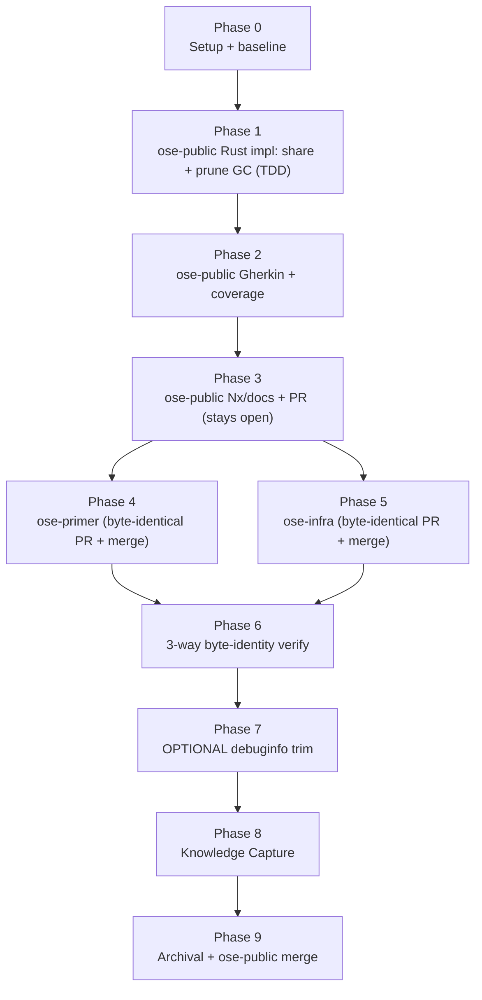

# Delivery — Rust `target/` Directory Sharing via `rhino-cli doctor`

> **Legend** — `[AI]`: an agent performs the step (the default; unmarked steps are `[AI]`).
> `[HUMAN]`: only a human can do it (physical action, out-of-band approval, real-secret or
> privileged-credential handling). `[AI+HUMAN]`: agent prepares, human approves or finishes.
>
> **Phase Gate** — every phase ends with a `### Phase N Gate` (must-pass verification) plus a
> `> **Pause Safety**:` note (the safe-to-stop state and the single command to resume). A phase
> is not complete until its gate is green; do not start phase N+1 while any gate check fails.

## Worktree

Worktree path: `worktrees/rust-cargo-target-dir-sharing/`

Optional manual pre-provisioning (run from repo root):

```bash
claude --worktree rust-cargo-target-dir-sharing
```

The plan-execution Step 0 gate enters this worktree by default: it auto-provisions from the latest
`origin/main` when missing, syncs with `origin/main` before implementing, and prompts before deleting
the worktree after the plan is archived and pushed.

See [Worktree Path Convention](../../../repo-governance/conventions/structure/worktree-path.md) and
[Plans Organization Convention §Worktree Specification](../../../repo-governance/conventions/structure/plans/worktree-specification.md#worktree-specification).

## Delivery Mode: worktree-to-pr

`worktree-to-pr` (the default) — **multi-repo, byte-identical**: one peer PR per repo (`ose-public`,
`ose-primer`, `ose-infra`), each worked in that repo's own `worktrees/rust-cargo-target-dir-sharing/`
worktree and opened as a draft PR against that repo's `main`. The `apps/rhino-cli` source and
`specs/apps/rhino` Gherkin change is **byte-identical** across all three PRs. Each repo's phase runs
the **PR-Review Maker→Fixer Cycle** (`pr-review-maker` → `pr-review-fixer`, default 3 sequential
CI-gated cycles) before its `[HUMAN]` merge. "Done" here means three green, fully-reviewed PRs handed
off; merging each is on the maintainer's own schedule.

> The maintainer has a standing preference (see project memory) permitting AI to merge once CI is
> green and the review cycle is complete. Treat the `[HUMAN]` merge as `[AI]`-eligible only if the
> maintainer reaffirms it for this plan; otherwise it stays `[HUMAN]`.
>
> **Exception — ose-public merge timing**: because the plan folder is tracked in `ose-public` only,
> the [archival-in-PR requirement](../../../repo-governance/workflows/plan/plan-execution.md#8-finalization-and-archival-sequential)
> applies to the ose-public PR specifically: its merge is deferred to Phase 9, after the archival
> `git mv` commit lands on that PR branch. The ose-primer and ose-infra PRs carry no plan folder and
> merge normally in their own phases (4 and 5) with no such deferral.

## Phase flow



## Phase 0: Environment Setup and Baseline

> _Executor: repo-setup-manager_

- [ ] [AI] Install dependencies in the root worktree: `npm install`
      — acceptance: exits 0, `node_modules/` synchronized
- [ ] [AI] Converge the toolchain in the root worktree: `npm run doctor -- --fix`
      — acceptance: exits 0 with no unresolved drift
- [ ] [AI] Record the Rust crates present: `find apps libs -maxdepth 2 -name Cargo.toml | sort`
      — acceptance: lists `apps/rhino-cli`, `apps/ayokoding-cli`, `apps/ose-cli`, `libs/rust-commons`
- [ ] [AI] Capture the current `build.outputs` for the Rust crates:
      `for f in apps/ayokoding-cli apps/ose-cli libs/rust-commons apps/rhino-cli; do echo "$f:"; jq '.targets.build.outputs' "$f/project.json"; done`
      — acceptance: confirms ayokoding-cli + ose-cli list `["{projectRoot}/dist","{projectRoot}/target"]`,
      rust-commons lists `["{projectRoot}/target"]`, rhino-cli lists `["{projectRoot}/dist"]`
- [ ] [AI] Capture the disk baseline across existing worktrees:
      `du -sh worktrees/*/apps/*/target apps/*/target libs/*/target 2>/dev/null | sort -h`
      — acceptance: a per-target size table is recorded in `learnings.md` as the "before" figure
- [ ] [AI] Establish the test baseline:
      `npx nx run rhino-cli:test:quick` and `npx nx affected -t typecheck lint`
      — acceptance: baseline pass/fail recorded; all preexisting failures documented
- [ ] [AI] Resolve all preexisting failures before proceeding
      — acceptance: no unresolved preexisting failures remain

### Phase 0 Gate

> All checks below must pass before starting Phase 1.

- [ ] [AI] `npm install` exited 0 and `npm run doctor -- --fix` reports no unresolved drift
- [ ] [AI] `npx nx run rhino-cli:test:quick` baseline recorded and clean (or every preexisting
      failure documented + resolved)
- [ ] [AI] The disk "before" `du` table and the crate `build.outputs` snapshot are written to
      `learnings.md`

> **Pause Safety**: only the toolchain was verified and baselines recorded — no feature work exists
> yet. Safe to stop indefinitely. To resume: re-run `npm run doctor -- --fix` and confirm it is clean.

## Phase 1: ose-public — `rhino-cli doctor` target-share + prune GC (Rust, TDD)

> _Suggested executor: `swe-rust-dev` (owns the Rust/cargo toolchain domain) for every code step._
> All edits are **inside** the `apps/rhino-cli/**` byte-identity boundary and will be replicated
> byte-identically to ose-primer/ose-infra in Phases 4-5. Unit tests live in the module's
> `#[cfg(test)]` block and run under `nx run rhino-cli:test:unit` (`cargo test --lib`).

### TDD cycle 1a — CI guard

- [ ] [AI] **RED**: in a new module `apps/rhino-cli/src/application/doctor/target_share.rs`
      (`_New file_`; siblings: `checker.rs`, `fixer.rs`, `tools.rs`) add a `#[cfg(test)]` test
      `is_ci_true_when_env_set` asserting `is_ci()` returns `true` when `CI` (or `GITHUB_ACTIONS`) is
      set and `false` otherwise; register `mod target_share;` in
      `apps/rhino-cli/src/application/doctor/mod.rs`. Run
      `cargo test --manifest-path apps/rhino-cli/Cargo.toml --lib target_share::tests::is_ci`
      — acceptance: fails to compile / test fails (`is_ci` undefined)
  - **Gherkin (underpins) →** "the doctor symlink step no-ops under CI"

    ```gherkin
    Given the environment variable CI is set
    When the developer runs the doctor command with the fix flag
    Then no target symlink is created for any crate
    And the command exits successfully with a message that CI was detected
    ```

- [ ] [AI] **GREEN**: implement `pub fn is_ci() -> bool` in `target_share.rs` reading `CI` and
      `GITHUB_ACTIONS` via `std::env::var_os` (mirroring the `env::var_os` pattern in
      `checker.rs`). Run
      `cargo test --manifest-path apps/rhino-cli/Cargo.toml --lib target_share::tests::is_ci`
      — acceptance: exits 0
- [ ] [AI] **REFACTOR**: doc-comment `is_ci`; ensure no clippy warnings:
      `npx nx run rhino-cli:lint` — acceptance: exits 0

### TDD cycle 1b — dynamic crate discovery

- [ ] [AI] **RED**: add test `discover_crates_walks_apps_and_libs` in `target_share.rs` that builds a
      tempdir with `apps/a/Cargo.toml`, `apps/b/Cargo.toml`, `libs/c/Cargo.toml` and asserts
      `discover_crates(root)` returns those three crate dirs (order-insensitive). Run
      `cargo test --manifest-path apps/rhino-cli/Cargo.toml --lib target_share::tests::discover`
      — acceptance: fails (`discover_crates` undefined)
  - **Gherkin (underpins) →** "dynamic discovery covers every crate under apps and libs"

    ```gherkin
    Given a repo checkout contains multiple Rust crates under apps and libs outside CI
    When the developer runs the doctor command with the fix flag
    Then every discovered crate's target is a symlink into the shared cache
    And no crate is skipped due to a hardcoded crate list
    ```

- [ ] [AI] **GREEN**: implement `pub fn discover_crates(repo_root: &Path) -> Vec<PathBuf>` walking
      `apps/*/Cargo.toml` + `libs/*/Cargo.toml` (use `std::fs::read_dir`, no hardcoded list). Run the
      same test — acceptance: exits 0
- [ ] [AI] **REFACTOR**: tidy discovery (dedupe, sort for determinism); `npx nx run rhino-cli:lint`
      — acceptance: exits 0

### TDD cycle 1c — shared-cache path + repo-name derivation

- [ ] [AI] **RED**: add test `cache_path_uses_common_dir_basename` asserting the shared path for a
      crate is `<cache_root>/<repo_name>/<crate_leaf>`, where `cache_root()` honors
      `OSE_CARGO_TARGET_CACHE` (set in-test to a tempdir) and falls back to
      `$HOME/.cache/ose-cargo-target`, and `repo_name` is the basename of the dir containing the git
      common dir. Run `cargo test --manifest-path apps/rhino-cli/Cargo.toml --lib target_share::tests::cache_path`
      — acceptance: fails (functions undefined)
  - **Gherkin (underpins) →** "two worktrees of the same repo share one physical target"

    ```gherkin
    Given two worktrees of the same repo each have a crate's target symlinked by the doctor
    When both symlinks are resolved
    Then both point at the same shared-cache directory for that repo and crate
    And a disk usage measurement across the worktrees counts that directory only once
    ```

- [ ] [AI] **GREEN**: implement `cache_root()` (env override + `$HOME` fallback via the `dirs_home`
      pattern from `checker.rs`) and `repo_name(common_dir: &Path) -> String`; derive the git common
      dir via a `git rev-parse --path-format=absolute --git-common-dir` call in
      `apps/rhino-cli/src/infrastructure/git/` (sibling: `root.rs`). Run the same test
      — acceptance: exits 0
- [ ] [AI] **REFACTOR**: extract the git-common-dir call into a named infra helper; re-run
      `npx nx run rhino-cli:test:unit` — acceptance: exits 0

### TDD cycle 1d — check reports gaps (no mutation)

- [ ] [AI] **RED**: add test `check_reports_unshared_target` building a tempdir crate whose `target/`
      is a plain dir, asserting `check_target_shares(...)` returns that crate as "needs share" and
      mutates nothing; and a second assertion that under CI (`is_ci()` forced true) it returns empty.
      Run `cargo test --manifest-path apps/rhino-cli/Cargo.toml --lib target_share::tests::check`
      — acceptance: fails (`check_target_shares` undefined)
  - **Gherkin (underpins) →** "doctor check reports a crate whose target is not yet shared"

    ```gherkin
    Given a crate's target is a plain directory not yet symlinked into the shared cache
    When the developer runs the doctor command without the fix flag
    Then the output reports that crate's target as needing to be shared
    And the plain target directory is left unchanged
    ```

- [ ] [AI] **GREEN**: implement `check_target_shares(repo_root, cache_root, repo_name) -> Vec<...>`
      (empty under CI; no filesystem mutation). Run the same test — acceptance: exits 0
- [ ] [AI] **REFACTOR**: `npx nx run rhino-cli:lint` — acceptance: exits 0

### TDD cycle 1e — fix creates/repairs symlinks (idempotent, replaces plain dir)

> Four RED→GREEN pairs incrementally build `fix_target_shares(...)`, one pair per listed scenario;
> a single REFACTOR closes the cycle. Each RED targets exactly one scenario per the
> [Gherkin-Tagged Delivery Steps](../../../repo-governance/development/workflow/test-driven-development.md#gherkin-tagged-delivery-steps)
> convention.

- [ ] [AI] **RED**: add test `fix_creates_symlink` in `target_share.rs` using a tempdir +
      `OSE_CARGO_TARGET_CACHE` temp override, asserting a plain `target/` becomes a symlink into the
      shared cache. Run
      `cargo test --manifest-path apps/rhino-cli/Cargo.toml --lib target_share::tests::fix_creates_symlink`
      — acceptance: fails (`fix_target_shares` undefined)
  - **Gherkin (binds) →** "doctor --fix symlinks a crate's target into the shared cache"

    ```gherkin
    Given a Rust crate with a plain target directory exists in a repo checkout outside CI
    When the developer runs the doctor command with the fix flag
    Then the crate's target becomes a symlink into the shared cargo-target cache
    And the symlink resolves under the repo's own shared-cache namespace
    ```

- [ ] [AI] **GREEN**: implement `fix_target_shares(...)` using `std::os::unix::fs::symlink`
      (create shared dir with `create_dir_all`; create the symlink). Run the same test
      — acceptance: exits 0
- [ ] [AI] **RED**: add test `fix_is_idempotent` in `target_share.rs` asserting a second
      `fix_target_shares` run on an already-correct symlink leaves it unchanged. Run
      `cargo test --manifest-path apps/rhino-cli/Cargo.toml --lib target_share::tests::fix_is_idempotent`
      — acceptance: fails (a second run currently recreates or errors on the symlink)
  - **Gherkin (binds) →** "the doctor fix step is idempotent"

    ```gherkin
    Given a crate's target is already the correct symlink into the shared cache
    When the developer runs the doctor command with the fix flag a second time
    Then the command exits successfully without recreating or altering the symlink
    ```

- [ ] [AI] **GREEN**: extend `fix_target_shares(...)` to skip when the target is already the correct
      symlink (no `remove_file`/`symlink` call). Run the same test — acceptance: exits 0
- [ ] [AI] **RED**: add test `fix_replaces_plain_dir` in `target_share.rs` asserting a pre-existing
      plain `target/` dir is discarded and replaced by the symlink. Run
      `cargo test --manifest-path apps/rhino-cli/Cargo.toml --lib target_share::tests::fix_replaces_plain_dir`
      — acceptance: fails (the plain dir is not removed/replaced)
  - **Gherkin (binds) →** "doctor --fix replaces an existing plain target directory with a symlink"

    ```gherkin
    Given a crate's target is a plain rebuildable directory containing stale artifacts
    When the developer runs the doctor command with the fix flag outside CI
    Then the plain directory is discarded and the target becomes a symlink into the shared cache
    ```

- [ ] [AI] **GREEN**: extend `fix_target_shares(...)` to `remove_dir_all` a plain `target/` dir before
      creating the symlink. Run the same test — acceptance: exits 0
- [ ] [AI] **RED**: add test `fix_noops_under_ci` in `target_share.rs` asserting `fix_target_shares`
      creates no symlink when `is_ci()` is true. Run
      `cargo test --manifest-path apps/rhino-cli/Cargo.toml --lib target_share::tests::fix_noops_under_ci`
      — acceptance: fails (the CI guard is not applied inside `fix_target_shares`)
  - **Gherkin (binds) →** "the doctor symlink step no-ops under CI"

    ```gherkin
    Given the environment variable CI is set
    When the developer runs the doctor command with the fix flag
    Then no target symlink is created for any crate
    And the command exits successfully with a message that CI was detected
    ```

- [ ] [AI] **GREEN**: extend `fix_target_shares(...)` to check `is_ci()` first and no-op when true.
      Run the same test — acceptance: all four `fix_*` tests exit 0
- [ ] [AI] **REFACTOR**: dedupe check/fix shared logic; `npx nx run rhino-cli:test:unit`
      — acceptance: exits 0

### TDD cycle 1f — worktree-aware prune GC (live-set gating, dry-run, CI no-op)

> Reuses `discover_crates`/`cache_root`/`repo_name`/`is_ci` from the target-share step (extend, do
> not duplicate). See [`tech-docs.md` DD-7](./tech-docs.md#dd-7-worktree-aware-shared-cache-gc-via-doctor---prune-cargo-cache-chosen).
> Four RED→GREEN pairs incrementally build `prune_orphans(...)`/`live_referenced_entries(...)`, one
> pair per listed scenario; a single REFACTOR closes the cycle. Each RED targets exactly one scenario
> per the
> [Gherkin-Tagged Delivery Steps](../../../repo-governance/development/workflow/test-driven-development.md#gherkin-tagged-delivery-steps)
> convention.

- [ ] [AI] **RED**: add test `prune_removes_orphan` in `target_share.rs` using a tempdir cache
      (`OSE_CARGO_TARGET_CACHE` override) seeded with one orphaned `<repo>/<crate>` entry, asserting
      `prune_orphans(...)` deletes it. Run
      `cargo test --manifest-path apps/rhino-cli/Cargo.toml --lib target_share::tests::prune_removes_orphan`
      — acceptance: fails (`prune_orphans` / `live_referenced_entries` undefined)
  - **Gherkin (binds) →** "prune removes an orphaned shared-cache entry"

    ```gherkin
    Given the shared cache holds an entry for a crate that no longer exists in the repo outside CI
    When the developer runs the doctor command with the prune flag
    Then the orphaned cache entry is deleted
    And every entry still referenced by a live worktree or checkout is preserved
    ```

- [ ] [AI] **GREEN**: implement `live_referenced_entries(cache_root, repo_name) -> HashSet<PathBuf>`
      (walk `git worktree list --porcelain` + the main checkout, resolve each crate `target/` symlink)
      and `prune_orphans(cache_root, repo_name, dry_run) -> PruneOutcome` (delete entries absent from
      the live set). Run the same test — acceptance: exits 0
- [ ] [AI] **RED**: add test `prune_preserves_live_referenced` seeding the cache with an entry that is
      the symlink target of a live crate, asserting `prune_orphans(...)` leaves it in place. Run
      `cargo test --manifest-path apps/rhino-cli/Cargo.toml --lib target_share::tests::prune_preserves_live_referenced`
      — acceptance: fails (the live-referenced entry is incorrectly deleted)
  - **Gherkin (binds) →** "prune preserves a cache entry referenced by a live worktree"

    ```gherkin
    Given a shared-cache entry is the symlink target of a crate in a live worktree
    When the developer runs the doctor command with the prune flag
    Then that referenced cache entry is left in place
    And only entries with no live referrer are removed
    ```

- [ ] [AI] **GREEN**: extend `prune_orphans(...)` to compute the live set via
      `live_referenced_entries` first and skip any entry present in it. Run the same test
      — acceptance: exits 0
- [ ] [AI] **RED**: add test `prune_noops_under_ci` asserting `prune_orphans(...)` deletes nothing when
      `is_ci()` is true, even with an orphaned entry present. Run
      `cargo test --manifest-path apps/rhino-cli/Cargo.toml --lib target_share::tests::prune_noops_under_ci`
      — acceptance: fails (the CI guard is not applied inside `prune_orphans`)
  - **Gherkin (binds) →** "the prune step no-ops under CI"

    ```gherkin
    Given the environment variable CI is set
    When the developer runs the doctor command with the prune flag
    Then no cache entry is deleted
    And the command exits successfully with a message that CI was detected
    ```

- [ ] [AI] **GREEN**: extend `prune_orphans(...)` to check `is_ci()` first and no-op when true. Run
      the same test — acceptance: exits 0
- [ ] [AI] **RED**: add test `prune_dry_run_reports_without_deleting` asserting `--dry-run` reports the
      orphaned candidate without deleting it. Run
      `cargo test --manifest-path apps/rhino-cli/Cargo.toml --lib target_share::tests::prune_dry_run_reports_without_deleting`
      — acceptance: fails (`dry_run` deletes instead of reporting)
  - **Gherkin (binds) →** "prune dry-run previews deletions without removing anything"

    ```gherkin
    Given the shared cache holds at least one orphaned entry outside CI
    When the developer runs the doctor command with the prune and dry-run flags
    Then the orphaned entry is reported as a candidate for deletion
    And no cache entry is actually removed
    ```

- [ ] [AI] **GREEN**: extend `prune_orphans(...)` to report-only (no delete) when `dry_run` is true.
      Run the same test — acceptance: all four `prune_*` tests exit 0
- [ ] [AI] **REFACTOR**: extract the symlink-resolution helper shared with the check step;
      `npx nx run rhino-cli:test:unit` — acceptance: exits 0

### TDD cycle 1g — optional cargo-sweep stale reclamation (graceful degrade)

- [ ] [AI] **RED**: add test `sweep_skips_when_cargo_sweep_absent` in `target_share.rs` asserting that
      when `cargo-sweep` is not on PATH, `sweep_stale(...)` returns a `Skipped` outcome (not an error)
      and does not fail. Run
      `cargo test --manifest-path apps/rhino-cli/Cargo.toml --lib target_share::tests::sweep`
      — acceptance: fails (`sweep_stale` undefined)
  - **Gherkin (underpins) →** "stale-artifact sweep degrades gracefully when cargo-sweep is absent"

    ```gherkin
    Given cargo-sweep is not installed on the developer's PATH
    When the developer runs the doctor command with the prune flag
    Then the sweep step is reported as skipped rather than failing the command
    And the command exits successfully
    ```

- [ ] [AI] **GREEN**: implement `sweep_stale(cache_root, dry_run) -> SweepOutcome` — detect
      `cargo-sweep` on PATH (reuse the `binary_in_path` pattern from `checker.rs`); when present run
      the sweep with a size/time cap, when absent return `Skipped`. Run the same test
      — acceptance: exits 0
- [ ] [AI] **REFACTOR**: `npx nx run rhino-cli:lint` — acceptance: exits 0

### Wire into the doctor command

- [ ] [AI] Edit `apps/rhino-cli/src/commands/doctor.rs`: add a `--prune-cargo-cache` flag to
      `DoctorArgs` (`#[arg(long = "prune-cargo-cache")] pub prune_cargo_cache: bool`, kebab-case
      matching the existing `--scope`/`--fix`/`--dry-run` flags). In `run()`, after the tool checks,
      run `check_target_shares` and print the report; when `args.fix`, run `fix_target_shares`; when
      `args.prune_cargo_cache`, run `prune_orphans` then `sweep_stale` (respecting `args.dry_run`,
      `args.quiet`, `args.verbose`). Add a `#[cfg(test)]` unit assertion that the wiring compiles and
      check-mode leaves the filesystem unchanged. Run `npx nx run rhino-cli:test:unit`
      — acceptance: exits 0
- [ ] [AI] Run the doctor for real in the root worktree: `npm run doctor -- --fix`
      — acceptance: `readlink apps/rhino-cli/target`, `apps/ayokoding-cli/target`,
      `apps/ose-cli/target`, `libs/rust-commons/target` all resolve under
      `$HOME/.cache/ose-cargo-target/ose-public/`
- [ ] [AI] Spot-check the prune in dry-run mode:
      `npm run doctor -- --prune-cargo-cache --dry-run`
      — acceptance: exits 0; reports candidate/none without deleting any live-referenced entry (the
      four crates symlinked above are all preserved)

### Commit Guidelines — Phase 1

- [ ] [AI] Commit thematically (Conventional Commits), e.g.
      `feat(rhino-cli): share cargo target dirs via doctor symlink step`,
      `feat(rhino-cli): add worktree-aware cargo-cache prune to doctor`
- [ ] [AI] Do NOT bundle unrelated changes into a single commit

### Phase 1 Gate

> All checks below must pass before starting Phase 2.

- [ ] [AI] `npx nx run rhino-cli:test:unit` — exits 0 (all new `target_share` symlink AND prune unit
      tests pass)
- [ ] [AI] `npx nx run rhino-cli:lint` — exits 0
- [ ] [AI] `readlink apps/rhino-cli/target` resolves under `$HOME/.cache/ose-cargo-target/ose-public/rhino-cli`
- [ ] [AI] `npm run doctor -- --prune-cargo-cache --dry-run` exits 0 and preserves all live-referenced
      entries

> **Pause Safety**: the doctor target-share logic and its unit tests exist and are green on the
> branch; no Gherkin/PR yet. Safe to stop. To resume: re-run `npx nx run rhino-cli:test:unit`.

## Phase 2: ose-public — companion Gherkin + behavior coverage

> _Suggested executor: `swe-rust-dev` + `specs-maker` for the `.feature`/README additions._ All files
> are inside the byte-identity boundary. This phase satisfies the Specs & Gherkin two-path rule.

- [ ] [AI] **RED (coverage)**: create
      `specs/apps/rhino/behavior/rhino-cli/gherkin/system/cargo-target-share.feature` (`_New file_`;
      sibling: `system/doctor.feature`) transcribing ALL `prd.md` acceptance-criteria scenarios (one
      primary `Given`/`When`/`Then` each) — both the target-share scenarios AND the prune-GC scenarios
      (orphan pruned, live-referenced preserved, prune CI no-op, dry-run preview, cargo-sweep graceful
      degrade). Run `npx nx run rhino-cli:specs:behavior:coverage`
      — acceptance: FAILS reporting uncovered steps (no step defs yet)
  - **Gherkin (binds) →** the whole `system/cargo-target-share.feature` (aggregate cucumber-rs
    binder; the individual scenarios are the `prd.md` acceptance criteria)
- [ ] [AI] **GREEN (coverage)**: create the cucumber-rs binder
      `apps/rhino-cli/tests/cargo_target_share.rs` (`_New file_`; sibling: `apps/rhino-cli/tests/doctor.rs`)
      with `#[given]`/`#[when]`/`#[then]` step defs whose strings mirror the `.feature` verbatim
      (covering both the target-share and the prune scenarios — the prune steps drive
      `rhino-cli doctor --prune-cargo-cache [--dry-run]` and seed the tempdir cache with an orphaned
      entry + a live-referenced entry), driving the compiled `rhino-cli` binary against a synthetic
      tempdir repo with `OSE_CARGO_TARGET_CACHE` pointed at a tempdir; add
      `[[test]] name = "cargo_target_share"` with `harness = false` to `apps/rhino-cli/Cargo.toml`
      (sibling entries: lines 42-108). Run `npx nx run rhino-cli:specs:behavior:coverage`
      — acceptance: exits 0 (zero step gaps)
- [ ] [AI] Run the behavior binder: `npx nx run rhino-cli:test:integration`
      — acceptance: exits 0 (all new scenarios pass)
- [ ] [AI] Validate Gherkin cardinality: `npx nx run rhino-cli:specs:gherkin-cardinality-validation`
      — acceptance: exits 0 (each new scenario has exactly one primary `Given`/`When`/`Then`)
- [ ] [AI] Update `specs/apps/rhino/behavior/rhino-cli/gherkin/README.md`: add a row under
      `### system` for `cargo-target-share.feature` with its command and scenario count
      — acceptance: the `system` table lists `cargo-target-share.feature`
  - _Suggested executor: `specs-maker`_

### Commit Guidelines — Phase 2

- [ ] [AI] Commit thematically, e.g.
      `test(rhino-cli): add cargo target-share behavior scenarios + step defs`,
      `docs(specs): list cargo-target-share.feature in gherkin README`

### Phase 2 Gate

> All checks below must pass before starting Phase 3.

- [ ] [AI] `npx nx run rhino-cli:specs:behavior:coverage` — exits 0 (zero gaps)
- [ ] [AI] `npx nx run rhino-cli:specs:gherkin-cardinality-validation` — exits 0
- [ ] [AI] `npx nx run rhino-cli:test:integration` — exits 0

> **Pause Safety**: the behavior is specified, covered, and green on the branch. Safe to stop. To
> resume: re-run `npx nx run rhino-cli:test:specs`.

## Phase 3: ose-public — Nx outputs, docs, verification, and PR

- [ ] [AI] Edit `apps/ayokoding-cli/project.json`: set `targets.build.outputs` to
      `["{projectRoot}/dist"]` (remove `{projectRoot}/target`)
      — acceptance: `jq '.targets.build.outputs' apps/ayokoding-cli/project.json` prints
      `["{projectRoot}/dist"]`
- [ ] [AI] Edit `apps/ose-cli/project.json`: set `targets.build.outputs` to `["{projectRoot}/dist"]`
      — acceptance: `jq '.targets.build.outputs' apps/ose-cli/project.json` prints `["{projectRoot}/dist"]`
- [ ] [AI] Edit `libs/rust-commons/project.json`: set `targets.build.outputs` to `[]`
      — acceptance: `jq '.targets.build.outputs' libs/rust-commons/project.json` prints `[]`
- [ ] [AI] Update `repo-governance/development/workflow/worktree-setup.md`: add a subsection noting
      that `npm run doctor -- --fix` also creates the shared-`target` symlinks (local-dev only)
      — acceptance: the file mentions the doctor target-share step and links to
      `reproducible-environments.md`
  - _Suggested executor: `repo-workflow-maker`_
- [ ] [AI] Update `repo-governance/development/workflow/reproducible-environments.md`: add a
      "Shared cargo target directories" section documenting the doctor mechanism, the CI guard, the
      worktree-aware `doctor --prune-cargo-cache` GC (and the explicit "no per-worktree target-delete
      hook" anti-pattern — deleting a worktree must NOT delete its shared cache entry), and the
      cleanup path (`cargo clean` / periodic `cargo sweep`); confirm the exact sweep flag first with
      `cargo sweep --help` (install locally only if desired) before writing it
      — acceptance: section present; documents the prune GC + anti-pattern; any cited `cargo sweep`
      flag matches `--help` output
  - _Suggested executor: `repo-workflow-maker`_
- [ ] [AI] Verify build through the symlink: `npx nx run rhino-cli:build`
      — acceptance: exits 0 and `test -f apps/rhino-cli/dist/rhino-cli` succeeds
- [ ] [AI] Verify the two output-adjusted CLIs still build:
      `npx nx run ayokoding-cli:build && npx nx run ose-cli:build`
      — acceptance: both exit 0; `apps/ayokoding-cli/dist/ayokoding-cli` and
      `apps/ose-cli/dist/ose-cli` exist
- [ ] [AI] Verify Nx build caching still hits for an output-adjusted crate: run
      `npx nx run ayokoding-cli:build` twice with no source change
      — acceptance: the second run reports "Nx read the output from the cache"
- [ ] [AI] Verify tests pass through the symlink:
      `npx nx run rhino-cli:test:unit && npx nx run rhino-cli:test:quick`
      — acceptance: both exit 0
- [ ] [AI] Capture the disk "after" figure:
      `du -sh $HOME/.cache/ose-cargo-target/ose-public/* 2>/dev/null | sort -h` and compare to the
      Phase 0 "before" table
      — acceptance: the shared cache is counted once; the per-worktree duplication in the "before"
      table is gone. Record the comparison in `learnings.md`.

### Local Quality Gates (Before Push) — Phase 3

- [ ] [AI] `npx nx affected -t typecheck` — exits 0
- [ ] [AI] `npx nx affected -t lint` — exits 0
- [ ] [AI] `npx nx affected -t test:quick` — exits 0 (its `test:specs` step runs
      `specs:behavior:coverage`; `specs:coverage` no longer exists — it was renamed to
      `specs:behavior:coverage`)
- [ ] [AI] Fix ALL failures — including preexisting issues not caused by these changes — and re-run
      to confirm resolution

> **Important**: Fix ALL failures found during quality gates, not just those caused by your changes
> (Root Cause Orientation). Commit preexisting fixes separately with their own conventional-commit
> messages.

- [ ] [AI] Commit and push to origin `rust-cargo-target-dir-sharing` (the PR branch)
      — acceptance: branch pushed; draft PR open against `ose-public` `main`

### Post-Push CI Verification — ose-public

- [ ] [AI] Monitor ALL GitHub Actions workflows triggered by the push (poll every 2 min; one
      `gh run view --json status,conclusion` per wakeup; never `gh run watch`)
- [ ] [AI] Verify ALL CI checks pass — pay special attention that the byte-identity guard passes and
      that CI did NOT create a symlink (the doctor CI guard held); if any check fails, fix root cause
      and push a follow-up commit
- [ ] [AI] Do NOT proceed until CI is fully green

### PR-Review Maker→Fixer Cycle — ose-public

- [ ] [AI] Run the PR-Review Maker→Fixer Cycle (default 3 sequential CI-gated cycles:
      `pr-review-maker` → `pr-review-fixer`) per the
      [PR Review Quality Gate workflow](../../../repo-governance/workflows/pr/pr-review-quality-gate.md)
      — acceptance: 3 cycles complete, CI green after the final fixer pass, no unresolved review threads
- [ ] [AI] Leave the ose-public PR **open, unmerged** at this point. Per the archival-in-PR
      requirement in [plan-execution §8](../../../repo-governance/workflows/plan/plan-execution.md#8-finalization-and-archival-sequential),
      the plan-folder `git mv` must be committed and pushed to this PR branch before it is merged.
      The merge step is deferred to Phase 9
      — acceptance: PR remains unmerged; proceed to Phase 4/5

### Phase 3 Gate

> All checks below must pass before starting Phase 4/5.

- [ ] [AI] `apps/rhino-cli/dist/rhino-cli` builds and `rhino-cli:test:quick` passes through the symlink
- [ ] [AI] The three `project.json` `build.outputs` edits are applied and an output-adjusted crate
      still gets an Nx cache hit
- [ ] [AI] Disk "after" comparison recorded showing dedup vs. the Phase 0 baseline
- [ ] [AI] ose-public CI green; PR-review cycle complete

> **Pause Safety**: ose-public carries the full, verified mechanism on a green PR. Safe to stop. To
> resume: re-run `npx nx run rhino-cli:build` and confirm the symlink + dist are intact.

## Phase 4: Apply byte-identically to ose-primer

> Work in `ose-primer`'s own `worktrees/rust-cargo-target-dir-sharing/` worktree
> (repo root: `~/ose-projects/ose-primer`). Two Rust crates exist there: `apps/rhino-cli`
> and `apps/crud-be-rust-axum` [Repo-grounded — `find apps libs -maxdepth 2 -name Cargo.toml`]. The
> `apps/rhino-cli` source + `specs/apps/rhino` change is **byte-identical** to ose-public.

- [ ] [AI] Provision the ose-primer plan worktree (idempotent — creates it if absent, confirms it if
      already present):
      `cd ~/ose-projects/ose-primer && git worktree add worktrees/rust-cargo-target-dir-sharing rust-cargo-target-dir-sharing 2>/dev/null || git -C worktrees/rust-cargo-target-dir-sharing rev-parse HEAD`
      — acceptance: `~/ose-projects/ose-primer/worktrees/rust-cargo-target-dir-sharing/` exists
- [ ] [AI] Initialize toolchain in the ose-primer root worktree:
      `npm install && npm run doctor -- --fix`
      — acceptance: both exit 0
- [ ] [AI] Reproduce the byte-identical rhino-cli change in ose-primer: apply the exact same edits to
      `apps/rhino-cli/src/application/doctor/target_share.rs`,
      `apps/rhino-cli/src/application/doctor/mod.rs`, `apps/rhino-cli/src/commands/doctor.rs`, any
      infra git helper, `apps/rhino-cli/tests/cargo_target_share.rs`, `apps/rhino-cli/Cargo.toml`, and
      `specs/apps/rhino/behavior/rhino-cli/gherkin/system/cargo-target-share.feature` +
      `specs/apps/rhino/behavior/rhino-cli/gherkin/README.md`. Recreate the files with the exact byte
      content from ose-public (do NOT `cp` across repos/worktrees; per
      [Worktree Toolchain Initialization](../../../repo-governance/development/workflow/worktree-setup.md),
      cross-repo relative paths are a known failure mode)
      — acceptance: (see byte-identity check below)
  - _Suggested executor: `swe-rust-dev`_
- [ ] [AI] Verify byte-identity vs ose-public for every rhino-cli source + specs file — compare each
      repo's own `worktrees/rust-cargo-target-dir-sharing/` copy, NOT the primary checkout: the
      ose-public PR stays open/unmerged until Phase 9 (after this phase runs), so
      `~/ose-projects/ose-public/apps/rhino-cli` does not yet contain these changes at diff
      time (see [Worktree Toolchain Initialization §Absolute Source Paths in Delivery-Checklist Commands](../../../repo-governance/development/workflow/worktree-setup.md#absolute-source-paths-in-delivery-checklist-commands-same-repo-worktree-vs-primary-checkout)):
      `diff -rq --exclude=target --exclude=dist ~/ose-projects/ose-public/worktrees/rust-cargo-target-dir-sharing/apps/rhino-cli ~/ose-projects/ose-primer/worktrees/rust-cargo-target-dir-sharing/apps/rhino-cli`
      and
      `diff -rq --exclude=target --exclude=dist ~/ose-projects/ose-public/worktrees/rust-cargo-target-dir-sharing/specs/apps/rhino ~/ose-projects/ose-primer/worktrees/rust-cargo-target-dir-sharing/specs/apps/rhino`
      — acceptance: both diff invocations report no differences (exit 0)
- [ ] [AI] Run the doctor for real and verify BOTH crates symlink (dynamic discovery, not a hardcoded
      list): `npm run doctor -- --fix`
      — acceptance: `readlink apps/rhino-cli/target` AND `readlink apps/crud-be-rust-axum/target`
      both resolve under `$HOME/.cache/ose-cargo-target/ose-primer/`
- [ ] [AI] Confirm no `project.json` output edits are needed:
      `jq '.targets.build.outputs' apps/crud-be-rust-axum/project.json`
      — acceptance: it lists only `["{projectRoot}/target/release/crud-be-rust-axum"]` (a specific
      binary path, not the whole `target` dir), so no output edit is required (per DD-5)
- [ ] [AI] Local gates: `npx nx affected -t typecheck lint test:quick` — all exit 0 (includes
      `specs:behavior:coverage` via `test:specs`); fix ALL failures (incl. preexisting)
- [ ] [AI] Commit thematically and push to origin `rust-cargo-target-dir-sharing`; open draft PR
      against ose-primer `main`

### Post-Push CI Verification — ose-primer

- [ ] [AI] Monitor all GitHub Actions for the push; verify green (including the rhino-cli
      byte-identity guard); fix root cause + follow-up commit if any fail

### PR-Review Maker→Fixer Cycle — ose-primer

- [ ] [AI] Run the 3-cycle PR-Review Maker→Fixer Cycle; CI green after the final fixer pass
- [ ] [HUMAN] Merge the ose-primer PR to `main` when ready (or `[AI]` if maintainer reaffirms
      auto-merge) — signal to resume: PR shows "Merged"

### Phase 4 Gate

> All checks below must pass before Phase 6.

- [ ] [AI] `diff -rq` of `apps/rhino-cli` and `specs/apps/rhino` vs ose-public shows no source diffs
- [ ] [AI] `readlink apps/rhino-cli/target` resolves under `.../ose-primer/rhino-cli`; ose-primer CI
      green; review cycle complete

> **Pause Safety**: ose-primer carries the byte-identical mechanism on a green PR. Safe to stop. To
> resume: re-run `npx nx run rhino-cli:test:quick` in the ose-primer worktree.

## Phase 5: Apply byte-identically to ose-infra

> Work in `ose-infra`'s own `worktrees/rust-cargo-target-dir-sharing/` worktree
> (repo root: `~/ose-projects/ose-infra`). Two Rust crates exist there: `apps/rhino-cli`
> and `apps/coralpolyp-be` [Repo-grounded — `find apps libs -maxdepth 2 -name Cargo.toml`]; the
> `doctor` script uses the `nx run rhino-cli:build && ./apps/rhino-cli/dist/rhino-cli doctor` variant
> (`-- --fix` still reaches the doctor).

- [ ] [AI] Provision the ose-infra plan worktree (idempotent — creates it if absent, confirms it if
      already present):
      `cd ~/ose-projects/ose-infra && git worktree add worktrees/rust-cargo-target-dir-sharing rust-cargo-target-dir-sharing 2>/dev/null || git -C worktrees/rust-cargo-target-dir-sharing rev-parse HEAD`
      — acceptance: `~/ose-projects/ose-infra/worktrees/rust-cargo-target-dir-sharing/` exists
- [ ] [AI] Initialize toolchain in the ose-infra root worktree: `npm install && npm run doctor -- --fix`
      — acceptance: both exit 0
- [ ] [AI] Reproduce the byte-identical rhino-cli change in ose-infra (same file set as Phase 4),
      recreating each file with the exact byte content from ose-public (do NOT `cp` across
      repos/worktrees)
      — acceptance: (see byte-identity check below)
  - _Suggested executor: `swe-rust-dev`_
- [ ] [AI] Verify byte-identity vs ose-public — compare each repo's own
      `worktrees/rust-cargo-target-dir-sharing/` copy, NOT the primary checkout (same rationale as
      Phase 4: the ose-public PR is still open/unmerged at this point):
      `diff -rq --exclude=target --exclude=dist ~/ose-projects/ose-public/worktrees/rust-cargo-target-dir-sharing/apps/rhino-cli ~/ose-projects/ose-infra/worktrees/rust-cargo-target-dir-sharing/apps/rhino-cli`
      and
      `diff -rq --exclude=target --exclude=dist ~/ose-projects/ose-public/worktrees/rust-cargo-target-dir-sharing/specs/apps/rhino ~/ose-projects/ose-infra/worktrees/rust-cargo-target-dir-sharing/specs/apps/rhino`
      — acceptance: both diff invocations report no differences (exit 0)
- [ ] [AI] Run the doctor for real and verify BOTH crates symlink: `npm run doctor -- --fix`
      — acceptance: `readlink apps/rhino-cli/target` AND `readlink apps/coralpolyp-be/target` both
      resolve under `$HOME/.cache/ose-cargo-target/ose-infra/`
- [ ] [AI] Confirm no `project.json` output edits are needed:
      `jq '.targets.build.outputs' apps/coralpolyp-be/project.json`
      — acceptance: it lists only `["{projectRoot}/target/release/coralpolyp-be"]`, so no edit is
      required (per DD-5)
- [ ] [AI] Local gates: `npx nx affected -t typecheck lint test:quick` — all exit 0; fix ALL failures
- [ ] [AI] Commit thematically and push to origin `rust-cargo-target-dir-sharing`; open draft PR
      against ose-infra `main`

### Post-Push CI Verification — ose-infra

- [ ] [AI] Monitor all GitHub Actions for the push; verify green (including the byte-identity guard);
      fix root cause + follow-up commit if any fail

### PR-Review Maker→Fixer Cycle — ose-infra

- [ ] [AI] Run the 3-cycle PR-Review Maker→Fixer Cycle; CI green after the final fixer pass
- [ ] [HUMAN] Merge the ose-infra PR to `main` when ready (or `[AI]` if maintainer reaffirms
      auto-merge) — signal to resume: PR shows "Merged"

### Phase 5 Gate

> All checks below must pass before Phase 6.

- [ ] [AI] `diff -rq` of `apps/rhino-cli` and `specs/apps/rhino` vs ose-public shows no source diffs
- [ ] [AI] `readlink apps/rhino-cli/target` resolves under `.../ose-infra/rhino-cli`; ose-infra CI
      green; review cycle complete

> **Pause Safety**: all three repos carry the byte-identical mechanism on green PRs. Safe to stop. To
> resume: proceed to Phase 6.

## Phase 6: Three-way byte-identity verification

- [ ] [AI] Confirm `apps/rhino-cli` is byte-identical across all three repos (source only, excluding
      `target` symlinks / `dist`) — compare each repo's own `worktrees/rust-cargo-target-dir-sharing/`
      copy throughout: the ose-public PR is still open/unmerged (deferred to Phase 9), and even after
      the ose-primer/ose-infra PRs merge (Phase 4/5) their primary checkouts are not auto-updated by
      that remote merge, so each repo's own worktree remains the source of truth for this comparison,
      not the primary checkout:
      `diff -rq --exclude=target --exclude=dist ~/ose-projects/ose-public/worktrees/rust-cargo-target-dir-sharing/apps/rhino-cli ~/ose-projects/ose-primer/worktrees/rust-cargo-target-dir-sharing/apps/rhino-cli`
      and the equivalent ose-infra pairing
      (`diff -rq --exclude=target --exclude=dist ~/ose-projects/ose-public/worktrees/rust-cargo-target-dir-sharing/apps/rhino-cli ~/ose-projects/ose-infra/worktrees/rust-cargo-target-dir-sharing/apps/rhino-cli`)
      — acceptance: both `diff` invocations report no differences (exit 0)
- [ ] [AI] Confirm `specs/apps/rhino` is byte-identical across all three repos, using each repo's
      `worktrees/rust-cargo-target-dir-sharing/` copy:
      `diff -rq ~/ose-projects/ose-public/worktrees/rust-cargo-target-dir-sharing/specs/apps/rhino ~/ose-projects/ose-primer/worktrees/rust-cargo-target-dir-sharing/specs/apps/rhino`
      and the equivalent ose-infra pairing
      (`diff -rq ~/ose-projects/ose-public/worktrees/rust-cargo-target-dir-sharing/specs/apps/rhino ~/ose-projects/ose-infra/worktrees/rust-cargo-target-dir-sharing/specs/apps/rhino`)
      — acceptance: both report no differences (exit 0)

### Phase 6 Gate

> All checks below must pass before Phase 7.

- [ ] [AI] All four `diff -rq` invocations exit 0 (rhino-cli source + specs byte-identical, three-way)

> **Pause Safety**: the byte-identity invariant is proven across all three repos. Safe to stop
> indefinitely — the plan is functionally complete without Phase 7. To resume: proceed to Phase 7
> (optional) or skip to Phase 8.

## Phase 7: OPTIONAL — dev-profile debuginfo trim (may be dropped wholesale)

> **This phase is optional and byte-identity-coupled.** It edits tracked `Cargo.toml`. The
> `apps/rhino-cli/Cargo.toml` edit is INSIDE the byte-identity boundary and MUST be applied
> byte-identically across all three repos in the same cycle. The maintainer may skip this entire
> phase; doing so does not affect the core mechanism. Only run it after explicit maintainer opt-in.

- [ ] [HUMAN] Confirm whether to include Phase 7 — signal to resume: maintainer says "include Phase 7"
      or "skip Phase 7"
- [ ] [AI] Add a `[profile.dev]` section with `debug = "line-tables-only"` to
      `apps/rhino-cli/Cargo.toml` in ALL THREE repos identically (the existing `[profile.release]`
      stays)
      — acceptance: the three files' `[profile.dev]` blocks are byte-identical
      (`diff <(...) <(...)` shows no difference); deps unchanged so `Cargo.lock` is untouched
      (`git diff --stat main -- apps/rhino-cli/Cargo.lock` empty in each repo)
  - _Suggested executor: `swe-rust-dev`_
- [ ] [AI] Add the same `[profile.dev]` block to ose-public-only crates
      `apps/ayokoding-cli/Cargo.toml`, `apps/ose-cli/Cargo.toml`, `libs/rust-commons/Cargo.toml`
      — acceptance: each file has a `[profile.dev]` section with `debug = "line-tables-only"`
- [ ] [AI] Rebuild + test each affected crate in each repo to confirm no breakage:
      `npx nx run rhino-cli:test:quick` (and the two CLIs in ose-public)
      — acceptance: all exit 0
- [ ] [AI] Local gates in each repo: `npx nx affected -t typecheck lint test:quick` — all exit 0
- [ ] [AI] Commit `perf(cargo): trim dev-profile debuginfo to line-tables-only` in each repo; push to
      each PR branch; run each repo's PR-review cycle; verify CI green
- [ ] [HUMAN] Merge each PR when ready (or `[AI]` if maintainer reaffirms auto-merge)

### Phase 7 Gate

> All checks below must pass before Phase 8 (skip this gate entirely if Phase 7 was declined).

- [ ] [AI] `apps/rhino-cli/Cargo.toml` `[profile.dev]` block is byte-identical across all three repos
- [ ] [AI] `Cargo.lock` unchanged in each repo (`git diff --stat main -- apps/rhino-cli/Cargo.lock`
      empty)
- [ ] [AI] All three repos' affected gates green; review cycles complete

> **Pause Safety**: optional trim applied byte-identically or explicitly declined. Safe to stop. To
> resume: re-run `npx nx run rhino-cli:test:quick` in each repo.

## Manual behavioral verification — Not Applicable

This plan touches the Rust doctor command, its Gherkin specs, `project.json`, and docs only — no web
UI and no HTTP/GraphQL API. Playwright MCP and curl verification, the Rule-15 three-tester retest,
and the Rule-16 API exploratory retest are therefore **Not Applicable**. Behavioral verification is
covered by the `target_share` unit tests, the cucumber-rs binder, `specs:behavior:coverage`, the
build/test-through-symlink checks, and the disk `du` comparison.

## Phase 8: Knowledge Capture

> _Triage every surviving `learnings.md` entry before archival. See the
> [Knowledge Capture Convention](../../../repo-governance/development/quality/knowledge-capture.md)._

- [ ] [AI] Apply the litmus test to every `learnings.md` entry — keep only if a durable surface would
      catch this automatically next time; discard the rest with a one-line reason
      — acceptance: every entry has either a route or a discard reason
- [ ] [AI] Apply the **secret/sensitivity gate** — sanitize any secret, token, or private hostname to
      a `<placeholder>`, or discard if unsanitizable
      — acceptance: `learnings.md` contains no raw secret (real `$HOME` paths reduced to `$HOME`)
- [ ] [AI] Apply the **repo-relevance gate** — infra-private content (real hostnames/inventories)
      stays in `ose-infra` only and is never cross-routed into `ose-public`/`ose-primer`; public
      governance content may propagate via the parity loop
      — acceptance: no infra-private content appears in this repo's routed output
- [ ] [AI] Route each surviving learning to exactly one durable home per the open-ended routing
      matrix — a small non-code edit lands inline (e.g. an extra sentence in
      `reproducible-environments.md`); a larger non-code change is filed as a `plans/backlog/`
      follow-up; code homes (`apps/`, `libs/`, tests) are ALWAYS filed as a separate
      `plans/backlog/<slug>/` plan, NEVER inline
      — acceptance: every entry records its terminal routing state
- [ ] [AI] If no generalizable learning surfaced, record the explicit escape in `learnings.md`:
      `No generalizable learnings — <one-line reason>`
      — acceptance: `learnings.md` is never silently empty

### Phase 8 Gate

> All checks below must pass before Plan Archival.

- [ ] [AI] Every `learnings.md` entry is terminal (routed inline / filed as backlog / discarded with
      reason), or the explicit "none" escape is present
- [ ] [AI] No code-homed learning landed inline in this plan's own commits/PRs

> **Pause Safety**: `learnings.md` is fully triaged (or explicitly empty). Safe to stop. To resume:
> re-read `learnings.md` and confirm every entry is terminal.

## Phase 9: Plan Archival

> **Scope: ose-public only.** The plan folder is tracked in `ose-public` exclusively — `ose-primer`
> and `ose-infra` carry no plan folder and no archival obligation. Run every step below in the
> **ose-public** worktree, on the same branch as the still-open Phase 3 PR
> (`rust-cargo-target-dir-sharing`). Per the archival-in-PR HARD requirement in
> [plan-execution §8](../../../repo-governance/workflows/plan/plan-execution.md#8-finalization-and-archival-sequential),
> the `git mv` + README updates are committed and pushed to that PR branch **before** the PR is
> merged — never as a separate commit landed on `main` after merge.

- [ ] [AI] Verify ALL delivery checklist items are ticked (Phase 7 items excepted if declined)
- [ ] [AI] Verify the Knowledge Capture phase is complete — every `learnings.md` entry reached a
      terminal state or the explicit "none" escape is present; both safety gates applied
- [ ] [AI] Verify ALL quality gates pass (local + CI) across the three repos
- [ ] [AI] Verify the disk `du` before/after comparison is recorded and shows dedup
- [ ] [AI] Verify the three-way byte-identity `diff = 0` result (Phase 6) is recorded
- [ ] [AI] Confirm Rule-15 / Rule-16 retests are Not Applicable (no UI/API surface) — recorded above
- [ ] [AI] In the ose-public worktree, on the Phase 3 PR branch: rename and move
      `git mv plans/in-progress/rust-cargo-target-dir-sharing/ plans/done/2026-MM-DD__rust-cargo-target-dir-sharing/`
      using the completion date (NOT the creation date)
- [ ] [AI] Update `plans/in-progress/README.md` — remove the plan entry
- [ ] [AI] Update `plans/done/README.md` — add the plan entry with completion date
- [ ] [AI] Update any other READMEs that reference this plan (e.g. `plans/README.md`, `plans/backlog/README.md`)
- [ ] [AI] Commit the archival on the ose-public PR branch: `chore(plans): move rust-cargo-target-dir-sharing to done`
- [ ] [AI] Push the archival commit to the still-open ose-public PR branch
      (`rust-cargo-target-dir-sharing`) — acceptance: the PR diff now includes the `git mv`; CI
      re-triggered on the new head commit
- [ ] [AI] Re-verify CI is green on the ose-public PR after the archival commit, per the
      [CI Monitoring Convention](../../../repo-governance/development/workflow/ci-monitoring.md)
      — acceptance: every required check passes on the PR's new head commit
- [ ] [HUMAN] Merge the ose-public PR to `main` when ready (or `[AI]` if the maintainer reaffirms the
      standing auto-merge preference for this plan) — signal to resume: PR shows "Merged". This is
      the deferred ose-public merge originally scheduled in Phase 3 (see the archival-in-PR
      exception noted under Delivery Mode above)

### Phase 9 Gate

> All checks below must pass to consider this plan delivered.

- [ ] [AI] Every delivery checklist item across Phases 0-8 (and Phase 7 if included) is ticked
- [ ] [AI] The archival `git mv` commit is pushed to the still-open ose-public PR branch and CI is
      green on that new head commit
- [ ] [AI] All three repos' PRs are green and fully reviewed (merge itself is `[HUMAN]`-paced, not a
      gate condition — "done" is not "merged")

> **Pause Safety**: the plan is fully delivered — archived, on a green ose-public PR awaiting
> `[HUMAN]` merge (ose-primer/ose-infra may already be merged). Safe to stop indefinitely. To resume:
> confirm the ose-public PR's CI status and merge when ready.
