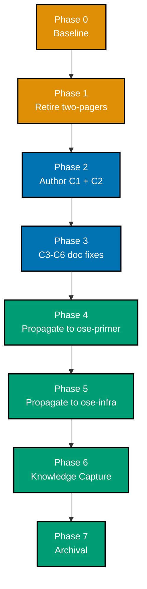

# Bare-Repo Governance Hardening

Codify the **bare-repo base-worktree landing method** as a real governance document, and close the
six adjacent doc defects that let a bare sibling's local `main` silently diverge, let an impossible
delivery mode be offered for a repo that cannot use it, and let a scoping agent misread a bare
repo's topology.

> **Origin**: promoted 2026-07-21 from **two** `plans/ideas/` two-pagers, merged into one plan by
> explicit maintainer decision (**DD-1**):
>
> - `bare-repo-worktree-landing-hygiene.md` — the workflow-hygiene gap (local `main` divergence,
>   long-lived WIP in the shared index)
> - `bare-repo-delivery-mode-governance-hardening.md` — the four governance-doc gaps around bare
>   repos and delivery modes
>
> Both briefs are **retired (deleted)** as part of this plan's own changeset. Promotion is atomic —
> the plan appears and the briefs disappear together (Phase 1).

## Documents

| Document                       | Owns                                                                              |
| ------------------------------ | --------------------------------------------------------------------------------- |
| [brd.md](./brd.md)             | WHY — business goal, impact, affected roles, success signals, business risks      |
| [prd.md](./prd.md)             | WHAT — personas, user stories, Gherkin acceptance criteria, product scope         |
| [tech-docs.md](./tech-docs.md) | HOW — design decisions DD-1..DD-8, research findings F1-F4/S1-S8, file-impact map |
| [delivery.md](./delivery.md)   | DO — phased `[AI]`/`[HUMAN]` checklist with gates and pause-safety notes          |
| [learnings.md](./learnings.md) | Transient Knowledge Capture running log, triaged before archival                  |

## Context

Three sibling repositories share one machine. Two of them — `ose-primer` and `ose-infra` — are
**bare** repositories (`core.bare=true`, verified live this session): they have **no primary
checkout**, so every mutation flows through a linked worktree. The standard way work lands in them
is the **base-worktree re-derive method**: add a worktree at `origin/main`, re-apply the delta
there, push `HEAD:main`, remove the worktree.

That method works. It is also **completely undocumented** — a repo-wide sweep for its signature
strings found exactly one unrelated hit ([F2](./tech-docs.md#research-findings)). It survives as
tacit practice, and tacit practice degrades: the method advances **`origin/main`** but never touches
the repo's own local `main` ref, so after each landing the bare sibling sits silently **behind**
origin. Add one duplicate commit made directly on a stale local `main` and it is **behind AND
ahead** — which is exactly the state both siblings were found in on 2026-07-21, on top of roughly a
hundred uncommitted files, half of them long-lived foreign WIP staged but never committed across
many sessions.

Separately — and from a different failure on the same day — a scoping agent misread `ose-primer`'s
merged `main` as un-merged because it asked `git rev-parse --is-bare-repository` from inside a
linked worktree, which correctly returns `false` there. No document warns against that question,
and no document prescribes the right one.

## Scope

**In scope** — seven changes (C1-C7), authored in `ose-public` first, then propagated to both
siblings:

| ID     | Change                                                                                                                                                         |
| ------ | -------------------------------------------------------------------------------------------------------------------------------------------------------------- |
| **C1** | NEW `repo-governance/development/workflow/bare-repo-landing-method.md` — the method, the terminal reconcile, the bareness check, the advisory WIP-parking rule |
| **C2** | `no-destructive-git-operations.md` links to C1                                                                                                                 |
| **C3** | `plans.md` Delivery Mode table — note that `main-to-*` modes are unavailable in a bare repo                                                                    |
| **C4** | `plan-multi-repo-parity-planning.md` — property-bind the bare-repo grill question; fix the contradicting `main-to-origin-main` option                          |
| **C5** | `pr-merge-protocol.md` — inline the floor-not-ceiling saturation qualifier at both enumeration sites                                                           |
| **C6** | `sdlc-gate-standard.md` + `plan-idea-promotion-planning.md` — refine the bareness rule; re-point the dangling "bare-repo git-ops method" link at C1            |
| **C7** | Retire both two-pagers and their `plans/ideas/README.md` index lines                                                                                           |

**Out of scope** (carried verbatim from both briefs, plus one added by **DD-2**):

- A `rhino-cli` guard, hook, or checker that auto-detects post-push local-`main` lag **or** unparked
  WIP. **DD-2** forbids proposing one for the WIP rule; [S1](./tech-docs.md#research-findings)
  independently rules out a hook for the lag rule (no `post-push` hook exists in git).
- Changing the base-worktree method itself — this plan **documents** it, it does not redesign it.
- Changing delivery-mode **behaviour** — only the documentation of which modes a bare repo can use.
- Adopting any third-party sync tool ([S4](./tech-docs.md#research-findings): adopt nothing).
- A **mirrored plan folder** in either sibling. This plan folder is the single home for all three
  repos' work; `ose-primer` and `ose-infra` receive the C1-C7 **changeset** through Phases 4 and 5
  and their own PRs, never a copy of these five documents. Verified 2026-07-21: neither sibling
  holds a plan or brief on this subject. See [DD-10](./tech-docs.md#dd-10--one-plan-folder-in-ose-public-only-siblings-receive-the-changeset-not-a-plan-copy),
  which also records why this deviates from the multi-repo parity workflow's one-plan-per-repo
  default.

## Approach Summary

`ose-public` is authored first and is the **source of truth** the siblings copy verbatim
(**DD-8**). Because both siblings are bare, their propagation phases must themselves run the
base-worktree method this plan documents — the plan **self-applies its own output**, which is the
cheapest possible proof that the written method is executable.

## Delivery Mode

`worktree-to-pr` (**DD-4**). Worktree path `worktrees/bare-repo-governance-hardening/`. Full
declaration and rationale in [delivery.md](./delivery.md#delivery-mode-worktree-to-pr).

## Status

**Completed** — promoted from `backlog/` on 2026-07-21, archived to `done/` on 2026-07-22.

Delivered byte-identically across all three repos in two rounds: the main changeset via
`ose-public` [#79](https://github.com/wahidyankf/ose-public/pull/79),
`ose-primer` [#14](https://github.com/wahidyankf/ose-primer/pull/14) and
`ose-infra` [#16](https://github.com/wahidyankf/ose-infra/pull/16), then a Knowledge-Capture
correction round via `ose-public` [#81](https://github.com/wahidyankf/ose-public/pull/81),
`ose-primer` [#15](https://github.com/wahidyankf/ose-primer/pull/15) and
`ose-infra` [#17](https://github.com/wahidyankf/ose-infra/pull/17). All three copies of
`repo-governance/development/workflow/bare-repo-landing-method.md` are byte-identical at sha1
`618e74ff8ebc5c0a0abf19b2a40c2af9ac2e01db`.

**One gate is recorded as partially unmet rather than ticked**: "CI green on `main` in all three
repos". `ose-public` is green. On both siblings, `pr-quality-gate` and `validate-env` ran on the
merge commit and passed; only `main-ci` did not, because that one workflow is schedule-triggered with
no push trigger — so the gap is a single workflow, not the siblings being unverified. `ose-primer`'s
last scheduled `main-ci` is red on a pre-existing condition that predates this plan. See
[delivery.md §Phase 7 Gate](./delivery.md#phase-7-gate).

A defect **this plan introduced** is tracked in
[`plans/ideas/bare-repo-landing-method-step-count-drift.md`](../../ideas/q2-not-urgent-important/bare-repo-landing-method-step-count-drift.md):
the landing sequence numbers eight steps, but the file's own frontmatter and both governance indexes
call it "the seven-step landing sequence" — nine sites across the three repos. The undercount drops
exactly the reconcile step the document was written to add.

> Home prefix normalised: absolute home-directory paths in this plan's files were rewritten to a portable form (such as `~/`, `$HOME/`, or a `<placeholder>`), so captured output here is not byte-verbatim.
