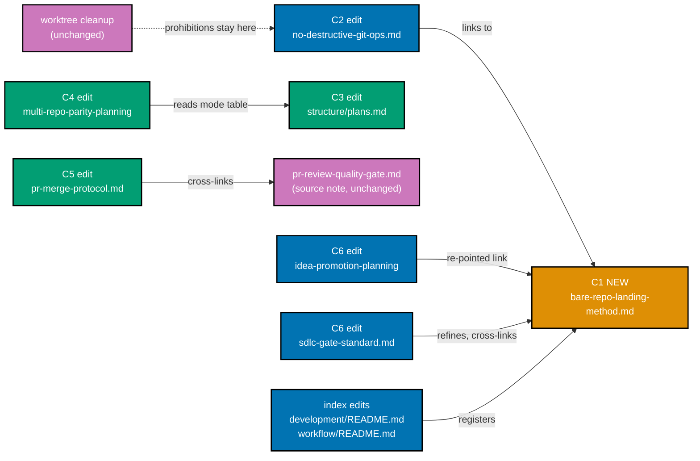
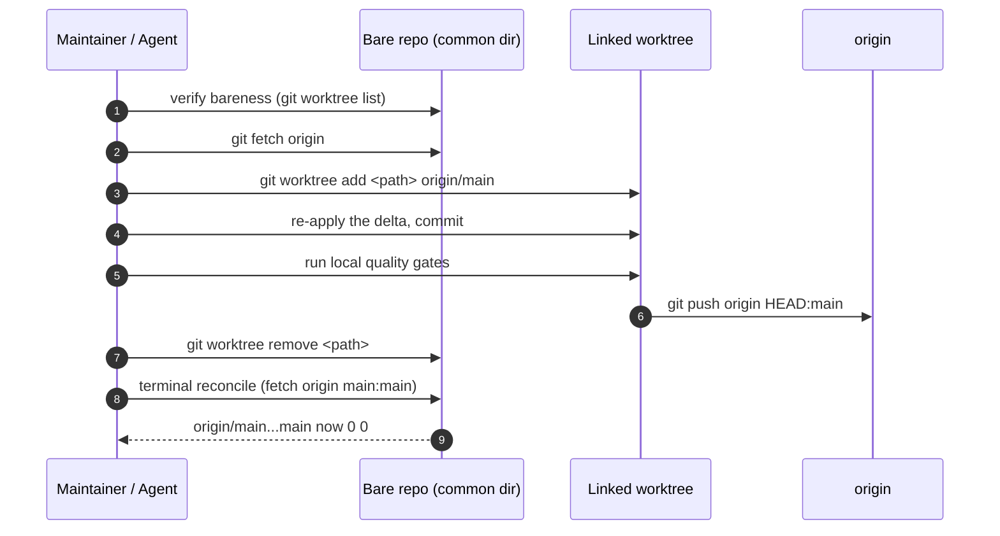
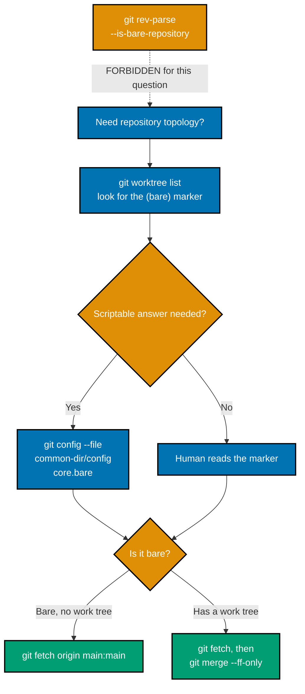
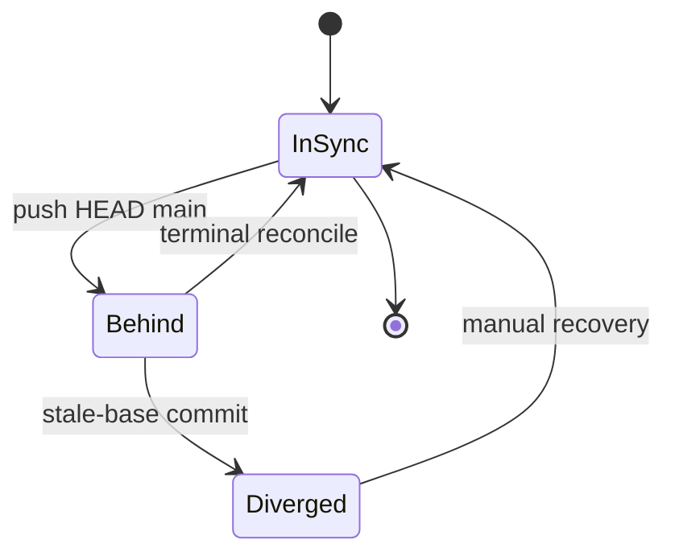
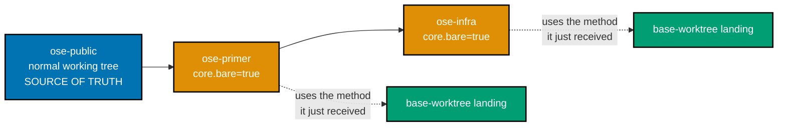

# Technical Documentation — Bare-Repo Governance Hardening

## Architecture

This plan is a **documentation change with a cross-repo topology**. There is no runtime component,
no data flow, and no code. What it does have is a document graph, a procedure whose steps must be
ordered correctly, and a three-repo propagation sequence in which two targets are bare.

### Document graph — what changes and how the pieces link



### Sequence — the base-worktree landing method C1 documents

The order matters, and step 6 is the one that has been missing.



### Decision branch — which reconcile command, and which bareness question



### State — the local `main` ref through one landing



`Diverged` is the state both siblings were found in on 2026-07-21. The `Behind -> Diverged`
transition is what the no-double-landing rule removes; the `Behind -> InSync` transition is what the
terminal reconcile step guarantees.

### Propagation topology



**`ose-primer` and `ose-infra` are BARE** — `core.bare=true`, verified live this session
[Repo-grounded]. They have no primary checkout, so every mutation there flows through a linked
worktree, and each propagation phase must therefore execute the very method this plan documents.
That self-application is deliberate: it is the cheapest available proof that the written procedure
is executable rather than merely plausible. Call it out during execution; do not treat it as an
incidental detail.

## File Impact

Every file this plan touches is already mapped twice — this section is the conventionally-named
landing spot for that mapping, not a third copy of it:

- **What changes and how the pieces link** — the
  [Document graph](#document-graph--what-changes-and-how-the-pieces-link) diagram above: the new
  `<C1>` plus every edited file (`no-destructive-git-operations.md`, `plans.md`,
  `plan-multi-repo-parity-planning.md`, `pr-merge-protocol.md`, `sdlc-gate-standard.md`,
  `plan-idea-promotion-planning.md`, and the two index READMEs) and the two unchanged files the
  diagram calls out for contrast (`worktree-and-artifact-cleanup.md`,
  `pr-review-quality-gate.md`).
- **Which Change ID touches which file, and why** — [README.md §Scope](./README.md#scope)'s C1-C7
  table.

## Design Decisions

### DD-1 — One merged plan, not two

Both two-pagers promote into this single plan, identifier `bare-repo-governance-hardening`.

**Rationale**: the briefs are two views of one subject. Brief A's rule 1 (terminal reconcile) and
rule 2 (no stale-base commits) are **steps of a procedure**; Brief B's item 3 (bareness check) is a
**precondition of the same procedure**; Brief B's items 1, 2, and 4 are the surrounding governance
text that must agree with it. Splitting them would produce two plans editing the same paragraphs.

**Consequence**: the delivery checklist carries seven change IDs (C1-C7) rather than two brief
scopes, and both briefs are retired together (C7).

### DD-2 — The WIP-parking rule binds as advisory convention prose, never as an automated gate

Brief A's rule 3 — park long-lived WIP off the shared index — is written as prose guidance. **No
checker, hook, wrapper, or `rhino-cli` subcommand may be proposed for it, in this plan or in any
follow-up it files.**

**Rationale**, all three strands independently sufficient:

1. **No tool can see staleness.** `git diff --cached --exit-code` and `git status --porcelain`
   report **state, not duration** ([S6](#research-findings)). Git records that a path is staged; it
   records nothing about when. Distinguishing "staged five seconds ago" from "staged six weeks ago"
   requires bespoke mtime or marker logic that would itself become a maintained surface.
2. **The failure mode is recoverable.** `git add`-ed content survives `reset --hard` as a dangling
   blob; `git fsck --lost-found` writes such blobs out, and `gc.pruneExpire` defaults to
   `2.weeks.ago` ([S5](#research-findings)). The rule prevents an inconvenience, not a data loss.
3. **Automating it would itself be destructive.** The WIP in question is a **foreign agent's active
   work**. An automated stash of another actor's staged content is precisely the class of operation
   the [No Destructive Git Operations Convention](../../../repo-governance/development/workflow/no-destructive-git-operations.md)
   forbids. A guard built to protect WIP that destroys WIP is a defect, not a feature.

**Consequence**: C1's WIP section is prose. `plan-checker` should not expect an enforcement
artifact, and no acceptance criterion asserts one.

### DD-3 — Brief B item 4 (the saturation qualifier) is bundled in, not dropped

Both target sites were verified: `pr-merge-protocol.md` precondition **(a)** appears twice — once in
§The Rule and once in §Agent Workflow → Before Merging. The source note lives in
`pr-review-quality-gate.md` §Saturation, Not a Fixed Count (Loop Exit).

**Rationale**: the qualifier is a two-line edit at each site, it touches a document this plan
already opens for no other reason, and the defect it fixes is real — an agent reading "the
configured cycles are complete (default 3)" at the merge gate has no local signal that 3 is a
**floor**, and the saturation rule that says so sits in a different file.

**Consequence**: C5 exists as its own change ID with its own acceptance criterion (`grep -Fc "floor"`
prints exactly 2, from a pre-change exit code of 1).

> **Reversed during PR-review cycle 3 (final)**: the direction recorded above is no longer this
> plan's shipped rule. The user ruled directly, verbatim: "limit pr review cycle to max of 3," and
> — put to them explicitly that this contradicts the floor-not-ceiling reading DD-3 bundled in —
> chose to reverse the governance rule itself rather than only cap this PR: **3 cycles is a HARD
> CEILING, not a floor; a PR merges on preconditions (b)-(e), never on additional cycles.** The
> `pr-review-quality-gate.md` §Saturation, Not a Fixed Count (Loop Exit) section this DD cited as
> "the source note" is **removed**, not merely re-cross-linked — its entire premise (an open-ended,
> saturation-driven extension past `{input.cycles}`) is the reading the user just overruled. Every
> site DD-3's C5 acceptance criterion swept, plus the fifth derivative site cycle 1's sweep missed
> (`plan-quality-gate.md:289`), now carries the reversed "hard ceiling, not a floor" phrasing instead.
> See `delivery.md`'s C5 checklist item (its cycle-3 correction note) for the full site-by-site
> record; this DD is left otherwise unedited as the historical record of what cycle-1's fix actually
> did and why, at the time it was made.

### DD-4 — Delivery Mode for this plan's own execution is `worktree-to-pr`

The plan **documents** are pushed to `origin main`. The plan's own future **execution** runs
`worktree-to-pr`.

**Rationale**: this changeset edits conventions and workflows that other agents read while working.
A draft PR plus the PR-Review Maker→Fixer Cycle is the repo default and gives the wording a review
pass before it becomes binding. Nothing about the change argues for bypassing it.

**Consequence**: the `ose-public` changeset lands as a draft PR against `main` with the standard
review cycle. Each sibling propagation phase opens its **own** draft PR in its own repo, preserving
the strict 1-PR ↔ 1-worktree relationship.

### DD-5 — The method gets a NEW document; the advisory WIP rule lives in it

C1 creates `repo-governance/development/workflow/bare-repo-landing-method.md`, which owns the whole
procedure: verify bareness → create worktree at `origin/main` → re-apply delta → push `HEAD:main` →
remove worktree → **reconcile local `main`**. Brief A's rules 1 and 2 become numbered steps of it.
`no-destructive-git-operations.md` links to it (C2).

**Rule 3's home — decision and justification.** DD-5 delegated the choice between the new document
and `worktree-and-artifact-cleanup.md`. **The new document wins.** Three reasons:

- **Scope match.** `worktree-and-artifact-cleanup.md` is, by its own opening, the **teardown half of
  the worktree lifecycle** — its subject is removing worktrees, branches, and build output that a
  plan created. Long-lived foreign WIP in the shared index is neither an artifact the plan created
  nor something the plan may remove. Filing it there would import a "do not delete this" rule into a
  document whose every other action is a deletion.
- **Co-location with cause.** The WIP problem is observed **while running the landing method** —
  it is what makes the method's `git status` read unreadable and its "commit and push" step
  dangerous. The rule belongs beside the step that surfaces it.
- **Single-read completeness.** A maintainer landing work in a bare sibling should get the whole
  picture from one document. Splitting three rules across two files reintroduces the
  reconstruct-from-memory problem the plan exists to remove.

`worktree-and-artifact-cleanup.md` is therefore **left unchanged**. C1 cross-links it for teardown,
and the existing conventions keep their prohibitions.

### DD-6 — The bare-repo terminal reconcile is `git fetch origin main:main`

C1 states **both** forms, keyed by topology:

| Topology                            | Reconcile command                              |
| ----------------------------------- | ---------------------------------------------- |
| Bare (no work tree) — sibling repos | `git fetch origin main:main`                   |
| Has a work tree — `ose-public`      | `git fetch && git merge --ff-only origin/main` |

**Rationale**: a refspec fetch requires no work tree and is **fast-forward-checked by default** per
`git-fetch(1)` — it refuses a non-fast-forward update to the local branch unless the refspec carries
a leading `+`. That is exactly the safety property `--ff-only` provides, delivered by a command that
runs in a bare repo. Verified working live in `ose-primer` ([F1](#research-findings)). Where a work
tree exists, `fetch` + `merge --ff-only` remains git's own idiom ([S3](#research-findings)) and is
kept.

**Consequence**: Brief A's originally-proposed command is **wrong for its own target repos** — see
[F1](#research-findings). The plan must not carry the brief's wording forward unamended.

### DD-7 — Prescribe both bareness checks, labelled by provenance

C1 and C6 prescribe:

- **Primary / human check** — `git worktree list`, which prints a `(bare)` marker for the bare main
  worktree. Natively documented in `git-worktree(1)` §LIST OUTPUT FORMAT. **Upstream-prescribed.**
- **Scriptable form** — `git config --file "$(git rev-parse --git-common-dir)/config" core.bare`.
  **Derived from documented mechanics, not upstream-prescribed** — this label is mandatory wherever
  the form appears ([F4](#research-findings)).

Both prescriptions **forbid `git rev-parse --is-bare-repository`** for answering "is this repository
bare".

**Rationale**: the forbidden command is not broken — it answers a _different_ question correctly,
namely "is _this checkout_ bare", and a linked worktree is by design never bare. See
[F3](#research-findings) for the framing constraint that follows from this.

### DD-8 — Propagation is in-plan, `ose-public` first, sequential

Author the `ose-public` edits (Phases 1-3), then dedicated phases propagate to `ose-primer`
(Phase 4) and `ose-infra` (Phase 5).

**Rationale**: `ose-public` is the upstream source of truth for scaffolding; its wording is what the
siblings copy. Propagating from a draft would mean re-propagating after review changed the wording.

**On serialization**: `ose-primer` and `ose-infra` are disjoint repositories, so Phases 4 and 5 are
structurally independent and _could_ run in parallel. **DD-8 binds them serial anyway.** This is
recorded explicitly so a later reader knows it was a decision rather than an oversight: the two
phases share one human reviewer's attention, the second phase benefits from any correction the first
surfaces, and the total work is small enough that parallelism buys nothing worth the coordination.

**Consequence**: the Parallelization Model in `delivery.md` declares a fully serial DAG with the
independence noted.

**Binds the late-correction case too**: Phase 4 and Phase 5 execute `<C1>`'s own documented method
while propagating it (Phases 4-5's headings both say "Self-Applying the Method"), so either phase can
surface friction between `<C1>`'s written procedure and what execution actually required. This
directionality rule binds that case exactly as it binds the original changeset: Phase 4 and Phase 5
never edit `<C1>` in place inside their own propagation worktree (that copy is not the source of
truth), and any correction is instead recorded in `learnings.md` and landed through the `<C1>`
Correction Propagation Sub-Cycle in `delivery.md` Phase 6 — `ose-public` first, then both siblings.
Without this, an in-place fix inside `<PRIMER-WT>` would land in `ose-primer` while Phase 5 still
copies the unfixed text from merged `ose-public`, and `ose-public` itself — the source of truth this
decision names — would never receive the correction at all.

### DD-9 — The dangling "bare-repo git-ops method" cross-link is re-pointed and absorbed

Discovered during pre-write verification, not present in either brief:
`repo-governance/workflows/plan/plan-idea-promotion-planning.md` already links the phrase
**"bare-repo git-ops method"** to `no-destructive-git-operations.md` — a document that contains no
such method (all 185 lines read; corroborated by [F2](#research-findings)'s sweep). The link is
live, and it resolves to content that cannot answer the question it promises.

**Decision**: C6 **re-points that link at C1**, and C1 **explicitly claims the phrase "bare-repo
git-ops method"** so the link resolves to real content.

**Rationale**: this is precisely the defect C1 is built to fix, the fix is a one-line edit plus one
sentence in a document being authored anyway, and leaving a known-dangling conceptual link in place
while writing its missing target would violate
[Root Cause Orientation](../../../repo-governance/principles/general/root-cause-orientation.md).

**Consequence**: the re-point propagates to both siblings with the rest of C6.

### DD-10 — One plan folder, in `ose-public` only; siblings receive the changeset, not a plan copy

This plan lives at `ose-public/plans/in-progress/bare-repo-governance-hardening/` (promoted from
`plans/backlog/` on 2026-07-21) and **nowhere else**.
Neither `ose-primer` nor `ose-infra` receives a mirrored plan folder; each receives the C1-C7
**changeset** through its own propagation phase (Phase 4, Phase 5) and its own PR.

This is a **deliberate deviation** from
[plan-multi-repo-parity-planning](../../../repo-governance/workflows/plan/plan-multi-repo-parity-planning.md),
whose declared output is "One plan folder path per target repo" — one plan per repo, one grill
session across all repos. That deviation is recorded here so a later reader knows it was decided
rather than overlooked.

**Rationale**: the per-repo split exists to absorb per-repo **divergence** — different starting
states, different CI wiring, different toolchain constraints, each resolved through a deviation
matrix. This changeset has none. C1 is copied **verbatim** (the Phase 4 and Phase 5 acceptance
criterion is that `diff` reports no difference), and C2-C6 apply the same edits to the same paths in
all three repos; the only per-repo difference is that sites must be located **by content** because
line numbers differ. Three plan folders would therefore be three copies of one document differing in
nothing but the repo name — and three folders that must then be kept in sync, gated in sync,
archived in sync, and indexed in sync. The deviation matrix that justifies the per-repo split would
be empty.

**Verified in-repo state (2026-07-21)**: neither sibling holds a plan or a brief on this subject.
Every non-archived plan document in both repos was enumerated — `ose-primer` carries one
`in-progress` plan (`add-investment-oracle-app`), an empty `backlog/`, and three ideas
(`rhino-cli-exclude-dir-shared-steps-gap`, `rust-msrv-1-94-1-upgrade`,
`source-code-credential-scanning`); `ose-infra` carries three `in-progress` plans (two k3s deploys,
one PVE alerting), one backlog plan (`ci-runner-health-monitoring`), and nine ideas. **Zero** are on
this subject. The nearest neighbour by keyword,
`ose-infra/plans/ideas/worktree-portable-terraform-state.md`, concerns a Terraform state backend,
not git landing. The only sibling matches for the string `bare-repo` are two lines in each repo's
archived `plans/done/2026-07-03__unify-rhino-cli-sdlc-parity/`, and both state that bare-repo-specific
handling was **not** required there.

**Consequence**: Phases 4 and 5 each carry an explicit non-goal — do not scaffold a plan folder in
the sibling — and Phase 7 archives exactly one folder, in `ose-public`. The siblings' `plans/`
indexes are untouched by this plan.

### DD-11 — Phase 7 archival departs from `plan-execution.md` §8 by necessity, not oversight

Phase 7's archival commit (`git mv plans/in-progress/... plans/done/...`) lands via direct push to
`origin main` **after** the Phase 3 `ose-public` PR — the only PR that ever carries this plan's
folder (DD-10) — has already merged. This is a documented departure from
[`plan-execution.md` §8 Finalization and Archival, "Archival-in-PR"](../../../repo-governance/workflows/plan/plan-execution.md#8-finalization-and-archival-sequential),
which states, with no multi-repo carve-out: _"the `git mv plans/in-progress/... plans/done/...` move
(and the accompanying README index updates) is committed **inside the delivering PR itself**, as a
normal commit on the PR branch pushed before the merge — **not as a separate commit landed on
`main` after merge**."_

**Rationale — why compliance is structurally impossible (primary reason)**: this plan's delivery
spans **three PRs across three repositories** — `ose-public` (Phase 3), `ose-primer` (Phase 4), and
`ose-infra` (Phase 5, the third and final PR to merge). §8 assumes one plan → one repo → one
delivering PR: a single PR that is simultaneously the _last_ to merge and the _one_ that can carry
the plan folder's `git mv`. Per DD-10, the plan folder exists in `ose-public` only. The PR that
holds the folder (`ose-public`, Phase 3) is not the PR that merges last (`ose-infra`, Phase 5); the
PR that merges last holds no plan folder to move. No single PR in this plan's shape satisfies both
of §8's implicit assumptions at once — the rule has no provision for a plan whose delivery spans
repositories the plan folder does not live in.

**Rationale — the maintainer's standing instruction (secondary reason)**: independent of the
structural argument above, plan-document lifecycle work (authoring, stage promotion, quality-gate
review cycles, and archival) is standing maintainer policy to run on local `main`, landing via the
[Plan-Docs-Only Carve-Out](../../../repo-governance/workflows/plan/plan-planning.md#the-plan-docs-only-carve-out-superseded--retired-in-three-of-four-repos)
rather than through a worktree/PR — the worktree and its PR are reserved for this plan's C1-C7
implementation phases (DD-4).

**This decision disclaims being a general precedent.** It resolves this plan's specific shape — a
plan folder that lives in one repo while its delivery's last-merging PR lives in another — and does
not establish that every future `*-to-pr` plan may archive via direct push. The proper fix is a rule
change, not a repeatable citation: see
[`plan-archival-in-pr-multi-repo-gap`](../../../plans/ideas/q2-not-urgent-important/plan-archival-in-pr-multi-repo-gap.md),
the idea brief this decision is tracked against, proposing `plan-execution.md` §8 gain an explicit
multi-repo provision so a future plan of this shape does not need to re-argue the case from first
principles.

**Consequence**: Phase 7's "Land the archival commit" step and note (see `delivery.md`) cite this
decision and §8 directly; the git operation itself (`git push origin HEAD:main`) is unchanged from
prior iterations of this plan — only its justification and forward-traceability change.

## Research Findings

Full report: `generated-reports/plan-idea-promotion-planning__bare2p_7f3a91c4__2026-07-21--14-53__report.md`.

### F1 (CRITICAL) — Brief A's original command cannot run in the target repos

Verified live [Repo-grounded]:

```console
$ git -C ose-primer worktree list
~/ose-projects/ose-primer  (bare)

$ git -C ose-primer merge --ff-only origin/main
fatal: this operation must be run in a work tree

$ git -C ose-primer status --porcelain
fatal: this operation must be run in a work tree

$ git -C ose-primer fetch origin main:main
ok fetched
```

`git merge` and `git reset` both require a work tree; the bare siblings have none. This is why
**DD-6** exists and why the brief's proposed `git fetch && git merge --ff-only origin/main` must not
be carried forward as the bare-repo form.

### F2 (HIGH) — The landing method is undocumented; the plan must author it

Swept `repo-governance/`, `docs/`, `AGENTS.md`, and `.claude/` for `base-worktree`, `HEAD:main`,
`worktree add origin/main`, and `core.bare=false`: **one** hit, unrelated
(`plan-planning.md:438`) [Repo-grounded]. The method survives as tacit practice only. This is why
**DD-5** creates a new document rather than amending an existing one.

### F3 (HIGH) — Reframe the `--is-bare-repository` rule

`git rev-parse --is-bare-repository` returning `false` from a linked worktree is **documented,
intentional behaviour**, not a bug. `git-worktree(1)` §CONFIGURATION FILE states: _"If the config
variables `core.bare` or `core.worktree` are present in the common config file and
`extensions.worktreeConfig` is disabled, then they will be applied to the main worktree only."_
— <https://git-scm.com/docs/git-worktree> (accessed 2026-07-21) [Web-cited]. A linked worktree is by
design never bare, so `false` correctly answers "is _this checkout_ bare".

A corroborating maintainer thread was cited in an earlier draft
(<https://www.spinics.net/lists/git/msg487689.html>) and is **withdrawn as unverified**
[re-checked 2026-07-21]: the host refused connection on every attempt, and the only retrievable
metadata indicates the thread concerns `git worktree repair` on a copied bare repository — an
adjacent bug, not the `--is-bare-repository` scoping question. **Do not cite it in C1** unless
someone re-reads it from an environment that can reach the host. The `git-worktree(1)` quote above
is load-bearing on its own; note also that `git-rev-parse(1)` documents `--is-bare-repository` only
as "When the repository is bare print `true`, otherwise `false`" and is **silent on worktree
scoping**, so C1's framing is a defensible inference from documented mechanics rather than a
statement git makes about itself. Say so in C1 rather than implying upstream asserts it.

**Binding constraint on wording**: frame the rule as **"documented scoping semantics — ask the right
question"**, never as "git has a bug". Also name
<https://www.gitworktree.org/troubleshooting/must-be-run-in-work-tree> as a **misleading source**: it
recommends `git rev-parse --is-bare-repository` as a general bareness diagnostic **without
addressing the linked-worktree scoping caveat**. Two independent fetches found no sentence asserting
the opposite of the documented mechanics — the defect is a **material omission, not a stated
contradiction**, and C1 must describe it that way.

### F4 (MEDIUM) — Provenance honesty for the `core.bare` read

The `git config --file "$(git rev-parse --git-common-dir)/config" core.bare` form is **derived from
documented mechanics, not upstream-prescribed**. `git-worktree(1)` documents where the variable
lives and which worktree it applies to; it does not prescribe reading it as a bareness test. Hence
**DD-7**'s labelling requirement.

### S1 — There is no `post-push` client hook; any future guard is a wrapper script

Verified against `githooks(5)`'s full enumerated hook list —
<https://git-scm.com/docs/githooks> (accessed 2026-07-21) [Web-cited]. The nearest primitives are
`pre-push` — which fires **before** the transfer and therefore cannot observe post-push drift — and
`reference-transaction`, which fires on any ref update.

**Caveat worth recording**: `git maintenance`'s background `prefetch` writes to a hidden
`refs/prefetch/*` namespace and does **not** update `refs/remotes/origin/*`, so background
maintenance would not trigger such a hook even if one existed.

**Consequence for this plan**: state plainly that any future lag guard is a **wrapper script, never
a hook**, so nobody proposes a hook later.

### S2 — The premise is confirmed by primary source

Pro Git, §Remote Branches: _"Your local branches aren't automatically synchronized to the remotes
you write to."_ — <https://git-scm.com/book/en/v2/Git-Branching-Remote-Branches> (accessed
2026-07-21) [Web-cited]. A push writes the refspec destination on the remote plus the local
remote-tracking ref; it never advances a same-named local branch.

**Precision note**: the finer claim that push _opportunistically_ updates local
`refs/remotes/origin/*` could **not** be traced to a literal sentence in `git-push(1)`. If C1 states
it, mark it **observed behaviour, not a documented guarantee**.

### S3 — `fetch` + `merge --ff-only` is git's own idiom where a work tree exists

`git-merge(1)` on `--ff-only`: resolve the merge as a fast-forward when possible; when not possible,
**refuse to merge and exit with a non-zero status** — <https://git-scm.com/docs/git-merge> (accessed
2026-07-21) [Web-cited]. `git-pull(1)` documents `--ff-only` as "the default when no method for
reconciling divergent histories is provided" — <https://git-scm.com/docs/git-pull> (accessed
2026-07-21) [Web-cited].

**Correction [re-checked 2026-07-21]**: an earlier draft added "and recommends separate `fetch` +
`merge` over `pull` for recoverability" to that `git-pull(1)` citation. All 14 top-level sections of
the page were enumerated and **no such recommendation exists** — EXAMPLES presents the two as
functionally equivalent, with no safety framing. The claim is **withdrawn**; C1 must not attribute
it to `git-pull(1)`. If C1 wants to prefer `fetch` + `merge`, it must argue that on its own terms.

### S4 — Buy-vs-build: adopt nothing

| Candidate               | License       | Verdict                                                                                            |
| ----------------------- | ------------- | -------------------------------------------------------------------------------------------------- |
| `git-town`              | MIT           | Rejected — solves branch-stack sync; requires adopting its branch-hierarchy model across 3 repos   |
| `git-machete`           | MIT           | Rejected — same shape of commitment                                                                |
| Graphite `gt`           | closed-source | Rejected — closed-source SaaS since 2023-07-14 (date secondary-sourced, see below); vendor lock-in |
| Jujutsu                 | Apache-2.0    | Rejected — colocated model structurally avoids the bug class, but retrofitting is a VCS migration  |
| `git-absorb`            | BSD-3         | Rejected — unrelated problem                                                                       |
| `git-extras` `git sync` | —             | **DISQUALIFIED ON SAFETY** — see below                                                             |

**Licence provenance [re-verified 2026-07-21]**: git-town (MIT), git-machete (MIT), Jujutsu
(Apache-2.0), and git-absorb (BSD-3) were each confirmed against the project's own `LICENSE` file.
The Graphite row is weaker: its `2023-07-14` closed-source date could **not** be confirmed from a
primary Graphite source — the announcement post 404s and `withgraphite/graphite-cli` is gone — and
rests on a community fork's README instead. Treat that date as **secondary-sourced**. It does not
affect the verdict, which turns on the tool being closed-source today, not on when it became so.

`git-extras`' `git sync` shell source runs `git fetch`, then `git reset --hard <remote_branch>` plus
`git clean -d -f -x`.

**Correction [raw source re-fetched 2026-07-21]**: an earlier draft called those two commands
**unconditional**. They are not. `bin/git-sync` prompts —
`Are you sure you want to clean all changes & sync with '${remote_branch}'? [y/N]:` — and runs the
destructive pair only inside the `"Y"|"y"|"yes"|"Yes"|"YES"` branch. Passing `-f`/`--force` presets
the answer and skips the prompt. **The disqualification stands, on corrected grounds**: the tool is
safe only while a human answers the prompt, and `-f` — the only mode in which a scripted reconcile
primitive could use it — removes that single safety gate entirely. Unsuitable either way, but C1 and
any future write-up must not claim the destruction is unconditional.

`reset --hard` is forbidden under this repo's
[No Destructive Git Operations Convention](../../../repo-governance/development/workflow/no-destructive-git-operations.md),
and in Brief A's own originating scenario — roughly a hundred files of staged WIP — it would have
destroyed exactly what the brief exists to protect.

**Detector note**: git already ships one. `git status --porcelain=v2 --branch` emits
`# branch.ab +<ahead> -<behind>`. It does **not** run in the bare siblings, so a portable guard
would need `git rev-list --left-right --count origin/main...main`. This plan builds neither; the
note exists so a future implementer starts from the right primitive.

### S5 — Rule 3's risk is partially mitigated

`git add`-ed content survives `reset --hard` as a **dangling blob**. `git-fsck(1)` `--lost-found`
writes dangling objects out — _"If the object is a blob, the contents are written into the file"_
— <https://git-scm.com/docs/git-fsck> (accessed 2026-07-21) [Web-cited]. `git-gc(1)`:
`gc.pruneExpire` defaults to `2.weeks.ago` — <https://git-scm.com/docs/git-gc> (accessed
2026-07-21) [Web-cited]. Named recovery tooling: **`git-recover`** by git core contributor Edward
Thomson — <https://github.com/ethomson/git-recover> (accessed 2026-07-21) — targeting exactly "files
that exist in the repository's object database — because you ran `git add` — but were never
committed".

This is the second strand of **DD-2**: the rule prevents an inconvenience within a two-week recovery
window, not a permanent loss.

### S6 — No tool sees staleness

`git diff --cached --exit-code` and `git status --porcelain` report **state, not duration**
— <https://git-scm.com/docs/git-status> (accessed 2026-07-21) [Web-cited]. Closing that gap requires
bespoke mtime or marker logic. This is the load-bearing argument for **DD-2**.

### S7 — `wip/*` as an ordinary branch under `refs/heads/`, not a hidden namespace

Prior art exists for custom ref prefixes — `bartman/git-wip` (GPL-2.0) uses `refs/wip/*`, and
Gerrit's `refs/for/*` (Apache-2.0) is a deployed precedent — but both fit poorly here. `git-wip` is
unmaintained and designed for personal local snapshots that do not push to a shared remote; Gerrit
solves code review.

An ordinary `refs/heads/wip/*` branch is **remote-durable, attributable, diffable, and survives
machine loss**. It is also preferable to `git stash`, which invites `stash drop` and `stash clear` —
themselves forbidden operations in this repo.

### S8 — Docs-vs-automation heuristic, plus an honest negative result

Rahul Garg (Thoughtworks), _Encoding Team Standards_, martinfowler.com, published 2026-03-31 —
<https://martinfowler.com/articles/reduce-friction-ai/encoding-team-standards.html> (accessed
2026-07-21) [Web-cited]: _"A checklist on a wiki depends on someone reading it, remembering it, and applying it
consistently under time pressure"_, with an explicit variance threshold: _"Teams of five may not
need this. Teams of fifteen almost certainly do."_ **Caveat**: its frame is AI-assisted code
generation, not git hygiene — the principle transfers, the specifics do not.

**Negative result, recorded to prevent re-propagation**: do **NOT** cite the widely-repeated claim
that Google's eng-practices says to automate mechanical checks. The researcher fetched both
`standard.html` and `looking-for.html` and **it is not there**. Treat as unsourced.

## Verified In-Repo State (re-anchor by content, not by line number)

Line numbers below were true at authoring time and **some have already drifted once**. Every
delivery step re-anchors by **content**. Do not `sed`-address any of these.

| Site                                           | Content anchor                                                                                                   | Status                                                                                                                                                                        |
| ---------------------------------------------- | ---------------------------------------------------------------------------------------------------------------- | ----------------------------------------------------------------------------------------------------------------------------------------------------------------------------- |
| `plan-multi-repo-parity-planning.md` ~L198-205 | The `**Note on ose-primer**:` paragraph stating the bare restriction                                             | Accurate; the note itself is correct                                                                                                                                          |
| `plan-multi-repo-parity-planning.md` ~L341-345 | Meta-question #1, opening `If ose-primer is in the parity set:`, offering option (A) `main-to-origin-main`       | **Self-contradiction with the note above — confirmed**                                                                                                                        |
| `plans.md` ~L683-688                           | The four-row Delivery Mode table (`worktree-to-pr` … `main-to-pr`)                                               | Brief B cited ~L576-582 — **already drifted**; re-anchor on the table itself                                                                                                  |
| `pr-merge-protocol.md` ~L47                    | §The Rule, precondition bullet `- **(a)**` … `(default 3)`                                                       | Accurate                                                                                                                                                                      |
| `pr-merge-protocol.md` ~L169                   | §Agent Workflow → Before Merging, numbered item `1. **(a)**`                                                     | Accurate                                                                                                                                                                      |
| `pr-review-quality-gate.md` ~L328-332          | §Saturation, Not a Fixed Count (Loop Exit) — the floor-not-ceiling source note                                   | Accurate **at authoring time only** — edited in PR-review cycle 1, and that section is **removed** (not merely edited) in PR-review cycle 3; see DD-3's cycle-3 reversal note |
| `docs/reference/sdlc-gate-standard.md` ~L217   | §Worktree-Agnostic Execution — prescribes `git rev-parse --git-common-dir`, "never treat `.git/` as a directory" | Item 3 is a **refinement of an existing partial rule**, not greenfield                                                                                                        |
| `plan-idea-promotion-planning.md` ~L107        | The `[bare-repo git-ops method](...)` link plus its `never git rev-parse --is-bare-repository` clause            | Partial prohibition exists **in `ose-public` only**; link dangles (DD-9)                                                                                                      |
| `plans/ideas/README.md` L16, L17               | The two brief index lines                                                                                        | Both present; both removed by C7                                                                                                                                              |

**Sibling repos**: `~/ose-projects/ose-primer` and `~/ose-projects/ose-infra`,
both `core.bare=true` [Repo-grounded].

> **Live reproduction of the defect, recorded 2026-07-21 during promotion** [Repo-grounded]. An
> earlier line here read "both clean and `0 0` versus `origin/main` as of this session". That is no
> longer true, and the way it stopped being true is the plan's own thesis:
>
> ```console
> $ git -C ose-primer rev-list --left-right --count origin/main...main
> 2 0
> $ git -C ose-infra rev-list --left-right --count origin/main...main
> 2 0
> ```
>
> Both local `main` refs are **2 commits behind** `origin/main` — `c12e1eb7f` + `53d9081b7` in
> `ose-primer`, `474545a69` + `f6ecdcc0b` in `ose-infra` (the `detect_kind` mermaid fix and its
> content remediation). Those commits were landed **through side worktrees** in a prior session,
> which advanced `origin/main` and the remote-tracking ref but never the repos' own `main`. No
> command failed; nothing warned. This is precisely the silent lag [C1](#dd-5--the-method-gets-a-new-document-the-advisory-wip-rule-lives-in-it)
> must prescribe a terminal reconcile for, and it means Phase 0's divergence check will legitimately
> report non-zero on first run rather than `0 0`. Reconcile per **DD-6** (`git fetch origin main:main`)
> and record the counts, exactly as Phase 0 instructs — do not treat the non-zero reading as a
> blocker.

**Verified fact — nothing to delete in the siblings**: neither brief exists in `ose-primer` or
`ose-infra`. Searched by filename across `plans/**` and grepped both repos for both slugs — **zero
hits** [Repo-grounded]. Recorded here explicitly so a later reader does not re-check.

**Pre-change grep baselines** (each acceptance criterion is falsifiable against these):

| Command                                                                      | Pre-change result |
| ---------------------------------------------------------------------------- | ----------------- |
| `test -f repo-governance/development/workflow/bare-repo-landing-method.md`   | exit 1            |
| `grep -rFc "core.bare" repo-governance/ docs/`                               | exit 1 (no match) |
| `grep -rFc "git fetch origin main:main" repo-governance/`                    | exit 1 (no match) |
| `grep -Fc "bare repo" repo-governance/conventions/structure/plans.md`        | exit 1 (no match) |
| `grep -Fc "any bare repo" .../plan-multi-repo-parity-planning.md`            | exit 1 (no match) |
| `grep -Fc "floor" repo-governance/development/workflow/pr-merge-protocol.md` | exit 1 (no match) |
| `grep -Fc "is-bare-repository" docs/reference/sdlc-gate-standard.md`         | exit 1 (no match) |
| `grep -Fc "bare-repo-worktree-landing-hygiene" plans/ideas/README.md`        | exit 1 — see note |

**Note on the last row.** It read `prints 1` at authoring time, because the two briefs were still in
`plans/ideas/`. C7 (their retirement) executed **at promotion time**, in commit `4f16f89b5`, so the
"pre-change" state for that one row is already history: the grep now exits `1`. Phase 1 verifies
exactly that, and the seven rows above it were re-confirmed unchanged on 2026-07-21.

> **Tooling caveat — verified empirically 2026-07-21.** In this repo `grep` is a shell function
> routing to **ugrep** (`-G` mode), **not ripgrep**. An earlier draft of this plan asserted ripgrep
> and was wrong in both directions, which is why the properties below were re-established by running
> them rather than by recall:
>
> - `-c` prints `0` and **exits 1** on zero matches, so "exit 1" is the correct way to express a
>   zero-hit expectation.
> - `-L` means **files-without-match** here (GNU-compatible) and **exits 0** when it finds one — the
>   _opposite_ of ripgrep's follow-symlinks meaning. Either way a `grep -L` acceptance clause reads
>   as passing almost unconditionally, so **no step in this plan uses `-L`**.
> - Ripgrep-only flags such as `--glob '!pattern'` error out (`missing argument for --glob`); use
>   `--exclude-dir=<dir>`.
>
> This caveat is itself a worked example of the plan's own thesis: an unverified environment
> assumption silently inverts an acceptance criterion.

## Implementation Approach

### C1 — the new document's shape

`repo-governance/development/workflow/bare-repo-landing-method.md`, following the house shape of its
siblings in `repo-governance/development/workflow/` (frontmatter with `title`, `description`,
`category: explanation`, `subcategory: development`, `tags`, `created`; then H1; then
Principles/Conventions Implemented-Respected sections; then body; then Related Documentation).

Sections:

1. **When this applies** — a repo with no primary checkout, or any landing performed from a
   side worktree rather than from the branch's own checkout.
2. **Verify topology first** — DD-7's two checks, provenance-labelled; the explicit prohibition on
   `git rev-parse --is-bare-repository`, framed per F3 as scoping semantics.
3. **The method, as numbered steps** — fetch, `git worktree add <path> origin/main`, re-apply the
   delta, run gates, `git push origin HEAD:main`, `git worktree remove <path>`, **reconcile**.
4. **Terminal reconcile** — DD-6's topology-keyed table, with the `git-fetch(1)` fast-forward-check
   rationale and the `git-merge(1)` `--ff-only` rationale.
5. **One landing path per unit of work** — Brief A rule 2, naming the duplicate stale-base commit as
   the failure it prevents.
6. **Long-lived WIP belongs on a branch, not in the index** — Brief A rule 3 as advisory prose
   (DD-2), recommending `refs/heads/wip/*` per S7, stating the no-tool-sees-staleness fact (S6), the
   dangling-blob recovery window (S5), and the warning that an automated stash of foreign WIP is
   itself destructive.
7. **Why there is no guard** — S1's no-`post-push`-hook fact and the wrapper-script-not-hook
   consequence, plus S4's detector note, so nobody proposes a hook later.
8. **Related Documentation** — cross-links to `no-destructive-git-operations.md`,
   `worktree-and-artifact-cleanup.md`, `git-push-safety.md`, `worktree-setup.md`, and
   `sdlc-gate-standard.md`.

The phrase **"bare-repo git-ops method"** appears verbatim in the document (DD-9) so the incoming
link from `plan-idea-promotion-planning.md` resolves to named content.

### C2 — the safety-convention cross-link

Two cross-links added to `no-destructive-git-operations.md` (§Conventions Implemented/Respected and
§Related Documentation), each pointing at `<C1>` and describing it as the procedure whose safety
guarantees that convention supplies. The shape is a one-line link addition, not a new section — see
[DD-5](#dd-5--the-method-gets-a-new-document-the-advisory-wip-rule-lives-in-it) for why the method
lives in a new document rather than being folded into this convention, and
[delivery.md Phase 2](./delivery.md#phase-2-author-the-landing-method-document-c1-c2-and-register-it)
for the concrete edit and its acceptance criterion.

### C3-C6 — edit shapes

- **C3** — add a note directly beneath the four-row Delivery Mode table in `plans.md`: a bare
  repository has no primary checkout, therefore `main-to-origin-main` and `main-to-pr` are
  unavailable there and the resolver must not select them. Cross-link C1.
- **C4** — in `plan-multi-repo-parity-planning.md`: rewrite meta-question #1's condition from
  `If ose-primer is in the parity set` to a property test covering **any bare repo with no primary
  checkout**, and strike `main-to-origin-main` from its option list so the question stops
  contradicting the workflow's own bare-repo note.
- **C5** — at each of the two `**(a)**` enumeration sites in `pr-merge-protocol.md`, append the
  floor-not-ceiling qualifier with a cross-link to `pr-review-quality-gate.md`'s saturation section.
  Do not restate the saturation rule; link it.
- **C6** — in `sdlc-gate-standard.md` §Worktree-Agnostic Execution, extend the existing
  `--git-common-dir` prescription with the bareness question: how to ask it, and the explicit ban on
  `--is-bare-repository` for that purpose, cross-linking C1. In `plan-idea-promotion-planning.md`,
  re-point the `bare-repo git-ops method` link at C1 (DD-9).

### Index registration

`repo-governance/development/README.md` and `repo-governance/development/workflow/README.md` both
carry per-document entries for the workflow conventions. C1 gets an entry in each, matching the
sibling entries' descriptive style.

## Dependencies

- **No external dependencies.** No package, service, or tool is added.
- **No blocking plans.** `plans/done/2026-07-21__shared-course-library-and-learning-paths/` touches
  disjoint paths.
- **Sibling repo availability** — Phases 4 and 5 require `~/ose-projects/ose-primer` and
  `~/ose-projects/ose-infra` to be present and reachable. Both verified this session.

## Testing Strategy and Gate Exemptions

### Surface-conditional tester gates — EXEMPT, with justification

This plan touches **only markdown** under `repo-governance/`, `docs/`, and `plans/`. It creates,
modifies, and deletes **no** file under `apps/`, `libs/`, or `specs/`, and introduces **no**
user-reachable behaviour of any kind. The following gates are therefore **explicitly exempt**, and
the exemption is stated here rather than left implicit — an unstated exemption is itself a defect:

| Gate                                                                                 | Status     | Justification                                                                                                                                                                                       |
| ------------------------------------------------------------------------------------ | ---------- | --------------------------------------------------------------------------------------------------------------------------------------------------------------------------------------------------- |
| **Rule-15 three-tester retest** (`web-exploratory` / `web-usability` / `web-design`) | **EXEMPT** | No web UI is added or changed. There is no running target URL to test; the rule binds web-UI **feature-change** plans                                                                               |
| **Rule-16 API exploratory retest** (`api-exploratory-tester`)                        | **EXEMPT** | No REST or GraphQL endpoint is added or changed; no contract (OpenAPI / GraphQL SDL) exists to test against                                                                                         |
| **Manual UI verification (Playwright MCP)**                                          | **EXEMPT** | No renderable surface; no locale-bearing page; nothing for a browser to load                                                                                                                        |
| **Manual API verification (curl)**                                                   | **EXEMPT** | No endpoint to call                                                                                                                                                                                 |
| **Evidence capture (`evidence/` screenshots)**                                       | **EXEMPT** | Follows from the two exemptions above — there is nothing to screenshot. The plan carries no `evidence/` folder                                                                                      |
| **Specs & Gherkin delivery (`specs/**` `.feature` files)\*\*                         | **EXEMPT** | The Feature Change Completeness two-path rule binds changes to observable `apps/`/`libs/` behaviour. This plan changes none; docs/governance-only changes are exempt by that convention's own terms |
| **Locale coverage (all supported locales)**                                          | **EXEMPT** | No localized surface is touched                                                                                                                                                                     |

**Not exempt** — these run in full:

- `npx nx affected -t typecheck lint test:quick specs:coverage` (baseline in Phase 0, again before
  every push)
- Markdown link validation, markdownlint, Prettier, and Mermaid validation via the pre-commit and
  pre-push hooks
- The PR-Review Maker→Fixer Cycle for every PR this plan opens (`worktree-to-pr`, DD-4)
- CI green on every push, in every one of the three repos

### How each acceptance criterion is verified

Every criterion in [prd.md §Acceptance Criteria](./prd.md#acceptance-criteria) is a **shell
assertion**, not a code test — appropriate because the deliverable is documentation. Each names its
pre-change result and its post-change result, so it fails in both directions. There is no TDD
RED/GREEN/REFACTOR cycle in this plan because no code is written; the delivery steps use the
direct-action-plus-acceptance-criterion shape the TDD convention prescribes for non-code work.

## Rollback

Every change is a markdown edit or a file deletion under version control.

- **`ose-public`** — the changeset lands as one draft PR (DD-4). Rollback is closing the PR
  unmerged, or, post-merge, a forward `git revert` of the merge commit. No destructive operation is
  needed or permitted.
- **Siblings** — each propagation lands as its own PR in its own repo; each reverts independently.
- **Two-pager retirement (C7)** — the briefs are deleted, not lost; `git show <commit>^:<path>`
  restores either one verbatim. If the plan is abandoned before execution completes, the retirement
  step is simply not run — it is Phase 1, and every later phase is additive relative to it.
- **No data, no schema, no deploy** — nothing to roll back beyond git history.

## Related Documents

- [README.md](./README.md) — context, scope, approach summary
- [brd.md](./brd.md) — business rationale and success signals
- [prd.md](./prd.md) — user stories and Gherkin acceptance criteria
- [delivery.md](./delivery.md) — the phased executable checklist
