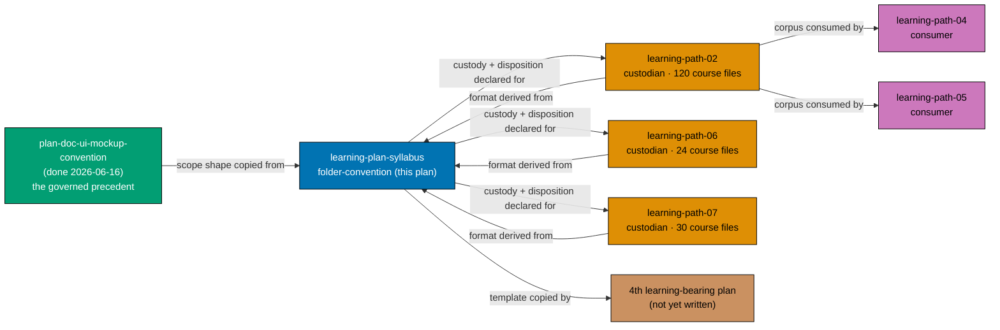
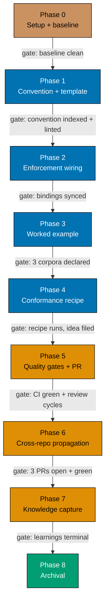

# Learning-Plan `syllabus/` Folder Convention

Establish the **learning-bearing** counterpart to the governed UI-bearing rule: a written convention
for the `syllabus/` folder that three plans have already grown by imitation, a copy-paste **course
template** derived from the existing corpus, an answer to **where a syllabus corpus goes on
archival**, and a **custody rule** for a corpus shared across plans.

## Status

Backlog (promoted from the `learning-plan-syllabus-folder-convention` two-pager).

## Context

The repo governs the UI case well and the learning case not at all.

A **UI-bearing** plan must record a complete design funnel in its `prd.md` — Diverge (≥ 2 named
low-fi alternatives), Narrow (hi-fi `.excalidraw.png` finalists in the plan's `assets/`), Select (the
named choice), Justify (a rationale table). The rule is written in
[diagrams.md §UI Mockups in Plan Docs](../../../repo-governance/conventions/formatting/diagrams/ui-mockups-principles-and-scope.md#ui-mockups-in-plan-docs-principles-in-practice-and-scope)
`[Repo-grounded]`, referenced from
[plans.md §Multi-File Structure](../../../repo-governance/conventions/structure/plans/multi-file-structure-layout-and-core-files.md#multi-file-structure)
`[Repo-grounded]`, and enforced by `plan-checker` Step 5k `[Repo-grounded]`.

**Learning-bearing** plans have no equivalent rule, yet three of them have independently grown a
`syllabus/` folder holding `courses/` and `paths/` `[Repo-grounded]`:

| Plan (custodian)                                                                                                                                        | `courses/` files | `courses/README.md` | `paths/` manifests |
| ------------------------------------------------------------------------------------------------------------------------------------------------------- | ---------------: | ------------------- | -----------------: |
| [`ayokoding-learning-path-02-schema-and-prerequisite-dag`](../../in-progress/ayokoding-learning-path-02-schema-and-prerequisite-dag/syllabus/README.md) |              120 | present             |                  4 |
| [`ayokoding-learning-path-06-skills-accounting`](../../backlog/ayokoding-learning-path-06-skills-accounting/README.md)                                  |               24 | absent              |                  2 |
| [`ayokoding-learning-path-07-skills-erp`](../../backlog/ayokoding-learning-path-07-skills-erp/README.md)                                                |               30 | absent              |                  2 |

Plan 02's 120 standalone course files plus 7 capstones embedded in host-topic files make up the
**127-course catalog** its `syllabus/courses/README.md` describes `[Repo-grounded]`. None of the
format is specified anywhere: it exists only as worked examples, transmitted by whoever reads one
first.

That transmission has already failed twice, and both failures are verifiable in the tree:

1. **Two concurrent authors invented their own templates.** While plans 06 and 07 were being
   authored on 2026-07-22, both agents began drafting syllabi in formats of their own and had to be
   redirected by hand to mirror an existing course file. `[Judgment call — reported by the
orchestrating session; no committed artifact records the redirection]`
2. **A format fork already landed, inside the canonical corpus, and no gate caught it.** 17 of plan
   02's 120 course files render their `co-NN` concepts and `ex-NN` worked examples as an **ordered
   list**, while 97 use **bullets** — and the same 17 files also omit the `**Short summary**` header
   line, a 17-of-17 correlation that marks them as a distinct authoring cohort `[Repo-grounded]`.
   Plans 06 and 07 are uniformly bullets, so the fork is **within** the canonical corpus, not between
   plans. Full census in [tech-docs.md §Corpus Census](./tech-docs.md#corpus-census--the-derivation-basis).

Custody has the same shape of gap. Plan 02 custodies a corpus that plans 04 and 05 consume, and it
sits in **Wave 1** while its consumers sit in Waves 2 and 3 `[Repo-grounded]` — so the custodian
archives _before_ its consumers finish. Which plan may edit a shared corpus, and what happens to the
corpus when its custodian archives, are both unanswered.

## Scope

**In scope:**

- One new convention document,
  `repo-governance/conventions/structure/learning-plan-syllabus.md`, defining **learning-bearing**
  (the trigger analogous to UI-bearing), the required `syllabus/` layout, and the per-course shape.
- A **copy-paste course template** embedded as a fenced block in that convention, derived from the
  measured section census of the 174 existing course files — mirroring how
  [diagrams.md](../../../repo-governance/conventions/formatting/diagrams/ui-mockups-principles-and-scope.md#ui-mockups-in-plan-docs-principles-in-practice-and-scope)
  ships the funnel record as a copy-paste block.
- A **Corpus Disposition** rule answering where a syllabus corpus goes on archival, with a
  falsifiable promotion trigger.
- A **custody rule** for a corpus shared by several plans: single custodian, read-only consumers,
  change requests routed to the custodian, and an archival hand-off procedure.
- **Enforcement wiring** across the plan maker → checker → fixer chain, the
  `plan-creating-project-plans` skill, and the `plan-quality-gate` workflow — the same chain that
  carries the UI rule.
- A **documented conformance recipe** (runnable `grep` commands) authors and checkers can apply
  today, plus a two-pager filing the deterministic validator as future work.
- Declaring custodian + disposition for the three existing corpora as the worked example.

**Out of scope:**

- **Retrofitting the 174 existing course files** to any newly specified shape. The convention is
  derived from them, so they are the reference, not the debt. The 17-file ordered-list cohort is
  explicitly grandfathered.
- **Building a `rhino-cli` conformance validator.** A deterministic check should follow a settled
  format, not precede it; this plan files it as an idea instead.
- **Anything about `assets/`, UI mockups, or the UI-design funnel.** That half is already governed;
  this plan closes the asymmetry without restating the governed side.
- **Moving any existing corpus out of `plans/`.** The disposition rule names the trigger that would
  require such a move; no move is performed here.
- Changing how ayokoding-www renders courses, or authoring any course body.

## Approach Summary

1. **Phase 0 — Environment setup and baseline.** Worktree, toolchain, green markdown/link/README-index
   baseline.
2. **Phase 1 — Convention document + template.** Author
   `repo-governance/conventions/structure/learning-plan-syllabus.md` with the learning-bearing
   trigger, the folder layout, the census-derived course template, the Corpus Disposition rule, and
   the custody rule. Index it.
3. **Phase 2 — Enforcement wiring.** Teach `plan-maker` to require it, `plan-checker` to flag it
   (a Step 5n sibling to 5k), `plan-fixer` to scaffold it, the `plan-creating-project-plans` skill to
   describe it, and `plan-quality-gate` to list it; re-sync platform bindings.
4. **Phase 3 — Worked example.** Declare `## Corpus Disposition` and `**Custodian**` for the three
   existing corpora; add the consumer-side custody note to plans 04 and 05.
5. **Phase 4 — Conformance recipe + validator deferral.** Ship the runnable `grep` recipe in the
   convention and file the deterministic validator as a two-pager.
6. **Phase 5 — Quality gates, draft PR, CI, and the three PR-review cycles.** The PR is deliberately
   left open: under the Archival-in-PR rule, knowledge capture and archival land inside this same PR.
7. **Phase 6 — Cross-repo propagation.** One worktree and one PR each for `ose-primer` and
   `ose-infra`, carrying the convention and its enforcement — not the `plans/` corpora. Reviewed and
   green, but deliberately unmerged.
8. **Phase 7 — Knowledge capture**, committed to the PR branch.
9. **Phase 8 — Plan archival**, also committed to the PR branch, then the `ose-public` merge, then the
   two sibling merges in that order, then worktree removal.

## Where this plan sits

## Delivery flow

## Documents

| Document                       | Purpose                                                                       |
| ------------------------------ | ----------------------------------------------------------------------------- |
| [brd.md](./brd.md)             | WHY — business rationale, affected roles, success checks, business risks      |
| [prd.md](./prd.md)             | WHAT — personas, user stories, Gherkin acceptance criteria, product scope     |
| [tech-docs.md](./tech-docs.md) | HOW — corpus census, design decisions, template design, file impact, rollback |
| [delivery.md](./delivery.md)   | DO — phased execution checklist with gates                                    |
| [learnings.md](./learnings.md) | Knowledge-capture running log, drained before archival                        |

> Home prefix normalised: absolute home-directory paths in this plan's files were rewritten to a portable form (such as `~/`, `$HOME/`, or a `<placeholder>`), so captured output here is not byte-verbatim.
