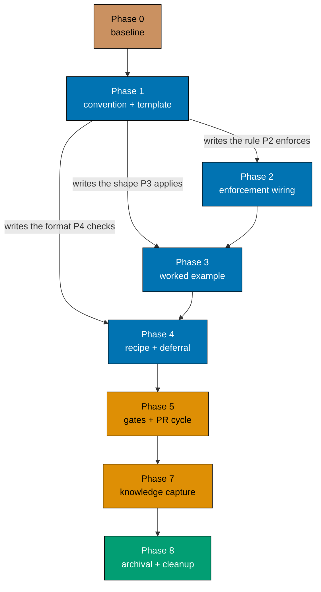

# Delivery — Learning-Plan `syllabus/` Folder Convention

> **Legend** — `[AI]`: an agent performs the step (the default; unmarked steps are `[AI]`).
> `[HUMAN]`: only a human can do it (physical action, out-of-band approval, real-secret or
> privileged-credential handling). `[AI+HUMAN]`: agent prepares, human approves or finishes.
>
> **Phase Gate** — every phase ends with a `### Phase N Gate` (must-pass verification) plus a
> `> **Pause Safety**:` note (the safe-to-stop state and the single command to resume). A phase
> is not complete until its gate is green; do not start phase N+1 while any gate check fails.
>
> **Acceptance-clause reading**: every clause below states the command **and its expected exit
> status**, because several are falsifiable only that way. This repo's `grep` is **ugrep**-backed:
> `-c` **exits 1 on a zero count**, `--glob VALUE` (space-separated) does not parse, and `-L`
> (files-**without**-match) exits 0 when it finds a non-matching file. Clauses therefore use
> `--include=`, never `-L`, and name the expected exit status explicitly.

## Worktree

Worktree path: `worktrees/learning-plan-syllabus-folder-convention/`

Optional manual pre-provisioning (run from repo root):

```bash
claude --worktree learning-plan-syllabus-folder-convention
```

The plan-execution Step 0 gate enters this worktree by default: it auto-provisions from the latest
`origin/main` when missing, syncs with `origin/main` before implementing, and prompts before deleting
the worktree after the plan is archived and pushed.

See [Worktree Path Convention](../../../repo-governance/conventions/structure/worktree-path.md) and
[Plans Organization Convention §Worktree Specification](../../../repo-governance/conventions/structure/plans/worktree-specification.md#worktree-specification).

## Delivery Mode: worktree-to-pr

The repo default. Work happens in the worktree above; a draft PR is opened against `main`; the
PR-Review Maker→Fixer Cycle runs before the merge; `[AI]` merges once the five hardened preconditions
hold. See
[Plans Organization Convention §Delivery Mode](../../../repo-governance/conventions/structure/plans/delivery-mode-the-four-modes.md#delivery-mode)
and the [PR Review Quality Gate workflow](../../../repo-governance/workflows/pr/pr-review-quality-gate.md).

## Surface Exemptions (declared, not skipped)

This plan ships no application or library code — every artifact is a governance markdown file — so
the following conditional gates are **exempt** and no step for them appears below. The reasoning is
recorded in [tech-docs §Exemptions Declared](./tech-docs.md#exemptions-declared):

| Gate                                        | Status | Reason                                        |
| ------------------------------------------- | ------ | --------------------------------------------- |
| Manual UI verification (Playwright MCP)     | Exempt | No user-facing screen or component is touched |
| Manual API verification (curl)              | Exempt | No API endpoint is touched                    |
| UI-design funnel (Step 5k)                  | Exempt | Not a UI-bearing plan                         |
| Specs & Gherkin delivery coverage (Step 5j) | Exempt | No observable behavior under `apps/`/`libs/`  |
| Rule-15 three-tester retest                 | Exempt | No web-UI feature change                      |
| Rule-16 API exploratory retest              | Exempt | No API feature change                         |
| TDD Red→Green→Refactor step shape           | N/A    | No step ships executable code                 |

## Parallelization Model

**N = 1 (serial spine).** This plan is deliberately serial, and the serialization is real rather than
incidental:

- **Phase 1 writes the source of truth** (`learning-plan-syllabus.md`) that Phase 2 wires agents to,
  Phase 3 applies to three corpora, and Phase 4 extends with a recipe. Every later phase reads what
  Phase 1 writes.
- **Phase 2 and Phase 3 both edit files the other reads indirectly** — Phase 2 changes what
  `plan-checker` demands, and Phase 3 produces the artifacts that demand is measured against — so
  running them concurrently risks Phase 3 satisfying a rule Phase 2 then changes.
- The only genuinely independent node is **Phase 4's two-pager** (`plans/ideas/`), which no other
  phase reads. It is small enough that fanning it out costs more coordination than it saves, so it
  stays in the spine.

Because there is exactly one independent node set, the plan is **one worktree → one branch → one
PR**, consistent with the 1-PR ↔ 1-worktree rule for a plan whose nodes cannot be separated.

**Cleanup is the terminal node**: worktree removal (Phase 8) depends on every delivery node and on
the archival commit being pushed.



## Phase 0: Environment Setup and Baseline

> _Executor: `repo-setup-manager`_

- [x] [AI] Promote the plan out of backlog (a pure move — neither stage carries a date prefix):
      `git mv plans/backlog/learning-plan-syllabus-folder-convention plans/in-progress/learning-plan-syllabus-folder-convention`
      — acceptance: `test -d plans/in-progress/learning-plan-syllabus-folder-convention` exits 0 and
      `test -d plans/backlog/learning-plan-syllabus-folder-convention` exits 1 - **Date**: 2026-07-22 · **Status**: done · done inside worktree on the PR branch; `git mv`
      succeeded, in-progress present, backlog gone.
- [x] [AI] Move the index line from `plans/backlog/README.md` to `plans/in-progress/README.md`
      — acceptance: `grep -c 'learning-plan-syllabus-folder-convention' plans/backlog/README.md`
      exits **1** (zero matches) while the same command against `plans/in-progress/README.md` exits 0,
      and `cargo run --release --quiet --manifest-path apps/rhino-cli/Cargo.toml -- md readme-index validate`
      exits 0
- [x] [AI] Provision the worktree from the latest `origin/main`:
      `git fetch origin && git worktree add -b learning-plan-syllabus-folder-convention worktrees/learning-plan-syllabus-folder-convention origin/main`
      — acceptance: `git worktree list` prints a line containing
      `worktrees/learning-plan-syllabus-folder-convention`; before this step it does not
- [x] [AI] Install dependencies in the root worktree: `npm install`
      — acceptance: exits 0 and `node_modules/` is present
- [x] [AI] Converge the toolchain in the root worktree: `npm run doctor -- --fix`
      — acceptance: exits 0 with no unresolved drift reported
- [x] [AI] Record the markdown baseline: `npm run lint:md`
      — acceptance: exits 0; if it exits non-zero, record every violation before changing anything
- [x] [AI] Record the link baseline:
      `cargo run --release --quiet --manifest-path apps/rhino-cli/Cargo.toml -- md links validate --exclude plans/done --exclude apps/ayokoding-www/content --exclude apps/ose-www/content`
      — acceptance: exits 0
- [x] [AI] Record the README-index baseline:
      `cargo run --release --quiet --manifest-path apps/rhino-cli/Cargo.toml -- md readme-index validate`
      — acceptance: exits 0
- [x] [AI] Resolve every preexisting failure recorded above before starting Phase 1
      — acceptance: all three baseline commands exit 0 on a re-run

### Phase 0 Gate

> All checks below must pass before starting Phase 1.

- [x] [AI] `npm run lint:md` exits 0
- [x] [AI] `cargo run --release --quiet --manifest-path apps/rhino-cli/Cargo.toml -- md links validate --exclude plans/done --exclude apps/ayokoding-www/content --exclude apps/ose-www/content` exits 0
- [x] [AI] `cargo run --release --quiet --manifest-path apps/rhino-cli/Cargo.toml -- md readme-index validate` exits 0
- [x] [AI] `git status --porcelain` prints no lines (the worktree is clean before work begins)

> **Pause Safety**: only the toolchain was verified and the baseline recorded — no convention work
> exists yet. Safe to stop indefinitely. To resume: re-run the three baseline commands and confirm
> they are still green.

<!-- phase-0-notes -->

> **Phase 0 execution notes** (2026-07-22): Worktree `worktrees/learning-plan-syllabus-folder-convention`
> provisioned from `origin/main` @ `0a3a0defb`; `npm install` + `npm run doctor -- --fix` both exit 0.
> Promote (`git mv backlog → in-progress`) done on the PR branch; index lines moved from
> `plans/backlog/README.md` to `plans/in-progress/README.md`. Baselines: `lint:md` 0, `readme-index` 0;
> `links validate` initially reported **8 broken links** caused by the promote (this plan's outbound
> `../ayokoding-learning-path-*` links, plus inbound links from
> `ayokoding-learning-path-02/syllabus/courses/README.md` and `plans/ideas/sibling-main-ci-never-runs-on-merge.md`).
> All 8 repaired (`../` → `../../backlog/` outbound; inbound repointed to `in-progress/`); re-validation
> clean. These inbound links will be repointed again to `plans/done/…` at Phase 8 archival.

## Phase 1: Convention Document and Course Template

> _Suggested executor: `repo-rules-maker`_

- [x] [AI] Create `repo-governance/conventions/structure/learning-plan-syllabus.md` (_New file_;
      siblings: `plans.md`, `worktree-path.md`) with a single H1, a `## Principles Implemented/Respected`
      section, and `## Purpose` / `## Scope` sections matching the shape of
      `repo-governance/conventions/structure/worktree-path.md`
      — acceptance: `test -f repo-governance/conventions/structure/learning-plan-syllabus.md` exits 0;
      before this step it exits 1
- [x] [AI] Write the **learning-bearing trigger** section into that file per
      [tech-docs DD-03](./tech-docs.md#dd-03--learning-bearing-is-defined-by-delivery-effect-mirroring-ui-bearing),
      including at least two positive and two negative worked examples
      — acceptance: `grep -c 'learning-bearing' repo-governance/conventions/structure/learning-plan-syllabus.md`
      exits 0 printing a count ≥ 3
- [x] [AI] Write the **required folder layout** section (`syllabus/README.md`, `syllabus/courses/`,
      `syllabus/paths/`, per-subfolder READMEs REQUIRED for new corpora) per
      [tech-docs DD-04](./tech-docs.md#dd-04--the-required-layout-is-syllabuscourses--syllabuspaths-both-with-a-readme)
      — acceptance: `grep -c 'syllabus/paths' repo-governance/conventions/structure/learning-plan-syllabus.md`
      exits 0 printing a count ≥ 1
- [x] [AI] **Re-measure the census before reproducing it.** The census in
      [tech-docs §Section frequency](./tech-docs.md#section-frequency-the-tiering-evidence) is pinned
      to commit `e398b8d39`, but corpora 06 and 07 remain under active authorship, so the live counts
      may have drifted. Re-run the per-file measurement (iterate `*.md` under each corpus's
      `syllabus/courses/`, skipping `README.md` and `surgery.md`, test each with `grep -q '<pattern>'`)
      across all three corpora and reconcile any drift into **both** the tech-docs table and the
      convention before writing it — acceptance: the live per-file counts for plans 02/06/07 match the
      Total row and every per-plan column in the tech-docs §Section frequency table; if they differ,
      update the tech-docs table (and the derived Totals/percentages) first, then proceed. Tiers are
      re-derived from the fresh counts, not inherited
- [x] [AI] Write the **census + tiering** section reproducing the (reconciled) table in
      [tech-docs §Section frequency](./tech-docs.md#section-frequency-the-tiering-evidence), and state
      the derivation rule (REQUIRED ≥ 99%, RECOMMENDED ≥ 80%, OPTIONAL below) so the tiers can be
      re-measured rather than inherited
      — acceptance: `grep -c 'RECOMMENDED' repo-governance/conventions/structure/learning-plan-syllabus.md`
      exits 0 printing a count ≥ 2
- [x] [AI] Write the **copy-paste course template** as one fenced ` ```markdown ` block containing every
      REQUIRED section with placeholder content, followed by separately labelled RECOMMENDED and
      OPTIONAL blocks, per
      [tech-docs DD-02](./tech-docs.md#dd-02--the-template-ships-as-a-fenced-block-inside-the-convention-not-as-a-separate-file)
      — acceptance: `grep -c 'Course ID' repo-governance/conventions/structure/learning-plan-syllabus.md`
      exits 0 printing a count ≥ 1, **and** `grep -c '^## In which paths' repo-governance/conventions/structure/learning-plan-syllabus.md`
      exits 0 (the template's last REQUIRED section is present verbatim)
- [x] [AI] Write the **`## Corpus Disposition`** rule (three values, the default, the
      name-the-non-plan-reader promotion trigger) per
      [tech-docs DD-07](./tech-docs.md#dd-07--corpus-disposition-the-corpus-stays-in-plans-by-default)
      — acceptance: `grep -c 'archive-with-plan' repo-governance/conventions/structure/learning-plan-syllabus.md`
      exits 0 printing a count ≥ 1, **and**
      `grep -c 'promote-to:' repo-governance/conventions/structure/learning-plan-syllabus.md`
      exits 0 printing a count ≥ 1
- [x] [AI] Write the **custody rule** (single custodian, read-only consumers, change requests routed to
      the custodian, the two archival hand-off branches, and the `md links validate` backstop) per
      [tech-docs DD-08](./tech-docs.md#dd-08--custody-one-custodian-read-only-consumers-routed-change-requests)
      — acceptance: `grep -c 'Custodian' repo-governance/conventions/structure/learning-plan-syllabus.md`
      exits 0 printing a count ≥ 2
- [x] [AI] Write the **grandfathering** paragraph naming the 17-file ordered-list cohort as
      pre-existing and out of scope for retrofit per
      [tech-docs DD-06](./tech-docs.md#dd-06--bullets-are-canonical-the-17-file-ordered-list-cohort-is-grandfathered)
      — acceptance: `grep -c 'grandfather' repo-governance/conventions/structure/learning-plan-syllabus.md`
      exits 0 printing a count ≥ 1
- [x] [AI] Add the index entry to `repo-governance/conventions/structure/README.md` in the
      `## Documents` list, alphabetically between the `Instruction-File Size Budget` and
      `Per-Directory Licensing` entries
      — acceptance: `grep -c 'learning-plan-syllabus.md' repo-governance/conventions/structure/README.md`
      exits 0 printing a count ≥ 1; before this step it exits 1
- [x] [AI] Add the top-level index entry to `repo-governance/conventions/README.md` alongside the other
      structure conventions
      — acceptance: `grep -c 'learning-plan-syllabus' repo-governance/conventions/README.md` exits 0
      printing a count ≥ 1; before this step it exits 1
- [x] [AI] Add the cross-reference in `repo-governance/conventions/structure/plans.md` §Multi-File
      Structure, immediately after the existing sentence describing the UI-bearing `prd.md`
      requirement, without altering that sentence
      — acceptance: `grep -c 'learning-plan-syllabus' repo-governance/conventions/structure/plans.md`
      exits 0 printing a count ≥ 1, **and** `grep -c 'UI-design-funnel record' repo-governance/conventions/structure/plans.md`
      still exits 0 (the UI sentence survives untouched)

### Phase 1 Gate

> All checks below must pass before starting Phase 2.

- [x] [AI] `test -f repo-governance/conventions/structure/learning-plan-syllabus.md` exits 0
- [x] [AI] `cargo run --release --quiet --manifest-path apps/rhino-cli/Cargo.toml -- md readme-index validate` exits 0 — proves the new convention is indexed, not orphaned
- [x] [AI] `cargo run --release --quiet --manifest-path apps/rhino-cli/Cargo.toml -- md links validate --exclude plans/done --exclude apps/ayokoding-www/content --exclude apps/ose-www/content` exits 0
- [x] [AI] `npm run lint:md` exits 0
- [x] [AI] `git status --porcelain repo-governance/` lists exactly these four paths and no others:
      `conventions/structure/learning-plan-syllabus.md`, `conventions/structure/README.md`,
      `conventions/README.md`, `conventions/structure/plans.md`

> **Pause Safety**: the convention exists, is indexed, and lints clean; no agent or plan yet depends
> on it, so a reader who stops here finds a documented-but-unenforced rule — coherent and harmless.
> To resume: re-run the Phase 1 Gate commands.

## Phase 2: Enforcement Wiring

> _Suggested executor: `repo-rules-maker`_

- [x] [AI] Edit `.claude/agents/plan-maker.md`: add a section headed
      "Learning-Bearing Plans — Mandatory Syllabus Record (HARD RULE)", modelled on the existing
      `## UI-Bearing Plans — Mandatory Design Funnel (HARD RULE)` section, requiring the folder
      layout, the template-derived course shape, the `## Corpus Disposition` declaration, and the
      custodian line, plus the delivery steps that produce them
      — acceptance: `grep -c 'learning-bearing' .claude/agents/plan-maker.md` exits 0 printing a count
      ≥ 2; before this step it exits 1
- [x] [AI] Edit `.claude/agents/plan-checker.md`: add an H3 numbered
      "20. Learning-Bearing Syllabus Completeness (Step 5n — CONDITIONAL)" after the existing
      Step 5m section, with `#### What to Validate` and
      `#### Finding Severity` subsections mirroring Step 5k's structure and HIGH severity
      — acceptance: `grep -c 'Step 5n' .claude/agents/plan-checker.md` exits 0 printing a count ≥ 1,
      **and** `grep -c 'Step 5m' .claude/agents/plan-checker.md` still exits 0 (the existing step is
      not displaced)
- [x] [AI] Edit `.claude/agents/plan-fixer.md`: add the scaffold action for a missing syllabus record,
      modelled on the existing Step 5k funnel-scaffold action
      — acceptance: `grep -c 'syllabus' .claude/agents/plan-fixer.md` exits 0 printing a count ≥ 1;
      before this step it exits 1
- [x] [AI] Edit `.claude/skills/plan-creating-project-plans/SKILL.md`: add a learning-bearing section
      beside the existing `## UI Mockups in UI-Bearing Plans — the UI-design-funnel (HARD RULE)`
      section, pointing at the new convention
      — acceptance: `grep -c 'learning-bearing' .claude/skills/plan-creating-project-plans/SKILL.md`
      exits 0 printing a count ≥ 1; before this step it exits 1
- [x] [AI] Edit `repo-governance/workflows/plan/plan-quality-gate.md`: add a Step 5n bullet to the
      **Validation scope** list in Step 1, immediately after the existing Step 5k bullet
      — acceptance: `grep -c '5n' repo-governance/workflows/plan/plan-quality-gate.md` exits 0 printing
      a count ≥ 1; before this step it exits 1
- [x] [AI] Verify the new prose is vendor-neutral: no vendor product name appears outside a
      `Platform Binding Examples` heading in any edited `repo-governance/` file, per the
      [Governance Vendor-Independence Convention](../../../repo-governance/conventions/structure/governance-vendor-independence.md)
      — acceptance: the repo's vendor-audit check reports zero findings for the edited files
- [x] [AI] Regenerate the platform-binding mirrors: `npm run generate:bindings`
      — acceptance: exits 0, **and** `git status --porcelain .opencode/agents/` lists the three
      regenerated mirror files; re-running the command a second time leaves
      `git status --porcelain .opencode/agents/` unchanged (the generator is idempotent)

### Phase 2 Gate

> All checks below must pass before starting Phase 3.

- [x] [AI] `grep -c 'learning-bearing' .claude/agents/plan-maker.md` exits 0
- [x] [AI] `grep -c 'Step 5n' .claude/agents/plan-checker.md` exits 0
- [x] [AI] `grep -c 'learning-bearing' .opencode/agents/plan-checker.md` exits 0 — proves the mirror was regenerated, not skipped
- [x] [AI] `npm run generate:bindings` exits 0 and leaves `git status --porcelain .opencode/` unchanged on a second consecutive run
- [x] [AI] `npm run lint:md` exits 0
- [x] [AI] `cargo run --release --quiet --manifest-path apps/rhino-cli/Cargo.toml -- md links validate --exclude plans/done --exclude apps/ayokoding-www/content --exclude apps/ose-www/content` exits 0

> **Pause Safety**: the rule is written and the chain enforces it, but no existing corpus has been
> annotated yet. A learning-bearing plan authored from this point forward is governed; existing plans
> are untouched and still valid. Safe to stop. To resume: re-run the Phase 2 Gate commands.

## Phase 3: Worked Example — Declare Custody and Disposition

> **Coordination note**: plans 06 and 07 were under active authorship on 2026-07-22. Confirm no other
> agent holds those folders before editing — `git status --porcelain plans/backlog/` must be clean for
> the target paths at the start of this phase.

- [x] [AI] Add a `**Custodian**: ayokoding-learning-path-02-schema-and-prerequisite-dag` line to
      `plans/backlog/ayokoding-learning-path-02-schema-and-prerequisite-dag/syllabus/README.md`,
      directly beneath its H1
      — acceptance: `grep -c 'Custodian' plans/backlog/ayokoding-learning-path-02-schema-and-prerequisite-dag/syllabus/README.md`
      exits 0 printing a count ≥ 1; before this step it exits 1
- [x] [AI] Add a `## Corpus Disposition` section declaring `archive-with-plan` to
      `plans/backlog/ayokoding-learning-path-02-schema-and-prerequisite-dag/tech-docs.md`, naming the
      absence of any non-plan reader as the justification
      — acceptance: `grep -c '## Corpus Disposition' plans/backlog/ayokoding-learning-path-02-schema-and-prerequisite-dag/tech-docs.md`
      exits 0 printing a count ≥ 1; before this step it exits 1
- [x] [AI] Repeat both edits for `ayokoding-learning-path-06-skills-accounting` (its own
      `syllabus/README.md` and `tech-docs.md`)
      — acceptance: `grep -c 'Custodian' plans/backlog/ayokoding-learning-path-06-skills-accounting/syllabus/README.md`
      exits 0 **and** `grep -c '## Corpus Disposition' plans/backlog/ayokoding-learning-path-06-skills-accounting/tech-docs.md`
      exits 0
- [x] [AI] Repeat both edits for `ayokoding-learning-path-07-skills-erp`
      — acceptance: `grep -c 'Custodian' plans/backlog/ayokoding-learning-path-07-skills-erp/syllabus/README.md`
      exits 0 **and** `grep -c '## Corpus Disposition' plans/backlog/ayokoding-learning-path-07-skills-erp/tech-docs.md`
      exits 0
- [x] [AI] Add the consumer declaration
      `custodied-by: ayokoding-learning-path-02-schema-and-prerequisite-dag` to
      `plans/backlog/ayokoding-learning-path-04-course-authoring/tech-docs.md`, with a one-line note
      that the plan reads but does not edit that corpus
      — acceptance: `grep -c 'custodied-by' plans/backlog/ayokoding-learning-path-04-course-authoring/tech-docs.md`
      exits 0 printing a count ≥ 1; before this step it exits 1
- [x] [AI] Add the same consumer declaration to
      `plans/backlog/ayokoding-learning-path-05-manifests/tech-docs.md`
      — acceptance: `grep -c 'custodied-by' plans/backlog/ayokoding-learning-path-05-manifests/tech-docs.md`
      exits 0 printing a count ≥ 1; before this step it exits 1
- [x] [AI] Verify no course or manifest **body** was modified by this phase
      — acceptance: `git status --porcelain plans/backlog/*/syllabus/courses/ plans/backlog/*/syllabus/paths/`
      prints no lines; any printed line means a course or manifest body was touched and the
      no-retrofit rule (DD-11) was violated

### Phase 3 Gate

> All checks below must pass before starting Phase 4.

- [x] [AI] All three `syllabus/README.md` files contain a `**Custodian**` line — run
      `grep -c 'Custodian' plans/backlog/ayokoding-learning-path-02-schema-and-prerequisite-dag/syllabus/README.md plans/backlog/ayokoding-learning-path-06-skills-accounting/syllabus/README.md plans/backlog/ayokoding-learning-path-07-skills-erp/syllabus/README.md`
      and confirm it exits 0 printing a non-zero count for each of the three files
- [x] [AI] `git status --porcelain plans/backlog/*/syllabus/courses/ plans/backlog/*/syllabus/paths/` prints no lines — no course or manifest body was touched
- [x] [AI] `npm run lint:md` exits 0
- [x] [AI] `cargo run --release --quiet --manifest-path apps/rhino-cli/Cargo.toml -- md links validate --exclude plans/done --exclude apps/ayokoding-www/content --exclude apps/ose-www/content` exits 0

> **Pause Safety**: every existing corpus now carries a written owner and a written end-of-life, and
> no course body changed. Stopping here leaves the repo strictly better documented than before. To
> resume: re-run the Phase 3 Gate commands.

## Phase 4: Conformance Recipe and Validator Deferral

- [x] [AI] Add a `## Conformance Recipe` section to
      `repo-governance/conventions/structure/learning-plan-syllabus.md` whose commands iterate the
      `*.md` files under a corpus's `syllabus/courses/`, skip `README.md` and `surgery.md`, and test
      each file with `grep -q '<pattern>' "$file"` — the per-file loop described in
      [tech-docs §Reproducing these numbers](./tech-docs.md#section-frequency-the-tiering-evidence).
      The recipe MUST NOT use `grep -L` (files-**without**-match; exits 0 when it finds one) and MUST
      NOT use space-separated `--glob VALUE`, which this repo's ugrep-backed `grep` does not parse
      — acceptance: `grep -c 'Conformance Recipe' repo-governance/conventions/structure/learning-plan-syllabus.md`
      exits 0 printing a count ≥ 1, **and** no command line inside the recipe's fenced blocks contains
      the token `grep -L` or `--glob` (read the fenced blocks and confirm; a prose sentence
      explaining why those flags are banned is expected and does not violate this)
- [x] [AI] Run the recipe against all three existing corpora and paste its output into this checklist
      as a fenced block
      — acceptance: the output shows plan 02 reporting exactly one file,
      `syllabus/courses/capstone-forge-ready.md`, missing the REQUIRED `**Scope note**` and
      `## Concepts` sections `[Repo-grounded]`, and plans 06 and 07 reporting zero
      REQUIRED-section misses `[Repo-grounded]`; any other
      result means the recipe or the census in
      [tech-docs §Section frequency](./tech-docs.md#section-frequency-the-tiering-evidence)
      is wrong and both must be re-derived before proceeding

  Recipe output (run 2026-07-22 against all three corpora):

  ```text
  === ayokoding-learning-path-02-schema-and-prerequisite-dag ===
  MISS capstone-forge-ready.md: Scope-note Concepts
  === ayokoding-learning-path-06-skills-accounting ===
  (no misses)
  === ayokoding-learning-path-07-skills-erp ===
  (no misses)
  ```

  Matches acceptance exactly: plan 02 reports only the capstone variant missing `**Scope note**` +
  `## Concepts`; plans 06 and 07 report zero REQUIRED-section misses.

- [x] [AI] Create `plans/ideas/syllabus-conformance-validator.md` (_New file_) as a two-pager per the
      [Ideas Folder convention](../../../repo-governance/conventions/structure/plans/ideas-folder-overview-rationale-and-file-layout.md#ideas-folder-two-pagers),
      covering all eight required sections and citing this plan as prior art
      — acceptance: `test -f plans/ideas/syllabus-conformance-validator.md` exits 0; before this step
      it exits 1
- [x] [AI] Add the two-pager's index line to `plans/ideas/README.md` in the `## Two-Pagers` list
      — acceptance: `grep -c 'syllabus-conformance-validator' plans/ideas/README.md` exits 0 printing
      a count ≥ 1, **and**
      `cargo run --release --quiet --manifest-path apps/rhino-cli/Cargo.toml -- md readme-index validate`
      exits 0 (an unindexed two-pager would be reported as an orphan)

### Phase 4 Gate

> All checks below must pass before starting Phase 5.

- [x] [AI] `grep -c 'Conformance Recipe' repo-governance/conventions/structure/learning-plan-syllabus.md` exits 0
- [x] [AI] `test -f plans/ideas/syllabus-conformance-validator.md` exits 0
- [x] [AI] `cargo run --release --quiet --manifest-path apps/rhino-cli/Cargo.toml -- md readme-index validate` exits 0
- [x] [AI] `npm run lint:md` exits 0

> **Pause Safety**: the convention is complete, applied, and carries a check an author can run today;
> the deterministic validator is filed as an idea rather than half-built. Safe to stop. To resume:
> re-run the Phase 4 Gate commands.

## Phase 5: Quality Gates, PR, and CI

### Local Quality Gates (Before Push)

- [x] [AI] Run affected typecheck: `npx nx affected -t typecheck` — acceptance: exits 0
- [x] [AI] Run affected linting: `npx nx affected -t lint` — acceptance: exits 0
- [x] [AI] Run affected quick tests: `npx nx affected -t test:quick` — acceptance: exits 0
- [x] [AI] Run affected spec coverage: `npx nx affected -t specs:coverage` — acceptance: exits 0
- [x] [AI] Run markdown linting: `npm run lint:md` — acceptance: exits 0
- [x] [AI] Fix ALL failures — including preexisting issues not caused by these changes
- [x] [AI] Re-run every failing check to confirm resolution — acceptance: all commands above exit 0

> **Important**: Fix ALL failures found during quality gates, not just those caused by your changes.
> This follows the root cause orientation principle — proactively fix preexisting errors encountered
> during work. Commit preexisting fixes separately with appropriate conventional commit messages.

### Commit Guidelines

- [x] [AI] Commit thematically — the convention, the enforcement wiring, the corpus declarations, and
      the two-pager are four separate concerns and get separate commits
- [x] [AI] Follow Conventional Commits: `docs(governance): add learning-plan syllabus convention`,
      `feat(agents): enforce learning-bearing syllabus record`, and so on
- [x] [AI] Keep any preexisting fix in its own commit, separate from plan work
      — acceptance: `git log --oneline origin/main..HEAD` shows one commit per concern with no
      bundled unrelated changes

### PR and Post-Push CI Verification

- [x] [AI] Commit and push to origin `learning-plan-syllabus-folder-convention`
      — acceptance: `git status --porcelain` prints no lines afterwards, and
      `git rev-parse HEAD` equals `git rev-parse origin/learning-plan-syllabus-folder-convention`
- [x] [AI] Open a draft PR against `main`:
      `gh pr create --draft --base main --title 'docs(governance): learning-plan syllabus folder convention' --body-file plans/in-progress/learning-plan-syllabus-folder-convention/README.md`
      (the plan folder has already moved to `in-progress/` by execution time)
      — acceptance: `gh pr list --head learning-plan-syllabus-folder-convention --json number` returns
      a non-empty array
- [x] [AI] Monitor the PR's check run, polling every 2 minutes with one
      `gh run view --json status,conclusion` per wakeup — never `gh run watch`, never a tight loop
      — acceptance: every check reports `conclusion: success`
- [x] [AI] If any CI check fails, fix the root cause and push a follow-up commit; repeat until every
      check is green — acceptance: zero failing checks on the PR

### PR-Review Maker→Fixer Cycle

- [x] [AI] Cycle 1: run `pr-review-maker`, then `pr-review-fixer`, then wait for a green CI run
      — acceptance: the cycle's findings are all addressed and CI is green before cycle 2 starts
- [x] [AI] Cycle 2: run `pr-review-maker`, then `pr-review-fixer`, then wait for a green CI run
      — acceptance: as above
- [x] [AI] Cycle 3: run `pr-review-maker`, then `pr-review-fixer`, then wait for a green CI run
      — acceptance: 0 CRITICAL and 0 HIGH findings outstanding after this cycle, and the loop did not
      exit `escalated`

> **Do NOT merge here.** Under the `*-to-pr` Archival-in-PR rule, the Knowledge Capture commit
> (Phase 7) and the archival move (Phase 8) land **inside this same PR**, on the PR branch, before
> the merge. The merge is the final step of Phase 8. See
> [plan-execution §8 Archival-in-PR](../../../repo-governance/workflows/plan/plan-execution.md#8-finalization-and-archival-sequential).

### Phase 5 Gate

> All checks below must pass before starting Phase 6.

- [x] [AI] `gh pr view --json state` reports `OPEN` — the PR is reviewed and green but deliberately
      not yet merged
- [x] [AI] The PR's current head commit reports every check `conclusion: success`
- [x] [AI] Three review cycles are complete, every inline thread is answered, and 0 CRITICAL +
      0 HIGH findings remain outstanding
- [x] [AI] `git status --porcelain` prints no lines in the worktree

> **Pause Safety**: the PR carries the whole convention and its wiring, is fully reviewed, and CI is
> green — but nothing is merged, so `main` is untouched and the branch can be abandoned without
> consequence. Safe to stop. To resume: re-read `learnings.md` and continue with Phase 6.

## Phase 6: Cross-Repo Propagation to `ose-primer` and `ose-infra`

> **Why this phase exists.** The convention document, its two governance index entries, the
> `plans.md` cross-reference, and the `plan-maker` / `plan-checker` / `plan-fixer` edits are **shared
> governance surfaces**, not `ose-public` content. `DD-12` originally excluded propagation on the
> grounds that neither sibling carries a learning-bearing plan today. That reasoning conflates two
> different things: whether the rule has anything to _govern_ there, and whether the rule's _text and
> enforcement_ must exist there. They must — otherwise `plan-maker` in a sibling repo emits plans that
> `plan-checker` in `ose-public` would reject, which is drift by construction. Ratified by the user.
>
> **Sequencing.** Phase 5 deliberately leaves the `ose-public` PR **open and unmerged**, and Phase 8
> merges it as its final step. The sibling PRs are authored and reviewed _here_, concurrently, and
> merge in Phase 8 **after** `ose-public` merges — the convention's home repo lands first. Note the
> known structural limitation: this plan's folder is archived inside the `ose-public` PR while the
> sibling PRs may still be open, filed as
> [plan-archival-in-pr-multi-repo-gap](../../ideas/q2-not-urgent-important/plan-archival-in-pr-multi-repo-gap.md).
>
> **Both siblings are bare repositories.** `git -C <repo> rev-parse --is-bare-repository` reports
> `true` for each. Every git and tooling invocation below must therefore follow
> [the bare-repo landing method](../../../repo-governance/development/workflow/bare-repo-landing-method.md);
> a plain `git -C` write against either repo root will not behave as it does in `ose-public`.

### 6.1 — Confirm the propagation surface before copying anything

- [x] [AI] Enumerate the exact files this plan created or edited that are shared surfaces, from the
      File Impact table in [tech-docs.md](./tech-docs.md) — acceptance: the list contains the
      convention document, the two index entries, the `plans.md` cross-reference, the three
      plan-agent definitions, and the `plan-quality-gate` workflow entry; it contains **no**
      `plans/backlog/ayokoding-learning-path-*` path and no `plans/` corpus file, because those are
      `ose-public` content that does not exist in a sibling.
- [x] [AI] For each sibling, confirm the target file either exists or is legitimately absent:
      `for r in ose-primer ose-infra; do for p in <each shared path>; do git -C "$HOME/ose-projects/$r" cat-file -e "main:$p" 2>/dev/null || echo "ABSENT $r $p"; done; done`
      — acceptance: every `ABSENT` line is one you can justify in writing before proceeding. A silent
      empty result here is **not** a pass: run it once with a deliberately fake path appended to the
      list and confirm that path prints `ABSENT`, proving the probe reports absence at all.

### 6.2 — `ose-primer`: worktree, apply, PR

- [x] [AI] Create a worktree off `origin/main` per the bare-repo landing method — acceptance:
      `git -C ~/ose-projects/ose-primer worktree list` lists the new path
- [x] [AI] Run `npm install` **and** `npm run doctor -- --fix` in the new worktree, per
      [Worktree Toolchain Initialization](../../../repo-governance/development/workflow/worktree-setup.md)
      — acceptance: both exit 0
- [x] [AI] Apply the convention document and every shared-surface edit, **adapted to that repo's own
      existing text** — this is not a blind file copy. Where a sibling's `plan-checker.md` numbers its
      steps differently, the new step takes that repo's next free number, not `ose-public`'s
      — acceptance: the convention's normative content is identical; only numbering and surrounding
      prose differ
- [x] [AI] Regenerate platform bindings in the worktree: `npm run generate:bindings`
      — acceptance: exits 0, and `git status --porcelain` shows the `.opencode/` and `.amazonq/`
      artifacts regenerated rather than hand-edited
- [x] [AI] Run the repo's own gates: `npm run lint:md`, plus `md links validate`,
      `md heading-hierarchy validate` — acceptance: all exit 0
- [x] [AI] Open a draft PR — acceptance: `gh pr view --json state` reports `OPEN`
- [x] [AI] Run the PR-Review Maker→Fixer Cycle, **maximum 3 cycles** — acceptance: 0 CRITICAL +
      0 HIGH outstanding, every inline thread answered
- [x] [AI] **Do NOT merge.** The merge is ordered in Phase 8.

### 6.3 — `ose-infra`: worktree, apply, PR

- [x] [AI] Repeat every step of 6.2 against `~/ose-projects/ose-infra`
      — acceptance: same criteria, same 3-cycle review ceiling, same do-not-merge rule
- [x] [AI] Record any surface that legitimately differs in `ose-infra` (it is the private
      infrastructure repo and does not participate in every parity loop) — acceptance: each
      difference is written down with a reason, not silently skipped

### Phase 6 Gate

> All checks below must pass before starting Phase 7.

- [x] [AI] Both sibling PRs report `OPEN`, with every check `conclusion: success`
- [x] [AI] The convention's normative text is byte-identical across all three repos:
      `for r in ose-public ose-primer ose-infra; do git -C "$HOME/ose-projects/$r" show "<branch>:repo-governance/conventions/structure/learning-plan-syllabus.md" | shasum; done`
      prints **one distinct hash**. Negative control: appending a single character to any one copy
      makes it print two — run that mutation once and confirm it does, then revert it.
- [x] [AI] No sibling worktree holds uncommitted work: `git status --porcelain` prints nothing in each
- [x] [AI] `ose-public`'s PR is still `OPEN` and unmerged — propagation must not have merged it early

> **Pause Safety**: three PRs are open, reviewed and green; nothing is merged in any repo. Safe to
> stop. To resume: re-read `learnings.md` and continue with Phase 7.

## Phase 7: Knowledge Capture

> _Triage every surviving `learnings.md` entry before archival. See the
> [Knowledge Capture Convention](../../../repo-governance/development/quality/knowledge-capture.md)._

- [x] [AI] Apply the litmus test to every `learnings.md` entry — keep only if a durable surface would
      catch this automatically next time; discard the rest with a one-line reason
      — acceptance: every entry has either a route or a discard reason
- [x] [AI] Apply the **secret/sensitivity gate** to every surviving entry — sanitize any secret,
      credential, token, or private hostname to a `<placeholder>` token, or discard if unsanitizable
      — acceptance: `learnings.md` contains no raw secret
- [x] [AI] Apply the **repo-relevance gate** to every surviving entry — infra-private content stays in
      `ose-infra` only and is never cross-routed into `ose-public`/`ose-primer`
      — acceptance: no infra-private content appears in this repo's routed output
- [x] [AI] Route each surviving learning to exactly one durable home per the open-ended routing matrix
      — non-code homes may land inline (small edit) or as a `plans/backlog/` follow-up (large); code
      homes (`apps/`, `libs/`, tests) are ALWAYS filed as a separate `plans/backlog/<slug>/` plan and
      NEVER landed inline
      — acceptance: every `learnings.md` entry records its terminal routing state
- [x] [AI] If no generalizable learning surfaced, record the explicit escape in `learnings.md`:
      `No generalizable learnings — <one-line reason>`
      — acceptance: `learnings.md` is never silently empty

### Phase 7 Gate

> All checks below must pass before Plan Archival.

- [x] [AI] Every `learnings.md` entry is in a terminal state (routed inline, filed as backlog, or
      discarded with reason), or the file records the explicit "none" escape
- [x] [AI] No code-homed learning landed inline in this plan's own commits or PR

> **Pause Safety**: `learnings.md` is fully triaged (or explicitly recorded as empty); no future
> process depends on querying it later. Safe to stop. To resume: re-read `learnings.md` and confirm
> every entry is terminal.

## Phase 8: Plan Archival

- [x] [AI] Verify every delivery checklist item in Phases 0-6 is ticked
      — acceptance: reading `plans/in-progress/learning-plan-syllabus-folder-convention/delivery.md`
      from its top through the end of the Phase 7 Gate shows no `- [ ]` line; the only unticked boxes
      remaining are the ones in this Phase 8 section, which tick as they are performed
- [x] [AI] Verify the Knowledge Capture phase is complete — every `learnings.md` entry reached a
      terminal state or the file records the explicit `No generalizable learnings — <reason>` escape,
      and both safety gates were applied
- [x] [AI] Verify ALL quality gates pass (local + CI)
- [x] [AI] Manual behavioral verification is **exempt** for this plan — no UI surface and no API
      endpoint is touched (see [tech-docs §Exemptions](./tech-docs.md#exemptions-declared))
- [x] [AI] Rule-15 three-tester retest and Rule-16 API exploratory retest are **exempt** for the same
      reason — record the exemption rather than skipping it silently
- [x] [AI] Rename and move:
      `git mv plans/in-progress/learning-plan-syllabus-folder-convention plans/done/YYYY-MM-DD__learning-plan-syllabus-folder-convention`
      using the completion date, not the creation date
      — acceptance: `ls -d plans/done/*__learning-plan-syllabus-folder-convention` exits 0 printing
      exactly one path, and `test -d plans/in-progress/learning-plan-syllabus-folder-convention`
      exits 1
- [x] [AI] Update `plans/in-progress/README.md` — remove the plan entry
      — acceptance: `grep -c 'learning-plan-syllabus-folder-convention' plans/in-progress/README.md`
      exits **1**
- [x] [AI] Update `plans/done/README.md` — add the entry with the completion date
      — acceptance: `grep -c 'learning-plan-syllabus-folder-convention' plans/done/README.md` exits 0
- [x] [AI] Verify indexes are consistent:
      `cargo run --release --quiet --manifest-path apps/rhino-cli/Cargo.toml -- md readme-index validate`
      — acceptance: exits 0
- [x] [AI] Commit the archival **on the PR branch** and push it, per the Archival-in-PR rule:
      `git commit -m 'chore(plans): move learning-plan-syllabus-folder-convention to done'` then
      `git push origin learning-plan-syllabus-folder-convention`
      — acceptance: `gh pr view --json files` lists the `plans/done/…` paths, proving the archival
      move is inside the delivering PR rather than a follow-up commit on `main`
- [ ] [AI] Wait for CI on the PR's new head commit to go green
      — acceptance: every check reports `conclusion: success`
- [ ] [AI] Merge the PR once all five hardened preconditions hold (3 review cycles complete and not
      `escalated`; 0 CRITICAL + 0 HIGH outstanding; branch non-destructively up to date with
      `origin/main`; all quality gates green; tester gates exempt per
      [tech-docs §Exemptions](./tech-docs.md#exemptions-declared))
      — acceptance: `gh pr view --json state` reports `MERGED`
- [ ] [AI] **Merge the two sibling PRs from Phase 6, in that order and only now** — `ose-public` is the
      convention's home repo and lands first, so neither sibling can be the sole carrier of a rule its
      origin has not yet adopted — acceptance: `gh pr view --json state` reports `MERGED` for the
      `ose-primer` PR and for the `ose-infra` PR, and each merge commit's CI reports `conclusion: success`
- [ ] [AI] Re-run the byte-identity check from the Phase 6 Gate against the **merged** `main` of all
      three repos — acceptance: one distinct hash. This is the check that would catch a sibling PR
      that drifted between review and merge, which the Phase 6 Gate could not see.
- [ ] [AI] Remove the worktree **after** the merge completes:
      `git worktree remove worktrees/learning-plan-syllabus-folder-convention`
      — acceptance: `git worktree list` no longer prints a line containing
      `worktrees/learning-plan-syllabus-folder-convention`
- [ ] [AI] Remove both sibling worktrees created in Phase 6, after their merges complete
      — acceptance: `git -C ~/ose-projects/ose-primer worktree list` and the same for
      `ose-infra` no longer print this plan's worktree path

### Phase 8 Gate

> The terminal gate. All checks below must pass for the plan to be considered delivered.

- [x] [AI] `gh pr view --json state` reports `MERGED`, and the merged PR's file list includes the `plans/done/…` archival paths
- [x] [AI] `test -d plans/in-progress/learning-plan-syllabus-folder-convention` exits 1 and `ls -d plans/done/*__learning-plan-syllabus-folder-convention` exits 0
- [x] [AI] `cargo run --release --quiet --manifest-path apps/rhino-cli/Cargo.toml -- md readme-index validate` exits 0
- [x] [AI] `cargo run --release --quiet --manifest-path apps/rhino-cli/Cargo.toml -- md links validate --exclude plans/done --exclude apps/ayokoding-www/content --exclude apps/ose-www/content` exits 0
- [x] [AI] `git status --porcelain` prints no lines and nothing is unpushed

> **Pause Safety**: the plan is archived, indexed, and pushed; the worktree is removed. This is the
> terminal state. To verify later: re-run the two rhino-cli validators above.
