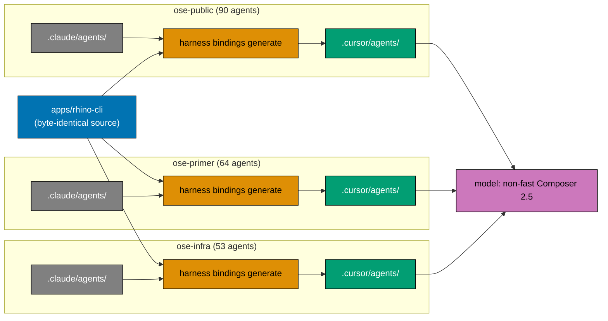

# Adopt a Cursor Platform Binding

Generate a Cursor-native agent binding at `.cursor/agents/` from `.claude/agents/` **in all three
sibling repositories** — `ose-public`, `ose-primer`, and `ose-infra` — pinning every delegated Cursor
subagent to Composer 2.5 with the fast toggle disabled, and amending each repo's own governance
surfaces, which currently classify Cursor as a no-binding Tier-1 harness.

## Read This First — What "Always" Can and Cannot Mean Here

The originating request was to "always use Composer 2.5 (non fast) when we use our agents in Cursor."
Research into Cursor's own documentation established that **"always" is not achievable from a file
committed to a repository**. This plan therefore delivers the strongest enforcement a repo file can
express, and documents the rest as out of reach rather than pretending to cover it.

| Surface                                                 | Reachable from a repo file?                              | What this plan does                                          |
| ------------------------------------------------------- | -------------------------------------------------------- | ------------------------------------------------------------ |
| Delegated **subagents** launched from `.cursor/agents/` | Yes — `model:` frontmatter                               | **Enforces** the pin (best-effort; see the bug caveat below) |
| Interactive Cursor Agent session                        | No — IDE model-picker state                              | Documents an onboarding note; claims nothing                 |
| `cursor-agent` CLI default model                        | No — project `.cursor/cli.json` accepts permissions only | Documents an onboarding note; claims nothing                 |
| Auto / Router mode                                      | No — overrides pins by design                            | Documents that it overrides; claims nothing                  |
| Org-wide default                                        | No — Enterprise dashboard                                | Points at Model Access Control as the only real lever        |

**Enforcement is best-effort, not guaranteed.** Cursor staff have confirmed two live defects: the
subagent `model:` frontmatter "can currently be ignored under certain conditions", and CLI subagents
have been observed auto-switching to `composer-2.5-fast` on their own. A fix was described as
"rolling out" with unclear scope. This plan therefore does not trust the frontmatter — it carries an
**empirical verification phase** that launches a real subagent and inspects which model actually
served it, and re-checks the Cursor changelog for both defects immediately before the mechanism is
locked in.

A plan that promised "always Composer 2.5 non-fast" would be false. This one does not — **and the
caveat propagates to all three repos**, so no repository's documentation overstates the guarantee
just because another repository states it correctly.

## Context

Each of the three sibling repositories maintains multi-harness compatibility across eleven
coding-agent harnesses [Repo-grounded — 11 entries under `repo-config.yml` `harness:`], with
`.claude/` as the single source of truth and `rhino-cli` generating
every secondary binding. Two generated bindings exist today in each repo: `.opencode/agents/` (a full
agent mirror with model, colour, and permission translation) and `.amazonq/` (a static bridge).
Cursor currently has **no committed binding at all** in any of them — `test -e .cursor` returns
non-zero in all three trees [Repo-grounded].

Cursor is nevertheless already wired into each repo's machinery in three places [Repo-grounded]:

- the `repo-config.yml` harness registry registers it as `tier: native` with `shadow: .cursor/rules`;
- `KNOWN_BINDING_DIRS` in `apps/rhino-cli/src/application/agents/bindings.rs` already lists
  `.cursor`;
- `.husky/pre-push` already fires `harness bindings validate` when `.cursor/` changes.

Because Cursor reads `.claude/agents/` natively when `.cursor/agents/` is absent, Cursor subagents
today receive the Anthropic tier aliases `opus` / `sonnet` / `haiku` — values Cursor does not
document as model IDs. What Cursor does with an unrecognised `model:` value is undocumented, which is
one of four unknowns this plan resolves empirically before writing any emitter code.

### The forcing function that makes this a three-repo plan

`apps/rhino-cli` is byte-identical across all three repositories, with zero carve-outs, per the
[SDLC Gate Standard](../../../docs/reference/sdlc-gate-standard.md). Every repo's `.husky/pre-commit`
runs `harness bindings generate` and auto-stages its output [Repo-grounded — verified in all three
`.husky/pre-commit` files]. Therefore the moment the emitter reaches a repository, that repository's
next commit **generates `.cursor/agents/` whether or not anyone asked it to**.

Propagating the emitter without also landing the binding and its governance record would leave two
repositories carrying an undocumented generated directory. The three-repo outcome is not an optional
extension of this plan — it is the only self-consistent shape it can take.

## Scope

### In scope

- A `.cursor/agents/` emitter in `apps/rhino-cli`, a sibling of the existing OpenCode converter,
  wired into `harness bindings generate` and guarded by mirror-parity validation.
- The tier mapping: **full tier collapse** — every Claude alias (`opus`, `sonnet`, `haiku`, and
  model-omitted) pins the same non-fast Composer 2.5 identifier. The emitter must never write
  `composer-2.5-fast`.
- Companion Gherkin under a new, dedicated `specs/apps/rhino/behavior/rhino-cli/gherkin/cursor-binding/`
  directory — sibling to the existing `harness/` directory, never nested inside it (see
  [`tech-docs.md`](./tech-docs.md) DD-15) — inside the three-repo byte-identity boundary and
  therefore identical in all three repos. The existing `harness/` directory (10 feature files) is
  never touched by this plan.
- **A complete landing in each of the three repositories**: generated `.cursor/agents/` output from
  that repo's own roster, that repo's `docs/reference/platform-bindings.md` catalog row, that repo's
  `multi-harness-binding.md` amendment, that repo's `CLAUDE.md` / `AGENTS.md` updates, that repo's
  `.prettierignore` handling, and that repo's validator coverage.
- `repo-harness-compatibility-checker` coverage for the new binding and its new drift axis, in each
  repo that carries the agent.
- Empirical verification that a real Cursor subagent is served by the pinned model.

### Out of scope

- `.cursor/rules/*.mdc`, `.cursor/mcp.json`, `.cursor/skills/`, `.cursor/cli.json` — no instruction,
  MCP, skill, or CLI surface is added in any repo.
- Any claim of enforcement over interactive sessions, the CLI default, or Auto mode.
- Enterprise Model Access Control configuration (a web-dashboard action outside every repo).
- Deriving Cursor's `readonly` / `is_background` frontmatter fields from Claude tool arrays — see
  [`brd.md` Non-Goals](./brd.md).
- Repairing pre-existing per-repo drift that this plan merely observes (for example `ose-infra`'s
  `.opencode/agents/ci-monitor-subagent.md`, which has no `.claude/agents/` source) — recorded in
  [`tech-docs.md`](./tech-docs.md) and routed, not fixed inline.

## Approach Summary

The work runs in five ordered movements:

1. **Verify the unknowns first.** Four claims the research explicitly refused to certify get resolved
   empirically, each with a stated fallback. No emitter code is written until they are answered.
2. **Build and guard the emitter, in `ose-public`.** A registry flip in `repo-config.yml`, a Cursor
   converter, wiring into generate, the companion `.feature` file and step definitions, and the
   generated output itself.
3. **Amend `ose-public`'s governance, prove the pin empirically, then land it.** Launch a real Cursor
   subagent, read back which model served it, commit the evidence, and only then open the PR.
4. **Land the same outcome in `ose-primer` and in `ose-infra`.** Two independent PRs in two
   independent repositories, each carrying the byte-identical `rhino-cli` source and Gherkin plus
   that repo's own generated output and its own governance amendments.
5. **Close.** Capture learnings, archive.

## Three Repos, Three PRs — and Where They Genuinely Differ

Only two things are byte-identical across the three repositories: `apps/rhino-cli` and
`specs/apps/rhino/behavior/rhino-cli/gherkin/`. **Every governance surface this plan touches differs
per repo** [Repo-grounded — checksum comparison of each file across the three trees]. The plan
therefore carries a per-repo verdict table rather than one shared step list.

| Divergence                                  | `ose-public`                     | `ose-primer`                                        | `ose-infra`                                       |
| ------------------------------------------- | -------------------------------- | --------------------------------------------------- | ------------------------------------------------- |
| `.claude/agents/` roster size               | 90                               | 64                                                  | 53                                                |
| `docs/reference/platform-bindings.md` shape | One table with a `Status` column | **Two** tables; capability table has no such column | One table with a `Current ose-infra state` column |
| Cursor's catalog status today               | `Status: Reserved`               | (no `Status` column on the capability table)        | `Current ose-infra state: Absent`                 |
| `multi-harness-binding.md` section headings | "Active Tier-1 bindings"         | "Tier 1 — Native AGENTS.md Readers"                 | "Active Tier-1 bindings"                          |
| `AGENTS.md` mentions "Cursor"               | Yes (1)                          | No (0)                                              | No (0)                                            |
| `.opencode/agents/README.md`                | Present                          | Absent                                              | Absent                                            |
| Pre-existing generated-mirror drift         | None                             | None                                                | `ci-monitor-subagent.md` orphan                   |

Full per-file verdicts, one table per repository, live in
[`tech-docs.md`](./tech-docs.md#governance-surface-verdict-tables-per-repo).

## Navigation

| Document                         | Contents                                                                                  |
| -------------------------------- | ----------------------------------------------------------------------------------------- |
| [`brd.md`](./brd.md)             | Why this exists: business goal, impact, affected roles, success signals, Non-Goals        |
| [`prd.md`](./prd.md)             | What gets built: personas, user stories, 19 Gherkin acceptance scenarios, product scope   |
| [`tech-docs.md`](./tech-docs.md) | How it is built: architecture, design decisions, per-repo verdict tables, unknowns        |
| [`delivery.md`](./delivery.md)   | The executable checklist: Phases 0-9, ten gates, three delivery boundaries, 23 TDD cycles |
| [`learnings.md`](./learnings.md) | Transient running log drained by the Knowledge Capture phase                              |

## Related

- [Multi-Harness Binding Convention](../../../repo-governance/conventions/structure/multi-harness-binding.md)
- [Platform Bindings Catalog](../../../docs/reference/platform-bindings.md)
- [SDLC Gate Standard](../../../docs/reference/sdlc-gate-standard.md)
- [Model Selection Convention](../../../repo-governance/development/agents/model-selection.md)
- [Bare-Repo Base-Worktree Landing Method](../../../repo-governance/development/workflow/bare-repo-landing-method.md)
- [Plans Organization Convention](../../../repo-governance/conventions/structure/plans.md)

> Home prefix normalised: absolute home-directory paths in this plan's files were rewritten to a portable form (such as `~/`, `$HOME/`, or a `<placeholder>`), so captured output here is not byte-verbatim.
