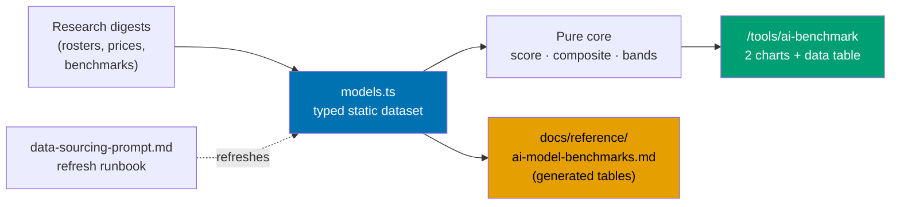

# AI Benchmark Tool — `/[locale]/tools/ai-benchmark`

A new public tool page on [ayokoding.com](https://ayokoding.com) that compares the AI models a
working engineer can actually select inside five coding harnesses — Codex CLI, Claude Code, Cursor,
OpenCode Go, and OpenCode Zen — on **capability** and on **token price**, split into three capability
classes named after the models that define their boundaries: `opus`, `sonnet`, and `light`.

## Context

An engineer choosing a model inside a coding harness today has to reconcile five vendor pricing
pages, four benchmark leaderboards, and five harness rosters that each move every few weeks. The
numbers that exist are scattered, self-reported, and frequently contradictory. Nothing on the public
web answers the actual question — _"of the models I can pick right now in the tool I already use,
which are frontier-class, which are the workhorse tier, which are the cheap tier, and what does each
cost per million tokens?"_

This page answers exactly that question from a **static, versioned, per-field-cited dataset**, and it
is honest about the fact that most of the numbers it republishes are vendor self-reports.

## Scope

**In scope**

- A bilingual (`en` + `id`) page at `/[locale]/tools/ai-benchmark` in `apps/ayokoding-www`.
- A typed static data module — `src/features/ai-benchmark/core/data/models.ts` — carrying the
  harness-union roster with a snapshot date, per-field source URL, per-field evidence grade, and a
  per-harness price set.
- A pure functional core computing normalized benchmark scores, a coverage-renormalized composite
  capability index, and the three-class band assignment anchored on Claude Opus 5 and Claude Sonnet 5.
- Two hand-rolled inline-SVG charts (capability index, token price), each banded into
  `opus` / `sonnet` / `light`.
- An always-visible full data table as the accessible text alternative to both charts.
- Client-side filters (harness, class) whose state lives in URL query params, so filtered views are
  linkable.
- Three colour-blind-safe, WCAG-AA, light-and-dark band design tokens.
- A refresh runbook at `apps/ayokoding-www/docs/ai-benchmark/data-sourcing-prompt.md`.
- Making the existing governance reference `docs/reference/ai-model-benchmarks.md` **derived from**
  the new data module rather than maintained in parallel.
- Gherkin scenarios plus vitest-cucumber unit steps and `playwright-bdd` e2e steps.

**Out of scope**

- Any runtime fetch of benchmark or pricing data. The dataset is static and hand-curated, refreshed
  by a documented human-plus-agent runbook — the same model the cost-of-living calculator uses.
- Cache-read, cache-write, batch, and long-context price tiers. Standard-tier input and output only
  (see [`brd.md`](./brd.md) and [`tech-docs.md`](./tech-docs.md) for why).
- Running any benchmark ourselves. This page republishes third-party figures with attribution; it
  produces no original measurement.
- A backend, an API, or a database. The page is fully static plus client-side filtering.
- Models reachable only through a raw vendor API but not selectable in any of the five harnesses.

## Approach summary

The page follows the **functional core / imperative shell** layout already proven by
`src/features/cost-of-living-calculator/`: everything numeric is a pure function over a typed static
dataset, and the React shell only renders and wires URL state.

## Documents

| Document                         | Contains                                                                                                                |
| -------------------------------- | ----------------------------------------------------------------------------------------------------------------------- |
| [`brd.md`](./brd.md)             | Why this page exists, who it serves, business risks, success signals                                                    |
| [`prd.md`](./prd.md)             | Personas, user stories, the complete UI design funnel, Gherkin acceptance criteria                                      |
| [`tech-docs.md`](./tech-docs.md) | Architecture, the scoring method in full, the honesty surface, file impact, and the verified research-snapshot appendix |
| [`delivery.md`](./delivery.md)   | Phased, TDD-shaped delivery checklist with phase gates, delivery boundaries, and quality gates                          |
| [`learnings.md`](./learnings.md) | Knowledge Capture running log, triaged before archival                                                                  |

## Delivery at a glance

- **Delivery Mode**: `worktree-to-pr` — see [`delivery.md`](./delivery.md#delivery-mode-worktree-to-pr).
- **Worktree**: one per delivery unit — `worktrees/ayokoding-www-tools-ai-benchmark-<unit-slug>/`, see
  [`delivery.md`](./delivery.md#worktree) and its Delivery Boundaries table.
- **Phases**: 13 (Phase 0 setup through Phase 12 archival), grouped into 9 delivery units.
- **Target app**: `apps/ayokoding-www` (port 3101, prod branch `prod-ayokoding-www`).

## Related

- [Cost-of-living calculator feature](../../../apps/ayokoding-www/src/features/cost-of-living-calculator/) —
  the FCIS + static-data precedent this page copies.
- [AI Model Benchmarks Reference](../../../docs/reference/ai-model-benchmarks.md) — the existing
  governance-scoped benchmark doc this plan converts into a derived artifact.
- [Model Selection](../../../repo-governance/development/agents/model-selection.md) — the governance
  consumer of that reference.

> Home prefix normalised: absolute home-directory paths in this plan's files were rewritten to a portable form (such as `~/`, `$HOME/`, or a `<placeholder>`), so captured output here is not byte-verbatim.
