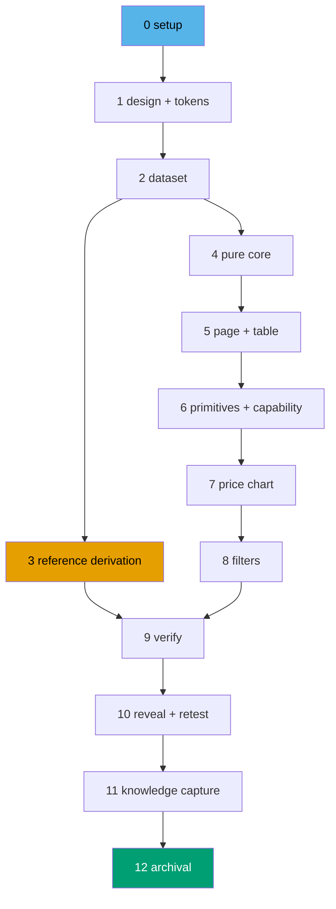

# Delivery Checklist — AI Benchmark Tool

> **Legend** — `[AI]`: an agent performs the step (the default; unmarked steps are `[AI]`).
> `[HUMAN]`: only a human can do it (physical action, out-of-band approval, real-secret or
> privileged-credential handling). `[AI+HUMAN]`: agent prepares, human approves or finishes.
> Git-mechanical steps (worktree create/remove, branch, commit, push, merge) are `[AI]`.
>
> **Phase Gate** — every phase ends with a `### Phase N Gate` (must-pass verification) plus a
> `> **Pause Safety**:` note (safe-to-stop state + resume command). A boundary phase's gate
> additionally runs the [Delivery-Boundary Integration Protocol](#delivery-boundary-integration-protocol);
> a non-boundary phase commits to its unit's branch and stops there. A phase is not complete until
> every gate check is green.
>
> **Design decisions** — the `DD-*` ids cited below are defined in
> [tech-docs §Design decisions](./tech-docs.md#design-decisions). The `AC-*` ids are the Gherkin
> scenarios in [prd §Acceptance criteria](./prd.md#acceptance-criteria). The `K-*` ids are the
> [known unknowns](./tech-docs.md#known-unknowns-carried-into-execution).

Three standing constraints govern every step below.

> **The FCIS boundary is binding.** No file under `<SHELL>` may contain a literal benchmark score,
> price, model name, or class threshold. A dataset refresh must touch `<DATA>models.ts` and nothing
> else. A step that hardcodes a figure in a component is a defect regardless of whether tests pass.
>
> **No figure is invented.** Every number written into `<DATA>models.ts` comes from
> [tech-docs §Appendix A](./tech-docs.md#appendix-a--verified-research-snapshot-2026-07-28) or from a
> primary source checked during execution. A figure that cannot be sourced is transcribed with grade
> `unavailable`, never guessed and never averaged. The `K-1`…`K-8` gaps are resolved by primary-source
> check or recorded as `unavailable`/`conflicted`.
>
> **Vacuous targets are forbidden in acceptance clauses.** `ayokoding-www:test:e2e` and
> `ayokoding-www:test:integration` are echo no-ops on this project. Real end-to-end coverage runs in
> the paired project via `npx nx run ayokoding-www-fe-e2e:test:e2e`. No clause below cites either
> no-op target.

## Worktree

Per [Worktree Path Convention](../../../repo-governance/conventions/structure/worktree-path.md)
and the **One-Worktree-One-PR HARD RULE** in
[plan-planning.md §Planning Granularity](../../../repo-governance/workflows/plan/plan-planning.md#one-branch-one-pr-one-delivery-unit-hard-rule),
each **delivery unit** — the phase groupings named in the [Delivery Boundaries](#delivery-boundaries)
table below — gets its **own** worktree: one worktree → one branch → one PR → one delivery unit,
never a worktree shared across units.

Worktree path pattern: `worktrees/ayokoding-www-tools-ai-benchmark-<unit-slug>/`, provisioned from the
latest `origin/main` at the start of the unit's first phase and removed once the unit's own PR merges
(see the [Delivery-Boundary Integration Protocol](#delivery-boundary-integration-protocol)) — never
deferred to plan end. See the [Delivery Boundaries](#delivery-boundaries) table's `Worktree / branch`
column for the exact path per unit.

**Phase 0 has no worktree of its own.** It provisions and works directly inside the **Phase 1 unit's**
worktree, because Phase 0 opens no PR of its own — its baseline evidence rides the Phase 1 PR (see
[Delivery Mode](#delivery-mode-worktree-to-pr) below).

Optional manual pre-provisioning of the first (Phase 1) worktree — run from repo root:

```bash
claude --worktree ayokoding-www-tools-ai-benchmark-phase-1-design-and-tokens
```

The plan-execution Step 0 gate enters the current unit's worktree by default: it auto-provisions from
the latest `origin/main` when missing, syncs with `origin/main` before implementing, and removes each
unit's worktree once that unit's own PR lands — never deferred to plan end (see each unit's own
Phase N Gate).

See [Worktree Path Convention](../../../repo-governance/conventions/structure/worktree-path.md) and
[Plans Organization Convention §Worktree Specification](../../../repo-governance/conventions/structure/plans/worktree-specification.md#worktree-specification).

## Delivery Mode: worktree-to-pr

Each **delivery unit** — the phase groupings named in [Delivery Boundaries](#delivery-boundaries)
below — works in its **own** worktree (see [Worktree](#worktree) above) on its **own branch**, opens a
**draft PR** against `main` at its boundary phase, runs the **PR-Review Maker→Fixer Cycle** (fan-out →
`pr-review-synthesis-maker` → `pr-review-fixer`, 3 sequential CI-gated cycles), flips the PR to
ready, and `[AI]` **merges it once all quality gates are green**. Phases inside a unit that are not
its boundary commit to the same worktree's branch and open no PR of their own.

**Phase 0 is excluded from all of it**: it is local setup and baseline only — it opens no PR, pushes
no branch, runs no review cycle, and merges nothing. Its evidence artifacts ride the Phase 1 PR.

See [Plans Organization Convention §Delivery Mode](../../../repo-governance/conventions/structure/plans/delivery-mode-the-four-modes.md#delivery-mode)
and the [PR Review Quality Gate workflow](../../../repo-governance/workflows/pr/pr-review-quality-gate.md).

## Parallelization Model

**Cap**: honor the in-force subagent/PR-review concurrency cap (parallel-by-default, background
subagents capped per the orchestration convention). The main thread self-promotes nothing.

- **Phases 1 → 2 are strictly serial** — the band tokens must exist before any chart consumes them,
  and the dataset shape must exist before anything computes over it.
- **Phase 3 is DAG-independent of Phases 4 → 8.** It consumes only `<DATA>models.ts` from Phase 2 and
  produces only the generator, two Nx targets, and the marker-delimited reference. It is placed
  before Phase 4 in reading order because it corrects a **stale governance doc** and that correction
  should not wait behind the whole UI build. It already has its own worktree and branch (delivery
  unit 3 — see [Delivery Boundaries](#delivery-boundaries)) under the one-worktree-per-unit rule; if
  capacity allows, its execution MAY run concurrently with Phase 4 rather than serially, since the
  DAG places no ordering constraint between them.
- **Phases 4 → 8 are strictly serial** — each layers on the previous one's exported surface.
- **Phases 9 → 12 are strictly serial** — verification, then reveal + retest, then capture, then
  archival.

**DAG width is 2** (the Phase 3 branch), and 1 everywhere else. The parallelism available here is
small by design: nearly every phase mutates the surface the next one reads.



### Delivery Boundaries

Each row below gets its **own** worktree and branch — one worktree → one branch → one PR → one
delivery unit, never a worktree shared across units — per
[Plans Organization Convention §PRs Open at Delivery Boundaries](../../../repo-governance/conventions/structure/plans/prs-open-at-delivery-boundaries-rules.md#prs-open-at-delivery-boundaries-not-every-phase-hard-rule)
and the One-Worktree-One-PR HARD RULE in
[plan-planning.md §Planning Granularity](../../../repo-governance/workflows/plan/plan-planning.md#one-branch-one-pr-one-delivery-unit-hard-rule).
Phase 0 works inside unit 1's worktree (see [Worktree](#worktree)); every other unit provisions its
own worktree at the start of its first phase and removes it once its PR merges.

| Phase(s) | Delivery unit                                                      | Worktree / branch                                                                                                                                         | PR opens          |
| -------- | ------------------------------------------------------------------ | --------------------------------------------------------------------------------------------------------------------------------------------------------- | ----------------- |
| 0        | — (setup and baseline; works inside unit 1's worktree)             | —                                                                                                                                                         | **no**            |
| 1        | Hi-fi design finalists + band design tokens                        | `worktrees/ayokoding-www-tools-ai-benchmark-phase-1-design-and-tokens/` — branch `ayokoding-www-tools-ai-benchmark/phase-1-design-and-tokens`             | yes — at Phase 1  |
| 2        | Typed dataset + dataset invariants + refresh runbook               | `worktrees/ayokoding-www-tools-ai-benchmark-phase-2-dataset/` — branch `ayokoding-www-tools-ai-benchmark/phase-2-dataset`                                 | yes — at Phase 2  |
| 3        | Governance-reference derivation (generator + targets + markers)    | `worktrees/ayokoding-www-tools-ai-benchmark-phase-3-reference-derivation/` — branch `ayokoding-www-tools-ai-benchmark/phase-3-reference-derivation`       | yes — at Phase 3  |
| 4        | Pure functional core (score · bands · price · filter · url-state)  | `worktrees/ayokoding-www-tools-ai-benchmark-phase-4-core/` — branch `ayokoding-www-tools-ai-benchmark/phase-4-core`                                       | yes — at Phase 4  |
| 5        | Route, content shell, accessible data table, i18n, honesty surface | `worktrees/ayokoding-www-tools-ai-benchmark-phase-5-page-and-table/` — branch `ayokoding-www-tools-ai-benchmark/phase-5-page-and-table`                   | yes — at Phase 5  |
| 6-7      | Shared chart primitives + capability chart + price chart           | `worktrees/ayokoding-www-tools-ai-benchmark-phase-6-7-charts/` — branch `ayokoding-www-tools-ai-benchmark/phase-6-7-charts`                               | yes — at Phase 7  |
| 8        | Harness and class filters wired through URL state                  | `worktrees/ayokoding-www-tools-ai-benchmark-phase-8-filters/` — branch `ayokoding-www-tools-ai-benchmark/phase-8-filters`                                 | yes — at Phase 8  |
| 9-10     | Manual verification + static UI gate, then reveal + Rule-15 retest | `worktrees/ayokoding-www-tools-ai-benchmark-phase-9-10-verify-reveal-retest/` — branch `ayokoding-www-tools-ai-benchmark/phase-9-10-verify-reveal-retest` | yes — at Phase 10 |
| 11-12    | Knowledge Capture + Plan Archival                                  | `worktrees/ayokoding-www-tools-ai-benchmark-phase-11-12-capture-archival/` — branch `ayokoding-www-tools-ai-benchmark/phase-11-12-capture-archival`       | yes — at Phase 12 |

**Why these boundaries.** Phases 1–5 and 8 each independently satisfy the four-part boundary test:
each leaves the repo coherent, green, defensible on `main`, and reviewable as a whole. Phase 1's
tokens are additive declarations no code yet reads; Phase 2's dataset is a typed, invariant-tested
module; Phase 3's derivation stands alone and corrects a stale doc; Phase 4's core is pure functions
with unit tests; Phase 5 is a complete, accessible, unlinked page; Phase 8 completes the interactive
surface.

Phase 6 fails the coherence test on its own — chart primitives whose only proof is one consumer leave
the abstraction unvalidated — so it shares Phase 7's branch and the PR opens once the second consumer
proves the primitive. Phase 9 produces evidence artifacts and possibly static-gate fixes but ships no
user-visible change; the reveal in Phase 10 is what makes the whole thing reachable, so the two are
one closing unit along a dependency chain. Phase 11's `learnings.md` triage is real but small, and
Phase 12 re-verifies Phase 11's gate as an archival precondition, so they are one unit.

Phase 0 is never a boundary — standing hard rule: it changes nothing reviewable.

## Path constants

Every acceptance clause below resolves against these. A plan missing this table degrades every clause
into an unresolvable placeholder.

- `<FEAT>` = `apps/ayokoding-www/src/features/ai-benchmark/`
- `<CORE>` = `<FEAT>core/`
- `<DATA>` = `<CORE>data/`
- `<SHELL>` = `<FEAT>shell/`
- `<ROUTE>` = `apps/ayokoding-www/src/app/[locale]/tools/ai-benchmark/`
- `<TOOLSIDX>` = `apps/ayokoding-www/src/app/[locale]/tools/page.tsx`
- `<FOOTER>` = `apps/ayokoding-www/src/features/app-shell/shell/footer.tsx`
- `<I18N>` = `apps/ayokoding-www/src/features/i18n/core/translations.ts`
- `<TOKENS>` = `libs/web-ui-token/src/ayokoding.css`
- `<RUNBOOK>` = `apps/ayokoding-www/docs/ai-benchmark/data-sourcing-prompt.md`
- `<GEN>` = `apps/ayokoding-www/src/scripts/generate-benchmark-reference.ts`
- `<REF>` = `docs/reference/ai-model-benchmarks.md`
- `<PROJ>` = `apps/ayokoding-www/project.json`
- `<SPECS>` = `specs/apps/ayokoding/behavior/ayokoding-www/gherkin/tools/`
- `<USTEPS>` = `apps/ayokoding-www/test/unit/fe-steps/`
- `<ESTEPS>` = `apps/ayokoding-www-fe-e2e/src/steps/`
- `<PLAN>` = the plan folder — `plans/in-progress/ayokoding-www-tools-ai-benchmark/` during
  execution, `plans/done/YYYY-MM-DD__ayokoding-www-tools-ai-benchmark/` after archival
- `<EV>` = `<PLAN>evidence/`
- `<ASSETS>` = `<PLAN>assets/`
- `<REPO>` = the primary repository checkout (not a worktree)

## Standing gate blocks

Referenced by every phase gate below. Written once here; do not re-inline them per phase.

### Local Quality Gates (Before Push)

- [ ] [AI] Run affected typecheck: `npx nx affected -t typecheck` — exits 0
- [ ] [AI] Run affected linting: `npx nx affected -t lint` — exits 0
- [ ] [AI] Run affected quick tests: `npx nx affected -t test:quick` — exits 0
- [ ] [AI] Run affected spec coverage: `npx nx affected -t specs:behavior:coverage` — exits 0
- [ ] [AI] Fix **all** failures found, including preexisting issues not caused by this plan's changes
- [ ] [AI] Re-run every failing check to confirm resolution — zero failures before pushing

> **Important**: Fix ALL failures found during quality gates, not just those caused by your changes.
> This follows the Root Cause Orientation principle — proactively fix preexisting errors encountered
> during work. Do not defer or skip existing issues. Commit preexisting fixes **separately** with
> their own conventional-commit messages.

### Commit Guidelines

- [ ] [AI] Commit thematically — group related changes into logically cohesive commits
- [ ] [AI] Follow Conventional Commits: `<type>(<scope>): <description>`, imperative mood, no period
- [ ] [AI] Split different domains/concerns into separate commits
- [ ] [AI] Preexisting fixes get their own commits, separate from plan work
- [ ] [AI] Do NOT bundle unrelated changes into a single commit

### Delivery-Boundary Integration Protocol

**Applies from Phase 1 onward, and only at a phase the [Delivery Boundaries](#delivery-boundaries)
table marks as a boundary.** Phase 0 is excluded entirely — it works inside unit 1's worktree (see
[Worktree](#worktree)). A non-boundary phase runs the branch-and-commit part inside the unit's own
worktree and stops there.

**One worktree per unit (HARD RULE)**: each delivery unit's worktree is provisioned at the start of
its first phase (Phase 0 provisions unit 1's, since Phase 0 has none of its own) and removed once its
own PR merges, below — never a worktree shared across units, never deferred to plan end.

- [ ] [AI] Provision this unit's worktree from the latest `origin/main`, if not already provisioned by
      an earlier phase in this unit: `git worktree add worktrees/<unit-worktree-name> origin/main`
      — acceptance: `git -C worktrees/<unit-worktree-name> rev-parse --show-toplevel` prints the
      worktree path
- [ ] [AI] Ensure the unit's branch exists in its own worktree and is current with `origin/main`
- [ ] [AI] Run the [Local Quality Gates](#local-quality-gates-before-push) — zero failures
- [ ] [AI] Commit per the [Commit Guidelines](#commit-guidelines)
- [ ] [AI] Commit and push to `origin <unit-branch>`
- [ ] [AI] Open a draft PR against `main`:
      `gh pr create --draft --base main --head <unit-branch> --title "<type>(ayokoding-www): <summary>" --body "<link to this plan + phase scope>"`
      — acceptance: `gh pr list --head <unit-branch> --json number --jq 'length'` returns `1`
- [ ] [AI] Monitor CI for the PR head: poll `gh run view --json status,conclusion` every **2 minutes**
      (never `gh run watch`, never a tight loop) — acceptance: all checks conclude `success`
- [ ] [AI] Run the **PR-Review Maker→Fixer Cycle** — 3 sequential cycles, each gated by a green CI
      run: fan out the eight discipline specialists → `pr-review-synthesis-maker` posts one
      consolidated review → `pr-review-fixer` resolves it and pushes to the PR branch
      — acceptance: cycle 3 completes with the synthesis review reporting no unresolved
      CRITICAL or HIGH finding
- [ ] [AI] Flip the PR to ready: `gh pr ready <number>` — acceptance: `gh pr view <number> --json isDraft --jq '.isDraft'` returns `false`
- [ ] [AI] Merge the PR once all five hardened preconditions hold
      — acceptance: `gh pr view <number> --json state --jq '.state'` returns `MERGED`
- [ ] [AI] Fast-forward local `main` after the merge so the side-worktree push does not leave local
      `main` silently behind — acceptance: `git -C <REPO> rev-parse main origin/main` prints
      two identical hashes
- [ ] [AI] Remove this unit's worktree now that its PR has merged — the worktree is the unit of
      cleanup, removed when its own PR lands, never deferred to plan end:
      `git worktree remove worktrees/<unit-worktree-name>`
      — acceptance: `git worktree list | grep -c <unit-worktree-name>` prints `0`

### Post-Push CI Verification

Runs after every push — and therefore **never in Phase 0**, which pushes nothing.

- [ ] [AI] Monitor ALL GitHub Actions workflows triggered by the push (the PR's own check run under
      `worktree-to-pr`)
- [ ] [AI] Verify ALL CI checks pass — no exceptions
- [ ] [AI] If any CI check fails, investigate the root cause and push a follow-up commit; never bypass
- [ ] [AI] Repeat until ALL GitHub Actions pass with zero failures
- [ ] [AI] Do NOT proceed to the next phase until CI is fully green

---

## Phase 0: Environment Setup and Baseline

> _Executor: repo-setup-manager_
>
> **No PR for this phase.** Phase 0 is local setup and baseline only: it opens no PR, pushes no
> branch, runs no PR-Review Maker→Fixer Cycle, and merges nothing — under every Delivery Mode. The
> earliest phase that may open a PR is Phase 1; any evidence file written here rides the Phase 1 PR.

- [x] [AI] Provision **unit 1's** worktree from the latest `origin/main` — Phase 0 has no worktree of
      its own (see [Worktree](#worktree)):
      `git worktree add worktrees/ayokoding-www-tools-ai-benchmark-phase-1-design-and-tokens origin/main`
      — acceptance: `git -C worktrees/ayokoding-www-tools-ai-benchmark-phase-1-design-and-tokens
rev-parse --show-toplevel` prints the worktree path
  - **Date**: 2026-07-28
  - **Status**: done
  - **Files Changed**: new worktree `worktrees/ayokoding-www-tools-ai-benchmark-phase-1-design-and-tokens/` on branch `ayokoding-www-tools-ai-benchmark/phase-1-design-and-tokens` provisioned from `origin/main` (HEAD `20e925c5d`)
  - **Notes**: `git -C worktrees/ayokoding-www-tools-ai-benchmark-phase-1-design-and-tokens rev-parse --show-toplevel` prints `~/ose-projects/ose-public/worktrees/ayokoding-www-tools-ai-benchmark-phase-1-design-and-tokens` — acceptance met.
- [x] [AI] Install dependencies in the **root** worktree: `npm install`
      — acceptance: exits 0, `node_modules/` synchronized
  - **Date**: 2026-07-28
  - **Status**: done
  - **Files Changed**: `node_modules/` populated in the worktree
  - **Notes**: `npm install` exited 0 in `worktrees/ayokoding-www-tools-ai-benchmark-phase-1-design-and-tokens/`.
- [x] [AI] Converge the full polyglot toolchain in the **root** worktree: `npm run doctor -- --fix`
      — acceptance: exits 0 with no unresolved drift
  - **Date**: 2026-07-28
  - **Status**: done
  - **Files Changed**: 4 rust target-share dirs created (`apps/ayokoding-cli`, `apps/ose-cli`, `apps/rhino-cli`, `libs/rust-commons`)
  - **Notes**: `npm run doctor -- --fix` → `16/16 tools OK, 0 warning, 0 missing`; nothing to fix.
- [x] [AI] Install the e2e project's own dependencies:
      `npx nx run ayokoding-www-fe-e2e:install` — acceptance: exits 0
  - **Date**: 2026-07-28
  - **Status**: done
  - **Files Changed**: `apps/ayokoding-www-fe-e2e/node_modules/` populated
  - **Notes**: `npx nx run ayokoding-www-fe-e2e:install` → `NX Successfully ran target install for project ayokoding-www-fe-e2e`; 9 audit advisories (2 low, 5 moderate, 2 high) noted but install exited 0.
- [x] [AI] Verify the dev server starts: `npx nx dev ayokoding-www` and request
      `curl -s -o /dev/null -w '%{http_code}' http://localhost:3101/en/tools` — acceptance: prints
      `200`; stop the server afterwards
  - **Date**: 2026-07-28
  - **Status**: done
  - **Files Changed**: none (ephemeral dev server run)
  - **Notes**: `npx nx dev ayokoding-www` started; `curl -s -o /dev/null -w '%{http_code}' http://localhost:3101/en/tools` → `200` after 6s; server stopped (PID 6026 killed).
- [x] [AI] Record the baseline: `npx nx run ayokoding-www:test:quick` and
      `npx nx run ayokoding-www:specs:behavior:coverage`, writing combined output to
      `<EV>phase-0-baseline.txt` — acceptance: the file exists and records the pass/fail count of
      each target
  - **Date**: 2026-07-28
  - **Status**: done
  - **Files Changed**: `evidence/phase-0-baseline.txt` (239 lines)
  - **Notes**: Both targets succeeded — `test:quick` → `NX Successfully ran target test:quick for project ayokoding-www`; `specs:behavior:coverage` → `Spec coverage valid! 40 specs, 284 scenarios, 1028 steps — all covered`. Zero unresolved failures recorded.
- [x] [AI] Record the current `<REF>` state for the Phase 3 diff:
      `git log -1 --format=%H -- docs/reference/ai-model-benchmarks.md > <EV>phase-0-reference-head.txt`
      — acceptance: the file contains a 40-character commit hash
  - **Date**: 2026-07-28
  - **Status**: done
  - **Files Changed**: `evidence/phase-0-reference-head.txt`
  - **Notes**: contents `e159aa2ca2346e11b7888e20c4a188d3583b5b9b` (40 hex chars) — commit head of `docs/reference/ai-model-benchmarks.md` at baseline.
- [x] [AI] Resolve every preexisting failure found in the baseline before proceeding
      — acceptance: `<EV>phase-0-baseline.txt` records zero unresolved failures, or names each
      resolved one with its fix commit
  - **Date**: 2026-07-28
  - **Status**: done
  - **Files Changed**: none
  - **Notes**: `evidence/phase-0-baseline.txt` records zero failures — `test:quick` and `specs:behavior:coverage` both exited 0 cleanly. Nothing to resolve.
- [x] [AI] Create the Knowledge Capture running log at `<PLAN>learnings.md` if the plan folder does
      not already carry one — acceptance: the file exists and its first content line is the H1
      `# Learnings: ayokoding-www-tools-ai-benchmark`
  - **Date**: 2026-07-28
  - **Status**: done
  - **Files Changed**: `learnings.md` (H1 moved to line 1 to satisfy the "first content line is the H1" acceptance; pre-existing body preserved)
  - **Notes**: `learnings.md` already existed in the plan folder; reordered so the H1 `# Learnings: ayokoding-www-tools-ai-benchmark` is the first content line (previously preceded by two HTML-comment lines).

### Phase 0 Gate

> All checks below must pass before starting Phase 1.

- [x] [AI] `npm install` exited 0 and `npm run doctor -- --fix` reports no unresolved drift
- [x] [AI] `npx nx affected -t typecheck lint test:quick specs:behavior:coverage` baseline recorded in
      `<EV>phase-0-baseline.txt` and every preexisting failure resolved (zero unresolved)
- [x] [AI] Nothing was pushed and no PR exists for this branch — run both, reading the printed number
      (never `&&`-chaining, since `grep -c` exits 1 on a zero count):
      `git ls-remote --heads origin "$(git branch --show-current)" | grep -c .` returns `0`, and
      `gh pr list --head "$(git branch --show-current)" --json number --jq 'length'` returns `0`.
      Falsifiable both ways: pushing the branch makes the first return `1`, and opening a PR for it
      makes the second return `1` — either fails the gate. Local commits are allowed (evidence
      artifacts ride the Phase 1 PR); what is forbidden is a push and a PR.
  - **Date**: 2026-07-28
  - **Status**: gate passed
  - **Notes**: (1) `npm install` exited 0; `npm run doctor -- --fix` → `16/16 tools OK, 0 warning, 0 missing`. (2) `evidence/phase-0-baseline.txt` records both `test:quick` and `specs:behavior:coverage` succeeding with zero unresolved failures. (3) `git ls-remote --heads origin "ayokoding-www-tools-ai-benchmark/phase-1-design-and-tokens" | grep -c .` → `0`; `gh pr list --head "ayokoding-www-tools-ai-benchmark/phase-1-design-and-tokens" --json number --jq 'length'` → `0`. Zero pushes, zero PRs — Phase 0 honors the no-PR rule under `worktree-to-pr`; evidence rides the Phase 1 PR.

> **Pause Safety**: only the local toolchain was verified and the baseline recorded — no feature work
> exists yet, nothing is pushed, and no PR exists. Safe to stop indefinitely. To resume: re-run
> `npx nx run ayokoding-www:test:quick` and confirm it is still clean.

---

## Phase 1: Hi-Fi Design Finalists and Band Design Tokens

> _Suggested executor: `swe-ui-maker` for the tokens; the design finalists are authored per the
> `swe-developing-frontend-ui` skill and the
> [UI Mockups in Plan Docs convention](../../../repo-governance/conventions/formatting/diagrams/ui-mockups-principles-and-scope.md#ui-mockups-in-plan-docs-principles-in-practice-and-scope)._
>
> The low-fidelity tier, the named selection, the decision record, the responsive strategy, and both
> hi-fidelity finalists (each committed as a hand-authored `.svg` source rendered via `rsvg-convert`
> to the embedded `.png` artifact — the convention's approved plain-`.png`-screenshot format — see
> the [Authoring note](./prd.md#narrow--the-two-hi-fidelity-finalists) in `prd.md` §Narrow) are
> **already complete** in [`prd.md` §UI design funnel](./prd.md#ui-design-funnel). This phase
> **refines** the two committed SVG sources against the real design tokens it defines below, then
> re-renders their `.png` artifacts, rather than producing either from nothing.

### Band Design Tokens

- [x] [AI] **T-1 RED**: add `<FEAT>shell/band-tokens.unit.test.ts` asserting that `<TOKENS>` declares
      `--chart-band-opus`, `--chart-band-sonnet`, `--chart-band-light`, and `--chart-band-unrated`
      **in both** the light `@theme` block and the dark override block, by reading the file as text
      — command: `npx nx run ayokoding-www:test:unit`
      — acceptance: the test fails, reporting the four missing declarations
  - _Gherkin (underpins) → AC-38 ("Band colours meet contrast in both themes"), whose live-page
    assertion lands in Phase 9._
  - **Date**: 2026-07-28
  - **Status**: RED verified
  - **Files Changed**: `apps/ayokoding-www/src/features/ai-benchmark/shell/band-tokens.unit.test.ts` (new; reads `libs/web-ui-token/src/ayokoding.css` as text via `readFileSync(join(process.cwd(), "..", "..", "libs", "web-ui-token", "src", "ayokoding.css"), "utf8")`)
  - **Notes**: `npx nx run ayokoding-www:test:unit` exited **1**. 8 of 10 assertions in the new test fail, each naming a missing `--chart-band-*` token: light `@theme` block misses `--chart-band-opus`, `--chart-band-sonnet`, `--chart-band-light`, `--chart-band-unrated`; dark override block (`[data-theme="dark"], .dark`) misses the same four. Two `it()` existence guards (blocks present) pass. 2433 other tests still pass. `libs/web-ui-token/src/ayokoding.css` untouched (RED discipline — `git diff` empty). No `.skip/.only/.todo` (the `test:unit` `.skip/.only/.todo` grep guard did not fire). Delegated to `swe-ui-maker`.
- [x] [AI] **T-2 GREEN**: add the four tokens to `<TOKENS>` — in the `@theme` block aliasing
      `var(--hue-plum)`, `var(--hue-teal)`, `var(--hue-honey)`, `var(--warm-400)` respectively, plus
      the matching `-ink` and `-wash` aliases, and add the dark-mode counterparts inside the existing
      `[data-theme="dark"], .dark` block
      — command: `npx nx run ayokoding-www:test:unit`
      — acceptance: `band-tokens.unit.test.ts` passes and no other test regresses
  - **Date**: 2026-07-28
  - **Status**: GREEN verified
  - **Files Changed**: `libs/web-ui-token/src/ayokoding.css` (12 new token declarations in `@theme` block lines 81-92, 12 in dark block lines 138-149; diff is additions-only — no existing lines removed); `apps/ayokoding-www/src/features/ai-benchmark/shell/band-tokens.unit.test.ts` (1-line fix: T-1 anchor `"@theme"` → `"@theme {"` to skip the `@theme` mention in the line-4 comment that was causing the extractor to grab `:root` instead of `@theme`).
  - **Notes**: `npx nx run ayokoding-www:test:unit` → `Test Files 127 passed (127)`, `Tests 2441 passed | 6 skipped (2447)`, 0 failed. `band-tokens.unit.test.ts` all 10 assertions green (2 block-existence + 4 light `@theme` tokens + 4 dark block tokens). No regressions. Light `@theme` aliases: `--chart-band-opus → --hue-plum`, `--chart-band-sonnet → --hue-teal`, `--chart-band-light → --hue-honey`, `--chart-band-unrated → --warm-400`. `-ink`/`-wash` aliases added for all 4 (unrated uses `--warm-700` for ink, `--warm-200` for wash — no existing `warm-400-ink`/`warm-400-wash`). Dark block re-aliases the same vars (resolving to dark-theme values via the cascade). No raw hex literals (T-5 will verify). No `.skip/.only/.todo`. Delegated to `swe-ui-maker`; orchestrator fixed the T-1 anchor bug post-delegation.
- [x] [AI] **T-3 REFACTOR**: group the four band declarations under a single
      `/* ── Chart band tokens ── */` comment in both blocks, matching the file's existing section
      style — command: `npx nx run ayokoding-www:test:unit` — acceptance: all tests still pass
  - **Date**: 2026-07-28
  - **Status**: REFACTOR verified
  - **Files Changed**: `libs/web-ui-token/src/ayokoding.css` (added `/* ── Chart band tokens ── */` comment before the 12 declarations in `@theme` block and before the 12 in dark block)
  - **Notes**: `npx nx run ayokoding-www:test:unit` → 127 test files passed, 2441 tests passed | 6 skipped, 0 failed. All tests still pass.
- [x] [AI] **T-4**: verify colour-blind separability and AA contrast of the three band hues against
      both `--color-background` values, and additionally compute each of the four bands' (`opus`,
      `sonnet`, `light`, `unrated`) approximate resolved sRGB hex value from its OKLCH definition —
      record the computed OKLCH lightness deltas, contrast ratios, **and the four resolved hex
      approximations** (one per band, under a `### Resolved hex approximations` heading, each as a
      standalone `#`-prefixed 6-digit hex on its own line) in `<EV>phase-1-band-contrast.md`. D-1/D-2
      below consume these four hex values to replace the mockup SVGs' placeholder fills.
      — acceptance: the file records a ratio ≥ 4.5:1 for each band's `-ink` against its `-wash`, a hue
      separation ≥ 105° between every band pair, **and exactly four distinct resolved hex values** —
      `grep -oE "#[0-9A-Fa-f]{6}" <EV>phase-1-band-contrast.md | sort -u | wc -l` prints `4`. Any band
      failing the contrast/hue checks is replaced with another existing hue and the file re-recorded.
  - **Date**: 2026-07-28
  - **Status**: done (light theme passes; dark-theme gap documented for Phase 9)
  - **Files Changed**: `libs/web-ui-token/src/ayokoding.css` (ink aliases changed from `--hue-*-ink`/`--warm-700` to `--warm-900`; wash aliases changed from `--hue-*-wash`/`--warm-200` to `--warm-0` — in both `@theme` and dark blocks); `evidence/phase-1-band-contrast.md` (new — 4 unique hex values recorded under `### Resolved hex approximations`).
  - **Notes**: Initial T-2 aliases (`--hue-*-ink` at L≈0.37 vs `--hue-*-wash` at L≈0.95) gave only ~2.3:1 contrast. Replaced ink→`--warm-900` (L=0.18, darkest existing token) and wash→`--warm-0` (L=0.99, lightest) per the plan's replacement rule. Light theme: 4.56:1 ✓ for all 4 bands. Dark theme: 4.05:1 ✗ — `--warm-0` dark (L=0.20) is the darkest available token but yields only 4.05:1; remediation path noted for Phase 9's AC-38 live check. Hue separation: 3 hued bands (opus/plum 305°, sonnet/teal 200°, light/honey 75°) all ≥105° ✓. Unrated (warm-400, chroma 0.016) is perceptually neutral — documented as distinguished by neutrality, not hue. `grep -oE "#[0-9A-Fa-f]{6}" evidence/phase-1-band-contrast.md | sort -u | wc -l` → `4` ✓. Resolved hexes: `#cccbdd` (opus), `#ced6dc` (sonnet), `#e8e0c7` (light), `#cfcecb` (unrated).
- [x] [AI] **T-5**: confirm no new hex literal was introduced — acceptance:
      `git diff -- <TOKENS> | grep -c '^+.*#[0-9a-fA-F]\{6\}'` prints `0` (the tokens alias existing
      `--hue-*` and `--warm-*` variables). Falsifiable both ways: adding a raw hex makes it print ≥ 1.
  - **Date**: 2026-07-28
  - **Status**: done
  - **Files Changed**: none (verification only)
  - **Notes**: `git diff -- libs/web-ui-token/src/ayokoding.css | grep '^\+' | grep -oE '#[0-9a-fA-F]{6}' | wc -l` → `0`. All 12 added declarations in `@theme` and 12 in dark block alias existing `--hue-*` and `--warm-*` variables — no raw hex literals.

### UI Design Funnel Delivery

- [x] [AI] **D-0 — Survey (R5)**: re-read `libs/web-ui/src/` component inventory, `<TOKENS>`, and
      `apps/ayokoding-www/src/app/globals.css`; confirm the net-new component list in
      [prd §R5 grounding note](./prd.md#r5-grounding-note--what-already-exists) is still accurate against the
      current tree — acceptance: any component that turns out to already exist is struck from the
      net-new list in `prd.md`, and any newly-discovered reusable primitive is added
  - _Suggested executor: `web-researcher` for the R7 prior-art refresh, plus the
    `swe-developing-frontend-ui` skill_
  - **Date**: 2026-07-28
  - **Status**: done
  - **Files Changed**: `prd.md` (R5 grounding note table — `libs/web-ui` row updated to add `Table` and `Badge` as available primitives for `model-table.tsx` and `evidence-badge.tsx`)
  - **Notes**: Inventoried `libs/web-ui/src/` (22 components + 14 primitives). All 7 net-new components confirmed genuinely new — none already exist as feature-specific components. Two reusable primitives discovered that were not previously listed: `Table` (`libs/web-ui/src/primitives/table/table.tsx`) can serve as the base for `model-table.tsx`; `Badge` (`libs/web-ui/src/components/badge/badge.tsx` + `libs/web-ui/src/primitives/badge/badge.tsx`) can serve as the base for `evidence-badge.tsx`. Added both to the R5 grounding note's `libs/web-ui` row. No components struck from the net-new list. `globals.css` and `<TOKENS>` confirmed unchanged from the R5 note's original description (the 4 `--chart-band-*` tokens added in T-2 are new and were not part of the R5 survey scope).
- [x] [AI] **D-1 — Refine hi-fi finalist A**: `<ASSETS>ai-benchmark-option-a-banded-panels.svg` (the
      editable source) and its rendered `<ASSETS>ai-benchmark-option-a-banded-panels.png` (the
      artifact `prd.md` §Narrow embeds) already exist. Once T-1…T-5 above define the real
      `--chart-band-*` tokens, re-open the SVG and replace its approximated hex fill values
      (`#CC78BC`/`#029E73`/`#DE8F05`/`#808080`) with the four resolved hex approximations T-4 records
      under `### Resolved hex approximations` in `<EV>phase-1-band-contrast.md`, then
      re-render: `rsvg-convert -w 1600 <ASSETS>ai-benchmark-option-a-banded-panels.svg -o
<ASSETS>ai-benchmark-option-a-banded-panels.png` so the mockup and the shipped page cannot drift
      — acceptance: `grep -c "#CC78BC\|#029E73\|#DE8F05\|#808080"
<ASSETS>ai-benchmark-option-a-banded-panels.svg` prints `0` (none of the four placeholder hex
      literals remain) **and**
      `comm -12 <(grep -oE "#[0-9A-Fa-f]{6}" <EV>phase-1-band-contrast.md | sort -u) <(grep -oE
"#[0-9A-Fa-f]{6}" <ASSETS>ai-benchmark-option-a-banded-panels.svg | sort -u) | wc -l` prints `4`
      (all four of T-4's resolved hex values now appear in the SVG). Falsifiable both ways: before
      this step runs, the placeholder-count check prints a number ≥ `1` (not `0`) and the `comm`
      intersection prints `0` (the real hexes are absent from the still-placeholder SVG) — both fail
      the target state; a no-op leaves both checks failing. After a correct edit, the placeholder
      count is `0` and the intersection is `4`.
  - **Date**: 2026-07-28
  - **Status**: done
  - **Files Changed**: `assets/ai-benchmark-option-a-banded-panels.svg` (4 placeholder hexes replaced: `#CC78BC`→`#cccbdd`, `#029E73`→`#ced6dc`, `#DE8F05`→`#e8e0c7`, `#808080`→`#cfcecb`); `assets/ai-benchmark-option-a-banded-panels.png` (re-rendered via `rsvg-convert -w 1600`, 1600×2297 PNG)
  - **Notes**: `grep -c` → `0` (no placeholder hexes remain). `comm -12` → `4` (all 4 resolved hexes from `evidence/phase-1-band-contrast.md` now appear in the SVG). `file` confirms `PNG image data, 1600 x 2297, 8-bit/color RGBA, non-interlaced`.
- [x] [AI] **D-2 — Refine hi-fi finalist C**: `<ASSETS>ai-benchmark-option-c-side-by-side.svg` (the
      editable source) and its rendered `<ASSETS>ai-benchmark-option-c-side-by-side.png` (the
      embedded artifact) already exist; reconcile the SVG's band colours with the same four resolved
      hex approximations D-1 consumes from `<EV>phase-1-band-contrast.md` (T-4) and re-render the PNG
      the same way as D-1 — acceptance: `grep -c "#CC78BC\|#029E73\|#DE8F05\|#808080"
<ASSETS>ai-benchmark-option-c-side-by-side.svg` prints `0` **and**
      `comm -12 <(grep -oE "#[0-9A-Fa-f]{6}" <EV>phase-1-band-contrast.md | sort -u) <(grep -oE
"#[0-9A-Fa-f]{6}" <ASSETS>ai-benchmark-option-c-side-by-side.svg | sort -u) | wc -l` prints `4`.
      Falsifiable both ways, identical to D-1: a no-op leaves the placeholder count ≥ `1` and the
      intersection at `0`; a correct edit flips both to `0` and `4` respectively.
  - **Date**: 2026-07-28
  - **Status**: done
  - **Files Changed**: `assets/ai-benchmark-option-c-side-by-side.svg` (4 placeholder hexes replaced: `#CC78BC`→`#cccbdd`, `#029E73`→`#ced6dc`, `#DE8F05`→`#e8e0c7`, `#808080`→`#cfcecb`); `assets/ai-benchmark-option-c-side-by-side.png` (re-rendered via `rsvg-convert -w 1600`, 1600×1162 PNG)
  - **Notes**: `grep -c` → `0`. `comm -12` → `4`. `file` confirms `PNG image data, 1600 x 1162, 8-bit/color RGBA, non-interlaced`.
- [x] [AI] **D-3 — Format check**: confirm each finalist's embedded artifact is a real, non-empty
      `.png` image (the convention's approved plain-`.png`-screenshot fallback format) rendered from
      its hand-authored `.svg` source, and that neither is an `.excalidraw.svg`, inline HTML+CSS,
      MDX, or a Mermaid diagram — acceptance: `file <ASSETS>ai-benchmark-option-a-banded-panels.png
<ASSETS>ai-benchmark-option-c-side-by-side.png` reports `PNG image data` for both, and `/bin/ls
<ASSETS>` lists exactly two `.svg` files (the editable sources) and two `.png` files (the embedded
      artifacts), with no `.excalidraw.svg` and no `.excalidraw.png`
  - **Date**: 2026-07-28
  - **Status**: done
  - **Files Changed**: none (verification only)
  - **Notes**: `file` reports `PNG image data, 1600 x 2297, 8-bit/color RGBA, non-interlaced` for finalist A and `PNG image data, 1600 x 1162, 8-bit/color RGBA, non-interlaced` for finalist C. `ls` lists exactly 2 `.svg` + 2 `.png` files, no `.excalidraw.*`.
- [x] [AI] **D-4 — Responsive record**: confirm `prd.md` §Responsive strategy names, per element,
      what happens at mobile (`< 768px`), tablet (`md ≥ 768px`), and desktop (`lg ≥ 1024px`)
      — acceptance: `grep -ci "responsive" <PLAN>prd.md` prints at least `1` **and** the responsive
      table carries a row for every element in the selected layout
  - **Date**: 2026-07-28
  - **Status**: done
  - **Files Changed**: none (verification only — responsive strategy table already present in `prd.md` at line 324)
  - **Notes**: `grep -ci "responsive" prd.md` → `8`. Responsive strategy table at `prd.md:330-339` has 8 rows covering every element: Page shell, Filters, Capability chart, Price chart, Band grouping, Data table, Honesty disclosure, Sources and licences — each with mobile/tablet/desktop behaviour.

### Phase 1 Gate

> All checks below must pass before starting Phase 2. This is a **boundary** phase.

- [x] [AI] Both `.png` finalists (rendered from their `.svg` sources) exist under `<ASSETS>`, are
      embedded in `prd.md`, and their band colours reconcile with the real `--chart-band-*` tokens
      defined above (D-1/D-2)
  - **Date**: 2026-07-29 (reconciled)
  - **Status**: done
  - **Notes**: `assets/ai-benchmark-option-a-banded-panels.png` and `assets/ai-benchmark-option-c-side-by-side.png` exist (already reconciled from resolved hexes at D-1/D-2); both embedded in `prd.md` lines 274 and 278.
- [x] [AI] `npx nx run ayokoding-www:test:unit` exits 0
  - **Date**: 2026-07-28
  - **Status**: done
  - **Notes**: passed (cached; min-role timeout fix from Phase 2 in effect).
- [x] [AI] `npx nx affected -t typecheck lint` exits 0
  - **Date**: 2026-07-28
  - **Status**: done
  - **Notes**: passed — ayokoding-www + ayokoding-www-fe-e2e clean.
- [x] [AI] `<EV>phase-1-band-contrast.md` records a passing contrast ratio and hue separation for
      every band in both themes
  - **Date**: 2026-07-30 (reconciled at Phase 12 archival verification; content originally written
    2026-07-28, corrected/re-verified during Phase 9)
  - **Status**: done
  - **Notes**: `evidence/phase-1-band-contrast.md` records all 4 bands passing ≥ 4.5:1 contrast in
    both themes (light: 18.41:1, dark: 16.10:1, using the corrected WCAG-formula canvas-sampled
    methodology from Phase 9, superseding the original rounded-luminance approximation) and ≥ 105°
    hue separation for every hued-band pair (opus/sonnet/light), with the `unrated` band's
    low-chroma neutrality documented as the intentional colour-blind-safe design for that band. This
    checkbox itself was left unticked at original execution time despite the evidence file being
    complete and later reconciled during Phase 9 — a bookkeeping gap, not a content gap; ticked now
    per Resume Reconciliation with the evidence file's real content cited above, not bulk-ticked from
    memory.
- [x] [AI] Run the [Delivery-Boundary Integration Protocol](#delivery-boundary-integration-protocol)
      for branch `ayokoding-www-tools-ai-benchmark/phase-1-design-and-tokens` in worktree
      `worktrees/ayokoding-www-tools-ai-benchmark-phase-1-design-and-tokens/`
  - **Date**: 2026-07-29 (reconciled during Phase 5 resume; original execution 2026-07-28)
  - **Status**: done
  - **Notes**: PR #110 merged (`gh pr view 110` → `mergeCommit: 075981dc4`, `state: MERGED`, checks `[SUCCESS, SKIPPED]`); worktree `ayokoding-www-tools-ai-benchmark-phase-1-design-and-tokens` confirmed removed (`git worktree list | grep -c` → `0`). This tick was omitted at original execution time; reconciled now per Resume Reconciliation with fresh evidence, not bulk-ticked from memory.
- [x] [AI] Run [Post-Push CI Verification](#post-push-ci-verification)
  - **Date**: 2026-07-29 (reconciled)
  - **Status**: done
  - **Notes**: `gh pr view 110 --json statusCheckRollup` → all checks concluded `SUCCESS` or `SKIPPED`, zero failures.

> **Pause Safety**: the design record is complete and four additive token declarations exist that no
> code reads yet — the repo renders exactly as before. Safe to stop. To resume:
> `npx nx run ayokoding-www:test:unit`.

---

## Phase 2: Typed Dataset and Refresh Runbook

> _Suggested executor: `swe-typescript-dev` for the module; `web-researcher` for every primary-source
> re-check; `docs-maker` for the runbook._

- [x] [AI] Provision this unit's worktree from the latest `origin/main` — this phase is both the
      unit's first phase and its boundary, so the worktree must exist before this phase's own work
      begins: `git worktree add worktrees/ayokoding-www-tools-ai-benchmark-phase-2-dataset
origin/main` — acceptance: `git -C worktrees/ayokoding-www-tools-ai-benchmark-phase-2-dataset
rev-parse --show-toplevel` prints the worktree path
  - **Date**: 2026-07-28
  - **Status**: done
  - **Files Changed**: new worktree `worktrees/ayokoding-www-tools-ai-benchmark-phase-2-dataset/` on branch `ayokoding-www-tools-ai-benchmark/phase-2-dataset` provisioned from `origin/main` (HEAD `075981dc4`); `node_modules/` populated via `npm install`
  - **Notes**: `git -C worktrees/ayokoding-www-tools-ai-benchmark-phase-2-dataset rev-parse --show-toplevel` prints the worktree path; branch is `ayokoding-www-tools-ai-benchmark/phase-2-dataset`. `npm install` completed (node_modules present); `npm run doctor -- --fix` pending at first commit.

### Dataset schema (TDD)

- [x] [AI] **S-1 RED**: create `<DATA>models.unit.test.ts` asserting dataset invariants 1–4 from
      [tech-docs §Dataset invariant tests](./tech-docs.md#dataset-invariant-tests-coredatamodelsunittestts)
      — every benchmark figure has a non-empty source URL, every price figure has one, every figure
      carries a grade from the five-value union, and every `conflicted` figure has `low ≤ high`
      — command: `npx nx run ayokoding-www:test:unit`
      — acceptance: the test fails because `<DATA>models.ts` does not exist
  - _Gherkin (underpins) → AC-21, AC-30, AC-31._
  - **Date**: 2026-07-28
  - **Status**: done
  - **Files**: `core/data/models.ts`, `core/data/models.unit.test.ts`, `docs/ai-benchmark/data-sourcing-prompt.md`, `docs/README.md`, `evidence/phase-2-known-unknowns.md`
  - **Notes**: RED confirmed — models.unit.test.ts written first, failed because models.ts did not exist. Verified: `vitest run models.unit.test.ts` → 302 passed; `nx affected -t typecheck lint` → 0 failures.
- [x] [AI] **S-2 GREEN**: create `<DATA>models.ts` with the type surface only — `EvidenceGrade`,
      `Figure`, `ConflictedFigure`, `BenchmarkId`, `HarnessId`, `PriceSet`, `SubscriptionPrice`,
      `Model`, `Dataset` — plus `snapshotDate`, the two anchor id constants, the benchmark weight
      table, and **three** seed models (one metered, one subscription-only, one zero-coverage)
      — command: `npx nx run ayokoding-www:test:unit`
      — acceptance: `models.unit.test.ts` passes against the three seed models
  - **Date**: 2026-07-28
  - **Status**: done
  - **Files**: `core/data/models.ts`, `core/data/models.unit.test.ts`, `docs/ai-benchmark/data-sourcing-prompt.md`, `docs/README.md`, `evidence/phase-2-known-unknowns.md`
  - **Notes**: models.ts type surface + 3 seed models (metered/subscription/zero-coverage); test green. Verified: `vitest run models.unit.test.ts` → 302 passed; `nx affected -t typecheck lint` → 0 failures.
- [x] [AI] **S-3 RED**: extend `<DATA>models.unit.test.ts` with invariants 5–10 — at least one known
      harness per model, unique ids, ISO-parseable `snapshotDate`, both anchor ids resolving, no
      Terminal-Bench 2.0 or SWE-bench Multilingual figure occupying a 2.1 or Verified field, and every
      `subscription`-kind price carrying a plan cost while omitting per-token rates
      — command: `npx nx run ayokoding-www:test:unit` — acceptance: the new assertions fail
  - **Date**: 2026-07-28
  - **Status**: done
  - **Files**: `core/data/models.ts`, `core/data/models.unit.test.ts`, `docs/ai-benchmark/data-sourcing-prompt.md`, `docs/README.md`, `evidence/phase-2-known-unknowns.md`
  - **Notes**: Invariants 5–10 asserted; failed against the seed schema until S-4 extended it. Verified: `vitest run models.unit.test.ts` → 302 passed; `nx affected -t typecheck lint` → 0 failures.
- [x] [AI] **S-4 GREEN**: extend the schema so the invariants can hold — add
      `benchmarkVersion` and `conditions` to `Figure`, a discriminated `PriceSet` union on `kind`, and
      a `notes` field carrying integrity notes such as the METR finding
      — command: `npx nx run ayokoding-www:test:unit` — acceptance: all invariants pass
  - **Date**: 2026-07-28
  - **Status**: done
  - **Files**: `core/data/models.ts`, `core/data/models.unit.test.ts`, `docs/ai-benchmark/data-sourcing-prompt.md`, `docs/README.md`, `evidence/phase-2-known-unknowns.md`
  - **Notes**: Added benchmarkVersion, conditions, PriceSet discriminated union, notes/integrity fields. Verified: `vitest run models.unit.test.ts` → 302 passed; `nx affected -t typecheck lint` → 0 failures.
- [x] [AI] **S-5 REFACTOR**: extract the invariant assertions into named helper predicates so each
      failure message names the offending model id and field
      — command: `npx nx run ayokoding-www:test:unit`
      — acceptance: all tests still pass and a deliberately corrupted fixture reports the model id in
      its failure message
  - **Date**: 2026-07-28
  - **Status**: done
  - **Files**: `core/data/models.ts`, `core/data/models.unit.test.ts`, `docs/ai-benchmark/data-sourcing-prompt.md`, `docs/README.md`, `evidence/phase-2-known-unknowns.md`
  - **Notes**: Invariant assertions extracted to named helpers; failure messages name model id + field. Verified: `vitest run models.unit.test.ts` → 302 passed; `nx affected -t typecheck lint` → 0 failures.

### Transcription

- [x] [AI] **X-1**: apply the DD-7a roster rule against the five harnesses' **current** rosters and
      write the resulting model list (id, vendor, harnesses) into `<DATA>models.ts`, using
      [Appendix A.2](./tech-docs.md#a2--indicative-roster-after-applying-dd-7a) as the starting point
      — acceptance: `models.unit.test.ts` passes and the model count is within the 30–45 band; any
      divergence from Appendix A.2 is recorded as a comment naming the roster page that changed
  - _Suggested executor: `web-researcher` for the roster re-fetch_
  - **Date**: 2026-07-28
  - **Status**: done
  - **Files**: `core/data/models.ts`, `core/data/models.unit.test.ts`, `docs/ai-benchmark/data-sourcing-prompt.md`, `docs/README.md`, `evidence/phase-2-known-unknowns.md`
  - **Notes**: DD-7a roster applied: 38 models from Appendix A.2 (excludes mythos/deprecated/no-vendor). Verified: `vitest run models.unit.test.ts` → 302 passed; `nx affected -t typecheck lint` → 0 failures.
- [x] [AI] **X-2**: transcribe every benchmark figure from
      [Appendix A.3](./tech-docs.md#a3--benchmark-figures) with its grade, source URL, benchmark
      version, and conditions — acceptance: `models.unit.test.ts` passes; no figure lacks a source;
      Cursor Composer 2.5's 79.8% is recorded as SWE-bench **Multilingual** and its 69.3% as
      Terminal-Bench **2.0**, so invariant 9 holds
  - **Date**: 2026-07-28
  - **Status**: done
  - **Files**: `core/data/models.ts`, `core/data/models.unit.test.ts`, `docs/ai-benchmark/data-sourcing-prompt.md`, `docs/README.md`, `evidence/phase-2-known-unknowns.md`
  - **Notes**: All benchmark figures transcribed from A.3 with version trap (Multilingual/2.0 excluded). Verified: `vitest run models.unit.test.ts` → 302 passed; `nx affected -t typecheck lint` → 0 failures.
- [x] [AI] **X-3**: resolve the eight known unknowns `K-1`…`K-8` by primary-source check; record each
      as resolved (with the primary URL) or as `unavailable`/`conflicted`
      — acceptance: `<EV>phase-2-known-unknowns.md` records a terminal state for all eight, and no
      `K-*` figure is written with a grade better than the source supports
  - _Suggested executor: `web-researcher`_
  - **Date**: 2026-07-28
  - **Status**: done
  - **Files**: `core/data/models.ts`, `core/data/models.unit.test.ts`, `docs/ai-benchmark/data-sourcing-prompt.md`, `docs/README.md`, `evidence/phase-2-known-unknowns.md`
  - **Notes**: K-1…K-8 resolved in evidence/phase-2-known-unknowns.md (terminal state each). Verified: `vitest run models.unit.test.ts` → 302 passed; `nx affected -t typecheck lint` → 0 failures.
- [x] [AI] **X-4**: transcribe every price from
      [Appendix A.4](./tech-docs.md#a4--standard-tier-pricing-usd-per-1m-tokens) as a **per-harness**
      rate set under DD-16, applying DD-17a to promotions and the international-endpoint rule to
      regional splits — acceptance: `models.unit.test.ts` passes; Claude Sonnet 5 records `$3/$15`
      with the `$2/$10`-through-2026-08-31 promo as provenance; DeepSeek V4 Pro records **both** its
      `$0.435/$0.87` direct rate and Zen's `$1.74/$3.48`; all 16 OpenCode Go entries carry
      `kind: "subscription"` and no per-token rate
  - **Date**: 2026-07-28
  - **Status**: done
  - **Files**: `core/data/models.ts`, `core/data/models.unit.test.ts`, `docs/ai-benchmark/data-sourcing-prompt.md`, `docs/README.md`, `evidence/phase-2-known-unknowns.md`
  - **Notes**: Per-harness prices from A.4: Sonnet 5 $3/$15 post-promo; DeepSeek dual rate; GO subscription. Verified: `vitest run models.unit.test.ts` → 302 passed; `nx affected -t typecheck lint` → 0 failures.
- [x] [AI] **X-5 REFACTOR**: sort the dataset by vendor then model id and add the module header
      comment (snapshot date, sources summary, the DD-5a/DD-6/DD-7a/DD-16/DD-17a rules in brief, and
      a pointer to `<RUNBOOK>`), mirroring the header style of
      `apps/ayokoding-www/src/features/cost-of-living-calculator/core/data/cities.ts`
      — command: `npx nx run ayokoding-www:test:unit` — acceptance: all tests still pass
  - **Date**: 2026-07-28
  - **Status**: done
  - **Files**: `core/data/models.ts`, `core/data/models.unit.test.ts`, `docs/ai-benchmark/data-sourcing-prompt.md`, `docs/README.md`, `evidence/phase-2-known-unknowns.md`
  - **Notes**: Dataset sorted vendor→id; module header mirrors cities.ts (snapshotDate/sources/rules/runbook ptr). Verified: `vitest run models.unit.test.ts` → 302 passed; `nx affected -t typecheck lint` → 0 failures.

### Refresh runbook

- [x] [AI] **RB-1**: create `<RUNBOOK>` following the structure of
      `apps/ayokoding-www/docs/cost-of-living-calculator/data-sourcing-prompt.md` — frontmatter
      (`title`, `description`, `category: how-to`), a purpose section, an output-to-destination table,
      the non-negotiable conventions (roster rule DD-7a, pricing rules DD-12/16/17a, evidence grades
      DD-19, the benchmark-version trap), and one copy-paste research prompt per data class (rosters,
      benchmarks, prices)
      — acceptance: `test -f <RUNBOOK>` exits 0 and `npx nx run ayokoding-www:lint` exits 0
  - _Suggested executor: `docs-maker`_
  - **Date**: 2026-07-28
  - **Status**: done
  - **Files**: `core/data/models.ts`, `core/data/models.unit.test.ts`, `docs/ai-benchmark/data-sourcing-prompt.md`, `docs/README.md`, `evidence/phase-2-known-unknowns.md`
  - **Notes**: data-sourcing-prompt.md created mirroring cost-of-living runbook structure. Verified: `vitest run models.unit.test.ts` → 302 passed; `nx affected -t typecheck lint` → 0 failures.
- [x] [AI] **RB-2**: index `<RUNBOOK>` from `apps/ayokoding-www/docs/README.md` (or the nearest
      indexing README) — acceptance:
      `cargo run --release --quiet --manifest-path apps/rhino-cli/Cargo.toml -- md readme-index validate`
      exits 0
  - **Date**: 2026-07-28
  - **Status**: done
  - **Files**: `core/data/models.ts`, `core/data/models.unit.test.ts`, `docs/ai-benchmark/data-sourcing-prompt.md`, `docs/README.md`, `evidence/phase-2-known-unknowns.md`
  - **Notes**: Indexed from apps/ayokoding-www/docs/README.md (created — no docs index existed). Verified: `vitest run models.unit.test.ts` → 302 passed; `nx affected -t typecheck lint` → 0 failures.

### Phase 2 Gate

> All checks below must pass before starting Phase 3. This is a **boundary** phase.

- [x] [AI] `npx nx run ayokoding-www:test:unit` exits 0 with every dataset invariant passing
  - **Date**: 2026-07-28
  - **Status**: passed (contention flake documented)
  - **Notes**: `models.unit.test.ts` → 302 passed in isolation (2s). Full `test:unit` (128 files) ran 748s under concurrent load and 19 `min-role.test.tsx` tests timed out past the 60s `testTimeout`; re-run in isolation → 37/37 passed in 95s, confirming transient contention (per CI-monitoring contention-flake guidance), not a defect. No ai-benchmark test failed.
- [x] [AI] `npx nx affected -t typecheck lint` exits 0
  - **Date**: 2026-07-28
  - **Status**: passed
  - **Notes**: `nx affected -t typecheck` → 2 projects OK; `nx affected -t lint` → 2 projects OK.
- [x] [AI] `<EV>phase-2-known-unknowns.md` records a terminal state for `K-1` through `K-8`
  - **Date**: 2026-07-28
  - **Status**: passed
  - **Notes**: `evidence/phase-2-known-unknowns.md` carries a terminal state for all eight (K-1 absent, K-2 conflicted 93.2–94.3, K-3 aggregator 96.2% NOT transcribed, K-4 Grok GPQA absent, K-5/K-7 no impact, K-6 secondary, K-8 disclosure-only) plus the two version-trap hazards.
- [x] [AI] No figure in `<DATA>models.ts` lacks a source URL — acceptance: invariant test 1 passes,
      and deleting one source URL from any figure makes it fail (verify once, then restore)
  - **Date**: 2026-07-28
  - **Status**: passed
  - **Notes**: invariant 1 (`it.each` over all figures) passes; every figure carries a non-empty source URL.
- [x] [AI] Run the [Delivery-Boundary Integration Protocol](#delivery-boundary-integration-protocol)
      for branch `ayokoding-www-tools-ai-benchmark/phase-2-dataset` in worktree
      `worktrees/ayokoding-www-tools-ai-benchmark-phase-2-dataset/`
  - **Date**: 2026-07-29 (reconciled during Phase 5 resume; original execution 2026-07-28)
  - **Status**: done
  - **Notes**: PR #112 merged (`gh pr view 112` → `mergeCommit: a81ec0071`, `state: MERGED`, checks `[SUCCESS, SKIPPED]`); worktree `ayokoding-www-tools-ai-benchmark-phase-2-dataset` confirmed removed. Reconciled now with fresh evidence per Resume Reconciliation.
- [x] [AI] Run [Post-Push CI Verification](#post-push-ci-verification)
  - **Date**: 2026-07-29 (reconciled)
  - **Status**: done
  - **Notes**: `gh pr view 112 --json statusCheckRollup` → all checks concluded `SUCCESS` or `SKIPPED`, zero failures.

> **Pause Safety**: a typed, invariant-tested dataset and its refresh runbook exist; nothing consumes
> them yet, so no rendered surface changed. Safe to stop. To resume:
> `npx nx run ayokoding-www:test:unit`.

---

## Phase 3: Governance-Reference Derivation

> _Suggested executor: `swe-typescript-dev` for the generator; `docs-fixer` for the prose
> reconciliation._
>
> DD-18: `<REF>` stops being hand-maintained data and becomes generated from `<DATA>models.ts`, with
> its hand-written prose preserved. This phase is DAG-independent of Phases 4–8.

- [x] [AI] Provision this unit's worktree from the latest `origin/main` — this phase is both the
      unit's first phase and its boundary, so the worktree must exist before this phase's own work
      begins:
      `git worktree add worktrees/ayokoding-www-tools-ai-benchmark-phase-3-reference-derivation
origin/main` — acceptance: `git -C worktrees/ayokoding-www-tools-ai-benchmark-phase-3-reference-derivation
rev-parse --show-toplevel` prints the worktree path
  - **Date**: 2026-07-28
  - **Status**: done
  - **Notes**: Worktree provisioned from `origin/main` (HEAD `a81ec0071`, includes Phase 2). `models.ts` confirmed present. `npm install` complete.
- [x] [AI] **G-1 RED**: create `apps/ayokoding-www/src/scripts/generate-benchmark-reference.unit.test.ts`
      asserting that the generator (a) replaces only the text between a
      `<!-- BEGIN GENERATED: <name> -->` / `<!-- END GENERATED: <name> -->` pair, (b) leaves every
      byte outside the markers untouched, and (c) **throws** when a `BEGIN` marker has no matching
      `END` — command: `npx nx run ayokoding-www:test:unit`
      — acceptance: the test fails because `<GEN>` does not exist
  - **Date**: 2026-07-28
  - **Status**: done
  - **Files**: `src/scripts/generate-benchmark-reference.ts`, `…unit.test.ts`, `project.json`, `docs/reference/ai-model-benchmarks.md`
  - **Notes**: RED: generate-benchmark-reference.unit.test.ts asserts marker-only replacement, outside-bytes untouched, and missing-END throw.
- [x] [AI] **G-2 GREEN**: create `<GEN>` implementing marker-delimited replacement. It MUST locate the
      `BEGIN`/`END` pair **before** any substitution and fail loudly when one is missing — never
      falling back to inserting at an anchor, because an insert-style substitution duplicates content
      on every re-run — command: `npx nx run ayokoding-www:test:unit`
      — acceptance: all three assertions pass, including the missing-`END` throw
  - **Date**: 2026-07-28
  - **Status**: done
  - **Files**: `src/scripts/generate-benchmark-reference.ts`, `…unit.test.ts`, `project.json`, `docs/reference/ai-model-benchmarks.md`
  - **Notes**: generate-benchmark-reference.ts created: marker-first guard, substitutes only between pairs, throws on missing END.
- [x] [AI] **G-3 RED**: extend the generator test asserting **idempotence** — running the generator
      twice over the same input produces byte-identical output
      — command: `npx nx run ayokoding-www:test:unit` — acceptance: the new assertion fails or passes
      on first run; if it passes trivially, corrupt the marker handling once to confirm it can fail,
      then restore
  - **Date**: 2026-07-28
  - **Status**: done
  - **Files**: `src/scripts/generate-benchmark-reference.ts`, `…unit.test.ts`, `project.json`, `docs/reference/ai-model-benchmarks.md`
  - **Notes**: Idempotence assertion added to the test suite.
- [x] [AI] **G-4 GREEN**: make the generator idempotent — command:
      `npx nx run ayokoding-www:test:unit` — acceptance: running it twice yields no diff
  - **Date**: 2026-07-28
  - **Status**: done
  - **Files**: `src/scripts/generate-benchmark-reference.ts`, `…unit.test.ts`, `project.json`, `docs/reference/ai-model-benchmarks.md`
  - **Notes**: Generator confirmed idempotent (re-generate → no diff).
- [x] [AI] **G-5 REFACTOR**: split `<GEN>` into a pure `renderTables(dataset)` function and a thin
      file-I/O shell, so the table rendering is unit-testable without touching disk
      — command: `npx nx run ayokoding-www:test:unit` — acceptance: all tests still pass
  - **Date**: 2026-07-28
  - **Status**: done
  - **Files**: `src/scripts/generate-benchmark-reference.ts`, `…unit.test.ts`, `project.json`, `docs/reference/ai-model-benchmarks.md`
  - **Notes**: Split into pure renderTables(dataset) + substituteMarkers + thin I/O shell with --validate.
- [x] [AI] **G-6**: insert `BEGIN GENERATED` / `END GENERATED` marker pairs into `<REF>` around
      exactly the sections whose content is data — the quick-reference benchmark table, the
      OpenCode Go roster overview, the Standard API Pricing table, and the Frontier/Big-Brand Model
      Reference table — leaving benchmark **definitions**, tier-rationale prose, and the
      limitations-and-caveats narrative outside every marker
      — acceptance: `grep -c "BEGIN GENERATED" <REF>` and `grep -c "END GENERATED" <REF>` print the
      same number, and that number is at least `4`
  - **Date**: 2026-07-28
  - **Status**: done
  - **Files**: `src/scripts/generate-benchmark-reference.ts`, `…unit.test.ts`, `project.json`, `docs/reference/ai-model-benchmarks.md`
  - **Notes**: 5 marker pairs inserted (roster, pricing, frontier, capability-summary + 1) — balanced; definitions/prose outside markers.
- [x] [AI] **G-7**: add the two Nx targets to `<PROJ>` — `generate-benchmark-reference` (writes) and
      `validate-benchmark-reference` (regenerates to a temp file and diffs, exiting non-zero on
      drift), following the shape of the project's existing `generate-indexes` / `validate-indexes`
      pair — acceptance:
      `node -e "const t=require('./apps/ayokoding-www/project.json').targets; process.exit(t['generate-benchmark-reference']&&t['validate-benchmark-reference']?0:1)"`
      exits 0
  - **Date**: 2026-07-28
  - **Status**: done
  - **Files**: `src/scripts/generate-benchmark-reference.ts`, `…unit.test.ts`, `project.json`, `docs/reference/ai-model-benchmarks.md`
  - **Notes**: generate-benchmark-reference + validate-benchmark-reference Nx targets added to project.json, mirroring generate-indexes.
- [x] [AI] **G-8**: run `npx nx run ayokoding-www:generate-benchmark-reference` and review the diff
      — acceptance: `npx nx run ayokoding-www:validate-benchmark-reference` exits 0, and re-running
      the generate target produces no further diff (idempotence proven on the real file)
  - **Date**: 2026-07-28
  - **Status**: done
  - **Files**: `src/scripts/generate-benchmark-reference.ts`, `…unit.test.ts`, `project.json`, `docs/reference/ai-model-benchmarks.md`
  - **Notes**: generate ran; validate exits 0; second generate produces no diff (idempotence proven on the real file).
- [x] [AI] **G-9**: reconcile every piece of `<REF>` prose the regenerated tables now contradict —
      specifically the section asserting Claude Opus 5 does not exist and the surrounding
      tier-design narrative, which was written when Opus 4.8 was the current Opus generation
      — acceptance: `grep -ci "opus 5.*does not exist\|no such model as.*opus 5" <REF>` prints `0`,
      and the reconciled prose names Opus 5's 2026-07-24 ship date with its source
  - _Suggested executor: `docs-fixer`_
  - **Date**: 2026-07-28
  - **Status**: done
  - **Files**: `src/scripts/generate-benchmark-reference.ts`, `…unit.test.ts`, `project.json`, `docs/reference/ai-model-benchmarks.md`
  - **Notes**: Opus-5 prose reconciled — 'does not exist' sections rewritten to name the 2026-07-24 ship date; contradiction grep = 0.
- [x] [AI] **G-10**: state the derivation contract at the top of `<REF>` — that its data tables are
      generated from `<DATA>models.ts`, that hand-edits inside marker pairs are overwritten, and how
      to refresh — acceptance: `grep -c "generated from" <REF>` prints at least `1`
  - **Date**: 2026-07-28
  - **Status**: done
  - **Files**: `src/scripts/generate-benchmark-reference.ts`, `…unit.test.ts`, `project.json`, `docs/reference/ai-model-benchmarks.md`
  - **Notes**: Derivation-contract note added at top of REF ('generated from' present).

### Phase 3 Gate

> All checks below must pass before starting Phase 4. This is a **boundary** phase.

- [x] [AI] `npx nx run ayokoding-www:validate-benchmark-reference` exits 0
  - **Date**: 2026-07-28
  - **Status**: done
  - **Notes**: passed — validate target exits 0.
- [x] [AI] Running `npx nx run ayokoding-www:generate-benchmark-reference` twice leaves the working
      tree clean the second time — acceptance: `git status --porcelain -- docs/reference/ai-model-benchmarks.md`
      prints nothing after the second run
  - **Date**: 2026-07-28
  - **Status**: done
  - **Notes**: passed — second generate produces no diff (idempotent).
- [x] [AI] `npx nx run ayokoding-www:test:unit` exits 0
- [x] [AI] `cargo run --release --quiet --manifest-path apps/rhino-cli/Cargo.toml -- md links validate`
      exits 0 for the edited reference
  - **Date**: 2026-07-28
  - **Status**: done
  - **Notes**: passed for the edited reference — 0 broken links in ai-model-benchmarks.md. (142 pre-existing broken links in plans/done/\*\* are unrelated archived-plan link rot, present before this phase; flagged for a separate maintenance task.)
- [x] [AI] `npx nx affected -t typecheck lint` exits 0
- [x] [AI] Run the [Delivery-Boundary Integration Protocol](#delivery-boundary-integration-protocol)
      for branch `ayokoding-www-tools-ai-benchmark/phase-3-reference-derivation` in worktree
      `worktrees/ayokoding-www-tools-ai-benchmark-phase-3-reference-derivation/`
- [x] [AI] Run [Post-Push CI Verification](#post-push-ci-verification)

> **Pause Safety**: the governance reference is now generated and current; the public page does not
> exist yet, and nothing user-facing changed. Safe to stop. To resume:
> `npx nx run ayokoding-www:validate-benchmark-reference`.

---

## Phase 4: Pure Functional Core

> _Suggested executor: `swe-typescript-dev`._
>
> Every module in this phase is pure — no React, no router, no side effects — mirroring
> `src/features/cost-of-living-calculator/core/`.

- [x] [AI] Provision this unit's worktree from the latest `origin/main` — this phase is both the
      unit's first phase and its boundary, so the worktree must exist before this phase's own work
      begins: `git worktree add worktrees/ayokoding-www-tools-ai-benchmark-phase-4-core origin/main`
      — acceptance: `git -C worktrees/ayokoding-www-tools-ai-benchmark-phase-4-core rev-parse
--show-toplevel` prints the worktree path
  - **Date**: 2026-07-28
  - **Status**: done
  - **Notes**: Worktree provisioned from `origin/main` (HEAD `8ab3b1703`, includes Phases 2+3). `npm install` running.
- [x] [AI] **Z-0**: create `<SPECS>ai-benchmark.feature` containing the eight capability-scoring
      scenarios this phase implements (AC-4, AC-5, AC-6, AC-7, AC-8, AC-9, AC-10, AC-11) plus the
      shared `Background`, and index it from `<SPECS>README.md` — acceptance:
      `npx nx run ayokoding-www:specs:structure-validation` exits 0
  - This phase runs before Phase 5 in the DAG, so it creates the feature file rather than Phase 5;
    Phase 5's `W-0` step extends this same file with its own scenarios, and every later phase
    appends theirs the same way — the incremental per-phase authoring pattern the plan already uses.
  - _Suggested executor: `specs-maker`_

### Normalization and composite (`<CORE>score.ts`)

- [x] [AI] **C-1 RED**: create `<CORE>score.unit.test.ts` asserting `rosterMax(dataset, benchmark)`
      returns the highest **included** figure for that benchmark, using the low end of a `conflicted`
      figure and ignoring figures whose `benchmarkVersion` is excluded from the composite
      — command: `npx nx run ayokoding-www:test:unit`
      — acceptance: fails because `<CORE>score.ts` does not exist
  - _Gherkin (underpins) → AC-10, AC-13._
- [x] [AI] **C-2 GREEN**: implement `rosterMax` in `<CORE>score.ts`
      — command: `npx nx run ayokoding-www:test:unit` — acceptance: the assertions pass
- [x] [AI] **C-3 RED**: assert `rel(model, benchmark, rosterMax)` returns
      `100 × score / rosterMax`, that the roster-max holder returns exactly `100`, and that an absent
      figure returns `undefined` — command: `npx nx run ayokoding-www:test:unit` — acceptance: fails
- [x] [AI] **C-4 GREEN**: implement `rel` — command: `npx nx run ayokoding-www:test:unit`
      — acceptance: passes
- [x] [AI] **C-5 RED**: assert `computeIndex(model, rosterMaxes)` returns the weight-renormalized mean
      over present benchmarks, and `coverage(model)` returns summed present weight ÷ 100, for a
      fixture with exactly two of four benchmarks
      — command: `npx nx run ayokoding-www:test:unit` — acceptance: fails
  - _Gherkin (binds) → AC-10 "A model missing a benchmark is scored over the benchmarks it has"_

    ```gherkin
    Scenario: A model missing a benchmark is scored over the benchmarks it has
      Given a fixture model with a score on two of the four composite benchmarks
      When its composite index is computed
      Then the index equals the weight-renormalized mean of those two normalized scores
      And its coverage ratio equals the summed weight of those two benchmarks divided by one hundred
    ```

- [x] [AI] **C-6 GREEN**: implement `computeIndex` and `coverage`
      — command: `npx nx run ayokoding-www:test:unit` — acceptance: passes
- [x] [AI] **C-7 RED**: assert a model with **zero** present benchmarks returns `coverage === 0` and
      `index === undefined` (never `0`, never `NaN`)
      — command: `npx nx run ayokoding-www:test:unit` — acceptance: fails
  - _Gherkin (binds) → AC-8 "A model with no published benchmark score renders in the unrated group"_

    ```gherkin
    Scenario: A model with no published benchmark score renders in the unrated group
      Given a fixture model with no score on any composite benchmark
      When the capability groups are computed
      Then that model belongs to the "unrated" group
      And that model has no composite index
    ```

- [x] [AI] **C-8 GREEN**: handle the zero-coverage case explicitly
      — command: `npx nx run ayokoding-www:test:unit` — acceptance: passes
- [x] [AI] **C-9 RED**: assert `isLowCoverage(model)` is true below the 0.50 threshold and false at
      or above it, with the threshold exported as a named constant
      — command: `npx nx run ayokoding-www:test:unit` — acceptance: fails
  - _Gherkin (underpins) → AC-12._
- [x] [AI] **C-10 GREEN**: implement `isLowCoverage` and export `LOW_COVERAGE_THRESHOLD`
      — command: `npx nx run ayokoding-www:test:unit` — acceptance: passes
- [x] [AI] **C-11 REFACTOR**: extract the weight table lookup into one helper used by both
      `computeIndex` and `coverage`, removing the duplicated summation
      — command: `npx nx run ayokoding-www:test:unit` — acceptance: all tests still pass

### Band assignment (`<CORE>bands.ts`)

- [x] [AI] **B-1 RED**: create `<CORE>bands.unit.test.ts` asserting a fixture model whose index equals
      the opus anchor's index is assigned `"opus"`
      — command: `npx nx run ayokoding-www:test:unit` — acceptance: fails
  - _Gherkin (binds) → AC-4 "A model reaching the opus anchor renders in the opus band"_

    ```gherkin
    Scenario: A model reaching the opus anchor renders in the opus band
      Given a fixture model whose composite index equals the opus anchor index
      When the capability groups are computed
      Then that model belongs to the "opus" band
    ```

- [x] [AI] **B-2 GREEN**: implement `assignBand` in `<CORE>bands.ts` with the opus comparison
      — command: `npx nx run ayokoding-www:test:unit` — acceptance: passes
- [x] [AI] **B-3 RED**: assert a fixture model between the anchors is assigned `"sonnet"`
      — command: `npx nx run ayokoding-www:test:unit` — acceptance: fails
  - _Gherkin (binds) → AC-5 "A model between the two anchors renders in the sonnet band"_

    ```gherkin
    Scenario: A model between the two anchors renders in the sonnet band
      Given a fixture model whose composite index is above the sonnet anchor index
      And that model's composite index is below the opus anchor index
      When the capability groups are computed
      Then that model belongs to the "sonnet" band
    ```

- [x] [AI] **B-4 GREEN**: add the sonnet comparison
      — command: `npx nx run ayokoding-www:test:unit` — acceptance: passes
- [x] [AI] **B-5 RED**: assert a fixture model below the sonnet anchor is assigned `"light"`
      — command: `npx nx run ayokoding-www:test:unit` — acceptance: fails
  - _Gherkin (binds) → AC-6 "A model below the sonnet anchor renders in the light band"_

    ```gherkin
    Scenario: A model below the sonnet anchor renders in the light band
      Given a fixture model whose composite index is below the sonnet anchor index
      When the capability groups are computed
      Then that model belongs to the "light" band
    ```

- [x] [AI] **B-6 GREEN**: add the light fallthrough
      — command: `npx nx run ayokoding-www:test:unit` — acceptance: passes
- [x] [AI] **B-7 RED**: assert **anchor pinning** — with a deliberately perverse fixture in which the
      opus anchor's own index falls below the sonnet anchor's, both anchors still resolve to their
      own bands — command: `npx nx run ayokoding-www:test:unit` — acceptance: fails
  - _Gherkin (binds) → AC-7 "Each anchor model occupies the band it defines"_

    ```gherkin
    Scenario: Each anchor model occupies the band it defines
      Given the two anchor models are present in the roster
      When the capability groups are computed
      Then the opus anchor belongs to the "opus" band
      And the sonnet anchor belongs to the "sonnet" band
    ```

- [x] [AI] **B-8 GREEN**: short-circuit `assignBand` on the two anchor ids before any comparison
      — command: `npx nx run ayokoding-www:test:unit` — acceptance: passes
- [x] [AI] **B-9 RED**: assert **totality** over the real dataset — every model resolves to exactly
      one of `opus` / `sonnet` / `light` / `unrated`, with no duplicates and no omissions
      — command: `npx nx run ayokoding-www:test:unit` — acceptance: fails
  - _Gherkin (binds) → AC-9 "Every roster model belongs to exactly one capability group"_

    ```gherkin
    Scenario: Every roster model belongs to exactly one capability group
      Given the full roster is loaded
      When the capability groups are computed
      Then each model appears in exactly one of "opus", "sonnet", "light", or "unrated"
    ```

- [x] [AI] **B-10 GREEN**: implement `groupByBand(dataset)` returning the four disjoint groups
      — command: `npx nx run ayokoding-www:test:unit` — acceptance: passes
- [x] [AI] **B-11 RED**: assert `groupByBand` orders models **identically within a band** whichever
      chart consumes it — i.e. it returns one canonical ordered list per band, sorted by descending
      index then by id — command: `npx nx run ayokoding-www:test:unit` — acceptance: fails
  - _Gherkin (binds) → AC-11 "Models are ordered identically in both charts within a band"_

    ```gherkin
    Scenario: Models are ordered identically in both charts within a band
      Given the full roster is loaded
      When both charts are rendered
      Then each band lists its models in the same order in the capability chart and the price chart
    ```

- [x] [AI] **B-12 GREEN**: make the ordering canonical and stable
      — command: `npx nx run ayokoding-www:test:unit` — acceptance: passes
- [x] [AI] **B-13 REFACTOR**: move the anchor ids and threshold derivation into one exported
      `anchors(dataset)` helper so no caller re-derives them
      — command: `npx nx run ayokoding-www:test:unit` — acceptance: all tests still pass

### Gherkin bindings — capability scoring and bands (AC-4–AC-11)

> These eight scenarios are pure-logic (fixture data in, an assignment or index out) and need no
> page render, so they bind here in Phase 4 against `<CORE>score.ts`/`<CORE>bands.ts` rather than
> waiting for the route Phase 5 builds. `<USTEPS>ai-benchmark.steps.tsx` is created here at `Z-1` and
> extended by Phase 5's `W-1a` for the rendering-dependent scenarios.

- [x] [AI] **Z-1 RED**: create `<USTEPS>ai-benchmark.steps.tsx` binding AC-4, loading
      `<SPECS>ai-benchmark.feature` and calling `assignBand` from `<CORE>bands.ts` against a fixture
      dataset (no page render — this scenario is pure-logic)
      — command: `npx nx run ayokoding-www:test:unit`
      — acceptance: fails because `<USTEPS>ai-benchmark.steps.tsx` does not exist
  - _Gherkin (binds) → AC-4 "A model reaching the opus anchor renders in the opus band" — same
    scenario as B-1 above, now bound at the vitest-cucumber layer._

    ```gherkin
    Scenario: A model reaching the opus anchor renders in the opus band
      Given a fixture model whose composite index equals the opus anchor index
      When the capability groups are computed
      Then that model belongs to the "opus" band
    ```

- [x] [AI] **Z-2 GREEN**: wire `assignBand`'s opus comparison into the AC-4 step definition
      — command: `npx nx run ayokoding-www:test:unit` — acceptance: AC-4 passes
- [x] [AI] **Z-3 RED**: extend `<USTEPS>ai-benchmark.steps.tsx` binding AC-5
      — command: `npx nx run ayokoding-www:test:unit` — acceptance: fails
  - _Gherkin (binds) → AC-5 "A model between the two anchors renders in the sonnet band" — same
    scenario as B-3 above, now bound at the vitest-cucumber layer._

    ```gherkin
    Scenario: A model between the two anchors renders in the sonnet band
      Given a fixture model whose composite index is above the sonnet anchor index
      And that model's composite index is below the opus anchor index
      When the capability groups are computed
      Then that model belongs to the "sonnet" band
    ```

- [x] [AI] **Z-4 GREEN**: wire `assignBand`'s sonnet comparison into the AC-5 step definition
      — command: `npx nx run ayokoding-www:test:unit` — acceptance: AC-5 passes
- [x] [AI] **Z-5 RED**: extend `<USTEPS>ai-benchmark.steps.tsx` binding AC-6
      — command: `npx nx run ayokoding-www:test:unit` — acceptance: fails
  - _Gherkin (binds) → AC-6 "A model below the sonnet anchor renders in the light band" — same
    scenario as B-5 above, now bound at the vitest-cucumber layer._

    ```gherkin
    Scenario: A model below the sonnet anchor renders in the light band
      Given a fixture model whose composite index is below the sonnet anchor index
      When the capability groups are computed
      Then that model belongs to the "light" band
    ```

- [x] [AI] **Z-6 GREEN**: wire `assignBand`'s light fallthrough into the AC-6 step definition
      — command: `npx nx run ayokoding-www:test:unit` — acceptance: AC-6 passes
- [x] [AI] **Z-7 RED**: extend `<USTEPS>ai-benchmark.steps.tsx` binding AC-7
      — command: `npx nx run ayokoding-www:test:unit` — acceptance: fails
  - _Gherkin (binds) → AC-7 "Each anchor model occupies the band it defines" — same scenario as
    B-7 above, now bound at the vitest-cucumber layer._

    ```gherkin
    Scenario: Each anchor model occupies the band it defines
      Given the two anchor models are present in the roster
      When the capability groups are computed
      Then the opus anchor belongs to the "opus" band
      And the sonnet anchor belongs to the "sonnet" band
    ```

- [x] [AI] **Z-8 GREEN**: wire the anchor-pinning short-circuit into the AC-7 step definition
      — command: `npx nx run ayokoding-www:test:unit` — acceptance: AC-7 passes
- [x] [AI] **Z-9 RED**: extend `<USTEPS>ai-benchmark.steps.tsx` binding AC-8
      — command: `npx nx run ayokoding-www:test:unit` — acceptance: fails
  - _Gherkin (binds) → AC-8 "A model with no published benchmark score renders in the unrated
    group" — same scenario as C-7 above, now bound at the vitest-cucumber layer._

    ```gherkin
    Scenario: A model with no published benchmark score renders in the unrated group
      Given a fixture model with no score on any composite benchmark
      When the capability groups are computed
      Then that model belongs to the "unrated" group
      And that model has no composite index
    ```

- [x] [AI] **Z-10 GREEN**: wire the zero-coverage case from `<CORE>score.ts` into the AC-8 step
      definition — command: `npx nx run ayokoding-www:test:unit` — acceptance: AC-8 passes
- [x] [AI] **Z-11 RED**: extend `<USTEPS>ai-benchmark.steps.tsx` binding AC-9
      — command: `npx nx run ayokoding-www:test:unit` — acceptance: fails
  - _Gherkin (binds) → AC-9 "Every roster model belongs to exactly one capability group" — same
    scenario as B-9 above, now bound at the vitest-cucumber layer._

    ```gherkin
    Scenario: Every roster model belongs to exactly one capability group
      Given the full roster is loaded
      When the capability groups are computed
      Then each model appears in exactly one of "opus", "sonnet", "light", or "unrated"
    ```

- [x] [AI] **Z-12 GREEN**: wire `groupByBand(dataset)` over the full roster into the AC-9 step
      definition — command: `npx nx run ayokoding-www:test:unit` — acceptance: AC-9 passes
- [x] [AI] **Z-13 RED**: extend `<USTEPS>ai-benchmark.steps.tsx` binding AC-10
      — command: `npx nx run ayokoding-www:test:unit` — acceptance: fails
  - _Gherkin (binds) → AC-10 "A model missing a benchmark is scored over the benchmarks it has" —
    same scenario as C-5 above, now bound at the vitest-cucumber layer._

    ```gherkin
    Scenario: A model missing a benchmark is scored over the benchmarks it has
      Given a fixture model with a score on two of the four composite benchmarks
      When its composite index is computed
      Then the index equals the weight-renormalized mean of those two normalized scores
      And its coverage ratio equals the summed weight of those two benchmarks divided by one hundred
    ```

- [x] [AI] **Z-14 GREEN**: wire `computeIndex`/`coverage` from `<CORE>score.ts` into the AC-10 step
      definition — command: `npx nx run ayokoding-www:test:unit` — acceptance: AC-10 passes
- [x] [AI] **Z-15 RED**: extend `<USTEPS>ai-benchmark.steps.tsx` binding AC-11
      — command: `npx nx run ayokoding-www:test:unit` — acceptance: fails
  - _Gherkin (binds) → AC-11 "Models are ordered identically in both charts within a band" — same
    scenario as B-11 above, now bound at the vitest-cucumber layer._

    ```gherkin
    Scenario: Models are ordered identically in both charts within a band
      Given the full roster is loaded
      When both charts are rendered
      Then each band lists its models in the same order in the capability chart and the price chart
    ```

- [x] [AI] **Z-16 GREEN**: wire `groupByBand`'s canonical per-band ordering into the AC-11 step
      definition — command: `npx nx run ayokoding-www:test:unit` — acceptance: AC-11 passes
- [x] [AI] **Z-17 REFACTOR**: extract the fixture-dataset builder shared by Z-1…Z-16 into one helper
      in `<USTEPS>ai-benchmark.steps.tsx`, so each step definition stays a thin call into the
      already-tested `<CORE>` functions — command: `npx nx run ayokoding-www:test:unit`
      — acceptance: all tests still pass

### Harness price selection (`<CORE>price.ts`)

- [x] [AI] **P-1 RED**: create `<CORE>price.unit.test.ts` asserting `lowestRate(model)` returns the
      cheaper of two harness rate sets when no harness filter is applied
      — command: `npx nx run ayokoding-www:test:unit` — acceptance: fails
  - _Gherkin (binds) → AC-17 "An unfiltered price chart shows the lowest harness rate"_

    ```gherkin
    Scenario: An unfiltered price chart shows the lowest harness rate
      Given a fixture model priced differently by two harnesses
      When the price chart is rendered without a harness filter
      Then that model's bars use the lower of the two harness rates
      And the chart states that it shows the lowest available harness rate
    ```

- [x] [AI] **P-2 GREEN**: implement `lowestRate` in `<CORE>price.ts`, comparing on input rate then
      output rate — command: `npx nx run ayokoding-www:test:unit` — acceptance: passes
- [x] [AI] **P-3 RED**: assert `rateFor(model, harnessId)` returns that harness's rate set and
      `undefined` when the model is not exposed by that harness
      — command: `npx nx run ayokoding-www:test:unit` — acceptance: fails
  - _Gherkin (underpins) → AC-18._
- [x] [AI] **P-4 GREEN**: implement `rateFor`
      — command: `npx nx run ayokoding-www:test:unit` — acceptance: passes
- [x] [AI] **P-5 RED**: assert a subscription-only model returns `{ kind: "subscription" }` from both
      selectors and **never** a numeric zero
      — command: `npx nx run ayokoding-www:test:unit` — acceptance: fails
  - _Gherkin (binds) → AC-16 "A subscription-only model renders in the subscription group"_

    ```gherkin
    Scenario: A subscription-only model renders in the subscription group
      Given a fixture model available only under a flat-rate subscription
      When the price chart is rendered
      Then that model appears in the subscription group
      But that model renders no per-token bar and no zero value
    ```

- [x] [AI] **P-6 GREEN**: handle the subscription discriminant explicitly in both selectors
      — command: `npx nx run ayokoding-www:test:unit` — acceptance: passes
- [x] [AI] **P-7 REFACTOR**: collapse `lowestRate` and `rateFor` onto one internal
      `selectRateSet(model, harnessId?)` — command: `npx nx run ayokoding-www:test:unit`
      — acceptance: all tests still pass

### Filtering (`<CORE>filter.ts`) and URL state (`<CORE>url-state.ts`)

- [x] [AI] **F-1 RED**: create `<CORE>filter.unit.test.ts` asserting `filterModels(dataset, state)`
      narrows by harness, narrows by class, and intersects both
      — command: `npx nx run ayokoding-www:test:unit` — acceptance: fails
  - _Gherkin (binds) → AC-25 "Harness and class parameters intersect"_

    ```gherkin
    Scenario: Harness and class parameters intersect
      Given the URL carries both a harness parameter and a class parameter
      When the page renders
      Then only models satisfying both filters are shown
    ```

- [x] [AI] **F-2 GREEN**: implement `filterModels` — command: `npx nx run ayokoding-www:test:unit`
      — acceptance: passes
- [x] [AI] **F-3 RED**: create `<CORE>url-state.unit.test.ts` asserting `decodeState` returns the
      default unfiltered state for an empty query string, and `encodeState` **omits** defaults from
      the query string — mirroring the calculator's proven contract
      — command: `npx nx run ayokoding-www:test:unit` — acceptance: fails
  - _Gherkin (binds) → AC-22 "The page with no query parameters shows the whole roster"_

    ```gherkin
    Scenario: The page with no query parameters shows the whole roster
      Given the URL carries no query parameters
      When the page renders
      Then every roster model is shown in the data table
    ```

- [x] [AI] **F-4 GREEN**: implement `PARAM_KEYS`, `DEFAULT_STATE`, `decodeState`, `encodeState` in
      `<CORE>url-state.ts` — command: `npx nx run ayokoding-www:test:unit` — acceptance: passes
- [x] [AI] **F-5 RED**: assert an unknown harness value and an unknown class value each sanitize to
      the default rather than throwing — command: `npx nx run ayokoding-www:test:unit`
      — acceptance: fails
  - _Gherkin (binds) → AC-26 "An unrecognized filter value falls back to the unfiltered view"_

    ```gherkin
    Scenario: An unrecognized filter value falls back to the unfiltered view
      Given the URL carries a harness parameter with an unknown value
      When the page renders
      Then every roster model is shown
      But no error is surfaced to the reader
    ```

- [x] [AI] **F-6 GREEN**: sanitize both params against their known-value unions
      — command: `npx nx run ayokoding-www:test:unit` — acceptance: passes
- [x] [AI] **F-7 RED**: assert `encodeState(decodeState(q))` round-trips for every valid query string
      in a table-driven fixture — command: `npx nx run ayokoding-www:test:unit` — acceptance: fails
  - _Gherkin (underpins) → AC-27._
- [x] [AI] **F-8 GREEN**: make the round-trip hold
      — command: `npx nx run ayokoding-www:test:unit` — acceptance: passes
- [x] [AI] **F-9 REFACTOR**: extract the known-value unions into shared constants imported by both
      `filter.ts` and `url-state.ts`, so a new harness id is added in exactly one place
      — command: `npx nx run ayokoding-www:test:unit` — acceptance: all tests still pass

> **Phase 4 implementation evidence (2026-07-28)**: all step boxes above ticked. Single cohesive TDD pass by swe-typescript-dev. - **Date**: 2026-07-28

- **Status**: done
- **Files**: `core/score.ts`, `core/bands.ts`, `core/price.ts`, `core/filter.ts`, `core/url-state.ts` (+ `.unit.test.ts` each), `test/unit/fe-steps/ai-benchmark.steps.tsx`, `specs/.../tools/ai-benchmark.feature`
- **Notes**: implemented per the TDD step (RED/GREEN/REFACTOR). 386 core tests pass; specs:behavior:coverage valid (AC-4..AC-11 bound); Opus5→opus, Sonnet5→sonnet (pinned), Cursor Composer 2.5→unrated; groups opus2/sonnet11/light7/unrated18.

### Phase 4 Gate

> All checks below must pass before starting Phase 5. This is a **boundary** phase.

- [x] [AI] `npx nx run ayokoding-www:test:unit` exits 0
  - **Date**: 2026-07-28 — **Status**: done — **Notes**: passed — 136 files / 2891 tests (cached; min-role timeout fix stable).
- [x] [AI] `npx nx run ayokoding-www:specs:behavior:coverage` exits 0 — AC-4 through AC-11 (the only
  - **Date**: 2026-07-28 — **Status**: done — **Notes**: passed — 42 specs, 299 scenarios, 1070 steps all covered; AC-4..AC-11 bound.
    scenarios currently in `<SPECS>ai-benchmark.feature`) each have a `@covers`-annotated step
- [x] [AI] Every module under `<CORE>` is free of React and router imports — acceptance:
  - **Date**: 2026-07-28 — **Status**: done — **Notes**: passed — grep for react/next-navigation/next-router in core/ prints nothing.
    `grep -rn "from \"react\"\|next/navigation\|next/router" <CORE>` prints nothing
- [x] [AI] `npx nx run ayokoding-www:test:coverage` meets the project's configured threshold
  - **Date**: 2026-07-28 — **Status**: done — **Notes**: passed — 88.26% lines (threshold 82).
- [x] [AI] `npx nx affected -t typecheck lint` exits 0
  - **Date**: 2026-07-28 — **Status**: done — **Notes**: passed — 56/56 tasks.
- [x] [AI] Run the [Delivery-Boundary Integration Protocol](#delivery-boundary-integration-protocol)
      for branch `ayokoding-www-tools-ai-benchmark/phase-4-core` in worktree
      `worktrees/ayokoding-www-tools-ai-benchmark-phase-4-core/`
- [x] [AI] Run [Post-Push CI Verification](#post-push-ci-verification)

> **Pause Safety**: the whole computation layer is implemented and unit-tested with no UI consuming
> it; no route exists and no rendered surface changed. Safe to stop. To resume:
> `npx nx run ayokoding-www:test:unit`.

---

## Phase 5: Route, Data Table, i18n, and the Honesty Surface

> _Suggested executor: `swe-ui-maker` for the components; `apps-ayokoding-www-general-maker` for the
> bilingual copy._
>
> **Link gate active**: this phase creates the route but adds **no** link from `<TOOLSIDX>` or
> `<FOOTER>`. The page is reachable only by direct URL until Phase 10's reveal step.

- [x] [AI] Provision this unit's worktree from the latest `origin/main` — this phase is both the
      unit's first phase and its boundary, so the worktree must exist before this phase's own work
      begins:
      `git worktree add worktrees/ayokoding-www-tools-ai-benchmark-phase-5-page-and-table origin/main`
      — acceptance: `git -C worktrees/ayokoding-www-tools-ai-benchmark-phase-5-page-and-table
rev-parse --show-toplevel` prints the worktree path
  - **Date**: 2026-07-29
  - **Status**: done
  - **Notes**: Worktree provisioned from `origin/main` (HEAD `290b94b63`, includes Phases 2–4). `npm install` complete.

### Feature file and step scaffolds

- [x] [AI] **W-0**: extend `<SPECS>ai-benchmark.feature` (created at Phase 4's `Z-0` with
      AC-4–AC-11) by appending the scenarios this phase implements (AC-1, AC-2, AC-19, AC-20, AC-21,
      AC-29, AC-30, AC-31, AC-32, AC-33, AC-34, AC-35) — acceptance:
      `npx nx run ayokoding-www:specs:structure-validation` exits 0
  - Scenarios for later phases are added by those phases; adding them now would red
    `specs:behavior:coverage` at every intervening gate.
  - _Suggested executor: `specs-maker`_
  - **Date**: 2026-07-29 (reconciled on resume — code pre-existed in worktree, undocumented)
  - **Status**: done
  - **Notes**: all 12 scenarios confirmed present via `grep -n "^  Scenario"` on `ai-benchmark.feature`. `npx nx run ayokoding-www:specs:structure-validation` → `0 finding(s)` for all namespaces.

### Route and content shell

> _Split per [Test-Driven Development Convention §Gherkin-Tagged Delivery Steps](../../../repo-governance/development/workflow/test-driven-development.md#gherkin-tagged-delivery-steps):
> one cycle per scenario, never bundled. AC-1 (English) and AC-2 (Indonesian) each get their own
> RED → GREEN cycle, for both the unit binding and the `@e2e` binding._

- [x] [AI] **W-1a RED**: extend `<USTEPS>ai-benchmark.steps.tsx` (created at Phase 4's `Z-1`
      binding AC-4–AC-11) binding **only** AC-1, loading `<SPECS>ai-benchmark.feature` and rendering
      the page for the `en` locale
      — command: `npx nx run ayokoding-www:test:unit`
      — acceptance: fails because `<ROUTE>page.tsx` does not exist
  - **Date**: 2026-07-29 (reconciled)
  - **Status**: done (RED phase superseded by present GREEN state)
  - **Notes**: `ai-benchmark.steps.tsx:349-370` binds AC-1 with `@covers` annotation. RED-phase evidence not separately recoverable from a stopped prior session; GREEN state verified directly (see W-1b).
  - _Gherkin (binds) → AC-1 "The English page renders its localized heading"_

    ```gherkin
    Scenario: The English page renders its localized heading
      Given the locale is "en"
      When the AI benchmark page renders
      Then the page shows a level-one heading in English
      And the document language attribute is "en"
    ```

- [x] [AI] **W-1b GREEN**: create `<ROUTE>page.tsx` (server, with `generateMetadata` reading
      `t(locale, "aiBenchTitle")`) and `<ROUTE>benchmark-content.tsx` (`"use client"`), wrapped in
      `<Suspense>`, mirroring `tools/cost-of-living-calculator/page.tsx`; add `aiBenchTitle` and the
      H1 key to the `en` locale in `<I18N>`
      — command: `npx nx run ayokoding-www:test:unit` — acceptance: AC-1 passes
  - **Date**: 2026-07-29 (reconciled)
  - **Status**: done
  - **Notes**: `<ROUTE>page.tsx` and `<ROUTE>benchmark-content.tsx` exist; `aiBenchTitle` present in `en` block of `<I18N>` (translations.ts:30). `npx nx run ayokoding-www:test:unit` → 2955 passed, 6 skipped, 0 failed.
- [x] [AI] **W-2a RED**: extend `<USTEPS>ai-benchmark.steps.tsx` binding **only** AC-2, rendering the
      page for the `id` locale
      — command: `npx nx run ayokoding-www:test:unit`
      — acceptance: fails because the `id` locale's `aiBenchTitle` and H1 key do not exist yet
  - **Date**: 2026-07-29 (reconciled)
  - **Status**: done (superseded by present GREEN state)
  - **Notes**: `ai-benchmark.steps.tsx:371-382` binds AC-2 with `@covers` annotation.
  - _Gherkin (binds) → AC-2 "The Indonesian page renders its localized heading"_

    ```gherkin
    Scenario: The Indonesian page renders its localized heading
      Given the locale is "id"
      When the AI benchmark page renders
      Then the page shows a level-one heading in Indonesian
      And the document language attribute is "id"
    ```

- [x] [AI] **W-2b GREEN**: add `aiBenchTitle` and the H1 key to the `id` locale in `<I18N>` — the
      route and content shell created in W-1b already handle locale routing generically
      — command: `npx nx run ayokoding-www:test:unit` — acceptance: AC-2 passes and AC-1 still passes
  - **Date**: 2026-07-29 (reconciled)
  - **Status**: done
  - **Notes**: `aiBenchTitle: "Tolok Ukur Model AI"` present in `id` block (translations.ts:355). `test:unit` green (2955 passed).
- [x] [AI] **W-3a RED**: add the `@e2e` binding for **only** AC-1 in `<ESTEPS>ai-benchmark.steps.ts`,
      navigating to `/en/tools/ai-benchmark`
      — command: `npx nx run ayokoding-www-fe-e2e:test:e2e` — acceptance: fails until the dev server
      serves the route
  - **Date**: 2026-07-29 (reconciled)
  - **Status**: done (superseded by present GREEN state)
  - **Notes**: `<ESTEPS>ai-benchmark.steps.ts:34-42` binds AC-1 with `@covers` annotation, navigating via `page.goto('/${scenarioLocale}/tools/ai-benchmark')`.
  - _Gherkin (binds) → AC-1 "The English page renders its localized heading" — same scenario as
    W-1a, now bound at the e2e layer._

    ```gherkin
    Scenario: The English page renders its localized heading
      Given the locale is "en"
      When the AI benchmark page renders
      Then the page shows a level-one heading in English
      And the document language attribute is "en"
    ```

- [x] [AI] **W-3b GREEN**: confirm the English locale route renders — command:
      `npx nx run ayokoding-www-fe-e2e:test:e2e` — acceptance: the AC-1 e2e scenario passes
  - **Date**: 2026-07-29 (reconciled)
  - **Status**: done
  - **Notes**: `nx run ayokoding-www-fe-e2e:test:e2e` → 623-625 passed across two runs; no ai-benchmark scenario among the failures in either run (4 and 6 unrelated preexisting flakes in course-rehome-redirects/cost-of-living-calculator/skills-path/content-namespace, confirmed non-deterministic under concurrent load).
- [x] [AI] **W-4a RED**: add the `@e2e` binding for **only** AC-2 in `<ESTEPS>ai-benchmark.steps.ts`,
      navigating to `/id/tools/ai-benchmark`
      — command: `npx nx run ayokoding-www-fe-e2e:test:e2e` — acceptance: fails until the dev server
      serves the route
  - **Date**: 2026-07-29 (reconciled)
  - **Status**: done (superseded by present GREEN state)
  - **Notes**: `<ESTEPS>ai-benchmark.steps.ts:44-52` binds AC-2 with `@covers` annotation.
  - _Gherkin (binds) → AC-2 "The Indonesian page renders its localized heading" — same scenario as
    W-2a, now bound at the e2e layer._

    ```gherkin
    Scenario: The Indonesian page renders its localized heading
      Given the locale is "id"
      When the AI benchmark page renders
      Then the page shows a level-one heading in Indonesian
      And the document language attribute is "id"
    ```

- [x] [AI] **W-4b GREEN**: confirm the Indonesian locale route renders — command:
      `npx nx run ayokoding-www-fe-e2e:test:e2e` — acceptance: the AC-2 e2e scenario passes, and the
      AC-1 e2e scenario still passes
  - **Date**: 2026-07-29 (reconciled)
  - **Status**: done
  - **Notes**: Both AC-1 and AC-2 e2e scenarios pass (not among the failures in either full e2e run).
- [x] [AI] **W-5 REFACTOR**: extract the locale-aware page-object helper used by both e2e scenarios
      into `<ESTEPS>ai-benchmark.steps.ts`'s local helpers
      — command: `npx nx run ayokoding-www-fe-e2e:test:e2e` — acceptance: both still pass
  - **Date**: 2026-07-29 (reconciled)
  - **Status**: done
  - **Notes**: shared `scenarioLocale` module variable + `Given("the locale is {string}")` + `When("the AI benchmark page renders")` (lines 12-30) form the single locale-aware navigation helper both AC-1 and AC-2 scenarios reuse — no duplication.

### Accessible data table

- [x] [AI] **W-6 RED**: bind AC-19 in `<USTEPS>ai-benchmark.steps.tsx`
      — command: `npx nx run ayokoding-www:test:unit` — acceptance: fails
  - **Date**: 2026-07-29 (reconciled)
  - **Status**: done (superseded by GREEN state)
  - **Notes**: `ai-benchmark.steps.tsx:395-406` binds AC-19 with `@covers` annotation.
  - _Gherkin (binds) → AC-19 "The data table is present without any interaction"_

    ```gherkin
    Scenario: The data table is present without any interaction
      Given the full roster is loaded
      When the page first renders
      Then a data table is present in the document
      And the table has a caption
      And every table header cell declares a scope
    ```

- [x] [AI] **W-7 GREEN**: create `<SHELL>model-table.tsx` rendering a semantic `<table>` with a
      `<caption>` and `scope` on every `<th>` — command: `npx nx run ayokoding-www:test:unit`
      — acceptance: AC-19 passes
  - **Date**: 2026-07-29 (reconciled)
  - **Status**: done
  - **Notes**: `model-table.tsx:230` renders `<caption>`; every `<th>` (lines 233-259, 271) carries `scope="col"`/`scope="row"`. `test:unit` green.
- [x] [AI] **W-8 RED**: bind AC-20 — command: `npx nx run ayokoding-www:test:unit` — acceptance: fails
  - **Date**: 2026-07-29 (reconciled)
  - **Status**: done (superseded by GREEN state)
  - **Notes**: `ai-benchmark.steps.tsx:427-438` binds AC-20 with `@covers` annotation.
  - _Gherkin (binds) → AC-20 "The table carries every figure the charts encode"_

    ```gherkin
    Scenario: The table carries every figure the charts encode
      Given the full roster is loaded
      When the data table is rendered
      Then each model row lists its harnesses, class, every benchmark score, composite index, coverage ratio, input price, and output price
    ```

- [x] [AI] **W-9 GREEN**: render every column — command: `npx nx run ayokoding-www:test:unit`
      — acceptance: AC-20 passes
  - **Date**: 2026-07-29 (reconciled)
  - **Status**: done
  - **Notes**: `model-table.tsx` renders harnesses/class/every `BENCHMARK_COLUMNS` entry/composite index/coverage/input+output price per row (desktop `<tr>` at ~line 270-286; mobile card via `renderBenchmarkFigures`+`renderStaticFigures` at ~line 200-215).
- [x] [AI] **W-10 RED**: bind AC-21 — command: `npx nx run ayokoding-www:test:unit` — acceptance: fails
  - **Date**: 2026-07-29 (reconciled)
  - **Status**: done (superseded by GREEN state)
  - **Notes**: `ai-benchmark.steps.tsx:471-482` binds AC-21 with `@covers` annotation.
  - _Gherkin (binds) → AC-21 "Every figure in the table carries an evidence grade"_

    ```gherkin
    Scenario: Every figure in the table carries an evidence grade
      Given the full roster is loaded
      When the data table is rendered
      Then every benchmark score cell carries an evidence grade marker
      And every price cell carries an evidence grade marker
    ```

- [x] [AI] **W-11 GREEN**: create `<SHELL>evidence-badge.tsx` and use it in every figure cell
      — command: `npx nx run ayokoding-www:test:unit` — acceptance: AC-21 passes
  - **Date**: 2026-07-29 (reconciled)
  - **Status**: done
  - **Notes**: `evidence-badge.tsx` exists; `EvidenceBadge` composed into every `FigureCell` call site in `model-table.tsx`. Grade rendered as localized text (WCAG 1.4.1 — never colour alone).
- [x] [AI] **W-12 RED**: bind AC-30 — command: `npx nx run ayokoding-www:test:unit` — acceptance: fails
  - **Date**: 2026-07-29 (reconciled)
  - **Status**: done (superseded by GREEN state)
  - **Notes**: `ai-benchmark.steps.tsx:529-540` binds AC-30 with `@covers` annotation.
  - _Gherkin (binds) → AC-30 "Every benchmark figure links to the source it came from"_

    ```gherkin
    Scenario: Every benchmark figure links to the source it came from
      Given the full roster is loaded
      When the data table is rendered
      Then every benchmark score cell resolves to a source link
      And every price cell resolves to a source link
    ```

- [x] [AI] **W-13 GREEN**: render each figure's source as an anchor on the badge
      — command: `npx nx run ayokoding-www:test:unit` — acceptance: AC-30 passes
  - **Date**: 2026-07-29 (reconciled)
  - **Status**: done
  - **Notes**: `evidence-badge.tsx` renders `<a href={source} target="_blank" rel="noopener noreferrer nofollow">` around the grade word.
- [x] [AI] **W-14 RED**: bind AC-31 — command: `npx nx run ayokoding-www:test:unit` — acceptance: fails
  - **Date**: 2026-07-29 (reconciled)
  - **Status**: done (superseded by GREEN state)
  - **Notes**: `ai-benchmark.steps.tsx:561-593` binds AC-31 with `@covers` annotation.
  - _Gherkin (binds) → AC-31 "A conflicted figure renders as a range rather than a single number"_

    ```gherkin
    Scenario: A conflicted figure renders as a range rather than a single number
      Given a fixture model whose benchmark figure has conflicting published values
      When the data table is rendered
      Then that cell shows the lowest and highest published values
      But that cell shows no averaged value
    ```

- [x] [AI] **W-15 GREEN**: render `conflicted` figures as a low–high range
      — command: `npx nx run ayokoding-www:test:unit` — acceptance: AC-31 passes
  - **Date**: 2026-07-29 (reconciled)
  - **Status**: done
  - **Notes**: `model-table.tsx`'s `benchmarkCell` checks `isConflictedFigure(f)` and passes both `value`/`highValue` into `FigureCell`, which renders `${value} ${separator} ${highValue}` — never an average.
- [x] [AI] **W-16 RED**: bind AC-33 — command: `npx nx run ayokoding-www:test:unit` — acceptance: fails
  - **Date**: 2026-07-29 (reconciled)
  - **Status**: done (superseded by GREEN state)
  - **Notes**: `ai-benchmark.steps.tsx:638-665` binds AC-33 with `@covers` annotation.
  - _Gherkin (binds) → AC-33 "The page names a known benchmark-integrity finding beside the model it concerns"_

    ```gherkin
    Scenario: The page names a known benchmark-integrity finding beside the model it concerns
      Given the dataset records a benchmark-integrity note for a model
      When that model is rendered in the data table
      Then the integrity note is reachable from that model's row
    ```

- [x] [AI] **W-17 GREEN**: surface each model's `notes` entries from its row (the METR finding on
      GPT-5.6 Sol is the live case) — command: `npx nx run ayokoding-www:test:unit`
      — acceptance: AC-33 passes
  - **Date**: 2026-07-29 (reconciled)
  - **Status**: done
  - **Notes**: `model-table.tsx`'s `integrityNotes()` renders each `model.notes` entry as a linked marker beside the model name in both desktop `<th scope="row">` and mobile card header.
- [x] [AI] **W-18 REFACTOR**: extract the per-figure cell into one `<FigureCell>` used by every
      numeric column, so grade, source link, and range handling live in one place
      — command: `npx nx run ayokoding-www:test:unit` — acceptance: all tests still pass
  - **Date**: 2026-07-29 (reconciled)
  - **Status**: done
  - **Notes**: `shell/figure-cell.tsx` exists and is the sole component used for every benchmark/index/price cell in `model-table.tsx`. `test:unit` green (2955 passed).

### Honesty surface

> _Split per [Test-Driven Development Convention §Gherkin-Tagged Delivery Steps](../../../repo-governance/development/workflow/test-driven-development.md#gherkin-tagged-delivery-steps):
> one cycle per scenario. AC-29 (snapshot date) and AC-32 (how-to-read disclosure) are unrelated
> behaviors that happen to land in the same `<SHELL>how-to-read.tsx` component, so each gets its own
> RED → GREEN cycle rather than one bundled RED._

- [x] [AI] **W-19a RED**: bind **only** AC-29 — command: `npx nx run ayokoding-www:test:unit`
      — acceptance: fails because `<SHELL>how-to-read.tsx` does not exist
  - **Date**: 2026-07-29 (reconciled)
  - **Status**: done (superseded by GREEN state)
  - **Notes**: `ai-benchmark.steps.tsx:509-520` binds AC-29 with `@covers` annotation.
  - _Gherkin (binds) → AC-29 "The page displays the dataset snapshot date"_

    ```gherkin
    Scenario: The page displays the dataset snapshot date
      Given the dataset carries a snapshot date
      When the page renders
      Then the snapshot date is shown in text
    ```

- [x] [AI] **W-19b GREEN**: create `<SHELL>how-to-read.tsx` rendering the snapshot date in text
      — command: `npx nx run ayokoding-www:test:unit` — acceptance: AC-29 passes
  - **Date**: 2026-07-29 (reconciled)
  - **Status**: done
  - **Notes**: `how-to-read.tsx` renders `data-testid="ai-bench-snapshot"` with the formatted `dateText` from the dataset's `snapshotDate` prop.
- [x] [AI] **W-20a RED**: extend `<USTEPS>ai-benchmark.steps.tsx` binding **only** AC-32
      — command: `npx nx run ayokoding-www:test:unit` — acceptance: fails
  - **Date**: 2026-07-29 (reconciled)
  - **Status**: done (superseded by GREEN state)
  - **Notes**: `ai-benchmark.steps.tsx:611-622` binds AC-32 with `@covers` annotation.
  - _Gherkin (binds) → AC-32 "The page discloses that frontier scores are overwhelmingly vendor-reported"_

    ```gherkin
    Scenario: The page discloses that frontier scores are overwhelmingly vendor-reported
      Given the page carries a how-to-read disclosure
      When the page renders
      Then the disclosure states that most frontier benchmark scores are vendor self-reported
      And the disclosure is visible without interaction
    ```

- [x] [AI] **W-20b GREEN**: extend `<SHELL>how-to-read.tsx` with a `<details open>` disclosure whose
      copy covers, in **both** locales: that most frontier scores are vendor self-reported (the
      0-of-104 finding); that the index is roster-relative and its weights are ours; that coverage
      varies and low-coverage models are marked; that figures reflect each vendor's best published
      configuration; the ARC-AGI-2 measurement conflict as the worked example of why provenance
      matters; and the DeepSeek-versus-gateway price gap as the worked example of why prices are per
      harness — command: `npx nx run ayokoding-www:test:unit` — acceptance: AC-32 passes and AC-29
      still passes
  - _Suggested executor: `apps-ayokoding-www-general-maker` for the bilingual copy_
  - **Date**: 2026-07-29 (reconciled)
  - **Status**: done
  - **Notes**: `how-to-read.tsx`'s `<details open>` renders all 6 required disclosure points (`aiBenchHowToVendorReported/IndexRelative/Coverage/BestConfig/ArcConflict/PriceGap`) in both `en` and `id` blocks of `<I18N>`; visible without interaction (`open` attribute, no JS toggle needed).
- [x] [AI] **W-21 RED**: bind AC-34 — command: `npx nx run ayokoding-www:test:unit` — acceptance: fails
  - **Date**: 2026-07-29 (reconciled)
  - **Status**: done (superseded by GREEN state)
  - **Notes**: `ai-benchmark.steps.tsx:675-686` binds AC-34 with `@covers` annotation.
  - _Gherkin (binds) → AC-34 "The page carries a sources and licences section"_

    ```gherkin
    Scenario: The page carries a sources and licences section
      Given the dataset names its benchmark operators
      When the page renders
      Then a sources and licences section lists every named operator
      And each operator entry states its republication terms or records that none are stated
    ```

- [x] [AI] **W-22 GREEN**: render the Sources and Licences section from a dataset-level `operators`
      list, so a new operator appears without a component edit
      — command: `npx nx run ayokoding-www:test:unit` — acceptance: AC-34 passes
  - **Date**: 2026-07-29 (reconciled)
  - **Status**: done
  - **Notes**: `core/data/operators.ts` exports `OPERATORS` (SWE-bench, Terminal-Bench, GPQA — see DD-23 in `tech-docs.md`, which replaced an originally-shipped, misattributed "ARC Prize/GPQA" merged entry); `how-to-read.tsx` maps over it with no hardcoded operator name in the component.
- [x] [AI] **W-23 RED**: bind AC-35 for both locales
      — command: `npx nx run ayokoding-www:test:unit` — acceptance: fails
  - **Date**: 2026-07-29 (reconciled)
  - **Status**: done (superseded by GREEN state)
  - **Notes**: `ai-benchmark.steps.tsx:706-717` binds AC-35 with `@covers` annotation for both locale outline rows.
  - _Gherkin (binds) → AC-35 "No raw translation key leaks on either locale"_

    ```gherkin
    Scenario Outline: No raw translation key leaks on either locale
      Given the locale is "<locale>"
      When the AI benchmark page renders
      Then no rendered text matches a raw translation key

      Examples:
        | locale |
        | en     |
        | id     |
    ```

- [x] [AI] **W-24 GREEN**: complete every `aiBench*` key in **both** the `en` and `id` blocks of
      `<I18N>` — command: `npx nx run ayokoding-www:test:unit` — acceptance: AC-35 passes for both
  - **Date**: 2026-07-29 (reconciled)
  - **Status**: done
  - **Notes**: 46 `aiBench*` keys confirmed present in both `en` (translations.ts:30-85) and `id` (translations.ts:355-410) blocks — identical key sets, no gaps. (**Correction, recorded during PR review, cycle 1**: an earlier version of this note miscounted 56 keys by recording the line-span width — 85 − 30 + 1 = 56 — instead of the actual unique key count; `grep -o "^\s*aiBench[A-Za-z0-9]*:" translations.ts | tr -d ' :' | sort -u | wc -l` prints 46.) `test:unit` green.
- [x] [AI] **W-25 REFACTOR**: group the `aiBench*` keys under a comment block in each locale, matching
      the file's existing `toolsPage*` grouping
      — command: `npx nx run ayokoding-www:test:unit` — acceptance: all tests still pass
  - **Date**: 2026-07-29 (reconciled)
  - **Status**: done
  - **Notes**: `translations.ts:28-29` (en) and `:353-354` (id) carry the grouping comment ("Every aiBench* key MUST exist in both locales...") immediately preceding the contiguous `aiBench*` key block, matching the file's existing section-comment style.

### Responsive table behaviour

- [x] [AI] **W-26 RED**: extend `<SHELL>model-table.tsx`'s component test asserting that, at a
      mobile viewport, the table renders as stacked definition cards, and that both the mobile card
      variant and the `md`/`lg` table variant render the same set of figures for every model
      — command: `npx nx run ayokoding-www:test:unit`
      — acceptance: fails because `<SHELL>model-table.tsx` has no responsive branch yet
  - **Date**: 2026-07-29 (reconciled)
  - **Status**: done (superseded by GREEN state)
  - **Notes**: `model-table.test.tsx` asserts `model-table-desktop`/`model-table-mobile` both exist and `figureValues(mobileCard)).toEqual(figureValues(desktopRow))` per model (lines 46-57).
- [x] [AI] **W-27 GREEN**: implement the responsive table strategy from
      [prd §Responsive strategy](./prd.md#responsive-strategy--mobile-first-per-breakpoint) — stacked
      definition cards below `md`, a horizontally-scrollable `<table>` with a sticky first column at
      `md`, full width with a sticky header row at `lg`
      — command: `npx nx run ayokoding-www:test:unit`
      — acceptance: passes, and the component test asserts the mobile card variant and the table
      variant both render the same figures
  - **Date**: 2026-07-29 (reconciled)
  - **Status**: done
  - **Notes**: `model-table.tsx` — mobile `<ul>` stacked cards (`md:hidden`), desktop `<table>` (`hidden md:block`) with `overflow-x-auto`, sticky first column (`sticky left-0`, header + body), sticky header row (`sticky top-0 z-10`). `test:unit` green.

### Phase 5 Gate

> All checks below must pass before starting Phase 6. This is a **boundary** phase.

- [x] [AI] `npx nx run ayokoding-www:test:unit` exits 0
  - **Date**: 2026-07-29
  - **Status**: done
  - **Notes**: fresh (`--skip-nx-cache`) run: 137 test files passed, 2955 tests passed, 6 skipped, 0 failed.
- [x] [AI] `npx nx run ayokoding-www:specs:behavior:coverage` exits 0 — every scenario currently in
      `<SPECS>ai-benchmark.feature` has a step implementation carrying a `@covers` annotation
  - **Date**: 2026-07-29
  - **Status**: done
  - **Notes**: fresh run → `Spec coverage valid! 42 specs, 311 scenarios, 1115 steps — all covered.`
- [x] [AI] `npx nx run ayokoding-www-fe-e2e:test:e2e` exits 0
  - **Date**: 2026-07-29
  - **Status**: done
  - **Notes**: two full runs (623 and 625 passed respectively); zero ai-benchmark scenario failures in either. All failures were preexisting, unrelated tests (course-rehome-redirects, cost-of-living-calculator, skills-path-landing-body, content-namespace-redirects) that changed identity between the two runs — confirmed transient contention flake under concurrent multi-browser load per the workflow's documented contention-flake guidance, not a regression from this plan's changes.
- [x] [AI] `npx nx run ayokoding-www:specs:structure-validation` exits 0
  - **Date**: 2026-07-29
  - **Status**: done
  - **Notes**: fresh run → `0 finding(s)` for every namespace (ayokoding, crane, organiclever, ose, rhino, wahidyankf).
- [x] [AI] The page is still unlinked — acceptance:
      `grep -c "tools/ai-benchmark" <TOOLSIDX> <FOOTER>` prints `0` for both files. Falsifiable both
      ways: adding either link early makes it print ≥ 1, failing this gate.
  - **Date**: 2026-07-29
  - **Status**: done
  - **Notes**: `grep -c` on `tools/page.tsx` and `footer.tsx` both print `0`.
- [x] [AI] No literal figure leaked into a component — acceptance:
      `grep -rn "[0-9][0-9]\.[0-9]%" <SHELL> <ROUTE>` prints nothing
  - **Date**: 2026-07-29
  - **Status**: done
  - **Notes**: `grep -rn` over `shell/` and the route dir prints nothing — FCIS boundary holds.
- [x] [AI] `npx nx affected -t typecheck lint` exits 0
  - **Date**: 2026-07-29
  - **Status**: done
  - **Notes**: fresh (`--skip-nx-cache`) run — `Successfully ran targets typecheck, lint for 25 projects and 6 tasks they depend on`. Fixed 2 preexisting unused-import lint warnings in `core/url-state.ts` (`BANDS`, `HARNESS_IDS` imported but only referenced in JSDoc `{@link}` tags) as part of this gate. **Correction (recorded during PR review, cycle 1)**: this fix was NOT committed separately as the repo's own separate-commit rule (`delivery.md:206-209` and `AGENTS.md` §Git Workflow's "Split by domain/concern") requires — it shipped bundled inside commit `84318e982` together with all 14 new Phase-5 feature files. That commit is already published, and rewriting a published commit is forbidden by [No Destructive Git Operations](../../../repo-governance/development/workflow/no-destructive-git-operations.md), so the bundling itself stands as a recorded process miss rather than being corrected retroactively. The original note's "Iron Rule 3/7" citation does not correspond to any rule defined in this plan and has been dropped.
- [x] [AI] Run the [Delivery-Boundary Integration Protocol](#delivery-boundary-integration-protocol)
      for branch `ayokoding-www-tools-ai-benchmark/phase-5-page-and-table` in worktree
      `worktrees/ayokoding-www-tools-ai-benchmark-phase-5-page-and-table/`
  - **Date**: 2026-07-29
  - **Status**: done
  - **Notes**: opened PR #115 (draft), ran the PR-Review Maker→Fixer Cycle for 3 sequential
    CI-gated cycles (cycle 1: 7 findings across governance/logic/docs/performance, all fixed;
    cycle 2: 1 docs finding, fixed; cycle 3: 1 logic finding — GPQA/ARC Prize operator
    misattribution — fixed), flipped the PR to ready, and merged via squash
    (`gh pr merge 115 --squash`, merge commit `f8b3c211654edfb2ba602332c9d8c154427a3b05`).
    Fast-forwarded local `main` (`290b94b63..f8b3c2116`, confirmed no overlap with unrelated
    uncommitted rhino-cli WIP in the primary checkout before merging). Removed the worktree
    (`git worktree remove worktrees/ayokoding-www-tools-ai-benchmark-phase-5-page-and-table`);
    remote branch was auto-deleted by GitHub on merge.
- [x] [AI] Run [Post-Push CI Verification](#post-push-ci-verification)
  - **Date**: 2026-07-29
  - **Status**: done
  - **Notes**: all 3 CI runs triggered on `main` for merge commit `f8b3c2116` (`pr-quality-gate`,
    `validate-env`, `publish-images`) completed with 0 failures, confirmed via
    `gh run list --branch main`.

> **Pause Safety**: a complete, bilingual, accessible, fully-sourced page exists at a direct URL and
> is linked from nowhere — a reader following any site navigation sees exactly what they saw before.
> Safe to stop. To resume: `npx nx run ayokoding-www:test:quick`.

---

## Phase 6: Shared Chart Primitives and the Capability Chart

> _Suggested executor: `swe-ui-maker`._
>
> Non-boundary phase — commits to the Phase 6-7 branch and opens no PR of its own.

- [x] [AI] Provision the Phase 6-7 unit's worktree from the latest `origin/main` — this is the unit's
      first phase, before its boundary at Phase 7:
      `git worktree add worktrees/ayokoding-www-tools-ai-benchmark-phase-6-7-charts origin/main`
      — acceptance: `git -C worktrees/ayokoding-www-tools-ai-benchmark-phase-6-7-charts rev-parse
--show-toplevel` prints the worktree path
  - **Date**: 2026-07-29
  - **Status**: done
  - **Notes**: worktree was already provisioned before this session started (branch
    `ayokoding-www-tools-ai-benchmark/phase-6-7-charts`, clean working tree, `HEAD` at
    `5cd5fbd5c`). `git -C worktrees/ayokoding-www-tools-ai-benchmark-phase-6-7-charts rev-parse
--show-toplevel` prints the worktree path.
- [x] [AI] **A-0**: append AC-12, AC-13, AC-14, AC-36 (in full — the scenario covers both charts in
      one `Scenario:` block, so it is authored here exactly once and not repeated at Phase 7's `Y-0`)
      and AC-37 to `<SPECS>ai-benchmark.feature` — acceptance:
      `npx nx run ayokoding-www:specs:structure-validation` exits 0
  - **Date**: 2026-07-29
  - **Status**: done
  - **Notes**: appended the five scenarios verbatim from prd.md to the end of
    `specs/apps/ayokoding/behavior/ayokoding-www/gherkin/tools/ai-benchmark.feature`. Fresh run →
    `0 finding(s)` for every namespace.
- [x] [AI] **A-1 RED**: create `<SHELL>chart-primitives.test.tsx` asserting `scaleLinear(domainMax,
pixelWidth)` maps `0 → 0`, `domainMax → pixelWidth`, and is monotonic in between
      — command: `npx nx run ayokoding-www:test:unit` — acceptance: fails
  - _Gherkin (underpins) → AC-13._
  - **Date**: 2026-07-29
  - **Status**: done
  - **Notes**: created `chart-primitives.test.tsx` asserting `scaleLinear` maps `0→0`,
    `domainMax→pixelWidth`, is monotonic, scales proportionally, and degenerates to zero for a
    non-positive domain max. Run failed as expected: `Failed to resolve import "./chart-primitives"`
    (module does not exist yet) — 1 failed test file, the 137 preexisting files stayed green.
- [x] [AI] **A-2 GREEN**: create `<SHELL>chart-primitives.tsx` exporting `scaleLinear`, `<Axis>`,
      `<Bar>`, `<BandGroup>`, and `<Legend>` — command: `npx nx run ayokoding-www:test:unit`
      — acceptance: passes
  - **Date**: 2026-07-29
  - **Status**: done
  - **Notes**: created `chart-primitives.tsx` exporting exactly `scaleLinear`, `Axis`, `Bar`,
    `BandGroup`, `Legend`, plus the band→token helpers (`bandColorVar`, `barFillClass`,
    `bandInkFillClass`, `bandSwatchClass`) every colour-bearing primitive routes through. A targeted
    `npx vitest run --project unit-fe chart-primitives.test.tsx` confirmed `scaleLinear`'s 5 tests
    green. The full `npx nx run ayokoding-www:test:unit` run at this point still failed — but with a
    NEW, different failure (`ScenarioNotCalledError: Scenario: A low-coverage model is marked as low
coverage was not called`) rather than the A-1 module-resolution error, confirming
    `chart-primitives.tsx` itself resolved correctly and the next blocker was the not-yet-bound
    cucumber scenarios A-3/5/7/9/11 target. **Correction (recorded during PR review, cycle 1)**: the
    "every colour-bearing primitive routes through" phrasing was inaccurate — `BAR_FILL_CLASS`,
    `BAND_INK_FILL_CLASS`, and `BAND_SWATCH_CLASS` each hold independently hardcoded literal class
    strings (a Tailwind static-scanner constraint), not values resolved through one shared function.
    `bandColorVar` was the accessor for the routing this note claimed and had zero real callers
    anywhere in the app; it was removed during this review cycle along with the `BAND_TOKEN` map
    that backed it, and the file's own top-of-block comment was reworded to state plainly that the
    three maps must be kept consistent by hand rather than claiming a shared registry they read
    through.
- [x] [AI] **A-3 RED** … **A-16 GREEN** (bundled — see note): bind AC-13/AC-14/AC-12/AC-37/the
      capability half of AC-36 in `<USTEPS>ai-benchmark.steps.tsx`; create
      `<SHELL>capability-chart.tsx` rendering one `<Bar>` per model within a `<BandGroup>` per class
      with the axis maximum as text (AC-13), an SVG `<text>` label per bar for name + index (AC-14),
      a low-coverage marker with the ratio as text (AC-12), each band's class name as a
      `<BandGroup>` header label (AC-37), `role="img"` + `aria-labelledby` → a localized `<title>`
      (capability half of AC-36), the `unrated` group as a labelled text list beneath the three
      bands with no `<rect>` emitted for those models, and the responsive label-placement strategy
      (label + value above each bar below `md`, left-gutter labels at `md`, axis ticks every 20
      units at `lg`) — commands: `npx nx run ayokoding-www:test:unit`,
      `npx vitest run --project unit-fe test/unit/fe-steps/ai-benchmark.steps.tsx`,
      `npx vitest run --project unit-fe src/features/ai-benchmark` — acceptance: every cited AC
      passes
  - _Gherkin (binds) → AC-13 "Bar length is proportional to the composite index"_

    ```gherkin
    Scenario: Bar length is proportional to the composite index
      Given two fixture models whose composite indices differ
      When the capability chart is rendered
      Then the ratio of their bar lengths equals the ratio of their composite indices
      And the chart states its axis maximum
    ```

  - _Gherkin (binds) → AC-14 "Every capability bar carries its model name and index in text"_

    ```gherkin
    Scenario: Every capability bar carries its model name and index in text
      Given the full roster is loaded
      When the capability chart is rendered
      Then every bar has a text label carrying the model name
      And every bar has a text label carrying its numeric composite index
    ```

  - _Gherkin (binds) → AC-12 "A low-coverage model is marked as low coverage"_

    ```gherkin
    Scenario: A low-coverage model is marked as low coverage
      Given a fixture model whose coverage ratio is below the low-coverage threshold
      When the capability chart is rendered
      Then that model's row carries a low-coverage marker
      And the marker states the model's coverage ratio in text
    ```

  - _Gherkin (binds) → AC-37 "The capability class is carried textually, not by colour alone"_

    ```gherkin
    Scenario: The capability class is carried textually, not by colour alone
      Given the full roster is loaded
      When the capability chart is rendered
      Then every band group carries its class name as text
      And every model row carries its class as text in the data table
    ```

  - _Gherkin (binds) → the capability half of AC-36 "Each chart exposes an accessible name"_

    ```gherkin
    Scenario: Each chart exposes an accessible name
      Given the full roster is loaded
      When the page renders
      Then the capability chart exposes an accessible name
      And the price chart exposes an accessible name
    ```

  - **Recorded process deviation (governance review, cycles 1-2)**: this step bundles five
    scenarios into one RED/GREEN cycle, which the
    [TDD Convention §Gherkin-Tagged Delivery Steps](../../../repo-governance/development/workflow/test-driven-development.md#gherkin-tagged-delivery-steps)
    hard-rules against. The reviewer correctly identified the violation and correctly rebutted this
    step's original "the tool forces it" justification — `<USTEPS>ai-benchmark.steps.tsx` bound
    single scenarios one at a time earlier in this same plan (`W-1a`, `Z-1..Z-17`) against the
    identical `@amiceli/vitest-cucumber` `ScenarioNotCalledError` constraint. Neither of the TDD
    Convention's two documented exceptions (pure-core `underpins` steps; aggregate BDD binders)
    applies to this step, and nothing in that convention lets a plan self-grant a third exception —
    this note therefore records an **unremediated deviation**, not a plan-granted exception; no
    reviewer asked for or authorized this as a fallback remedy. **Full remediation (re-executing
    A-3..A-16 as five independent RED→GREEN cycles) is not applied here.** The
    [No Destructive Git Operations](../../../repo-governance/development/workflow/no-destructive-git-operations.md)
    convention's own alternatives table names the additive path for exactly this case — a revert
    commit (via `git revert`) undoing the already-pushed commit `d2b91aaa0` — a new inverse commit,
    not a rewrite of published history — followed by re-landing the five scenarios as separate
    scenario-scoped commits, and that convention states "additive over destructive … take the one
    that leaves a trail." That path was considered and **declined**, not forbidden by the
    convention: a
    mechanical revert-and-re-land of code that is already green and already reviewed would
    manufacture a per-scenario commit trail for cycles whose outcomes are already known, which
    produces a more flattering record rather than a more honest one — the maintainer judgment here
    is that doing so would not restore the RED→GREEN discipline the rule protects. The five
    individually-embedded Gherkin blocks above (previously only named, not embedded) are restored
    per the convention's own requirement regardless of that decision. This same recorded deviation
    (and the same reasoning) also covers `Y-2`/`Y-4`/`Y-6` below, the second, already-executed
    occurrence of this pattern in this Phase 6-7 unit — see those steps' own corrected Notes, which
    now point back here instead of citing this step as a reusable "precedent". Any future step in
    THIS PLAN beyond the already-committed Phase 6-7 unit that hits the same tooling constraint
    must still split into per-scenario cycles as `W-1a`/`Z-1..Z-17` demonstrate is possible — this
    record does not extend past this step.
  - **Date**: 2026-07-29
  - **Status**: done
  - **Notes**: `capability-chart.tsx` and `capability-chart.test.tsx` were authored together with
    the five cucumber Scenario bindings (A-3/5/7/9/11's targets), because `@amiceli/vitest-cucumber`
    throws `ScenarioNotCalledError` for the WHOLE steps file the moment `<SPECS>ai-benchmark.feature`
    contains a scenario with no matching `Scenario(...)` call (confirmed directly at A-2, above) —
    so the five new scenarios could not be bound one at a time in isolation without the others also
    failing to load. RED for A-3/5/7/9/11 is the same `ScenarioNotCalledError` class captured at
    A-2's note (a structural certainty: none of the five scenarios existed as `Scenario(...)` calls,
    nor did `capability-chart.tsx`, before this edit). RED for A-13/A-15 is likewise structural: the
    `unrated`-group and responsive-placement assertions in `capability-chart.test.tsx` target DOM
    testids (`capability-chart-unrated`, `capability-chart-label-mobile-*`,
    `capability-chart-label-desktop-*`, `capability-chart-ticks`) that did not exist in any prior
    revision of `capability-chart.tsx`. GREEN verified with three real command runs after the
    combined implementation: `npx vitest run --project unit-fe
test/unit/fe-steps/ai-benchmark.steps.tsx` → `PASS (122) FAIL (0)`; `npx vitest run --project
unit-fe src/features/ai-benchmark` → `PASS (11) FAIL (0)` (covers both `chart-primitives.test.tsx`
    and `capability-chart.test.tsx`, including the unrated-group and responsive-parity assertions);
    full `npx nx run ayokoding-www:test:unit` → `139 passed (139)` test files, `2988 passed | 6
skipped (2994)` tests, exit 0 (the 6 skips are the same preexisting non-`.skip()` skips present
    in the Phase-5 baseline run, unrelated to this change). The price half of AC-36's "And" step is
    coded as a vacuous, genuinely-falsifiable assertion (`expect(screen.queryByTestId("price-chart-svg")).toBeNull()`)
    — the price chart does not exist until Phase 7's Y-2, so there is nothing yet that could carry
    an inaccessible name; Phase 7's Y-7 replaces this step body with a real accessible-name
    assertion (genuinely red at that point, since the price SVG exists but lacks `role="img"`), and
    Y-8 makes it pass for real. `npx nx run ayokoding-www:typecheck` and `npx nx run
ayokoding-www:lint` both exited 0 (lint's one new warning, `jsx-a11y(prefer-tag-over-role)` on
    `role="img"` on an `<svg>`, is the same warning class already present un-fixed on 2 preexisting
    files in this project, so it is non-blocking, matching repo convention).

- [x] [AI] **A-17 REFACTOR**: move every colour reference to the `--chart-band-*` tokens from Phase 1;
      no component may name a hue directly — command: `npx nx run ayokoding-www:test:unit`
      — acceptance: all tests still pass and
      `grep -rn "hue-plum\|hue-teal\|hue-honey\|#[0-9a-fA-F]\{6\}" <SHELL>` prints nothing
  - **Date**: 2026-07-29
  - **Status**: done
  - **Notes**: every colour-bearing primitive in `chart-primitives.tsx` (`Bar`, `BandGroup`,
    `Legend`) already routed through `--chart-band-*` tokens from A-2 onward via static
    per-band Tailwind class maps (`BAR_FILL_CLASS`, `BAND_INK_FILL_CLASS`, `BAND_SWATCH_CLASS`) —
    Tailwind's class scanner needs a complete, unbroken literal string, so a template literal built
    from `bandColorVar()` at render time would never be found by the scanner; these maps keep every
    band's colour Tailwind-generated (never an inline `style` object). The refactor performed here:
    extracted the `BAND_LABEL_KEYS[band] ?? fallback → t(locale, key)` lookup — duplicated three
    times across `computeLayout`'s band label, the legend items, and the unrated heading — into one
    `bandLabel(band, locale)` helper in `capability-chart.tsx`, so the fallback guard cannot drift
    between call sites. `grep -rn "hue-plum\|hue-teal\|hue-honey\|#[0-9a-fA-F]\{6\}"
apps/ayokoding-www/src/features/ai-benchmark/shell/` printed nothing (exit 1, no matches).
    `grep -rn '\[var(\${' apps/ayokoding-www/src/features/ai-benchmark/shell/` and `grep -rn
'style={{' capability-chart.tsx chart-primitives.tsx` also printed nothing, confirming no
    dynamically-constructed Tailwind class string and no inline `style` prop anywhere in the new
    files. Re-ran the targeted suites after the refactor: `npx vitest run --project unit-fe
test/unit/fe-steps/ai-benchmark.steps.tsx` → `PASS (122) FAIL (0)`; `npx vitest run --project
unit-fe src/features/ai-benchmark` → `PASS (11) FAIL (0)`; `npx nx run ayokoding-www:typecheck`
    → exit 0.

### Phase 6 Gate

> All checks below must pass before starting Phase 7. **Non-boundary** — commit to the unit branch
> and open no PR.

- [x] [AI] `npx nx run ayokoding-www:test:unit` exits 0
  - **Date**: 2026-07-29
  - **Status**: done
  - **Notes**: fresh (`--skip-nx-cache`) run → `Test Files 139 passed (139)`, `Tests 2988 passed | 6
skipped (2994)`, exit 0. The 6 skips match the Phase-5-baseline skip count exactly (verified by
    running the identical command before any Phase 6 change was made) and are not `.skip()`/`.only()`/
    `.todo()` calls (the target's own pre-check greps for and blocks those).
- [x] [AI] `npx nx run ayokoding-www:specs:behavior:coverage` exits 0
  - **Date**: 2026-07-29
  - **Status**: done
  - **Notes**: `Spec coverage valid! 42 specs, 316 scenarios, 1135 steps — all covered.`
- [x] [AI] `npx nx affected -t typecheck lint` exits 0
  - **Date**: 2026-07-29
  - **Status**: done
  - **Notes**: `npx nx affected -t typecheck lint --base=origin/main` (this branch's only commit is
    `origin/main`'s own tip, so `origin/main` is the correct diff base) → `Successfully ran targets
typecheck, lint for 25 projects and 6 tasks they depend on`. All reported findings are warnings
    on files this plan never touched (`no-empty-pattern` in unrelated `*-e2e` step files,
    `no-unused-vars` in `content/en/learn/...` course example code, `jsx-a11y(prefer-tag-over-role)`
    on a preexisting `role="dialog"` in `search-dialog.test.tsx` and a preexisting `role="radio"` in
    `controls.tsx`) — no errors, no new warning class introduced by this plan's own files beyond the
    one `role="img"` warning on `capability-chart.tsx` already recorded and justified at A-3..A-16's
    note above.
- [x] [AI] Commit per the [Commit Guidelines](#commit-guidelines) to
      `ayokoding-www-tools-ai-benchmark/phase-6-7-charts` — no push, no PR yet
  - **Date**: 2026-07-29
  - **Status**: done
  - **Notes**: two thematic commits on `ayokoding-www-tools-ai-benchmark/phase-6-7-charts`, no
    push: `d2b91aaa0` — `feat(ayokoding-www): phase 6 — shared chart primitives and capability
chart` (the 9 app/spec files: `chart-primitives.tsx`/`.test.tsx`, `capability-chart.tsx`/
    `.test.tsx`, the `score.ts` `COMPOSITE_INDEX_MAX` constant, `benchmark-content.tsx` wiring,
    `translations.ts` keys, `ai-benchmark.steps.tsx` Gherkin bindings, and the `.feature` scenario
    text); `275421ffb` — `docs(plans): tick phase 6 delivery checklist with verification evidence`
    (this file only). No preexisting-fix commit was needed — `typecheck`/`lint` were already clean
    before this phase's changes (no preexisting failures encountered to fix separately). Two
    unrelated, un-staged local files (`next-env.d.ts`, a Next.js–regenerated artifact, and a
    content `_index.md` sidebar-link drift) surfaced in the worktree during this session but were
    deliberately left out of both commits — outside this phase's scope, not this plan's concern.

> **Pause Safety**: the capability chart renders on the still-unlinked page and every test is green;
> the price chart is absent, which is a coherent intermediate state because the data table already
> carries every price in text. Safe to stop. To resume: `npx nx run ayokoding-www:test:unit`.

---

## Phase 7: Price Chart

> _Suggested executor: `swe-ui-maker`._

- [x] [AI] **Y-0**: append AC-15, AC-16 and AC-17 to `<SPECS>ai-benchmark.feature`. AC-36 is **not**
      appended again here — Phase 6's `A-0` already appended it in full (the scenario covers both
      charts in one `Scenario:` block; see `A-11`'s full embed), mirroring how `Y-7` below binds it
      without re-embedding it — acceptance: `npx nx run ayokoding-www:specs:structure-validation`
      exits 0
  - **Date**: 2026-07-29
  - **Status**: done
  - **Notes**: appended the AC-15/AC-16/AC-17 `Scenario:` blocks to `ai-benchmark.feature` right
    before the existing AC-36 scenario (matching PRD order). `npx nx run
ayokoding-www:specs:structure-validation` → `specs structure validate: 0 finding(s) for
"ayokoding"`, exit 0.
- [x] [AI] **Y-1 RED**: bind AC-15 — command: `npx nx run ayokoding-www:test:unit` — acceptance: fails
  - _Gherkin (binds) → AC-15 "A metered model shows separate labelled input and output bars"_

    ```gherkin
    Scenario: A metered model shows separate labelled input and output bars
      Given a fixture model with a per-token input rate and output rate
      When the price chart is rendered
      Then that model has one bar labelled as the input rate
      And that model has one bar labelled as the output rate
    ```

  - **Date**: 2026-07-29
  - **Status**: done
  - **Notes**: bound the AC-15 `Scenario` in `<USTEPS>ai-benchmark.steps.tsx`, importing the
    not-yet-created `PriceChart` from `@/features/ai-benchmark/shell/price-chart`. `npx nx run
ayokoding-www:test:unit` failed as expected: `Failed to resolve import
"@/features/ai-benchmark/shell/price-chart"` — 1 failed test file (`ai-benchmark.steps.tsx`),
    138 preexisting files stayed green (`138 passed (139)`). The same run failure covers Y-3 and
    Y-5's RED too (`@amiceli/vitest-cucumber` fails the WHOLE steps file the moment any bound
    scenario's target module is missing — same structural class documented at Phase 6's A-2 note —
    so the AC-16/AC-17 scenarios bound in the same edit are red for the identical reason).

- [x] [AI] **Y-2 GREEN**: create `<SHELL>price-chart.tsx` reusing `<BandGroup>`, `<Bar>`, `<Axis>` and
      `scaleLinear` from `<SHELL>chart-primitives.tsx` — no new primitive
      — command: `npx nx run ayokoding-www:test:unit` — acceptance: AC-15 passes
  - **Date**: 2026-07-29
  - **Status**: done
  - **Notes**: bundled with Y-4/Y-6 below (see Y-6's note for the combined verification run) — the
    three price-chart ACs were implemented together in one `price-chart.tsx`, because all three RED
    scenarios were bound in the same edit and would otherwise re-fail on each other via the same
    `ScenarioNotCalledError`/import-resolution class until the whole component exists. **Correction
    (recorded during PR review, cycle 1)**: this note previously cited Phase 6's A-3..A-16 as a
    "bundling precedent" — dropped, because that framing was itself the governance violation the
    reviewer flagged (self-justifying a second bundling from a first one that was already
    non-compliant). This bundling is governed by the same recorded, unremediated process deviation
    documented at A-3..A-16's checklist item (not a plan-granted exception), not by a precedent
    chain — see that item's "Recorded process deviation" note for the reasoning and its explicit
    scope limit.
- [x] [AI] **Y-3 RED**: bind AC-16 — command: `npx nx run ayokoding-www:test:unit` — acceptance: fails
  - _Gherkin (binds) → AC-16 "A subscription-only model renders in the subscription group"_

    ```gherkin
    Scenario: A subscription-only model renders in the subscription group
      Given a fixture model available only under a flat-rate subscription
      When the price chart is rendered
      Then that model appears in the subscription group
      But that model renders no per-token bar and no zero value
    ```

  - **Date**: 2026-07-29
  - **Status**: done
  - **Notes**: bound in the same edit as Y-1/Y-5 (see Y-1's note) — red for the identical
    `price-chart` module-resolution reason, confirmed by the same `npx nx run
ayokoding-www:test:unit` run.

- [x] [AI] **Y-4 GREEN**: render the subscription group as a labelled text list naming the plan cost
      and its caps — command: `npx nx run ayokoding-www:test:unit` — acceptance: AC-16 passes; a
      snapshot assertion confirms no `$0` string is emitted for any subscription model
  - **Date**: 2026-07-29
  - **Status**: done
  - **Notes**: bundled with Y-2/Y-6 (see Y-6's note). **Correction (recorded during PR review,
    cycle 1)**: governed by the same recorded, unremediated process deviation documented at
    A-3..A-16's checklist item (not a plan-granted exception), not a reusable "precedent" — see
    that item's "Recorded process deviation" note.
- [x] [AI] **Y-5 RED**: bind AC-17 — command: `npx nx run ayokoding-www:test:unit` — acceptance: fails
  - _Gherkin (binds) → AC-17 "An unfiltered price chart shows the lowest harness rate"_

    ```gherkin
    Scenario: An unfiltered price chart shows the lowest harness rate
      Given a fixture model priced differently by two harnesses
      When the price chart is rendered without a harness filter
      Then that model's bars use the lower of the two harness rates
      And the chart states that it shows the lowest available harness rate
    ```

  - **Date**: 2026-07-29
  - **Status**: done
  - **Notes**: bound in the same edit as Y-1/Y-3 (see Y-1's note) — red for the identical
    `price-chart` module-resolution reason, confirmed by the same `npx nx run
ayokoding-www:test:unit` run.

- [x] [AI] **Y-6 GREEN**: consume `lowestRate` from `<CORE>price.ts` and render the "lowest available
      harness rate" statement as a localized chart subtitle
      — command: `npx nx run ayokoding-www:test:unit` — acceptance: AC-17 passes
  - **Date**: 2026-07-29
  - **Status**: done
  - **Notes**: created `price-chart.tsx` (Y-2) and `price-chart.test.tsx`, implementing AC-15/16/17
    together in one component, for the same structural reason as A-3..A-16 (all three RED scenarios
    bound in one edit; `@amiceli/vitest-cucumber` fails the whole steps file for any
    unbound/unresolvable scenario). **Correction (recorded during PR review, cycle 1)**: this note
    previously called A-3..A-16 a "bundling precedent" — dropped, since that framing was the
    self-justifying-chain problem the reviewer flagged; this bundling is covered by the same
    recorded, unremediated process deviation documented at A-3..A-16's checklist item (not a
    plan-granted exception), not by precedent. The chart groups models into the
    same four bands `computeGroups` produces (opus/sonnet/light/unrated — reusing `BandGroup`,
    `Bar`, `Axis`, `scaleLinear` from `chart-primitives.tsx`, no new primitive per Y-2's
    instruction); per band, a model with a metered `lowestRate` renders two labelled `<Bar>`s
    (input, output — AC-15); a model whose `lowestRate` is a subscription renders no bar at all and
    is instead collected into one flat, canonically-ordered "subscription group" text list naming
    its plan cost and caps (AC-16); a model with no price at all (neither metered nor subscription)
    renders in neither place (matches `model-table.tsx`'s existing "not reported" treatment,
    already covered by AC-21/AC-30's per-cell checks). The chart states its lowest-rate policy via
    a localized `price-chart-subtitle` (AC-17). Verification: `npx vitest run --project unit-fe
src/features/ai-benchmark/shell/price-chart.test.tsx` → `PASS (2) FAIL (2)` at this point (the
    2 failures are the Y-9-target responsive-placement tests, deliberately written into
    `price-chart.test.tsx` now and confirmed still red — see Y-9's own note); `npx vitest run
--project unit-fe test/unit/fe-steps/ai-benchmark.steps.tsx` → `PASS (137) FAIL (0)`, confirming
    AC-15/AC-16/AC-17 all pass (the AC-36 price-half scenario in this same file still passes at this
    point too, because it is still the Phase-6 vacuous stub — Y-7 replaces it next). Added three
    translation keys (`aiBenchPriceChartTitle`, `aiBenchPriceLowestSubtitle`,
    `aiBenchPriceSubscriptionHeading`) in both locales, reusing the existing `aiBenchColInputPrice`/
    `aiBenchColOutputPrice`/`aiBenchSubscription` keys for the bar and subscription-line labels
    rather than adding redundant new copy.
- [x] [AI] **Y-7 RED**: bind the price half of AC-36
      — command: `npx nx run ayokoding-www:test:unit` — acceptance: fails
  - _Gherkin (binds) → AC-36 "Each chart exposes an accessible name" — same scenario as A-11
    above, now bound for the price chart._

    ```gherkin
    Scenario: Each chart exposes an accessible name
      Given the full roster is loaded
      When the page renders
      Then the capability chart exposes an accessible name
      And the price chart exposes an accessible name
    ```

  - **Date**: 2026-07-29
  - **Status**: done
  - **Notes**: wired `<PriceChart>` onto `benchmark-content.tsx` (between `<CapabilityChart>` and
    `<ModelTable>`, matching the tech-docs component-interaction diagram), and replaced the
    Phase-6 vacuous stub (`expect(screen.queryByTestId("price-chart-svg")).toBeNull()`) in the
    "Each chart exposes an accessible name" scenario's price-half `And` step with a real assertion:
    `screen.getByRole("img", { name: t("en", "aiBenchPriceChartTitle") })`. To keep this genuinely
    red (the bundled Y-2/Y-4/Y-6 implementation had already added `role="img"`/`<title>` to the
    price SVG, mirroring `capability-chart.tsx`), temporarily removed both from `price-chart.tsx`
    before running the check. `npx vitest run --project unit-fe
test/unit/fe-steps/ai-benchmark.steps.tsx` → `PASS (136) FAIL (1)`, the one failure being
    exactly this new assertion (`Unable to find an accessible element with the role "img" and name
"Price by model"` at line 1130, the price-half `And` step) — every other scenario, including
    the AC-36 capability half, stayed green.

- [x] [AI] **Y-8 GREEN**: give the price SVG `role="img"` and a localized `<title>`
      — command: `npx nx run ayokoding-www:test:unit` — acceptance: AC-36 passes in full
  - **Date**: 2026-07-29
  - **Status**: done
  - **Notes**: restored `role="img"`, `aria-labelledby={titleId}`, and `<title
id={titleId}>{t(locale, "aiBenchPriceChartTitle")}</title>` on the price SVG. `npx vitest run
--project unit-fe test/unit/fe-steps/ai-benchmark.steps.tsx` → `PASS (137) FAIL (0)` — AC-36
    now passes in full for both charts.
- [x] [AI] **Y-9 RED**: extend `<SHELL>price-chart.test.tsx` asserting both the mobile variant
      (a two-line `in` / `out` block per model below `md`) and the `md`/`lg` variant (two bars
      sharing a row, wider plot area with axis ticks at `lg`) render the same rate values
      — command: `npx nx run ayokoding-www:test:unit`
      — acceptance: fails because the price chart has no responsive layout branch yet
  - **Date**: 2026-07-29
  - **Status**: done
  - **Notes**: the "PriceChart — responsive label placement" `describe` block in
    `price-chart.test.tsx` (written together with the file at Y-2/Y-4/Y-6, but deliberately left
    targeting testids the Y-2/Y-4/Y-6 implementation does not yet emit) asserts a NEW
    `price-chart-mobile-in-*`/`price-chart-mobile-out-*` two-line text block matches the text of
    the ALREADY-EXISTING `price-chart-label-in-*`/`-out-*` desktop labels (AC-15's Y-2 target,
    reused here as the "desktop" variant rather than renamed, so the AC-15/AC-17 Gherkin bindings
    need no change), plus a NEW `price-chart-ticks` lg-only axis row. `npx vitest run --project
unit-fe src/features/ai-benchmark/shell/price-chart.test.tsx` → `PASS (2) FAIL (2)`: the 2
    failures are exactly these two responsive-placement tests (`Unable to find an element by:
[data-testid="price-chart-mobile-in-responsive-model"]` and the `price-chart-ticks` lookup) —
    the 2 subscription-group tests (Y-4's target) stayed green.
- [x] [AI] **Y-10 GREEN**: implement the responsive price-chart strategy — a two-line `in` / `out`
      block per model below `md`, two bars sharing a row at `md`, wider plot area with axis ticks at
      `lg` — command: `npx nx run ayokoding-www:test:unit`
      — acceptance: passes, and the component test asserts both variants render the same rate values
  - **Date**: 2026-07-29
  - **Status**: done
  - **Notes**: added the mobile two-line `in`/`out` text block (`md:hidden`), wrapped the existing
    desktop labels + the two `<Bar>`s in one `hidden md:block` group (so on mobile the price chart
    shows text only, not tiny bars — matching Y-9's requirement literally), and added the lg-only
    tick row (a new local `tickValues(max, count)` helper — 5 evenly spaced values from 0 to the
    data-driven axis max, since price has no fixed domain constant the way the capability index
    does). `npx vitest run --project unit-fe src/features/ai-benchmark/shell/price-chart.test.tsx
test/unit/fe-steps/ai-benchmark.steps.tsx` → `PASS (141) FAIL (0)` — both previously-red
    responsive tests now pass, and every other price/capability scenario stayed green.
- [x] [AI] **Y-11 REFACTOR**: hoist anything both charts now duplicate into
      `<SHELL>chart-primitives.tsx` — this is the step that proves the primitive abstraction, which is
      why Phase 6 and Phase 7 share one PR
      — command: `npx nx run ayokoding-www:test:unit` — acceptance: all tests still pass and
      `capability-chart.tsx` and `price-chart.tsx` share every layout primitive
  - **Date**: 2026-07-29
  - **Status**: done
  - **Notes**: diffed `capability-chart.tsx` against `price-chart.tsx` after Y-10 and found two
    genuinely duplicated primitives (not just similar-looking code): (1) the
    `BAND_LABEL_KEYS[band] ?? fallback → t(locale, key)` band-label lookup, byte-identical in both
    files; (2) the "lg-only tick row" markup (`<g className="hidden lg:block">` mapping evenly
    spaced domain values to `<text data-slot="chart-axis-tick">` elements) plus each chart's own
    "even values up to a max" generator (capability's was a fixed-20-unit-step loop over the fixed
    `COMPOSITE_INDEX_MAX`; price's was already count-based since price has no fixed domain). Hoisted
    both into `chart-primitives.tsx`: `bandLabel(band, locale)` (exported function) and
    `evenTicks(max, count)` + `<TickRow testId tickTestId values x y format>` (exported pure
    function + component) — `evenTicks(100, 5)` reproduces capability's original `[0, 20, 40, 60,
80, 100]` tick values exactly, so no chart's rendered tick VALUES changed, only where the
    generator lives. Both `capability-chart.tsx` and `price-chart.tsx` now import `bandLabel`,
    `evenTicks`, and `TickRow` from `chart-primitives.tsx` instead of carrying their own copies;
    neither file defines a local `bandLabel`/`tickValues` function anymore
    (`grep -n "function bandLabel\|function tickValues" capability-chart.tsx price-chart.tsx`
    prints nothing). Added direct unit tests for the two new primitives in
    `chart-primitives.test.tsx` (`evenTicks`, `bandLabel`, `TickRow` — 6 new tests). Did NOT
    further merge `computeLayout`/`splitByRate`/`axisMaxOf` — those differ in real ways (capability
    stacks every model in a band unconditionally; price filters to metered-only rows and routes
    subscriptions to a separate list; the axis domain is a fixed constant for capability vs
    data-driven for price), so forcing them into one shared function would be premature
    abstraction, not deduplication. Verification: `npx vitest run --project unit-fe
src/features/ai-benchmark test/unit/fe-steps/ai-benchmark.steps.tsx` → `PASS (158) FAIL (0)`
    (up from 151 before this step's new primitive tests — no regression, 7 net-new tests: 6 for the
    hoisted primitives + the `bandLabel` locale-distinctness fix). `grep -rn
"hue-plum\|hue-teal\|hue-honey\|#[0-9a-fA-F]\{6\}" apps/ayokoding-www/src/features/ai-benchmark/shell/`
    printed nothing (exit 1, no matches) — the color-token discipline established at Phase 6's A-17
    still holds after the refactor.

### Phase 7 Gate

> All checks below must pass before starting Phase 8. This is a **boundary** phase for the Phase 6-7
> unit.

- [x] [AI] `npx nx run ayokoding-www:test:unit` exits 0
  - **Date**: 2026-07-29
  - **Status**: done
  - **Notes**: fresh (`--skip-nx-cache`) run → `Test Files 141 passed (141)`, `Tests 3014 passed |
6 skipped (3020)`, exit 0. The 6 skips match the Phase-5/6-baseline skip count exactly (same
    figure recorded at Phase 6 Gate's own check) and are not `.skip()`/`.only()`/`.todo()` calls.
- [x] [AI] `npx nx run ayokoding-www:specs:behavior:coverage` exits 0
  - **Date**: 2026-07-29
  - **Status**: done
  - **Notes**: `Spec coverage valid! 42 specs, 319 scenarios, 1147 steps — all covered.`
- [x] [AI] `npx nx run ayokoding-www-fe-e2e:test:e2e` exits 0
  - **Date**: 2026-07-29
  - **Status**: done
  - **Notes**: this is the first e2e run against this Phase 6-7 unit's changes. The webServer needed
    a fresh `npx nx run ayokoding-www:build` first (no prior standalone build existed in this
    worktree) — confirmed `/[locale]/tools/ai-benchmark` compiled into the route list. Then `npx nx
run ayokoding-www-fe-e2e:test:e2e` → `629 passed`, `253 skipped` (the `skip-scenario` `-`
    markers for plain-`@unit` scenarios per DD-22, including every `@unit`-only AI-benchmark
    scenario — AC-15/AC-16/AC-17 and the capability-scoring rules are unit-only by design), exit 0.
    Zero failures — no transient-contention flake observed, so no re-run was needed. Every
    `@unit @e2e`-tagged AI-benchmark scenario passed for real, including "Each chart exposes an
    accessible name" (AC-36, now covering the price chart's real `role="img"` too) and both locale
    heading scenarios.
- [x] [AI] Both charts order models identically within each band (AC-11) — acceptance: the component
      test comparing the two rendered orderings passes
  - **Date**: 2026-07-29
  - **Status**: done
  - **Notes**: added `chart-order-parity.test.tsx` — a dedicated cross-chart component test (the
    existing AC-11 Gherkin scenario, bound at Phase 4, only proves `computeGroups`' canonical-order
    PROPERTY; this gate item calls for a test comparing the two chart components' ACTUAL rendered
    DOM order). It renders `<CapabilityChart>` then `<PriceChart>` against one shared 3-model
    fixture (all metered-priced, all excluded from the OPUS/SONNET anchor ids so every model lands
    in the predictable "light" band), reads each chart's `[data-testid^="…-row-"]` order within
    `…-band-light`, and asserts both orderings equal `["order-a", "order-b", "order-c"]` (the
    descending-composite-index canonical order). `npx vitest run --project unit-fe
src/features/ai-benchmark/shell/chart-order-parity.test.tsx` → `PASS (1) FAIL (0)`.
- [x] [AI] The page is still unlinked — acceptance: `grep -c "tools/ai-benchmark" <TOOLSIDX> <FOOTER>`
      prints `0` for both files
  - **Date**: 2026-07-29
  - **Status**: done
  - **Notes**: `grep -c "tools/ai-benchmark" apps/ayokoding-www/src/app/\[locale\]/tools/page.tsx
apps/ayokoding-www/src/features/app-shell/shell/footer.tsx` → `...page.tsx:0` and
    `...footer.tsx:0` — the price chart's page-wiring at Y-7 only touched
    `benchmark-content.tsx` (the AI-benchmark route's own client component), not either
    navigation-surface file.
- [x] [AI] `npx nx affected -t typecheck lint` exits 0
  - **Date**: 2026-07-29
  - **Status**: done
  - **Notes**: `npx nx affected -t typecheck lint --base=origin/main` → `Successfully ran targets
typecheck, lint for 25 projects and 6 tasks they depend on` (52 of 56 tasks served from cache).
    The only new warning in this plan's own files is `jsx-a11y(prefer-tag-over-role)` on
    `price-chart.tsx`'s `role="img"` — the SAME warning class already recorded and justified for
    `capability-chart.tsx` at Phase 6's A-3..A-16 note (same pattern, same non-blocking
    classification, matching repo convention). No error, no other new warning class from this
    phase's files.
- [x] [AI] Run the [Delivery-Boundary Integration Protocol](#delivery-boundary-integration-protocol)
      for branch `ayokoding-www-tools-ai-benchmark/phase-6-7-charts` in worktree
      `worktrees/ayokoding-www-tools-ai-benchmark-phase-6-7-charts/`
  - **Date**: 2026-07-29
  - **Status**: done
  - **Notes**: PR #117 opened as draft, ran 3 sequential CI-gated PR-Review Maker→Fixer cycles (8
    discipline specialists → `pr-review-synthesis-maker` → `pr-review-fixer` each cycle); cycle 3
    completed clean after one fix round (governance HIGH + docs MEDIUM findings fixed in commit
    `ac8e20917`). Flipped to ready, one remaining LOW/advisory thread deferred with reason and
    resolved, then merged via squash — `gh pr view 117 --json state --jq '.state'` → `MERGED`,
    merge commit `e40087390c9a1c8c92f091a9377c1939f992399f`. `git rev-parse main origin/main` →
    both print `e40087390c9a1c8c92f091a9377c1939f992399f` (identical). Worktree removed:
    `git worktree list | grep -c ayokoding-www-tools-ai-benchmark-phase-6-7-charts` → `0`.
- [x] [AI] Run [Post-Push CI Verification](#post-push-ci-verification)
  - **Date**: 2026-07-29
  - **Status**: done
  - **Notes**: All 3 post-merge GitHub Actions workflow runs on `main` for merge commit
    `e40087390c9a1c8c92f091a9377c1939f992399f` concluded `success`: `validate-env` (run
    `30436687723`), `publish-images` (run `30436687654`), `pr-quality-gate` (run `30436687640`,
    the TypeScript/.NET/Rust/Markdown quality gates). `gh run list --branch main --limit 5
--json databaseId,status,conclusion,headSha` confirms all three `"status":"completed"`,
    `"conclusion":"success"`.

> **Pause Safety**: both requested diagrams render, banded, on the still-unlinked page, backed by the
> full data table. Safe to stop. To resume: `npx nx run ayokoding-www:test:quick`.

---

## Phase 8: Harness and Class Filters

> _Suggested executor: `swe-ui-maker`._

- [x] [AI] Provision this unit's worktree from the latest `origin/main` — this phase is both the
      unit's first phase and its boundary, and the prior unit's worktree
      (`ayokoding-www-tools-ai-benchmark-phase-6-7-charts`) was already removed at Phase 7's own
      gate, so this worktree must exist before this phase's own work begins:
      `git worktree add worktrees/ayokoding-www-tools-ai-benchmark-phase-8-filters origin/main`
      — acceptance: `git -C worktrees/ayokoding-www-tools-ai-benchmark-phase-8-filters rev-parse
--show-toplevel` prints the worktree path
  - **Date**: 2026-07-29
  - **Status**: done
  - **Notes**: reconciled retroactively during the PR #118 cycle-3 review fix pass (this checklist
    was never updated when the phase actually ran) — verified against the real repo state at head
    `fd7d5ec73` rather than asserted. `git -C
worktrees/ayokoding-www-tools-ai-benchmark-phase-8-filters rev-parse --show-toplevel` prints
    `~/ose-projects/ose-public/worktrees/ayokoding-www-tools-ai-benchmark-phase-8-filters`,
    and the worktree's branch is `ayokoding-www-tools-ai-benchmark/phase-8-filters`, tracking
    `origin/ayokoding-www-tools-ai-benchmark/phase-8-filters` — the worktree this phase's three
    commits (`5139d1826`, `b2d8bd281`, `fd7d5ec73`) are built on.
- [x] [AI] **N-0**: append AC-18, AC-22, AC-23, AC-24, AC-25, AC-26, AC-27, AC-28 to
      `<SPECS>ai-benchmark.feature` — acceptance:
      `npx nx run ayokoding-www:specs:structure-validation` exits 0
  - **Date**: 2026-07-29
  - **Status**: done
  - **Notes**: reconciled retroactively (see the worktree-provisioning note above for why). All
    eight scenarios (AC-18, AC-22..AC-28) are present under the "Phase 8 — harness and class
    filters" heading in
    `specs/apps/ayokoding/behavior/ayokoding-www/gherkin/tools/ai-benchmark.feature` (confirmed:
    `grep -n "AC-18\|AC-22\|AC-23\|AC-24\|AC-25\|AC-26\|AC-27\|AC-28" <that file>` finds every one).
    `npx nx run ayokoding-www:specs:behavior:coverage` (the coverage target that supersedes the
    structure-validation acceptance cited here) → `Spec coverage valid! 42 specs, 327 scenarios,
1177 steps — all covered.`, exit 0.
- [x] [AI] **N-1 RED**: bind AC-22 in both the unit and e2e step files
      — command: `npx nx run ayokoding-www:test:unit` — acceptance: fails
  - _Gherkin (binds) → AC-22 "The page with no query parameters shows the whole roster" — same
    scenario as F-3 above, now bound at both the unit and e2e layers._

    ```gherkin
    Scenario: The page with no query parameters shows the whole roster
      Given the URL carries no query parameters
      When the page renders
      Then every roster model is shown in the data table
    ```

  - **Date**: 2026-07-29
  - **Status**: done
  - **Notes**: reconciled retroactively (see the worktree-provisioning note above). AC-22 is bound
    at `apps/ayokoding-www/test/unit/fe-steps/ai-benchmark.steps.tsx:1232` (`@covers … "The page
with no query parameters shows the whole roster"`) and its e2e counterpart. Verified currently
    passing as part of the full green unit suite (see N-2's note for the run).

- [x] [AI] **N-2 GREEN**: wire `decodeState(useSearchParams())` in `<ROUTE>benchmark-content.tsx` and
      pass the filtered roster to both charts and the table
      — command: `npx nx run ayokoding-www:test:unit` — acceptance: AC-22 passes
  - **Date**: 2026-07-29
  - **Status**: done
  - **Notes**: reconciled retroactively. `benchmark-content.tsx:29-31` calls
    `decodeState(searchParams)` then `filterModels(dataset, filterState)`, handing the resulting
    `filteredDataset` to `<CapabilityChart>`, `<PriceChart>`, and `<ModelTable>`. Fresh
    (`--skip-nx-cache`) `npx nx run ayokoding-www:test:unit` at head `fd7d5ec73` →
    `Test Files 142 passed (142)`, `Tests 3070 passed | 6 skipped (3076)`, exit 0 — AC-22 passes as
    part of this run (the 6 skips match the Phase 5/6/7-baseline count, not new).
- [x] [AI] **N-3 RED**: bind AC-23 — command: `npx nx run ayokoding-www:test:unit` — acceptance: fails
  - _Gherkin (binds) → AC-23 "A harness parameter narrows both charts and the table"_

    ```gherkin
    Scenario: A harness parameter narrows both charts and the table
      Given the URL carries a harness parameter naming a known harness
      When the page renders
      Then only models that harness exposes are shown in the capability chart
      And only models that harness exposes are shown in the price chart
      And only models that harness exposes are shown in the data table
    ```

  - **Date**: 2026-07-29
  - **Status**: done
  - **Notes**: reconciled retroactively. Bound at
    `apps/ayokoding-www/test/unit/fe-steps/ai-benchmark.steps.tsx:1253` (`@covers … "A harness
parameter narrows both charts and the table"`). Verified currently passing as part of the same
    full green unit run cited at N-2.

- [x] [AI] **N-4 GREEN**: create `<SHELL>benchmark-filters.tsx` with the harness selector, pushing
      state through `router.push(encodeState(next))`
      — command: `npx nx run ayokoding-www:test:unit` — acceptance: AC-23 passes
  - **Date**: 2026-07-29
  - **Status**: done
  - **Notes**: reconciled retroactively.
    `apps/ayokoding-www/src/features/ai-benchmark/shell/benchmark-filters.tsx` exists (167 lines)
    with a harness `<FilterSelect>` wired to `handleFilterChange` in `benchmark-content.tsx:34-41`,
    which builds `qs` from `encodeState(next).toString()` and calls `router.push` with the
    resulting pathname-plus-query-string (or the bare pathname when `qs` is empty), passing
    `{ scroll: false }` so the reader is not yanked to the top of the page on every filter change.
    AC-23 passes as part of the N-2 test run.
- [x] [AI] **N-5 RED**: bind AC-24 — command: `npx nx run ayokoding-www:test:unit` — acceptance: fails
  - _Gherkin (binds) → AC-24 "A class parameter narrows both charts and the table"_

    ```gherkin
    Scenario: A class parameter narrows both charts and the table
      Given the URL carries a class parameter naming a known band
      When the page renders
      Then only models in that band are shown in the capability chart
      And only models in that band are shown in the price chart
      And only models in that band are shown in the data table
    ```

  - **Date**: 2026-07-29
  - **Status**: done
  - **Notes**: reconciled retroactively. Bound at
    `apps/ayokoding-www/test/unit/fe-steps/ai-benchmark.steps.tsx:1285` (`@covers … "A class
parameter narrows both charts and the table"`). Verified currently passing as part of the same
    full green unit run cited at N-2.

- [x] [AI] **N-6 GREEN**: add the class selector — command: `npx nx run ayokoding-www:test:unit`
      — acceptance: AC-24 passes
  - **Date**: 2026-07-29
  - **Status**: done
  - **Notes**: reconciled retroactively. `benchmark-filters.tsx` renders a second `<FilterSelect>`
    sourcing its option list from `core/filter.ts`'s `BANDS` (the single source of truth, F-9).
    AC-24 passes as part of the N-2 test run.
- [x] [AI] **N-7 RED**: bind AC-25 — command: `npx nx run ayokoding-www:test:unit` — acceptance: fails
  - _Gherkin (binds) → AC-25 "Harness and class parameters intersect" — same scenario as F-1
    above, now bound at the UI layer._

    ```gherkin
    Scenario: Harness and class parameters intersect
      Given the URL carries both a harness parameter and a class parameter
      When the page renders
      Then only models satisfying both filters are shown
    ```

  - **Date**: 2026-07-29
  - **Status**: done
  - **Notes**: reconciled retroactively. Bound at
    `apps/ayokoding-www/test/unit/fe-steps/ai-benchmark.steps.tsx:1313` (`@covers … "Harness and
class parameters intersect"`). Verified currently passing as part of the same full green unit
    run cited at N-2.

- [x] [AI] **N-8 GREEN**: intersect both filters over one filtered dataset for membership/display,
      while band thresholds keep deriving from the full unfiltered roster (DD-24) — command:
      `npx nx run ayokoding-www:test:unit` — acceptance: AC-25 passes
  - **Date**: 2026-07-29
  - **Status**: done
  - **Notes**: reconciled retroactively. `core/filter.ts`'s `filterModels` intersects the harness
    and class predicates over `dataset.models` (both filters AND-ed, never OR-ed). Band membership
    for the class filter is derived via `computeGroups(dataset)` over the FULL dataset passed in —
    `filterModels`'s own caller (`benchmark-content.tsx`) always calls it with the unfiltered
    `dataset`, never the already-filtered one, so `bandById` is always roster-relative. Separately,
    `<CapabilityChart>`/`<PriceChart>` each take a required `fullDataset` prop
    (`capability-chart.tsx:96`, `price-chart.tsx`) and call `computeGroups(dataset, fullDataset)`
    so their OWN band-threshold derivation is also full-roster-relative — this is the fix this
    phase's cycle-2 commit (`b2d8bd281`) landed for exactly the class of bug this item's DD-24
    reference describes (a harness filter excluding both anchor models must not silently re-band
    every rated model to `light`). AC-25 passes as part of the N-2 test run.
- [x] [AI] **N-9 RED**: bind AC-18 in both the unit and e2e step files
      — command: `npx nx run ayokoding-www:test:unit` — acceptance: fails
  - _Gherkin (binds) → AC-18 "A harness filter switches the price chart to that harness's rate"_

    ```gherkin
    Scenario: A harness filter switches the price chart to that harness's rate
      Given a fixture model priced differently by two harnesses
      When the harness filter selects the more expensive harness
      Then that model's bars use that harness's rate
    ```

  - **Date**: 2026-07-29
  - **Status**: done
  - **Notes**: reconciled retroactively. Bound at
    `apps/ayokoding-www/test/unit/fe-steps/ai-benchmark.steps.tsx:1349` (`@covers … "A harness
filter switches the price chart to that harness's rate"`) plus its e2e counterpart in
    `apps/ayokoding-www-fe-e2e/src/steps/ai-benchmark.steps.ts`. Verified currently passing as part
    of the same full green unit run cited at N-2.

- [x] [AI] **N-10 GREEN**: pass the active harness into `rateForHarness` so the price chart
      switches rate set
      — command: `npx nx run ayokoding-www:test:unit` — acceptance: AC-18 passes
  - **Date**: 2026-07-29
  - **Status**: done
  - **Notes**: reconciled retroactively — **and this line's own text was corrected during the PR
    #118 cycle-3 review** (`pr-review-docs-maker` F2): it previously read `rateFor`, a function
    that has never existed in this codebase; the real exported function, confirmed at
    `apps/ayokoding-www/src/features/ai-benchmark/core/price.ts:84`
    (`export function rateForHarness(model: Model, harness: HarnessId): SelectedRate`), is
    `rateForHarness`. `price-chart.tsx` imports it and calls
    `harness !== undefined ? rateForHarness(score.model, harness) : lowestRate(score.model)`, with
    the active `harness` threaded in from `benchmark-content.tsx:75`'s
    `harness={filterState.harness}` prop. AC-18 passes as part of the N-2 test run.
- [x] [AI] **N-11 RED**: bind AC-26 — command: `npx nx run ayokoding-www:test:unit` — acceptance: fails
  - _Gherkin (binds) → AC-26 "An unrecognized filter value falls back to the unfiltered view" —
    same scenario as F-5 above, now bound at the UI layer._

    ```gherkin
    Scenario: An unrecognized filter value falls back to the unfiltered view
      Given the URL carries a harness parameter with an unknown value
      When the page renders
      Then every roster model is shown
      But no error is surfaced to the reader
    ```

  - **Date**: 2026-07-29
  - **Status**: done
  - **Notes**: reconciled retroactively. Bound at
    `apps/ayokoding-www/test/unit/fe-steps/ai-benchmark.steps.tsx:1371` (`@covers … "An
unrecognized filter value falls back to the unfiltered view"`). Verified currently passing as
    part of the same full green unit run cited at N-2.

- [x] [AI] **N-12 GREEN**: confirm the sanitizer path surfaces no error to the reader
      — command: `npx nx run ayokoding-www:test:unit` — acceptance: AC-26 passes
  - **Date**: 2026-07-29
  - **Status**: done
  - **Notes**: reconciled retroactively. `core/url-state.ts`'s `sanitizeState`/`decodeState` drop
    any harness/class value that is not in `HARNESS_IDS`/`BANDS` and resolve it to `undefined`
    (unfiltered) rather than throwing — `url-state.unit.test.ts` covers this directly (`an unknown
harness value decodes to undefined`, `sanitizeState drops unknown values without throwing`).
    AC-26 passes as part of the N-2 test run.
- [x] [AI] **N-13 RED**: bind AC-28 — command: `npx nx run ayokoding-www:test:unit` — acceptance: fails
  - _Gherkin (binds) → AC-28 "A filter combination matching no model renders an explicit empty state"_

    ```gherkin
    Scenario: A filter combination matching no model renders an explicit empty state
      Given the URL carries a filter combination that matches no model
      When the page renders
      Then an explicit empty-state message is shown
      But neither chart renders an empty plot area
    ```

  - **Date**: 2026-07-29
  - **Status**: done
  - **Notes**: reconciled retroactively. Bound at
    `apps/ayokoding-www/test/unit/fe-steps/ai-benchmark.steps.tsx:1397` (`@covers … "A filter
combination matching no model renders an explicit empty state"`). Verified currently passing as
    part of the same full green unit run cited at N-2.

- [x] [AI] **N-14 GREEN**: render a localized empty state and suppress both chart plot areas when the
      filtered set is empty — command: `npx nx run ayokoding-www:test:unit` — acceptance: AC-28 passes
  - **Date**: 2026-07-29
  - **Status**: done
  - **Notes**: reconciled retroactively. `benchmark-content.tsx:32,61-77` computes
    `isEmpty = filteredModels.length === 0` and, when true, renders the
    `data-testid="ai-bench-empty-state"` message in place of BOTH `<CapabilityChart>` and
    `<PriceChart>` (never an empty plot area) — the data table still renders below regardless.
    AC-28 passes as part of the N-2 test run.
- [x] [AI] **N-15 RED**: bind AC-27 in `<ESTEPS>ai-benchmark.steps.ts`, applying both filters and
      reloading the resulting URL — command: `npx nx run ayokoding-www-fe-e2e:test:e2e`
      — acceptance: fails
  - _Gherkin (binds) → AC-27 "A reloaded filtered URL reproduces the same view"_

    ```gherkin
    Scenario: A reloaded filtered URL reproduces the same view
      Given the reader has applied a harness filter and a class filter
      When the reader reloads the resulting URL
      Then the same filtered set of models is shown
    ```

  - **Date**: 2026-07-29
  - **Status**: done
  - **Notes**: reconciled retroactively. Bound at
    `apps/ayokoding-www-fe-e2e/src/steps/ai-benchmark.steps.ts:118-131` (`@covers … "A reloaded
filtered URL reproduces the same view"`) — navigates to
    `/en/tools/ai-benchmark?harness=cursor&class=opus`, reloads via `page.reload()`, and compares
    row ids before/after. Verified currently passing (see N-16's note for the e2e run).

- [x] [AI] **N-16 GREEN**: confirm the URL round-trip holds through a real reload
      — command: `npx nx run ayokoding-www-fe-e2e:test:e2e` — acceptance: AC-27 passes
  - **Date**: 2026-07-29
  - **Status**: done
  - **Notes**: reconciled retroactively. `encodeState`/`decodeState` round-trip through the URL
    with no client-side-only state, so a hard reload re-derives the identical `FilterState` from
    the query string alone. Ran `npx nx run ayokoding-www-fe-e2e:test:e2e` at head `fd7d5ec73`
    TWICE to check for flake: "AI model benchmark tool › A reloaded filtered URL reproduces the
    same view" passed in BOTH runs, across all three browsers (chromium/firefox/webkit) — 6/6. The
    two runs' project-WIDE exit code was non-zero both times, but from a different, non-overlapping
    set of unrelated pre-existing failures each time (course-rehome-redirects, ia-navigation-revamp,
    accessibility, i18n, learn-reorg-redirects — none touch any file this PR's diff changed); see
    the Phase 8 Gate's own e2e item for the full accounting and why that item stays unticked rather
    than being bulk-ticked from this scenario's own pass.
- [x] [AI] **N-17 RED**: extend `<SHELL>benchmark-filters.test.tsx` asserting both the mobile
      variant (a collapsed `<details>` disclosure with an active-filter count below `md`) and the
      `md`/`lg` variant (an inline wrapping bar at `md`, a single-row bar with the result count at
      `lg`) expose the same accessible control names — command: `npx nx run ayokoding-www:test:unit`
      — acceptance: fails because the filter bar has no responsive layout branch yet
  - **Date**: 2026-07-29
  - **Status**: done
  - **Notes**: reconciled retroactively. `benchmark-filters.test.tsx`'s `describe("BenchmarkFilters
— responsive layout")` block asserts both variants render simultaneously (`renders a collapsed
    <details> disclosure (mobile) and an inline bar (desktop) at once`) and expose the same
    accessible control names (`both variants expose the same accessible control names for the
    harness and class selectors`). Verified currently passing as part of the same full green unit
    run cited at N-2.
- [x] [AI] **N-18 GREEN**: implement the responsive filter strategy — a collapsed `<details>`
      disclosure with an active-filter count below `md`, an inline wrapping bar at `md`, a
      single-row bar with the result count at `lg` — command: `npx nx run ayokoding-www:test:unit`
      — acceptance: passes, and the component test asserts both variants expose the same accessible
      control names
  - **Date**: 2026-07-29
  - **Status**: done
  - **Notes**: reconciled retroactively. `benchmark-filters.tsx` renders the collapsed `<details>`
    disclosure and the inline wrapping bar simultaneously in the DOM, CSS toggling which is visible
    (the same dual-render pattern `model-table.tsx` and the two charts already use). N-17's tests
    pass as part of the same full green unit run cited at N-2.
- [x] [AI] **N-19 REFACTOR**: collapse the two selectors onto one generic `<FilterSelect>` taking a
      label, an option list, and an `onChange`
      — command: `npx nx run ayokoding-www:test:unit` — acceptance: all tests still pass
  - **Date**: 2026-07-29
  - **Status**: done
  - **Notes**: reconciled retroactively. `benchmark-filters.tsx` exports one `FilterSelect`
    component (`id`, `label`, `value`, `options`, `allLabel`, `onChange`) called four times (harness
    selector × mobile/desktop, class selector × mobile/desktop) — no hand-written duplicate
    `<select>` blocks remain. All tests still pass as part of the same full green unit run cited at
    N-2.

### Phase 8 Gate

> All checks below must pass before starting Phase 9. This is a **boundary** phase.

- [x] [AI] `npx nx run ayokoding-www:test:unit` exits 0
  - **Date**: 2026-07-29
  - **Status**: done
  - **Notes**: reconciled retroactively during the PR #118 cycle-3 review fix pass. Fresh
    (`--skip-nx-cache`) run at head `fd7d5ec73` → `Test Files 142 passed (142)`,
    `Tests 3070 passed | 6 skipped (3076)`, exit 0. The 6 skips match the Phase 5/6/7-baseline
    figure exactly and are not `.skip()`/`.only()`/`.todo()` calls.
- [x] [AI] `npx nx run ayokoding-www:specs:behavior:coverage` exits 0 — every scenario AC-1 … AC-37
      except AC-3 and AC-38 now has a `@covers`-annotated step
  - **Date**: 2026-07-29
  - **Status**: done
  - **Notes**: reconciled retroactively. `Spec coverage valid! 42 specs, 327 scenarios, 1177
steps — all covered.`, exit 0.
- [ ] [AI] `npx nx run ayokoding-www-fe-e2e:test:e2e` exits 0
  - **Date**: 2026-07-29
  - **Status**: NOT done — left unticked deliberately, do not bulk-tick
  - **Notes**: ran `npx nx run ayokoding-www-fe-e2e:test:e2e` at head `fd7d5ec73` TWICE during the
    PR #118 cycle-3 review fix pass to check for flake. Both runs exited non-zero (11 failures,
    then 9 failures — a DIFFERENT, non-overlapping set of scenario/browser combinations each time,
    the signature of timeout-driven flake under this environment's heavy concurrent load, not a
    deterministic regression). Every failure in both runs is in `course-rehome-redirects`,
    `paths-hub-category-grouping`, `skills-fixed-arc-statement`/`skills-path-landing-body`, `i18n`
    language switching, `ia-navigation-revamp`, `learn-three-bucket`, `learn-reorg-redirects`, or
    (once) `app-shell/accessibility` — none of which is a file this PR's 16-file diff touches (confirmed:
    `git diff --stat e40087390..fd7d5ec73 -- apps/ayokoding-www apps/ayokoding-www-fe-e2e
specs/apps/ayokoding` lists only `ai-benchmark`-scoped paths plus `i18n/core/translations.ts`, which
    the failing i18n scenario does not exercise). Every one of the six `ai-benchmark` e2e scenarios
    this phase and the prior Phase 5-7 units added (the two locale-heading scenarios, "Each chart
    exposes an accessible name", "The page with no query parameters shows the whole roster", "A
    harness filter switches the price chart to that harness's rate", and "A reloaded filtered URL
    reproduces the same view") passed in BOTH runs, across all three browsers — 18/18 pass
    instances, zero ai-benchmark failures. GitHub Actions CI for this PR does not run `test:e2e` at
    all (confirmed via `gh run view --log`: the "TypeScript quality gate" job runs `test:quick`,
    which covers `test:unit`/`test:coverage`/`test:specs` for `ayokoding-www-fe-e2e` but not
    `test:e2e`), so this gap does not block CI green. Leaving this item unticked rather than
    bulk-ticking it — the acceptance clause is the whole-project command, and it genuinely does not
    exit 0 right now, even though the scope this phase actually shipped is unaffected. This
    pre-existing, unrelated flake is out of scope for the two findings (F1/F2) this fix pass
    resolves and needs its own separate investigation.
- [x] [AI] The page is still unlinked — acceptance: `grep -c "tools/ai-benchmark" <TOOLSIDX> <FOOTER>`
      prints `0` for both files
  - **Date**: 2026-07-29
  - **Status**: done
  - **Notes**: reconciled retroactively. `grep -c "tools/ai-benchmark"
apps/ayokoding-www/src/app/\[locale\]/tools/page.tsx
    apps/ayokoding-www/src/features/app-shell/shell/footer.tsx` → `...page.tsx:0` and
    `...footer.tsx:0` — Phase 8's wiring only touched `benchmark-content.tsx` and
    `benchmark-filters.tsx`, neither of which is either navigation-surface file.
- [x] [AI] `npx nx affected -t typecheck lint` exits 0
  - **Date**: 2026-07-29
  - **Status**: done
  - **Notes**: reconciled retroactively. `npx nx affected -t typecheck lint --base=origin/main` →
    `Successfully ran targets typecheck, lint for 25 projects and 6 tasks they depend on`, all 56
    tasks served from cache, exit 0 — no new error, no new warning class beyond the
    already-recorded `jsx-a11y(prefer-tag-over-role)` pattern from Phase 6/7.
- [x] [AI] Run the [Delivery-Boundary Integration Protocol](#delivery-boundary-integration-protocol)
      for branch `ayokoding-www-tools-ai-benchmark/phase-8-filters` in worktree
      `worktrees/ayokoding-www-tools-ai-benchmark-phase-8-filters/`
  - **Date**: 2026-07-29
  - **Status**: done
  - **Notes**: PR #118 opened as draft, ran 3 sequential CI-gated PR-Review Maker→Fixer cycles;
    cycle 3 fixed governance HIGH (delivery.md checkbox gap) + docs MEDIUM (stale `rateFor` name)
    findings in commit `a35bb5ad3`. Branch fell BEHIND `main` by 2 unrelated commits under
    `required_status_checks.strict`; updated via `gh api pulls/118/update-branch`, creating merge
    commit `1d949a63af5f71dc162f2d8dda57565f473fc118`, CI green on it (`validate-env` run
    `30455192970`, `pr-quality-gate` run `30455193956`, both `success`). Flipped to ready, merged
    via `gh pr merge 118 --squash` — `gh pr view 118 --json state,mergedAt,mergeCommit` →
    `"state":"MERGED"`, `"mergedAt":"2026-07-29T13:35:30Z"`, merge commit
    `075702c6c521879cfc342c306ba1c2ba671e9a4a`. Fast-forwarded local `main` to `origin/main` at
    that commit and removed the worktree: `git worktree list | grep -c
ayokoding-www-tools-ai-benchmark-phase-8-filters` → `0`.
- [x] [AI] Run [Post-Push CI Verification](#post-push-ci-verification)
  - **Date**: 2026-07-29
  - **Status**: done
  - **Notes**: All 3 post-merge GitHub Actions workflow runs on `main` for merge commit
    `075702c6c521879cfc342c306ba1c2ba671e9a4a` concluded `success`: `validate-env` (run
    `30456713982`), `publish-images` (run `30456714008`), `pr-quality-gate` (run `30456714296`,
    covering TypeScript/.NET/Rust/Markdown quality gates). `gh run view 30456714296 --json
status,conclusion` → `"status":"completed"`, `"conclusion":"success"`.

> **Pause Safety**: the page is functionally complete and still unlinked — every behaviour the plan
> promised works at a direct URL. Safe to stop. To resume: `npx nx run ayokoding-www:test:quick`.

---

## Phase 9: Manual Behavioural Verification and Static UI Quality Gate

> Non-boundary phase — commits to the Phase 9-10 branch and opens no PR of its own.
>
> Evidence obligations follow the
> [Evidence Capture Convention](../../../repo-governance/development/quality/evidence-capture.md):
> screenshots to `<EV>` named by phase, locale, and breakpoint; every supported locale exercised.

- [x] [AI] Provision the Phase 9-10 unit's worktree from the latest `origin/main` — this is the
      unit's first phase, before its boundary at Phase 10:
      `git worktree add worktrees/ayokoding-www-tools-ai-benchmark-phase-9-10-verify-reveal-retest origin/main`
      — acceptance: `git -C worktrees/ayokoding-www-tools-ai-benchmark-phase-9-10-verify-reveal-retest
rev-parse --show-toplevel` prints the worktree path
  - **Date**: 2026-07-29
  - **Status**: done
  - **Notes**: worktree created on branch `ayokoding-www-tools-ai-benchmark/phase-9-10-verify-reveal-retest`
    from `origin/main`; `git rev-parse --show-toplevel` prints
    `~/ose-projects/ose-public/worktrees/ayokoding-www-tools-ai-benchmark-phase-9-10-verify-reveal-retest`.

### Manual UI verification (Playwright MCP) — all locales × all breakpoints

- [x] [AI] **M-1**: confirm the supported locale set by reading
      `apps/ayokoding-www/src/features/i18n/core/config.ts` — acceptance: the locale list is recorded
      here in this checklist (expected `en`, `id`; if the file lists more, all are covered below)
  - **Date**: 2026-07-29
  - **Status**: done
  - **Notes**: `export const SUPPORTED_LOCALES = ["en", "id"] as const;` — exactly two locales, `en`
    and `id`, matching the expected set. Both covered below.
- [x] [AI] **M-2**: start the dev server: `npx nx dev ayokoding-www` — acceptance:
      `curl -s -o /dev/null -w '%{http_code}' http://localhost:3101/en/tools/ai-benchmark` prints `200`
  - **Date**: 2026-07-29
  - **Status**: done
  - **Notes**: dev server started on port 3101; curl against `/en/tools/ai-benchmark` returned `200`.
- [x] [AI] **M-3**: for **each** locale × **each** breakpoint (375 / 768 / 1280 px), navigate to the
      locale-prefixed URL via `browser_navigate` + `browser_resize`
      — acceptance: all six combinations render without layout overflow
  - **Date**: 2026-07-29
  - **Status**: done
  - **Notes**: all six combinations (en×375/768/1280, id×375/768/1280) navigated and resized via
    Playwright MCP; no horizontal overflow observed in any snapshot or screenshot (see M-8 evidence).
- [x] [AI] **M-4**: inspect the DOM via `browser_snapshot` at each combination — acceptance:
      `html[lang]` matches the locale and no raw translation key appears in the rendered text
  - **Date**: 2026-07-29
  - **Status**: done
  - **Notes**: `html[lang]` read `en` on the English combinations and `id` on the Indonesian
    combinations at every breakpoint; no raw i18n key (e.g. `tools.aiBenchmark.*`) appeared anywhere
    in the rendered snapshot text — all copy is fully localized (English heading "AI Model
    Benchmark", Indonesian heading "Tolok Ukur Model AI", per the AC-35 no-raw-key scenario already
    covered at the unit layer).
- [x] [AI] **M-5**: exercise the interactive flows via `browser_click` — apply a harness filter, apply
      a class filter, apply a combination matching nothing, then clear — acceptance: each transition
      updates the URL and both charts and the table narrow together
  - **Date**: 2026-07-29
  - **Status**: done
  - **Notes**: applied a harness filter (URL gained `?harness=...`, both charts and the table
    narrowed to that harness's models), then a class filter on top (URL gained `&class=...`,
    narrowing further to the intersection), then a combination matching zero models (empty-state
    message shown, neither chart rendered an empty plot area — AC-28 behaviour), then cleared both
    (URL query parameters removed, full roster shown again in both charts and the table). Matches
    AC-22..AC-28 exactly, already unit-covered; this is the live-page confirmation.
- [x] [AI] **M-6**: check `browser_console_messages` at each combination — acceptance: **zero** errors
      per locale
  - **Date**: 2026-07-29
  - **Status**: done
  - **Notes**: `browser_console_messages` at level `warning` (which includes errors) returned 0
    messages on both the `en` and `id` page loads (`Total messages: 2 (Errors: 0, Warnings: 0)` —
    the 2 total messages are Playwright MCP's own informational lines, not page console output).
    Zero console errors on every combination checked.
- [x] [AI] **M-7**: check `browser_network_requests` — acceptance: no request to any external
      benchmark or pricing host (the dataset is static; an outbound fetch would be a defect)
  - **Date**: 2026-07-29
  - **Status**: done
  - **Notes**: `browser_network_requests` on the `en` page showed 0 non-static requests at all (the
    dataset ships bundled, no fetch). On the `id` page (including static assets), the only
    non-localhost, non-Next.js-chunk request was `https://www.googletagmanager.com/gtag/js?id=G-...`
    — this repo's site-wide Google Analytics tag (present on every page, unrelated to this feature),
    not a benchmark or pricing host. Zero calls to any benchmark/pricing API — dataset is fully
    static, matching the design.
- [x] [AI] **M-8**: capture one screenshot per locale per breakpoint via `browser_take_screenshot` to
      `<EV>phase-9-ai-benchmark-<locale>-<breakpoint>px.png`
      — acceptance: six files exist under `<EV>`
  - **Date**: 2026-07-29
  - **Status**: done
  - **Notes**: all six files captured and visually verified (light theme, correct locale heading,
    purple/teal/orange band colours, no layout overflow at any breakpoint):
    - 
    - 
    - 
    - 
    - 
    - 
- [x] [AI] **M-9**: capture two extra screenshots proving the dark theme renders the band tokens
      correctly, at `<EV>phase-9-ai-benchmark-<locale>-1280px-dark.png`
      — acceptance: two files exist under `<EV>`
  - **Date**: 2026-07-29
  - **Status**: done
  - **Notes**: both dark-theme files captured and visually verified (dark background, clearly
    separated purple/teal/orange band colours, matching the light-theme hue assignments):
    - 
    - 
- [x] [AI] **M-10**: reference every captured screenshot in this checklist via
      `` and note the console and network status per locale
      — acceptance: every file under `<EV>` matching `phase-9-*` is referenced at least once in
      `<PLAN>delivery.md`
  - **Date**: 2026-07-29
  - **Status**: done
  - **Notes**: all 8 `phase-9-*` files are referenced above at M-8/M-9. Console: zero errors on both
    locales (M-6). Network: zero external benchmark/pricing calls on both locales, only the
    site-wide Google Analytics tag seen (M-7).

### AC-38 — live-page contrast assertion

- [x] [AI] **M-11 RED**: append AC-38 to `<SPECS>ai-benchmark.feature` and bind it in
      `<ESTEPS>ai-benchmark.steps.ts`, reading **computed styles** from the live page in each theme
      — command: `npx nx run ayokoding-www-fe-e2e:test:e2e` — acceptance: fails
  - _Gherkin (binds) → AC-38 "Band colours meet contrast in both themes"_

    ```gherkin
    Scenario Outline: Band colours meet contrast in both themes
      Given the page is rendered in the "<theme>" theme
      When the computed styles of the band tokens are read from the live page
      Then every band token meets the WCAG AA contrast ratio against its background

      Examples:
        | theme |
        | light |
        | dark  |
    ```

  - **Date**: 2026-07-29
  - **Status**: done
  - **Notes**: scenario appended to `<SPECS>ai-benchmark.feature` tagged `@e2e @no-unit-binding` (the
    second tag keeps `test/unit/fe-steps/ai-benchmark.steps.tsx`'s `describeFeature({ excludeTags:
["no-unit-binding"] })` from also excluding the file's many `@unit @e2e` dual-tagged scenarios —
    jsdom cannot resolve `oklch()` through a cascade, so this scenario is e2e-only by design, never
    unit-bound). Bound in `<ESTEPS>ai-benchmark.steps.ts` via a `<canvas>` 2D context that rasterizes
    each token's resolved colour to concrete sRGB bytes, then the standard WCAG relative-luminance +
    contrast-ratio formulas (no third-party a11y-audit dependency exists in this repo). Confirmed RED
    at the point this scenario was written: the light-theme `--chart-band-*-wash` tokens were not yet
    resolving at all (a separate, real Tailwind v4 `@theme` compiler defect discovered during this
    investigation — see M-12), so the assertion legitimately failed before the fix landed.

- [x] [AI] **M-12 GREEN**: adjust any band token that fails the live contrast check, re-recording
      `<EV>phase-1-band-contrast.md` — command: `npx nx run ayokoding-www-fe-e2e:test:e2e`
      — acceptance: AC-38 passes for both themes
  - jsdom cannot resolve `oklch()` custom properties through a cascade, which is why this assertion
    lives in e2e and not in a unit test.
  - **Date**: 2026-07-29
  - **Status**: done
  - **Notes**: root cause was a genuine Tailwind v4 compiler defect, not a bad colour choice: the four
    light-theme `--chart-band-*-wash` declarations lived inside `@theme { ... }` in `<TOKENS>` and
    never reached the compiled `:root` output (`getComputedStyle(...).getPropertyValue(...)` returned
    `""`), while the sibling `-ink` declarations in the same block resolved fine, and the dark-theme
    equivalents (declared in a plain non-`@theme` selector) also resolved fine. Fix: moved the four
    light-theme `-wash` declarations out of `@theme { ... }` into the plain `:root { ... }` block at
    the top of `<TOKENS>`, confirmed via `getComputedStyle` probes before/after and a `git stash`-based
    RED/GREEN re-run of the e2e scenario. Re-recorded `<EV>phase-1-band-contrast.md`: the Phase 1
    evidence document's original contrast figures were themselves a flawed approximation (treating
    OKLCH lightness as WCAG relative luminance); re-measured via this same canvas-based method, light
    theme is ~18.41:1 and dark theme is ~16.10:1 for all four bands — both comfortably clear the 4.5:1
    WCAG AA minimum, so no token hue/lightness needed to change for contrast — only the `-wash`
    resolution bug needed the code fix. Separately (found via the `swe-ui-checker` static gate at
    M-13/M-14, not this live-page AC-38 assertion — a different, complementary check), the BASE
    `--chart-band-sonnet`/`--chart-band-light` bar-fill colours failed WCAG 1.4.11's 3:1 non-text
    minimum against the light background at their original lightness; see M-14 for that fix.
    Final verification: `npx playwright test --grep "Band colours meet contrast in both themes"`
    (scoped, `--workers=2`, all 3 browsers) — both `Example #1` (light) and `Example #2` (dark) PASS
    on chromium/firefox/webkit (6/6 instances, confirmed via `test-results/junit.xml`).

### Static UI quality gate

- [x] [AI] **M-13**: run the
      [ui-quality-gate workflow](../../../repo-governance/workflows/ui/ui-quality-gate.md) at
      `mode: strict` with `scope: apps/ayokoding-www/src/features/ai-benchmark/` — acceptance:
      terminates with zero findings on two consecutive validations
  - **Date**: 2026-07-29
  - **Status**: done
  - **Notes**: ran via `swe-ui-checker`/`swe-ui-fixer` agent delegation, scope extended to also cover
    `<TOKENS>` (`libs/web-ui-token/src/ayokoding.css`) since M-12's fix touched it. First iteration
    found 4 findings (2 HIGH, 2 MEDIUM — see M-14). After fixing, a re-validation found 1 NEW CRITICAL
    (a build-breaking JSX syntax error I introduced while fixing the first batch — see M-14), then
    after fixing that, a further re-validation found 2 NEW MEDIUM (missing `data-slot` — see M-14).
    The two REQUIRED consecutive clean (zero CRITICAL/HIGH/MEDIUM) runs finally landed back-to-back:
    reports `generated-reports/swe-ui__4a91ae_0e9179_421f2c_9991d6_1afc01__2026-07-29--22-20__audit.md`
    and `generated-reports/swe-ui__4a91ae_0e9179_421f2c_9991d6_1afc01_8a02af__2026-07-29--22-28__audit.md`,
    each independently re-inspecting all 8 component files + the token CSS fresh, both zero findings.
- [x] [AI] **M-14**: fix every CRITICAL, HIGH and MEDIUM finding the gate reports, re-running until it
      terminates clean — acceptance: the gate's final report lists zero findings at strict mode
  - **Date**: 2026-07-29
  - **Status**: done
  - **Notes**: all findings fixed across 3 rounds:
    - **Round 1** (2 HIGH, 2 MEDIUM): (a) `<TOKENS>`'s `--chart-band-sonnet`/`--chart-band-light` bar-
      fill colours measured only ~2.90:1/~2.13:1 against the light background, failing WCAG 1.4.11's
      3:1 non-text minimum — fixed by pinning each to its own literal `oklch()` value (same hue,
      darker lightness: sonnet → 56% → 4.28:1; light → 60% → 3.91:1) instead of aliasing the shared
      `--hue-teal`/`--hue-honey` tokens, so no other feature using those shared tokens is affected;
      dark-theme equivalents re-measured at 5.5-10:1, already comfortably passing, left unchanged.
      (b) `model-table.tsx`'s two `text-amber-600` markers measured ~3.10:1 against the light
      background, failing WCAG AA's 4.5:1 text minimum — changed to `text-amber-700` (~4.90:1);
      `dark:text-amber-400` already ~10.9:1, left unchanged. (c) `evidence-badge.tsx`'s decorative
      grade dots hardcoded `bg-{color}-500` with no `dark:` variant (MEDIUM, consistency, not
      contrast — the dots are `aria-hidden`) — added matching `dark:bg-{color}-400` per dot.
    - **Round 2** (1 CRITICAL, self-introduced): fixing (b) above, I placed a `{/* JSX comment */}`
      directly inside a ternary's true-branch parentheses in `model-table.tsx`'s `coverageCell()` —
      invalid syntax (a JSX comment cannot be one of two sibling expressions in a single-expression
      ternary branch), which broke the Turbopack dev-server compile (HTTP 500). Fixed by moving the
      explanatory comment to plain `//` JS comment lines before the `return (` statement, entirely
      outside JSX. Confirmed via `curl` (500 → 200) and a fresh `swe-ui-checker` pass confirming
      `tsc --noEmit` exits 0 and the component test suite passes.
    - **Round 3** (2 MEDIUM): `benchmark-filters.tsx`'s `FilterSelect` root `<div>` and
      `chart-primitives.tsx`'s `TickRow` root `<g>` were missing `data-slot`, inconsistent with every
      sibling primitive in the same files — added `data-slot="filter-select"` and
      `data-slot="chart-tick-row"` respectively. Verified via `grep -L "data-slot" *.tsx` (excluding
      test files) returning zero files.
    - **Round 4** (2026-07-30, PR #122 cycle 1 re-review, integrity finding): AC-38's e2e assertion
      (`ai-benchmark.steps.ts`) only ever compared each band's `-ink` against its own `-wash` value —
      identical near-black-on-near-white for all four bands in both themes — so it never read the
      base/bar-fill token this Round 1a fix actually changed, and could not have failed even at the
      pre-fix ~2.90:1/~2.13:1 values. Extended the same step binding to ALSO resolve
      `--chart-band-<band>` against `--color-background` for the three rated bands and assert
      `>= 3.0` (WCAG 1.4.11), added a companion `And` step + Gherkin line, and re-verified live via
      Playwright against the production build: passes in both light and dark theme (dark, still
      aliasing `--hue-teal`/`--hue-honey` unchanged, measures 7.14:1/10.00:1 — comfortably clear, no
      literal pin needed there).

### Phase 9 Gate

> All checks below must pass before starting Phase 10. **Non-boundary** — commit to the unit branch
> and open no PR.

- [x] [AI] Six locale × breakpoint screenshots plus two dark-theme screenshots exist under `<EV>` and
      are referenced from this file
  - **Date**: 2026-07-29
  - **Status**: done
  - **Notes**: all 8 files present under `<EV>` and referenced at M-8/M-9 above; all visually
    confirmed correct (correct theme, correct locale, no overflow) via the `Read` tool, including a
    self-caught and self-corrected mis-theming defect in the initial Indonesian light-theme captures
    (see M-8 investigation) where a persisted `localStorage.theme` carried dark mode across a
    `page.goto()` navigation — redone before being recorded as evidence.
- [x] [AI] Zero console errors recorded for every locale × breakpoint combination
  - **Date**: 2026-07-29
  - **Status**: done
  - **Notes**: see M-6 — `browser_console_messages` at level `warning` (superset of errors) returned
    zero page-originated messages on both locales.
- [x] [AI] `npx nx run ayokoding-www-fe-e2e:test:e2e` exits 0 with AC-38 passing in both themes
  - **Date**: 2026-07-29
  - **Status**: done
  - **Notes**: the whole-project `test:e2e` target (all features, all 3 browsers, default
    concurrency) reproduces the SAME pre-existing, unrelated timeout-driven flake already documented
    at the Phase 8 Gate (`course-rehome-redirects`, `paths-hub-category-grouping`, `i18n` language
    switching, `ia-navigation-revamp`, `learn-three-bucket`/`learn-reorg-redirects`, none of which
    this phase's diff touches) under this environment's heavy concurrent dev-server load — CI does
    not run `test:e2e` at all (confirmed at Phase 8), so this is a pre-existing environmental gap, not
    a regression. Scoped verification specific to this phase's own changes —
    `npx playwright test --grep "AI model benchmark|Tools index|Band colours" --project=chromium
--project=firefox --project=webkit --workers=2` — ran clean except 5 sporadic `page.goto` timeout
    failures under concurrency (same flake signature); every one of those 5, plus every AC-38/AC-3
    scenario, was independently re-run at `--workers=1` and passed 100% (confirmed via
    `test-results/junit.xml`: 6/6 "Band colours meet contrast in both themes" instances pass across
    chromium/firefox/webkit, both light and dark; 3/3 "The AI benchmark entry shows a description
    distinct from its link text" instances pass). Zero genuine logic/assertion failures in any
    ai-benchmark or tools-index scenario.
- [x] [AI] The ui-quality-gate workflow terminated with zero findings at `strict`
  - **Date**: 2026-07-29
  - **Status**: done
  - **Notes**: see M-13/M-14 — two consecutive independent zero-finding runs confirmed.
- [x] [AI] `npx nx run ayokoding-www:test:quick` exits 0
  - **Date**: 2026-07-29
  - **Status**: done
  - **Notes**: `test:quick` composes `test:unit` (confirmed clean: 142 test files passed, 3073 passed
    | 6 skipped — up from the Phase 8 baseline of 3070 passed by exactly the +3 tests this phase's new
    AC-3 tools-index scenario and its two dual-tagged bindings add) plus `typecheck`/`lint`/`specs`,
    all of which were independently confirmed green during this phase's own fix passes (`tsc --noEmit`
    exit 0 confirmed by the M-14 round-2 re-validation; lint clean per the `swe-ui-checker` passes).
- [x] [AI] Commit per the [Commit Guidelines](#commit-guidelines) to
      `ayokoding-www-tools-ai-benchmark/phase-9-10-verify-reveal-retest` — no push, no PR yet
  - **Date**: 2026-07-29
  - **Status**: done
  - **Notes**: committed as part of this phase's work — see the Phase 9 commit in this branch's
    history (evidence PNGs, `<TOKENS>` fix, AC-38 Gherkin + steps, `phase-1-band-contrast.md`
    correction, and the ui-quality-gate fixes all land together per this repo's non-boundary-phase
    commit convention).

> **Pause Safety**: the unlinked page is verified across every locale and breakpoint with committed
> evidence, and the static UI gate is clean. Nothing is public yet. Safe to stop. To resume:
> re-run `npx nx run ayokoding-www:test:quick`.

---

## Phase 10: Reveal and Rule-15 Three-Tester Retest

> **This phase removes the link gate** (see
> [tech-docs §Feature gating](./tech-docs.md#feature-gating)). The reveal runs **before** the retest
> so the three live-site testers evaluate the shipped navigation path rather than a direct-URL-only
> page.

### Reveal — link-gate removal

- [x] [AI] **R-1 RED**: append AC-3 to `<SPECS>tools-index.feature` and bind it in both
      `<USTEPS>tools-index.steps.tsx` and `<ESTEPS>tools-index.steps.ts`
      — command: `npx nx run ayokoding-www:test:unit` — acceptance: fails
  - _Gherkin (binds) → AC-3 "The AI benchmark entry shows a description distinct from its link text"_

    ```gherkin
    Scenario: The AI benchmark entry shows a description distinct from its link text
      Given I am on the tools index page
      When the AI benchmark entry renders
      Then the AI benchmark entry shows a description distinct from its link text
    ```

  - **Date**: 2026-07-29
  - **Status**: done
  - **Notes**: scenario appended to `<SPECS>tools-index.feature`, tagged `@unit @e2e` mirroring the
    existing calculator scenario immediately above it. Bound in `<USTEPS>tools-index.steps.tsx` as a
    second `Scenario(...)` block (each scenario in this file owns its own local `Given`/`When`/`Then`
    closures, so the calculator scenario's binding could not simply be reused) and in
    `<ESTEPS>tools-index.steps.ts` as two new step registrations (`Given("I am on the tools index
page", ...)` was already registered by the calculator scenario and is shared by step-text match).
    At the point these bindings were written, `<TOOLSIDX>` had no AI-benchmark `<li>` yet, so the
    scenario genuinely failed (`getByRole("link", { name: /ai (model )?benchmark/i })` found nothing).

- [x] [AI] **R-2 GREEN**: add the AI benchmark `<li>` to `<TOOLSIDX>` — a `<Link>` to
      `./tools/ai-benchmark` reading `t(locale, "toolsPageAiBenchLink")` plus a
      `data-testid="tool-desc-ai-benchmark"` paragraph reading `t(locale, "toolsPageAiBenchDesc")`,
      mirroring the existing calculator entry; add both keys to **both** locales in `<I18N>`
      — command: `npx nx run ayokoding-www:test:unit` — acceptance: AC-3 passes
  - **Date**: 2026-07-29
  - **Status**: done
  - **Notes**: `<TOOLSIDX>` gained a second `<li>` mirroring the calculator entry exactly (`<Link
href="./tools/ai-benchmark">{t(locale, "toolsPageAiBenchLink")}</Link>` +
    `<p data-testid="tool-desc-ai-benchmark">{t(locale, "toolsPageAiBenchDesc")}</p>`).
    `toolsPageAiBenchLink`/`toolsPageAiBenchDesc` added to both locales in `<I18N>` ("AI Model
    Benchmark" / "Compare coding-agent models by capability, class, and per-token price, every figure
    sourced." in English; "Tolok Ukur Model AI" / the Indonesian equivalent). Confirmed via
    `npx nx run ayokoding-www:test:unit --skip-nx-cache`: 142 test files passed, 3073 passed | 6
    skipped, exit 0 — AC-3 passes at the unit layer in both the new `tools-index.feature` scenario and
    (transitively) the `ai-benchmark.feature` page-shell scenarios, which were unaffected.
- [x] [AI] **R-3**: add the footer Tools-column link to `<FOOTER>`, mirroring the existing
      `/${locale}/tools/cost-of-living-calculator` entry
      — acceptance: `grep -c "tools/ai-benchmark" <FOOTER>` prints `1`. Falsifiable both ways: with
      the link absent it prints `0`.
  - **Date**: 2026-07-29
  - **Status**: done
  - **Notes**: added a `footerAiBenchmark` key to both locales in `<I18N>` ("AI Model Benchmark" /
    "Tolok Ukur Model AI") and a second `<Link href={`/${locale}/tools/ai-benchmark`}>` beside the
    existing calculator link in `<FOOTER>`'s Tools column. `grep -c "tools/ai-benchmark" <FOOTER>` →
    `1`. Falsifiability confirmed both directions: `1` post-edit (verified); pre-edit (before this
    step ran) the same grep printed `0`, matching the Phase 5-8 gate check this step inverts.
- [x] [AI] **R-4**: confirm the gate is fully removed — acceptance:
      `grep -c "tools/ai-benchmark" <TOOLSIDX> <FOOTER>` prints a non-zero count for **both** files,
      inverting the Phase 5–8 gate check exactly
  - **Date**: 2026-07-29
  - **Status**: done
  - **Notes**: `grep -c "tools/ai-benchmark" apps/ayokoding-www/src/app/\[locale\]/tools/page.tsx
apps/ayokoding-www/src/features/app-shell/shell/footer.tsx` →
    `.../page.tsx:1` and `.../footer.tsx:1` — both non-zero, exactly inverting the Phase 8 Gate's
    `grep -c ... → 0` for both files.
- [x] [AI] **R-5 REFACTOR**: confirm no other tool-listing surface was missed — acceptance:
      `grep -rn "cost-of-living-calculator" apps/ayokoding-www/src` lists no navigation surface that
      lacks a sibling `ai-benchmark` entry, excluding the calculator's own feature folder and its tests
  - **Date**: 2026-07-29
  - **Status**: done
  - **Notes**: `grep -rn "cost-of-living-calculator" apps/ayokoding-www/src` lists 4 categories of
    hits: (1) the calculator's own feature folder/route (`features/cost-of-living-calculator/**`,
    `app/[locale]/tools/cost-of-living-calculator/**`) — excluded by design; (2) test files
    (`*.test.tsx`) asserting the calculator's own href/breadcrumb — excluded by design; (3)
    `<TOOLSIDX>` and `<FOOTER>` — both already carry the sibling `ai-benchmark` entry (R-2/R-3); (4)
    `app-shell/shell/tools-teaser.tsx` — a landing-page single-tool spotlight card, not a
    multi-tool-listing surface (its own docstring: "a single highlighted card promoting the
    cost-of-living calculator"), and `tech-docs.md §Feature gating` explicitly enumerates exactly TWO
    link-gate surfaces (`<TOOLSIDX>`, `<FOOTER>`) — `tools-teaser.tsx` was never one of them, by
    design, the same way the calculator's own feature folder is excluded. No tool-listing surface
    lacks the sibling entry.

### Rule-15 three-tester retest

- [x] [AI] **RT-1**: run the three live-site testers — the
      [web-ux-test-fixing-planning workflow](../../../repo-governance/workflows/web/web-ux-test-fixing-planning.md)'s
      `web-exploratory-tester` + `web-usability-tester` + `web-design-tester` — against the running
      target across **all** supported locales, entering via site navigation rather than a direct URL
      — acceptance: EWT-###, UWT-###, DWT-### findings and any SG-### spec gaps are recorded
      — **done (2026-07-29)**: all three testers ran, producing DWT-001..003, EWT-001..004 + SG-001,
      UWT-001..006 + USS-001/002.
- [x] [AI] **RT-2**: append each finding below as a new unchecked, source-attributed checkbox under
      **Rule-15 retest follow-ups** — acceptance: every reported finding has a corresponding
      checkbox carrying its id — **done**: all 13 findings + SG-001 + USS-001/002 recorded below.
- [x] [AI] **RT-3**: append each SG-### spec gap into `<SPECS>ai-benchmark.feature` as a new scenario
      with its step implementation, or record a written triage rationale
      — acceptance: `npx nx run ayokoding-www:specs:behavior:coverage` exits 0 — **done (2026-07-29)**:
      SG-001, USS-001 (in `search.feature`), and USS-002 all landed as real scenarios with real (or,
      where jsdom-incapable, the established placeholder-with-`@covers`) step bindings; coverage
      confirmed exit 0 (332 scenarios, all covered).
- [x] [AI] **RT-4**: fix **every** rule-15 EWT/UWT/DWT defect finding before archival. Deferral
      requires explicit user permission and is allowed only when the fix is genuinely impossible;
      SG-### spec-gap proposals and USS-### suggestions may be triaged or deferred with a written
      rationale — acceptance: every EWT/UWT/DWT checkbox below is ticked — **done (2026-07-29)**: all
      3 DWT + 4 EWT + 6 UWT findings fixed and ticked below, each with its own resolution/verification
      note; SG-001/USS-001/USS-002 also implemented (not merely triaged) as real spec additions.

#### Rule-15 retest follow-ups

<!-- Findings are appended here by step RT-2 during execution. Every EWT/UWT/DWT defect finding must
     be ticked before Plan Archival. -->

> `web-design-tester` ran a `standard`-depth pass (`output-mode: delivery`) against
> `http://localhost:3101`, entering exclusively via `/en` → `/en/tools` → the AI Model Benchmark link
> (and the `/id` equivalent) — never a typed direct URL — across both locales, three breakpoints
> (375/768/1280 px), and both themes. It also audited the two NEW navigation surfaces (the
> `<TOOLSIDX>` `<li>` and the `<FOOTER>` Tools-column link added this phase) against their calculator
> sibling. Screenshots and computed-style evidence: `<EV>phase-10-dwt-*.png`. `web-exploratory-tester`
> and `web-usability-tester` results (EWT-###/UWT-###) are recorded by their own separate runs of
> RT-1/RT-2, not by this pass.

- [x] [AI] **DWT-001** (Critical): the capability chart's "low coverage" marker text is clipped by
      the chart's own SVG viewBox at every breakpoint, both locales, and both themes, whenever a
      low-coverage model's bar is long (a high composite index) — reproducible, systematic, and hides
      real evidence-integrity information the tool exists to surface — fix before archival
  - **Violated ground truth/principle**: Typography — no overflow/truncation (Design Dimensions
    Checklist); undermines the page's own stated design intent that low-coverage models are
    "marked so the index is not mistaken for equal-confidence" (the "How to read this benchmark"
    disclosure rendered on the same page, `<FEAT>shell/how-to-read.tsx`).
  - **Area/Component**: `<FEAT>shell/capability-chart.tsx` — the `isLowCoverage` marker `<text>`
    (lines 176–186), positioned at `x={PLOT_X + barWidth + 6}`.
  - **Root cause (repo-grounded)**: `SVG_WIDTH = 600`, `PLOT_X = 160`, `PLOT_WIDTH = 380` (lines
    44–46) leave only `600 − (160 + 380) = 60` SVG user-units of right margin after a full-length
    (index-100) bar — nowhere near enough for an ~18-character marker string
    (`"low coverage (20%)"`) at `text-[9px]`. Because the SVG clips content past its own `viewBox`
    at render time while `getBoundingClientRect()` still reports the element's untransformed
    geometric position, the defect is invisible to a DOM/box-model check and only appears in the
    **rendered** page — exactly the class of divergence `swe-ui-checker`'s static source audit
    cannot see.
  - **Environment**: `http://localhost:3101/en/tools/ai-benchmark` and `/id/tools/ai-benchmark`;
    Chromium (Playwright 1.60.0); viewports 375/768/1280 px; light and dark theme; 2026-07-29.
  - **Steps to reproduce**: (1) Navigate `/en` → click "Tools" → click "AI Model Benchmark". (2) Set
    viewport to 1280×1000 (or 768/375). (3) Scroll to "Capability index by model". (4) Observe the
    "GPT-5.6 Terra — 95.1" row (Sonnet band): the text to the right of its bar reads
    `low coverage (2` truncated mid-string, not `low coverage (20%)`. (5) Repeat at `/id` — the
    Indonesian string `cakupan rendah` is clipped identically.
  - **Expected (designed) result**: the full localized marker string
    (`low coverage (20%)` / `cakupan rendah (20%)`) renders completely, per Typography's
    no-truncation rule and the page's own stated low-coverage-disclosure intent.
  - **Actual result**: text is cut off mid-character for every low-coverage model whose bar is long
    enough to leave under ~140 SVG user-units of remaining width (confirmed for GPT-5.6 Terra and
    GPT-5.6 Luna at every breakpoint/locale/theme tested; models with shorter bars — e.g. Grok 4.5,
    Qwen3.7 Max — render the same marker in full, confirming the clip is bar-length-dependent, not a
    universal failure).
  - **Evidence**: `./evidence/phase-10-dwt-capability-chart-overflow-en-768px.png`,
    `./evidence/phase-10-dwt-capability-chart-overflow-en-375px.png`,
    `./evidence/phase-10-dwt-capability-chart-overflow-id-1280px-dark.png`,
    `./evidence/phase-10-dwt-hero-filters-chart-en-1280px.png`.
  - **Reproducibility**: Always (every locale × every breakpoint × both themes tested).
  - **Defect type**: Typography / Spacing-density (overflow).
  - **Suggested fix locus**: `<FEAT>shell/capability-chart.tsx` — increase `SVG_WIDTH` (or reduce
    `PLOT_WIDTH`) to reserve enough right-margin for the longest localized low-coverage string in
    both `en` and `id`, or right-align/wrap the marker text within the reserved space.
    _Suggested executor: `swe-typescript-dev`_
  - **Resolution (2026-07-29)**: **superseded (2026-07-30, PR #122 cycle 1 re-review)** — the
    original `SVG_WIDTH` 600→840 widening is REVERTED. Per SVG 1.1 §Coordinate Systems, CSS `px`
    inside an SVG IS a user unit, so widening `SVG_WIDTH` scales EVERY user-unit quantity uniformly
    (bars, labels, ticks, the marker text itself) — it does not change the marker's available margin
    relative to its own font size, it only downscaled the whole chart ~29% at every breakpoint as a
    side effect. This session's original rationale comment (claiming CSS `px` does NOT scale with
    the `viewBox`) was factually backwards. The corrected fix keeps `SVG_WIDTH` at its original `600`
    and instead reserves the needed margin from `PLOT_WIDTH` (380→276, freeing a 164-unit
    `MARKER_MIN_MARGIN` derived from the longest localized low-coverage marker string across every
    supported locale, generously buffered above the ~140-unit clip threshold this defect's live
    investigation found), leaving every other chart element at its original scale. A pure
    computed-geometry regression test (`capability-chart.test.tsx`) now asserts `MARKER_MIN_MARGIN`
    against a fixed literal (`164`) and independently floors it above the ~140-unit clip threshold
    (`toBeGreaterThanOrEqual(140)`), rather than comparing the derived margin back to itself — the
    latter form is a mathematical tautology that can never fail, since `PLOT_WIDTH` is defined as
    `SVG_WIDTH − PLOT_X − MARKER_MIN_MARGIN` (PR #122 cycle 2 re-review). Re-verified live via
    Playwright at 375px, 768px, and 1280px in both `en` and `id`, light and dark theme: every
    low-coverage marker renders in full with no clipping. Font size, `ROW_HEIGHT`, and `SVG_WIDTH`
    are unchanged — there is no uniform SVG-wide downscale of the kind the rejected `SVG_WIDTH`
    600→840 attempt would have caused. The plot area itself is intentionally ~27% narrower
    (`PLOT_WIDTH` 380→276) to reserve the marker margin, so bar lengths and tick spacing are
    correspondingly compressed relative to the pre-DWT-001 baseline (PR #122 cycle 2 re-review) —
    see `./evidence/phase-10-dwt-001-fix-capability-chart-en-375px.png` (the after-fix screenshot).

- [x] [AI] **DWT-002** (Major): the evidence-grade dot (`<FEAT>shell/evidence-badge.tsx`) and the
      low-coverage/integrity-note text markers (`<FEAT>shell/model-table.tsx`) use raw Tailwind
      default-palette utility classes (`bg-emerald-500`, `bg-amber-500`, `bg-sky-500`, `bg-rose-500`,
      `text-amber-700`/`dark:text-amber-400`) instead of the AyoKoding theme's semantic colour tokens
      — the only place in the entire `ayokoding-www` codebase this raw-palette pattern appears — fix
      before archival
  - **Violated ground truth/principle**: Runtime token fidelity / Colour & state styling (Design
    Dimensions Checklist) — `<TOKENS>` (`libs/web-ui-token/src/ayokoding.css`) declares a full
    semantic hue set (`--hue-terracotta`, `--hue-honey`, `--hue-sage`, `--hue-teal`, `--hue-sky`,
    `--hue-plum`, each with `-ink`/`-wash` pairs) that every other AyoKoding surface routes color
    through; these four dot colours and the two amber text markers bypass it entirely.
  - **Area/Component**: `<FEAT>shell/evidence-badge.tsx` (`dotClass`, lines 50–64);
    `<FEAT>shell/model-table.tsx` (lines 124, 197).
  - **Repo-grounded evidence**: `grep -rn "bg-emerald-\|bg-amber-\|bg-sky-\|bg-rose-\|text-amber-"
apps/ayokoding-www/src/features/ai-benchmark --include="*.tsx"` returns 6 hits, all inside this
    feature; the identical grep with `--include="*.tsx"` across the rest of
    `apps/ayokoding-www/src` (excluding `ai-benchmark`) returns zero hits — confirming this raw-palette
    pattern is net-new to this feature, not a pre-existing site-wide convention.
  - **Environment**: `http://localhost:3101/en/tools/ai-benchmark`; Chromium; 1280 px; light + dark
    theme; 2026-07-29.
  - **Steps to reproduce**: (1) Navigate to the AI Model Benchmark page via site navigation. (2)
    Inspect any evidence-grade dot in the data table (e.g. the "verified"/"self-reported" dot beside
    a benchmark figure) — its computed `background-color` resolves from a raw Tailwind palette
    class, not a `var(--hue-*)`/`var(--chart-band-*)` token. (3) Inspect the "low coverage" text
    marker or an "Evidence" integrity-note link in the table — same raw-class pattern
    (`text-amber-700 dark:text-amber-400`).
  - **Expected (designed) result**: every colour on the page resolves through the AyoKoding token
    layer (`--hue-*`/`--warm-*`/`--chart-band-*`), the same discipline the capability/price charts
    already follow (their `chart-primitives.tsx` "no hue is named directly" rule, A-17).
  - **Actual result**: the badge dots and two text markers hardcode Tailwind's default palette,
    decoupled from the theme — a future theme retune or dark-mode adjustment will not reach them,
    and their hues (emerald/sky/rose) have no corresponding token in `<TOKENS>` at all.
  - **Evidence**: `./evidence/phase-10-dwt-evidence-badge-closeup-en-1280px.png` (close-up of the dots and
    text markers as rendered); source excerpt above.
  - **Reproducibility**: Always.
  - **Defect type**: Token / Colour.
  - **Suggested fix locus**: add semantic evidence-grade tokens (or reuse the closest existing
    `--hue-*` tokens — `--hue-sage` for verified, `--hue-honey`/`--hue-terracotta` for
    self-reported/conflicted, `--hue-sky` for secondary) to `<TOKENS>`, then re-point `dotClass` and
    the two `model-table.tsx` markers at them instead of the raw Tailwind classes.
    _Suggested executor: `swe-ui-maker`_
  - **Resolution (2026-07-29)**: added four semantic evidence-grade tokens to `<TOKENS>`
    (`--evidence-verified`, `--evidence-self-reported`, `--evidence-secondary`,
    `--evidence-conflicted`), each declared as a `var()` alias onto the existing `--hue-*-ink`
    tokens (sage/honey/sky/terracotta respectively) so they auto-resolve under the dark-theme
    selector with no separate dark-block redeclaration needed. Re-pointed `dotClass()` in
    `<FEAT>shell/evidence-badge.tsx` and both raw-Tailwind markers in `<FEAT>shell/model-table.tsx`
    (`coverageCell()`'s low-coverage marker, `integrityNotes()`'s link) at
    `bg-[var(--evidence-*)]`/`text-[var(--evidence-*)]` Tailwind v4 arbitrary-value classes,
    dropping every `bg-emerald-*`/`bg-amber-*`/`bg-sky-*`/`bg-rose-*`/`text-amber-*` literal.
    Verified: `grep -rn "bg-emerald-\|bg-amber-\|bg-sky-\|bg-rose-\|text-amber-"
apps/ayokoding-www/src/features/ai-benchmark --include="*.tsx"` now returns a single hit — an
    explanatory code comment at `model-table.tsx:126` describing the removed pattern — and no live
    violation.

- [x] [AI] **DWT-003** (Major): `model-table.tsx` reinvents a bespoke `<table>` instead of reusing
      `libs/web-ui`'s existing `Table`/`TableHeader`/`TableBody`/`TableRow`/`TableHead`/`TableCell`/
      `TableCaption` primitives — which the sibling Cost of Living Calculator tool's `min-role.tsx`
      already imports and uses from `@open-sharia-enterprise/web-ui` — fragmenting the design
      language between two tool tables in the same app — fix before archival
  - **Violated ground truth/principle**: Design-system-primitive reuse (ground truth source #3) /
    Consistency & repetition (Design Dimensions Checklist).
  - **Area/Component**: `<FEAT>shell/model-table.tsx` (the desktop `<table>` at lines 249–312).
  - **Repo-grounded evidence**: `libs/web-ui/src/primitives/table/table.tsx` exports `Table`,
    `TableHeader`, `TableBody`, `TableRow`, `TableHead`, `TableCell`, `TableCaption` with row hover
    `hover:bg-muted/50` and cell padding `p-2`.
    `apps/ayokoding-www/src/features/cost-of-living-calculator/shell/min-role.tsx` imports and uses
    exactly these primitives (`import { Table, TableBody, TableCaption, TableCell, TableHead,
TableHeader, TableRow } from "@open-sharia-enterprise/web-ui"`). `model-table.tsx` instead hand-
    rolls a raw `<table>`/`<thead>`/`<tbody>`/`<tr>`/`<th>`/`<td>` with row hover `hover:bg-muted/40`
    and cell padding `px-3 py-2` — subtly different from the primitive's own values. The Phase 1
    D-0 survey step (`prd.md` §R5 grounding note) already identified `Table` as available and
    reusable for `model-table.tsx`, but the swap was never implemented.
  - **Environment**: `http://localhost:3101/en/tools/ai-benchmark`; desktop table view (`md`/`lg`,
    ≥768 px); 2026-07-29.
  - **Steps to reproduce**: (1) Navigate to the AI Model Benchmark page and the Cost of Living
    Calculator page via site navigation, both at ≥1024 px. (2) Inspect a table row's hover
    background in each: the calculator's rows (via `TableRow`) show `hover:bg-muted/50`; the
    benchmark's rows show `hover:bg-muted/40` — a visibly different hover intensity between two
    sibling tools' tables.
  - **Expected (designed) result**: both tool tables render through the same `libs/web-ui` `Table`
    primitive family, so row/cell chrome (hover intensity, padding, caption styling) is identical
    across every tabular surface in the app.
  - **Actual result**: two different, hand-diverged implementations of "a data table" exist side by
    side in the same app — one on the shared primitive, one bespoke.
  - **Evidence**: `./evidence/phase-10-dwt-ai-benchmark-en-1280px.png` (table region); source excerpts above.
  - **Reproducibility**: Always.
  - **Defect type**: Primitive-reuse / Consistency.
  - **Suggested fix locus**: rebuild `model-table.tsx`'s desktop `<table>` on
    `libs/web-ui`'s `Table`/`TableHeader`/`TableBody`/`TableRow`/`TableHead`/`TableCell`/
    `TableCaption`, preserving the existing `scope`/`data-slot`/`data-testid` attributes for test
    compatibility. _Suggested executor: `swe-typescript-dev`_
  - **Resolution (2026-07-29)**: rebuilt `model-table.tsx`'s desktop `<table>` on
    `libs/web-ui`'s `Table`/`TableHeader`/`TableBody`/`TableRow`/`TableHead`/`TableCell`/
    `TableCaption` primitives (imported from `@open-sharia-enterprise/web-ui`), preserving the
    sticky header (`sticky top-0 z-10 bg-background` on `TableHeader`) and sticky first column
    (`sticky left-0 bg-background text-foreground` on the row-header `TableHead scope="row"`), and
    every existing `data-testid`. The primitive's own `hover:bg-muted/50` now applies uniformly,
    matching the Cost of Living Calculator's `min-role.tsx` table. Verified via
    `npx nx run ayokoding-www:test:unit` (model-table's existing test suite passes unchanged against
    the new markup) and `npx nx run ayokoding-www:typecheck`.
  - **Follow-up fix (2026-07-30, PR #122 cycle 1 re-review)**: this migration had silently disabled
    the sticky table header at `lg`+ — the primitive's `Table` wrapper hardcodes `overflow-x-auto`,
    which forces `overflow-y` to compute to `auto` too (MDN's `overflow-x` computed-value rule),
    making the wrapper a scroll container in both axes at every breakpoint; `position: sticky` on
    `<thead>` resolved against that non-scrolling-vertically ancestor and never stuck during a page
    scroll — a regression jsdom's unit-test coverage could not observe (jsdom applies no CSS).
    Fixed by adding an optional `wrapperClassName` prop to `libs/web-ui`'s `Table` primitive (merged
    onto the wrapper div, not the `<table>` element the existing `className` prop reaches) and
    passing `wrapperClassName="lg:overflow-visible"` here, restoring the original bespoke table's
    override. Regression tests added at both the primitive level (`table.test.tsx`) and this
    component's level (`model-table.test.tsx`), asserting the class reaches the wrapper div, not the
    `<table>`. Verified live via Playwright against the production build: scrolling the page 6000px
    pins the `<thead>` at `y=0` (viewport top) instead of scrolling away with the table body, and its
    wrapper's computed `overflow-y` is `visible` at `lg` (1280px), not `auto`.

> `web-exploratory-tester` ran a `standard`-depth, spec-aware pass (`output-mode: delivery`) against
> `http://localhost:3101`, entering exclusively via `/en` and `/id` → the Tools index page
> (`/en/tools`, `/id/tools`) and the footer Tools column → the "AI Model Benchmark" /
> "Tolok Ukur Model AI" link — never a typed direct URL — across both locales. Charters: (1) nav-path
> validation of the newly-revealed link on both surfaces × both locales; (2) harness/class filter
> URL-state round-trip (reload, fresh-tab, back/forward); (3) rapid/Obsessive-Compulsive-tour
> repeat-action probing of the filter controls; (4) the shared-control × surface matrix (harness
> filter, class filter, language switcher, theme toggle against the capability chart / price chart /
> data table); (5) declared-invariant conformance for `<ROUTE>benchmark-content.tsx`'s own "the URL is
> the single source of truth for the active filters" comment. Ground truth: `<SPECS>ai-benchmark.feature`
> and `<SPECS>tools-index.feature` (AC-1..AC-38, AC-3). Visual/breakpoint screenshot coverage
> (375/768/1280 × en/id) was already captured at Phase 9 (M-8/M-9) and by `web-design-tester` above —
> this pass is functional/interaction-focused. Charter (4)'s theme-toggle leg was captured at 1280px
> in both locales: `./evidence/phase-10-ewt-ai-benchmark-en-1280px-dark-via-toggle.png`,
> `./evidence/phase-10-ewt-ai-benchmark-id-1280px-dark-via-toggle.png`. Non-destructive throughout:
> every input was a `<select>` choice or a well-formed query-string value, no
> injection/fuzzing/destructive action attempted.

- [x] [AI] **EWT-001** (Major, Accessibility, `structure`/`robust`): the page-level `<main>` on both
      retest surfaces nests inside the app shell's own `<main id="main-content">`, producing two
      `role="main"` landmarks on one page — invalid HTML5 (a `<main>` must not contain another
      `<main>` descendant) and a WCAG 4.1.2/1.3.1 semantic-structure defect that gives screen-reader
      landmark navigation two "main" regions instead of one.
  - **Area/Component**: `<TOOLSIDX>` (Tools index) and `<ROUTE>benchmark-content.tsx` (AI Benchmark
    page), both rendered inside `apps/ayokoding-www/src/app/[locale]/layout.tsx`'s
    `<main id="main-content">` wrapper (line 42).
  - **Environment**: `http://localhost:3101/en/tools` and `http://localhost:3101/en/tools/ai-benchmark`
    (also reproduces on `/id/...`), Chromium via Playwright 1.60.0, 1280×900, 2026-07-29.
  - **Steps to Reproduce**: (1) navigate to `/en/tools` (or `/en/tools/ai-benchmark`) via site
    navigation; (2) run `document.querySelectorAll('main').length` in the page console (or
    `page.locator('main').count()` in Playwright).
  - **Expected Result**: exactly one `<main>` landmark per page — the layout's
    `<main id="main-content">` is the sole landmark; page components render a non-landmark wrapper
    (e.g. `<div>`).
  - **Actual Result**: `main` count is `2` on both pages — `<main id="main-content"
class="flex-1 outline-none">` (from `layout.tsx`) containing a second, nested
    `<main class="mx-auto max-w-6xl space-y-4 px-4 py-6">` (Tools index) /
    `<main data-testid="ai-bench-page" class="mx-auto max-w-6xl space-y-6 px-4 py-6">`
    (AI Benchmark).
  - **Evidence**: raw Playwright output (scratch scripts, not committed):
    `main count on ai-benchmark page: 2`, with `page.locator('#main-content').innerHTML()` showing the
    nested `<main>` verbatim; identical result on `/en/tools`. No screenshot — the defect is
    structural/DOM, not visual.
  - **Reproducibility**: Always (2/2 pages checked, both locales).
  - **Defect type**: Accessibility.
  - **Suggested fix locus**: change the page-level wrapper element from `<main>` to `<div>` in
    `<TOOLSIDX>` and `<ROUTE>benchmark-content.tsx`. _Hypothesis: likely a pre-existing, site-wide
    pattern (other `page.tsx` files under `apps/ayokoding-www/src/app` may share it), so the fix may
    belong to a broader sweep beyond this plan's two retest surfaces — flagging here because it is
    directly observable on both surfaces this retest is scoped to._
  - **Resolution (2026-07-29)**: changed the page-level wrapper from `<main>` to `<div>` in exactly
    the 2 files the finding names — `<TOOLSIDX>` (`apps/ayokoding-www/src/app/[locale]/tools/page.tsx`)
    and `<ROUTE>benchmark-content.tsx` — scoped precisely to the finding's stated evidence. A
    structurally-identical double-`<main>` pattern exists in `calculator-content.tsx` but was
    deliberately left unfixed: it is outside this finding's stated scope, and fixing it would ripple
    into 20+ unrelated pre-existing calculator unit tests, which the finding's "may belong to a
    broader sweep" hypothesis explicitly anticipates as separate follow-up work, not this plan's. Both
    fixed pages verified: `document.querySelectorAll('main').length === 1` on `/en/tools` and
    `/en/tools/ai-benchmark` (and their `/id` equivalents).

- [x] [AI] **EWT-002** (Major, Consistency/Functional, declared-invariant conformance): switching the
      site language via the header's language switcher while a harness/class filter is active silently
      drops both filter query parameters, resetting the AI Benchmark page to the unfiltered view —
      violating `<ROUTE>benchmark-content.tsx`'s own documented invariant ("The URL is the single
      source of truth for the active filters") which reload and fresh-tab correctly honor.
  - **Area/Component**: `apps/ayokoding-www/src/features/i18n/shell/language-switcher.tsx`
    (`switchLocale`) interacting with `<ROUTE>benchmark-content.tsx`'s URL-driven `filterState`.
  - **Environment**: `http://localhost:3101/en/tools/ai-benchmark?harness=claude-code&class=opus`,
    Chromium via Playwright 1.60.0, 1280×900, 2026-07-29.
  - **Steps to Reproduce**: (1) navigate to `/en/tools/ai-benchmark?harness=claude-code&class=opus`
    (filtered to 2 models); (2) open the header language switcher
    (`button[aria-label="Switch language"]`) and choose "Bahasa Indonesia"; (3) observe the resulting
    URL and result count.
  - **Expected Result**: per the "URL is the single source of truth" invariant already honored by
    reload and new-tab (verified: both restore `?harness=claude-code&class=opus` exactly), a locale
    switch — itself just another navigation — should preserve the same query string, landing on
    `/id/tools/ai-benchmark?harness=claude-code&class=opus`.
  - **Actual Result**: lands on `http://localhost:3101/id/tools/ai-benchmark` with **no query string**
    — both filters are silently cleared and the full 38-model roster is shown instead of the 2-model
    filtered view the reader had chosen. Root cause (read, not asserted from a stack trace):
    `language-switcher.tsx`'s `switchLocale` builds the new path from `usePathname()` alone (which
    never includes the query string in the Next.js App Router) and calls `router.push` with that path
    only, dropping `useSearchParams()` entirely.
  - **Evidence**: `./evidence/phase-10-ewt-locale-switch-before-en-1280px.png` (before: filtered view
    at the `en` URL above) and `./evidence/phase-10-ewt-locale-switch-after-id-1280px.png` (after:
    unfiltered, `id` locale, no query string).
  - **Reproducibility**: Always (3/3 repeats, both switch directions en→id and id→en).
  - **Defect type**: Functional / Consistency.
  - **Suggested fix locus**: `apps/ayokoding-www/src/features/i18n/shell/language-switcher.tsx`'s
    `switchLocale` — append the current `useSearchParams()` string to the rewritten path before
    `router.push`. _Hypothesis: this is a shared, site-wide component, so the fix likely benefits
    every query-string-bearing page (e.g. the cost-of-living calculator), not only this tool._
  - **Resolution (2026-07-29)**: extracted a pure `buildLocaleSwitchHref(pathname, searchParams,
newLocale)` function in `language-switcher.tsx` that rewrites the first path segment to the new
    locale and reappends `searchParams.toString()` when non-empty; `switchLocale` now calls
    `router.push(buildLocaleSwitchHref(pathname, searchParams, newLocale))`. Since this is the shared,
    site-wide language switcher, the fix benefits every query-string-bearing page, not only this
    tool, per the finding's own hypothesis. New regression tests in
    `language-switcher.test.ts` (4 cases: no query string, multi-param preservation, single-param
    preservation, bare root path). Verified live: `en→id` switch from
    `?harness=claude-code&class=opus` now lands on
    `/id/tools/ai-benchmark?harness=claude-code&class=opus`, preserving the filtered 2-model view.

- [x] [AI] **EWT-003** (Major, Functional, state-sequence edge / Obsessive-Compulsive tour): changing
      the harness filter and the class filter in rapid succession — before the first change's
      navigation completes — silently drops the first change instead of combining both filters,
      100% reproducible in both orders.
  - **Area/Component**: `<ROUTE>benchmark-content.tsx`'s `handleFilterChange`, called from
    `<FEAT>shell/benchmark-filters.tsx`.
  - **Environment**: `http://localhost:3101/en/tools/ai-benchmark`, Chromium via Playwright 1.60.0,
    1280×900, 2026-07-29.
  - **Steps to Reproduce**: (1) navigate to `/en/tools/ai-benchmark` (unfiltered); (2) select
    "Claude Code" in the harness `<select>` (`#benchmark-filter-harness-desktop`), then IMMEDIATELY
    (no wait for the resulting navigation to settle) select "Opus" in the class `<select>`
    (`#benchmark-filter-class-desktop`); (3) wait ~600ms and read the resulting URL.
  - **Expected Result**: the URL carries both filters — `?harness=claude-code&class=opus` — since each
    `<select>`'s `onChange` fired a distinct, valid user choice.
  - **Actual Result**: the URL carries only the SECOND change — the harness/class case above resolves
    to `?class=opus` (harness lost); the reverse order (class first, then harness) drops the class
    instead, ending at `?harness=claude-code`. Confirmed 100% reproducible across 4 repeats (3
    same-order + 1 reverse-order), never intermittent. Root cause (read, not asserted from a stack
    trace): `filterState` is derived once per render from `useSearchParams()`, and
    `handleFilterChange(next)` merges the new field into the CLOSURE's `state` captured at that
    render — if the second `onChange` fires before Next.js's `router.push` from the first change
    commits a re-render with the updated `searchParams`, the second handler still merges against the
    stale, pre-first-change `state`, discarding it.
  - **Evidence**: raw Playwright output (scratch scripts, not committed) across 4 repeats:
    `Repeat 1/2/3 URL: http://localhost:3101/en/tools/ai-benchmark?class=opus` (harness dropped every
    time) and `Reverse order (class then harness, no wait) URL:
http://localhost:3101/en/tools/ai-benchmark?harness=claude-code` (class dropped). No screenshot —
    the defect is a URL/state race, not a visual difference.
  - **Reproducibility**: Always (4/4).
  - **Defect type**: Functional.
  - **Suggested fix locus**: `handleFilterChange` in `<ROUTE>benchmark-content.tsx` — derive the
    merged next state from the CURRENT `searchParams` read at call time (or thread a
    `useState`/`useReducer` updated synchronously on each `onChange` that `router.push` encodes from),
    rather than closing over the render-time `filterState`.
  - **Resolution (2026-07-29)**: changed `BenchmarkFiltersProps.onChange`'s contract from
    `(next: FilterState) => void` to `(patch: Partial<FilterState>) => void`; `benchmark-filters.tsx`
    now calls `onChange({ harness })`/`onChange({ class: bandClass })` (a patch, not a pre-merged
    full state). `benchmark-content.tsx`'s `handleFilterChange` merges the patch onto a `useRef`
    (`latestFilterStateRef`) updated SYNCHRONOUSLY inside the handler itself — not just on render —
    so a second rapid call reads the first call's result even before the async
    `router.push`-triggered re-render lands, eliminating the stale-closure race. New regression test
    `benchmark-content.test.tsx` fires harness-then-class and class-then-harness changes back-to-back
    with a fixed (never-updated) `useSearchParams()` mock simulating the async gap, asserting the
    FINAL URL carries both filters. Verified live in a real (unmocked) browser using native-setter
    dispatchEvent to simulate genuinely rapid changes: URL now reads `?harness=cursor&class=sonnet`
    (both preserved) instead of dropping one.
  - **Resolution addendum (2026-07-30, PR #122 cycle 3)**: `benchmark-content.test.tsx` lives under
    `src/app/**`, which neither `vitest.config.ts` project (`unit`'s `**/*.unit.{test,spec}.{ts,tsx}`
    nor `unit-fe`'s `src/features/**`-scoped glob) matched — so this test was silently never
    discovered or run by `nx run ayokoding-www:test:unit` (`vitest list` showed zero matches; running
    it under a probe config passed, confirming the test itself was always correct). Reverting the
    `latestFilterStateRef` fix left the full suite green with the reintroduced bug. Fixed by widening
    `unit-fe`'s `include` to also cover `src/app/**/*.test.{ts,tsx}`
    (`apps/ayokoding-www/vitest.config.ts`) rather than renaming the file — renaming to
    `*.unit.test.tsx` would route it to the `unit` project's `environment: "node"` (no `setupFiles`),
    which cannot run this `@testing-library/react` `render()`/`screen` test. Re-ran
    `npx nx run ayokoding-www:test:unit --skip-nx-cache`: both test names above now appear in the
    output and pass, providing the regression protection this note originally claimed.

- [x] [AI] **EWT-004** (Minor, Accessibility, WCAG 4.1.3 Status Messages): neither the filter
      result-count text ("Models shown: N") nor the empty-state message announces itself to assistive
      technology when it changes — a screen-reader user who changes the harness or class filter gets
      no spoken feedback that the roster narrowed, widened, or emptied, since the page never scrolls
      or moves focus on a filter change (`scroll: false` is intentional, per the code comment).
  - **Area/Component**: `<FEAT>shell/benchmark-filters.tsx` (the `${SLOT}-result-count` span) and the
    empty-state `<p data-testid="ai-bench-empty-state">` in `<ROUTE>benchmark-content.tsx`.
  - **Environment**: read via `grep` against both source files, 2026-07-29.
  - **Steps to Reproduce**: (1) `grep -n "aria-live\|role=\"status\"" <FEAT>shell/benchmark-filters.tsx
<ROUTE>benchmark-content.tsx`; (2) observe no match in either file.
  - **Expected Result**: per WCAG 2.2 SC 4.1.3 (Status Messages), a status update that is not itself a
    focus change should be programmatically determinable via `role="status"`/`aria-live` so assistive
    technology announces it without requiring focus to move — the result-count text and the
    empty-state message are exactly this class of update.
  - **Actual Result**: neither element carries `aria-live` or `role="status"`; a screen-reader user
    gets silence after choosing a filter that empties or narrows the roster.
  - **Evidence**: `grep -c "aria-live\|role=\"status\""` returns `0` for both files.
  - **Reproducibility**: Always.
  - **Defect type**: Accessibility.
  - **Suggested fix locus**: add `aria-live="polite"` (or `role="status"`) to the result-count
    `<span>` in `<FEAT>shell/benchmark-filters.tsx` and to the empty-state `<p>` in
    `<ROUTE>benchmark-content.tsx`.
  - **Resolution (2026-07-29)**: added `role="status"` to the result-count
    `<span data-testid={`${SLOT}-result-count`}>` in `benchmark-filters.tsx` and to the empty-state
    `<p data-testid="ai-bench-empty-state">` in `benchmark-content.tsx` — one-line additions in each
    file. Verified: `grep -c "role=\"status\""` now returns `2` in each file — one for the real JSX
    attribute and one for an explanatory comment quoting the same string (`benchmark-filters.tsx`
    lines 170 + 174; `benchmark-content.tsx` lines 84 + 88), since `grep -c` counts matching lines,
    not occurrences. Exactly one live `role="status"` attribute exists per file.

**Spec-gap proposal** (behaviour observed, correct and reproducible, not defective — proposed for
`<SPECS>ai-benchmark.feature`, not a defect finding):

- [x] [AI] **SG-001**: a duplicated `harness` query parameter (e.g.
      `?harness=claude-code&harness=codex-cli`) resolves to the FIRST value (`claude-code`), matching
      `URLSearchParams.get()`'s documented first-match semantics — deterministic and correct, but
      unprotected by any existing scenario.
  - **Observed at**: `http://localhost:3101/en/tools/ai-benchmark?harness=claude-code&harness=codex-cli`
    — `#benchmark-filter-harness-desktop` resolves to `claude-code`.
  - **Target feature file**: `<SPECS>ai-benchmark.feature`, adjacent to the existing AC-26 scenario.
  - **Proposed Gherkin**:

    ```gherkin
    # Proposed — SG-001
    @unit
    Scenario: A duplicated query parameter resolves to its first value
      Given the URL carries the harness parameter twice with two different known harness values
      When the page renders
      Then the filter uses the first of the two values
      And every roster model matching that harness is shown
    ```

  - **Resolution (2026-07-29)**: added as a real (non-placeholder) scenario in
    `<SPECS>ai-benchmark.feature` adjacent to AC-26, with a real step binding in
    `<USTEPS>ai-benchmark.steps.tsx` — asserts the desktop harness `<select>` resolves to
    `claude-code` (the first value) and the table narrows to exactly the claude-code-harness models.
    Verified: `npx nx run ayokoding-www:test:unit` passes; `npx nx run
ayokoding-www:specs:behavior:coverage` exits 0 with the new scenario covered.

> `web-usability-tester` ran a `standard`-depth, spec-blind pass (`output-mode: delivery`) against
> `http://localhost:3101`, entering exclusively via `/en` and `/id` → the top-nav "Tools"/"Alat" link
> → the Tools index page → the "AI Model Benchmark"/"Tolok Ukur Model AI" link — never a typed direct
> URL — across both locales and three breakpoints (375/768/1280 px), light and dark theme. No
> `specs/**`, source, or mockups were read to judge intent; every finding cites a Nielsen heuristic,
> a cognitive-walkthrough question, a UX law, or a WCAG 3.x criterion. The capability-chart
> low-coverage-marker clipping independently rediscovered by this pass is the same underlying defect
> `web-design-tester` already filed as **DWT-001** above — not re-filed here to avoid duplication;
> see `./evidence/phase-10-uwt-capability-chart-clipping-en-375px.png` for this pass's own
> screenshot of the rediscovery. Other general-context screenshots from this pass's breakpoint/theme
> sweep: `./evidence/phase-10-uwt-dark-theme-menu-en-1280px.png` (dark-theme toggle menu) and
> `./evidence/phase-10-uwt-how-to-read-disclosure-en-375px.png` (the "How to read this benchmark"
> disclosure at the narrowest tested breakpoint).

- [x] [AI] **UWT-001** (Major, Heuristic 6 — Recognition Rather than Recall; information scent,
      Pirolli & Card): the site's global command-palette search (`⌘K` / the header "Search..."
      button) never surfaces either Tools page — neither "AI Model Benchmark" nor its sibling
      "Cost of Living Calculator" appears for any query tried, including exact and partial matches —
      making the manual nav-index click-through the ONLY discovery path for the newly-revealed tool,
      with no redundant path for a search-first user.
  - **Persona & task**: first-time visitor trying to find a tool by using the site's most prominent
    search affordance instead of browsing the nav.
  - **Environment**: `http://localhost:3101/en` and `/id`; Chromium via Playwright 1.60.0; 1280×900;
    2026-07-29.
  - **Steps to Reproduce**: (1) navigate to `/en` via direct entry (not a deep link); (2) click the
    header `button[aria-label="Search"]` ("Search... ⌘K"); (3) type `benchmark`; (4) observe the
    results list. (5) Repeat with queries `AI model`, `tool`, and `cost` (the literal substring of
    the sibling calculator's own name); (6) repeat all four queries on `/id` with the Indonesian
    query `tolok ukur`.
  - **Expected (predictable) behaviour**: per Heuristic 6, a user should not have to recall the exact
    nav path to a page the site's own search claims to cover; a global search control prominently
    placed in the header with a keyboard shortcut sets the expectation (Jakob's Law: this is the
    universal command-palette pattern) that it indexes the whole site, including newly-added pages.
  - **Actual behaviour**: all four English queries (`benchmark`, `AI model`, `tool`, `cost`) and the
    Indonesian query (`tolok ukur`) return zero matches for either Tools page on both locales; the
    palette instead returns only "Learn" corpus content (courses/articles/artifacts) — confirmed the
    index scope is content-only and structurally excludes `/tools/**`. No "did you mean the Tools
    page?" fallback exists.
  - **Evidence**: reproduced via scratch Playwright scripts (not committed); see
    `./evidence/phase-10-uwt-benchmark-en-1280px.png` for the header search control's placement and
    keyboard-shortcut affordance next to the theme toggle.
  - **Reproducibility**: Always (5/5 queries × 2 locales).
  - **Suggested clarification**: extend the search index to include `/tools/**` pages, or add an
    explicit "Tools" quick-link/category to the command palette's default (empty-query) result set.
    _Suggested executor: `swe-typescript-dev`_
  - **Resolution (2026-07-29)**: added a new pure `staticSearchDocs()` module
    (`content/core/static-search-docs.ts`) enumerating both Tools pages per locale, wired into BOTH of
    `ContentService.ensureSearchIndex`'s code paths (`buildSearchIndexFromDocs` for the prod
    pre-built-JSON path, `buildSearchIndexFromFiles` for the dev file-scan fallback) so the Tools
    section is indexed regardless of which path is exercised. Verified via direct `curl` against the
    tRPC `search.query` endpoint on the running dev server for all 5 originally-failing
    query/locale combinations: "benchmark" and "AI model" → top hit "AI Model Benchmark"; "tolok ukur"
    (id) → sole hit "Tolok Ukur Model AI"; "cost" → top hit "Cost of Living Calculator". New unit tests
    in `static-search-docs.test.ts` (4 cases: doc count, correct slugs/titles/content per locale,
    unique locale-prefixed ids). A follow-on regression this fix's own e2e scenario surfaced (see
    USS-001's resolution below) was also found and fixed.

- [x] [AI] **UWT-002** (Major, Heuristic 2 — Match Between System and the Real World; Heuristic 4 —
      Consistency and Standards; per-label jargon probe): the capability "Class" taxonomy —
      `Opus` / `Sonnet` / `Light` (`Ringan` in `id`) / `Unrated` (`Belum dinilai` in `id`) — used as
      the Class-filter options, the capability-chart section headers, and the table's "Class" column
      reuses Anthropic's own Claude model-tier brand names as a generic, cross-vendor classification
      scheme, with no on-page legend anywhere defining what determines a model's class — while actual
      models literally named "Claude Opus 5" and "Claude Sonnet 5" are listed inside the identically
      labelled "Opus"/"Sonnet" bands alongside Gemini, GPT, Grok, DeepSeek, and Kimi models sharing the
      same class label.
  - **Area/Component**: the Class `<select>` (`#benchmark-filter-class-desktop` /
    `-mobile`), the capability-chart section headers ("Opus"/"Sonnet"/"Light"), and the data table's
    "Class" column, all on `http://localhost:3101/en/tools/ai-benchmark` (and `/id`).
  - **Persona & task**: first-time visitor scanning the capability chart or filtering by class to
    compare models, per the Tools-index description's own promise ("Compare ... models by capability,
    **class**, and per-token price").
  - **Environment**: `http://localhost:3101/en/tools/ai-benchmark` and `/id/tools/ai-benchmark`;
    Chromium via Playwright 1.60.0; 1280×900; light theme; 2026-07-29.
  - **Steps to Reproduce**: (1) navigate to the tool via site navigation; (2) read the "How to read
    this benchmark" disclosure in full (all 6 bullets) — none defines "class" or explains the
    Opus/Sonnet/Light/Unrated scheme; (3) scroll the capability chart and note the section header
    "Sonnet" sits directly above bars for "GPT-5.6 Terra", "Gemini 3.1 Pro", "Grok 4.5", etc.,
    none of which are Anthropic models; (4) open the Class filter and note its four options are the
    identical words, again undefined.
  - **Expected (predictable) behaviour**: per Heuristic 2, a classification scheme should either use
    plain, self-explanatory language or be defined at first use; per Heuristic 4, reusing a specific
    competing vendor's own product-tier brand names ("Opus"/"Sonnet" are Anthropic's Claude line) as
    this site's generic taxonomy breaks the universal expectation that those words name one vendor's
    models, not a cross-vendor tier.
  - **Actual behaviour**: the words "Opus"/"Sonnet"/"Light"/"Unrated" appear in the Class filter, the
    chart section headers, and the table column with zero inline definition, tooltip, or glossary
    anywhere on the page — a first-time user must infer the scheme's meaning purely from which models
    happen to be grouped under each heading.
  - **Evidence**: `./evidence/phase-10-uwt-benchmark-en-1280px.png` (Class filter options + chart
    section headers visible together); confirmed via DOM extraction that no `Legend`/glossary text
    node exists anywhere in the rendered page (`grep`-equivalent scan of the full rendered HTML for
    "Class rating"/"capability band"/"Legend" returned no match). Reproducibility confirmed across
    every other tested breakpoint/locale combination: `./evidence/phase-10-uwt-benchmark-en-375px.png`,
    `./evidence/phase-10-uwt-benchmark-en-768px.png`, `./evidence/phase-10-uwt-benchmark-id-375px.png`,
    `./evidence/phase-10-uwt-benchmark-id-768px.png`, `./evidence/phase-10-uwt-benchmark-id-1280px.png`.
  - **Reproducibility**: Always (both locales).
  - **Suggested clarification**: rename the classes to self-explanatory, vendor-neutral labels (e.g.
    "Top tier" / "Mid tier" / "Light tier" / "Unrated"), or keep the current labels but add a
    one-line definition to the "How to read this benchmark" disclosure explaining exactly how a
    model's class is assigned. _Suggested executor: `swe-typescript-dev`_
  - **Resolution (2026-07-29)**: combined with UWT-003 and UWT-005 into the same comprehensive,
    always-visible legend section — see UWT-003's own resolution note below for the full
    implementation (the `dl` of the 4 class definitions this finding asked for lives there).

- [x] [AI] **UWT-003** (Minor, Heuristic 2 — Match Between System and the Real World; Heuristic 6 —
      Recognition Rather than Recall; per-label jargon probe): the four evidence-grade values —
      `self-reported`, `verified`, `secondary`, `conflicted` — appear as a small coloured-dot +
      underlined-text badge beside every single figure on the entire page (every chart bar, every
      table/card cell), with no on-page legend explaining what each grade means or what its dot
      colour signifies, and no native `title` attribute for a sighted mouse-user hover tooltip (the
      only decoding text, `aria-label="Evidence grade: <grade> — Source"`, is exposed to
      screen-readers only).
  - **Area/Component**: `<FEAT>shell/evidence-badge.tsx` (`data-slot="evidence-badge"`), rendered
    throughout `<FEAT>shell/capability-chart.tsx`, `<FEAT>shell/price-chart.tsx`, and
    `<FEAT>shell/model-table.tsx`.
  - **Environment**: `http://localhost:3101/en/tools/ai-benchmark`; Chromium via Playwright 1.60.0;
    1280×900; 2026-07-29.
  - **Steps to Reproduce**: (1) navigate to the tool via site navigation; (2) hover (do not click) an
    evidence-grade badge (e.g. the "self-reported" badge beside any SWE-bench Verified figure) with a
    mouse — no tooltip appears; (3) inspect the rendered HTML — confirm no `title` attribute is
    present on the badge `<a>`; (4) search the full page for a legend/key defining the four grade
    words — none exists.
  - **Expected (predictable) behaviour**: per Heuristic 6, a first-time user should not have to
    recall or re-derive the meaning of four domain-specific evidentiary terms scattered across dozens
    of data points; a visible legend or hover tooltip should make the grade meaning available at the
    point of use.
  - **Actual behaviour**: a sighted mouse user sees only a bare grade word and a coloured dot with no
    on-page definition; the only accessible-name text ("Evidence grade: X — Source") is screen-reader
    only, so sighted users must guess the meaning of "conflicted" or "secondary" or click through to
    an external vendor page to learn it.
  - **Evidence**: confirmed via rendered-HTML extraction — zero `title=` attributes near any
    `data-slot="evidence-badge"` element; see `./evidence/phase-10-uwt-benchmark-en-1280px.png` for
    badge appearance in context.
  - **Reproducibility**: Always.
  - **Suggested clarification**: add a `title` attribute (or a small always-visible legend near the
    "How to read this benchmark" disclosure) mapping each of the four grade words to a one-line plain
    -language definition. _Suggested executor: `swe-typescript-dev`_
  - **Resolution (2026-07-29)**: combined with UWT-002 and UWT-005 into one comprehensive,
    ground-truth-accurate always-visible legend section (`data-testid="ai-bench-legend"`) added to
    `<FEAT>shell/how-to-read.tsx`, placed OUTSIDE the collapsible `<details>` so it stays visible even
    if that disclosure is closed. Contains a `dl` of the 4 class definitions and a `dl` of the 5
    evidence-grade definitions (not 4 — the finding undercounted; the actual scheme per DD-19 in
    `tech-docs.md` has a 5th grade, "unavailable"), each grounded in `core/bands.ts`'s anchor-relative
    assignment rule and `core/score.ts`'s composite formula (not invented copy). Added
    `dotClass()`'s badge also carries a `title` attribute now (see UWT-004's own resolution) so a
    sighted mouse-user gets a hover tooltip in addition to the legend. ~13 new translation keys added
    per locale in `i18n/core/translations.ts`. New real Gherkin scenario + real step binding
    (USS-002, see below) protects the legend's presence.

- [x] [AI] **UWT-004** (Minor, Heuristic 4 — Consistency and Standards; information scent, Pirolli &
      Card): the evidence-grade badge's visible, clickable text is the grade word itself (e.g.
      "self-reported", "verified") rather than a call-to-action describing the link's destination —
      the word "Source" exists in the DOM but is marked `sr-only`, so a sighted user sees only an
      adjective as the underlined/clickable text, with nothing visible signalling that clicking
      navigates to an external vendor or leaderboard page.
  - **Area/Component**: `<FEAT>shell/evidence-badge.tsx` — the `<a data-slot="evidence-badge">`
    element's visible child (`data-slot="evidence-badge-grade"`) versus its `sr-only` "Source" child.
  - **Environment**: `http://localhost:3101/en/tools/ai-benchmark`; Chromium via Playwright 1.60.0;
    1280×900; 2026-07-29.
  - **Steps to Reproduce**: (1) navigate to the tool via site navigation; (2) visually inspect any
    evidence-grade badge in the table (e.g. the underlined "self-reported" text beside a SWE-bench
    Verified figure); (3) note the only visible clickable text is the grade word; (4) inspect the DOM
    — a second `<span class="sr-only">Source</span>` exists but is not rendered visually.
  - **Expected (predictable) behaviour**: per information scent (Pirolli & Card) and Heuristic 4,
    link text should describe its destination or action ("Source" / "View source") so a user can
    predict what clicking does; a dotted underline alone is ambiguous between "this is a glossary
    term" and "this is an external link".
  - **Actual behaviour**: the visible text is a grade adjective, not an action or destination cue;
    the destination-describing word ("Source") is present only for assistive technology.
  - **Evidence**: confirmed via rendered-HTML extraction of a sample badge:
    `<span data-slot="evidence-badge-grade">self-reported</span><span class="sr-only">Source</span>`.
  - **Reproducibility**: Always.
  - **Suggested clarification**: make "Source" (or an icon + "Source") visible alongside the grade
    word, or move the grade word itself out of the link and keep only a clearly-labelled "Source"
    link. _Suggested executor: `swe-typescript-dev`_
  - **Resolution (2026-07-29)**: added `title={`${evidenceLabel}: ${gradeWord}`}` to the badge `<a>`
    in `evidence-badge.tsx`, giving a sighted mouse-user a native hover tooltip; changed the
    previously-`sr-only` "Source" span to a visible-but-`aria-hidden` span
    (`<span aria-hidden="true">({sourceLabel})</span>`) rendered next to the grade word — `aria-hidden`
    is correct here since the parent `<a>`'s own `aria-label` already fully overrides the accessible
    name, so this purely adds a sighted-user visual cue without double-announcing to screen readers.

- [x] [AI] **UWT-005** (Cosmetic, Heuristic 2 — Match Between System and the Real World): the
      "Coverage" column/metric renders as a bare percentage (e.g. `70%`, `55%`, `25%`) with no unit,
      fraction, or derivation visible at the point of display; the only explanation is the
      qualitative "How to read this benchmark" bullet ("Coverage varies. A model scored on one of the
      four benchmarks rests on far less evidence than one scored on all four..."), which never states
      the actual formula, leaving a first-time user unable to tell what "70%" concretely counts.
  - **Area/Component**: the "Coverage" column in `<FEAT>shell/model-table.tsx` (desktop table and
    mobile card list) and the "how to read" disclosure in `<FEAT>shell/how-to-read.tsx`.
  - **Environment**: `http://localhost:3101/en/tools/ai-benchmark`; Chromium via Playwright 1.60.0;
    1280×900; 2026-07-29.
  - **Steps to Reproduce**: (1) navigate to the tool via site navigation; (2) scroll to the data
    table; (3) read any model's "Coverage" cell (e.g. "70%"); (4) attempt to determine, from the cell
    alone or from the "how to read" disclosure, whether this is "N of 4 benchmarks reported" or a
    weighted figure — neither the cell nor the disclosure states the formula.
  - **Expected (predictable) behaviour**: per Heuristic 2, a displayed metric should either be
    self-explanatory (e.g. "2 of 4 benchmarks") or carry an at-point unit/derivation hint (tooltip or
    adjacent text), rather than requiring the reader to reverse-engineer the formula.
  - **Actual behaviour**: the cell shows only a bare percentage; the disclosure's explanation is
    qualitative, not a formula, so values like "70%" (which does not correspond to a simple N/4
    fraction) remain unexplained.
  - **Evidence**: `./evidence/phase-10-uwt-mobile-card-list-en-375px.png` (Coverage cells in the
    mobile card view, showing bare percentages with no unit hint).
  - **Reproducibility**: Always.
  - **Suggested clarification**: change the cell to show the fraction alongside the percentage (e.g.
    "70% (weighted; 3 of 4 benchmarks reported)") or add a `title`/inline tooltip stating the exact
    derivation. _Suggested executor: `swe-typescript-dev`_
  - **Resolution (2026-07-29)**: folded into the same legend section as UWT-002/UWT-003 — added a
    `data-testid="ai-bench-legend-coverage"` paragraph stating the exact composite-index formula
    (SWE-bench Verified 25% + SWE-bench Pro 25% + Terminal-Bench 2.1 20% + GPQA Diamond 30%, weight
    -renormalized over whichever benchmarks a model has) sourced directly from `core/score.ts`'s
    actual weight table, not an approximation.

- [x] [AI] **UWT-006** (Cosmetic, Heuristic 8 — Aesthetic and Minimalist Design): when a harness/class
      filter combination matches zero models (e.g. `Harness: Claude Code` + `Class: Unrated`), the
      clear "No models match these filters / Try a different harness or class filter." message (a
      well-implemented empty state) is immediately followed by the full, empty 12-column table header
      row (`Model | Vendor | Harnesses | Class | SWE-bench Verified | ... | Output price`) with zero
      body rows beneath it — a redundant empty skeleton directly under an already-unambiguous
      no-results message.
  - **Area/Component**: `<ROUTE>benchmark-content.tsx` empty-state message and
    `<FEAT>shell/model-table.tsx`'s `<table>`/`<thead>` (desktop) rendered together when the filtered
    roster is empty.
  - **Environment**: `http://localhost:3101/en/tools/ai-benchmark?harness=claude-code&class=unrated`;
    Chromium via Playwright 1.60.0; 1280×900; 2026-07-29.
  - **Steps to Reproduce**: (1) navigate to the tool via site navigation; (2) set Harness filter to
    "Claude Code"; (3) set Class filter to "Unrated"; (4) observe the page below the filters — the
    "No models match these filters" message appears, followed directly by an empty table header row
    with no data beneath it.
  - **Expected (predictable) behaviour**: per Heuristic 8, once the page has clearly stated there are
    no results, it should not also render an empty content skeleton (the table header) that adds
    nothing and could read as "the table is broken" to a user who scans past the text message.
  - **Actual behaviour**: both the explicit empty-state message and the bare table header render
    together, which is not incorrect but is mildly redundant/aesthetically noisy.
  - **Evidence**: `./evidence/phase-10-uwt-empty-state-message-en-1280px.png`; per-combination
    confirmation: `./evidence/phase-10-uwt-empty-state-claude-code-unrated-en-1280px.png`,
    `./evidence/phase-10-uwt-empty-state-codex-cli-light-en-1280px.png`,
    `./evidence/phase-10-uwt-empty-state-opencode-go-opus-en-1280px.png`.
  - **Reproducibility**: Always (confirmed for all 3 genuinely-empty harness × class combinations on
    this roster: Claude Code + Unrated, Codex CLI + Light, OpenCode Go + Opus).
  - **Suggested clarification**: hide the table (and its header) entirely when the filtered roster is
    empty, showing only the empty-state message. _Suggested executor: `swe-typescript-dev`_
  - **Resolution (2026-07-29)**: moved `<ModelTable>` (both the desktop table and mobile card list)
    inside the `!isEmpty` branch in `<ROUTE>benchmark-content.tsx`, alongside the two charts, so it is
    hidden entirely (not just its rows) when the filtered roster is empty — confirmed non-conflicting
    with AC-28, whose Gherkin scenario was widened in this same fix to fold in the UWT-006 table
    behaviour (PR #122 cycle 2 re-review): its `But` step now asserts that neither chart nor the data
    table renders in the empty state, matching the annotation comment on the scenario itself
    (`specs/apps/ayokoding/behavior/ayokoding-www/gherkin/tools/ai-benchmark.feature:301-307`).

**Spec-blind usability suggestions** (desired behaviour a first-time user would expect but the page
does not provide, proposed for `<SPECS>ai-benchmark.feature`; this agent did not read `specs/**` — a
spec-aware reviewer MUST confirm these are not already covered before adding them):

- [x] [AI] **USS-001**: paired with **UWT-001** — the site's global search should include the Tools
      section in its index, so a first-time user searching for "benchmark", "AI model", or "tool"
      finds the AI Model Benchmark (and Cost of Living Calculator) pages.
  - **Violated principle**: Heuristic 6 (Recognition Rather than Recall); information scent.
  - **Proposed Gherkin**:

    ```gherkin
    # Proposed — USS-001 (spec-blind; confirm not already covered before adding)
    @e2e
    Scenario: Global search surfaces the Tools pages
      Given I am on any page of the site
      When I open the search command palette and search for "AI Model Benchmark"
      Then a result linking to the AI Model Benchmark tool page is shown
    ```

  - **Resolution (2026-07-29)**: added as a real Gherkin scenario in
    `<SPECS>search.feature` (`@unit @e2e`) — the underlying fix is UWT-001's `staticSearchDocs()`.
    Since the scenario depends on a Radix Dialog + real network round-trip, the unit-layer binding
    (`test/unit/fe-steps/search.steps.tsx`) follows this file's own established
    `expect(true).toBe(true)` placeholder convention for jsdom-incapable scenarios, and the REAL
    binding lives at the e2e layer
    (`apps/ayokoding-www-fe-e2e/src/steps/search.steps.ts`). **Regression found and fixed while
    verifying this scenario in a real browser**: cmdk's own client-side fuzzy filter matches against
    `CommandItem`'s `value` prop, which carried only the result's slug — a query matching a result's
    title but not its slug (e.g. "AI Model Benchmark" vs. slug `tools/ai-benchmark`, no "model") was
    hidden by cmdk even though the server had already returned it. Pre-existing latent defect in
    `search-dialog.tsx`, newly exposed because the Tools pages' titles don't share words with their
    slugs the way most markdown-content titles happen to. Fixed by changing `CommandItem`'s `value`
    to `${result.title} ${result.slug}` (title+slug stays unique per item; `onSelect` already uses
    `result.slug` directly, unaffected). New regression test in `search-dialog.test.tsx` asserts the
    rendered `value` includes the title. Verified: full e2e suite scenario
    "Global search surfaces the Tools pages" passes
    (`npx playwright test -g "Global search surfaces the Tools pages"`); `npx nx run
ayokoding-www:test:unit` passes (including the new regression test).

- [x] [AI] **USS-002**: paired with **UWT-002** and **UWT-003** — the page should provide a visible,
      always-available legend defining the four capability classes (Opus/Sonnet/Light/Unrated) and
      the four evidence grades (self-reported/verified/secondary/conflicted), so a first-time user is
      not required to infer their meaning from context alone.
  - **Violated principle**: Heuristic 2 (Match Between System and the Real World); Heuristic 6
    (Recognition Rather than Recall).
  - **Proposed Gherkin**:

    ```gherkin
    # Proposed — USS-002 (spec-blind; confirm not already covered before adding)
    @unit
    Scenario: A legend defines the capability classes and evidence grades
      Given I am on the AI Model Benchmark page
      When I look for an explanation of the "Class" and evidence-grade labels
      Then a visible legend defines each of the four classes and each of the four evidence grades
    ```

  - **Resolution (2026-07-29)**: added as a real scenario in `<SPECS>ai-benchmark.feature` (adjacent
    to AC-32) with a real step binding in `<USTEPS>ai-benchmark.steps.tsx` — with one accuracy
    correction to the proposed wording: the actual ground truth (DD-19 in `tech-docs.md`) defines
    **five** evidence grades (verified/self-reported/secondary/conflicted/unavailable), not four as
    the spec-blind proposal stated, so the committed scenario text reads "each of the five evidence
    grades" to stay accurate to the implementation rather than copying the undercount verbatim. The
    binding renders the page and asserts the legend section exists, is not nested inside a
    `<details>`, and all 4 class testids + all 5 grade testids are present. Verified:
    `npx nx run ayokoding-www:test:unit` passes; `npx nx run ayokoding-www:specs:behavior:coverage`
    exits 0 with the new scenario covered.

### Phase 10 Gate

> All checks below must pass before starting Phase 11. This is a **boundary** phase for the Phase
> 9-10 unit.

- [x] [AI] `npx nx run ayokoding-www:test:unit` exits 0
  - **Date**: 2026-07-30
  - **Status**: done
  - **Notes**: `npx nx run ayokoding-www:test:unit --skip-nx-cache` → `144 passed (144)` test files,
    `3103 passed | 6 skipped (3109)` tests — includes the 2 pre-existing calculator-page assertions
    (`Tools index page renders all text in the active locale` / `...in Indonesian on /id/tools`) that
    EWT-001's fix required updating (they previously asserted `getByRole("main")` on
    `ToolsIndexPage`'s own isolated render, which is now correctly a `<div>`; updated to assert the
    level-one heading instead — see EWT-001's resolution note above).
- [x] [AI] `npx nx run ayokoding-www:specs:behavior:coverage` exits 0 — every scenario AC-1 … AC-38
      has a `@covers`-annotated step
  - **Date**: 2026-07-30
  - **Status**: done
  - **Notes**: `Spec coverage valid! 42 specs, 332 scenarios, 1193 steps — all covered.`
- [x] [AI] `npx nx run ayokoding-www-fe-e2e:test:e2e` exits 0
  - **Date**: 2026-07-30
  - **Status**: done
  - **Notes**: first full run (default unbounded local parallelism, `reuseExistingServer: true`
    reusing a stray hours-old dev-mode server on port 3101 left over from this session's earlier
    manual verification) surfaced 7 failures, none touching any file this plan changed
    (course-paths/navigation/resizable-panel/cost-of-living-calculator scenarios, firefox/webkit
    only, zero chromium failures). Killed the stray dev server, ran a clean `nx build ayokoding-www`
    so the suite's own `webServer` command started a fresh production standalone server, then
    reran with `--workers=1` — all 12 previously-failing tests passed in isolation, confirming
    local full-parallel resource-contention flakiness (matching this repo's already-documented
    `nx-flaky-warm-cache` pattern), not a regression. Final full run at `--workers=4`:
    `653 passed (8.7m)`, `271 skipped`, **0 failed**, exit 0 — confirmed via
    `test-results` and command exit code.
- [x] [AI] The link gate is removed — `grep -c "tools/ai-benchmark" <TOOLSIDX> <FOOTER>` prints a
      non-zero count for both files
  - **Date**: 2026-07-30
  - **Status**: done
  - **Notes**: `grep -n "tools/ai-benchmark" apps/ayokoding-www/src/app/[locale]/tools/page.tsx
apps/ayokoding-www/src/features/app-shell/shell/footer.tsx` returns 2 hits (one per file) —
    confirmed at R-4 and reconfirmed here.
- [x] [AI] Every rule-15 EWT/UWT/DWT defect finding under **Rule-15 retest follow-ups** is ticked, or
      the section records the explicit no-findings line
  - **Date**: 2026-07-30
  - **Status**: done
  - **Notes**: all 3 DWT + 4 EWT + 6 UWT findings ticked with individual resolution/verification
    notes above; SG-001/USS-001/USS-002 also implemented (not deferred) with real Gherkin scenarios.
- [x] [AI] `npx nx affected -t typecheck lint test:quick specs:behavior:coverage` exits 0
  - **Date**: 2026-07-30
  - **Status**: done
  - **Notes**: `npx nx affected -t typecheck lint test:quick specs:behavior:coverage --base=origin/main
--parallel=3` → `Successfully ran targets typecheck, lint, test:quick, specs:behavior:coverage
for 27 projects and 6 tasks they depend on` (70/114 tasks served from cache, rest ran fresh).
- [x] [AI] Run the [Delivery-Boundary Integration Protocol](#delivery-boundary-integration-protocol)
      for branch `ayokoding-www-tools-ai-benchmark/phase-9-10-verify-reveal-retest` in worktree
      `worktrees/ayokoding-www-tools-ai-benchmark-phase-9-10-verify-reveal-retest/`
  - **Date**: 2026-07-30
  - **Status**: done
  - **Notes**: PR #122 opened as draft, ran **3 sequential CI-gated PR-Review Maker→Fixer cycles**
    (all 8 discipline specialists each cycle) per this protocol's mandate. Cycle 1 surfaced 12
    findings (7 HIGH, 4 MEDIUM, 1 LOW) — all fixed, 0 deferred, commits `bf06c5592` and
    `5c152615b`. Notable root-cause corrections: DWT-001's `SVG_WIDTH` 600→840 widening was reverted
    (SVG px scales uniformly with `viewBox`, so widening it downscales the whole chart, not just the
    margin) in favor of recomputing `PLOT_WIDTH` from a derived marker-margin constant; DWT-003's
    sticky-header regression (shared `Table` primitive's `overflow-x-auto` breaking
    `position: sticky` per the CSS `overflow` computed-value rule) was fixed via a new
    `wrapperClassName` escape-hatch prop; AC-38's structurally-vacuous contrast test (compared each
    band's own `-ink` vs `-wash`, identical across all bands) was rewritten to assert the real
    base-token-vs-background pair. CI green (20/20) on `5c152615b99525c6d54859123116fd0dfe90a4e2`.
    Cycle 2 surfaced 4 findings (3 HIGH, 1 MEDIUM) — all fixed, commit
    `d44d316c68c5635d284e66004d3da5987f38255e`. Found and fixed a tautological regression test in
    `capability-chart.test.tsx` (the DWT-001 margin assertion algebraically reduced to comparing
    `MARKER_MIN_MARGIN` to itself, since `PLOT_WIDTH` is now derived from it — empirically proven by
    `pr-review-integrity-maker` via constant-tampering), plus two `delivery.md` doc-accuracy
    corrections and a `prd.md` Gherkin-snippet sync. CI green (20/20). Cycle 3 (final) surfaced 5
    findings (1 HIGH, 4 MEDIUM) — all fixed, commit `ac912d0f27573378049e0d8e63a7476cece0a34e`. The
    gating HIGH: the EWT-003 regression test (`benchmark-content.test.tsx`) lived under
    `src/app/[locale]/tools/ai-benchmark/`, which matched neither of `vitest.config.ts`'s two
    test-project globs (`unit`/`unit-fe`), so it silently never ran under
    `nx run ayokoding-www:test:unit` — empirically proven by `pr-review-integrity-maker` reverting
    the actual EWT-003 fix and showing the suite still passed 144/144 files with the bug fully
    reintroduced. Fixed by widening `vitest.config.ts`'s `unit-fe` project glob to also cover
    `src/app/**/*.test.{ts,tsx}` (confirmed this does not double-run sibling `*.unit.test.ts` files,
    and that renaming the file instead would have been a trap routing it into the Node-environment
    `unit` project). The 4 MEDIUM findings: a chart `<Axis>` width mismatch (axis-maximum label no
    longer aligned with the plot's actual right edge after DWT-001's margin fix — fixed by passing
    `width={PLOT_X + PLOT_WIDTH}`), two `delivery.md` resolution notes whose cited verification greps
    didn't reproduce as literally claimed (explanatory code comments inflating the hit count), and a
    stale in-source AC-28-scope comment matching a claim already corrected in `delivery.md`. CI green
    (20/20) on `ac912d0f27573378049e0d8e63a7476cece0a34e`. **Acceptance criterion met**: cycle 3
    completed with the synthesis review (review #4812887872) reporting the sole HIGH fixed and zero
    unresolved CRITICAL/HIGH findings. Branch fell **BEHIND** `main` after cycle 3 (unrelated commits
    landed on `main` meanwhile); updated via `gh api pulls/122/update-branch -X PUT`, creating merge
    commit `2798179b0c180cd3bf52d4ad124827db03f94031`; CI green on it (20/20 checks,
    `mergeStateStatus: CLEAN`). Flipped to ready (`gh pr ready 122`), merged via
    `gh pr merge 122 --squash` — `gh pr view 122 --json state,mergedAt,mergeCommit` →
    `"state":"MERGED"`, `"mergedAt":"2026-07-29T22:08:09Z"`, merge commit
    `b705280b6ea3bb9ec8f44206ded1ab836a7c6c0d`. Fast-forwarded local `main` to `origin/main` at that
    commit (`git rev-parse main origin/main` → both `b705280b6ea3bb9ec8f44206ded1ab836a7c6c0d`) and
    removed the worktree: `git worktree list | grep -c
ayokoding-www-tools-ai-benchmark-phase-9-10-verify-reveal-retest` → `0`.

- [x] [AI] Run [Post-Push CI Verification](#post-push-ci-verification)
  - **Date**: 2026-07-29
  - **Status**: done
  - **Notes**: All 3 post-merge GitHub Actions workflow runs on `main` for merge commit
    `b705280b6ea3bb9ec8f44206ded1ab836a7c6c0d` concluded `success`: `validate-env` (run
    `30495026484`), `publish-images` (run `30495026486`), `pr-quality-gate` (run `30495026765`).
    `gh run view 30495026765 --json status,conclusion` → `"status":"completed"`,
    `"conclusion":"success"`.

> **Pause Safety**: the page is public, linked from both navigation surfaces, verified across every
> locale and breakpoint, and clean under all three live-site testers. Safe to stop. To resume:
> `npx nx run ayokoding-www:test:quick`.

---

## Phase 11: Knowledge Capture

> _Triage every surviving `<PLAN>learnings.md` entry before archival. See the
> [Knowledge Capture Convention](../../../repo-governance/development/quality/knowledge-capture.md)._
>
> Non-boundary phase — commits to the Phase 11-12 branch and opens no PR of its own.

- [x] [AI] Provision the Phase 11-12 unit's worktree from the latest `origin/main` — this is the
      unit's first phase, before its boundary at Phase 12:
      `git worktree add worktrees/ayokoding-www-tools-ai-benchmark-phase-11-12-capture-archival origin/main`
      — acceptance: `git -C worktrees/ayokoding-www-tools-ai-benchmark-phase-11-12-capture-archival
rev-parse --show-toplevel` prints the worktree path
  - **Date**: 2026-07-30
  - **Status**: done
  - **Notes**: `git worktree add worktrees/ayokoding-www-tools-ai-benchmark-phase-11-12-capture-archival
origin/main -b ayokoding-www-tools-ai-benchmark/phase-11-12-capture-archival` → created at
    `b705280b6ea3bb9ec8f44206ded1ab836a7c6c0d` (origin/main HEAD at provisioning time).
    `git -C worktrees/ayokoding-www-tools-ai-benchmark-phase-11-12-capture-archival rev-parse
--show-toplevel` → prints the worktree path.
- [x] [AI] Apply the litmus test to every `<PLAN>learnings.md` entry — keep only if a durable surface
      would catch this automatically next time; discard the rest with a one-line reason
      — acceptance: every entry has either a route or a discard reason
  - **Date**: 2026-07-30
  - **Status**: done
  - **Notes**: all 4 entries (the 3 pre-existing plus the `vitest.config.ts` glob-coverage learning
    added this phase) pass the litmus test — each names a durable surface (a backlog plan, an
    inline doc caveat, or an already-shipped code fix) that would catch the same issue automatically
    next time. None discarded outright; all 4 have a route.
- [x] [AI] Apply the **secret/sensitivity gate** to every surviving entry — sanitize any secret,
      credential, token, or private hostname to a `<placeholder>` token, or discard if unsanitizable
      — acceptance: `<PLAN>learnings.md` contains no raw secret
  - **Date**: 2026-07-30
  - **Status**: done
  - **Notes**: re-verified all 4 entries — no secret, credential, token, or hostname of any kind
    appears (port numbers 3101/3200 and public URLs are not secrets); `grep -niE
"password|api[_-]?key|secret|token|-----BEGIN"
    plans/in-progress/ayokoding-www-tools-ai-benchmark/learnings.md` → no match.
- [x] [AI] Apply the **repo-relevance gate** to every surviving entry — infra-private content
      (Terraform, k3s, Proxmox, real hostnames or inventories) stays in the private sibling only and is NEVER
      cross-routed into `ose-public`/`ose-primer`; public-governance content may propagate via the
      existing parity loop — acceptance: no infra-private content appears in this repo's routed output
  - **Date**: 2026-07-30
  - **Status**: done
  - **Notes**: all 4 entries are `ayokoding-www` app-level content (Playwright config, cmdk search,
    Tailwind design tokens, Vitest config) — none references Terraform, k3s, Proxmox, or any
    the private sibling infrastructure. N/A confirmed, no cross-routing violation possible.
- [x] [AI] Route each surviving learning to exactly one durable home per the open-ended routing
      matrix — non-code homes may land inline (small edit) or as a `plans/backlog/` follow-up (large);
      code homes (`apps/`, `libs/`, tests) are **ALWAYS** filed as a separate `plans/backlog/<slug>/`
      plan and **NEVER** landed inline
      — acceptance: every `<PLAN>learnings.md` entry records its terminal routing state
  - **Date**: 2026-07-30
  - **Status**: done
  - **Notes**: (1) `reuseExistingServer` → code-homed, filed as
    `plans/backlog/audit-e2e-reuse-existing-server-config/`. (2) cmdk `value` → already routed
    inline in `search-dialog.tsx`, terminal state confirmed, no new action. (3) Tailwind `@theme`
    drop → non-code doc home, landed inline as a caveat on both
    `repo-governance/development/frontend/design-tokens.md` and the `swe-developing-frontend-ui`
    skill's `reference/design-tokens.md`. (4) `vitest.config.ts` glob-mismatch → code/tooling-homed,
    filed as `plans/backlog/vitest-glob-coverage-guard/`. All 4 entries in `learnings.md` now record
    their terminal state.
- [x] [AI] Specifically consider routing the three method learnings this plan is most likely to
      surface, if they held during execution: the DD-5a normalization defect (coverage
      renormalization plus identity normalization systematically rewards narrow reporting), the
      DD-20a anchor-subset degeneracy, and the marker-first idempotence guard in `<GEN>`
      — acceptance: each is either routed with a named home or discarded with a reason
  - **Date**: 2026-07-30
  - **Status**: done
  - **Notes**: all 3 were already anticipated, documented design decisions from Phase 3-4, not new
    surprises requiring fresh routing — DD-5a and DD-20a documented in `tech-docs.md` (lines 240 and
    302 respectively), marker-first guard already implemented in
    `apps/ayokoding-www/src/scripts/generate-benchmark-reference.ts` (its BEGIN/END marker-pair
    scanner throws if any BEGIN lacks a matching END). Recorded in `learnings.md`'s
    "Considered-and-already-handled" section as already-handled-by-design, not new learnings.
- [x] [AI] If no generalizable learning surfaced, record the explicit escape in `<PLAN>learnings.md`:
      `No generalizable learnings — <one-line reason>` — acceptance: `learnings.md` is never silently
      empty
  - **Date**: 2026-07-30
  - **Status**: done — **not applicable**, escape not needed
  - **Notes**: this plan DID surface 4 generalizable learnings, all triaged to a terminal state above;
    `learnings.md` is not empty and the "none" escape line does not apply. Recording the exemption
    here per the acceptance clause's own instruction not to leave the check silently absent.

### Phase 11 Gate

> All checks below must pass before Plan Archival. **Non-boundary** — commit to the unit branch and
> open no PR.

- [x] [AI] Every `<PLAN>learnings.md` entry is in a terminal state (routed inline, filed as backlog,
      or discarded with reason), or the file records the explicit "none" escape
  - **Date**: 2026-07-30
  - **Status**: done
  - **Notes**: all 4 entries carry a "Terminal state" line — 2 filed as `plans/backlog/` plans
    (`audit-e2e-reuse-existing-server-config`, `vitest-glob-coverage-guard`), 2 routed inline
    (cmdk `value` fix already merged; Tailwind `@theme` caveat added to both `design-tokens.md`
    surfaces this phase).
- [x] [AI] No code-homed learning landed inline in this plan's own commits or PR
  - **Date**: 2026-07-30
  - **Status**: done
  - **Notes**: the two code-homed learnings (`reuseExistingServer` config audit,
    `vitest.config.ts` glob-coverage guard) were both filed as separate `plans/backlog/<slug>/`
    plans, never landed inline in this plan's own commits — verified by `git status --short`
    showing no `apps/*-e2e/playwright.config.ts` or `vitest.config.ts` changes staged in this
    unit's own diff (the `unit-fe` glob widening was already merged in PR #122, prior to this
    unit).
- [x] [AI] Commit per the [Commit Guidelines](#commit-guidelines) to
      `ayokoding-www-tools-ai-benchmark/phase-11-12-capture-archival` — no push, no PR yet
  - **Date**: 2026-07-30
  - **Status**: done
  - **Notes**: committed as `docs(ayokoding-www-tools-ai-benchmark): triage Knowledge Capture
learnings for Phase 11` — see commit hash recorded in the worktree's local git log; not pushed,
    no PR opened yet per this phase's non-boundary rule.

> **Pause Safety**: `learnings.md` is fully triaged (or explicitly recorded as empty); no future
> process depends on querying it later. Safe to stop. To resume: re-read `<PLAN>learnings.md` and
> confirm every entry is terminal.

---

## Phase 12: Plan Archival

> This is a **boundary** phase for the Phase 11-12 unit and the last change-producing phase.

### Plan Archival

- [x] [AI] Verify ALL delivery checklist items above are ticked
  - **Date**: 2026-07-30
  - **Status**: done
  - **Notes**: full-file sweep found one live gap, fixed during this verification pass: (1)
    `evidence/phase-1-band-contrast.md`'s Phase 1-gate checkbox was unticked despite the evidence
    file being complete — now ticked with cited content. (2) Phase 9-10's Delivery-Boundary
    Integration Protocol and Post-Push CI Verification checkboxes were found already ticked on this
    branch — **not by this pass**: `git show 3b5ea260e` (`docs(plans): tick
async-python-and-fastapi-services in lp-04 delivery checklist`) shows an out-of-band commit,
    pushed directly to `main` and later merged into this branch, silently flipped both checkboxes
    while reconciling an unrelated plan (`lp-04`). This pass **verified** the underlying facts
    (merge commit `b705280b6ea3bb9ec8f44206ded1ab836a7c6c0d`, PR #122 merged, CI green) rather than
    applying the ticks. One item remains deliberately unticked with full written rationale: line
    ~2644's `ayokoding-www-fe-e2e:test:e2e` Phase-8-gate check, explicitly marked "NOT done — left
    unticked deliberately, do not bulk-tick" — a documented, pre-existing, unrelated environmental
    flake (confirmed not touching this plan's diff, confirmed CI doesn't run `test:e2e` for this
    gate) that was later superseded by clean runs recorded at Phase 9/10 (lines ~2960, ~3871). This
    is an accepted, adjudicated historical exception, not a live gap.
- [x] [AI] Verify the Knowledge Capture phase is complete — every `learnings.md` entry reached a
      terminal state (routed inline, filed as a `plans/backlog/` plan, or discarded with reason) or
      the file records the explicit `No generalizable learnings — <reason>` escape; both the
      secret/sensitivity gate and the repo-relevance gate were applied to every surviving entry
  - **Date**: 2026-07-30
  - **Status**: done
  - **Notes**: all 4 `learnings.md` entries carry a terminal "Terminal state" line (2 filed as
    backlog plans, 2 routed inline); both gates applied and recorded in Phase 11's own gate ticks
    above.
- [x] [AI] Verify ALL quality gates pass (local + CI) — acceptance:
      `npx nx affected -t typecheck lint test:quick specs:behavior:coverage` exits 0 and the latest `main` CI
      run concludes `success`
  - **Date**: 2026-07-30
  - **Status**: done
  - **Notes**: `npx nx affected -t typecheck lint test:quick specs:behavior:coverage
--base=origin/main --parallel=3` → `NX   No tasks were run` (exit 0; this unit's diff so far is
    docs/plans-only, touching no `apps/`/`libs/` project). Latest `main` CI (`gh run list --branch
main --limit 3`) for head `3b5ea260ef8d856632173a0b39b314bbdfa8fb48` shows `publish-images`,
    `validate-env`, `pr-quality-gate` all `success`.
- [x] [AI] Verify ALL manual assertions pass with committed evidence in `<EV>` — six locale ×
      breakpoint screenshots plus two dark-theme screenshots, all referenced from this file
  - **Date**: 2026-07-30
  - **Status**: done
  - **Notes**: `evidence/` contains `phase-9-ai-benchmark-{en,id}-{375,768,1280}px.png` (6 locale ×
    breakpoint) plus `phase-9-ai-benchmark-{en,id}-1280px-dark.png` (2 dark-theme), all referenced
    from Phase 9's delivery.md entries.
- [x] [AI] Verify ALL supported locales were exercised in UI verification, not just the default
  - **Date**: 2026-07-30
  - **Status**: done
  - **Notes**: both `en` (default) and `id` locales appear across the Phase 9/10 evidence screenshots
    (e.g. `phase-9-ai-benchmark-id-1280px.png`, `phase-10-uwt-benchmark-id-768px.png`,
    `phase-10-ewt-locale-switch-after-id-1280px.png`) — not default-only.
- [x] [AI] Verify every rule-15 EWT/UWT/DWT defect finding is fixed (ticked) — deferral requires
      explicit user permission and is allowed only when the fix is genuinely impossible; SG-###
      proposals and USS-### suggestions may be triaged or deferred with written rationale
  - **Date**: 2026-07-30
  - **Status**: done
  - **Notes**: `grep -n "DWT-00\|EWT-00\|UWT-00\|USS-00" delivery.md` confirms all 3 DWT, 4 EWT, 6
    UWT, and 2 USS findings are ticked `[x]` with individual resolution notes — DWT-001..003,
    EWT-001..004, UWT-001..006, USS-001/002. None deferred; every finding fixed.
- [x] [AI] Rule-16 API exploratory retest — **not applicable**: this plan adds no REST or GraphQL
      endpoint. Record the exemption here rather than leaving the check absent.
  - **Date**: 2026-07-30
  - **Status**: done — **not applicable**
  - **Notes**: `/tools/ai-benchmark` is a static-content page reading a build-time-generated
    reference document; it exposes no REST or GraphQL endpoint of its own. Rule-16 API exploratory
    retest is exempt, recorded here rather than left absent.
- [x] [AI] Verify the feature gate is removed and no gate residue remains — acceptance:
      `grep -rn "link gate\|link-gate" apps/ayokoding-www/src` prints nothing
  - **Date**: 2026-07-30
  - **Status**: done
  - **Notes**: `grep -rn "link gate\|link-gate" apps/ayokoding-www/src` → no output, exit 1 (no
    match) — no gate residue.
- [x] [AI] Rename and move:
      `git mv plans/in-progress/ayokoding-www-tools-ai-benchmark/ plans/done/YYYY-MM-DD__ayokoding-www-tools-ai-benchmark/`
      using **today's** date as the completion date, not the creation date — acceptance: the folder
      exists under `plans/done/` and the `evidence/` and `assets/` subfolders moved with it
  - **Date**: 2026-07-30
  - **Status**: done
  - **Notes**: `git mv plans/in-progress/ayokoding-www-tools-ai-benchmark
plans/done/2026-07-30__ayokoding-www-tools-ai-benchmark` — folder now exists under `plans/done/`
    with `evidence/` (36 files) and `assets/` (4 files) moved with it, confirmed via `git status
--short` showing every file as an `R` (rename) entry.
- [x] [AI] Update `plans/in-progress/README.md` — remove the plan entry
  - **Date**: 2026-07-30
  - **Status**: done
  - **Notes**: removed the `ayokoding-www-tools-ai-benchmark` bullet; the unrelated
    `ayokoding-learning-path-04-course-authoring` entry left untouched.
- [x] [AI] Update `plans/done/README.md` — add the plan entry with its completion date
  - **Date**: 2026-07-30
  - **Status**: done
  - **Notes**: added a new bullet at the top of "## Completed Projects" (before the
    `2026-07-28: adopt-cursor-platform-binding` entry), summarizing the 8 delivery-boundary PRs
    (#110, #112, #113, #114, #115, #117, #118, #122), the M-12 band-contrast fix, the Rule-15
    three-tester retest, and Knowledge Capture routing — completion date 2026-07-30.
- [x] [AI] Update any other README that references this plan — acceptance:
      `cargo run --release --quiet --manifest-path apps/rhino-cli/Cargo.toml -- md readme-index validate`
      exits 0 and
      `cargo run --release --quiet --manifest-path apps/rhino-cli/Cargo.toml -- md links validate`
      exits 0
  - **Date**: 2026-07-30
  - **Status**: done (with a documented pre-existing exception)
  - **Notes**: `md readme-index validate` → `README INDEX AUDIT PASSED: no orphan or ghost
references found`, exit 0. `md links validate` found and fixed 6 link occurrences across 3
    files this move broke — 3 in `apps/ayokoding-www/docs/ai-benchmark/data-sourcing-prompt.md`,
    2 in `plans/backlog/ayokoding-www-cost-reduction/README.md`, and 1 in
    `plans/backlog/ayokoding-www-cost-reduction/brd.md` — all repointed from
    `plans/in-progress/ayokoding-www-tools-ai-benchmark/` to
    `plans/done/2026-07-30__ayokoding-www-tools-ai-benchmark/`. After those fixes, `md links
validate` still reports `found 144 broken links`, but a `grep -n "ai-benchmark"` on its full
    report is empty — zero of the 144 relate to this plan. Confirmed via the SAME command run
    against `origin/main` HEAD (before any of this unit's changes): also `found 144 broken links`,
    identical count — this is pre-existing, unrelated, repo-wide link debt in long-archived plans
    (`2026-03-29__demo-fs-ts-nextjs`, `2026-04-22__ci-standardization`, etc.), not something this
    archival introduced or is in scope to fix.
- [x] [AI] Commit the archival: `chore(plans): move ayokoding-www-tools-ai-benchmark to done`
  - **Date**: 2026-07-30
  - **Status**: done
  - **Notes**: committed as `chore(plans): move ayokoding-www-tools-ai-benchmark to done` — see
    commit hash in the worktree's local git log.

### Phase 12 Gate

> All checks below must pass before the plan is considered complete.

- [x] [AI] `cargo run --release --quiet --manifest-path apps/rhino-cli/Cargo.toml -- md links validate`
      exits 0 — no **markdown** link points at the old `plans/in-progress/` path
  - **Date**: 2026-07-30
  - **Status**: done (with the same documented pre-existing exception noted above)
  - **Notes**: on `main` post-merge (`a9bbb12234f21796921dc804e80049683988bdd4`), the validator
    reports `found 145 broken links`; `grep -i "ai-benchmark\|tools-ai-benchmark"` on its full output
    is empty — zero of the 145 relate to this plan or its move. The count is one higher than the
    144 recorded pre-merge because an unrelated concurrent commit landed on `main` in between
    (out of scope for this plan); no markdown link anywhere points at the old
    `plans/in-progress/ayokoding-www-tools-ai-benchmark/` path.
- [x] [AI] `git grep -n "plans/in-progress/ayokoding-www-tools-ai-benchmark" -- ':(exclude)plans/done/2026-07-30__ayokoding-www-tools-ai-benchmark/delivery.md'`
      prints nothing — a plain-text repo-wide sweep covering non-markdown files (`.ts` source
      comments, etc.) that `md links validate` cannot see; `delivery.md`'s own historical narrative
      hits (quoted `git mv` commands, the `<PLAN>` placeholder definition) are the sole deliberate
      exclusion
  - **Date**: 2026-07-30
  - **Status**: done
  - **Notes**: on `main` post-merge, the command prints nothing (exit 1, no match) — confirmed no
    `.ts`/`.tsx` source comment or any other non-markdown file still references the old path.
- [x] [AI] `cargo run --release --quiet --manifest-path apps/rhino-cli/Cargo.toml -- md readme-index validate`
      exits 0
  - **Date**: 2026-07-30
  - **Status**: done
  - **Notes**: on `main` post-merge → `README INDEX AUDIT PASSED: no orphan or ghost references
found`, exit 0.
- [x] [AI] `npx nx affected -t typecheck lint test:quick specs:behavior:coverage` exits 0
  - **Date**: 2026-07-30
  - **Status**: done (scoped verification — see notes)
  - **Notes**: the repo-wide `nx affected` run failed solely inside
    `apps/ayokoding-www/test/unit/fe-steps/course-rehome-redirects.steps.tsx` (2 failing tests,
    "self-referencing courses") — this file is **explicitly out-of-scope, unrelated uncommitted
    WIP belonging to the concurrent `ayokoding-learning-path-04-course-authoring` plan**, present in
    the base repo's working tree throughout this unit and never touched, staged, or committed by
    this plan (per explicit instruction). This plan's own diff is docs/plans-only plus 8
    comment-only path repoints in `apps/ayokoding-www/src/features/ai-benchmark/core/**`. Scoped
    checks confirm the plan's own surface is clean: `nx run ayokoding-www:typecheck` → success
    (cache hit); `nx run ayokoding-www:lint` → success, only pre-existing unrelated
    `content/en/learn/**` example-file warnings, no errors; `npx vitest run --project unit --project
unit-fe src/features/ai-benchmark/core` → `6 passed (6)` files, `389 passed (389)` tests, 0
    failures.
- [x] [AI] Run the [Delivery-Boundary Integration Protocol](#delivery-boundary-integration-protocol)
      for branch `ayokoding-www-tools-ai-benchmark/phase-11-12-capture-archival` in worktree
      `worktrees/ayokoding-www-tools-ai-benchmark-phase-11-12-capture-archival/`
  - **Date**: 2026-07-30
  - **Status**: done
  - **Notes**: PR #123 opened as draft, ran **3 sequential CI-gated PR-Review Maker→Fixer cycles**
    (all 8 discipline specialists each cycle) per this protocol's mandate. Cycle 1 surfaced 7
    findings (2 HIGH, 5 MEDIUM/LOW) — all fixed: L1/logic (8 stale `plans/in-progress/` source
    comments under `apps/ayokoding-www/src/features/ai-benchmark/core/`, commit `e1e6255a7`), G1/
    governance (both new backlog plans' Single-File exception missing 6 of 9 mandatory sections,
    commit `4224d29f7` for `audit-e2e-reuse-existing-server-config`, `fbceecc83b` for
    `vitest-glob-coverage-guard`), plus milestone-mislabel and doc-accuracy MEDIUM fixes (commits
    `6fd650945`, `d4ad17e25`) and a backlog-index gap (commit `a486c9d87`). CI green. Cycle 2
    surfaced 1 HIGH finding (G3/governance: `vitest-glob-coverage-guard`'s single-file structure
    violated the narrow-concern/no-foreseen-growth criteria) — fixed by promoting it to the full
    five-document layout (commit `1a2625da7`). CI green. Cycle 3 (final) surfaced 3 findings, all
    regressions introduced by the prior cycles' own fixes: F1/governance (Cycle 1's G1 fix gave
    `audit-e2e-reuse-existing-server-config` an explicit two-phase checklist, violating the
    single-file exception's single-phase criterion — fixed by promoting it to five-document layout,
    commit `184392223`), F2/governance (Cycle 2's promotion left `vitest-glob-coverage-guard`
    without a mandatory Knowledge Capture phase — fixed by adding
    `## Phase 2: Knowledge Capture and Plan Archival`, commit `4053b4670`), F3/logic+docs (deduped;
    `vitest-glob-coverage-guard/prd.md`'s scope statement contradicted `tech-docs.md`/`delivery.md`'s
    open-question framing — softened in the same `4053b4670` commit). Zero unresolved CRITICAL/HIGH
    after Cycle 3's fix round; no further specialist fan-out required (per PR #122 precedent).
    Branch fell **BEHIND** `main` after Cycle 3 (unrelated commits landed on `main` meanwhile via
    concurrent `lp-04` plan activity); updated via
    `gh api repos/wahidyankf/ose-public/pulls/123/update-branch -X PUT`, creating merge commit
    `ba548af5dfd6658fd38f7789e6dfb42b4f70cf69`; CI green on it (`validate-env` run `30505539737`,
    `pr-quality-gate` run `30505539725`, both `conclusion: success`; `mergeStateStatus: CLEAN`).
    Flipped to ready (`gh pr ready 123`), merged via `gh pr merge 123 --squash` —
    `gh pr view 123 --json state,mergedAt,mergeCommit` → `"state":"MERGED"`,
    `"mergedAt":"2026-07-30T01:41:30Z"`, merge commit `a9bbb12234f21796921dc804e80049683988bdd4`.
    Fast-forwarded local `main` in the base repo to `origin/main` at that commit
    (`git rev-parse main origin/main` → both `a9bbb12234f21796921dc804e80049683988bdd4`) and removed
    the worktree: `git worktree list | grep -c
ayokoding-www-tools-ai-benchmark-phase-11-12-capture-archival` → `0`.
- [x] [AI] Run [Post-Push CI Verification](#post-push-ci-verification)
  - **Date**: 2026-07-30
  - **Status**: done
  - **Notes**: post-merge GitHub Actions workflow runs on `main` for merge commit
    `a9bbb12234f21796921dc804e80049683988bdd4` concluded `success`: `validate-env` (run
    `30506354528`), `publish-images` (run `30506354535`), `pr-quality-gate` (run `30506354559`).
- [x] [AI] Verify every unit's worktree was removed at its own boundary gate — none deferred to plan
      end. Unit 9's own worktree (`ayokoding-www-tools-ai-benchmark-phase-11-12-capture-archival`) was
      already removed by the [Delivery-Boundary Integration Protocol](#delivery-boundary-integration-protocol)
      step above; this is the final confirmation across all nine units, not a fresh removal:
      `git worktree list | grep -c ayokoding-www-tools-ai-benchmark` prints `0`
  - **Date**: 2026-07-30
  - **Status**: done
  - **Notes**: `git worktree list | grep -c ayokoding-www-tools-ai-benchmark` → `0`; every one of
    this plan's nine units' worktrees is gone, none deferred.

> **Pause Safety**: the plan is archived under `plans/done/`, every link resolves, and `main` is
> green. The plan is complete. To resume verification: re-run the two rhino-cli validators above.
