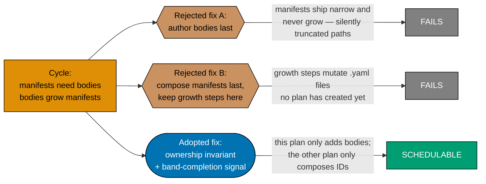
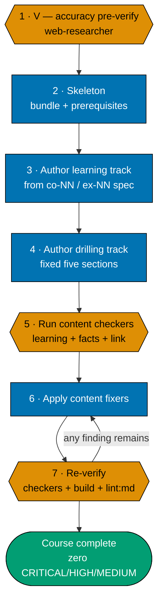
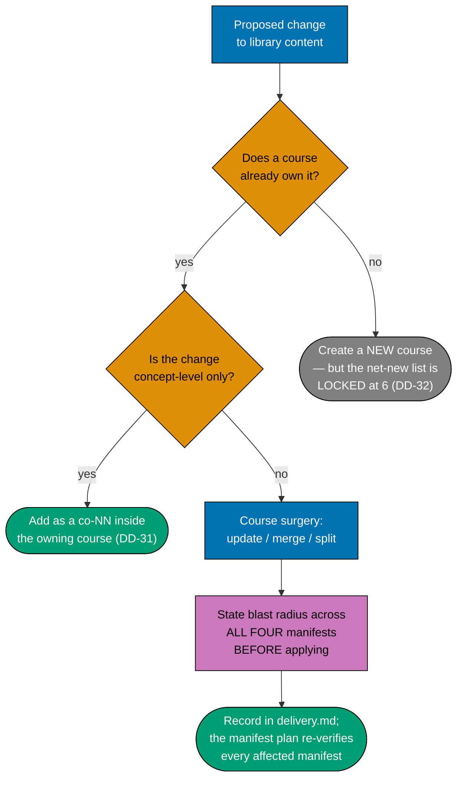
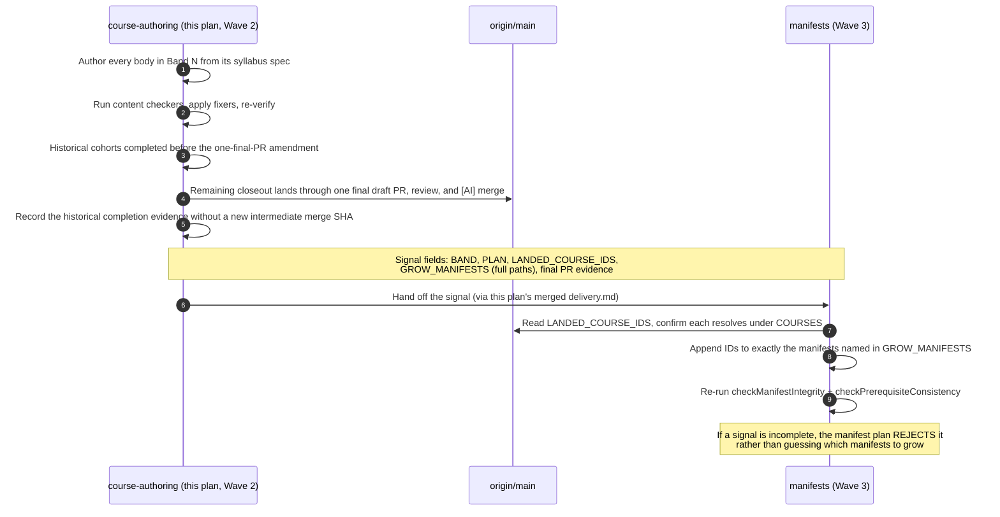
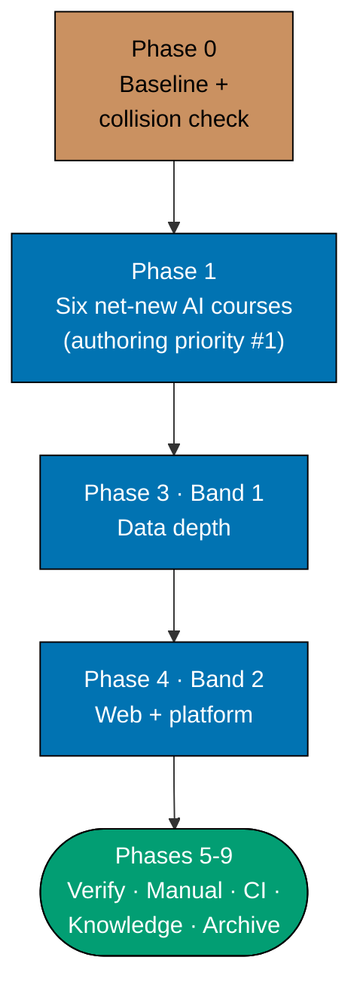

# Technical Docs — Learning Path Course Authoring

## Corpus Custody

`custodied-by:ayokoding-learning-path-02-schema-and-prerequisite-dag` — this plan **reads** the shared
course corpus custodied by plan 02 but never edits, copies, or forks any file under it. Any needed
change to that corpus is routed to plan 02's own `delivery.md` as a change request, per the
[Learning-Plan Syllabus Convention §Custody Rule](../../../repo-governance/conventions/structure/learning-plan-syllabus/custody-rule.md#custody-rule).

## Overview

This plan produces **content artefacts only**: **21** page bundles under
`apps/ayokoding-www/content/en/learn/courses/<course-id>/` — the six net-new AI-engineering courses
(Phase 1), Band 1 — Data depth (5), and Band 2 — Web, backend & platform productivity (10). (This
plan originally scoped 90 bodies across all nine bands; Bands 3–9 and the course-surgery contracts
now belong to seven successor plans — see [README §Successor plans](./README.md#successor-plans).) It
writes no TypeScript, no YAML data file, no route, no component, and no redirect rule. Its
"architecture" is therefore an **authoring architecture**: where each body's authoritative spec lives,
what shape the produced bundle takes, and how a landed band is handed to the plan that composes it.

## Programme decisions

_Folded from the retired shared programme file (deleted so each plan is self-contained). Only the ids this plan cites are reproduced — `R9`, `A6`, `A8`, `A9`, `A12` — copied verbatim from the programme's decision table, with the programme's prose expansions for `A6`, `A8`, and `A12`. These were **programme-scope decisions, not governance rule ids** — nothing under `../../repo-governance/` defines them, and they bind only this programme's plans. `A*` amendments are later than the `R*` rules and win on conflict. Per `A4`, research verification status is carried forward verbatim — an `[Unverified]` claim is never restated as fact._

**Citation-label vocabulary mapping (for a literal Step-5f checker).** The corpus course bodies under `syllabus/courses/` predate the four canonical anti-hallucination labels and use their own vocabulary: `[Needs Verification]` maps to the canonical `[Unverified]` (a pre-authoring verification sweep is still pending), and `(web-verified)` maps to `[Web-cited]`. A checker reading the corpus should treat these as equivalents rather than as unlabelled claims.

| Id  | Decision                                                                                                                                                                                    |
| --- | ------------------------------------------------------------------------------------------------------------------------------------------------------------------------------------------- |
| R9  | Every plan declares its **UI-gate and API-gate posture explicitly**; a plan bearing neither surface is _not_ thereby exempt and must state why                                              |
| A6  | Plans 06-07 teach the **domain to build-founding depth** — enough to implement the software — but contain **no system-building courses**; building is out of scope for a path               |
| A8  | **Strict clean-room licensing, programme-wide** — binds all seven plans, not only 06-07; nothing copyrighted is reproduced, and every concept is restated in original words with a citation |
| A9  | Both corpora **expand past 20 courses** as the domain requires; every derived count follows                                                                                                 |
| A12 | Every syllabus is **independently authored, then externally confirmed** — a published curriculum may corroborate coverage but must never supply the structure being written                 |

### A6 — the build-founding-depth line

`A6` draws a line that is easy to misread in both directions, so it is stated positively and
negatively:

- **In scope**: the domain knowledge an implementer needs — double-entry mechanics, the
  subledger-to-general-ledger relationship, costing methods, period close, document state machines,
  posting rules, the failure modes each of these produces. Architecture is domain knowledge here: you
  cannot found an implementation without knowing how a ledger is structured.
- **Out of scope**: building it. No capstone that constructs a system, no "implement X" exercise, no
  scaffolded codebase the reader extends. A course may describe how a ledger system is architected;
  it may not ask the reader to build one.

The four courses this removes are `capstone-build-a-general-ledger-system`,
`capstone-sharia-compliant-ledger`, `capstone-build-a-minimal-erp-core`, and
`capstone-stand-up-and-integrate-an-open-source-erp`. The first three fail the build test; the fourth
fails `A7` as well, being buyer-competence material.

### A8 — licensing binds the whole programme

`A8` originally read as a plan-06/07 concern because the standards bodies are most visibly
restrictive there. That scoping was wrong: **every plan in the programme authors teaching material,
and teaching material is where copyright exposure concentrates.** The careers corpus carries its own
distinct hazards, and they are easy to miss precisely because programming content feels free:

- **Code examples** copied from documentation, tutorials, blog posts or Stack Overflow. Stack
  Overflow contributions are CC-BY-SA — attribution _and_ share-alike, which is a licence most course
  material cannot satisfy. Author examples originally.
- **Documentation prose** from a framework's official docs. Being free to read is not permission to
  reproduce; most project docs carry their own licence, and it is frequently copyleft.
- **Figures, diagrams and screenshots** lifted from vendor or project sites.
- **Book and course structure.** Reproducing a well-known book's chapter progression, or a paid
  course's module sequence, is the same derivative-work risk as `A12` addresses for syllabi.
- **Trademarks.** Language, framework and vendor names may be used nominatively but never in a course
  title, path segment, or anything that implies endorsement or affiliation.
- **Datasets and sample data** — author them; do not lift a dataset whose licence is unexamined.

The `A8` posture is therefore uniform across all seven plans: **describe, cite and link; never
reproduce.** Where a reader needs the source text, send them to the source.

### A12 — how a syllabus may and may not be confirmed

`A12` exists because the confirmation step introduces the exact risk the rest of `A8` guards against.
Published curricula — ACCA, CPA, CIMA, ASCM/APICS CPIM and CSCP, university course catalogues — are
**copyrighted works**, and several are commercial products whose syllabus _is_ the product. Checking
a syllabus against one is legitimate; deriving a syllabus from one is not.

The order of operations is what keeps this clean, and it is not optional:

1. Author the syllabus from domain reasoning and the plan's own research grounding.
2. **Then** research externally to ask whether the coverage is right — what a practitioner would
   expect that a draft omits, and what it includes that the field does not recognise.
3. Treat the answer as **evidence about coverage**, never as a structure to adopt. A finding is
   actionable as "this topic is missing"; it is never actionable as "reorder to match theirs."

Confirmation must never reproduce a curriculum's text, its module titles, or its sequence. Naming a
body as corroboration ("the topic appears in ASCM's CPIM outline") is nominative use and is fine;
transcribing its outline is not.

## The manifest ownership invariant (binding)

> **This plan never edits a manifest file.** Every file under
> `apps/ayokoding-www/src/features/course-paths/manifests/` is owned by
> [`ayokoding-learning-path-12-careers-se-manifests`](../../backlog/ayokoding-learning-path-12-careers-se-manifests/README.md)
> (the three `software-engineer`-role manifests) and its sibling
> [`ayokoding-learning-path-13-careers-ai-manifest`](../../backlog/ayokoding-learning-path-13-careers-ai-manifest/README.md)
> (the `ai-engineer` manifest). A
> step here that creates, appends to, reorders, or re-verifies a `.yaml` manifest is a **boundary
> violation**, not a convenience.

### Why the invariant exists (and why no wave ordering replaces it)

The two plans have a genuine mutual need:

- The manifest plan needs **this plan's bodies** — `checkManifestIntegrity` fails on any `courseOrder`
  ID with no resolving bundle under `<COURSES>`.
- This plan's bands would, in the source plan's shape, have **grown that plan's manifests** as they
  landed.

Neither ordering satisfies both directions. Put this plan last and its bands grow manifests that were
already published narrow, so the composed paths are permanently truncated in a way that looks correct
because integrity passes over the narrowed set. Put the manifest plan last — which is what the split
does — and this plan's growth steps would have to mutate `.yaml` files that do not exist yet, with
acceptance clauses referencing files no plan has created. **The cycle is not a scheduling problem; it
is an ownership problem, and only an ownership rule resolves it.**



**Accessibility note.** Verdict is carried by node **shape** (hexagon = rejected, stadium = adopted)
and by literal terminal labels (`FAILS` / `SCHEDULABLE`), never by fill colour alone. Fills use the
verified accessible palette per the
[Color Accessibility Convention](../../../repo-governance/conventions/formatting/color-accessibility.md).

### What the invariant permits and forbids, concretely

| Action                                                              | Permitted here?                                                      |
| ------------------------------------------------------------------- | -------------------------------------------------------------------- |
| Create `<COURSES><course-id>/` and author its bundle                | **Yes**                                                              |
| Declare `prerequisites` in a course's own `_index.md`               | **Yes**                                                              |
| Add a course's row to the Course Library Catalog in this file       | **Yes**                                                              |
| List a course in `<COURSES>_index.md`                               | **Yes**                                                              |
| Record a band-completion signal in this plan's `delivery.md`        | **Yes**                                                              |
| Read a `.yaml` manifest to check what a path expects                | **Yes** (read-only)                                                  |
| Append a course ID to any `<MANIFESTS>**/*.yaml`                    | **No**                                                               |
| Re-order any `courseOrder`                                          | **No**                                                               |
| Re-run manifest integrity / prerequisite-consistency as a gate here | **No** — the manifest plan re-verifies its own artefacts             |
| Assert the 127-course catalog total                                 | **No** — that is the catalog total; this plan asserts its own **21** |

## Cross-plan `syllabus/` reference rule (binding)

The 128-file `syllabus/` detail layer lives **only** in
[`ayokoding-learning-path-02-schema-and-prerequisite-dag`](../../done/2026-07-24__ayokoding-learning-path-02-schema-and-prerequisite-dag/README.md).
This plan is its single largest consumer and **never copies it**.

- Every reference uses the **full cross-plan relative path**:
  `../../done/2026-07-24__ayokoding-learning-path-02-schema-and-prerequisite-dag/syllabus/<rest>`. The source plan's
  `./syllabus/...` form resolves to nothing after the split.
- **Copying is forbidden.** A copy forks the source of truth for 121 course specs and four manifest
  orderings, so a later spec correction lands in one copy only — and this plan's authoring passes read
  the stale one.
- The schema plan is Wave 1 and archives to `plans/done/YYYY-MM-DD__…` while this plan is still
  running. It carries a reciprocal repoint step in its own archival phase, executed in the same commit
  as its `git mv`. This plan carries a pre-archival gate check that catches a broken reference in its
  own files.

**Link-validation mechanics (verified against the binary — do not substitute a simpler form).**
`md links validate` accepts **no positional path**; passing one fails with
`error: unexpected argument '<path>' found`. It also cannot be scoped by `cd`-ing into a folder — it
always walks the repo. So "run it in this plan's folder" is **not expressible**. Separately, the bare
repo-wide invocation is **unsatisfiable**: the repo carries a pre-existing, non-zero backlog of
broken links, nearly all under `plans/done/`, unrelated to this work (137 of 138 repo-wide as of
2026-07-22 — a point-in-time snapshot that drifts as more plans archive). Use the repo-wide form with
the pre-push hook's own excludes and filter to this plan's own paths:

```bash
cargo run --release --quiet --manifest-path apps/rhino-cli/Cargo.toml -- md links validate \
  --quiet \
  --exclude plans/done \
  --exclude apps/ayokoding-www/content \
  --exclude apps/ose-www/content 2>&1 | grep -F "ayokoding-learning-path-04-course-authoring"
```

Acceptance: the `grep` finds **no** matching line (exits 1). Falsifiable the other way too —
introduce one bad `../../done/2026-07-24__ayokoding-learning-path-02-schema-and-prerequisite-dag/syllabus/` link and the
same command prints that file and exits 0.

## Authoring architecture

### The course page bundle

Every authored course is a page bundle at `<COURSES><course-id>/` with a fixed anatomy, mirroring the
sibling bundle shape already on disk:

```text
<COURSES><course-id>/
├── _index.md                 declares `prerequisites: [course-id, ...]` (contracted shape)
├── overview.md               purpose + `## Prerequisites` (earlier library courses only)
│                             + register + the explicit scope boundary against confusable siblings
├── learning/
│   ├── _index.md
│   ├── <concept + example pages, exhaustive `co-NN` / `ex-NN` coverage>
│   ├── code/                 colocated runnable examples (code-bearing courses only)
│   └── capstone/             the course's own intra-course capstone
└── drilling/
    ├── _index.md              lists the drilling sections, links to `overview.md`
    └── overview.md            the fixed five-section drilling order
```

The `course-id` slug, the prerequisite chain, the concept-coverage floor, and the worked-example
volume are all **settled** in the matching `syllabus/courses/<course-id>.md` spec. Authoring
transcribes them; it does not re-decide them.

### The per-course authoring convention (maker-checker-fixer, not code TDD)



**Accessibility note.** Stage kind is carried by node **shape** (hexagon = verify, rectangle =
produce, stadium = terminal) and by the numbered step labels; the retry edge carries an explicit
label. Colour is redundant throughout.

**This is deliberately not a Red→Green→Refactor cycle.** Content authoring is a maker-checker-fixer
workflow: there is no failing test to write first, because the artefact under production is prose and
worked examples validated by domain checkers, not application behaviour validated by assertions. The
source plan states this explicitly and this plan preserves the ruling. See
[§TDD exemption](#tdd-exemption-this-plan-ships-no-application-code) below.

### Licensing posture (programme A8)

Programme
[`A8`](#programme-decisions) binds every plan that
authors teaching material, and this plan authors 21 course bodies. **Describe, cite,
and link; never reproduce.** Six concrete hazards apply to a `careers/` course body, each mapped to
where the maker-checker-fixer pipeline above must catch it:

- **Code examples.** Every `learning/code/` worked example (`ex-NN`) is authored originally for this
  course, never copied from a framework's docs, a tutorial, a blog post, or Stack Overflow. Stack
  Overflow content is **CC-BY-SA** — attribution _and_ share-alike — a licence course material
  generally cannot satisfy. The **maker-checker-fixer** step-5 content checkers are the enforcement
  point (see the delivery-checklist acceptance clause below).
- **Documentation prose.** A concept explanation (`co-NN`) restates the idea in this course's own
  words with a citation, the same discipline the `syllabus/courses/*.md` "Accuracy notes" sections
  already model (e.g. `syllabus/courses/actor-model-concurrency.md`'s hexdocs citations) — never a
  paraphrase-by-substitution of the official docs' own sentences.
- **Figures, diagrams and screenshots.** Any diagram in a course body is authored (Mermaid, per the
  [Diagrams convention](../../../repo-governance/conventions/formatting/diagrams.md)), never a
  screenshot or image lifted from a vendor or project site.
- **Book and course structure.** A course's own module/example progression is authored from the
  `syllabus/courses/<course-id>.md` spec's `co-NN` concept order, never from reproducing a well-known
  book's chapter progression or a paid course's module sequence — the same derivative-work risk `A12`
  states for syllabus confirmation.
- **Trademarks.** Language, framework, and vendor names appear nominatively only — never in a course
  title, path segment, or phrasing implying endorsement or affiliation.
- **Datasets and sample data.** Any dataset a worked example touches is authored for the example, not
  lifted from a source whose licence was not examined.

The full rationale is folded into [§Programme decisions §A8](#programme-decisions) above; see this
plan's `brd.md` for the corresponding risk row and `delivery.md` for
the grep-checkable acceptance clause applied per authored course.

### The `prerequisites` frontmatter contract (consumed, not owned)

Every authored `_index.md` declares:

```yaml
prerequisites: [course-id, course-id, ...]
```

The canonical statement of this field's shape is owned by
[`ayokoding-learning-path-02-schema-and-prerequisite-dag`](../../done/2026-07-24__ayokoding-learning-path-02-schema-and-prerequisite-dag/tech-docs.md).
This plan **consumes** it. If this document and the schema plan's ever disagree, **the schema plan's
wins**. The list's contents are transcribed from the course's own spec file, never re-derived — an
invented edge adds a false edge to the library DAG whose failure surfaces far downstream in the
manifest plan with no trace back to the authoring pass that caused it.

### Course surgery — the four-path blast-radius rule

Courses are shared. Any edit, split, or merge to a course ripples to every manifest carrying that
course ID. DD-28 permits surgery and binds it to a blast-radius statement.



**Accessibility note.** Node kind is carried by **shape** (diamond = decision, rectangle = action,
stadium = terminal) and every edge carries an explicit `yes` / `no` label. The locked outcome states
its own constraint in its label rather than relying on its grey fill.

**A body fork is never an outcome of this tree.** DD-7's surviving half stands: per-path framing is a
lightweight intro/outro callout around the one shared body, never a copy. DD-28 supersedes only the
"create-only, never modify existing" half.

### Band-completion signal (the handoff to the manifest plan)



Per the 2026-07-31 execution amendment in `delivery.md`, courses continue through authoring and
content checks one by one, but remaining bodies land in sequential five-course PR cohorts. The
signal's five fields are specified in
[README §Band-completion signal contract](./README.md#band-completion-signal-contract). **This plan's
own `GROW_MANIFESTS` routing is uniform across its three signals**: Phase 1 grows one manifest (the
fourth path only); Band 1 and Band 2 each grow the three software-engineer-role manifests. The
non-uniform routing this section previously described for Bands 3–9 (Band 9 growing two manifests,
Bands 5 and 8 growing four) is no longer this plan's concern — each successor plan states its own
routing for the band(s) it lands.

### Delivery flow across this plan's phases



**Accessibility note.** Phase kind is carried by node **shape** (stadium = finalization, rectangle =
authoring) and by explicit phase numbers in every label. Colour is redundant.

> **Numbering note.** Phase 3 and Phase 4 retain their original numbers from this plan's 90-body
> scope (there is deliberately no "Phase 2" in this diagram — it was the course-surgery contract-lock
> phase, which moved to `ayokoding-learning-path-06-course-authoring-architecture-and-ai-harness`
> along with Band 5, the band the contracts targeted). This is the least-diff renumbering: Phase 0,
> Phase 1, Phase 3, and Phase 4 are unchanged from their already-merged/in-flight history; only the
> finalization tail (formerly Phases 12–16) is renumbered to Phases 5–9. See
> [delivery.md](./delivery.md) for the full phase list and the original Bands 3–9's phase numbers,
> which are documented there as moved rather than silently dropped.

**Band ordering rationale (updated by this revision).** The original rationale — Band 5 following the
contract-lock phase; Band 8's `capstone-build-your-own-coding-agent` following Band 5 because it
assembles the harness cluster — described bands no longer authored here; it is preserved verbatim in
`ayokoding-learning-path-06-course-authoring-architecture-and-ai-harness` and
`ayokoding-learning-path-11-course-authoring-capstones`. Within this plan's own remaining scope, Band 1
and Band 2 are mutually content-independent and their relative order (1 before 2) is a convenience,
not a constraint; each body
writes only its own subtree, so they pipeline concurrently through review bounded by the in-force cap.

## Design Decisions

This plan owns **sixteen** design decisions (text preserved verbatim below — several target Bands 3–9
content this plan no longer authors) and carries **two** cross-cutting ones verbatim.

> **Numbering note.** `DD-34`, `DD-35`, and `DD-39` are **not** this split's decisions — they are
> FS-SE-inherited tokens used throughout `syllabus/courses/**` with different meanings (concept
> enumeration, primary-source citation policy, typed-Python policy) and travel with `syllabus/` into
> the schema plan. `DD-36`, `DD-37`, and `DD-38` are unused. **Do not renumber to close the apparent
> gap.**
>
> **Band-carve-out scope note (added by this revision — read before the individual entries below).**
> None of the sixteen DD ids below is renumbered or deleted — several are cited from the manifest
> plans' own `tech-docs.md` files (`ayokoding-learning-path-12-careers-se-manifests` and
> `ayokoding-learning-path-13-careers-ai-manifest`, successors to the retired
> `ayokoding-learning-path-05-manifests`) (DD-13, DD-25, DD-26 by exact id) and
> must survive at their current numbers. Where a DD's target content moved with a band to a successor
> plan, the DD's text is kept verbatim as the historical rationale record, with an inline scope note
> naming the successor plan that now applies it. Quick reference:
>
> | DD    | Still this plan's scope (Phase 1 / Band 1 / Band 2)?                                                                                                | If not, moved with band to                          |
> | ----- | --------------------------------------------------------------------------------------------------------------------------------------------------- | --------------------------------------------------- |
> | DD-8  | Yes — general variant policy, not band-specific                                                                                                     | —                                                   |
> | DD-10 | No — targets Band 9 interview courses                                                                                                               | `…-09-course-authoring-interview-technique`         |
> | DD-11 | No — targets Band 5 AI-band scope-guard                                                                                                             | `…-06-course-authoring-architecture-and-ai-harness` |
> | DD-12 | No — targets Band 7 detection-engineering/defensive-security                                                                                        | `…-08-course-authoring-security-and-ops`            |
> | DD-13 | No — targets Band 5 harness cluster (cited by DD-13's manifest-half sibling in `ayokoding-learning-path-13-careers-ai-manifest`)                    | `…-06-course-authoring-architecture-and-ai-harness` |
> | DD-14 | Partially — `self-hosting-essentials` (Band 2) stays; `bare-metal-virtualization`, `just-enough-cpp`, and the pentest-engine capstone are Bands 6–8 | `…-07…`, `…-08…`, `…-11…` (see entry)               |
> | DD-17 | Yes — general FS-SE-dependency-removal ruling, programme-wide                                                                                       | —                                                   |
> | DD-18 | Yes — path-independent library philosophy                                                                                                           | —                                                   |
> | DD-20 | No — six of seven capstones are Band 8                                                                                                              | `…-11-course-authoring-capstones`                   |
> | DD-25 | Yes — Phase 1's light-eval-gate/deep-evals split                                                                                                    | —                                                   |
> | DD-26 | Yes — Phase 1's statistics-for-evals course                                                                                                         | —                                                   |
> | DD-28 | Yes (catalog-total ruling); the Band-5 donor-course surgery itself is authored by the successor plan                                                | `…-06…` for the donor-course edits                  |
> | DD-29 | No — targets Band 5 harness cluster + `agent-context-and-memory`                                                                                    | `…-06-course-authoring-architecture-and-ai-harness` |
> | DD-30 | No — targets the Band 8 coding-agent capstone                                                                                                       | `…-11-course-authoring-capstones`                   |
> | DD-31 | No — targets Band 5 harness-cluster courses                                                                                                         | `…-06-course-authoring-architecture-and-ai-harness` |
> | DD-32 | Yes — confirms the Phase 1 six-course AI list is locked                                                                                             | —                                                   |

### Owned by this plan

- **DD-8 · Variant policy — separate course only when pedagogy must differ.** Default is one shared,
  path-neutral block. Author a distinct course-id variant (same topic, different teaching approach)
  only when a path genuinely needs a different pedagogy; paths pick the fitting variant. Variants are
  added **on demand** — no speculative variants are enumerated.
- **DD-10 · Interview technique is NEW content; fundamentals are shared courses.** The four interview
  modules teach technique; DS&A/OOP/system-design **depth** are library courses every path can use.
  Cleanly separates "technique" (refresh register, `interview-ready`-owned) from "subject depth"
  (shared).
- **DD-11 · AI-band scope-guard (baked in).** `creating-ai-powered-apps` = _use an LLM in an app_;
  `agentic-ai` = a _single survey_ of what an agent is that **forward-links each primitive to its
  harness-cluster course and stops short of build-your-own depth**; the harness cluster
  (`the-agent-loop`, `agent-tools-and-mcp`, `agent-context-and-memory`,
  `agent-permissions-and-sandboxing`, `agent-orchestration-subagents-and-observability`) builds each
  subsystem one-per-course. The cross-reference contract prevents 57 and the cluster from duplicating
  the loop/tools/MCP/memory/evals explanations — the band's largest duplication-creep risk.
- **DD-12 · `detection-engineering-and-siem-operations` kept distinct from `defensive-security`;
  mislabel fixed.** `defensive-security` (60) is **hands-on By-Example** (Sigma-on-ELK/OpenSearch + IR
  - hardening as generalist blue-team breadth) — the catalog's "concept" label was wrong and is
    corrected. `detection-engineering-and-siem-operations` owns the **Wazuh-specific deep tier**
    (decoders, correlation-rule authoring, FP tuning, dashboards) and declares `defensive-security` as
    its prerequisite. Explicit scope lines drawn in both bodies.
- **DD-13 · Harness-engineering cluster as a marquee build-your-own track.** The five harness courses +
  `capstone-build-your-own-coding-agent`, in **Python** (matching `remotebrowser`), sit after the AI
  band so prerequisites precede them. Available to all four paths; central to the three
  software-engineer paths' converging endpoint, and directly relevant to the fourth path's
  build-AI-systems scope (D1/DD-21) — the AI path's own manifest composition, including whether it
  walks or links to this cluster, is decided during that path's authoring (DD-27), and was resolved by
  DD-33 in favour of walking.
- **DD-14 · Two-altitude splits + gap-closers (retained, all keep-distinct).** Light
  `self-hosting-essentials` vs full-depth `bare-metal-virtualization`; `defensive-security` vs
  `detection-engineering-and-siem-operations` (DD-12); dedicated `just-enough-cpp` on-ramp (prereq
  `just-enough-c`); the `capstone-build-your-own-pentest-engine` security flagship. All are library
  courses; every path decides whether to include them.
- **DD-17 · FS-SE hard dependency removed.** The prior "the FS-SE plan must be DONE first" gate is gone
  — FS-SE is closed (`plans/done/2026-07-19__fundamentally-strong-software-engineer/`) and its Passes
  3–5 scope (topics 34–94 authoring) is **absorbed here** as the backfill.
- **DD-18 · Proof-of-transfer outcome-anchor (principles, not repo-specifics).** Courses teach durable
  **principles**; the target codebases are **evidence the principles transfer**, never subject matter.
  Path-independent — it justifies the **library**; all four paths inherit it (amended 2026-07-20 — was
  three). See
  [Productive in Target Codebases](#productive-in-target-codebases-proof-of-transfer-outcome-anchor).
- **DD-20 · Seven inter-topic capstones promoted to first-class catalog/manifest entries (2026-07-19
  reconciliation).** `capstone-solid-core`, `capstone-real-world-delivery`, `capstone-secure-service`,
  `capstone-data-pipeline`, `capstone-concurrency-and-systems`, `capstone-concurrency-showdown`, and
  `capstone-lead-at-altitude` are fully-specified inter-topic capstone specs embedded inside
  `engineering-management.md`, `defensive-security.md` (×3), `compilers-parsers-and-transpilers.md`
  (×2), and `site-reliability-engineering.md` respectively — each with a goal, an
  integrated-concepts checklist, ordered steps, acceptance criteria, and a done bar, indistinguishable
  in rigor from the six capstones the catalog already tracked. `capstone-solid-core` is **already live
  on disk** (`apps/ayokoding-www/content/en/learn/fundamentally-strong/software-engineer/capstone-solid-core/`,
  re-classified `Ecap`); the other six have no legacy home and are authored native (re-classified `N`).
  **Ruling: promote all seven** to the [Course Library Catalog](#course-library-catalog), all three
  path manifests (placed prerequisite-consistently), `syllabus/courses/README.md`'s capstone
  enumeration, and the delivery checklists. Corrected baseline: **114 → 121 courses, still 0 merges**.
  Never fold into a parent course's intra-course capstone or cut — each is a genuine, independently
  valuable building block with its own stable ID. **Decided 2026-07-19.**
  - _Split note (updated for the 21-course trim)_: none of the seven capstones are authored by this
    plan. `ayokoding-learning-path-11-course-authoring-capstones` authors the six native ones
    (Band 8); `capstone-solid-core` is re-homed by `ayokoding-learning-path-01-url-restructure`; the
    manifest placements (all three `software-engineer`-role manifests, per DL-14) are performed by
    `ayokoding-learning-path-12-careers-se-manifests`.
- **DD-25 · Evals split: an early light gate plus a later deep-evals course (D5).** Resolves a genuine
  ordering disagreement (Huyen-style "evals first" vs. bootcamp-style "evals after building") rather
  than silently picking a side. A **light eval gate** lands early — immediately after a learner's first
  working LLM call, before RAG and agents — answering only "how will you know this works?" A separate
  **deep evals course** lands after agents, covering error analysis, task-specific criteria,
  LLM-as-judge with measured human agreement, CI gating, and judge-scope reliability; it absorbs the
  three scattered evals treatments currently duplicated across `creating-ai-powered-apps` (co-19),
  `agentic-ai` (co-25/co-26), and `agent-orchestration-subagents-and-observability` (Theme D), which
  are trimmed to forward-links rather than gaining a fourth treatment. The scope boundary between the
  two courses is explicit, in the style of the library's existing AI-band scope-guard (DD-11).
- **DD-26 · Statistics-for-evals course authored, scoped tightly (D6).** No statistics or ML course
  exists anywhere in the (pre-amendment) 121-course library. Research verdict: "no ML background
  needed" is credible for training theory (backprop, architectures) but oversold for statistics — judge
  concordance and significance testing are irreducibly statistical. The new course is scoped to exactly
  what evals demand, not a general statistics course; `analytics-and-experimentation` (classical
  product A/B testing) remains a distinct, keep-separate course and may become a sibling or
  prerequisite rather than being merged.
- **DD-28 · Course surgery (update / merge / split / create) now permitted; six net-new AI courses
  bring the catalog to 127 (D8, amends the create-only half of DD-7).** Supersedes the "pure manifest
  reuse, zero new bodies beyond genuine gaps" invariant: course surgery against an **existing** course
  is now permitted, not only creation for a genuine gap. **Binding rule — course surgery is a
  four-path change.** Courses are shared; any edit, split, or merge to a course ripples to every
  manifest carrying that course ID. Each surgery **must state its blast radius** across all four
  manifests before it is applied, and every affected manifest must be **re-verified
  prerequisite-consistent** afterward (enforced as a gate). Concretely: the library's evals content,
  currently triple-taught with no single owner (`creating-ai-powered-apps` co-19, `agentic-ai`
  co-25/co-26, `agent-orchestration-subagents-and-observability` Theme D), is extracted into the new
  owned deep-evals course (DD-25) and the three donor courses are trimmed to forward-links — a surgery,
  not a fourth treatment. `agent-permissions-and-sandboxing` (guardrails) is explicitly **not** a
  surgery target — it already has a clear owner and is the library's strongest area. Six net-new
  courses are agreed for the fourth path (light eval gate, statistics for evals, deep evals, product
  patterns for probabilistic systems, inference serving and model deployment, fine-tuning and
  adaptation — DD-25/DD-26), bringing the catalog from the original 121 (114 authored + 7 DD-20
  capstones catalogued) to **127**.
  - **Amendment pair split across plans (binding — read both halves).** DD-28 is the **amendment**;
    the invariant it amends, **DD-7**, lands in whichever of
    [`ayokoding-learning-path-12-careers-se-manifests`](../../backlog/ayokoding-learning-path-12-careers-se-manifests/tech-docs.md#design-decisions)
    /
    [`ayokoding-learning-path-13-careers-ai-manifest`](../../backlog/ayokoding-learning-path-13-careers-ai-manifest/tech-docs.md#design-decisions)
    reproduces it (successors to the retired `ayokoding-learning-path-05-manifests`, the plan this
    decision originally targeted).
    **DD-28 supersedes the "create-only, never modify existing" half of DD-7.**
  - **DD-7's surviving half still binds here**, restated so a reader of this plan alone cannot read
    "surgery permitted" as "forking permitted": _a path omits a course that does not fit and creates a
    new shared course only for a genuine gap; per-path framing is a lightweight intro/outro callout
    around the shared body. Single source of truth per course._ **No body is ever forked per path.**
  - The manifest plan's copy of DD-7 carries the reciprocal link back to this DD-28. If either link
    breaks, a reader of one plan inherits a stale claim — `prd.md` names exactly this class of
    "per-role convergence confusion" as a live product risk mitigated only by the amendment record
    being cross-referenced from every site making the original claim.
- **DD-29 · Context and harness engineering: name and cite in existing courses, do not add or rename
  any course (D9).** Research verdict, verified against the actual course files: both disciplines are
  already taught, concept-for-concept, by the existing library — they are simply never named.
  `agent-context-and-memory` maps onto what the industry began calling **context engineering** in June
  2025 (Lütke 2025-06-19, Karpathy 2025-06-25, Willison 2025-06-27, and Anthropic's Effective Context
  Engineering methodology, 2025-09-29); the six-course harness cluster (`the-agent-loop`,
  `agent-tools-and-mcp`, `agent-context-and-memory`, `agent-permissions-and-sandboxing`,
  `agent-orchestration-subagents-and-observability`, `capstone-build-your-own-coding-agent`) satisfies
  all four necessary conditions in the only academic definition of an agent harness (arXiv 2606.10106),
  which the industry began calling **harness engineering** from late 2025 (Anthropic 2025-11-26;
  OpenAI; Böckeler/Thoughtworks 2026-02-17). A naming/lineage line citing this is added to
  `agent-context-and-memory` and to the harness cluster + `capstone-build-your-own-coding-agent`, so a
  learner connects the material to job-market vocabulary. The OpenAI/Anthropic-vs-HumanLayer
  containment dispute (whether harness is the umbrella containing context management, or the reverse)
  is cited as **unresolved**, not resolved or adopted as structure. **No course is renamed and no
  course is added** — "harness engineering" is roughly five months old and contested among named
  practitioners; building durable course structure on terminology this unsettled ages the curriculum
  badly.
  - **Citations** (matching the sourcing style used throughout `syllabus/courses/`):
    - [Web-cited] Tobi Lütke, X/Twitter, 2025-06-19 — "I really like the term 'context engineering'
      over prompt engineering… the art of providing all the context for the task to be plausibly
      solvable by the LLM." <https://x.com/tobi/status/1935533422589399127> (accessed 2026-07-21).
    - [Web-cited] Andrej Karpathy, X/Twitter, 2025-06-25 — "+1 for 'context engineering' over 'prompt
      engineering'…" <https://x.com/karpathy/status/1937902205765607626> (accessed 2026-07-21).
    - [Web-cited] Simon Willison, "Context engineering," 2025-06-27 — "The term context engineering
      has recently started to gain traction as a better alternative to prompt engineering. I like
      it." <https://simonwillison.net/2025/jun/27/context-engineering/> (accessed 2026-07-21).
    - [Web-cited] Anthropic, "Effective context engineering for AI agents" — "Context engineering
      refers to the set of strategies for curating and maintaining the optimal set of tokens
      (information) during LLM inference, including all the other information that may land there
      outside of the prompts."
      <https://www.anthropic.com/engineering/effective-context-engineering-for-ai-agents> (accessed
      2026-07-21; the specific 2025-09-29 publication date cited above was not independently
      re-verified against the live page).
    - [Web-cited] arXiv 2606.10106, "What makes a harness a harness: necessary and sufficient
      conditions for an agent harness" — the abstract defines a harness as "the layer that wraps a
      language model and turns it into a coding agent able to act on a repository," then proposes "a
      constitutive definition that states the necessary and sufficient conditions for a system to be
      an agent harness" — confirmed real via WebSearch during the audit that produced this finding.
      <https://arxiv.org/abs/2606.10106> (accessed 2026-07-22). The id is well-formed, not anomalous
      (arXiv YYMM prefix: `26` = 2026, `06` = June).
    - [Web-cited] Anthropic, "Effective harnesses for long-running agents," 2025-11-26 — "We developed
      a two-fold solution to enable the Claude Agent SDK to work effectively across many context
      windows: an initializer agent that sets up the environment on the first run, and a coding agent
      that is tasked with making incremental progress in every session, while leaving clear artifacts
      for the next session."
      <https://www.anthropic.com/engineering/effective-harnesses-for-long-running-agents> (accessed
      2026-07-21).
    - [Web-cited] Birgitta Böckeler / Thoughtworks (via martinfowler.com), "Harness Engineering — first
      thoughts," 2026-02-17 — "I like 'harness' as a word to describe the tooling and practices we can
      use to keep AI agents in check."
      <https://martinfowler.com/articles/exploring-gen-ai/harness-engineering-memo.html> (accessed
      2026-07-21).
    - [Unverified] "OpenAI" — a candidate OpenAI publication exists at
      <https://openai.com/index/harness-engineering/> ("Harness engineering: leveraging Codex in an
      agent-first world," reported 2026-02-11), but the primary page returned **HTTP 403** and was
      not read at verification time (2026-07-22); the date and content rest on third-party summaries
      only. This stays **`[Unverified]`** pending a primary-source read — do not upgrade to a verified
      fact. Note the reported date is **early 2026**, later than the surrounding "late 2025" framing on
      the DD-29 line above (that framing is grounded on Anthropic 2025-11-26); the OpenAI attribution's
      contribution to a "late 2025" onset is therefore **conditional**, not established.
- **DD-30 · The capstone teaches the METR-vs-Scale-AI dispute as durable epistemic content (D10).**
  `capstone-build-your-own-coding-agent` teaches the contested evidence on whether harness quality even
  matters, as content that survives whatever happens to the vocabulary: **METR** (independent, no
  vendor stake, 2026-02-13) found Claude Code ahead of a generic ReAct scaffold in 50.7% of bootstrap
  samples on Opus 4.5 — a coin flip; **Scale AI / SWE Atlas** reports large scaffold-driven swings,
  with native scaffolds exploring roughly 1.5-2× more; the **competence-floor reconciliation** — METR
  compared against a competently built generic baseline while Scale compared against naive ones,
  implying harness quality matters enormously below a competence floor and then flattens — is
  explicitly labelled a **synthesis no single source makes**, not a finding either source reports. The
  unsourced 42%→78% scaffold-swing claim is a **do-not-cite**: it traces to no primary source.
  - **Citations**:
    - [Web-cited] METR, "Measuring Time Horizon using Claude Code and Codex," 2026-02-13.
      <https://metr.org/notes/2026-02-13-measuring-time-horizon-using-claude-code-and-codex/> (accessed
      2026-07-21) — confirms Claude Code beats a ReAct scaffold in 50.7% of bootstrap samples on
      Opus 4.5.
    - [Web-cited] Scale AI, "SWE Atlas is Complete: Measuring Coding Agents Across the Engineering
      Loop." <https://scale.com/blog/swe-atlas-complete> (accessed 2026-07-22) — verbatim: "Models
      running in their native scaffolds (Claude Code, Codex CLI) perform 1.5x to 2x more exploration,
      search, and execution than the same models on a generic harness, and they score noticeably
      higher."
    - The 42%→78% scaffold-swing figure remains a **do-not-cite** per this DD's own text — no primary
      source was found for it.
- **DD-31 · Four concept-level additions land inside existing courses, never as new courses (D11).**
  Verified absent by direct file read at decision time, now confirmed present as `co-NN` entries in the
  corresponding course files (each already had mandated example/concept headroom): **cache-aware prefix
  ordering** → `agent-context-and-memory` co-23 (order context by staleness, not logical grouping —
  framed as the vendor-neutral stable-before-variable principle, not tied to Anthropic's explicit
  breakpoints or OpenAI's automatic threshold); **tool-count degradation** → `agent-tools-and-mcp`
  co-23 (tool-selection accuracy declines as available tool count rises, per the Berkeley
  Function-Calling Leaderboard and a GeoEngine benchmark finding a model failing at 46 tools and
  succeeding at 19 `[Needs Verification]` — re-verify both benchmark citations at authoring time,
  see `syllabus/courses/agent-tools-and-mcp.md`; governs when to split a tool surface across
  subagents); **tool-result token
  efficiency** → `agent-tools-and-mcp` co-24 (a tool's result shape is a context-budget decision;
  promotes the prior unquantified ex-27 aside to a named concept); **train-vs-production permission
  asymmetry** → `agent-permissions-and-sandboxing` co-23 (a training/exploration harness is permissive,
  a production harness restrictive — the distinction is about risk, not model capability, which is why
  it stays durable as models improve). None of the four introduces a new course.
- **DD-32 · Net-new course list locked at exactly 6; context and harness engineering add zero (D12,
  confirms DD-28).** Unchanged from the list DD-28 already catalogs (light eval gate, deep evals,
  statistics for evals, product patterns for probabilistic systems, inference serving and model
  deployment, fine-tuning and adaptation). DD-29 through DD-31 are naming, citation, and concept-level
  work **inside existing courses** — they add zero courses on top. This locks the arithmetic DD-28
  established: **127-course catalog** (121 + 6), not subject to further growth from the context/harness
  naming work.

### Cross-cutting (reproduced verbatim in all five split plans)

- **DD-15 · Build order (locked; amended 2026-07-20 by DD-27 — see below).** Group A (architecture +
  `course-paths` UI — hard prerequisite) → `interview-ready` MVP ships first (re-home 1–33, author the
  4 interview courses + `capstone-interview-loop`, one manifest, deploy) → `immediately-effective`
  manifest → `fundamentally-strong` manifest → backfill topics 34–94 native into `courses/` as the
  library fills. **DD-27 amends steps 2 onward**: the MVP is narrowed to an architecture smoke test
  only (interview-course authoring is no longer bundled into it), and the fourth path is inserted as
  authoring priority #1 immediately after the MVP.
- **DD-27 · Build order amended: the fourth path is authoring priority #1, behind an
  architecture-smoke-test-only MVP (D7, amends DD-15).** Locked order: **Group A** (architecture + UI,
  unchanged hard prerequisite) → **`interview-ready` MVP, narrowed to an architecture smoke test only**
  (ships against topics 1–33, already live on disk; proves routing, manifest loading, `?path` context,
  prev/next, breadcrumb, and prerequisite display against real content, in days not months —
  authoring the 4 NEW interview courses + `capstone-interview-loop` is **no longer bundled into this
  MVP gate**) → **`careers/immediately-effective/ai-engineer`** (authoring priority #1 for all authoring effort)
  → **`careers/immediately-effective/software-engineer`** manifest → **`careers/fundamentally-strong/software-engineer`**
  manifest → **backfill topics 34–94**. Rationale (preserved from the original build-order decision):
  nothing in the AI path exists on disk (~17 courses); making it literally first — ahead of even the
  MVP — would mean nothing ships until all 17 are authored, with the UI architecture unvalidated the
  entire time. Ordering it immediately after an architecture-smoke-test MVP gives the AI path first
  claim on every unit of real authoring effort while keeping the architecture proven early against
  content that already exists.

### Referenced but owned elsewhere

| DD    | Subject                                                                                                                                   | Owner plan                                                                                                              |
| ----- | ----------------------------------------------------------------------------------------------------------------------------------------- | ----------------------------------------------------------------------------------------------------------------------- |
| DD-2  | One canonical body + URL per course; re-home with redirects                                                                               | `ayokoding-learning-path-01-url-restructure`                                                                            |
| DD-6  | Every course declares `prerequisites` → a prerequisite DAG                                                                                | `ayokoding-learning-path-02-schema-and-prerequisite-dag`                                                                |
| DD-7  | Omit-or-create; per-path framing is a callout, never a body fork                                                                          | `ayokoding-learning-path-12-careers-se-manifests` / `ayokoding-learning-path-13-careers-ai-manifest` (amended by DD-28) |
| DD-16 | Prerequisite-consistency is the audited smoothness property                                                                               | `ayokoding-learning-path-02-schema-and-prerequisite-dag`                                                                |
| DD-21 | The AI path teaches building AI systems, not driving them                                                                                 | `ayokoding-learning-path-13-careers-ai-manifest`                                                                        |
| DD-22 | Convergence amended: paths converge per role, not globally                                                                                | `ayokoding-learning-path-12-careers-se-manifests` / `ayokoding-learning-path-13-careers-ai-manifest`                    |
| DD-24 | Fourth path's entry point — **SUPERSEDED 2026-07-21**, see below                                                                          | `ayokoding-learning-path-13-careers-ai-manifest`                                                                        |
| DD-33 | Fourth path's manifest WALKS the AI/harness cluster; spine was fixed at 15 — **SUPERSEDED 2026-07-21** by DD-35, no longer a fixed figure | `ayokoding-learning-path-13-careers-ai-manifest`                                                                        |

**DD-24 supersession (2026-07-21).** DD-24 originally set the fourth path's entry point as
**linked, not included** prerequisites, on the assumption of an already-working software engineer.
That assumption is overturned: `careers/immediately-effective/ai-engineer` assumes **no** prior
software-engineering competence, and its prerequisites are **included** in `courseOrder` rather than
linked out. The consequence for this plan is **nil in authored volume** — the included prerequisites
are existing library courses, so the path's manifest lengthens (a
`ayokoding-learning-path-13-careers-ai-manifest` change) while the 21 bodies authored here are unchanged. The
body-level rule that survives is a **scope boundary**, not an entry assumption: each AI-specific
course teaches AI material only and never re-teaches SWE fundamentals another course owns. Recorded
in [`prd.md` §Product Overview](./prd.md#product-overview).

## Course Library Catalog

> **Scope note**: the full-programme catalog (127 courses across all bands) is described in full in
> this plan's history — see the git history of this file, or the manifest plans' own terminal
> cross-plan totals in `ayokoding-learning-path-12-careers-se-manifests/tech-docs.md` and
> `ayokoding-learning-path-13-careers-ai-manifest/tech-docs.md`. **This
> section now lists only the 21 course bodies this plan authors.** The other 69 native bodies (Bands
> 3–9) plus the 3 course-surgery scope contracts move to the 7 successor plans:
> `ayokoding-learning-path-05-course-authoring-platform-and-concurrency`,
> `ayokoding-learning-path-06-course-authoring-architecture-and-ai-harness`,
> `ayokoding-learning-path-07-course-authoring-low-level-systems`,
> `ayokoding-learning-path-08-course-authoring-security-and-ops`,
> `ayokoding-learning-path-09-course-authoring-interview-technique`,
> `ayokoding-learning-path-10-course-authoring-jvm-and-build-your-own`,
> `ayokoding-learning-path-11-course-authoring-capstones`. Each successor plan's own tech-docs.md
> carries its slice of the catalog forward.

This plan's **21 bodies** split into three groups: **Band 1 — Data depth** (5), **Band 2 — Web &
platform productivity** (10, `N`/`T` rows only — the `E`-origin courses in this cluster, e.g.
`just-enough-typescript`/`frontend-essentials`/`backend-essentials`/`networking-essentials`, are
already shipped and re-homed by `ayokoding-learning-path-01-url-restructure`, not authored here), and
the **fourth path's six net-new AI-engineering courses** (Phase 1). 21 = 5 + 10 + 6.

Each row lists **course-id · origin · format · primary language · prerequisites · one-line scope**.
**Origin**: `E` = existing shipped (re-homed elsewhere, listed here only for prerequisite context),
`T(n)` = transferred FS-SE topic n (authored here), `N` = new (authored here). **Order is NOT a
catalog property** — it lives in the four path manifests owned by
`ayokoding-learning-path-12-careers-se-manifests` (three `software-engineer`-role manifests) and its
sibling `ayokoding-learning-path-13-careers-ai-manifest` (the `ai-engineer` manifest). `prerequisites`
are the course's own DAG edges (`—` = entry
point). Variants are added **on demand** and are not enumerated here.

Full per-course detail is the cross-plan
[`syllabus/courses/` catalog](../../done/2026-07-24__ayokoding-learning-path-02-schema-and-prerequisite-dag/syllabus/courses/README.md).

### Web & platform productivity (Band 2 — `N`/`T` rows only; this plan's 10 authored bodies)

> The `E`-origin courses this cluster depends on (`just-enough-typescript`, `frontend-essentials`,
> `backend-essentials`, `networking-essentials`, `just-enough-bash`, `version-control-and-git`,
> `sql-essentials`) already exist on disk, re-homed by `ayokoding-learning-path-01-url-restructure` —
> not authored or re-listed here; see the cross-plan syllabus catalog linked above for their rows.

| Course ID                           | Origin | Format            | Primary language | Prerequisites                                             | One-line scope                                                                                |
| ----------------------------------- | ------ | ----------------- | ---------------- | --------------------------------------------------------- | --------------------------------------------------------------------------------------------- |
| `async-python-and-fastapi-services` | N      | By Example        | Python           | `backend-essentials`, `concurrency-and-parallelism`       | FastAPI + Pydantic + uv/ruff/pyright (defers async concepts to 24, framework internals to 40) |
| `api-design`                        | T(41)  | By Example        | Python           | `backend-essentials`                                      | REST/GraphQL/gRPC, OpenAPI, versioning                                                        |
| `advanced-frontend`                 | T(47)  | By Example        | TypeScript       | `frontend-essentials`                                     | State mgmt, performance, FE architecture                                                      |
| `self-hosting-essentials`           | N      | By Example        | ops/config       | `backend-essentials`, `networking-essentials`             | One box: containerize, reverse proxy + TLS, PaaS push                                         |
| `backend-at-scale`                  | T(39)  | By Example        | Python           | `backend-essentials`, `api-design`                        | Caching, sharding, queues, scaling                                                            |
| `containers-and-orchestration`      | T(50)  | By Example        | YAML/CLI         | `just-enough-bash`, `backend-essentials`                  | Docker + Kubernetes                                                                           |
| `cloud-and-iac`                     | T(51)  | Annotated-concept | HCL/YAML         | `containers-and-orchestration`                            | Terraform/OpenTofu IaC lifecycle                                                              |
| `cicd-and-release-engineering`      | T(55)  | By Example        | YAML + Python    | `version-control-and-git`, `containers-and-orchestration` | Pipelines, artifacts, release                                                                 |
| `build-automation-and-task-runners` | T(54)  | By Example        | multi-tool       | `just-enough-bash`, `version-control-and-git`             | Build systems, task runners, graphs                                                           |
| `information-architecture-and-seo`  | T(49)  | Annotated-concept | HTML             | `frontend-essentials`                                     | Structuring content, SEO                                                                      |

> **Moved out**: Mobile & desktop platforms, CS foundations/paradigms/concurrency,
> Architecture/distributed/AI-harness, Low-level systems/JVM/languages/build-your-own, Security/ops/
> quality/delivery, Coding-DS&A/interview-technique, Editor & tooling foundations, and Capstones — all
> carried forward by the 7 successor plans (`ayokoding-learning-path-05-course-authoring-platform-and-concurrency`,
> `-06-course-authoring-architecture-and-ai-harness`, `-07-course-authoring-low-level-systems`,
> `-08-course-authoring-security-and-ops`, `-09-course-authoring-interview-technique`,
> `-10-course-authoring-jvm-and-build-your-own`, `-11-course-authoring-capstones`), each carrying its
> own slice of the catalog table forward in its own tech-docs.md.

### Data depth (Band 1 — `T` rows only; this plan's 5 authored bodies)

> The `E`-origin courses this cluster depends on (`advanced-networking`, `advanced-sql-and-query-performance`,
> `data-access-orms-and-query-builders`, `build-your-own-orm-and-query-builder`) already exist on
> disk, re-homed by `ayokoding-learning-path-01-url-restructure` — not authored or re-listed here.

| Course ID                                | Origin | Format            | Primary language | Prerequisites                                                                | One-line scope                       |
| ---------------------------------------- | ------ | ----------------- | ---------------- | ---------------------------------------------------------------------------- | ------------------------------------ |
| `nosql-databases`                        | T(34)  | By Example        | Python           | `sql-essentials`, `just-enough-python`                                       | Document, KV, column stores          |
| `graph-databases`                        | T(35)  | By Example        | Cypher + Python  | `sql-essentials`, `nosql-databases`, `just-enough-python`                    | Modeling/querying connected data     |
| `database-internals-and-storage-engines` | T(36)  | By Example        | Python           | `sql-essentials`, `advanced-sql-and-query-performance`                       | B-trees, LSM-trees, WAL              |
| `data-engineering`                       | T(37)  | Annotated-concept | Python           | `sql-essentials`, `advanced-sql-and-query-performance`, `just-enough-python` | Pipelines, batch/stream, warehousing |
| `search-and-information-retrieval`       | T(38)  | By Example        | Python           | `sql-essentials`, `data-structures-and-algorithms-essentials`                | Inverted indexes, ranking            |

### AI-engineering specialization (the fourth path's six net-new courses)

Authored in Phase 1 from their settled cross-plan spec files (295–425 lines each).

| Course ID                                    | Origin | Format                     | Primary language | Prerequisites                                                                                                                                                                              | One-line scope                                                             |
| -------------------------------------------- | ------ | -------------------------- | ---------------- | ------------------------------------------------------------------------------------------------------------------------------------------------------------------------------------------ | -------------------------------------------------------------------------- |
| `evaluating-ai-output-essentials`            | N      | Annotated-concept          | Python           | `creating-ai-powered-apps`, `software-testing`, `just-enough-python`                                                                                                                       | Light eval gate: "how will you know this works?" before RAG/agents (DD-25) |
| `statistics-for-evaluation`                  | N      | Annotated-concept (code)   | Python           | `evaluating-ai-output-essentials`, `just-enough-python`, `data-structures-and-algorithms-essentials`                                                                                       | Judge concordance + significance testing for evals only (DD-26)            |
| `evaluating-ai-systems-in-depth`             | N      | By Example                 | Python           | `evaluating-ai-output-essentials`, `statistics-for-evaluation` (hard), `agentic-ai`, `agent-orchestration-subagents-and-observability`, `cicd-and-release-engineering`, `software-testing` | Deep evals: error analysis, LLM-as-judge, CI gating (DD-25)                |
| `product-patterns-for-probabilistic-systems` | N      | Annotated-concept, no code | none             | `creating-ai-powered-apps`, `evaluating-ai-output-essentials`, `software-product-engineering`, `frontend-essentials`                                                                       | Product patterns for probabilistic, not deterministic, outputs (DD-28)     |
| `inference-serving-and-model-deployment`     | N      | By Example                 | Python           | `creating-ai-powered-apps`, `backend-at-scale`, `containers-and-orchestration`, `computer-architecture`, `site-reliability-engineering`, `just-enough-python`                              | vLLM/TGI, KV-cache, batching, GPU considerations (DD-28)                   |
| `fine-tuning-and-adaptation`                 | N      | By Example                 | Python           | `creating-ai-powered-apps`, `evaluating-ai-systems-in-depth`, `statistics-for-evaluation`, `inference-serving-and-model-deployment`, `data-engineering`, `just-enough-python`              | Fine-tuning / LoRA / PEFT versus RAG as a foil (DD-28)                     |

Each row's `prerequisites` cell is transcribed from that course's `_index.md` frontmatter (landed in
Phase 1), with the plan's `(hard)` hard-prerequisite annotation preserved where the plan text itself
declares one (see `delivery.md`'s `statistics-for-evaluation` and `evaluating-ai-systems-in-depth`
checklist items) — see `<COURSES><course-id>/_index.md` for the authoritative, machine-readable
source. Several cells forward-reference courses not yet authored
anywhere in this plan (`agentic-ai`, `agent-orchestration-subagents-and-observability`,
`cicd-and-release-engineering`, `creating-ai-powered-apps`, `backend-at-scale`, `data-engineering`,
`containers-and-orchestration`, `site-reliability-engineering`) — this is by design (DD-28) and
matches the course-library resolver's own tolerance for an unresolved prerequisite ID (a lookup miss,
never a build failure).

**Count check (this plan's scope)**: 5 (Data depth) + 10 (Web & platform productivity, `N`/`T`
rows) + 6 (AI-engineering specialization) = **21 course bodies**, this plan's terminal total. The
full-programme catalog (127 courses across all bands) is the manifest plans' terminal assertion —
see `ayokoding-learning-path-12-careers-se-manifests/tech-docs.md` and
`ayokoding-learning-path-13-careers-ai-manifest/tech-docs.md`; this plan asserts only its own **21**.

**This plan's own share**: 21 authored bodies — **13 `T` transferred-native** (8 in Band 2 + 5 in
Data depth, all five Data-depth rows are `T`-origin, see the table above) **+ 8 `N` new** (2 in
Band 2 — `async-python-and-fastapi-services`, `self-hosting-essentials` — + 6 AI-engineering). The
other 106 (33 E + 4 Ecap re-homed by `ayokoding-learning-path-01-url-restructure`, plus 69 native
bodies carried by the 7 successor plans) are not this plan's concern. 21 + 106 = 127.

## Productive in Target Codebases (proof-of-transfer outcome-anchor)

> **Scope note**: this anchor is path-independent and library-wide (DD-18), so it is reproduced here
> unedited from the full-programme original. Of the gap-filling NEW courses named below, only
> `async-python-and-fastapi-services` is authored by this plan (Band 2). `browser-automation-with-cdp`
> and the harness cluster move to `ayokoding-learning-path-06-course-authoring-architecture-and-ai-harness`;
> `just-enough-cpp` moves to `ayokoding-learning-path-07-course-authoring-low-level-systems`;
> `detection-engineering-and-siem-operations` moves to
> `ayokoding-learning-path-08-course-authoring-security-and-ops`; `capstone-build-your-own-pentest-engine`
> moves to `ayokoding-learning-path-11-course-authoring-capstones`.

**Philosophy.** The library teaches durable **PRINCIPLES**; the target codebases are **evidence the
principles transfer**, never subject matter. No course is "about" a target repo. This anchor is
path-independent — it justifies the **library**, and all four paths inherit it (DD-18, amended
2026-07-20 — was three).

The target codebases and the principle-modules that build each stack skill (the gap-filling NEW courses
— `async-python-and-fastapi-services`, `browser-automation-with-cdp`, the harness cluster,
`just-enough-cpp`, `detection-engineering-and-siem-operations`, `capstone-build-your-own-pentest-engine`
— are library courses every path can include):

- **`ose-public` / `ose-primer` / the private sibling** (this workspace family) [Repo-grounded — `AGENTS.md`]
  — Nx monorepo, F#/Giraffe backends, Rust CLIs, Playwright E2E, multi-harness AI-agent binding.
- **`remotebrowser`** [Web-cited — <https://github.com/remotebrowser/remotebrowser>, accessed
  2026-07-18] — async-Python/FastAPI browser-fleet orchestration over CDP + MCP; built by
  `async-python-and-fastapi-services`, `browser-automation-with-cdp`, and the harness cluster.
- **`wazuh/wazuh`** [Web-cited — <https://github.com/wazuh/wazuh>, accessed 2026-07-18] — C/C++
  manager/agent core (C++-dominant, actively developed in C++17–C++20; C is legacy) + XML detection
  ruleset; built by `just-enough-cpp` and `detection-engineering-and-siem-operations`.
- **`anggipradana/vacti` + `anggipradana/vacti-pentest-engine`** [Unverified — maintainer-supplied;
  not publicly discoverable on 2026-07-18 search; treat all specifics as subject to change] — a
  TypeScript/Nx product and its agentic pentest engine; built by the web/monorepo courses + the
  security suite + `capstone-build-your-own-pentest-engine`.

**Citation notes**: `remotebrowser` (Python; `uv` + Podman; CDP-driven isolated Chrome; bundled MCP
server; REST control API) and `wazuh` (open-source XDR+SIEM, OSSEC lineage; manager/agent + indexer +
dashboard; 3000+ XML decoders/rules) facts are drawn from their public GitHub + docs surfaces on the
access date; both are version-sensitive, so the driven NEW courses must re-verify current specifics via
`apps-ayokoding-www-facts-checker` at authoring time. The two `vacti` repos were **not publicly
discoverable** on 2026-07-18 — all their specifics are maintainer-supplied and must never be written as
version-pinned facts; the gap-closer courses are grounded primarily in the publicly verified `wazuh`
target.

## UI-gate and API-gate posture (R9)

Both postures are declared explicitly. Per the
[api-quality-gate workflow](../../../repo-governance/workflows/api/api-quality-gate.md)'s
§Relationship to Other Gates, a plan bearing neither surface **is not thereby exempt** — exemption
belongs only to a plan with no reachable behavioural delta at all, and it must be stated here.

### UI gate — **exempt**, and here is the reasoning rather than the assertion

`swe-ui-checker` validates component **source** — it globs for `.tsx` files. This plan's own
[Overview](#overview) already states the fact plainly: it "writes no TypeScript, no YAML data file,
no route, no component, and no redirect rule." Its entire output is 21 markdown page bundles under
`apps/ayokoding-www/content/en/learn/courses/<course-id>/`. A checker run scoped to this plan's diff
would scan **zero** `.tsx` files and return zero findings — a vacuous pass, recorded as an exemption
rather than a claimed one. The components that render these bodies — `PathRail`, `PathLanding`,
`PathCard`, the paths hub — are owned and gated by `ayokoding-learning-path-03-navigation-ui`.

**The exemption is narrow.** It covers `ui-quality-gate` **only**. Because this plan ships 21
user-visible pages, manual behavioural verification via Playwright MCP is **mandatory and
performed** — [Phase 6](./delivery.md#phase-6-manual-content-verification) opens a
sample of authored course pages at all three breakpoints in the `en` content locale, with committed
screenshot evidence. The **Rule-15 three-tester retest is separately and already exempted**, with its
own stated reasons, in
[README §Rule-15 three-tester retest — exemption recorded](./README.md#rule-15-three-tester-retest--exemption-recorded):
the triad would exercise the navigation plan's rendering layer, not this plan's content, and this
plan's content correctness is instead covered by dedicated content-domain checkers
(`apps-ayokoding-www-{by-example,annotated-concept,primer,general}-checker`,
`apps-ayokoding-www-facts-checker`, `apps-ayokoding-www-link-checker`) — strictly stronger, for prose
correctness, than a generalist live-site UX triad. This posture declaration reproduces that existing
exemption rather than re-deciding it; the two records must not diverge. **The distinction that
matters**: the Rule-15 triad's exemption is a separate, narrower ruling than `ui-quality-gate`'s —
both happen to resolve the same way for this plan, but for different reasons, and neither entails the
other.

### API gate — **exempt**

Unlike its sibling manifest-owning plans, this plan **never edits a manifest file** — forbidden
outright by [§The manifest ownership invariant](#the-manifest-ownership-invariant-binding) — and
ships no code, no YAML, no route. Its one piece of structured data, the `prerequisites` frontmatter
this plan writes into each of the 21 `_index.md` files, is **inert until a downstream consumer reads
it**: `checkManifestIntegrity` / `checkPrerequisiteConsistency` run against it only once whichever of
`ayokoding-learning-path-12-careers-se-manifests` / `ayokoding-learning-path-13-careers-ai-manifest`
owns the target manifest grows it to include these courses. This plan's own
structural check — `test -d` / `test -f` + frontmatter grep (see
[Testing / Verification Strategy](#testing--verification-strategy)) — verifies only that the field is
present and well-formed, never that it resolves; that re-verification belongs entirely to the
manifest plan, which is correspondingly **not** exempt (see its own R9 posture).

The colocated `code/` samples inside each course body are course material, not application code — "no
importable module, no test target, and no runtime behaviour the app depends on" (already recorded in
[the TDD exemption](#tdd-exemption-this-plan-ships-no-application-code) above). Between the inert
frontmatter and the non-runtime content, this plan has **no reachable behavioural delta of its own**
for `api-quality-gate` to exercise.

**Rule-16 API exploratory retest — not applicable.** No REST or GraphQL endpoint changes;
`api-exploratory-tester` has nothing to exercise.

## Exemptions (stated explicitly, not silently taken)

### UI-design-funnel exemption (not UI-bearing)

A plan is UI-bearing when it **adds or changes user-facing screens or components** under `apps/` or
`libs/`. This plan does neither. Every artefact it produces is a markdown page bundle under
`apps/ayokoding-www/content/`, rendered by components this plan does not touch. The complete
UI-design-funnel for Screens 0–3 (low-fi alternatives, hi-fi `.excalidraw.png` finalists, named
selections, rationale records, responsive strategies) is owned by
[`ayokoding-learning-path-03-navigation-ui`](../../done/2026-07-25__ayokoding-learning-path-03-navigation-ui/prd.md);
Screen 4's funnel is owned by
[`ayokoding-learning-path-01-url-restructure`](../../done/2026-07-23__ayokoding-learning-path-01-url-restructure/prd.md).
**This plan carries no `assets/` folder and produces no render.**

### Specs & Gherkin (app-code) exemption

The [Feature Change Completeness Convention](../../../repo-governance/development/quality/feature-change-completeness.md)
binds app/lib code changes to companion `specs/` Gherkin. This plan changes **no app or lib code** —
it adds content under `apps/ayokoding-www/content/`, which the source plan explicitly classifies as
"largely content (exempt from `specs:coverage`)". The `course-paths` feature's Gherkin companion is
owned by the schema and navigation-UI plans.

The four Gherkin scenarios in [`prd.md`](./prd.md#acceptance-criteria-gherkin) are therefore
**content-level acceptance criteria**, bound to delivery steps and verified by grep-checkable
assertions plus the ayokoding content checkers — not by `specs:behavior:coverage`. The plan still
runs `npx nx affected -t specs:behavior:coverage` in its verification phase to prove it introduced no
regression against the existing feature tree.

### TDD exemption (this plan ships no application code)

The [Test-Driven Development Convention](../../../repo-governance/development/workflow/test-driven-development.md)
mandates an explicit RED → GREEN → REFACTOR three-substep shape for every **code**-delivery step.
This plan has none. Its delivery steps produce prose, worked examples, and colocated runnable `code/`
samples that are **course material**, not application code: they ship no importable module, no test
target, and no runtime behaviour the app depends on. Their correctness is established by the
maker-checker-fixer pipeline documented above, which the source plan states verbatim:

> _Content authoring is a maker-checker-fixer cycle, not code TDD — no RED/GREEN/REFACTOR labels._

**If any step in this plan ever needs to touch app or lib code, that step is out of scope and must be
routed to the owning plan** — the exemption does not extend to smuggling code changes into a content
phase.

### Rule-15 three-tester retest exemption

Recorded with reasons in
[README §Rule-15](./README.md#rule-15-three-tester-retest--exemption-recorded). The exemption is
narrow: manual behavioural verification via Playwright MCP remains **mandatory and performed**, with
committed screenshot evidence. Only the `web-exploratory-tester` / `web-usability-tester` /
`web-design-tester` triad is waived, because the surface it would exercise belongs to the
navigation-UI plan.

### Rule-16 API exploratory retest — not applicable

This plan changes no REST or GraphQL endpoint and ships no API contract. `api-exploratory-tester` has
nothing to exercise.

## File Impact

Every artefact this plan writes is additive under `apps/ayokoding-www/content/en/learn/courses/`
(the `<COURSES>` shorthand defined in the Path constants block of
[delivery.md §Parallelization Model](./delivery.md#parallelization-model)); nothing under
`<FEAT>` or `<MANIFESTS>` is ever touched, per
[§The manifest ownership invariant](#the-manifest-ownership-invariant-binding) and its permit/forbid
table above. This section consolidates that scattered per-path detail — previously split across
[§The course page bundle](#the-course-page-bundle), the manifest-invariant table, and `delivery.md`'s
own Path constants block — into one enumeration.

**New directories created** (21 total, one per authored body, zero overlap with the 33 shipped + 4
existing-capstone pre-existing re-homed bundles this plan does not touch):

- `apps/ayokoding-www/content/en/learn/courses/<course-id>/` — the fixed course-page bundle anatomy
  (`_index.md`, `overview.md`, `learning/`, `drilling/`), one per slug in
  `evidence/authored-body-slugs.txt`. See [§The course page bundle](#the-course-page-bundle) for the
  exact bundle shape.

**Existing files modified per band** (this plan edits these; it never creates them):

| File                                                                            | Change                                                                                                                                                                       |
| ------------------------------------------------------------------------------- | ---------------------------------------------------------------------------------------------------------------------------------------------------------------------------- |
| `apps/ayokoding-www/content/en/learn/courses/_index.md` (`<COURSES>_index.md`)  | one new list entry per landed course ID, appended per band                                                                                                                   |
| `tech-docs.md` (this file) — [§Course Library Catalog](#course-library-catalog) | one new catalog row per landed course ID, appended per band                                                                                                                  |
| `delivery.md` (this plan's own file)                                            | the five-field band-completion signal block appended at the end of each band phase — see [§Band-completion signal](#band-completion-signal-the-handoff-to-the-manifest-plan) |

**Never touched, by construction** (verified by a zero-diff gate check at every phase, not merely
asserted):

- `<FEAT>` (`apps/ayokoding-www/src/features/course-paths/`) — no application code
- `<MANIFESTS>` (`<FEAT>manifests/`) — every `.yaml` manifest is read-only from this plan; confirmed
  every phase by the `git diff --name-only … -- 'apps/ayokoding-www/src/features/course-paths/manifests/' | grep -c .`
  zero-assertion in each phase's own gate in `delivery.md`
- `<PATHS>` (`apps/ayokoding-www/content/en/learn/paths/`) and `<SE_OLD>`
  (`apps/ayokoding-www/content/en/learn/fundamentally-strong/software-engineer/`) — read-only
  reference paths this plan reads (for collision checks and cross-links) but never writes
- `<SYLLABUS>` (`../../done/2026-07-24__ayokoding-learning-path-02-schema-and-prerequisite-dag/syllabus/`) — the
  cross-plan authoring source; consumed, never copied or edited

**No package-manifest changes**: this plan adds no entry to `package.json`, `go.mod`, `Cargo.toml`,
or any other dependency manifest — see [§Dependencies](#dependencies) below.

## Dependencies

| Dependency                                                      | Kind       | Note                                                                                                                                                                                                                                                                                                                                                                        |
| --------------------------------------------------------------- | ---------- | --------------------------------------------------------------------------------------------------------------------------------------------------------------------------------------------------------------------------------------------------------------------------------------------------------------------------------------------------------------------------- |
| `ayokoding-learning-path-01-url-restructure` merged             | hard, plan | populated flat `courses/` namespace + `courses/_index.md`                                                                                                                                                                                                                                                                                                                   |
| `ayokoding-learning-path-02-schema-and-prerequisite-dag` merged | hard, plan | `syllabus/courses/` specs + the `prerequisites` frontmatter contract                                                                                                                                                                                                                                                                                                        |
| `vercel-function-cost-reduction` merged                         | hard, plan | promotes `[locale]/layout.tsx` to the app's root layout, removes the `?path=` `searchParams` read on the content catch-all route, and deletes `middleware.ts` — the same app/route tree this plan authors content into. Checkable via `test ! -f apps/ayokoding-www/src/app/layout.tsx`; gates the remaining Band-2 cohort PR merge, not Phase 0/1/Band-1 (already merged). |
| `apps-ayokoding-www-by-example-maker` and its checker           | agent      | the By-Example bodies                                                                                                                                                                                                                                                                                                                                                       |
| `apps-ayokoding-www-annotated-concept-maker` and its checker    | agent      | the Annotated-concept bodies                                                                                                                                                                                                                                                                                                                                                |
| `apps-ayokoding-www-primer-maker` and its checker               | agent      | the `just-enough-*` primer bodies                                                                                                                                                                                                                                                                                                                                           |
| `apps-ayokoding-www-general-maker` / `-general-checker`         | agent      | `drilling/overview.md` and general prose                                                                                                                                                                                                                                                                                                                                    |
| `apps-ayokoding-www-facts-checker`                              | agent      | version-pinned / market / pre-1.0-stack fact verification                                                                                                                                                                                                                                                                                                                   |
| `apps-ayokoding-www-link-checker`                               | agent      | intra-course and cross-course link integrity                                                                                                                                                                                                                                                                                                                                |
| `web-researcher`                                                | agent      | the per-course accuracy pre-verify (`V`) step                                                                                                                                                                                                                                                                                                                               |
| `apps-ayokoding-www-deployer`                                   | agent      | post-merge deploy to `prod-ayokoding-www`                                                                                                                                                                                                                                                                                                                                   |
| `nx run ayokoding-www:build`                                    | Nx target  | renders the authored tree                                                                                                                                                                                                                                                                                                                                                   |
| `rhino-cli md links validate` / `md heading-hierarchy validate` | CLI        | run as raw `cargo run`, not Nx targets                                                                                                                                                                                                                                                                                                                                      |
| `npm run lint:md`                                               | npm script | markdownlint over the authored tree                                                                                                                                                                                                                                                                                                                                         |

**No new package dependency.** This plan adds no entry to `package.json`, `go.mod`, `Cargo.toml`, or
any other manifest.

## Rollback

Every artefact this plan produces is an **additive** new directory under `<COURSES>`. Nothing is
moved, renamed, or deleted, so rollback is subtractive and total:

- **Per band**: revert that band's merge commit. The bodies disappear; no other course is affected
  because bodies are content-independent (each writes only its own subtree). The corresponding
  band-completion signal is reverted with it, so the manifest plan sees no stale signal.
- **Per course**: `git rm -r <COURSES><course-id>/` plus removing its row from the catalog and its
  entry from `<COURSES>_index.md`. Safe **only** if no manifest already references the ID — check
  with the manifest plan first, since the reference direction is manifest → body.
- **Whole plan**: revert every band merge in reverse order. The `courses/` bucket returns to the 37
  re-homed bundles the URL-restructure plan placed there.

**The one-way door**: once a manifest references a course ID, deleting that body breaks
`checkManifestIntegrity` downstream. That is why the ordering is bodies-first, manifests-after — and
why this plan may never grow a manifest itself.

## Testing / Verification Strategy

| Level                     | What it verifies                                                                             | Mechanism                                                              |
| ------------------------- | -------------------------------------------------------------------------------------------- | ---------------------------------------------------------------------- |
| Per-course content checks | concept coverage, register, format, worked-example volume, scope boundary                    | matching `apps-ayokoding-www-*-checker`                                |
| Per-course fact checks    | version-pinned / market / pre-1.0-stack facts; volatile facts confined to dated sidebars     | `apps-ayokoding-www-facts-checker`                                     |
| Per-course link checks    | intra-course and cross-course links resolve                                                  | `apps-ayokoding-www-link-checker`                                      |
| Contract assertions       | scope-boundary / forward-link / citation / concept-addition contracts are stated in the body | grep-checkable acceptance clauses on the authoring steps               |
| Structural                | bundle anatomy present; `prerequisites` declared                                             | `test -d` / `test -f` + frontmatter grep                               |
| Section build             | the authored tree renders                                                                    | `npx nx run ayokoding-www:build`                                       |
| Markdown quality          | markdownlint, link validation, heading hierarchy                                             | `npm run lint:md` + the two `rhino-cli md` subcommands                 |
| Regression                | no existing project's gates broke                                                            | `npx nx affected -t typecheck lint test:quick specs:behavior:coverage` |
| Manual behavioural        | a sample of authored course pages renders correctly at three breakpoints in `en`             | Playwright MCP + committed `evidence/` screenshots                     |

**Deliberately absent**: unit, integration, and e2e tests for this plan's own artefacts. There is no
application code here to test. The e2e suite that walks a course page is owned by the navigation-UI
plan; `ayokoding-www:test:e2e` and `ayokoding-www:test:integration` are no-op echo targets in this
workspace and are therefore never cited as evidence — the real e2e project is `ayokoding-www-fe-e2e`,
and it is not this plan's to run.
