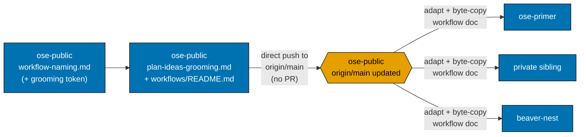
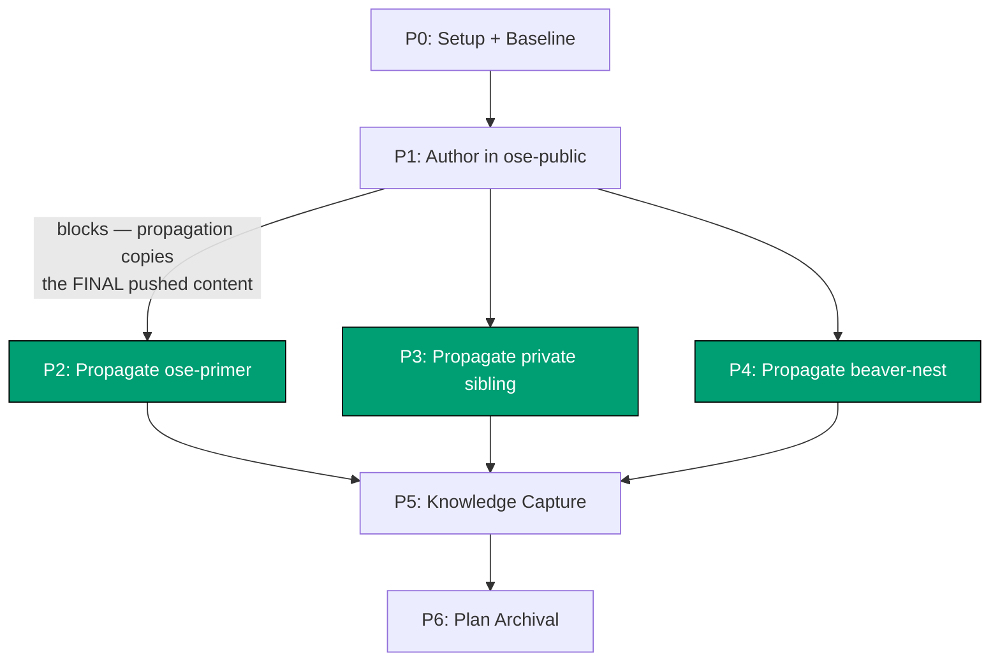
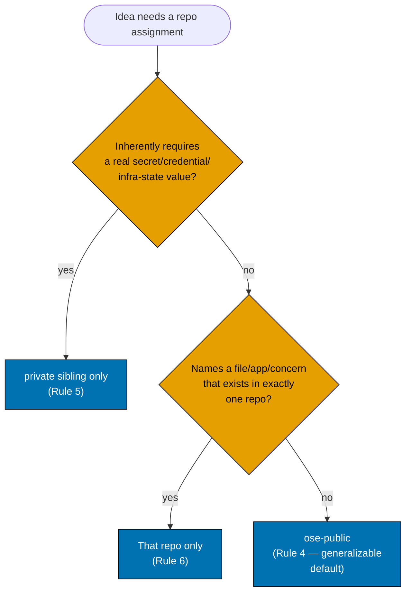
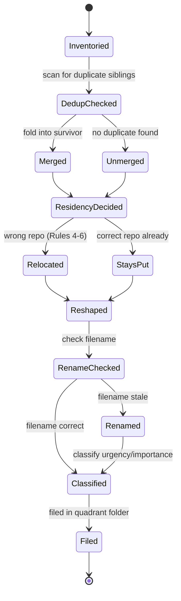

# Technical Documentation: `plan-ideas-grooming` Workflow

## Architecture Overview

This plan produces two artifact classes, each with a different propagation shape:

1. **A convention amendment** (`workflow-naming.md`) — propagated as an **adapted edit** to four
   already-divergent files (confirmed via `diff`: 12–68 lines of pre-existing difference between
   `ose-public` and each sibling).
2. **A new workflow document** (`plan-ideas-grooming.md`) — propagated as a **byte-identical
   copy** to three repos that do not yet have it, since there is no pre-existing content to
   reconcile.

Both propagation shapes reuse the existing "content-copy propagation pattern" already established
in this codebase (the same category of operation as `.claude/` → `.opencode/` sync, or a
`repo-rules-maker` governance sweep across repos) — **not** the novel cross-repo relocation
mechanic. The relocation mechanic (create-in-destination-first, verify, delete-from-source) is
something this plan _specifies inside the new workflow document_, for that workflow's own future
use when it moves individual idea files between repos. This plan itself never relocates a file
between repos — it only copies/adapts governance documents, which is a fundamentally simpler,
already-precedented operation.

**Repo topology re-verified 2026-08-05** `[Repo-grounded]`: `git rev-parse --is-bare-repository`
against all four repos returns `false` for each — every repo currently has a normal (non-bare)
working tree checked out at its own root. This is what makes `main-to-origin-main` (direct edits
on each repo's already-checked-out `main`, no worktree provisioning) mechanically viable for this
plan's own delivery; topology is re-checked at delivery time in Phase 0 rather than assumed from
this authoring-time snapshot, since it is documented to change over time.

### Diagram 1 — Component Interactions (this plan's own delivery)



### Diagram 2 — Dependency Position (why propagation waits on `ose-public`)



Phases 2, 3, and 4 are mutually independent (no shared files, no repo touches another repo's
tree) and are the plan's N=3 parallel fan-out; they share only their common dependency on Phase 1's
changes landing on `origin/main` (a direct push, not a PR merge — see DD-5).

### Diagram 3 — Decision Branches: Cross-Repo Residency Rubric (as specified for the future workflow)



### Diagram 4 — State Transitions: an Idea's Lifecycle Through the Future Workflow



This state diagram documents the **future** workflow's behavior, as specified by this plan's
delivery — it does not describe anything this plan itself executes. The `RenameChecked`/`Renamed`
states reflect the seventh capability (DD-7) added mid-grilling; `Renamed`'s outbound link-rewrite
uses the identical mechanism `Relocated` already uses, per DD-7.

## Design Decisions

**DD-1 — New `grooming` type token, not a reuse of an existing one.** `execution` implies
running a defined procedure to a single completion, not a recurring sweep; `planning` implies a
new plan as terminal deliverable, which this workflow never produces; `quality-gate` implies
iterating a maker→checker→fixer loop to zero findings, which doesn't fit "classify and relocate
existing docs"; `setup` implies one-time provisioning. None fit. Resolved by explicit user
instruction (Q1 of grilling) to add a fifth token rather than force-fit an existing one. The token
itself is named `grooming` (not the earlier "maintenance" working name) after Scrum's "backlog
grooming" — periodically refining, reorganizing, splitting, merging, and pruning backlog items —
which is a closer semantic match to this workflow's actual behavior.

**DD-2 — Adapt, never blind-copy, the two files with pre-existing drift.** `workflow-naming.md`
and `workflows/README.md` are confirmed non-identical across the four repos (`diff` line counts:
12–68 for the naming convention, 67–292 for the workflows README). A blind copy-overwrite would
destroy each repo's own legitimate local content. `delivery.md`'s propagation phases therefore
read each target repo's existing file first, then apply the same _conceptual_ amendment (add the
`grooming` row; add the catalog entry) rather than copying `ose-public`'s file over it.

**DD-3 — Propagate the new workflow file as a true byte-identical copy.** Unlike the two amended
files, `plan-ideas-grooming.md` has no pre-existing sibling-repo content to reconcile — it is
new everywhere. A byte-identical copy is therefore both correct and simpler than an adapted edit,
**provided** the file's own content is machine-path-agnostic (see DD-4).

**DD-4 — The workflow document must not hardcode any absolute local filesystem path.** This
session's own grilling research used paths like `~/ose-projects/<repo>/` to do its
cross-repo comparisons, but those are specific to one contributor's machine layout. Per
[Governance Vendor-Independence](../../../repo-governance/conventions/structure/governance-vendor-independence.md)-style
neutrality (harness-neutral, and by extension contributor-machine-neutral, governance content),
the workflow document's `repos` input parameter is the **only** place a concrete repo list or path
set may be supplied, and it is supplied **at invocation time**, never hardcoded into the document
body. This is also what makes a byte-identical copy correct across all four repos (DD-3): the file
itself names no repo-specific path.

**DD-5 — `main-to-origin-main` is the Delivery Mode for both this authoring plan and the future
workflow's own runs, each independently justified.** Two distinct claims, not one:

- **This plan's own delivery** (touching `repo-governance/`, not `plans/ideas/`) uses
  `main-to-origin-main` by **explicit user override** of the repo-wide `worktree-to-pr` default —
  work happens directly on each repo's already-checked-out local `main` (no worktree; see the
  Architecture Overview's repo-topology note), and each repo's changes commit and push straight to
  that repo's `origin/main`, with no PR and no PR-Review Maker→Fixer Cycle. This is a deliberate,
  informed instruction from the user for this specific plan, not a reinterpretation of the
  plan-docs-only carve-out (this plan's changes are not `plans/**`-scoped, so that carve-out does
  not independently apply here) — see `delivery.md`'s `## Delivery Mode: main-to-origin-main`
  section for the full mechanics.
- **The future `plan-ideas-grooming` workflow's own runs** (independently) specify
  `main-to-origin-main` as their **documented default** execution mode: `plans/ideas/**` is
  entirely under `plans/**`, and per the
  [plan-docs-only carve-out](../../../repo-governance/workflows/plan/plan-planning.md#the-plan-docs-only-carve-out-superseded--retired-in-three-of-four-repos),
  a change touching only `plans/**` may push direct to `main` — no PR review cycle is warranted for
  idea-brief reshaping, since idea docs are already framed as low-stakes backlog documentation (see
  [Ideas Folder convention](../../../repo-governance/conventions/structure/plans/ideas-folder-overview-rationale-and-file-layout.md#ideas-folder-two-pagers)).
  This is consistent with the low-stakes framing behind Q10's autonomous-with-ledger resolution.
  The workflow's frontmatter (see "Detailed Design" below) exposes this as a **`delivery-mode`
  input parameter**, defaulting to `main-to-origin-main`, so a future caller may explicitly
  override it to `worktree-to-pr` for a specific invocation (e.g., if a future maintainer wants a
  reviewed PR for a particularly large grooming run) without changing the workflow document itself.

**DD-6 — Per-repo grooming log, not a single cross-repo ledger.** A relocation ledger that
lives in only one repo would be unreachable from the others once the workflow is invoked from a
different repo (the whole point of propagating the file at all). The workflow document therefore
specifies that every repo it touches — whether as a relocation source or destination — gets its
own append-only log entry in that repo's own tree (a `## Grooming Log` section in
`plans/ideas/README.md`, or a sibling `.grooming-log.md`, decided at authoring time in Phase 1),
so the audit trail travels with the repo, not with a single external file.

**DD-7 — Renames are folded into the existing link-rewrite step, never a separate mechanism.**
The rename capability (added mid-grilling as the seventh capability, alongside the original six)
applies in three cases: (a) a merge or split leaves the wrong survivor name (or no name that
matches the merged/split content); (b) a filename does not follow kebab-case
(`[a-z0-9-]+\.md`, per [File Naming](../../../repo-governance/conventions/structure/file-naming.md));
(c) a relocation reveals the name was scoped to the wrong context (e.g., a name specific to one
repo's concern that turns out to be cross-repo generalizable, or vice versa). In every case, a
rename produces exactly the same link-integrity obligation a relocation already produces — every
inbound relative link to the old filename must be rewritten — so Step 9 ("Link rewrite") in the
Detailed Design below is written to cover move, rename, and move-plus-rename as one mechanism, not
three. The one rename-specific edge case Step 9 must also handle: a **collision**, where the
computed new filename already exists in the destination directory — in that case the rename is
deferred and logged as an unresolved follow-up (mirroring the interrupted-relocation fail-safe
behavior in Step 5/DD from US-4), never silently overwriting the existing file.

## File-Impact Analysis

This is a **multi-repo plan**: the tree below is rooted per-repo rather than at a single `.`, since
the four target repos are independent git checkouts on disk, not subdirectories of one tree. Each
top-level entry names the repo, then a root-relative path within it.

```text
ose-public/ (source of truth — authored first)
├── repo-governance/conventions/structure/workflow-naming.md [E] — add `grooming` type token,
│   update enforcement regex, update Examples section
├── repo-governance/workflows/plan/plan-ideas-grooming.md [N] — new workflow document
└── repo-governance/workflows/README.md [E] — add Available Workflows row, Type Vocabulary row,
    Plan family bullet

ose-primer/ (propagation target — adapted amendment + byte-copy)
├── repo-governance/conventions/structure/workflow-naming.md [E] — same conceptual amendment,
│   applied to this repo's own already-divergent copy
├── repo-governance/workflows/plan/plan-ideas-grooming.md [N] — byte-identical copy of
│   ose-public's pushed file
└── repo-governance/workflows/README.md [E] — same conceptual catalog additions

<private-sibling>/ (propagation target — adapted amendment + byte-copy)
├── repo-governance/conventions/structure/workflow-naming.md [E]
├── repo-governance/workflows/plan/plan-ideas-grooming.md [N]
└── repo-governance/workflows/README.md [E]

beaver-nest/ (propagation target — adapted amendment + byte-copy)
├── repo-governance/conventions/structure/workflow-naming.md [E]
├── repo-governance/workflows/plan/plan-ideas-grooming.md [N]
└── repo-governance/workflows/README.md [E]
```

### More Detail

**Discovery criterion for "adapted, not blind-copied"**: before editing each sibling repo's
`workflow-naming.md` / `workflows/README.md`, the executor MUST `Read` that repo's current file in
full and locate the exact insertion points (the Type Vocabulary table's last row; the Available
Workflows table's last row; the Plan family bullet list) rather than assuming they sit at the same
line numbers as `ose-public`'s copy — the confirmed pre-existing drift means they do not.

**No `plans/ideas/**`path appears in this tree anywhere, in any repo** — this is the scope
boundary this plan's delivery checklist and its Phase gates verify mechanically (see`prd.md`'s
final Gherkin scenario).

## Dependencies

- **`rhino-cli repo-governance workflows naming validate`** `[Repo-grounded]` — the existing
  mechanical audit this plan's Phase 1 gate relies on to confirm the new filename is compliant.
  Referenced in `workflow-naming.md` itself as "wired into Husky pre-push and the CI quality gate."
- **`npm run lint:md:fix`** and the markdown link/heading validators `[Repo-grounded]` — per
  `AGENTS.md` §Markdown Quality, already wired into pre-commit/pre-push; this plan's new and edited
  markdown files must pass them in every repo.
- **No new external library, package, or third-party service dependency.** This plan is pure
  governance-documentation content.

## Testing / Verification Strategy

**Surface-Conditional Tester Gates**: this plan ships no UI and no API. Per
[plan-planning §Surface-Conditional Tester Gates](../../../repo-governance/workflows/plan/plan-planning.md#surface-conditional-tester-gates),
a workflow document is "a reachable surface with no gate listed" in the UI/API routing table, and
is therefore **not exempt by omission** — its changed behavior must be exercised through its own
interface. Concretely, for **this plan** (which authors but does not run the workflow), that
interface-level exercise is: (a) the mechanical `rhino-cli repo-governance workflows naming
validate` pass/fail check, (b) a structural read-through confirming the new document follows the
established frontmatter + Purpose/When-to-use/Execution-Mode/Steps shape used by
`plan-execution.md` and `plan-planning.md`, and (c) the Gherkin scenarios in `prd.md`, each backed
by a concrete grep/diff/CLI check. Actually _running_ `plan-ideas-grooming`'s reorganization
logic against live data is explicitly out of this plan's scope (see `prd.md` Product Scope) and is
therefore not part of this plan's verification — it is future work.

**Specs & Gherkin Completeness (Both Paths) — exemption**: this plan touches only
`repo-governance/` and (transiently, only inside `plans/in-progress/`) its own plan documents — no
`apps/`, `libs/`, or `specs/` path is created, modified, or deleted. Per
[Feature Change Completeness §Two Paths](../../../repo-governance/development/quality/feature-change-completeness.md),
this plan is exempt from the `specs:coverage` companion-Gherkin requirement. (The Gherkin scenarios
in `prd.md` are the plan's own acceptance criteria, not `specs/` feature files — no `specs:coverage`
target is affected.)

**Vercel MCP Availability — not applicable**: this plan touches no `vercel.json`-covered path, no
`prod-*`/`stag-*` deploy branch, and no deployment agent. Per the mechanical trigger check
(`git ls-files | grep 'vercel\.json$'` against the paths this plan touches — empty), this plan is
out of scope for the Vercel MCP probe entirely.

**UI-bearing / Learning-bearing — not applicable**: this plan adds no user-facing screen or
component under `apps/`/`libs/`, and authors no course/tutorial/curriculum content. Both the
UI-design-funnel and syllabus-record requirements are exempt.

**Rule-15 / Rule-16 retests — not applicable**: no web UI, no REST/GraphQL API surface is touched.

## Detailed Design of `plan-ideas-grooming.md` (Authored in Phase 1)

This section specifies the content Phase 1 of `delivery.md` must produce — the level of detail is
intentionally execution-grade so Phase 1's steps are unambiguous.

### Frontmatter (draft, finalized during Phase 1 authoring)

```yaml
---
name: plan-ideas-grooming
title: "plan-ideas-grooming"
goal: >
  Sweep one or more OSE repos' plans/ideas/ folders and converge each into a deduplicated,
  Eisenhower-quadrant-organized, strictly-formatted set of two-pagers with truthful filenames, with
  cross-repo residency corrected per the generalizable / secrets-bearing / single-repo-only
  placement rules
termination: >
  Every processed repo's plans/ideas/ contains no unresolved duplicate, every remaining idea sits
  in its correct q1-q4 quadrant folder in its correct repo with a filename matching its content,
  every relocated/renamed idea's provenance and inbound/outbound links are intact, and the run is
  recorded in every touched repo's grooming log
inputs:
  - name: repos
    type: string
    description: >
      Comma-separated absolute paths to the target repos to sweep in this run. No default —
      supplied explicitly at invocation, since the document itself must name no repo-specific path
      (see tech-docs.md DD-4 of the authoring plan).
    required: true
  - name: dry-run
    type: boolean
    description: >
      When true, compute and log every classification / merge / rename / relocation decision
      without writing, moving, renaming, or deleting any file
    required: false
    default: false
  - name: delivery-mode
    type: enum
    values: [main-to-origin-main, worktree-to-pr]
    description: >
      This workflow's own git delivery behavior for the changes it makes to plans/ideas/**. Default
      main-to-origin-main (direct commit + push to each processed repo's own main, per the
      plan-docs-only carve-out — see tech-docs.md DD-5 of the authoring plan). A caller may
      override to worktree-to-pr for a specific invocation (e.g., a particularly large sweep the
      maintainer wants reviewed before it lands).
    required: false
    default: main-to-origin-main
outputs:
  - name: grooming-log-entries
    type: file-list
    description: >
      Per-repo grooming log entries (in that repo's own tree) recording every merge, split,
      rename, quadrant reclassification, and cross-repo relocation performed this run
  - name: final-status
    type: enum
    values: [pass, partial, fail]
---
```

### Steps (specified for Phase 1 to author in full prose)

1. **Inventory** — for each repo in `repos`, list every `plans/ideas/*.md` file (excluding
   `README.md`), reading its title, one-line summary, provenance blockquote, and all 7 body
   sections.
2. **Dedup pass (merge/split, Rule 1)** — within-repo first: flag pairs whose one-line summaries
   share ≥3 significant terms, or whose filenames share a common stem, as merge candidates; log
   each candidate + rationale to that repo's grooming log, then merge autonomously (fold the
   less-complete file's unique content into the more-complete one, delete the redundant file).
   Flag any idea whose Problem/context section names ≥2 unrelated concerns as a split candidate;
   split into two files, each retaining shared prior-art links.
3. **Cross-repo dedup** — for ideas whose title/content matches an idea in another target repo
   (the `rhino-cli-env-backup-scripts.md` case), resolve residency (Step 4) for the pair **before**
   merging, so the merge lands in the correct destination repo, not wherever the pair happened to
   be compared first.
4. **Residency decision (Rules 4-6)** — apply, in fixed order, first match wins: (a) secrets check
   → the private sibling only; (b) single-repo-only check (file/app/concern provably exists in exactly
   one repo, verified via `Glob`/`Bash test -f` against that repo's tree) → that repo only; (c)
   default → `ose-public` (generalizable). Log the matched rule for every decision.
5. **Relocation (when Step 4's target differs from the idea's current repo)** — create the file at
   the destination repo's quadrant folder (with the Step 6 reshaping, any Step 9 rename, and the
   provenance line from Step 7 already applied), commit + push direct to that repo's `main` (the
   workflow's own default `main-to-origin-main` delivery mode — see DD-5; the `delivery-mode` input
   overrides this per invocation), verify the commit landed on `origin/main`, **then** delete the
   original file from the source repo as a separate commit + push. A verification failure after the
   create step halts the delete step — the idea stays duplicated, logged as an unresolved
   follow-up, never silently dropped.
6. **Two-pager reshape** — ensure every surviving/merged/relocated file conforms to the exact
   8-section template in `plans/ideas/README.md` (title + one-line summary, Problem/context, Why
   now, Prior art, Proposed direction, Rough scope & non-goals, Risks & open questions, What
   success looks like).
7. **Provenance** — append `> Relocated from <repo>/plans/ideas/<file> on YYYY-MM-DD by
plan-ideas-grooming.` to the moved file's existing provenance blockquote, preserving the
   original content above it. When a file is renamed without relocation (Step 9's rename case),
   append the analogous `> Renamed from <old-file> on YYYY-MM-DD by plan-ideas-grooming.` line
   instead.
8. **Classification** — apply the urgency rubric and the importance rubric (both stated verbatim
   from `prd.md`'s Gherkin scenarios) to every surviving idea, and file it into
   `plans/ideas/q1-urgent-important/`, `q2-not-urgent-important/`, `q3-urgent-not-important/`, or
   `q4-not-urgent-not-important/` within its resolved-residency repo.
9. **Link rewrite (covers move, rename, and move-plus-rename — DD-7)** — for intra-repo moves
   and/or renames (a file moving into a quadrant folder and/or being renamed within the same repo),
   rewrite that file's own relative links and grep the repo for any inbound relative link pointing
   at the file's old path/name, updating each to the new path/name. For cross-repo moves, convert
   every `./`-relative link inside the moved file to an absolute
   `https://github.com/<org>/<repo>/blob/main/...` URL (matching the pattern already used in
   `deploy-targets-registry.md`), and check for (but do not expect to find) any inbound link from
   the source repo into the relocated file. **Rename criteria** (applied whenever Step 2, 4, or 6
   leaves a filename that no longer matches its content, or the filename never followed kebab-case
   `[a-z0-9-]+\.md`): compute the new filename from the file's current title; if the computed name
   already exists in the destination directory (a **collision**), defer the rename and log it as an
   unresolved follow-up rather than overwriting the existing file — the file keeps its current name
   until the collision is resolved in a future run.
10. **Recurrence trigger** (stated in the document's own "When to Use" section, not merely in this
    plan's design docs) — run this workflow for a given repo when EITHER that repo's flat
    `plans/ideas/` file count (summed across quadrant folders, excluding `README.md`) exceeds 60,
    OR 90 days have elapsed since the workflow's last recorded run for that repo (tracked via a
    `> Last groomed: YYYY-MM-DD` line the workflow appends to that repo's `plans/ideas/README.md`
    when it runs) — whichever occurs first.

## Rollback

Every artifact this plan produces is a markdown file under `repo-governance/`, committed via
ordinary direct-push commits to each repo's own `main` (no PR review — this plan's own
`main-to-origin-main` Delivery Mode, see DD-5). Rollback for any single repo is `git revert` of
that repo's commit(s) landed by this plan's delivery — no data migration, no schema change, no
external service state to unwind. Because Phases 2-4 (the three sibling propagations) are
mutually independent (Diagram 2), a rollback in one repo has no effect on the other two.
