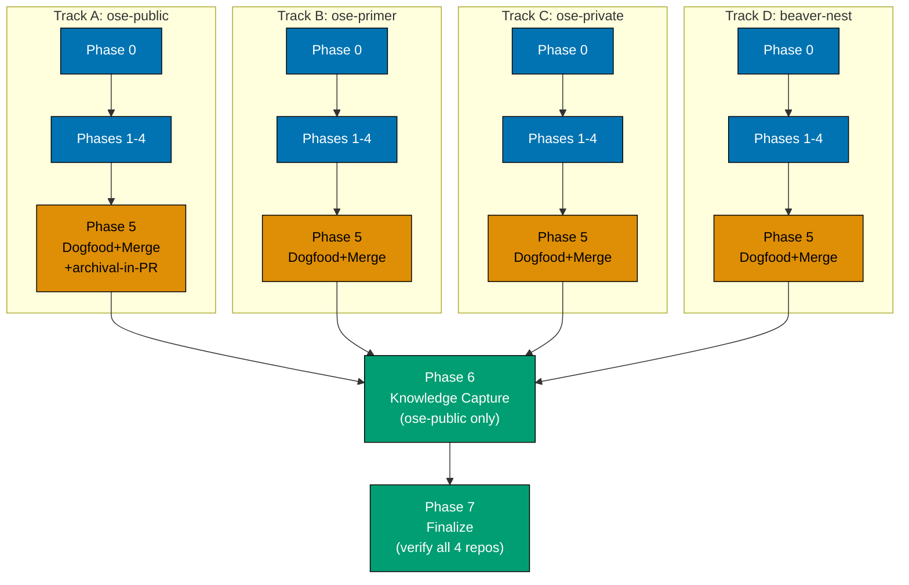

# Delivery Checklist: PR Review Cycle Scout + Cycle-Number + Type-Soundness

This plan delivers the same three enhancements **independently in all four OSE repos**. The
checklist below is a **template applied once per repo** (Phases 0-5), not four fully duplicated
phase-sets — each of the four repos substitutes its own row from the
[Per-Repo Parameters](#per-repo-parameters) table wherever the template says `{REPO}` or points at a
parameter. Phases 6-7 are shared, terminal, single-run steps that happen once, in `ose-public`, after
all four repo tracks finish (the plan folder itself lives only in `ose-public`).

## Worktree

One worktree per repo, at the same relative path inside each repo's own working tree:

| Repo          | Worktree path (absolute)                                                     |
| ------------- | ---------------------------------------------------------------------------- |
| `ose-public`  | `~/ose-projects/ose-public/worktrees/pr-review-cycle-scout-and-typesafety/`  |
| `ose-primer`  | `~/ose-projects/ose-primer/worktrees/pr-review-cycle-scout-and-typesafety/`  |
| `<sibling>`   | `~/ose-projects/<sibling>/worktrees/pr-review-cycle-scout-and-typesafety/`   |
| `beaver-nest` | `~/ose-projects/beaver-nest/worktrees/pr-review-cycle-scout-and-typesafety/` |

Optional manual pre-provisioning (run from each repo's own root):

```bash
claude --worktree pr-review-cycle-scout-and-typesafety
```

**Cross-repo execution note**: `plan-execution.md`'s Step 0 worktree gate auto-provisions and enters
a worktree in the _current_ repo by default. Since three of the four tracks below execute in a
different repo than where this plan folder lives (`ose-public`), those three tracks require the
executing agent/session to first change into that repo's own root (`cd
~/ose-projects/<repo>`) before the worktree-provisioning step applies there — the automatic
single-repo gate does not itself jump repos. Each track's own Phase 0 states this explicitly.

See [Worktree Path Convention](../../../repo-governance/conventions/structure/worktree-path.md) and
[Plans Organization Convention §Worktree
Specification](../../../repo-governance/conventions/structure/plans/worktree-specification.md#worktree-specification).

## Delivery Mode: worktree-to-pr

Four independent tracks, one per repo. Each repo runs its own `worktree-to-pr` delivery in full: Phase 0 opens no PR per the hard rule;
Phases 1-4 are one contiguous delivery unit that is not yet independently shippable until that
repo's own mirrors validate; that repo's PR opens at the delivery boundary, at the **end of Phase
4**. Phase 5 continues that same delivery unit's integration work against the PR Phase 4 already
opened — running that repo's PR-Review Maker→Fixer Cycle and performing the `[AI]` merge — and does
not open a second PR.

**Archival-in-PR applies to `ose-public`'s track only.** This plan's folder lives exclusively in
`ose-public`'s `plans/` — `ose-primer`, `ose-private`, and `beaver-nest` have no `plans/` entry for
this work, so their PRs carry no plan-folder content and have no archival step at all. This is the
ordinary cross-repo carve-out from the
[Archival-in-PR HARD RULE](../../../repo-governance/conventions/structure/plans/delivery-mode-the-four-modes.md#delivery-mode),
not a special case invented for this plan — `ose-public`'s own Phase 5 (Track A) is the only one that
performs the `git mv` into `plans/done/`.

Phases 6-7 run once, after all four tracks' Phase 5 gates pass, pushing `learnings.md` directly to
`ose-public`'s `origin/main` from the local checkout (no worktree, no PR).

## Parallelization Model

**DAG**: four fully independent chains (one per repo), each internally serial
(Phase 0 → 1 → 2 → 3 → 4 → 5, artifacts feeding the next phase within that repo), converging on a
single shared terminal chain (Phase 6 → 7) that depends on **all four** chains' Phase 5 completing.
No repo's track depends on any other repo's track — a stalled `ose-primer` track does not block
`ose-private` from proceeding, and none of the four blocks Phase 0 baseline work in another.

**Not a byte-identity-boundary sibling-PR scenario**: unlike the byte-identity-boundary sibling-PR
scenario [`pr-review-quality-gate.md`'s own Notes section](../../../repo-governance/workflows/pr/pr-review-quality-gate.md#notes)
already warns about (where one repo's fixer commits make a concurrently-running sibling PR stale),
these four tracks' diffs are independently scoped and never required to converge to byte-identical
content, so no track's fixer commits can make another track's PR stale — concurrent execution here
does not recreate that wasteful pattern.

**Chosen N = 4** (one background agent/session per repo track), raised above the
[Agent Workflow Orchestration Convention](../../../repo-governance/development/agents/agent-workflow-orchestration.md)'s
default N=3 — justified per-plan by capacity: all four tracks are docs-only edits (no
`apps/`/`libs/` source), low blast radius, and the fan-out width is capped naturally by the repo
count itself (4), not chosen arbitrarily above it. If executing with fewer available agents, run the
four tracks sequentially instead — no track depends on another, so order among them does not matter.

**Cleanup as the terminal node**: Phase 7 (Finalize) is the terminal node, depending on every one of
the four tracks' own Phase 5 — it pushes the `learnings.md` triage created in Phase 6 and verifies
all four repos actually completed (no silent partial rollout, per
[prd.md's Product-Level Risks](./prd.md#product-level-risks)); it never runs while any track's Phase
5 merge is still in flight.

### Delivery Boundaries

| Phase(s) | Delivery unit                                                                     | Worktree / branch (per repo)                            | PR opens                                                                |
| -------- | --------------------------------------------------------------------------------- | ------------------------------------------------------- | ----------------------------------------------------------------------- |
| 0 (×4)   | — (setup and baseline, per repo)                                                  | —                                                       | no                                                                      |
| 1-4 (×4) | Scout + Cycle-Number + Type-Soundness, in that repo (sole delivery unit per repo) | `<repo>/worktrees/pr-review-cycle-scout-and-typesafety` | yes — at Phase 4, once per repo (4 PRs total, independent)              |
| 5 (×4)   | Same delivery unit (review-cycle + merge continuation), per repo                  | `<repo>/worktrees/pr-review-cycle-scout-and-typesafety` | yes — at Phase 5, continues that repo's own Phase 4 PR; not a second PR |
| 6-7 (×1) | Knowledge Capture + Finalize (post-merge, direct push, `ose-public` only)         | — (local `ose-public` `main` checkout, no worktree)     | no                                                                      |

Every change-producing phase appears in exactly one row above, executed once per repo for rows 0/1-4/5,
and exactly once total (in `ose-public` only) for rows 6-7.

### Delivery Flow



> **Legend** — `[AI]`: an agent performs the step (the default; unmarked steps are `[AI]`).
> `[HUMAN]`: only a human can do it (physical action, out-of-band approval, real-secret or
> privileged-credential handling). `[AI+HUMAN]`: agent prepares, human approves or finishes.

## Per-Repo Parameters

Every value below is mechanically re-verified live at that repo's own Phase 0 — this table is a
2026-08-05 snapshot, not a substitute for the live check. Source: brd.md's
[Current-State Baseline](./brd.md#current-state-baseline-mechanically-verified-2026-08-05).

| Parameter                                               | `ose-public`                | `ose-primer`                | `ose-private`                                                                    | `beaver-nest`               |
| ------------------------------------------------------- | --------------------------- | --------------------------- | -------------------------------------------------------------------------------- | --------------------------- |
| `eight` count in `pr-review-disciplines.md`             | 26                          | 26                          | 26                                                                               | 26                          |
| `eight` count in `pr-review-quality-gate.md`            | 6                           | 6                           | **5**                                                                            | 6                           |
| `pr-review-*` agent files under `.claude/agents/`       | 10                          | 10                          | 10                                                                               | 10                          |
| `AGENTS.md` bytes (baseline)                            | 28,944                      | **29,852**                  | 26,754                                                                           | 29,547                      |
| `AGENTS.md` PR Review Cycle bullet edit shape           | word swap: `eight` → `nine` | word swap: `eight` → `nine` | list insertion: add `pr-review-types-maker` + a scout clause (net byte-positive) | word swap: `eight` → `nine` |
| Archival-in-PR applies (plan folder lives in this repo) | **yes** (Track A only)      | no                          | no                                                                               | no                          |

## Repo Track Template (Phases 0-5, executed once per repo)

> Substitute `{REPO}` with the repo name and `{REPO_ROOT}` with
> `~/ose-projects/{REPO}` when executing this template for a given track. Substitute every
> baseline count and the `AGENTS.md` edit-shape instruction from the
> [Per-Repo Parameters](#per-repo-parameters) row for that repo — do not carry over another repo's
> numbers or edit shape.
>
> _Suggested fan-out_: one agent per track, up to the chosen N=4, each working entirely inside its
> own `{REPO_ROOT}` — no track's agent reads or writes inside another repo's directory.

### Phase 0 ({REPO}): Baseline and Worktree Setup

- [ ] [AI] Change into `{REPO_ROOT}`. Confirm `{REPO}`'s local `main` is clean and up to date:
      `git status --porcelain` returns empty AND `git rev-parse HEAD` equals
      `git rev-parse origin/main` — acceptance: both hold
- [ ] [AI] Create the worktree: `git worktree add worktrees/pr-review-cycle-scout-and-typesafety -b
pr-review-cycle-scout-and-typesafety` — acceptance: `git worktree list` shows the new worktree
- [ ] [AI] In the worktree: `npm install && npm run doctor -- --fix` — acceptance: both exit 0
- [ ] [AI] Re-verify {REPO}'s own mechanically-measured baseline from the
      [Per-Repo Parameters table](#per-repo-parameters) still holds in the worktree (nothing changed
      between plan-authoring and execution start): `grep -c eight
repo-governance/development/quality/pr-review-disciplines.md` matches that repo's own row;
      `grep -c eight repo-governance/workflows/pr/pr-review-quality-gate.md` matches that repo's own
      row (5 for `ose-private`, 6 for the other three); `wc -c AGENTS.md` is within a small margin of
      that repo's own baseline byte count; `ls .claude/agents/ | grep -c pr-review` returns `10` —
      acceptance: all four match; if any differs materially, STOP and re-baseline `brd.md`'s row for
      this repo before proceeding (another actor may have touched this surface since plan authoring)
- [ ] [AI] Run baseline quality gates in the worktree to confirm a known-good starting point:
      `npx nx run rhino-cli:test:quick` (adapt the project name if this repo's own Rust
      markdown-validation project is named differently — verify via `nx show projects` rather than
      assuming `ose-public`'s naming) — acceptance: exits 0 with zero preexisting failures (if any
      preexisting failure is found, fix it per Root Cause Orientation before Phase 1 begins)

#### Phase 0 ({REPO}) Gate

- [ ] [AI] Worktree exists, toolchain converged, baseline counts confirmed identical to this repo's
      own Per-Repo Parameters row, zero preexisting quality-gate failures — safe to begin Phase 1
  - **Pause Safety**: no plan content edited yet; safe to stop indefinitely; resume by re-running the
    baseline commands above

### Phase 1 ({REPO}): `pr-review-disciplines.md` Convention Edits

- [ ] [AI] Add a ninth row to the **Eight[→Nine] Reviewer Disciplines** table (rename the section
      heading `## The Eight Reviewer Disciplines` → `## The Nine Reviewer Disciplines`): Discipline
      `Type-soundness`, Specialist agent `pr-review-types-maker`, Owns (per
      [tech-docs.md's Detailed Design](./tech-docs.md#detailed-design-of-pr-review-types-makermd)),
      NOT its job → routes to (per [DD-2](./tech-docs.md#design-decisions)) — acceptance:
      `grep -ci "type-soundness" repo-governance/development/quality/pr-review-disciplines.md`
      returns `>= 1` in the table itself (was `0` per this repo's baseline)
  - _Suggested executor: `repo-rules-maker`_
- [ ] [AI] Add grey-zone ruling **(g) Compiles vs. is sound** to the **Six[→Seven] Grey-Zone
      Rulings** section (rename heading accordingly), verbatim per
      [DD-2](./tech-docs.md#design-decisions) — acceptance:
      `grep -c "Compiles vs\." repo-governance/development/quality/pr-review-disciplines.md` returns
      `>= 1`
- [ ] [AI] Update the `## The Boundary Tie-Breaker Rule` section's opening sentence ("A ninth role,
      `pr-review-synthesis-maker` (the coordinator), does not discover findings...") to name BOTH
      non-discovery roles: scout (classification/context, does not discover findings either) and
      synthesis-maker (consolidation) — acceptance: the sentence names `pr-review-scout-maker`
      explicitly alongside `pr-review-synthesis-maker`
- [ ] [AI] In `### Risk-tier fan-out (D12)`: replace "all eight specialists plus the coordinator" with
      "all nine specialists plus the coordinator", and add one sentence noting classification is now
      performed by `pr-review-scout-maker`, not `pr-review-synthesis-maker` directly (cross-link to
      `pr-review-scout-maker.md`) — acceptance: `grep -c "pr-review-scout-maker"
repo-governance/development/quality/pr-review-disciplines.md` returns `>= 1`
- [ ] [AI] In `### Shared-context extract-once + large-diff handling (D13)`: same re-attribution to
      scout as the item above
- [ ] [AI] In `### Post-Cutover Monitoring Plan`'s **Per-discipline acceptance rate** bullet: note
      that `type-soundness` joins `performance` and `docs` as a newly-added discipline to watch for
      whether it "earns its fan-out cost" — acceptance: `grep -ci "type-soundness"
repo-governance/development/quality/pr-review-disciplines.md` returns `>= 2` (table + this
      mention)
- [ ] [AI] Sweep every remaining literal `eight` occurrence in the file (26 total per this repo's own
      baseline, minus the ones already touched above): for each, read the surrounding sentence and
      decide — becomes `nine` (current-count statements) or stays as historical narration (e.g.
      "retired the single `pr-review-maker` monolith... into eight discipline-scoped specialists"
      describing what happened at the ORIGINAL cutover stays historically accurate and is NOT
      changed) — acceptance: `grep -n eight
repo-governance/development/quality/pr-review-disciplines.md` — manually confirm every remaining
      line is a deliberate historical-narration exception, not a missed current-count statement
- [ ] [AI] Add `Type-soundness` to the frontmatter `description` field's brief mention of the
      discipline count where it names the boundary/rulings it defines — acceptance: frontmatter
      `description` still accurately describes the file's content post-edit (manual read-check)

#### Phase 1 ({REPO}) Gate

- [ ] [AI] `grep -ci "type-soundness" repo-governance/development/quality/pr-review-disciplines.md`
      returns `>= 2`; `grep -c "Compiles vs\."` returns `>= 1`; `grep -n eight` shows only deliberate
      historical-narration lines remaining — acceptance: all three hold
  - **Pause Safety**: only the convention doc is edited; the agent files it describes do not exist
    yet, so nothing is inconsistent if paused here; resume by continuing to Phase 2

### Phase 2 ({REPO}): `pr-review-quality-gate.md` Workflow Edits

- [ ] [AI] Update `## Participants`: add a new bullet for `pr-review-scout-maker` (pipeline stage 0,
      owns D12/D13/dismissal-read, defined at `.claude/agents/pr-review-scout-maker.md`) BEFORE the
      "Eight discipline specialists" bullet; rename that bullet's own heading text "Eight discipline
      specialists" → "Nine discipline specialists" and add `pr-review-types-maker` to its bulleted
      list; trim the `pr-review-synthesis-maker` bullet's description to remove the
      classify/assemble/dismissal-read clauses (moved to scout's new bullet) — acceptance:
      `grep -c "pr-review-scout-maker" repo-governance/workflows/pr/pr-review-quality-gate.md`
      returns `>= 1` in this section
- [ ] [AI] Update the top-level `flowchart LR` diagram: add a `SC["pr-review-scout-maker"]` node
      (new color class, e.g. `gold`) before the `FANOUT` subgraph, with an arrow `SC --> FANOUT`;
      add `N["pr-review-types-maker"]` inside the `FANOUT` subgraph; update the subgraph label from
      "8 concurrent specialists" to "9 concurrent specialists" — acceptance: rendered diagram (or its
      source) shows 10 boxes inside/around FANOUT+SC combined (9 specialists + scout), matching
      [tech-docs.md Diagram 1](./tech-docs.md#diagram-1--component-interactions-before--after)
- [ ] [AI] Update the `## Loop Algorithm` pseudocode block to match
      [tech-docs.md's updated algorithm](./tech-docs.md#architecture-overview) — insert the
      `scout = fresh pr-review-scout-maker(...)` call and its output (`tier`, `specialists`,
      `context_brief`, `dismissals`) before the `fan_out(...)` call; remove the
      `tier = synthesis_maker.classify_risk_tier(...)` line; keep `synthesis_maker.synthesize(...)`
      unchanged in shape — acceptance: `grep -c "pr-review-scout-maker\|scout ="
repo-governance/workflows/pr/pr-review-quality-gate.md` returns `>= 1` inside the code block
- [ ] [AI] Update the second `sequenceDiagram` (below the Loop Algorithm) to add participant `SC as
pr-review-scout-maker`, with `O->>SC` as the first interaction and `SC->>SP` replacing
      `SY->>SP` for the fan-out — per
      [tech-docs.md Diagram 2](./tech-docs.md#diagram-2--updated-per-cycle-sequence)
- [ ] [AI] Add a new numbered step to `## Steps`: **"1. Per-Cycle Scout Pass (Sequential, Repeats for
      cycle = 1..N)"** — Agent: `pr-review-scout-maker` (fresh each cycle); Args: PR reference, pinned
      head SHA, `prior` state; Output: risk tier, specialist set, shared-context brief, dismissal
      state; Depends on: Step 0 (cycle 1) / previous cycle's CI-green gate (cycle > 1); Success
      criteria: tier is exactly one of trivial/lite/full and is recorded for the header;
      renumber the existing "1. Per-Cycle Fan-Out + Synthesis Pass" → **"2."**, "2. Per-Cycle Fixer
      Pass" → **"3."**, "3. Per-Cycle CI Gate" → **"4."**, "4. Done-Definition Check" → **"5."** —
      update every internal `Depends on: Step N` cross-reference to match the new numbering —
      acceptance: `grep -n "^### [0-9]\." repo-governance/workflows/pr/pr-review-quality-gate.md`
      shows steps numbered 0 through 5 with no gap or duplicate
- [ ] [AI] In the renumbered Step 2's "Success criteria" bullet, add: "the review's header records
      the **cycle number (N of {input.cycles})**" alongside the existing risk-tier/specialist-set/
      diff-slicing mentions — acceptance: `grep -c "cycle number"
repo-governance/workflows/pr/pr-review-quality-gate.md` returns `>= 1`
- [ ] [AI] Update the `## Notes` section's "All nine pipeline agents implemented and wired" bullet:
      change to "All eleven pipeline agents implemented and wired" and update its body to name
      `pr-review-scout-maker` and the nine discipline specialists (was eight) alongside
      `pr-review-synthesis-maker` and `pr-review-fixer` — acceptance:
      `grep -c "eleven pipeline agents"
repo-governance/workflows/pr/pr-review-quality-gate.md` returns `1`
- [ ] [AI] Sweep every remaining literal `eight` occurrence in the file (6 total in `ose-public`/
      `ose-primer`/`beaver-nest`, **5** in `ose-private` — per this repo's own Per-Repo Parameters
      row — minus ones already touched): read each in context, same historical-narration-vs-current-
      count judgment as Phase 1 — acceptance: `grep -n eight
repo-governance/workflows/pr/pr-review-quality-gate.md` shows only deliberate exceptions

#### Phase 2 ({REPO}) Gate

- [ ] [AI] `grep -n "^### [0-9]\." repo-governance/workflows/pr/pr-review-quality-gate.md` shows
      steps 0-5 with no gap/duplicate; `grep -c "eleven pipeline agents"` returns `1`; `grep -c "cycle
number"` returns `>= 1`; both mermaid diagrams render without syntax errors (`md mermaid
validate` against this file) — acceptance: all hold
  - **Pause Safety**: the workflow doc now describes agents that do not exist yet on disk; this is a
    documented, intentional intermediate state (the convention/workflow docs are the design; Phase 3
    implements them) — safe to pause here, resume by continuing to Phase 3

### Phase 3 ({REPO}): New and Edited Agent Files

- [ ] [AI] Create `.claude/agents/pr-review-scout-maker.md` following
      [tech-docs.md's Detailed Design of `pr-review-scout-maker.md`](./tech-docs.md#detailed-design-of-pr-review-scout-makermd)
      verbatim — frontmatter, `## Agent Metadata`, `## Core Responsibility`, `## Risk-Tier
Classification + Specialist-Set Selection (D12)`, `## Shared-Context Assembly, Once (D13)`,
      `## Prior-Cycle Thread-Resolution Read`, `## Trivial-Tier Handoff (DD-7)`, `## Output
Contract`, `## When to Use This Agent`, `## Tools Usage`, `## Reference Documentation` —
      acceptance: file exists; frontmatter `tools: Read, Bash, Grep, Glob`, `model: opus`,
      `color: blue`
  - _Suggested executor: `agent-maker`_
- [ ] [AI] Create `.claude/agents/pr-review-types-maker.md` following
      [tech-docs.md's Detailed Design of `pr-review-types-maker.md`](./tech-docs.md#detailed-design-of-pr-review-types-makermd)
      verbatim — frontmatter, `## Agent Metadata`, `## Core Responsibility`, `## Charter: Owns
Type-Soundness, Cross-Language` (with the four per-language bullet lists), `## NOT Its Job`,
      `## SUPPRESS Block`, `## Finding Requirements (Hard Rules)`, `## Scope Guard`, `## Untrusted-
Input Handling`, `## When to Use This Agent`, `## Tools Usage`, `## Reference Documentation` —
      acceptance: file exists; frontmatter `tools: Read, Bash, Grep, Glob, WebFetch, WebSearch`,
      `model: sonnet`, `color: blue`
  - _Suggested executor: `agent-maker`_
- [ ] [AI] Edit `.claude/agents/pr-review-synthesis-maker.md`: remove the entire `## Pre-Fan-Out
Duties (D12 / D13)` section (all three subsections: Risk-Tier Classification, Shared-Context
      Assembly, Prior-Cycle Thread-Resolution Read) — acceptance: `grep -c "Pre-Fan-Out Duties"
.claude/agents/pr-review-synthesis-maker.md` returns `0`
- [ ] [AI] Same file: add `**Cycle**: N of {total}` as the first line of the `## Consolidated Review
Header` template block, before `**Risk tier**` — acceptance: `grep -A8 "^## Consolidated Review
Header" .claude/agents/pr-review-synthesis-maker.md | grep -c "\*\*Cycle\*\*"` returns `>= 1` (range-
      bounded to the header's own fenced block, not just the line immediately after the heading)
- [ ] [AI] Same file: update the frontmatter `description` and the `## Agent Metadata` Model
      Selection Justification's self-count ("the ninth `pr-review-*-maker` agent") to "the eleventh
      `pr-review-*-maker` agent"; update `## Core Responsibility` and `## Cross-Cycle Behavior` prose
      to reflect that risk-tier classification, context assembly, and the dismissal read are now
      `pr-review-scout-maker`'s upstream job, not this agent's own — this agent's per-cycle work
      starts from the specialists' raw findings scout's fan-out already ran — acceptance: `grep -c
"eleventh" .claude/agents/pr-review-synthesis-maker.md` returns `>= 1`; `grep -c
"pr-review-scout-maker" .claude/agents/pr-review-synthesis-maker.md` returns `>= 1`
- [ ] [AI] Run `repo-rules-checker`'s discipline-conformance audit (per
      [pr-review-disciplines.md's Enforcement section](../../../repo-governance/development/quality/pr-review-disciplines.md#enforcement))
      against both new agent files, confirming each carries a `SUPPRESS`-equivalent scope guard and a
      routing table entry consistent with the convention doc's updated table — acceptance: 0 findings
- [ ] [AI] Verify Agent Naming Convention compliance for both new filenames:
      `ls .claude/agents/*.md | sed 's|.*/||; s|\.md$||' | grep -vE -- '-(maker|checker|fixer|dev|deployer|manager|tester|researcher)$' | grep -v '^README$'`
      — acceptance: empty output (both new names already end in `-maker`, matching the existing
      family)

#### Phase 3 ({REPO}) Gate

- [ ] [AI] Both new agent files exist with compliant frontmatter and naming; `pr-review-synthesis-
maker.md` no longer contains its old Pre-Fan-Out Duties section and now carries the Cycle
      header field; `repo-rules-checker` reports 0 findings against all three touched/new agent files
      — acceptance: all hold
  - **Pause Safety**: agent files exist on disk but `.opencode/`/`.cursor/`/`.amazonq/` mirrors are
    now stale (not yet regenerated) — this is expected mid-phase state per the multi-harness sync
    pipeline; safe to pause, resume by continuing to Phase 4 (which regenerates them in the same
    commit boundary before the PR opens)

### Phase 4 ({REPO}): Catalog, `AGENTS.md`, and Binding Sync

- [ ] [AI] Edit `.claude/agents/README.md`: add catalog entries for `pr-review-scout-maker` and
      `pr-review-types-maker` in the PR Review Cycle family list (alongside the existing 8 discipline + synthesis-maker + fixer entries), one-line descriptions mirroring the existing entries'
      style; update the existing `pr-review-synthesis-maker` catalog line's "atop the eight
      sonnet-tier specialists" → "atop the nine sonnet-tier specialists" — acceptance: `grep -c
"pr-review-scout-maker\|pr-review-types-maker" .claude/agents/README.md` returns `>= 2`
- [ ] [AI] Edit `AGENTS.md`'s PR Review Cycle bullet, per **this repo's own edit shape** from the
      [Per-Repo Parameters table](#per-repo-parameters) — do NOT copy another repo's diff:
  - `ose-public` / `ose-primer` / `beaver-nest`: change the single word `eight` → `nine`, no other
    change, per [DD-6](./tech-docs.md#design-decisions).
  - `ose-private`: no literal `eight` exists in the bullet — instead add `pr-review-types-maker` to
    the explicit specialist list (`pr-review-{architecture,logic,governance,security,integrity,
performance,docs,instruction,types}-maker`) and prepend a short clause naming
    `pr-review-scout-maker` as the stage-0 classifier ahead of the fan-out, per
    [DD-6](./tech-docs.md#design-decisions).

  Acceptance (all repos): `wc -c AGENTS.md` returns a value consistent with that repo's own edit
  direction from the Per-Repo Parameters table (net non-positive delta from Phase 0's re-verified
  baseline for the three word-swap repos; net-positive but still under the 30,000 B hard-fail ceiling
  for `ose-private`) AND `grep -c "nine discipline\|pr-review-types-maker" AGENTS.md` returns `>= 1`

- [ ] [AI] Run `npm run generate:bindings` — acceptance: exits 0; `.opencode/agents/pr-review-scout-
maker.md` and `.opencode/agents/pr-review-types-maker.md` now exist; `.opencode/agents/pr-
review-synthesis-maker.md` reflects the trimmed source
- [ ] [AI] Run `npm run validate:sync` — acceptance: exits 0, 0 drift findings across
      `.opencode/`/`.cursor/`/`.amazonq/`
- [ ] [AI] Run `nx run rhino-cli:instruction-size:validation` (or this repo's own equivalent target —
      verify the target name via `nx show projects` rather than assuming `ose-public`'s naming) —
      acceptance: exits 0, `AGENTS.md` reported within its 30,000 B hard ceiling (expected: still in
      the pre-existing WARN band per this repo's own Per-Repo Parameters row, unchanged or improved
      for the three word-swap repos, still under hard-fail for `ose-private` despite the net-positive
      edit — NOT a new regression this plan introduces in any repo)

#### Local Quality Gates (Before Push)

> **Scope note**: this plan touches only Markdown files (`repo-governance/**/*.md`,
> `.claude/agents/*.md`, `AGENTS.md`, plus their regenerated `.opencode/`/`.cursor/`/`.amazonq/`
> mirrors) — no `apps/`/`libs/` source, in any of the four repos. The canonical `nx affected`
> blast-radius pattern (targets: `typecheck`, `lint`, `test:quick`, `specs:coverage`) is deliberately
> considered rather than skipped: it returns no affected TS/Rust/F#/C# projects for a Markdown-only
> diff (confirm this holds at execution time in this repo — if it reports an affected project, run it
> instead of skipping). `rhino-cli` (or this repo's own equivalently-purposed Rust project) is the
> one project whose own tests exercise the Markdown-linting subcommands this plan's edits are
> validated against, so its `test:quick` target runs explicitly below in place of the blast-radius
> command.

- [ ] [AI] Run `nx affected -t typecheck,lint,test:quick,specs:coverage` — acceptance: reports no
      affected TS/Rust/F#/C# projects for this Markdown-only diff (if it reports one, run it and fix
      any failure before proceeding, per the scope note above)
- [ ] [AI] Run `npx nx run rhino-cli:test:quick` (or this repo's own equivalent) — acceptance: exits 0
- [ ] [AI] Run `npm run lint:md:fix` — acceptance: exits 0, no unresolved violations in the
      touched/new files
- [ ] [AI] Fix ALL failures found, including any preexisting issue unrelated to this plan's own
      changes, per Root Cause Orientation — acceptance: zero failures before proceeding
- [ ] [AI] Re-run failing checks to confirm resolution
- [ ] [AI] Verify zero failures before pushing: `md links validate`, `md readme-index validate`,
      `harness duplication validate` — acceptance: all pass

#### Commit Guidelines ({REPO})

- [ ] [AI] Commit changes thematically: one commit for the `pr-review-disciplines.md` convention
      edit (Phase 1), one for `pr-review-quality-gate.md` (Phase 2), one for the two new + one edited
      agent file (Phase 3), one for the catalog/`AGENTS.md`/binding-sync edits (Phase 4) — Conventional
      Commits format, no unrelated changes bundled — all commits made inside `{REPO}`'s own worktree
- [ ] [AI] Push the branch and open the PR against `{REPO}`'s own `main`:
      `git push -u origin pr-review-cycle-scout-and-typesafety` then `gh pr create` (run from inside
      `{REPO}`'s own worktree, so `gh` targets the correct repo) — title referencing this plan's slug,
      body linking `ose-public`'s copy of `README.md` (the plan folder lives only in `ose-public`; the
      other three repos' PR bodies link to it via the full GitHub URL, not a relative path) —
      acceptance: PR exists and is open against `{REPO}`

#### Phase 4 ({REPO}) Gate

- [ ] [AI] All Phase 1-4 commits pushed; PR open against `{REPO}`; local quality gates green —
      acceptance: holds
  - **Pause Safety**: PR is open but has not yet run the review cycle; safe to pause here, resume by
    continuing to Phase 5

### Phase 5 ({REPO}): Dogfood the New Pipeline and Merge

**CI scope note**: the CI-green gate below is the PR's own check run in `{REPO}` (`pr-quality-
gate.yml` or this repo's equivalent, via `gh pr checks`) — never `.github/workflows/main-ci.yml`,
which is deprecated, schedule-only, and must not be monitored or gated on, in any repo.

- [ ] [AI] Invoke the (pre-existing, unmodified-by-this-plan) `pr-review-quality-gate` workflow
      against `{REPO}`'s own PR with the default `cycles: 3` — this is the **first PR in `{REPO}` to
      ever run the new scout-first, nine-specialist, cycle-numbered pipeline**, exercising it against
      the very diff that introduces it in this repo (mirrors the original eight-discipline split's
      own cutover precedent, which retired the old monolith immediately rather than running old-and-
      new in parallel)
- [ ] [AI] Confirm cycle 1's posted review carries `**Cycle**: 1 of 3` in its header, and that
      `pr-review-scout-maker` ran (visible via its classification being reflected in the header's
      Risk tier / Specialists fanned out fields) — acceptance: holds
- [ ] [AI] Confirm each subsequent cycle's header increments the cycle number correctly (`2 of 3`,
      `3 of 3`) and never repeats a prior cycle's number — acceptance: holds
- [ ] [AI] Apply `pr-review-fixer` triage each cycle per the workflow's own Step 3 (now renumbered),
      push fixes, resolve threads — acceptance: per the workflow's own Step 3 success criteria
- [ ] [AI] Confirm the CI-green gate holds after each cycle's fixer pass before the next cycle starts
      — acceptance: `gh pr checks <PR>` reports zero failing/pending checks after each cycle
- [ ] [AI] **`ose-public` (Track A) only** — after 3 cycles complete and CI is green: commit the
      archival move to the PR branch (this plan's folder and its `ose-public` delivering PR are both
      in `ose-public` — no cross-repo exemption applies there, so archival-in-PR is a required
      Done-Definition item for this track only, not deferred to a post-merge step):
      `git mv plans/in-progress/pr-review-cycle-scout-and-typesafety
plans/done/YYYY-MM-DD__pr-review-cycle-scout-and-typesafety` (today's completion date); update
      `plans/in-progress/README.md` (remove the Active Plans entry) and `plans/done/README.md` (add a
      Completed Projects entry summarizing the three shipped enhancements and the four-repo dogfood
      result); commit as `chore(plans): archive pr-review-cycle-scout-and-typesafety` and push to the
      PR branch — acceptance: `git status` on the `ose-public` PR branch shows the rename staged and
      committed, and the commit is pushed. **`ose-primer` / `ose-private` / `beaver-nest` skip this
      item entirely** — their PRs carry no `plans/` content to archive.
- [ ] [AI] Re-confirm the CI-green gate after any archival commit (`ose-public` only) — acceptance:
      `gh pr checks <PR>` reports zero failing/pending checks
- [ ] [AI] After 3 cycles complete: verify the Done-Definition for `*-to-pr` Modes — N cycles complete
      without escalation, every comment answered with its fix committed and pushed, all quality gates
      green, and **for `ose-public` only**, archival-in-PR is committed (the `git mv` + README updates
      above landed as a commit on that PR branch, confirmed by the step above); the other three repos'
      Done-Definition check has no archival clause to satisfy
- [ ] [AI] Verify the five hardened merge preconditions (a)-(e) per
      [PR Merge Protocol](../../../repo-governance/workflows/pr/pr-review-quality-gate.md#hardened-merge-preconditions)
      — 3 cycles with no escalation, 0 CRITICAL + 0 HIGH outstanding, branch up-to-date with `{REPO}`'s
      own `origin/main`, all gates green, no UI/API surface changed (docs+agent-prompt-only PR —
      record this exemption explicitly per the surface-conditional rule) — acceptance: all five hold
- [ ] [AI] `[AI]` merge `{REPO}`'s PR once all preconditions hold (no `[HUMAN]` gate declared for this
      plan) — acceptance: PR merged, `{REPO}`'s `origin/main` advances, and (for `ose-public` only)
      the plan folder is now live at `plans/done/YYYY-MM-DD__pr-review-cycle-scout-and-typesafety/`
      on `origin/main`

#### Phase 5 ({REPO}) Gate

- [ ] [AI] `{REPO}`'s PR merged; local `main` fast-forwarded (or `reset --soft`-recovered) to match
      `{REPO}`'s `origin/main` per [the FF-local-main-after-side-worktree-push
      practice](../../../repo-governance/development/workflow/worktree-and-artifact-cleanup.md);
      worktree removed — acceptance: `git -C {REPO_ROOT} rev-parse HEAD` equals
      `git -C {REPO_ROOT} rev-parse origin/main`. **For `ose-public` only**, additionally:
      `test -d plans/done/*pr-review-cycle-scout-and-typesafety` returns true (archival landed inside
      the merged PR)
  - **Pause Safety**: this track's feature work is fully merged and live; safe to pause indefinitely;
    this track's completion is one input to the shared Phase 6, which does not start until ALL FOUR
    tracks reach this gate

## Phase 6: Knowledge Capture (once, `ose-public` only)

Runs once `ose-public`'s Phase 5 gate AND all three other repos' Phase 5 gates have passed — not
before. Executes on `ose-public`'s local `main` (the plan folder's only home).

- [ ] [AI] Verify all four tracks' Phase 5 gates hold before proceeding:
      `git -C ~/ose-projects/ose-public rev-parse HEAD` equals that repo's `origin/main`;
      same check repeated for `ose-primer`, `ose-private`, `beaver-nest` — acceptance: all four hold;
      if any does not, STOP and wait for that track rather than proceeding with a partial set
- [ ] [AI] Create `learnings.md` in the plan's now-archived folder
      (`plans/done/YYYY-MM-DD__pr-review-cycle-scout-and-typesafety/`, on `ose-public`'s local `main`,
      per plan-docs-on-main practice — the folder already moved during `ose-public`'s Phase 5 in-PR
      archival) with the mandatory H1 as its first content line, per the
      [Knowledge Capture Convention](../../../repo-governance/development/quality/knowledge-capture.md)
- [ ] [AI] Log every learning surfaced during all four tracks' Phases 0-5 as it is discovered (running
      log, not reconstructed after the fact) — candidates to watch for specifically: any surprise in
      how a repo's dogfooded review cycle behaved with the new scout stage (e.g. scout
      misclassifying a tier, the trivial-tier handoff behaving unexpectedly), any `AGENTS.md`
      byte-budget surprise (especially in `ose-primer`, whose headroom was tightest), any
      `repo-rules-checker` finding against the new agent files that required a design change not
      anticipated in `tech-docs.md`, and any cross-repo divergence discovered beyond the ones already
      documented in `brd.md`'s baseline (e.g. a fifth repo-specific wording quirk not caught during
      plan authoring)
- [ ] [AI] Triage every logged learning through the routing matrix's two hard safety gates
      (secret/sensitivity, repo-relevance) and the litmus test ("would the system catch this
      automatically next time?"), routing each to a durable home or discarding with a stated reason
      — per this convention's own Iron Rule: any code-homed learning becomes a separate
      `plans/backlog/` plan, never landed inline, except a same-plan blocker required to finish this
      plan's own declared scope

### Phase 6 Gate

- [ ] [AI] `learnings.md` exists with every discovered learning triaged to a terminal state (routed
      or discarded-with-reason); zero code-homed learnings landed inline outside the Iron Rule 3
      carve-out — acceptance: holds
  - **Pause Safety**: `learnings.md` is fully triaged; the archived plan folder on `ose-public`'s local
    `main` is not yet pushed; safe to pause; resume by continuing to Phase 7

## Phase 7: Finalize (Across All Four Repos)

Plan archival already landed inside `ose-public`'s merged PR during that track's Phase 5 — this phase
is post-merge verification across all four repos and pushing the `learnings.md` triage created in
Phase 6, not a second archival, and not a repeat of any repo's own delivery.

- [ ] [AI] Commit `learnings.md` (created in Phase 6) directly to `ose-public`'s `origin/main` from
      its local checkout:
      `git add plans/done/YYYY-MM-DD__pr-review-cycle-scout-and-typesafety/learnings.md
&& git commit -m "docs(plans): record knowledge-capture learnings for
pr-review-cycle-scout-and-typesafety" && git push origin main` — acceptance: `git log -1 --stat`
      shows the commit pushed to `ose-public`'s `origin/main`
- [ ] [AI] Verify no double-archival occurred in `ose-public`: `git log --oneline --
plans/in-progress/README.md plans/done/README.md | head -5` shows exactly one archival-related
      commit (the one from `ose-public`'s Track A Phase 5 PR) — acceptance: holds
- [ ] [AI] Verify all four repos actually completed — the negative control for
      [prd.md's silent-partial-rollout risk](./prd.md#product-level-risks): for each of `ose-public`,
      `ose-primer`, `ose-private`, `beaver-nest`, `grep -c "nine discipline\|nine specialist"
repo-governance/development/quality/pr-review-disciplines.md` returns `>= 1` on that repo's own
      `origin/main` — acceptance: all four repos return `>= 1`; if any returns `0`, the plan is NOT
      done — that repo's track did not actually complete and must be resumed, not silently treated as
      out of scope

### Phase 7 Gate

- [ ] [AI] `ose-public`'s plan folder lives at
      `plans/done/YYYY-MM-DD__pr-review-cycle-scout-and-typesafety/` (archived in Track A's Phase 5
      PR); `learnings.md` committed and pushed to `ose-public`'s `origin/main`; both README indexes
      reflect exactly one archival; all four repos' `origin/main` independently confirm the
      nine-discipline shape landed — acceptance: holds; plan complete
  - **Pause Safety**: plan complete and archived across all four repos; nothing further to resume.
    To re-verify: re-run the Phase 7 acceptance checks above.

## Related Documentation

- [README.md](./README.md), [brd.md](./brd.md), [prd.md](./prd.md), [tech-docs.md](./tech-docs.md)
- [Plans Organization Convention](../../../repo-governance/conventions/structure/plans.md)
- [PR Review Quality Gate workflow](../../../repo-governance/workflows/pr/pr-review-quality-gate.md)
- [Related Repositories reference](../../../docs/reference/related-repositories.md)
